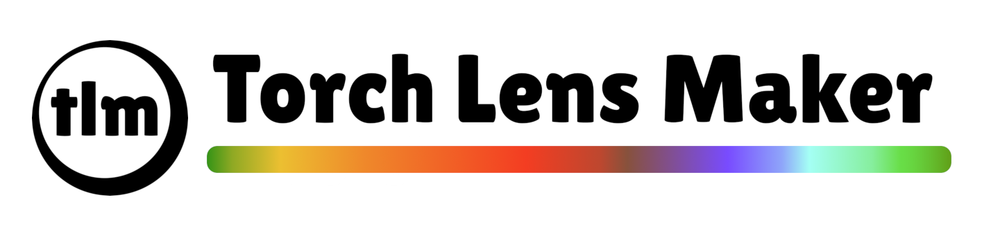

Welcome to **Torch Lens Maker**, an open-source Python library for designing
optical systems using optimization. Currently an experimental project, the goal
is to be able to design complex real-world optical systems (lenses, mirrors,
etc.) using modern and expressive computer code.
