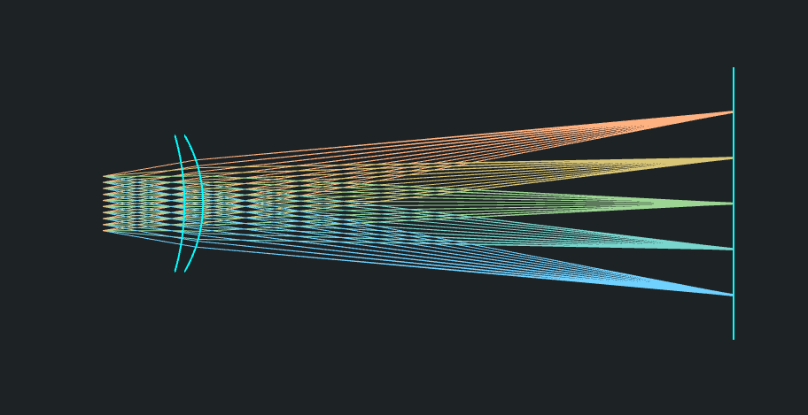

[](https://github.com/victorpoughon/torchlensmaker)


Welcome to **Torch Lens Maker**, an open-source Python library for
differentiable geometric optics based on [PyTorch](https://pytorch.org/).
Currently a very experimental project, the goal is to be able to design complex
real-world optical systems (lenses, mirrors, etc.) using modern computer code
and state-of-the art numerical optimization.

```python
import torchlensmaker as tlm

optics = tlm.Sequential(
    tlm.ObjectAtInfinity(beam_diameter=10, angular_size=20),
    tlm.Wavelength(400, 800),
    tlm.Gap(15),
    tlm.RefractiveSurface(tlm.Sphere(diameter=25, R=-45.759), material="BK7"),
    tlm.Gap(3.419),
    tlm.RefractiveSurface(tlm.Sphere(diameter=25, R=-24.887), material="air"),
    tlm.Gap(97.5088),
    tlm.ImagePlane(50),
)

tlm.show2d(optics)
```



The core of the project is *differentiable geometric optics*: 3D collision
detection and the laws of optics implemented in [PyTorch](https://pytorch.org/).
PyTorch provides world-class automatic differentiation, and access to
state-of-the-art numerical optimization algorithms with GPU support.

The key idea is that there is a strong analogy to be made between layers of a
neural network, and optical elements in a so-called *sequential optical system*.
If we have a compound optical system made of a series of lenses, mirrors, etc.,
we can pretend that each optical element is the layer of a neural network. The
data flowing through this network are not images, sounds, or text, but rays of
light! Each layer affects light rays depending on its internal parameters
(surface shape, refractive material...) and following the very much non-linear
Snell's law. Inference, or the forward model, is the optical simulation where
given some input light, we compute the system's output light. Training, or
optimization, is finding the best shapes for lenses to focus light where we want&nbsp;it.


|                   |          **Neural Network**          |        **Optical system**         |
| ----------------: | :----------------------------------: | :-------------------------------: |
|          **Data** |         Images, Text, Audio          |            Light rays             |
|        **Layers** |         Conv2d, Linear, ReLU         |    Refraction, Reflection, Gap    |
| **Loss Function** | Prediction error to labeled examples | Focusing error in the image plane |


The magic is that we can pretty much use `torch.nn` and `nn.Module` directly,
stacking lenses and mirrors as if they were `Conv2d` and `ReLU`. Then, pass the
whole thing through a standard PyTorch `optimize()` to find the optimal values
for parametric surfaces, and designing lenses is surprisingly like training a
neural network! Once this is implemented, you get 'for free' the massive power
of modern open-source machine learning tooling: automatic differentiation,
optimization algorithms, composability, GPU training, distributed training, and
more.

On top of that, after having tried software like
[build123](https://build123d.readthedocs.io/en/latest/) and
[OpenSCAD](https://openscad.org/), I strongly believe that writing code is a very
powerful way to design mechanical 3D systems and this project is an exploration
of that, but for optical systems.

> [!WARNING]
> This project is in its very early stages, I've got a [very long roadmap]() planned and I'm [looking for funding]() to be able to keep working on it full time! If you can, please consider donating, sponsoring or even hiring me! 😊💚
> 
> Also, the API **will** change without warning. A stable release is still very far in the future.

## Features

Design principles and features (SOME OF THESE ARE WORK IN PROGRESS):

* **Geometric optics**: Light rays are straight lines in absolute space. If they
  hit a surface, they can reflect, refract or stop.
* **No approximations**: Perfect geometric accuracy up to floating point
  precision (currently f32 or f64).
* **Sequential mode**: The order in which rays interact with optical elements
  must be known. This constraint is heavily mitigated by the fact that the
  entire optical model is a pure Python program, and the PyTorch compute graph
  is dynamic, so parameterization is very powerful.
* **Beautiful code**: Torch Lens Maker is code based optical CAD software. The
  design of a software library should aim to make code easy to read, not easy to
  write. So great care is being taken to make the API as beautiful as possible.
* **Dimension generic code**: Modeling is generic over the number of dimensions
  (2 or 3). It is only when sampling the system that dimension is fixed. This
  bridges the gap between 2D ray diagrams and full 3D raytracing with the same
  code. (Non axially symmetric systems can still be modeled, but then 2D
  raytracing isn't available).
* **Flexible surface definition framework**. Any surface definition can be
  easily added in explicit or implicit form: 2D or 3D, axially symmetric or not.
* **Export 3D models for manufacturing** Using
  [build123d](https://build123d.readthedocs.io/en/latest/), lens models can be
  exported to 3D manufacturing formats (STEP, STL, etc.)
* **Forward and inverse kinematics**: Optical elements positions in world space
  are defined on a kinematic tree. This enables joint optimization of surface
  shapes, positions and rotations, effectively acting as an inverse kinematics
  solver.
* **Web viewer**: [tlmviewer](https://github.com/victorpoughon/tlmviewer) is a
  3D viewer component for Torch Lens Maker. It is a TypeScript project based on
  ThreeJS and is developed side-by-side with the python package.

For more discussion of these features, see the documentation. TODO link

## Examples

For more, check out examples at the documentation: TODO link here

## Installation

```sh
pip install torchlensmaker
```

For more installation info, including how to setup tlmviewer, see the documentation. `TODO add link`.

## About

The origin of this project is double:

### I wanted to learn Optics

I have been teaching myself optics, and I've been sometimes frustrated by
approximations and general lack of rigor in the way the field is being taught.
As someone with a strong software background, but a total noob in optics,
approximations like sin(x) = x seem to make sense if you're Isaac Newton
designing a telescope with pen and paper in the 17th century, but today I think
non linear optimization has gotten so remarkably powerful that we should start
there. Teaching optics with ideal equations like 1/u + 1/v = 1/f or the lens
maker equation that are never true in real life is in my opinion misleading. At
least to me it was super confusing until I let go of it and embraced the non
linearity of Snell's law! In my opinion, those equations should be presented as
the over-simplified approximate but historically useful model that they are, not
as Chapter 1 of how lenses work. It's not! Spherical aberration is not part of
physics, it's part of engineering. It's a consequence of solving a non linear
system too approximately!

Also, I strongly believe that you only truly understand something once
you've programmed a computer to do it. I am fascinated by optics, and _Torch
Lens Maker_ is a learning project for me. Every time I add a new feature it
deepens my understanding of the physics of it. For example, what is an image? I
know what an image is for a computer, it's a 2D grid of pixel data... right?
Yeah sure, but in optics it's totally different! I have not yet found an optics
textbook that satisfyingly defines what an image is. The best I got was in a Khan
Academy video where it was said "an image is where rays of light converge".
Still, I think it's more subtle than that (sometimes they don't converge, and
still an image is formed)!

### Recurse Center

In Winter 2024, I attended the [Recurse Center](https://www.recurse.com/), a
technical retreat for programmers. At the Recurse Center, you become a better
programmer by working at the edge of your abilities, learning generously and
working on your own projects. _Torch Lens Maker_ was my main project during my
batch, and I was able to work on it full time for 12 weeks, making great
progress and having great fun! Now that my batch has ended, I'm looking for a
way to keep working on it because I believe it has great potential. I don't want
all lenses in the future to be designed with 5 figures closed-source commercial
software, we can do better! Look at how machine learning enjoys state of the art
open-source tooling. Let's do the same for optics!

## Funding

I've been working on this project for a few months now on my own time. I'd love
to keep working on it as much as possible!

I am looking for sponsorship, contracting or donations to be able to keep
working on this project. If you are interested in sponsoring open-source
development of Torch Lens Maker, please reach out or make a donation! Thank
you!

* [Sponsor Torch Lens Maker on GitHub](https://github.com/sponsors/victorpoughon)
* [Buy me a coffee](https://buymeacoffee.com/victorpoughon)

You can also find personal contact info on [my website](https://victorpoughon.fr/).
