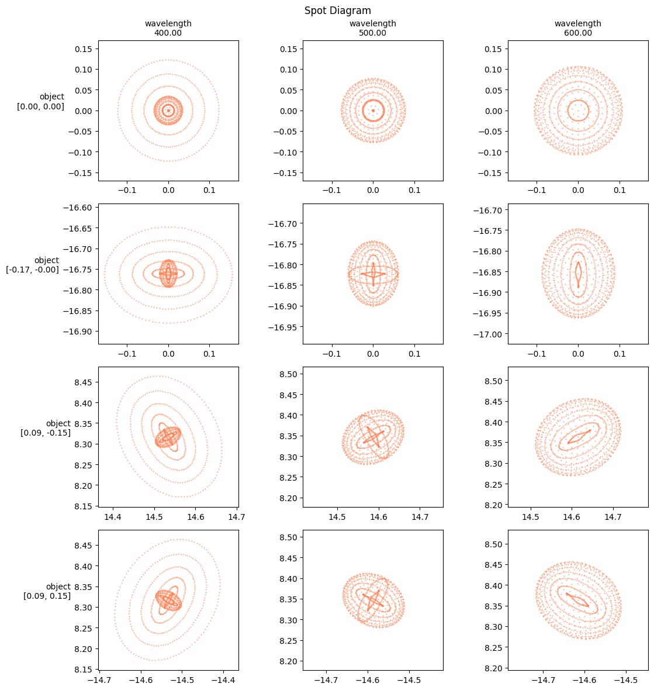

# Landscape lens


```python
import torchlensmaker as tlm

optics = tlm.Sequential(
    tlm.ObjectAtInfinity(beam_diameter=10, angular_size=20),
    tlm.Wavelength(400, 800),
    tlm.Gap(15),
    tlm.RefractiveSurface(tlm.Sphere(diameter=25, R=-45.759), material="BK7"),
    tlm.Gap(3.419),
    tlm.RefractiveSurface(tlm.Sphere(diameter=25, R=-24.887), material="air"),
    tlm.Gap(97.5088),
    tlm.ImagePlane(50),
)

tlm.show2d(optics, title="Landscape Lens")
```


<TLMViewer src="./landscape_tlmviewer/landscape_0.json" />


```python
tlm.show3d(optics, title="Landscape Lens")
```


<TLMViewer src="./landscape_tlmviewer/landscape_1.json" />


```python
f, _ = tlm.spot_diagram(optics, {"base":1000, "object": 4, "wavelength": [400, 500, 600]}, row="object", col="wavelength", figsize=(12, 12))
```


    

    


```python
f, _ = tlm.spot_diagram(optics, {"base": tlm.sampling.random_uniform(1000), "object": 4, "wavelength": [400, 500, 600]}, row="object", col="wavelength", figsize=(12, 12))
```


    

    

