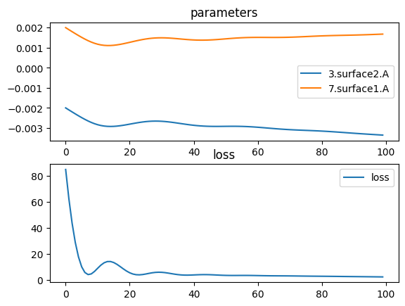

# Variable Lens Sequence

A configurable system with multiple lenses. We define three types of lenses:

* A plano convex lens
* A symmetric biconvex lens
* A convex plano lens, the same shape as the first lens, just reversed.

The number of lenses of each type are input parameters of the script, and the complete sequence is:

* X plano convex lenses
* Y biconvex convex lenses
* Z convex plano lenses


```python
import torch
import torch.nn as nn
import torch.optim as optim
import torchlensmaker as tlm

import math
import itertools
import numpy as np

### DESIGN ###

# Design parameters
square_size = 30
lens_diameter = math.sqrt(2)*square_size
focal_length = 35.

# Number of each lens type
nplano = 2
nbiconvex = 2
nrplano = 1

# Mechanical sizes
lens_min_thickness = 1.2
lens_spacing = 3.

### MODEL ###

# Parametric surfaces 
surface_plano = tlm.Parabola(lens_diameter, tlm.parameter(-0.002))
surface_biconvex = tlm.Parabola(lens_diameter, tlm.parameter(0.002))

# Lenses
lenses_plano = [tlm.PlanoLens(
    surface_plano,
    material="BK7-nd",
    outer_thickness = lens_min_thickness,
    reverse=False,
) for i in range(nplano)]

lenses_biconvex = [tlm.BiLens(
    surface_biconvex,
    material="BK7-nd",
    outer_thickness = lens_min_thickness,
) for i in range(nbiconvex)]

lenses_rplano = [tlm.PlanoLens(
    surface_plano,
    material="BK7-nd",
    outer_thickness = lens_min_thickness,
    reverse=True,
) for i in range(nrplano)]

optics = nn.Sequential(
    tlm.PointSourceAtInfinity(beam_diameter=0.9*lens_diameter),
    tlm.Gap(10.),
    
    *itertools.chain.from_iterable([[tlm.Gap(lens_spacing), lens] for lens in lenses_plano]),
    *itertools.chain.from_iterable([[tlm.Gap(lens_spacing), lens] for lens in lenses_biconvex]),
    *itertools.chain.from_iterable([[tlm.Gap(lens_spacing), lens] for lens in lenses_rplano]),
    
    tlm.Gap(focal_length),
    tlm.FocalPoint(),
)

# print(optics)

print("Lens design")
print("Square size", square_size)
print("Lens diameter", lens_diameter)
print("Configuration", nplano, nbiconvex, nrplano)
print("lens_min_thickness", lens_min_thickness)
print("lens_spacing", lens_spacing)

tlm.show(optics, dim=2)
tlm.show(optics, dim=3)
```

    Lens design
    Square size 30
    Lens diameter 42.42640687119285
    Configuration 2 2 1
    lens_min_thickness 1.2
    lens_spacing 3.0


<TLMViewer src="./variable_lens_sequence_tlmviewer/variable_lens_sequence_0.json" />


<TLMViewer src="./variable_lens_sequence_tlmviewer/variable_lens_sequence_1.json" />


```python
def regu_equalparam(_):
    a1 = surface_plano.a
    a2 = surface_biconvex.a
    return 500*torch.pow((500*a1)**2 - (500*a2)**2, 2)
    #params = torch.cat([param.view(-1) for param in optics.parameters()])
    #return torch.pow(torch.diff(1000*torch.abs(params)).sum(), 2)

def regu_equalthickness(_):
    t0 = lenses_plano[0].inner_thickness()
    t1 = lenses_biconvex[0].inner_thickness()
    return 100*torch.pow(t0 - t1, 2)

tlm.optimize(
    optics,
    optimizer = optim.Adam(optics.parameters(), lr=1e-4),
    sampling = {"base": 10},
    dim = 2,
    num_iter = 100,
    regularization = regu_equalthickness
).plot()

def print_lens(lens_name, lens):
    # TODO thickness at a specific radial distance
    print(lens_name)
    inner = lens.inner_thickness().item()
    outer = lens.outer_thickness().item()
    print(f"    inner: {inner:.3f} outer: {outer:.3f}")
    
    a1 = lens.surface1.surface.parameters()
    a2 = lens.surface2.surface.parameters()
    print("    surface1", [p.tolist() for p in a1.values()])
    print("    surface2", [p.tolist() for p in a2.values()])

print_lens("Plano-convex", lenses_plano[0])
print_lens("Bi-convex", lenses_biconvex[0])
print_lens("Reverse plano-convex", lenses_rplano[0])

```

    [  1/100] L= 84.721 | grad norm= 180027.30859716702
    [  6/100] L= 10.012 | grad norm= 48586.85753360243
    [ 11/100] L=  8.915 | grad norm= 45467.74241772557
    [ 16/100] L= 13.302 | grad norm= 62370.50388286968
    [ 21/100] L=  5.419 | grad norm= 25824.07799286678
    [ 26/100] L=  4.480 | grad norm= 15842.663121738253
    [ 31/100] L=  5.782 | grad norm= 28089.624034440483
    [ 36/100] L=  4.030 | grad norm= 11638.0559620909
    [ 41/100] L=  3.772 | grad norm= 9785.112736666892
    [ 46/100] L=  3.947 | grad norm= 14470.964210249063
    [ 51/100] L=  3.429 | grad norm= 4729.6565752732095
    [ 56/100] L=  3.399 | grad norm= 5939.238324531459
    [ 61/100] L=  3.278 | grad norm= 5355.6202899457285
    [ 66/100] L=  3.096 | grad norm= 2785.695079791156
    [ 71/100] L=  3.018 | grad norm= 5088.090779793749
    [ 76/100] L=  2.871 | grad norm= 2992.8820186164903
    [ 81/100] L=  2.756 | grad norm= 2519.2939043645542
    [ 86/100] L=  2.629 | grad norm= 2378.915438707358
    [ 91/100] L=  2.498 | grad norm= 2648.0570671543073
    [ 96/100] L=  2.369 | grad norm= 2893.2923444452654
    [100/100] L=  2.259 | grad norm= 2461.6447550702096


    

    


    Plano-convex
        inner: 2.714 outer: 1.200
        surface1 []
        surface2 [-0.0033651619031351706]
    Bi-convex
        inner: 2.716 outer: 1.200
        surface1 [0.0016848444901051824]
        surface2 [0.0016848444901051824]
    Reverse plano-convex
        inner: 2.714 outer: 1.200
        surface1 [-0.0033651619031351706]
        surface2 []


```python
tlm.show2d(optics)
tlm.show3d(optics)
```


<TLMViewer src="./variable_lens_sequence_tlmviewer/variable_lens_sequence_2.json" />


<TLMViewer src="./variable_lens_sequence_tlmviewer/variable_lens_sequence_3.json" />


```python
from IPython.display import display

tlm.show_part(tlm.export.lens_to_part(lenses_plano[0]))
tlm.show_part(tlm.export.lens_to_part(lenses_biconvex[0]))
```


<em>part display not supported in vitepress</em>


<em>part display not supported in vitepress</em>

