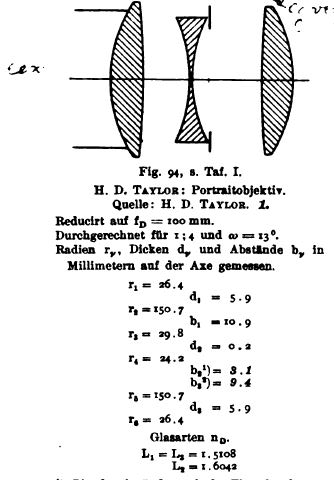
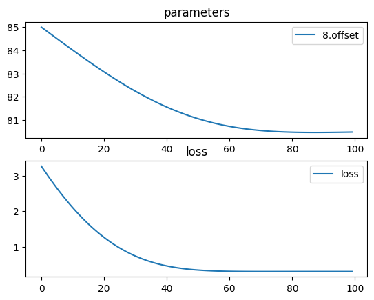

# Cooke triplet


screenshot from wikipedia:




```python
import torch
import torchlensmaker as tlm

d1, d2 = 30, 25

r1 = tlm.Sphere(d1, 26.4)
r2 = tlm.Sphere(d1, -150.7)
r3 = tlm.Sphere(d2, -29.8)
r4 = tlm.Sphere(d2, 24.2)
r5 = tlm.Sphere(d1, 150.7)
r6 = tlm.Sphere(d1, -26.4)

material1 = tlm.NonDispersiveMaterial(1.5108)
material2 = tlm.NonDispersiveMaterial(1.6042)

L1 = tlm.Lens(r1, r2, material=material1, inner_thickness=5.9)
L2 = tlm.Lens(r3, r4, material=material2, inner_thickness=0.2)
L3 = tlm.Lens(r5, r6, material=material1, inner_thickness=5.9)

focal = tlm.parameter(85)

optics = tlm.Sequential(
    tlm.ObjectAtInfinity(20, 30),
    L1,
    tlm.Gap(10.9),
    L2,
    tlm.Gap(3.1),
    tlm.Aperture(18),
    tlm.Gap(9.4),
    L3,
    tlm.Gap(focal),
    tlm.ImagePlane(50),
)

tlm.show(optics, dim=2)
```


<div data-jp-suppress-context-menu id='tlmviewer-bb13936c' class='tlmviewer' style='width: 100%; aspect-ratio: 16 / 9;'></div><script type='module'>async function importtlm() {
    try {
        return await import("/tlmviewer.js");
    } catch (error) {
        console.log("error", error);
        return await import("/files/test_notebooks/tlmviewer.js");
    }
}

const module = await importtlm();
const tlmviewer = module.tlmviewer;

const data = '{"mode": "2D", "camera": "XY", "data": [{"type": "surfaces", "data": [{"matrix": [[1.0, 0.0, 0.0], [0.0, 1.0, 0.0], [0.0, 0.0, 1.0]], "samples": [[4.67536354, 15.00000286], [4.58420753, 14.86711884], [4.49386597, 14.73367882], [4.40434074, 14.59969044], [4.31563377, 14.46515656], [4.22775078, 14.3300848], [4.14069366, 14.19447994], [4.05446625, 14.05834675], [3.96907043, 13.92168713], [3.88451004, 13.78451252], [3.80079079, 13.64682102], [3.71791077, 13.50862217], [3.63587761, 13.36992073], [3.55469322, 13.23072052], [3.4743576, 13.09102631], [3.39488029, 12.95084572], [3.31625557, 12.81018257], [3.23849487, 12.66904163], [3.16159439, 12.52742958], [3.08555984, 12.38534927], [3.01039505, 12.24280834], [2.93610191, 12.09981155], [2.86268234, 11.95636272], [2.79013824, 11.81247044], [2.71847534, 11.6681366], [2.64769554, 11.52336788], [2.57779884, 11.37817001], [2.50879097, 11.23254871], [2.44067192, 11.08650875], [2.37344933, 10.94005585], [2.30712128, 10.79320049], [2.24168777, 10.64593792], [2.17715645, 10.49827766], [2.11352539, 10.3502264], [2.05080223, 10.20179081], [1.98898315, 10.0529747], [1.92807579, 9.9037838], [1.86808014, 9.75422382], [1.80899811, 9.60429955], [1.7508316, 9.45401859], [1.69358253, 9.30338478], [1.63725662, 9.15240479], [1.58185196, 9.00108433], [1.52737236, 8.84942722], [1.47381973, 8.6974411], [1.42119408, 8.54513073], [1.36949921, 8.39250183], [1.31873894, 8.23956108], [1.26891327, 8.08631229], [1.2200222, 7.93276262], [1.17206955, 7.77891779], [1.12505722, 7.62478256], [1.07898712, 7.47036314], [1.03386116, 7.31566572], [0.98967743, 7.16069555], [0.94644356, 7.00545883], [0.90415573, 6.84996128], [0.86281967, 6.69420767], [0.82243347, 6.53820515], [0.78300095, 6.38195944], [0.744524, 6.22547531], [0.70700073, 6.06875944], [0.67043686, 5.91181755], [0.63483047, 5.75465536], [0.60018539, 5.59727859], [0.56649971, 5.43969393], [0.53377724, 5.28190565], [0.50201797, 5.12392092], [0.47122574, 4.96574545], [0.44139671, 4.80738497], [0.41253662, 4.6488452], [0.38464546, 4.49013233], [0.35772133, 4.3312521], [0.33176994, 4.17221069], [0.30678749, 4.01301384], [0.28277779, 3.85366702], [0.25974274, 3.69417691], [0.23768044, 3.53454924], [0.21659279, 3.37478971], [0.19648361, 3.21491075], [0.17734718, 3.05490589], [0.15918732, 2.89478707], [0.14200783, 2.73456025], [0.1258049, 2.57423186], [0.11058235, 2.41380739], [0.09633827, 2.25329304], [0.08307266, 2.09269476], [0.07078934, 1.9320184], [0.05948639, 1.77127016], [0.04916573, 1.61045575], [0.03982735, 1.4495815], [0.03146935, 1.28865325], [0.02409554, 1.12767696], [0.01770401, 0.96665859], [0.01229477, 0.80560422], [0.00786972, 0.64451987], [0.00442696, 0.48341146], [0.00196648, 0.32228509], [0.00049019, 0.1611467], [0.0, -2.31e-06], [0.00049019, -0.1611467], [0.00196648, -0.32228509], [0.00442696, -0.48341146], [0.00786972, -0.64451987], [0.01229477, -0.80560422], [0.01770401, -0.96665859], [0.02409554, -1.12767696], [0.03146935, -1.28865325], [0.03982735, -1.4495815], [0.04916573, -1.61045575], [0.05948639, -1.77127016], [0.07078934, -1.9320184], [0.08307266, -2.09269476], [0.09633827, -2.25329304], [0.11058235, -2.41380739], [0.1258049, -2.57423186], [0.14200783, -2.73456025], [0.15918732, -2.89478707], [0.17734718, -3.05490589], [0.19648361, -3.21491075], [0.21659279, -3.37478971], [0.23768044, -3.53454924], [0.25974274, -3.69417691], [0.28277779, -3.85366702], [0.30678749, -4.01301384], [0.33176994, -4.17221069], [0.35772133, -4.3312521], [0.38464546, -4.49013233], [0.41253662, -4.6488452], [0.44139671, -4.80738497], [0.47122574, -4.96574545], [0.50201797, -5.12392092], [0.53377724, -5.28190565], [0.56649971, -5.43969393], [0.60018539, -5.59727859], [0.63483047, -5.75465536], [0.67043686, -5.91181755], [0.70700073, -6.06875944], [0.744524, -6.22547531], [0.78300095, -6.38195944], [0.82243347, -6.53820515], [0.86281967, -6.69420767], [0.90415573, -6.84996128], [0.94644356, -7.00545883], [0.98967743, -7.16069555], [1.03386116, -7.31566572], [1.07898712, -7.47036314], [1.12505722, -7.62478256], [1.17206955, -7.77891779], [1.2200222, -7.93276262], [1.26891327, -8.08631229], [1.31873894, -8.23956108], [1.36949921, -8.39250183], [1.42119408, -8.54513073], [1.47381973, -8.6974411], [1.52737236, -8.84942722], [1.58185196, -9.00108433], [1.63725662, -9.15240479], [1.69358253, -9.30338478], [1.7508316, -9.45401859], [1.80899811, -9.60429955], [1.86808014, -9.75422382], [1.92807579, -9.9037838], [1.98898315, -10.0529747], [2.05080223, -10.20179081], [2.11352539, -10.3502264], [2.17715645, -10.49827766], [2.24168777, -10.64593792], [2.30712128, -10.79320049], [2.37344933, -10.94005585], [2.44067192, -11.08650875], [2.50879097, -11.23254871], [2.57779884, -11.37817001], [2.64769554, -11.52336788], [2.71847534, -11.6681366], [2.79013824, -11.81247044], [2.86268234, -11.95636272], [2.93610191, -12.09981155], [3.01039505, -12.24280834], [3.08555984, -12.38534927], [3.16159439, -12.52742958], [3.23849487, -12.66904163], [3.31625557, -12.81018257], [3.39488029, -12.95084572], [3.4743576, -13.09102631], [3.55469322, -13.23072052], [3.63587761, -13.36992073], [3.71791077, -13.50862217], [3.80079079, -13.64682102], [3.88451004, -13.78451252], [3.96907043, -13.92168713], [4.05446625, -14.05834675], [4.14069366, -14.19447994], [4.22775078, -14.3300848], [4.31563377, -14.46515656], [4.40434074, -14.59969044], [4.49386597, -14.73367882], [4.58420753, -14.86711884], [4.67536354, -15.00000286]]}]}, {"type": "surfaces", "data": [{"matrix": [[1.0, 0.0, 5.9], [0.0, 1.0, 0.0], [0.0, 0.0, 1.0]], "samples": [[-0.74838257, -15.0], [-0.7333374, -14.84897804], [-0.71847534, -14.69794369], [-0.70375061, -14.54689312], [-0.68916321, -14.3958292], [-0.67474365, -14.24474812], [-0.66047668, -14.09365463], [-0.6463623, -13.94254589], [-0.63240051, -13.79142475], [-0.61857605, -13.6402874], [-0.60491943, -13.4891367], [-0.59141541, -13.33797264], [-0.57804871, -13.18679428], [-0.56484985, -13.03560448], [-0.55180359, -12.88439941], [-0.53889465, -12.73318291], [-0.52615356, -12.58195114], [-0.51356506, -12.43070984], [-0.50111389, -12.27945423], [-0.48883057, -12.12818718], [-0.47668457, -11.97690582], [-0.46470642, -11.82561398], [-0.4528656, -11.67430878], [-0.44119263, -11.52299213], [-0.42965698, -11.371665], [-0.41828918, -11.22032452], [-0.40705872, -11.06897449], [-0.39599609, -10.91761112], [-0.3850708, -10.76624012], [-0.37431335, -10.61485481], [-0.36369324, -10.46345997], [-0.35324097, -10.31205463], [-0.34292603, -10.16063976], [-0.33276367, -10.00921249], [-0.32276917, -9.85777569], [-0.31291199, -9.7063303], [-0.3032074, -9.55487251], [-0.2936554, -9.40340805], [-0.28427124, -9.25193214], [-0.27503967, -9.1004467], [-0.26594543, -8.94895267], [-0.25700378, -8.79745007], [-0.24821472, -8.64593792], [-0.23959351, -8.49441624], [-0.23110962, -8.34288788], [-0.22279358, -8.19134998], [-0.21461487, -8.0398035], [-0.20658875, -7.8882494], [-0.19873047, -7.73668671], [-0.19100952, -7.58511639], [-0.18344116, -7.43353891], [-0.17604065, -7.28195286], [-0.16877747, -7.13036013], [-0.16168213, -6.97876024], [-0.15472412, -6.82715273], [-0.1479187, -6.67553902], [-0.14128113, -6.52391815], [-0.13479614, -6.37229061], [-0.12844849, -6.22065687], [-0.12225342, -6.06901693], [-0.1162262, -5.9173708], [-0.1103363, -5.76571798], [-0.10461426, -5.61405945], [-0.09902954, -5.46239519], [-0.09361267, -5.31072617], [-0.08833313, -5.15905094], [-0.08320618, -5.00737095], [-0.07824707, -4.85568619], [-0.07342529, -4.7039957], [-0.06877136, -4.55230141], [-0.06427002, -4.40060139], [-0.05990601, -4.24889755], [-0.05570984, -4.09718943], [-0.051651, -3.94547701], [-0.04776001, -3.79376054], [-0.04400635, -3.64204025], [-0.04042053, -3.49031615], [-0.0369873, -3.33858895], [-0.03370667, -3.18685818], [-0.03056335, -3.03512406], [-0.02758789, -2.88338685], [-0.02474976, -2.73164654], [-0.02209473, -2.5799036], [-0.01956177, -2.42815828], [-0.01719666, -2.27641034], [-0.01496887, -2.12465978], [-0.01292419, -1.97290754], [-0.01100159, -1.82115304], [-0.00924683, -1.66939688], [-0.00764465, -1.51763892], [-0.00619507, -1.36587942], [-0.00488281, -1.21411848], [-0.0037384, -1.06235635], [-0.00274658, -0.91059315], [-0.00190735, -0.75882906], [-0.0012207, -0.60706419], [-0.00068665, -0.45529866], [-0.00030518, -0.30353269], [-7.629e-05, -0.15176643], [0.0, 0.0], [-7.629e-05, 0.15176643], [-0.00030518, 0.30353269], [-0.00068665, 0.45529866], [-0.0012207, 0.60706419], [-0.00190735, 0.75882906], [-0.00274658, 0.91059315], [-0.0037384, 1.06235635], [-0.00488281, 1.21411848], [-0.00619507, 1.36587942], [-0.00764465, 1.51763892], [-0.00924683, 1.66939688], [-0.01100159, 1.82115304], [-0.01292419, 1.97290754], [-0.01496887, 2.12465978], [-0.01719666, 2.27641034], [-0.01956177, 2.42815828], [-0.02209473, 2.5799036], [-0.02474976, 2.73164654], [-0.02758789, 2.88338685], [-0.03056335, 3.03512406], [-0.03370667, 3.18685818], [-0.0369873, 3.33858895], [-0.04042053, 3.49031615], [-0.04400635, 3.64204025], [-0.04776001, 3.79376054], [-0.051651, 3.94547701], [-0.05570984, 4.09718943], [-0.05990601, 4.24889755], [-0.06427002, 4.40060139], [-0.06877136, 4.55230141], [-0.07342529, 4.7039957], [-0.07824707, 4.85568619], [-0.08320618, 5.00737095], [-0.08833313, 5.15905094], [-0.09361267, 5.31072617], [-0.09902954, 5.46239519], [-0.10461426, 5.61405945], [-0.1103363, 5.76571798], [-0.1162262, 5.9173708], [-0.12225342, 6.06901693], [-0.12844849, 6.22065687], [-0.13479614, 6.37229061], [-0.14128113, 6.52391815], [-0.1479187, 6.67553902], [-0.15472412, 6.82715273], [-0.16168213, 6.97876024], [-0.16877747, 7.13036013], [-0.17604065, 7.28195286], [-0.18344116, 7.43353891], [-0.19100952, 7.58511639], [-0.19873047, 7.73668671], [-0.20658875, 7.8882494], [-0.21461487, 8.0398035], [-0.22279358, 8.19134998], [-0.23110962, 8.34288788], [-0.23959351, 8.49441624], [-0.24821472, 8.64593792], [-0.25700378, 8.79745007], [-0.26594543, 8.94895267], [-0.27503967, 9.1004467], [-0.28427124, 9.25193214], [-0.2936554, 9.40340805], [-0.3032074, 9.55487251], [-0.31291199, 9.7063303], [-0.32276917, 9.85777569], [-0.33276367, 10.00921249], [-0.34292603, 10.16063976], [-0.35324097, 10.31205463], [-0.36369324, 10.46345997], [-0.37431335, 10.61485481], [-0.3850708, 10.76624012], [-0.39599609, 10.91761112], [-0.40705872, 11.06897449], [-0.41828918, 11.22032452], [-0.42965698, 11.371665], [-0.44119263, 11.52299213], [-0.4528656, 11.67430878], [-0.46470642, 11.82561398], [-0.47668457, 11.97690582], [-0.48883057, 12.12818718], [-0.50111389, 12.27945423], [-0.51356506, 12.43070984], [-0.52615356, 12.58195114], [-0.53889465, 12.73318291], [-0.55180359, 12.88439941], [-0.56484985, 13.03560448], [-0.57804871, 13.18679428], [-0.59141541, 13.33797264], [-0.60491943, 13.4891367], [-0.61857605, 13.6402874], [-0.63240051, 13.79142475], [-0.6463623, 13.94254589], [-0.66047668, 14.09365463], [-0.67474365, 14.24474812], [-0.68916321, 14.3958292], [-0.70375061, 14.54689312], [-0.71847534, 14.69794369], [-0.7333374, 14.84897804], [-0.74838257, 15.0]]}]}, {"type": "surfaces", "data": [{"matrix": [[1.0, 0.0, 16.8], [0.0, 1.0, 0.0], [0.0, 0.0, 1.0]], "samples": [[-2.74838448, -12.5], [-2.6939888, -12.38160419], [-2.64011192, -12.26297188], [-2.58675385, -12.14410496], [-2.53391838, -12.02500534], [-2.48160172, -11.90567684], [-2.42980766, -11.78612041], [-2.37854004, -11.66633797], [-2.32779312, -11.54633331], [-2.27757263, -11.42610836], [-2.22787666, -11.30566406], [-2.17870903, -11.18500328], [-2.13006973, -11.06412888], [-2.08195877, -10.94304466], [-2.03437805, -10.82174873], [-1.98732948, -10.70024776], [-1.94080925, -10.57854176], [-1.89482307, -10.45663261], [-1.84937286, -10.33452511], [-1.8044548, -10.21221924], [-1.7600708, -10.08971882], [-1.71622467, -9.9670248], [-1.67291451, -9.84414005], [-1.63014221, -9.72106647], [-1.5879097, -9.59780884], [-1.54621315, -9.47436619], [-1.5050602, -9.35074329], [-1.46444702, -9.22694206], [-1.42437553, -9.10296345], [-1.38484573, -8.97881126], [-1.34585953, -8.85448647], [-1.30741882, -8.72999382], [-1.26952171, -8.60533428], [-1.2321701, -8.48050976], [-1.19536209, -8.35552311], [-1.1591053, -8.2303772], [-1.12339211, -8.10507298], [-1.08822823, -7.97961378], [-1.05361557, -7.85400343], [-1.01955032, -7.72824192], [-0.9860363, -7.60233259], [-0.9530735, -7.47627878], [-0.92066002, -7.35008097], [-0.88879776, -7.22374296], [-0.85749054, -7.09726715], [-0.82673645, -6.97065544], [-0.79653549, -6.84391069], [-0.76689148, -6.71703482], [-0.7378006, -6.59003067], [-0.70926285, -6.46290064], [-0.68128395, -6.33564711], [-0.653862, -6.20827198], [-0.62699699, -6.08077908], [-0.60068893, -5.95316887], [-0.57493973, -5.82544613], [-0.54974937, -5.69761086], [-0.52511597, -5.56966686], [-0.50104523, -5.44161701], [-0.47753334, -5.31346273], [-0.45458031, -5.18520689], [-0.43218994, -5.05685186], [-0.41036224, -4.92840052], [-0.3890934, -4.7998538], [-0.36838913, -4.67121696], [-0.34824753, -4.54248953], [-0.32866859, -4.41367626], [-0.30965233, -4.28477764], [-0.29119873, -4.15579748], [-0.27330971, -4.02673864], [-0.25598717, -3.8976016], [-0.23922729, -3.76839113], [-0.22303391, -3.63910794], [-0.20740509, -3.50975561], [-0.19234276, -3.38033581], [-0.17784691, -3.25085139], [-0.16391563, -3.12130499], [-0.15055275, -2.99169898], [-0.13775635, -2.86203551], [-0.12552452, -2.73231769], [-0.11386299, -2.60254765], [-0.10276794, -2.47272754], [-0.09224129, -2.34286022], [-0.08227921, -2.21294832], [-0.07288933, -2.08299398], [-0.06406593, -1.95299959], [-0.05581093, -1.82296813], [-0.04812431, -1.69290185], [-0.041008, -1.56280303], [-0.03445816, -1.43267441], [-0.02848053, -1.30251861], [-0.02306938, -1.17233765], [-0.01822662, -1.0421344], [-0.01395607, -0.91191113], [-0.01025391, -0.78167051], [-0.00712013, -0.65141493], [-0.00455856, -0.52114683], [-0.00256348, -0.39086887], [-0.00113869, -0.2605834], [-0.00028419, -0.13029294], [0.0, 0.0], [-0.00028419, 0.13029294], [-0.00113869, 0.2605834], [-0.00256348, 0.39086887], [-0.00455856, 0.52114683], [-0.00712013, 0.65141493], [-0.01025391, 0.78167051], [-0.01395607, 0.91191113], [-0.01822662, 1.0421344], [-0.02306938, 1.17233765], [-0.02848053, 1.30251861], [-0.03445816, 1.43267441], [-0.041008, 1.56280303], [-0.04812431, 1.69290185], [-0.05581093, 1.82296813], [-0.06406593, 1.95299959], [-0.07288933, 2.08299398], [-0.08227921, 2.21294832], [-0.09224129, 2.34286022], [-0.10276794, 2.47272754], [-0.11386299, 2.60254765], [-0.12552452, 2.73231769], [-0.13775635, 2.86203551], [-0.15055275, 2.99169898], [-0.16391563, 3.12130499], [-0.17784691, 3.25085139], [-0.19234276, 3.38033581], [-0.20740509, 3.50975561], [-0.22303391, 3.63910794], [-0.23922729, 3.76839113], [-0.25598717, 3.8976016], [-0.27330971, 4.02673864], [-0.29119873, 4.15579748], [-0.30965233, 4.28477764], [-0.32866859, 4.41367626], [-0.34824753, 4.54248953], [-0.36838913, 4.67121696], [-0.3890934, 4.7998538], [-0.41036224, 4.92840052], [-0.43218994, 5.05685186], [-0.45458031, 5.18520689], [-0.47753334, 5.31346273], [-0.50104523, 5.44161701], [-0.52511597, 5.56966686], [-0.54974937, 5.69761086], [-0.57493973, 5.82544613], [-0.60068893, 5.95316887], [-0.62699699, 6.08077908], [-0.653862, 6.20827198], [-0.68128395, 6.33564711], [-0.70926285, 6.46290064], [-0.7378006, 6.59003067], [-0.76689148, 6.71703482], [-0.79653549, 6.84391069], [-0.82673645, 6.97065544], [-0.85749054, 7.09726715], [-0.88879776, 7.22374296], [-0.92066002, 7.35008097], [-0.9530735, 7.47627878], [-0.9860363, 7.60233259], [-1.01955032, 7.72824192], [-1.05361557, 7.85400343], [-1.08822823, 7.97961378], [-1.12339211, 8.10507298], [-1.1591053, 8.2303772], [-1.19536209, 8.35552311], [-1.2321701, 8.48050976], [-1.26952171, 8.60533428], [-1.30741882, 8.72999382], [-1.34585953, 8.85448647], [-1.38484573, 8.97881126], [-1.42437553, 9.10296345], [-1.46444702, 9.22694206], [-1.5050602, 9.35074329], [-1.54621315, 9.47436619], [-1.5879097, 9.59780884], [-1.63014221, 9.72106647], [-1.67291451, 9.84414005], [-1.71622467, 9.9670248], [-1.7600708, 10.08971882], [-1.8044548, 10.21221924], [-1.84937286, 10.33452511], [-1.89482307, 10.45663261], [-1.94080925, 10.57854176], [-1.98732948, 10.70024776], [-2.03437805, 10.82174873], [-2.08195877, 10.94304466], [-2.13006973, 11.06412888], [-2.17870903, 11.18500328], [-2.22787666, 11.30566406], [-2.27757263, 11.42610836], [-2.32779312, 11.54633331], [-2.37854004, 11.66633797], [-2.42980766, 11.78612041], [-2.48160172, 11.90567684], [-2.53391838, 12.02500534], [-2.58675385, 12.14410496], [-2.64011192, 12.26297188], [-2.6939888, 12.38160419], [-2.74838448, 12.5]]}]}, {"type": "surfaces", "data": [{"matrix": [[1.0, 0.0, 17.0], [0.0, 1.0, 0.0], [0.0, 0.0, 1.0]], "samples": [[3.4782753, 12.50000381], [3.41004944, 12.3862009], [3.342453, 12.27203083], [3.27548218, 12.15749168], [3.20914268, 12.04258728], [3.1434288, 11.92731571], [3.07835197, 11.81169033], [3.01390839, 11.69570637], [2.95010376, 11.57937431], [2.8869381, 11.46269512], [2.82441139, 11.3456707], [2.76252556, 11.22829914], [2.70128822, 11.11059666], [2.64069557, 10.99255943], [2.5807476, 10.87418747], [2.52145386, 10.75549316], [2.46281052, 10.63647556], [2.40481949, 10.51713371], [2.34748459, 10.39748001], [2.29080772, 10.27751446], [2.23478699, 10.15723419], [2.1794281, 10.03665447], [2.12473106, 9.91577244], [2.07069778, 9.79458714], [2.01732826, 9.67311287], [1.96462822, 9.55134773], [1.91259384, 9.42928982], [1.86123085, 9.30695438], [1.81053925, 9.18433857], [1.76052284, 9.06144714], [1.71117592, 8.9382782], [1.66250801, 8.81484509], [1.61451721, 8.69114208], [1.56720543, 8.56718445], [1.52057457, 8.44296741], [1.47462654, 8.3184967], [1.42935753, 8.19377136], [1.38477707, 8.06880474], [1.34088326, 7.94359589], [1.29767227, 7.81814241], [1.25515175, 7.69245958], [1.21332169, 7.56654549], [1.17218018, 7.44039822], [1.13173485, 7.31403351], [1.09197998, 7.1874485], [1.05291939, 7.06064177], [1.01455688, 6.93362856], [0.97689056, 6.8064065], [0.93992043, 6.67897415], [0.90365028, 6.55134726], [0.86808395, 6.42352295], [0.83321381, 6.29550076], [0.79904938, 6.16729355], [0.76558876, 6.03890228], [0.73283005, 5.91032314], [0.70077896, 5.78157234], [0.66943359, 5.6526475], [0.63879395, 5.52354717], [0.60886383, 5.39428616], [0.57964516, 5.26486349], [0.55113411, 5.13528252], [0.5233326, 5.00554085], [0.49624634, 4.87565517], [0.46986961, 4.74561691], [0.44420624, 4.6154418], [0.41925812, 4.48512745], [0.39502525, 4.35467863], [0.37150764, 4.22409344], [0.3487072, 4.09338665], [0.32662201, 3.96255708], [0.30525398, 3.83160257], [0.28460693, 3.7005384], [0.26467705, 3.56936288], [0.24546814, 3.43807483], [0.22697639, 3.30668879], [0.20920944, 3.17520356], [0.19215965, 3.04361725], [0.17583466, 2.91194487], [0.16023064, 2.78018498], [0.1453476, 2.64833617], [0.13118935, 2.51641297], [0.11775398, 2.38441443], [0.1050415, 2.25233841], [0.09305573, 2.1202004], [0.08179474, 1.98799884], [0.07125854, 1.85573733], [0.06144524, 1.7234143], [0.05235863, 1.59104514], [0.04399872, 1.4586283], [0.0363636, 1.32616186], [0.02945518, 1.19366121], [0.02327538, 1.06112468], [0.01782036, 0.92855054], [0.01309204, 0.79595435], [0.00909233, 0.66333413], [0.00581932, 0.53068817], [0.00327301, 0.39803207], [0.00145531, 0.26536399], [0.0003643, 0.13268216], [0.0, -2.12e-06], [0.0003643, -0.13268216], [0.00145531, -0.26536399], [0.00327301, -0.39803207], [0.00581932, -0.53068817], [0.00909233, -0.66333413], [0.01309204, -0.79595435], [0.01782036, -0.92855054], [0.02327538, -1.06112468], [0.02945518, -1.19366121], [0.0363636, -1.32616186], [0.04399872, -1.4586283], [0.05235863, -1.59104514], [0.06144524, -1.7234143], [0.07125854, -1.85573733], [0.08179474, -1.98799884], [0.09305573, -2.1202004], [0.1050415, -2.25233841], [0.11775398, -2.38441443], [0.13118935, -2.51641297], [0.1453476, -2.64833617], [0.16023064, -2.78018498], [0.17583466, -2.91194487], [0.19215965, -3.04361725], [0.20920944, -3.17520356], [0.22697639, -3.30668879], [0.24546814, -3.43807483], [0.26467705, -3.56936288], [0.28460693, -3.7005384], [0.30525398, -3.83160257], [0.32662201, -3.96255708], [0.3487072, -4.09338665], [0.37150764, -4.22409344], [0.39502525, -4.35467863], [0.41925812, -4.48512745], [0.44420624, -4.6154418], [0.46986961, -4.74561691], [0.49624634, -4.87565517], [0.5233326, -5.00554085], [0.55113411, -5.13528252], [0.57964516, -5.26486349], [0.60886383, -5.39428616], [0.63879395, -5.52354717], [0.66943359, -5.6526475], [0.70077896, -5.78157234], [0.73283005, -5.91032314], [0.76558876, -6.03890228], [0.79904938, -6.16729355], [0.83321381, -6.29550076], [0.86808395, -6.42352295], [0.90365028, -6.55134726], [0.93992043, -6.67897415], [0.97689056, -6.8064065], [1.01455688, -6.93362856], [1.05291939, -7.06064177], [1.09197998, -7.1874485], [1.13173485, -7.31403351], [1.17218018, -7.44039822], [1.21332169, -7.56654549], [1.25515175, -7.69245958], [1.29767227, -7.81814241], [1.34088326, -7.94359589], [1.38477707, -8.06880474], [1.42935753, -8.19377136], [1.47462654, -8.3184967], [1.52057457, -8.44296741], [1.56720543, -8.56718445], [1.61451721, -8.69114208], [1.66250801, -8.81484509], [1.71117592, -8.9382782], [1.76052284, -9.06144714], [1.81053925, -9.18433857], [1.86123085, -9.30695438], [1.91259384, -9.42928982], [1.96462822, -9.55134773], [2.01732826, -9.67311287], [2.07069778, -9.79458714], [2.12473106, -9.91577244], [2.1794281, -10.03665447], [2.23478699, -10.15723419], [2.29080772, -10.27751446], [2.34748459, -10.39748001], [2.40481949, -10.51713371], [2.46281052, -10.63647556], [2.52145386, -10.75549316], [2.5807476, -10.87418747], [2.64069557, -10.99255943], [2.70128822, -11.11059666], [2.76252556, -11.22829914], [2.82441139, -11.3456707], [2.8869381, -11.46269512], [2.95010376, -11.57937431], [3.01390839, -11.69570637], [3.07835197, -11.81169033], [3.1434288, -11.92731571], [3.20914268, -12.04258728], [3.27548218, -12.15749168], [3.342453, -12.27203083], [3.41004944, -12.3862009], [3.4782753, -12.50000381]]}]}, {"type": "surfaces", "data": [{"matrix": [[1.0, 0.0, 20.1], [0.0, 1.0, 0.0], [0.0, 0.0, 1.0]], "samples": [[0.0, -9.0], [0.0, -8.909091], [0.0, -8.81818199], [0.0, -8.72727299], [0.0, -8.63636398], [0.0, -8.54545498], [0.0, -8.45454502], [0.0, -8.36363602], [0.0, -8.27272701], [0.0, -8.18181801], [0.0, -8.090909], [0.0, -8.0], [0.0, -7.909091], [0.0, -7.81818199], [0.0, -7.72727251], [0.0, -7.63636351], [0.0, -7.5454545], [0.0, -7.4545455], [0.0, -7.36363649], [0.0, -7.27272701], [0.0, -7.18181801], [0.0, -7.090909], [0.0, -7.0], [0.0, -6.909091], [0.0, -6.81818199], [0.0, -6.72727251], [0.0, -6.63636351], [0.0, -6.5454545], [0.0, -6.4545455], [0.0, -6.36363649], [0.0, -6.27272701], [0.0, -6.18181801], [0.0, -6.090909], [0.0, -6.0], [0.0, -5.909091], [0.0, -5.81818151], [0.0, -5.72727251], [0.0, -5.63636351], [0.0, -5.5454545], [0.0, -5.4545455], [0.0, -5.36363602], [0.0, -5.27272701], [0.0, -5.18181801], [0.0, -5.090909], [0.0, -5.0], [0.0, -4.909091], [0.0, -4.81818151], [0.0, -4.72727251], [0.0, -4.63636351], [0.0, -4.5454545], [0.0, -4.4545455], [0.0, -4.36363649], [0.0, -4.27272749], [0.0, -4.18181849], [0.0, -4.090909], [0.0, -4.0], [0.0, -3.909091], [0.0, -3.81818199], [0.0, -3.72727275], [0.0, -3.63636374], [0.0, -3.54545474], [0.0, -3.4545455], [0.0, -3.36363649], [0.0, -3.27272749], [0.0, -3.18181825], [0.0, -3.09090924], [0.0, -3.0], [0.0, -2.909091], [0.0, -2.81818199], [0.0, -2.72727275], [0.0, -2.63636374], [0.0, -2.5454545], [0.0, -2.4545455], [0.0, -2.36363649], [0.0, -2.27272725], [0.0, -2.18181825], [0.0, -2.09090924], [0.0, -2.0], [0.0, -1.909091], [0.0, -1.81818187], [0.0, -1.72727275], [0.0, -1.63636374], [0.0, -1.54545462], [0.0, -1.4545455], [0.0, -1.36363637], [0.0, -1.27272725], [0.0, -1.18181825], [0.0, -1.09090912], [0.0, -1.0], [0.0, -0.90909094], [0.0, -0.81818187], [0.0, -0.72727275], [0.0, -0.63636363], [0.0, -0.54545456], [0.0, -0.45454547], [0.0, -0.36363637], [0.0, -0.27272728], [0.0, -0.18181819], [0.0, -0.09090909], [0.0, 0.0], [0.0, 0.09090909], [0.0, 0.18181819], [0.0, 0.27272728], [0.0, 0.36363637], [0.0, 0.45454547], [0.0, 0.54545456], [0.0, 0.63636363], [0.0, 0.72727275], [0.0, 0.81818187], [0.0, 0.90909094], [0.0, 1.0], [0.0, 1.09090912], [0.0, 1.18181825], [0.0, 1.27272725], [0.0, 1.36363637], [0.0, 1.4545455], [0.0, 1.54545462], [0.0, 1.63636374], [0.0, 1.72727275], [0.0, 1.81818187], [0.0, 1.909091], [0.0, 2.0], [0.0, 2.09090924], [0.0, 2.18181825], [0.0, 2.27272725], [0.0, 2.36363649], [0.0, 2.4545455], [0.0, 2.5454545], [0.0, 2.63636374], [0.0, 2.72727275], [0.0, 2.81818199], [0.0, 2.909091], [0.0, 3.0], [0.0, 3.09090924], [0.0, 3.18181825], [0.0, 3.27272749], [0.0, 3.36363649], [0.0, 3.4545455], [0.0, 3.54545474], [0.0, 3.63636374], [0.0, 3.72727275], [0.0, 3.81818199], [0.0, 3.909091], [0.0, 4.0], [0.0, 4.090909], [0.0, 4.18181849], [0.0, 4.27272749], [0.0, 4.36363649], [0.0, 4.4545455], [0.0, 4.5454545], [0.0, 4.63636351], [0.0, 4.72727251], [0.0, 4.81818151], [0.0, 4.909091], [0.0, 5.0], [0.0, 5.090909], [0.0, 5.18181801], [0.0, 5.27272701], [0.0, 5.36363602], [0.0, 5.4545455], [0.0, 5.5454545], [0.0, 5.63636351], [0.0, 5.72727251], [0.0, 5.81818151], [0.0, 5.909091], [0.0, 6.0], [0.0, 6.090909], [0.0, 6.18181801], [0.0, 6.27272701], [0.0, 6.36363649], [0.0, 6.4545455], [0.0, 6.5454545], [0.0, 6.63636351], [0.0, 6.72727251], [0.0, 6.81818199], [0.0, 6.909091], [0.0, 7.0], [0.0, 7.090909], [0.0, 7.18181801], [0.0, 7.27272701], [0.0, 7.36363649], [0.0, 7.4545455], [0.0, 7.5454545], [0.0, 7.63636351], [0.0, 7.72727251], [0.0, 7.81818199], [0.0, 7.909091], [0.0, 8.0], [0.0, 8.090909], [0.0, 8.18181801], [0.0, 8.27272701], [0.0, 8.36363602], [0.0, 8.45454502], [0.0, 8.54545498], [0.0, 8.63636398], [0.0, 8.72727299], [0.0, 8.81818199], [0.0, 8.909091], [0.0, 9.0]]}]}, {"type": "surfaces", "data": [{"matrix": [[1.0, 0.0, 29.5], [0.0, 1.0, 0.0], [0.0, 0.0, 1.0]], "samples": [[0.74838257, 15.0000267], [0.73335266, 14.84900665], [0.71847534, 14.69797039], [0.70375061, 14.54691982], [0.68916321, 14.395854], [0.67474365, 14.24477386], [0.66047668, 14.09367943], [0.6463623, 13.94257069], [0.63240051, 13.79144669], [0.61857605, 13.64030933], [0.60491943, 13.48915958], [0.59141541, 13.33799553], [0.57804871, 13.18681622], [0.56484985, 13.03562546], [0.55180359, 12.88442039], [0.53889465, 12.73320198], [0.52615356, 12.58197212], [0.51356506, 12.43072796], [0.50111389, 12.27947235], [0.48883057, 12.12820339], [0.47668457, 11.97692299], [0.46470642, 11.82563114], [0.4528656, 11.67432499], [0.44119263, 11.52300835], [0.42967224, 11.37167931], [0.41828918, 11.22034073], [0.40705872, 11.0689888], [0.39599609, 10.91762638], [0.3850708, 10.76625156], [0.37431335, 10.61486816], [0.36369324, 10.46347237], [0.35324097, 10.31206608], [0.34292603, 10.1606493], [0.33276367, 10.00922298], [0.32276917, 9.85778618], [0.31291199, 9.70633984], [0.3032074, 9.554883], [0.2936554, 9.40341663], [0.28427124, 9.25193977], [0.27503967, 9.10045528], [0.26594543, 8.9489603], [0.25700378, 8.79745674], [0.24821472, 8.64594364], [0.23959351, 8.49442291], [0.23112488, 8.34289265], [0.22279358, 8.19135475], [0.21461487, 8.03980732], [0.20658875, 7.88825274], [0.19873047, 7.73669004], [0.19100952, 7.58511925], [0.18344116, 7.43354082], [0.17604065, 7.28195477], [0.16877747, 7.13036156], [0.16168213, 6.97876072], [0.15472412, 6.82715321], [0.1479187, 6.67553854], [0.14128113, 6.52391768], [0.13479614, 6.37228918], [0.12844849, 6.22065449], [0.12225342, 6.06901407], [0.1162262, 5.91736698], [0.1103363, 5.76571417], [0.10461426, 5.61405563], [0.09902954, 5.46239138], [0.09361267, 5.31072092], [0.08833313, 5.15908194], [0.08320618, 5.00740099], [0.07824707, 4.85571527], [0.07342529, 4.70402479], [0.06877136, 4.55232954], [0.06427002, 4.40062952], [0.05990601, 4.24892521], [0.05570984, 4.09721613], [0.051651, 3.94550347], [0.04776001, 3.79378653], [0.04400635, 3.64206576], [0.04042053, 3.49034119], [0.0369873, 3.33861327], [0.03370667, 3.18688202], [0.03056335, 3.03514719], [0.02758789, 2.8834095], [0.02474976, 2.73166895], [0.02209473, 2.57992554], [0.01956177, 2.42817974], [0.01719666, 2.27643108], [0.01498413, 2.12468028], [0.01292419, 1.97292733], [0.01100159, 1.82117248], [0.00924683, 1.66941571], [0.00764465, 1.51765716], [0.00619507, 1.36589718], [0.00488281, 1.21413577], [0.0037384, 1.06237316], [0.00274658, 0.91060942], [0.00190735, 0.75884479], [0.0012207, 0.60707939], [0.00068665, 0.45531338], [0.00030518, 0.30354691], [7.629e-05, 0.1517801], [0.0, -1.317e-05], [7.629e-05, -0.1517801], [0.00030518, -0.30354691], [0.00068665, -0.45531338], [0.0012207, -0.60707939], [0.00190735, -0.75884479], [0.00274658, -0.91060942], [0.0037384, -1.06237316], [0.00488281, -1.21413577], [0.00619507, -1.36589718], [0.00764465, -1.51765716], [0.00924683, -1.66941571], [0.01100159, -1.82117248], [0.01292419, -1.97292733], [0.01498413, -2.12468028], [0.01719666, -2.27643108], [0.01956177, -2.42817974], [0.02209473, -2.57992554], [0.02474976, -2.73166895], [0.02758789, -2.8834095], [0.03056335, -3.03514719], [0.03370667, -3.18688202], [0.0369873, -3.33861327], [0.04042053, -3.49034119], [0.04400635, -3.64206576], [0.04776001, -3.79378653], [0.051651, -3.94550347], [0.05570984, -4.09721613], [0.05990601, -4.24892521], [0.06427002, -4.40062952], [0.06877136, -4.55232954], [0.07342529, -4.70402479], [0.07824707, -4.85571527], [0.08320618, -5.00740099], [0.08833313, -5.15908194], [0.09361267, -5.31072092], [0.09902954, -5.46239138], [0.10461426, -5.61405563], [0.1103363, -5.76571417], [0.1162262, -5.91736698], [0.12225342, -6.06901407], [0.12844849, -6.22065449], [0.13479614, -6.37228918], [0.14128113, -6.52391768], [0.1479187, -6.67553854], [0.15472412, -6.82715321], [0.16168213, -6.97876072], [0.16877747, -7.13036156], [0.17604065, -7.28195477], [0.18344116, -7.43354082], [0.19100952, -7.58511925], [0.19873047, -7.73669004], [0.20658875, -7.88825274], [0.21461487, -8.03980732], [0.22279358, -8.19135475], [0.23112488, -8.34289265], [0.23959351, -8.49442291], [0.24821472, -8.64594364], [0.25700378, -8.79745674], [0.26594543, -8.9489603], [0.27503967, -9.10045528], [0.28427124, -9.25193977], [0.2936554, -9.40341663], [0.3032074, -9.554883], [0.31291199, -9.70633984], [0.32276917, -9.85778618], [0.33276367, -10.00922298], [0.34292603, -10.1606493], [0.35324097, -10.31206608], [0.36369324, -10.46347237], [0.37431335, -10.61486816], [0.3850708, -10.76625156], [0.39599609, -10.91762638], [0.40705872, -11.0689888], [0.41828918, -11.22034073], [0.42967224, -11.37167931], [0.44119263, -11.52300835], [0.4528656, -11.67432499], [0.46470642, -11.82563114], [0.47668457, -11.97692299], [0.48883057, -12.12820339], [0.50111389, -12.27947235], [0.51356506, -12.43072796], [0.52615356, -12.58197212], [0.53889465, -12.73320198], [0.55180359, -12.88442039], [0.56484985, -13.03562546], [0.57804871, -13.18681622], [0.59141541, -13.33799553], [0.60491943, -13.48915958], [0.61857605, -13.64030933], [0.63240051, -13.79144669], [0.6463623, -13.94257069], [0.66047668, -14.09367943], [0.67474365, -14.24477386], [0.68916321, -14.395854], [0.70375061, -14.54691982], [0.71847534, -14.69797039], [0.73335266, -14.84900665], [0.74838257, -15.0000267]]}]}, {"type": "surfaces", "data": [{"matrix": [[1.0, 0.0, 35.4], [0.0, 1.0, 0.0], [0.0, 0.0, 1.0]], "samples": [[-4.67535973, -15.0], [-4.58420563, -14.86711502], [-4.49386406, -14.73367596], [-4.40433884, -14.59968662], [-4.31563187, -14.46515369], [-4.22774887, -14.33008194], [-4.14069366, -14.19447899], [-4.05446434, -14.05834484], [-3.96906853, -13.92168617], [-3.88451004, -13.78450871], [-3.80078888, -13.64681911], [-3.71791077, -13.50862122], [-3.63587761, -13.36991787], [-3.55469131, -13.23071861], [-3.4743576, -13.09102535], [-3.39487839, -12.95084381], [-3.31625557, -12.81018066], [-3.23849297, -12.66904163], [-3.16159248, -12.52742767], [-3.08555984, -12.38534927], [-3.01039314, -12.24280834], [-2.93610191, -12.0998106], [-2.86268044, -11.95636272], [-2.79013824, -11.81246948], [-2.71847534, -11.66813564], [-2.64769554, -11.52336788], [-2.57779884, -11.37817001], [-2.50879097, -11.23254871], [-2.44067383, -11.08650875], [-2.37344933, -10.94005585], [-2.30711746, -10.79319572], [-2.24168587, -10.6459322], [-2.17715454, -10.4982729], [-2.11352348, -10.35022163], [-2.05079842, -10.20178509], [-1.98898125, -10.05296993], [-1.92807388, -9.90377903], [-1.86807632, -9.75421906], [-1.8089962, -9.60429478], [-1.7508297, -9.45401478], [-1.69358063, -9.30338097], [-1.63725471, -9.15240097], [-1.58185005, -9.00108051], [-1.52737045, -8.84942341], [-1.47381783, -8.69743729], [-1.42119217, -8.54512691], [-1.36949921, -8.39249897], [-1.31873894, -8.23955727], [-1.26891136, -8.08630943], [-1.22002029, -7.93275928], [-1.17206955, -7.77891445], [-1.12505722, -7.62477922], [-1.07898712, -7.47036028], [-1.03385925, -7.31566238], [-0.98967743, -7.16069317], [-0.94644356, -7.00545645], [-0.90415573, -6.8499589], [-0.86281967, -6.69420576], [-0.82243347, -6.53820324], [-0.78300095, -6.38195705], [-0.744524, -6.2254734], [-0.70700073, -6.06875801], [-0.67043686, -5.91181612], [-0.63483047, -5.75465393], [-0.60018539, -5.59727764], [-0.56649971, -5.4396925], [-0.53377724, -5.28190517], [-0.50201797, -5.12392044], [-0.47122574, -4.96574497], [-0.44139671, -4.80738497], [-0.41253662, -4.64884472], [-0.38464546, -4.49013233], [-0.35772133, -4.3312521], [-0.33176994, -4.17221069], [-0.30678749, -4.01301432], [-0.28277779, -3.8536675], [-0.25974274, -3.69417739], [-0.23768044, -3.53455019], [-0.21659279, -3.37479067], [-0.1964817, -3.21490574], [-0.17734718, -3.05490088], [-0.15918732, -2.89478207], [-0.14200783, -2.73455548], [-0.1258049, -2.57422733], [-0.11058044, -2.41380286], [-0.09633636, -2.25328875], [-0.08307266, -2.09269023], [-0.07078934, -1.93201423], [-0.05948639, -1.77126622], [-0.04916573, -1.61045206], [-0.03982735, -1.44957781], [-0.03146935, -1.28864968], [-0.02409554, -1.12767363], [-0.01770401, -0.96665531], [-0.01229477, -0.80560118], [-0.00786972, -0.644517], [-0.00442696, -0.48340875], [-0.00196648, -0.32228249], [-0.00049019, -0.16114426], [0.0, 0.0], [-0.00049019, 0.16114426], [-0.00196648, 0.32228249], [-0.00442696, 0.48340875], [-0.00786972, 0.644517], [-0.01229477, 0.80560118], [-0.01770401, 0.96665531], [-0.02409554, 1.12767363], [-0.03146935, 1.28864968], [-0.03982735, 1.44957781], [-0.04916573, 1.61045206], [-0.05948639, 1.77126622], [-0.07078934, 1.93201423], [-0.08307266, 2.09269023], [-0.09633636, 2.25328875], [-0.11058044, 2.41380286], [-0.1258049, 2.57422733], [-0.14200783, 2.73455548], [-0.15918732, 2.89478207], [-0.17734718, 3.05490088], [-0.1964817, 3.21490574], [-0.21659279, 3.37479067], [-0.23768044, 3.53455019], [-0.25974274, 3.69417739], [-0.28277779, 3.8536675], [-0.30678749, 4.01301432], [-0.33176994, 4.17221069], [-0.35772133, 4.3312521], [-0.38464546, 4.49013233], [-0.41253662, 4.64884472], [-0.44139671, 4.80738497], [-0.47122574, 4.96574497], [-0.50201797, 5.12392044], [-0.53377724, 5.28190517], [-0.56649971, 5.4396925], [-0.60018539, 5.59727764], [-0.63483047, 5.75465393], [-0.67043686, 5.91181612], [-0.70700073, 6.06875801], [-0.744524, 6.2254734], [-0.78300095, 6.38195705], [-0.82243347, 6.53820324], [-0.86281967, 6.69420576], [-0.90415573, 6.8499589], [-0.94644356, 7.00545645], [-0.98967743, 7.16069317], [-1.03385925, 7.31566238], [-1.07898712, 7.47036028], [-1.12505722, 7.62477922], [-1.17206955, 7.77891445], [-1.22002029, 7.93275928], [-1.26891136, 8.08630943], [-1.31873894, 8.23955727], [-1.36949921, 8.39249897], [-1.42119217, 8.54512691], [-1.47381783, 8.69743729], [-1.52737045, 8.84942341], [-1.58185005, 9.00108051], [-1.63725471, 9.15240097], [-1.69358063, 9.30338097], [-1.7508297, 9.45401478], [-1.8089962, 9.60429478], [-1.86807632, 9.75421906], [-1.92807388, 9.90377903], [-1.98898125, 10.05296993], [-2.05079842, 10.20178509], [-2.11352348, 10.35022163], [-2.17715454, 10.4982729], [-2.24168587, 10.6459322], [-2.30711746, 10.79319572], [-2.37344933, 10.94005585], [-2.44067383, 11.08650875], [-2.50879097, 11.23254871], [-2.57779884, 11.37817001], [-2.64769554, 11.52336788], [-2.71847534, 11.66813564], [-2.79013824, 11.81246948], [-2.86268044, 11.95636272], [-2.93610191, 12.0998106], [-3.01039314, 12.24280834], [-3.08555984, 12.38534927], [-3.16159248, 12.52742767], [-3.23849297, 12.66904163], [-3.31625557, 12.81018066], [-3.39487839, 12.95084381], [-3.4743576, 13.09102535], [-3.55469131, 13.23071861], [-3.63587761, 13.36991787], [-3.71791077, 13.50862122], [-3.80078888, 13.64681911], [-3.88451004, 13.78450871], [-3.96906853, 13.92168617], [-4.05446434, 14.05834484], [-4.14069366, 14.19447899], [-4.22774887, 14.33008194], [-4.31563187, 14.46515369], [-4.40433884, 14.59968662], [-4.49386406, 14.73367596], [-4.58420563, 14.86711502], [-4.67535973, 15.0]]}]}, {"type": "surfaces", "data": [{"matrix": [[1.0, 0.0, 120.4], [0.0, 1.0, 0.0], [0.0, 0.0, 1.0]], "samples": [[0.0, -25.0], [0.0, -24.74747467], [0.0, -24.49494934], [0.0, -24.24242401], [0.0, -23.98989868], [0.0, -23.73737335], [0.0, -23.48484802], [0.0, -23.23232269], [0.0, -22.97979736], [0.0, -22.72727203], [0.0, -22.4747467], [0.0, -22.22222328], [0.0, -21.96969795], [0.0, -21.71717262], [0.0, -21.46464729], [0.0, -21.21212196], [0.0, -20.95959663], [0.0, -20.7070713], [0.0, -20.45454597], [0.0, -20.20202065], [0.0, -19.94949532], [0.0, -19.69696999], [0.0, -19.44444466], [0.0, -19.19191933], [0.0, -18.939394], [0.0, -18.68686867], [0.0, -18.43434334], [0.0, -18.18181801], [0.0, -17.92929268], [0.0, -17.67676735], [0.0, -17.42424202], [0.0, -17.17171669], [0.0, -16.91919327], [0.0, -16.66666794], [0.0, -16.41414261], [0.0, -16.16161728], [0.0, -15.909091], [0.0, -15.65656567], [0.0, -15.40404129], [0.0, -15.15151596], [0.0, -14.89899063], [0.0, -14.6464653], [0.0, -14.39393997], [0.0, -14.14141464], [0.0, -13.88888931], [0.0, -13.63636398], [0.0, -13.38383865], [0.0, -13.13131332], [0.0, -12.87878799], [0.0, -12.62626362], [0.0, -12.37373638], [0.0, -12.12121201], [0.0, -11.86868668], [0.0, -11.61616135], [0.0, -11.36363602], [0.0, -11.11111069], [0.0, -10.85858536], [0.0, -10.60606003], [0.0, -10.3535347], [0.0, -10.10100937], [0.0, -9.84848404], [0.0, -9.59595871], [0.0, -9.34343433], [0.0, -9.090909], [0.0, -8.83838367], [0.0, -8.58585835], [0.0, -8.33333302], [0.0, -8.08080769], [0.0, -7.82828236], [0.0, -7.57575703], [0.0, -7.32323217], [0.0, -7.07070684], [0.0, -6.81818151], [0.0, -6.56565619], [0.0, -6.31313086], [0.0, -6.060606], [0.0, -5.80808067], [0.0, -5.55555534], [0.0, -5.30303001], [0.0, -5.05050468], [0.0, -4.79797935], [0.0, -4.5454545], [0.0, -4.29292917], [0.0, -4.04040384], [0.0, -3.78787851], [0.0, -3.53535342], [0.0, -3.28282809], [0.0, -3.030303], [0.0, -2.77777767], [0.0, -2.52525234], [0.0, -2.27272725], [0.0, -2.02020192], [0.0, -1.76767671], [0.0, -1.5151515], [0.0, -1.26262617], [0.0, -1.01010096], [0.0, -0.75757575], [0.0, -0.50505048], [0.0, -0.25252524], [0.0, 0.0], [0.0, 0.25252524], [0.0, 0.50505048], [0.0, 0.75757575], [0.0, 1.01010096], [0.0, 1.26262617], [0.0, 1.5151515], [0.0, 1.76767671], [0.0, 2.02020192], [0.0, 2.27272725], [0.0, 2.52525234], [0.0, 2.77777767], [0.0, 3.030303], [0.0, 3.28282809], [0.0, 3.53535342], [0.0, 3.78787851], [0.0, 4.04040384], [0.0, 4.29292917], [0.0, 4.5454545], [0.0, 4.79797935], [0.0, 5.05050468], [0.0, 5.30303001], [0.0, 5.55555534], [0.0, 5.80808067], [0.0, 6.060606], [0.0, 6.31313086], [0.0, 6.56565619], [0.0, 6.81818151], [0.0, 7.07070684], [0.0, 7.32323217], [0.0, 7.57575703], [0.0, 7.82828236], [0.0, 8.08080769], [0.0, 8.33333302], [0.0, 8.58585835], [0.0, 8.83838367], [0.0, 9.090909], [0.0, 9.34343433], [0.0, 9.59595871], [0.0, 9.84848404], [0.0, 10.10100937], [0.0, 10.3535347], [0.0, 10.60606003], [0.0, 10.85858536], [0.0, 11.11111069], [0.0, 11.36363602], [0.0, 11.61616135], [0.0, 11.86868668], [0.0, 12.12121201], [0.0, 12.37373638], [0.0, 12.62626362], [0.0, 12.87878799], [0.0, 13.13131332], [0.0, 13.38383865], [0.0, 13.63636398], [0.0, 13.88888931], [0.0, 14.14141464], [0.0, 14.39393997], [0.0, 14.6464653], [0.0, 14.89899063], [0.0, 15.15151596], [0.0, 15.40404129], [0.0, 15.65656567], [0.0, 15.909091], [0.0, 16.16161728], [0.0, 16.41414261], [0.0, 16.66666794], [0.0, 16.91919327], [0.0, 17.17171669], [0.0, 17.42424202], [0.0, 17.67676735], [0.0, 17.92929268], [0.0, 18.18181801], [0.0, 18.43434334], [0.0, 18.68686867], [0.0, 18.939394], [0.0, 19.19191933], [0.0, 19.44444466], [0.0, 19.69696999], [0.0, 19.94949532], [0.0, 20.20202065], [0.0, 20.45454597], [0.0, 20.7070713], [0.0, 20.95959663], [0.0, 21.21212196], [0.0, 21.46464729], [0.0, 21.71717262], [0.0, 21.96969795], [0.0, 22.22222328], [0.0, 22.4747467], [0.0, 22.72727203], [0.0, 22.97979736], [0.0, 23.23232269], [0.0, 23.48484802], [0.0, 23.73737335], [0.0, 23.98989868], [0.0, 24.24242401], [0.0, 24.49494934], [0.0, 24.74747467], [0.0, 25.0]]}]}, {"type": "rays", "points": [[0.0, -10.0, 2.21913754, -10.59461611], [0.0, -10.0, 2.08117845, -10.27399234], [0.0, -10.0, 1.96723511, -10.0], [0.0, -10.0, 1.86801872, -9.75407067], [0.0, -10.0, 1.77766109, -9.52367715], [0.0, -7.77777778, 1.28002234, -8.12075873], [0.0, -7.77777778, 1.22187488, -7.93864066], [0.0, -7.77777778, 1.17171879, -7.77777778], [0.0, -7.77777778, 1.126474, -7.62947466], [0.0, -7.77777778, 1.08399688, -7.48732169], [0.0, -5.55555556, 0.6279626, -5.72381763], [0.0, -5.55555556, 0.60854401, -5.63567189], [0.0, -5.55555556, 0.59116813, -5.55555556], [0.0, -5.55555556, 0.57498945, -5.47985676], [0.0, -5.55555556, 0.55936006, -5.40567548], [0.0, -3.33333333, 0.21881247, -3.39196396], [0.0, -3.33333333, 0.21489976, -3.36162542], [0.0, -3.33333333, 0.21128318, -3.33333333], [0.0, -3.33333333, 0.20781536, -3.30597392], [0.0, -3.33333333, 0.20437128, -3.27857221], [0.0, -1.11111111, 0.02366015, -1.11745083], [0.0, -1.11111111, 0.02352297, -1.11420797], [0.0, -1.11111111, 0.02339233, -1.11111111], [0.0, -1.11111111, 0.02326349, -1.10804841], [0.0, -1.11111111, 0.02313196, -1.10491292], [0.0, 1.11111111, 0.02313196, 1.10491292], [0.0, 1.11111111, 0.02326349, 1.10804841], [0.0, 1.11111111, 0.02339233, 1.11111111], [0.0, 1.11111111, 0.02352297, 1.11420797], [0.0, 1.11111111, 0.02366015, 1.11745083], [0.0, 3.33333333, 0.20437128, 3.27857221], [0.0, 3.33333333, 0.20781536, 3.30597392], [0.0, 3.33333333, 0.21128318, 3.33333333], [0.0, 3.33333333, 0.21489976, 3.36162542], [0.0, 3.33333333, 0.21881247, 3.39196396], [0.0, 5.55555556, 0.55936006, 5.40567548], [0.0, 5.55555556, 0.57498945, 5.47985676], [0.0, 5.55555556, 0.59116813, 5.55555556], [0.0, 5.55555556, 0.60854401, 5.63567189], [0.0, 5.55555556, 0.6279626, 5.72381763], [0.0, 7.77777778, 1.08399688, 7.48732169], [0.0, 7.77777778, 1.126474, 7.62947466], [0.0, 7.77777778, 1.17171879, 7.77777778], [0.0, 7.77777778, 1.22187488, 7.93864066], [0.0, 7.77777778, 1.28002234, 8.12075873], [0.0, 10.0, 1.77766109, 9.52367715], [0.0, 10.0, 1.86801872, 9.75407067], [0.0, 10.0, 1.96723511, 10.0], [0.0, 10.0, 2.08117845, 10.27399234], [0.0, 10.0, 2.21913754, 10.59461611]], "color": "#ffa724", "variables": {"base": [[-10.0], [-10.0], [-10.0], [-10.0], [-10.0], [-7.77777778], [-7.77777778], [-7.77777778], [-7.77777778], [-7.77777778], [-5.55555556], [-5.55555556], [-5.55555556], [-5.55555556], [-5.55555556], [-3.33333333], [-3.33333333], [-3.33333333], [-3.33333333], [-3.33333333], [-1.11111111], [-1.11111111], [-1.11111111], [-1.11111111], [-1.11111111], [1.11111111], [1.11111111], [1.11111111], [1.11111111], [1.11111111], [3.33333333], [3.33333333], [3.33333333], [3.33333333], [3.33333333], [5.55555556], [5.55555556], [5.55555556], [5.55555556], [5.55555556], [7.77777778], [7.77777778], [7.77777778], [7.77777778], [7.77777778], [10.0], [10.0], [10.0], [10.0], [10.0]], "object": [[-0.26179939], [-0.13089969], [0.0], [0.13089969], [0.26179939], [-0.26179939], [-0.13089969], [0.0], [0.13089969], [0.26179939], [-0.26179939], [-0.13089969], [0.0], [0.13089969], [0.26179939], [-0.26179939], [-0.13089969], [0.0], [0.13089969], [0.26179939], [-0.26179939], [-0.13089969], [0.0], [0.13089969], [0.26179939], [-0.26179939], [-0.13089969], [0.0], [0.13089969], [0.26179939], [-0.26179939], [-0.13089969], [0.0], [0.13089969], [0.26179939], [-0.26179939], [-0.13089969], [0.0], [0.13089969], [0.26179939], [-0.26179939], [-0.13089969], [0.0], [0.13089969], [0.26179939], [-0.26179939], [-0.13089969], [0.0], [0.13089969], [0.26179939]]}, "domain": {"base": [-10.0, 10.0], "object": [-0.26179939, 0.26179939]}, "layers": [1]}, {"type": "rays", "points": [[2.21913754, -10.59461611, 5.52398229, -10.63909526], [2.08117845, -10.27399234, 5.56306894, -10.07161852], [1.96723511, -10.0, 5.59984736, -9.50662479], [1.86801872, -9.75407067, 5.63521874, -8.92944351], [1.77766109, -9.52367715, 5.66972836, -8.32771568], [1.28002234, -8.12075873, 5.66772411, -8.36385085], [1.22187488, -7.93864066, 5.69588056, -7.84091422], [1.17171879, -7.77777778, 5.7226713, -7.30858571], [1.126474, -7.62947466, 5.74831721, -6.75974749], [1.08399688, -7.48732169, 5.77293963, -6.18707117], [0.6279626, -5.72381763, 5.77239141, -6.2003988], [0.60854401, -5.63567189, 5.79237083, -5.69454551], [0.59116813, -5.55555556, 5.81102316, -5.17780861], [0.57498945, -5.47985676, 5.82835563, -4.64634053], [0.55936006, -5.40567548, 5.84433911, -4.09549683], [0.21881247, -3.39196396, 5.84409084, -4.10461878], [0.21489976, -3.36162542, 5.85696569, -3.60120681], [0.21128318, -3.33333333, 5.8683081, -3.0904586], [0.20781536, -3.30597392, 5.87808634, -2.56988287], [0.20437128, -3.27857221, 5.88624144, -2.03633036], [0.02366015, -1.11745083, 5.88609639, -2.04703531], [0.02352297, -1.11420797, 5.89215227, -1.53793488], [0.02339233, -1.11111111, 5.89649695, -1.02752495], [0.02326349, -1.10804841, 5.89912449, -0.51369038], [0.02313196, -1.10491292, 5.89999988, 0.00592735], [0.02313196, 1.10491292, 5.89999988, -0.00592735], [0.02326349, 1.10804841, 5.89912449, 0.51369038], [0.02339233, 1.11111111, 5.89649695, 1.02752495], [0.02352297, 1.11420797, 5.89215227, 1.53793488], [0.02366015, 1.11745083, 5.88609639, 2.04703531], [0.20437128, 3.27857221, 5.88624144, 2.03633036], [0.20781536, 3.30597392, 5.87808634, 2.56988287], [0.21128318, 3.33333333, 5.8683081, 3.0904586], [0.21489976, 3.36162542, 5.85696569, 3.60120681], [0.21881247, 3.39196396, 5.84409084, 4.10461878], [0.55936006, 5.40567548, 5.84433911, 4.09549683], [0.57498945, 5.47985676, 5.82835563, 4.64634053], [0.59116813, 5.55555556, 5.81102316, 5.17780861], [0.60854401, 5.63567189, 5.79237083, 5.69454551], [0.6279626, 5.72381763, 5.77239141, 6.2003988], [1.08399688, 7.48732169, 5.77293963, 6.18707117], [1.126474, 7.62947466, 5.74831721, 6.75974749], [1.17171879, 7.77777778, 5.7226713, 7.30858571], [1.22187488, 7.93864066, 5.69588056, 7.84091422], [1.28002234, 8.12075873, 5.66772411, 8.36385085], [1.77766109, 9.52367715, 5.66972836, 8.32771568], [1.86801872, 9.75407067, 5.63521874, 8.92944351], [1.96723511, 10.0, 5.59984736, 9.50662479], [2.08117845, 10.27399234, 5.56306894, 10.07161852], [2.21913754, 10.59461611, 5.52398229, 10.63909526]], "color": "#ffa724", "variables": {"base": [[-10.0], [-10.0], [-10.0], [-10.0], [-10.0], [-7.77777778], [-7.77777778], [-7.77777778], [-7.77777778], [-7.77777778], [-5.55555556], [-5.55555556], [-5.55555556], [-5.55555556], [-5.55555556], [-3.33333333], [-3.33333333], [-3.33333333], [-3.33333333], [-3.33333333], [-1.11111111], [-1.11111111], [-1.11111111], [-1.11111111], [-1.11111111], [1.11111111], [1.11111111], [1.11111111], [1.11111111], [1.11111111], [3.33333333], [3.33333333], [3.33333333], [3.33333333], [3.33333333], [5.55555556], [5.55555556], [5.55555556], [5.55555556], [5.55555556], [7.77777778], [7.77777778], [7.77777778], [7.77777778], [7.77777778], [10.0], [10.0], [10.0], [10.0], [10.0]], "object": [[-0.26179939], [-0.13089969], [0.0], [0.13089969], [0.26179939], [-0.26179939], [-0.13089969], [0.0], [0.13089969], [0.26179939], [-0.26179939], [-0.13089969], [0.0], [0.13089969], [0.26179939], [-0.26179939], [-0.13089969], [0.0], [0.13089969], [0.26179939], [-0.26179939], [-0.13089969], [0.0], [0.13089969], [0.26179939], [-0.26179939], [-0.13089969], [0.0], [0.13089969], [0.26179939], [-0.26179939], [-0.13089969], [0.0], [0.13089969], [0.26179939], [-0.26179939], [-0.13089969], [0.0], [0.13089969], [0.26179939], [-0.26179939], [-0.13089969], [0.0], [0.13089969], [0.26179939], [-0.26179939], [-0.13089969], [0.0], [0.13089969], [0.26179939]]}, "domain": {"base": [-10.0, 10.0], "object": [-0.26179939, 0.26179939]}, "layers": [1]}, {"type": "rays", "points": [[5.52398229, -10.63909526, 14.8922363, -10.4910988], [5.56306894, -10.07161852, 15.45422063, -8.85422657], [5.59984736, -9.50662479, 15.9703203, -6.98287491], [5.63521874, -8.92944351, 16.40446017, -4.83918608], [5.66972836, -8.32771568, 16.7053298, -2.37347456], [5.66772411, -8.36385085, 15.43859807, -8.90427649], [5.69588056, -7.84091422, 15.90948925, -7.23058997], [5.7226713, -7.30858571, 16.31219074, -5.36986722], [5.74831721, -6.75974749, 16.61649686, -3.30198635], [5.77293963, -6.18707117, 16.78324395, -0.9991897], [5.77239141, -6.2003988, 15.86588431, -7.40275106], [5.79237083, -5.69454551, 16.25520663, -5.6721147], [5.81102316, -5.17780861, 16.55604511, -3.80528546], [5.82835563, -4.64634053, 16.74600746, -1.79305324], [5.84433911, -4.09549683, 16.79759839, 0.37832546], [5.84409084, -4.10461878, 16.19911788, -5.95411748], [5.85696569, -3.60120681, 16.50897453, -4.15456646], [5.8683081, -3.0904586, 16.7132886, -2.27166915], [5.87808634, -2.56988287, 16.79846405, -0.30255631], [5.88624144, -2.03633036, 16.74810012, 1.75799294], [5.88609639, -2.04703531, 16.45237107, -4.53848417], [5.89215227, -1.53793488, 16.68094466, -2.66111326], [5.89649695, -1.02752495, 16.79042504, -0.75536467], [5.89912449, -0.51369038, 16.77666992, 1.17895239], [5.89999988, 0.00592735, 16.63381699, 3.14275204], [5.89999988, -0.00592735, 16.63381699, -3.14275204], [5.89912449, 0.51369038, 16.77666992, -1.17895239], [5.89649695, 1.02752495, 16.79042504, 0.75536467], [5.89215227, 1.53793488, 16.68094466, 2.66111326], [5.88609639, 2.04703531, 16.45237107, 4.53848417], [5.88624144, 2.03633036, 16.74810012, -1.75799294], [5.87808634, 2.56988287, 16.79846405, 0.30255631], [5.8683081, 3.0904586, 16.7132886, 2.27166915], [5.85696569, 3.60120681, 16.50897453, 4.15456646], [5.84409084, 4.10461878, 16.19911788, 5.95411748], [5.84433911, 4.09549683, 16.79759839, -0.37832546], [5.82835563, 4.64634053, 16.74600746, 1.79305324], [5.81102316, 5.17780861, 16.55604511, 3.80528546], [5.79237083, 5.69454551, 16.25520663, 5.6721147], [5.77239141, 6.2003988, 15.86588431, 7.40275106], [5.77293963, 6.18707117, 16.78324395, 0.9991897], [5.74831721, 6.75974749, 16.61649686, 3.30198635], [5.7226713, 7.30858571, 16.31219074, 5.36986722], [5.69588056, 7.84091422, 15.90948925, 7.23058997], [5.66772411, 8.36385085, 15.43859807, 8.90427649], [5.66972836, 8.32771568, 16.7053298, 2.37347456], [5.63521874, 8.92944351, 16.40446017, 4.83918608], [5.59984736, 9.50662479, 15.9703203, 6.98287491], [5.56306894, 10.07161852, 15.45422063, 8.85422657], [5.52398229, 10.63909526, 14.8922363, 10.4910988]], "color": "#ffa724", "variables": {"base": [[-10.0], [-10.0], [-10.0], [-10.0], [-10.0], [-7.77777778], [-7.77777778], [-7.77777778], [-7.77777778], [-7.77777778], [-5.55555556], [-5.55555556], [-5.55555556], [-5.55555556], [-5.55555556], [-3.33333333], [-3.33333333], [-3.33333333], [-3.33333333], [-3.33333333], [-1.11111111], [-1.11111111], [-1.11111111], [-1.11111111], [-1.11111111], [1.11111111], [1.11111111], [1.11111111], [1.11111111], [1.11111111], [3.33333333], [3.33333333], [3.33333333], [3.33333333], [3.33333333], [5.55555556], [5.55555556], [5.55555556], [5.55555556], [5.55555556], [7.77777778], [7.77777778], [7.77777778], [7.77777778], [7.77777778], [10.0], [10.0], [10.0], [10.0], [10.0]], "object": [[-0.26179939], [-0.13089969], [0.0], [0.13089969], [0.26179939], [-0.26179939], [-0.13089969], [0.0], [0.13089969], [0.26179939], [-0.26179939], [-0.13089969], [0.0], [0.13089969], [0.26179939], [-0.26179939], [-0.13089969], [0.0], [0.13089969], [0.26179939], [-0.26179939], [-0.13089969], [0.0], [0.13089969], [0.26179939], [-0.26179939], [-0.13089969], [0.0], [0.13089969], [0.26179939], [-0.26179939], [-0.13089969], [0.0], [0.13089969], [0.26179939], [-0.26179939], [-0.13089969], [0.0], [0.13089969], [0.26179939], [-0.26179939], [-0.13089969], [0.0], [0.13089969], [0.26179939], [-0.26179939], [-0.13089969], [0.0], [0.13089969], [0.26179939]]}, "domain": {"base": [-10.0, 10.0], "object": [-0.26179939, 0.26179939]}, "layers": [1]}, {"type": "rays", "points": [[14.8922363, -10.4910988, 19.70372324, -11.11530861], [15.45422063, -8.85422657, 18.73282643, -8.9925587], [15.9703203, -6.98287491, 17.99732905, -6.87575891], [16.40446017, -4.83918608, 17.45576404, -4.674533], [16.7053298, -2.37347456, 17.1061622, -2.2642836], [15.43859807, -8.90427649, 18.91206871, -9.42804958], [15.90948925, -7.23058997, 18.14568745, -7.35789868], [16.31219074, -5.36986722, 17.59123455, -5.3165961], [16.61649686, -3.30198635, 17.21442542, -3.21437584], [16.78324395, -0.9991897, 17.0181835, -0.93795021], [15.86588431, -7.40275106, 18.29712833, -7.816551], [16.25520663, -5.6721147, 17.69919531, -5.77513455], [16.55604511, -3.80528546, 17.29752365, -3.78307078], [16.74600746, -1.79305324, 17.06336099, -1.75004498], [16.79759839, 0.37832546, 17.0038113, 0.42947912], [16.19911788, -5.95411748, 17.82359737, -6.25969649], [16.50897453, -4.15456646, 17.37223185, -4.22817514], [16.7132886, -2.27166915, 17.10619015, -2.26458094], [16.79846405, -0.30255631, 17.00159001, -0.27740581], [16.74810012, 1.75799294, 17.06954924, 1.83339748], [16.45237107, -4.53848417, 17.4701096, -4.74682014], [16.68094466, -2.66111326, 17.15194404, -2.70758283], [16.79042504, -0.75536467, 17.01175004, -0.75403171], [16.77666992, 1.17895239, 17.03012977, 1.2072171], [16.63381699, 3.14275204, 17.2222591, 3.27229912], [16.63381699, -3.14275204, 17.2222591, -3.27229912], [16.77666992, -1.17895239, 17.03012977, -1.2072171], [16.79042504, 0.75536467, 17.01175004, 0.75403171], [16.68094466, 2.66111326, 17.15194404, 2.70758283], [16.45237107, 4.53848417, 17.4701096, 4.74682014], [16.74810012, -1.75799294, 17.06954924, -1.83339748], [16.79846405, 0.30255631, 17.00159001, 0.27740581], [16.7132886, 2.27166915, 17.10619015, 2.26458094], [16.50897453, 4.15456646, 17.37223185, 4.22817514], [16.19911788, 5.95411748, 17.82359737, 6.25969649], [16.79759839, -0.37832546, 17.0038113, -0.42947912], [16.74600746, 1.79305324, 17.06336099, 1.75004498], [16.55604511, 3.80528546, 17.29752365, 3.78307078], [16.25520663, 5.6721147, 17.69919531, 5.77513455], [15.86588431, 7.40275106, 18.29712833, 7.816551], [16.78324395, 0.9991897, 17.0181835, 0.93795021], [16.61649686, 3.30198635, 17.21442542, 3.21437584], [16.31219074, 5.36986722, 17.59123455, 5.3165961], [15.90948925, 7.23058997, 18.14568745, 7.35789868], [15.43859807, 8.90427649, 18.91206871, 9.42804958], [16.7053298, 2.37347456, 17.1061622, 2.2642836], [16.40446017, 4.83918608, 17.45576404, 4.674533], [15.9703203, 6.98287491, 17.99732905, 6.87575891], [15.45422063, 8.85422657, 18.73282643, 8.9925587], [14.8922363, 10.4910988, 19.70372324, 11.11530861]], "color": "#ffa724", "variables": {"base": [[-10.0], [-10.0], [-10.0], [-10.0], [-10.0], [-7.77777778], [-7.77777778], [-7.77777778], [-7.77777778], [-7.77777778], [-5.55555556], [-5.55555556], [-5.55555556], [-5.55555556], [-5.55555556], [-3.33333333], [-3.33333333], [-3.33333333], [-3.33333333], [-3.33333333], [-1.11111111], [-1.11111111], [-1.11111111], [-1.11111111], [-1.11111111], [1.11111111], [1.11111111], [1.11111111], [1.11111111], [1.11111111], [3.33333333], [3.33333333], [3.33333333], [3.33333333], [3.33333333], [5.55555556], [5.55555556], [5.55555556], [5.55555556], [5.55555556], [7.77777778], [7.77777778], [7.77777778], [7.77777778], [7.77777778], [10.0], [10.0], [10.0], [10.0], [10.0]], "object": [[-0.26179939], [-0.13089969], [0.0], [0.13089969], [0.26179939], [-0.26179939], [-0.13089969], [0.0], [0.13089969], [0.26179939], [-0.26179939], [-0.13089969], [0.0], [0.13089969], [0.26179939], [-0.26179939], [-0.13089969], [0.0], [0.13089969], [0.26179939], [-0.26179939], [-0.13089969], [0.0], [0.13089969], [0.26179939], [-0.26179939], [-0.13089969], [0.0], [0.13089969], [0.26179939], [-0.26179939], [-0.13089969], [0.0], [0.13089969], [0.26179939], [-0.26179939], [-0.13089969], [0.0], [0.13089969], [0.26179939], [-0.26179939], [-0.13089969], [0.0], [0.13089969], [0.26179939], [-0.26179939], [-0.13089969], [0.0], [0.13089969], [0.26179939]]}, "domain": {"base": [-10.0, 10.0], "object": [-0.26179939, 0.26179939]}, "layers": [1]}, {"type": "rays", "points": [[17.99732905, -6.87575891, 20.1, -7.07633956], [17.45576404, -4.674533, 20.1, -4.32407981], [17.1061622, -2.2642836, 20.1, -1.09556904], [18.14568745, -7.35789868, 20.1, -7.96681726], [17.59123455, -5.3165961, 20.1, -5.4912747], [17.21442542, -3.21437584, 20.1, -2.76971126], [17.0181835, -0.93795021, 20.1, 0.32889932], [18.29712833, -7.816551, 20.1, -8.90380516], [17.69919531, -5.77513455, 20.1, -6.45016807], [17.29752365, -3.78307078, 20.1, -3.91661188], [17.06336099, -1.75004498, 20.1, -1.22118238], [17.0038113, 0.42947912, 20.1, 1.77062211], [17.82359737, -6.25969649, 20.1, -7.51961422], [17.37223185, -4.22817514, 20.1, -4.92618662], [17.10619015, -2.26458094, 20.1, -2.34793605], [17.00159001, -0.27740581, 20.1, 0.32247018], [17.06954924, 1.83339748, 20.1, 3.21889628], [17.4701096, -4.74682014, 20.1, -6.10219204], [17.15194404, -2.70758283, 20.1, -3.39640441], [17.01175004, -0.75403171, 20.1, -0.78233119], [17.03012977, 1.2072171, 20.1, 1.86168111], [17.2222591, 3.27229912, 20.1, 4.6654289], [17.2222591, -3.27229912, 20.1, -4.6654289], [17.03012977, -1.2072171, 20.1, -1.86168111], [17.01175004, 0.75403171, 20.1, 0.78233119], [17.15194404, 2.70758283, 20.1, 3.39640441], [17.4701096, 4.74682014, 20.1, 6.10219204], [17.06954924, -1.83339748, 20.1, -3.21889628], [17.00159001, 0.27740581, 20.1, -0.32247018], [17.10619015, 2.26458094, 20.1, 2.34793605], [17.37223185, 4.22817514, 20.1, 4.92618662], [17.82359737, 6.25969649, 20.1, 7.51961422], [17.0038113, -0.42947912, 20.1, -1.77062211], [17.06336099, 1.75004498, 20.1, 1.22118238], [17.29752365, 3.78307078, 20.1, 3.91661188], [17.69919531, 5.77513455, 20.1, 6.45016807], [18.29712833, 7.816551, 20.1, 8.90380516], [17.0181835, 0.93795021, 20.1, -0.32889932], [17.21442542, 3.21437584, 20.1, 2.76971126], [17.59123455, 5.3165961, 20.1, 5.4912747], [18.14568745, 7.35789868, 20.1, 7.96681726], [17.1061622, 2.2642836, 20.1, 1.09556904], [17.45576404, 4.674533, 20.1, 4.32407981], [17.99732905, 6.87575891, 20.1, 7.07633956]], "color": "#ffa724", "variables": {"base": [[-10.0], [-10.0], [-10.0], [-7.77777778], [-7.77777778], [-7.77777778], [-7.77777778], [-5.55555556], [-5.55555556], [-5.55555556], [-5.55555556], [-5.55555556], [-3.33333333], [-3.33333333], [-3.33333333], [-3.33333333], [-3.33333333], [-1.11111111], [-1.11111111], [-1.11111111], [-1.11111111], [-1.11111111], [1.11111111], [1.11111111], [1.11111111], [1.11111111], [1.11111111], [3.33333333], [3.33333333], [3.33333333], [3.33333333], [3.33333333], [5.55555556], [5.55555556], [5.55555556], [5.55555556], [5.55555556], [7.77777778], [7.77777778], [7.77777778], [7.77777778], [10.0], [10.0], [10.0]], "object": [[0.0], [0.13089969], [0.26179939], [-0.13089969], [0.0], [0.13089969], [0.26179939], [-0.26179939], [-0.13089969], [0.0], [0.13089969], [0.26179939], [-0.26179939], [-0.13089969], [0.0], [0.13089969], [0.26179939], [-0.26179939], [-0.13089969], [0.0], [0.13089969], [0.26179939], [-0.26179939], [-0.13089969], [0.0], [0.13089969], [0.26179939], [-0.26179939], [-0.13089969], [0.0], [0.13089969], [0.26179939], [-0.26179939], [-0.13089969], [0.0], [0.13089969], [0.26179939], [-0.26179939], [-0.13089969], [0.0], [0.13089969], [-0.26179939], [-0.13089969], [0.0]]}, "domain": {"base": [-10.0, 10.0], "object": [-0.26179939, 0.26179939]}, "layers": [1]}, {"type": "rays", "points": [[19.70372324, -11.11530861, 20.1, -11.43268612], [18.73282643, -8.9925587, 20.1, -9.47261371], [18.91206871, -9.42804958, 20.1, -10.22953825], [18.91206871, 9.42804958, 20.1, 10.22953825], [18.73282643, 8.9925587, 20.1, 9.47261371], [19.70372324, 11.11530861, 20.1, 11.43268612]], "color": "red", "variables": {"base": [[-10.0], [-10.0], [-7.77777778], [7.77777778], [10.0], [10.0]], "object": [[-0.26179939], [-0.13089969], [-0.26179939], [0.26179939], [0.13089969], [0.26179939]]}, "domain": {"base": [-10.0, 10.0], "object": [-0.26179939, 0.26179939]}, "layers": [2]}, {"type": "rays", "points": [[20.1, -7.07633956, 29.71213473, -7.99327249], [20.1, -4.32407981, 29.53135719, -3.07409713], [20.1, -1.09556904, 29.52213075, 2.58257995], [20.1, -7.96681726, 29.90356234, -11.02138048], [20.1, -5.4912747, 29.62572658, -6.15452544], [20.1, -2.76971126, 29.50578366, -1.32028799], [20.1, 0.32889932, 29.55901992, 4.21724083], [20.1, -6.45016807, 29.77935735, -9.17171003], [20.1, -3.91661188, 29.56330288, -4.36754876], [20.1, -1.22118238, 29.50057425, 0.41602641], [20.1, 1.77062211, 29.6152346, 5.89223463], [20.1, -7.51961422, 30.06478182, -13.03480958], [20.1, -4.92618662, 29.6807055, -7.3778035], [20.1, -2.34793605, 29.52260816, -2.61028487], [20.1, 0.32247018, 29.51527111, 2.14533902], [20.1, 3.21889628, 29.69197692, 7.60427442], [20.1, -6.10219204, 29.91378752, -11.15994342], [20.1, -3.39640441, 29.60472467, -5.61721013], [20.1, -0.78233119, 29.5025026, -0.86849196], [20.1, 1.86168111, 29.54986107, 3.87629198], [20.1, 4.6654289, 29.79075577, 9.35677566], [20.1, -4.6654289, 29.79075577, -9.35677566], [20.1, -1.86168111, 29.54986107, -3.87629198], [20.1, 0.78233119, 29.5025026, 0.86849196], [20.1, 3.39640441, 29.60472467, 5.61721013], [20.1, 6.10219204, 29.91378752, 11.15994342], [20.1, -3.21889628, 29.69197692, -7.60427442], [20.1, -0.32247018, 29.51527111, -2.14533902], [20.1, 2.34793605, 29.52260816, 2.61028487], [20.1, 4.92618662, 29.6807055, 7.3778035], [20.1, 7.51961422, 30.06478182, 13.03480958], [20.1, -1.77062211, 29.6152346, -5.89223463], [20.1, 1.22118238, 29.50057425, -0.41602641], [20.1, 3.91661188, 29.56330288, 4.36754876], [20.1, 6.45016807, 29.77935735, 9.17171003], [20.1, -0.32889932, 29.55901992, -4.21724083], [20.1, 2.76971126, 29.50578366, 1.32028799], [20.1, 5.4912747, 29.62572658, 6.15452544], [20.1, 7.96681726, 29.90356234, 11.02138048], [20.1, 1.09556904, 29.52213075, -2.58257995], [20.1, 4.32407981, 29.53135719, 3.07409713], [20.1, 7.07633956, 29.71213473, 7.99327249]], "color": "#ffa724", "variables": {"base": [[-10.0], [-10.0], [-10.0], [-7.77777778], [-7.77777778], [-7.77777778], [-7.77777778], [-5.55555556], [-5.55555556], [-5.55555556], [-5.55555556], [-3.33333333], [-3.33333333], [-3.33333333], [-3.33333333], [-3.33333333], [-1.11111111], [-1.11111111], [-1.11111111], [-1.11111111], [-1.11111111], [1.11111111], [1.11111111], [1.11111111], [1.11111111], [1.11111111], [3.33333333], [3.33333333], [3.33333333], [3.33333333], [3.33333333], [5.55555556], [5.55555556], [5.55555556], [5.55555556], [7.77777778], [7.77777778], [7.77777778], [7.77777778], [10.0], [10.0], [10.0]], "object": [[0.0], [0.13089969], [0.26179939], [-0.13089969], [0.0], [0.13089969], [0.26179939], [-0.13089969], [0.0], [0.13089969], [0.26179939], [-0.26179939], [-0.13089969], [0.0], [0.13089969], [0.26179939], [-0.26179939], [-0.13089969], [0.0], [0.13089969], [0.26179939], [-0.26179939], [-0.13089969], [0.0], [0.13089969], [0.26179939], [-0.26179939], [-0.13089969], [0.0], [0.13089969], [0.26179939], [-0.26179939], [-0.13089969], [0.0], [0.13089969], [-0.26179939], [-0.13089969], [0.0], [0.13089969], [-0.26179939], [-0.13089969], [0.0]]}, "domain": {"base": [-10.0, 10.0], "object": [-0.26179939, 0.26179939]}, "layers": [1]}, {"type": "rays", "points": [[20.1, -8.90380516, 29.5, -14.57264416], [20.1, 8.90380516, 29.5, 14.57264416]], "color": "red", "variables": {"base": [[-5.55555556], [5.55555556]], "object": [[-0.26179939], [0.26179939]]}, "domain": {"base": [-10.0, 10.0], "object": [-0.26179939, 0.26179939]}, "layers": [2]}, {"type": "rays", "points": [[29.71213473, -7.99327249, 34.09748363, -8.19001315], [29.53135719, -3.07409713, 35.27829766, -2.53200953], [29.52213075, 2.58257995, 35.10576111, 3.93055169], [29.90356234, -11.02138048, 32.75562056, -11.51653124], [29.62572658, -6.15452544, 34.63346047, -6.31551301], [29.50578366, -1.32028799, 35.3905574, -0.70603124], [29.55901992, 4.21724083, 34.81507803, 5.52645876], [29.77935735, -9.17171003, 33.52541257, -9.77057513], [29.56330288, -4.36754876, 35.01608461, -4.48590478], [29.50057425, 0.41602641, 35.37780261, 1.08237204], [29.6152346, 5.89223463, 34.4196205, 7.12761487], [30.06478182, -13.03480958, 31.67595877, -13.51890875], [29.6807055, -7.3778035, 34.1453893, -8.04172849], [29.52260816, -2.61028487, 35.26336728, -2.68245025], [29.51527111, 2.14533902, 35.24639158, 2.84375263], [29.69197692, 7.60427442, 33.91584875, 8.72699725], [29.91378752, -11.15994342, 32.5568666, -11.91780332], [29.60472467, -5.61721013, 34.63321376, -6.31651426], [29.5025026, -0.86849196, 35.38490186, -0.89272283], [29.54986107, 3.87629198, 34.9985957, 4.58617723], [29.79075577, 9.35677566, 33.29807215, 10.32296904], [29.79075577, -9.35677566, 33.29807215, -10.32296904], [29.54986107, -3.87629198, 34.9985957, -4.58617723], [29.5025026, 0.86849196, 35.38490186, 0.89272283], [29.60472467, 5.61721013, 34.63321376, 6.31651426], [29.91378752, 11.15994342, 32.5568666, 11.91780332], [29.69197692, -7.60427442, 33.91584875, -8.72699725], [29.51527111, -2.14533902, 35.24639158, -2.84375263], [29.52260816, 2.61028487, 35.26336728, 2.68245025], [29.6807055, 7.3778035, 34.1453893, 8.04172849], [30.06478182, 13.03480958, 31.67595877, 13.51890875], [29.6152346, -5.89223463, 34.4196205, -7.12761487], [29.50057425, -0.41602641, 35.37780261, -1.08237204], [29.56330288, 4.36754876, 35.01608461, 4.48590478], [29.77935735, 9.17171003, 33.52541257, 9.77057513], [29.55901992, -4.21724083, 34.81507803, -5.52645876], [29.50578366, 1.32028799, 35.3905574, 0.70603124], [29.62572658, 6.15452544, 34.63346047, 6.31551301], [29.90356234, 11.02138048, 32.75562056, 11.51653124], [29.52213075, -2.58257995, 35.10576111, -3.93055169], [29.53135719, 3.07409713, 35.27829766, 2.53200953], [29.71213473, 7.99327249, 34.09748363, 8.19001315]], "color": "#ffa724", "variables": {"base": [[-10.0], [-10.0], [-10.0], [-7.77777778], [-7.77777778], [-7.77777778], [-7.77777778], [-5.55555556], [-5.55555556], [-5.55555556], [-5.55555556], [-3.33333333], [-3.33333333], [-3.33333333], [-3.33333333], [-3.33333333], [-1.11111111], [-1.11111111], [-1.11111111], [-1.11111111], [-1.11111111], [1.11111111], [1.11111111], [1.11111111], [1.11111111], [1.11111111], [3.33333333], [3.33333333], [3.33333333], [3.33333333], [3.33333333], [5.55555556], [5.55555556], [5.55555556], [5.55555556], [7.77777778], [7.77777778], [7.77777778], [7.77777778], [10.0], [10.0], [10.0]], "object": [[0.0], [0.13089969], [0.26179939], [-0.13089969], [0.0], [0.13089969], [0.26179939], [-0.13089969], [0.0], [0.13089969], [0.26179939], [-0.26179939], [-0.13089969], [0.0], [0.13089969], [0.26179939], [-0.26179939], [-0.13089969], [0.0], [0.13089969], [0.26179939], [-0.26179939], [-0.13089969], [0.0], [0.13089969], [0.26179939], [-0.26179939], [-0.13089969], [0.0], [0.13089969], [0.26179939], [-0.26179939], [-0.13089969], [0.0], [0.13089969], [-0.26179939], [-0.13089969], [0.0], [0.13089969], [-0.26179939], [-0.13089969], [0.0]]}, "domain": {"base": [-10.0, 10.0], "object": [-0.26179939, 0.26179939]}, "layers": [1]}, {"type": "rays", "points": [[34.09748363, -8.19001315, 120.4, 0.48397608], [35.27829766, -2.53200953, 120.4, 14.13658981], [32.75562056, -11.51653124, 120.4, -13.4102415], [34.63346047, -6.31551301, 120.4, 0.3750439], [35.3905574, -0.70603124, 120.4, 14.01523276], [33.52541257, -9.77057513, 120.4, -13.44757091], [35.01608461, -4.48590478, 120.4, 0.25451256], [35.37780261, 1.08237204, 120.4, 13.90660219], [34.1453893, -8.04172849, 120.4, -13.5335104], [35.26336728, -2.68245025, 120.4, 0.14467241], [35.24639158, 2.84375263, 120.4, 13.80972815], [34.63321376, -6.31651426, 120.4, -13.62732894], [35.38490186, -0.89272283, 120.4, 0.0466639], [34.9985957, 4.58617723, 120.4, 13.718733], [34.9985957, -4.58617723, 120.4, -13.718733], [35.38490186, 0.89272283, 120.4, -0.0466639], [34.63321376, 6.31651426, 120.4, 13.62732894], [35.24639158, -2.84375263, 120.4, -13.80972815], [35.26336728, 2.68245025, 120.4, -0.14467241], [34.1453893, 8.04172849, 120.4, 13.5335104], [35.37780261, -1.08237204, 120.4, -13.90660219], [35.01608461, 4.48590478, 120.4, -0.25451256], [33.52541257, 9.77057513, 120.4, 13.44757091], [35.3905574, 0.70603124, 120.4, -14.01523276], [34.63346047, 6.31551301, 120.4, -0.3750439], [32.75562056, 11.51653124, 120.4, 13.4102415], [35.27829766, 2.53200953, 120.4, -14.13658981], [34.09748363, 8.19001315, 120.4, -0.48397608]], "color": "#ffa724", "variables": {"base": [[-10.0], [-10.0], [-7.77777778], [-7.77777778], [-7.77777778], [-5.55555556], [-5.55555556], [-5.55555556], [-3.33333333], [-3.33333333], [-3.33333333], [-1.11111111], [-1.11111111], [-1.11111111], [1.11111111], [1.11111111], [1.11111111], [3.33333333], [3.33333333], [3.33333333], [5.55555556], [5.55555556], [5.55555556], [7.77777778], [7.77777778], [7.77777778], [10.0], [10.0]], "object": [[0.0], [0.13089969], [-0.13089969], [0.0], [0.13089969], [-0.13089969], [0.0], [0.13089969], [-0.13089969], [0.0], [0.13089969], [-0.13089969], [0.0], [0.13089969], [-0.13089969], [0.0], [0.13089969], [-0.13089969], [0.0], [0.13089969], [-0.13089969], [0.0], [0.13089969], [-0.13089969], [0.0], [0.13089969], [-0.13089969], [0.0]]}, "domain": {"base": [-10.0, 10.0], "object": [-0.26179939, 0.26179939]}, "layers": [1]}, {"type": "rays", "points": [[35.10576111, 3.93055169, 120.4, 28.61707787], [34.81507803, 5.52645876, 120.4, 28.39369709], [34.4196205, 7.12761487, 120.4, 28.22382146], [31.67595877, -13.51890875, 120.4, -27.96253626], [33.91584875, 8.72699725, 120.4, 28.09311683], [32.5568666, -11.91780332, 120.4, -27.94351944], [33.29807215, 10.32296904, 120.4, 27.9970642], [33.29807215, -10.32296904, 120.4, -27.9970642], [32.5568666, 11.91780332, 120.4, 27.94351944], [33.91584875, -8.72699725, 120.4, -28.09311683], [31.67595877, 13.51890875, 120.4, 27.96253626], [34.4196205, -7.12761487, 120.4, -28.22382146], [34.81507803, -5.52645876, 120.4, -28.39369709], [35.10576111, -3.93055169, 120.4, -28.61707787]], "color": "red", "variables": {"base": [[-10.0], [-7.77777778], [-5.55555556], [-3.33333333], [-3.33333333], [-1.11111111], [-1.11111111], [1.11111111], [1.11111111], [3.33333333], [3.33333333], [5.55555556], [7.77777778], [10.0]], "object": [[0.26179939], [0.26179939], [0.26179939], [-0.26179939], [0.26179939], [-0.26179939], [0.26179939], [-0.26179939], [0.26179939], [-0.26179939], [0.26179939], [-0.26179939], [-0.26179939], [-0.26179939]]}, "domain": {"base": [-10.0, 10.0], "object": [-0.26179939, 0.26179939]}, "layers": [2]}, {"type": "points", "data": [[0.0, 0.0], [5.9, 0.0], [16.8, 0.0], [17.0, 0.0], [20.1, 0.0], [29.5, 0.0], [35.4, 0.0], [120.4, 0.0]], "layers": [4]}]}';

tlmviewer.embed(document.getElementById("tlmviewer-bb13936c"), data);    
</script>


```python
import torch.optim as optim

tlm.optimize(optics,
             dim=2,
             optimizer = optim.Adam(optics.parameters(), lr=1e-1),
             sampling = {"base": 5, "object": 10, "wavelength": 3, "sampler": "uniform"},
             num_iter=100,
).plot()
```

    [  1/100] L=  3.268 | grad norm= 1.3241300731406203
    [  6/100] L=  2.645 | grad norm= 1.17653851899937
    [ 11/100] L=  2.101 | grad norm= 1.0308500380987278
    [ 16/100] L=  1.641 | grad norm= 0.8889902287973259
    [ 21/100] L=  1.263 | grad norm= 0.7529865602808625
    [ 26/100] L=  0.965 | grad norm= 0.6248496716219915
    [ 31/100] L=  0.739 | grad norm= 0.5064458737853077
    [ 36/100] L=  0.575 | grad norm= 0.399370464450226
    [ 41/100] L=  0.462 | grad norm= 0.3048324512294687
    [ 46/100] L=  0.390 | grad norm= 0.2235632409669861
    [ 51/100] L=  0.346 | grad norm= 0.15576266811630846
    [ 56/100] L=  0.322 | grad norm= 0.10109290976319789
    [ 61/100] L=  0.311 | grad norm= 0.05872365256308923
    [ 66/100] L=  0.306 | grad norm= 0.027422343157454183
    [ 71/100] L=  0.305 | grad norm= 0.005675075041885878
    [ 76/100] L=  0.305 | grad norm= 0.008180423032519805
    [ 81/100] L=  0.306 | grad norm= 0.015827428303528117
    [ 86/100] L=  0.306 | grad norm= 0.01886191402986373
    [ 91/100] L=  0.306 | grad norm= 0.018711062220446457
    [ 96/100] L=  0.306 | grad norm= 0.016581143219837377
    [100/100] L=  0.305 | grad norm= 0.014106542873385475


    

    


```python
tlm.show(optics, dim=2)
```


<div data-jp-suppress-context-menu id='tlmviewer-68781ea0' class='tlmviewer' style='width: 100%; aspect-ratio: 16 / 9;'></div><script type='module'>async function importtlm() {
    try {
        return await import("/tlmviewer.js");
    } catch (error) {
        console.log("error", error);
        return await import("/files/test_notebooks/tlmviewer.js");
    }
}

const module = await importtlm();
const tlmviewer = module.tlmviewer;

const data = '{"mode": "2D", "camera": "XY", "data": [{"type": "surfaces", "data": [{"matrix": [[1.0, 0.0, 0.0], [0.0, 1.0, 0.0], [0.0, 0.0, 1.0]], "samples": [[4.67536354, 15.00000286], [4.58420753, 14.86711884], [4.49386597, 14.73367882], [4.40434074, 14.59969044], [4.31563377, 14.46515656], [4.22775078, 14.3300848], [4.14069366, 14.19447994], [4.05446625, 14.05834675], [3.96907043, 13.92168713], [3.88451004, 13.78451252], [3.80079079, 13.64682102], [3.71791077, 13.50862217], [3.63587761, 13.36992073], [3.55469322, 13.23072052], [3.4743576, 13.09102631], [3.39488029, 12.95084572], [3.31625557, 12.81018257], [3.23849487, 12.66904163], [3.16159439, 12.52742958], [3.08555984, 12.38534927], [3.01039505, 12.24280834], [2.93610191, 12.09981155], [2.86268234, 11.95636272], [2.79013824, 11.81247044], [2.71847534, 11.6681366], [2.64769554, 11.52336788], [2.57779884, 11.37817001], [2.50879097, 11.23254871], [2.44067192, 11.08650875], [2.37344933, 10.94005585], [2.30712128, 10.79320049], [2.24168777, 10.64593792], [2.17715645, 10.49827766], [2.11352539, 10.3502264], [2.05080223, 10.20179081], [1.98898315, 10.0529747], [1.92807579, 9.9037838], [1.86808014, 9.75422382], [1.80899811, 9.60429955], [1.7508316, 9.45401859], [1.69358253, 9.30338478], [1.63725662, 9.15240479], [1.58185196, 9.00108433], [1.52737236, 8.84942722], [1.47381973, 8.6974411], [1.42119408, 8.54513073], [1.36949921, 8.39250183], [1.31873894, 8.23956108], [1.26891327, 8.08631229], [1.2200222, 7.93276262], [1.17206955, 7.77891779], [1.12505722, 7.62478256], [1.07898712, 7.47036314], [1.03386116, 7.31566572], [0.98967743, 7.16069555], [0.94644356, 7.00545883], [0.90415573, 6.84996128], [0.86281967, 6.69420767], [0.82243347, 6.53820515], [0.78300095, 6.38195944], [0.744524, 6.22547531], [0.70700073, 6.06875944], [0.67043686, 5.91181755], [0.63483047, 5.75465536], [0.60018539, 5.59727859], [0.56649971, 5.43969393], [0.53377724, 5.28190565], [0.50201797, 5.12392092], [0.47122574, 4.96574545], [0.44139671, 4.80738497], [0.41253662, 4.6488452], [0.38464546, 4.49013233], [0.35772133, 4.3312521], [0.33176994, 4.17221069], [0.30678749, 4.01301384], [0.28277779, 3.85366702], [0.25974274, 3.69417691], [0.23768044, 3.53454924], [0.21659279, 3.37478971], [0.19648361, 3.21491075], [0.17734718, 3.05490589], [0.15918732, 2.89478707], [0.14200783, 2.73456025], [0.1258049, 2.57423186], [0.11058235, 2.41380739], [0.09633827, 2.25329304], [0.08307266, 2.09269476], [0.07078934, 1.9320184], [0.05948639, 1.77127016], [0.04916573, 1.61045575], [0.03982735, 1.4495815], [0.03146935, 1.28865325], [0.02409554, 1.12767696], [0.01770401, 0.96665859], [0.01229477, 0.80560422], [0.00786972, 0.64451987], [0.00442696, 0.48341146], [0.00196648, 0.32228509], [0.00049019, 0.1611467], [0.0, -2.31e-06], [0.00049019, -0.1611467], [0.00196648, -0.32228509], [0.00442696, -0.48341146], [0.00786972, -0.64451987], [0.01229477, -0.80560422], [0.01770401, -0.96665859], [0.02409554, -1.12767696], [0.03146935, -1.28865325], [0.03982735, -1.4495815], [0.04916573, -1.61045575], [0.05948639, -1.77127016], [0.07078934, -1.9320184], [0.08307266, -2.09269476], [0.09633827, -2.25329304], [0.11058235, -2.41380739], [0.1258049, -2.57423186], [0.14200783, -2.73456025], [0.15918732, -2.89478707], [0.17734718, -3.05490589], [0.19648361, -3.21491075], [0.21659279, -3.37478971], [0.23768044, -3.53454924], [0.25974274, -3.69417691], [0.28277779, -3.85366702], [0.30678749, -4.01301384], [0.33176994, -4.17221069], [0.35772133, -4.3312521], [0.38464546, -4.49013233], [0.41253662, -4.6488452], [0.44139671, -4.80738497], [0.47122574, -4.96574545], [0.50201797, -5.12392092], [0.53377724, -5.28190565], [0.56649971, -5.43969393], [0.60018539, -5.59727859], [0.63483047, -5.75465536], [0.67043686, -5.91181755], [0.70700073, -6.06875944], [0.744524, -6.22547531], [0.78300095, -6.38195944], [0.82243347, -6.53820515], [0.86281967, -6.69420767], [0.90415573, -6.84996128], [0.94644356, -7.00545883], [0.98967743, -7.16069555], [1.03386116, -7.31566572], [1.07898712, -7.47036314], [1.12505722, -7.62478256], [1.17206955, -7.77891779], [1.2200222, -7.93276262], [1.26891327, -8.08631229], [1.31873894, -8.23956108], [1.36949921, -8.39250183], [1.42119408, -8.54513073], [1.47381973, -8.6974411], [1.52737236, -8.84942722], [1.58185196, -9.00108433], [1.63725662, -9.15240479], [1.69358253, -9.30338478], [1.7508316, -9.45401859], [1.80899811, -9.60429955], [1.86808014, -9.75422382], [1.92807579, -9.9037838], [1.98898315, -10.0529747], [2.05080223, -10.20179081], [2.11352539, -10.3502264], [2.17715645, -10.49827766], [2.24168777, -10.64593792], [2.30712128, -10.79320049], [2.37344933, -10.94005585], [2.44067192, -11.08650875], [2.50879097, -11.23254871], [2.57779884, -11.37817001], [2.64769554, -11.52336788], [2.71847534, -11.6681366], [2.79013824, -11.81247044], [2.86268234, -11.95636272], [2.93610191, -12.09981155], [3.01039505, -12.24280834], [3.08555984, -12.38534927], [3.16159439, -12.52742958], [3.23849487, -12.66904163], [3.31625557, -12.81018257], [3.39488029, -12.95084572], [3.4743576, -13.09102631], [3.55469322, -13.23072052], [3.63587761, -13.36992073], [3.71791077, -13.50862217], [3.80079079, -13.64682102], [3.88451004, -13.78451252], [3.96907043, -13.92168713], [4.05446625, -14.05834675], [4.14069366, -14.19447994], [4.22775078, -14.3300848], [4.31563377, -14.46515656], [4.40434074, -14.59969044], [4.49386597, -14.73367882], [4.58420753, -14.86711884], [4.67536354, -15.00000286]]}]}, {"type": "surfaces", "data": [{"matrix": [[1.0, 0.0, 5.9], [0.0, 1.0, 0.0], [0.0, 0.0, 1.0]], "samples": [[-0.74838257, -15.0], [-0.7333374, -14.84897804], [-0.71847534, -14.69794369], [-0.70375061, -14.54689312], [-0.68916321, -14.3958292], [-0.67474365, -14.24474812], [-0.66047668, -14.09365463], [-0.6463623, -13.94254589], [-0.63240051, -13.79142475], [-0.61857605, -13.6402874], [-0.60491943, -13.4891367], [-0.59141541, -13.33797264], [-0.57804871, -13.18679428], [-0.56484985, -13.03560448], [-0.55180359, -12.88439941], [-0.53889465, -12.73318291], [-0.52615356, -12.58195114], [-0.51356506, -12.43070984], [-0.50111389, -12.27945423], [-0.48883057, -12.12818718], [-0.47668457, -11.97690582], [-0.46470642, -11.82561398], [-0.4528656, -11.67430878], [-0.44119263, -11.52299213], [-0.42965698, -11.371665], [-0.41828918, -11.22032452], [-0.40705872, -11.06897449], [-0.39599609, -10.91761112], [-0.3850708, -10.76624012], [-0.37431335, -10.61485481], [-0.36369324, -10.46345997], [-0.35324097, -10.31205463], [-0.34292603, -10.16063976], [-0.33276367, -10.00921249], [-0.32276917, -9.85777569], [-0.31291199, -9.7063303], [-0.3032074, -9.55487251], [-0.2936554, -9.40340805], [-0.28427124, -9.25193214], [-0.27503967, -9.1004467], [-0.26594543, -8.94895267], [-0.25700378, -8.79745007], [-0.24821472, -8.64593792], [-0.23959351, -8.49441624], [-0.23110962, -8.34288788], [-0.22279358, -8.19134998], [-0.21461487, -8.0398035], [-0.20658875, -7.8882494], [-0.19873047, -7.73668671], [-0.19100952, -7.58511639], [-0.18344116, -7.43353891], [-0.17604065, -7.28195286], [-0.16877747, -7.13036013], [-0.16168213, -6.97876024], [-0.15472412, -6.82715273], [-0.1479187, -6.67553902], [-0.14128113, -6.52391815], [-0.13479614, -6.37229061], [-0.12844849, -6.22065687], [-0.12225342, -6.06901693], [-0.1162262, -5.9173708], [-0.1103363, -5.76571798], [-0.10461426, -5.61405945], [-0.09902954, -5.46239519], [-0.09361267, -5.31072617], [-0.08833313, -5.15905094], [-0.08320618, -5.00737095], [-0.07824707, -4.85568619], [-0.07342529, -4.7039957], [-0.06877136, -4.55230141], [-0.06427002, -4.40060139], [-0.05990601, -4.24889755], [-0.05570984, -4.09718943], [-0.051651, -3.94547701], [-0.04776001, -3.79376054], [-0.04400635, -3.64204025], [-0.04042053, -3.49031615], [-0.0369873, -3.33858895], [-0.03370667, -3.18685818], [-0.03056335, -3.03512406], [-0.02758789, -2.88338685], [-0.02474976, -2.73164654], [-0.02209473, -2.5799036], [-0.01956177, -2.42815828], [-0.01719666, -2.27641034], [-0.01496887, -2.12465978], [-0.01292419, -1.97290754], [-0.01100159, -1.82115304], [-0.00924683, -1.66939688], [-0.00764465, -1.51763892], [-0.00619507, -1.36587942], [-0.00488281, -1.21411848], [-0.0037384, -1.06235635], [-0.00274658, -0.91059315], [-0.00190735, -0.75882906], [-0.0012207, -0.60706419], [-0.00068665, -0.45529866], [-0.00030518, -0.30353269], [-7.629e-05, -0.15176643], [0.0, 0.0], [-7.629e-05, 0.15176643], [-0.00030518, 0.30353269], [-0.00068665, 0.45529866], [-0.0012207, 0.60706419], [-0.00190735, 0.75882906], [-0.00274658, 0.91059315], [-0.0037384, 1.06235635], [-0.00488281, 1.21411848], [-0.00619507, 1.36587942], [-0.00764465, 1.51763892], [-0.00924683, 1.66939688], [-0.01100159, 1.82115304], [-0.01292419, 1.97290754], [-0.01496887, 2.12465978], [-0.01719666, 2.27641034], [-0.01956177, 2.42815828], [-0.02209473, 2.5799036], [-0.02474976, 2.73164654], [-0.02758789, 2.88338685], [-0.03056335, 3.03512406], [-0.03370667, 3.18685818], [-0.0369873, 3.33858895], [-0.04042053, 3.49031615], [-0.04400635, 3.64204025], [-0.04776001, 3.79376054], [-0.051651, 3.94547701], [-0.05570984, 4.09718943], [-0.05990601, 4.24889755], [-0.06427002, 4.40060139], [-0.06877136, 4.55230141], [-0.07342529, 4.7039957], [-0.07824707, 4.85568619], [-0.08320618, 5.00737095], [-0.08833313, 5.15905094], [-0.09361267, 5.31072617], [-0.09902954, 5.46239519], [-0.10461426, 5.61405945], [-0.1103363, 5.76571798], [-0.1162262, 5.9173708], [-0.12225342, 6.06901693], [-0.12844849, 6.22065687], [-0.13479614, 6.37229061], [-0.14128113, 6.52391815], [-0.1479187, 6.67553902], [-0.15472412, 6.82715273], [-0.16168213, 6.97876024], [-0.16877747, 7.13036013], [-0.17604065, 7.28195286], [-0.18344116, 7.43353891], [-0.19100952, 7.58511639], [-0.19873047, 7.73668671], [-0.20658875, 7.8882494], [-0.21461487, 8.0398035], [-0.22279358, 8.19134998], [-0.23110962, 8.34288788], [-0.23959351, 8.49441624], [-0.24821472, 8.64593792], [-0.25700378, 8.79745007], [-0.26594543, 8.94895267], [-0.27503967, 9.1004467], [-0.28427124, 9.25193214], [-0.2936554, 9.40340805], [-0.3032074, 9.55487251], [-0.31291199, 9.7063303], [-0.32276917, 9.85777569], [-0.33276367, 10.00921249], [-0.34292603, 10.16063976], [-0.35324097, 10.31205463], [-0.36369324, 10.46345997], [-0.37431335, 10.61485481], [-0.3850708, 10.76624012], [-0.39599609, 10.91761112], [-0.40705872, 11.06897449], [-0.41828918, 11.22032452], [-0.42965698, 11.371665], [-0.44119263, 11.52299213], [-0.4528656, 11.67430878], [-0.46470642, 11.82561398], [-0.47668457, 11.97690582], [-0.48883057, 12.12818718], [-0.50111389, 12.27945423], [-0.51356506, 12.43070984], [-0.52615356, 12.58195114], [-0.53889465, 12.73318291], [-0.55180359, 12.88439941], [-0.56484985, 13.03560448], [-0.57804871, 13.18679428], [-0.59141541, 13.33797264], [-0.60491943, 13.4891367], [-0.61857605, 13.6402874], [-0.63240051, 13.79142475], [-0.6463623, 13.94254589], [-0.66047668, 14.09365463], [-0.67474365, 14.24474812], [-0.68916321, 14.3958292], [-0.70375061, 14.54689312], [-0.71847534, 14.69794369], [-0.7333374, 14.84897804], [-0.74838257, 15.0]]}]}, {"type": "surfaces", "data": [{"matrix": [[1.0, 0.0, 16.8], [0.0, 1.0, 0.0], [0.0, 0.0, 1.0]], "samples": [[-2.74838448, -12.5], [-2.6939888, -12.38160419], [-2.64011192, -12.26297188], [-2.58675385, -12.14410496], [-2.53391838, -12.02500534], [-2.48160172, -11.90567684], [-2.42980766, -11.78612041], [-2.37854004, -11.66633797], [-2.32779312, -11.54633331], [-2.27757263, -11.42610836], [-2.22787666, -11.30566406], [-2.17870903, -11.18500328], [-2.13006973, -11.06412888], [-2.08195877, -10.94304466], [-2.03437805, -10.82174873], [-1.98732948, -10.70024776], [-1.94080925, -10.57854176], [-1.89482307, -10.45663261], [-1.84937286, -10.33452511], [-1.8044548, -10.21221924], [-1.7600708, -10.08971882], [-1.71622467, -9.9670248], [-1.67291451, -9.84414005], [-1.63014221, -9.72106647], [-1.5879097, -9.59780884], [-1.54621315, -9.47436619], [-1.5050602, -9.35074329], [-1.46444702, -9.22694206], [-1.42437553, -9.10296345], [-1.38484573, -8.97881126], [-1.34585953, -8.85448647], [-1.30741882, -8.72999382], [-1.26952171, -8.60533428], [-1.2321701, -8.48050976], [-1.19536209, -8.35552311], [-1.1591053, -8.2303772], [-1.12339211, -8.10507298], [-1.08822823, -7.97961378], [-1.05361557, -7.85400343], [-1.01955032, -7.72824192], [-0.9860363, -7.60233259], [-0.9530735, -7.47627878], [-0.92066002, -7.35008097], [-0.88879776, -7.22374296], [-0.85749054, -7.09726715], [-0.82673645, -6.97065544], [-0.79653549, -6.84391069], [-0.76689148, -6.71703482], [-0.7378006, -6.59003067], [-0.70926285, -6.46290064], [-0.68128395, -6.33564711], [-0.653862, -6.20827198], [-0.62699699, -6.08077908], [-0.60068893, -5.95316887], [-0.57493973, -5.82544613], [-0.54974937, -5.69761086], [-0.52511597, -5.56966686], [-0.50104523, -5.44161701], [-0.47753334, -5.31346273], [-0.45458031, -5.18520689], [-0.43218994, -5.05685186], [-0.41036224, -4.92840052], [-0.3890934, -4.7998538], [-0.36838913, -4.67121696], [-0.34824753, -4.54248953], [-0.32866859, -4.41367626], [-0.30965233, -4.28477764], [-0.29119873, -4.15579748], [-0.27330971, -4.02673864], [-0.25598717, -3.8976016], [-0.23922729, -3.76839113], [-0.22303391, -3.63910794], [-0.20740509, -3.50975561], [-0.19234276, -3.38033581], [-0.17784691, -3.25085139], [-0.16391563, -3.12130499], [-0.15055275, -2.99169898], [-0.13775635, -2.86203551], [-0.12552452, -2.73231769], [-0.11386299, -2.60254765], [-0.10276794, -2.47272754], [-0.09224129, -2.34286022], [-0.08227921, -2.21294832], [-0.07288933, -2.08299398], [-0.06406593, -1.95299959], [-0.05581093, -1.82296813], [-0.04812431, -1.69290185], [-0.041008, -1.56280303], [-0.03445816, -1.43267441], [-0.02848053, -1.30251861], [-0.02306938, -1.17233765], [-0.01822662, -1.0421344], [-0.01395607, -0.91191113], [-0.01025391, -0.78167051], [-0.00712013, -0.65141493], [-0.00455856, -0.52114683], [-0.00256348, -0.39086887], [-0.00113869, -0.2605834], [-0.00028419, -0.13029294], [0.0, 0.0], [-0.00028419, 0.13029294], [-0.00113869, 0.2605834], [-0.00256348, 0.39086887], [-0.00455856, 0.52114683], [-0.00712013, 0.65141493], [-0.01025391, 0.78167051], [-0.01395607, 0.91191113], [-0.01822662, 1.0421344], [-0.02306938, 1.17233765], [-0.02848053, 1.30251861], [-0.03445816, 1.43267441], [-0.041008, 1.56280303], [-0.04812431, 1.69290185], [-0.05581093, 1.82296813], [-0.06406593, 1.95299959], [-0.07288933, 2.08299398], [-0.08227921, 2.21294832], [-0.09224129, 2.34286022], [-0.10276794, 2.47272754], [-0.11386299, 2.60254765], [-0.12552452, 2.73231769], [-0.13775635, 2.86203551], [-0.15055275, 2.99169898], [-0.16391563, 3.12130499], [-0.17784691, 3.25085139], [-0.19234276, 3.38033581], [-0.20740509, 3.50975561], [-0.22303391, 3.63910794], [-0.23922729, 3.76839113], [-0.25598717, 3.8976016], [-0.27330971, 4.02673864], [-0.29119873, 4.15579748], [-0.30965233, 4.28477764], [-0.32866859, 4.41367626], [-0.34824753, 4.54248953], [-0.36838913, 4.67121696], [-0.3890934, 4.7998538], [-0.41036224, 4.92840052], [-0.43218994, 5.05685186], [-0.45458031, 5.18520689], [-0.47753334, 5.31346273], [-0.50104523, 5.44161701], [-0.52511597, 5.56966686], [-0.54974937, 5.69761086], [-0.57493973, 5.82544613], [-0.60068893, 5.95316887], [-0.62699699, 6.08077908], [-0.653862, 6.20827198], [-0.68128395, 6.33564711], [-0.70926285, 6.46290064], [-0.7378006, 6.59003067], [-0.76689148, 6.71703482], [-0.79653549, 6.84391069], [-0.82673645, 6.97065544], [-0.85749054, 7.09726715], [-0.88879776, 7.22374296], [-0.92066002, 7.35008097], [-0.9530735, 7.47627878], [-0.9860363, 7.60233259], [-1.01955032, 7.72824192], [-1.05361557, 7.85400343], [-1.08822823, 7.97961378], [-1.12339211, 8.10507298], [-1.1591053, 8.2303772], [-1.19536209, 8.35552311], [-1.2321701, 8.48050976], [-1.26952171, 8.60533428], [-1.30741882, 8.72999382], [-1.34585953, 8.85448647], [-1.38484573, 8.97881126], [-1.42437553, 9.10296345], [-1.46444702, 9.22694206], [-1.5050602, 9.35074329], [-1.54621315, 9.47436619], [-1.5879097, 9.59780884], [-1.63014221, 9.72106647], [-1.67291451, 9.84414005], [-1.71622467, 9.9670248], [-1.7600708, 10.08971882], [-1.8044548, 10.21221924], [-1.84937286, 10.33452511], [-1.89482307, 10.45663261], [-1.94080925, 10.57854176], [-1.98732948, 10.70024776], [-2.03437805, 10.82174873], [-2.08195877, 10.94304466], [-2.13006973, 11.06412888], [-2.17870903, 11.18500328], [-2.22787666, 11.30566406], [-2.27757263, 11.42610836], [-2.32779312, 11.54633331], [-2.37854004, 11.66633797], [-2.42980766, 11.78612041], [-2.48160172, 11.90567684], [-2.53391838, 12.02500534], [-2.58675385, 12.14410496], [-2.64011192, 12.26297188], [-2.6939888, 12.38160419], [-2.74838448, 12.5]]}]}, {"type": "surfaces", "data": [{"matrix": [[1.0, 0.0, 17.0], [0.0, 1.0, 0.0], [0.0, 0.0, 1.0]], "samples": [[3.4782753, 12.50000381], [3.41004944, 12.3862009], [3.342453, 12.27203083], [3.27548218, 12.15749168], [3.20914268, 12.04258728], [3.1434288, 11.92731571], [3.07835197, 11.81169033], [3.01390839, 11.69570637], [2.95010376, 11.57937431], [2.8869381, 11.46269512], [2.82441139, 11.3456707], [2.76252556, 11.22829914], [2.70128822, 11.11059666], [2.64069557, 10.99255943], [2.5807476, 10.87418747], [2.52145386, 10.75549316], [2.46281052, 10.63647556], [2.40481949, 10.51713371], [2.34748459, 10.39748001], [2.29080772, 10.27751446], [2.23478699, 10.15723419], [2.1794281, 10.03665447], [2.12473106, 9.91577244], [2.07069778, 9.79458714], [2.01732826, 9.67311287], [1.96462822, 9.55134773], [1.91259384, 9.42928982], [1.86123085, 9.30695438], [1.81053925, 9.18433857], [1.76052284, 9.06144714], [1.71117592, 8.9382782], [1.66250801, 8.81484509], [1.61451721, 8.69114208], [1.56720543, 8.56718445], [1.52057457, 8.44296741], [1.47462654, 8.3184967], [1.42935753, 8.19377136], [1.38477707, 8.06880474], [1.34088326, 7.94359589], [1.29767227, 7.81814241], [1.25515175, 7.69245958], [1.21332169, 7.56654549], [1.17218018, 7.44039822], [1.13173485, 7.31403351], [1.09197998, 7.1874485], [1.05291939, 7.06064177], [1.01455688, 6.93362856], [0.97689056, 6.8064065], [0.93992043, 6.67897415], [0.90365028, 6.55134726], [0.86808395, 6.42352295], [0.83321381, 6.29550076], [0.79904938, 6.16729355], [0.76558876, 6.03890228], [0.73283005, 5.91032314], [0.70077896, 5.78157234], [0.66943359, 5.6526475], [0.63879395, 5.52354717], [0.60886383, 5.39428616], [0.57964516, 5.26486349], [0.55113411, 5.13528252], [0.5233326, 5.00554085], [0.49624634, 4.87565517], [0.46986961, 4.74561691], [0.44420624, 4.6154418], [0.41925812, 4.48512745], [0.39502525, 4.35467863], [0.37150764, 4.22409344], [0.3487072, 4.09338665], [0.32662201, 3.96255708], [0.30525398, 3.83160257], [0.28460693, 3.7005384], [0.26467705, 3.56936288], [0.24546814, 3.43807483], [0.22697639, 3.30668879], [0.20920944, 3.17520356], [0.19215965, 3.04361725], [0.17583466, 2.91194487], [0.16023064, 2.78018498], [0.1453476, 2.64833617], [0.13118935, 2.51641297], [0.11775398, 2.38441443], [0.1050415, 2.25233841], [0.09305573, 2.1202004], [0.08179474, 1.98799884], [0.07125854, 1.85573733], [0.06144524, 1.7234143], [0.05235863, 1.59104514], [0.04399872, 1.4586283], [0.0363636, 1.32616186], [0.02945518, 1.19366121], [0.02327538, 1.06112468], [0.01782036, 0.92855054], [0.01309204, 0.79595435], [0.00909233, 0.66333413], [0.00581932, 0.53068817], [0.00327301, 0.39803207], [0.00145531, 0.26536399], [0.0003643, 0.13268216], [0.0, -2.12e-06], [0.0003643, -0.13268216], [0.00145531, -0.26536399], [0.00327301, -0.39803207], [0.00581932, -0.53068817], [0.00909233, -0.66333413], [0.01309204, -0.79595435], [0.01782036, -0.92855054], [0.02327538, -1.06112468], [0.02945518, -1.19366121], [0.0363636, -1.32616186], [0.04399872, -1.4586283], [0.05235863, -1.59104514], [0.06144524, -1.7234143], [0.07125854, -1.85573733], [0.08179474, -1.98799884], [0.09305573, -2.1202004], [0.1050415, -2.25233841], [0.11775398, -2.38441443], [0.13118935, -2.51641297], [0.1453476, -2.64833617], [0.16023064, -2.78018498], [0.17583466, -2.91194487], [0.19215965, -3.04361725], [0.20920944, -3.17520356], [0.22697639, -3.30668879], [0.24546814, -3.43807483], [0.26467705, -3.56936288], [0.28460693, -3.7005384], [0.30525398, -3.83160257], [0.32662201, -3.96255708], [0.3487072, -4.09338665], [0.37150764, -4.22409344], [0.39502525, -4.35467863], [0.41925812, -4.48512745], [0.44420624, -4.6154418], [0.46986961, -4.74561691], [0.49624634, -4.87565517], [0.5233326, -5.00554085], [0.55113411, -5.13528252], [0.57964516, -5.26486349], [0.60886383, -5.39428616], [0.63879395, -5.52354717], [0.66943359, -5.6526475], [0.70077896, -5.78157234], [0.73283005, -5.91032314], [0.76558876, -6.03890228], [0.79904938, -6.16729355], [0.83321381, -6.29550076], [0.86808395, -6.42352295], [0.90365028, -6.55134726], [0.93992043, -6.67897415], [0.97689056, -6.8064065], [1.01455688, -6.93362856], [1.05291939, -7.06064177], [1.09197998, -7.1874485], [1.13173485, -7.31403351], [1.17218018, -7.44039822], [1.21332169, -7.56654549], [1.25515175, -7.69245958], [1.29767227, -7.81814241], [1.34088326, -7.94359589], [1.38477707, -8.06880474], [1.42935753, -8.19377136], [1.47462654, -8.3184967], [1.52057457, -8.44296741], [1.56720543, -8.56718445], [1.61451721, -8.69114208], [1.66250801, -8.81484509], [1.71117592, -8.9382782], [1.76052284, -9.06144714], [1.81053925, -9.18433857], [1.86123085, -9.30695438], [1.91259384, -9.42928982], [1.96462822, -9.55134773], [2.01732826, -9.67311287], [2.07069778, -9.79458714], [2.12473106, -9.91577244], [2.1794281, -10.03665447], [2.23478699, -10.15723419], [2.29080772, -10.27751446], [2.34748459, -10.39748001], [2.40481949, -10.51713371], [2.46281052, -10.63647556], [2.52145386, -10.75549316], [2.5807476, -10.87418747], [2.64069557, -10.99255943], [2.70128822, -11.11059666], [2.76252556, -11.22829914], [2.82441139, -11.3456707], [2.8869381, -11.46269512], [2.95010376, -11.57937431], [3.01390839, -11.69570637], [3.07835197, -11.81169033], [3.1434288, -11.92731571], [3.20914268, -12.04258728], [3.27548218, -12.15749168], [3.342453, -12.27203083], [3.41004944, -12.3862009], [3.4782753, -12.50000381]]}]}, {"type": "surfaces", "data": [{"matrix": [[1.0, 0.0, 20.1], [0.0, 1.0, 0.0], [0.0, 0.0, 1.0]], "samples": [[0.0, -9.0], [0.0, -8.909091], [0.0, -8.81818199], [0.0, -8.72727299], [0.0, -8.63636398], [0.0, -8.54545498], [0.0, -8.45454502], [0.0, -8.36363602], [0.0, -8.27272701], [0.0, -8.18181801], [0.0, -8.090909], [0.0, -8.0], [0.0, -7.909091], [0.0, -7.81818199], [0.0, -7.72727251], [0.0, -7.63636351], [0.0, -7.5454545], [0.0, -7.4545455], [0.0, -7.36363649], [0.0, -7.27272701], [0.0, -7.18181801], [0.0, -7.090909], [0.0, -7.0], [0.0, -6.909091], [0.0, -6.81818199], [0.0, -6.72727251], [0.0, -6.63636351], [0.0, -6.5454545], [0.0, -6.4545455], [0.0, -6.36363649], [0.0, -6.27272701], [0.0, -6.18181801], [0.0, -6.090909], [0.0, -6.0], [0.0, -5.909091], [0.0, -5.81818151], [0.0, -5.72727251], [0.0, -5.63636351], [0.0, -5.5454545], [0.0, -5.4545455], [0.0, -5.36363602], [0.0, -5.27272701], [0.0, -5.18181801], [0.0, -5.090909], [0.0, -5.0], [0.0, -4.909091], [0.0, -4.81818151], [0.0, -4.72727251], [0.0, -4.63636351], [0.0, -4.5454545], [0.0, -4.4545455], [0.0, -4.36363649], [0.0, -4.27272749], [0.0, -4.18181849], [0.0, -4.090909], [0.0, -4.0], [0.0, -3.909091], [0.0, -3.81818199], [0.0, -3.72727275], [0.0, -3.63636374], [0.0, -3.54545474], [0.0, -3.4545455], [0.0, -3.36363649], [0.0, -3.27272749], [0.0, -3.18181825], [0.0, -3.09090924], [0.0, -3.0], [0.0, -2.909091], [0.0, -2.81818199], [0.0, -2.72727275], [0.0, -2.63636374], [0.0, -2.5454545], [0.0, -2.4545455], [0.0, -2.36363649], [0.0, -2.27272725], [0.0, -2.18181825], [0.0, -2.09090924], [0.0, -2.0], [0.0, -1.909091], [0.0, -1.81818187], [0.0, -1.72727275], [0.0, -1.63636374], [0.0, -1.54545462], [0.0, -1.4545455], [0.0, -1.36363637], [0.0, -1.27272725], [0.0, -1.18181825], [0.0, -1.09090912], [0.0, -1.0], [0.0, -0.90909094], [0.0, -0.81818187], [0.0, -0.72727275], [0.0, -0.63636363], [0.0, -0.54545456], [0.0, -0.45454547], [0.0, -0.36363637], [0.0, -0.27272728], [0.0, -0.18181819], [0.0, -0.09090909], [0.0, 0.0], [0.0, 0.09090909], [0.0, 0.18181819], [0.0, 0.27272728], [0.0, 0.36363637], [0.0, 0.45454547], [0.0, 0.54545456], [0.0, 0.63636363], [0.0, 0.72727275], [0.0, 0.81818187], [0.0, 0.90909094], [0.0, 1.0], [0.0, 1.09090912], [0.0, 1.18181825], [0.0, 1.27272725], [0.0, 1.36363637], [0.0, 1.4545455], [0.0, 1.54545462], [0.0, 1.63636374], [0.0, 1.72727275], [0.0, 1.81818187], [0.0, 1.909091], [0.0, 2.0], [0.0, 2.09090924], [0.0, 2.18181825], [0.0, 2.27272725], [0.0, 2.36363649], [0.0, 2.4545455], [0.0, 2.5454545], [0.0, 2.63636374], [0.0, 2.72727275], [0.0, 2.81818199], [0.0, 2.909091], [0.0, 3.0], [0.0, 3.09090924], [0.0, 3.18181825], [0.0, 3.27272749], [0.0, 3.36363649], [0.0, 3.4545455], [0.0, 3.54545474], [0.0, 3.63636374], [0.0, 3.72727275], [0.0, 3.81818199], [0.0, 3.909091], [0.0, 4.0], [0.0, 4.090909], [0.0, 4.18181849], [0.0, 4.27272749], [0.0, 4.36363649], [0.0, 4.4545455], [0.0, 4.5454545], [0.0, 4.63636351], [0.0, 4.72727251], [0.0, 4.81818151], [0.0, 4.909091], [0.0, 5.0], [0.0, 5.090909], [0.0, 5.18181801], [0.0, 5.27272701], [0.0, 5.36363602], [0.0, 5.4545455], [0.0, 5.5454545], [0.0, 5.63636351], [0.0, 5.72727251], [0.0, 5.81818151], [0.0, 5.909091], [0.0, 6.0], [0.0, 6.090909], [0.0, 6.18181801], [0.0, 6.27272701], [0.0, 6.36363649], [0.0, 6.4545455], [0.0, 6.5454545], [0.0, 6.63636351], [0.0, 6.72727251], [0.0, 6.81818199], [0.0, 6.909091], [0.0, 7.0], [0.0, 7.090909], [0.0, 7.18181801], [0.0, 7.27272701], [0.0, 7.36363649], [0.0, 7.4545455], [0.0, 7.5454545], [0.0, 7.63636351], [0.0, 7.72727251], [0.0, 7.81818199], [0.0, 7.909091], [0.0, 8.0], [0.0, 8.090909], [0.0, 8.18181801], [0.0, 8.27272701], [0.0, 8.36363602], [0.0, 8.45454502], [0.0, 8.54545498], [0.0, 8.63636398], [0.0, 8.72727299], [0.0, 8.81818199], [0.0, 8.909091], [0.0, 9.0]]}]}, {"type": "surfaces", "data": [{"matrix": [[1.0, 0.0, 29.5], [0.0, 1.0, 0.0], [0.0, 0.0, 1.0]], "samples": [[0.74838257, 15.0000267], [0.73335266, 14.84900665], [0.71847534, 14.69797039], [0.70375061, 14.54691982], [0.68916321, 14.395854], [0.67474365, 14.24477386], [0.66047668, 14.09367943], [0.6463623, 13.94257069], [0.63240051, 13.79144669], [0.61857605, 13.64030933], [0.60491943, 13.48915958], [0.59141541, 13.33799553], [0.57804871, 13.18681622], [0.56484985, 13.03562546], [0.55180359, 12.88442039], [0.53889465, 12.73320198], [0.52615356, 12.58197212], [0.51356506, 12.43072796], [0.50111389, 12.27947235], [0.48883057, 12.12820339], [0.47668457, 11.97692299], [0.46470642, 11.82563114], [0.4528656, 11.67432499], [0.44119263, 11.52300835], [0.42967224, 11.37167931], [0.41828918, 11.22034073], [0.40705872, 11.0689888], [0.39599609, 10.91762638], [0.3850708, 10.76625156], [0.37431335, 10.61486816], [0.36369324, 10.46347237], [0.35324097, 10.31206608], [0.34292603, 10.1606493], [0.33276367, 10.00922298], [0.32276917, 9.85778618], [0.31291199, 9.70633984], [0.3032074, 9.554883], [0.2936554, 9.40341663], [0.28427124, 9.25193977], [0.27503967, 9.10045528], [0.26594543, 8.9489603], [0.25700378, 8.79745674], [0.24821472, 8.64594364], [0.23959351, 8.49442291], [0.23112488, 8.34289265], [0.22279358, 8.19135475], [0.21461487, 8.03980732], [0.20658875, 7.88825274], [0.19873047, 7.73669004], [0.19100952, 7.58511925], [0.18344116, 7.43354082], [0.17604065, 7.28195477], [0.16877747, 7.13036156], [0.16168213, 6.97876072], [0.15472412, 6.82715321], [0.1479187, 6.67553854], [0.14128113, 6.52391768], [0.13479614, 6.37228918], [0.12844849, 6.22065449], [0.12225342, 6.06901407], [0.1162262, 5.91736698], [0.1103363, 5.76571417], [0.10461426, 5.61405563], [0.09902954, 5.46239138], [0.09361267, 5.31072092], [0.08833313, 5.15908194], [0.08320618, 5.00740099], [0.07824707, 4.85571527], [0.07342529, 4.70402479], [0.06877136, 4.55232954], [0.06427002, 4.40062952], [0.05990601, 4.24892521], [0.05570984, 4.09721613], [0.051651, 3.94550347], [0.04776001, 3.79378653], [0.04400635, 3.64206576], [0.04042053, 3.49034119], [0.0369873, 3.33861327], [0.03370667, 3.18688202], [0.03056335, 3.03514719], [0.02758789, 2.8834095], [0.02474976, 2.73166895], [0.02209473, 2.57992554], [0.01956177, 2.42817974], [0.01719666, 2.27643108], [0.01498413, 2.12468028], [0.01292419, 1.97292733], [0.01100159, 1.82117248], [0.00924683, 1.66941571], [0.00764465, 1.51765716], [0.00619507, 1.36589718], [0.00488281, 1.21413577], [0.0037384, 1.06237316], [0.00274658, 0.91060942], [0.00190735, 0.75884479], [0.0012207, 0.60707939], [0.00068665, 0.45531338], [0.00030518, 0.30354691], [7.629e-05, 0.1517801], [0.0, -1.317e-05], [7.629e-05, -0.1517801], [0.00030518, -0.30354691], [0.00068665, -0.45531338], [0.0012207, -0.60707939], [0.00190735, -0.75884479], [0.00274658, -0.91060942], [0.0037384, -1.06237316], [0.00488281, -1.21413577], [0.00619507, -1.36589718], [0.00764465, -1.51765716], [0.00924683, -1.66941571], [0.01100159, -1.82117248], [0.01292419, -1.97292733], [0.01498413, -2.12468028], [0.01719666, -2.27643108], [0.01956177, -2.42817974], [0.02209473, -2.57992554], [0.02474976, -2.73166895], [0.02758789, -2.8834095], [0.03056335, -3.03514719], [0.03370667, -3.18688202], [0.0369873, -3.33861327], [0.04042053, -3.49034119], [0.04400635, -3.64206576], [0.04776001, -3.79378653], [0.051651, -3.94550347], [0.05570984, -4.09721613], [0.05990601, -4.24892521], [0.06427002, -4.40062952], [0.06877136, -4.55232954], [0.07342529, -4.70402479], [0.07824707, -4.85571527], [0.08320618, -5.00740099], [0.08833313, -5.15908194], [0.09361267, -5.31072092], [0.09902954, -5.46239138], [0.10461426, -5.61405563], [0.1103363, -5.76571417], [0.1162262, -5.91736698], [0.12225342, -6.06901407], [0.12844849, -6.22065449], [0.13479614, -6.37228918], [0.14128113, -6.52391768], [0.1479187, -6.67553854], [0.15472412, -6.82715321], [0.16168213, -6.97876072], [0.16877747, -7.13036156], [0.17604065, -7.28195477], [0.18344116, -7.43354082], [0.19100952, -7.58511925], [0.19873047, -7.73669004], [0.20658875, -7.88825274], [0.21461487, -8.03980732], [0.22279358, -8.19135475], [0.23112488, -8.34289265], [0.23959351, -8.49442291], [0.24821472, -8.64594364], [0.25700378, -8.79745674], [0.26594543, -8.9489603], [0.27503967, -9.10045528], [0.28427124, -9.25193977], [0.2936554, -9.40341663], [0.3032074, -9.554883], [0.31291199, -9.70633984], [0.32276917, -9.85778618], [0.33276367, -10.00922298], [0.34292603, -10.1606493], [0.35324097, -10.31206608], [0.36369324, -10.46347237], [0.37431335, -10.61486816], [0.3850708, -10.76625156], [0.39599609, -10.91762638], [0.40705872, -11.0689888], [0.41828918, -11.22034073], [0.42967224, -11.37167931], [0.44119263, -11.52300835], [0.4528656, -11.67432499], [0.46470642, -11.82563114], [0.47668457, -11.97692299], [0.48883057, -12.12820339], [0.50111389, -12.27947235], [0.51356506, -12.43072796], [0.52615356, -12.58197212], [0.53889465, -12.73320198], [0.55180359, -12.88442039], [0.56484985, -13.03562546], [0.57804871, -13.18681622], [0.59141541, -13.33799553], [0.60491943, -13.48915958], [0.61857605, -13.64030933], [0.63240051, -13.79144669], [0.6463623, -13.94257069], [0.66047668, -14.09367943], [0.67474365, -14.24477386], [0.68916321, -14.395854], [0.70375061, -14.54691982], [0.71847534, -14.69797039], [0.73335266, -14.84900665], [0.74838257, -15.0000267]]}]}, {"type": "surfaces", "data": [{"matrix": [[1.0, 0.0, 35.4], [0.0, 1.0, 0.0], [0.0, 0.0, 1.0]], "samples": [[-4.67535973, -15.0], [-4.58420563, -14.86711502], [-4.49386406, -14.73367596], [-4.40433884, -14.59968662], [-4.31563187, -14.46515369], [-4.22774887, -14.33008194], [-4.14069366, -14.19447899], [-4.05446434, -14.05834484], [-3.96906853, -13.92168617], [-3.88451004, -13.78450871], [-3.80078888, -13.64681911], [-3.71791077, -13.50862122], [-3.63587761, -13.36991787], [-3.55469131, -13.23071861], [-3.4743576, -13.09102535], [-3.39487839, -12.95084381], [-3.31625557, -12.81018066], [-3.23849297, -12.66904163], [-3.16159248, -12.52742767], [-3.08555984, -12.38534927], [-3.01039314, -12.24280834], [-2.93610191, -12.0998106], [-2.86268044, -11.95636272], [-2.79013824, -11.81246948], [-2.71847534, -11.66813564], [-2.64769554, -11.52336788], [-2.57779884, -11.37817001], [-2.50879097, -11.23254871], [-2.44067383, -11.08650875], [-2.37344933, -10.94005585], [-2.30711746, -10.79319572], [-2.24168587, -10.6459322], [-2.17715454, -10.4982729], [-2.11352348, -10.35022163], [-2.05079842, -10.20178509], [-1.98898125, -10.05296993], [-1.92807388, -9.90377903], [-1.86807632, -9.75421906], [-1.8089962, -9.60429478], [-1.7508297, -9.45401478], [-1.69358063, -9.30338097], [-1.63725471, -9.15240097], [-1.58185005, -9.00108051], [-1.52737045, -8.84942341], [-1.47381783, -8.69743729], [-1.42119217, -8.54512691], [-1.36949921, -8.39249897], [-1.31873894, -8.23955727], [-1.26891136, -8.08630943], [-1.22002029, -7.93275928], [-1.17206955, -7.77891445], [-1.12505722, -7.62477922], [-1.07898712, -7.47036028], [-1.03385925, -7.31566238], [-0.98967743, -7.16069317], [-0.94644356, -7.00545645], [-0.90415573, -6.8499589], [-0.86281967, -6.69420576], [-0.82243347, -6.53820324], [-0.78300095, -6.38195705], [-0.744524, -6.2254734], [-0.70700073, -6.06875801], [-0.67043686, -5.91181612], [-0.63483047, -5.75465393], [-0.60018539, -5.59727764], [-0.56649971, -5.4396925], [-0.53377724, -5.28190517], [-0.50201797, -5.12392044], [-0.47122574, -4.96574497], [-0.44139671, -4.80738497], [-0.41253662, -4.64884472], [-0.38464546, -4.49013233], [-0.35772133, -4.3312521], [-0.33176994, -4.17221069], [-0.30678749, -4.01301432], [-0.28277779, -3.8536675], [-0.25974274, -3.69417739], [-0.23768044, -3.53455019], [-0.21659279, -3.37479067], [-0.1964817, -3.21490574], [-0.17734718, -3.05490088], [-0.15918732, -2.89478207], [-0.14200783, -2.73455548], [-0.1258049, -2.57422733], [-0.11058044, -2.41380286], [-0.09633636, -2.25328875], [-0.08307266, -2.09269023], [-0.07078934, -1.93201423], [-0.05948639, -1.77126622], [-0.04916573, -1.61045206], [-0.03982735, -1.44957781], [-0.03146935, -1.28864968], [-0.02409554, -1.12767363], [-0.01770401, -0.96665531], [-0.01229477, -0.80560118], [-0.00786972, -0.644517], [-0.00442696, -0.48340875], [-0.00196648, -0.32228249], [-0.00049019, -0.16114426], [0.0, 0.0], [-0.00049019, 0.16114426], [-0.00196648, 0.32228249], [-0.00442696, 0.48340875], [-0.00786972, 0.644517], [-0.01229477, 0.80560118], [-0.01770401, 0.96665531], [-0.02409554, 1.12767363], [-0.03146935, 1.28864968], [-0.03982735, 1.44957781], [-0.04916573, 1.61045206], [-0.05948639, 1.77126622], [-0.07078934, 1.93201423], [-0.08307266, 2.09269023], [-0.09633636, 2.25328875], [-0.11058044, 2.41380286], [-0.1258049, 2.57422733], [-0.14200783, 2.73455548], [-0.15918732, 2.89478207], [-0.17734718, 3.05490088], [-0.1964817, 3.21490574], [-0.21659279, 3.37479067], [-0.23768044, 3.53455019], [-0.25974274, 3.69417739], [-0.28277779, 3.8536675], [-0.30678749, 4.01301432], [-0.33176994, 4.17221069], [-0.35772133, 4.3312521], [-0.38464546, 4.49013233], [-0.41253662, 4.64884472], [-0.44139671, 4.80738497], [-0.47122574, 4.96574497], [-0.50201797, 5.12392044], [-0.53377724, 5.28190517], [-0.56649971, 5.4396925], [-0.60018539, 5.59727764], [-0.63483047, 5.75465393], [-0.67043686, 5.91181612], [-0.70700073, 6.06875801], [-0.744524, 6.2254734], [-0.78300095, 6.38195705], [-0.82243347, 6.53820324], [-0.86281967, 6.69420576], [-0.90415573, 6.8499589], [-0.94644356, 7.00545645], [-0.98967743, 7.16069317], [-1.03385925, 7.31566238], [-1.07898712, 7.47036028], [-1.12505722, 7.62477922], [-1.17206955, 7.77891445], [-1.22002029, 7.93275928], [-1.26891136, 8.08630943], [-1.31873894, 8.23955727], [-1.36949921, 8.39249897], [-1.42119217, 8.54512691], [-1.47381783, 8.69743729], [-1.52737045, 8.84942341], [-1.58185005, 9.00108051], [-1.63725471, 9.15240097], [-1.69358063, 9.30338097], [-1.7508297, 9.45401478], [-1.8089962, 9.60429478], [-1.86807632, 9.75421906], [-1.92807388, 9.90377903], [-1.98898125, 10.05296993], [-2.05079842, 10.20178509], [-2.11352348, 10.35022163], [-2.17715454, 10.4982729], [-2.24168587, 10.6459322], [-2.30711746, 10.79319572], [-2.37344933, 10.94005585], [-2.44067383, 11.08650875], [-2.50879097, 11.23254871], [-2.57779884, 11.37817001], [-2.64769554, 11.52336788], [-2.71847534, 11.66813564], [-2.79013824, 11.81246948], [-2.86268044, 11.95636272], [-2.93610191, 12.0998106], [-3.01039314, 12.24280834], [-3.08555984, 12.38534927], [-3.16159248, 12.52742767], [-3.23849297, 12.66904163], [-3.31625557, 12.81018066], [-3.39487839, 12.95084381], [-3.4743576, 13.09102535], [-3.55469131, 13.23071861], [-3.63587761, 13.36991787], [-3.71791077, 13.50862122], [-3.80078888, 13.64681911], [-3.88451004, 13.78450871], [-3.96906853, 13.92168617], [-4.05446434, 14.05834484], [-4.14069366, 14.19447899], [-4.22774887, 14.33008194], [-4.31563187, 14.46515369], [-4.40433884, 14.59968662], [-4.49386406, 14.73367596], [-4.58420563, 14.86711502], [-4.67535973, 15.0]]}]}, {"type": "surfaces", "data": [{"matrix": [[1.0, 0.0, 115.87879708], [0.0, 1.0, 0.0], [0.0, 0.0, 1.0]], "samples": [[0.0, -25.0], [0.0, -24.74747467], [0.0, -24.49494934], [0.0, -24.24242401], [0.0, -23.98989868], [0.0, -23.73737335], [0.0, -23.48484802], [0.0, -23.23232269], [0.0, -22.97979736], [0.0, -22.72727203], [0.0, -22.4747467], [0.0, -22.22222328], [0.0, -21.96969795], [0.0, -21.71717262], [0.0, -21.46464729], [0.0, -21.21212196], [0.0, -20.95959663], [0.0, -20.7070713], [0.0, -20.45454597], [0.0, -20.20202065], [0.0, -19.94949532], [0.0, -19.69696999], [0.0, -19.44444466], [0.0, -19.19191933], [0.0, -18.939394], [0.0, -18.68686867], [0.0, -18.43434334], [0.0, -18.18181801], [0.0, -17.92929268], [0.0, -17.67676735], [0.0, -17.42424202], [0.0, -17.17171669], [0.0, -16.91919327], [0.0, -16.66666794], [0.0, -16.41414261], [0.0, -16.16161728], [0.0, -15.909091], [0.0, -15.65656567], [0.0, -15.40404129], [0.0, -15.15151596], [0.0, -14.89899063], [0.0, -14.6464653], [0.0, -14.39393997], [0.0, -14.14141464], [0.0, -13.88888931], [0.0, -13.63636398], [0.0, -13.38383865], [0.0, -13.13131332], [0.0, -12.87878799], [0.0, -12.62626362], [0.0, -12.37373638], [0.0, -12.12121201], [0.0, -11.86868668], [0.0, -11.61616135], [0.0, -11.36363602], [0.0, -11.11111069], [0.0, -10.85858536], [0.0, -10.60606003], [0.0, -10.3535347], [0.0, -10.10100937], [0.0, -9.84848404], [0.0, -9.59595871], [0.0, -9.34343433], [0.0, -9.090909], [0.0, -8.83838367], [0.0, -8.58585835], [0.0, -8.33333302], [0.0, -8.08080769], [0.0, -7.82828236], [0.0, -7.57575703], [0.0, -7.32323217], [0.0, -7.07070684], [0.0, -6.81818151], [0.0, -6.56565619], [0.0, -6.31313086], [0.0, -6.060606], [0.0, -5.80808067], [0.0, -5.55555534], [0.0, -5.30303001], [0.0, -5.05050468], [0.0, -4.79797935], [0.0, -4.5454545], [0.0, -4.29292917], [0.0, -4.04040384], [0.0, -3.78787851], [0.0, -3.53535342], [0.0, -3.28282809], [0.0, -3.030303], [0.0, -2.77777767], [0.0, -2.52525234], [0.0, -2.27272725], [0.0, -2.02020192], [0.0, -1.76767671], [0.0, -1.5151515], [0.0, -1.26262617], [0.0, -1.01010096], [0.0, -0.75757575], [0.0, -0.50505048], [0.0, -0.25252524], [0.0, 0.0], [0.0, 0.25252524], [0.0, 0.50505048], [0.0, 0.75757575], [0.0, 1.01010096], [0.0, 1.26262617], [0.0, 1.5151515], [0.0, 1.76767671], [0.0, 2.02020192], [0.0, 2.27272725], [0.0, 2.52525234], [0.0, 2.77777767], [0.0, 3.030303], [0.0, 3.28282809], [0.0, 3.53535342], [0.0, 3.78787851], [0.0, 4.04040384], [0.0, 4.29292917], [0.0, 4.5454545], [0.0, 4.79797935], [0.0, 5.05050468], [0.0, 5.30303001], [0.0, 5.55555534], [0.0, 5.80808067], [0.0, 6.060606], [0.0, 6.31313086], [0.0, 6.56565619], [0.0, 6.81818151], [0.0, 7.07070684], [0.0, 7.32323217], [0.0, 7.57575703], [0.0, 7.82828236], [0.0, 8.08080769], [0.0, 8.33333302], [0.0, 8.58585835], [0.0, 8.83838367], [0.0, 9.090909], [0.0, 9.34343433], [0.0, 9.59595871], [0.0, 9.84848404], [0.0, 10.10100937], [0.0, 10.3535347], [0.0, 10.60606003], [0.0, 10.85858536], [0.0, 11.11111069], [0.0, 11.36363602], [0.0, 11.61616135], [0.0, 11.86868668], [0.0, 12.12121201], [0.0, 12.37373638], [0.0, 12.62626362], [0.0, 12.87878799], [0.0, 13.13131332], [0.0, 13.38383865], [0.0, 13.63636398], [0.0, 13.88888931], [0.0, 14.14141464], [0.0, 14.39393997], [0.0, 14.6464653], [0.0, 14.89899063], [0.0, 15.15151596], [0.0, 15.40404129], [0.0, 15.65656567], [0.0, 15.909091], [0.0, 16.16161728], [0.0, 16.41414261], [0.0, 16.66666794], [0.0, 16.91919327], [0.0, 17.17171669], [0.0, 17.42424202], [0.0, 17.67676735], [0.0, 17.92929268], [0.0, 18.18181801], [0.0, 18.43434334], [0.0, 18.68686867], [0.0, 18.939394], [0.0, 19.19191933], [0.0, 19.44444466], [0.0, 19.69696999], [0.0, 19.94949532], [0.0, 20.20202065], [0.0, 20.45454597], [0.0, 20.7070713], [0.0, 20.95959663], [0.0, 21.21212196], [0.0, 21.46464729], [0.0, 21.71717262], [0.0, 21.96969795], [0.0, 22.22222328], [0.0, 22.4747467], [0.0, 22.72727203], [0.0, 22.97979736], [0.0, 23.23232269], [0.0, 23.48484802], [0.0, 23.73737335], [0.0, 23.98989868], [0.0, 24.24242401], [0.0, 24.49494934], [0.0, 24.74747467], [0.0, 25.0]]}]}, {"type": "rays", "points": [[0.0, -10.0, 2.21913754, -10.59461611], [0.0, -10.0, 2.08117845, -10.27399234], [0.0, -10.0, 1.96723511, -10.0], [0.0, -10.0, 1.86801872, -9.75407067], [0.0, -10.0, 1.77766109, -9.52367715], [0.0, -7.77777778, 1.28002234, -8.12075873], [0.0, -7.77777778, 1.22187488, -7.93864066], [0.0, -7.77777778, 1.17171879, -7.77777778], [0.0, -7.77777778, 1.126474, -7.62947466], [0.0, -7.77777778, 1.08399688, -7.48732169], [0.0, -5.55555556, 0.6279626, -5.72381763], [0.0, -5.55555556, 0.60854401, -5.63567189], [0.0, -5.55555556, 0.59116813, -5.55555556], [0.0, -5.55555556, 0.57498945, -5.47985676], [0.0, -5.55555556, 0.55936006, -5.40567548], [0.0, -3.33333333, 0.21881247, -3.39196396], [0.0, -3.33333333, 0.21489976, -3.36162542], [0.0, -3.33333333, 0.21128318, -3.33333333], [0.0, -3.33333333, 0.20781536, -3.30597392], [0.0, -3.33333333, 0.20437128, -3.27857221], [0.0, -1.11111111, 0.02366015, -1.11745083], [0.0, -1.11111111, 0.02352297, -1.11420797], [0.0, -1.11111111, 0.02339233, -1.11111111], [0.0, -1.11111111, 0.02326349, -1.10804841], [0.0, -1.11111111, 0.02313196, -1.10491292], [0.0, 1.11111111, 0.02313196, 1.10491292], [0.0, 1.11111111, 0.02326349, 1.10804841], [0.0, 1.11111111, 0.02339233, 1.11111111], [0.0, 1.11111111, 0.02352297, 1.11420797], [0.0, 1.11111111, 0.02366015, 1.11745083], [0.0, 3.33333333, 0.20437128, 3.27857221], [0.0, 3.33333333, 0.20781536, 3.30597392], [0.0, 3.33333333, 0.21128318, 3.33333333], [0.0, 3.33333333, 0.21489976, 3.36162542], [0.0, 3.33333333, 0.21881247, 3.39196396], [0.0, 5.55555556, 0.55936006, 5.40567548], [0.0, 5.55555556, 0.57498945, 5.47985676], [0.0, 5.55555556, 0.59116813, 5.55555556], [0.0, 5.55555556, 0.60854401, 5.63567189], [0.0, 5.55555556, 0.6279626, 5.72381763], [0.0, 7.77777778, 1.08399688, 7.48732169], [0.0, 7.77777778, 1.126474, 7.62947466], [0.0, 7.77777778, 1.17171879, 7.77777778], [0.0, 7.77777778, 1.22187488, 7.93864066], [0.0, 7.77777778, 1.28002234, 8.12075873], [0.0, 10.0, 1.77766109, 9.52367715], [0.0, 10.0, 1.86801872, 9.75407067], [0.0, 10.0, 1.96723511, 10.0], [0.0, 10.0, 2.08117845, 10.27399234], [0.0, 10.0, 2.21913754, 10.59461611]], "color": "#ffa724", "variables": {"base": [[-10.0], [-10.0], [-10.0], [-10.0], [-10.0], [-7.77777778], [-7.77777778], [-7.77777778], [-7.77777778], [-7.77777778], [-5.55555556], [-5.55555556], [-5.55555556], [-5.55555556], [-5.55555556], [-3.33333333], [-3.33333333], [-3.33333333], [-3.33333333], [-3.33333333], [-1.11111111], [-1.11111111], [-1.11111111], [-1.11111111], [-1.11111111], [1.11111111], [1.11111111], [1.11111111], [1.11111111], [1.11111111], [3.33333333], [3.33333333], [3.33333333], [3.33333333], [3.33333333], [5.55555556], [5.55555556], [5.55555556], [5.55555556], [5.55555556], [7.77777778], [7.77777778], [7.77777778], [7.77777778], [7.77777778], [10.0], [10.0], [10.0], [10.0], [10.0]], "object": [[-0.26179939], [-0.13089969], [0.0], [0.13089969], [0.26179939], [-0.26179939], [-0.13089969], [0.0], [0.13089969], [0.26179939], [-0.26179939], [-0.13089969], [0.0], [0.13089969], [0.26179939], [-0.26179939], [-0.13089969], [0.0], [0.13089969], [0.26179939], [-0.26179939], [-0.13089969], [0.0], [0.13089969], [0.26179939], [-0.26179939], [-0.13089969], [0.0], [0.13089969], [0.26179939], [-0.26179939], [-0.13089969], [0.0], [0.13089969], [0.26179939], [-0.26179939], [-0.13089969], [0.0], [0.13089969], [0.26179939], [-0.26179939], [-0.13089969], [0.0], [0.13089969], [0.26179939], [-0.26179939], [-0.13089969], [0.0], [0.13089969], [0.26179939]]}, "domain": {"base": [-10.0, 10.0], "object": [-0.26179939, 0.26179939]}, "layers": [1]}, {"type": "rays", "points": [[2.21913754, -10.59461611, 5.52398229, -10.63909526], [2.08117845, -10.27399234, 5.56306894, -10.07161852], [1.96723511, -10.0, 5.59984736, -9.50662479], [1.86801872, -9.75407067, 5.63521874, -8.92944351], [1.77766109, -9.52367715, 5.66972836, -8.32771568], [1.28002234, -8.12075873, 5.66772411, -8.36385085], [1.22187488, -7.93864066, 5.69588056, -7.84091422], [1.17171879, -7.77777778, 5.7226713, -7.30858571], [1.126474, -7.62947466, 5.74831721, -6.75974749], [1.08399688, -7.48732169, 5.77293963, -6.18707117], [0.6279626, -5.72381763, 5.77239141, -6.2003988], [0.60854401, -5.63567189, 5.79237083, -5.69454551], [0.59116813, -5.55555556, 5.81102316, -5.17780861], [0.57498945, -5.47985676, 5.82835563, -4.64634053], [0.55936006, -5.40567548, 5.84433911, -4.09549683], [0.21881247, -3.39196396, 5.84409084, -4.10461878], [0.21489976, -3.36162542, 5.85696569, -3.60120681], [0.21128318, -3.33333333, 5.8683081, -3.0904586], [0.20781536, -3.30597392, 5.87808634, -2.56988287], [0.20437128, -3.27857221, 5.88624144, -2.03633036], [0.02366015, -1.11745083, 5.88609639, -2.04703531], [0.02352297, -1.11420797, 5.89215227, -1.53793488], [0.02339233, -1.11111111, 5.89649695, -1.02752495], [0.02326349, -1.10804841, 5.89912449, -0.51369038], [0.02313196, -1.10491292, 5.89999988, 0.00592735], [0.02313196, 1.10491292, 5.89999988, -0.00592735], [0.02326349, 1.10804841, 5.89912449, 0.51369038], [0.02339233, 1.11111111, 5.89649695, 1.02752495], [0.02352297, 1.11420797, 5.89215227, 1.53793488], [0.02366015, 1.11745083, 5.88609639, 2.04703531], [0.20437128, 3.27857221, 5.88624144, 2.03633036], [0.20781536, 3.30597392, 5.87808634, 2.56988287], [0.21128318, 3.33333333, 5.8683081, 3.0904586], [0.21489976, 3.36162542, 5.85696569, 3.60120681], [0.21881247, 3.39196396, 5.84409084, 4.10461878], [0.55936006, 5.40567548, 5.84433911, 4.09549683], [0.57498945, 5.47985676, 5.82835563, 4.64634053], [0.59116813, 5.55555556, 5.81102316, 5.17780861], [0.60854401, 5.63567189, 5.79237083, 5.69454551], [0.6279626, 5.72381763, 5.77239141, 6.2003988], [1.08399688, 7.48732169, 5.77293963, 6.18707117], [1.126474, 7.62947466, 5.74831721, 6.75974749], [1.17171879, 7.77777778, 5.7226713, 7.30858571], [1.22187488, 7.93864066, 5.69588056, 7.84091422], [1.28002234, 8.12075873, 5.66772411, 8.36385085], [1.77766109, 9.52367715, 5.66972836, 8.32771568], [1.86801872, 9.75407067, 5.63521874, 8.92944351], [1.96723511, 10.0, 5.59984736, 9.50662479], [2.08117845, 10.27399234, 5.56306894, 10.07161852], [2.21913754, 10.59461611, 5.52398229, 10.63909526]], "color": "#ffa724", "variables": {"base": [[-10.0], [-10.0], [-10.0], [-10.0], [-10.0], [-7.77777778], [-7.77777778], [-7.77777778], [-7.77777778], [-7.77777778], [-5.55555556], [-5.55555556], [-5.55555556], [-5.55555556], [-5.55555556], [-3.33333333], [-3.33333333], [-3.33333333], [-3.33333333], [-3.33333333], [-1.11111111], [-1.11111111], [-1.11111111], [-1.11111111], [-1.11111111], [1.11111111], [1.11111111], [1.11111111], [1.11111111], [1.11111111], [3.33333333], [3.33333333], [3.33333333], [3.33333333], [3.33333333], [5.55555556], [5.55555556], [5.55555556], [5.55555556], [5.55555556], [7.77777778], [7.77777778], [7.77777778], [7.77777778], [7.77777778], [10.0], [10.0], [10.0], [10.0], [10.0]], "object": [[-0.26179939], [-0.13089969], [0.0], [0.13089969], [0.26179939], [-0.26179939], [-0.13089969], [0.0], [0.13089969], [0.26179939], [-0.26179939], [-0.13089969], [0.0], [0.13089969], [0.26179939], [-0.26179939], [-0.13089969], [0.0], [0.13089969], [0.26179939], [-0.26179939], [-0.13089969], [0.0], [0.13089969], [0.26179939], [-0.26179939], [-0.13089969], [0.0], [0.13089969], [0.26179939], [-0.26179939], [-0.13089969], [0.0], [0.13089969], [0.26179939], [-0.26179939], [-0.13089969], [0.0], [0.13089969], [0.26179939], [-0.26179939], [-0.13089969], [0.0], [0.13089969], [0.26179939], [-0.26179939], [-0.13089969], [0.0], [0.13089969], [0.26179939]]}, "domain": {"base": [-10.0, 10.0], "object": [-0.26179939, 0.26179939]}, "layers": [1]}, {"type": "rays", "points": [[5.52398229, -10.63909526, 14.8922363, -10.4910988], [5.56306894, -10.07161852, 15.45422063, -8.85422657], [5.59984736, -9.50662479, 15.9703203, -6.98287491], [5.63521874, -8.92944351, 16.40446017, -4.83918608], [5.66972836, -8.32771568, 16.7053298, -2.37347456], [5.66772411, -8.36385085, 15.43859807, -8.90427649], [5.69588056, -7.84091422, 15.90948925, -7.23058997], [5.7226713, -7.30858571, 16.31219074, -5.36986722], [5.74831721, -6.75974749, 16.61649686, -3.30198635], [5.77293963, -6.18707117, 16.78324395, -0.9991897], [5.77239141, -6.2003988, 15.86588431, -7.40275106], [5.79237083, -5.69454551, 16.25520663, -5.6721147], [5.81102316, -5.17780861, 16.55604511, -3.80528546], [5.82835563, -4.64634053, 16.74600746, -1.79305324], [5.84433911, -4.09549683, 16.79759839, 0.37832546], [5.84409084, -4.10461878, 16.19911788, -5.95411748], [5.85696569, -3.60120681, 16.50897453, -4.15456646], [5.8683081, -3.0904586, 16.7132886, -2.27166915], [5.87808634, -2.56988287, 16.79846405, -0.30255631], [5.88624144, -2.03633036, 16.74810012, 1.75799294], [5.88609639, -2.04703531, 16.45237107, -4.53848417], [5.89215227, -1.53793488, 16.68094466, -2.66111326], [5.89649695, -1.02752495, 16.79042504, -0.75536467], [5.89912449, -0.51369038, 16.77666992, 1.17895239], [5.89999988, 0.00592735, 16.63381699, 3.14275204], [5.89999988, -0.00592735, 16.63381699, -3.14275204], [5.89912449, 0.51369038, 16.77666992, -1.17895239], [5.89649695, 1.02752495, 16.79042504, 0.75536467], [5.89215227, 1.53793488, 16.68094466, 2.66111326], [5.88609639, 2.04703531, 16.45237107, 4.53848417], [5.88624144, 2.03633036, 16.74810012, -1.75799294], [5.87808634, 2.56988287, 16.79846405, 0.30255631], [5.8683081, 3.0904586, 16.7132886, 2.27166915], [5.85696569, 3.60120681, 16.50897453, 4.15456646], [5.84409084, 4.10461878, 16.19911788, 5.95411748], [5.84433911, 4.09549683, 16.79759839, -0.37832546], [5.82835563, 4.64634053, 16.74600746, 1.79305324], [5.81102316, 5.17780861, 16.55604511, 3.80528546], [5.79237083, 5.69454551, 16.25520663, 5.6721147], [5.77239141, 6.2003988, 15.86588431, 7.40275106], [5.77293963, 6.18707117, 16.78324395, 0.9991897], [5.74831721, 6.75974749, 16.61649686, 3.30198635], [5.7226713, 7.30858571, 16.31219074, 5.36986722], [5.69588056, 7.84091422, 15.90948925, 7.23058997], [5.66772411, 8.36385085, 15.43859807, 8.90427649], [5.66972836, 8.32771568, 16.7053298, 2.37347456], [5.63521874, 8.92944351, 16.40446017, 4.83918608], [5.59984736, 9.50662479, 15.9703203, 6.98287491], [5.56306894, 10.07161852, 15.45422063, 8.85422657], [5.52398229, 10.63909526, 14.8922363, 10.4910988]], "color": "#ffa724", "variables": {"base": [[-10.0], [-10.0], [-10.0], [-10.0], [-10.0], [-7.77777778], [-7.77777778], [-7.77777778], [-7.77777778], [-7.77777778], [-5.55555556], [-5.55555556], [-5.55555556], [-5.55555556], [-5.55555556], [-3.33333333], [-3.33333333], [-3.33333333], [-3.33333333], [-3.33333333], [-1.11111111], [-1.11111111], [-1.11111111], [-1.11111111], [-1.11111111], [1.11111111], [1.11111111], [1.11111111], [1.11111111], [1.11111111], [3.33333333], [3.33333333], [3.33333333], [3.33333333], [3.33333333], [5.55555556], [5.55555556], [5.55555556], [5.55555556], [5.55555556], [7.77777778], [7.77777778], [7.77777778], [7.77777778], [7.77777778], [10.0], [10.0], [10.0], [10.0], [10.0]], "object": [[-0.26179939], [-0.13089969], [0.0], [0.13089969], [0.26179939], [-0.26179939], [-0.13089969], [0.0], [0.13089969], [0.26179939], [-0.26179939], [-0.13089969], [0.0], [0.13089969], [0.26179939], [-0.26179939], [-0.13089969], [0.0], [0.13089969], [0.26179939], [-0.26179939], [-0.13089969], [0.0], [0.13089969], [0.26179939], [-0.26179939], [-0.13089969], [0.0], [0.13089969], [0.26179939], [-0.26179939], [-0.13089969], [0.0], [0.13089969], [0.26179939], [-0.26179939], [-0.13089969], [0.0], [0.13089969], [0.26179939], [-0.26179939], [-0.13089969], [0.0], [0.13089969], [0.26179939], [-0.26179939], [-0.13089969], [0.0], [0.13089969], [0.26179939]]}, "domain": {"base": [-10.0, 10.0], "object": [-0.26179939, 0.26179939]}, "layers": [1]}, {"type": "rays", "points": [[14.8922363, -10.4910988, 19.70372324, -11.11530861], [15.45422063, -8.85422657, 18.73282643, -8.9925587], [15.9703203, -6.98287491, 17.99732905, -6.87575891], [16.40446017, -4.83918608, 17.45576404, -4.674533], [16.7053298, -2.37347456, 17.1061622, -2.2642836], [15.43859807, -8.90427649, 18.91206871, -9.42804958], [15.90948925, -7.23058997, 18.14568745, -7.35789868], [16.31219074, -5.36986722, 17.59123455, -5.3165961], [16.61649686, -3.30198635, 17.21442542, -3.21437584], [16.78324395, -0.9991897, 17.0181835, -0.93795021], [15.86588431, -7.40275106, 18.29712833, -7.816551], [16.25520663, -5.6721147, 17.69919531, -5.77513455], [16.55604511, -3.80528546, 17.29752365, -3.78307078], [16.74600746, -1.79305324, 17.06336099, -1.75004498], [16.79759839, 0.37832546, 17.0038113, 0.42947912], [16.19911788, -5.95411748, 17.82359737, -6.25969649], [16.50897453, -4.15456646, 17.37223185, -4.22817514], [16.7132886, -2.27166915, 17.10619015, -2.26458094], [16.79846405, -0.30255631, 17.00159001, -0.27740581], [16.74810012, 1.75799294, 17.06954924, 1.83339748], [16.45237107, -4.53848417, 17.4701096, -4.74682014], [16.68094466, -2.66111326, 17.15194404, -2.70758283], [16.79042504, -0.75536467, 17.01175004, -0.75403171], [16.77666992, 1.17895239, 17.03012977, 1.2072171], [16.63381699, 3.14275204, 17.2222591, 3.27229912], [16.63381699, -3.14275204, 17.2222591, -3.27229912], [16.77666992, -1.17895239, 17.03012977, -1.2072171], [16.79042504, 0.75536467, 17.01175004, 0.75403171], [16.68094466, 2.66111326, 17.15194404, 2.70758283], [16.45237107, 4.53848417, 17.4701096, 4.74682014], [16.74810012, -1.75799294, 17.06954924, -1.83339748], [16.79846405, 0.30255631, 17.00159001, 0.27740581], [16.7132886, 2.27166915, 17.10619015, 2.26458094], [16.50897453, 4.15456646, 17.37223185, 4.22817514], [16.19911788, 5.95411748, 17.82359737, 6.25969649], [16.79759839, -0.37832546, 17.0038113, -0.42947912], [16.74600746, 1.79305324, 17.06336099, 1.75004498], [16.55604511, 3.80528546, 17.29752365, 3.78307078], [16.25520663, 5.6721147, 17.69919531, 5.77513455], [15.86588431, 7.40275106, 18.29712833, 7.816551], [16.78324395, 0.9991897, 17.0181835, 0.93795021], [16.61649686, 3.30198635, 17.21442542, 3.21437584], [16.31219074, 5.36986722, 17.59123455, 5.3165961], [15.90948925, 7.23058997, 18.14568745, 7.35789868], [15.43859807, 8.90427649, 18.91206871, 9.42804958], [16.7053298, 2.37347456, 17.1061622, 2.2642836], [16.40446017, 4.83918608, 17.45576404, 4.674533], [15.9703203, 6.98287491, 17.99732905, 6.87575891], [15.45422063, 8.85422657, 18.73282643, 8.9925587], [14.8922363, 10.4910988, 19.70372324, 11.11530861]], "color": "#ffa724", "variables": {"base": [[-10.0], [-10.0], [-10.0], [-10.0], [-10.0], [-7.77777778], [-7.77777778], [-7.77777778], [-7.77777778], [-7.77777778], [-5.55555556], [-5.55555556], [-5.55555556], [-5.55555556], [-5.55555556], [-3.33333333], [-3.33333333], [-3.33333333], [-3.33333333], [-3.33333333], [-1.11111111], [-1.11111111], [-1.11111111], [-1.11111111], [-1.11111111], [1.11111111], [1.11111111], [1.11111111], [1.11111111], [1.11111111], [3.33333333], [3.33333333], [3.33333333], [3.33333333], [3.33333333], [5.55555556], [5.55555556], [5.55555556], [5.55555556], [5.55555556], [7.77777778], [7.77777778], [7.77777778], [7.77777778], [7.77777778], [10.0], [10.0], [10.0], [10.0], [10.0]], "object": [[-0.26179939], [-0.13089969], [0.0], [0.13089969], [0.26179939], [-0.26179939], [-0.13089969], [0.0], [0.13089969], [0.26179939], [-0.26179939], [-0.13089969], [0.0], [0.13089969], [0.26179939], [-0.26179939], [-0.13089969], [0.0], [0.13089969], [0.26179939], [-0.26179939], [-0.13089969], [0.0], [0.13089969], [0.26179939], [-0.26179939], [-0.13089969], [0.0], [0.13089969], [0.26179939], [-0.26179939], [-0.13089969], [0.0], [0.13089969], [0.26179939], [-0.26179939], [-0.13089969], [0.0], [0.13089969], [0.26179939], [-0.26179939], [-0.13089969], [0.0], [0.13089969], [0.26179939], [-0.26179939], [-0.13089969], [0.0], [0.13089969], [0.26179939]]}, "domain": {"base": [-10.0, 10.0], "object": [-0.26179939, 0.26179939]}, "layers": [1]}, {"type": "rays", "points": [[17.99732905, -6.87575891, 20.1, -7.07633956], [17.45576404, -4.674533, 20.1, -4.32407981], [17.1061622, -2.2642836, 20.1, -1.09556904], [18.14568745, -7.35789868, 20.1, -7.96681726], [17.59123455, -5.3165961, 20.1, -5.4912747], [17.21442542, -3.21437584, 20.1, -2.76971126], [17.0181835, -0.93795021, 20.1, 0.32889932], [18.29712833, -7.816551, 20.1, -8.90380516], [17.69919531, -5.77513455, 20.1, -6.45016807], [17.29752365, -3.78307078, 20.1, -3.91661188], [17.06336099, -1.75004498, 20.1, -1.22118238], [17.0038113, 0.42947912, 20.1, 1.77062211], [17.82359737, -6.25969649, 20.1, -7.51961422], [17.37223185, -4.22817514, 20.1, -4.92618662], [17.10619015, -2.26458094, 20.1, -2.34793605], [17.00159001, -0.27740581, 20.1, 0.32247018], [17.06954924, 1.83339748, 20.1, 3.21889628], [17.4701096, -4.74682014, 20.1, -6.10219204], [17.15194404, -2.70758283, 20.1, -3.39640441], [17.01175004, -0.75403171, 20.1, -0.78233119], [17.03012977, 1.2072171, 20.1, 1.86168111], [17.2222591, 3.27229912, 20.1, 4.6654289], [17.2222591, -3.27229912, 20.1, -4.6654289], [17.03012977, -1.2072171, 20.1, -1.86168111], [17.01175004, 0.75403171, 20.1, 0.78233119], [17.15194404, 2.70758283, 20.1, 3.39640441], [17.4701096, 4.74682014, 20.1, 6.10219204], [17.06954924, -1.83339748, 20.1, -3.21889628], [17.00159001, 0.27740581, 20.1, -0.32247018], [17.10619015, 2.26458094, 20.1, 2.34793605], [17.37223185, 4.22817514, 20.1, 4.92618662], [17.82359737, 6.25969649, 20.1, 7.51961422], [17.0038113, -0.42947912, 20.1, -1.77062211], [17.06336099, 1.75004498, 20.1, 1.22118238], [17.29752365, 3.78307078, 20.1, 3.91661188], [17.69919531, 5.77513455, 20.1, 6.45016807], [18.29712833, 7.816551, 20.1, 8.90380516], [17.0181835, 0.93795021, 20.1, -0.32889932], [17.21442542, 3.21437584, 20.1, 2.76971126], [17.59123455, 5.3165961, 20.1, 5.4912747], [18.14568745, 7.35789868, 20.1, 7.96681726], [17.1061622, 2.2642836, 20.1, 1.09556904], [17.45576404, 4.674533, 20.1, 4.32407981], [17.99732905, 6.87575891, 20.1, 7.07633956]], "color": "#ffa724", "variables": {"base": [[-10.0], [-10.0], [-10.0], [-7.77777778], [-7.77777778], [-7.77777778], [-7.77777778], [-5.55555556], [-5.55555556], [-5.55555556], [-5.55555556], [-5.55555556], [-3.33333333], [-3.33333333], [-3.33333333], [-3.33333333], [-3.33333333], [-1.11111111], [-1.11111111], [-1.11111111], [-1.11111111], [-1.11111111], [1.11111111], [1.11111111], [1.11111111], [1.11111111], [1.11111111], [3.33333333], [3.33333333], [3.33333333], [3.33333333], [3.33333333], [5.55555556], [5.55555556], [5.55555556], [5.55555556], [5.55555556], [7.77777778], [7.77777778], [7.77777778], [7.77777778], [10.0], [10.0], [10.0]], "object": [[0.0], [0.13089969], [0.26179939], [-0.13089969], [0.0], [0.13089969], [0.26179939], [-0.26179939], [-0.13089969], [0.0], [0.13089969], [0.26179939], [-0.26179939], [-0.13089969], [0.0], [0.13089969], [0.26179939], [-0.26179939], [-0.13089969], [0.0], [0.13089969], [0.26179939], [-0.26179939], [-0.13089969], [0.0], [0.13089969], [0.26179939], [-0.26179939], [-0.13089969], [0.0], [0.13089969], [0.26179939], [-0.26179939], [-0.13089969], [0.0], [0.13089969], [0.26179939], [-0.26179939], [-0.13089969], [0.0], [0.13089969], [-0.26179939], [-0.13089969], [0.0]]}, "domain": {"base": [-10.0, 10.0], "object": [-0.26179939, 0.26179939]}, "layers": [1]}, {"type": "rays", "points": [[19.70372324, -11.11530861, 20.1, -11.43268612], [18.73282643, -8.9925587, 20.1, -9.47261371], [18.91206871, -9.42804958, 20.1, -10.22953825], [18.91206871, 9.42804958, 20.1, 10.22953825], [18.73282643, 8.9925587, 20.1, 9.47261371], [19.70372324, 11.11530861, 20.1, 11.43268612]], "color": "red", "variables": {"base": [[-10.0], [-10.0], [-7.77777778], [7.77777778], [10.0], [10.0]], "object": [[-0.26179939], [-0.13089969], [-0.26179939], [0.26179939], [0.13089969], [0.26179939]]}, "domain": {"base": [-10.0, 10.0], "object": [-0.26179939, 0.26179939]}, "layers": [2]}, {"type": "rays", "points": [[20.1, -7.07633956, 29.71213473, -7.99327249], [20.1, -4.32407981, 29.53135719, -3.07409713], [20.1, -1.09556904, 29.52213075, 2.58257995], [20.1, -7.96681726, 29.90356234, -11.02138048], [20.1, -5.4912747, 29.62572658, -6.15452544], [20.1, -2.76971126, 29.50578366, -1.32028799], [20.1, 0.32889932, 29.55901992, 4.21724083], [20.1, -6.45016807, 29.77935735, -9.17171003], [20.1, -3.91661188, 29.56330288, -4.36754876], [20.1, -1.22118238, 29.50057425, 0.41602641], [20.1, 1.77062211, 29.6152346, 5.89223463], [20.1, -7.51961422, 30.06478182, -13.03480958], [20.1, -4.92618662, 29.6807055, -7.3778035], [20.1, -2.34793605, 29.52260816, -2.61028487], [20.1, 0.32247018, 29.51527111, 2.14533902], [20.1, 3.21889628, 29.69197692, 7.60427442], [20.1, -6.10219204, 29.91378752, -11.15994342], [20.1, -3.39640441, 29.60472467, -5.61721013], [20.1, -0.78233119, 29.5025026, -0.86849196], [20.1, 1.86168111, 29.54986107, 3.87629198], [20.1, 4.6654289, 29.79075577, 9.35677566], [20.1, -4.6654289, 29.79075577, -9.35677566], [20.1, -1.86168111, 29.54986107, -3.87629198], [20.1, 0.78233119, 29.5025026, 0.86849196], [20.1, 3.39640441, 29.60472467, 5.61721013], [20.1, 6.10219204, 29.91378752, 11.15994342], [20.1, -3.21889628, 29.69197692, -7.60427442], [20.1, -0.32247018, 29.51527111, -2.14533902], [20.1, 2.34793605, 29.52260816, 2.61028487], [20.1, 4.92618662, 29.6807055, 7.3778035], [20.1, 7.51961422, 30.06478182, 13.03480958], [20.1, -1.77062211, 29.6152346, -5.89223463], [20.1, 1.22118238, 29.50057425, -0.41602641], [20.1, 3.91661188, 29.56330288, 4.36754876], [20.1, 6.45016807, 29.77935735, 9.17171003], [20.1, -0.32889932, 29.55901992, -4.21724083], [20.1, 2.76971126, 29.50578366, 1.32028799], [20.1, 5.4912747, 29.62572658, 6.15452544], [20.1, 7.96681726, 29.90356234, 11.02138048], [20.1, 1.09556904, 29.52213075, -2.58257995], [20.1, 4.32407981, 29.53135719, 3.07409713], [20.1, 7.07633956, 29.71213473, 7.99327249]], "color": "#ffa724", "variables": {"base": [[-10.0], [-10.0], [-10.0], [-7.77777778], [-7.77777778], [-7.77777778], [-7.77777778], [-5.55555556], [-5.55555556], [-5.55555556], [-5.55555556], [-3.33333333], [-3.33333333], [-3.33333333], [-3.33333333], [-3.33333333], [-1.11111111], [-1.11111111], [-1.11111111], [-1.11111111], [-1.11111111], [1.11111111], [1.11111111], [1.11111111], [1.11111111], [1.11111111], [3.33333333], [3.33333333], [3.33333333], [3.33333333], [3.33333333], [5.55555556], [5.55555556], [5.55555556], [5.55555556], [7.77777778], [7.77777778], [7.77777778], [7.77777778], [10.0], [10.0], [10.0]], "object": [[0.0], [0.13089969], [0.26179939], [-0.13089969], [0.0], [0.13089969], [0.26179939], [-0.13089969], [0.0], [0.13089969], [0.26179939], [-0.26179939], [-0.13089969], [0.0], [0.13089969], [0.26179939], [-0.26179939], [-0.13089969], [0.0], [0.13089969], [0.26179939], [-0.26179939], [-0.13089969], [0.0], [0.13089969], [0.26179939], [-0.26179939], [-0.13089969], [0.0], [0.13089969], [0.26179939], [-0.26179939], [-0.13089969], [0.0], [0.13089969], [-0.26179939], [-0.13089969], [0.0], [0.13089969], [-0.26179939], [-0.13089969], [0.0]]}, "domain": {"base": [-10.0, 10.0], "object": [-0.26179939, 0.26179939]}, "layers": [1]}, {"type": "rays", "points": [[20.1, -8.90380516, 29.5, -14.57264416], [20.1, 8.90380516, 29.5, 14.57264416]], "color": "red", "variables": {"base": [[-5.55555556], [5.55555556]], "object": [[-0.26179939], [0.26179939]]}, "domain": {"base": [-10.0, 10.0], "object": [-0.26179939, 0.26179939]}, "layers": [2]}, {"type": "rays", "points": [[29.71213473, -7.99327249, 34.09748363, -8.19001315], [29.53135719, -3.07409713, 35.27829766, -2.53200953], [29.52213075, 2.58257995, 35.10576111, 3.93055169], [29.90356234, -11.02138048, 32.75562056, -11.51653124], [29.62572658, -6.15452544, 34.63346047, -6.31551301], [29.50578366, -1.32028799, 35.3905574, -0.70603124], [29.55901992, 4.21724083, 34.81507803, 5.52645876], [29.77935735, -9.17171003, 33.52541257, -9.77057513], [29.56330288, -4.36754876, 35.01608461, -4.48590478], [29.50057425, 0.41602641, 35.37780261, 1.08237204], [29.6152346, 5.89223463, 34.4196205, 7.12761487], [30.06478182, -13.03480958, 31.67595877, -13.51890875], [29.6807055, -7.3778035, 34.1453893, -8.04172849], [29.52260816, -2.61028487, 35.26336728, -2.68245025], [29.51527111, 2.14533902, 35.24639158, 2.84375263], [29.69197692, 7.60427442, 33.91584875, 8.72699725], [29.91378752, -11.15994342, 32.5568666, -11.91780332], [29.60472467, -5.61721013, 34.63321376, -6.31651426], [29.5025026, -0.86849196, 35.38490186, -0.89272283], [29.54986107, 3.87629198, 34.9985957, 4.58617723], [29.79075577, 9.35677566, 33.29807215, 10.32296904], [29.79075577, -9.35677566, 33.29807215, -10.32296904], [29.54986107, -3.87629198, 34.9985957, -4.58617723], [29.5025026, 0.86849196, 35.38490186, 0.89272283], [29.60472467, 5.61721013, 34.63321376, 6.31651426], [29.91378752, 11.15994342, 32.5568666, 11.91780332], [29.69197692, -7.60427442, 33.91584875, -8.72699725], [29.51527111, -2.14533902, 35.24639158, -2.84375263], [29.52260816, 2.61028487, 35.26336728, 2.68245025], [29.6807055, 7.3778035, 34.1453893, 8.04172849], [30.06478182, 13.03480958, 31.67595877, 13.51890875], [29.6152346, -5.89223463, 34.4196205, -7.12761487], [29.50057425, -0.41602641, 35.37780261, -1.08237204], [29.56330288, 4.36754876, 35.01608461, 4.48590478], [29.77935735, 9.17171003, 33.52541257, 9.77057513], [29.55901992, -4.21724083, 34.81507803, -5.52645876], [29.50578366, 1.32028799, 35.3905574, 0.70603124], [29.62572658, 6.15452544, 34.63346047, 6.31551301], [29.90356234, 11.02138048, 32.75562056, 11.51653124], [29.52213075, -2.58257995, 35.10576111, -3.93055169], [29.53135719, 3.07409713, 35.27829766, 2.53200953], [29.71213473, 7.99327249, 34.09748363, 8.19001315]], "color": "#ffa724", "variables": {"base": [[-10.0], [-10.0], [-10.0], [-7.77777778], [-7.77777778], [-7.77777778], [-7.77777778], [-5.55555556], [-5.55555556], [-5.55555556], [-5.55555556], [-3.33333333], [-3.33333333], [-3.33333333], [-3.33333333], [-3.33333333], [-1.11111111], [-1.11111111], [-1.11111111], [-1.11111111], [-1.11111111], [1.11111111], [1.11111111], [1.11111111], [1.11111111], [1.11111111], [3.33333333], [3.33333333], [3.33333333], [3.33333333], [3.33333333], [5.55555556], [5.55555556], [5.55555556], [5.55555556], [7.77777778], [7.77777778], [7.77777778], [7.77777778], [10.0], [10.0], [10.0]], "object": [[0.0], [0.13089969], [0.26179939], [-0.13089969], [0.0], [0.13089969], [0.26179939], [-0.13089969], [0.0], [0.13089969], [0.26179939], [-0.26179939], [-0.13089969], [0.0], [0.13089969], [0.26179939], [-0.26179939], [-0.13089969], [0.0], [0.13089969], [0.26179939], [-0.26179939], [-0.13089969], [0.0], [0.13089969], [0.26179939], [-0.26179939], [-0.13089969], [0.0], [0.13089969], [0.26179939], [-0.26179939], [-0.13089969], [0.0], [0.13089969], [-0.26179939], [-0.13089969], [0.0], [0.13089969], [-0.26179939], [-0.13089969], [0.0]]}, "domain": {"base": [-10.0, 10.0], "object": [-0.26179939, 0.26179939]}, "layers": [1]}, {"type": "rays", "points": [[34.09748363, -8.19001315, 115.87879708, 0.02956447], [35.27829766, -2.53200953, 115.87879708, 13.25124426], [32.75562056, -11.51653124, 115.87879708, -13.312553], [34.63346047, -6.31551301, 115.87879708, 0.02234965], [35.3905574, -0.70603124, 115.87879708, 13.23228654], [33.52541257, -9.77057513, 115.87879708, -13.25620949], [35.01608461, -4.48590478, 115.87879708, 0.00350054], [35.37780261, 1.08237204, 115.87879708, 13.22465149], [34.1453893, -8.04172849, 115.87879708, -13.24564799], [35.26336728, -2.68245025, 115.87879708, -0.00546267], [35.24639158, 2.84375263, 115.87879708, 13.22749328], [34.63321376, -6.31651426, 115.87879708, -13.24193877], [35.38490186, -0.89272283, 115.87879708, -0.00329379], [34.9985957, 4.58617723, 115.87879708, 13.23524987], [34.9985957, -4.58617723, 115.87879708, -13.23524987], [35.38490186, 0.89272283, 115.87879708, 0.00329379], [34.63321376, 6.31651426, 115.87879708, 13.24193877], [35.24639158, -2.84375263, 115.87879708, -13.22749328], [35.26336728, 2.68245025, 115.87879708, 0.00546267], [34.1453893, 8.04172849, 115.87879708, 13.24564799], [35.37780261, -1.08237204, 115.87879708, -13.22465149], [35.01608461, 4.48590478, 115.87879708, -0.00350054], [33.52541257, 9.77057513, 115.87879708, 13.25620949], [35.3905574, 0.70603124, 115.87879708, -13.23228654], [34.63346047, 6.31551301, 115.87879708, -0.02234965], [32.75562056, 11.51653124, 115.87879708, 13.312553], [35.27829766, 2.53200953, 115.87879708, -13.25124426], [34.09748363, 8.19001315, 115.87879708, -0.02956447]], "color": "#ffa724", "variables": {"base": [[-10.0], [-10.0], [-7.77777778], [-7.77777778], [-7.77777778], [-5.55555556], [-5.55555556], [-5.55555556], [-3.33333333], [-3.33333333], [-3.33333333], [-1.11111111], [-1.11111111], [-1.11111111], [1.11111111], [1.11111111], [1.11111111], [3.33333333], [3.33333333], [3.33333333], [5.55555556], [5.55555556], [5.55555556], [7.77777778], [7.77777778], [7.77777778], [10.0], [10.0]], "object": [[0.0], [0.13089969], [-0.13089969], [0.0], [0.13089969], [-0.13089969], [0.0], [0.13089969], [-0.13089969], [0.0], [0.13089969], [-0.13089969], [0.0], [0.13089969], [-0.13089969], [0.0], [0.13089969], [-0.13089969], [0.0], [0.13089969], [-0.13089969], [0.0], [0.13089969], [-0.13089969], [0.0], [0.13089969], [-0.13089969], [0.0]]}, "domain": {"base": [-10.0, 10.0], "object": [-0.26179939, 0.26179939]}, "layers": [1]}, {"type": "rays", "points": [[35.10576111, 3.93055169, 115.87879708, 27.30851594], [34.81507803, 5.52645876, 115.87879708, 27.18568728], [34.4196205, 7.12761487, 115.87879708, 27.11449593], [31.67595877, -13.51890875, 115.87879708, -27.22651737], [33.91584875, 8.72699725, 115.87879708, 27.08069831], [32.5568666, -11.91780332, 115.87879708, -27.118691], [33.29807215, 10.32296904, 115.87879708, 27.0796543], [33.29807215, -10.32296904, 115.87879708, -27.0796543], [32.5568666, 11.91780332, 115.87879708, 27.118691], [33.91584875, -8.72699725, 115.87879708, -27.08069831], [31.67595877, 13.51890875, 115.87879708, 27.22651737], [34.4196205, -7.12761487, 115.87879708, -27.11449593], [34.81507803, -5.52645876, 115.87879708, -27.18568728], [35.10576111, -3.93055169, 115.87879708, -27.30851594]], "color": "red", "variables": {"base": [[-10.0], [-7.77777778], [-5.55555556], [-3.33333333], [-3.33333333], [-1.11111111], [-1.11111111], [1.11111111], [1.11111111], [3.33333333], [3.33333333], [5.55555556], [7.77777778], [10.0]], "object": [[0.26179939], [0.26179939], [0.26179939], [-0.26179939], [0.26179939], [-0.26179939], [0.26179939], [-0.26179939], [0.26179939], [-0.26179939], [0.26179939], [-0.26179939], [-0.26179939], [-0.26179939]]}, "domain": {"base": [-10.0, 10.0], "object": [-0.26179939, 0.26179939]}, "layers": [2]}, {"type": "points", "data": [[0.0, 0.0], [5.9, 0.0], [16.8, 0.0], [17.0, 0.0], [20.1, 0.0], [29.5, 0.0], [35.4, 0.0], [115.87879708, 0.0]], "layers": [4]}]}';

tlmviewer.embed(document.getElementById("tlmviewer-68781ea0"), data);    
</script>

