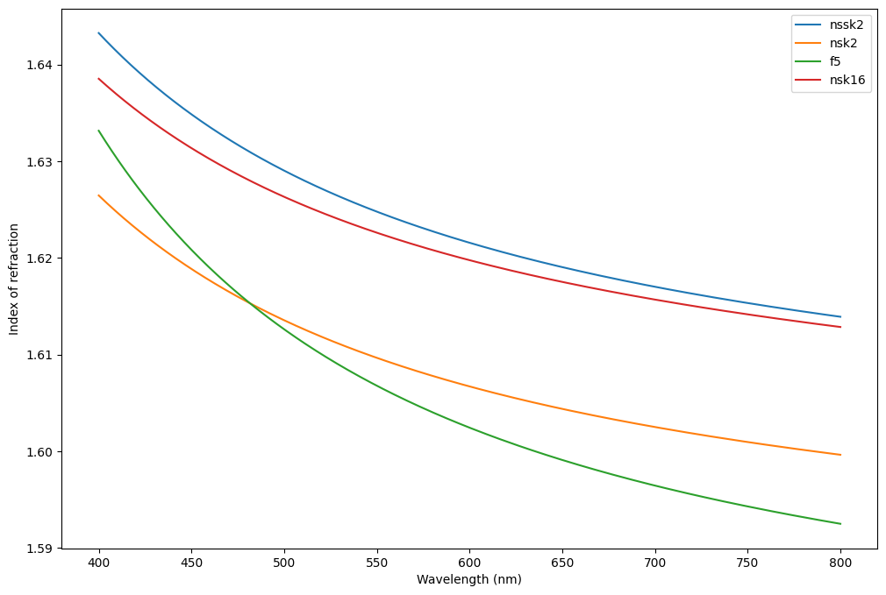

# Double Gauss F/5


```python
# from https://sterncat.github.io/files/Double_Gauss.html


import torch
import torchlensmaker as tlm

# Materials used in this design are from the Schott catalog
# Define them using Sellmeir models
nssk2 = tlm.SellmeierMaterial(1.4306027, 0.153150554, 1.01390904, 0.00823982975, 0.0333736841, 106.870822)
nsk2 = tlm.SellmeierMaterial(1.28189012, 0.257738258, 0.96818604, 0.0072719164, 0.0242823527, 110.377773)
f5 = tlm.SellmeierMaterial(1.3104463, 0.19603426, 0.96612977, 0.00958633048, 0.0457627627, 115.011883)
nsk16 = tlm.SellmeierMaterial(1.34317774, 0.241144399, 0.994317969, 0.00704687339, 0.0229005, 92.7508526)

tlm.plot_material_models([nssk2, nsk2, f5, nsk16], 400, 800, ["nssk2", "nsk2", "f5", "nsk16"])
```


    

    

New_Lens.add_surface(number=1,radius=10000000,thickness=10000000,glass='air')

New_Lens.add_surface(number=2,radius=56.20238,thickness=8.75 ,glass='N-SSK2_schott')
New_Lens.add_surface(number=3,radius=152.28580,thickness=0.5,glass='air')
New_Lens.add_surface(number=4,radius=37.68262,thickness=12.5,glass='N-SK2_schott')
New_Lens.add_surface(number=5,radius=10000000 ,thickness=3.8 ,glass='F5_schott')
New_Lens.add_surface(number=6,radius=24.23130,thickness=16.369445,glass='air')

New_Lens.add_surface(number=7,radius=10000000,thickness=13.747957,glass='air',STO=True)

New_Lens.add_surface(number=8,radius=-28.37731,thickness=3.8,glass='F5_schott')
New_Lens.add_surface(number=9,radius=100000000,thickness=11,glass='N-SK16_schott')
New_Lens.add_surface(number=10,radius=-37.92546,thickness=0.5,glass='air')

New_Lens.add_surface(number=11,radius=177.41176,thickness=7,glass='N-SK16_schott')
New_Lens.add_surface(number=12,radius=-79.41143,thickness=61.487536,glass='air')

New_Lens.add_surface(number=13,radius=100000000,thickness=0,glass='air')

```python
diameter = 55

optics = tlm.Sequential(
    tlm.Offset(
        tlm.ObjectAtInfinity(20, angular_size=30),
        y=-10),
    tlm.Wavelength(400, 600),
    tlm.Gap(20),
    
    # Lens 1
    tlm.RefractiveSurface(tlm.Sphere(diameter, 56.20238), material=nssk2),
    tlm.Gap(8.75),
    tlm.RefractiveSurface(tlm.Sphere(diameter, 152.28580), material='air'),

    tlm.Gap(0.5),

    # Lens 2
    tlm.RefractiveSurface(tlm.Sphere(0.8*diameter, 37.68262), material=nsk2),
    tlm.Gap(12.5),
    tlm.RefractiveSurface(tlm.CircularPlane(0.9*diameter), material=f5),
    tlm.Gap(3.8),
    tlm.RefractiveSurface(tlm.Sphere(0.8*diameter, 24.23130), material='air'),

    tlm.Gap(16.369445),
    
    # Aperture
    tlm.Aperture(0.5*diameter),
    
    tlm.Gap(13.747957),

    # Lens 3
    tlm.RefractiveSurface(tlm.Sphere(0.8*diameter, -28.37731), material=f5),
    tlm.Gap(3.8),
    tlm.RefractiveSurface(tlm.CircularPlane(0.8*diameter), material=nsk16),
    tlm.Gap(11),
    tlm.RefractiveSurface(tlm.Sphere(0.7*diameter, -37.92546), material='air'),

    tlm.Gap(0.5),

    # Lens 4
    tlm.RefractiveSurface(tlm.Sphere(0.8*diameter, 177.41176), material=nsk16),
    tlm.Gap(7),
    tlm.RefractiveSurface(tlm.Sphere(0.8*diameter, -79.41143), material='air'),

    tlm.Gap(61.487536),

    tlm.ImagePlane(80),
)

tlm.show(optics, dim=2, end=10, sampling={"base": 5, "object": 3, "wavelength": 3})
```


<div data-jp-suppress-context-menu id='tlmviewer-447f141a' class='tlmviewer' style='width: 100%; aspect-ratio: 16 / 9;'></div><script type='module'>async function importtlm() {
    try {
        return await import("/tlmviewer.js");
    } catch (error) {
        console.log("error", error);
        return await import("/files/test_notebooks/tlmviewer.js");
    }
}

const module = await importtlm();
const tlmviewer = module.tlmviewer;

const data = '{"mode": "2D", "camera": "XY", "data": [{"type": "surfaces", "data": [{"matrix": [[1.0, 0.0, 20.0], [0.0, 1.0, 0.0], [0.0, 0.0, 1.0]], "samples": [[7.18751526, 27.50000763], [7.04614258, 27.24649811], [6.90608215, 26.99226189], [6.76734161, 26.73731804], [6.62990952, 26.4816494], [6.49380493, 26.22527313], [6.35903168, 25.96821213], [6.22558212, 25.7104435], [6.0934639, 25.45199203], [5.96268463, 25.19287109], [5.83324432, 24.93306732], [5.70514679, 24.67259789], [5.57839966, 24.41147232], [5.45300293, 24.14970589], [5.3289566, 23.88728142], [5.2062645, 23.62422371], [5.08494186, 23.36054611], [4.96497726, 23.09623337], [4.84637833, 22.83130455], [4.72914505, 22.56576538], [4.61329651, 22.29964066], [4.49881744, 22.03290558], [4.3857193, 21.76559448], [4.27399826, 21.49769402], [4.16366577, 21.22921753], [4.05471802, 20.96017456], [3.94716644, 20.69058418], [3.84100342, 20.42043114], [3.73624039, 20.1497345], [3.63288116, 19.87851143], [3.53091431, 19.60674477], [3.43035889, 19.3344574], [3.33120728, 19.06165314], [3.23347092, 18.78835297], [3.13714218, 18.51453781], [3.0422287, 18.24023247], [2.9487381, 17.96544838], [2.85666656, 17.69017601], [2.7660141, 17.41443253], [2.67679214, 17.13823509], [2.58899307, 16.86156845], [2.50262833, 16.58444977], [2.41769409, 16.30690575], [2.33419418, 16.02891159], [2.2521286, 15.75049019], [2.17150497, 15.47164726], [2.0923233, 15.19240665], [2.01457977, 14.91274643], [1.93828583, 14.63268948], [1.86344147, 14.35225582], [1.79004288, 14.07142544], [1.71809387, 13.79021931], [1.64760208, 13.50865936], [1.57856369, 13.22672558], [1.51098251, 12.94443893], [1.44486237, 12.66182041], [1.38019943, 12.37885094], [1.31699753, 12.09555054], [1.25526047, 11.8119278], [1.19499207, 11.52800369], [1.13618851, 11.24375916], [1.07885361, 10.95921421], [1.02299118, 10.67439079], [0.96859741, 10.38926888], [0.91567612, 10.10386944], [0.86423492, 9.81821346], [0.8142662, 9.53228378], [0.76577377, 9.24609852], [0.71876144, 8.95968151], [0.67322922, 8.67301083], [0.62918091, 8.38610935], [0.58660889, 8.09898376], [0.5455246, 7.811656], [0.50592041, 7.52410603], [0.46780777, 7.23635626], [0.43117905, 6.94842625], [0.39603806, 6.66029739], [0.3623848, 6.37199163], [0.33022308, 6.08352852], [0.29954529, 5.79488993], [0.27036667, 5.50609684], [0.24267578, 5.21717024], [0.21647644, 4.92809105], [0.19177246, 4.63888025], [0.16856003, 4.34954643], [0.14684296, 4.06010914], [0.12662506, 3.77055049], [0.10789871, 3.48089147], [0.09066772, 3.19115305], [0.07493591, 2.90131569], [0.06069946, 2.61140132], [0.047966, 2.32143044], [0.03672028, 2.03138447], [0.02698135, 1.74128425], [0.01873779, 1.45113742], [0.01199341, 1.16096544], [0.0067482, 0.87074906], [0.00299835, 0.58050948], [0.0007515, 0.29026774], [0.0, -4.91e-06], [0.0007515, -0.29026774], [0.00299835, -0.58050948], [0.0067482, -0.87074906], [0.01199341, -1.16096544], [0.01873779, -1.45113742], [0.02698135, -1.74128425], [0.03672028, -2.03138447], [0.047966, -2.32143044], [0.06069946, -2.61140132], [0.07493591, -2.90131569], [0.09066772, -3.19115305], [0.10789871, -3.48089147], [0.12662506, -3.77055049], [0.14684296, -4.06010914], [0.16856003, -4.34954643], [0.19177246, -4.63888025], [0.21647644, -4.92809105], [0.24267578, -5.21717024], [0.27036667, -5.50609684], [0.29954529, -5.79488993], [0.33022308, -6.08352852], [0.3623848, -6.37199163], [0.39603806, -6.66029739], [0.43117905, -6.94842625], [0.46780777, -7.23635626], [0.50592041, -7.52410603], [0.5455246, -7.811656], [0.58660889, -8.09898376], [0.62918091, -8.38610935], [0.67322922, -8.67301083], [0.71876144, -8.95968151], [0.76577377, -9.24609852], [0.8142662, -9.53228378], [0.86423492, -9.81821346], [0.91567612, -10.10386944], [0.96859741, -10.38926888], [1.02299118, -10.67439079], [1.07885361, -10.95921421], [1.13618851, -11.24375916], [1.19499207, -11.52800369], [1.25526047, -11.8119278], [1.31699753, -12.09555054], [1.38019943, -12.37885094], [1.44486237, -12.66182041], [1.51098251, -12.94443893], [1.57856369, -13.22672558], [1.64760208, -13.50865936], [1.71809387, -13.79021931], [1.79004288, -14.07142544], [1.86344147, -14.35225582], [1.93828583, -14.63268948], [2.01457977, -14.91274643], [2.0923233, -15.19240665], [2.17150497, -15.47164726], [2.2521286, -15.75049019], [2.33419418, -16.02891159], [2.41769409, -16.30690575], [2.50262833, -16.58444977], [2.58899307, -16.86156845], [2.67679214, -17.13823509], [2.7660141, -17.41443253], [2.85666656, -17.69017601], [2.9487381, -17.96544838], [3.0422287, -18.24023247], [3.13714218, -18.51453781], [3.23347092, -18.78835297], [3.33120728, -19.06165314], [3.43035889, -19.3344574], [3.53091431, -19.60674477], [3.63288116, -19.87851143], [3.73624039, -20.1497345], [3.84100342, -20.42043114], [3.94716644, -20.69058418], [4.05471802, -20.96017456], [4.16366577, -21.22921753], [4.27399826, -21.49769402], [4.3857193, -21.76559448], [4.49881744, -22.03290558], [4.61329651, -22.29964066], [4.72914505, -22.56576538], [4.84637833, -22.83130455], [4.96497726, -23.09623337], [5.08494186, -23.36054611], [5.2062645, -23.62422371], [5.3289566, -23.88728142], [5.45300293, -24.14970589], [5.57839966, -24.41147232], [5.70514679, -24.67259789], [5.83324432, -24.93306732], [5.96268463, -25.19287109], [6.0934639, -25.45199203], [6.22558212, -25.7104435], [6.35903168, -25.96821213], [6.49380493, -26.22527313], [6.62990952, -26.4816494], [6.76734161, -26.73731804], [6.90608215, -26.99226189], [7.04614258, -27.24649811], [7.18751526, -27.50000763]]}]}, {"type": "surfaces", "data": [{"matrix": [[1.0, 0.0, 28.75], [0.0, 1.0, 0.0], [0.0, 0.0, 1.0]], "samples": [[2.50357056, 27.50001717], [2.4533844, 27.22524643], [2.40371704, 26.95038605], [2.35453796, 26.67543411], [2.30586243, 26.40042686], [2.25769043, 26.12529564], [2.21002197, 25.85007858], [2.16285706, 25.57477379], [2.11621094, 25.29938126], [2.0700531, 25.0239048], [2.02441406, 24.74834442], [1.97927856, 24.47273827], [1.93464661, 24.19701004], [1.89051819, 23.92120171], [1.84689331, 23.64531517], [1.80377197, 23.36934662], [1.76116943, 23.09330177], [1.71907043, 22.81717682], [1.67747498, 22.54101181], [1.63638306, 22.26473427], [1.59579468, 21.98838234], [1.5557251, 21.71195793], [1.51615906, 21.43545914], [1.47709656, 21.15888977], [1.4385376, 20.88228226], [1.40049744, 20.60556984], [1.36296082, 20.32878876], [1.32592773, 20.05194092], [1.28939819, 19.7750206], [1.25338745, 19.49803734], [1.21786499, 19.22098923], [1.18287659, 18.9439106], [1.14839172, 18.66673279], [1.1144104, 18.38949203], [1.08093262, 18.11219025], [1.04795837, 17.83482742], [1.01550293, 17.55740356], [0.98356628, 17.27995682], [0.95211792, 17.00241661], [0.92118835, 16.72481918], [0.89076233, 16.44716454], [0.8608551, 16.16945648], [0.83145142, 15.89169121], [0.80256653, 15.61387444], [0.77418518, 15.3360405], [0.74630737, 15.05811977], [0.71894836, 14.78014755], [0.6920929, 14.50212669], [0.66574097, 14.22405529], [0.63990784, 13.94593811], [0.61459351, 13.66777134], [0.58976746, 13.38959694], [0.56547546, 13.11134052], [0.54168701, 12.83304024], [0.5184021, 12.55469704], [0.49562073, 12.27631187], [0.47335815, 11.99788475], [0.45161438, 11.71945286], [0.43037415, 11.44094658], [0.40965271, 11.1624012], [0.38943481, 10.88381863], [0.36972046, 10.60519791], [0.3505249, 10.32654285], [0.33184814, 10.04788971], [0.31367493, 9.76916504], [0.29600525, 9.4904089], [0.27885437, 9.21162033], [0.26222229, 8.93280125], [0.24607849, 8.65395164], [0.23046875, 8.37507343], [0.21536255, 8.0962019], [0.20077515, 7.81726837], [0.18669128, 7.53830814], [0.17312622, 7.25932217], [0.1600647, 6.98031235], [0.14752197, 6.70127869], [0.13548279, 6.42222214], [0.12394714, 6.14318037], [0.11294556, 5.86408234], [0.10244751, 5.5849638], [0.092453, 5.30582714], [0.08297729, 5.02667236], [0.07402039, 4.7475009], [0.06556702, 4.46834946], [0.05763245, 4.18914652], [0.05020142, 3.90992975], [0.04328918, 3.63069963], [0.03688049, 3.3514576], [0.0309906, 3.07220411], [0.02561951, 2.79294038], [0.02075195, 2.51370335], [0.01638794, 2.23442197], [0.01255798, 1.9551326], [0.00921631, 1.67583692], [0.00639343, 1.39653552], [0.00408936, 1.11722946], [0.00230408, 0.83795595], [0.00102234, 0.55864328], [0.0002594, 0.27932876], [0.0, -1.331e-05], [0.0002594, -0.27932876], [0.00102234, -0.55864328], [0.00230408, -0.83795595], [0.00408936, -1.11722946], [0.00639343, -1.39653552], [0.00921631, -1.67583692], [0.01255798, -1.9551326], [0.01638794, -2.23442197], [0.02075195, -2.51370335], [0.02561951, -2.79294038], [0.0309906, -3.07220411], [0.03688049, -3.3514576], [0.04328918, -3.63069963], [0.05020142, -3.90992975], [0.05763245, -4.18914652], [0.06556702, -4.46834946], [0.07402039, -4.7475009], [0.08297729, -5.02667236], [0.092453, -5.30582714], [0.10244751, -5.5849638], [0.11294556, -5.86408234], [0.12394714, -6.14318037], [0.13548279, -6.42222214], [0.14752197, -6.70127869], [0.1600647, -6.98031235], [0.17312622, -7.25932217], [0.18669128, -7.53830814], [0.20077515, -7.81726837], [0.21536255, -8.0962019], [0.23046875, -8.37507343], [0.24607849, -8.65395164], [0.26222229, -8.93280125], [0.27885437, -9.21162033], [0.29600525, -9.4904089], [0.31367493, -9.76916504], [0.33184814, -10.04788971], [0.3505249, -10.32654285], [0.36972046, -10.60519791], [0.38943481, -10.88381863], [0.40965271, -11.1624012], [0.43037415, -11.44094658], [0.45161438, -11.71945286], [0.47335815, -11.99788475], [0.49562073, -12.27631187], [0.5184021, -12.55469704], [0.54168701, -12.83304024], [0.56547546, -13.11134052], [0.58976746, -13.38959694], [0.61459351, -13.66777134], [0.63990784, -13.94593811], [0.66574097, -14.22405529], [0.6920929, -14.50212669], [0.71894836, -14.78014755], [0.74630737, -15.05811977], [0.77418518, -15.3360405], [0.80256653, -15.61387444], [0.83145142, -15.89169121], [0.8608551, -16.16945648], [0.89076233, -16.44716454], [0.92118835, -16.72481918], [0.95211792, -17.00241661], [0.98356628, -17.27995682], [1.01550293, -17.55740356], [1.04795837, -17.83482742], [1.08093262, -18.11219025], [1.1144104, -18.38949203], [1.14839172, -18.66673279], [1.18287659, -18.9439106], [1.21786499, -19.22098923], [1.25338745, -19.49803734], [1.28939819, -19.7750206], [1.32592773, -20.05194092], [1.36296082, -20.32878876], [1.40049744, -20.60556984], [1.4385376, -20.88228226], [1.47709656, -21.15888977], [1.51615906, -21.43545914], [1.5557251, -21.71195793], [1.59579468, -21.98838234], [1.63638306, -22.26473427], [1.67747498, -22.54101181], [1.71907043, -22.81717682], [1.76116943, -23.09330177], [1.80377197, -23.36934662], [1.84689331, -23.64531517], [1.89051819, -23.92120171], [1.93464661, -24.19701004], [1.97927856, -24.47273827], [2.02441406, -24.74834442], [2.0700531, -25.0239048], [2.11621094, -25.29938126], [2.16285706, -25.57477379], [2.21002197, -25.85007858], [2.25769043, -26.12529564], [2.30586243, -26.40042686], [2.35453796, -26.67543411], [2.40371704, -26.95038605], [2.4533844, -27.22524643], [2.50357056, -27.50001717]]}]}, {"type": "surfaces", "data": [{"matrix": [[1.0, 0.0, 29.25], [0.0, 1.0, 0.0], [0.0, 0.0, 1.0]], "samples": [[7.08883476, 22.00000381], [6.95090294, 21.80690765], [6.81419182, 21.612957], [6.67869949, 21.41814041], [6.54443741, 21.22247505], [6.4114151, 21.02597427], [6.27962875, 20.82863235], [6.149086, 20.63046455], [6.01980019, 20.43148994], [5.89176369, 20.23169327], [5.76498985, 20.0310955], [5.63948822, 19.82971001], [5.51524734, 19.62752914], [5.39228439, 19.4245739], [5.27060699, 19.22085381], [5.15020752, 19.01636314], [5.03110123, 18.81112099], [4.91329193, 18.60513115], [4.79677963, 18.39840508], [4.68157196, 18.19095421], [4.56767273, 17.98277664], [4.45508957, 17.77388382], [4.34382248, 17.56429672], [4.23387527, 17.35400391], [4.12525558, 17.14302254], [4.01797104, 16.93136978], [3.91201401, 16.71903801], [3.80739975, 16.50604057], [3.70413208, 16.29239845], [3.60220718, 16.07810211], [3.50163651, 15.86316967], [3.40242386, 15.64761543], [3.30456543, 15.43143177], [3.20806885, 15.2146368], [3.11294556, 14.99724674], [3.01918793, 14.77925301], [2.9268074, 14.56067467], [2.83580399, 14.34152508], [2.74618149, 14.12179947], [2.65794754, 13.90151405], [2.57110214, 13.680686], [2.48564529, 13.45930672], [2.40158844, 13.23739338], [2.31893158, 13.01496315], [2.2376709, 12.79200935], [2.15781784, 12.56854725], [2.07937622, 12.34458828], [2.00234604, 12.12014771], [1.92673111, 11.89521694], [1.85253143, 11.66981506], [1.77975464, 11.44395924], [1.70840073, 11.21764183], [1.63847351, 10.99087906], [1.56997681, 10.76368713], [1.50291061, 10.53606129], [1.43727875, 10.30801868], [1.37308502, 10.079566], [1.31033707, 9.85072136], [1.24902344, 9.62147999], [1.18915558, 9.39185524], [1.1307373, 9.16186714], [1.07376862, 8.93150711], [1.01824951, 8.70079231], [0.96418762, 8.46974182], [0.91157913, 8.2383461], [0.86042786, 8.00662422], [0.81074142, 7.77459383], [0.76251221, 7.54224634], [0.71574783, 7.3095994], [0.67045212, 7.07667112], [0.62662125, 6.84345388], [0.58425903, 6.60996532], [0.54337311, 6.37622309], [0.50395584, 6.14221954], [0.46601486, 5.90797234], [0.42955017, 5.67349958], [0.39456177, 5.43879318], [0.36104965, 5.2038703], [0.32902145, 4.96874237], [0.29847336, 4.73342562], [0.26940536, 4.49791193], [0.24182129, 4.26222038], [0.21572495, 4.02636814], [0.19111252, 3.79034805], [0.16798782, 3.55417728], [0.14635086, 3.31787443], [0.12620163, 3.08143139], [0.10754013, 2.84486604], [0.09037399, 2.6081965], [0.07469177, 2.3714149], [0.06050491, 2.13453913], [0.0478096, 1.8975786], [0.03660583, 1.66055202], [0.02689362, 1.42345047], [0.01867676, 1.18629253], [0.01195526, 0.94909656], [0.00672531, 0.71185392], [0.00299072, 0.47458306], [0.00074768, 0.23730236], [0.0, -3.29e-06], [0.00074768, -0.23730236], [0.00299072, -0.47458306], [0.00672531, -0.71185392], [0.01195526, -0.94909656], [0.01867676, -1.18629253], [0.02689362, -1.42345047], [0.03660583, -1.66055202], [0.0478096, -1.8975786], [0.06050491, -2.13453913], [0.07469177, -2.3714149], [0.09037399, -2.6081965], [0.10754013, -2.84486604], [0.12620163, -3.08143139], [0.14635086, -3.31787443], [0.16798782, -3.55417728], [0.19111252, -3.79034805], [0.21572495, -4.02636814], [0.24182129, -4.26222038], [0.26940536, -4.49791193], [0.29847336, -4.73342562], [0.32902145, -4.96874237], [0.36104965, -5.2038703], [0.39456177, -5.43879318], [0.42955017, -5.67349958], [0.46601486, -5.90797234], [0.50395584, -6.14221954], [0.54337311, -6.37622309], [0.58425903, -6.60996532], [0.62662125, -6.84345388], [0.67045212, -7.07667112], [0.71574783, -7.3095994], [0.76251221, -7.54224634], [0.81074142, -7.77459383], [0.86042786, -8.00662422], [0.91157913, -8.2383461], [0.96418762, -8.46974182], [1.01824951, -8.70079231], [1.07376862, -8.93150711], [1.1307373, -9.16186714], [1.18915558, -9.39185524], [1.24902344, -9.62147999], [1.31033707, -9.85072136], [1.37308502, -10.079566], [1.43727875, -10.30801868], [1.50291061, -10.53606129], [1.56997681, -10.76368713], [1.63847351, -10.99087906], [1.70840073, -11.21764183], [1.77975464, -11.44395924], [1.85253143, -11.66981506], [1.92673111, -11.89521694], [2.00234604, -12.12014771], [2.07937622, -12.34458828], [2.15781784, -12.56854725], [2.2376709, -12.79200935], [2.31893158, -13.01496315], [2.40158844, -13.23739338], [2.48564529, -13.45930672], [2.57110214, -13.680686], [2.65794754, -13.90151405], [2.74618149, -14.12179947], [2.83580399, -14.34152508], [2.9268074, -14.56067467], [3.01918793, -14.77925301], [3.11294556, -14.99724674], [3.20806885, -15.2146368], [3.30456543, -15.43143177], [3.40242386, -15.64761543], [3.50163651, -15.86316967], [3.60220718, -16.07810211], [3.70413208, -16.29239845], [3.80739975, -16.50604057], [3.91201401, -16.71903801], [4.01797104, -16.93136978], [4.12525558, -17.14302254], [4.23387527, -17.35400391], [4.34382248, -17.56429672], [4.45508957, -17.77388382], [4.56767273, -17.98277664], [4.68157196, -18.19095421], [4.79677963, -18.39840508], [4.91329193, -18.60513115], [5.03110123, -18.81112099], [5.15020752, -19.01636314], [5.27060699, -19.22085381], [5.39228439, -19.4245739], [5.51524734, -19.62752914], [5.63948822, -19.82971001], [5.76498985, -20.0310955], [5.89176369, -20.23169327], [6.01980019, -20.43148994], [6.149086, -20.63046455], [6.27962875, -20.82863235], [6.4114151, -21.02597427], [6.54443741, -21.22247505], [6.67869949, -21.41814041], [6.81419182, -21.612957], [6.95090294, -21.80690765], [7.08883476, -22.00000381]]}]}, {"type": "surfaces", "data": [{"matrix": [[1.0, 0.0, 41.75], [0.0, 1.0, 0.0], [0.0, 0.0, 1.0]], "samples": [[0.0, -24.75], [0.0, -24.5], [0.0, -24.25], [0.0, -24.0], [0.0, -23.75], [0.0, -23.5], [0.0, -23.25], [0.0, -23.0], [0.0, -22.75], [0.0, -22.5], [0.0, -22.25], [0.0, -22.0], [0.0, -21.75], [0.0, -21.5], [0.0, -21.25], [0.0, -21.0], [0.0, -20.75], [0.0, -20.5], [0.0, -20.25], [0.0, -20.0], [0.0, -19.75], [0.0, -19.5], [0.0, -19.25], [0.0, -19.0], [0.0, -18.75], [0.0, -18.5], [0.0, -18.25], [0.0, -18.0], [0.0, -17.75], [0.0, -17.5], [0.0, -17.25], [0.0, -17.0], [0.0, -16.75], [0.0, -16.5], [0.0, -16.25], [0.0, -16.0], [0.0, -15.75], [0.0, -15.5], [0.0, -15.25], [0.0, -15.0], [0.0, -14.75], [0.0, -14.5], [0.0, -14.25], [0.0, -14.0], [0.0, -13.75], [0.0, -13.5], [0.0, -13.25], [0.0, -13.0], [0.0, -12.75], [0.0, -12.5], [0.0, -12.25], [0.0, -12.0], [0.0, -11.75], [0.0, -11.5], [0.0, -11.25], [0.0, -11.0], [0.0, -10.75], [0.0, -10.5], [0.0, -10.25], [0.0, -10.0], [0.0, -9.75], [0.0, -9.5], [0.0, -9.25], [0.0, -9.0], [0.0, -8.75], [0.0, -8.5], [0.0, -8.25], [0.0, -8.0], [0.0, -7.75], [0.0, -7.5], [0.0, -7.25], [0.0, -7.0], [0.0, -6.75], [0.0, -6.5], [0.0, -6.25], [0.0, -6.0], [0.0, -5.75], [0.0, -5.5], [0.0, -5.25], [0.0, -5.0], [0.0, -4.75], [0.0, -4.5], [0.0, -4.25], [0.0, -4.0], [0.0, -3.75], [0.0, -3.5], [0.0, -3.25], [0.0, -3.0], [0.0, -2.75], [0.0, -2.5], [0.0, -2.25], [0.0, -2.0], [0.0, -1.75], [0.0, -1.5], [0.0, -1.25], [0.0, -1.0], [0.0, -0.75], [0.0, -0.5], [0.0, -0.25], [0.0, 0.0], [0.0, 0.25], [0.0, 0.5], [0.0, 0.75], [0.0, 1.0], [0.0, 1.25], [0.0, 1.5], [0.0, 1.75], [0.0, 2.0], [0.0, 2.25], [0.0, 2.5], [0.0, 2.75], [0.0, 3.0], [0.0, 3.25], [0.0, 3.5], [0.0, 3.75], [0.0, 4.0], [0.0, 4.25], [0.0, 4.5], [0.0, 4.75], [0.0, 5.0], [0.0, 5.25], [0.0, 5.5], [0.0, 5.75], [0.0, 6.0], [0.0, 6.25], [0.0, 6.5], [0.0, 6.75], [0.0, 7.0], [0.0, 7.25], [0.0, 7.5], [0.0, 7.75], [0.0, 8.0], [0.0, 8.25], [0.0, 8.5], [0.0, 8.75], [0.0, 9.0], [0.0, 9.25], [0.0, 9.5], [0.0, 9.75], [0.0, 10.0], [0.0, 10.25], [0.0, 10.5], [0.0, 10.75], [0.0, 11.0], [0.0, 11.25], [0.0, 11.5], [0.0, 11.75], [0.0, 12.0], [0.0, 12.25], [0.0, 12.5], [0.0, 12.75], [0.0, 13.0], [0.0, 13.25], [0.0, 13.5], [0.0, 13.75], [0.0, 14.0], [0.0, 14.25], [0.0, 14.5], [0.0, 14.75], [0.0, 15.0], [0.0, 15.25], [0.0, 15.5], [0.0, 15.75], [0.0, 16.0], [0.0, 16.25], [0.0, 16.5], [0.0, 16.75], [0.0, 17.0], [0.0, 17.25], [0.0, 17.5], [0.0, 17.75], [0.0, 18.0], [0.0, 18.25], [0.0, 18.5], [0.0, 18.75], [0.0, 19.0], [0.0, 19.25], [0.0, 19.5], [0.0, 19.75], [0.0, 20.0], [0.0, 20.25], [0.0, 20.5], [0.0, 20.75], [0.0, 21.0], [0.0, 21.25], [0.0, 21.5], [0.0, 21.75], [0.0, 22.0], [0.0, 22.25], [0.0, 22.5], [0.0, 22.75], [0.0, 23.0], [0.0, 23.25], [0.0, 23.5], [0.0, 23.75], [0.0, 24.0], [0.0, 24.25], [0.0, 24.5], [0.0, 24.75]]}]}, {"type": "surfaces", "data": [{"matrix": [[1.0, 0.0, 45.55], [0.0, 1.0, 0.0], [0.0, 0.0, 1.0]], "samples": [[14.07472897, 22.0], [13.82245064, 21.88176918], [13.57155895, 21.76064873], [13.32206535, 21.63664818], [13.07401371, 21.50978661], [12.82744884, 21.38008499], [12.58238029, 21.24755478], [12.33885193, 21.11221504], [12.09690571, 20.97408676], [11.85655308, 20.83318329], [11.61783695, 20.6895256], [11.3807888, 20.54313278], [11.14543819, 20.39402199], [10.91182899, 20.24222374], [10.67996979, 20.08773994], [10.44990253, 19.93060303], [10.22166538, 19.77083778], [9.99527168, 19.60845375], [9.77076149, 19.44347572], [9.54817104, 19.27593422], [9.32751179, 19.10583687], [9.10882378, 18.93321419], [8.89213467, 18.75808907], [8.67748165, 18.58049011], [8.46487617, 18.40042877], [8.25435543, 18.21793556], [8.04595184, 18.03303528], [7.83968163, 17.8457489], [7.63558578, 17.65610695], [7.43367577, 17.46412659], [7.23399353, 17.26984215], [7.03655624, 17.07327461], [6.84139061, 16.87444687], [6.64852524, 16.67339134], [6.45798302, 16.47012711], [6.26979256, 16.2646904], [6.08397293, 16.05709839], [5.90055466, 15.84738827], [5.71956253, 15.63558388], [5.54101181, 15.4217062], [5.36493301, 15.20579243], [5.19135094, 14.98787117], [5.02028847, 14.76796913], [4.85175896, 14.5461092], [4.68579674, 14.32233238], [4.52241516, 14.0966568], [4.36164093, 13.86912155], [4.20349121, 13.63975048], [4.04799271, 13.40857887], [3.89516258, 13.17563534], [3.7450161, 12.94094563], [3.59757805, 12.70454407], [3.45287132, 12.46646881], [3.31091309, 12.22674561], [3.17171669, 11.9854002], [3.03530693, 11.74247646], [2.90169525, 11.49799442], [2.77090836, 11.25199699], [2.64295197, 11.00450802], [2.5178566, 10.7555685], [2.39562988, 10.50520802], [2.27628708, 10.25345325], [2.15984917, 10.00034809], [2.04632568, 9.74591541], [1.93573952, 9.49020004], [1.82809639, 9.23322392], [1.7234211, 8.97503376], [1.62171555, 8.71565151], [1.52300072, 8.45512199], [1.42728806, 8.19346905], [1.33459091, 7.93073893], [1.24492073, 7.66696024], [1.15828896, 7.40216255], [1.07470703, 7.13639164], [0.9941864, 6.86967134], [0.9167366, 6.60204983], [0.84236908, 6.33354902], [0.77109718, 6.06421614], [0.70292091, 5.79407644], [0.63785934, 5.52317619], [0.57591629, 5.25154591], [0.51709938, 4.97921562], [0.46141815, 4.7062335], [0.40888023, 4.43262243], [0.35948944, 4.15843153], [0.31325531, 3.88368535], [0.27018356, 3.60843134], [0.23027802, 3.33269453], [0.1935482, 3.05652285], [0.15999413, 2.77994728], [0.12962151, 2.50299835], [0.10243607, 2.22572422], [0.07844162, 1.94815028], [0.05763817, 1.67032433], [0.04003143, 1.39227188], [0.02562332, 1.11404121], [0.01441383, 0.83565742], [0.00640678, 0.55716896], [0.00160217, 0.27860108], [0.0, -2.12e-06], [0.00160217, -0.27860108], [0.00640678, -0.55716896], [0.01441383, -0.83565742], [0.02562332, -1.11404121], [0.04003143, -1.39227188], [0.05763817, -1.67032433], [0.07844162, -1.94815028], [0.10243607, -2.22572422], [0.12962151, -2.50299835], [0.15999413, -2.77994728], [0.1935482, -3.05652285], [0.23027802, -3.33269453], [0.27018356, -3.60843134], [0.31325531, -3.88368535], [0.35948944, -4.15843153], [0.40888023, -4.43262243], [0.46141815, -4.7062335], [0.51709938, -4.97921562], [0.57591629, -5.25154591], [0.63785934, -5.52317619], [0.70292091, -5.79407644], [0.77109718, -6.06421614], [0.84236908, -6.33354902], [0.9167366, -6.60204983], [0.9941864, -6.86967134], [1.07470703, -7.13639164], [1.15828896, -7.40216255], [1.24492073, -7.66696024], [1.33459091, -7.93073893], [1.42728806, -8.19346905], [1.52300072, -8.45512199], [1.62171555, -8.71565151], [1.7234211, -8.97503376], [1.82809639, -9.23322392], [1.93573952, -9.49020004], [2.04632568, -9.74591541], [2.15984917, -10.00034809], [2.27628708, -10.25345325], [2.39562988, -10.50520802], [2.5178566, -10.7555685], [2.64295197, -11.00450802], [2.77090836, -11.25199699], [2.90169525, -11.49799442], [3.03530693, -11.74247646], [3.17171669, -11.9854002], [3.31091309, -12.22674561], [3.45287132, -12.46646881], [3.59757805, -12.70454407], [3.7450161, -12.94094563], [3.89516258, -13.17563534], [4.04799271, -13.40857887], [4.20349121, -13.63975048], [4.36164093, -13.86912155], [4.52241516, -14.0966568], [4.68579674, -14.32233238], [4.85175896, -14.5461092], [5.02028847, -14.76796913], [5.19135094, -14.98787117], [5.36493301, -15.20579243], [5.54101181, -15.4217062], [5.71956253, -15.63558388], [5.90055466, -15.84738827], [6.08397293, -16.05709839], [6.26979256, -16.2646904], [6.45798302, -16.47012711], [6.64852524, -16.67339134], [6.84139061, -16.87444687], [7.03655624, -17.07327461], [7.23399353, -17.26984215], [7.43367577, -17.46412659], [7.63558578, -17.65610695], [7.83968163, -17.8457489], [8.04595184, -18.03303528], [8.25435543, -18.21793556], [8.46487617, -18.40042877], [8.67748165, -18.58049011], [8.89213467, -18.75808907], [9.10882378, -18.93321419], [9.32751179, -19.10583687], [9.54817104, -19.27593422], [9.77076149, -19.44347572], [9.99527168, -19.60845375], [10.22166538, -19.77083778], [10.44990253, -19.93060303], [10.67996979, -20.08773994], [10.91182899, -20.24222374], [11.14543819, -20.39402199], [11.3807888, -20.54313278], [11.61783695, -20.6895256], [11.85655308, -20.83318329], [12.09690571, -20.97408676], [12.33885193, -21.11221504], [12.58238029, -21.24755478], [12.82744884, -21.38008499], [13.07401371, -21.50978661], [13.32206535, -21.63664818], [13.57155895, -21.76064873], [13.82245064, -21.88176918], [14.07472897, -22.0]]}]}, {"type": "surfaces", "data": [{"matrix": [[1.0, 0.0, 61.919445], [0.0, 1.0, 0.0], [0.0, 0.0, 1.0]], "samples": [[0.0, -13.75], [0.0, -13.61111069], [0.0, -13.47222233], [0.0, -13.33333302], [0.0, -13.19444466], [0.0, -13.05555534], [0.0, -12.91666698], [0.0, -12.77777767], [0.0, -12.63888931], [0.0, -12.5], [0.0, -12.36111069], [0.0, -12.22222233], [0.0, -12.08333302], [0.0, -11.94444466], [0.0, -11.80555534], [0.0, -11.66666698], [0.0, -11.52777767], [0.0, -11.38888836], [0.0, -11.25], [0.0, -11.11111069], [0.0, -10.97222233], [0.0, -10.83333302], [0.0, -10.69444466], [0.0, -10.55555534], [0.0, -10.41666603], [0.0, -10.27777767], [0.0, -10.13888836], [0.0, -10.0], [0.0, -9.86111069], [0.0, -9.72222233], [0.0, -9.58333302], [0.0, -9.44444466], [0.0, -9.30555534], [0.0, -9.16666603], [0.0, -9.02777767], [0.0, -8.88888836], [0.0, -8.75], [0.0, -8.61111069], [0.0, -8.47222233], [0.0, -8.33333302], [0.0, -8.19444466], [0.0, -8.05555534], [0.0, -7.91666651], [0.0, -7.77777767], [0.0, -7.63888836], [0.0, -7.49999952], [0.0, -7.36111069], [0.0, -7.22222185], [0.0, -7.08333302], [0.0, -6.94444418], [0.0, -6.80555582], [0.0, -6.66666698], [0.0, -6.52777815], [0.0, -6.38888931], [0.0, -6.25000048], [0.0, -6.11111164], [0.0, -5.97222233], [0.0, -5.83333349], [0.0, -5.69444466], [0.0, -5.55555582], [0.0, -5.41666698], [0.0, -5.27777815], [0.0, -5.13888931], [0.0, -5.0], [0.0, -4.86111116], [0.0, -4.72222233], [0.0, -4.58333349], [0.0, -4.44444466], [0.0, -4.30555582], [0.0, -4.16666698], [0.0, -4.02777815], [0.0, -3.88888907], [0.0, -3.75000024], [0.0, -3.61111116], [0.0, -3.47222233], [0.0, -3.33333349], [0.0, -3.19444466], [0.0, -3.05555582], [0.0, -2.91666675], [0.0, -2.77777791], [0.0, -2.63888907], [0.0, -2.5], [0.0, -2.36111116], [0.0, -2.22222233], [0.0, -2.08333349], [0.0, -1.94444454], [0.0, -1.80555558], [0.0, -1.66666675], [0.0, -1.52777791], [0.0, -1.38888896], [0.0, -1.25], [0.0, -1.11111116], [0.0, -0.97222227], [0.0, -0.83333337], [0.0, -0.69444448], [0.0, -0.55555558], [0.0, -0.41666669], [0.0, -0.27777779], [0.0, -0.1388889], [0.0, 0.0], [0.0, 0.1388889], [0.0, 0.27777779], [0.0, 0.41666669], [0.0, 0.55555558], [0.0, 0.69444448], [0.0, 0.83333337], [0.0, 0.97222227], [0.0, 1.11111116], [0.0, 1.25], [0.0, 1.38888896], [0.0, 1.52777791], [0.0, 1.66666675], [0.0, 1.80555558], [0.0, 1.94444454], [0.0, 2.08333349], [0.0, 2.22222233], [0.0, 2.36111116], [0.0, 2.5], [0.0, 2.63888907], [0.0, 2.77777791], [0.0, 2.91666675], [0.0, 3.05555582], [0.0, 3.19444466], [0.0, 3.33333349], [0.0, 3.47222233], [0.0, 3.61111116], [0.0, 3.75000024], [0.0, 3.88888907], [0.0, 4.02777815], [0.0, 4.16666698], [0.0, 4.30555582], [0.0, 4.44444466], [0.0, 4.58333349], [0.0, 4.72222233], [0.0, 4.86111116], [0.0, 5.0], [0.0, 5.13888931], [0.0, 5.27777815], [0.0, 5.41666698], [0.0, 5.55555582], [0.0, 5.69444466], [0.0, 5.83333349], [0.0, 5.97222233], [0.0, 6.11111164], [0.0, 6.25000048], [0.0, 6.38888931], [0.0, 6.52777815], [0.0, 6.66666698], [0.0, 6.80555582], [0.0, 6.94444418], [0.0, 7.08333302], [0.0, 7.22222185], [0.0, 7.36111069], [0.0, 7.49999952], [0.0, 7.63888836], [0.0, 7.77777767], [0.0, 7.91666651], [0.0, 8.05555534], [0.0, 8.19444466], [0.0, 8.33333302], [0.0, 8.47222233], [0.0, 8.61111069], [0.0, 8.75], [0.0, 8.88888836], [0.0, 9.02777767], [0.0, 9.16666603], [0.0, 9.30555534], [0.0, 9.44444466], [0.0, 9.58333302], [0.0, 9.72222233], [0.0, 9.86111069], [0.0, 10.0], [0.0, 10.13888836], [0.0, 10.27777767], [0.0, 10.41666603], [0.0, 10.55555534], [0.0, 10.69444466], [0.0, 10.83333302], [0.0, 10.97222233], [0.0, 11.11111069], [0.0, 11.25], [0.0, 11.38888836], [0.0, 11.52777767], [0.0, 11.66666698], [0.0, 11.80555534], [0.0, 11.94444466], [0.0, 12.08333302], [0.0, 12.22222233], [0.0, 12.36111069], [0.0, 12.5], [0.0, 12.63888931], [0.0, 12.77777767], [0.0, 12.91666698], [0.0, 13.05555534], [0.0, 13.19444466], [0.0, 13.33333302], [0.0, 13.47222233], [0.0, 13.61111069], [0.0, 13.75]]}]}, {"type": "surfaces", "data": [{"matrix": [[1.0, 0.0, 75.667402], [0.0, 1.0, 0.0], [0.0, 0.0, 1.0]], "samples": [[-10.4532547, -21.99999809], [-10.25683784, -21.83850288], [-10.06187057, -21.6752491], [-9.86837959, -21.51025581], [-9.67637062, -21.34353638], [-9.48586464, -21.17510414], [-9.296875, -21.00496864], [-9.10941887, -20.83314896], [-8.92350769, -20.65965462], [-8.73916245, -20.48450279], [-8.55639076, -20.30770493], [-8.37521172, -20.12927628], [-8.19563866, -19.9492321], [-8.01768684, -19.76758766], [-7.84136963, -19.58435249], [-7.66670227, -19.39954567], [-7.49369621, -19.21318245], [-7.32236862, -19.02527618], [-7.15273094, -18.83584213], [-6.98479652, -18.64489365], [-6.81858063, -18.4524498], [-6.6540966, -18.25852394], [-6.4913559, -18.06313133], [-6.33037376, -17.86628914], [-6.17116165, -17.66801262], [-6.01373291, -17.46831703], [-5.85809708, -17.26721764], [-5.70427322, -17.06473351], [-5.55226898, -16.86087799], [-5.4020977, -16.65567017], [-5.25377083, -16.44912148], [-5.1072998, -16.24125481], [-4.96269798, -16.0320816], [-4.81997681, -15.8216238], [-4.67914772, -15.60989571], [-4.54022217, -15.39691162], [-4.40320778, -15.18269348], [-4.26812172, -14.96725464], [-4.13496971, -14.75061417], [-4.0037632, -14.53278923], [-3.87451553, -14.31379795], [-3.74723434, -14.09365654], [-3.62193298, -13.87238407], [-3.49861908, -13.64999676], [-3.37730217, -13.42651367], [-3.25799179, -13.20195293], [-3.14069939, -12.97633171], [-3.02543449, -12.74966908], [-2.91220284, -12.52198219], [-2.80101776, -12.29329109], [-2.69188499, -12.06361008], [-2.58481789, -11.83296299], [-2.47981834, -11.60136509], [-2.37689972, -11.3688345], [-2.27606964, -11.13539124], [-2.17733383, -10.90105438], [-2.08070374, -10.66584301], [-1.98618317, -10.42977333], [-1.89378357, -10.19286728], [-1.80351067, -9.95514297], [-1.71537018, -9.71661854], [-1.62937164, -9.477314], [-1.54551888, -9.23724937], [-1.46382332, -8.99644184], [-1.38428879, -8.75491238], [-1.3069191, -8.51268005], [-1.23172569, -8.26976395], [-1.15871239, -8.02618408], [-1.087883, -7.78195858], [-1.01924515, -7.53710985], [-0.95280457, -7.29165506], [-0.88856506, -7.04561472], [-0.82653427, -6.79900837], [-0.766716, -6.55185652], [-0.70911407, -6.30417871], [-0.65373421, -6.05599403], [-0.60058022, -5.80732441], [-0.54965782, -5.55818748], [-0.50096893, -5.30860424], [-0.45451736, -5.0585947], [-0.41030884, -4.8081789], [-0.36834717, -4.55737734], [-0.32863235, -4.30620956], [-0.29117203, -4.05469608], [-0.25596619, -3.80285692], [-0.22301865, -3.55071235], [-0.19233131, -3.29828286], [-0.1639061, -3.04558849], [-0.13774872, -2.79264951], [-0.11385727, -2.53948641], [-0.09223557, -2.28611946], [-0.07288742, -2.03256869], [-0.05581093, -1.77885461], [-0.04100609, -1.52499783], [-0.02847862, -1.27101874], [-0.01822853, -1.01693749], [-0.01025391, -0.76277459], [-0.00455666, -0.50855041], [-0.00114059, -0.25428542], [0.0, 0.0], [-0.00114059, 0.25428542], [-0.00455666, 0.50855041], [-0.01025391, 0.76277459], [-0.01822853, 1.01693749], [-0.02847862, 1.27101874], [-0.04100609, 1.52499783], [-0.05581093, 1.77885461], [-0.07288742, 2.03256869], [-0.09223557, 2.28611946], [-0.11385727, 2.53948641], [-0.13774872, 2.79264951], [-0.1639061, 3.04558849], [-0.19233131, 3.29828286], [-0.22301865, 3.55071235], [-0.25596619, 3.80285692], [-0.29117203, 4.05469608], [-0.32863235, 4.30620956], [-0.36834717, 4.55737734], [-0.41030884, 4.8081789], [-0.45451736, 5.0585947], [-0.50096893, 5.30860424], [-0.54965782, 5.55818748], [-0.60058022, 5.80732441], [-0.65373421, 6.05599403], [-0.70911407, 6.30417871], [-0.766716, 6.55185652], [-0.82653427, 6.79900837], [-0.88856506, 7.04561472], [-0.95280457, 7.29165506], [-1.01924515, 7.53710985], [-1.087883, 7.78195858], [-1.15871239, 8.02618408], [-1.23172569, 8.26976395], [-1.3069191, 8.51268005], [-1.38428879, 8.75491238], [-1.46382332, 8.99644184], [-1.54551888, 9.23724937], [-1.62937164, 9.477314], [-1.71537018, 9.71661854], [-1.80351067, 9.95514297], [-1.89378357, 10.19286728], [-1.98618317, 10.42977333], [-2.08070374, 10.66584301], [-2.17733383, 10.90105438], [-2.27606964, 11.13539124], [-2.37689972, 11.3688345], [-2.47981834, 11.60136509], [-2.58481789, 11.83296299], [-2.69188499, 12.06361008], [-2.80101776, 12.29329109], [-2.91220284, 12.52198219], [-3.02543449, 12.74966908], [-3.14069939, 12.97633171], [-3.25799179, 13.20195293], [-3.37730217, 13.42651367], [-3.49861908, 13.64999676], [-3.62193298, 13.87238407], [-3.74723434, 14.09365654], [-3.87451553, 14.31379795], [-4.0037632, 14.53278923], [-4.13496971, 14.75061417], [-4.26812172, 14.96725464], [-4.40320778, 15.18269348], [-4.54022217, 15.39691162], [-4.67914772, 15.60989571], [-4.81997681, 15.8216238], [-4.96269798, 16.0320816], [-5.1072998, 16.24125481], [-5.25377083, 16.44912148], [-5.4020977, 16.65567017], [-5.55226898, 16.86087799], [-5.70427322, 17.06473351], [-5.85809708, 17.26721764], [-6.01373291, 17.46831703], [-6.17116165, 17.66801262], [-6.33037376, 17.86628914], [-6.4913559, 18.06313133], [-6.6540966, 18.25852394], [-6.81858063, 18.4524498], [-6.98479652, 18.64489365], [-7.15273094, 18.83584213], [-7.32236862, 19.02527618], [-7.49369621, 19.21318245], [-7.66670227, 19.39954567], [-7.84136963, 19.58435249], [-8.01768684, 19.76758766], [-8.19563866, 19.9492321], [-8.37521172, 20.12927628], [-8.55639076, 20.30770493], [-8.73916245, 20.48450279], [-8.92350769, 20.65965462], [-9.10941887, 20.83314896], [-9.296875, 21.00496864], [-9.48586464, 21.17510414], [-9.67637062, 21.34353638], [-9.86837959, 21.51025581], [-10.06187057, 21.6752491], [-10.25683784, 21.83850288], [-10.4532547, 21.99999809]]}]}, {"type": "surfaces", "data": [{"matrix": [[1.0, 0.0, 79.467402], [0.0, 1.0, 0.0], [0.0, 0.0, 1.0]], "samples": [[0.0, -22.0], [0.0, -21.77777863], [0.0, -21.55555534], [0.0, -21.33333397], [0.0, -21.11111069], [0.0, -20.88888931], [0.0, -20.66666603], [0.0, -20.44444466], [0.0, -20.22222137], [0.0, -20.0], [0.0, -19.77777863], [0.0, -19.55555534], [0.0, -19.33333397], [0.0, -19.11111069], [0.0, -18.88888931], [0.0, -18.66666603], [0.0, -18.44444466], [0.0, -18.22222137], [0.0, -18.0], [0.0, -17.77777863], [0.0, -17.55555534], [0.0, -17.33333397], [0.0, -17.11111069], [0.0, -16.88888931], [0.0, -16.66666603], [0.0, -16.44444466], [0.0, -16.22222137], [0.0, -16.0], [0.0, -15.77777767], [0.0, -15.55555534], [0.0, -15.33333302], [0.0, -15.11111069], [0.0, -14.88888931], [0.0, -14.66666698], [0.0, -14.44444466], [0.0, -14.22222233], [0.0, -14.0], [0.0, -13.77777767], [0.0, -13.55555534], [0.0, -13.33333302], [0.0, -13.11111069], [0.0, -12.88888836], [0.0, -12.66666698], [0.0, -12.44444466], [0.0, -12.22222233], [0.0, -12.0], [0.0, -11.77777767], [0.0, -11.55555534], [0.0, -11.33333302], [0.0, -11.11111069], [0.0, -10.88888931], [0.0, -10.66666698], [0.0, -10.44444466], [0.0, -10.22222233], [0.0, -10.0], [0.0, -9.77777767], [0.0, -9.55555534], [0.0, -9.33333302], [0.0, -9.11111164], [0.0, -8.88888931], [0.0, -8.66666698], [0.0, -8.44444466], [0.0, -8.22222233], [0.0, -8.0], [0.0, -7.77777767], [0.0, -7.55555582], [0.0, -7.33333349], [0.0, -7.11111116], [0.0, -6.88888884], [0.0, -6.66666651], [0.0, -6.44444466], [0.0, -6.22222233], [0.0, -6.0], [0.0, -5.77777767], [0.0, -5.55555582], [0.0, -5.33333349], [0.0, -5.11111116], [0.0, -4.88888884], [0.0, -4.66666651], [0.0, -4.44444466], [0.0, -4.22222233], [0.0, -4.0], [0.0, -3.77777791], [0.0, -3.55555558], [0.0, -3.33333325], [0.0, -3.11111116], [0.0, -2.88888884], [0.0, -2.66666675], [0.0, -2.44444442], [0.0, -2.22222233], [0.0, -2.0], [0.0, -1.77777779], [0.0, -1.55555558], [0.0, -1.33333337], [0.0, -1.11111116], [0.0, -0.8888889], [0.0, -0.66666669], [0.0, -0.44444445], [0.0, -0.22222222], [0.0, 0.0], [0.0, 0.22222222], [0.0, 0.44444445], [0.0, 0.66666669], [0.0, 0.8888889], [0.0, 1.11111116], [0.0, 1.33333337], [0.0, 1.55555558], [0.0, 1.77777779], [0.0, 2.0], [0.0, 2.22222233], [0.0, 2.44444442], [0.0, 2.66666675], [0.0, 2.88888884], [0.0, 3.11111116], [0.0, 3.33333325], [0.0, 3.55555558], [0.0, 3.77777791], [0.0, 4.0], [0.0, 4.22222233], [0.0, 4.44444466], [0.0, 4.66666651], [0.0, 4.88888884], [0.0, 5.11111116], [0.0, 5.33333349], [0.0, 5.55555582], [0.0, 5.77777767], [0.0, 6.0], [0.0, 6.22222233], [0.0, 6.44444466], [0.0, 6.66666651], [0.0, 6.88888884], [0.0, 7.11111116], [0.0, 7.33333349], [0.0, 7.55555582], [0.0, 7.77777767], [0.0, 8.0], [0.0, 8.22222233], [0.0, 8.44444466], [0.0, 8.66666698], [0.0, 8.88888931], [0.0, 9.11111164], [0.0, 9.33333302], [0.0, 9.55555534], [0.0, 9.77777767], [0.0, 10.0], [0.0, 10.22222233], [0.0, 10.44444466], [0.0, 10.66666698], [0.0, 10.88888931], [0.0, 11.11111069], [0.0, 11.33333302], [0.0, 11.55555534], [0.0, 11.77777767], [0.0, 12.0], [0.0, 12.22222233], [0.0, 12.44444466], [0.0, 12.66666698], [0.0, 12.88888836], [0.0, 13.11111069], [0.0, 13.33333302], [0.0, 13.55555534], [0.0, 13.77777767], [0.0, 14.0], [0.0, 14.22222233], [0.0, 14.44444466], [0.0, 14.66666698], [0.0, 14.88888931], [0.0, 15.11111069], [0.0, 15.33333302], [0.0, 15.55555534], [0.0, 15.77777767], [0.0, 16.0], [0.0, 16.22222137], [0.0, 16.44444466], [0.0, 16.66666603], [0.0, 16.88888931], [0.0, 17.11111069], [0.0, 17.33333397], [0.0, 17.55555534], [0.0, 17.77777863], [0.0, 18.0], [0.0, 18.22222137], [0.0, 18.44444466], [0.0, 18.66666603], [0.0, 18.88888931], [0.0, 19.11111069], [0.0, 19.33333397], [0.0, 19.55555534], [0.0, 19.77777863], [0.0, 20.0], [0.0, 20.22222137], [0.0, 20.44444466], [0.0, 20.66666603], [0.0, 20.88888931], [0.0, 21.11111069], [0.0, 21.33333397], [0.0, 21.55555534], [0.0, 21.77777863], [0.0, 22.0]]}]}, {"type": "surfaces", "data": [{"matrix": [[1.0, 0.0, 90.467402], [0.0, 1.0, 0.0], [0.0, 0.0, 1.0]], "samples": [[-5.24858856, -19.25000191], [-5.14554596, -19.07400322], [-5.0434494, -18.89745712], [-4.9423027, -18.72036362], [-4.84211349, -18.54273033], [-4.74288177, -18.36455727], [-4.64460373, -18.18585587], [-4.54729462, -18.00662613], [-4.45094681, -17.82687759], [-4.35556793, -17.64661407], [-4.2611618, -17.46583939], [-4.16772842, -17.28455925], [-4.07526779, -17.10277939], [-3.98379135, -16.92050552], [-3.89329147, -16.73774147], [-3.80377579, -16.55449486], [-3.71525192, -16.3707695], [-3.62771225, -16.18656921], [-3.54116821, -16.00190353], [-3.455616, -15.81677151], [-3.37105942, -15.63118458], [-3.28750229, -15.44514465], [-3.20494843, -15.25865746], [-3.12339783, -15.07173061], [-3.04285431, -14.88436699], [-2.96332169, -14.69657326], [-2.88479614, -14.50835609], [-2.80728531, -14.31971645], [-2.73078918, -14.13066483], [-2.65531158, -13.94120407], [-2.58085251, -13.75133801], [-2.50741959, -13.56107712], [-2.43500519, -13.37042332], [-2.36362076, -13.17938328], [-2.29326248, -12.98796177], [-2.22393799, -12.79616451], [-2.15564346, -12.60399723], [-2.08838272, -12.41146564], [-2.02215958, -12.21857452], [-1.95697403, -12.02533054], [-1.8928299, -11.83173943], [-1.82972717, -11.63780594], [-1.76766586, -11.4435358], [-1.70665359, -11.24893379], [-1.64668655, -11.05400753], [-1.58776855, -10.85876179], [-1.52990341, -10.66320038], [-1.47308731, -10.46733189], [-1.41732788, -10.27116203], [-1.36262131, -10.07469273], [-1.30897522, -9.87793255], [-1.2563858, -9.68088818], [-1.20485687, -9.48356342], [-1.15439224, -9.28596401], [-1.1049881, -9.08809566], [-1.05665207, -8.88996506], [-1.00938034, -8.69157791], [-0.96317673, -8.49293804], [-0.91803741, -8.29405308], [-0.87397385, -8.09492874], [-0.83097839, -7.89557076], [-0.78905869, -7.69598389], [-0.74821091, -7.49617434], [-0.70843887, -7.29614782], [-0.66974258, -7.09591103], [-0.63212204, -6.89546824], [-0.59558105, -6.69482708], [-0.56011963, -6.49399137], [-0.52573776, -6.29296827], [-0.49244308, -6.0917635], [-0.46022415, -5.89038134], [-0.42908859, -5.68883085], [-0.39904022, -5.48711491], [-0.37007523, -5.2852397], [-0.34220123, -5.08321142], [-0.3154068, -4.88103724], [-0.28970718, -4.67872143], [-0.26509094, -4.47627068], [-0.24156189, -4.27368975], [-0.21912766, -4.07098579], [-0.19778061, -3.8681643], [-0.17752457, -3.66523051], [-0.15836334, -3.46219087], [-0.14028931, -3.25905108], [-0.12331009, -3.05581737], [-0.10742569, -2.85249496], [-0.09263229, -2.64909029], [-0.07893372, -2.44560862], [-0.06632996, -2.24205661], [-0.05482101, -2.03843951], [-0.04440689, -1.83476365], [-0.03508759, -1.63103461], [-0.02686691, -1.42725849], [-0.01973724, -1.223441], [-0.01370621, -1.01958835], [-0.0087738, -0.81570607], [-0.00493622, -0.61180013], [-0.00219345, -0.40787658], [-0.00054932, -0.20394124], [0.0, 0.0], [-0.00054932, 0.20394124], [-0.00219345, 0.40787658], [-0.00493622, 0.61180013], [-0.0087738, 0.81570607], [-0.01370621, 1.01958835], [-0.01973724, 1.223441], [-0.02686691, 1.42725849], [-0.03508759, 1.63103461], [-0.04440689, 1.83476365], [-0.05482101, 2.03843951], [-0.06632996, 2.24205661], [-0.07893372, 2.44560862], [-0.09263229, 2.64909029], [-0.10742569, 2.85249496], [-0.12331009, 3.05581737], [-0.14028931, 3.25905108], [-0.15836334, 3.46219087], [-0.17752457, 3.66523051], [-0.19778061, 3.8681643], [-0.21912766, 4.07098579], [-0.24156189, 4.27368975], [-0.26509094, 4.47627068], [-0.28970718, 4.67872143], [-0.3154068, 4.88103724], [-0.34220123, 5.08321142], [-0.37007523, 5.2852397], [-0.39904022, 5.48711491], [-0.42908859, 5.68883085], [-0.46022415, 5.89038134], [-0.49244308, 6.0917635], [-0.52573776, 6.29296827], [-0.56011963, 6.49399137], [-0.59558105, 6.69482708], [-0.63212204, 6.89546824], [-0.66974258, 7.09591103], [-0.70843887, 7.29614782], [-0.74821091, 7.49617434], [-0.78905869, 7.69598389], [-0.83097839, 7.89557076], [-0.87397385, 8.09492874], [-0.91803741, 8.29405308], [-0.96317673, 8.49293804], [-1.00938034, 8.69157791], [-1.05665207, 8.88996506], [-1.1049881, 9.08809566], [-1.15439224, 9.28596401], [-1.20485687, 9.48356342], [-1.2563858, 9.68088818], [-1.30897522, 9.87793255], [-1.36262131, 10.07469273], [-1.41732788, 10.27116203], [-1.47308731, 10.46733189], [-1.52990341, 10.66320038], [-1.58776855, 10.85876179], [-1.64668655, 11.05400753], [-1.70665359, 11.24893379], [-1.76766586, 11.4435358], [-1.82972717, 11.63780594], [-1.8928299, 11.83173943], [-1.95697403, 12.02533054], [-2.02215958, 12.21857452], [-2.08838272, 12.41146564], [-2.15564346, 12.60399723], [-2.22393799, 12.79616451], [-2.29326248, 12.98796177], [-2.36362076, 13.17938328], [-2.43500519, 13.37042332], [-2.50741959, 13.56107712], [-2.58085251, 13.75133801], [-2.65531158, 13.94120407], [-2.73078918, 14.13066483], [-2.80728531, 14.31971645], [-2.88479614, 14.50835609], [-2.96332169, 14.69657326], [-3.04285431, 14.88436699], [-3.12339783, 15.07173061], [-3.20494843, 15.25865746], [-3.28750229, 15.44514465], [-3.37105942, 15.63118458], [-3.455616, 15.81677151], [-3.54116821, 16.00190353], [-3.62771225, 16.18656921], [-3.71525192, 16.3707695], [-3.80377579, 16.55449486], [-3.89329147, 16.73774147], [-3.98379135, 16.92050552], [-4.07526779, 17.10277939], [-4.16772842, 17.28455925], [-4.2611618, 17.46583939], [-4.35556793, 17.64661407], [-4.45094681, 17.82687759], [-4.54729462, 18.00662613], [-4.64460373, 18.18585587], [-4.74288177, 18.36455727], [-4.84211349, 18.54273033], [-4.9423027, 18.72036362], [-5.0434494, 18.89745712], [-5.14554596, 19.07400322], [-5.24858856, 19.25000191]]}]}, {"type": "surfaces", "data": [{"matrix": [[1.0, 0.0, 90.967402], [0.0, 1.0, 0.0], [0.0, 0.0, 1.0]], "samples": [[1.36933899, 22.00000381], [1.34185791, 21.77892113], [1.31465149, 21.55780411], [1.28771973, 21.33665466], [1.26106262, 21.11542702], [1.23468018, 20.89420891], [1.20857239, 20.67295837], [1.18275452, 20.45163345], [1.1572113, 20.23031616], [1.13194275, 20.00896835], [1.10694885, 19.78759003], [1.08224487, 19.56613731], [1.05781555, 19.34469604], [1.03366089, 19.12322426], [1.00978088, 18.90172195], [0.9861908, 18.68014908], [0.96286011, 18.45858765], [0.93981934, 18.2369957], [0.91705322, 18.01537704], [0.89457703, 17.79368782], [0.87237549, 17.57201195], [0.85043335, 17.35030937], [0.82879639, 17.12857819], [0.80741882, 16.90678024], [0.78633118, 16.68499565], [0.76551819, 16.46318436], [0.74497986, 16.24134636], [0.72471619, 16.01944351], [0.70474243, 15.79755688], [0.68504333, 15.57564449], [0.66563416, 15.35370636], [0.64646912, 15.13170433], [0.62762451, 14.90971851], [0.60902405, 14.68770981], [0.59072876, 14.46567822], [0.57269287, 14.24358177], [0.5549469, 14.0215044], [0.53749084, 13.7994051], [0.52029419, 13.57728481], [0.50338745, 13.35510063], [0.48675537, 13.13293648], [0.47039795, 12.91075325], [0.45433044, 12.68854904], [0.43852234, 12.46628189], [0.42301941, 12.24403858], [0.40777588, 12.02177429], [0.39282227, 11.79949188], [0.37814331, 11.57715034], [0.36373901, 11.35482979], [0.34962463, 11.13249302], [0.33578491, 10.91013908], [0.32221985, 10.68772411], [0.30892944, 10.46533585], [0.29594421, 10.24293041], [0.28320312, 10.02046776], [0.27076721, 9.7980299], [0.25860596, 9.57557774], [0.24671936, 9.35311031], [0.23510742, 9.13058472], [0.2237854, 8.90808773], [0.21273804, 8.68557739], [0.20198059, 8.46305275], [0.19148254, 8.24047279], [0.18127441, 8.01792145], [0.1713562, 7.79535818], [0.16169739, 7.57278252], [0.15232849, 7.35015249], [0.14323425, 7.12755299], [0.13442993, 6.90494251], [0.12588501, 6.68232059], [0.11764526, 6.4596467], [0.10966492, 6.23700476], [0.10197449, 6.01435232], [0.09455872, 5.79169035], [0.08743286, 5.56897736], [0.08058167, 5.34629822], [0.07400513, 5.1236105], [0.06770325, 4.90091419], [0.06169128, 4.6781683], [0.05595398, 4.45545721], [0.05050659, 4.23273897], [0.0453186, 4.01001406], [0.04042053, 3.78724074], [0.03581238, 3.56450367], [0.03147888, 3.34176111], [0.02742004, 3.11901307], [0.02365112, 2.89621806], [0.0201416, 2.67346025], [0.01693726, 2.45069861], [0.01399231, 2.22793317], [0.01133728, 2.00512171], [0.00895691, 1.78234947], [0.0068512, 1.55957448], [0.0050354, 1.33679712], [0.00349426, 1.11397517], [0.00224304, 0.89119375], [0.00125122, 0.66841102], [0.00056458, 0.44562721], [0.00013733, 0.22280037], [0.0, -1.551e-05], [0.00013733, -0.22280037], [0.00056458, -0.44562721], [0.00125122, -0.66841102], [0.00224304, -0.89119375], [0.00349426, -1.11397517], [0.0050354, -1.33679712], [0.0068512, -1.55957448], [0.00895691, -1.78234947], [0.01133728, -2.00512171], [0.01399231, -2.22793317], [0.01693726, -2.45069861], [0.0201416, -2.67346025], [0.02365112, -2.89621806], [0.02742004, -3.11901307], [0.03147888, -3.34176111], [0.03581238, -3.56450367], [0.04042053, -3.78724074], [0.0453186, -4.01001406], [0.05050659, -4.23273897], [0.05595398, -4.45545721], [0.06169128, -4.6781683], [0.06770325, -4.90091419], [0.07400513, -5.1236105], [0.08058167, -5.34629822], [0.08743286, -5.56897736], [0.09455872, -5.79169035], [0.10197449, -6.01435232], [0.10966492, -6.23700476], [0.11764526, -6.4596467], [0.12588501, -6.68232059], [0.13442993, -6.90494251], [0.14323425, -7.12755299], [0.15232849, -7.35015249], [0.16169739, -7.57278252], [0.1713562, -7.79535818], [0.18127441, -8.01792145], [0.19148254, -8.24047279], [0.20198059, -8.46305275], [0.21273804, -8.68557739], [0.2237854, -8.90808773], [0.23510742, -9.13058472], [0.24671936, -9.35311031], [0.25860596, -9.57557774], [0.27076721, -9.7980299], [0.28320312, -10.02046776], [0.29594421, -10.24293041], [0.30892944, -10.46533585], [0.32221985, -10.68772411], [0.33578491, -10.91013908], [0.34962463, -11.13249302], [0.36373901, -11.35482979], [0.37814331, -11.57715034], [0.39282227, -11.79949188], [0.40777588, -12.02177429], [0.42301941, -12.24403858], [0.43852234, -12.46628189], [0.45433044, -12.68854904], [0.47039795, -12.91075325], [0.48675537, -13.13293648], [0.50338745, -13.35510063], [0.52029419, -13.57728481], [0.53749084, -13.7994051], [0.5549469, -14.0215044], [0.57269287, -14.24358177], [0.59072876, -14.46567822], [0.60902405, -14.68770981], [0.62762451, -14.90971851], [0.64646912, -15.13170433], [0.66563416, -15.35370636], [0.68504333, -15.57564449], [0.70474243, -15.79755688], [0.72471619, -16.01944351], [0.74497986, -16.24134636], [0.76551819, -16.46318436], [0.78633118, -16.68499565], [0.80741882, -16.90678024], [0.82879639, -17.12857819], [0.85043335, -17.35030937], [0.87237549, -17.57201195], [0.89457703, -17.79368782], [0.91705322, -18.01537704], [0.93981934, -18.2369957], [0.96286011, -18.45858765], [0.9861908, -18.68014908], [1.00978088, -18.90172195], [1.03366089, -19.12322426], [1.05781555, -19.34469604], [1.08224487, -19.56613731], [1.10694885, -19.78759003], [1.13194275, -20.00896835], [1.1572113, -20.23031616], [1.18275452, -20.45163345], [1.20857239, -20.67295837], [1.23468018, -20.89420891], [1.26106262, -21.11542702], [1.28771973, -21.33665466], [1.31465149, -21.55780411], [1.34185791, -21.77892113], [1.36933899, -22.00000381]]}]}, {"type": "surfaces", "data": [{"matrix": [[1.0, 0.0, 97.967402], [0.0, 1.0, 0.0], [0.0, 0.0, 1.0]], "samples": [[-3.10824585, -21.99999809], [-3.0461731, -21.78355789], [-2.98471832, -21.56694031], [-2.9238739, -21.35014915], [-2.86363983, -21.13318443], [-2.80403137, -20.91605186], [-2.74502563, -20.69875145], [-2.68664551, -20.4812851], [-2.62888336, -20.2636528], [-2.57173157, -20.04586029], [-2.51520538, -19.82790184], [-2.45928955, -19.60978699], [-2.40399933, -19.39151382], [-2.34932709, -19.17308426], [-2.29527283, -18.95450211], [-2.24183655, -18.73576546], [-2.18901825, -18.51688004], [-2.13683319, -18.29784393], [-2.08525848, -18.07866287], [-2.03430939, -17.85933495], [-1.98397827, -17.63986397], [-1.93427277, -17.42025185], [-1.88518524, -17.20049858], [-1.83673096, -16.98060799], [-1.78889465, -16.76057816], [-1.74168396, -16.54041672], [-1.69509888, -16.32012177], [-1.64913177, -16.09969521], [-1.60379791, -15.87913895], [-1.55908203, -15.6584549], [-1.51499939, -15.43764591], [-1.47153473, -15.216712], [-1.42870331, -14.99565601], [-1.3864975, -14.77447891], [-1.3449173, -14.55318356], [-1.30397034, -14.33177185], [-1.26364899, -14.11024284], [-1.22394562, -13.88860226], [-1.18488312, -13.66685009], [-1.14644623, -13.44498634], [-1.10864258, -13.22301579], [-1.07145691, -13.00093937], [-1.03491211, -12.7787571], [-0.99899292, -12.55647278], [-0.96370697, -12.33408737], [-0.92904663, -12.11160278], [-0.89501953, -11.88902092], [-0.86162567, -11.66634369], [-0.82885742, -11.44357204], [-0.79673004, -11.22070885], [-0.76522827, -10.997756], [-0.73436737, -10.77471447], [-0.70413208, -10.5515852], [-0.67453003, -10.32837296], [-0.64556122, -10.10507584], [-0.61721802, -9.88169861], [-0.58952332, -9.65824223], [-0.56245422, -9.43470764], [-0.53601837, -9.21109581], [-0.51021576, -8.9874115], [-0.48504639, -8.76365566], [-0.46051788, -8.53982735], [-0.43662262, -8.31593132], [-0.4133606, -8.09196854], [-0.39073181, -7.8679409], [-0.3687439, -7.64384937], [-0.34738922, -7.41969728], [-0.32666016, -7.19548512], [-0.30657959, -6.97121429], [-0.28713226, -6.74688864], [-0.26831818, -6.52250814], [-0.25014496, -6.2980752], [-0.23260498, -6.07359219], [-0.21569824, -5.84905958], [-0.19943237, -5.62447977], [-0.18379974, -5.39985561], [-0.16881561, -5.17518759], [-0.15445709, -4.95047808], [-0.14073944, -4.72572851], [-0.12765503, -4.50094128], [-0.11521149, -4.2761178], [-0.10340881, -4.05125999], [-0.09223938, -3.82636929], [-0.08170319, -3.60144806], [-0.07181549, -3.37649775], [-0.06256104, -3.15152049], [-0.05394745, -2.92651749], [-0.0459671, -2.70149159], [-0.03862, -2.47644353], [-0.03192139, -2.25137544], [-0.02585602, -2.0262897], [-0.02043152, -1.8011874], [-0.01564026, -1.57607055], [-0.01148987, -1.35094118], [-0.00798035, -1.12580097], [-0.00510406, -0.90065163], [-0.00287628, -0.67549509], [-0.00128174, -0.45033306], [-0.00032043, -0.22516744], [0.0, 0.0], [-0.00032043, 0.22516744], [-0.00128174, 0.45033306], [-0.00287628, 0.67549509], [-0.00510406, 0.90065163], [-0.00798035, 1.12580097], [-0.01148987, 1.35094118], [-0.01564026, 1.57607055], [-0.02043152, 1.8011874], [-0.02585602, 2.0262897], [-0.03192139, 2.25137544], [-0.03862, 2.47644353], [-0.0459671, 2.70149159], [-0.05394745, 2.92651749], [-0.06256104, 3.15152049], [-0.07181549, 3.37649775], [-0.08170319, 3.60144806], [-0.09223938, 3.82636929], [-0.10340881, 4.05125999], [-0.11521149, 4.2761178], [-0.12765503, 4.50094128], [-0.14073944, 4.72572851], [-0.15445709, 4.95047808], [-0.16881561, 5.17518759], [-0.18379974, 5.39985561], [-0.19943237, 5.62447977], [-0.21569824, 5.84905958], [-0.23260498, 6.07359219], [-0.25014496, 6.2980752], [-0.26831818, 6.52250814], [-0.28713226, 6.74688864], [-0.30657959, 6.97121429], [-0.32666016, 7.19548512], [-0.34738922, 7.41969728], [-0.3687439, 7.64384937], [-0.39073181, 7.8679409], [-0.4133606, 8.09196854], [-0.43662262, 8.31593132], [-0.46051788, 8.53982735], [-0.48504639, 8.76365566], [-0.51021576, 8.9874115], [-0.53601837, 9.21109581], [-0.56245422, 9.43470764], [-0.58952332, 9.65824223], [-0.61721802, 9.88169861], [-0.64556122, 10.10507584], [-0.67453003, 10.32837296], [-0.70413208, 10.5515852], [-0.73436737, 10.77471447], [-0.76522827, 10.997756], [-0.79673004, 11.22070885], [-0.82885742, 11.44357204], [-0.86162567, 11.66634369], [-0.89501953, 11.88902092], [-0.92904663, 12.11160278], [-0.96370697, 12.33408737], [-0.99899292, 12.55647278], [-1.03491211, 12.7787571], [-1.07145691, 13.00093937], [-1.10864258, 13.22301579], [-1.14644623, 13.44498634], [-1.18488312, 13.66685009], [-1.22394562, 13.88860226], [-1.26364899, 14.11024284], [-1.30397034, 14.33177185], [-1.3449173, 14.55318356], [-1.3864975, 14.77447891], [-1.42870331, 14.99565601], [-1.47153473, 15.216712], [-1.51499939, 15.43764591], [-1.55908203, 15.6584549], [-1.60379791, 15.87913895], [-1.64913177, 16.09969521], [-1.69509888, 16.32012177], [-1.74168396, 16.54041672], [-1.78889465, 16.76057816], [-1.83673096, 16.98060799], [-1.88518524, 17.20049858], [-1.93427277, 17.42025185], [-1.98397827, 17.63986397], [-2.03430939, 17.85933495], [-2.08525848, 18.07866287], [-2.13683319, 18.29784393], [-2.18901825, 18.51688004], [-2.24183655, 18.73576546], [-2.29527283, 18.95450211], [-2.34932709, 19.17308426], [-2.40399933, 19.39151382], [-2.45928955, 19.60978699], [-2.51520538, 19.82790184], [-2.57173157, 20.04586029], [-2.62888336, 20.2636528], [-2.68664551, 20.4812851], [-2.74502563, 20.69875145], [-2.80403137, 20.91605186], [-2.86363983, 21.13318443], [-2.9238739, 21.35014915], [-2.98471832, 21.56694031], [-3.0461731, 21.78355789], [-3.10824585, 21.99999809]]}]}, {"type": "surfaces", "data": [{"matrix": [[1.0, 0.0, 159.454938], [0.0, 1.0, 0.0], [0.0, 0.0, 1.0]], "samples": [[0.0, -40.0], [0.0, -39.59595871], [0.0, -39.19191742], [0.0, -38.78787994], [0.0, -38.38383865], [0.0, -37.97979736], [0.0, -37.57575607], [0.0, -37.1717186], [0.0, -36.76767731], [0.0, -36.36363602], [0.0, -35.95959473], [0.0, -35.55555725], [0.0, -35.15151596], [0.0, -34.74747467], [0.0, -34.34343338], [0.0, -33.9393959], [0.0, -33.53535461], [0.0, -33.13131332], [0.0, -32.72727203], [0.0, -32.32323074], [0.0, -31.91919136], [0.0, -31.51515198], [0.0, -31.11111069], [0.0, -30.7070713], [0.0, -30.30303001], [0.0, -29.89899063], [0.0, -29.49494934], [0.0, -29.09090996], [0.0, -28.68686867], [0.0, -28.28282928], [0.0, -27.87878799], [0.0, -27.47474861], [0.0, -27.07070732], [0.0, -26.66666603], [0.0, -26.26262665], [0.0, -25.85858536], [0.0, -25.45454597], [0.0, -25.05050468], [0.0, -24.6464653], [0.0, -24.24242401], [0.0, -23.83838463], [0.0, -23.43434334], [0.0, -23.03030396], [0.0, -22.62626266], [0.0, -22.22222328], [0.0, -21.81818199], [0.0, -21.41414261], [0.0, -21.01010132], [0.0, -20.60606003], [0.0, -20.20202065], [0.0, -19.79797935], [0.0, -19.39393997], [0.0, -18.98989868], [0.0, -18.58585739], [0.0, -18.18181801], [0.0, -17.77777672], [0.0, -17.37373734], [0.0, -16.96969604], [0.0, -16.56565666], [0.0, -16.16161537], [0.0, -15.75757504], [0.0, -15.3535347], [0.0, -14.94949436], [0.0, -14.54545403], [0.0, -14.14141369], [0.0, -13.73737335], [0.0, -13.33333302], [0.0, -12.92929268], [0.0, -12.52525234], [0.0, -12.12121201], [0.0, -11.71717167], [0.0, -11.31313133], [0.0, -10.909091], [0.0, -10.50505066], [0.0, -10.10101032], [0.0, -9.69696999], [0.0, -9.2929287], [0.0, -8.88888836], [0.0, -8.48484802], [0.0, -8.08080769], [0.0, -7.67676735], [0.0, -7.27272701], [0.0, -6.86868668], [0.0, -6.46464634], [0.0, -6.060606], [0.0, -5.65656567], [0.0, -5.25252533], [0.0, -4.84848499], [0.0, -4.44444418], [0.0, -4.04040384], [0.0, -3.63636351], [0.0, -3.23232317], [0.0, -2.82828283], [0.0, -2.4242425], [0.0, -2.02020192], [0.0, -1.61616158], [0.0, -1.21212125], [0.0, -0.80808079], [0.0, -0.4040404], [0.0, 0.0], [0.0, 0.4040404], [0.0, 0.80808079], [0.0, 1.21212125], [0.0, 1.61616158], [0.0, 2.02020192], [0.0, 2.4242425], [0.0, 2.82828283], [0.0, 3.23232317], [0.0, 3.63636351], [0.0, 4.04040384], [0.0, 4.44444418], [0.0, 4.84848499], [0.0, 5.25252533], [0.0, 5.65656567], [0.0, 6.060606], [0.0, 6.46464634], [0.0, 6.86868668], [0.0, 7.27272701], [0.0, 7.67676735], [0.0, 8.08080769], [0.0, 8.48484802], [0.0, 8.88888836], [0.0, 9.2929287], [0.0, 9.69696999], [0.0, 10.10101032], [0.0, 10.50505066], [0.0, 10.909091], [0.0, 11.31313133], [0.0, 11.71717167], [0.0, 12.12121201], [0.0, 12.52525234], [0.0, 12.92929268], [0.0, 13.33333302], [0.0, 13.73737335], [0.0, 14.14141369], [0.0, 14.54545403], [0.0, 14.94949436], [0.0, 15.3535347], [0.0, 15.75757504], [0.0, 16.16161537], [0.0, 16.56565666], [0.0, 16.96969604], [0.0, 17.37373734], [0.0, 17.77777672], [0.0, 18.18181801], [0.0, 18.58585739], [0.0, 18.98989868], [0.0, 19.39393997], [0.0, 19.79797935], [0.0, 20.20202065], [0.0, 20.60606003], [0.0, 21.01010132], [0.0, 21.41414261], [0.0, 21.81818199], [0.0, 22.22222328], [0.0, 22.62626266], [0.0, 23.03030396], [0.0, 23.43434334], [0.0, 23.83838463], [0.0, 24.24242401], [0.0, 24.6464653], [0.0, 25.05050468], [0.0, 25.45454597], [0.0, 25.85858536], [0.0, 26.26262665], [0.0, 26.66666603], [0.0, 27.07070732], [0.0, 27.47474861], [0.0, 27.87878799], [0.0, 28.28282928], [0.0, 28.68686867], [0.0, 29.09090996], [0.0, 29.49494934], [0.0, 29.89899063], [0.0, 30.30303001], [0.0, 30.7070713], [0.0, 31.11111069], [0.0, 31.51515198], [0.0, 31.91919136], [0.0, 32.32323074], [0.0, 32.72727203], [0.0, 33.13131332], [0.0, 33.53535461], [0.0, 33.9393959], [0.0, 34.34343338], [0.0, 34.74747467], [0.0, 35.15151596], [0.0, 35.55555725], [0.0, 35.95959473], [0.0, 36.36363602], [0.0, 36.76767731], [0.0, 37.1717186], [0.0, 37.57575607], [0.0, 37.97979736], [0.0, 38.38383865], [0.0, 38.78787994], [0.0, 39.19191742], [0.0, 39.59595871], [0.0, 40.0]]}]}, {"type": "rays", "points": [[0.0, -20.0, 27.04646197, -27.24707764], [0.0, -20.0, 27.04646197, -27.24707764], [0.0, -20.0, 27.04646197, -27.24707764], [0.0, -20.0, 23.67898028, -20.0], [0.0, -20.0, 23.67898028, -20.0], [0.0, -20.0, 23.67898028, -20.0], [0.0, -20.0, 21.81186146, -14.15552934], [0.0, -20.0, 21.81186146, -14.15552934], [0.0, -20.0, 21.81186146, -14.15552934], [0.0, -15.0, 24.2770293, -21.50501039], [0.0, -15.0, 24.2770293, -21.50501039], [0.0, -15.0, 24.2770293, -21.50501039], [0.0, -15.0, 22.03866966, -15.0], [0.0, -15.0, 22.03866966, -15.0], [0.0, -15.0, 22.03866966, -15.0], [0.0, -15.0, 20.79635812, -9.42763264], [0.0, -15.0, 20.79635812, -9.42763264], [0.0, -15.0, 20.79635812, -9.42763264], [0.0, -10.0, 22.31983633, -15.98058212], [0.0, -10.0, 22.31983633, -15.98058212], [0.0, -10.0, 22.31983633, -15.98058212], [0.0, -10.0, 20.89679694, -10.0], [0.0, -10.0, 20.89679694, -10.0], [0.0, -10.0, 20.89679694, -10.0], [0.0, -10.0, 20.18780121, -4.59069497], [0.0, -10.0, 20.18780121, -4.59069497], [0.0, -10.0, 20.18780121, -4.59069497], [0.0, -5.0, 21.01458482, -10.63084103], [0.0, -5.0, 21.01458482, -10.63084103], [0.0, -5.0, 21.01458482, -10.63084103], [0.0, -5.0, 20.22285233, -5.0], [0.0, -5.0, 20.22285233, -5.0], [0.0, -5.0, 20.22285233, -5.0], [0.0, -5.0, 20.00114845, 0.35929158], [0.0, -5.0, 20.00114845, 0.35929158], [0.0, -5.0, 20.00114845, 0.35929158], [0.0, 0.0, 20.26286871, -5.42941931], [0.0, 0.0, 20.26286871, -5.42941931], [0.0, 0.0, 20.26286871, -5.42941931], [0.0, 0.0, 20.0, 0.0], [0.0, 0.0, 20.0, 0.0], [0.0, 0.0, 20.0, 0.0], [0.0, 0.0, 20.26286871, 5.42941931], [0.0, 0.0, 20.26286871, 5.42941931], [0.0, 0.0, 20.26286871, 5.42941931]], "color": "#ffa724", "variables": {"base": [[-10.0], [-10.0], [-10.0], [-10.0], [-10.0], [-10.0], [-10.0], [-10.0], [-10.0], [-5.0], [-5.0], [-5.0], [-5.0], [-5.0], [-5.0], [-5.0], [-5.0], [-5.0], [0.0], [0.0], [0.0], [0.0], [0.0], [0.0], [0.0], [0.0], [0.0], [5.0], [5.0], [5.0], [5.0], [5.0], [5.0], [5.0], [5.0], [5.0], [10.0], [10.0], [10.0], [10.0], [10.0], [10.0], [10.0], [10.0], [10.0]], "object": [[-0.26179939], [-0.26179939], [-0.26179939], [0.0], [0.0], [0.0], [0.26179939], [0.26179939], [0.26179939], [-0.26179939], [-0.26179939], [-0.26179939], [0.0], [0.0], [0.0], [0.26179939], [0.26179939], [0.26179939], [-0.26179939], [-0.26179939], [-0.26179939], [0.0], [0.0], [0.0], [0.26179939], [0.26179939], [0.26179939], [-0.26179939], [-0.26179939], [-0.26179939], [0.0], [0.0], [0.0], [0.26179939], [0.26179939], [0.26179939], [-0.26179939], [-0.26179939], [-0.26179939], [0.0], [0.0], [0.0], [0.26179939], [0.26179939], [0.26179939]], "wavelength": [400.0, 500.0, 600.0, 400.0, 500.0, 600.0, 400.0, 500.0, 600.0, 400.0, 500.0, 600.0, 400.0, 500.0, 600.0, 400.0, 500.0, 600.0, 400.0, 500.0, 600.0, 400.0, 500.0, 600.0, 400.0, 500.0, 600.0, 400.0, 500.0, 600.0, 400.0, 500.0, 600.0, 400.0, 500.0, 600.0, 400.0, 500.0, 600.0, 400.0, 500.0, 600.0, 400.0, 500.0, 600.0]}, "domain": {"base": [-10.0, 10.0], "object": [-0.26179939, 0.26179939], "wavelength": [400.0, 600.0]}, "layers": [1]}, {"type": "rays", "points": [[27.04646197, -27.24707764, 31.15558161, -26.9608052], [27.04646197, -27.24707764, 31.15857532, -26.9774425], [27.04646197, -27.24707764, 31.16017029, -26.98630212], [23.67898028, -20.0, 29.95014665, -19.08114862], [23.67898028, -20.0, 29.95168625, -19.0933353], [23.67898028, -20.0, 29.95250496, -19.09981258], [21.81186146, -14.15552934, 29.2385046, -12.18794454], [21.81186146, -14.15552934, 29.23848073, -12.18764713], [21.81186146, -14.15552934, 29.23846804, -12.1874891], [24.2770293, -21.50501039, 30.26492411, -21.42680246], [24.2770293, -21.50501039, 30.26788808, -21.44764825], [24.2770293, -21.50501039, 30.26946702, -21.45874462], [22.03866966, -15.0, 29.41423187, -14.20791889], [22.03866966, -15.0, 29.41522736, -14.21853835], [22.03866966, -15.0, 29.4157567, -14.22418197], [20.79635812, -9.42763264, 28.93786958, -7.5620397], [20.79635812, -9.42763264, 28.9376608, -7.5578392], [20.79635812, -9.42763264, 28.93754989, -7.55560685], [22.31983633, -15.98058212, 29.61841611, -16.24009656], [22.31983633, -15.98058212, 29.62072577, -16.2616167], [22.31983633, -15.98058212, 29.62195604, -16.27306794], [20.89679694, -10.0, 29.04199651, -9.42595266], [20.89679694, -10.0, 29.04247752, -9.43370574], [20.89679694, -10.0, 29.04273329, -9.43782571], [20.18780121, -4.59069497, 28.77818616, -2.92983106], [20.18780121, -4.59069497, 28.7780228, -2.92132931], [20.18780121, -4.59069497, 28.77793616, -2.91681025], [21.01458482, -10.63084103, 29.16797552, -11.27513945], [21.01458482, -10.63084103, 29.1694536, -11.29503048], [21.01458482, -10.63084103, 29.17024093, -11.30561144], [20.22285233, -5.0, 28.82253718, -4.69973451], [20.22285233, -5.0, 28.82266299, -4.70380728], [20.22285233, -5.0, 28.82272988, -4.70597143], [20.00114845, 0.35929158, 28.75986569, 1.7334102], [20.00114845, 0.35929158, 28.76001233, 1.74624463], [20.00114845, 0.35929158, 28.76009073, 1.75306818], [20.26286871, -5.42941931, 28.88692215, -6.45630316], [20.26286871, -5.42941931, 28.88763562, -6.47309489], [20.26286871, -5.42941931, 28.8880158, -6.48202462], [20.0, 0.0, 28.75, 0.0], [20.0, 0.0, 28.75, 0.0], [20.0, 0.0, 28.75, 0.0], [20.26286871, 5.42941931, 28.88692215, 6.45630316], [20.26286871, 5.42941931, 28.88763562, 6.47309489], [20.26286871, 5.42941931, 28.8880158, 6.48202462]], "color": "#ffa724", "variables": {"base": [[-10.0], [-10.0], [-10.0], [-10.0], [-10.0], [-10.0], [-10.0], [-10.0], [-10.0], [-5.0], [-5.0], [-5.0], [-5.0], [-5.0], [-5.0], [-5.0], [-5.0], [-5.0], [0.0], [0.0], [0.0], [0.0], [0.0], [0.0], [0.0], [0.0], [0.0], [5.0], [5.0], [5.0], [5.0], [5.0], [5.0], [5.0], [5.0], [5.0], [10.0], [10.0], [10.0], [10.0], [10.0], [10.0], [10.0], [10.0], [10.0]], "object": [[-0.26179939], [-0.26179939], [-0.26179939], [0.0], [0.0], [0.0], [0.26179939], [0.26179939], [0.26179939], [-0.26179939], [-0.26179939], [-0.26179939], [0.0], [0.0], [0.0], [0.26179939], [0.26179939], [0.26179939], [-0.26179939], [-0.26179939], [-0.26179939], [0.0], [0.0], [0.0], [0.26179939], [0.26179939], [0.26179939], [-0.26179939], [-0.26179939], [-0.26179939], [0.0], [0.0], [0.0], [0.26179939], [0.26179939], [0.26179939], [-0.26179939], [-0.26179939], [-0.26179939], [0.0], [0.0], [0.0], [0.26179939], [0.26179939], [0.26179939]], "wavelength": [400.0, 500.0, 600.0, 400.0, 500.0, 600.0, 400.0, 500.0, 600.0, 400.0, 500.0, 600.0, 400.0, 500.0, 600.0, 400.0, 500.0, 600.0, 400.0, 500.0, 600.0, 400.0, 500.0, 600.0, 400.0, 500.0, 600.0, 400.0, 500.0, 600.0, 400.0, 500.0, 600.0, 400.0, 500.0, 600.0, 400.0, 500.0, 600.0, 400.0, 500.0, 600.0, 400.0, 500.0, 600.0]}, "domain": {"base": [-10.0, 10.0], "object": [-0.26179939, 0.26179939], "wavelength": [400.0, 600.0]}, "layers": [1]}, {"type": "rays", "points": [[29.95014665, -19.08114862, 34.06167396, -18.42500357], [29.95168625, -19.0933353, 34.07567115, -18.44995292], [29.95250496, -19.09981258, 34.08308062, -18.463142], [29.2385046, -12.18794454, 31.03976764, -11.47532132], [29.23848073, -12.18764713, 31.04120531, -11.47981715], [29.23846804, -12.1874891, 31.04195805, -11.48217032], [30.26492411, -21.42680246, 36.22917493, -21.84670023], [30.26788808, -21.44764825, 36.26270565, -21.89374805], [30.26946702, -21.45874462, 36.28054847, -21.9187217], [29.41423187, -14.20791889, 31.91425046, -13.91738641], [29.41522736, -14.21853835, 31.92081969, -13.9339043], [29.4157567, -14.22418197, 31.92430031, -13.94264689], [28.93786958, -7.5620397, 29.94519579, -7.20488032], [28.9376608, -7.5578392, 29.94477705, -7.20273032], [28.93754989, -7.55560685, 29.94455174, -7.20157322], [29.61841611, -16.24009656, 33.15078051, -16.69632206], [29.62072577, -16.2616167, 33.16749081, -16.73008968], [29.62195604, -16.27306794, 33.1763798, -16.74801773], [29.04199651, -9.42595266, 30.42105877, -9.32125243], [29.04247752, -9.43370574, 30.42360279, -9.33121174], [29.04273329, -9.43782571, 30.42495221, -9.33648984], [28.77818616, -2.92983106, 29.3505073, -2.75039184], [28.7780228, -2.92132931, 29.34993636, -2.74257917], [28.77793616, -2.91681025, 29.34963323, -2.73842207], [29.16797552, -11.27513945, 31.08704697, -11.62216606], [29.1694536, -11.29503048, 31.09508619, -11.6469318], [29.17024093, -11.30561144, 31.0993649, -11.66008914], [28.82253718, -4.69973451, 29.54084418, -4.67278839], [28.82266299, -4.70380728, 29.54142734, -4.67745249], [28.82272988, -4.70597143, 29.54173695, -4.67992676], [28.75986569, 1.7334102, 29.2968896, 1.87926786], [28.76001233, 1.74624463, 29.29753899, 1.89222823], [28.76009073, 1.75306818, 29.29788607, 1.89911884], [28.88692215, -6.45630316, 29.84585846, -6.67472612], [28.88763562, -6.47309489, 29.84915371, -6.69300963], [28.8880158, -6.48202462, 29.85090905, -6.70272803], [28.75, 0.0, 29.25, 0.0], [28.75, 0.0, 29.25, 0.0], [28.75, 0.0, 29.25, 0.0], [28.88692215, 6.45630316, 29.84585846, 6.67472612], [28.88763562, 6.47309489, 29.84915371, 6.69300963], [28.8880158, 6.48202462, 29.85090905, 6.70272803]], "color": "#ffa724", "variables": {"base": [[-10.0], [-10.0], [-10.0], [-10.0], [-10.0], [-10.0], [-5.0], [-5.0], [-5.0], [-5.0], [-5.0], [-5.0], [-5.0], [-5.0], [-5.0], [0.0], [0.0], [0.0], [0.0], [0.0], [0.0], [0.0], [0.0], [0.0], [5.0], [5.0], [5.0], [5.0], [5.0], [5.0], [5.0], [5.0], [5.0], [10.0], [10.0], [10.0], [10.0], [10.0], [10.0], [10.0], [10.0], [10.0]], "object": [[0.0], [0.0], [0.0], [0.26179939], [0.26179939], [0.26179939], [-0.26179939], [-0.26179939], [-0.26179939], [0.0], [0.0], [0.0], [0.26179939], [0.26179939], [0.26179939], [-0.26179939], [-0.26179939], [-0.26179939], [0.0], [0.0], [0.0], [0.26179939], [0.26179939], [0.26179939], [-0.26179939], [-0.26179939], [-0.26179939], [0.0], [0.0], [0.0], [0.26179939], [0.26179939], [0.26179939], [-0.26179939], [-0.26179939], [-0.26179939], [0.0], [0.0], [0.0], [0.26179939], [0.26179939], [0.26179939]], "wavelength": [400.0, 500.0, 600.0, 400.0, 500.0, 600.0, 400.0, 500.0, 600.0, 400.0, 500.0, 600.0, 400.0, 500.0, 600.0, 400.0, 500.0, 600.0, 400.0, 500.0, 600.0, 400.0, 500.0, 600.0, 400.0, 500.0, 600.0, 400.0, 500.0, 600.0, 400.0, 500.0, 600.0, 400.0, 500.0, 600.0, 400.0, 500.0, 600.0, 400.0, 500.0, 600.0]}, "domain": {"base": [-10.0, 10.0], "object": [-0.26179939, 0.26179939], "wavelength": [400.0, 600.0]}, "layers": [1]}, {"type": "rays", "points": [[31.15558161, -26.9608052, 29.25, -26.95939227], [31.15857532, -26.9774425, 29.25, -26.96606783], [31.16017029, -26.98630212, 29.25, -26.96968091]], "color": "red", "variables": {"base": [[-10.0], [-10.0], [-10.0]], "object": [[-0.26179939], [-0.26179939], [-0.26179939]], "wavelength": [400.0, 500.0, 600.0]}, "domain": {"base": [-10.0, 10.0], "object": [-0.26179939, 0.26179939], "wavelength": [400.0, 600.0]}, "layers": [2]}, {"type": "rays", "points": [[34.06167396, -18.42500357, 41.75, -16.07320042], [34.07567115, -18.44995292, 41.75, -16.13184818], [34.08308062, -18.463142, 41.75, -16.16296526], [31.03976764, -11.47532132, 41.75, -7.55603268], [31.04120531, -11.47981715, 41.75, -7.57583712], [31.04195805, -11.48217032, 41.75, -7.58628802], [36.22917493, -21.84670023, 41.75, -20.63030653], [36.26270565, -21.89374805, 41.75, -20.71196964], [36.28054847, -21.9187217, 41.75, -20.75532916], [31.91425046, -13.91738641, 41.75, -11.73901204], [31.92081969, -13.9339043, 41.75, -11.78451536], [31.92430031, -13.94264689, 41.75, -11.80871367], [29.94519579, -7.20488032, 41.75, -3.76673751], [29.94477705, -7.20273032, 41.75, -3.76915502], [29.94455174, -7.20157322, 41.75, -3.77036603], [33.15078051, -16.69632206, 41.75, -15.73623436], [33.16749081, -16.73008968, 41.75, -15.80687961], [33.1763798, -16.74801773, 41.75, -15.84451358], [30.42105877, -9.32125243, 41.75, -7.68806889], [30.42360279, -9.33121174, 41.75, -7.71916153], [30.42495221, -9.33648984, 41.75, -7.73571948], [29.3505073, -2.75039184, 41.75, -0.05320474], [29.34993636, -2.74257917, 41.75, -0.03864036], [29.34963323, -2.73842207, 41.75, -0.0308053], [31.08704697, -11.62216606, 41.75, -11.4246563], [31.09508619, -11.6469318, 41.75, -11.48360876], [31.0993649, -11.66008914, 41.75, -11.51508046], [29.54084418, -4.67278839, 41.75, -3.80488997], [29.54142734, -4.67745249, 41.75, -3.82066734], [29.54173695, -4.67992676, 41.75, -3.82907568], [29.2968896, 1.87926786, 41.75, 3.65800555], [29.29753899, 1.89222823, 41.75, 3.68872158], [29.29788607, 1.89911884, 41.75, 3.70516903], [29.84585846, -6.67472612, 41.75, -7.44903254], [29.84915371, -6.69300963, 41.75, -7.49465737], [29.85090905, -6.70272803, 41.75, -7.51904956], [29.25, 0.0, 41.75, 0.0], [29.25, 0.0, 41.75, 0.0], [29.25, 0.0, 41.75, 0.0], [29.84585846, 6.67472612, 41.75, 7.44903254], [29.84915371, 6.69300963, 41.75, 7.49465737], [29.85090905, 6.70272803, 41.75, 7.51904956]], "color": "#ffa724", "variables": {"base": [[-10.0], [-10.0], [-10.0], [-10.0], [-10.0], [-10.0], [-5.0], [-5.0], [-5.0], [-5.0], [-5.0], [-5.0], [-5.0], [-5.0], [-5.0], [0.0], [0.0], [0.0], [0.0], [0.0], [0.0], [0.0], [0.0], [0.0], [5.0], [5.0], [5.0], [5.0], [5.0], [5.0], [5.0], [5.0], [5.0], [10.0], [10.0], [10.0], [10.0], [10.0], [10.0], [10.0], [10.0], [10.0]], "object": [[0.0], [0.0], [0.0], [0.26179939], [0.26179939], [0.26179939], [-0.26179939], [-0.26179939], [-0.26179939], [0.0], [0.0], [0.0], [0.26179939], [0.26179939], [0.26179939], [-0.26179939], [-0.26179939], [-0.26179939], [0.0], [0.0], [0.0], [0.26179939], [0.26179939], [0.26179939], [-0.26179939], [-0.26179939], [-0.26179939], [0.0], [0.0], [0.0], [0.26179939], [0.26179939], [0.26179939], [-0.26179939], [-0.26179939], [-0.26179939], [0.0], [0.0], [0.0], [0.26179939], [0.26179939], [0.26179939]], "wavelength": [400.0, 500.0, 600.0, 400.0, 500.0, 600.0, 400.0, 500.0, 600.0, 400.0, 500.0, 600.0, 400.0, 500.0, 600.0, 400.0, 500.0, 600.0, 400.0, 500.0, 600.0, 400.0, 500.0, 600.0, 400.0, 500.0, 600.0, 400.0, 500.0, 600.0, 400.0, 500.0, 600.0, 400.0, 500.0, 600.0, 400.0, 500.0, 600.0, 400.0, 500.0, 600.0]}, "domain": {"base": [-10.0, 10.0], "object": [-0.26179939, 0.26179939], "wavelength": [400.0, 600.0]}, "layers": [1]}, {"type": "rays", "points": [[41.75, -16.07320042, 49.7513503, -13.6366057], [41.75, -16.13184818, 49.79485515, -13.70028912], [41.75, -16.16296526, 49.81882263, -13.73518827], [41.75, -7.55603268, 46.28070831, -5.90576753], [41.75, -7.57583712, 46.2846914, -5.92159472], [41.75, -7.58628802, 46.2869717, -5.93063549], [41.75, -20.63030653, 53.59459269, -18.0318165], [41.75, -20.71196964, 53.70988963, -18.1346538], [41.75, -20.75532916, 53.77340783, -18.19074731], [41.75, -11.73901204, 47.88837262, -10.38535654], [41.75, -11.78451536, 47.91252249, -10.43611374], [41.75, -11.80871367, 47.92572706, -10.46373887], [41.75, -3.76673751, 45.69245166, -2.62360163], [41.75, -3.76915502, 45.69225785, -2.62182148], [41.75, -3.77036603, 45.69219826, -2.62127396], [41.75, -15.73623436, 50.5614974, -14.75652695], [41.75, -15.80687961, 50.63414178, -14.85066436], [41.75, -15.84451358, 50.67374291, -14.90158253], [41.75, -7.68806889, 46.58144725, -6.9944787], [41.75, -7.71916153, 46.5920647, -7.02959927], [41.75, -7.73571948, 46.59784156, -7.04862785], [41.75, -0.05320474, 45.56231714, 0.77250823], [41.75, -0.03864036, 45.56298985, 0.79331796], [41.75, -0.0308053, 45.56334743, 0.80415984], [41.75, -11.4246563, 48.34769871, -11.30294809], [41.75, -11.48360876, 48.38945482, -11.38177752], [41.75, -11.51508046, 48.41204554, -11.42413513], [41.75, -3.80488997, 45.80669552, -3.51770373], [41.75, -3.82066734, 45.80933145, -3.53562208], [41.75, -3.82907568, 45.81076164, -3.54530539], [41.75, 3.65800555, 45.92597548, 4.25198678], [41.75, 3.68872158, 45.93324777, 4.29258715], [41.75, 3.70516903, 45.93713359, 4.31411957], [41.75, -7.44903254, 46.83234219, -7.77825398], [41.75, -7.49465737, 46.85288079, -7.83858995], [41.75, -7.51904956, 46.86392524, -7.87082168], [41.75, 0.0, 45.55, 0.0], [41.75, 0.0, 45.55, 0.0], [41.75, 0.0, 45.55, 0.0], [41.75, 7.44903254, 46.83234219, 7.77825398], [41.75, 7.49465737, 46.85288079, 7.83858995], [41.75, 7.51904956, 46.86392524, 7.87082168]], "color": "#ffa724", "variables": {"base": [[-10.0], [-10.0], [-10.0], [-10.0], [-10.0], [-10.0], [-5.0], [-5.0], [-5.0], [-5.0], [-5.0], [-5.0], [-5.0], [-5.0], [-5.0], [0.0], [0.0], [0.0], [0.0], [0.0], [0.0], [0.0], [0.0], [0.0], [5.0], [5.0], [5.0], [5.0], [5.0], [5.0], [5.0], [5.0], [5.0], [10.0], [10.0], [10.0], [10.0], [10.0], [10.0], [10.0], [10.0], [10.0]], "object": [[0.0], [0.0], [0.0], [0.26179939], [0.26179939], [0.26179939], [-0.26179939], [-0.26179939], [-0.26179939], [0.0], [0.0], [0.0], [0.26179939], [0.26179939], [0.26179939], [-0.26179939], [-0.26179939], [-0.26179939], [0.0], [0.0], [0.0], [0.26179939], [0.26179939], [0.26179939], [-0.26179939], [-0.26179939], [-0.26179939], [0.0], [0.0], [0.0], [0.26179939], [0.26179939], [0.26179939], [-0.26179939], [-0.26179939], [-0.26179939], [0.0], [0.0], [0.0], [0.26179939], [0.26179939], [0.26179939]], "wavelength": [400.0, 500.0, 600.0, 400.0, 500.0, 600.0, 400.0, 500.0, 600.0, 400.0, 500.0, 600.0, 400.0, 500.0, 600.0, 400.0, 500.0, 600.0, 400.0, 500.0, 600.0, 400.0, 500.0, 600.0, 400.0, 500.0, 600.0, 400.0, 500.0, 600.0, 400.0, 500.0, 600.0, 400.0, 500.0, 600.0, 400.0, 500.0, 600.0, 400.0, 500.0, 600.0]}, "domain": {"base": [-10.0, 10.0], "object": [-0.26179939, 0.26179939], "wavelength": [400.0, 600.0]}, "layers": [1]}, {"type": "rays", "points": [[49.7513503, -13.6366057, 61.919445, -12.53323631], [49.79485515, -13.70028912, 61.919445, -12.58978991], [49.81882263, -13.73518827, 61.919445, -12.6265546], [46.28070831, -5.90576753, 61.919445, 0.98521293], [46.2846914, -5.92159472, 61.919445, 0.9347177], [46.2869717, -5.93063549, 61.919445, 0.90391324], [47.88837262, -10.38535654, 61.919445, -9.42166312], [47.91252249, -10.43611374, 61.919445, -9.46591795], [47.92572706, -10.46373887, 61.919445, -9.49447036], [45.69245166, -2.62360163, 61.919445, 4.13401687], [45.69225785, -2.62182148, 61.919445, 4.09778894], [45.69219826, -2.62127396, 61.919445, 4.07659716], [46.58144725, -6.9944787, 61.919445, -6.28923681], [46.5920647, -7.02959927, 61.919445, -6.31952589], [46.59784156, -7.04862785, 61.919445, -6.33896791], [45.56231714, 0.77250823, 61.919445, 7.22266149], [45.56298985, 0.79331796, 61.919445, 7.20128244], [45.56334743, 0.80415984, 61.919445, 7.19002193], [45.80669552, -3.51770373, 61.919445, -3.14668845], [45.80933145, -3.53562208, 61.919445, -3.16205241], [45.81076164, -3.54530539, 61.919445, -3.17188534], [45.92597548, 4.25198678, 61.919445, 10.24993323], [45.93324777, 4.29258715, 61.919445, 10.24340717], [45.93713359, 4.31411957, 61.919445, 10.24213688], [46.83234219, -7.77825398, 61.919445, -13.21269402], [46.85288079, -7.83858995, 61.919445, -13.22028374], [46.86392524, -7.87082168, 61.919445, -13.22874523], [45.55, 0.0, 61.919445, 0.0], [45.55, 0.0, 61.919445, 0.0], [45.55, 0.0, 61.919445, 0.0], [46.83234219, 7.77825398, 61.919445, 13.21269402], [46.85288079, 7.83858995, 61.919445, 13.22028374], [46.86392524, 7.87082168, 61.919445, 13.22874523]], "color": "#ffa724", "variables": {"base": [[-10.0], [-10.0], [-10.0], [-10.0], [-10.0], [-10.0], [-5.0], [-5.0], [-5.0], [-5.0], [-5.0], [-5.0], [0.0], [0.0], [0.0], [0.0], [0.0], [0.0], [5.0], [5.0], [5.0], [5.0], [5.0], [5.0], [10.0], [10.0], [10.0], [10.0], [10.0], [10.0], [10.0], [10.0], [10.0]], "object": [[0.0], [0.0], [0.0], [0.26179939], [0.26179939], [0.26179939], [0.0], [0.0], [0.0], [0.26179939], [0.26179939], [0.26179939], [0.0], [0.0], [0.0], [0.26179939], [0.26179939], [0.26179939], [0.0], [0.0], [0.0], [0.26179939], [0.26179939], [0.26179939], [-0.26179939], [-0.26179939], [-0.26179939], [0.0], [0.0], [0.0], [0.26179939], [0.26179939], [0.26179939]], "wavelength": [400.0, 500.0, 600.0, 400.0, 500.0, 600.0, 400.0, 500.0, 600.0, 400.0, 500.0, 600.0, 400.0, 500.0, 600.0, 400.0, 500.0, 600.0, 400.0, 500.0, 600.0, 400.0, 500.0, 600.0, 400.0, 500.0, 600.0, 400.0, 500.0, 600.0, 400.0, 500.0, 600.0]}, "domain": {"base": [-10.0, 10.0], "object": [-0.26179939, 0.26179939], "wavelength": [400.0, 600.0]}, "layers": [1]}, {"type": "rays", "points": [[53.59459269, -18.0318165, 61.919445, -21.78837155], [53.70988963, -18.1346538, 61.919445, -21.81478393], [53.77340783, -18.19074731, 61.919445, -21.84749934], [50.5614974, -14.75652695, 61.919445, -18.92793015], [50.63414178, -14.85066436, 61.919445, -18.95562482], [50.67374291, -14.90158253, 61.919445, -18.98061123], [48.34769871, -11.30294809, 61.919445, -16.1057493], [48.38945482, -11.38177752, 61.919445, -16.12553309], [48.41204554, -11.42413513, 61.919445, -16.14299757]], "color": "red", "variables": {"base": [[-5.0], [-5.0], [-5.0], [0.0], [0.0], [0.0], [5.0], [5.0], [5.0]], "object": [[-0.26179939], [-0.26179939], [-0.26179939], [-0.26179939], [-0.26179939], [-0.26179939], [-0.26179939], [-0.26179939], [-0.26179939]], "wavelength": [400.0, 500.0, 600.0, 400.0, 500.0, 600.0, 400.0, 500.0, 600.0]}, "domain": {"base": [-10.0, 10.0], "object": [-0.26179939, 0.26179939], "wavelength": [400.0, 600.0]}, "layers": [2]}, {"type": "rays", "points": [[61.919445, -12.53323631, 73.22934595, -11.50768557], [61.919445, -12.58978991, 73.20791517, -11.55587145], [61.919445, -12.6265546, 73.19093302, -11.59388448], [61.919445, 0.98521293, 74.86740792, 6.69054331], [61.919445, 0.9347177, 74.88437173, 6.62023027], [61.919445, 0.90391324, 74.89476699, 6.57675009], [61.919445, -9.42166312, 74.34290141, -8.56838527], [61.919445, -9.46591795, 74.3308845, -8.606234], [61.919445, -9.49447036, 74.3215709, -8.63544275], [61.919445, 4.13401687, 74.12838283, 9.21834411], [61.919445, 4.09778894, 74.14783536, 9.16151432], [61.919445, 4.07659716, 74.15905621, 9.12855329], [61.919445, -6.28923681, 75.09241314, -5.68354309], [61.919445, -6.31952589, 75.08709285, -5.70950669], [61.919445, -6.33896791, 75.08302772, -5.72926232], [61.919445, 7.22266149, 73.16289354, 11.65632289], [61.919445, 7.20128244, 73.18207991, 11.61364219], [61.919445, 7.19002193, 73.19214049, 11.59118659], [61.919445, -3.14668845, 75.52559484, -2.83339061], [61.919445, -3.16205241, 75.52426852, -2.84657671], [61.919445, -3.17188534, 75.52326313, -2.85653129], [61.919445, 10.24993323, 71.96394639, 14.01686956], [61.919445, 10.24340717, 71.98007032, 13.98844858], [61.919445, 10.24213688, 71.98695569, 13.97628873], [61.919445, -13.21269402, 70.51322624, -16.30821139], [61.919445, -13.22028374, 70.52348137, -16.29359817], [61.919445, -13.22874523, 70.52509105, -16.29130265], [61.919445, 0.0, 75.667402, 0.0], [61.919445, 0.0, 75.667402, 0.0], [61.919445, 0.0, 75.667402, 0.0], [61.919445, 13.21269402, 70.51322624, 16.30821139], [61.919445, 13.22028374, 70.52348137, 16.29359817], [61.919445, 13.22874523, 70.52509105, 16.29130265]], "color": "#ffa724", "variables": {"base": [[-10.0], [-10.0], [-10.0], [-10.0], [-10.0], [-10.0], [-5.0], [-5.0], [-5.0], [-5.0], [-5.0], [-5.0], [0.0], [0.0], [0.0], [0.0], [0.0], [0.0], [5.0], [5.0], [5.0], [5.0], [5.0], [5.0], [10.0], [10.0], [10.0], [10.0], [10.0], [10.0], [10.0], [10.0], [10.0]], "object": [[0.0], [0.0], [0.0], [0.26179939], [0.26179939], [0.26179939], [0.0], [0.0], [0.0], [0.26179939], [0.26179939], [0.26179939], [0.0], [0.0], [0.0], [0.26179939], [0.26179939], [0.26179939], [0.0], [0.0], [0.0], [0.26179939], [0.26179939], [0.26179939], [-0.26179939], [-0.26179939], [-0.26179939], [0.0], [0.0], [0.0], [0.26179939], [0.26179939], [0.26179939]], "wavelength": [400.0, 500.0, 600.0, 400.0, 500.0, 600.0, 400.0, 500.0, 600.0, 400.0, 500.0, 600.0, 400.0, 500.0, 600.0, 400.0, 500.0, 600.0, 400.0, 500.0, 600.0, 400.0, 500.0, 600.0, 400.0, 500.0, 600.0, 400.0, 500.0, 600.0, 400.0, 500.0, 600.0]}, "domain": {"base": [-10.0, 10.0], "object": [-0.26179939, 0.26179939], "wavelength": [400.0, 600.0]}, "layers": [1]}, {"type": "rays", "points": [[73.22934595, -11.50768557, 79.467402, -12.22849728], [73.20791517, -11.55587145, 79.467402, -12.25577997], [73.19093302, -11.59388448, 79.467402, -12.28674742], [74.86740792, 6.69054331, 79.467402, 8.34927683], [74.88437173, 6.62023027, 79.467402, 8.26929624], [74.89476699, 6.57675009, 79.467402, 8.21903039], [74.34290141, -8.56838527, 79.467402, -8.98073274], [74.3308845, -8.606234, 79.467402, -9.00555648], [74.3215709, -8.63544275, 79.467402, -9.03003518], [74.12838283, 9.21834411, 79.467402, 11.28841691], [74.14783536, 9.16151432, 79.467402, 11.21457446], [74.15905621, 9.12855329, 79.467402, 11.17164548], [75.09241314, -5.68354309, 79.467402, -5.90675787], [75.08709285, -5.70950669, 79.467402, -5.92518572], [75.08302772, -5.72926232, 79.467402, -5.94206453], [73.16289354, 11.65632289, 79.467402, 14.27805011], [73.18207991, 11.61364219, 79.467402, 14.20990064], [73.19214049, 11.59118659, 79.467402, 14.17416518], [75.52559484, -2.83339061, 79.467402, -2.93107254], [75.52426852, -2.84657671, 79.467402, -2.9408153], [75.52326313, -2.85653129, 79.467402, -2.949416], [71.96394639, 14.01686956, 79.467402, 17.36956567], [71.98007032, 13.98844858, 79.467402, 17.30547131], [71.98695569, 13.97628873, 79.467402, 17.27647509], [70.51322624, -16.30821139, 79.467402, -20.63605572], [70.52348137, -16.29359817, 79.467402, -20.57303548], [70.52509105, -16.29130265, 79.467402, -20.55008789], [75.667402, 0.0, 79.467402, 0.0], [75.667402, 0.0, 79.467402, 0.0], [75.667402, 0.0, 79.467402, 0.0], [70.51322624, 16.30821139, 79.467402, 20.63605572], [70.52348137, 16.29359817, 79.467402, 20.57303548], [70.52509105, 16.29130265, 79.467402, 20.55008789]], "color": "#ffa724", "variables": {"base": [[-10.0], [-10.0], [-10.0], [-10.0], [-10.0], [-10.0], [-5.0], [-5.0], [-5.0], [-5.0], [-5.0], [-5.0], [0.0], [0.0], [0.0], [0.0], [0.0], [0.0], [5.0], [5.0], [5.0], [5.0], [5.0], [5.0], [10.0], [10.0], [10.0], [10.0], [10.0], [10.0], [10.0], [10.0], [10.0]], "object": [[0.0], [0.0], [0.0], [0.26179939], [0.26179939], [0.26179939], [0.0], [0.0], [0.0], [0.26179939], [0.26179939], [0.26179939], [0.0], [0.0], [0.0], [0.26179939], [0.26179939], [0.26179939], [0.0], [0.0], [0.0], [0.26179939], [0.26179939], [0.26179939], [-0.26179939], [-0.26179939], [-0.26179939], [0.0], [0.0], [0.0], [0.26179939], [0.26179939], [0.26179939]], "wavelength": [400.0, 500.0, 600.0, 400.0, 500.0, 600.0, 400.0, 500.0, 600.0, 400.0, 500.0, 600.0, 400.0, 500.0, 600.0, 400.0, 500.0, 600.0, 400.0, 500.0, 600.0, 400.0, 500.0, 600.0, 400.0, 500.0, 600.0, 400.0, 500.0, 600.0, 400.0, 500.0, 600.0]}, "domain": {"base": [-10.0, 10.0], "object": [-0.26179939, 0.26179939], "wavelength": [400.0, 600.0]}, "layers": [1]}, {"type": "rays", "points": [[79.467402, -12.22849728, 88.08820814, -13.22132669], [79.467402, -12.25577997, 88.09171575, -13.21189247], [79.467402, -12.28674742, 88.08578417, -13.22784184], [79.467402, 8.34927683, 88.63594896, 11.64316012], [79.467402, 8.26929624, 88.66653937, 11.54789942], [79.467402, 8.21903039, 88.6850857, 11.4897206], [79.467402, -8.98073274, 89.18990974, -9.76048036], [79.467402, -9.00555648, 89.19133964, -9.75510987], [79.467402, -9.03003518, 89.18806108, -9.76741894], [79.467402, 11.28841691, 87.61298769, 14.4347591], [79.467402, 11.21457446, 87.65084567, 14.34243352], [79.467402, 11.17164548, 87.67191384, 14.29075206], [79.467402, -5.90675787, 89.91694405, -6.43814707], [79.467402, -5.92518572, 89.91741995, -6.43538375], [79.467402, -5.94206453, 89.9159755, -6.44376722], [79.467402, 14.27805011, 86.37379324, 17.13903025], [79.467402, 14.20990064, 86.41748466, 17.05251083], [79.467402, 14.17416518, 86.43971631, 17.00827483], [79.467402, -2.93107254, 90.3322075, -3.19942964], [79.467402, -2.9408153, 90.33230377, -3.1982923], [79.467402, -2.949416, 90.33194407, -3.20253962], [79.467402, 0.0, 90.467402, 0.0], [79.467402, 0.0, 90.467402, 0.0], [79.467402, 0.0, 90.467402, 0.0]], "color": "#ffa724", "variables": {"base": [[-10.0], [-10.0], [-10.0], [-10.0], [-10.0], [-10.0], [-5.0], [-5.0], [-5.0], [-5.0], [-5.0], [-5.0], [0.0], [0.0], [0.0], [0.0], [0.0], [0.0], [5.0], [5.0], [5.0], [10.0], [10.0], [10.0]], "object": [[0.0], [0.0], [0.0], [0.26179939], [0.26179939], [0.26179939], [0.0], [0.0], [0.0], [0.26179939], [0.26179939], [0.26179939], [0.0], [0.0], [0.0], [0.26179939], [0.26179939], [0.26179939], [0.0], [0.0], [0.0], [0.0], [0.0], [0.0]], "wavelength": [400.0, 500.0, 600.0, 400.0, 500.0, 600.0, 400.0, 500.0, 600.0, 400.0, 500.0, 600.0, 400.0, 500.0, 600.0, 400.0, 500.0, 600.0, 400.0, 500.0, 600.0, 400.0, 500.0, 600.0]}, "domain": {"base": [-10.0, 10.0], "object": [-0.26179939, 0.26179939], "wavelength": [400.0, 600.0]}, "layers": [1]}, {"type": "rays", "points": [[79.467402, 17.36956567, 90.467402, 22.26526796], [79.467402, 17.30547131, 90.467402, 22.12970044], [79.467402, 17.27647509, 90.467402, 22.06760972], [79.467402, -20.63605572, 90.467402, -25.9312258], [79.467402, -20.57303548, 90.467402, -25.7819439], [79.467402, -20.55008789, 90.467402, -25.72038425], [79.467402, 20.63605572, 90.467402, 25.9312258], [79.467402, 20.57303548, 90.467402, 25.7819439], [79.467402, 20.55008789, 90.467402, 25.72038425]], "color": "red", "variables": {"base": [[5.0], [5.0], [5.0], [10.0], [10.0], [10.0], [10.0], [10.0], [10.0]], "object": [[0.26179939], [0.26179939], [0.26179939], [-0.26179939], [-0.26179939], [-0.26179939], [0.26179939], [0.26179939], [0.26179939]], "wavelength": [400.0, 500.0, 600.0, 400.0, 500.0, 600.0, 400.0, 500.0, 600.0]}, "domain": {"base": [-10.0, 10.0], "object": [-0.26179939, 0.26179939], "wavelength": [400.0, 600.0]}, "layers": [2]}, {"type": "rays", "points": [[88.08820814, -13.22132669, 91.44915996, -13.06548754], [88.09171575, -13.21189247, 91.44750616, -13.04307283], [88.08578417, -13.22784184, 91.44830901, -13.053959], [88.63594896, 11.64316012, 91.42334732, 12.71110689], [88.66653937, 11.54789942, 91.4148202, 12.5918353], [88.6850857, 11.4897206, 91.40972727, 12.52005423], [89.18990974, -9.76048036, 91.23185973, -9.6832787], [89.19133964, -9.75510987, 91.2312585, -9.67227331], [89.18806108, -9.76741894, 91.23180986, -9.68236617], [87.61298769, 14.4347591, 91.68518933, 15.94279175], [87.65084567, 14.34243352, 91.67368242, 15.81474229], [87.67191384, 14.29075206, 91.6674323, 15.74475065], [89.91694405, -6.43814707, 91.08314195, -6.40732854], [89.91741995, -6.43538375, 91.08296695, -6.40248446], [89.9159755, -6.44376722, 91.08324063, -6.41005864], [86.37379324, 17.13903025, 92.00458503, 19.15570898], [86.41748466, 17.05251083, 91.98970925, 19.01824245], [86.43971631, 17.00827483, 91.98235948, 18.94995108], [90.3322075, -3.19942964, 90.99609156, -3.19044007], [90.33230377, -3.1982923, 90.99606062, -3.18871958], [90.33194407, -3.20253962, 90.99613309, -3.19274815], [90.467402, 0.0, 90.967402, 0.0], [90.467402, 0.0, 90.967402, 0.0], [90.467402, 0.0, 90.967402, 0.0]], "color": "#ffa724", "variables": {"base": [[-10.0], [-10.0], [-10.0], [-10.0], [-10.0], [-10.0], [-5.0], [-5.0], [-5.0], [-5.0], [-5.0], [-5.0], [0.0], [0.0], [0.0], [0.0], [0.0], [0.0], [5.0], [5.0], [5.0], [10.0], [10.0], [10.0]], "object": [[0.0], [0.0], [0.0], [0.26179939], [0.26179939], [0.26179939], [0.0], [0.0], [0.0], [0.26179939], [0.26179939], [0.26179939], [0.0], [0.0], [0.0], [0.26179939], [0.26179939], [0.26179939], [0.0], [0.0], [0.0], [0.0], [0.0], [0.0]], "wavelength": [400.0, 500.0, 600.0, 400.0, 500.0, 600.0, 400.0, 500.0, 600.0, 400.0, 500.0, 600.0, 400.0, 500.0, 600.0, 400.0, 500.0, 600.0, 400.0, 500.0, 600.0, 400.0, 500.0, 600.0]}, "domain": {"base": [-10.0, 10.0], "object": [-0.26179939, 0.26179939], "wavelength": [400.0, 600.0]}, "layers": [1]}, {"type": "rays", "points": [[91.44915996, -13.06548754, 96.93679043, -12.75235341], [91.44750616, -13.04307283, 96.94250926, -12.71715339], [91.44830901, -13.053959, 96.94146816, -12.72356895], [91.42334732, 12.71110689, 96.76985704, 13.73911938], [91.4148202, 12.5918353, 96.78916076, 13.62877073], [91.40972727, 12.52005423, 96.80069547, 13.56239152], [91.23185973, -9.6832787, 97.40799412, -9.40924128], [91.2312585, -9.67227331, 97.41051678, -9.38807657], [91.23180986, -9.68236617, 97.40975635, -9.39446157], [91.68518933, 15.94279175, 96.18266499, 16.74131863], [91.67368242, 15.81474229, 96.20859724, 16.62061997], [91.6674323, 15.74475065, 96.22257726, 16.55516966], [91.08314195, -6.40732854, 97.72447649, -6.20669886], [91.08296695, -6.40248446, 97.72540595, -6.19483199], [91.08324063, -6.41005864, 97.72501903, -6.19977476], [92.00458503, 19.15570898, 95.47923158, 19.72276223], [91.98970925, 19.01824245, 95.51264997, 19.59196088], [91.98235948, 18.94995108, 95.52901183, 19.52757931], [90.99609156, -3.19044007, 97.90746024, -3.08488705], [90.99606062, -3.18871958, 97.90766625, -3.07958356], [90.99613309, -3.19274815, 97.90756271, -3.08225025], [90.967402, 0.0, 97.967402, 0.0], [90.967402, 0.0, 97.967402, 0.0], [90.967402, 0.0, 97.967402, 0.0]], "color": "#ffa724", "variables": {"base": [[-10.0], [-10.0], [-10.0], [-10.0], [-10.0], [-10.0], [-5.0], [-5.0], [-5.0], [-5.0], [-5.0], [-5.0], [0.0], [0.0], [0.0], [0.0], [0.0], [0.0], [5.0], [5.0], [5.0], [10.0], [10.0], [10.0]], "object": [[0.0], [0.0], [0.0], [0.26179939], [0.26179939], [0.26179939], [0.0], [0.0], [0.0], [0.26179939], [0.26179939], [0.26179939], [0.0], [0.0], [0.0], [0.26179939], [0.26179939], [0.26179939], [0.0], [0.0], [0.0], [0.0], [0.0], [0.0]], "wavelength": [400.0, 500.0, 600.0, 400.0, 500.0, 600.0, 400.0, 500.0, 600.0, 400.0, 500.0, 600.0, 400.0, 500.0, 600.0, 400.0, 500.0, 600.0, 400.0, 500.0, 600.0, 400.0, 500.0, 600.0]}, "domain": {"base": [-10.0, 10.0], "object": [-0.26179939, 0.26179939], "wavelength": [400.0, 600.0]}, "layers": [1]}, {"type": "rays", "points": [[96.93679043, -12.75235341, 159.454938, 0.00835616], [96.94250926, -12.71715339, 159.454938, 0.08579808], [96.94146816, -12.72356895, 159.454938, 0.0751313], [96.76985704, 13.73911938, 159.454938, 26.46012916], [96.78916076, 13.62877073, 159.454938, 26.45873949], [96.80069547, 13.56239152, 159.454938, 26.4580703], [97.40799412, -9.40924128, 159.454938, -0.00157868], [97.41051678, -9.38807657, 159.454938, 0.04833647], [97.40975635, -9.39446157, 159.454938, 0.03886478], [96.18266499, 16.74131863, 159.454938, 26.45180947], [96.20859724, 16.62061997, 159.454938, 26.43519902], [96.22257726, 16.55516966, 159.454938, 26.43747133], [97.72447649, -6.20669886, 159.454938, -0.01379999], [97.72540595, -6.19483199, 159.454938, 0.01593507], [97.72501903, -6.19977476, 159.454938, 0.00890966], [95.47923158, 19.72276223, 159.454938, 26.43355489], [95.51264997, 19.59196088, 159.454938, 26.40469033], [95.52901183, 19.52757931, 159.454938, 26.41154827], [97.90746024, -3.08488705, 159.454938, -0.01220171], [97.90766625, -3.07958356, 159.454938, 0.00166195], [97.90756271, -3.08225025, 159.454938, -0.00206547], [97.967402, 0.0, 159.454938, 0.0], [97.967402, 0.0, 159.454938, 0.0], [97.967402, 0.0, 159.454938, 0.0]], "color": "#ffa724", "variables": {"base": [[-10.0], [-10.0], [-10.0], [-10.0], [-10.0], [-10.0], [-5.0], [-5.0], [-5.0], [-5.0], [-5.0], [-5.0], [0.0], [0.0], [0.0], [0.0], [0.0], [0.0], [5.0], [5.0], [5.0], [10.0], [10.0], [10.0]], "object": [[0.0], [0.0], [0.0], [0.26179939], [0.26179939], [0.26179939], [0.0], [0.0], [0.0], [0.26179939], [0.26179939], [0.26179939], [0.0], [0.0], [0.0], [0.26179939], [0.26179939], [0.26179939], [0.0], [0.0], [0.0], [0.0], [0.0], [0.0]], "wavelength": [400.0, 500.0, 600.0, 400.0, 500.0, 600.0, 400.0, 500.0, 600.0, 400.0, 500.0, 600.0, 400.0, 500.0, 600.0, 400.0, 500.0, 600.0, 400.0, 500.0, 600.0, 400.0, 500.0, 600.0]}, "domain": {"base": [-10.0, 10.0], "object": [-0.26179939, 0.26179939], "wavelength": [400.0, 600.0]}, "layers": [1]}, {"type": "points", "data": [[0.0, 0.0], [20.0, 0.0], [28.75, 0.0], [29.25, 0.0], [41.75, 0.0], [45.55, 0.0], [61.919445, 0.0], [75.667402, 0.0], [79.467402, 0.0], [90.467402, 0.0], [90.967402, 0.0], [97.967402, 0.0], [159.454938, 0.0]], "layers": [4]}, {"type": "rays", "points": [[159.454938, 0.00835616, 169.25292012, 2.00824274], [159.454938, 0.08579808, 169.25158493, 2.09221501], [159.454938, 0.0751313, 169.25172243, 2.08087675], [159.454938, 26.46012916, 169.25517388, 28.44894204], [159.454938, 26.45873949, 169.2517198, 28.46449781], [159.454938, 26.4580703, 169.2496234, 28.47404099], [159.454938, -0.00157868, 169.34193697, 1.49750483], [159.454938, 0.04833647, 169.3412479, 1.55195762], [159.454938, 0.03886478, 169.34132374, 1.54198719], [159.454938, 26.45180947, 169.33921086, 27.96876369], [159.454938, 26.43519902, 169.33666539, 27.96864733], [159.454938, 26.43747133, 169.33500482, 27.9815826], [159.454938, -0.01379999, 169.40499257, 0.98440544], [159.454938, 0.01593507, 169.40470461, 1.01700669], [159.454938, 0.00890966, 169.40473867, 1.00964275], [159.454938, 26.43355489, 169.40037208, 27.47679067], [159.454938, 26.40469033, 169.39865756, 27.46414367], [159.454938, 26.41154827, 169.39745539, 27.48222467], [159.454938, -0.01220171, 169.44249931, 0.48641553], [159.454938, 0.00166195, 169.44242995, 0.50166648], [159.454938, -0.00206547, 169.44243859, 0.49776652], [159.454938, 0.0, 169.454938, 0.0], [159.454938, 0.0, 169.454938, 0.0], [159.454938, 0.0, 169.454938, 0.0]], "color": "#ffa724", "variables": {"base": [[-10.0], [-10.0], [-10.0], [-10.0], [-10.0], [-10.0], [-5.0], [-5.0], [-5.0], [-5.0], [-5.0], [-5.0], [0.0], [0.0], [0.0], [0.0], [0.0], [0.0], [5.0], [5.0], [5.0], [10.0], [10.0], [10.0]], "object": [[0.0], [0.0], [0.0], [0.26179939], [0.26179939], [0.26179939], [0.0], [0.0], [0.0], [0.26179939], [0.26179939], [0.26179939], [0.0], [0.0], [0.0], [0.26179939], [0.26179939], [0.26179939], [0.0], [0.0], [0.0], [0.0], [0.0], [0.0]], "wavelength": [400.0, 500.0, 600.0, 400.0, 500.0, 600.0, 400.0, 500.0, 600.0, 400.0, 500.0, 600.0, 400.0, 500.0, 600.0, 400.0, 500.0, 600.0, 400.0, 500.0, 600.0, 400.0, 500.0, 600.0]}, "domain": {"base": [-10.0, 10.0], "object": [-0.26179939, 0.26179939], "wavelength": [400.0, 600.0]}, "layers": [3]}]}';

setTimeout(() => {
    tlmviewer.embed(document.getElementById("tlmviewer-447f141a"), data);    
}, 0);
</script>

