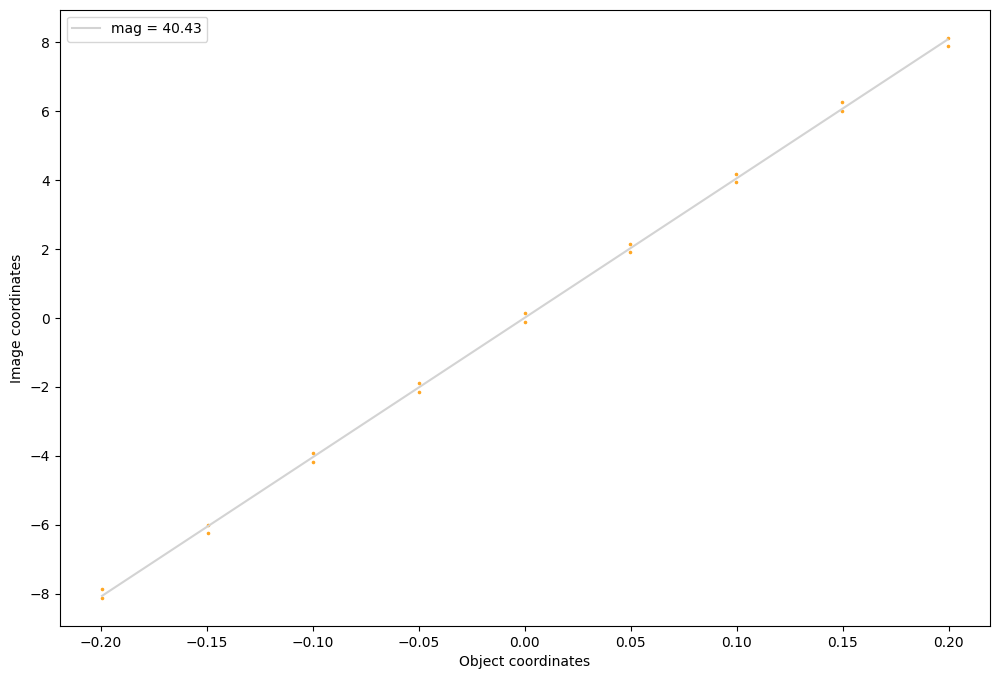

# Pinhole camera


```python
import torchlensmaker as tlm

optics = tlm.Sequential(
    tlm.ObjectAtInfinity(beam_diameter=12, angular_size=40),
    tlm.Gap(25),
    tlm.Aperture(diameter=.5),
    tlm.Gap(40),
    tlm.ImagePlane(diameter=50),
)

sampling = {"base": 50, "object": 15, "sampler": "uniform"}
tlm.show(optics, dim=2, sampling=sampling)
tlm.plot_magnification(optics, sampling=sampling)
```


<div data-jp-suppress-context-menu id='tlmviewer-d80e501f' class='tlmviewer' style='width: 100%; aspect-ratio: 16 / 9;'></div><script type='module'>async function importtlm() {
    try {
        return await import("/tlmviewer.js");
    } catch (error) {
        console.log("error", error);
        return await import("/files/test_notebooks/tlmviewer.js");
    }
}

const module = await importtlm();
const tlmviewer = module.tlmviewer;

const data = '{"mode": "2D", "camera": "XY", "data": [{"type": "surfaces", "data": [{"matrix": [[1.0, 0.0, 25.0], [0.0, 1.0, 0.0], [0.0, 0.0, 1.0]], "samples": [[0.0, -0.25], [0.0, -0.24747474], [0.0, -0.24494949], [0.0, -0.24242425], [0.0, -0.23989899], [0.0, -0.23737374], [0.0, -0.23484848], [0.0, -0.23232323], [0.0, -0.22979797], [0.0, -0.22727273], [0.0, -0.22474748], [0.0, -0.22222222], [0.0, -0.21969697], [0.0, -0.21717171], [0.0, -0.21464646], [0.0, -0.21212122], [0.0, -0.20959596], [0.0, -0.20707071], [0.0, -0.20454545], [0.0, -0.2020202], [0.0, -0.19949494], [0.0, -0.1969697], [0.0, -0.19444445], [0.0, -0.19191919], [0.0, -0.18939394], [0.0, -0.18686868], [0.0, -0.18434343], [0.0, -0.18181819], [0.0, -0.17929293], [0.0, -0.17676768], [0.0, -0.17424242], [0.0, -0.17171717], [0.0, -0.16919193], [0.0, -0.16666667], [0.0, -0.16414142], [0.0, -0.16161616], [0.0, -0.15909091], [0.0, -0.15656565], [0.0, -0.15404041], [0.0, -0.15151516], [0.0, -0.1489899], [0.0, -0.14646465], [0.0, -0.14393939], [0.0, -0.14141414], [0.0, -0.1388889], [0.0, -0.13636364], [0.0, -0.13383839], [0.0, -0.13131313], [0.0, -0.12878788], [0.0, -0.12626262], [0.0, -0.12373737], [0.0, -0.12121212], [0.0, -0.11868687], [0.0, -0.11616161], [0.0, -0.11363637], [0.0, -0.11111111], [0.0, -0.10858586], [0.0, -0.10606061], [0.0, -0.10353535], [0.0, -0.1010101], [0.0, -0.09848485], [0.0, -0.0959596], [0.0, -0.09343434], [0.0, -0.09090909], [0.0, -0.08838384], [0.0, -0.08585858], [0.0, -0.08333334], [0.0, -0.08080808], [0.0, -0.07828283], [0.0, -0.07575758], [0.0, -0.07323232], [0.0, -0.07070707], [0.0, -0.06818182], [0.0, -0.06565657], [0.0, -0.06313131], [0.0, -0.06060606], [0.0, -0.05808081], [0.0, -0.05555556], [0.0, -0.0530303], [0.0, -0.05050505], [0.0, -0.0479798], [0.0, -0.04545455], [0.0, -0.04292929], [0.0, -0.04040404], [0.0, -0.03787879], [0.0, -0.03535353], [0.0, -0.03282828], [0.0, -0.03030303], [0.0, -0.02777778], [0.0, -0.02525252], [0.0, -0.02272727], [0.0, -0.02020202], [0.0, -0.01767677], [0.0, -0.01515152], [0.0, -0.01262626], [0.0, -0.01010101], [0.0, -0.00757576], [0.0, -0.00505051], [0.0, -0.00252525], [0.0, 0.0], [0.0, 0.00252525], [0.0, 0.00505051], [0.0, 0.00757576], [0.0, 0.01010101], [0.0, 0.01262626], [0.0, 0.01515152], [0.0, 0.01767677], [0.0, 0.02020202], [0.0, 0.02272727], [0.0, 0.02525252], [0.0, 0.02777778], [0.0, 0.03030303], [0.0, 0.03282828], [0.0, 0.03535353], [0.0, 0.03787879], [0.0, 0.04040404], [0.0, 0.04292929], [0.0, 0.04545455], [0.0, 0.0479798], [0.0, 0.05050505], [0.0, 0.0530303], [0.0, 0.05555556], [0.0, 0.05808081], [0.0, 0.06060606], [0.0, 0.06313131], [0.0, 0.06565657], [0.0, 0.06818182], [0.0, 0.07070707], [0.0, 0.07323232], [0.0, 0.07575758], [0.0, 0.07828283], [0.0, 0.08080808], [0.0, 0.08333334], [0.0, 0.08585858], [0.0, 0.08838384], [0.0, 0.09090909], [0.0, 0.09343434], [0.0, 0.0959596], [0.0, 0.09848485], [0.0, 0.1010101], [0.0, 0.10353535], [0.0, 0.10606061], [0.0, 0.10858586], [0.0, 0.11111111], [0.0, 0.11363637], [0.0, 0.11616161], [0.0, 0.11868687], [0.0, 0.12121212], [0.0, 0.12373737], [0.0, 0.12626262], [0.0, 0.12878788], [0.0, 0.13131313], [0.0, 0.13383839], [0.0, 0.13636364], [0.0, 0.1388889], [0.0, 0.14141414], [0.0, 0.14393939], [0.0, 0.14646465], [0.0, 0.1489899], [0.0, 0.15151516], [0.0, 0.15404041], [0.0, 0.15656565], [0.0, 0.15909091], [0.0, 0.16161616], [0.0, 0.16414142], [0.0, 0.16666667], [0.0, 0.16919193], [0.0, 0.17171717], [0.0, 0.17424242], [0.0, 0.17676768], [0.0, 0.17929293], [0.0, 0.18181819], [0.0, 0.18434343], [0.0, 0.18686868], [0.0, 0.18939394], [0.0, 0.19191919], [0.0, 0.19444445], [0.0, 0.1969697], [0.0, 0.19949494], [0.0, 0.2020202], [0.0, 0.20454545], [0.0, 0.20707071], [0.0, 0.20959596], [0.0, 0.21212122], [0.0, 0.21464646], [0.0, 0.21717171], [0.0, 0.21969697], [0.0, 0.22222222], [0.0, 0.22474748], [0.0, 0.22727273], [0.0, 0.22979797], [0.0, 0.23232323], [0.0, 0.23484848], [0.0, 0.23737374], [0.0, 0.23989899], [0.0, 0.24242425], [0.0, 0.24494949], [0.0, 0.24747474], [0.0, 0.25]]}]}, {"type": "surfaces", "data": [{"matrix": [[1.0, 0.0, 65.0], [0.0, 1.0, 0.0], [0.0, 0.0, 1.0]], "samples": [[0.0, -25.0], [0.0, -24.74747467], [0.0, -24.49494934], [0.0, -24.24242401], [0.0, -23.98989868], [0.0, -23.73737335], [0.0, -23.48484802], [0.0, -23.23232269], [0.0, -22.97979736], [0.0, -22.72727203], [0.0, -22.4747467], [0.0, -22.22222328], [0.0, -21.96969795], [0.0, -21.71717262], [0.0, -21.46464729], [0.0, -21.21212196], [0.0, -20.95959663], [0.0, -20.7070713], [0.0, -20.45454597], [0.0, -20.20202065], [0.0, -19.94949532], [0.0, -19.69696999], [0.0, -19.44444466], [0.0, -19.19191933], [0.0, -18.939394], [0.0, -18.68686867], [0.0, -18.43434334], [0.0, -18.18181801], [0.0, -17.92929268], [0.0, -17.67676735], [0.0, -17.42424202], [0.0, -17.17171669], [0.0, -16.91919327], [0.0, -16.66666794], [0.0, -16.41414261], [0.0, -16.16161728], [0.0, -15.909091], [0.0, -15.65656567], [0.0, -15.40404129], [0.0, -15.15151596], [0.0, -14.89899063], [0.0, -14.6464653], [0.0, -14.39393997], [0.0, -14.14141464], [0.0, -13.88888931], [0.0, -13.63636398], [0.0, -13.38383865], [0.0, -13.13131332], [0.0, -12.87878799], [0.0, -12.62626362], [0.0, -12.37373638], [0.0, -12.12121201], [0.0, -11.86868668], [0.0, -11.61616135], [0.0, -11.36363602], [0.0, -11.11111069], [0.0, -10.85858536], [0.0, -10.60606003], [0.0, -10.3535347], [0.0, -10.10100937], [0.0, -9.84848404], [0.0, -9.59595871], [0.0, -9.34343433], [0.0, -9.090909], [0.0, -8.83838367], [0.0, -8.58585835], [0.0, -8.33333302], [0.0, -8.08080769], [0.0, -7.82828236], [0.0, -7.57575703], [0.0, -7.32323217], [0.0, -7.07070684], [0.0, -6.81818151], [0.0, -6.56565619], [0.0, -6.31313086], [0.0, -6.060606], [0.0, -5.80808067], [0.0, -5.55555534], [0.0, -5.30303001], [0.0, -5.05050468], [0.0, -4.79797935], [0.0, -4.5454545], [0.0, -4.29292917], [0.0, -4.04040384], [0.0, -3.78787851], [0.0, -3.53535342], [0.0, -3.28282809], [0.0, -3.030303], [0.0, -2.77777767], [0.0, -2.52525234], [0.0, -2.27272725], [0.0, -2.02020192], [0.0, -1.76767671], [0.0, -1.5151515], [0.0, -1.26262617], [0.0, -1.01010096], [0.0, -0.75757575], [0.0, -0.50505048], [0.0, -0.25252524], [0.0, 0.0], [0.0, 0.25252524], [0.0, 0.50505048], [0.0, 0.75757575], [0.0, 1.01010096], [0.0, 1.26262617], [0.0, 1.5151515], [0.0, 1.76767671], [0.0, 2.02020192], [0.0, 2.27272725], [0.0, 2.52525234], [0.0, 2.77777767], [0.0, 3.030303], [0.0, 3.28282809], [0.0, 3.53535342], [0.0, 3.78787851], [0.0, 4.04040384], [0.0, 4.29292917], [0.0, 4.5454545], [0.0, 4.79797935], [0.0, 5.05050468], [0.0, 5.30303001], [0.0, 5.55555534], [0.0, 5.80808067], [0.0, 6.060606], [0.0, 6.31313086], [0.0, 6.56565619], [0.0, 6.81818151], [0.0, 7.07070684], [0.0, 7.32323217], [0.0, 7.57575703], [0.0, 7.82828236], [0.0, 8.08080769], [0.0, 8.33333302], [0.0, 8.58585835], [0.0, 8.83838367], [0.0, 9.090909], [0.0, 9.34343433], [0.0, 9.59595871], [0.0, 9.84848404], [0.0, 10.10100937], [0.0, 10.3535347], [0.0, 10.60606003], [0.0, 10.85858536], [0.0, 11.11111069], [0.0, 11.36363602], [0.0, 11.61616135], [0.0, 11.86868668], [0.0, 12.12121201], [0.0, 12.37373638], [0.0, 12.62626362], [0.0, 12.87878799], [0.0, 13.13131332], [0.0, 13.38383865], [0.0, 13.63636398], [0.0, 13.88888931], [0.0, 14.14141464], [0.0, 14.39393997], [0.0, 14.6464653], [0.0, 14.89899063], [0.0, 15.15151596], [0.0, 15.40404129], [0.0, 15.65656567], [0.0, 15.909091], [0.0, 16.16161728], [0.0, 16.41414261], [0.0, 16.66666794], [0.0, 16.91919327], [0.0, 17.17171669], [0.0, 17.42424202], [0.0, 17.67676735], [0.0, 17.92929268], [0.0, 18.18181801], [0.0, 18.43434334], [0.0, 18.68686867], [0.0, 18.939394], [0.0, 19.19191933], [0.0, 19.44444466], [0.0, 19.69696999], [0.0, 19.94949532], [0.0, 20.20202065], [0.0, 20.45454597], [0.0, 20.7070713], [0.0, 20.95959663], [0.0, 21.21212196], [0.0, 21.46464729], [0.0, 21.71717262], [0.0, 21.96969795], [0.0, 22.22222328], [0.0, 22.4747467], [0.0, 22.72727203], [0.0, 22.97979736], [0.0, 23.23232269], [0.0, 23.48484802], [0.0, 23.73737335], [0.0, 23.98989868], [0.0, 24.24242401], [0.0, 24.49494934], [0.0, 24.74747467], [0.0, 25.0]]}]}, {"type": "rays", "points": [[0.0, -5.26530612, 25.0, -0.21144709], [0.0, -5.02040816, 25.0, 0.03345087], [0.0, -3.79591837, 25.0, -0.02777466], [0.0, -3.55102041, 25.0, 0.2171233], [0.0, -2.57142857, 25.0, -0.06980126], [0.0, -2.32653061, 25.0, 0.1750967], [0.0, -1.34693878, 25.0, -0.09924065], [0.0, -1.10204082, 25.0, 0.14565731], [0.0, -0.12244898, 25.0, -0.12244898], [0.0, 0.12244898, 25.0, 0.12244898], [0.0, 1.10204082, 25.0, -0.14565731], [0.0, 1.34693878, 25.0, 0.09924065], [0.0, 2.32653061, 25.0, -0.1750967], [0.0, 2.57142857, 25.0, 0.06980126], [0.0, 3.55102041, 25.0, -0.2171233], [0.0, 3.79591837, 25.0, 0.02777466], [0.0, 5.02040816, 25.0, -0.03345087], [0.0, 5.26530612, 25.0, 0.21144709]], "color": "#ffa724", "variables": {"base": [[-5.26530612], [-5.02040816], [-3.79591837], [-3.55102041], [-2.57142857], [-2.32653061], [-1.34693878], [-1.10204082], [-0.12244898], [0.12244898], [1.10204082], [1.34693878], [2.32653061], [2.57142857], [3.55102041], [3.79591837], [5.02040816], [5.26530612]], "object": [[0.1994662], [0.1994662], [0.14959965], [0.14959965], [0.0997331], [0.0997331], [0.04986655], [0.04986655], [0.0], [0.0], [-0.04986655], [-0.04986655], [-0.0997331], [-0.0997331], [-0.14959965], [-0.14959965], [-0.1994662], [-0.1994662]]}, "domain": {"base": [-6.0, 6.0], "object": [-0.34906585, 0.34906585]}, "layers": [1]}, {"type": "rays", "points": [[0.0, -6.0, 25.0, -15.09925586], [0.0, -6.0, 25.0, -13.71147872], [0.0, -6.0, 25.0, -12.3657822], [0.0, -6.0, 25.0, -11.05385903], [0.0, -6.0, 25.0, -9.76814371], [0.0, -6.0, 25.0, -8.50162731], [0.0, -6.0, 25.0, -7.24769813], [0.0, -6.0, 25.0, -6.0], [0.0, -6.0, 25.0, -4.75230187], [0.0, -6.0, 25.0, -3.49837269], [0.0, -6.0, 25.0, -2.23185629], [0.0, -6.0, 25.0, -0.94614097], [0.0, -6.0, 25.0, 0.3657822], [0.0, -6.0, 25.0, 1.71147872], [0.0, -6.0, 25.0, 3.09925586], [0.0, -5.75510204, 25.0, -14.8543579], [0.0, -5.75510204, 25.0, -13.46658076], [0.0, -5.75510204, 25.0, -12.12088424], [0.0, -5.75510204, 25.0, -10.80896107], [0.0, -5.75510204, 25.0, -9.52324575], [0.0, -5.75510204, 25.0, -8.25672935], [0.0, -5.75510204, 25.0, -7.00280017], [0.0, -5.75510204, 25.0, -5.75510204], [0.0, -5.75510204, 25.0, -4.50740391], [0.0, -5.75510204, 25.0, -3.25347473], [0.0, -5.75510204, 25.0, -1.98695833], [0.0, -5.75510204, 25.0, -0.70124301], [0.0, -5.75510204, 25.0, 0.61068016], [0.0, -5.75510204, 25.0, 1.95637668], [0.0, -5.75510204, 25.0, 3.34415382], [0.0, -5.51020408, 25.0, -14.60945994], [0.0, -5.51020408, 25.0, -13.2216828], [0.0, -5.51020408, 25.0, -11.87598628], [0.0, -5.51020408, 25.0, -10.56406311], [0.0, -5.51020408, 25.0, -9.27834779], [0.0, -5.51020408, 25.0, -8.01183139], [0.0, -5.51020408, 25.0, -6.75790221], [0.0, -5.51020408, 25.0, -5.51020408], [0.0, -5.51020408, 25.0, -4.26250595], [0.0, -5.51020408, 25.0, -3.00857677], [0.0, -5.51020408, 25.0, -1.74206038], [0.0, -5.51020408, 25.0, -0.45634505], [0.0, -5.51020408, 25.0, 0.85557812], [0.0, -5.51020408, 25.0, 2.20127464], [0.0, -5.51020408, 25.0, 3.58905178], [0.0, -5.26530612, 25.0, -14.36456198], [0.0, -5.26530612, 25.0, -12.97678485], [0.0, -5.26530612, 25.0, -11.63108833], [0.0, -5.26530612, 25.0, -10.31916515], [0.0, -5.26530612, 25.0, -9.03344983], [0.0, -5.26530612, 25.0, -7.76693344], [0.0, -5.26530612, 25.0, -6.51300425], [0.0, -5.26530612, 25.0, -5.26530612], [0.0, -5.26530612, 25.0, -4.01760799], [0.0, -5.26530612, 25.0, -2.76367881], [0.0, -5.26530612, 25.0, -1.49716242], [0.0, -5.26530612, 25.0, 1.10047608], [0.0, -5.26530612, 25.0, 2.4461726], [0.0, -5.26530612, 25.0, 3.83394973], [0.0, -5.02040816, 25.0, -14.11966402], [0.0, -5.02040816, 25.0, -12.73188689], [0.0, -5.02040816, 25.0, -11.38619037], [0.0, -5.02040816, 25.0, -10.07426719], [0.0, -5.02040816, 25.0, -8.78855187], [0.0, -5.02040816, 25.0, -7.52203548], [0.0, -5.02040816, 25.0, -6.26810629], [0.0, -5.02040816, 25.0, -5.02040816], [0.0, -5.02040816, 25.0, -3.77271003], [0.0, -5.02040816, 25.0, -2.51878085], [0.0, -5.02040816, 25.0, -1.25226446], [0.0, -5.02040816, 25.0, 1.34537404], [0.0, -5.02040816, 25.0, 2.69107056], [0.0, -5.02040816, 25.0, 4.07884769], [0.0, -4.7755102, 25.0, -13.87476606], [0.0, -4.7755102, 25.0, -12.48698893], [0.0, -4.7755102, 25.0, -11.14129241], [0.0, -4.7755102, 25.0, -9.82936924], [0.0, -4.7755102, 25.0, -8.54365391], [0.0, -4.7755102, 25.0, -7.27713752], [0.0, -4.7755102, 25.0, -6.02320833], [0.0, -4.7755102, 25.0, -4.7755102], [0.0, -4.7755102, 25.0, -3.52781208], [0.0, -4.7755102, 25.0, -2.27388289], [0.0, -4.7755102, 25.0, -1.0073665], [0.0, -4.7755102, 25.0, 0.27834883], [0.0, -4.7755102, 25.0, 1.590272], [0.0, -4.7755102, 25.0, 2.93596852], [0.0, -4.7755102, 25.0, 4.32374565], [0.0, -4.53061224, 25.0, -13.6298681], [0.0, -4.53061224, 25.0, -12.24209097], [0.0, -4.53061224, 25.0, -10.89639445], [0.0, -4.53061224, 25.0, -9.58447128], [0.0, -4.53061224, 25.0, -8.29875595], [0.0, -4.53061224, 25.0, -7.03223956], [0.0, -4.53061224, 25.0, -5.77831037], [0.0, -4.53061224, 25.0, -4.53061224], [0.0, -4.53061224, 25.0, -3.28291412], [0.0, -4.53061224, 25.0, -2.02898493], [0.0, -4.53061224, 25.0, -0.76246854], [0.0, -4.53061224, 25.0, 0.52324679], [0.0, -4.53061224, 25.0, 1.83516996], [0.0, -4.53061224, 25.0, 3.18086648], [0.0, -4.53061224, 25.0, 4.56864361], [0.0, -4.28571429, 25.0, -13.38497014], [0.0, -4.28571429, 25.0, -11.99719301], [0.0, -4.28571429, 25.0, -10.65149649], [0.0, -4.28571429, 25.0, -9.33957332], [0.0, -4.28571429, 25.0, -8.05385799], [0.0, -4.28571429, 25.0, -6.7873416], [0.0, -4.28571429, 25.0, -5.53341241], [0.0, -4.28571429, 25.0, -4.28571429], [0.0, -4.28571429, 25.0, -3.03801616], [0.0, -4.28571429, 25.0, -1.78408697], [0.0, -4.28571429, 25.0, -0.51757058], [0.0, -4.28571429, 25.0, 0.76814475], [0.0, -4.28571429, 25.0, 2.08006792], [0.0, -4.28571429, 25.0, 3.42576444], [0.0, -4.28571429, 25.0, 4.81354157], [0.0, -4.04081633, 25.0, -13.14007218], [0.0, -4.04081633, 25.0, -11.75229505], [0.0, -4.04081633, 25.0, -10.40659853], [0.0, -4.04081633, 25.0, -9.09467536], [0.0, -4.04081633, 25.0, -7.80896003], [0.0, -4.04081633, 25.0, -6.54244364], [0.0, -4.04081633, 25.0, -5.28851446], [0.0, -4.04081633, 25.0, -4.04081633], [0.0, -4.04081633, 25.0, -2.7931182], [0.0, -4.04081633, 25.0, -1.53918901], [0.0, -4.04081633, 25.0, -0.27267262], [0.0, -4.04081633, 25.0, 1.0130427], [0.0, -4.04081633, 25.0, 2.32496588], [0.0, -4.04081633, 25.0, 3.6706624], [0.0, -4.04081633, 25.0, 5.05843953], [0.0, -3.79591837, 25.0, -12.89517422], [0.0, -3.79591837, 25.0, -11.50739709], [0.0, -3.79591837, 25.0, -10.16170057], [0.0, -3.79591837, 25.0, -8.8497774], [0.0, -3.79591837, 25.0, -7.56406207], [0.0, -3.79591837, 25.0, -6.29754568], [0.0, -3.79591837, 25.0, -5.0436165], [0.0, -3.79591837, 25.0, -3.79591837], [0.0, -3.79591837, 25.0, -2.54822024], [0.0, -3.79591837, 25.0, -1.29429105], [0.0, -3.79591837, 25.0, 1.25794066], [0.0, -3.79591837, 25.0, 2.56986384], [0.0, -3.79591837, 25.0, 3.91556036], [0.0, -3.79591837, 25.0, 5.30333749], [0.0, -3.55102041, 25.0, -12.65027626], [0.0, -3.55102041, 25.0, -11.26249913], [0.0, -3.55102041, 25.0, -9.91680261], [0.0, -3.55102041, 25.0, -8.60487944], [0.0, -3.55102041, 25.0, -7.31916411], [0.0, -3.55102041, 25.0, -6.05264772], [0.0, -3.55102041, 25.0, -4.79871854], [0.0, -3.55102041, 25.0, -3.55102041], [0.0, -3.55102041, 25.0, -2.30332228], [0.0, -3.55102041, 25.0, -1.0493931], [0.0, -3.55102041, 25.0, 1.50283862], [0.0, -3.55102041, 25.0, 2.8147618], [0.0, -3.55102041, 25.0, 4.16045832], [0.0, -3.55102041, 25.0, 5.54823545], [0.0, -3.30612245, 25.0, -12.40537831], [0.0, -3.30612245, 25.0, -11.01760117], [0.0, -3.30612245, 25.0, -9.67190465], [0.0, -3.30612245, 25.0, -8.35998148], [0.0, -3.30612245, 25.0, -7.07426616], [0.0, -3.30612245, 25.0, -5.80774976], [0.0, -3.30612245, 25.0, -4.55382058], [0.0, -3.30612245, 25.0, -3.30612245], [0.0, -3.30612245, 25.0, -2.05842432], [0.0, -3.30612245, 25.0, -0.80449514], [0.0, -3.30612245, 25.0, 0.46202126], [0.0, -3.30612245, 25.0, 1.74773658], [0.0, -3.30612245, 25.0, 3.05965975], [0.0, -3.30612245, 25.0, 4.40535627], [0.0, -3.30612245, 25.0, 5.79313341], [0.0, -3.06122449, 25.0, -12.16048035], [0.0, -3.06122449, 25.0, -10.77270321], [0.0, -3.06122449, 25.0, -9.42700669], [0.0, -3.06122449, 25.0, -8.11508352], [0.0, -3.06122449, 25.0, -6.8293682], [0.0, -3.06122449, 25.0, -5.5628518], [0.0, -3.06122449, 25.0, -4.30892262], [0.0, -3.06122449, 25.0, -3.06122449], [0.0, -3.06122449, 25.0, -1.81352636], [0.0, -3.06122449, 25.0, -0.55959718], [0.0, -3.06122449, 25.0, 0.70691922], [0.0, -3.06122449, 25.0, 1.99263454], [0.0, -3.06122449, 25.0, 3.30455771], [0.0, -3.06122449, 25.0, 4.65025423], [0.0, -3.06122449, 25.0, 6.03803137], [0.0, -2.81632653, 25.0, -11.91558239], [0.0, -2.81632653, 25.0, -10.52780525], [0.0, -2.81632653, 25.0, -9.18210873], [0.0, -2.81632653, 25.0, -7.87018556], [0.0, -2.81632653, 25.0, -6.58447024], [0.0, -2.81632653, 25.0, -5.31795384], [0.0, -2.81632653, 25.0, -4.06402466], [0.0, -2.81632653, 25.0, -2.81632653], [0.0, -2.81632653, 25.0, -1.5686284], [0.0, -2.81632653, 25.0, -0.31469922], [0.0, -2.81632653, 25.0, 0.95181718], [0.0, -2.81632653, 25.0, 2.2375325], [0.0, -2.81632653, 25.0, 3.54945567], [0.0, -2.81632653, 25.0, 4.89515219], [0.0, -2.81632653, 25.0, 6.28292933], [0.0, -2.57142857, 25.0, -11.67068443], [0.0, -2.57142857, 25.0, -10.28290729], [0.0, -2.57142857, 25.0, -8.93721077], [0.0, -2.57142857, 25.0, -7.6252876], [0.0, -2.57142857, 25.0, -6.33957228], [0.0, -2.57142857, 25.0, -5.07305588], [0.0, -2.57142857, 25.0, -3.8191267], [0.0, -2.57142857, 25.0, -2.57142857], [0.0, -2.57142857, 25.0, -1.32373044], [0.0, -2.57142857, 25.0, 1.19671513], [0.0, -2.57142857, 25.0, 2.48243046], [0.0, -2.57142857, 25.0, 3.79435363], [0.0, -2.57142857, 25.0, 5.14005015], [0.0, -2.57142857, 25.0, 6.52782729], [0.0, -2.32653061, 25.0, -11.42578647], [0.0, -2.32653061, 25.0, -10.03800934], [0.0, -2.32653061, 25.0, -8.69231282], [0.0, -2.32653061, 25.0, -7.38038964], [0.0, -2.32653061, 25.0, -6.09467432], [0.0, -2.32653061, 25.0, -4.82815793], [0.0, -2.32653061, 25.0, -3.57422874], [0.0, -2.32653061, 25.0, -2.32653061], [0.0, -2.32653061, 25.0, -1.07883248], [0.0, -2.32653061, 25.0, 1.44161309], [0.0, -2.32653061, 25.0, 2.72732842], [0.0, -2.32653061, 25.0, 4.03925159], [0.0, -2.32653061, 25.0, 5.38494811], [0.0, -2.32653061, 25.0, 6.77272524], [0.0, -2.08163265, 25.0, -11.18088851], [0.0, -2.08163265, 25.0, -9.79311138], [0.0, -2.08163265, 25.0, -8.44741486], [0.0, -2.08163265, 25.0, -7.13549168], [0.0, -2.08163265, 25.0, -5.84977636], [0.0, -2.08163265, 25.0, -4.58325997], [0.0, -2.08163265, 25.0, -3.32933078], [0.0, -2.08163265, 25.0, -2.08163265], [0.0, -2.08163265, 25.0, -0.83393452], [0.0, -2.08163265, 25.0, 0.41999466], [0.0, -2.08163265, 25.0, 1.68651105], [0.0, -2.08163265, 25.0, 2.97222638], [0.0, -2.08163265, 25.0, 4.28414955], [0.0, -2.08163265, 25.0, 5.62984607], [0.0, -2.08163265, 25.0, 7.0176232], [0.0, -1.83673469, 25.0, -10.93599055], [0.0, -1.83673469, 25.0, -9.54821342], [0.0, -1.83673469, 25.0, -8.2025169], [0.0, -1.83673469, 25.0, -6.89059373], [0.0, -1.83673469, 25.0, -5.6048784], [0.0, -1.83673469, 25.0, -4.33836201], [0.0, -1.83673469, 25.0, -3.08443282], [0.0, -1.83673469, 25.0, -1.83673469], [0.0, -1.83673469, 25.0, -0.58903657], [0.0, -1.83673469, 25.0, 0.66489262], [0.0, -1.83673469, 25.0, 1.93140901], [0.0, -1.83673469, 25.0, 3.21712434], [0.0, -1.83673469, 25.0, 4.52904751], [0.0, -1.83673469, 25.0, 5.87474403], [0.0, -1.83673469, 25.0, 7.26252116], [0.0, -1.59183673, 25.0, -10.69109259], [0.0, -1.59183673, 25.0, -9.30331546], [0.0, -1.59183673, 25.0, -7.95761894], [0.0, -1.59183673, 25.0, -6.64569577], [0.0, -1.59183673, 25.0, -5.35998044], [0.0, -1.59183673, 25.0, -4.09346405], [0.0, -1.59183673, 25.0, -2.83953486], [0.0, -1.59183673, 25.0, -1.59183673], [0.0, -1.59183673, 25.0, -0.34413861], [0.0, -1.59183673, 25.0, 0.90979058], [0.0, -1.59183673, 25.0, 2.17630697], [0.0, -1.59183673, 25.0, 3.4620223], [0.0, -1.59183673, 25.0, 4.77394547], [0.0, -1.59183673, 25.0, 6.11964199], [0.0, -1.59183673, 25.0, 7.50741912], [0.0, -1.34693878, 25.0, -10.44619463], [0.0, -1.34693878, 25.0, -9.0584175], [0.0, -1.34693878, 25.0, -7.71272098], [0.0, -1.34693878, 25.0, -6.40079781], [0.0, -1.34693878, 25.0, -5.11508248], [0.0, -1.34693878, 25.0, -3.84856609], [0.0, -1.34693878, 25.0, -2.5946369], [0.0, -1.34693878, 25.0, -1.34693878], [0.0, -1.34693878, 25.0, 1.15468854], [0.0, -1.34693878, 25.0, 2.42120493], [0.0, -1.34693878, 25.0, 3.70692026], [0.0, -1.34693878, 25.0, 5.01884343], [0.0, -1.34693878, 25.0, 6.36453995], [0.0, -1.34693878, 25.0, 7.75231708], [0.0, -1.10204082, 25.0, -10.20129667], [0.0, -1.10204082, 25.0, -8.81351954], [0.0, -1.10204082, 25.0, -7.46782302], [0.0, -1.10204082, 25.0, -6.15589985], [0.0, -1.10204082, 25.0, -4.87018452], [0.0, -1.10204082, 25.0, -3.60366813], [0.0, -1.10204082, 25.0, -2.34973894], [0.0, -1.10204082, 25.0, -1.10204082], [0.0, -1.10204082, 25.0, 1.3995865], [0.0, -1.10204082, 25.0, 2.66610289], [0.0, -1.10204082, 25.0, 3.95181822], [0.0, -1.10204082, 25.0, 5.26374139], [0.0, -1.10204082, 25.0, 6.60943791], [0.0, -1.10204082, 25.0, 7.99721504], [0.0, -0.85714286, 25.0, -9.95639871], [0.0, -0.85714286, 25.0, -8.56862158], [0.0, -0.85714286, 25.0, -7.22292506], [0.0, -0.85714286, 25.0, -5.91100189], [0.0, -0.85714286, 25.0, -4.62528656], [0.0, -0.85714286, 25.0, -3.35877017], [0.0, -0.85714286, 25.0, -2.10484099], [0.0, -0.85714286, 25.0, -0.85714286], [0.0, -0.85714286, 25.0, 0.39055527], [0.0, -0.85714286, 25.0, 1.64448446], [0.0, -0.85714286, 25.0, 2.91100085], [0.0, -0.85714286, 25.0, 4.19671617], [0.0, -0.85714286, 25.0, 5.50863935], [0.0, -0.85714286, 25.0, 6.85433587], [0.0, -0.85714286, 25.0, 8.242113], [0.0, -0.6122449, 25.0, -9.71150075], [0.0, -0.6122449, 25.0, -8.32372362], [0.0, -0.6122449, 25.0, -6.9780271], [0.0, -0.6122449, 25.0, -5.66610393], [0.0, -0.6122449, 25.0, -4.3803886], [0.0, -0.6122449, 25.0, -3.11387221], [0.0, -0.6122449, 25.0, -1.85994303], [0.0, -0.6122449, 25.0, -0.6122449], [0.0, -0.6122449, 25.0, 0.63545323], [0.0, -0.6122449, 25.0, 1.88938242], [0.0, -0.6122449, 25.0, 3.15589881], [0.0, -0.6122449, 25.0, 4.44161413], [0.0, -0.6122449, 25.0, 5.75353731], [0.0, -0.6122449, 25.0, 7.09923383], [0.0, -0.6122449, 25.0, 8.48701096], [0.0, -0.36734694, 25.0, -9.4666028], [0.0, -0.36734694, 25.0, -8.07882566], [0.0, -0.36734694, 25.0, -6.73312914], [0.0, -0.36734694, 25.0, -5.42120597], [0.0, -0.36734694, 25.0, -4.13549065], [0.0, -0.36734694, 25.0, -2.86897425], [0.0, -0.36734694, 25.0, -1.61504507], [0.0, -0.36734694, 25.0, -0.36734694], [0.0, -0.36734694, 25.0, 0.88035119], [0.0, -0.36734694, 25.0, 2.13428037], [0.0, -0.36734694, 25.0, 3.40079677], [0.0, -0.36734694, 25.0, 4.68651209], [0.0, -0.36734694, 25.0, 5.99843526], [0.0, -0.36734694, 25.0, 7.34413178], [0.0, -0.36734694, 25.0, 8.73190892], [0.0, -0.12244898, 25.0, -9.22170484], [0.0, -0.12244898, 25.0, -7.8339277], [0.0, -0.12244898, 25.0, -6.48823118], [0.0, -0.12244898, 25.0, -5.17630801], [0.0, -0.12244898, 25.0, -3.89059269], [0.0, -0.12244898, 25.0, -2.62407629], [0.0, -0.12244898, 25.0, -1.37014711], [0.0, -0.12244898, 25.0, 1.12524915], [0.0, -0.12244898, 25.0, 2.37917833], [0.0, -0.12244898, 25.0, 3.64569473], [0.0, -0.12244898, 25.0, 4.93141005], [0.0, -0.12244898, 25.0, 6.24333322], [0.0, -0.12244898, 25.0, 7.58902974], [0.0, -0.12244898, 25.0, 8.97680688], [0.0, 0.12244898, 25.0, -8.97680688], [0.0, 0.12244898, 25.0, -7.58902974], [0.0, 0.12244898, 25.0, -6.24333322], [0.0, 0.12244898, 25.0, -4.93141005], [0.0, 0.12244898, 25.0, -3.64569473], [0.0, 0.12244898, 25.0, -2.37917833], [0.0, 0.12244898, 25.0, -1.12524915], [0.0, 0.12244898, 25.0, 1.37014711], [0.0, 0.12244898, 25.0, 2.62407629], [0.0, 0.12244898, 25.0, 3.89059269], [0.0, 0.12244898, 25.0, 5.17630801], [0.0, 0.12244898, 25.0, 6.48823118], [0.0, 0.12244898, 25.0, 7.8339277], [0.0, 0.12244898, 25.0, 9.22170484], [0.0, 0.36734694, 25.0, -8.73190892], [0.0, 0.36734694, 25.0, -7.34413178], [0.0, 0.36734694, 25.0, -5.99843526], [0.0, 0.36734694, 25.0, -4.68651209], [0.0, 0.36734694, 25.0, -3.40079677], [0.0, 0.36734694, 25.0, -2.13428037], [0.0, 0.36734694, 25.0, -0.88035119], [0.0, 0.36734694, 25.0, 0.36734694], [0.0, 0.36734694, 25.0, 1.61504507], [0.0, 0.36734694, 25.0, 2.86897425], [0.0, 0.36734694, 25.0, 4.13549065], [0.0, 0.36734694, 25.0, 5.42120597], [0.0, 0.36734694, 25.0, 6.73312914], [0.0, 0.36734694, 25.0, 8.07882566], [0.0, 0.36734694, 25.0, 9.4666028], [0.0, 0.6122449, 25.0, -8.48701096], [0.0, 0.6122449, 25.0, -7.09923383], [0.0, 0.6122449, 25.0, -5.75353731], [0.0, 0.6122449, 25.0, -4.44161413], [0.0, 0.6122449, 25.0, -3.15589881], [0.0, 0.6122449, 25.0, -1.88938242], [0.0, 0.6122449, 25.0, -0.63545323], [0.0, 0.6122449, 25.0, 0.6122449], [0.0, 0.6122449, 25.0, 1.85994303], [0.0, 0.6122449, 25.0, 3.11387221], [0.0, 0.6122449, 25.0, 4.3803886], [0.0, 0.6122449, 25.0, 5.66610393], [0.0, 0.6122449, 25.0, 6.9780271], [0.0, 0.6122449, 25.0, 8.32372362], [0.0, 0.6122449, 25.0, 9.71150075], [0.0, 0.85714286, 25.0, -8.242113], [0.0, 0.85714286, 25.0, -6.85433587], [0.0, 0.85714286, 25.0, -5.50863935], [0.0, 0.85714286, 25.0, -4.19671617], [0.0, 0.85714286, 25.0, -2.91100085], [0.0, 0.85714286, 25.0, -1.64448446], [0.0, 0.85714286, 25.0, -0.39055527], [0.0, 0.85714286, 25.0, 0.85714286], [0.0, 0.85714286, 25.0, 2.10484099], [0.0, 0.85714286, 25.0, 3.35877017], [0.0, 0.85714286, 25.0, 4.62528656], [0.0, 0.85714286, 25.0, 5.91100189], [0.0, 0.85714286, 25.0, 7.22292506], [0.0, 0.85714286, 25.0, 8.56862158], [0.0, 0.85714286, 25.0, 9.95639871], [0.0, 1.10204082, 25.0, -7.99721504], [0.0, 1.10204082, 25.0, -6.60943791], [0.0, 1.10204082, 25.0, -5.26374139], [0.0, 1.10204082, 25.0, -3.95181822], [0.0, 1.10204082, 25.0, -2.66610289], [0.0, 1.10204082, 25.0, -1.3995865], [0.0, 1.10204082, 25.0, 1.10204082], [0.0, 1.10204082, 25.0, 2.34973894], [0.0, 1.10204082, 25.0, 3.60366813], [0.0, 1.10204082, 25.0, 4.87018452], [0.0, 1.10204082, 25.0, 6.15589985], [0.0, 1.10204082, 25.0, 7.46782302], [0.0, 1.10204082, 25.0, 8.81351954], [0.0, 1.10204082, 25.0, 10.20129667], [0.0, 1.34693878, 25.0, -7.75231708], [0.0, 1.34693878, 25.0, -6.36453995], [0.0, 1.34693878, 25.0, -5.01884343], [0.0, 1.34693878, 25.0, -3.70692026], [0.0, 1.34693878, 25.0, -2.42120493], [0.0, 1.34693878, 25.0, -1.15468854], [0.0, 1.34693878, 25.0, 1.34693878], [0.0, 1.34693878, 25.0, 2.5946369], [0.0, 1.34693878, 25.0, 3.84856609], [0.0, 1.34693878, 25.0, 5.11508248], [0.0, 1.34693878, 25.0, 6.40079781], [0.0, 1.34693878, 25.0, 7.71272098], [0.0, 1.34693878, 25.0, 9.0584175], [0.0, 1.34693878, 25.0, 10.44619463], [0.0, 1.59183673, 25.0, -7.50741912], [0.0, 1.59183673, 25.0, -6.11964199], [0.0, 1.59183673, 25.0, -4.77394547], [0.0, 1.59183673, 25.0, -3.4620223], [0.0, 1.59183673, 25.0, -2.17630697], [0.0, 1.59183673, 25.0, -0.90979058], [0.0, 1.59183673, 25.0, 0.34413861], [0.0, 1.59183673, 25.0, 1.59183673], [0.0, 1.59183673, 25.0, 2.83953486], [0.0, 1.59183673, 25.0, 4.09346405], [0.0, 1.59183673, 25.0, 5.35998044], [0.0, 1.59183673, 25.0, 6.64569577], [0.0, 1.59183673, 25.0, 7.95761894], [0.0, 1.59183673, 25.0, 9.30331546], [0.0, 1.59183673, 25.0, 10.69109259], [0.0, 1.83673469, 25.0, -7.26252116], [0.0, 1.83673469, 25.0, -5.87474403], [0.0, 1.83673469, 25.0, -4.52904751], [0.0, 1.83673469, 25.0, -3.21712434], [0.0, 1.83673469, 25.0, -1.93140901], [0.0, 1.83673469, 25.0, -0.66489262], [0.0, 1.83673469, 25.0, 0.58903657], [0.0, 1.83673469, 25.0, 1.83673469], [0.0, 1.83673469, 25.0, 3.08443282], [0.0, 1.83673469, 25.0, 4.33836201], [0.0, 1.83673469, 25.0, 5.6048784], [0.0, 1.83673469, 25.0, 6.89059373], [0.0, 1.83673469, 25.0, 8.2025169], [0.0, 1.83673469, 25.0, 9.54821342], [0.0, 1.83673469, 25.0, 10.93599055], [0.0, 2.08163265, 25.0, -7.0176232], [0.0, 2.08163265, 25.0, -5.62984607], [0.0, 2.08163265, 25.0, -4.28414955], [0.0, 2.08163265, 25.0, -2.97222638], [0.0, 2.08163265, 25.0, -1.68651105], [0.0, 2.08163265, 25.0, -0.41999466], [0.0, 2.08163265, 25.0, 0.83393452], [0.0, 2.08163265, 25.0, 2.08163265], [0.0, 2.08163265, 25.0, 3.32933078], [0.0, 2.08163265, 25.0, 4.58325997], [0.0, 2.08163265, 25.0, 5.84977636], [0.0, 2.08163265, 25.0, 7.13549168], [0.0, 2.08163265, 25.0, 8.44741486], [0.0, 2.08163265, 25.0, 9.79311138], [0.0, 2.08163265, 25.0, 11.18088851], [0.0, 2.32653061, 25.0, -6.77272524], [0.0, 2.32653061, 25.0, -5.38494811], [0.0, 2.32653061, 25.0, -4.03925159], [0.0, 2.32653061, 25.0, -2.72732842], [0.0, 2.32653061, 25.0, -1.44161309], [0.0, 2.32653061, 25.0, 1.07883248], [0.0, 2.32653061, 25.0, 2.32653061], [0.0, 2.32653061, 25.0, 3.57422874], [0.0, 2.32653061, 25.0, 4.82815793], [0.0, 2.32653061, 25.0, 6.09467432], [0.0, 2.32653061, 25.0, 7.38038964], [0.0, 2.32653061, 25.0, 8.69231282], [0.0, 2.32653061, 25.0, 10.03800934], [0.0, 2.32653061, 25.0, 11.42578647], [0.0, 2.57142857, 25.0, -6.52782729], [0.0, 2.57142857, 25.0, -5.14005015], [0.0, 2.57142857, 25.0, -3.79435363], [0.0, 2.57142857, 25.0, -2.48243046], [0.0, 2.57142857, 25.0, -1.19671513], [0.0, 2.57142857, 25.0, 1.32373044], [0.0, 2.57142857, 25.0, 2.57142857], [0.0, 2.57142857, 25.0, 3.8191267], [0.0, 2.57142857, 25.0, 5.07305588], [0.0, 2.57142857, 25.0, 6.33957228], [0.0, 2.57142857, 25.0, 7.6252876], [0.0, 2.57142857, 25.0, 8.93721077], [0.0, 2.57142857, 25.0, 10.28290729], [0.0, 2.57142857, 25.0, 11.67068443], [0.0, 2.81632653, 25.0, -6.28292933], [0.0, 2.81632653, 25.0, -4.89515219], [0.0, 2.81632653, 25.0, -3.54945567], [0.0, 2.81632653, 25.0, -2.2375325], [0.0, 2.81632653, 25.0, -0.95181718], [0.0, 2.81632653, 25.0, 0.31469922], [0.0, 2.81632653, 25.0, 1.5686284], [0.0, 2.81632653, 25.0, 2.81632653], [0.0, 2.81632653, 25.0, 4.06402466], [0.0, 2.81632653, 25.0, 5.31795384], [0.0, 2.81632653, 25.0, 6.58447024], [0.0, 2.81632653, 25.0, 7.87018556], [0.0, 2.81632653, 25.0, 9.18210873], [0.0, 2.81632653, 25.0, 10.52780525], [0.0, 2.81632653, 25.0, 11.91558239], [0.0, 3.06122449, 25.0, -6.03803137], [0.0, 3.06122449, 25.0, -4.65025423], [0.0, 3.06122449, 25.0, -3.30455771], [0.0, 3.06122449, 25.0, -1.99263454], [0.0, 3.06122449, 25.0, -0.70691922], [0.0, 3.06122449, 25.0, 0.55959718], [0.0, 3.06122449, 25.0, 1.81352636], [0.0, 3.06122449, 25.0, 3.06122449], [0.0, 3.06122449, 25.0, 4.30892262], [0.0, 3.06122449, 25.0, 5.5628518], [0.0, 3.06122449, 25.0, 6.8293682], [0.0, 3.06122449, 25.0, 8.11508352], [0.0, 3.06122449, 25.0, 9.42700669], [0.0, 3.06122449, 25.0, 10.77270321], [0.0, 3.06122449, 25.0, 12.16048035], [0.0, 3.30612245, 25.0, -5.79313341], [0.0, 3.30612245, 25.0, -4.40535627], [0.0, 3.30612245, 25.0, -3.05965975], [0.0, 3.30612245, 25.0, -1.74773658], [0.0, 3.30612245, 25.0, -0.46202126], [0.0, 3.30612245, 25.0, 0.80449514], [0.0, 3.30612245, 25.0, 2.05842432], [0.0, 3.30612245, 25.0, 3.30612245], [0.0, 3.30612245, 25.0, 4.55382058], [0.0, 3.30612245, 25.0, 5.80774976], [0.0, 3.30612245, 25.0, 7.07426616], [0.0, 3.30612245, 25.0, 8.35998148], [0.0, 3.30612245, 25.0, 9.67190465], [0.0, 3.30612245, 25.0, 11.01760117], [0.0, 3.30612245, 25.0, 12.40537831], [0.0, 3.55102041, 25.0, -5.54823545], [0.0, 3.55102041, 25.0, -4.16045832], [0.0, 3.55102041, 25.0, -2.8147618], [0.0, 3.55102041, 25.0, -1.50283862], [0.0, 3.55102041, 25.0, 1.0493931], [0.0, 3.55102041, 25.0, 2.30332228], [0.0, 3.55102041, 25.0, 3.55102041], [0.0, 3.55102041, 25.0, 4.79871854], [0.0, 3.55102041, 25.0, 6.05264772], [0.0, 3.55102041, 25.0, 7.31916411], [0.0, 3.55102041, 25.0, 8.60487944], [0.0, 3.55102041, 25.0, 9.91680261], [0.0, 3.55102041, 25.0, 11.26249913], [0.0, 3.55102041, 25.0, 12.65027626], [0.0, 3.79591837, 25.0, -5.30333749], [0.0, 3.79591837, 25.0, -3.91556036], [0.0, 3.79591837, 25.0, -2.56986384], [0.0, 3.79591837, 25.0, -1.25794066], [0.0, 3.79591837, 25.0, 1.29429105], [0.0, 3.79591837, 25.0, 2.54822024], [0.0, 3.79591837, 25.0, 3.79591837], [0.0, 3.79591837, 25.0, 5.0436165], [0.0, 3.79591837, 25.0, 6.29754568], [0.0, 3.79591837, 25.0, 7.56406207], [0.0, 3.79591837, 25.0, 8.8497774], [0.0, 3.79591837, 25.0, 10.16170057], [0.0, 3.79591837, 25.0, 11.50739709], [0.0, 3.79591837, 25.0, 12.89517422], [0.0, 4.04081633, 25.0, -5.05843953], [0.0, 4.04081633, 25.0, -3.6706624], [0.0, 4.04081633, 25.0, -2.32496588], [0.0, 4.04081633, 25.0, -1.0130427], [0.0, 4.04081633, 25.0, 0.27267262], [0.0, 4.04081633, 25.0, 1.53918901], [0.0, 4.04081633, 25.0, 2.7931182], [0.0, 4.04081633, 25.0, 4.04081633], [0.0, 4.04081633, 25.0, 5.28851446], [0.0, 4.04081633, 25.0, 6.54244364], [0.0, 4.04081633, 25.0, 7.80896003], [0.0, 4.04081633, 25.0, 9.09467536], [0.0, 4.04081633, 25.0, 10.40659853], [0.0, 4.04081633, 25.0, 11.75229505], [0.0, 4.04081633, 25.0, 13.14007218], [0.0, 4.28571429, 25.0, -4.81354157], [0.0, 4.28571429, 25.0, -3.42576444], [0.0, 4.28571429, 25.0, -2.08006792], [0.0, 4.28571429, 25.0, -0.76814475], [0.0, 4.28571429, 25.0, 0.51757058], [0.0, 4.28571429, 25.0, 1.78408697], [0.0, 4.28571429, 25.0, 3.03801616], [0.0, 4.28571429, 25.0, 4.28571429], [0.0, 4.28571429, 25.0, 5.53341241], [0.0, 4.28571429, 25.0, 6.7873416], [0.0, 4.28571429, 25.0, 8.05385799], [0.0, 4.28571429, 25.0, 9.33957332], [0.0, 4.28571429, 25.0, 10.65149649], [0.0, 4.28571429, 25.0, 11.99719301], [0.0, 4.28571429, 25.0, 13.38497014], [0.0, 4.53061224, 25.0, -4.56864361], [0.0, 4.53061224, 25.0, -3.18086648], [0.0, 4.53061224, 25.0, -1.83516996], [0.0, 4.53061224, 25.0, -0.52324679], [0.0, 4.53061224, 25.0, 0.76246854], [0.0, 4.53061224, 25.0, 2.02898493], [0.0, 4.53061224, 25.0, 3.28291412], [0.0, 4.53061224, 25.0, 4.53061224], [0.0, 4.53061224, 25.0, 5.77831037], [0.0, 4.53061224, 25.0, 7.03223956], [0.0, 4.53061224, 25.0, 8.29875595], [0.0, 4.53061224, 25.0, 9.58447128], [0.0, 4.53061224, 25.0, 10.89639445], [0.0, 4.53061224, 25.0, 12.24209097], [0.0, 4.53061224, 25.0, 13.6298681], [0.0, 4.7755102, 25.0, -4.32374565], [0.0, 4.7755102, 25.0, -2.93596852], [0.0, 4.7755102, 25.0, -1.590272], [0.0, 4.7755102, 25.0, -0.27834883], [0.0, 4.7755102, 25.0, 1.0073665], [0.0, 4.7755102, 25.0, 2.27388289], [0.0, 4.7755102, 25.0, 3.52781208], [0.0, 4.7755102, 25.0, 4.7755102], [0.0, 4.7755102, 25.0, 6.02320833], [0.0, 4.7755102, 25.0, 7.27713752], [0.0, 4.7755102, 25.0, 8.54365391], [0.0, 4.7755102, 25.0, 9.82936924], [0.0, 4.7755102, 25.0, 11.14129241], [0.0, 4.7755102, 25.0, 12.48698893], [0.0, 4.7755102, 25.0, 13.87476606], [0.0, 5.02040816, 25.0, -4.07884769], [0.0, 5.02040816, 25.0, -2.69107056], [0.0, 5.02040816, 25.0, -1.34537404], [0.0, 5.02040816, 25.0, 1.25226446], [0.0, 5.02040816, 25.0, 2.51878085], [0.0, 5.02040816, 25.0, 3.77271003], [0.0, 5.02040816, 25.0, 5.02040816], [0.0, 5.02040816, 25.0, 6.26810629], [0.0, 5.02040816, 25.0, 7.52203548], [0.0, 5.02040816, 25.0, 8.78855187], [0.0, 5.02040816, 25.0, 10.07426719], [0.0, 5.02040816, 25.0, 11.38619037], [0.0, 5.02040816, 25.0, 12.73188689], [0.0, 5.02040816, 25.0, 14.11966402], [0.0, 5.26530612, 25.0, -3.83394973], [0.0, 5.26530612, 25.0, -2.4461726], [0.0, 5.26530612, 25.0, -1.10047608], [0.0, 5.26530612, 25.0, 1.49716242], [0.0, 5.26530612, 25.0, 2.76367881], [0.0, 5.26530612, 25.0, 4.01760799], [0.0, 5.26530612, 25.0, 5.26530612], [0.0, 5.26530612, 25.0, 6.51300425], [0.0, 5.26530612, 25.0, 7.76693344], [0.0, 5.26530612, 25.0, 9.03344983], [0.0, 5.26530612, 25.0, 10.31916515], [0.0, 5.26530612, 25.0, 11.63108833], [0.0, 5.26530612, 25.0, 12.97678485], [0.0, 5.26530612, 25.0, 14.36456198], [0.0, 5.51020408, 25.0, -3.58905178], [0.0, 5.51020408, 25.0, -2.20127464], [0.0, 5.51020408, 25.0, -0.85557812], [0.0, 5.51020408, 25.0, 0.45634505], [0.0, 5.51020408, 25.0, 1.74206038], [0.0, 5.51020408, 25.0, 3.00857677], [0.0, 5.51020408, 25.0, 4.26250595], [0.0, 5.51020408, 25.0, 5.51020408], [0.0, 5.51020408, 25.0, 6.75790221], [0.0, 5.51020408, 25.0, 8.01183139], [0.0, 5.51020408, 25.0, 9.27834779], [0.0, 5.51020408, 25.0, 10.56406311], [0.0, 5.51020408, 25.0, 11.87598628], [0.0, 5.51020408, 25.0, 13.2216828], [0.0, 5.51020408, 25.0, 14.60945994], [0.0, 5.75510204, 25.0, -3.34415382], [0.0, 5.75510204, 25.0, -1.95637668], [0.0, 5.75510204, 25.0, -0.61068016], [0.0, 5.75510204, 25.0, 0.70124301], [0.0, 5.75510204, 25.0, 1.98695833], [0.0, 5.75510204, 25.0, 3.25347473], [0.0, 5.75510204, 25.0, 4.50740391], [0.0, 5.75510204, 25.0, 5.75510204], [0.0, 5.75510204, 25.0, 7.00280017], [0.0, 5.75510204, 25.0, 8.25672935], [0.0, 5.75510204, 25.0, 9.52324575], [0.0, 5.75510204, 25.0, 10.80896107], [0.0, 5.75510204, 25.0, 12.12088424], [0.0, 5.75510204, 25.0, 13.46658076], [0.0, 5.75510204, 25.0, 14.8543579], [0.0, 6.0, 25.0, -3.09925586], [0.0, 6.0, 25.0, -1.71147872], [0.0, 6.0, 25.0, -0.3657822], [0.0, 6.0, 25.0, 0.94614097], [0.0, 6.0, 25.0, 2.23185629], [0.0, 6.0, 25.0, 3.49837269], [0.0, 6.0, 25.0, 4.75230187], [0.0, 6.0, 25.0, 6.0], [0.0, 6.0, 25.0, 7.24769813], [0.0, 6.0, 25.0, 8.50162731], [0.0, 6.0, 25.0, 9.76814371], [0.0, 6.0, 25.0, 11.05385903], [0.0, 6.0, 25.0, 12.3657822], [0.0, 6.0, 25.0, 13.71147872], [0.0, 6.0, 25.0, 15.09925586]], "color": "red", "variables": {"base": [[-6.0], [-6.0], [-6.0], [-6.0], [-6.0], [-6.0], [-6.0], [-6.0], [-6.0], [-6.0], [-6.0], [-6.0], [-6.0], [-6.0], [-6.0], [-5.75510204], [-5.75510204], [-5.75510204], [-5.75510204], [-5.75510204], [-5.75510204], [-5.75510204], [-5.75510204], [-5.75510204], [-5.75510204], [-5.75510204], [-5.75510204], [-5.75510204], [-5.75510204], [-5.75510204], [-5.51020408], [-5.51020408], [-5.51020408], [-5.51020408], [-5.51020408], [-5.51020408], [-5.51020408], [-5.51020408], [-5.51020408], [-5.51020408], [-5.51020408], [-5.51020408], [-5.51020408], [-5.51020408], [-5.51020408], [-5.26530612], [-5.26530612], [-5.26530612], [-5.26530612], [-5.26530612], [-5.26530612], [-5.26530612], [-5.26530612], [-5.26530612], [-5.26530612], [-5.26530612], [-5.26530612], [-5.26530612], [-5.26530612], [-5.02040816], [-5.02040816], [-5.02040816], [-5.02040816], [-5.02040816], [-5.02040816], [-5.02040816], [-5.02040816], [-5.02040816], [-5.02040816], [-5.02040816], [-5.02040816], [-5.02040816], [-5.02040816], [-4.7755102], [-4.7755102], [-4.7755102], [-4.7755102], [-4.7755102], [-4.7755102], [-4.7755102], [-4.7755102], [-4.7755102], [-4.7755102], [-4.7755102], [-4.7755102], [-4.7755102], [-4.7755102], [-4.7755102], [-4.53061224], [-4.53061224], [-4.53061224], [-4.53061224], [-4.53061224], [-4.53061224], [-4.53061224], [-4.53061224], [-4.53061224], [-4.53061224], [-4.53061224], [-4.53061224], [-4.53061224], [-4.53061224], [-4.53061224], [-4.28571429], [-4.28571429], [-4.28571429], [-4.28571429], [-4.28571429], [-4.28571429], [-4.28571429], [-4.28571429], [-4.28571429], [-4.28571429], [-4.28571429], [-4.28571429], [-4.28571429], [-4.28571429], [-4.28571429], [-4.04081633], [-4.04081633], [-4.04081633], [-4.04081633], [-4.04081633], [-4.04081633], [-4.04081633], [-4.04081633], [-4.04081633], [-4.04081633], [-4.04081633], [-4.04081633], [-4.04081633], [-4.04081633], [-4.04081633], [-3.79591837], [-3.79591837], [-3.79591837], [-3.79591837], [-3.79591837], [-3.79591837], [-3.79591837], [-3.79591837], [-3.79591837], [-3.79591837], [-3.79591837], [-3.79591837], [-3.79591837], [-3.79591837], [-3.55102041], [-3.55102041], [-3.55102041], [-3.55102041], [-3.55102041], [-3.55102041], [-3.55102041], [-3.55102041], [-3.55102041], [-3.55102041], [-3.55102041], [-3.55102041], [-3.55102041], [-3.55102041], [-3.30612245], [-3.30612245], [-3.30612245], [-3.30612245], [-3.30612245], [-3.30612245], [-3.30612245], [-3.30612245], [-3.30612245], [-3.30612245], [-3.30612245], [-3.30612245], [-3.30612245], [-3.30612245], [-3.30612245], [-3.06122449], [-3.06122449], [-3.06122449], [-3.06122449], [-3.06122449], [-3.06122449], [-3.06122449], [-3.06122449], [-3.06122449], [-3.06122449], [-3.06122449], [-3.06122449], [-3.06122449], [-3.06122449], [-3.06122449], [-2.81632653], [-2.81632653], [-2.81632653], [-2.81632653], [-2.81632653], [-2.81632653], [-2.81632653], [-2.81632653], [-2.81632653], [-2.81632653], [-2.81632653], [-2.81632653], [-2.81632653], [-2.81632653], [-2.81632653], [-2.57142857], [-2.57142857], [-2.57142857], [-2.57142857], [-2.57142857], [-2.57142857], [-2.57142857], [-2.57142857], [-2.57142857], [-2.57142857], [-2.57142857], [-2.57142857], [-2.57142857], [-2.57142857], [-2.32653061], [-2.32653061], [-2.32653061], [-2.32653061], [-2.32653061], [-2.32653061], [-2.32653061], [-2.32653061], [-2.32653061], [-2.32653061], [-2.32653061], [-2.32653061], [-2.32653061], [-2.32653061], [-2.08163265], [-2.08163265], [-2.08163265], [-2.08163265], [-2.08163265], [-2.08163265], [-2.08163265], [-2.08163265], [-2.08163265], [-2.08163265], [-2.08163265], [-2.08163265], [-2.08163265], [-2.08163265], [-2.08163265], [-1.83673469], [-1.83673469], [-1.83673469], [-1.83673469], [-1.83673469], [-1.83673469], [-1.83673469], [-1.83673469], [-1.83673469], [-1.83673469], [-1.83673469], [-1.83673469], [-1.83673469], [-1.83673469], [-1.83673469], [-1.59183673], [-1.59183673], [-1.59183673], [-1.59183673], [-1.59183673], [-1.59183673], [-1.59183673], [-1.59183673], [-1.59183673], [-1.59183673], [-1.59183673], [-1.59183673], [-1.59183673], [-1.59183673], [-1.59183673], [-1.34693878], [-1.34693878], [-1.34693878], [-1.34693878], [-1.34693878], [-1.34693878], [-1.34693878], [-1.34693878], [-1.34693878], [-1.34693878], [-1.34693878], [-1.34693878], [-1.34693878], [-1.34693878], [-1.10204082], [-1.10204082], [-1.10204082], [-1.10204082], [-1.10204082], [-1.10204082], [-1.10204082], [-1.10204082], [-1.10204082], [-1.10204082], [-1.10204082], [-1.10204082], [-1.10204082], [-1.10204082], [-0.85714286], [-0.85714286], [-0.85714286], [-0.85714286], [-0.85714286], [-0.85714286], [-0.85714286], [-0.85714286], [-0.85714286], [-0.85714286], [-0.85714286], [-0.85714286], [-0.85714286], [-0.85714286], [-0.85714286], [-0.6122449], [-0.6122449], [-0.6122449], [-0.6122449], [-0.6122449], [-0.6122449], [-0.6122449], [-0.6122449], [-0.6122449], [-0.6122449], [-0.6122449], [-0.6122449], [-0.6122449], [-0.6122449], [-0.6122449], [-0.36734694], [-0.36734694], [-0.36734694], [-0.36734694], [-0.36734694], [-0.36734694], [-0.36734694], [-0.36734694], [-0.36734694], [-0.36734694], [-0.36734694], [-0.36734694], [-0.36734694], [-0.36734694], [-0.36734694], [-0.12244898], [-0.12244898], [-0.12244898], [-0.12244898], [-0.12244898], [-0.12244898], [-0.12244898], [-0.12244898], [-0.12244898], [-0.12244898], [-0.12244898], [-0.12244898], [-0.12244898], [-0.12244898], [0.12244898], [0.12244898], [0.12244898], [0.12244898], [0.12244898], [0.12244898], [0.12244898], [0.12244898], [0.12244898], [0.12244898], [0.12244898], [0.12244898], [0.12244898], [0.12244898], [0.36734694], [0.36734694], [0.36734694], [0.36734694], [0.36734694], [0.36734694], [0.36734694], [0.36734694], [0.36734694], [0.36734694], [0.36734694], [0.36734694], [0.36734694], [0.36734694], [0.36734694], [0.6122449], [0.6122449], [0.6122449], [0.6122449], [0.6122449], [0.6122449], [0.6122449], [0.6122449], [0.6122449], [0.6122449], [0.6122449], [0.6122449], [0.6122449], [0.6122449], [0.6122449], [0.85714286], [0.85714286], [0.85714286], [0.85714286], [0.85714286], [0.85714286], [0.85714286], [0.85714286], [0.85714286], [0.85714286], [0.85714286], [0.85714286], [0.85714286], [0.85714286], [0.85714286], [1.10204082], [1.10204082], [1.10204082], [1.10204082], [1.10204082], [1.10204082], [1.10204082], [1.10204082], [1.10204082], [1.10204082], [1.10204082], [1.10204082], [1.10204082], [1.10204082], [1.34693878], [1.34693878], [1.34693878], [1.34693878], [1.34693878], [1.34693878], [1.34693878], [1.34693878], [1.34693878], [1.34693878], [1.34693878], [1.34693878], [1.34693878], [1.34693878], [1.59183673], [1.59183673], [1.59183673], [1.59183673], [1.59183673], [1.59183673], [1.59183673], [1.59183673], [1.59183673], [1.59183673], [1.59183673], [1.59183673], [1.59183673], [1.59183673], [1.59183673], [1.83673469], [1.83673469], [1.83673469], [1.83673469], [1.83673469], [1.83673469], [1.83673469], [1.83673469], [1.83673469], [1.83673469], [1.83673469], [1.83673469], [1.83673469], [1.83673469], [1.83673469], [2.08163265], [2.08163265], [2.08163265], [2.08163265], [2.08163265], [2.08163265], [2.08163265], [2.08163265], [2.08163265], [2.08163265], [2.08163265], [2.08163265], [2.08163265], [2.08163265], [2.08163265], [2.32653061], [2.32653061], [2.32653061], [2.32653061], [2.32653061], [2.32653061], [2.32653061], [2.32653061], [2.32653061], [2.32653061], [2.32653061], [2.32653061], [2.32653061], [2.32653061], [2.57142857], [2.57142857], [2.57142857], [2.57142857], [2.57142857], [2.57142857], [2.57142857], [2.57142857], [2.57142857], [2.57142857], [2.57142857], [2.57142857], [2.57142857], [2.57142857], [2.81632653], [2.81632653], [2.81632653], [2.81632653], [2.81632653], [2.81632653], [2.81632653], [2.81632653], [2.81632653], [2.81632653], [2.81632653], [2.81632653], [2.81632653], [2.81632653], [2.81632653], [3.06122449], [3.06122449], [3.06122449], [3.06122449], [3.06122449], [3.06122449], [3.06122449], [3.06122449], [3.06122449], [3.06122449], [3.06122449], [3.06122449], [3.06122449], [3.06122449], [3.06122449], [3.30612245], [3.30612245], [3.30612245], [3.30612245], [3.30612245], [3.30612245], [3.30612245], [3.30612245], [3.30612245], [3.30612245], [3.30612245], [3.30612245], [3.30612245], [3.30612245], [3.30612245], [3.55102041], [3.55102041], [3.55102041], [3.55102041], [3.55102041], [3.55102041], [3.55102041], [3.55102041], [3.55102041], [3.55102041], [3.55102041], [3.55102041], [3.55102041], [3.55102041], [3.79591837], [3.79591837], [3.79591837], [3.79591837], [3.79591837], [3.79591837], [3.79591837], [3.79591837], [3.79591837], [3.79591837], [3.79591837], [3.79591837], [3.79591837], [3.79591837], [4.04081633], [4.04081633], [4.04081633], [4.04081633], [4.04081633], [4.04081633], [4.04081633], [4.04081633], [4.04081633], [4.04081633], [4.04081633], [4.04081633], [4.04081633], [4.04081633], [4.04081633], [4.28571429], [4.28571429], [4.28571429], [4.28571429], [4.28571429], [4.28571429], [4.28571429], [4.28571429], [4.28571429], [4.28571429], [4.28571429], [4.28571429], [4.28571429], [4.28571429], [4.28571429], [4.53061224], [4.53061224], [4.53061224], [4.53061224], [4.53061224], [4.53061224], [4.53061224], [4.53061224], [4.53061224], [4.53061224], [4.53061224], [4.53061224], [4.53061224], [4.53061224], [4.53061224], [4.7755102], [4.7755102], [4.7755102], [4.7755102], [4.7755102], [4.7755102], [4.7755102], [4.7755102], [4.7755102], [4.7755102], [4.7755102], [4.7755102], [4.7755102], [4.7755102], [4.7755102], [5.02040816], [5.02040816], [5.02040816], [5.02040816], [5.02040816], [5.02040816], [5.02040816], [5.02040816], [5.02040816], [5.02040816], [5.02040816], [5.02040816], [5.02040816], [5.02040816], [5.26530612], [5.26530612], [5.26530612], [5.26530612], [5.26530612], [5.26530612], [5.26530612], [5.26530612], [5.26530612], [5.26530612], [5.26530612], [5.26530612], [5.26530612], [5.26530612], [5.51020408], [5.51020408], [5.51020408], [5.51020408], [5.51020408], [5.51020408], [5.51020408], [5.51020408], [5.51020408], [5.51020408], [5.51020408], [5.51020408], [5.51020408], [5.51020408], [5.51020408], [5.75510204], [5.75510204], [5.75510204], [5.75510204], [5.75510204], [5.75510204], [5.75510204], [5.75510204], [5.75510204], [5.75510204], [5.75510204], [5.75510204], [5.75510204], [5.75510204], [5.75510204], [6.0], [6.0], [6.0], [6.0], [6.0], [6.0], [6.0], [6.0], [6.0], [6.0], [6.0], [6.0], [6.0], [6.0], [6.0]], "object": [[-0.34906585], [-0.2991993], [-0.24933275], [-0.1994662], [-0.14959965], [-0.0997331], [-0.04986655], [0.0], [0.04986655], [0.0997331], [0.14959965], [0.1994662], [0.24933275], [0.2991993], [0.34906585], [-0.34906585], [-0.2991993], [-0.24933275], [-0.1994662], [-0.14959965], [-0.0997331], [-0.04986655], [0.0], [0.04986655], [0.0997331], [0.14959965], [0.1994662], [0.24933275], [0.2991993], [0.34906585], [-0.34906585], [-0.2991993], [-0.24933275], [-0.1994662], [-0.14959965], [-0.0997331], [-0.04986655], [0.0], [0.04986655], [0.0997331], [0.14959965], [0.1994662], [0.24933275], [0.2991993], [0.34906585], [-0.34906585], [-0.2991993], [-0.24933275], [-0.1994662], [-0.14959965], [-0.0997331], [-0.04986655], [0.0], [0.04986655], [0.0997331], [0.14959965], [0.24933275], [0.2991993], [0.34906585], [-0.34906585], [-0.2991993], [-0.24933275], [-0.1994662], [-0.14959965], [-0.0997331], [-0.04986655], [0.0], [0.04986655], [0.0997331], [0.14959965], [0.24933275], [0.2991993], [0.34906585], [-0.34906585], [-0.2991993], [-0.24933275], [-0.1994662], [-0.14959965], [-0.0997331], [-0.04986655], [0.0], [0.04986655], [0.0997331], [0.14959965], [0.1994662], [0.24933275], [0.2991993], [0.34906585], [-0.34906585], [-0.2991993], [-0.24933275], [-0.1994662], [-0.14959965], [-0.0997331], [-0.04986655], [0.0], [0.04986655], [0.0997331], [0.14959965], [0.1994662], [0.24933275], [0.2991993], [0.34906585], [-0.34906585], [-0.2991993], [-0.24933275], [-0.1994662], [-0.14959965], [-0.0997331], [-0.04986655], [0.0], [0.04986655], [0.0997331], [0.14959965], [0.1994662], [0.24933275], [0.2991993], [0.34906585], [-0.34906585], [-0.2991993], [-0.24933275], [-0.1994662], [-0.14959965], [-0.0997331], [-0.04986655], [0.0], [0.04986655], [0.0997331], [0.14959965], [0.1994662], [0.24933275], [0.2991993], [0.34906585], [-0.34906585], [-0.2991993], [-0.24933275], [-0.1994662], [-0.14959965], [-0.0997331], [-0.04986655], [0.0], [0.04986655], [0.0997331], [0.1994662], [0.24933275], [0.2991993], [0.34906585], [-0.34906585], [-0.2991993], [-0.24933275], [-0.1994662], [-0.14959965], [-0.0997331], [-0.04986655], [0.0], [0.04986655], [0.0997331], [0.1994662], [0.24933275], [0.2991993], [0.34906585], [-0.34906585], [-0.2991993], [-0.24933275], [-0.1994662], [-0.14959965], [-0.0997331], [-0.04986655], [0.0], [0.04986655], [0.0997331], [0.14959965], [0.1994662], [0.24933275], [0.2991993], [0.34906585], [-0.34906585], [-0.2991993], [-0.24933275], [-0.1994662], [-0.14959965], [-0.0997331], [-0.04986655], [0.0], [0.04986655], [0.0997331], [0.14959965], [0.1994662], [0.24933275], [0.2991993], [0.34906585], [-0.34906585], [-0.2991993], [-0.24933275], [-0.1994662], [-0.14959965], [-0.0997331], [-0.04986655], [0.0], [0.04986655], [0.0997331], [0.14959965], [0.1994662], [0.24933275], [0.2991993], [0.34906585], [-0.34906585], [-0.2991993], [-0.24933275], [-0.1994662], [-0.14959965], [-0.0997331], [-0.04986655], [0.0], [0.04986655], [0.14959965], [0.1994662], [0.24933275], [0.2991993], [0.34906585], [-0.34906585], [-0.2991993], [-0.24933275], [-0.1994662], [-0.14959965], [-0.0997331], [-0.04986655], [0.0], [0.04986655], [0.14959965], [0.1994662], [0.24933275], [0.2991993], [0.34906585], [-0.34906585], [-0.2991993], [-0.24933275], [-0.1994662], [-0.14959965], [-0.0997331], [-0.04986655], [0.0], [0.04986655], [0.0997331], [0.14959965], [0.1994662], [0.24933275], [0.2991993], [0.34906585], [-0.34906585], [-0.2991993], [-0.24933275], [-0.1994662], [-0.14959965], [-0.0997331], [-0.04986655], [0.0], [0.04986655], [0.0997331], [0.14959965], [0.1994662], [0.24933275], [0.2991993], [0.34906585], [-0.34906585], [-0.2991993], [-0.24933275], [-0.1994662], [-0.14959965], [-0.0997331], [-0.04986655], [0.0], [0.04986655], [0.0997331], [0.14959965], [0.1994662], [0.24933275], [0.2991993], [0.34906585], [-0.34906585], [-0.2991993], [-0.24933275], [-0.1994662], [-0.14959965], [-0.0997331], [-0.04986655], [0.0], [0.0997331], [0.14959965], [0.1994662], [0.24933275], [0.2991993], [0.34906585], [-0.34906585], [-0.2991993], [-0.24933275], [-0.1994662], [-0.14959965], [-0.0997331], [-0.04986655], [0.0], [0.0997331], [0.14959965], [0.1994662], [0.24933275], [0.2991993], [0.34906585], [-0.34906585], [-0.2991993], [-0.24933275], [-0.1994662], [-0.14959965], [-0.0997331], [-0.04986655], [0.0], [0.04986655], [0.0997331], [0.14959965], [0.1994662], [0.24933275], [0.2991993], [0.34906585], [-0.34906585], [-0.2991993], [-0.24933275], [-0.1994662], [-0.14959965], [-0.0997331], [-0.04986655], [0.0], [0.04986655], [0.0997331], [0.14959965], [0.1994662], [0.24933275], [0.2991993], [0.34906585], [-0.34906585], [-0.2991993], [-0.24933275], [-0.1994662], [-0.14959965], [-0.0997331], [-0.04986655], [0.0], [0.04986655], [0.0997331], [0.14959965], [0.1994662], [0.24933275], [0.2991993], [0.34906585], [-0.34906585], [-0.2991993], [-0.24933275], [-0.1994662], [-0.14959965], [-0.0997331], [-0.04986655], [0.04986655], [0.0997331], [0.14959965], [0.1994662], [0.24933275], [0.2991993], [0.34906585], [-0.34906585], [-0.2991993], [-0.24933275], [-0.1994662], [-0.14959965], [-0.0997331], [-0.04986655], [0.04986655], [0.0997331], [0.14959965], [0.1994662], [0.24933275], [0.2991993], [0.34906585], [-0.34906585], [-0.2991993], [-0.24933275], [-0.1994662], [-0.14959965], [-0.0997331], [-0.04986655], [0.0], [0.04986655], [0.0997331], [0.14959965], [0.1994662], [0.24933275], [0.2991993], [0.34906585], [-0.34906585], [-0.2991993], [-0.24933275], [-0.1994662], [-0.14959965], [-0.0997331], [-0.04986655], [0.0], [0.04986655], [0.0997331], [0.14959965], [0.1994662], [0.24933275], [0.2991993], [0.34906585], [-0.34906585], [-0.2991993], [-0.24933275], [-0.1994662], [-0.14959965], [-0.0997331], [-0.04986655], [0.0], [0.04986655], [0.0997331], [0.14959965], [0.1994662], [0.24933275], [0.2991993], [0.34906585], [-0.34906585], [-0.2991993], [-0.24933275], [-0.1994662], [-0.14959965], [-0.0997331], [0.0], [0.04986655], [0.0997331], [0.14959965], [0.1994662], [0.24933275], [0.2991993], [0.34906585], [-0.34906585], [-0.2991993], [-0.24933275], [-0.1994662], [-0.14959965], [-0.0997331], [0.0], [0.04986655], [0.0997331], [0.14959965], [0.1994662], [0.24933275], [0.2991993], [0.34906585], [-0.34906585], [-0.2991993], [-0.24933275], [-0.1994662], [-0.14959965], [-0.0997331], [-0.04986655], [0.0], [0.04986655], [0.0997331], [0.14959965], [0.1994662], [0.24933275], [0.2991993], [0.34906585], [-0.34906585], [-0.2991993], [-0.24933275], [-0.1994662], [-0.14959965], [-0.0997331], [-0.04986655], [0.0], [0.04986655], [0.0997331], [0.14959965], [0.1994662], [0.24933275], [0.2991993], [0.34906585], [-0.34906585], [-0.2991993], [-0.24933275], [-0.1994662], [-0.14959965], [-0.0997331], [-0.04986655], [0.0], [0.04986655], [0.0997331], [0.14959965], [0.1994662], [0.24933275], [0.2991993], [0.34906585], [-0.34906585], [-0.2991993], [-0.24933275], [-0.1994662], [-0.14959965], [-0.04986655], [0.0], [0.04986655], [0.0997331], [0.14959965], [0.1994662], [0.24933275], [0.2991993], [0.34906585], [-0.34906585], [-0.2991993], [-0.24933275], [-0.1994662], [-0.14959965], [-0.04986655], [0.0], [0.04986655], [0.0997331], [0.14959965], [0.1994662], [0.24933275], [0.2991993], [0.34906585], [-0.34906585], [-0.2991993], [-0.24933275], [-0.1994662], [-0.14959965], [-0.0997331], [-0.04986655], [0.0], [0.04986655], [0.0997331], [0.14959965], [0.1994662], [0.24933275], [0.2991993], [0.34906585], [-0.34906585], [-0.2991993], [-0.24933275], [-0.1994662], [-0.14959965], [-0.0997331], [-0.04986655], [0.0], [0.04986655], [0.0997331], [0.14959965], [0.1994662], [0.24933275], [0.2991993], [0.34906585], [-0.34906585], [-0.2991993], [-0.24933275], [-0.1994662], [-0.14959965], [-0.0997331], [-0.04986655], [0.0], [0.04986655], [0.0997331], [0.14959965], [0.1994662], [0.24933275], [0.2991993], [0.34906585], [-0.34906585], [-0.2991993], [-0.24933275], [-0.1994662], [-0.0997331], [-0.04986655], [0.0], [0.04986655], [0.0997331], [0.14959965], [0.1994662], [0.24933275], [0.2991993], [0.34906585], [-0.34906585], [-0.2991993], [-0.24933275], [-0.1994662], [-0.0997331], [-0.04986655], [0.0], [0.04986655], [0.0997331], [0.14959965], [0.1994662], [0.24933275], [0.2991993], [0.34906585], [-0.34906585], [-0.2991993], [-0.24933275], [-0.1994662], [-0.14959965], [-0.0997331], [-0.04986655], [0.0], [0.04986655], [0.0997331], [0.14959965], [0.1994662], [0.24933275], [0.2991993], [0.34906585], [-0.34906585], [-0.2991993], [-0.24933275], [-0.1994662], [-0.14959965], [-0.0997331], [-0.04986655], [0.0], [0.04986655], [0.0997331], [0.14959965], [0.1994662], [0.24933275], [0.2991993], [0.34906585], [-0.34906585], [-0.2991993], [-0.24933275], [-0.1994662], [-0.14959965], [-0.0997331], [-0.04986655], [0.0], [0.04986655], [0.0997331], [0.14959965], [0.1994662], [0.24933275], [0.2991993], [0.34906585], [-0.34906585], [-0.2991993], [-0.24933275], [-0.1994662], [-0.14959965], [-0.0997331], [-0.04986655], [0.0], [0.04986655], [0.0997331], [0.14959965], [0.1994662], [0.24933275], [0.2991993], [0.34906585], [-0.34906585], [-0.2991993], [-0.24933275], [-0.14959965], [-0.0997331], [-0.04986655], [0.0], [0.04986655], [0.0997331], [0.14959965], [0.1994662], [0.24933275], [0.2991993], [0.34906585], [-0.34906585], [-0.2991993], [-0.24933275], [-0.14959965], [-0.0997331], [-0.04986655], [0.0], [0.04986655], [0.0997331], [0.14959965], [0.1994662], [0.24933275], [0.2991993], [0.34906585], [-0.34906585], [-0.2991993], [-0.24933275], [-0.1994662], [-0.14959965], [-0.0997331], [-0.04986655], [0.0], [0.04986655], [0.0997331], [0.14959965], [0.1994662], [0.24933275], [0.2991993], [0.34906585], [-0.34906585], [-0.2991993], [-0.24933275], [-0.1994662], [-0.14959965], [-0.0997331], [-0.04986655], [0.0], [0.04986655], [0.0997331], [0.14959965], [0.1994662], [0.24933275], [0.2991993], [0.34906585], [-0.34906585], [-0.2991993], [-0.24933275], [-0.1994662], [-0.14959965], [-0.0997331], [-0.04986655], [0.0], [0.04986655], [0.0997331], [0.14959965], [0.1994662], [0.24933275], [0.2991993], [0.34906585]]}, "domain": {"base": [-6.0, 6.0], "object": [-0.34906585, 0.34906585]}, "layers": [2]}, {"type": "rays", "points": [[25.0, -0.21144709, 65.0, 7.87472736], [25.0, 0.03345087, 65.0, 8.11962532], [25.0, -0.02777466, 65.0, 6.00125527], [25.0, 0.2171233, 65.0, 6.24615323], [25.0, -0.06980126, 65.0, 3.93280244], [25.0, 0.1750967, 65.0, 4.1777004], [25.0, -0.09924065, 65.0, 1.89707636], [25.0, 0.14565731, 65.0, 2.14197432], [25.0, -0.12244898, 65.0, -0.12244898], [25.0, 0.12244898, 65.0, 0.12244898], [25.0, -0.14565731, 65.0, -2.14197432], [25.0, 0.09924065, 65.0, -1.89707636], [25.0, -0.1750967, 65.0, -4.1777004], [25.0, 0.06980126, 65.0, -3.93280244], [25.0, -0.2171233, 65.0, -6.24615323], [25.0, 0.02777466, 65.0, -6.00125527], [25.0, -0.03345087, 65.0, -8.11962532], [25.0, 0.21144709, 65.0, -7.87472736]], "color": "#ffa724", "variables": {"base": [[-5.26530612], [-5.02040816], [-3.79591837], [-3.55102041], [-2.57142857], [-2.32653061], [-1.34693878], [-1.10204082], [-0.12244898], [0.12244898], [1.10204082], [1.34693878], [2.32653061], [2.57142857], [3.55102041], [3.79591837], [5.02040816], [5.26530612]], "object": [[0.1994662], [0.1994662], [0.14959965], [0.14959965], [0.0997331], [0.0997331], [0.04986655], [0.04986655], [0.0], [0.0], [-0.04986655], [-0.04986655], [-0.0997331], [-0.0997331], [-0.14959965], [-0.14959965], [-0.1994662], [-0.1994662]]}, "domain": {"base": [-6.0, 6.0], "object": [-0.34906585, 0.34906585]}, "layers": [1]}, {"type": "points", "data": [[0.0, 0.0], [25.0, 0.0], [65.0, 0.0]], "layers": [4]}]}';

tlmviewer.embed(document.getElementById("tlmviewer-d80e501f"), data);    
</script>


    

    

