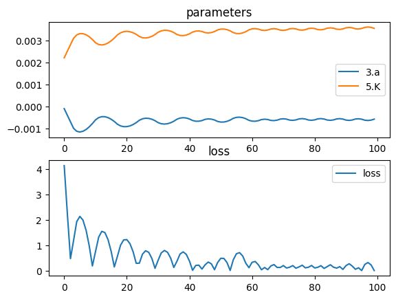

# Reflecting Telescope


```python
import torch
import torch.nn as nn
import torch.optim as optim
import torchlensmaker as tlm

# A simple reflecting telescope made of two concave mirrors

# In this example we keep the position of the mirrors constant
# and optimize their curvature jointly

# Note that there is more than one solution because rays can cross N times before focusing on the focal point
# We want the solution where they cross at the focal point for the first time
# TODO use image loss to account for flips
# aka "intermediate image"


primary = tlm.Parabola(35., a=nn.Parameter(torch.tensor(-0.0001)))
secondary = tlm.Sphere(35., r=nn.Parameter(torch.tensor(450.0)))

optics = nn.Sequential(
    tlm.Gap(-100),
    tlm.PointSourceAtInfinity(beam_diameter=30),
    tlm.Gap(100),
    
    tlm.ReflectiveSurface(primary),
    tlm.Gap(-80),

    tlm.ReflectiveSurface(secondary),

    tlm.Gap(100),
    tlm.FocalPoint(),
)

tlm.show(optics, dim=2)
tlm.show(optics, dim=3)
```


<div data-jp-suppress-context-menu id='tlmviewer-52c42ac4' class='tlmviewer' style='width: 100%; aspect-ratio: 16 / 9;'></div><script type='module'>async function importtlm() {
    try {
        return await import("/tlmviewer.js");
    } catch (error) {
        console.log("error", error);
        return await import("/files/test_notebooks/tlmviewer.js");
    }
}

const module = await importtlm();
const tlmviewer = module.tlmviewer;

const data = '{"mode": "2D", "camera": "XY", "data": [{"type": "surfaces", "data": [{"matrix": [[1.0, 0.0, 0.0], [0.0, 1.0, 0.0], [0.0, 0.0, 1.0]], "samples": [[-0.030625, -17.5], [-0.03000944, -17.32323265], [-0.02940013, -17.1464653], [-0.02879706, -16.96969604], [-0.02820024, -16.7929287], [-0.02760968, -16.61616135], [-0.02702537, -16.439394], [-0.0264473, -16.26262665], [-0.02587549, -16.0858593], [-0.02530992, -15.909091], [-0.0247506, -15.73232365], [-0.02419753, -15.55555534], [-0.02365071, -15.37878799], [-0.02311014, -15.20202065], [-0.02257582, -15.02525234], [-0.02204775, -14.84848499], [-0.02152593, -14.67171669], [-0.02101036, -14.49494934], [-0.02050103, -14.31818199], [-0.01999796, -14.14141369], [-0.01950113, -13.96464634], [-0.01901056, -13.78787899], [-0.01852623, -13.61111069], [-0.01804816, -13.43434334], [-0.01757633, -13.25757599], [-0.01711075, -13.08080769], [-0.01665143, -12.90404034], [-0.01619835, -12.72727299], [-0.01575152, -12.55050468], [-0.01531094, -12.37373734], [-0.01487661, -12.19696999], [-0.01444852, -12.02020168], [-0.01402669, -11.84343433], [-0.01361111, -11.66666698], [-0.01320178, -11.48989868], [-0.01279869, -11.31313133], [-0.01240186, -11.13636398], [-0.01201127, -10.95959568], [-0.01162694, -10.78282833], [-0.01124885, -10.60606098], [-0.01087702, -10.42929268], [-0.01051143, -10.25252533], [-0.01015209, -10.07575798], [-0.009799, -9.89898968], [-0.00945216, -9.72222233], [-0.00911157, -9.54545498], [-0.00877723, -9.36868668], [-0.00844914, -9.19191933], [-0.0081273, -9.01515198], [-0.0078117, -8.83838367], [-0.00750236, -8.66161633], [-0.00719926, -8.48484802], [-0.00690242, -8.30808067], [-0.00661183, -8.13131332], [-0.00632748, -7.9545455], [-0.00604938, -7.77777767], [-0.00577754, -7.60101032], [-0.00551194, -7.4242425], [-0.00525259, -7.24747467], [-0.00499949, -7.07070732], [-0.00475264, -6.8939395], [-0.00451204, -6.71717167], [-0.00427769, -6.54040384], [-0.00404959, -6.36363649], [-0.00382773, -6.18686867], [-0.00361213, -6.01010084], [-0.00340278, -5.83333349], [-0.00319967, -5.65656567], [-0.00300282, -5.47979784], [-0.00281221, -5.30303049], [-0.00262786, -5.12626266], [-0.00244975, -4.94949484], [-0.00227789, -4.77272749], [-0.00211228, -4.59595966], [-0.00195293, -4.41919184], [-0.00179982, -4.24242401], [-0.00165296, -4.06565666], [-0.00151235, -3.88888884], [-0.00137798, -3.71212125], [-0.00124987, -3.53535366], [-0.00112801, -3.35858583], [-0.0010124, -3.18181825], [-0.00090303, -3.00505042], [-0.00079992, -2.82828283], [-0.00070305, -2.65151525], [-0.00061244, -2.47474742], [-0.00052807, -2.29797983], [-0.00044995, -2.12121201], [-0.00037809, -1.94444442], [-0.00031247, -1.76767683], [-0.0002531, -1.59090912], [-0.00019998, -1.41414142], [-0.00015311, -1.23737371], [-0.00011249, -1.060606], [-7.812e-05, -0.88383842], [-4.999e-05, -0.70707071], [-2.812e-05, -0.530303], [-1.25e-05, -0.35353535], [-3.12e-06, -0.17676768], [-0.0, 0.0], [-3.12e-06, 0.17676768], [-1.25e-05, 0.35353535], [-2.812e-05, 0.530303], [-4.999e-05, 0.70707071], [-7.812e-05, 0.88383842], [-0.00011249, 1.060606], [-0.00015311, 1.23737371], [-0.00019998, 1.41414142], [-0.0002531, 1.59090912], [-0.00031247, 1.76767683], [-0.00037809, 1.94444442], [-0.00044995, 2.12121201], [-0.00052807, 2.29797983], [-0.00061244, 2.47474742], [-0.00070305, 2.65151525], [-0.00079992, 2.82828283], [-0.00090303, 3.00505042], [-0.0010124, 3.18181825], [-0.00112801, 3.35858583], [-0.00124987, 3.53535366], [-0.00137798, 3.71212125], [-0.00151235, 3.88888884], [-0.00165296, 4.06565666], [-0.00179982, 4.24242401], [-0.00195293, 4.41919184], [-0.00211228, 4.59595966], [-0.00227789, 4.77272749], [-0.00244975, 4.94949484], [-0.00262786, 5.12626266], [-0.00281221, 5.30303049], [-0.00300282, 5.47979784], [-0.00319967, 5.65656567], [-0.00340278, 5.83333349], [-0.00361213, 6.01010084], [-0.00382773, 6.18686867], [-0.00404959, 6.36363649], [-0.00427769, 6.54040384], [-0.00451204, 6.71717167], [-0.00475264, 6.8939395], [-0.00499949, 7.07070732], [-0.00525259, 7.24747467], [-0.00551194, 7.4242425], [-0.00577754, 7.60101032], [-0.00604938, 7.77777767], [-0.00632748, 7.9545455], [-0.00661183, 8.13131332], [-0.00690242, 8.30808067], [-0.00719926, 8.48484802], [-0.00750236, 8.66161633], [-0.0078117, 8.83838367], [-0.0081273, 9.01515198], [-0.00844914, 9.19191933], [-0.00877723, 9.36868668], [-0.00911157, 9.54545498], [-0.00945216, 9.72222233], [-0.009799, 9.89898968], [-0.01015209, 10.07575798], [-0.01051143, 10.25252533], [-0.01087702, 10.42929268], [-0.01124885, 10.60606098], [-0.01162694, 10.78282833], [-0.01201127, 10.95959568], [-0.01240186, 11.13636398], [-0.01279869, 11.31313133], [-0.01320178, 11.48989868], [-0.01361111, 11.66666698], [-0.01402669, 11.84343433], [-0.01444852, 12.02020168], [-0.01487661, 12.19696999], [-0.01531094, 12.37373734], [-0.01575152, 12.55050468], [-0.01619835, 12.72727299], [-0.01665143, 12.90404034], [-0.01711075, 13.08080769], [-0.01757633, 13.25757599], [-0.01804816, 13.43434334], [-0.01852623, 13.61111069], [-0.01901056, 13.78787899], [-0.01950113, 13.96464634], [-0.01999796, 14.14141369], [-0.02050103, 14.31818199], [-0.02101036, 14.49494934], [-0.02152593, 14.67171669], [-0.02204775, 14.84848499], [-0.02257582, 15.02525234], [-0.02311014, 15.20202065], [-0.02365071, 15.37878799], [-0.02419753, 15.55555534], [-0.0247506, 15.73232365], [-0.02530992, 15.909091], [-0.02587549, 16.0858593], [-0.0264473, 16.26262665], [-0.02702537, 16.439394], [-0.02760968, 16.61616135], [-0.02820024, 16.7929287], [-0.02879706, 16.96969604], [-0.02940013, 17.1464653], [-0.03000944, 17.32323265], [-0.030625, 17.5]]}]}, {"type": "surfaces", "data": [{"matrix": [[1.0, 0.0, -80.0], [0.0, 1.0, 0.0], [0.0, 0.0, 1.0]], "samples": [[0.34039307, 17.50004196], [0.33355713, 17.32336426], [0.32681274, 17.14668274], [0.32009888, 16.96999931], [0.31347656, 16.79331207], [0.30688477, 16.61662292], [0.30041504, 16.43993187], [0.29397583, 16.26323509], [0.28762817, 16.08653831], [0.28134155, 15.90983963], [0.27511597, 15.73313713], [0.26898193, 15.55643368], [0.26287842, 15.37972641], [0.25686646, 15.20301723], [0.25094604, 15.02630615], [0.24508667, 14.84959221], [0.23928833, 14.67287731], [0.23355103, 14.49615765], [0.22787476, 14.31943703], [0.22229004, 14.1427145], [0.21676636, 13.96599007], [0.21133423, 13.78926277], [0.20593262, 13.61253357], [0.20062256, 13.43580151], [0.19537354, 13.25906849], [0.19018555, 13.08233356], [0.18508911, 12.90559578], [0.18005371, 12.72885609], [0.17510986, 12.55211449], [0.17022705, 12.37537098], [0.16537476, 12.19862652], [0.16061401, 12.0218792], [0.15591431, 11.84512997], [0.15130615, 11.66837978], [0.14672852, 11.49162579], [0.14227295, 11.31487179], [0.13787842, 11.13811588], [0.1335144, 10.96135807], [0.12924194, 10.78459835], [0.12503052, 10.60783768], [0.12091064, 10.43107414], [0.11685181, 10.25430965], [0.112854, 10.07754421], [0.10891724, 9.90077591], [0.10507202, 9.72400665], [0.10128784, 9.54723549], [0.0975647, 9.37046432], [0.09393311, 9.1936903], [0.09033203, 9.01691532], [0.08685303, 8.84003162], [0.08340454, 8.66325378], [0.08004761, 8.48647499], [0.07675171, 8.30969429], [0.07348633, 8.13291264], [0.0703125, 7.95612907], [0.06723022, 7.77934599], [0.06420898, 7.60255957], [0.06124878, 7.42577362], [0.05838013, 7.24898577], [0.05557251, 7.07219744], [0.05282593, 6.8954072], [0.0501709, 6.71861601], [0.04754639, 6.54182386], [0.04501343, 6.36503077], [0.0425415, 6.18823671], [0.04016113, 6.01144171], [0.03781128, 5.83464622], [0.03555298, 5.65784931], [0.03338623, 5.48105145], [0.03128052, 5.3042531], [0.02920532, 5.1274538], [0.02722168, 4.95065355], [0.02532959, 4.77385283], [0.02346802, 4.59705114], [0.021698, 4.42024851], [0.02001953, 4.24344587], [0.01837158, 4.06664228], [0.01681519, 3.8898375], [0.01531982, 3.71303272], [0.0138855, 3.53622723], [0.01251221, 3.35942125], [0.01126099, 3.1826148], [0.01004028, 3.00580764], [0.00888062, 2.82900023], [0.0078125, 2.65219212], [0.00680542, 2.47538376], [0.00585938, 2.29857516], [0.00497437, 2.12176609], [0.00421143, 1.94495666], [0.00344849, 1.76814699], [0.00280762, 1.59133697], [0.00222778, 1.4145267], [0.00167847, 1.23771632], [0.00125122, 1.06090569], [0.00085449, 0.88409483], [0.00054932, 0.70728391], [0.00033569, 0.53047287], [0.00012207, 0.35366175], [3.052e-05, 0.17685054], [0.0, -3.934e-05], [3.052e-05, -0.17685054], [0.00012207, -0.35366175], [0.00033569, -0.53047287], [0.00054932, -0.70728391], [0.00085449, -0.88409483], [0.00125122, -1.06090569], [0.00167847, -1.23771632], [0.00222778, -1.4145267], [0.00280762, -1.59133697], [0.00344849, -1.76814699], [0.00421143, -1.94495666], [0.00497437, -2.12176609], [0.00585938, -2.29857516], [0.00680542, -2.47538376], [0.0078125, -2.65219212], [0.00888062, -2.82900023], [0.01004028, -3.00580764], [0.01126099, -3.1826148], [0.01251221, -3.35942125], [0.0138855, -3.53622723], [0.01531982, -3.71303272], [0.01681519, -3.8898375], [0.01837158, -4.06664228], [0.02001953, -4.24344587], [0.021698, -4.42024851], [0.02346802, -4.59705114], [0.02532959, -4.77385283], [0.02722168, -4.95065355], [0.02920532, -5.1274538], [0.03128052, -5.3042531], [0.03338623, -5.48105145], [0.03555298, -5.65784931], [0.03781128, -5.83464622], [0.04016113, -6.01144171], [0.0425415, -6.18823671], [0.04501343, -6.36503077], [0.04754639, -6.54182386], [0.0501709, -6.71861601], [0.05282593, -6.8954072], [0.05557251, -7.07219744], [0.05838013, -7.24898577], [0.06124878, -7.42577362], [0.06420898, -7.60255957], [0.06723022, -7.77934599], [0.0703125, -7.95612907], [0.07348633, -8.13291264], [0.07675171, -8.30969429], [0.08004761, -8.48647499], [0.08340454, -8.66325378], [0.08685303, -8.84003162], [0.09033203, -9.01691532], [0.09393311, -9.1936903], [0.0975647, -9.37046432], [0.10128784, -9.54723549], [0.10507202, -9.72400665], [0.10891724, -9.90077591], [0.112854, -10.07754421], [0.11685181, -10.25430965], [0.12091064, -10.43107414], [0.12503052, -10.60783768], [0.12924194, -10.78459835], [0.1335144, -10.96135807], [0.13787842, -11.13811588], [0.14227295, -11.31487179], [0.14672852, -11.49162579], [0.15130615, -11.66837978], [0.15591431, -11.84512997], [0.16061401, -12.0218792], [0.16537476, -12.19862652], [0.17022705, -12.37537098], [0.17510986, -12.55211449], [0.18005371, -12.72885609], [0.18508911, -12.90559578], [0.19018555, -13.08233356], [0.19537354, -13.25906849], [0.20062256, -13.43580151], [0.20593262, -13.61253357], [0.21133423, -13.78926277], [0.21676636, -13.96599007], [0.22229004, -14.1427145], [0.22787476, -14.31943703], [0.23355103, -14.49615765], [0.23928833, -14.67287731], [0.24508667, -14.84959221], [0.25094604, -15.02630615], [0.25686646, -15.20301723], [0.26287842, -15.37972641], [0.26898193, -15.55643368], [0.27511597, -15.73313713], [0.28134155, -15.90983963], [0.28762817, -16.08653831], [0.29397583, -16.26323509], [0.30041504, -16.43993187], [0.30688477, -16.61662292], [0.31347656, -16.79331207], [0.32009888, -16.96999931], [0.32681274, -17.14668274], [0.33355713, -17.32336426], [0.34039307, -17.50004196]]}]}, {"type": "points", "data": [[20.0, 0.0]], "color": "red"}, {"type": "rays", "points": [[-100.0, -15.0, -0.0225, -15.0], [-100.0, -11.66666667, -0.01361111, -11.66666667], [-100.0, -8.33333333, -0.00694444, -8.33333333], [-100.0, -5.0, -0.0025, -5.0], [-100.0, -1.66666667, -0.00027778, -1.66666667], [-100.0, 1.66666667, -0.00027778, 1.66666667], [-100.0, 5.0, -0.0025, 5.0], [-100.0, 8.33333333, -0.00694444, 8.33333333], [-100.0, 11.66666667, -0.01361111, 11.66666667], [-100.0, 15.0, -0.0225, 15.0]], "color": "#ffa724", "variables": {"base": [-15.0, -11.66666667, -8.33333333, -5.0, -1.66666667, 1.66666667, 5.0, 8.33333333, 11.66666667, 15.0]}, "domain": {"base": [-15.0, 15.0]}, "layers": [1]}, {"type": "rays", "points": [[-0.0225, -15.0, -79.76563338, -14.52153691], [-0.01361111, -11.66666667, -79.85824911, -11.29405634], [-0.00694444, -8.33333333, -79.92768823, -8.06693012], [-0.0025, -5.0, -79.97397019, -4.8400569], [-0.00027778, -1.66666667, -79.99710793, -1.61333544], [-0.00027778, 1.66666667, -79.99710793, 1.61333544], [-0.0025, 5.0, -79.97397019, 4.8400569], [-0.00694444, 8.33333333, -79.92768823, 8.06693012], [-0.01361111, 11.66666667, -79.85824911, 11.29405634], [-0.0225, 15.0, -79.76563338, 14.52153691]], "color": "#ffa724", "variables": {"base": [-15.0, -11.66666667, -8.33333333, -5.0, -1.66666667, 1.66666667, 5.0, 8.33333333, 11.66666667, 15.0]}, "domain": {"base": [-15.0, 15.0]}, "layers": [1]}, {"type": "rays", "points": [[-79.76563338, -14.52153691, 20.80050902, -7.41466414], [-79.85824911, -11.29405634, 20.48542394, -5.78289474], [-79.92768823, -8.06693012, 20.2481132, -4.13920258], [-79.97397019, -4.8400569, 20.0894286, -2.48695486], [-79.99710793, -1.61333544, 20.00994251, -0.82955797], [-79.99710793, 1.61333544, 20.00994251, 0.82955797], [-79.97397019, 4.8400569, 20.0894286, 2.48695486], [-79.92768823, 8.06693012, 20.2481132, 4.13920258], [-79.85824911, 11.29405634, 20.48542394, 5.78289474], [-79.76563338, 14.52153691, 20.80050902, 7.41466414]], "color": "#ffa724", "variables": {"base": [-15.0, -11.66666667, -8.33333333, -5.0, -1.66666667, 1.66666667, 5.0, 8.33333333, 11.66666667, 15.0]}, "domain": {"base": [-15.0, 15.0]}}, {"type": "points", "data": [[0.0, 0.0], [-100.0, 0.0], [0.0, 0.0], [-80.0, 0.0], [20.0, 0.0]], "layers": [4]}]}';

tlmviewer.embed(document.getElementById("tlmviewer-52c42ac4"), data);    
</script>


<div data-jp-suppress-context-menu id='tlmviewer-18412110' class='tlmviewer' style='width: 100%; aspect-ratio: 16 / 9;'></div><script type='module'>async function importtlm() {
    try {
        return await import("/tlmviewer.js");
    } catch (error) {
        console.log("error", error);
        return await import("/files/test_notebooks/tlmviewer.js");
    }
}

const module = await importtlm();
const tlmviewer = module.tlmviewer;

const data = '{"mode": "3D", "camera": "orthographic", "data": [{"type": "surfaces", "data": [{"matrix": [[1.0, 0.0, 0.0, 0.0], [0.0, 1.0, 0.0, 0.0], [0.0, 0.0, 1.0, 0.0], [0.0, 0.0, 0.0, 1.0]], "samples": [[-0.0, 0.0], [-3.12e-06, 0.17676768], [-1.25e-05, 0.35353535], [-2.812e-05, 0.530303], [-4.999e-05, 0.70707071], [-7.812e-05, 0.88383842], [-0.00011249, 1.060606], [-0.00015311, 1.23737371], [-0.00019998, 1.41414142], [-0.0002531, 1.59090912], [-0.00031247, 1.76767683], [-0.00037809, 1.94444442], [-0.00044995, 2.12121201], [-0.00052807, 2.29797983], [-0.00061244, 2.47474742], [-0.00070305, 2.65151525], [-0.00079992, 2.82828283], [-0.00090303, 3.00505042], [-0.0010124, 3.18181825], [-0.00112801, 3.35858583], [-0.00124987, 3.53535366], [-0.00137798, 3.71212125], [-0.00151235, 3.88888884], [-0.00165296, 4.06565666], [-0.00179982, 4.24242401], [-0.00195293, 4.41919184], [-0.00211228, 4.59595966], [-0.00227789, 4.77272749], [-0.00244975, 4.94949484], [-0.00262786, 5.12626266], [-0.00281221, 5.30303049], [-0.00300282, 5.47979784], [-0.00319967, 5.65656567], [-0.00340278, 5.83333349], [-0.00361213, 6.01010084], [-0.00382773, 6.18686867], [-0.00404959, 6.36363649], [-0.00427769, 6.54040384], [-0.00451204, 6.71717167], [-0.00475264, 6.8939395], [-0.00499949, 7.07070732], [-0.00525259, 7.24747467], [-0.00551194, 7.4242425], [-0.00577754, 7.60101032], [-0.00604938, 7.77777767], [-0.00632748, 7.9545455], [-0.00661183, 8.13131332], [-0.00690242, 8.30808067], [-0.00719926, 8.48484802], [-0.00750236, 8.66161633], [-0.0078117, 8.83838367], [-0.0081273, 9.01515198], [-0.00844914, 9.19191933], [-0.00877723, 9.36868668], [-0.00911157, 9.54545498], [-0.00945216, 9.72222233], [-0.009799, 9.89898968], [-0.01015209, 10.07575798], [-0.01051143, 10.25252533], [-0.01087702, 10.42929268], [-0.01124885, 10.60606098], [-0.01162694, 10.78282833], [-0.01201127, 10.95959568], [-0.01240186, 11.13636398], [-0.01279869, 11.31313133], [-0.01320178, 11.48989868], [-0.01361111, 11.66666698], [-0.01402669, 11.84343433], [-0.01444852, 12.02020168], [-0.01487661, 12.19696999], [-0.01531094, 12.37373734], [-0.01575152, 12.55050468], [-0.01619835, 12.72727299], [-0.01665143, 12.90404034], [-0.01711075, 13.08080769], [-0.01757633, 13.25757599], [-0.01804816, 13.43434334], [-0.01852623, 13.61111069], [-0.01901056, 13.78787899], [-0.01950113, 13.96464634], [-0.01999796, 14.14141369], [-0.02050103, 14.31818199], [-0.02101036, 14.49494934], [-0.02152593, 14.67171669], [-0.02204775, 14.84848499], [-0.02257582, 15.02525234], [-0.02311014, 15.20202065], [-0.02365071, 15.37878799], [-0.02419753, 15.55555534], [-0.0247506, 15.73232365], [-0.02530992, 15.909091], [-0.02587549, 16.0858593], [-0.0264473, 16.26262665], [-0.02702537, 16.439394], [-0.02760968, 16.61616135], [-0.02820024, 16.7929287], [-0.02879706, 16.96969604], [-0.02940013, 17.1464653], [-0.03000944, 17.32323265], [-0.030625, 17.5]]}]}, {"type": "surfaces", "data": [{"matrix": [[1.0, 0.0, 0.0, -80.0], [0.0, 1.0, 0.0, 0.0], [0.0, 0.0, 1.0, 0.0], [0.0, 0.0, 0.0, 1.0]], "samples": [[0.0, -3.934e-05], [3.052e-05, -0.17685054], [0.00012207, -0.35366175], [0.00033569, -0.53047287], [0.00054932, -0.70728391], [0.00085449, -0.88409483], [0.00125122, -1.06090569], [0.00167847, -1.23771632], [0.00222778, -1.4145267], [0.00280762, -1.59133697], [0.00344849, -1.76814699], [0.00421143, -1.94495666], [0.00497437, -2.12176609], [0.00585938, -2.29857516], [0.00680542, -2.47538376], [0.0078125, -2.65219212], [0.00888062, -2.82900023], [0.01004028, -3.00580764], [0.01126099, -3.1826148], [0.01251221, -3.35942125], [0.0138855, -3.53622723], [0.01531982, -3.71303272], [0.01681519, -3.8898375], [0.01837158, -4.06664228], [0.02001953, -4.24344587], [0.021698, -4.42024851], [0.02346802, -4.59705114], [0.02532959, -4.77385283], [0.02722168, -4.95065355], [0.02920532, -5.1274538], [0.03128052, -5.3042531], [0.03338623, -5.48105145], [0.03555298, -5.65784931], [0.03781128, -5.83464622], [0.04016113, -6.01144171], [0.0425415, -6.18823671], [0.04501343, -6.36503077], [0.04754639, -6.54182386], [0.0501709, -6.71861601], [0.05282593, -6.8954072], [0.05557251, -7.07219744], [0.05838013, -7.24898577], [0.06124878, -7.42577362], [0.06420898, -7.60255957], [0.06723022, -7.77934599], [0.0703125, -7.95612907], [0.07348633, -8.13291264], [0.07675171, -8.30969429], [0.08004761, -8.48647499], [0.08340454, -8.66325378], [0.08685303, -8.84003162], [0.09033203, -9.01691532], [0.09393311, -9.1936903], [0.0975647, -9.37046432], [0.10128784, -9.54723549], [0.10507202, -9.72400665], [0.10891724, -9.90077591], [0.112854, -10.07754421], [0.11685181, -10.25430965], [0.12091064, -10.43107414], [0.12503052, -10.60783768], [0.12924194, -10.78459835], [0.1335144, -10.96135807], [0.13787842, -11.13811588], [0.14227295, -11.31487179], [0.14672852, -11.49162579], [0.15130615, -11.66837978], [0.15591431, -11.84512997], [0.16061401, -12.0218792], [0.16537476, -12.19862652], [0.17022705, -12.37537098], [0.17510986, -12.55211449], [0.18005371, -12.72885609], [0.18508911, -12.90559578], [0.19018555, -13.08233356], [0.19537354, -13.25906849], [0.20062256, -13.43580151], [0.20593262, -13.61253357], [0.21133423, -13.78926277], [0.21676636, -13.96599007], [0.22229004, -14.1427145], [0.22787476, -14.31943703], [0.23355103, -14.49615765], [0.23928833, -14.67287731], [0.24508667, -14.84959221], [0.25094604, -15.02630615], [0.25686646, -15.20301723], [0.26287842, -15.37972641], [0.26898193, -15.55643368], [0.27511597, -15.73313713], [0.28134155, -15.90983963], [0.28762817, -16.08653831], [0.29397583, -16.26323509], [0.30041504, -16.43993187], [0.30688477, -16.61662292], [0.31347656, -16.79331207], [0.32009888, -16.96999931], [0.32681274, -17.14668274], [0.33355713, -17.32336426], [0.34039307, -17.50004196]]}]}, {"type": "points", "data": [[20.0, 0.0, 0.0]], "color": "red"}, {"type": "rays", "points": [[-100.0, 0.0, 0.0, 0.0, 0.0, 0.0], [-100.0, 0.0, 0.0, 0.0, 0.0, 0.0], [-100.0, 0.0, 0.0, 0.0, 0.0, 0.0], [-100.0, 7.5, 0.0, -0.005625, 7.5, 0.0], [-100.0, -7.5, 0.0, -0.005625, -7.5, 0.0], [-100.0, 7.5, -0.0, -0.005625, 7.5, -0.0], [-100.0, 15.0, 0.0, -0.0225, 15.0, 0.0], [-100.0, -15.0, 0.0, -0.0225, -15.0, 0.0], [-100.0, 15.0, -0.0, -0.0225, 15.0, -0.0]], "color": "#ffa724", "variables": {}, "domain": {"base": [-15.0, 15.0]}, "layers": [1]}, {"type": "rays", "points": [[0.0, 0.0, 0.0, -80.0, 0.0, 0.0], [0.0, 0.0, 0.0, -80.0, 0.0, 0.0], [0.0, 0.0, 0.0, -80.0, 0.0, 0.0], [-0.005625, 7.5, 0.0, -79.94142909, 7.26019205, 0.0], [-0.005625, -7.5, 0.0, -79.94142909, -7.26019205, 0.0], [-0.005625, 7.5, -0.0, -79.94142909, 7.26019205, -0.0], [-0.0225, 15.0, 0.0, -79.76563338, 14.52153691, 0.0], [-0.0225, -15.0, 0.0, -79.76563338, -14.52153691, 0.0], [-0.0225, 15.0, -0.0, -79.76563338, 14.52153691, -0.0]], "color": "#ffa724", "variables": {}, "domain": {"base": [-15.0, 15.0]}, "layers": [1]}, {"type": "rays", "points": [[-80.0, 0.0, 0.0, 20.0, 0.0, 0.0], [-80.0, 0.0, 0.0, 20.0, 0.0, 0.0], [-80.0, 0.0, 0.0, 20.0, 0.0, 0.0], [-79.94142909, 7.26019205, 0.0, 20.20104367, 3.72681022, 0.0], [-79.94142909, -7.26019205, 0.0, 20.20104367, -3.72681022, 0.0], [-79.94142909, 7.26019205, -0.0, 20.20104367, 3.72681022, -0.0], [-79.76563338, 14.52153691, 0.0, 20.80050902, 7.41466414, 0.0], [-79.76563338, -14.52153691, 0.0, 20.80050902, -7.41466414, 0.0], [-79.76563338, 14.52153691, -0.0, 20.80050902, 7.41466414, -0.0]], "color": "#ffa724", "variables": {}, "domain": {"base": [-15.0, 15.0]}}, {"type": "points", "data": [[0.0, 0.0, 0.0], [-100.0, 0.0, 0.0], [0.0, 0.0, 0.0], [-80.0, 0.0, 0.0], [20.0, 0.0, 0.0]], "layers": [4]}]}';

tlmviewer.embed(document.getElementById("tlmviewer-18412110"), data);    
</script>


```python
tlm.optimize(
    optics,
    optimizer = optim.Adam(optics.parameters(), lr=3e-4),
    sampling = {"base": 10},
    dim = 2,
    num_iter = 100
).plot()
```

    [  1/100] L=  4.143 | grad norm= 5082.165471793927
    [  6/100] L=  2.142 | grad norm= 4343.371872496975
    [ 11/100] L=  0.758 | grad norm= 4645.082823746822
    [ 16/100] L=  0.762 | grad norm= 4604.4040772800245
    [ 21/100] L=  1.228 | grad norm= 4327.20982576913
    [ 26/100] L=  0.656 | grad norm= 4535.1464863859155
    [ 31/100] L=  0.417 | grad norm= 4378.184181696119
    [ 36/100] L=  0.130 | grad norm= 4396.059297306475
    [ 41/100] L=  0.382 | grad norm= 4444.299792202825
    [ 46/100] L=  0.236 | grad norm= 4412.843571748877
    [ 51/100] L=  0.492 | grad norm= 4309.573762581885
    [ 56/100] L=  0.671 | grad norm= 4448.909512168375
    [ 61/100] L=  0.335 | grad norm= 4310.760085726019
    [ 66/100] L=  0.045 | grad norm= 4351.1160530926445
    [ 71/100] L=  0.205 | grad norm= 4365.166310989026
    [ 76/100] L=  0.153 | grad norm= 4353.092187647314
    [ 81/100] L=  0.111 | grad norm= 4314.365383669035
    [ 86/100] L=  0.237 | grad norm= 4293.825259288794
    [ 91/100] L=  0.204 | grad norm= 4294.009228254691
    [ 96/100] L=  0.008 | grad norm= 4317.617198002077
    [100/100] L=  0.010 | grad norm= 4314.793335006753


    

    


```python
tlm.show(optics, dim=2)
tlm.show(optics, dim=3)
```


<div data-jp-suppress-context-menu id='tlmviewer-ed4dec28' class='tlmviewer' style='width: 100%; aspect-ratio: 16 / 9;'></div><script type='module'>async function importtlm() {
    try {
        return await import("/tlmviewer.js");
    } catch (error) {
        console.log("error", error);
        return await import("/files/test_notebooks/tlmviewer.js");
    }
}

const module = await importtlm();
const tlmviewer = module.tlmviewer;

const data = '{"mode": "2D", "camera": "XY", "data": [{"type": "surfaces", "data": [{"matrix": [[1.0, 0.0, 0.0], [0.0, 1.0, 0.0], [0.0, 0.0, 1.0]], "samples": [[-0.17369851, -17.5], [-0.17020719, -17.32323265], [-0.1667513, -17.1464653], [-0.16333081, -16.96969604], [-0.15994582, -16.7929287], [-0.15659627, -16.61616135], [-0.15328215, -16.439394], [-0.15000349, -16.26262665], [-0.14676028, -16.0858593], [-0.1435525, -15.909091], [-0.14038017, -15.73232365], [-0.13724327, -15.55555534], [-0.13414183, -15.37878799], [-0.13107583, -15.20202065], [-0.12804528, -15.02525234], [-0.12505017, -14.84848499], [-0.1220905, -14.67171669], [-0.11916629, -14.49494934], [-0.11627752, -14.31818199], [-0.11342418, -14.14141369], [-0.11060631, -13.96464634], [-0.10782387, -13.78787899], [-0.10507687, -13.61111069], [-0.10236533, -13.43434334], [-0.09968923, -13.25757599], [-0.09704857, -13.08080769], [-0.09444336, -12.90404034], [-0.09187359, -12.72727299], [-0.08933926, -12.55050468], [-0.0868404, -12.37373734], [-0.08437697, -12.19696999], [-0.08194897, -12.02020168], [-0.07955644, -11.84343433], [-0.07719934, -11.66666698], [-0.07487769, -11.48989868], [-0.07259148, -11.31313133], [-0.07034072, -11.13636398], [-0.0681254, -10.95959568], [-0.06594554, -10.78282833], [-0.06380112, -10.60606098], [-0.06169213, -10.42929268], [-0.05961859, -10.25252533], [-0.0575805, -10.07575798], [-0.05557785, -9.89898968], [-0.05361065, -9.72222233], [-0.0516789, -9.54545498], [-0.04978259, -9.36868668], [-0.04792172, -9.19191933], [-0.0460963, -9.01515198], [-0.04430632, -8.83838367], [-0.0425518, -8.66161633], [-0.0408327, -8.48484802], [-0.03914907, -8.30808067], [-0.03750087, -8.13131332], [-0.03588812, -7.9545455], [-0.03431082, -7.77777767], [-0.03276896, -7.60101032], [-0.03126254, -7.4242425], [-0.02979157, -7.24747467], [-0.02835605, -7.07070732], [-0.02695597, -6.8939395], [-0.02559133, -6.71717167], [-0.02426214, -6.54040384], [-0.0229684, -6.36363649], [-0.0217101, -6.18686867], [-0.02048724, -6.01010084], [-0.01929983, -5.83333349], [-0.01814787, -5.65656567], [-0.01703135, -5.47979784], [-0.01595028, -5.30303049], [-0.01490465, -5.12626266], [-0.01389446, -4.94949484], [-0.01291972, -4.77272749], [-0.01198043, -4.59595966], [-0.01107658, -4.41919184], [-0.01020818, -4.24242401], [-0.00937522, -4.06565666], [-0.0085777, -3.88888884], [-0.00781564, -3.71212125], [-0.00708901, -3.53535366], [-0.00639783, -3.35858583], [-0.0057421, -3.18181825], [-0.00512181, -3.00505042], [-0.00453697, -2.82828283], [-0.00398757, -2.65151525], [-0.00347362, -2.47474742], [-0.00299511, -2.29797983], [-0.00255204, -2.12121201], [-0.00214443, -1.94444442], [-0.00177225, -1.76767683], [-0.00143552, -1.59090912], [-0.00113424, -1.41414142], [-0.0008684, -1.23737371], [-0.00063801, -1.060606], [-0.00044306, -0.88383842], [-0.00028356, -0.70707071], [-0.0001595, -0.530303], [-7.089e-05, -0.35353535], [-1.772e-05, -0.17676768], [-0.0, 0.0], [-1.772e-05, 0.17676768], [-7.089e-05, 0.35353535], [-0.0001595, 0.530303], [-0.00028356, 0.70707071], [-0.00044306, 0.88383842], [-0.00063801, 1.060606], [-0.0008684, 1.23737371], [-0.00113424, 1.41414142], [-0.00143552, 1.59090912], [-0.00177225, 1.76767683], [-0.00214443, 1.94444442], [-0.00255204, 2.12121201], [-0.00299511, 2.29797983], [-0.00347362, 2.47474742], [-0.00398757, 2.65151525], [-0.00453697, 2.82828283], [-0.00512181, 3.00505042], [-0.0057421, 3.18181825], [-0.00639783, 3.35858583], [-0.00708901, 3.53535366], [-0.00781564, 3.71212125], [-0.0085777, 3.88888884], [-0.00937522, 4.06565666], [-0.01020818, 4.24242401], [-0.01107658, 4.41919184], [-0.01198043, 4.59595966], [-0.01291972, 4.77272749], [-0.01389446, 4.94949484], [-0.01490465, 5.12626266], [-0.01595028, 5.30303049], [-0.01703135, 5.47979784], [-0.01814787, 5.65656567], [-0.01929983, 5.83333349], [-0.02048724, 6.01010084], [-0.0217101, 6.18686867], [-0.0229684, 6.36363649], [-0.02426214, 6.54040384], [-0.02559133, 6.71717167], [-0.02695597, 6.8939395], [-0.02835605, 7.07070732], [-0.02979157, 7.24747467], [-0.03126254, 7.4242425], [-0.03276896, 7.60101032], [-0.03431082, 7.77777767], [-0.03588812, 7.9545455], [-0.03750087, 8.13131332], [-0.03914907, 8.30808067], [-0.0408327, 8.48484802], [-0.0425518, 8.66161633], [-0.04430632, 8.83838367], [-0.0460963, 9.01515198], [-0.04792172, 9.19191933], [-0.04978259, 9.36868668], [-0.0516789, 9.54545498], [-0.05361065, 9.72222233], [-0.05557785, 9.89898968], [-0.0575805, 10.07575798], [-0.05961859, 10.25252533], [-0.06169213, 10.42929268], [-0.06380112, 10.60606098], [-0.06594554, 10.78282833], [-0.0681254, 10.95959568], [-0.07034072, 11.13636398], [-0.07259148, 11.31313133], [-0.07487769, 11.48989868], [-0.07719934, 11.66666698], [-0.07955644, 11.84343433], [-0.08194897, 12.02020168], [-0.08437697, 12.19696999], [-0.0868404, 12.37373734], [-0.08933926, 12.55050468], [-0.09187359, 12.72727299], [-0.09444336, 12.90404034], [-0.09704857, 13.08080769], [-0.09968923, 13.25757599], [-0.10236533, 13.43434334], [-0.10507687, 13.61111069], [-0.10782387, 13.78787899], [-0.11060631, 13.96464634], [-0.11342418, 14.14141369], [-0.11627752, 14.31818199], [-0.11916629, 14.49494934], [-0.1220905, 14.67171669], [-0.12505017, 14.84848499], [-0.12804528, 15.02525234], [-0.13107583, 15.20202065], [-0.13414183, 15.37878799], [-0.13724327, 15.55555534], [-0.14038017, 15.73232365], [-0.1435525, 15.909091], [-0.14676028, 16.0858593], [-0.15000349, 16.26262665], [-0.15328215, 16.439394], [-0.15659627, 16.61616135], [-0.15994582, 16.7929287], [-0.16333081, 16.96969604], [-0.1667513, 17.1464653], [-0.17020719, 17.32323265], [-0.17369851, 17.5]]}]}, {"type": "surfaces", "data": [{"matrix": [[1.0, 0.0, -80.0], [0.0, 1.0, 0.0], [0.0, 0.0, 1.0]], "samples": [[0.54534912, 17.50001335], [0.53439331, 17.32350922], [0.52352905, 17.1469326], [0.51278687, 16.97035027], [0.50216675, 16.79382515], [0.4916687, 16.61722755], [0.48126221, 16.44069099], [0.47094727, 16.26408195], [0.46078491, 16.08746529], [0.45071411, 15.91090965], [0.44073486, 15.73428059], [0.4309082, 15.5577116], [0.4211731, 15.38107109], [0.41156006, 15.20448971], [0.40203857, 15.02783585], [0.39263916, 14.85117626], [0.38336182, 14.67457771], [0.37414551, 14.49790668], [0.36508179, 14.32129574], [0.35614014, 14.14461327], [0.34729004, 13.96792507], [0.33856201, 13.79129791], [0.32992554, 13.61459827], [0.32141113, 13.43796062], [0.3130188, 13.26125145], [0.30474854, 13.0845356], [0.29656982, 12.90788174], [0.28848267, 12.73115635], [0.28051758, 12.55449295], [0.27267456, 12.37775707], [0.26495361, 12.20108414], [0.25732422, 12.02433872], [0.24981689, 11.84758854], [0.24240112, 11.67090034], [0.23513794, 11.49414062], [0.22796631, 11.31744289], [0.22088623, 11.14067459], [0.21392822, 10.96390247], [0.20709229, 10.78719234], [0.2003479, 10.61041069], [0.19372559, 10.43369102], [0.18722534, 10.25690174], [0.18081665, 10.08017445], [0.17453003, 9.90337658], [0.16833496, 9.7265749], [0.16229248, 9.54983711], [0.15634155, 9.37302685], [0.15048218, 9.19628143], [0.14477539, 9.01946354], [0.13912964, 8.84264374], [0.13360596, 8.66588688], [0.12823486, 8.48905945], [0.12295532, 8.31229591], [0.11776733, 8.13546181], [0.11270142, 7.95862484], [0.10775757, 7.78185129], [0.10290527, 7.60500813], [0.09817505, 7.42822886], [0.09356689, 7.25137901], [0.08905029, 7.07459402], [0.08465576, 6.89773893], [0.08035278, 6.72088099], [0.07620239, 6.54408741], [0.07214355, 6.36722422], [0.06817627, 6.19042587], [0.06436157, 6.01355791], [0.06060791, 5.83668709], [0.05700684, 5.65988159], [0.05349731, 5.48300695], [0.05007935, 5.30619669], [0.04681396, 5.12931728], [0.04364014, 4.95243597], [0.04058838, 4.77561998], [0.03762817, 4.59873486], [0.03479004, 4.42191458], [0.03207397, 4.24502611], [0.02944946, 4.06820297], [0.02694702, 3.89131093], [0.02453613, 3.71441746], [0.02227783, 3.53758931], [0.02008057, 3.36069298], [0.01803589, 3.18386245], [0.01608276, 3.00696349], [0.01425171, 2.8300631], [0.01251221, 2.65322876], [0.01089478, 2.47632647], [0.00939941, 2.29949021], [0.00799561, 2.12258601], [0.00674438, 1.94568086], [0.0055542, 1.7688421], [0.0045166, 1.59193552], [0.00357056, 1.41509533], [0.00271606, 1.23818755], [0.00201416, 1.06134629], [0.00140381, 0.88443768], [0.00088501, 0.70752865], [0.00048828, 0.53068638], [0.00021362, 0.3537769], [6.104e-05, 0.17693427], [0.0, -2.457e-05], [6.104e-05, -0.17693427], [0.00021362, -0.3537769], [0.00048828, -0.53068638], [0.00088501, -0.70752865], [0.00140381, -0.88443768], [0.00201416, -1.06134629], [0.00271606, -1.23818755], [0.00357056, -1.41509533], [0.0045166, -1.59193552], [0.0055542, -1.7688421], [0.00674438, -1.94568086], [0.00799561, -2.12258601], [0.00939941, -2.29949021], [0.01089478, -2.47632647], [0.01251221, -2.65322876], [0.01425171, -2.8300631], [0.01608276, -3.00696349], [0.01803589, -3.18386245], [0.02008057, -3.36069298], [0.02227783, -3.53758931], [0.02453613, -3.71441746], [0.02694702, -3.89131093], [0.02944946, -4.06820297], [0.03207397, -4.24502611], [0.03479004, -4.42191458], [0.03762817, -4.59873486], [0.04058838, -4.77561998], [0.04364014, -4.95243597], [0.04681396, -5.12931728], [0.05007935, -5.30619669], [0.05349731, -5.48300695], [0.05700684, -5.65988159], [0.06060791, -5.83668709], [0.06436157, -6.01355791], [0.06817627, -6.19042587], [0.07214355, -6.36722422], [0.07620239, -6.54408741], [0.08035278, -6.72088099], [0.08465576, -6.89773893], [0.08905029, -7.07459402], [0.09356689, -7.25137901], [0.09817505, -7.42822886], [0.10290527, -7.60500813], [0.10775757, -7.78185129], [0.11270142, -7.95862484], [0.11776733, -8.13546181], [0.12295532, -8.31229591], [0.12823486, -8.48905945], [0.13360596, -8.66588688], [0.13912964, -8.84264374], [0.14477539, -9.01946354], [0.15048218, -9.19628143], [0.15634155, -9.37302685], [0.16229248, -9.54983711], [0.16833496, -9.7265749], [0.17453003, -9.90337658], [0.18081665, -10.08017445], [0.18722534, -10.25690174], [0.19372559, -10.43369102], [0.2003479, -10.61041069], [0.20709229, -10.78719234], [0.21392822, -10.96390247], [0.22088623, -11.14067459], [0.22796631, -11.31744289], [0.23513794, -11.49414062], [0.24240112, -11.67090034], [0.24981689, -11.84758854], [0.25732422, -12.02433872], [0.26495361, -12.20108414], [0.27267456, -12.37775707], [0.28051758, -12.55449295], [0.28848267, -12.73115635], [0.29656982, -12.90788174], [0.30474854, -13.0845356], [0.3130188, -13.26125145], [0.32141113, -13.43796062], [0.32992554, -13.61459827], [0.33856201, -13.79129791], [0.34729004, -13.96792507], [0.35614014, -14.14461327], [0.36508179, -14.32129574], [0.37414551, -14.49790668], [0.38336182, -14.67457771], [0.39263916, -14.85117626], [0.40203857, -15.02783585], [0.41156006, -15.20448971], [0.4211731, -15.38107109], [0.4309082, -15.5577116], [0.44073486, -15.73428059], [0.45071411, -15.91090965], [0.46078491, -16.08746529], [0.47094727, -16.26408195], [0.48126221, -16.44069099], [0.4916687, -16.61722755], [0.50216675, -16.79382515], [0.51278687, -16.97035027], [0.52352905, -17.1469326], [0.53439331, -17.32350922], [0.54534912, -17.50001335]]}]}, {"type": "points", "data": [[20.0, 0.0]], "color": "red"}, {"type": "rays", "points": [[-100.0, -15.0, -0.12761524, -15.0], [-100.0, -11.66666667, -0.07719934, -11.66666667], [-100.0, -8.33333333, -0.03938742, -8.33333333], [-100.0, -5.0, -0.01417947, -5.0], [-100.0, -1.66666667, -0.0015755, -1.66666667], [-100.0, 1.66666667, -0.0015755, 1.66666667], [-100.0, 5.0, -0.01417947, 5.0], [-100.0, 8.33333333, -0.03938742, 8.33333333], [-100.0, 11.66666667, -0.07719934, 11.66666667], [-100.0, 15.0, -0.12761524, 15.0]], "color": "#ffa724", "variables": {"base": [-15.0, -11.66666667, -8.33333333, -5.0, -1.66666667, 1.66666667, 5.0, 8.33333333, 11.66666667, 15.0]}, "domain": {"base": [-15.0, 15.0]}, "layers": [1]}, {"type": "rays", "points": [[-0.12761524, -15.0, -79.73116152, -12.29024872], [-0.07719934, -11.66666667, -79.83753307, -9.55517281], [-0.03938742, -8.33333333, -79.91717124, -6.82303212], [-0.01417947, -5.0, -79.97019663, -4.09298363], [-0.0015755, -1.66666667, -79.99668935, -1.36418869], [-0.0015755, 1.66666667, -79.99668935, 1.36418869], [-0.01417947, 5.0, -79.97019663, 4.09298363], [-0.03938742, 8.33333333, -79.91717124, 6.82303212], [-0.07719934, 11.66666667, -79.83753307, 9.55517281], [-0.12761524, 15.0, -79.73116152, 12.29024872]], "color": "#ffa724", "variables": {"base": [-15.0, -11.66666667, -8.33333333, -5.0, -1.66666667, 1.66666667, 5.0, 8.33333333, 11.66666667, 15.0]}, "domain": {"base": [-15.0, 15.0]}, "layers": [1]}, {"type": "rays", "points": [[-79.73116152, -12.29024872, 20.01352676, -0.11026714], [-79.83753307, -9.55517281, 20.0089776, -0.094272], [-79.91717124, -6.82303212, 20.00488461, -0.07191145], [-79.97019663, -4.09298363, 20.00183149, -0.04498119], [-79.99668935, -1.36418869, 20.00020756, -0.01529991], [-79.99668935, 1.36418869, 20.00020756, 0.01529991], [-79.97019663, 4.09298363, 20.00183149, 0.04498119], [-79.91717124, 6.82303212, 20.00488461, 0.07191145], [-79.83753307, 9.55517281, 20.0089776, 0.094272], [-79.73116152, 12.29024872, 20.01352676, 0.11026714]], "color": "#ffa724", "variables": {"base": [-15.0, -11.66666667, -8.33333333, -5.0, -1.66666667, 1.66666667, 5.0, 8.33333333, 11.66666667, 15.0]}, "domain": {"base": [-15.0, 15.0]}}, {"type": "points", "data": [[0.0, 0.0], [-100.0, 0.0], [0.0, 0.0], [-80.0, 0.0], [20.0, 0.0]], "layers": [4]}]}';

tlmviewer.embed(document.getElementById("tlmviewer-ed4dec28"), data);    
</script>


<div data-jp-suppress-context-menu id='tlmviewer-8b8c37a9' class='tlmviewer' style='width: 100%; aspect-ratio: 16 / 9;'></div><script type='module'>async function importtlm() {
    try {
        return await import("/tlmviewer.js");
    } catch (error) {
        console.log("error", error);
        return await import("/files/test_notebooks/tlmviewer.js");
    }
}

const module = await importtlm();
const tlmviewer = module.tlmviewer;

const data = '{"mode": "3D", "camera": "orthographic", "data": [{"type": "surfaces", "data": [{"matrix": [[1.0, 0.0, 0.0, 0.0], [0.0, 1.0, 0.0, 0.0], [0.0, 0.0, 1.0, 0.0], [0.0, 0.0, 0.0, 1.0]], "samples": [[-0.0, 0.0], [-1.772e-05, 0.17676768], [-7.089e-05, 0.35353535], [-0.0001595, 0.530303], [-0.00028356, 0.70707071], [-0.00044306, 0.88383842], [-0.00063801, 1.060606], [-0.0008684, 1.23737371], [-0.00113424, 1.41414142], [-0.00143552, 1.59090912], [-0.00177225, 1.76767683], [-0.00214443, 1.94444442], [-0.00255204, 2.12121201], [-0.00299511, 2.29797983], [-0.00347362, 2.47474742], [-0.00398757, 2.65151525], [-0.00453697, 2.82828283], [-0.00512181, 3.00505042], [-0.0057421, 3.18181825], [-0.00639783, 3.35858583], [-0.00708901, 3.53535366], [-0.00781564, 3.71212125], [-0.0085777, 3.88888884], [-0.00937522, 4.06565666], [-0.01020818, 4.24242401], [-0.01107658, 4.41919184], [-0.01198043, 4.59595966], [-0.01291972, 4.77272749], [-0.01389446, 4.94949484], [-0.01490465, 5.12626266], [-0.01595028, 5.30303049], [-0.01703135, 5.47979784], [-0.01814787, 5.65656567], [-0.01929983, 5.83333349], [-0.02048724, 6.01010084], [-0.0217101, 6.18686867], [-0.0229684, 6.36363649], [-0.02426214, 6.54040384], [-0.02559133, 6.71717167], [-0.02695597, 6.8939395], [-0.02835605, 7.07070732], [-0.02979157, 7.24747467], [-0.03126254, 7.4242425], [-0.03276896, 7.60101032], [-0.03431082, 7.77777767], [-0.03588812, 7.9545455], [-0.03750087, 8.13131332], [-0.03914907, 8.30808067], [-0.0408327, 8.48484802], [-0.0425518, 8.66161633], [-0.04430632, 8.83838367], [-0.0460963, 9.01515198], [-0.04792172, 9.19191933], [-0.04978259, 9.36868668], [-0.0516789, 9.54545498], [-0.05361065, 9.72222233], [-0.05557785, 9.89898968], [-0.0575805, 10.07575798], [-0.05961859, 10.25252533], [-0.06169213, 10.42929268], [-0.06380112, 10.60606098], [-0.06594554, 10.78282833], [-0.0681254, 10.95959568], [-0.07034072, 11.13636398], [-0.07259148, 11.31313133], [-0.07487769, 11.48989868], [-0.07719934, 11.66666698], [-0.07955644, 11.84343433], [-0.08194897, 12.02020168], [-0.08437697, 12.19696999], [-0.0868404, 12.37373734], [-0.08933926, 12.55050468], [-0.09187359, 12.72727299], [-0.09444336, 12.90404034], [-0.09704857, 13.08080769], [-0.09968923, 13.25757599], [-0.10236533, 13.43434334], [-0.10507687, 13.61111069], [-0.10782387, 13.78787899], [-0.11060631, 13.96464634], [-0.11342418, 14.14141369], [-0.11627752, 14.31818199], [-0.11916629, 14.49494934], [-0.1220905, 14.67171669], [-0.12505017, 14.84848499], [-0.12804528, 15.02525234], [-0.13107583, 15.20202065], [-0.13414183, 15.37878799], [-0.13724327, 15.55555534], [-0.14038017, 15.73232365], [-0.1435525, 15.909091], [-0.14676028, 16.0858593], [-0.15000349, 16.26262665], [-0.15328215, 16.439394], [-0.15659627, 16.61616135], [-0.15994582, 16.7929287], [-0.16333081, 16.96969604], [-0.1667513, 17.1464653], [-0.17020719, 17.32323265], [-0.17369851, 17.5]]}]}, {"type": "surfaces", "data": [{"matrix": [[1.0, 0.0, 0.0, -80.0], [0.0, 1.0, 0.0, 0.0], [0.0, 0.0, 1.0, 0.0], [0.0, 0.0, 0.0, 1.0]], "samples": [[0.0, -2.457e-05], [6.104e-05, -0.17693427], [0.00021362, -0.3537769], [0.00048828, -0.53068638], [0.00088501, -0.70752865], [0.00140381, -0.88443768], [0.00201416, -1.06134629], [0.00271606, -1.23818755], [0.00357056, -1.41509533], [0.0045166, -1.59193552], [0.0055542, -1.7688421], [0.00674438, -1.94568086], [0.00799561, -2.12258601], [0.00939941, -2.29949021], [0.01089478, -2.47632647], [0.01251221, -2.65322876], [0.01425171, -2.8300631], [0.01608276, -3.00696349], [0.01803589, -3.18386245], [0.02008057, -3.36069298], [0.02227783, -3.53758931], [0.02453613, -3.71441746], [0.02694702, -3.89131093], [0.02944946, -4.06820297], [0.03207397, -4.24502611], [0.03479004, -4.42191458], [0.03762817, -4.59873486], [0.04058838, -4.77561998], [0.04364014, -4.95243597], [0.04681396, -5.12931728], [0.05007935, -5.30619669], [0.05349731, -5.48300695], [0.05700684, -5.65988159], [0.06060791, -5.83668709], [0.06436157, -6.01355791], [0.06817627, -6.19042587], [0.07214355, -6.36722422], [0.07620239, -6.54408741], [0.08035278, -6.72088099], [0.08465576, -6.89773893], [0.08905029, -7.07459402], [0.09356689, -7.25137901], [0.09817505, -7.42822886], [0.10290527, -7.60500813], [0.10775757, -7.78185129], [0.11270142, -7.95862484], [0.11776733, -8.13546181], [0.12295532, -8.31229591], [0.12823486, -8.48905945], [0.13360596, -8.66588688], [0.13912964, -8.84264374], [0.14477539, -9.01946354], [0.15048218, -9.19628143], [0.15634155, -9.37302685], [0.16229248, -9.54983711], [0.16833496, -9.7265749], [0.17453003, -9.90337658], [0.18081665, -10.08017445], [0.18722534, -10.25690174], [0.19372559, -10.43369102], [0.2003479, -10.61041069], [0.20709229, -10.78719234], [0.21392822, -10.96390247], [0.22088623, -11.14067459], [0.22796631, -11.31744289], [0.23513794, -11.49414062], [0.24240112, -11.67090034], [0.24981689, -11.84758854], [0.25732422, -12.02433872], [0.26495361, -12.20108414], [0.27267456, -12.37775707], [0.28051758, -12.55449295], [0.28848267, -12.73115635], [0.29656982, -12.90788174], [0.30474854, -13.0845356], [0.3130188, -13.26125145], [0.32141113, -13.43796062], [0.32992554, -13.61459827], [0.33856201, -13.79129791], [0.34729004, -13.96792507], [0.35614014, -14.14461327], [0.36508179, -14.32129574], [0.37414551, -14.49790668], [0.38336182, -14.67457771], [0.39263916, -14.85117626], [0.40203857, -15.02783585], [0.41156006, -15.20448971], [0.4211731, -15.38107109], [0.4309082, -15.5577116], [0.44073486, -15.73428059], [0.45071411, -15.91090965], [0.46078491, -16.08746529], [0.47094727, -16.26408195], [0.48126221, -16.44069099], [0.4916687, -16.61722755], [0.50216675, -16.79382515], [0.51278687, -16.97035027], [0.52352905, -17.1469326], [0.53439331, -17.32350922], [0.54534912, -17.50001335]]}]}, {"type": "points", "data": [[20.0, 0.0, 0.0]], "color": "red"}, {"type": "rays", "points": [[-100.0, 0.0, 0.0, 0.0, 0.0, 0.0], [-100.0, 0.0, 0.0, 0.0, 0.0, 0.0], [-100.0, 0.0, 0.0, 0.0, 0.0, 0.0], [-100.0, 7.5, 0.0, -0.03190381, 7.5, 0.0], [-100.0, -7.5, 0.0, -0.03190381, -7.5, 0.0], [-100.0, 7.5, -0.0, -0.03190381, 7.5, -0.0], [-100.0, 15.0, 0.0, -0.12761524, 15.0, 0.0], [-100.0, -15.0, 0.0, -0.12761524, -15.0, 0.0], [-100.0, 15.0, -0.0, -0.12761524, 15.0, -0.0]], "color": "#ffa724", "variables": {}, "domain": {"base": [-15.0, 15.0]}, "layers": [1]}, {"type": "rays", "points": [[0.0, 0.0, 0.0, -80.0, 0.0, 0.0], [0.0, 0.0, 0.0, -80.0, 0.0, 0.0], [0.0, 0.0, 0.0, -80.0, 0.0, 0.0], [-0.03190381, 7.5, 0.0, -79.93291872, 6.14035668, 0.0], [-0.03190381, -7.5, 0.0, -79.93291872, -6.14035668, 0.0], [-0.03190381, 7.5, -0.0, -79.93291872, 6.14035668, -0.0], [-0.12761524, 15.0, 0.0, -79.73116152, 12.29024872, 0.0], [-0.12761524, -15.0, 0.0, -79.73116152, -12.29024872, 0.0], [-0.12761524, 15.0, -0.0, -79.73116152, 12.29024872, -0.0]], "color": "#ffa724", "variables": {}, "domain": {"base": [-15.0, 15.0]}, "layers": [1]}, {"type": "rays", "points": [[-80.0, 0.0, 0.0, 20.0, 0.0, 0.0], [-80.0, 0.0, 0.0, 20.0, 0.0, 0.0], [-80.0, 0.0, 0.0, 20.0, 0.0, 0.0], [-79.93291872, 6.14035668, 0.0, 20.00400531, 0.06553657, 0.0], [-79.93291872, -6.14035668, 0.0, 20.00400531, -0.06553657, 0.0], [-79.93291872, 6.14035668, -0.0, 20.00400531, 0.06553657, -0.0], [-79.73116152, 12.29024872, 0.0, 20.01352676, 0.11026714, 0.0], [-79.73116152, -12.29024872, 0.0, 20.01352676, -0.11026714, 0.0], [-79.73116152, 12.29024872, -0.0, 20.01352676, 0.11026714, -0.0]], "color": "#ffa724", "variables": {}, "domain": {"base": [-15.0, 15.0]}}, {"type": "points", "data": [[0.0, 0.0, 0.0], [-100.0, 0.0, 0.0], [0.0, 0.0, 0.0], [-80.0, 0.0, 0.0], [20.0, 0.0, 0.0]], "layers": [4]}]}';

tlmviewer.embed(document.getElementById("tlmviewer-8b8c37a9"), data);    
</script>

