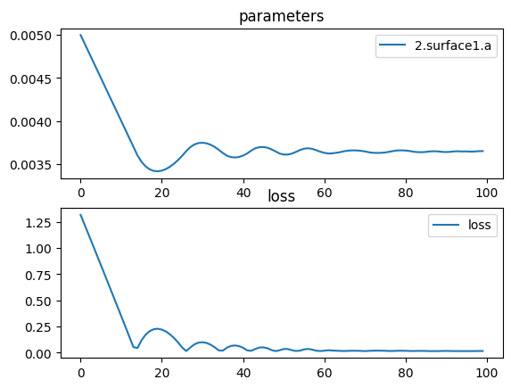

# Triple Lens


```python
import torch
import torch.nn as nn
import torch.optim as optim
import torchlensmaker as tlm

lens_diameter = 15.0

surface = tlm.Parabola(lens_diameter, a=tlm.parameter(-0.005))
lens = tlm.BiLens(surface, material = 'BK7-nd', outer_thickness=0.5)

optics = nn.Sequential(
    tlm.PointSourceAtInfinity(0.9*lens_diameter),
    tlm.Gap(15),
    
    lens,
    tlm.Gap(5),
    lens,
    tlm.Gap(5),
    lens,

    tlm.Gap(40),
    tlm.Aperture(40),
    
    tlm.Gap(40),
    tlm.FocalPoint(),
)

tlm.show(optics, dim=2)
tlm.show(optics, dim=3)
```


<div data-jp-suppress-context-menu id='tlmviewer-de02f518' class='tlmviewer' style='width: 100%; aspect-ratio: 16 / 9;'></div><script type='module'>async function importtlm() {
    try {
        return await import("/tlmviewer.js");
    } catch (error) {
        console.log("error", error);
        return await import("/files/test_notebooks/tlmviewer.js");
    }
}

const module = await importtlm();
const tlmviewer = module.tlmviewer;

const data = '{"mode": "2D", "camera": "XY", "data": [{"type": "surfaces", "data": [{"matrix": [[1.0, 0.0, 24.875], [0.0, 1.0, 0.0], [0.0, 0.0, 1.0]], "samples": [[-0.28125, -7.5], [-0.27559689, -7.4242425], [-0.27000114, -7.34848499], [-0.26446283, -7.27272749], [-0.25898185, -7.19696951], [-0.25355831, -7.12121201], [-0.24819213, -7.0454545], [-0.24288337, -6.969697], [-0.23763201, -6.8939395], [-0.23243803, -6.81818199], [-0.2273014, -6.74242401], [-0.22222221, -6.66666651], [-0.21720041, -6.590909], [-0.212236, -6.5151515], [-0.20732896, -6.439394], [-0.20247933, -6.36363649], [-0.1976871, -6.28787899], [-0.19295223, -6.21212101], [-0.18827479, -6.13636351], [-0.18365473, -6.060606], [-0.17909206, -5.9848485], [-0.17458677, -5.909091], [-0.1701389, -5.83333349], [-0.16574839, -5.75757551], [-0.16141526, -5.68181801], [-0.15713957, -5.6060605], [-0.15292126, -5.530303], [-0.14876032, -5.4545455], [-0.14465679, -5.37878799], [-0.14061064, -5.30303001], [-0.13662188, -5.22727251], [-0.13269053, -5.15151501], [-0.12881656, -5.0757575], [-0.125, -5.0], [-0.12124082, -4.9242425], [-0.11753903, -4.84848499], [-0.11389461, -4.77272701], [-0.11030761, -4.69696951], [-0.106778, -4.62121201], [-0.10330578, -4.5454545], [-0.09989095, -4.469697], [-0.09653351, -4.3939395], [-0.09323346, -4.31818151], [-0.0899908, -4.24242401], [-0.08680555, -4.16666651], [-0.08367768, -4.090909], [-0.08060721, -4.0151515], [-0.07759412, -3.93939376], [-0.07463842, -3.86363626], [-0.07174013, -3.78787875], [-0.06889922, -3.71212125], [-0.06611571, -3.63636374], [-0.06338958, -3.56060624], [-0.06072084, -3.4848485], [-0.05810951, -3.409091], [-0.05555556, -3.33333349], [-0.053059, -3.25757575], [-0.05061983, -3.18181825], [-0.04823807, -3.10606074], [-0.04591368, -3.030303], [-0.04364669, -2.9545455], [-0.0414371, -2.87878799], [-0.0392849, -2.80303049], [-0.03719008, -2.72727275], [-0.03515267, -2.65151525], [-0.03317264, -2.57575774], [-0.03125, -2.5], [-0.02938476, -2.4242425], [-0.02757691, -2.34848499], [-0.02582644, -2.27272725], [-0.02413338, -2.19696975], [-0.02249771, -2.12121224], [-0.02091942, -2.0454545], [-0.01939853, -1.969697], [-0.01793503, -1.8939395], [-0.01652893, -1.81818187], [-0.01518021, -1.74242425], [-0.01388889, -1.66666675], [-0.01265496, -1.59090912], [-0.01147842, -1.5151515], [-0.01035928, -1.439394], [-0.00929752, -1.36363637], [-0.00829316, -1.28787887], [-0.00734619, -1.21212125], [-0.00645661, -1.13636363], [-0.00562443, -1.06060612], [-0.00484963, -0.9848485], [-0.00413223, -0.90909094], [-0.00347222, -0.83333337], [-0.00286961, -0.75757575], [-0.00232438, -0.68181819], [-0.00183655, -0.60606062], [-0.00140611, -0.53030306], [-0.00103306, -0.45454547], [-0.0007174, -0.37878788], [-0.00045914, -0.30303031], [-0.00025826, -0.22727273], [-0.00011478, -0.15151516], [-2.87e-05, -0.07575758], [-0.0, 0.0], [-2.87e-05, 0.07575758], [-0.00011478, 0.15151516], [-0.00025826, 0.22727273], [-0.00045914, 0.30303031], [-0.0007174, 0.37878788], [-0.00103306, 0.45454547], [-0.00140611, 0.53030306], [-0.00183655, 0.60606062], [-0.00232438, 0.68181819], [-0.00286961, 0.75757575], [-0.00347222, 0.83333337], [-0.00413223, 0.90909094], [-0.00484963, 0.9848485], [-0.00562443, 1.06060612], [-0.00645661, 1.13636363], [-0.00734619, 1.21212125], [-0.00829316, 1.28787887], [-0.00929752, 1.36363637], [-0.01035928, 1.439394], [-0.01147842, 1.5151515], [-0.01265496, 1.59090912], [-0.01388889, 1.66666675], [-0.01518021, 1.74242425], [-0.01652893, 1.81818187], [-0.01793503, 1.8939395], [-0.01939853, 1.969697], [-0.02091942, 2.0454545], [-0.02249771, 2.12121224], [-0.02413338, 2.19696975], [-0.02582644, 2.27272725], [-0.02757691, 2.34848499], [-0.02938476, 2.4242425], [-0.03125, 2.5], [-0.03317264, 2.57575774], [-0.03515267, 2.65151525], [-0.03719008, 2.72727275], [-0.0392849, 2.80303049], [-0.0414371, 2.87878799], [-0.04364669, 2.9545455], [-0.04591368, 3.030303], [-0.04823807, 3.10606074], [-0.05061983, 3.18181825], [-0.053059, 3.25757575], [-0.05555556, 3.33333349], [-0.05810951, 3.409091], [-0.06072084, 3.4848485], [-0.06338958, 3.56060624], [-0.06611571, 3.63636374], [-0.06889922, 3.71212125], [-0.07174013, 3.78787875], [-0.07463842, 3.86363626], [-0.07759412, 3.93939376], [-0.08060721, 4.0151515], [-0.08367768, 4.090909], [-0.08680555, 4.16666651], [-0.0899908, 4.24242401], [-0.09323346, 4.31818151], [-0.09653351, 4.3939395], [-0.09989095, 4.469697], [-0.10330578, 4.5454545], [-0.106778, 4.62121201], [-0.11030761, 4.69696951], [-0.11389461, 4.77272701], [-0.11753903, 4.84848499], [-0.12124082, 4.9242425], [-0.125, 5.0], [-0.12881656, 5.0757575], [-0.13269053, 5.15151501], [-0.13662188, 5.22727251], [-0.14061064, 5.30303001], [-0.14465679, 5.37878799], [-0.14876032, 5.4545455], [-0.15292126, 5.530303], [-0.15713957, 5.6060605], [-0.16141526, 5.68181801], [-0.16574839, 5.75757551], [-0.1701389, 5.83333349], [-0.17458677, 5.909091], [-0.17909206, 5.9848485], [-0.18365473, 6.060606], [-0.18827479, 6.13636351], [-0.19295223, 6.21212101], [-0.1976871, 6.28787899], [-0.20247933, 6.36363649], [-0.20732896, 6.439394], [-0.212236, 6.5151515], [-0.21720041, 6.590909], [-0.22222221, 6.66666651], [-0.2273014, 6.74242401], [-0.23243803, 6.81818199], [-0.23763201, 6.8939395], [-0.24288337, 6.969697], [-0.24819213, 7.0454545], [-0.25355831, 7.12121201], [-0.25898185, 7.19696951], [-0.26446283, 7.27272749], [-0.27000114, 7.34848499], [-0.27559689, 7.4242425], [-0.28125, 7.5]]}]}, {"type": "surfaces", "data": [{"matrix": [[-1.0, 0.0, 24.8125], [0.0, -1.0, 0.0], [0.0, 0.0, 1.0]], "samples": [[-0.28125, -7.5], [-0.27559689, -7.4242425], [-0.27000114, -7.34848499], [-0.26446283, -7.27272749], [-0.25898185, -7.19696951], [-0.25355831, -7.12121201], [-0.24819213, -7.0454545], [-0.24288337, -6.969697], [-0.23763201, -6.8939395], [-0.23243803, -6.81818199], [-0.2273014, -6.74242401], [-0.22222221, -6.66666651], [-0.21720041, -6.590909], [-0.212236, -6.5151515], [-0.20732896, -6.439394], [-0.20247933, -6.36363649], [-0.1976871, -6.28787899], [-0.19295223, -6.21212101], [-0.18827479, -6.13636351], [-0.18365473, -6.060606], [-0.17909206, -5.9848485], [-0.17458677, -5.909091], [-0.1701389, -5.83333349], [-0.16574839, -5.75757551], [-0.16141526, -5.68181801], [-0.15713957, -5.6060605], [-0.15292126, -5.530303], [-0.14876032, -5.4545455], [-0.14465679, -5.37878799], [-0.14061064, -5.30303001], [-0.13662188, -5.22727251], [-0.13269053, -5.15151501], [-0.12881656, -5.0757575], [-0.125, -5.0], [-0.12124082, -4.9242425], [-0.11753903, -4.84848499], [-0.11389461, -4.77272701], [-0.11030761, -4.69696951], [-0.106778, -4.62121201], [-0.10330578, -4.5454545], [-0.09989095, -4.469697], [-0.09653351, -4.3939395], [-0.09323346, -4.31818151], [-0.0899908, -4.24242401], [-0.08680555, -4.16666651], [-0.08367768, -4.090909], [-0.08060721, -4.0151515], [-0.07759412, -3.93939376], [-0.07463842, -3.86363626], [-0.07174013, -3.78787875], [-0.06889922, -3.71212125], [-0.06611571, -3.63636374], [-0.06338958, -3.56060624], [-0.06072084, -3.4848485], [-0.05810951, -3.409091], [-0.05555556, -3.33333349], [-0.053059, -3.25757575], [-0.05061983, -3.18181825], [-0.04823807, -3.10606074], [-0.04591368, -3.030303], [-0.04364669, -2.9545455], [-0.0414371, -2.87878799], [-0.0392849, -2.80303049], [-0.03719008, -2.72727275], [-0.03515267, -2.65151525], [-0.03317264, -2.57575774], [-0.03125, -2.5], [-0.02938476, -2.4242425], [-0.02757691, -2.34848499], [-0.02582644, -2.27272725], [-0.02413338, -2.19696975], [-0.02249771, -2.12121224], [-0.02091942, -2.0454545], [-0.01939853, -1.969697], [-0.01793503, -1.8939395], [-0.01652893, -1.81818187], [-0.01518021, -1.74242425], [-0.01388889, -1.66666675], [-0.01265496, -1.59090912], [-0.01147842, -1.5151515], [-0.01035928, -1.439394], [-0.00929752, -1.36363637], [-0.00829316, -1.28787887], [-0.00734619, -1.21212125], [-0.00645661, -1.13636363], [-0.00562443, -1.06060612], [-0.00484963, -0.9848485], [-0.00413223, -0.90909094], [-0.00347222, -0.83333337], [-0.00286961, -0.75757575], [-0.00232438, -0.68181819], [-0.00183655, -0.60606062], [-0.00140611, -0.53030306], [-0.00103306, -0.45454547], [-0.0007174, -0.37878788], [-0.00045914, -0.30303031], [-0.00025826, -0.22727273], [-0.00011478, -0.15151516], [-2.87e-05, -0.07575758], [-0.0, 0.0], [-2.87e-05, 0.07575758], [-0.00011478, 0.15151516], [-0.00025826, 0.22727273], [-0.00045914, 0.30303031], [-0.0007174, 0.37878788], [-0.00103306, 0.45454547], [-0.00140611, 0.53030306], [-0.00183655, 0.60606062], [-0.00232438, 0.68181819], [-0.00286961, 0.75757575], [-0.00347222, 0.83333337], [-0.00413223, 0.90909094], [-0.00484963, 0.9848485], [-0.00562443, 1.06060612], [-0.00645661, 1.13636363], [-0.00734619, 1.21212125], [-0.00829316, 1.28787887], [-0.00929752, 1.36363637], [-0.01035928, 1.439394], [-0.01147842, 1.5151515], [-0.01265496, 1.59090912], [-0.01388889, 1.66666675], [-0.01518021, 1.74242425], [-0.01652893, 1.81818187], [-0.01793503, 1.8939395], [-0.01939853, 1.969697], [-0.02091942, 2.0454545], [-0.02249771, 2.12121224], [-0.02413338, 2.19696975], [-0.02582644, 2.27272725], [-0.02757691, 2.34848499], [-0.02938476, 2.4242425], [-0.03125, 2.5], [-0.03317264, 2.57575774], [-0.03515267, 2.65151525], [-0.03719008, 2.72727275], [-0.0392849, 2.80303049], [-0.0414371, 2.87878799], [-0.04364669, 2.9545455], [-0.04591368, 3.030303], [-0.04823807, 3.10606074], [-0.05061983, 3.18181825], [-0.053059, 3.25757575], [-0.05555556, 3.33333349], [-0.05810951, 3.409091], [-0.06072084, 3.4848485], [-0.06338958, 3.56060624], [-0.06611571, 3.63636374], [-0.06889922, 3.71212125], [-0.07174013, 3.78787875], [-0.07463842, 3.86363626], [-0.07759412, 3.93939376], [-0.08060721, 4.0151515], [-0.08367768, 4.090909], [-0.08680555, 4.16666651], [-0.0899908, 4.24242401], [-0.09323346, 4.31818151], [-0.09653351, 4.3939395], [-0.09989095, 4.469697], [-0.10330578, 4.5454545], [-0.106778, 4.62121201], [-0.11030761, 4.69696951], [-0.11389461, 4.77272701], [-0.11753903, 4.84848499], [-0.12124082, 4.9242425], [-0.125, 5.0], [-0.12881656, 5.0757575], [-0.13269053, 5.15151501], [-0.13662188, 5.22727251], [-0.14061064, 5.30303001], [-0.14465679, 5.37878799], [-0.14876032, 5.4545455], [-0.15292126, 5.530303], [-0.15713957, 5.6060605], [-0.16141526, 5.68181801], [-0.16574839, 5.75757551], [-0.1701389, 5.83333349], [-0.17458677, 5.909091], [-0.17909206, 5.9848485], [-0.18365473, 6.060606], [-0.18827479, 6.13636351], [-0.19295223, 6.21212101], [-0.1976871, 6.28787899], [-0.20247933, 6.36363649], [-0.20732896, 6.439394], [-0.212236, 6.5151515], [-0.21720041, 6.590909], [-0.22222221, 6.66666651], [-0.2273014, 6.74242401], [-0.23243803, 6.81818199], [-0.23763201, 6.8939395], [-0.24288337, 6.969697], [-0.24819213, 7.0454545], [-0.25355831, 7.12121201], [-0.25898185, 7.19696951], [-0.26446283, 7.27272749], [-0.27000114, 7.34848499], [-0.27559689, 7.4242425], [-0.28125, 7.5]]}]}, {"type": "surfaces", "data": [{"matrix": [[1.0, 0.0, 64.8125], [0.0, 1.0, 0.0], [0.0, 0.0, 1.0]], "samples": [[0.0, -20.0], [0.0, -19.79797935], [0.0, -19.59595871], [0.0, -19.39393997], [0.0, -19.19191933], [0.0, -18.98989868], [0.0, -18.78787804], [0.0, -18.5858593], [0.0, -18.38383865], [0.0, -18.18181801], [0.0, -17.97979736], [0.0, -17.77777863], [0.0, -17.57575798], [0.0, -17.37373734], [0.0, -17.17171669], [0.0, -16.96969795], [0.0, -16.76767731], [0.0, -16.56565666], [0.0, -16.36363602], [0.0, -16.16161537], [0.0, -15.95959568], [0.0, -15.75757599], [0.0, -15.55555534], [0.0, -15.35353565], [0.0, -15.15151501], [0.0, -14.94949532], [0.0, -14.74747467], [0.0, -14.54545498], [0.0, -14.34343433], [0.0, -14.14141464], [0.0, -13.939394], [0.0, -13.73737431], [0.0, -13.53535366], [0.0, -13.33333302], [0.0, -13.13131332], [0.0, -12.92929268], [0.0, -12.72727299], [0.0, -12.52525234], [0.0, -12.32323265], [0.0, -12.12121201], [0.0, -11.91919231], [0.0, -11.71717167], [0.0, -11.51515198], [0.0, -11.31313133], [0.0, -11.11111164], [0.0, -10.909091], [0.0, -10.7070713], [0.0, -10.50505066], [0.0, -10.30303001], [0.0, -10.10101032], [0.0, -9.89898968], [0.0, -9.69696999], [0.0, -9.49494934], [0.0, -9.2929287], [0.0, -9.090909], [0.0, -8.88888836], [0.0, -8.68686867], [0.0, -8.48484802], [0.0, -8.28282833], [0.0, -8.08080769], [0.0, -7.87878752], [0.0, -7.67676735], [0.0, -7.47474718], [0.0, -7.27272701], [0.0, -7.07070684], [0.0, -6.86868668], [0.0, -6.66666651], [0.0, -6.46464634], [0.0, -6.26262617], [0.0, -6.060606], [0.0, -5.85858583], [0.0, -5.65656567], [0.0, -5.4545455], [0.0, -5.25252533], [0.0, -5.05050516], [0.0, -4.84848499], [0.0, -4.64646435], [0.0, -4.44444418], [0.0, -4.24242401], [0.0, -4.04040384], [0.0, -3.83838367], [0.0, -3.63636351], [0.0, -3.43434334], [0.0, -3.23232317], [0.0, -3.030303], [0.0, -2.82828283], [0.0, -2.62626266], [0.0, -2.4242425], [0.0, -2.22222209], [0.0, -2.02020192], [0.0, -1.81818175], [0.0, -1.61616158], [0.0, -1.41414142], [0.0, -1.21212125], [0.0, -1.01010096], [0.0, -0.80808079], [0.0, -0.60606062], [0.0, -0.4040404], [0.0, -0.2020202], [0.0, 0.0], [0.0, 0.2020202], [0.0, 0.4040404], [0.0, 0.60606062], [0.0, 0.80808079], [0.0, 1.01010096], [0.0, 1.21212125], [0.0, 1.41414142], [0.0, 1.61616158], [0.0, 1.81818175], [0.0, 2.02020192], [0.0, 2.22222209], [0.0, 2.4242425], [0.0, 2.62626266], [0.0, 2.82828283], [0.0, 3.030303], [0.0, 3.23232317], [0.0, 3.43434334], [0.0, 3.63636351], [0.0, 3.83838367], [0.0, 4.04040384], [0.0, 4.24242401], [0.0, 4.44444418], [0.0, 4.64646435], [0.0, 4.84848499], [0.0, 5.05050516], [0.0, 5.25252533], [0.0, 5.4545455], [0.0, 5.65656567], [0.0, 5.85858583], [0.0, 6.060606], [0.0, 6.26262617], [0.0, 6.46464634], [0.0, 6.66666651], [0.0, 6.86868668], [0.0, 7.07070684], [0.0, 7.27272701], [0.0, 7.47474718], [0.0, 7.67676735], [0.0, 7.87878752], [0.0, 8.08080769], [0.0, 8.28282833], [0.0, 8.48484802], [0.0, 8.68686867], [0.0, 8.88888836], [0.0, 9.090909], [0.0, 9.2929287], [0.0, 9.49494934], [0.0, 9.69696999], [0.0, 9.89898968], [0.0, 10.10101032], [0.0, 10.30303001], [0.0, 10.50505066], [0.0, 10.7070713], [0.0, 10.909091], [0.0, 11.11111164], [0.0, 11.31313133], [0.0, 11.51515198], [0.0, 11.71717167], [0.0, 11.91919231], [0.0, 12.12121201], [0.0, 12.32323265], [0.0, 12.52525234], [0.0, 12.72727299], [0.0, 12.92929268], [0.0, 13.13131332], [0.0, 13.33333302], [0.0, 13.53535366], [0.0, 13.73737431], [0.0, 13.939394], [0.0, 14.14141464], [0.0, 14.34343433], [0.0, 14.54545498], [0.0, 14.74747467], [0.0, 14.94949532], [0.0, 15.15151501], [0.0, 15.35353565], [0.0, 15.55555534], [0.0, 15.75757599], [0.0, 15.95959568], [0.0, 16.16161537], [0.0, 16.36363602], [0.0, 16.56565666], [0.0, 16.76767731], [0.0, 16.96969795], [0.0, 17.17171669], [0.0, 17.37373734], [0.0, 17.57575798], [0.0, 17.77777863], [0.0, 17.97979736], [0.0, 18.18181801], [0.0, 18.38383865], [0.0, 18.5858593], [0.0, 18.78787804], [0.0, 18.98989868], [0.0, 19.19191933], [0.0, 19.39393997], [0.0, 19.59595871], [0.0, 19.79797935], [0.0, 20.0]]}]}, {"type": "points", "data": [[104.8125, 0.0]], "color": "red"}, {"type": "rays", "points": [[20.0276573, -5.525528, 24.69178067, -6.05341776], [19.95279547, -3.94450169, 24.78111656, -4.33320757], [19.90298453, -2.36577806, 24.84110514, -2.60364582], [19.87810818, -0.78843873, 24.87122853, -0.86850079], [19.87810818, 0.78843873, 24.87122853, 0.86850079], [19.90298453, 2.36577806, 24.84110514, 2.60364582], [19.95279547, 3.94450169, 24.78111656, 4.33320757], [20.0276573, 5.525528, 24.69178067, 6.05341776]], "color": "#ffa724", "variables": {"base": [-5.25, -3.75, -2.25, -0.75, 0.75, 2.25, 3.75, 5.25]}, "domain": {"base": [-6.75, 6.75]}, "layers": [1]}, {"type": "rays", "points": [[20.12774405, -7.1097686, 24.875, -7.80450349], [20.12774405, 7.1097686, 24.875, 7.80450349]], "color": "red", "variables": {"base": [-6.75, 6.75]}, "domain": {"base": [-6.75, 6.75]}, "layers": [2]}, {"type": "rays", "points": [[24.69178067, -6.05341776, 24.99748311, -6.08248492], [24.78111656, -4.33320757, 24.90675263, -4.34171933], [24.84110514, -2.60364582, 24.84640045, -2.60386072], [24.87122853, -0.86850079, 24.81626502, -0.86775786], [24.87122853, 0.86850079, 24.81626502, 0.86775786], [24.84110514, 2.60364582, 24.84640045, 2.60386072], [24.78111656, 4.33320757, 24.90675263, 4.34171933], [24.69178067, 6.05341776, 24.99748311, 6.08248492]], "color": "#ffa724", "variables": {"base": [-5.25, -3.75, -2.25, -0.75, 0.75, 2.25, 3.75, 5.25]}, "domain": {"base": [-6.75, 6.75]}, "layers": [1]}, {"type": "rays", "points": [[24.99748311, -6.08248492, 64.8125, -13.20924998], [24.90675263, -4.34171933, 64.8125, -9.39483521], [24.84640045, -2.60386072, 64.8125, -5.62120583], [24.81626502, -0.86775786, 64.8125, -1.87116191], [24.81626502, 0.86775786, 64.8125, 1.87116191], [24.84640045, 2.60386072, 64.8125, 5.62120583], [24.90675263, 4.34171933, 64.8125, 9.39483521], [24.99748311, 6.08248492, 64.8125, 13.20924998]], "color": "#ffa724", "variables": {"base": [-5.25, -3.75, -2.25, -0.75, 0.75, 2.25, 3.75, 5.25]}, "domain": {"base": [-6.75, 6.75]}, "layers": [1]}, {"type": "rays", "points": [[64.8125, -13.20924998, 106.27808874, -20.63146229], [64.8125, -9.39483521, 105.57547534, -14.55649868], [64.8125, -5.62120583, 105.09091525, -8.66213004], [64.8125, -1.87116191, 104.84364623, -2.87544179], [64.8125, 1.87116191, 104.84364623, 2.87544179], [64.8125, 5.62120583, 105.09091525, 8.66213004], [64.8125, 9.39483521, 105.57547534, 14.55649868], [64.8125, 13.20924998, 106.27808874, 20.63146229]], "color": "#ffa724", "variables": {"base": [-5.25, -3.75, -2.25, -0.75, 0.75, 2.25, 3.75, 5.25]}, "domain": {"base": [-6.75, 6.75]}}, {"type": "points", "data": [[0.0, 0.0], [15.0, 0.0], [14.71875, 0.0], [15.21875, 0.0], [14.9375, 0.0], [19.9375, 0.0], [19.65625, 0.0], [20.15625, 0.0], [19.875, 0.0], [24.875, 0.0], [24.59375, 0.0], [25.09375, 0.0], [24.8125, 0.0], [64.8125, 0.0], [104.8125, 0.0]], "layers": [4]}]}';

tlmviewer.embed(document.getElementById("tlmviewer-de02f518"), data);    
</script>


<div data-jp-suppress-context-menu id='tlmviewer-31293724' class='tlmviewer' style='width: 100%; aspect-ratio: 16 / 9;'></div><script type='module'>async function importtlm() {
    try {
        return await import("/tlmviewer.js");
    } catch (error) {
        console.log("error", error);
        return await import("/files/test_notebooks/tlmviewer.js");
    }
}

const module = await importtlm();
const tlmviewer = module.tlmviewer;

const data = '{"mode": "3D", "camera": "orthographic", "data": [{"type": "surfaces", "data": [{"matrix": [[1.0, 0.0, 0.0, 24.875], [0.0, 1.0, 0.0, 0.0], [0.0, 0.0, 1.0, 0.0], [0.0, 0.0, 0.0, 1.0]], "samples": [[-0.0, 0.0], [-2.87e-05, 0.07575758], [-0.00011478, 0.15151516], [-0.00025826, 0.22727273], [-0.00045914, 0.30303031], [-0.0007174, 0.37878788], [-0.00103306, 0.45454547], [-0.00140611, 0.53030306], [-0.00183655, 0.60606062], [-0.00232438, 0.68181819], [-0.00286961, 0.75757575], [-0.00347222, 0.83333337], [-0.00413223, 0.90909094], [-0.00484963, 0.9848485], [-0.00562443, 1.06060612], [-0.00645661, 1.13636363], [-0.00734619, 1.21212125], [-0.00829316, 1.28787887], [-0.00929752, 1.36363637], [-0.01035928, 1.439394], [-0.01147842, 1.5151515], [-0.01265496, 1.59090912], [-0.01388889, 1.66666675], [-0.01518021, 1.74242425], [-0.01652893, 1.81818187], [-0.01793503, 1.8939395], [-0.01939853, 1.969697], [-0.02091942, 2.0454545], [-0.02249771, 2.12121224], [-0.02413338, 2.19696975], [-0.02582644, 2.27272725], [-0.02757691, 2.34848499], [-0.02938476, 2.4242425], [-0.03125, 2.5], [-0.03317264, 2.57575774], [-0.03515267, 2.65151525], [-0.03719008, 2.72727275], [-0.0392849, 2.80303049], [-0.0414371, 2.87878799], [-0.04364669, 2.9545455], [-0.04591368, 3.030303], [-0.04823807, 3.10606074], [-0.05061983, 3.18181825], [-0.053059, 3.25757575], [-0.05555556, 3.33333349], [-0.05810951, 3.409091], [-0.06072084, 3.4848485], [-0.06338958, 3.56060624], [-0.06611571, 3.63636374], [-0.06889922, 3.71212125], [-0.07174013, 3.78787875], [-0.07463842, 3.86363626], [-0.07759412, 3.93939376], [-0.08060721, 4.0151515], [-0.08367768, 4.090909], [-0.08680555, 4.16666651], [-0.0899908, 4.24242401], [-0.09323346, 4.31818151], [-0.09653351, 4.3939395], [-0.09989095, 4.469697], [-0.10330578, 4.5454545], [-0.106778, 4.62121201], [-0.11030761, 4.69696951], [-0.11389461, 4.77272701], [-0.11753903, 4.84848499], [-0.12124082, 4.9242425], [-0.125, 5.0], [-0.12881656, 5.0757575], [-0.13269053, 5.15151501], [-0.13662188, 5.22727251], [-0.14061064, 5.30303001], [-0.14465679, 5.37878799], [-0.14876032, 5.4545455], [-0.15292126, 5.530303], [-0.15713957, 5.6060605], [-0.16141526, 5.68181801], [-0.16574839, 5.75757551], [-0.1701389, 5.83333349], [-0.17458677, 5.909091], [-0.17909206, 5.9848485], [-0.18365473, 6.060606], [-0.18827479, 6.13636351], [-0.19295223, 6.21212101], [-0.1976871, 6.28787899], [-0.20247933, 6.36363649], [-0.20732896, 6.439394], [-0.212236, 6.5151515], [-0.21720041, 6.590909], [-0.22222221, 6.66666651], [-0.2273014, 6.74242401], [-0.23243803, 6.81818199], [-0.23763201, 6.8939395], [-0.24288337, 6.969697], [-0.24819213, 7.0454545], [-0.25355831, 7.12121201], [-0.25898185, 7.19696951], [-0.26446283, 7.27272749], [-0.27000114, 7.34848499], [-0.27559689, 7.4242425], [-0.28125, 7.5]]}]}, {"type": "surfaces", "data": [{"matrix": [[-1.0, 0.0, 0.0, 24.8125], [0.0, -1.0, 0.0, 0.0], [0.0, 0.0, -1.0, 0.0], [0.0, 0.0, 0.0, 1.0]], "samples": [[-0.0, 0.0], [-2.87e-05, 0.07575758], [-0.00011478, 0.15151516], [-0.00025826, 0.22727273], [-0.00045914, 0.30303031], [-0.0007174, 0.37878788], [-0.00103306, 0.45454547], [-0.00140611, 0.53030306], [-0.00183655, 0.60606062], [-0.00232438, 0.68181819], [-0.00286961, 0.75757575], [-0.00347222, 0.83333337], [-0.00413223, 0.90909094], [-0.00484963, 0.9848485], [-0.00562443, 1.06060612], [-0.00645661, 1.13636363], [-0.00734619, 1.21212125], [-0.00829316, 1.28787887], [-0.00929752, 1.36363637], [-0.01035928, 1.439394], [-0.01147842, 1.5151515], [-0.01265496, 1.59090912], [-0.01388889, 1.66666675], [-0.01518021, 1.74242425], [-0.01652893, 1.81818187], [-0.01793503, 1.8939395], [-0.01939853, 1.969697], [-0.02091942, 2.0454545], [-0.02249771, 2.12121224], [-0.02413338, 2.19696975], [-0.02582644, 2.27272725], [-0.02757691, 2.34848499], [-0.02938476, 2.4242425], [-0.03125, 2.5], [-0.03317264, 2.57575774], [-0.03515267, 2.65151525], [-0.03719008, 2.72727275], [-0.0392849, 2.80303049], [-0.0414371, 2.87878799], [-0.04364669, 2.9545455], [-0.04591368, 3.030303], [-0.04823807, 3.10606074], [-0.05061983, 3.18181825], [-0.053059, 3.25757575], [-0.05555556, 3.33333349], [-0.05810951, 3.409091], [-0.06072084, 3.4848485], [-0.06338958, 3.56060624], [-0.06611571, 3.63636374], [-0.06889922, 3.71212125], [-0.07174013, 3.78787875], [-0.07463842, 3.86363626], [-0.07759412, 3.93939376], [-0.08060721, 4.0151515], [-0.08367768, 4.090909], [-0.08680555, 4.16666651], [-0.0899908, 4.24242401], [-0.09323346, 4.31818151], [-0.09653351, 4.3939395], [-0.09989095, 4.469697], [-0.10330578, 4.5454545], [-0.106778, 4.62121201], [-0.11030761, 4.69696951], [-0.11389461, 4.77272701], [-0.11753903, 4.84848499], [-0.12124082, 4.9242425], [-0.125, 5.0], [-0.12881656, 5.0757575], [-0.13269053, 5.15151501], [-0.13662188, 5.22727251], [-0.14061064, 5.30303001], [-0.14465679, 5.37878799], [-0.14876032, 5.4545455], [-0.15292126, 5.530303], [-0.15713957, 5.6060605], [-0.16141526, 5.68181801], [-0.16574839, 5.75757551], [-0.1701389, 5.83333349], [-0.17458677, 5.909091], [-0.17909206, 5.9848485], [-0.18365473, 6.060606], [-0.18827479, 6.13636351], [-0.19295223, 6.21212101], [-0.1976871, 6.28787899], [-0.20247933, 6.36363649], [-0.20732896, 6.439394], [-0.212236, 6.5151515], [-0.21720041, 6.590909], [-0.22222221, 6.66666651], [-0.2273014, 6.74242401], [-0.23243803, 6.81818199], [-0.23763201, 6.8939395], [-0.24288337, 6.969697], [-0.24819213, 7.0454545], [-0.25355831, 7.12121201], [-0.25898185, 7.19696951], [-0.26446283, 7.27272749], [-0.27000114, 7.34848499], [-0.27559689, 7.4242425], [-0.28125, 7.5]]}]}, {"type": "surfaces", "data": [{"matrix": [[1.0, 0.0, 0.0, 64.8125], [0.0, 1.0, 0.0, 0.0], [0.0, 0.0, 1.0, 0.0], [0.0, 0.0, 0.0, 1.0]], "samples": [[0.0, 0.0], [0.0, 0.2020202], [0.0, 0.4040404], [0.0, 0.60606062], [0.0, 0.80808079], [0.0, 1.01010096], [0.0, 1.21212125], [0.0, 1.41414142], [0.0, 1.61616158], [0.0, 1.81818175], [0.0, 2.02020192], [0.0, 2.22222209], [0.0, 2.4242425], [0.0, 2.62626266], [0.0, 2.82828283], [0.0, 3.030303], [0.0, 3.23232317], [0.0, 3.43434334], [0.0, 3.63636351], [0.0, 3.83838367], [0.0, 4.04040384], [0.0, 4.24242401], [0.0, 4.44444418], [0.0, 4.64646435], [0.0, 4.84848499], [0.0, 5.05050516], [0.0, 5.25252533], [0.0, 5.4545455], [0.0, 5.65656567], [0.0, 5.85858583], [0.0, 6.060606], [0.0, 6.26262617], [0.0, 6.46464634], [0.0, 6.66666651], [0.0, 6.86868668], [0.0, 7.07070684], [0.0, 7.27272701], [0.0, 7.47474718], [0.0, 7.67676735], [0.0, 7.87878752], [0.0, 8.08080769], [0.0, 8.28282833], [0.0, 8.48484802], [0.0, 8.68686867], [0.0, 8.88888836], [0.0, 9.090909], [0.0, 9.2929287], [0.0, 9.49494934], [0.0, 9.69696999], [0.0, 9.89898968], [0.0, 10.10101032], [0.0, 10.30303001], [0.0, 10.50505066], [0.0, 10.7070713], [0.0, 10.909091], [0.0, 11.11111164], [0.0, 11.31313133], [0.0, 11.51515198], [0.0, 11.71717167], [0.0, 11.91919231], [0.0, 12.12121201], [0.0, 12.32323265], [0.0, 12.52525234], [0.0, 12.72727299], [0.0, 12.92929268], [0.0, 13.13131332], [0.0, 13.33333302], [0.0, 13.53535366], [0.0, 13.73737431], [0.0, 13.939394], [0.0, 14.14141464], [0.0, 14.34343433], [0.0, 14.54545498], [0.0, 14.74747467], [0.0, 14.94949532], [0.0, 15.15151501], [0.0, 15.35353565], [0.0, 15.55555534], [0.0, 15.75757599], [0.0, 15.95959568], [0.0, 16.16161537], [0.0, 16.36363602], [0.0, 16.56565666], [0.0, 16.76767731], [0.0, 16.96969795], [0.0, 17.17171669], [0.0, 17.37373734], [0.0, 17.57575798], [0.0, 17.77777863], [0.0, 17.97979736], [0.0, 18.18181801], [0.0, 18.38383865], [0.0, 18.5858593], [0.0, 18.78787804], [0.0, 18.98989868], [0.0, 19.19191933], [0.0, 19.39393997], [0.0, 19.59595871], [0.0, 19.79797935], [0.0, 20.0]]}]}, {"type": "points", "data": [[104.8125, 0.0, 0.0]], "color": "red"}, {"type": "rays", "points": [[19.875, 0.0, 0.0, 24.875, 0.0, 0.0], [19.875, 0.0, 0.0, 24.875, 0.0, 0.0], [19.875, 0.0, 0.0, 24.875, 0.0, 0.0], [19.93799974, 3.54964068, 0.0, 24.79888971, 3.90154566, 0.0], [19.93799974, -3.54964068, 0.0, 24.79888971, -3.90154566, 0.0], [19.93799974, 3.54964068, -0.0, 24.79888971, 3.90154566, -0.0]], "color": "#ffa724", "variables": {}, "domain": {"base": [-6.75, 6.75]}, "layers": [1]}, {"type": "rays", "points": [[20.12774405, 7.1097686, 0.0, 24.875, 7.80450349, 0.0], [20.12774405, -7.1097686, 0.0, 24.875, -7.80450349, 0.0], [20.12774405, 7.1097686, -0.0, 24.875, 7.80450349, -0.0]], "color": "red", "variables": {}, "domain": {"base": [-6.75, 6.75]}, "layers": [2]}, {"type": "rays", "points": [[24.875, 0.0, 0.0, 24.8125, 0.0, 0.0], [24.875, 0.0, 0.0, 24.8125, 0.0, 0.0], [24.875, 0.0, 0.0, 24.8125, 0.0, 0.0], [24.79888971, 3.90154566, 0.0, 24.88882429, 3.9070267, 0.0], [24.79888971, -3.90154566, 0.0, 24.88882429, -3.9070267, 0.0], [24.79888971, 3.90154566, -0.0, 24.88882429, 3.9070267, -0.0]], "color": "#ffa724", "variables": {}, "domain": {"base": [-6.75, 6.75]}, "layers": [1]}, {"type": "rays", "points": [[24.8125, 0.0, 0.0, 64.8125, 0.0, 0.0], [24.8125, 0.0, 0.0, 64.8125, 0.0, 0.0], [24.8125, 0.0, 0.0, 64.8125, 0.0, 0.0], [24.88882429, 3.9070267, 0.0, 64.8125, 8.44830831, 0.0], [24.88882429, -3.9070267, 0.0, 64.8125, -8.44830831, 0.0], [24.88882429, 3.9070267, -0.0, 64.8125, 8.44830831, -0.0]], "color": "#ffa724", "variables": {}, "domain": {"base": [-6.75, 6.75]}, "layers": [1]}, {"type": "rays", "points": [[64.8125, 0.0, 0.0, 104.8125, 0.0, 0.0], [64.8125, 0.0, 0.0, 104.8125, 0.0, 0.0], [64.8125, 0.0, 0.0, 104.8125, 0.0, 0.0], [64.8125, 8.44830831, 0.0, 105.43299343, 13.06885229, 0.0], [64.8125, -8.44830831, 0.0, 105.43299343, -13.06885229, 0.0], [64.8125, 8.44830831, -0.0, 105.43299343, 13.06885229, -0.0]], "color": "#ffa724", "variables": {}, "domain": {"base": [-6.75, 6.75]}}, {"type": "points", "data": [[0.0, 0.0, 0.0], [15.0, 0.0, 0.0], [14.71875, 0.0, 0.0], [15.21875, 0.0, 0.0], [14.9375, 0.0, 0.0], [19.9375, 0.0, 0.0], [19.65625, 0.0, 0.0], [20.15625, 0.0, 0.0], [19.875, 0.0, 0.0], [24.875, 0.0, 0.0], [24.59375, 0.0, 0.0], [25.09375, 0.0, 0.0], [24.8125, 0.0, 0.0], [64.8125, 0.0, 0.0], [104.8125, 0.0, 0.0]], "layers": [4]}]}';

tlmviewer.embed(document.getElementById("tlmviewer-31293724"), data);    
</script>


```python
tlm.optimize(
    optics,
    optimizer = optim.Adam(optics.parameters(), lr=1e-4),
    sampling = {"base": 10},
    dim = 2,
    num_iter = 100
).plot()

print("Final parabola parameter:", surface.a.item())
print("Outer thickness:", lens.outer_thickness())
print("Inner thickness:", lens.inner_thickness())
```

    [  1/100] L= 11.472 | grad norm= 1779.378569000027
    [  6/100] L= 10.586 | grad norm= 1763.2251911986596
    [ 11/100] L=  9.709 | grad norm= 1746.825804690616
    [ 16/100] L=  8.842 | grad norm= 1730.1693331303516
    [ 21/100] L=  9.951 | grad norm= 2136.4740974266774
    [ 26/100] L=  8.838 | grad norm= 2114.3050429747955
    [ 31/100] L=  7.729 | grad norm= 2091.618118502379
    [ 36/100] L=  6.633 | grad norm= 2068.570058045829
    [ 41/100] L=  5.556 | grad norm= 2045.2218944086942
    [ 46/100] L=  4.499 | grad norm= 2021.5908982563155
    [ 51/100] L=  3.465 | grad norm= 1997.6737561181048
    [ 56/100] L=  2.453 | grad norm= 1973.457933710487
    [ 61/100] L=  1.463 | grad norm= 1948.9275391355886
    [ 66/100] L=  0.495 | grad norm= 1924.0664089376955
    [ 71/100] L=  0.345 | grad norm= 1901.7447106278614
    [ 76/100] L=  0.538 | grad norm= 1896.50600103664
    [ 81/100] L=  0.277 | grad norm= 1903.581090114904
    [ 86/100] L=  0.150 | grad norm= 1914.98561694402
    [ 91/100] L=  0.096 | grad norm= 1913.5579601552724
    [ 96/100] L=  0.109 | grad norm= 1908.0935642832185
    [100/100] L=  0.052 | grad norm= 1912.3998648122586


    

    


    Final parabola parameter: 0.0018678597138216603
    Outer thickness: tensor(0.5000, dtype=torch.float64, grad_fn=<LinalgVectorNormBackward0>)
    Inner thickness: tensor(0.7101, dtype=torch.float64, grad_fn=<LinalgVectorNormBackward0>)


```python
tlm.show(optics, dim=2)
tlm.show(optics, dim=3)
```


<div data-jp-suppress-context-menu id='tlmviewer-edb11401' class='tlmviewer' style='width: 100%; aspect-ratio: 16 / 9;'></div><script type='module'>async function importtlm() {
    try {
        return await import("/tlmviewer.js");
    } catch (error) {
        console.log("error", error);
        return await import("/files/test_notebooks/tlmviewer.js");
    }
}

const module = await importtlm();
const tlmviewer = module.tlmviewer;

const data = '{"mode": "2D", "camera": "XY", "data": [{"type": "surfaces", "data": [{"matrix": [[1.0, 0.0, 26.42026844], [0.0, 1.0, 0.0], [0.0, 0.0, 1.0]], "samples": [[0.10506711, -7.5], [0.10295527, -7.4242425], [0.10086486, -7.34848499], [0.0987959, -7.27272749], [0.09674836, -7.19696951], [0.09472227, -7.12121201], [0.09271762, -7.0454545], [0.09073441, -6.969697], [0.08877265, -6.8939395], [0.08683233, -6.81818199], [0.08491343, -6.74242401], [0.08301599, -6.66666651], [0.08113998, -6.590909], [0.07928542, -6.5151515], [0.07745229, -6.439394], [0.0756406, -6.36363649], [0.07385036, -6.28787899], [0.07208154, -6.21212101], [0.07033418, -6.13636351], [0.06860825, -6.060606], [0.06690377, -5.9848485], [0.06522072, -5.909091], [0.06355911, -5.83333349], [0.06191895, -5.75757551], [0.06030022, -5.68181801], [0.05870293, -5.6060605], [0.05712709, -5.530303], [0.05557268, -5.4545455], [0.05403972, -5.37878799], [0.05252819, -5.30303001], [0.05103811, -5.22727251], [0.04956946, -5.15151501], [0.04812226, -5.0757575], [0.0466965, -5.0], [0.04529217, -4.9242425], [0.04390929, -4.84848499], [0.04254783, -4.77272701], [0.04120783, -4.69696951], [0.03988926, -4.62121201], [0.03859214, -4.5454545], [0.03731646, -4.469697], [0.03606221, -4.3939395], [0.0348294, -4.31818151], [0.03361804, -4.24242401], [0.03242812, -4.16666651], [0.03125963, -4.090909], [0.03011259, -4.0151515], [0.02898699, -3.93939376], [0.02788282, -3.86363626], [0.0268001, -3.78787875], [0.02573882, -3.71212125], [0.02469897, -3.63636374], [0.02368057, -3.56060624], [0.0226836, -3.4848485], [0.02170808, -3.409091], [0.020754, -3.33333349], [0.01982136, -3.25757575], [0.01891015, -3.18181825], [0.01802039, -3.10606074], [0.01715206, -3.030303], [0.01630518, -2.9545455], [0.01547974, -2.87878799], [0.01467574, -2.80303049], [0.01389317, -2.72727275], [0.01313205, -2.65151525], [0.01239237, -2.57575774], [0.01167412, -2.5], [0.01097732, -2.4242425], [0.01030196, -2.34848499], [0.00964804, -2.27272725], [0.00901555, -2.19696975], [0.00840451, -2.12121224], [0.00781491, -2.0454545], [0.00724675, -1.969697], [0.00670003, -1.8939395], [0.00617474, -1.81818187], [0.0056709, -1.74242425], [0.0051885, -1.66666675], [0.00472754, -1.59090912], [0.00428802, -1.5151515], [0.00386993, -1.439394], [0.00347329, -1.36363637], [0.00309809, -1.28787887], [0.00274433, -1.21212125], [0.00241201, -1.13636363], [0.00210113, -1.06060612], [0.00181169, -0.9848485], [0.00154369, -0.90909094], [0.00129713, -0.83333337], [0.001072, -0.75757575], [0.00086832, -0.68181819], [0.00068608, -0.60606062], [0.00052528, -0.53030306], [0.00038592, -0.45454547], [0.000268, -0.37878788], [0.00017152, -0.30303031], [9.648e-05, -0.22727273], [4.288e-05, -0.15151516], [1.072e-05, -0.07575758], [0.0, 0.0], [1.072e-05, 0.07575758], [4.288e-05, 0.15151516], [9.648e-05, 0.22727273], [0.00017152, 0.30303031], [0.000268, 0.37878788], [0.00038592, 0.45454547], [0.00052528, 0.53030306], [0.00068608, 0.60606062], [0.00086832, 0.68181819], [0.001072, 0.75757575], [0.00129713, 0.83333337], [0.00154369, 0.90909094], [0.00181169, 0.9848485], [0.00210113, 1.06060612], [0.00241201, 1.13636363], [0.00274433, 1.21212125], [0.00309809, 1.28787887], [0.00347329, 1.36363637], [0.00386993, 1.439394], [0.00428802, 1.5151515], [0.00472754, 1.59090912], [0.0051885, 1.66666675], [0.0056709, 1.74242425], [0.00617474, 1.81818187], [0.00670003, 1.8939395], [0.00724675, 1.969697], [0.00781491, 2.0454545], [0.00840451, 2.12121224], [0.00901555, 2.19696975], [0.00964804, 2.27272725], [0.01030196, 2.34848499], [0.01097732, 2.4242425], [0.01167412, 2.5], [0.01239237, 2.57575774], [0.01313205, 2.65151525], [0.01389317, 2.72727275], [0.01467574, 2.80303049], [0.01547974, 2.87878799], [0.01630518, 2.9545455], [0.01715206, 3.030303], [0.01802039, 3.10606074], [0.01891015, 3.18181825], [0.01982136, 3.25757575], [0.020754, 3.33333349], [0.02170808, 3.409091], [0.0226836, 3.4848485], [0.02368057, 3.56060624], [0.02469897, 3.63636374], [0.02573882, 3.71212125], [0.0268001, 3.78787875], [0.02788282, 3.86363626], [0.02898699, 3.93939376], [0.03011259, 4.0151515], [0.03125963, 4.090909], [0.03242812, 4.16666651], [0.03361804, 4.24242401], [0.0348294, 4.31818151], [0.03606221, 4.3939395], [0.03731646, 4.469697], [0.03859214, 4.5454545], [0.03988926, 4.62121201], [0.04120783, 4.69696951], [0.04254783, 4.77272701], [0.04390929, 4.84848499], [0.04529217, 4.9242425], [0.0466965, 5.0], [0.04812226, 5.0757575], [0.04956946, 5.15151501], [0.05103811, 5.22727251], [0.05252819, 5.30303001], [0.05403972, 5.37878799], [0.05557268, 5.4545455], [0.05712709, 5.530303], [0.05870293, 5.6060605], [0.06030022, 5.68181801], [0.06191895, 5.75757551], [0.06355911, 5.83333349], [0.06522072, 5.909091], [0.06690377, 5.9848485], [0.06860825, 6.060606], [0.07033418, 6.13636351], [0.07208154, 6.21212101], [0.07385036, 6.28787899], [0.0756406, 6.36363649], [0.07745229, 6.439394], [0.07928542, 6.5151515], [0.08113998, 6.590909], [0.08301599, 6.66666651], [0.08491343, 6.74242401], [0.08683233, 6.81818199], [0.08877265, 6.8939395], [0.09073441, 6.969697], [0.09271762, 7.0454545], [0.09472227, 7.12121201], [0.09674836, 7.19696951], [0.0987959, 7.27272749], [0.10086486, 7.34848499], [0.10295527, 7.4242425], [0.10506711, 7.5]]}]}, {"type": "surfaces", "data": [{"matrix": [[-1.0, 0.0, 27.13040265], [0.0, -1.0, 0.0], [0.0, 0.0, 1.0]], "samples": [[0.10506711, -7.5], [0.10295527, -7.4242425], [0.10086486, -7.34848499], [0.0987959, -7.27272749], [0.09674836, -7.19696951], [0.09472227, -7.12121201], [0.09271762, -7.0454545], [0.09073441, -6.969697], [0.08877265, -6.8939395], [0.08683233, -6.81818199], [0.08491343, -6.74242401], [0.08301599, -6.66666651], [0.08113998, -6.590909], [0.07928542, -6.5151515], [0.07745229, -6.439394], [0.0756406, -6.36363649], [0.07385036, -6.28787899], [0.07208154, -6.21212101], [0.07033418, -6.13636351], [0.06860825, -6.060606], [0.06690377, -5.9848485], [0.06522072, -5.909091], [0.06355911, -5.83333349], [0.06191895, -5.75757551], [0.06030022, -5.68181801], [0.05870293, -5.6060605], [0.05712709, -5.530303], [0.05557268, -5.4545455], [0.05403972, -5.37878799], [0.05252819, -5.30303001], [0.05103811, -5.22727251], [0.04956946, -5.15151501], [0.04812226, -5.0757575], [0.0466965, -5.0], [0.04529217, -4.9242425], [0.04390929, -4.84848499], [0.04254783, -4.77272701], [0.04120783, -4.69696951], [0.03988926, -4.62121201], [0.03859214, -4.5454545], [0.03731646, -4.469697], [0.03606221, -4.3939395], [0.0348294, -4.31818151], [0.03361804, -4.24242401], [0.03242812, -4.16666651], [0.03125963, -4.090909], [0.03011259, -4.0151515], [0.02898699, -3.93939376], [0.02788282, -3.86363626], [0.0268001, -3.78787875], [0.02573882, -3.71212125], [0.02469897, -3.63636374], [0.02368057, -3.56060624], [0.0226836, -3.4848485], [0.02170808, -3.409091], [0.020754, -3.33333349], [0.01982136, -3.25757575], [0.01891015, -3.18181825], [0.01802039, -3.10606074], [0.01715206, -3.030303], [0.01630518, -2.9545455], [0.01547974, -2.87878799], [0.01467574, -2.80303049], [0.01389317, -2.72727275], [0.01313205, -2.65151525], [0.01239237, -2.57575774], [0.01167412, -2.5], [0.01097732, -2.4242425], [0.01030196, -2.34848499], [0.00964804, -2.27272725], [0.00901555, -2.19696975], [0.00840451, -2.12121224], [0.00781491, -2.0454545], [0.00724675, -1.969697], [0.00670003, -1.8939395], [0.00617474, -1.81818187], [0.0056709, -1.74242425], [0.0051885, -1.66666675], [0.00472754, -1.59090912], [0.00428802, -1.5151515], [0.00386993, -1.439394], [0.00347329, -1.36363637], [0.00309809, -1.28787887], [0.00274433, -1.21212125], [0.00241201, -1.13636363], [0.00210113, -1.06060612], [0.00181169, -0.9848485], [0.00154369, -0.90909094], [0.00129713, -0.83333337], [0.001072, -0.75757575], [0.00086832, -0.68181819], [0.00068608, -0.60606062], [0.00052528, -0.53030306], [0.00038592, -0.45454547], [0.000268, -0.37878788], [0.00017152, -0.30303031], [9.648e-05, -0.22727273], [4.288e-05, -0.15151516], [1.072e-05, -0.07575758], [0.0, 0.0], [1.072e-05, 0.07575758], [4.288e-05, 0.15151516], [9.648e-05, 0.22727273], [0.00017152, 0.30303031], [0.000268, 0.37878788], [0.00038592, 0.45454547], [0.00052528, 0.53030306], [0.00068608, 0.60606062], [0.00086832, 0.68181819], [0.001072, 0.75757575], [0.00129713, 0.83333337], [0.00154369, 0.90909094], [0.00181169, 0.9848485], [0.00210113, 1.06060612], [0.00241201, 1.13636363], [0.00274433, 1.21212125], [0.00309809, 1.28787887], [0.00347329, 1.36363637], [0.00386993, 1.439394], [0.00428802, 1.5151515], [0.00472754, 1.59090912], [0.0051885, 1.66666675], [0.0056709, 1.74242425], [0.00617474, 1.81818187], [0.00670003, 1.8939395], [0.00724675, 1.969697], [0.00781491, 2.0454545], [0.00840451, 2.12121224], [0.00901555, 2.19696975], [0.00964804, 2.27272725], [0.01030196, 2.34848499], [0.01097732, 2.4242425], [0.01167412, 2.5], [0.01239237, 2.57575774], [0.01313205, 2.65151525], [0.01389317, 2.72727275], [0.01467574, 2.80303049], [0.01547974, 2.87878799], [0.01630518, 2.9545455], [0.01715206, 3.030303], [0.01802039, 3.10606074], [0.01891015, 3.18181825], [0.01982136, 3.25757575], [0.020754, 3.33333349], [0.02170808, 3.409091], [0.0226836, 3.4848485], [0.02368057, 3.56060624], [0.02469897, 3.63636374], [0.02573882, 3.71212125], [0.0268001, 3.78787875], [0.02788282, 3.86363626], [0.02898699, 3.93939376], [0.03011259, 4.0151515], [0.03125963, 4.090909], [0.03242812, 4.16666651], [0.03361804, 4.24242401], [0.0348294, 4.31818151], [0.03606221, 4.3939395], [0.03731646, 4.469697], [0.03859214, 4.5454545], [0.03988926, 4.62121201], [0.04120783, 4.69696951], [0.04254783, 4.77272701], [0.04390929, 4.84848499], [0.04529217, 4.9242425], [0.0466965, 5.0], [0.04812226, 5.0757575], [0.04956946, 5.15151501], [0.05103811, 5.22727251], [0.05252819, 5.30303001], [0.05403972, 5.37878799], [0.05557268, 5.4545455], [0.05712709, 5.530303], [0.05870293, 5.6060605], [0.06030022, 5.68181801], [0.06191895, 5.75757551], [0.06355911, 5.83333349], [0.06522072, 5.909091], [0.06690377, 5.9848485], [0.06860825, 6.060606], [0.07033418, 6.13636351], [0.07208154, 6.21212101], [0.07385036, 6.28787899], [0.0756406, 6.36363649], [0.07745229, 6.439394], [0.07928542, 6.5151515], [0.08113998, 6.590909], [0.08301599, 6.66666651], [0.08491343, 6.74242401], [0.08683233, 6.81818199], [0.08877265, 6.8939395], [0.09073441, 6.969697], [0.09271762, 7.0454545], [0.09472227, 7.12121201], [0.09674836, 7.19696951], [0.0987959, 7.27272749], [0.10086486, 7.34848499], [0.10295527, 7.4242425], [0.10506711, 7.5]]}]}, {"type": "surfaces", "data": [{"matrix": [[1.0, 0.0, 67.13040265], [0.0, 1.0, 0.0], [0.0, 0.0, 1.0]], "samples": [[0.0, -20.0], [0.0, -19.79797935], [0.0, -19.59595871], [0.0, -19.39393997], [0.0, -19.19191933], [0.0, -18.98989868], [0.0, -18.78787804], [0.0, -18.5858593], [0.0, -18.38383865], [0.0, -18.18181801], [0.0, -17.97979736], [0.0, -17.77777863], [0.0, -17.57575798], [0.0, -17.37373734], [0.0, -17.17171669], [0.0, -16.96969795], [0.0, -16.76767731], [0.0, -16.56565666], [0.0, -16.36363602], [0.0, -16.16161537], [0.0, -15.95959568], [0.0, -15.75757599], [0.0, -15.55555534], [0.0, -15.35353565], [0.0, -15.15151501], [0.0, -14.94949532], [0.0, -14.74747467], [0.0, -14.54545498], [0.0, -14.34343433], [0.0, -14.14141464], [0.0, -13.939394], [0.0, -13.73737431], [0.0, -13.53535366], [0.0, -13.33333302], [0.0, -13.13131332], [0.0, -12.92929268], [0.0, -12.72727299], [0.0, -12.52525234], [0.0, -12.32323265], [0.0, -12.12121201], [0.0, -11.91919231], [0.0, -11.71717167], [0.0, -11.51515198], [0.0, -11.31313133], [0.0, -11.11111164], [0.0, -10.909091], [0.0, -10.7070713], [0.0, -10.50505066], [0.0, -10.30303001], [0.0, -10.10101032], [0.0, -9.89898968], [0.0, -9.69696999], [0.0, -9.49494934], [0.0, -9.2929287], [0.0, -9.090909], [0.0, -8.88888836], [0.0, -8.68686867], [0.0, -8.48484802], [0.0, -8.28282833], [0.0, -8.08080769], [0.0, -7.87878752], [0.0, -7.67676735], [0.0, -7.47474718], [0.0, -7.27272701], [0.0, -7.07070684], [0.0, -6.86868668], [0.0, -6.66666651], [0.0, -6.46464634], [0.0, -6.26262617], [0.0, -6.060606], [0.0, -5.85858583], [0.0, -5.65656567], [0.0, -5.4545455], [0.0, -5.25252533], [0.0, -5.05050516], [0.0, -4.84848499], [0.0, -4.64646435], [0.0, -4.44444418], [0.0, -4.24242401], [0.0, -4.04040384], [0.0, -3.83838367], [0.0, -3.63636351], [0.0, -3.43434334], [0.0, -3.23232317], [0.0, -3.030303], [0.0, -2.82828283], [0.0, -2.62626266], [0.0, -2.4242425], [0.0, -2.22222209], [0.0, -2.02020192], [0.0, -1.81818175], [0.0, -1.61616158], [0.0, -1.41414142], [0.0, -1.21212125], [0.0, -1.01010096], [0.0, -0.80808079], [0.0, -0.60606062], [0.0, -0.4040404], [0.0, -0.2020202], [0.0, 0.0], [0.0, 0.2020202], [0.0, 0.4040404], [0.0, 0.60606062], [0.0, 0.80808079], [0.0, 1.01010096], [0.0, 1.21212125], [0.0, 1.41414142], [0.0, 1.61616158], [0.0, 1.81818175], [0.0, 2.02020192], [0.0, 2.22222209], [0.0, 2.4242425], [0.0, 2.62626266], [0.0, 2.82828283], [0.0, 3.030303], [0.0, 3.23232317], [0.0, 3.43434334], [0.0, 3.63636351], [0.0, 3.83838367], [0.0, 4.04040384], [0.0, 4.24242401], [0.0, 4.44444418], [0.0, 4.64646435], [0.0, 4.84848499], [0.0, 5.05050516], [0.0, 5.25252533], [0.0, 5.4545455], [0.0, 5.65656567], [0.0, 5.85858583], [0.0, 6.060606], [0.0, 6.26262617], [0.0, 6.46464634], [0.0, 6.66666651], [0.0, 6.86868668], [0.0, 7.07070684], [0.0, 7.27272701], [0.0, 7.47474718], [0.0, 7.67676735], [0.0, 7.87878752], [0.0, 8.08080769], [0.0, 8.28282833], [0.0, 8.48484802], [0.0, 8.68686867], [0.0, 8.88888836], [0.0, 9.090909], [0.0, 9.2929287], [0.0, 9.49494934], [0.0, 9.69696999], [0.0, 9.89898968], [0.0, 10.10101032], [0.0, 10.30303001], [0.0, 10.50505066], [0.0, 10.7070713], [0.0, 10.909091], [0.0, 11.11111164], [0.0, 11.31313133], [0.0, 11.51515198], [0.0, 11.71717167], [0.0, 11.91919231], [0.0, 12.12121201], [0.0, 12.32323265], [0.0, 12.52525234], [0.0, 12.72727299], [0.0, 12.92929268], [0.0, 13.13131332], [0.0, 13.33333302], [0.0, 13.53535366], [0.0, 13.73737431], [0.0, 13.939394], [0.0, 14.14141464], [0.0, 14.34343433], [0.0, 14.54545498], [0.0, 14.74747467], [0.0, 14.94949532], [0.0, 15.15151501], [0.0, 15.35353565], [0.0, 15.55555534], [0.0, 15.75757599], [0.0, 15.95959568], [0.0, 16.16161537], [0.0, 16.36363602], [0.0, 16.56565666], [0.0, 16.76767731], [0.0, 16.96969795], [0.0, 17.17171669], [0.0, 17.37373734], [0.0, 17.57575798], [0.0, 17.77777863], [0.0, 17.97979736], [0.0, 18.18181801], [0.0, 18.38383865], [0.0, 18.5858593], [0.0, 18.78787804], [0.0, 18.98989868], [0.0, 19.19191933], [0.0, 19.39393997], [0.0, 19.59595871], [0.0, 19.79797935], [0.0, 20.0]]}]}, {"type": "points", "data": [[107.13040265, 0.0]], "color": "red"}, {"type": "rays", "points": [[21.33901611, -6.59547047, 26.4950418, -6.32705104], [21.37112278, -5.12944558, 26.46554354, -4.92331454], [21.3951968, -3.66369407, 26.44338397, -3.51787075], [21.41124329, -2.19813813, 26.42859387, -2.11120912], [21.41926568, -0.73269965, 26.4211937, -0.70381745], [21.41926568, 0.73269965, 26.4211937, 0.70381745], [21.41124329, 2.19813813, 26.42859387, 2.11120912], [21.3951968, 3.66369407, 26.44338397, 3.51787075], [21.37112278, 5.12944558, 26.46554354, 4.92331454], [21.33901611, 6.59547047, 26.4950418, 6.32705104]], "color": "#ffa724", "variables": {"base": [-6.75, -5.25, -3.75, -2.25, -0.75, 0.75, 2.25, 3.75, 5.25, 6.75]}, "domain": {"base": [-6.75, 6.75]}, "layers": [1]}, {"type": "rays", "points": [[26.4950418, -6.32705104, 27.05618947, -6.30330615], [26.46554354, -4.92331454, 27.0855019, -4.90291891], [26.44338397, -3.51787075, 27.10749169, -3.50226966], [26.42859387, -2.11120912, 27.12215413, -2.10143529], [26.4211937, -0.70381745, 27.12948612, -0.70049064], [26.4211937, 0.70381745, 27.12948612, 0.70049064], [26.42859387, 2.11120912, 27.12215413, 2.10143529], [26.44338397, 3.51787075, 27.10749169, 3.50226966], [26.46554354, 4.92331454, 27.0855019, 4.90291891], [26.4950418, 6.32705104, 27.05618947, 6.30330615]], "color": "#ffa724", "variables": {"base": [-6.75, -5.25, -3.75, -2.25, -0.75, 0.75, 2.25, 3.75, 5.25, 6.75]}, "domain": {"base": [-6.75, 6.75]}, "layers": [1]}, {"type": "rays", "points": [[27.05618947, -6.30330615, 67.13040265, -3.22425023], [27.0855019, -4.90291891, 67.13040265, -2.5131635], [27.10749169, -3.50226966, 67.13040265, -1.79800615], [27.12215413, -2.10143529, 67.13040265, -1.07995642], [27.12948612, -0.70049064, 67.13040265, -0.36017729], [27.12948612, 0.70049064, 67.13040265, 0.36017729], [27.12215413, 2.10143529, 67.13040265, 1.07995642], [27.10749169, 3.50226966, 67.13040265, 1.79800615], [27.0855019, 4.90291891, 67.13040265, 2.5131635], [27.05618947, 6.30330615, 67.13040265, 3.22425023]], "color": "#ffa724", "variables": {"base": [-6.75, -5.25, -3.75, -2.25, -0.75, 0.75, 2.25, 3.75, 5.25, 6.75]}, "domain": {"base": [-6.75, 6.75]}, "layers": [1]}, {"type": "rays", "points": [[67.13040265, -3.22425023, 107.14220977, -0.14998921], [67.13040265, -2.5131635, 107.13809775, -0.12562841], [67.13040265, -1.79800615, 107.13454039, -0.09454205], [67.13040265, -1.07995642, 107.13194308, -0.05864882], [67.13040265, -0.36017729, 107.13057664, -0.01987026], [67.13040265, 0.36017729, 107.13057664, 0.01987026], [67.13040265, 1.07995642, 107.13194308, 0.05864882], [67.13040265, 1.79800615, 107.13454039, 0.09454205], [67.13040265, 2.5131635, 107.13809775, 0.12562841], [67.13040265, 3.22425023, 107.14220977, 0.14998921]], "color": "#ffa724", "variables": {"base": [-6.75, -5.25, -3.75, -2.25, -0.75, 0.75, 2.25, 3.75, 5.25, 6.75]}, "domain": {"base": [-6.75, 6.75]}}, {"type": "points", "data": [[0.0, 0.0], [15.0, 0.0], [15.10506711, 0.0], [15.60506711, 0.0], [15.71013422, 0.0], [20.71013422, 0.0], [20.81520133, 0.0], [21.31520133, 0.0], [21.42026844, 0.0], [26.42026844, 0.0], [26.52533554, 0.0], [27.02533554, 0.0], [27.13040265, 0.0], [67.13040265, 0.0], [107.13040265, 0.0]], "layers": [4]}]}';

tlmviewer.embed(document.getElementById("tlmviewer-edb11401"), data);    
</script>


<div data-jp-suppress-context-menu id='tlmviewer-7e79e0f9' class='tlmviewer' style='width: 100%; aspect-ratio: 16 / 9;'></div><script type='module'>async function importtlm() {
    try {
        return await import("/tlmviewer.js");
    } catch (error) {
        console.log("error", error);
        return await import("/files/test_notebooks/tlmviewer.js");
    }
}

const module = await importtlm();
const tlmviewer = module.tlmviewer;

const data = '{"mode": "3D", "camera": "orthographic", "data": [{"type": "surfaces", "data": [{"matrix": [[1.0, 0.0, 0.0, 26.42026844], [0.0, 1.0, 0.0, 0.0], [0.0, 0.0, 1.0, 0.0], [0.0, 0.0, 0.0, 1.0]], "samples": [[0.0, 0.0], [1.072e-05, 0.07575758], [4.288e-05, 0.15151516], [9.648e-05, 0.22727273], [0.00017152, 0.30303031], [0.000268, 0.37878788], [0.00038592, 0.45454547], [0.00052528, 0.53030306], [0.00068608, 0.60606062], [0.00086832, 0.68181819], [0.001072, 0.75757575], [0.00129713, 0.83333337], [0.00154369, 0.90909094], [0.00181169, 0.9848485], [0.00210113, 1.06060612], [0.00241201, 1.13636363], [0.00274433, 1.21212125], [0.00309809, 1.28787887], [0.00347329, 1.36363637], [0.00386993, 1.439394], [0.00428802, 1.5151515], [0.00472754, 1.59090912], [0.0051885, 1.66666675], [0.0056709, 1.74242425], [0.00617474, 1.81818187], [0.00670003, 1.8939395], [0.00724675, 1.969697], [0.00781491, 2.0454545], [0.00840451, 2.12121224], [0.00901555, 2.19696975], [0.00964804, 2.27272725], [0.01030196, 2.34848499], [0.01097732, 2.4242425], [0.01167412, 2.5], [0.01239237, 2.57575774], [0.01313205, 2.65151525], [0.01389317, 2.72727275], [0.01467574, 2.80303049], [0.01547974, 2.87878799], [0.01630518, 2.9545455], [0.01715206, 3.030303], [0.01802039, 3.10606074], [0.01891015, 3.18181825], [0.01982136, 3.25757575], [0.020754, 3.33333349], [0.02170808, 3.409091], [0.0226836, 3.4848485], [0.02368057, 3.56060624], [0.02469897, 3.63636374], [0.02573882, 3.71212125], [0.0268001, 3.78787875], [0.02788282, 3.86363626], [0.02898699, 3.93939376], [0.03011259, 4.0151515], [0.03125963, 4.090909], [0.03242812, 4.16666651], [0.03361804, 4.24242401], [0.0348294, 4.31818151], [0.03606221, 4.3939395], [0.03731646, 4.469697], [0.03859214, 4.5454545], [0.03988926, 4.62121201], [0.04120783, 4.69696951], [0.04254783, 4.77272701], [0.04390929, 4.84848499], [0.04529217, 4.9242425], [0.0466965, 5.0], [0.04812226, 5.0757575], [0.04956946, 5.15151501], [0.05103811, 5.22727251], [0.05252819, 5.30303001], [0.05403972, 5.37878799], [0.05557268, 5.4545455], [0.05712709, 5.530303], [0.05870293, 5.6060605], [0.06030022, 5.68181801], [0.06191895, 5.75757551], [0.06355911, 5.83333349], [0.06522072, 5.909091], [0.06690377, 5.9848485], [0.06860825, 6.060606], [0.07033418, 6.13636351], [0.07208154, 6.21212101], [0.07385036, 6.28787899], [0.0756406, 6.36363649], [0.07745229, 6.439394], [0.07928542, 6.5151515], [0.08113998, 6.590909], [0.08301599, 6.66666651], [0.08491343, 6.74242401], [0.08683233, 6.81818199], [0.08877265, 6.8939395], [0.09073441, 6.969697], [0.09271762, 7.0454545], [0.09472227, 7.12121201], [0.09674836, 7.19696951], [0.0987959, 7.27272749], [0.10086486, 7.34848499], [0.10295527, 7.4242425], [0.10506711, 7.5]]}]}, {"type": "surfaces", "data": [{"matrix": [[-1.0, 0.0, 0.0, 27.13040265], [0.0, -1.0, 0.0, 0.0], [0.0, 0.0, -1.0, 0.0], [0.0, 0.0, 0.0, 1.0]], "samples": [[0.0, 0.0], [1.072e-05, 0.07575758], [4.288e-05, 0.15151516], [9.648e-05, 0.22727273], [0.00017152, 0.30303031], [0.000268, 0.37878788], [0.00038592, 0.45454547], [0.00052528, 0.53030306], [0.00068608, 0.60606062], [0.00086832, 0.68181819], [0.001072, 0.75757575], [0.00129713, 0.83333337], [0.00154369, 0.90909094], [0.00181169, 0.9848485], [0.00210113, 1.06060612], [0.00241201, 1.13636363], [0.00274433, 1.21212125], [0.00309809, 1.28787887], [0.00347329, 1.36363637], [0.00386993, 1.439394], [0.00428802, 1.5151515], [0.00472754, 1.59090912], [0.0051885, 1.66666675], [0.0056709, 1.74242425], [0.00617474, 1.81818187], [0.00670003, 1.8939395], [0.00724675, 1.969697], [0.00781491, 2.0454545], [0.00840451, 2.12121224], [0.00901555, 2.19696975], [0.00964804, 2.27272725], [0.01030196, 2.34848499], [0.01097732, 2.4242425], [0.01167412, 2.5], [0.01239237, 2.57575774], [0.01313205, 2.65151525], [0.01389317, 2.72727275], [0.01467574, 2.80303049], [0.01547974, 2.87878799], [0.01630518, 2.9545455], [0.01715206, 3.030303], [0.01802039, 3.10606074], [0.01891015, 3.18181825], [0.01982136, 3.25757575], [0.020754, 3.33333349], [0.02170808, 3.409091], [0.0226836, 3.4848485], [0.02368057, 3.56060624], [0.02469897, 3.63636374], [0.02573882, 3.71212125], [0.0268001, 3.78787875], [0.02788282, 3.86363626], [0.02898699, 3.93939376], [0.03011259, 4.0151515], [0.03125963, 4.090909], [0.03242812, 4.16666651], [0.03361804, 4.24242401], [0.0348294, 4.31818151], [0.03606221, 4.3939395], [0.03731646, 4.469697], [0.03859214, 4.5454545], [0.03988926, 4.62121201], [0.04120783, 4.69696951], [0.04254783, 4.77272701], [0.04390929, 4.84848499], [0.04529217, 4.9242425], [0.0466965, 5.0], [0.04812226, 5.0757575], [0.04956946, 5.15151501], [0.05103811, 5.22727251], [0.05252819, 5.30303001], [0.05403972, 5.37878799], [0.05557268, 5.4545455], [0.05712709, 5.530303], [0.05870293, 5.6060605], [0.06030022, 5.68181801], [0.06191895, 5.75757551], [0.06355911, 5.83333349], [0.06522072, 5.909091], [0.06690377, 5.9848485], [0.06860825, 6.060606], [0.07033418, 6.13636351], [0.07208154, 6.21212101], [0.07385036, 6.28787899], [0.0756406, 6.36363649], [0.07745229, 6.439394], [0.07928542, 6.5151515], [0.08113998, 6.590909], [0.08301599, 6.66666651], [0.08491343, 6.74242401], [0.08683233, 6.81818199], [0.08877265, 6.8939395], [0.09073441, 6.969697], [0.09271762, 7.0454545], [0.09472227, 7.12121201], [0.09674836, 7.19696951], [0.0987959, 7.27272749], [0.10086486, 7.34848499], [0.10295527, 7.4242425], [0.10506711, 7.5]]}]}, {"type": "surfaces", "data": [{"matrix": [[1.0, 0.0, 0.0, 67.13040265], [0.0, 1.0, 0.0, 0.0], [0.0, 0.0, 1.0, 0.0], [0.0, 0.0, 0.0, 1.0]], "samples": [[0.0, 0.0], [0.0, 0.2020202], [0.0, 0.4040404], [0.0, 0.60606062], [0.0, 0.80808079], [0.0, 1.01010096], [0.0, 1.21212125], [0.0, 1.41414142], [0.0, 1.61616158], [0.0, 1.81818175], [0.0, 2.02020192], [0.0, 2.22222209], [0.0, 2.4242425], [0.0, 2.62626266], [0.0, 2.82828283], [0.0, 3.030303], [0.0, 3.23232317], [0.0, 3.43434334], [0.0, 3.63636351], [0.0, 3.83838367], [0.0, 4.04040384], [0.0, 4.24242401], [0.0, 4.44444418], [0.0, 4.64646435], [0.0, 4.84848499], [0.0, 5.05050516], [0.0, 5.25252533], [0.0, 5.4545455], [0.0, 5.65656567], [0.0, 5.85858583], [0.0, 6.060606], [0.0, 6.26262617], [0.0, 6.46464634], [0.0, 6.66666651], [0.0, 6.86868668], [0.0, 7.07070684], [0.0, 7.27272701], [0.0, 7.47474718], [0.0, 7.67676735], [0.0, 7.87878752], [0.0, 8.08080769], [0.0, 8.28282833], [0.0, 8.48484802], [0.0, 8.68686867], [0.0, 8.88888836], [0.0, 9.090909], [0.0, 9.2929287], [0.0, 9.49494934], [0.0, 9.69696999], [0.0, 9.89898968], [0.0, 10.10101032], [0.0, 10.30303001], [0.0, 10.50505066], [0.0, 10.7070713], [0.0, 10.909091], [0.0, 11.11111164], [0.0, 11.31313133], [0.0, 11.51515198], [0.0, 11.71717167], [0.0, 11.91919231], [0.0, 12.12121201], [0.0, 12.32323265], [0.0, 12.52525234], [0.0, 12.72727299], [0.0, 12.92929268], [0.0, 13.13131332], [0.0, 13.33333302], [0.0, 13.53535366], [0.0, 13.73737431], [0.0, 13.939394], [0.0, 14.14141464], [0.0, 14.34343433], [0.0, 14.54545498], [0.0, 14.74747467], [0.0, 14.94949532], [0.0, 15.15151501], [0.0, 15.35353565], [0.0, 15.55555534], [0.0, 15.75757599], [0.0, 15.95959568], [0.0, 16.16161537], [0.0, 16.36363602], [0.0, 16.56565666], [0.0, 16.76767731], [0.0, 16.96969795], [0.0, 17.17171669], [0.0, 17.37373734], [0.0, 17.57575798], [0.0, 17.77777863], [0.0, 17.97979736], [0.0, 18.18181801], [0.0, 18.38383865], [0.0, 18.5858593], [0.0, 18.78787804], [0.0, 18.98989868], [0.0, 19.19191933], [0.0, 19.39393997], [0.0, 19.59595871], [0.0, 19.79797935], [0.0, 20.0]]}]}, {"type": "points", "data": [[107.13040265, 0.0, 0.0]], "color": "red"}, {"type": "rays", "points": [[21.42026844, 0.0, 0.0, 26.42026844, 0.0, 0.0], [21.42026844, 0.0, 0.0, 26.42026844, 0.0, 0.0], [21.42026844, 0.0, 0.0, 26.42026844, 0.0, 0.0], [21.39996084, 3.2972898, 0.0, 26.43899459, 3.16630044, 0.0], [21.39996084, -3.2972898, 0.0, 26.43899459, -3.16630044, 0.0], [21.39996084, 3.2972898, -0.0, 26.43899459, 3.16630044, -0.0], [21.33901611, 6.59547047, 0.0, 26.4950418, 6.32705104, 0.0], [21.33901611, -6.59547047, 0.0, 26.4950418, -6.32705104, 0.0], [21.33901611, 6.59547047, -0.0, 26.4950418, 6.32705104, -0.0]], "color": "#ffa724", "variables": {}, "domain": {"base": [-6.75, 6.75]}, "layers": [1]}, {"type": "rays", "points": [[26.42026844, 0.0, 0.0, 27.13040265, 0.0, 0.0], [26.42026844, 0.0, 0.0, 27.13040265, 0.0, 0.0], [26.42026844, 0.0, 0.0, 27.13040265, 0.0, 0.0], [26.43899459, 3.16630044, 0.0, 27.11184438, 3.15207547, 0.0], [26.43899459, -3.16630044, 0.0, 27.11184438, -3.15207547, 0.0], [26.43899459, 3.16630044, -0.0, 27.11184438, 3.15207547, -0.0], [26.4950418, 6.32705104, 0.0, 27.05618947, 6.30330615, 0.0], [26.4950418, -6.32705104, 0.0, 27.05618947, -6.30330615, 0.0], [26.4950418, 6.32705104, -0.0, 27.05618947, 6.30330615, -0.0]], "color": "#ffa724", "variables": {}, "domain": {"base": [-6.75, 6.75]}, "layers": [1]}, {"type": "rays", "points": [[27.13040265, 0.0, 0.0, 67.13040265, 0.0, 0.0], [27.13040265, 0.0, 0.0, 67.13040265, 0.0, 0.0], [27.13040265, 0.0, 0.0, 67.13040265, 0.0, 0.0], [27.11184438, 3.15207547, 0.0, 67.13040265, 1.61871924, 0.0], [27.11184438, -3.15207547, 0.0, 67.13040265, -1.61871924, 0.0], [27.11184438, 3.15207547, -0.0, 67.13040265, 1.61871924, -0.0], [27.05618947, 6.30330615, 0.0, 67.13040265, 3.22425023, 0.0], [27.05618947, -6.30330615, 0.0, 67.13040265, -3.22425023, 0.0], [27.05618947, 6.30330615, -0.0, 67.13040265, 3.22425023, -0.0]], "color": "#ffa724", "variables": {}, "domain": {"base": [-6.75, 6.75]}, "layers": [1]}, {"type": "rays", "points": [[67.13040265, 0.0, 0.0, 107.13040265, 0.0, 0.0], [67.13040265, 0.0, 0.0, 107.13040265, 0.0, 0.0], [67.13040265, 0.0, 0.0, 107.13040265, 0.0, 0.0], [67.13040265, 1.61871924, 0.0, 107.13378817, 0.08594436, 0.0], [67.13040265, -1.61871924, 0.0, 107.13378817, -0.08594436, 0.0], [67.13040265, 1.61871924, -0.0, 107.13378817, 0.08594436, -0.0], [67.13040265, 3.22425023, 0.0, 107.14220977, 0.14998921, 0.0], [67.13040265, -3.22425023, 0.0, 107.14220977, -0.14998921, 0.0], [67.13040265, 3.22425023, -0.0, 107.14220977, 0.14998921, -0.0]], "color": "#ffa724", "variables": {}, "domain": {"base": [-6.75, 6.75]}}, {"type": "points", "data": [[0.0, 0.0, 0.0], [15.0, 0.0, 0.0], [15.10506711, 0.0, 0.0], [15.60506711, 0.0, 0.0], [15.71013422, 0.0, 0.0], [20.71013422, 0.0, 0.0], [20.81520133, 0.0, 0.0], [21.31520133, 0.0, 0.0], [21.42026844, 0.0, 0.0], [26.42026844, 0.0, 0.0], [26.52533554, 0.0, 0.0], [27.02533554, 0.0, 0.0], [27.13040265, 0.0, 0.0], [67.13040265, 0.0, 0.0], [107.13040265, 0.0, 0.0]], "layers": [4]}]}';

tlmviewer.embed(document.getElementById("tlmviewer-7e79e0f9"), data);    
</script>

