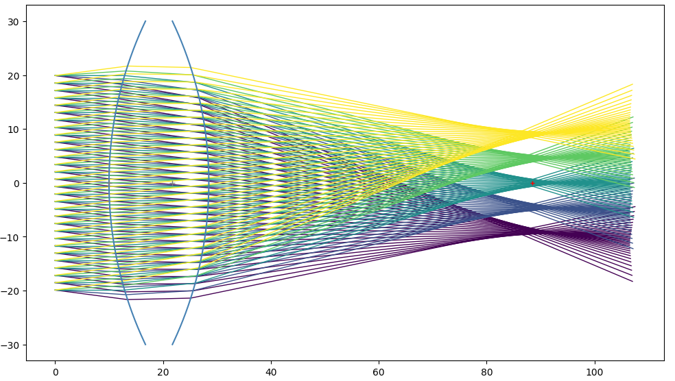

# Torch Lens Maker


Welcome to *Torch Lens Maker*, an open-source Python library for designing optical systems using optimization.

Currently an experimental project, the goal is to be able to design complex real-world optical systems (lenses, mirrors, etc.) using modern and expressive computer code.

* Describe your optical system in Python
* Sample the problem space with light rays, wavelengths, elements positions, etc.
* Analyse with magnification plots, spot diagrams, and more
* Wrap any value with `tlm.Parameter()` to make it optimizable
* Optimize parameters for maximum optical performance
* Export 3D models in any format

```python
import torchlensmaker as tlm

shape = tlm.CircularArc(height=60., r=70.)

optics = tlm.OpticalSequence(
    tlm.ObjectAtInfinity(beam_diameter=40, angular_size=15),
    tlm.Gap(10.),
    tlm.SymmetricLens(shape, (1.0, 1.5), outer_thickness=5.),
    tlm.Gap(60.0),
    tlm.Image(height=10),
)

tlm.render_plt(optics, sampling={"rays": 30, "object": 5}, color_dim="object")
```



The core of the project is differentiable raytracing: collision detection and the laws of optics implemented in [PyTorch](https://pytorch.org/). PyTorch provides world-class automatic differentiation, and access to state-of-the-art numerical optimization algorithms. Export to 3D models is done with [build123d](https://build123d.readthedocs.io/en/latest/).

The key idea is that there is a strong analogy to be made between layers of a neural network, and optical elements in an optical system. If we have a compound optical system made of a series of lenses, mirrors, etc., we can pretend that each optical element is the layer of a neural network. The data flowing through this network are not images, sounds, or text, but rays of light. Each layer affects light rays depending on its internal parameters describing its surface shape, and following the very much non-linear Snell's law. Inference, or the forward model, is the optical simulation where given some input light, we compute the image formed. Training, or optimization, is finding the best shapes for lenses to focus light where we want it.

<div class="center-table" markdown>

|                   |           **Neural Network**          |         **Optical system**        |
|------------------:|:-------------------------------------:|:---------------------------------:|
|          **Data** |          Images, Text, Audio          |             Light rays            |
|        **Layers** |          Conv2d, Linear, ReLU         |    Refraction, Reflection, Gap    |
| **Loss Function** |  Prediction error to labeled examples | Focusing error in the image plane |

</div>

The magic is that we can pretty much use `torch.nn` and `nn.Module` directly, stacking lenses and mirrors as if they were `Conv2d` and `ReLU`. Then, pass the whole thing through `optimize()` to find the optimal values for parametric surfaces, and designing lenses is surprisingly like training a neural network! Once this is implemented, you get 'for free' the massive power of modern open-source machine learning tooling: automatic differentiation, optimization algorithms, composability, GPU training, distributed training, and more. On top of that, I strongly believe that writing code is a very powerful way to design lenses and this project is an exploration of that.

The ultimate goal of *Torch Lens Maker* is to be to *Zemax OpticStudio* what *OpenSCAD* is to *SolidWorks*.

## Design principles

*Torch Lens Maker* design principles are:

**1. Geometric Optics**  
Light propagates as rays that travel in a straight line. If they hit a surface, they can reflect, refract or stop.

**2. Rotational Symmetry**  
The real-world 3D system being modeled must be symmetric around the principal optical axis. This allows the simulation to happen in 2D but generalize correctly to 3D. Rays that lie in a plane that does not contain the principal axis (sometimes called *skew ray*s) are ignored. 

Note that I personally still don't fully understand [how ray diagrams generalize to 3D](https://physics.stackexchange.com/questions/836037/in-optics-how-do-2d-ray-diagrams-generalize-to-3d). If you are really good at optics and are reading this, please consider posting an answer there!

(By the way full 3D differentiable optics [has been done before](https://github.com/vccimaging/DiffOptics), and that paper has been a strong inspiration for this project, so huge thank you to the authors for publishing that work. In particular, differentiable collision detection with Newton's method used in torchlensmaker comes from there.)

**3. No approximations**  
The so-called *paraxial approximation* (sin(x) = tan(x) = x), the *thin lens equation* and other approximations are very widely used in optics. In fact, I've been frustrated with how in most material on optics, it's never really clear if approximations are used or not, making learning difficult. Everything in *Torch Lens Maker* is always geometrically accurate, up to floating point precision. We never use the paraxial approximation, the thin-lens equation, the lens's maker equation, or any other geometric approximation.

**4. Sequential optical elements**  
The order in which rays of light interact with optical elements must be known. Not knowing the order would require figuring out which surface is being hit at every step, which is computationally very expensive. By limiting ourselves to sequential systems the complexity is manageable. It might be possible to implement a generic raytracer in fully differentiable PyTorch, complete with Bounding Volume Hierarchies and everything. But for optimizing the parametric shape of surfaces, this approach is best, I think.

This sequential requirement hasn't been a problem at all so far, especially with how easy it is to recursively and dynamically nest PyTorch modules. In practice, *Torch Lens Maker* code describes a tree of optical elements in python code (which is very natural), and the simulation traverses that tree in depth first search order. In the future, we could maybe combine optimization with discrete search, to enable the automatic design of systems with more unknowns, including pretty much everything in the search (number of lenses, shapes, etc.).

Also, things like apertures (small hole for some of the light to pass through) or rays that diverge too much and don't hit their target optical element are fully supported. This is thanks to the dynamic nature of the PyTorch compute graph, and enables amazing feats of optimization.

**5. Beautiful code**  
The design of a software library is extremely important. The goal of this project is not just to design lenses and mirrors, but to enable anyone to do it with the maximum amount of correctness, verifiability and joy. This obviously means open-source code so you can collaborate on it with git, verify it, modify it, and most importantly read it and understand it!

I think too often code is optimized for being easy to write, when being easy to **read** is the most important. Bringing best in class code quality and modern software engineering to optical systems design is part of the vision for this project.

## The origin of this project

The origin of this project is double:

### I wanted to learn Optics

I attended online classes and read textbooks. While fun, I've been sometimes frustrated by approximations and general lack of rigor in the way the field is being taught. As someone with a strong software background, but a total noob in optics, approximations like sin(x) = x seem to make sense if you're Isaac Newton designing a telescope with pen and paper in the 17th century, but today I think non linear optimization has gotten so remarkably powerful that we should start there. Teaching optics with ideal equations like 1/u + 1/v = 1/f or the lens maker equation that are never true in real life is in my opinion misleading (at least to me it was super confusing until I let go of it and embraced the non linearity of Snell's law)! Those equations should be presented as the over-simplified approximate but historically useful model that they are, not as Chapter 1 of how lenses work. It's not! Spherical aberration is not part of physics, it's part of engineering. It's a consequence of solving a non linear system too approximately!

Furthermore, I strongly believe that you only truly understand something once you've programmed a computer to do it. I am fascinated by optics, and *Torch Lens Maker* is a learning project for me. Every time I add a new feature it deepens my understanding of the physics of it. For example, what is an image? I know what an image is for a computer, it's a 2D grid of pixel data... right? Yeah sure, but in optics it's totally different! I have not yet found an optics textbook that rigorously defines what an image is. The best I got was in a Khan Academy video where it was said "an image is where rays of light converge". Still, I think it's more subtle than that (sometimes they don't converge, and still an image is formed)! My best understanding of it actually came when I implemented the `Image` class in *Torch Lens Maker*.

(As an aside, I think the question "what is an image?" might be to optics experts the same as "what is money?" is to economists).

### Recurse Center

In Winter 2024, I attended the [Recurse Center](https://www.recurse.com/)   , a technical retreat for programmers. At the Recurse Center, you become a better programmer by working at the edge of your abilities, learning generously and working on your own projects. *Torch Lens Maker* was my main project during my batch, and I was able to work on it full time for 12 weeks, making great progress and having great fun! Now that my batch has ended, I'm looking for a way to keep working on it because I believe it has great potential. I don't want all lenses in the future to be designed with 5 figures closed-source commercial software, we can do better! Look at how machine learning enjoys state of the art open-source tooling. Let's do the same for optics!

I am looking for sponsorship, contracting or donations to be able to keep working on this project. If you are interested in sponsoring open-source development of *Torch Lens Maker*, please reach out or make a donation! Thank you!

## Examples


## Features

Shapes
Lenses
Aperture
Light sources and images
Analysis tools
Optimization
Sampling control

## Roadmap

Here's an overview of things that are planned for the project but not yet added. For the complete list, see the full roadmap.

If you are interested in seeing on of these implemented soon, consider sponsoring or donating to the project! Thank you 🙏

- a
- b
- c
