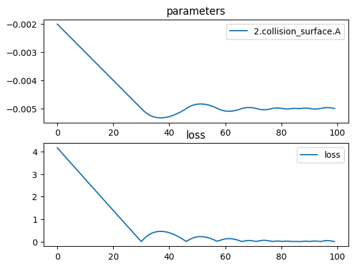

# Concave mirror


```python
import torch
import torch.optim as optim
import torchlensmaker as tlm

surface = tlm.Parabola(diameter=35.0, A=tlm.parameter(-0.002))

optics = tlm.Sequential(
    tlm.PointSourceAtInfinity(beam_diameter=25),
    tlm.Gap(100),
    tlm.ReflectiveSurface(surface),
    tlm.Gap(-50),
    tlm.FocalPoint(),
)

tlm.show(optics, dim=2)
tlm.show(optics, dim=3)
```


<TLMViewer src="./concave_mirror_files/concave_mirror_0.json?url" />


<TLMViewer src="./concave_mirror_files/concave_mirror_1.json?url" />


```python
optics.set_sampling2d(pupil=10)
tlm.optimize(
    optics,
    optimizer = optim.Adam(optics.parameters(), lr=1e-4),
    dim = 2,
    num_iter = 100
).plot()
```

    [  1/100] L= 4.16038 | grad norm= 1394.116943359375
    [  6/100] L= 3.46405 | grad norm= 1393.4493408203125
    [ 11/100] L= 2.76842 | grad norm= 1391.9974365234375
    [ 16/100] L= 2.07398 | grad norm= 1389.77001953125
    [ 21/100] L= 1.38124 | grad norm= 1386.775634765625
    [ 26/100] L= 0.69077 | grad norm= 1383.0262451171875
    [ 31/100] L= 0.00312 | grad norm= 1378.5377197265625
    [ 36/100] L= 0.42770 | grad norm= 1375.3431396484375
    [ 41/100] L= 0.39443 | grad norm= 1375.600341796875
    [ 46/100] L= 0.09227 | grad norm= 1377.85595703125
    [ 51/100] L= 0.21338 | grad norm= 1379.9898681640625
    [ 56/100] L= 0.12936 | grad norm= 1379.418212890625
    [ 61/100] L= 0.12202 | grad norm= 1377.6400146484375
    [ 66/100] L= 0.04542 | grad norm= 1378.192626953125
    [ 71/100] L= 0.03239 | grad norm= 1378.7442626953125
    [ 76/100] L= 0.04879 | grad norm= 1378.1683349609375
    [ 81/100] L= 0.01227 | grad norm= 1378.6025390625
    [ 86/100] L= 0.00622 | grad norm= 1378.5596923828125
    [ 91/100] L= 0.00669 | grad norm= 1378.5628662109375
    [ 96/100] L= 0.03036 | grad norm= 1378.729736328125
    [100/100] L= 0.00235 | grad norm= 1378.5322265625


    

    


```python
tlm.show(optics, dim=2)
tlm.show(optics, dim=3)
```


<TLMViewer src="./concave_mirror_files/concave_mirror_2.json?url" />


<TLMViewer src="./concave_mirror_files/concave_mirror_3.json?url" />

