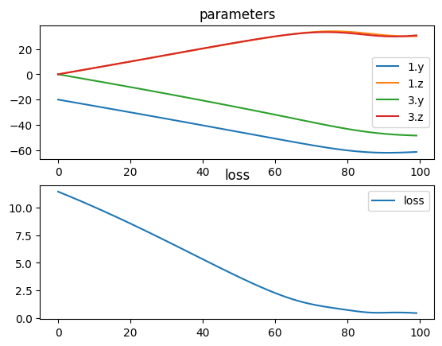

# Inverse kinematics

An example of how tlm can be used to solve a simple 3D inverse kinematics problem.


```python
import torch
import torch.nn as nn
import torchlensmaker as tlm


# Custom element for the kinematic target
class Target(tlm.SequentialElement):
    def __init__(self, point):
        super().__init__()
        self.point = point

    def forward(self, inputs):
        return inputs.replace(loss=torch.linalg.vector_norm(inputs.target() - self.point))
    

# Trainable elements
length1 = tlm.Gap(10)
rotate1 = tlm.Rotate3D(-20, 0, trainable=True)
rotate2 = tlm.Rotate3D(0, 0, trainable=True)

model = tlm.Sequential(
    length1,
    rotate1,
    tlm.Gap(5),
    rotate2,
    tlm.Gap(5),
    tlm.Gap(0),
    Target(torch.Tensor([10, 6, 6])),
)

for name, param in model.named_parameters():
    print(name, param)

tlm.show3d(model, controls={"show_optical_axis": True, "show_other_axes": True, "show_kinematic_joints": True})
```

    1.y Parameter containing:
    tensor(-20., requires_grad=True)
    1.z Parameter containing:
    tensor(0., requires_grad=True)
    3.y Parameter containing:
    tensor(0., requires_grad=True)
    3.z Parameter containing:
    tensor(0., requires_grad=True)


<TLMViewer src="./inverse_kinematics_files/inverse_kinematics_0.json?url" />


```python
import torch.optim as optim


tlm.optimize(
    model,
    optimizer = optim.Adam(model.parameters(), lr=0.5),
    dim = 3,
    num_iter = 100
).plot()

print("length:", length1.x.item())
print("y1:", rotate1.y.item())
print("z1:", rotate1.z.item())
print("y2:", rotate2.y.item())
print("z2:", rotate2.z.item())

tlm.show3d(model, controls={"show_optical_axis": True, "show_other_axes": True, "show_kinematic_joints": True})
```

    [  1/100] L= 11.44367 | grad norm= 0.1403931826353073
    [  6/100] L= 10.76307 | grad norm= 0.14587511122226715
    [ 11/100] L= 10.05291 | grad norm= 0.15076681971549988
    [ 16/100] L= 9.31445 | grad norm= 0.15501873195171356
    [ 21/100] L= 8.54986 | grad norm= 0.15856528282165527
    [ 26/100] L= 7.76245 | grad norm= 0.1613226681947708
    [ 31/100] L= 6.95688 | grad norm= 0.16318339109420776
    [ 36/100] L= 6.13927 | grad norm= 0.16400396823883057
    [ 41/100] L= 5.31753 | grad norm= 0.16357924044132233
    [ 46/100] L= 4.50185 | grad norm= 0.16159076988697052
    [ 51/100] L= 3.70584 | grad norm= 0.1575057953596115
    [ 56/100] L= 2.94863 | grad norm= 0.1504034548997879
    [ 61/100] L= 2.25887 | grad norm= 0.13884197175502777
    [ 66/100] L= 1.67854 | grad norm= 0.12194743007421494
    [ 71/100] L= 1.25048 | grad norm= 0.10576562583446503
    [ 76/100] L= 0.96030 | grad norm= 0.10391374677419662
    [ 81/100] L= 0.72035 | grad norm= 0.10480377823114395
    [ 86/100] L= 0.51991 | grad norm= 0.07430887967348099
    [ 91/100] L= 0.48093 | grad norm= 0.05209997668862343
    [ 96/100] L= 0.49441 | grad norm= 0.07413405179977417
    [100/100] L= 0.44278 | grad norm= 0.06729049235582352


    

    


    length: 10.0
    y1: -61.200279235839844
    z1: 30.05259895324707
    y2: -48.507781982421875
    z2: 31.085248947143555


<TLMViewer src="./inverse_kinematics_files/inverse_kinematics_1.json?url" />

