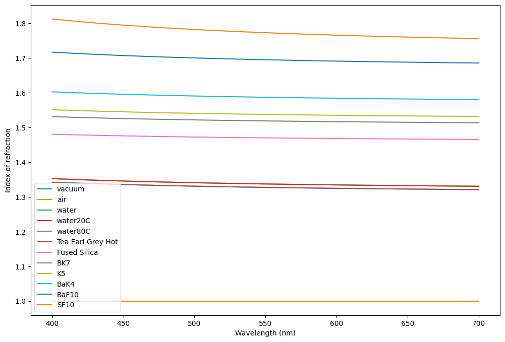

# Dispersion models


```python
import torch.nn as nn
import torch
import matplotlib.pyplot as plt
import numpy as np

from torchlensmaker.materials.get_material_model import default_material_models
import torchlensmaker as tlm

tlm.plot_material_models(default_material_models.values(), labels=default_material_models.keys())
```


    

    

