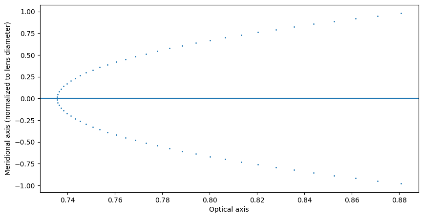
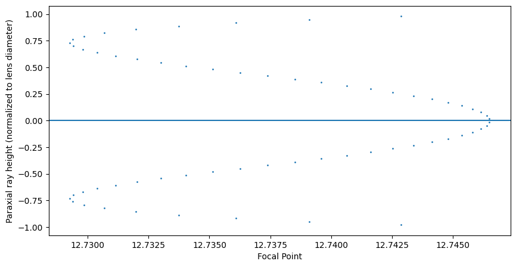

# Paraxial approximation of focal length

In this example we are going to look at how to estimate the focal length and principal plane of an arbitrary lens.


```python
import torch
import torchlensmaker as tlm

doublet = tlm.Lens(
    tlm.RefractiveSurface(tlm.Sphere(4.0, C=0.135327), material=tlm.NonDispersiveMaterial(1.517)),
    tlm.Gap(1.05),
    tlm.RefractiveSurface(tlm.Sphere(3.8, C=-0.19311), material=tlm.NonDispersiveMaterial(1.649)),
    tlm.Gap(0.4),
    tlm.RefractiveSurface(tlm.Sphere(4.0, C=-0.06164), material="air"),
)

# Paraxial points
principal_point = tlm.paraxial.rear_principal_point(doublet, wavelength=550)
focal_point = tlm.paraxial.rear_focal_point(doublet, wavelength=550, h=0.01)
focal_length = focal_point - principal_point

print("Lens minimal diamter", doublet.minimal_diameter())
print("Lens rear principal point", principal_point.item())
print("Lens rear focal point", focal_point.item())
print("Lens focal length", focal_length.item())

# Add a simple light source for illustration
# Keep the lens vertex at the origin so we can display the points
optics = tlm.Sequential(
    tlm.Gap(-1),
    tlm.PointSourceAtInfinity2D(beam_diameter=3.0),
    tlm.Gap(1),
    doublet,
)

# TODO end= control using focal point
# make end work on X axis, not ray length

cosmetic_points = torch.tensor([
    [focal_point, 0],
    [principal_point, 0]
])

scene = tlm.render_sequence(optics, 2, end=15)
scene["data"].append(tlm.render_points(cosmetic_points, radius=0.05))
tlm.display_scene(scene)
```

    Lens minimal diamter 3.8
    Lens rear principal point 0.7356008887290955
    Lens rear focal point 12.746492385864258
    Lens focal length 12.010891914367676


<TLMViewer src="./paraxial_focal_length_files/paraxial_focal_length_0.json?url" />


```python
# Illustration of the equivalent refracting locus
lens = doublet
mdiam = lens.minimal_diameter()
source = tlm.PointSourceAtInfinity2D(
        0.98 * mdiam,
        sampler_pupil=tlm.LinspaceSampler1D(64),
        sampler_wavelength=tlm.ZeroSampler1D(),
        wavelength=500,
)
inputs = source(tlm.default_input(dim=2))
outputs = lens(inputs)
t = tlm.paraxial.equivalent_locus_2d(inputs.P, inputs.V, outputs.P, outputs.V)
CP = inputs.P + t[:, 0].unsqueeze(-1).expand_as(inputs.V) * inputs.V

scene = tlm.render_sequence(optics, 2, end=4)
scene["data"].append(tlm.render_points(CP, radius=0.01))
tlm.display_scene(scene)

# Plot equivalent refracting locus
import matplotlib.pyplot as plt

f, ax = plt.subplots(1, 1, figsize=(10, 5))
ax.plot(CP[:, 0].tolist(), (CP[:, 1] / (0.5*mdiam)).tolist(), linestyle="none", marker="o", markersize=1)
ax.axhline()
ax.set_xlabel("Optical axis")
ax.set_ylabel("Meridional axis (normalized to lens diameter)")
plt.show()
```


<TLMViewer src="./paraxial_focal_length_files/paraxial_focal_length_1.json?url" />


    

    


```python
# Illustration of the focal points as you change the paraxial ray height
lens = doublet
mdiam = lens.minimal_diameter()
source = tlm.PointSourceAtInfinity2D(
        0.98 * mdiam,
        sampler_pupil=tlm.LinspaceSampler1D(64),
        sampler_wavelength=tlm.ZeroSampler1D(),
        wavelength=500,
)
inputs = source(tlm.default_input(dim=2))
outputs = lens(inputs)
t = -outputs.P[:, 1] / outputs.V[:, 1]
CP = outputs.P + t.unsqueeze(-1).expand_as(outputs.V) * outputs.V

scene = tlm.render_sequence(optics, 2, end=12)
scene["data"].append(tlm.render_points(CP, radius=0.001))
tlm.display_scene(scene)


# Plot focal point as a function of paraxial ray height
import matplotlib.pyplot as plt

f, ax = plt.subplots(1, 1, figsize=(10, 5))
ax.plot(CP[:, 0].tolist(), (inputs.P[:, 1] / (0.5*mdiam)).tolist(), linestyle="none", marker="o", markersize=1)
ax.axhline()
ax.set_xlabel("Focal Point")
ax.set_ylabel("Paraxial ray height (normalized to lens diameter)")
plt.show()
```


<TLMViewer src="./paraxial_focal_length_files/paraxial_focal_length_2.json?url" />


    

    

