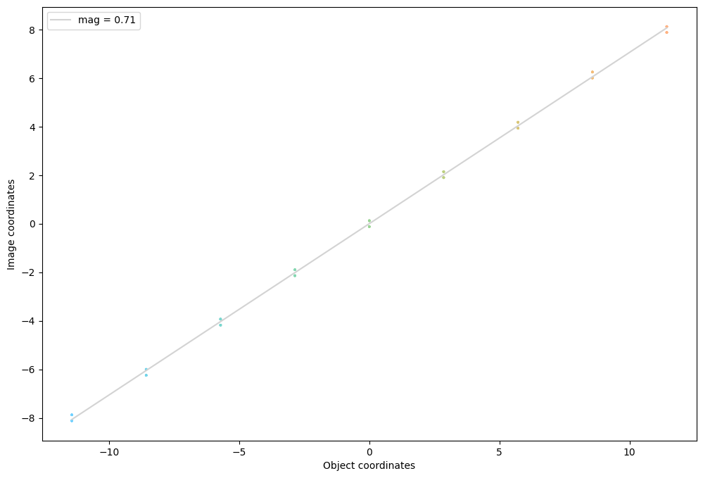

# Pinhole camera


```python
import torchlensmaker as tlm

optics = tlm.Sequential(
    tlm.ObjectAtInfinity(beam_diameter=12, angular_size=40),
    tlm.Gap(25),
    tlm.Aperture(diameter=.5),
    tlm.Gap(40),
    tlm.ImagePlane(diameter=50),
)

optics.set_sampling2d(pupil=50, field=15)
tlm.show(optics, dim=2)
tlm.plot_magnification(optics, color_dim="object")
```


<TLMViewer src="./pinhole_camera_files/pinhole_camera_0.json?url" />


    

    

