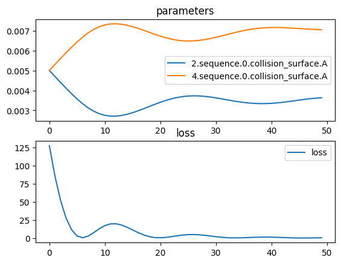

# Regularization - Equal Thickness Lenses

In this example, we design a two lens system where the first lens is plano-convex, and the second lens is biconvex symmetric. Two parameters are used to describe the curvature of each lens.

This problem has many solutions because different surface shape combinations can achieve the desired focal length. Using regularization, we add the additional constraint that the inner thickness of each lens should be equal. This leads to a unique solution.


```python
import torch
import torch.optim as optim
import torchlensmaker as tlm
import math


lens_diameter = 30
focal_length = 65
lens_outer_thickness = 1.0

# Shape of the curved surface of the plano convex lens
surface_convex = tlm.Parabola(lens_diameter, tlm.parameter(0.005))

# Shape of the two curved surfaces of the biconvex symmetric lens
surface_biconvex = tlm.Parabola(lens_diameter, tlm.parameter(0.005))

# Convex-planar lens
lens_plano = tlm.lenses.semiplanar_rear(
    surface_convex,
    tlm.OuterGap(lens_outer_thickness),
    material = "BK7",
)

# Biconvex lens
lens_biconvex = tlm.lenses.symmetric_singlet(
    surface_biconvex,
    tlm.OuterGap(lens_outer_thickness),
    material = "BK7",
)

optics = tlm.Sequential(
    tlm.PointSourceAtInfinity(0.9*lens_diameter),
    tlm.Gap(10.),
    lens_biconvex,
    tlm.Gap(3.),
    lens_plano,
    tlm.Gap(focal_length),
    tlm.FocalPoint(),
)

tlm.show(optics, dim=2)
tlm.show(optics, dim=3)
```


<TLMViewer src="./regularization_equal_thickness_files/regularization_equal_thickness_0.json?url" />


<TLMViewer src="./regularization_equal_thickness_files/regularization_equal_thickness_1.json?url" />


```python
# The regularization function
# This adds a term to the loss function to ensure
# both lenses' inner thicknesses are equal
def regu_equalthickness(optics):
    t0 = tlm.lens_inner_thickness(lens_plano)
    t1 = tlm.lens_inner_thickness(lens_biconvex)
    return 100*torch.pow(t0 - t1, 2)


tlm.optimize(
    optics,
    optimizer = optim.Adam(optics.parameters(), lr=3e-4),
    regularization=regu_equalthickness,
    dim = 2,
    num_iter = 50
).plot()
```

    [  1/50] L= 127.20844 | grad norm= 114054.8203125
    [  4/50] L= 27.68707 | grad norm= 53191.6953125
    [  7/50] L= 0.45106 | grad norm= 1587.692138671875
    [ 10/50] L= 12.78508 | grad norm= 35727.03515625
    [ 13/50] L= 19.62823 | grad norm= 44465.62109375
    [ 16/50] L= 11.13694 | grad norm= 33346.73828125
    [ 19/50] L= 1.90652 | grad norm= 12869.0224609375
    [ 22/50] L= 0.91033 | grad norm= 7312.01220703125
    [ 25/50] L= 4.10750 | grad norm= 19289.294921875
    [ 28/50] L= 4.45079 | grad norm= 20252.55078125
    [ 31/50] L= 1.82003 | grad norm= 12402.1181640625
    [ 34/50] L= 0.19549 | grad norm= 1430.89892578125
    [ 37/50] L= 0.73181 | grad norm= 8226.998046875
    [ 40/50] L= 1.29907 | grad norm= 11510.7646484375
    [ 43/50] L= 0.71582 | grad norm= 8758.34765625
    [ 46/50] L= 0.05333 | grad norm= 1495.2625732421875
    [ 49/50] L= 0.22787 | grad norm= 4619.26220703125
    [ 50/50] L= 0.33579 | grad norm= 5689.8544921875


    

    


```python
def print_thickness(lens_name, lens):
    # TODO thickness at a specific radial distance
    print(f"{lens_name: <25} inner: {tlm.lens_inner_thickness(lens).item():.3f} outer: {tlm.lens_outer_thickness(lens).item():.3f}")

print_thickness("Plano-convex", lens_plano)
print_thickness("Bi-convex", lens_biconvex)

tlm.show2d(optics)
```

    Plano-convex              inner: 2.584 outer: 1.000
    Bi-convex                 inner: 2.638 outer: 1.000


<TLMViewer src="./regularization_equal_thickness_files/regularization_equal_thickness_2.json?url" />

