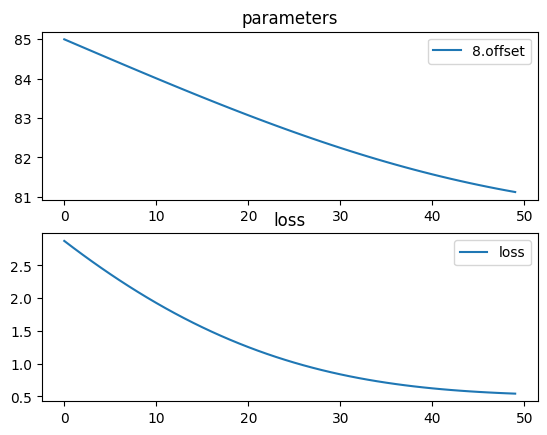

# Cooke triplet

Let's try to model a Cooke Triplet, working from this screenshot from an old patent, taken from Wikipedia:


First, let's define the surfaces as spherical, using the radius of curvatures provided. Lenses diameters are not given, I'm gonna guess 30 and 25 to start with:


```python
import torch
import torchlensmaker as tlm

d1, d2 = 30, 25

r1 = tlm.Sphere(d1, 26.4)
r2 = tlm.Sphere(d1, -150.7)
r3 = tlm.Sphere(d2, -29.8)
r4 = tlm.Sphere(d2, 24.2)
r5 = tlm.Sphere(d1, 150.7)
r6 = tlm.Sphere(d1, -26.4)
```

Next, we can define the material models for the lenses. In a Cooke Triplet, two materials are used, with the center one being denser to refract light more.


```python
material1 = tlm.NonDispersiveMaterial(1.5108)
material2 = tlm.NonDispersiveMaterial(1.6042)

L1 = tlm.lenses.singlet(r1, tlm.InnerGap(5.9), r2, material=material1)
L2 = tlm.lenses.singlet(r3, tlm.InnerGap(0.2), r4, material=material2)
L3 = tlm.lenses.singlet(r5, tlm.InnerGap(5.9), r6, material=material1)
```

    [('origin', 'origin'), ('origin', 'origin')]
    [('origin', 'origin'), ('origin', 'origin')]
    [('origin', 'origin'), ('origin', 'origin')]


The distance between the last lens and the image plane is unclear from the document. Let's guess an inital value of 85, and make it trainable in the model.


```python
focal_gap = tlm.Gap(85, trainable=True)
```

Finally, we can define our optical sequence model, by stacking everying together in a `tlm.Sequential` object.


```python
optics = tlm.Sequential(
    tlm.ObjectAtInfinity(15, 25),
    L1,
    tlm.Gap(10.9),
    L2,
    tlm.Gap(3.1),
    tlm.Aperture(18),
    tlm.Gap(9.4),
    L3,
    focal_gap,
    tlm.ImagePlane(65),
)
```

And we can view the system in 2D with `tlm.show2d()`. Note that if don't specify sampling parameters, it will try to use sensible ones by default.


```python
tlm.show2d(optics)
```


<TLMViewer src="./cooke_triplet_files/cooke_triplet_0.json?url" />


```python
tlm.show3d(optics, pupil=100, wavelength=4)
# TODO fix spot diagram
# f, _ = tlm.spot_diagram(optics, row="object", figsize=(12, 12))
```


<TLMViewer src="./cooke_triplet_files/cooke_triplet_1.json?url" />


Looking at the spot diagram, we can see that rays are not focused at all. We can now optimize the parameter we created before, to try to find the best value for the image plane distance.


```python
import torch.optim as optim

optics.set_sampling2d(pupil=5, field=10, wavelength=3)
tlm.optimize(optics,
             dim=2,
             optimizer = optim.Adam(optics.parameters(), lr=1e-1),
             
             num_iter=50,
).plot()

print("Final parameter value:", focal_gap.x.item())
```

    [  1/50] L= 8.62332 | grad norm= 3.2334253787994385
    [  4/50] L= 7.68722 | grad norm= 3.0125513076782227
    [  7/50] L= 6.82136 | grad norm= 2.7927443981170654
    [ 10/50] L= 6.02833 | grad norm= 2.5750133991241455
    [ 13/50] L= 5.30975 | grad norm= 2.3604464530944824
    [ 16/50] L= 4.66607 | grad norm= 2.1501357555389404
    [ 19/50] L= 4.09666 | grad norm= 1.9452259540557861
    [ 22/50] L= 3.59965 | grad norm= 1.746840000152588
    [ 25/50] L= 3.17212 | grad norm= 1.5560805797576904
    [ 28/50] L= 2.81011 | grad norm= 1.3739957809448242
    [ 31/50] L= 2.50872 | grad norm= 1.201544165611267
    [ 34/50] L= 2.26241 | grad norm= 1.0395724773406982
    [ 37/50] L= 2.06514 | grad norm= 0.8888047337532043
    [ 40/50] L= 1.91057 | grad norm= 0.7497930526733398
    [ 43/50] L= 1.79242 | grad norm= 0.6229360103607178
    [ 46/50] L= 1.70452 | grad norm= 0.5084332227706909
    [ 49/50] L= 1.64112 | grad norm= 0.40630587935447693
    [ 50/50] L= 1.62452 | grad norm= 0.37499135732650757


    

    


    Final parameter value: 81.08018493652344


```python
tlm.show2d(optics)

# TODO fix spot diagram
# f, _ = tlm.spot_diagram(optics, row="object", figsize=(12, 12))
```


<TLMViewer src="./cooke_triplet_files/cooke_triplet_2.json?url" />

