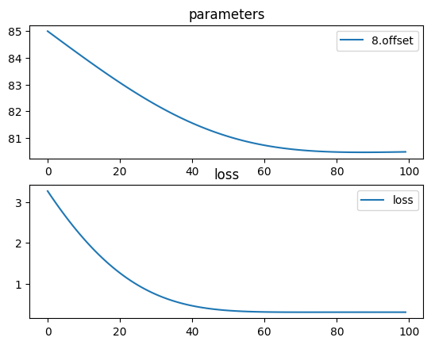

# Cooke triplet


screenshot from wikipedia:


```python
import torch
import torchlensmaker as tlm

d1, d2 = 30, 25

r1 = tlm.Sphere(d1, 26.4)
r2 = tlm.Sphere(d1, -150.7)
r3 = tlm.Sphere(d2, -29.8)
r4 = tlm.Sphere(d2, 24.2)
r5 = tlm.Sphere(d1, 150.7)
r6 = tlm.Sphere(d1, -26.4)

material1 = tlm.NonDispersiveMaterial(1.5108)
material2 = tlm.NonDispersiveMaterial(1.6042)

L1 = tlm.Lens(r1, r2, material=material1, inner_thickness=5.9)
L2 = tlm.Lens(r3, r4, material=material2, inner_thickness=0.2)
L3 = tlm.Lens(r5, r6, material=material1, inner_thickness=5.9)

focal = tlm.parameter(85)

optics = tlm.Sequential(
    tlm.ObjectAtInfinity(20, 30),
    L1,
    tlm.Gap(10.9),
    L2,
    tlm.Gap(3.1),
    tlm.Aperture(18),
    tlm.Gap(9.4),
    L3,
    tlm.Gap(focal),
    tlm.ImagePlane(50),
)

tlm.show(optics, dim=2)
```


<TLMViewer src="./cooke_triplet_tlmviewer/cooke_triplet_0.json" />


```python
import torch.optim as optim

tlm.optimize(optics,
             dim=2,
             optimizer = optim.Adam(optics.parameters(), lr=1e-1),
             sampling = {"base": 5, "object": 10, "wavelength": 3},
             num_iter=100,
).plot()
```

    [  1/100] L=  3.268 | grad norm= 1.3241300731406602
    [  6/100] L=  2.645 | grad norm= 1.1765385189994102
    [ 11/100] L=  2.101 | grad norm= 1.03085003809877
    [ 16/100] L=  1.641 | grad norm= 0.8889902287973667
    [ 21/100] L=  1.263 | grad norm= 0.7529865602809027
    [ 26/100] L=  0.965 | grad norm= 0.6248496716220308
    [ 31/100] L=  0.739 | grad norm= 0.5064458737853496
    [ 36/100] L=  0.575 | grad norm= 0.39937046445026414
    [ 41/100] L=  0.462 | grad norm= 0.3048324512295047
    [ 46/100] L=  0.390 | grad norm= 0.22356324096702151
    [ 51/100] L=  0.346 | grad norm= 0.15576266811634426
    [ 56/100] L=  0.322 | grad norm= 0.10109290976322306
    [ 61/100] L=  0.311 | grad norm= 0.058723652563103974
    [ 66/100] L=  0.306 | grad norm= 0.027422343157459686
    [ 71/100] L=  0.305 | grad norm= 0.00567507504189162
    [ 76/100] L=  0.305 | grad norm= 0.008180423032523917
    [ 81/100] L=  0.306 | grad norm= 0.015827428303531416
    [ 86/100] L=  0.306 | grad norm= 0.018861914029863758
    [ 91/100] L=  0.306 | grad norm= 0.01871106222044714
    [ 96/100] L=  0.306 | grad norm= 0.01658114321984023
    [100/100] L=  0.305 | grad norm= 0.014106542873388885


    

    


```python
tlm.show(optics, dim=2)
```


<TLMViewer src="./cooke_triplet_tlmviewer/cooke_triplet_1.json" />


```python
# TODO fix this
# f, _ = tlm.spot_diagram(optics, {"base":1000, "object": 4}, row="object", figsize=(12, 12))
```
