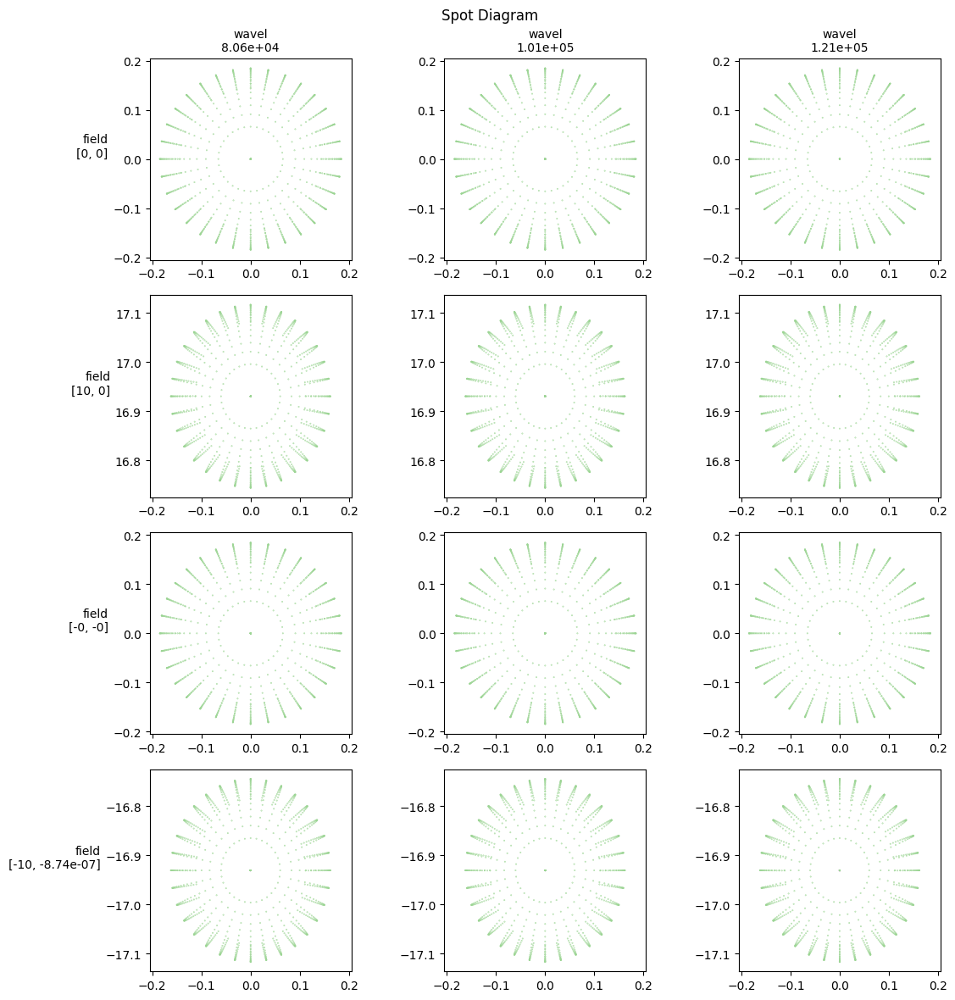

# Landscape lens


```python
import torchlensmaker as tlm

optics = tlm.Sequential(
    tlm.ObjectAtInfinity(beam_diameter=10, angular_size=20, wavelength=(400, 800)),
    tlm.Gap(15),
    tlm.RefractiveSurface(
        tlm.SphereByRadius(diameter=25, R=-45.759), materials=("air", "BK7")
    ),
    tlm.Gap(3.419),
    tlm.RefractiveSurface(
        tlm.SphereByRadius(diameter=25, R=-24.887), materials=("BK7", "air")
    ),
    tlm.Gap(97.5088),
    tlm.ImagePlane(50),
)

optics.set_sampling2d(wavel=100)
tlm.show2d(optics, title="Landscape Lens")
```


<TLMViewer src="./landscape_files/landscape_0.json?url" />


```python
tlm.show3d(optics, title="Landscape Lens")
```


<TLMViewer src="./landscape_files/landscape_1.json?url" />


```python
# Spot diagram by field / wavel
tlm.set_sampling3d(optics, pupil=1000, field=3, wavel=[400, 500, 600])
f, axes = tlm.spot_diagram(optics, row="field", col="wavel",  color="wavel", figsize=(12, 12))
```


    

    

