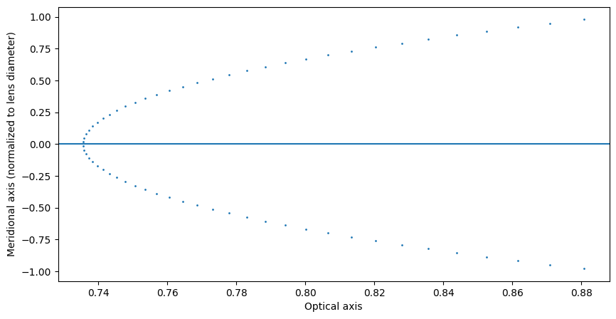
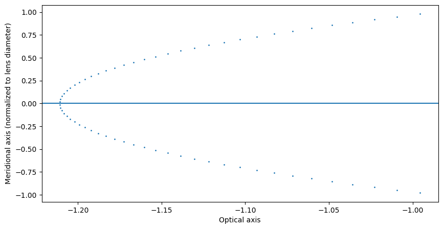
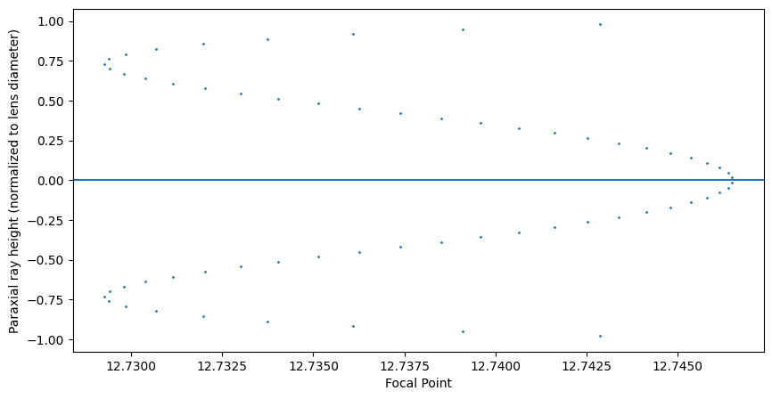

# Paraxial approximation of focal length

In this example we are going to look at how to estimate the focal length and principal plane of an arbitrary lens.


```python
import torch
import torchlensmaker as tlm

mat1 = tlm.NonDispersiveMaterial(1.517)
mat2 = tlm.NonDispersiveMaterial(1.649)

# Define a doublet lens
doublet = tlm.Lens(
    tlm.RefractiveSurface(tlm.SphereByCurvature(4.0, C=0.135327), materials=("air", mat1)),
    tlm.Gap(1.05),
    tlm.RefractiveSurface(tlm.SphereByCurvature(3.8, C=-0.19311), materials=(mat1, mat2)),
    tlm.Gap(0.4),
    tlm.RefractiveSurface(tlm.SphereByCurvature(4.0, C=-0.06164), materials=(mat2, "air")),
)

# Lens parameters
print("Lens minimal diameter:", doublet.minimal_diameter().detach().item())
print("Lens inner thickness:", doublet.inner_thickness().detach().item())
print("Lens outer thickness:", doublet.outer_thickness().detach().item())

# Rear paraxial points
rear_principal_point = tlm.paraxial.rear_principal_point(doublet, wavelength=550)
rear_focal_point = tlm.paraxial.rear_focal_point(doublet, wavelength=550, h=0.01)
rear_focal_length = rear_focal_point - rear_principal_point
print("Lens rear principal point:", rear_principal_point.detach().item())
print("Lens rear focal point:", rear_focal_point.detach().item())
print("Lens rear focal length:", rear_focal_length.detach().item())

# Front paraxial points
front_principal_point = tlm.paraxial.front_principal_point(doublet, wavelength=550)
front_focal_point = tlm.paraxial.front_focal_point(doublet, wavelength=550, h=0.01)
front_focal_length = front_focal_point - front_principal_point

print("Lens front principal point:", front_principal_point.detach().item())
print("Lens front focal point:", front_focal_point.detach().item())
print("Lens front focal length:", front_focal_length.detach().item())

### REAR ILLUSTRATION ###

controls = {"show_principal_axis": True, "show_other_axes": True}

# Add a simple light source for illustration
# Keep the lens vertex at the origin so we can display the points in the correct reference frame
optics_rear = tlm.Sequential(
    tlm.Gap(-1),
    tlm.PointSourceAtInfinity(beam_diameter=3.0, wavelength=550),
    tlm.Gap(1),
    doublet,
)

optics_rear.set_sampling2d(pupil=10)

cosmetic_points_rear = torch.tensor([
    [rear_focal_point.detach().item(), 0],
    [rear_principal_point.detach().item(), 0]
])

scene_rear = tlm.render_sequence(optics_rear, 2, end=15)
scene_rear["data"].append(tlm.render_points(cosmetic_points_rear, radius=0.05))
scene_rear["controls"] = controls
tlm.display_scene(scene_rear)

### FRONT ILLUSTRATION ###

# Add a simple light source for illustration
# Keep the lens vertex at the origin so we can display the points in the correct reference frame
optics_front = tlm.Sequential(
    tlm.Gap(1),
    tlm.Reversed(tlm.PointSourceAtInfinity(beam_diameter=3.0, wavelength=550)),
    tlm.Gap(-1),
    tlm.Reversed(doublet),
)

optics_front.set_sampling2d(pupil=10)

cosmetic_points_front = torch.tensor([
    [front_focal_point.detach().item(), 0],
    [front_principal_point.detach().item(), 0]
])

scene_front = tlm.render_sequence(optics_front, 2, end=15)
scene_front["data"].append(tlm.render_points(cosmetic_points_front, radius=0.05))
scene_front["controls"] = controls
tlm.display_scene(scene_front)
```

    Lens minimal diameter: 3.799999952316284
    Lens inner thickness: 1.4499999284744263
    Lens outer thickness: -0.0532536506652832
    Lens rear principal point: 0.7356008887290955
    Lens rear focal point: 12.746492385864258
    Lens rear focal length: 12.010891914367676
    Lens front principal point: -1.2109190225601196
    Lens front focal point: -13.221537590026855
    Lens front focal length: -12.010618209838867


<TLMViewer src="./paraxial_focal_length_files/paraxial_focal_length_0.json?url" />


<TLMViewer src="./paraxial_focal_length_files/paraxial_focal_length_1.json?url" />


```python
# Plot equivalent refracting locus
import matplotlib.pyplot as plt

# Illustration of the rear equivalent refracting locus
lens = doublet
mdiam = lens.minimal_diameter()
source = tlm.PointSourceAtInfinity(
        0.98 * mdiam,
        sampler_pupil_2d=tlm.LinspaceSampler1D(64),
        sampler_wavel_2d=tlm.ZeroSampler1D(),
        wavelength=500,
)
inputs = source.sequential(tlm.default_input(dim=2))
outputs = lens(inputs)
t = tlm.paraxial.equivalent_locus_2d(inputs.rays.P, inputs.rays.V, outputs.rays.P, outputs.rays.V)
CP = inputs.rays.P + t[:, 0].unsqueeze(-1) * inputs.rays.V

scene = tlm.render_sequence(optics_rear, 2, end=4)
scene["data"].append(tlm.render_points(CP, radius=0.01))
tlm.display_scene(scene)

f, ax = plt.subplots(1, 1, figsize=(10, 5))
ax.plot(CP[:, 0].tolist(), (CP[:, 1] / (0.5*mdiam)).tolist(), linestyle="none", marker="o", markersize=1)
ax.axhline()
ax.set_xlabel("Optical axis")
ax.set_ylabel("Meridional axis (normalized to lens diameter)")
plt.show()
```


<TLMViewer src="./paraxial_focal_length_files/paraxial_focal_length_2.json?url" />


    

    


```python
# Illustration of the front equivalent refracting locus
lens = tlm.Reversed(doublet)

source = tlm.Reversed(tlm.PointSourceAtInfinity(
        0.98 * mdiam,
        sampler_pupil_2d=tlm.LinspaceSampler1D(64),
        sampler_wavel_2d=tlm.ZeroSampler1D(),
        wavelength=500,
))

inputs = source.sequential(tlm.default_input(dim=2))
outputs = lens(inputs)
t = tlm.paraxial.equivalent_locus_2d(inputs.rays.P, inputs.rays.V, outputs.rays.P, outputs.rays.V)
CP = inputs.rays.P + t[:, 0].unsqueeze(-1) * inputs.rays.V

scene = tlm.render_sequence(optics_front, 2, end=4)
scene["data"].append(tlm.render_points(CP, radius=0.01))
tlm.display_scene(scene)

f, ax = plt.subplots(1, 1, figsize=(10, 5))
ax.plot(CP[:, 0].tolist(), (CP[:, 1] / (0.5*mdiam)).tolist(), linestyle="none", marker="o", markersize=1)
ax.axhline()
ax.set_xlabel("Optical axis")
ax.set_ylabel("Meridional axis (normalized to lens diameter)")
plt.show()
```


<TLMViewer src="./paraxial_focal_length_files/paraxial_focal_length_3.json?url" />


    

    


```python
# Illustration of the focal points as you change the paraxial ray height
lens = doublet
mdiam = lens.minimal_diameter()
source = tlm.PointSourceAtInfinity(
        0.98 * mdiam,
        sampler_pupil_2d=tlm.LinspaceSampler1D(64),
        sampler_wavel_2d=tlm.ZeroSampler1D(),
        wavelength=500,
)
inputs = source.sequential(tlm.default_input(dim=2))
outputs = lens(inputs)
t = -outputs.rays.P[:, 1] / outputs.rays.V[:, 1]
CP = outputs.rays.points_at(t)

scene = tlm.render_sequence(optics_rear, 2, end=12)
scene["data"].append(tlm.render_points(CP, radius=0.001))
tlm.display_scene(scene)

f, ax = plt.subplots(1, 1, figsize=(10, 5))
ax.plot(CP[:, 0].tolist(), (inputs.rays.P[:, 1] / (0.5*mdiam)).tolist(), linestyle="none", marker="o", markersize=1)
ax.axhline()
ax.set_xlabel("Focal Point")
ax.set_ylabel("Paraxial ray height (normalized to lens diameter)")
plt.show()
```


<TLMViewer src="./paraxial_focal_length_files/paraxial_focal_length_4.json?url" />


    

    

