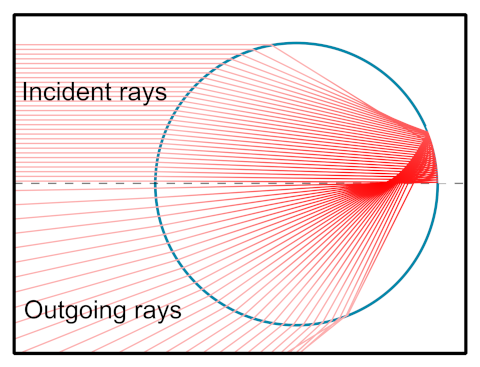

# Rainbow

In this example we'll attempt to model what happens inside a circular drop of water during a rainbow. If you're intesrested in that topic, [this Veritasium video](https://www.youtube.com/watch?v=24GfgNtnjXc&t=1057s) on the subject is great! Go check it out.

In reality, at each surface boundary, some rays are refracted and some are reflected. However, there is a "main path" that consists of three boundaries: refraction, reflection then refraction. This is what forms the first order rainbow phenomenon and we will model only this path here.

Thanks to Torch Lens Maker optional 2D or 3D capability, we will be able to reproduce the 2D diagram from Wikipedia shown below, but also simulate the path of light in the full 3D spherical drop of water.



We'll also be able to more accurately describe the phenomenon because we won't be using the approximation that "all incoming light rays are parallel". When we say this about light coming from a very far away object like the sun, we're actually talking about two different approximations:

1. Light rays coming from the same point on the object are parallel. This is a totally fair approximation because that angle depends on the distance to the sun. It's only non zero after 10 decimal places or so. So this approximation is fair.

2. Light rays coming from different points on the object are parallel. This approximation is a much bigger approximation, because it depends on the apparent angular size of the object. Taking that approximation is equivalent to saying the object has an apparent angular size of zero. This is obviously not true for the sun, which angular size is 0.5° (it's far away, but also huge). So we won't be making that approximation here, and we'll model incident light as having a 0.5° angular distribution (contrary to the diagram above).


```python
import torchlensmaker as tlm
import torch

import math

# Use half spheres to model interface boundaries without collision detection ambiguities
radius = 5
halfsphere = tlm.SphereR(diameter=2*radius, R=radius)

model = tlm.Sequential(
    # Position the light source just above the optical axis
    tlm.Offset(
        tlm.ObjectAtInfinity(10, 0.5),
        y=5.001),
    tlm.Wavelength(400, 660),
    
    # Move the droplet of water some distance away from the source
    tlm.Gap(50),

    # First interface: half sphere (pointing left), refractive air to water
    tlm.RefractiveSurface(halfsphere, material="water", anchors=("extent", "extent")),
    
    # Second interface: half sphere (pointing right), reflective
    tlm.Rotate(
        tlm.ReflectiveSurface(halfsphere, anchors=("extent", "extent")),
        [-180, 0]),

    # Third interface: half sphere (pointing down), refractive water to air
    tlm.Rotate(
       tlm.RefractiveSurface(halfsphere, material="air", anchors=("extent", "origin")),
        [60, 0]),
)

tlm.show2d(model, sampling={"base": 50, "object": 5, "wavelength": 10}, end=50)
tlm.show3d(model, sampling={"base": 500, "object": 20, "wavelength": 10}, end=30)
```


<TLMViewer src="./rainbow_files/rainbow_0.json?url" />


<TLMViewer src="./rainbow_files/rainbow_1.json?url" />

