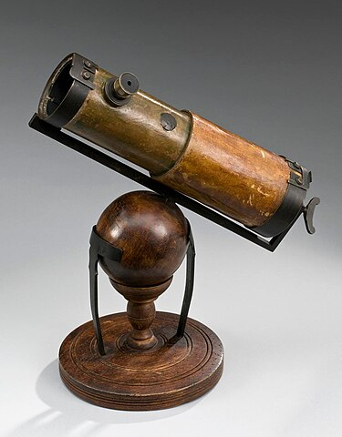
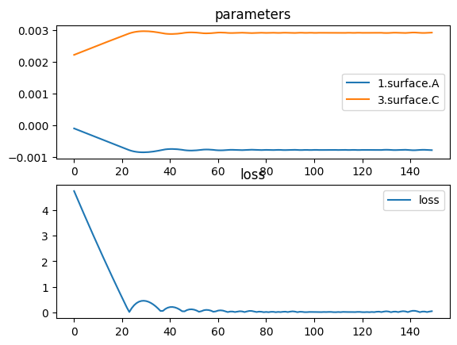

# Reflecting Telescope

A reflecting telescope, in its basic form, is a very simple design. Two surfaces both reflect light to focus it at a single point.



*Image from Wikipedia*

For this example, our telescope will be made of two convave mirrors. To spice things up, we'll say that the primary mirror is parabolic, and the secondary is spherical. Of course this can easily be changed, so feel free to download this notebook and play with it. In this example, we will keep the position of the two mirrors constant, and try to optimize the two mirrors curvatures jointly.


```python
import torchlensmaker as tlm

primary = tlm.Parabola(35., A=-0.0001, trainable=True)
secondary = tlm.SphereByCurvature(35., C=1/450.0, trainable=True)

optics = tlm.Sequential(
    tlm.Gap(-100),
    tlm.PointSourceAtInfinity(beam_diameter=30),
    tlm.Gap(100),
    
    tlm.ReflectiveSurface(primary),
    tlm.Gap(-80),

    tlm.ReflectiveSurface(secondary),

    tlm.Gap(100),
    tlm.FocalPoint(),
)

tlm.show2d(optics)
tlm.show3d(optics)
```


<TLMViewer src="./reflecting_telescope_files/reflecting_telescope_0.json?url" />


<TLMViewer src="./reflecting_telescope_files/reflecting_telescope_1.json?url" />


Now, as you can see light isn't being focused at all. We have wrapped both surfaces arguments in `tlm.parameter()`. Internally, this creates a `nn.Parameter()` so that PyTorch can optimize them. Let's run a standard Adam optimizer for 100 iterations, with 10 rays samples.


```python
import torch.optim as optim

optics.set_sampling2d(pupil=10)

tlm.optimize(
    optics,
    optimizer = optim.Adam(optics.parameters(), lr=3e-5),
    dim = 2,
    num_iter = 150
).plot()
```

    [  1/150] L= 4.14344 | grad norm= 5082.2544
    [  9/150] L= 2.63162 | grad norm= 4919.4971
    [ 17/150] L= 1.19015 | grad norm= 4758.8755
    [ 25/150] L= 0.14044 | grad norm= 4606.2334
    [ 33/150] L= 0.31710 | grad norm= 4582.6973
    [ 41/150] L= 0.17877 | grad norm= 4637.1953
    [ 49/150] L= 0.09737 | grad norm= 4604.1758
    [ 57/150] L= 0.07691 | grad norm= 4623.5522
    [ 65/150] L= 0.00736 | grad norm= 4615.0542
    [ 73/150] L= 0.02890 | grad norm= 4617.2769
    [ 81/150] L= 0.02596 | grad norm= 4616.7500
    [ 89/150] L= 0.01480 | grad norm= 4615.3228
    [ 97/150] L= 0.00603 | grad norm= 4243.5645
    [105/150] L= 0.02657 | grad norm= 4616.5610
    [113/150] L= 0.00343 | grad norm= 1293.1487
    [121/150] L= 0.00670 | grad norm= 4243.3228
    [129/150] L= 0.01945 | grad norm= 4615.5625
    [137/150] L= 0.02369 | grad norm= 4610.4678
    [145/150] L= 0.01215 | grad norm= 4614.6133
    [150/150] L= 0.01061 | grad norm= 4614.4058


    

    


```python
tlm.show(optics, dim=2)
tlm.show(optics, dim=3)
```


<TLMViewer src="./reflecting_telescope_files/reflecting_telescope_2.json?url" />


<TLMViewer src="./reflecting_telescope_files/reflecting_telescope_3.json?url" />

