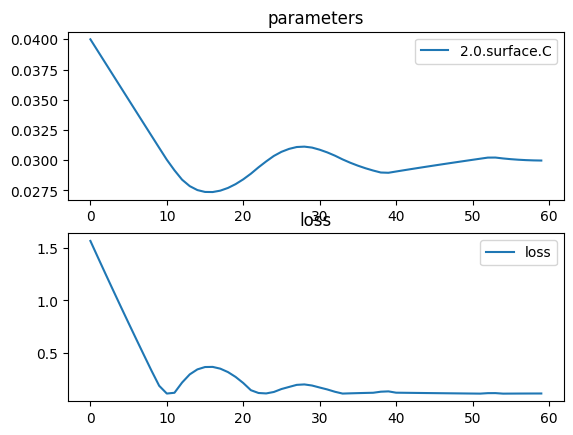

# Simple lens optimization


```python
import torchlensmaker as tlm

surface = tlm.SphereByCurvature(diameter=15, C=1./25, trainable=True)
lens = tlm.lenses.symmetric_singlet(surface, tlm.OuterGap(1.5), material="BK7")

optics = tlm.Sequential(
    tlm.PointSourceAtInfinity(beam_diameter=18.5),
    tlm.Gap(10),
    lens,
    tlm.Gap(30),
    tlm.FocalPoint(),
)

for name, p in optics.named_parameters():
    print(name, p)

tlm.show(optics, dim=2)
tlm.show(optics, dim=3, pupil=100)
```

    2.sequence.0.propagator.surface.C Parameter containing:
    tensor(0.0400, requires_grad=True)


<TLMViewer src="./simple_optimization_files/simple_optimization_0.json?url" />


<TLMViewer src="./simple_optimization_files/simple_optimization_1.json?url" />


```python
optics.set_sampling2d(pupil=10)

tlm.optimize(
    optics,
    optimizer = tlm.optim.Adam(optics.parameters(), lr=1e-3),
    dim = 2,
    num_iter = 60
).plot()

print("Final arc radius:", 1/surface.C.item())
print("Outer thickness:", lens.outer_thickness())
print("Inner thickness:", lens.inner_thickness())

tlm.show(optics, dim=2)
tlm.show(optics, dim=3, pupil=100)
```

    [  1/60] L= 1.56896 | grad norm= 161.1410
    [  4/60] L= 1.09283 | grad norm= 156.9115
    [  7/60] L= 0.62931 | grad norm= 153.1707
    [ 10/60] L= 0.18310 | grad norm= 133.4958
    [ 13/60] L= 0.21412 | grad norm= 147.2024
    [ 16/60] L= 0.36245 | grad norm= 146.2548
    [ 19/60] L= 0.31415 | grad norm= 146.5602
    [ 22/60] L= 0.14089 | grad norm= 147.6810
    [ 25/60] L= 0.12372 | grad norm= 82.1268
    [ 28/60] L= 0.19185 | grad norm= 133.5657
    [ 31/60] L= 0.16637 | grad norm= 82.6451
    [ 34/60] L= 0.10851 | grad norm= 8.3014
    [ 37/60] L= 0.11468 | grad norm= 8.7089
    [ 40/60] L= 0.12953 | grad norm= 147.7560
    [ 43/60] L= 0.11523 | grad norm= 8.7440
    [ 46/60] L= 0.11271 | grad norm= 8.5829
    [ 49/60] L= 0.11032 | grad norm= 8.4250
    [ 52/60] L= 0.10804 | grad norm= 8.2687
    [ 55/60] L= 0.10787 | grad norm= 8.2565
    [ 58/60] L= 0.10900 | grad norm= 8.3353
    [ 60/60] L= 0.10928 | grad norm= 8.3545


    

    


    Final arc radius: 33.372520476664235
    Outer thickness: tensor(-186.4135, grad_fn=<SelectBackward0>)
    Inner thickness: tensor(3.2074, grad_fn=<SelectBackward0>)


<TLMViewer src="./simple_optimization_files/simple_optimization_2.json?url" />


<TLMViewer src="./simple_optimization_files/simple_optimization_3.json?url" />

