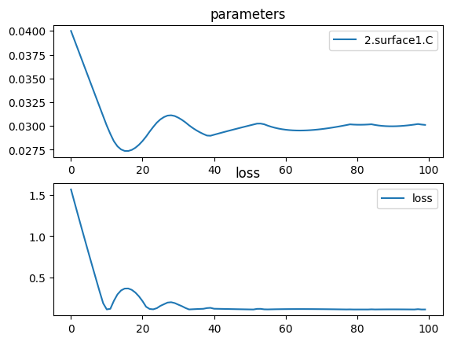

# Simple lens optimization


```python
import torchlensmaker as tlm

surface = tlm.Sphere(diameter=15, R=tlm.parameter(25))
lens = tlm.lenses.symmetric_singlet(surface, tlm.OuterGap(1.5), material="BK7")

optics = tlm.Sequential(
    tlm.PointSourceAtInfinity(beam_diameter=18.5),
    tlm.Gap(10),
    lens,
    tlm.Gap(30),
    tlm.FocalPoint(),
)

for name, p in optics.named_parameters():
    print(name, p)

tlm.show(optics, dim=2)
tlm.show(optics, dim=3, pupil=100)
```

    2.sequence.0.collision_surface.C Parameter containing:
    tensor(0.0400, requires_grad=True)


<TLMViewer src="./simple_optimization_files/simple_optimization_0.json?url" />


<TLMViewer src="./simple_optimization_files/simple_optimization_1.json?url" />


```python
optics.set_sampling2d(pupil=10)

tlm.optimize(
    optics,
    optimizer = tlm.optim.Adam(optics.parameters(), lr=1e-3),
    dim = 2,
    num_iter = 60
).plot()

print("Final arc radius:", surface.radius())
print("Outer thickness:", lens.outer_thickness())
print("Inner thickness:", lens.inner_thickness())

tlm.show(optics, dim=2)
tlm.show(optics, dim=3, pupil=100)
```

    [  1/60] L= 1.56896 | grad norm= 161.9366912841797
    [  4/60] L= 1.09283 | grad norm= 157.6260528564453
    [  7/60] L= 0.62933 | grad norm= 153.8096160888672
    [ 10/60] L= 0.18314 | grad norm= 133.94639587402344
    [ 13/60] L= 0.21391 | grad norm= 147.71240234375
    [ 16/60] L= 0.36217 | grad norm= 146.74325561523438
    [ 19/60] L= 0.31395 | grad norm= 147.05523681640625
    [ 22/60] L= 0.14082 | grad norm= 148.20101928710938
    [ 25/60] L= 0.12373 | grad norm= 82.25103759765625
    [ 28/60] L= 0.19203 | grad norm= 134.01866149902344
    [ 31/60] L= 0.16661 | grad norm= 82.7745361328125
    [ 34/60] L= 0.10847 | grad norm= 8.580143928527832
    [ 37/60] L= 0.11461 | grad norm= 8.976351737976074
    [ 40/60] L= 0.12784 | grad norm= 148.28854370117188
    [ 43/60] L= 0.11511 | grad norm= 9.006994247436523
    [ 46/60] L= 0.11255 | grad norm= 8.847447395324707
    [ 49/60] L= 0.11013 | grad norm= 8.690470695495605
    [ 52/60] L= 0.10780 | grad norm= 8.534743309020996
    [ 55/60] L= 0.10967 | grad norm= 82.0810775756836
    [ 58/60] L= 0.11062 | grad norm= 8.722641944885254
    [ 60/60] L= 0.11190 | grad norm= 8.805546760559082


    

    


    Final arc radius: 33.782562255859375
    Outer thickness: tensor(1.5000, grad_fn=<SelectBackward0>)
    Inner thickness: tensor(3.1861, grad_fn=<SelectBackward0>)


<TLMViewer src="./simple_optimization_files/simple_optimization_2.json?url" />


<TLMViewer src="./simple_optimization_files/simple_optimization_3.json?url" />

