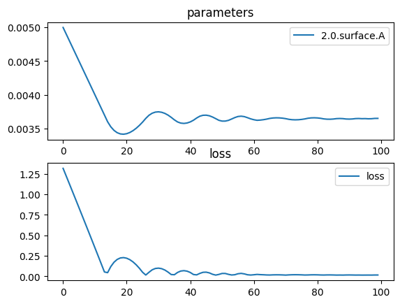

# Triple Lens


```python
import torch
import torch.nn as nn
import torch.optim as optim
import torchlensmaker as tlm

lens_diameter = 15.0

surface = tlm.Parabola(lens_diameter, A=tlm.parameter(0.005))
lens1 = tlm.BiLens(surface, material = 'BK7-nd', outer_thickness=0.5)
lens2 = tlm.BiLens(surface, material = 'BK7-nd', outer_thickness=0.5)
lens3 = tlm.BiLens(surface, material = 'BK7-nd', outer_thickness=0.5)

optics = nn.Sequential(
    tlm.PointSourceAtInfinity(0.9*lens_diameter),
    tlm.Gap(15),
    
    lens1,
    tlm.Gap(5),
    lens2,
    tlm.Gap(5),
    lens3,
    
    tlm.Gap(40),
    tlm.FocalPoint(),
)

tlm.show(optics, dim=2)
tlm.show(optics, dim=3)
```


<TLMViewer src="./triple_biconvex_tlmviewer/triple_biconvex_0.json?url" />


<TLMViewer src="./triple_biconvex_tlmviewer/triple_biconvex_1.json?url" />


```python
tlm.optimize(
    optics,
    optimizer = optim.Adam(optics.parameters(), lr=1e-4),
    sampling = {"base": 10},
    dim = 2,
    num_iter = 100
).plot()

print("Final parabola parameter:", surface.A.item())
print("Outer thickness:", lens1.outer_thickness())
print("Inner thickness:", lens1.inner_thickness())
```

    [  1/100] L=  1.317 | grad norm= 954.9682945737393
    [  6/100] L=  0.837 | grad norm= 968.095585401211
    [ 11/100] L=  0.350 | grad norm= 980.7726712666251
    [ 16/100] L=  0.119 | grad norm= 992.4052121101329
    [ 21/100] L=  0.221 | grad norm= 994.860041706585
    [ 26/100] L=  0.050 | grad norm= 990.7222479033209
    [ 31/100] L=  0.100 | grad norm= 987.0230588519927
    [ 36/100] L=  0.020 | grad norm= 269.2730522028842
    [ 41/100] L=  0.048 | grad norm= 990.6618967844845
    [ 46/100] L=  0.051 | grad norm= 988.2361085642443
    [ 51/100] L=  0.036 | grad norm= 990.3697737864542
    [ 56/100] L=  0.032 | grad norm= 910.9385309052989
    [ 61/100] L=  0.020 | grad norm= 269.25652762953524
    [ 66/100] L=  0.017 | grad norm= 284.9449255943527
    [ 71/100] L=  0.016 | grad norm= 284.9622313197019
    [ 76/100] L=  0.019 | grad norm= 269.2179981572593
    [ 81/100] L=  0.019 | grad norm= 284.90854969274403
    [ 86/100] L=  0.017 | grad norm= 269.1654319972238
    [ 91/100] L=  0.017 | grad norm= 269.1744179024866
    [ 96/100] L=  0.017 | grad norm= 269.17396979850196
    [100/100] L=  0.018 | grad norm= 284.9262002640585


    

    


    Final parabola parameter: 0.0036548946158946605
    Outer thickness: tensor(0.5000, dtype=torch.float64, grad_fn=<LinalgVectorNormBackward0>)
    Inner thickness: tensor(0.9112, dtype=torch.float64, grad_fn=<LinalgVectorNormBackward0>)


```python
tlm.show(optics, dim=2)
tlm.show(optics, dim=3)
```


<TLMViewer src="./triple_biconvex_tlmviewer/triple_biconvex_2.json?url" />


<TLMViewer src="./triple_biconvex_tlmviewer/triple_biconvex_3.json?url" />

