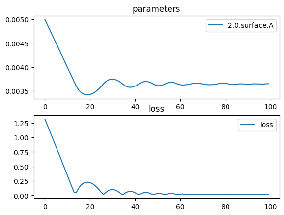

# Triple Lens


```python
import torch
import torch.nn as nn
import torch.optim as optim
import torchlensmaker as tlm

lens_diameter = 15.0

surface = tlm.Parabola(lens_diameter, A=tlm.parameter(0.005))
lens1 = tlm.lenses.symmetric_singlet(surface, tlm.OuterGap(0.5), material = 'BK7')
lens3 = tlm.lenses.symmetric_singlet(surface, tlm.OuterGap(0.5), material = 'BK7')
lens2 = tlm.lenses.symmetric_singlet(surface, tlm.OuterGap(0.5), material = 'BK7')

optics = tlm.Sequential(
    tlm.PointSourceAtInfinity(0.9*lens_diameter),
    tlm.Gap(15),
    
    lens1,
    tlm.Gap(5),
    lens2,
    tlm.Gap(5),
    lens3,
    
    tlm.Gap(40),
    tlm.FocalPoint(),
)

tlm.show(optics, dim=2)
tlm.show(optics, dim=3)
```


<TLMViewer src="./triple_biconvex_files/triple_biconvex_0.json?url" />


<TLMViewer src="./triple_biconvex_files/triple_biconvex_1.json?url" />


```python
optics.set_sampling2d(pupil=10)
tlm.simple_optimize(
    optics,
    optimizer = optim.Adam(optics.parameters(), lr=1e-4),
    dim = 2,
    num_iter = 100
).plot()
```

    [  1/100] L= 1.31674 | grad norm= 953.3937
    [  6/100] L= 0.83680 | grad norm= 966.7119
    [ 11/100] L= 0.34966 | grad norm= 979.5735
    [ 16/100] L= 0.11953 | grad norm= 991.3751
    [ 21/100] L= 0.22137 | grad norm= 993.8640
    [ 26/100] L= 0.05014 | grad norm= 989.6646
    [ 31/100] L= 0.10048 | grad norm= 985.9102
    [ 36/100] L= 0.02030 | grad norm= 268.8477
    [ 41/100] L= 0.04759 | grad norm= 989.6014
    [ 46/100] L= 0.05139 | grad norm= 987.1399
    [ 51/100] L= 0.03561 | grad norm= 989.3049
    [ 56/100] L= 0.03201 | grad norm= 909.9579
    [ 61/100] L= 0.01978 | grad norm= 268.8308
    [ 66/100] L= 0.01666 | grad norm= 284.7693
    [ 71/100] L= 0.01566 | grad norm= 284.7873
    [ 76/100] L= 0.01862 | grad norm= 268.7931
    [ 81/100] L= 0.01868 | grad norm= 284.7331
    [ 86/100] L= 0.01701 | grad norm= 268.7413
    [ 91/100] L= 0.01731 | grad norm= 268.7511
    [ 96/100] L= 0.01585 | grad norm= 284.7838
    [100/100] L= 0.01680 | grad norm= 284.7667


    

    


```python
print("Final parabola parameter:", surface.A.item())
print("Outer thickness:", lens1.outer_thickness().item())
print("Inner thickness:", lens1.inner_thickness().item())
```

    Final parabola parameter: 0.0036443897988647223
    Outer thickness: 0.5
    Inner thickness: 0.9099938869476318


```python
tlm.show(optics, dim=2)
tlm.show(optics, dim=3)
```


<TLMViewer src="./triple_biconvex_files/triple_biconvex_2.json?url" />


<TLMViewer src="./triple_biconvex_files/triple_biconvex_3.json?url" />

