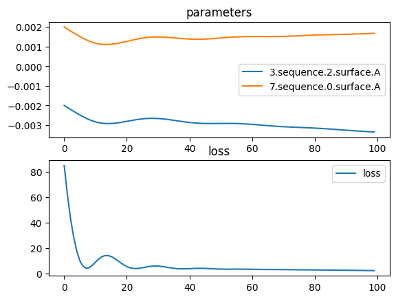

# Variable Lens Sequence

A configurable system with multiple lenses. We define three types of lenses:

* A plano convex lens
* A symmetric biconvex lens
* A convex plano lens, the same shape as the first lens, just reversed.

The number of lenses of each type are input parameters of the script, and the complete sequence is:

* X plano convex lenses
* Y biconvex convex lenses
* Z convex plano lenses


```python
import torch
import torch.nn as nn
import torch.optim as optim
import torchlensmaker as tlm

import math
import itertools
import numpy as np

### DESIGN ###

# Design parameters
square_size = 30
lens_diameter = math.sqrt(2)*square_size
focal_length = 35.

# Number of each lens type
nplano = 2
nbiconvex = 2
nrplano = 1

# Mechanical sizes
lens_min_thickness = 1.2
lens_spacing = 3.

### MODEL ###

# Parametric surfaces 
surface_plano = tlm.Parabola(lens_diameter, tlm.parameter(-0.002))
surface_biconvex = tlm.Parabola(lens_diameter, tlm.parameter(0.002))

# Lenses
lenses_plano = [tlm.lenses.semiplanar_front(
    surface_plano,
    tlm.OuterGap(lens_min_thickness),
    material="BK7",
) for i in range(nplano)]

lenses_biconvex = [tlm.lenses.symmetric_singlet(
    surface_biconvex,
    tlm.OuterGap(lens_min_thickness),
    material="BK7",
) for i in range(nbiconvex)]

lenses_rplano = [tlm.lenses.semiplanar_rear(
    surface_plano,
    tlm.OuterGap(lens_min_thickness),
    material="BK7",
    scale=-1,
) for i in range(nrplano)]

optics = tlm.Sequential(
    tlm.PointSourceAtInfinity(beam_diameter=0.9*lens_diameter),
    tlm.Gap(10.),
    
    *itertools.chain.from_iterable([[tlm.Gap(lens_spacing), lens] for lens in lenses_plano]),
    *itertools.chain.from_iterable([[tlm.Gap(lens_spacing), lens] for lens in lenses_biconvex]),
    *itertools.chain.from_iterable([[tlm.Gap(lens_spacing), lens] for lens in lenses_rplano]),
    
    tlm.Gap(focal_length),
    tlm.FocalPoint(),
)

# print(optics)

print("Lens design")
print("Square size", square_size)
print("Lens diameter", lens_diameter)
print("Configuration", nplano, nbiconvex, nrplano)
print("lens_min_thickness", lens_min_thickness)
print("lens_spacing", lens_spacing)

tlm.show(optics, dim=2)
tlm.show(optics, dim=3)
```

    Lens design
    Square size 30
    Lens diameter 42.42640687119285
    Configuration 2 2 1
    lens_min_thickness 1.2
    lens_spacing 3.0


<TLMViewer src="./variable_lens_sequence_files/variable_lens_sequence_0.json?url" />


<TLMViewer src="./variable_lens_sequence_files/variable_lens_sequence_1.json?url" />


```python
def regu_equalparam(_):
    a1 = surface_plano.sag_function.A
    a2 = surface_biconvex.sag_function.A
    return 500*torch.pow((500*a1)**2 - (500*a2)**2, 2)
    #params = torch.cat([param.view(-1) for param in optics.parameters()])
    #return torch.pow(torch.diff(1000*torch.abs(params)).sum(), 2)

def regu_equalthickness(_):
    t0 = lenses_plano[0].inner_thickness()
    t1 = lenses_biconvex[0].inner_thickness()
    return 100*torch.pow(t0 - t1, 2)

optics.set_sampling2d(pupil=10)

tlm.simple_optimize(
    optics,
    optimizer = optim.Adam(optics.parameters(), lr=1e-4),
    dim = 2,
    num_iter = 100,
    regularization = regu_equalthickness
).plot()

def print_lens(lens_name, lens):
    # TODO thickness at a specific radial distance
    print(lens_name)
    inner = lens.inner_thickness().item()
    outer = lens.outer_thickness().item()
    print(f"    inner: {inner:.3f} outer: {outer:.3f}")
    
    a1 = dict(lens[0].surface.named_parameters())
    a2 = dict(lens[-1].surface.named_parameters())
    print("    surface1", [p.tolist() for p in a1.values()])
    print("    surface2", [p.tolist() for p in a2.values()])

print_lens("Plano-convex", lenses_plano[0])
print_lens("Bi-convex", lenses_biconvex[0])
print_lens("Reverse plano-convex", lenses_rplano[0])

```

    [  1/100] L= 84.72070 | grad norm= 180033.4531
    [  6/100] L= 10.01243 | grad norm= 48591.4883
    [ 11/100] L= 8.91529 | grad norm= 45465.1211
    [ 16/100] L= 13.30397 | grad norm= 62370.8359
    [ 21/100] L= 5.41949 | grad norm= 25825.1973
    [ 26/100] L= 4.48006 | grad norm= 15841.8789
    [ 31/100] L= 5.78247 | grad norm= 28091.5137
    [ 36/100] L= 4.03027 | grad norm= 11640.4307
    [ 41/100] L= 3.77295 | grad norm= 9781.5957
    [ 46/100] L= 3.94824 | grad norm= 14469.2266
    [ 51/100] L= 3.43071 | grad norm= 4727.0225
    [ 56/100] L= 3.40025 | grad norm= 5938.4189
    [ 61/100] L= 3.27935 | grad norm= 5355.4429
    [ 66/100] L= 3.09737 | grad norm= 2780.3262
    [ 71/100] L= 3.02034 | grad norm= 5084.4707
    [ 76/100] L= 2.87297 | grad norm= 2988.1594
    [ 81/100] L= 2.75835 | grad norm= 2515.1323
    [ 86/100] L= 2.63210 | grad norm= 2374.2886
    [ 91/100] L= 2.50121 | grad norm= 2642.3618
    [ 96/100] L= 2.37238 | grad norm= 2887.8804
    [100/100] L= 2.26273 | grad norm= 2455.7751


    

    


    Plano-convex
        inner: 2.714 outer: 1.200
        surface1 []
        surface2 [-0.0033636821899563074]
    Bi-convex
        inner: 2.716 outer: 1.200
        surface1 [0.0016840794123709202]
        surface2 [0.0016840794123709202]
    Reverse plano-convex
        inner: 2.714 outer: 1.200
        surface1 [-0.0033636821899563074]
        surface2 []


```python
tlm.show2d(optics)
tlm.show3d(optics)
```


<TLMViewer src="./variable_lens_sequence_files/variable_lens_sequence_2.json?url" />


<TLMViewer src="./variable_lens_sequence_files/variable_lens_sequence_3.json?url" />

