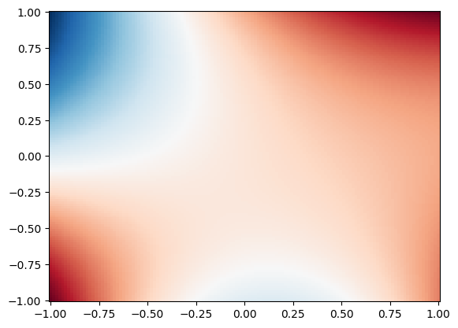
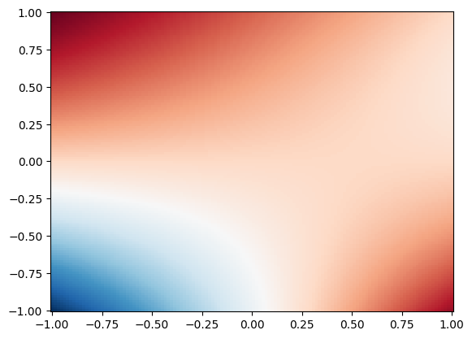
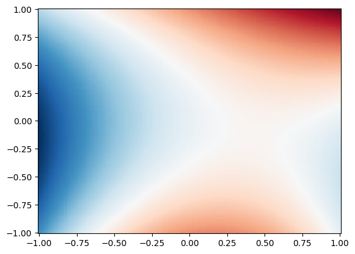
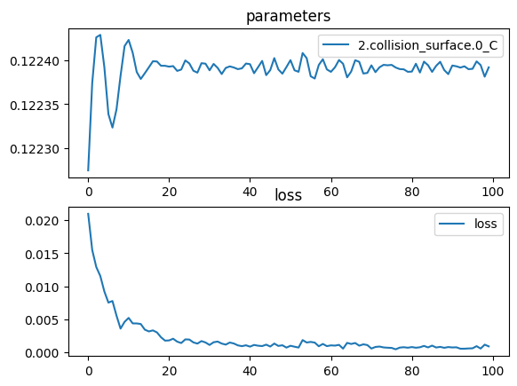
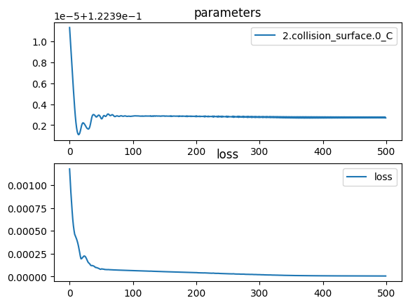
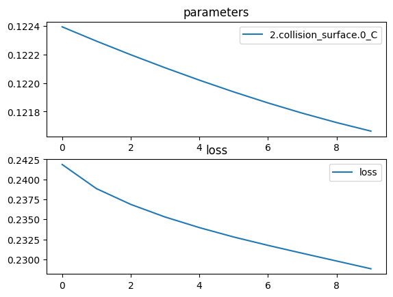
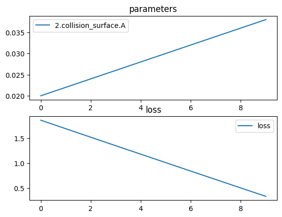

```python
import torchlensmaker as tlm
import torch
import numpy as np
import matplotlib.pyplot as plt
import json


def sample_grid(xlim, ylim, N):
    x = np.linspace(xlim[0], xlim[1], N)
    y = np.linspace(ylim[0], ylim[1], N)
    X, Y = np.meshgrid(x, y)
    return torch.tensor(X), torch.tensor(Y), torch.tensor(np.stack((X, Y), axis=-1).reshape(-1, 2))


sag = tlm.XYPolynomial(torch.tensor([
    [0, 0, 0, 1],
    [1, 2.5, 0.5, 0],
    [0, -2.5, 1, 0],
]))

tau = torch.tensor(1.)

Y, Z, points = sample_grid([-1.0, 1.0], [-1.0, 1.0], 128)

G = sag.G(Y, Z, tau)
Gy, Gz = sag.G_grad(Y, Z, tau)

plt.figure()
plt.pcolormesh(Y, Z, G.reshape(Y.shape), cmap='RdBu_r', shading='auto')

plt.figure()
plt.pcolormesh(Y, Z, Gy.reshape(Y.shape), cmap='RdBu_r', shading='auto')

plt.figure()
plt.pcolormesh(Y, Z, Gz.reshape(Y.shape), cmap='RdBu_r', shading='auto')

surface = tlm.SagSurface(1., sag)

optics = tlm.Sequential(
    #tlm.PointSourceAtInfinity(0.9),
    tlm.Gap(2),
    tlm.RefractiveSurface(surface, material="water-nd"),
)

tlm.show3d(optics, sampling={"base": 256}, end=2)
#scene = tlm.render_sequence(optics, dim=3, sampling={"base": 64}, dtype=torch.float64)
#print(json.dumps(scene))
```


<TLMViewer src="./XYPolynomial_files/XYPolynomial_0.json?url" />


    

    


    

    


    

    


```python
import torchlensmaker as tlm
import torch
import numpy as np
import matplotlib.pyplot as plt
import json


def randC(*size):
    S = 0.2
    return S*(torch.rand(*size, dtype=torch.float64) - 0.5) * 2

surfaces = [
    tlm.SagSurface(10, tlm.XYPolynomial(randC(3, 4), normalize=True))
    for i in range(10)]

elements = []

for i, surface in enumerate(surfaces):
    elements.append(tlm.RefractiveSurface(surface, material=("water-nd" if i % 2 == 0 else "air")))
    elements.append(tlm.Gap(5))

optics = tlm.Sequential(
    tlm.PointSourceAtInfinity(6.0),
    tlm.Gap(5),
    *elements
)

tlm.show3d(optics, sampling={"base": 256}, end=2, controls={"show_optical_axis": True, "show_bounding_cylinders": True})
```


<TLMViewer src="./XYPolynomial_files/XYPolynomial_1.json?url" />


```python
## XYPolynomial optimization

import torchlensmaker as tlm
import torch
import torch.nn as nn
import torch.optim as optim
import numpy as np
import matplotlib.pyplot as plt
import json


C = tlm.parameter(torch.tensor([[0.0, 0.0], [0.0, 0.0]], dtype=torch.float64))
#surface = tlm.SagSurface(10, tlm.XYPolynomial(C, normalize=True))

# works with SphereR
# nan in grad with Sphere
# nan in grad with XYPolynomial
# nan in grad with Parabola

#surface = tlm.SphereR(10, R=tlm.parameter(15))
surface = tlm.Parabola(10, tlm.parameter(0.02))

x = tlm.parameter(50.)

optics = tlm.Sequential(
    tlm.PointSourceAtInfinity(8.0),
    tlm.Gap(10),
    tlm.RefractiveSurface(surface, material="water-nd"),
    tlm.Gap(x),
    tlm.FocalPoint()
)

tlm.show3d(optics, sampling={"base": 100})

### get gradient
sampling = {"base": 100}
default_input = tlm.default_input(sampling, dim=3, dtype=torch.float64)
outputs = optics(default_input)
loss = outputs.loss
loss.backward()

params = list(surface.parameters().values())

print(surface.to_dict(3))
for param in params:
    print(param, param.grad)
    print()

print(x, x.grad)


tlm.show3d(optics, sampling={"base": 100})

```


<TLMViewer src="./XYPolynomial_files/XYPolynomial_2.json?url" />


    {'type': 'surface-sag', 'diameter': 10, 'sag-function': {'sag-type': 'parabolic', 'A': 0.02}, 'bcyl': [0.0, 0.5, 5.0]}
    Parameter containing:
    tensor(0.0200, dtype=torch.float64, requires_grad=True) tensor(-72.5827, dtype=torch.float64)
    
    Parameter containing:
    tensor(50., dtype=torch.float64, requires_grad=True) tensor(-0.0293, dtype=torch.float64)


<TLMViewer src="./XYPolynomial_files/XYPolynomial_3.json?url" />


```python
## XYPolynomial optimization

import torchlensmaker as tlm
import torch
import torch.nn as nn
import torch.optim as optim
import numpy as np
import matplotlib.pyplot as plt
import json


C = tlm.parameter(torch.zeros((13,13), dtype=torch.float64))
curvature = tlm.parameter(torch.tensor(0.1690))

fixed_mask = torch.zeros_like(C, dtype=torch.bool)
fixed_mask[0, 0] = True  # Freeze position (0,0)

C.register_hook(lambda grad: grad.masked_fill(fixed_mask, 0.))

#surface = tlm.SagSurface(10, tlm.XYPolynomial(C, normalize=True))
#surface = tlm.Sphere(10, R=tlm.parameter(15))
surface = tlm.SagSurface(10, tlm.SagSum([
    #tlm.Spherical(C=tlm.parameter(torch.tensor(1/8.))),
    tlm.Spherical(C=curvature),
    #tlm.Parabolic(A=tlm.parameter(0.2), normalize=True),
    tlm.XYPolynomial(C, normalize=True)
]))

optics = tlm.Sequential(
    tlm.PointSourceAtInfinity(8.0),
    tlm.Gap(10),
    tlm.RefractiveSurface(surface, material="water-nd"),
    tlm.Gap(8),
    tlm.RefractiveSurface(surface, scale=-1., material="air"),
    tlm.Gap(15),
    tlm.FocalPoint()
)

tlm.show3d(optics, sampling={"base": 100})

tlm.optimize(
    optics,
    optimizer = tlm.optim.Adam(optics.parameters(), lr=2e-3),
    sampling = {"base": 10},
    dim = 3,
    num_iter = 100
).plot()

tlm.optimize(
    optics,
    optimizer = tlm.optim.Adam(optics.parameters(), lr=1e-4),
    sampling = {"base": 10},
    dim = 3,
    num_iter = 100
).plot()

tlm.optimize(
    optics,
    optimizer = tlm.optim.Adam(optics.parameters(), lr=1e-6),
    sampling = {"base": 10},
    dim = 3,
    num_iter = 500
).plot()

# print(surface.parameters())

tlm.show3d(optics, sampling={"base": 100})


```


<TLMViewer src="./XYPolynomial_files/XYPolynomial_4.json?url" />


    [  1/100] L= 5.29729 | grad norm= 76.99117887271402
    [  6/100] L= 4.05940 | grad norm= 74.43700120314445
    [ 11/100] L= 2.79199 | grad norm= 72.96916918412747
    [ 16/100] L= 1.46771 | grad norm= 71.78928828451349
    [ 21/100] L= 0.74313 | grad norm= 7.776950065241797
    [ 26/100] L= 0.84540 | grad norm= 32.09410636585978
    [ 31/100] L= 0.66969 | grad norm= 43.88344652158842
    [ 36/100] L= 0.29322 | grad norm= 13.09058253852319
    [ 41/100] L= 0.27314 | grad norm= 65.37084457688948
    [ 46/100] L= 0.08140 | grad norm= 57.768851302602386
    [ 51/100] L= 0.09274 | grad norm= 9.899395596900085
    [ 56/100] L= 0.08607 | grad norm= 19.43538160077337
    [ 61/100] L= 0.02794 | grad norm= 8.443052437029541
    [ 66/100] L= 0.03753 | grad norm= 7.524484799801777
    [ 71/100] L= 0.01833 | grad norm= 60.72915366510207
    [ 76/100] L= 0.02411 | grad norm= 23.944183929094837
    [ 81/100] L= 0.01644 | grad norm= 11.01977523313339
    [ 86/100] L= 0.01237 | grad norm= 8.924877818855927
    [ 91/100] L= 0.01604 | grad norm= 50.627701663668
    [ 96/100] L= 0.01894 | grad norm= 42.97676408631754
    [100/100] L= 0.01765 | grad norm= 22.019085422166253


    

    


    [  1/100] L= 0.02098 | grad norm= 28.859272988488023
    [  6/100] L= 0.00753 | grad norm= 27.650925955870154
    [ 11/100] L= 0.00521 | grad norm= 41.486620900377204
    [ 16/100] L= 0.00316 | grad norm= 6.490069377145942
    [ 21/100] L= 0.00180 | grad norm= 9.028487353976839
    [ 26/100] L= 0.00194 | grad norm= 15.962622991762938
    [ 31/100] L= 0.00112 | grad norm= 31.15467093473839
    [ 36/100] L= 0.00148 | grad norm= 15.716217825213711
    [ 41/100] L= 0.00086 | grad norm= 20.564009193273602
    [ 46/100] L= 0.00088 | grad norm= 23.652393530390256
    [ 51/100] L= 0.00099 | grad norm= 45.6350144583359
    [ 56/100] L= 0.00157 | grad norm= 44.165058467700625
    [ 61/100] L= 0.00105 | grad norm= 22.25687130854356
    [ 66/100] L= 0.00126 | grad norm= 25.602246639677297
    [ 71/100] L= 0.00057 | grad norm= 46.22831905455637
    [ 76/100] L= 0.00067 | grad norm= 15.17309131254314
    [ 81/100] L= 0.00080 | grad norm= 27.051855330486724
    [ 86/100] L= 0.00102 | grad norm= 41.23035524793682
    [ 91/100] L= 0.00074 | grad norm= 30.15545800305399
    [ 96/100] L= 0.00061 | grad norm= 25.25748498114237
    [100/100] L= 0.00090 | grad norm= 17.913838682987297


    

    


    [  1/500] L= 0.00118 | grad norm= 65.284677177886
    [ 26/500] L= 0.00022 | grad norm= 16.550142124203095
    [ 51/500] L= 0.00008 | grad norm= 24.667513195203252
    [ 76/500] L= 0.00007 | grad norm= 5.606397289187693
    [101/500] L= 0.00006 | grad norm= 0.575729535883068
    [126/500] L= 0.00006 | grad norm= 0.6783783624321965
    [151/500] L= 0.00005 | grad norm= 7.748389740631717
    [176/500] L= 0.00005 | grad norm= 3.8604657067546615
    [201/500] L= 0.00004 | grad norm= 22.395489205394266
    [226/500] L= 0.00004 | grad norm= 11.129872891018596
    [251/500] L= 0.00003 | grad norm= 19.58013541823535
    [276/500] L= 0.00003 | grad norm= 27.528108700854407
    [301/500] L= 0.00002 | grad norm= 29.243287343953888
    [326/500] L= 0.00001 | grad norm= 31.689997089811964
    [351/500] L= 0.00001 | grad norm= 45.795365444865496
    [376/500] L= 0.00001 | grad norm= 60.5372166643439
    [401/500] L= 0.00001 | grad norm= 66.43632620325612
    [426/500] L= 0.00001 | grad norm= 67.48407283663614
    [451/500] L= 0.00001 | grad norm= 67.36400450682726
    [476/500] L= 0.00001 | grad norm= 67.488523196695
    [500/500] L= 0.00001 | grad norm= 67.49209253358663


    

    


<TLMViewer src="./XYPolynomial_files/XYPolynomial_5.json?url" />


```python
tlm.optimize(
    optics,
    optimizer = tlm.optim.Adam(optics.parameters(), lr=1e-4),
    sampling = {"base": 100},
    dim = 3,
    num_iter = 10
).plot()

tlm.show3d(optics, sampling={"base": 100})

print(C)
print(optics.parameters())
```

    [  1/10] L= 0.24187 | grad norm= 28.111795805852584
    [  2/10] L= 0.23885 | grad norm= 16.304778087329932
    [  3/10] L= 0.23687 | grad norm= 11.943205488675423
    [  4/10] L= 0.23530 | grad norm= 9.201766706876182
    [  5/10] L= 0.23397 | grad norm= 7.183575686392928
    [  6/10] L= 0.23280 | grad norm= 5.564154280746851
    [  7/10] L= 0.23175 | grad norm= 4.273437076218708
    [  8/10] L= 0.23076 | grad norm= 3.6228319226057324
    [  9/10] L= 0.22979 | grad norm= 3.20525857264993
    [ 10/10] L= 0.22882 | grad norm= 3.0734618323888037


    

    


<TLMViewer src="./XYPolynomial_files/XYPolynomial_6.json?url" />


    Parameter containing:
    tensor([[ 0.0000e+00,  3.5433e-04, -4.7127e-02, -1.0323e-03, -3.2205e-02,
             -1.6070e-03, -2.3549e-02, -2.0456e-03, -1.8734e-02,  1.9881e-04,
             -1.5947e-02,  3.3711e-03, -1.4312e-02],
            [ 2.3393e-05,  2.6584e-03, -3.3343e-03, -1.2919e-03, -3.6507e-03,
             -2.5565e-04, -5.3343e-03, -2.3914e-04,  2.0060e-03, -7.3940e-04,
              4.5880e-03,  1.2744e-03,  8.7361e-03],
            [-4.7551e-02, -3.2168e-03, -8.0293e-02,  3.7077e-03, -7.6976e-02,
              1.0783e-02, -6.6264e-02,  1.1651e-02, -5.4660e-02,  1.0678e-02,
             -4.5551e-02,  9.4959e-03, -3.8985e-02],
            [ 4.1879e-03, -4.2994e-03,  5.8246e-03, -7.0469e-03,  2.6904e-03,
              5.7276e-03, -3.7395e-02,  8.2150e-03, -5.0235e-02,  6.3918e-03,
             -5.6849e-02,  6.5969e-03, -6.0446e-02],
            [-3.2023e-02, -4.7733e-03, -7.7785e-02, -1.4689e-02, -8.5520e-02,
             -4.9732e-03, -8.3924e-02,  5.7730e-04, -7.8226e-02,  1.9838e-03,
             -7.0782e-02,  2.3786e-03, -6.3851e-02],
            [-7.0344e-03,  2.6303e-03,  9.8697e-03,  1.5659e-02,  8.3644e-02,
             -1.3954e-02,  8.1404e-02, -2.9100e-03, -2.9154e-02,  1.2106e-03,
             -4.8612e-02,  2.6308e-03, -5.5737e-02],
            [-2.3128e-02, -1.4673e-03, -6.7504e-02, -7.0523e-03, -8.4035e-02,
             -1.7074e-02, -8.7023e-02, -9.2802e-03, -8.5884e-02, -4.3278e-03,
             -8.2137e-02, -1.7871e-03, -7.6681e-02],
            [-1.7405e-02, -1.0071e-03, -1.0324e-02,  8.3798e-03,  8.6137e-02,
              8.5865e-03,  8.5909e-02, -1.3000e-02,  8.5131e-02, -2.0842e-03,
             -3.9431e-03,  3.6152e-04, -4.4047e-02],
            [-1.8338e-02,  4.1618e-03, -5.5423e-02, -6.2673e-04, -7.9469e-02,
             -8.9478e-03, -8.6151e-02, -1.7117e-02, -8.7498e-02, -1.1667e-02,
             -8.6776e-02, -7.1292e-03, -8.4195e-02],
            [ 1.4043e-02, -3.0156e-04, -1.8121e-02,  6.4011e-03,  8.6932e-02,
              7.1829e-03,  8.6501e-02, -8.1684e-03,  8.6525e-02, -1.2536e-02,
              8.6440e-02, -3.5537e-03,  8.1757e-02],
            [-1.5647e-02,  7.8006e-03, -4.5514e-02,  1.6896e-03, -7.2948e-02,
              2.9036e-03, -8.4014e-02, -1.5948e-02, -8.6937e-02, -1.6312e-02,
             -8.7739e-02, -1.2649e-02, -8.7356e-02],
            [ 1.1626e-02,  1.2897e-03, -2.4224e-02,  5.6885e-03,  8.4136e-02,
              5.9144e-03,  8.7030e-02,  3.4290e-03,  8.6457e-02, -3.2368e-03,
              8.6754e-02, -1.0192e-02,  8.6930e-02],
            [-1.4103e-02,  9.8825e-03, -3.8369e-02,  2.7603e-03, -6.4959e-02,
              4.8565e-03, -8.1154e-02, -1.8836e-04, -8.5763e-02, -1.6232e-02,
             -8.7319e-02, -1.4904e-02, -8.7904e-02]], dtype=torch.float64,
           requires_grad=True)
    <generator object Module.parameters at 0x7fd6545e4580>


```python
## XYPolynomial optimization

import torchlensmaker as tlm
import torch
import torch.nn as nn
import torch.optim as optim
import numpy as np
import matplotlib.pyplot as plt
import json

surface = tlm.Sphere(10, R=tlm.parameter(10))

optics = tlm.Sequential(
    tlm.PointSourceAtInfinity(8.0), 
    tlm.Gap(10),
    tlm.RefractiveSurface(surface, scale=-1., material="water-nd"),
    tlm.Gap(15),
    tlm.FocalPoint()
)

tlm.show3d(optics, sampling={"base": 10}, end=10, controls={"blocked_rays": "default", "show_bounding_cylinders": True})
```


<TLMViewer src="./XYPolynomial_files/XYPolynomial_7.json?url" />


```python
## XYPolynomial optimization

import torchlensmaker as tlm
import torch
import torch.nn as nn
import torch.optim as optim
import numpy as np
import matplotlib.pyplot as plt
import json

#surface = tlm.Sphere(10, R=tlm.parameter(15))
#surface = tlm.Parabola(10, A=tlm.parameter(0.02))
surface = tlm.SagSurface(10, tlm.Parabolic(tlm.parameter(0.02)))

optics = tlm.Sequential(
    tlm.PointSourceAtInfinity(8.0),
    tlm.Gap(10),
    tlm.RefractiveSurface(surface, material="water-nd"),
    tlm.Gap(8),
    tlm.RefractiveSurface(surface, scale=-1., material="air"),
    tlm.Gap(15),
    tlm.FocalPoint()
)

tlm.show3d(optics, sampling={"base": 100})

torch.autograd.set_detect_anomaly(True)
tlm.optimize(
    optics,
    optimizer = tlm.optim.Adam(optics.parameters(), lr=2e-3),
    sampling = {"base": 10},
    dim = 3,
    num_iter = 10
).plot()

tlm.show3d(optics, sampling={"base": 100})
```


<TLMViewer src="./XYPolynomial_files/XYPolynomial_8.json?url" />


    [  1/10] L= 1.86423 | grad norm= 85.42401550836063
    [  2/10] L= 1.69311 | grad norm= 85.21715352920168
    [  3/10] L= 1.52236 | grad norm= 85.02223090253692
    [  4/10] L= 1.35195 | grad norm= 84.83968721431509
    [  5/10] L= 1.18186 | grad norm= 84.67004566113546
    [  6/10] L= 1.01208 | grad norm= 84.5139149132526
    [  7/10] L= 0.84257 | grad norm= 84.37199175578854
    [  8/10] L= 0.67331 | grad norm= 84.24506457512267
    [  9/10] L= 0.50426 | grad norm= 84.13401777697139
    [ 10/10] L= 0.33539 | grad norm= 84.03983724481988


    

    


<TLMViewer src="./XYPolynomial_files/XYPolynomial_9.json?url" />


```python
torch.finfo(torch.float32).tiny
```


    1.1754943508222875e-38


