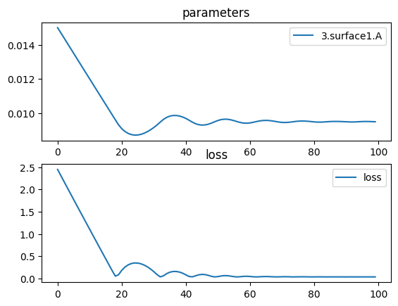

# Biconvex Parabolic Lens


```python
import torch
import torch.nn as nn
import torchlensmaker as tlm
import torch.optim as optim

# y = a*x^2
surface = tlm.Parabola(diameter=15, A=tlm.parameter(0.015))

lens = tlm.BiLens(surface, material="BK7", outer_thickness=1.0)

optics = nn.Sequential(
    tlm.PointSourceAtInfinity(beam_diameter=18.5),
    tlm.Wavelength(500, 800),
    tlm.Gap(10),
    lens,
    tlm.Gap(50),
    tlm.FocalPoint(),
)

tlm.show(optics, dim=2, sampling={"base": 10, "wavelength": 10})
```


<TLMViewer src="./biconvex_parabola_files/biconvex_parabola_0.json?url" />


```python
tlm.optimize(
    optics,
    optimizer = optim.Adam(optics.parameters(), lr=3e-4),
    sampling = {"base": 10, "wavelength": 10},
    dim = 2,
    num_iter = 100
).plot()

print("Final parabola parameter:", surface.A.item())
print("Outer thickness:", lens.outer_thickness())
print("Inner thickness:", lens.inner_thickness())
```

    [  1/100] L=  2.447 | grad norm= 452.9619009549908
    [  6/100] L=  1.772 | grad norm= 449.25157905321083
    [ 11/100] L=  1.103 | grad norm= 445.83217609874936
    [ 16/100] L=  0.440 | grad norm= 442.67323355051326
    [ 21/100] L=  0.182 | grad norm= 439.9032571927819
    [ 26/100] L=  0.345 | grad norm= 439.2102075508755
    [ 31/100] L=  0.152 | grad norm= 440.0346518863437
    [ 36/100] L=  0.140 | grad norm= 441.31838181807274
    [ 41/100] L=  0.080 | grad norm= 425.148702719339
    [ 46/100] L=  0.091 | grad norm= 440.3003762145692
    [ 51/100] L=  0.042 | grad norm= 176.87098261684466
    [ 56/100] L=  0.040 | grad norm= 155.25726849308128
    [ 61/100] L=  0.044 | grad norm= 254.64243182439472
    [ 66/100] L=  0.043 | grad norm= 204.1287933832373
    [ 71/100] L=  0.038 | grad norm= 176.18179471313238
    [ 76/100] L=  0.036 | grad norm= 100.5678127554538
    [ 81/100] L=  0.035 | grad norm= 70.39112896163316
    [ 86/100] L=  0.035 | grad norm= 51.45917604215506
    [ 91/100] L=  0.034 | grad norm= 12.45866730680031
    [ 96/100] L=  0.035 | grad norm= 51.45914521608263
    [100/100] L=  0.034 | grad norm= 12.4604352624838


    

    


    Final parabola parameter: 0.009488203266875116
    Outer thickness: tensor(1., dtype=torch.float64, grad_fn=<LinalgVectorNormBackward0>)
    Inner thickness: tensor(2.0674, dtype=torch.float64, grad_fn=<LinalgVectorNormBackward0>)


```python
tlm.show(optics, dim=2, end=60)
tlm.show(optics, dim=3, sampling={"object": 10, "base": 64, "wavelength": 5}, end=60)
```


<TLMViewer src="./biconvex_parabola_files/biconvex_parabola_1.json?url" />


<TLMViewer src="./biconvex_parabola_files/biconvex_parabola_2.json?url" />


```python
part = tlm.export.lens_to_part(lens)
tlm.show_part(part)
```


<em>part display not supported in vitepress</em>

