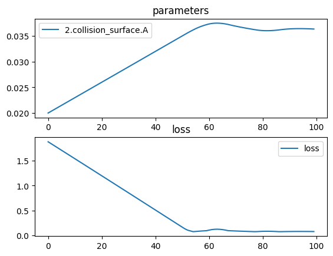

# Biconvex Parabolic Lens (no lens class)


```python
import torch
import torch.nn as nn
import torchlensmaker as tlm
import torch.optim as optim

surface = tlm.Parabola(diameter=15, A=tlm.parameter(0.02)) # y = a*x^2

optics = nn.Sequential(
    tlm.PointSourceAtInfinity(beam_diameter=18.5),
    tlm.Gap(10),
    tlm.RefractiveSurface(surface, material="water-nd", anchors=("origin", "extent")),
    tlm.Gap(2),
    tlm.RefractiveSurface(
        surface, material="water-nd", scale=-1, anchors=("extent", "origin")
    ),
    tlm.Gap(50),
    tlm.FocalPoint(),
)

tlm.show(optics, dim=2)
tlm.show(optics, dim=3)
```


<TLMViewer src="./biconvex_parabola_nolens_tlmviewer/biconvex_parabola_nolens_0.json?url" />


<TLMViewer src="./biconvex_parabola_nolens_tlmviewer/biconvex_parabola_nolens_1.json?url" />


```python
tlm.optimize(
    optics,
    optimizer = optim.Adam(optics.parameters(), lr=3e-4),
    sampling = {"base": 10},
    dim = 2,
    num_iter = 100
).plot()
```

    [  1/100] L=  1.881 | grad norm= 113.95974298312814
    [  6/100] L=  1.711 | grad norm= 114.18985216269625
    [ 11/100] L=  1.540 | grad norm= 114.39647905454844
    [ 16/100] L=  1.368 | grad norm= 114.57999629692958
    [ 21/100] L=  1.197 | grad norm= 114.74078984567689
    [ 26/100] L=  1.025 | grad norm= 114.879262137514
    [ 31/100] L=  0.853 | grad norm= 114.99583542094311
    [ 36/100] L=  0.680 | grad norm= 115.090954513795
    [ 41/100] L=  0.508 | grad norm= 115.16508853803323
    [ 46/100] L=  0.335 | grad norm= 115.21873148931898
    [ 51/100] L=  0.162 | grad norm= 115.252401725918
    [ 56/100] L=  0.077 | grad norm= 19.478242249783197
    [ 61/100] L=  0.105 | grad norm= 115.26640790271479
    [ 66/100] L=  0.114 | grad norm= 115.2660678922228
    [ 71/100] L=  0.087 | grad norm= 19.579362001128906
    [ 76/100] L=  0.077 | grad norm= 19.47226253419699
    [ 81/100] L=  0.080 | grad norm= 53.74440553776681
    [ 86/100] L=  0.076 | grad norm= 53.731913243376944
    [ 91/100] L=  0.076 | grad norm= 19.46708705065629
    [ 96/100] L=  0.077 | grad norm= 19.476725869189885
    [100/100] L=  0.076 | grad norm= 19.460679330070136


    

    


```python
tlm.show(optics, dim=2, end=60)
tlm.show(optics, dim=3, end=60)
```


<TLMViewer src="./biconvex_parabola_nolens_tlmviewer/biconvex_parabola_nolens_2.json?url" />


<TLMViewer src="./biconvex_parabola_nolens_tlmviewer/biconvex_parabola_nolens_3.json?url" />

