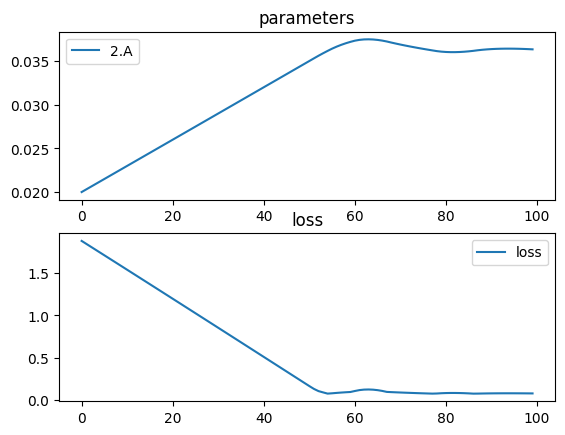

# Biconvex Parabolic Lens (no lens class)


```python
import torch
import torchlensmaker as tlm
import torch.optim as optim

surface = tlm.Parabola(diameter=15, A=tlm.parameter(0.02)) # y = a*x^2

optics = tlm.Sequential(
    tlm.PointSourceAtInfinity(beam_diameter=18.5),
    tlm.Gap(10),
    tlm.RefractiveSurface(surface, material="water-nd", anchors=("origin", "extent")),
    tlm.Gap(2),
    tlm.RefractiveSurface(
        surface, material="water-nd", scale=-1, anchors=("extent", "origin")
    ),
    tlm.Gap(50),
    tlm.FocalPoint(),
)

tlm.show(optics, dim=2)
tlm.show(optics, dim=3)
```


<TLMViewer src="./biconvex_parabola_nolens_files/biconvex_parabola_nolens_0.json?url" />


<TLMViewer src="./biconvex_parabola_nolens_files/biconvex_parabola_nolens_1.json?url" />


```python
tlm.optimize(
    optics,
    optimizer = optim.Adam(optics.parameters(), lr=3e-4),
    sampling = {"base": 10},
    dim = 2,
    num_iter = 100
).plot()
```

    [  1/100] L= 1.88145 | grad norm= 113.9597429831281
    [  6/100] L= 1.71075 | grad norm= 114.18985216269634
    [ 11/100] L= 1.53972 | grad norm= 114.3964790545484
    [ 16/100] L= 1.36838 | grad norm= 114.57999629692955
    [ 21/100] L= 1.19674 | grad norm= 114.74078984567682
    [ 26/100] L= 1.02482 | grad norm= 114.87926213751396
    [ 31/100] L= 0.85267 | grad norm= 114.99583542094301
    [ 36/100] L= 0.68032 | grad norm= 115.09095451379496
    [ 41/100] L= 0.50781 | grad norm= 115.1650885380331
    [ 46/100] L= 0.33519 | grad norm= 115.21873148931891
    [ 51/100] L= 0.16250 | grad norm= 115.2524017259179
    [ 56/100] L= 0.07750 | grad norm= 19.478242249783136
    [ 61/100] L= 0.10472 | grad norm= 115.26640790271468
    [ 66/100] L= 0.11442 | grad norm= 115.26606789222265
    [ 71/100] L= 0.08669 | grad norm= 19.579362001128793
    [ 76/100] L= 0.07696 | grad norm= 19.472262534196815
    [ 81/100] L= 0.08027 | grad norm= 53.744405537766724
    [ 86/100] L= 0.07633 | grad norm= 53.73191324337685
    [ 91/100] L= 0.07649 | grad norm= 19.46708705065617
    [ 96/100] L= 0.07736 | grad norm= 19.47672586918986
    [100/100] L= 0.07590 | grad norm= 19.460679330070047


    

    


```python
tlm.show(optics, dim=2, end=60)
tlm.show(optics, dim=3, end=60)
```


<TLMViewer src="./biconvex_parabola_nolens_files/biconvex_parabola_nolens_2.json?url" />


<TLMViewer src="./biconvex_parabola_nolens_files/biconvex_parabola_nolens_3.json?url" />

