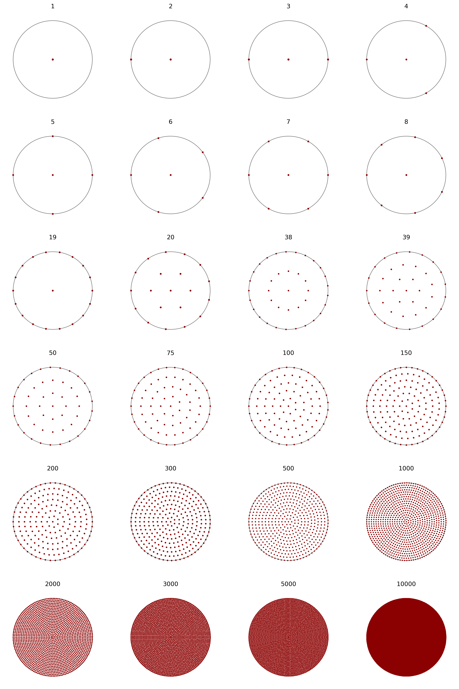

```python
import numpy as np
import math

for N in range(1, 25):
    m1 = (-math.pi + math.sqrt(math.pi**2 + 4*math.pi*N)) / (2*math.pi)
    m2 = (-math.pi - math.sqrt(math.pi**2 + 4*math.pi*N)) / (2*math.pi)
    print(f"{N: >2} {m1: >6.2f} {m2: >6.2f}")
```

     1   0.25  -1.25
     2   0.44  -1.44
     3   0.60  -1.60
     4   0.73  -1.73
     5   0.86  -1.86
     6   0.97  -1.97
     7   1.07  -2.07
     8   1.17  -2.17
     9   1.26  -2.26
    10   1.35  -2.35
    11   1.44  -2.44
    12   1.52  -2.52
    13   1.59  -2.59
    14   1.67  -2.67
    15   1.74  -2.74
    16   1.81  -2.81
    17   1.88  -2.88
    18   1.95  -2.95
    19   2.01  -3.01
    20   2.07  -3.07
    21   2.13  -3.13
    22   2.19  -3.19
    23   2.25  -3.25
    24   2.31  -3.31


```python
import numpy as np
import math

for N in range(1, 50):
    M = np.floor((-np.pi + math.sqrt(np.pi**2 - 4*np.pi*(1-N))) / (2*np.pi))
    alpha = (N-1)/(math.pi*M*(M+1))
    R = np.arange(1, M+1)
    S = 2*np.pi*alpha*R
    
    print(N, S)
    print("sum = ", S.sum())
```

    1 []
    sum =  0.0
    2 []
    sum =  0.0
    3 []
    sum =  0.0
    4 []
    sum =  0.0
    5 []
    sum =  0.0
    6 []
    sum =  0.0
    7 []
    sum =  0.0
    8 [7.]
    sum =  7.000000000000001
    9 [8.]
    sum =  8.0
    10 [9.]
    sum =  9.0
    11 [10.]
    sum =  10.0
    12 [11.]
    sum =  11.0
    13 [12.]
    sum =  12.0
    14 [13.]
    sum =  12.999999999999998
    15 [14.]
    sum =  14.000000000000002
    16 [15.]
    sum =  15.0
    17 [16.]
    sum =  16.0
    18 [17.]
    sum =  17.0
    19 [18.]
    sum =  18.0
    20 [ 6.33333333 12.66666667]
    sum =  19.0
    21 [ 6.66666667 13.33333333]
    sum =  20.0
    22 [ 7. 14.]
    sum =  21.000000000000004
    23 [ 7.33333333 14.66666667]
    sum =  22.0
    24 [ 7.66666667 15.33333333]
    sum =  23.0
    25 [ 8. 16.]
    sum =  24.0
    26 [ 8.33333333 16.66666667]
    sum =  25.0
    27 [ 8.66666667 17.33333333]
    sum =  26.0
    28 [ 9. 18.]
    sum =  27.0
    29 [ 9.33333333 18.66666667]
    sum =  27.999999999999996
    30 [ 9.66666667 19.33333333]
    sum =  29.0
    31 [10. 20.]
    sum =  30.0
    32 [10.33333333 20.66666667]
    sum =  31.0
    33 [10.66666667 21.33333333]
    sum =  32.0
    34 [11. 22.]
    sum =  33.0
    35 [11.33333333 22.66666667]
    sum =  34.0
    36 [11.66666667 23.33333333]
    sum =  35.0
    37 [12. 24.]
    sum =  36.0
    38 [12.33333333 24.66666667]
    sum =  37.0
    39 [ 6.33333333 12.66666667 19.        ]
    sum =  38.0
    40 [ 6.5 13.  19.5]
    sum =  38.99999999999999
    41 [ 6.66666667 13.33333333 20.        ]
    sum =  40.0
    42 [ 6.83333333 13.66666667 20.5       ]
    sum =  41.0
    43 [ 7. 14. 21.]
    sum =  42.00000000000001
    44 [ 7.16666667 14.33333333 21.5       ]
    sum =  43.0
    45 [ 7.33333333 14.66666667 22.        ]
    sum =  44.0
    46 [ 7.5 15.  22.5]
    sum =  45.0
    47 [ 7.66666667 15.33333333 23.        ]
    sum =  46.0
    48 [ 7.83333333 15.66666667 23.5       ]
    sum =  47.0
    49 [ 8. 16. 24.]
    sum =  48.0


    /tmp/ipykernel_30674/2490190196.py:6: RuntimeWarning: invalid value encountered in scalar divide
      alpha = (N-1)/(math.pi*M*(M+1))
    /tmp/ipykernel_30674/2490190196.py:6: RuntimeWarning: divide by zero encountered in scalar divide
      alpha = (N-1)/(math.pi*M*(M+1))


```python
import numpy as np


def uniform_disk_sampling(N, diameter):
    M = np.floor((-np.pi + np.sqrt(np.pi**2 - 4*np.pi*(1-N))) / (2*np.pi))
    if M == 0:
        M = 1
    alpha = (N-1)/(np.pi*M*(M+1))
    R = np.arange(1, M+1)
    S = 2*np.pi*alpha*R

    # If we're off, subtract the difference from the last element
    S = np.round(S)
    S[-1] -= (S.sum() - (N - 1))
    S = S.astype(int)

    # List of sample points, start with the origin point
    points = [np.zeros((1, 2))]

    for s, r in zip(S, R):
        theta = np.linspace(-np.pi, np.pi, s+1)[:-1]
        radius = r/M * diameter/2
        points.append(np.column_stack((radius*np.cos(theta), radius*np.sin(theta))))

    return np.vstack(points)
```


```python
import matplotlib.pyplot as plt

Ns = [1, 2, 3, 4,
      5, 6, 7, 8,
      19, 20, 38, 39,
      50, 75, 100, 150,
      200, 300, 500, 1000,
      2000, 3000, 5000, 10000]

fig, axes = plt.subplots(6, 4, figsize=(16, 24), dpi=300)

for N, ax in zip(Ns, axes.flatten()):
    ax.set_axis_off()
    ax.set_title(N)
    points = uniform_disk_sampling(N, 1.0)
    ax.add_patch(plt.Circle((0, 0), 0.5, color='grey', fill=False))
    ax.plot(points[:, 0], points[:, 1], marker=".", linestyle="none", markersize=round(6 - np.log10(N)), color="darkred")
    ax.set_xlim([-0.62, 0.62])
    ax.set_ylim([-0.62, 0.62])


```


    

    


```python
import math
import numpy as np

import matplotlib.pyplot as plt

# UniformSampler

def distrib(N):
    """
    Returns an increasing list of integers that sum to N where the first element is always > 1
    N must be >= 7
    """
    
    M = math.floor((-math.pi + math.sqrt(math.pi**2 + 4*math.pi*N)) / (2*math.pi))
    
    alpha = N/(math.pi*M*(M+1))
    r = np.arange(1, M+1)
    S = 2*math.pi*alpha*r

    # round to get integer number of points per radius
    S = np.round(S)

    # if we're off by a bit, remove from the last element
    off = S.sum() - N
    S[-1] -= off
    
    return S.astype(int)


def disk_sample(N, diameter):

    points = [np.zeros((1, 2))]

    S = distrib(N-1)

    print(S)
    
    M = len(S)
    R = np.arange(1,M+1)

    for s, r in zip(S, R):

        theta = np.linspace(-np.pi, np.pi, s+1)[:-1]

        radius = r/M * diameter  /2

        X = radius*np.cos(theta)
        Y = radius*np.sin(theta)

        points.append(np.column_stack((X, Y)))

    return np.vstack(points)


points = disk_sample(1721, 10.0)

plt.plot(points[:, 0], points[:, 1], marker=".", linestyle="none", markersize=2)
plt.gca().set_aspect("equal")
plt.gca().set_axis_off()
```

    [  7  14  20  27  34  41  48  54  61  68  75  82  88  95 102 109 116 122
     129 136 143 149]


    

    

