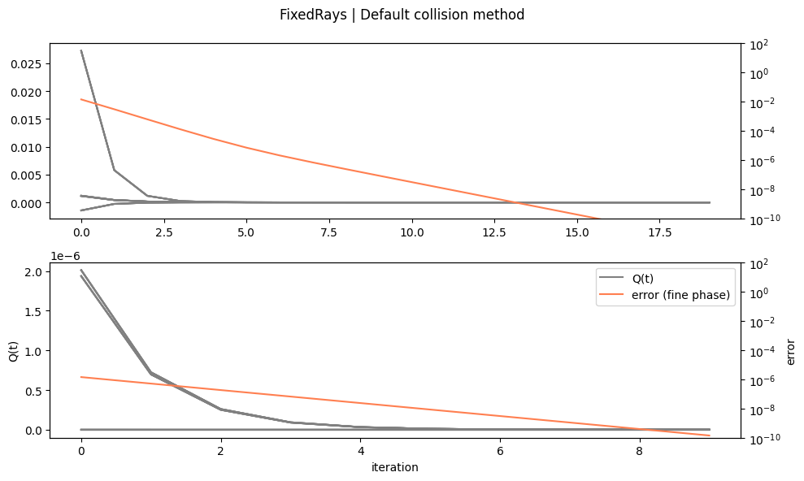

```python
import torchlensmaker as tlm
import torch
import math

from torchlensmaker.testing.collision_datasets import NormalRays, FixedRays, OrbitalRays
from torchlensmaker.testing.dataset_view import convergence_plot

from torchlensmaker.core.geometry import unit2d_rot, unit3d_rot


from typing import TypeAlias, Any

Tensor: TypeAlias = torch.Tensor

from torchlensmaker.core.collision_detection import init_brd, CollisionAlgorithm, surface_f, default_collision_method


def view_beams(surface, P, V, t, rays_length=1000):

    N, D = P.shape
    B = t.shape[0]
    assert t.shape[1] == P.shape[0]
    
    # :: (B, N)

    # :: (B, N, D)
    points = P.expand((B, -1, -1)) + t.unsqueeze(-1).expand((B, N, D)) * V.expand((B, -1, -1))
    assert points.shape == (B, N, D)
    
    points = points.reshape((-1, D))
    assert points.shape == (B*N, D)
    
    scene = tlm.viewer.new_scene("2D" if D == 2 else "3D")
    scene["data"].append(tlm.viewer.render_surface(surface, D))
    
    rays_start = P - rays_length*V
    rays_end = P + rays_length*V
    scene["data"].append(
        tlm.viewer.render_rays(rays_start, rays_end, layer=0)
    )

    scene["data"].append(tlm.viewer.render_points(points))

    # Rays origins
    scene["data"].append(tlm.viewer.render_points(P, color="red"))
    

    tlm.viewer.display_scene(scene)


def view_coarse_phase(surface, P, V, results):
    B, N, HA = results.history_coarse.shape
    for h in range(HA):
        t = results.history_coarse[:, :, h]
        view_beams(surface, P, V, t)


###########

def demo():
    surface = tlm.Sphere(5, C=0.12)

    # this one fails with offset= -50 but not 50
    #generator = FixedRays(dim=2, N=35, direction=torch.tensor([0.1736, 0.9848], dtype=torch.float64), offset=-50.0, epsilon=0.05)

    generator = FixedRays(dim=3, N=12, direction=torch.tensor([0., 1., 0.]), offset=10.0, epsilon=0.05)
    

    # generator = FixedRays(dim=2, N=15, direction=unit2d_rot(10, dtype=torch.float64), offset=-50.0, epsilon=0.05)
    
    #generator = FixedRays(dim=3, N=15, direction=unit3d_rot(70., 5., dtype=torch.float64), offset=50.0, epsilon=0.05)

    P, V = generator(surface)
    
    results = default_collision_method(surface, P, V, history=True)
    t = results.t
    local_points = P + t.unsqueeze(1).expand_as(V) * V

    #view_coarse_phase(surface, P, V, results)
    view_beams(surface, P, V, t.unsqueeze(0))

    print("rmse:", surface.rmse(local_points))

    convergence_plot(surface, P, V, generator.__class__.__name__)

    assert torch.all(surface.contains(local_points) == True)

demo()
```


<TLMViewer src="./collision_detection_analysis_dataset_files/collision_detection_analysis_dataset_0.json?url" />


    rmse: 5.10201572555291e-11


    

    

