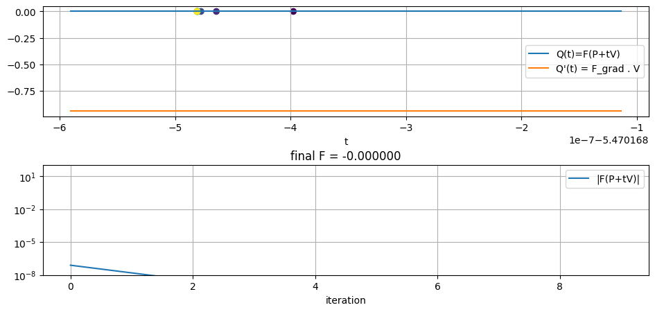

```python
import numpy as np
import matplotlib.pyplot as plt
import matplotlib.colors as colors
import math
import torch
import torchlensmaker as tlm

from torch.nn.functional import normalize

from torchlensmaker.core.collision_detection import Newton, GD, LM, CollisionMethod

from torchlensmaker.testing.collision_datasets import CollisionDataset
from torchlensmaker.testing.dataset_view import dataset_view

from torchlensmaker.core.geometry import unit3d_rot

import matplotlib as mpl

from IPython.display import display, HTML

from typing import TypeAlias

Tensor: TypeAlias = torch.Tensor


def analysis_single_ray(surface, P, V):
    dim = P.shape[0]
    P, V = P.unsqueeze(0), V.unsqueeze(0)

    dataset_view(surface, P, V, rays_length=100)

    results = surface.collision_method(surface, P, V, history=True)
    t_solve, t_history = results.t, results.history_fine
    t_min = t_history.min().item()
    t_max = t_history.max().item()

    N = 1000
    H = t_history.size(1)
    tspace = torch.linspace(t_min - (t_max - t_min), t_max + (t_max - t_min), N)

    # t plot
    tpoints = P.expand((N, dim)) + tspace.unsqueeze(1).expand((N, dim)) * V.expand((N, dim))
    Q = surface.Fd(tpoints)
    Qgrad = torch.sum(surface.Fd_grad(tpoints) * V, dim=1)

    assert tpoints.size() == (N, dim)
    assert Q.size() == (N,)
    assert Qgrad.size() == (N,)
    assert t_history.size() == (1, H)
    assert t_solve.size() == (1,)
    
    points_history = P + t_history[0, :].unsqueeze(1).expand((-1, dim)) * V
    assert points_history.size() == (H, dim), points_history.size()
    
    final_point = (P + t_solve.unsqueeze(0).expand(-1, dim) * V).squeeze(0)
    assert final_point.size() == (dim,)
    
    fig, axes = plt.subplots(2, 1, figsize=(10, 5))
    fig.tight_layout(pad=3, w_pad=1.8, h_pad=3)
    ax_t, ax_iter = axes

    # t plot: plot Q and Q grad
    ax_t.plot(tspace.detach().numpy(), Q.detach().numpy(), label="Q(t)=F(P+tV)")
    ax_t.plot(tspace.detach().numpy(), Qgrad.detach().numpy(), label="Q'(t) = F_grad . V")
    ax_t.grid()
    ax_t.set_xlabel("t")
    ax_t.legend()

    F_history = surface.Fd(points_history)
    print(F_history)

    # t plot: plot t history
    ax_t.scatter(t_history[0, :], F_history, c=range(t_history.shape[1]), cmap="viridis", marker="o")

    # History plot: plot F
    ax_iter.plot(range(t_history.shape[1]), torch.abs(F_history), label="|F(P+tV)|")
    ax_iter.legend()
    ax_iter.set_xlabel("iteration")
    ax_iter.set_title(f"final F = {surface.Fd(final_point.unsqueeze(0))[0].item():.6f}")
    ax_iter.set_yscale("log")
    ax_iter.grid()
    ax_iter.set_ylim([1e-8, 100])

    #fig.suptitle(surface.testname() + " " + str(surface.collision_method))
    plt.show(fig)
    display(HTML("<hr/>"))


# 3D baby!
analysis_single_ray(tlm.Sphere(30, R=20),
                    P=torch.tensor([5.0, 1.0, 2.0]),
                    V=unit3d_rot(15.0, 35.0))

```


<TLMViewer src="./collision_detection_analysis_single_ray_files/collision_detection_analysis_single_ray_0.json?url" />


    tensor([-7.8810e-08, -1.5762e-08, -3.1524e-09, -6.3048e-10, -1.2610e-10,
            -2.5219e-11, -5.0436e-12, -1.0095e-12, -2.0095e-13, -4.0634e-14],
           dtype=torch.float64)


    

    


<hr/>

