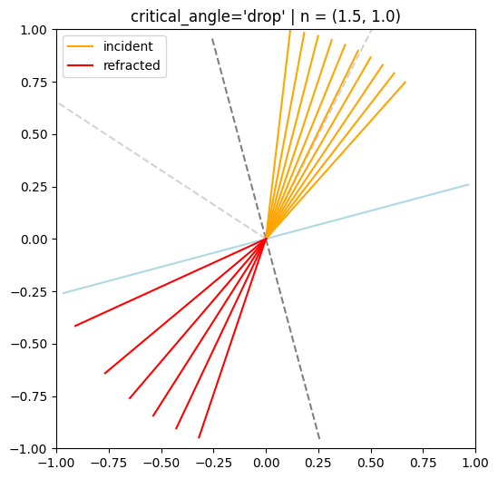

# Reflection and refraction in 2D and 3D

## Reflection in 2D


```python
import matplotlib.pyplot as plt
import torch
import math

from torchlensmaker.core.rot2d import rot2d
from torchlensmaker.core.physics import reflection

from torchlensmaker.testing.basic_transform import basic_transform


def plotv(v, **kwargs):
    plt.plot([0, v[0]], [0, v[1]], **kwargs)
    

def demo_reflection(theta_i: float, normal_angle: float) -> None:
    """
    theta_i: incident angle
    normal_angle: angle of the vector normal to the surface
    """
    
    # surface normal vector
    normal = rot2d(torch.tensor([1., 0.]), normal_angle)

    B = 10
    
    
    # Make some random incident rays around theta_i
    all_theta_i = torch.full((B,), theta_i) + torch.deg2rad(torch.tensor(20.))*torch.rand(B)
    V = torch.zeros(B, 2)
    for i in range(B):
        V[i] = torch.as_tensor(-rot2d(normal, all_theta_i[i]), dtype=torch.float32)

    # Use the same normal for all incident rays
    all_normal = torch.tile(torch.as_tensor(normal, dtype=torch.float32), (B, 1))
    
    # Sanity checks
    assert(torch.allclose(torch.linalg.norm(V, axis=1), torch.tensor(1.0)))
    assert(torch.allclose(torch.linalg.norm(all_normal, axis=1), torch.tensor(1.0)))
    assert( torch.allclose(torch.sum(-V * all_normal, dim=1), torch.cos(all_theta_i)) )
    
    reflected = reflection(V, normal)

    # Verify using the trigonometric version of reflection
    theta_r = torch.arctan2(reflected[:, 1], reflected[:, 0]) - torch.arctan2(all_normal[:, 1], all_normal[:, 0])    
    assert torch.allclose(theta_r, -all_theta_i)
    assert(torch.allclose(torch.linalg.norm(reflected, axis=1), torch.tensor(1.0)))

    # Rendering
    
    # Draw the surface
    plotv(rot2d(normal, math.pi/2), color="lightblue")
    plotv(rot2d(normal, -math.pi/2), color="lightblue")

    # Draw the normal
    plotv(normal, linestyle="--", color="grey")

    for i in range(B):
        # Draw incident light ray
        plotv(-V[i], color="orange")

        # Draw reflected light ray
        plotv(reflected[i], color="red")

    plt.gca().set_xlim([-1, 1])
    plt.gca().set_ylim([-1, 1])
    plt.gca().set_title("Reflection")
    plt.gca().set_aspect("equal")
    plt.show()


plt.figure()
demo_reflection(theta_i = torch.deg2rad(torch.tensor(12.16)), normal_angle=torch.deg2rad(torch.tensor(105.0)))
```


    

    


## Refraction in 2D


```python
import math
import torch

from torchlensmaker.core.physics import refraction

import matplotlib.pyplot as plt
import matplotlib.patches as mpatches
import matplotlib.lines as mlines

import numpy as np

from IPython.display import display, HTML

def plotv(v, **kwargs):
    plt.plot([0, v[0]], [0, v[1]], **kwargs)


def demo_batched_refraction(crit_option, theta_i: float, normal_angle: float, n1, n2):
    """
    Demo / Test of a batched refraction function
    
    theta_i: incident angle
    normal_angle: angle of the vector normal to the surface
    """

    # Critical angle
    if n1 > n2:
        critical_angle = np.arcsin(n2/n1, dtype=np.float32)
        print("Critical angle: {:.2f} deg".format(np.degrees(np.arcsin(n2/n1), dtype=np.float32)))
    else:
        critical_angle = None
        print("No critical angle")
    
    # Surface normal vector
    normal = rot2d(torch.tensor([1., 0.]), normal_angle)
    B = 10
    
    # Make B incident rays +- 20 deg around theta_i
    spread = np.radians(35)
    noise = torch.linspace(-spread/2, spread/2, B)
    all_theta_i = torch.full((B,), theta_i) + noise
    V = torch.zeros(B, 2)
    for i in range(B):
        V[i] = torch.as_tensor(-rot2d(normal, all_theta_i[i]), dtype=torch.float32)

    # Use the same normal for all incident rays
    all_normal = torch.tile(torch.as_tensor(normal, dtype=torch.float32), (B, 1))
    
    # Sanity checks
    assert(np.allclose(np.linalg.norm(V, axis=1), 1.0))
    assert(np.allclose(np.linalg.norm(all_normal, axis=1), 1.0))
    assert( torch.allclose(torch.sum(-V * all_normal, dim=1), torch.cos(all_theta_i)) )

    # Call refraction function
    refracted, _ = refraction(V, all_normal, n1, n2, critical_angle=crit_option)

    # Check for nans
    number_of_nonfinite = (~torch.isfinite(refracted).any(dim=1)).sum()
    if number_of_nonfinite > 0:
        print(f"Warning! {number_of_nonfinite} refracted rays contain nan!")

    if V.shape[0] != refracted.shape[0]:
        print(f"Warning! {V.shape[0]} incident rays but only {refracted.shape[0]} refracted rays.")

    # Rendering
    fig, ax = plt.subplots(1, 1, figsize=(6, 6))
    
    # Draw the surface
    plotv(rot2d(normal, math.pi/2), color="lightblue")
    plotv(rot2d(normal, -math.pi/2), color="lightblue")

    # Draw the normal
    plotv(normal, linestyle="--", color="grey")
    plotv(-normal, linestyle="--", color="grey")

    # Draw critical angle line
    if critical_angle is not None:
        plotv(1.5*rot2d(normal, critical_angle),  linestyle="--", color="lightgrey")
        plotv(1.5*rot2d(normal, -critical_angle),  linestyle="--", color="lightgrey")

    # Draw incident and refracted light rays
    for i in range(V.shape[0]):
        plotv(-V[i], color="orange")

    for i in range(refracted.shape[0]):
        plotv(refracted[i], color="red")

    ax.set_xlim([-1, 1])
    ax.set_ylim([-1, 1])
    title = f"critical_angle='{crit_option}' | n = ({n1}, {n2})"
    ax.set_title(title)
    ax.set_aspect("equal")

    orange_line = mlines.Line2D([], [], color='orange', label='incident')
    red_line = mlines.Line2D([], [], color='red', label='refracted')
    ax.legend(handles=[orange_line, red_line])
    
    display(fig)
    plt.close(fig)


crit_options = [
    'nan',
    'clamp',
    'drop',
]

plt.ioff()

theta_i = np.radians(-39.16, dtype=np.float32)
normal_angle=np.radians(105, dtype=np.float32)
n1, n2 = 1.5, 1.0

for c in crit_options:
    demo_batched_refraction(c, theta_i, normal_angle, n1, n2)
    display(HTML("<hr>"))
```

    Critical angle: 41.81 deg
    Warning! 4 refracted rays contain nan!


    

    


<hr>


    Critical angle: 41.81 deg


    

    


<hr>


    Critical angle: 41.81 deg
    Warning! 10 incident rays but only 6 refracted rays.


    

    


<hr>


## Common setup for 3D demo


```python
import torch
import torchlensmaker as tlm

def deg(x):
    return torch.deg2rad(torch.as_tensor(x))

def make_incident_vectors(a, b, alpha_n, beta_n):
    beta_range = torch.linspace(0, torch.deg2rad(torch.as_tensor(25.0)), beta_n)
    alpha_range = torch.linspace(-torch.pi, torch.pi, alpha_n)

    alpha, beta = map(
        lambda t: t.reshape(-1), torch.meshgrid(alpha_range, beta_range, indexing="xy")
    )

    x = torch.sin(beta) * torch.cos(alpha)
    y = torch.sin(beta) * torch.sin(alpha)
    z = torch.cos(beta)

    Rb = torch.tensor(
        [[1, 0, 0], [0, torch.cos(b), -torch.sin(b)], [0, torch.sin(b), torch.cos(b)]]
    )

    Ra = torch.tensor(
        [[torch.cos(a), 0, torch.sin(a)], [0, 1, 0], [-torch.sin(a), 0, torch.cos(a)]]
    )

    R = torch.mm(Rb, Ra)

    return -torch.mm(torch.column_stack((x, y, z)), R.T)


def demo_light(a, b, alpha_n, beta_n, function):
    # incident rays unit vectors
    incident = make_incident_vectors(a, b, alpha_n, beta_n)

    # colliding with the X=0 plane
    normals = torch.tensor([-1, 0, 0]).expand_as(incident)

    # compute reflection / refraction
    outcident = function(incident, normals)

    if isinstance(outcident, tuple):
        outcident = outcident[0]
    
    # verity unit norm
    assert torch.all(torch.le(torch.abs(torch.linalg.norm(outcident, dim=1) - 1.0), 1e-5))

    surface = tlm.SquarePlane(2.)
    transform = basic_transform(1.0, "origin", [0, 0, 0], [0, 0, 0])(surface)

    # rays to display vectors
    incident_display = torch.column_stack((torch.zeros_like(incident), -incident))
    outcident_display = torch.column_stack((torch.zeros_like(outcident), outcident))

    scene = tlm.viewer.new_scene("3D")
    scene["data"].append(tlm.viewer.render_surfaces([surface], [transform], dim=3))

    scene["data"].append(tlm.viewer.render_rays(
        incident_display[:, :3],
        incident_display[:, :3] + 1 * incident_display[:, 3:6],
        default_color="orange", layer=0))

    scene["data"].append(tlm.viewer.render_rays(outcident_display[:, :3],
                               outcident_display[:, :3] + 1 * outcident_display[:, 3:6],
                          default_color="red", layer=0))

    tlm.viewer.display_scene(scene)
```

## Reflection in 3D


```python
demo_light(deg(-30), deg(-50), 1, 1, tlm.reflection)
demo_light(deg(-30), deg(-50), 1, 30, tlm.reflection)
demo_light(deg(-30), deg(-50), 30, 30, tlm.reflection)
```


<TLMViewer src="./demo_reflection_refraction_files/demo_reflection_refraction_0.json?url" />


<TLMViewer src="./demo_reflection_refraction_files/demo_reflection_refraction_1.json?url" />


<TLMViewer src="./demo_reflection_refraction_files/demo_reflection_refraction_2.json?url" />


## Refraction in 3D


```python
# A single ray entering a denser medium
demo_light(deg(-30), deg(-50), 1, 1, lambda rays, normals: tlm.refraction(rays, normals, n1=1.0, n2=1.5))
```


<TLMViewer src="./demo_reflection_refraction_files/demo_reflection_refraction_3.json?url" />


```python
# a 2D cone of 3D rays entering glass
demo_light(deg(-30), deg(-50), 1, 30, lambda rays, normals: tlm.refraction(rays, normals, n1=1.0, n2=1.5))
```


<TLMViewer src="./demo_reflection_refraction_files/demo_reflection_refraction_4.json?url" />


```python
# a 3D cone of rays entering diamond
demo_light(deg(-30), deg(-50), 30, 30, lambda rays, normals: tlm.refraction(rays, normals, n1=1.0, n2=2.417))
```


<TLMViewer src="./demo_reflection_refraction_files/demo_reflection_refraction_5.json?url" />


```python
# 3D cone of rays exiting from glass to air
# some rays are beyond the critical angle
demo_light(deg(-30), deg(-20), 30, 30, lambda rays, normals: tlm.refraction(rays, normals, n1=1.5, n2=1.0, critical_angle="drop"))
```


<TLMViewer src="./demo_reflection_refraction_files/demo_reflection_refraction_6.json?url" />


```python
# 3D cone of rays exiting from diamond to air
# with total internal reflection
demo_light(deg(-60), deg(-20), 30, 20, lambda rays, normals: tlm.refraction(rays, normals, n1=2.417, n2=1.0, critical_angle="reflect"))
```


<TLMViewer src="./demo_reflection_refraction_files/demo_reflection_refraction_7.json?url" />

