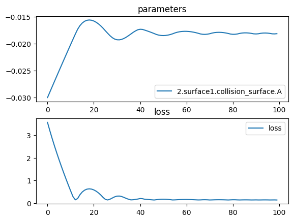

# Biconcave diverging lens


```python
import torch
import torchlensmaker as tlm
import torch.optim as optim

surface = tlm.Parabola(20., A=tlm.parameter(-0.03))

lens = tlm.BiLens(surface, material = 'BK7-nd', inner_thickness=1.0)

optics = tlm.Sequential(
    tlm.PointSourceAtInfinity(15),
    tlm.Gap(10), 
    lens,
    tlm.Gap(-25),
    tlm.FocalPoint(),
)

tlm.show(optics, dim=2)
tlm.show(optics, dim=3)
```


<TLMViewer src="./diverging_lens_files/diverging_lens_0.json?url" />


<TLMViewer src="./diverging_lens_files/diverging_lens_1.json?url" />


```python
# Perform optimization in 2D
tlm.optimize(
    optics,
    optimizer = optim.Adam(optics.parameters(), lr=1e-3),
    sampling = {"base": 10},
    dim = 2,
    num_iter = 100
).plot()

print("Outer thickness:", lens.outer_thickness().item())
print("Inner thickness:", lens.inner_thickness().item())

# Render again after optimization
tlm.show(optics, dim=2)
tlm.show(optics, dim=3)
```

    [  1/100] L= 3.56854 | grad norm= 369.06388878957085
    [  6/100] L= 1.91016 | grad norm= 298.18174189570175
    [ 11/100] L= 0.53224 | grad norm= 264.0099844682016
    [ 16/100] L= 0.48750 | grad norm= 246.54036056854073
    [ 21/100] L= 0.57889 | grad norm= 245.2161542615101
    [ 26/100] L= 0.15801 | grad norm= 51.71364142807669
    [ 31/100] L= 0.30369 | grad norm= 242.19719606104238
    [ 36/100] L= 0.16585 | grad norm= 91.47439709612223
    [ 41/100] L= 0.19743 | grad norm= 250.9868779711143
    [ 46/100] L= 0.14157 | grad norm= 51.29803917204204
    [ 51/100] L= 0.16531 | grad norm= 91.45295261426027
    [ 56/100] L= 0.13856 | grad norm= 51.219303308586426
    [ 61/100] L= 0.15346 | grad norm= 51.60113388223773
    [ 66/100] L= 0.13543 | grad norm= 51.136728733088596
    [ 71/100] L= 0.13395 | grad norm= 90.24171392308634
    [ 76/100] L= 0.14344 | grad norm= 51.34644857614096
    [ 81/100] L= 0.14363 | grad norm= 90.61273979705669
    [ 86/100] L= 0.13907 | grad norm= 51.23271049959221
    [ 91/100] L= 0.13749 | grad norm= 90.37706146667263
    [ 96/100] L= 0.13660 | grad norm= 51.16772510725248
    [100/100] L= 0.13266 | grad norm= 90.19256747293082


    

    


    Outer thickness: 4.610795108462318
    Inner thickness: 1.0


<TLMViewer src="./diverging_lens_files/diverging_lens_2.json?url" />


<TLMViewer src="./diverging_lens_files/diverging_lens_3.json?url" />


```python
part = tlm.export.lens_to_part(lens)
tlm.show_part(part)
```


<em>part display not supported in vitepress</em>

