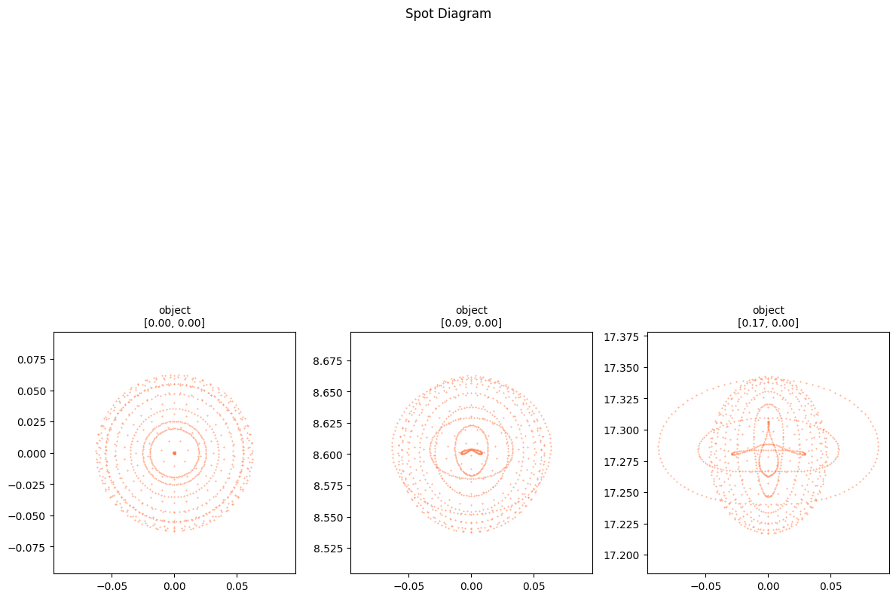

# Index example

This is the example script for the documentation welcome page.


```python
import torchlensmaker as tlm

optics = tlm.Sequential(
    tlm.ObjectAtInfinity(beam_diameter=10, angular_size=20),
    tlm.Gap(15),
    tlm.RefractiveSurface(tlm.Sphere(diameter=25, R=-45.0), material="BK7-nd"),
    tlm.Gap(3),
    tlm.RefractiveSurface(tlm.Sphere(diameter=25, R=tlm.parameter(-20)), material="air"),
    tlm.Gap(100),
    tlm.ImagePlane(50),
)

tlm.optimize(optics, tlm.optim.Adam(optics.parameters(), lr=5e-4), {"base": 10, "object": 5}, 100)

tlm.show2d(optics, title="Landscape Lens")
```

    [  1/100] L= 161.11003 | grad norm= 34027.92131583918
    [  6/100] L= 88.27340 | grad norm= 24824.72953394519
    [ 11/100] L= 39.42606 | grad norm= 16373.459257468054
    [ 16/100] L= 12.24760 | grad norm= 9001.448163484703
    [ 21/100] L= 1.56379 | grad norm= 3071.495725685025
    [ 26/100] L= 0.32416 | grad norm= 1120.9160190576415
    [ 31/100] L= 2.00424 | grad norm= 3485.6156830311957
    [ 36/100] L= 2.87056 | grad norm= 4211.9800829695805
    [ 41/100] L= 2.26533 | grad norm= 3719.6828442996148
    [ 46/100] L= 1.12010 | grad norm= 2535.2484431358866
    [ 51/100] L= 0.34067 | grad norm= 1167.9203858515893
    [ 56/100] L= 0.13163 | grad norm= 13.884879750043755
    [ 61/100] L= 0.20711 | grad norm= 703.0796831027781
    [ 66/100] L= 0.26732 | grad norm= 942.9408677398148
    [ 71/100] L= 0.23172 | grad norm= 809.7331350072187
    [ 76/100] L= 0.16675 | grad norm= 479.496083049014
    [ 81/100] L= 0.13404 | grad norm= 126.23700387577502
    [ 86/100] L= 0.13417 | grad norm= 129.77923694079215
    [ 91/100] L= 0.14051 | grad norm= 241.51225446917633
    [ 96/100] L= 0.13938 | grad norm= 225.6937244656427
    [100/100] L= 0.13535 | grad norm= 156.77843142956834


<TLMViewer src="./index_example_files/index_example_0.json?url" />


```python
import numpy as np

# Spot diaggram at 0, 5 and 10 and 15 degrees incidence angles
sampling = {"base":1000, "object": [
    [np.deg2rad(0), 0.],
    [np.deg2rad(5), 0.],
    [np.deg2rad(10), 0.]]
}

_ = tlm.spot_diagram(optics, sampling, col="object", figsize=(12, 12))
```


    

    

