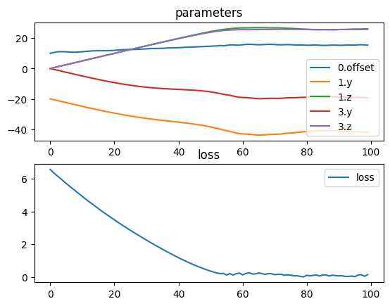

# Inverse kinematics

An example of how tlm can be used to solve a simple 3D inverse kinematics problem.


```python
import torch
import torch.nn as nn
import torchlensmaker as tlm

alpha1 = tlm.parameter(torch.tensor([-20, 0]))
alpha2 = tlm.parameter(torch.tensor([0, 0]))

length1 = tlm.parameter(10.)

class Target(nn.Module):
    def __init__(self, point):
        super().__init__()
        self.point = point

    def forward(self, inputs):
        return inputs.replace(loss=torch.linalg.vector_norm(inputs.target() - self.point))

model = tlm.Sequential(
    tlm.Gap(length1),
    tlm.Turn(alpha1),
    tlm.Gap(5),
    tlm.Turn(alpha2),
    tlm.Gap(5),
    Target(torch.Tensor([20, 6, 6])),
)

for name, param in model.named_parameters():
    print(name, param)

tlm.show3d(model)
```

    0.offset Parameter containing:
    tensor(10., dtype=torch.float64, requires_grad=True)
    1.angles Parameter containing:
    tensor([-20.,   0.], dtype=torch.float64, requires_grad=True)
    3.angles Parameter containing:
    tensor([0., 0.], dtype=torch.float64, requires_grad=True)


<TLMViewer src="./inverse_kinematics_files/inverse_kinematics_0.json?url" />


```python
import torch.optim as optim


tlm.optimize(
    model,
    optimizer = optim.Adam(model.parameters(), lr=0.5),
    sampling = {},
    dim = 3,
    num_iter = 100
).plot()

print("length:", length1.item())
print("alpha1:", torch.rad2deg(alpha1).detach().numpy())
print("alpha2:", torch.rad2deg(alpha2).detach().numpy())

tlm.show3d(model)
```

    [  1/100] L= 11.185 | grad norm= 0.19707500595957908
    [  6/100] L= 10.291 | grad norm= 0.19130326629477112
    [ 11/100] L=  9.400 | grad norm= 0.19511750133378392
    [ 16/100] L=  8.507 | grad norm= 0.19380590657673133
    [ 21/100] L=  7.630 | grad norm= 0.19103869830740494
    [ 26/100] L=  6.783 | grad norm= 0.18626872692635663
    [ 31/100] L=  5.985 | grad norm= 0.1793378932674563
    [ 36/100] L=  5.247 | grad norm= 0.17256171283105406
    [ 41/100] L=  4.577 | grad norm= 0.16331255598895367
    [ 46/100] L=  3.978 | grad norm= 0.15524165391455083
    [ 51/100] L=  3.445 | grad norm= 0.14790782308140438
    [ 56/100] L=  2.967 | grad norm= 0.1399007752653934
    [ 61/100] L=  2.533 | grad norm= 0.1326657820958966
    [ 66/100] L=  2.135 | grad norm= 0.125480686944288
    [ 71/100] L=  1.772 | grad norm= 0.1178524956278153
    [ 76/100] L=  1.448 | grad norm= 0.10867966685167302
    [ 81/100] L=  1.170 | grad norm= 0.099001114048501
    [ 86/100] L=  0.934 | grad norm= 0.09042569526052609
    [ 91/100] L=  0.731 | grad norm= 0.1362221183088638
    [ 96/100] L=  0.548 | grad norm= 0.07648641647408903
    [100/100] L=  0.434 | grad norm= 0.21161901598581193


    

    


    length: 15.608833664024713
    alpha1: [ 1441.45380097 -1853.15448121]
    alpha2: [ 2461.63458763 -1002.7400094 ]


<TLMViewer src="./inverse_kinematics_files/inverse_kinematics_1.json?url" />

