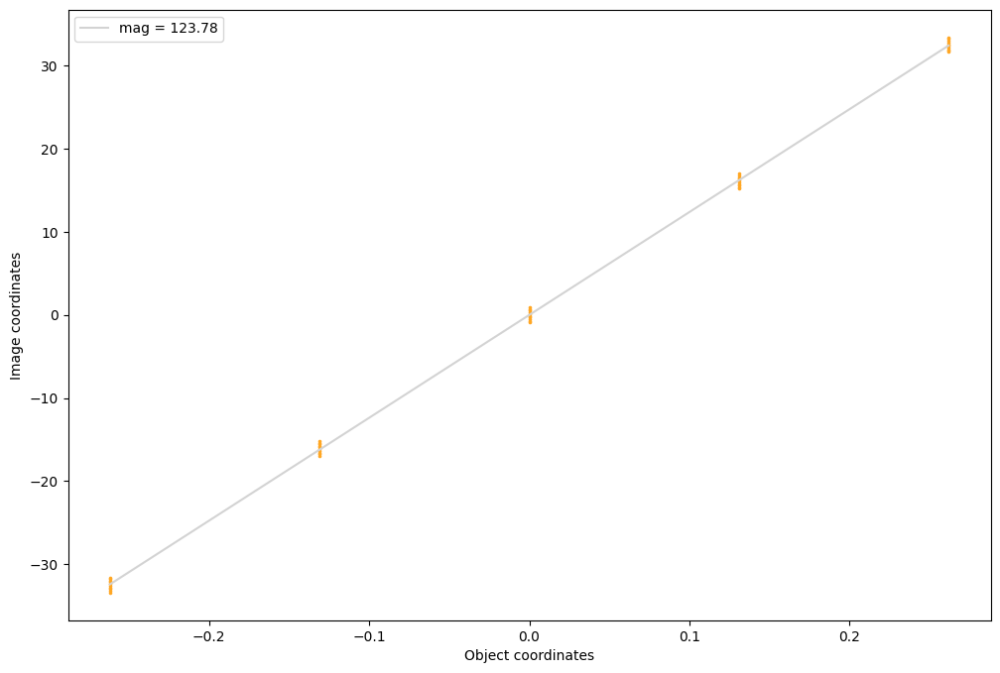
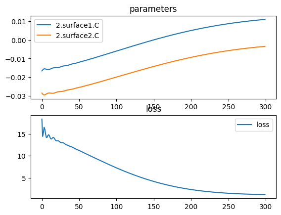
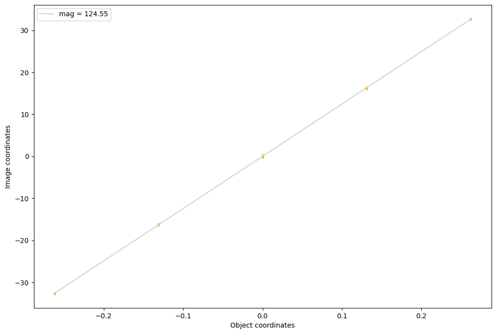
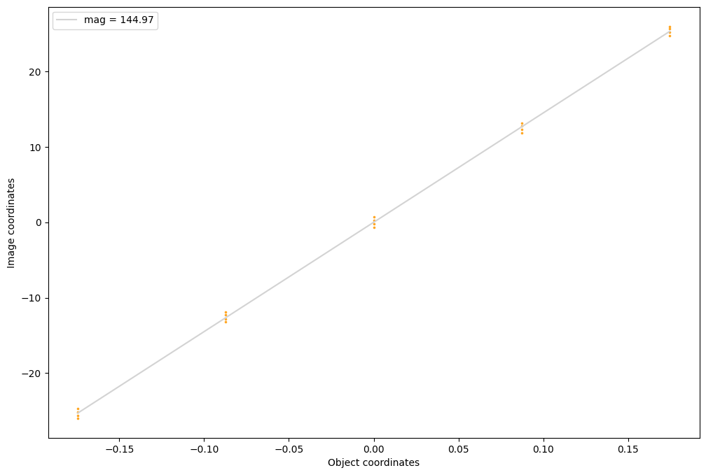
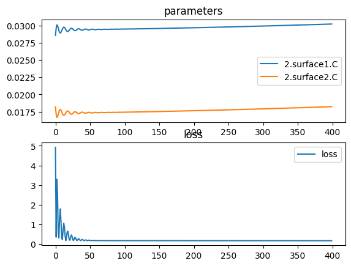
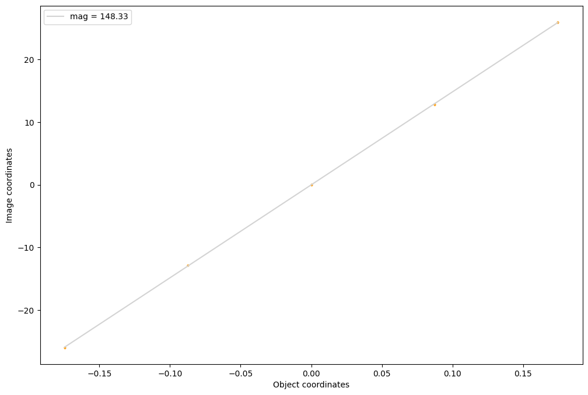

# Landscape Singlet Lens

## Landscape rear configuration


```python
import torch
import torch.nn as nn
import torchlensmaker as tlm
import torch.optim as optim

# Setup two spherical surfaces with initial radiuses
surface1 = tlm.Sphere(diameter=30, R=tlm.parameter(-60))
surface2 = tlm.Sphere(diameter=30, R=tlm.parameter(-35))

lens = tlm.Lens(surface1, surface2, material="BK7-nd", outer_thickness=2.2)

focal = 120.5

# Build the optical sequence
optics = nn.Sequential(
    tlm.ObjectAtInfinity(beam_diameter=8, angular_size=30),
    tlm.Gap(15),
    lens,
    tlm.Gap(focal),
    tlm.ImagePlane(diameter=100, magnification=125.),
)

tlm.show(optics, dim=2, sampling={"base": 10, "object": 5, "sampler": "uniform"})

tlm.plot_magnification(optics, sampling={"base": 10, "object": 5, "sampler": "uniform"})

```


<TLMViewer src="./landscape_singlet_lens_tlmviewer/landscape_singlet_lens_0.json?url" />


    

    


```python
# Find the best parameters for the shapes
tlm.optimize(
    optics,
    optimizer = optim.Adam(optics.parameters(), lr=5e-4),
    sampling = {"base": 10, "object": 5, "sampler": "uniform"},
    dim = 2,
    num_iter = 300,
).plot()

# TODO add regularization: both surfaces positive/negative radius

# TODO always zero out y axis of loss plot

tlm.show(optics, dim=2, sampling={"base": 10, "object": 5, "sampler": "uniform"})
tlm.plot_magnification(optics, sampling={"base": 10, "object": 5, "sampler": "uniform"})
```

    [  1/300] L= 18.313 | grad norm= 9547.97444554985
    [ 16/300] L= 14.169 | grad norm= 3112.259748278441
    [ 31/300] L= 12.796 | grad norm= 1338.994084345671
    [ 46/300] L= 11.587 | grad norm= 662.9023755395433
    [ 61/300] L= 10.399 | grad norm= 520.584518913909
    [ 76/300] L=  9.201 | grad norm= 501.9321161765984
    [ 91/300] L=  8.027 | grad norm= 449.8526490171711
    [106/300] L=  6.924 | grad norm= 417.21388341056706
    [121/300] L=  5.912 | grad norm= 381.43070580904254
    [136/300] L=  5.007 | grad norm= 346.9790137162546
    [151/300] L=  4.216 | grad norm= 313.25834363720287
    [166/300] L=  3.542 | grad norm= 279.7493179377324
    [181/300] L=  2.980 | grad norm= 247.3808406065068
    [196/300] L=  2.522 | grad norm= 216.56992526669632
    [211/300] L=  2.158 | grad norm= 187.6005494136762
    [226/300] L=  1.875 | grad norm= 160.74819737256772
    [241/300] L=  1.660 | grad norm= 136.22895654489346
    [256/300] L=  1.502 | grad norm= 114.17641153962953
    [271/300] L=  1.387 | grad norm= 94.63948903938835
    [286/300] L=  1.306 | grad norm= 77.58786475593018
    [300/300] L=  1.253 | grad norm= 63.82847281920175


    

    


<TLMViewer src="./landscape_singlet_lens_tlmviewer/landscape_singlet_lens_1.json?url" />


    

    


## Landscape front configuration


```python
import torch
import torch.nn as nn
import torchlensmaker as tlm
import torch.optim as optim

# Setup two spherical surfaces with initial radiuses
surface1 = tlm.Sphere(diameter=30, R=tlm.parameter(torch.tensor(35.)))
surface2 = tlm.Sphere(diameter=30, R=tlm.parameter(torch.tensor(55.)))

lens = tlm.Lens(surface1, surface2, material="BK7-nd", outer_thickness=3)

# Build the optical sequence
optics = nn.Sequential(
    tlm.ObjectAtInfinity(beam_diameter=30, angular_size=20),
    tlm.Gap(15),
    lens,
    tlm.Gap(20),
    tlm.Aperture(10),
    tlm.Gap(120),
    tlm.ImagePlane(diameter=120, magnification=None),
)

tlm.show(optics, dim=2, sampling={"base": 10, "object": 5, "sampler": "uniform"})
tlm.plot_magnification(optics, sampling={"base": 10, "object": 5, "sampler": "uniform"})
```


<TLMViewer src="./landscape_singlet_lens_tlmviewer/landscape_singlet_lens_2.json?url" />


    

    


```python
# Find the best parameters for the shapes
tlm.optimize(
    optics,
    optimizer = optim.Adam(optics.parameters(), lr=1e-3),
    sampling = {"base": 10, "object": 5, "sampler": "uniform"},
    dim = 2,
    num_iter = 400,
).plot()


tlm.show(optics, dim=2, sampling={"base": 10, "object": 11, "sampler": "uniform"})
tlm.plot_magnification(optics, sampling={"base": 10, "object": 5, "sampler": "uniform"})
```

    [  1/400] L=  4.922 | grad norm= 7978.879720194092
    [ 21/400] L=  0.210 | grad norm= 640.5632398472783
    [ 41/400] L=  0.204 | grad norm= 574.470725228247
    [ 61/400] L=  0.180 | grad norm= 41.5109437249262
    [ 81/400] L=  0.180 | grad norm= 90.85071809459423
    [101/400] L=  0.180 | grad norm= 33.477644862421606
    [121/400] L=  0.179 | grad norm= 2.7223928000892883
    [141/400] L=  0.179 | grad norm= 5.774101430536686
    [161/400] L=  0.179 | grad norm= 2.945292665294437
    [181/400] L=  0.179 | grad norm= 2.6315284728019637
    [201/400] L=  0.179 | grad norm= 2.595337385185233
    [221/400] L=  0.179 | grad norm= 2.583251843486037
    [241/400] L=  0.178 | grad norm= 2.574672178287673
    [261/400] L=  0.178 | grad norm= 2.5605746457900254
    [281/400] L=  0.178 | grad norm= 2.5479985799450926
    [301/400] L=  0.178 | grad norm= 2.5347417519985442
    [321/400] L=  0.177 | grad norm= 2.521135053812181
    [341/400] L=  0.177 | grad norm= 2.5070706420216466
    [361/400] L=  0.177 | grad norm= 2.4926580828624942
    [381/400] L=  0.177 | grad norm= 2.4778780212885936
    [400/400] L=  0.176 | grad norm= 2.4635113091545415


    

    


<TLMViewer src="./landscape_singlet_lens_tlmviewer/landscape_singlet_lens_3.json?url" />


    

    


```python
part = tlm.export.lens_to_part(lens)
tlm.show_part(part)
```


<em>part display not supported in vitepress</em>

