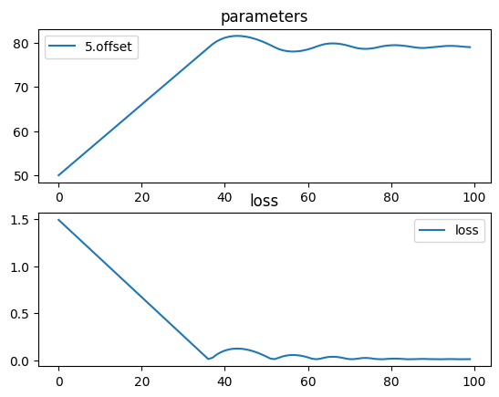

# Moving a lens to focus


```python
import torch
import torchlensmaker as tlm
import torch.optim as optim

surface = tlm.Parabola(diameter=15, A=0.006)

x = tlm.parameter(50)

optics = tlm.Sequential(
    tlm.PointSourceAtInfinity(beam_diameter=18.5),
    tlm.Gap(10),
    tlm.RefractiveSurface(surface, material="BK7-nd", anchors=("origin", "extent")),
    tlm.Gap(2),
    tlm.RefractiveSurface(
        surface, material="air", scale=-1, anchors=("extent", "origin")
    ),
    tlm.Gap(x),
    tlm.FocalPoint(),
)


tlm.show(optics, dim=2)
tlm.show(optics, dim=3)
```


<TLMViewer src="./moving_to_focus_files/moving_to_focus_0.json?url" />


<TLMViewer src="./moving_to_focus_files/moving_to_focus_1.json?url" />


```python
tlm.optimize(
    optics,
    optimizer = optim.Adam(optics.parameters(), lr=.8),
    sampling = {"base": 10},
    dim = 2,
    num_iter = 100
).plot()
```

    [  1/100] L= 1.48989 | grad norm= 0.051246499211843585
    [  6/100] L= 1.28490 | grad norm= 0.051246499211843585
    [ 11/100] L= 1.07991 | grad norm= 0.051246499211843585
    [ 16/100] L= 0.87493 | grad norm= 0.051246499211843585
    [ 21/100] L= 0.66994 | grad norm= 0.051246499211843585
    [ 26/100] L= 0.46496 | grad norm= 0.051246499211843585
    [ 31/100] L= 0.25997 | grad norm= 0.051246499211843585
    [ 36/100] L= 0.05498 | grad norm= 0.051246499211843585
    [ 41/100] L= 0.10326 | grad norm= 0.051246499211843585
    [ 46/100] L= 0.11654 | grad norm= 0.051246499211843585
    [ 51/100] L= 0.03984 | grad norm= 0.051246499211843585
    [ 56/100] L= 0.05203 | grad norm= 0.051246499211843585
    [ 61/100] L= 0.03155 | grad norm= 0.051246499211843585
    [ 66/100] L= 0.03588 | grad norm= 0.051246499211843585
    [ 71/100] L= 0.01273 | grad norm= 0.025671685539087226
    [ 76/100] L= 0.02253 | grad norm= 0.051246499211843585
    [ 81/100] L= 0.01718 | grad norm= 0.025671685539087226
    [ 86/100] L= 0.01243 | grad norm= 0.006342011105652322
    [ 91/100] L= 0.01288 | grad norm= 0.006342011105652322
    [ 96/100] L= 0.01344 | grad norm= 0.025671685539087226
    [100/100] L= 0.01274 | grad norm= 0.006342011105652322


    

    


```python
tlm.show(optics, dim=2)
```


<TLMViewer src="./moving_to_focus_files/moving_to_focus_2.json?url" />

