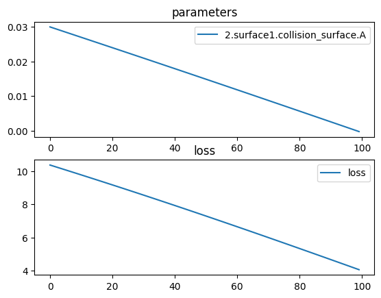

# Planoconvex spherical lens


```python
import torch
import torch.nn as nn
import torchlensmaker as tlm
import torch.optim as optim

surface = tlm.Parabola(diameter=15, A=tlm.parameter(0.03))

lens = tlm.PlanoLens(surface, material = 'BK7-nd', outer_thickness=1.0, reverse=True)

optics = nn.Sequential(
    tlm.PointSourceAtInfinity(beam_diameter=18.5),
    tlm.Gap(10),
    lens,
    tlm.Gap(50),
    tlm.FocalPoint(),
)

tlm.show(optics, dim=2)
tlm.show(optics, dim=3)
```


<TLMViewer src="./planoconvex_sphere_tlmviewer/planoconvex_sphere_0.json" />


<TLMViewer src="./planoconvex_sphere_tlmviewer/planoconvex_sphere_1.json" />


```python
tlm.optimize(
    optics,
    optimizer = optim.Adam(optics.parameters(), lr=3e-4),
    sampling = {"base": 10},
    dim = 2,
    num_iter = 100
).plot()

print("Final parabola parameter:", surface.A.item())
print("Outer thickness:", lens.outer_thickness())
print("Inner thickness:", lens.inner_thickness())
```

    [  1/100] L= 10.373 | grad norm= 196.33741603026212
    [  6/100] L= 10.077 | grad norm= 197.83028078672285
    [ 11/100] L=  9.778 | grad norm= 199.28785472302687
    [ 16/100] L=  9.477 | grad norm= 200.7086230343121
    [ 21/100] L=  9.173 | grad norm= 202.09085631779143
    [ 26/100] L=  8.866 | grad norm= 203.4326108056965
    [ 31/100] L=  8.557 | grad norm= 204.73175176408745
    [ 36/100] L=  8.245 | grad norm= 205.98599311084865
    [ 41/100] L=  7.930 | grad norm= 207.1929453403305
    [ 46/100] L=  7.613 | grad norm= 208.3501651435576
    [ 51/100] L=  7.294 | grad norm= 209.45520238779727
    [ 56/100] L=  6.972 | grad norm= 210.50564230482357
    [ 61/100] L=  6.647 | grad norm= 211.4991423089457
    [ 66/100] L=  6.321 | grad norm= 212.43346374931298
    [ 71/100] L=  5.993 | grad norm= 213.3064992518033
    [ 76/100] L=  5.663 | grad norm= 214.11629633187027
    [ 81/100] L=  5.331 | grad norm= 214.86107783162248
    [ 86/100] L=  4.997 | grad norm= 215.53925956202787
    [ 91/100] L=  4.663 | grad norm= 216.1494653725265
    [ 96/100] L=  4.327 | grad norm= 216.69053974909636
    [100/100] L=  4.058 | grad norm= 217.07299523664338


    

    


    Final parabola parameter: -0.0005561670680468301
    Outer thickness: tensor(1., dtype=torch.float64, grad_fn=<LinalgVectorNormBackward0>)
    Inner thickness: tensor(1.0313, dtype=torch.float64, grad_fn=<LinalgVectorNormBackward0>)


```python
tlm.show(optics, dim=2, end=60)
tlm.show(optics, dim=3, end=60)
```


<TLMViewer src="./planoconvex_sphere_tlmviewer/planoconvex_sphere_2.json" />


<TLMViewer src="./planoconvex_sphere_tlmviewer/planoconvex_sphere_3.json" />


```python
part = tlm.export.lens_to_part(lens)
tlm.show_part(part)
```


<em>part display not supported in vitepress</em>

