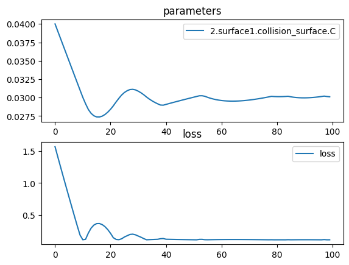

# Biconvex Spherical Lens


```python
import torch
import torch.nn as nn
import torch.optim as optim
import torchlensmaker as tlm

surface = tlm.Sphere(diameter=15, R=tlm.parameter(25))
lens = tlm.BiLens(surface, material = 'BK7-nd', outer_thickness=1.5)

optics = nn.Sequential(
    tlm.PointSourceAtInfinity(beam_diameter=18.5),
    tlm.Gap(10),
    lens,
    tlm.Gap(30),
    tlm.FocalPoint(),
)

for name, p in optics.named_parameters():
    print(name, p)

tlm.show(optics, dim=2)
tlm.show(optics, dim=3, sampling={"base": 100})
```

    2.surface1.C Parameter containing:
    tensor(0.0400, dtype=torch.float64, requires_grad=True)


<TLMViewer src="./plot_magnification_tlmviewer/plot_magnification_0.json?url" />


<TLMViewer src="./plot_magnification_tlmviewer/plot_magnification_1.json?url" />


```python
tlm.optimize(
    optics,
    optimizer = optim.Adam(optics.parameters(), lr=1e-3),
    sampling = {"base": 10},
    dim = 2,
    num_iter = 100
).plot()

print("Final arc radius:", surface.radius())
print("Outer thickness:", lens.outer_thickness())
print("Inner thickness:", lens.inner_thickness())

tlm.show(optics, dim=2)
tlm.show(optics, dim=3, sampling={"base": 100})
```

    [  1/100] L=  1.569 | grad norm= 161.9366932906055
    [  6/100] L=  0.782 | grad norm= 155.031634717428
    [ 11/100] L=  0.109 | grad norm= 8.59728848028433
    [ 16/100] L=  0.362 | grad norm= 146.7432224095572
    [ 21/100] L=  0.210 | grad norm= 147.74137333402
    [ 26/100] L=  0.152 | grad norm= 82.59451332417011
    [ 31/100] L=  0.167 | grad norm= 82.77446890236837
    [ 36/100] L=  0.113 | grad norm= 8.862112336619418
    [ 41/100] L=  0.117 | grad norm= 9.115631464186867
    [ 46/100] L=  0.113 | grad norm= 8.847457422109148
    [ 51/100] L=  0.109 | grad norm= 8.586596272281758
    [ 56/100] L=  0.109 | grad norm= 8.599382275065631
    [ 61/100] L=  0.112 | grad norm= 8.83414124398887
    [ 66/100] L=  0.113 | grad norm= 8.877469060183468
    [ 71/100] L=  0.112 | grad norm= 8.800366538928447
    [ 76/100] L=  0.109 | grad norm= 8.644746370611514
    [ 81/100] L=  0.108 | grad norm= 8.54647374100854
    [ 86/100] L=  0.108 | grad norm= 8.560481822989336
    [ 91/100] L=  0.109 | grad norm= 8.637634069506674
    [ 96/100] L=  0.108 | grad norm= 8.564525030391389
    [100/100] L=  0.108 | grad norm= 8.556902462663446


    

    


    Final arc radius: 33.23939861777343
    Outer thickness: tensor(1.5000, dtype=torch.float64, grad_fn=<LinalgVectorNormBackward0>)
    Inner thickness: tensor(3.2144, dtype=torch.float64, grad_fn=<LinalgVectorNormBackward0>)


<TLMViewer src="./plot_magnification_tlmviewer/plot_magnification_2.json?url" />


<TLMViewer src="./plot_magnification_tlmviewer/plot_magnification_3.json?url" />


```python
part = tlm.export.lens_to_part(lens)
tlm.show_part(part)
```


<em>part display not supported in vitepress</em>

