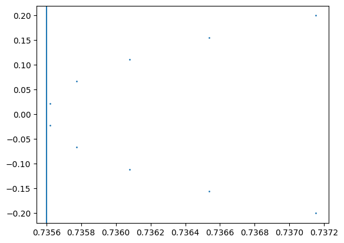

# Principal plane

## Definitions

definition of the equivalent refracting locus, the principal plane and the principal point
definition of back / front


computing a principal plane when:
* there is no defined light source nor fixed image plane
* focal length is not known (because the system doesn't have any paraxial information)

Computing the intersection of input and output rays to a sequential system is easy. The difficult part is that the principal point is defined as the limit of that intersection as the incident ray height goes to zero. The intersection itself is undefined at zero.

To do this, we fit a parabola $X = AY^2 + C$ to intersection points computed for rays with a low height value. The chosen height value should be as close as possible to the principal axis, but not so small that numerical precision issues start to arise.

Then, the principal point is the vertex of the best fit parabola: $X = C$.


## Splitting the chain

Problem:

how to compute the front principal point? Need a way to "invert" an optical sequence.
* Invert the optical sequence
* Keep the kinematic sequence the same

Insight: the kinematic sequence doesn't depend on the optical one
but the optical sequence depends on the kinematic one, because surface positions / tf are on the kinematic chain

Idea: evaluate the kinematic chain first, this creates a realization of the chain, so positions are known
Can now evaluate the optical chain, forward or backwards

splitting the tf and optics chain


kinematic data = just tf chain
kinematic elements = operate on kinematic data

optical data = just ray info
optical elements = operate on optical data, also gets tf info somehow

collision surface?


1. evaluate kinematic model with forward_tree or similar
2. evaluate optics model, giving realized tf

> how to associate realized tf to optical elements?

using forward tree, I can associate the outputs of a sequential of kinematic element to module in the sequence
but need to associate to modules of another sequence, the optical sequence

indexing probably the best: straightforward, reversible

optical data contains static info on the realized tf chain: a list of length N
what if we have a non linear tf tree, like a fork?

> general case

first pass: evaluate kinematic model
get a realized tf tree, bound to variables
second pass: evaluate the optical model, passing ray data and needed tf data

> sequential special case

first pass: evaluate kinematic model, results in a list of list of tf, length N
the realized tf tree is stored in a list (list of list to handle absolute transform resets)
second pass: evaluate the optical model, passing ray data and tf list elements


Kinematic Elements:
def forward(chain: KinematicChain) -> KinematicChain

Optical Element:
def forward(rays: RayBundle, tf: TransformBase) -> RayBundle

how to do collision surface?
one module should be able to act as both kinematic and optical
forward_kinematic()
forward_optical()

collision surface actually output two tf:
* the one that applies to the held surface
* the one that applis to the next element in the kinematic chain

or fully split collision surface:

SurfaceAnchor: KinematicElement
    def forward(chain: KinematicChain) -> tuple[KinematicChain, KinematicChain]

RefractiveOpticalSurface: OpticalElement
    def forward(rays: RaysBundle, tf: TransformBase) -> RayBundle
    
class RefractiveSurface:
    def init:
        self.anchor_surface
        self.collision_surface
        self.material
    
    def sequential(inputs):
        # kinematic step:
            # compute tf using anchor surface
        # optical step:
            # compute collisions using collision surface at tf
            # compute refraction
        return outputs

        # split sequential() into kinematic step and optical step?
        # outputs of the kinematic step are given as input to the optical step

        # this enables reverse optical mode:
        #    call sequential kinematic steps in normal order
        #    store outputs indexed by the module
        #    call optical steps in reverse order, getting the correct tf inputs for each optical step


in general: elements forward functions do what makes sense
sequential element figures it out to make sequential mode convinient / or elements have a sequential() version of their forward function

> how to use mixed style elements into a sequential?

sequential can have logic:
    if (kinematic element)
        give it tf
    if (optical)
        give it rays
    if (mixed)
        give it both

Sequential elements can contribute to either or both chains

complete model is always a kinematic model and an optical model

inverting = invert the optical model, keep the kinematic model


"Main loop":
    Forward kinematic chain
    -> Obtain a tf for each element of the optical chain
    Forward optical chain

A mixed element is an alias constructor for putting an element on both chains

sequential syntax returns a SequentialModel
that's made of a kinematic and optical model

tlm.RefractiveSurface(...)  # returns a kinematic and an optical model


class Sequential:
    kinematic model: Sequential of KinematicElement
    optical model: Sequential of OpticalElement
    # how to give the right tf to each optical element?
    # both have same length, use index
    # or optical element is stored next to an index of corresponding kinematic element

# how to do recursive sequential?


```python
import torch
import torchlensmaker as tlm

doublet = tlm.Sequential(
    tlm.RefractiveSurface(tlm.Sphere(4.0, C=0.135327), material=tlm.NonDispersiveMaterial(1.517)),
    tlm.Gap(1.05),
    tlm.RefractiveSurface(tlm.Sphere(4.0, C=-0.19311), material=tlm.NonDispersiveMaterial(1.649)),
    tlm.Gap(0.4),
    tlm.RefractiveSurface(tlm.Sphere(4.0, C=-0.06164), material="air"),
)

optics = tlm.Sequential(
    tlm.PointSourceAtInfinity(3.0),
    tlm.Gap(2),
    doublet,
    #tlm.Gap(2), # use an element for end=?
)

tlm.show(optics, dim=2, controls={"show_optical_axis": True}, end=2)


def back_principal_point(optics):
    """
    Back principal point of a sequential system
    
    Returns a coordinate along the optical axis (the X axis in TLM convention),
    expressed in the sequential system kinematic frame
    """
    
    ...


raw_inputs = tlm.default_input(dim=2, dtype=torch.float64, sampling={"base": 10})

# diameter of the sequential system
diameter = 4.0

inputs = tlm.PointSourceAtInfinity(diameter / 10)(raw_inputs)
print(inputs.P.shape)

outputs = doublet(inputs)
print(outputs.P.shape)

print(outputs)
```


<TLMViewer src="./principal_plane_files/principal_plane_0.json?url" />


    torch.Size([10, 2])
    torch.Size([10, 2])
    OpticalData(dim=2, dtype=torch.float64, sampling={'base': DenseSampler(size=10)}, dfk=tensor([[1.0000, 0.0000, 1.4500],
            [0.0000, 1.0000, 0.0000],
            [0.0000, 0.0000, 1.0000]], dtype=torch.float64), ifk=tensor([[ 1.0000,  0.0000, -1.4500],
            [ 0.0000,  1.0000,  0.0000],
            [ 0.0000,  0.0000,  1.0000]], dtype=torch.float64), P=tensor([[ 1.4489, -0.1881],
            [ 1.4493, -0.1463],
            [ 1.4497, -0.1045],
            [ 1.4499, -0.0627],
            [ 1.4500, -0.0209],
            [ 1.4500,  0.0209],
            [ 1.4499,  0.0627],
            [ 1.4497,  0.1045],
            [ 1.4493,  0.1463],
            [ 1.4489,  0.1881]], dtype=torch.float64), V=tensor([[ 0.9999,  0.0167],
            [ 0.9999,  0.0130],
            [ 1.0000,  0.0093],
            [ 1.0000,  0.0056],
            [ 1.0000,  0.0019],
            [ 1.0000, -0.0019],
            [ 1.0000, -0.0056],
            [ 1.0000, -0.0093],
            [ 0.9999, -0.0130],
            [ 0.9999, -0.0167]], dtype=torch.float64), rays_base=tensor([-0.2000, -0.1556, -0.1111, -0.0667, -0.0222,  0.0222,  0.0667,  0.1111,
             0.1556,  0.2000], dtype=torch.float64), rays_object=None, rays_image=None, rays_wavelength=None, var_base=tensor([-0.2000, -0.1556, -0.1111, -0.0667, -0.0222,  0.0222,  0.0667,  0.1111,
             0.1556,  0.2000], dtype=torch.float64), var_object=None, var_wavelength=None, material=<torchlensmaker.materials.NonDispersiveMaterial object at 0x7fc2fbbca6f0>, loss=tensor(0., dtype=torch.float64))


```python
Py = inputs.P[:, 1]
Qy = outputs.P[:, 1]
Wy = outputs.V[:, 1]


s = (Py - Qy) / Wy

# collision points
Q = outputs.P
W = outputs.V

CP = Q + s.unsqueeze(-1).expand_as(W)*W

import matplotlib.pyplot as plt

plt.scatter(CP[:, 0], CP[:, 1], s=1.0)
#plt.gca().set_aspect("equal")

N = Q.shape[0]

x = CP[:, 0]
y = CP[:, 1]

sx = x.sum()
sy4 = (y**4).sum()
sy2 = (y**2).sum()
sy2x = (y**2 * x).sum()

num = sx * (sy4 / sy2) - sy2x
denom = N * (sy4 / sy2) - sy2

C = num / denom

plt.axvline(C)
```


    <matplotlib.lines.Line2D at 0x7fc2d29205f0>


    

    

