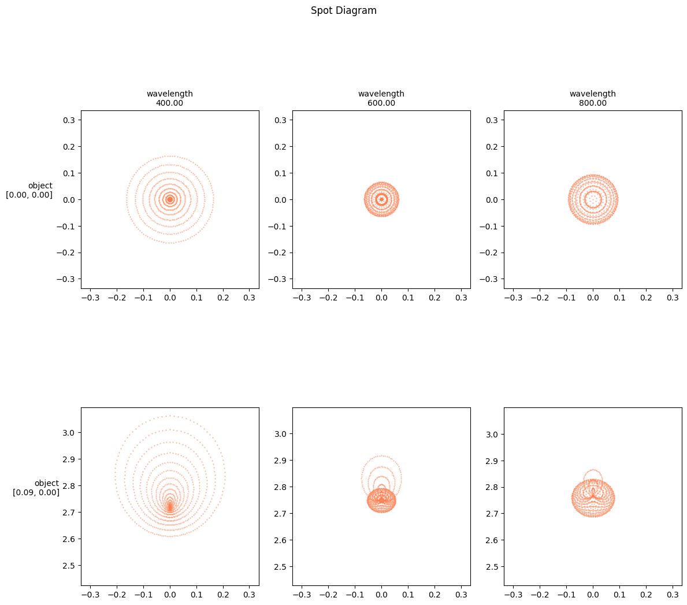
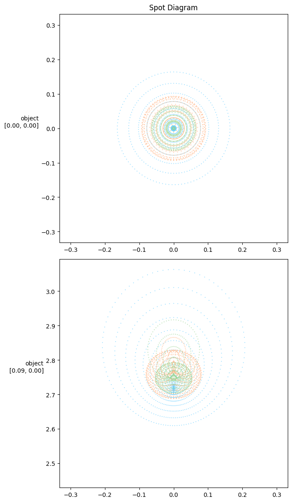

# Spot diagram


```python
from IPython.display import clear_output
clear_output()
```


```python
import torch
import torch.nn as nn
import torch.optim as optim
import torchlensmaker as tlm
import numpy as np
```

Let's define a simple optical model that we'll use to demonstrate various ways of producing spot diagrams.


```python
surface = tlm.Sphere(diameter=15, R=tlm.parameter(32.6656))
lens = tlm.BiLens(surface, material="BK7", outer_thickness=1.5)

optics = nn.Sequential(
    tlm.ObjectAtInfinity(beam_diameter=10, angular_size=5.),
    tlm.Wavelength(400, 800),
    tlm.Gap(1),
    lens,
    tlm.Gap(30),
    tlm.ImagePlane(15),
)
```

## Spot diagram with rows and cols

The row and col arguments control the sampling dimension thats use to layout the rows and columns of the diagram. `row='object'` and `col='wavelength'` is a typical choice.


```python
clear_output()
tlm.show2d(optics, sampling={"base": tlm.sampling.dense(10), "object": tlm.sampling.dense(3), "wavelength": 3})
tlm.show3d(optics, sampling={"base": 100, "object": [[np.deg2rad(0), 0.], [np.deg2rad(5), 0.]], "wavelength": 3}, end=100)
```


<TLMViewer src="./spot_diagram_files/spot_diagram_0.json?url" />


<TLMViewer src="./spot_diagram_files/spot_diagram_1.json?url" />


```python
sampling = {"object": [[np.deg2rad(0), 0.], [np.deg2rad(5), 0.]], "wavelength": 3}
f, _ = tlm.spot_diagram(optics, sampling | {"base":1000}, row="object", col="wavelength", figsize=(12, 12))
```


    

    


## Spot diagram with color_dim

If either `row` or `col` is `None`, then there will be only one row or column containing every ray sample. Still, the `color_dim` argument can be used to color points by one dimension.


```python
sampling = {"object": [[np.deg2rad(0), 0.], [np.deg2rad(5), 0.]], "wavelength": 3}
f, _ = tlm.spot_diagram(optics, sampling | {"base":1000}, row="object", col=None, color_dim="wavelength", figsize=(12, 12))
```


    

    


```python
# TODO object coordinates are given as radian here
# but as degrees in light source init / tlm.Rotate

# if you give exact values in a sampling dict
# it becomes dimension specific

```
