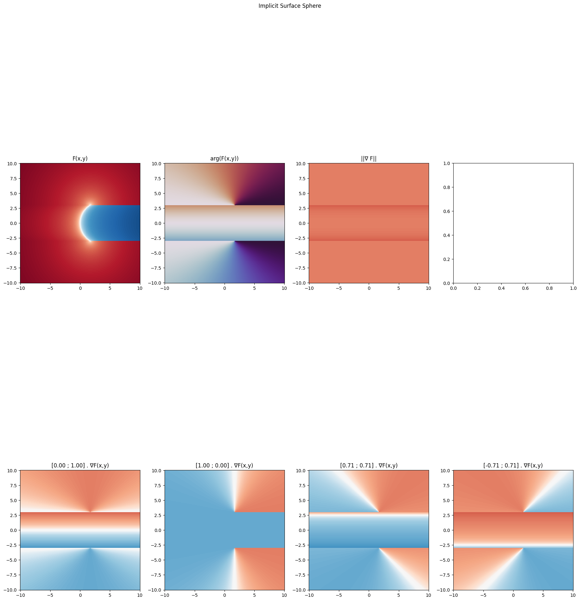

# Surfaces SDF


```python
import numpy as np
import matplotlib.pyplot as plt
import matplotlib.colors as colors
import math
import torch
import torchlensmaker as tlm

from torch.nn.functional import normalize

import matplotlib as mpl

Tensor = torch.Tensor

# idea: Q =) F(P+tV) is a 1D function, plot it
# also plot Q' = V . grad F
# plot iterated t values


# 12 plots
# for each surface class
# plot F(x,y) : check finite everywhere
# plot grad_x F (x,y)  : check finite everywhere
# plot grad_y F (x,y)  : check finite everywhere
# plot norm(grad): check non zero
# for few values of V, plot F_grad . V
# V: (0,1), (1,0), (a,a)
#    (0, -1), (-1, 0), (-a, a), (a, -a), (-a, -a)

# check that init_t for any (P,V) does not result in F_grad . V = 0

# Create the input grid tensor
def sample_grid(xlim, ylim, N):
    x = np.linspace(xlim[0], xlim[1], N)
    y = np.linspace(ylim[0], ylim[1], N)
    X, Y = np.meshgrid(x, y)
    return X, Y, torch.tensor(np.stack((X, Y), axis=-1).reshape(-1, 2))

def surface_sdf_analysis(surface, xlim=(-10, 10), ylim=(-10, 10)):
    "Make analysis plots of f and f_grad for an implicit surface"

    # 8 subplots
    f, axes = plt.subplots(2, 4, figsize=(18, 24))

    # F, grad_x F, grad_y F, ||grad F||
    (ax_f, ax_grad_arg, ax_grad_norm, _) = axes[0]

    # axes for (F_grad . V) for 8 values of V
    axes_V = axes.flat[4:9]

    # Create the input grid tensor
    X, Y, points = sample_grid(xlim, ylim, 250)

    # The 4 V values of interest
    sq2 = math.sqrt(2) / 2
    Vs = torch.tensor([
        [0, 1],
        [1, 0],
        [sq2, sq2],
        [-sq2, sq2],
    ])
    
    # Evaluate everything
    F = surface.f(points)
    F_grad = surface.f_grad(points)
    Q_prime = [
        torch.sum(F_grad * V.expand_as(F_grad), dim=1)
        for V in Vs]

    # Plot
    norm = colors.SymLogNorm(linthresh=0.05, linscale=0.05, vmin=-20.0, vmax=20.0, base=10)
    
    ax_f.pcolormesh(X, Y, F.reshape(X.shape), cmap='RdBu_r', norm=norm, shading='auto')
    ax_f.set_title("F(x,y)")

    ax_grad_arg.pcolormesh(X, Y, np.arctan2(F_grad[:, 1], F_grad[:, 0]).reshape(X.shape), cmap='twilight')
    ax_grad_arg.set_title("arg(F(x,y))")

    ax_grad_norm.pcolormesh(X, Y, torch.linalg.norm(F_grad, dim=1).reshape(X.shape), cmap='RdBu_r', norm=norm, shading='auto')
    ax_grad_norm.set_title("||∇ F||")

    for i in range(len(Vs)):
        # F_grad . V
        axes_V[i].pcolormesh(X, Y, Q_prime[i].reshape(X.shape), cmap='RdBu_r', norm=norm, shading='auto')
        axes_V[i].set_title(f"[{Vs[i][0]:.2f} ; {Vs[i][1]:.2f}] . ∇F(x,y)")
    
    for ax in axes.flat:
        ax.set_aspect("equal")
    f.tight_layout()
    f.suptitle(f"Implicit Surface {surface.__class__.__name__}")
    
    return f, axes

f, _ = surface_sdf_analysis(tlm.Sphere(6, 3.5))
#f.savefig("sphere.png")

#F, _ = surface_sdf_analysis(tlm.DiameterBandSurface(1.0, 2.0))
#F, _ = surface_sdf_analysis(tlm.DiameterBandSurfaceSq(1.0, 2.0))


```

    /tmp/ipykernel_31303/2810113602.py:75: DeprecationWarning: __array_wrap__ must accept context and return_scalar arguments (positionally) in the future. (Deprecated NumPy 2.0)
      ax_grad_arg.pcolormesh(X, Y, np.arctan2(F_grad[:, 1], F_grad[:, 0]).reshape(X.shape), cmap='twilight')


    

    

