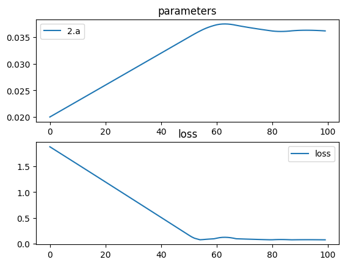

# Biconvex Parabolic Lens (no lens class)


```python
import torch
import torch.nn as nn
import torchlensmaker as tlm
import torch.optim as optim

surface = tlm.surfaces.Parabola(diameter=15, a=tlm.parameter(0.02)) # y = a*x^2

optics = nn.Sequential(
    tlm.PointSourceAtInfinity(beam_diameter=18.5),
    tlm.Gap(10),
    tlm.RefractiveSurface(surface, material="water-nd", anchors=("origin", "extent")),
    tlm.Gap(2),
    tlm.RefractiveSurface(
        surface, material="water-nd", scale=-1, anchors=("extent", "origin")
    ),
    tlm.Gap(50),
    tlm.FocalPoint(),
)

tlm.show(optics, dim=2)
tlm.show(optics, dim=3)
```


<div data-jp-suppress-context-menu id='tlmviewer-a5010b5a' class='tlmviewer' style='width: 100%; aspect-ratio: 16 / 9;'></div><script type='module'>async function importtlm() {
    try {
        return await import("/tlmviewer.js");
    } catch (error) {
        console.log("error", error);
        return await import("/files/test_notebooks/tlmviewer.js");
    }
}

const module = await importtlm();
const tlmviewer = module.tlmviewer;

const data = '{"mode": "2D", "camera": "XY", "data": [{"type": "surfaces", "data": [{"matrix": [[1.0, 0.0, 10.0], [0.0, 1.0, 0.0], [0.0, 0.0, 1.0]], "samples": [[1.125, -7.5], [1.10238755, -7.4242425], [1.08000457, -7.34848499], [1.05785131, -7.27272749], [1.03592741, -7.19696951], [1.01423323, -7.12121201], [0.99276853, -7.0454545], [0.97153348, -6.969697], [0.95052803, -6.8939395], [0.92975211, -6.81818199], [0.90920562, -6.74242401], [0.88888884, -6.66666651], [0.86880165, -6.590909], [0.84894401, -6.5151515], [0.82931584, -6.439394], [0.80991733, -6.36363649], [0.79074842, -6.28787899], [0.77180892, -6.21212101], [0.75309914, -6.13636351], [0.7346189, -6.060606], [0.71636826, -5.9848485], [0.69834709, -5.909091], [0.68055558, -5.83333349], [0.66299355, -5.75757551], [0.64566106, -5.68181801], [0.62855828, -5.6060605], [0.61168504, -5.530303], [0.59504128, -5.4545455], [0.57862717, -5.37878799], [0.56244254, -5.30303001], [0.54648751, -5.22727251], [0.53076214, -5.15151501], [0.51526624, -5.0757575], [0.5, -5.0], [0.48496327, -4.9242425], [0.47015613, -4.84848499], [0.45557845, -4.77272701], [0.44123045, -4.69696951], [0.42711198, -4.62121201], [0.41322312, -4.5454545], [0.39956382, -4.469697], [0.38613406, -4.3939395], [0.37293383, -4.31818151], [0.35996321, -4.24242401], [0.34722221, -4.16666651], [0.33471072, -4.090909], [0.32242882, -4.0151515], [0.31037647, -3.93939376], [0.29855368, -3.86363626], [0.28696051, -3.78787875], [0.27559689, -3.71212125], [0.26446283, -3.63636374], [0.25355834, -3.56060624], [0.24288337, -3.4848485], [0.23243803, -3.409091], [0.22222225, -3.33333349], [0.212236, -3.25757575], [0.20247933, -3.18181825], [0.19295226, -3.10606074], [0.18365473, -3.030303], [0.17458677, -2.9545455], [0.1657484, -2.87878799], [0.1571396, -2.80303049], [0.14876032, -2.72727275], [0.14061067, -2.65151525], [0.13269056, -2.57575774], [0.125, -2.5], [0.11753903, -2.4242425], [0.11030763, -2.34848499], [0.10330578, -2.27272725], [0.09653351, -2.19696975], [0.08999082, -2.12121224], [0.08367768, -2.0454545], [0.07759412, -1.969697], [0.07174014, -1.8939395], [0.06611571, -1.81818187], [0.06072084, -1.74242425], [0.05555556, -1.66666675], [0.05061983, -1.59090912], [0.04591368, -1.5151515], [0.0414371, -1.439394], [0.03719008, -1.36363637], [0.03317264, -1.28787887], [0.02938476, -1.21212125], [0.02582644, -1.13636363], [0.02249771, -1.06060612], [0.01939853, -0.9848485], [0.01652893, -0.90909094], [0.01388889, -0.83333337], [0.01147842, -0.75757575], [0.00929752, -0.68181819], [0.00734619, -0.60606062], [0.00562443, -0.53030306], [0.00413223, -0.45454547], [0.00286961, -0.37878788], [0.00183655, -0.30303031], [0.00103306, -0.22727273], [0.00045914, -0.15151516], [0.00011478, -0.07575758], [0.0, 0.0], [0.00011478, 0.07575758], [0.00045914, 0.15151516], [0.00103306, 0.22727273], [0.00183655, 0.30303031], [0.00286961, 0.37878788], [0.00413223, 0.45454547], [0.00562443, 0.53030306], [0.00734619, 0.60606062], [0.00929752, 0.68181819], [0.01147842, 0.75757575], [0.01388889, 0.83333337], [0.01652893, 0.90909094], [0.01939853, 0.9848485], [0.02249771, 1.06060612], [0.02582644, 1.13636363], [0.02938476, 1.21212125], [0.03317264, 1.28787887], [0.03719008, 1.36363637], [0.0414371, 1.439394], [0.04591368, 1.5151515], [0.05061983, 1.59090912], [0.05555556, 1.66666675], [0.06072084, 1.74242425], [0.06611571, 1.81818187], [0.07174014, 1.8939395], [0.07759412, 1.969697], [0.08367768, 2.0454545], [0.08999082, 2.12121224], [0.09653351, 2.19696975], [0.10330578, 2.27272725], [0.11030763, 2.34848499], [0.11753903, 2.4242425], [0.125, 2.5], [0.13269056, 2.57575774], [0.14061067, 2.65151525], [0.14876032, 2.72727275], [0.1571396, 2.80303049], [0.1657484, 2.87878799], [0.17458677, 2.9545455], [0.18365473, 3.030303], [0.19295226, 3.10606074], [0.20247933, 3.18181825], [0.212236, 3.25757575], [0.22222225, 3.33333349], [0.23243803, 3.409091], [0.24288337, 3.4848485], [0.25355834, 3.56060624], [0.26446283, 3.63636374], [0.27559689, 3.71212125], [0.28696051, 3.78787875], [0.29855368, 3.86363626], [0.31037647, 3.93939376], [0.32242882, 4.0151515], [0.33471072, 4.090909], [0.34722221, 4.16666651], [0.35996321, 4.24242401], [0.37293383, 4.31818151], [0.38613406, 4.3939395], [0.39956382, 4.469697], [0.41322312, 4.5454545], [0.42711198, 4.62121201], [0.44123045, 4.69696951], [0.45557845, 4.77272701], [0.47015613, 4.84848499], [0.48496327, 4.9242425], [0.5, 5.0], [0.51526624, 5.0757575], [0.53076214, 5.15151501], [0.54648751, 5.22727251], [0.56244254, 5.30303001], [0.57862717, 5.37878799], [0.59504128, 5.4545455], [0.61168504, 5.530303], [0.62855828, 5.6060605], [0.64566106, 5.68181801], [0.66299355, 5.75757551], [0.68055558, 5.83333349], [0.69834709, 5.909091], [0.71636826, 5.9848485], [0.7346189, 6.060606], [0.75309914, 6.13636351], [0.77180892, 6.21212101], [0.79074842, 6.28787899], [0.80991733, 6.36363649], [0.82931584, 6.439394], [0.84894401, 6.5151515], [0.86880165, 6.590909], [0.88888884, 6.66666651], [0.90920562, 6.74242401], [0.92975211, 6.81818199], [0.95052803, 6.8939395], [0.97153348, 6.969697], [0.99276853, 7.0454545], [1.01423323, 7.12121201], [1.03592741, 7.19696951], [1.05785131, 7.27272749], [1.08000457, 7.34848499], [1.10238755, 7.4242425], [1.125, 7.5]]}]}, {"type": "surfaces", "data": [{"matrix": [[-1.0, 0.0, 14.25], [0.0, -1.0, 0.0], [0.0, 0.0, 1.0]], "samples": [[1.125, -7.5], [1.10238755, -7.4242425], [1.08000457, -7.34848499], [1.05785131, -7.27272749], [1.03592741, -7.19696951], [1.01423323, -7.12121201], [0.99276853, -7.0454545], [0.97153348, -6.969697], [0.95052803, -6.8939395], [0.92975211, -6.81818199], [0.90920562, -6.74242401], [0.88888884, -6.66666651], [0.86880165, -6.590909], [0.84894401, -6.5151515], [0.82931584, -6.439394], [0.80991733, -6.36363649], [0.79074842, -6.28787899], [0.77180892, -6.21212101], [0.75309914, -6.13636351], [0.7346189, -6.060606], [0.71636826, -5.9848485], [0.69834709, -5.909091], [0.68055558, -5.83333349], [0.66299355, -5.75757551], [0.64566106, -5.68181801], [0.62855828, -5.6060605], [0.61168504, -5.530303], [0.59504128, -5.4545455], [0.57862717, -5.37878799], [0.56244254, -5.30303001], [0.54648751, -5.22727251], [0.53076214, -5.15151501], [0.51526624, -5.0757575], [0.5, -5.0], [0.48496327, -4.9242425], [0.47015613, -4.84848499], [0.45557845, -4.77272701], [0.44123045, -4.69696951], [0.42711198, -4.62121201], [0.41322312, -4.5454545], [0.39956382, -4.469697], [0.38613406, -4.3939395], [0.37293383, -4.31818151], [0.35996321, -4.24242401], [0.34722221, -4.16666651], [0.33471072, -4.090909], [0.32242882, -4.0151515], [0.31037647, -3.93939376], [0.29855368, -3.86363626], [0.28696051, -3.78787875], [0.27559689, -3.71212125], [0.26446283, -3.63636374], [0.25355834, -3.56060624], [0.24288337, -3.4848485], [0.23243803, -3.409091], [0.22222225, -3.33333349], [0.212236, -3.25757575], [0.20247933, -3.18181825], [0.19295226, -3.10606074], [0.18365473, -3.030303], [0.17458677, -2.9545455], [0.1657484, -2.87878799], [0.1571396, -2.80303049], [0.14876032, -2.72727275], [0.14061067, -2.65151525], [0.13269056, -2.57575774], [0.125, -2.5], [0.11753903, -2.4242425], [0.11030763, -2.34848499], [0.10330578, -2.27272725], [0.09653351, -2.19696975], [0.08999082, -2.12121224], [0.08367768, -2.0454545], [0.07759412, -1.969697], [0.07174014, -1.8939395], [0.06611571, -1.81818187], [0.06072084, -1.74242425], [0.05555556, -1.66666675], [0.05061983, -1.59090912], [0.04591368, -1.5151515], [0.0414371, -1.439394], [0.03719008, -1.36363637], [0.03317264, -1.28787887], [0.02938476, -1.21212125], [0.02582644, -1.13636363], [0.02249771, -1.06060612], [0.01939853, -0.9848485], [0.01652893, -0.90909094], [0.01388889, -0.83333337], [0.01147842, -0.75757575], [0.00929752, -0.68181819], [0.00734619, -0.60606062], [0.00562443, -0.53030306], [0.00413223, -0.45454547], [0.00286961, -0.37878788], [0.00183655, -0.30303031], [0.00103306, -0.22727273], [0.00045914, -0.15151516], [0.00011478, -0.07575758], [0.0, 0.0], [0.00011478, 0.07575758], [0.00045914, 0.15151516], [0.00103306, 0.22727273], [0.00183655, 0.30303031], [0.00286961, 0.37878788], [0.00413223, 0.45454547], [0.00562443, 0.53030306], [0.00734619, 0.60606062], [0.00929752, 0.68181819], [0.01147842, 0.75757575], [0.01388889, 0.83333337], [0.01652893, 0.90909094], [0.01939853, 0.9848485], [0.02249771, 1.06060612], [0.02582644, 1.13636363], [0.02938476, 1.21212125], [0.03317264, 1.28787887], [0.03719008, 1.36363637], [0.0414371, 1.439394], [0.04591368, 1.5151515], [0.05061983, 1.59090912], [0.05555556, 1.66666675], [0.06072084, 1.74242425], [0.06611571, 1.81818187], [0.07174014, 1.8939395], [0.07759412, 1.969697], [0.08367768, 2.0454545], [0.08999082, 2.12121224], [0.09653351, 2.19696975], [0.10330578, 2.27272725], [0.11030763, 2.34848499], [0.11753903, 2.4242425], [0.125, 2.5], [0.13269056, 2.57575774], [0.14061067, 2.65151525], [0.14876032, 2.72727275], [0.1571396, 2.80303049], [0.1657484, 2.87878799], [0.17458677, 2.9545455], [0.18365473, 3.030303], [0.19295226, 3.10606074], [0.20247933, 3.18181825], [0.212236, 3.25757575], [0.22222225, 3.33333349], [0.23243803, 3.409091], [0.24288337, 3.4848485], [0.25355834, 3.56060624], [0.26446283, 3.63636374], [0.27559689, 3.71212125], [0.28696051, 3.78787875], [0.29855368, 3.86363626], [0.31037647, 3.93939376], [0.32242882, 4.0151515], [0.33471072, 4.090909], [0.34722221, 4.16666651], [0.35996321, 4.24242401], [0.37293383, 4.31818151], [0.38613406, 4.3939395], [0.39956382, 4.469697], [0.41322312, 4.5454545], [0.42711198, 4.62121201], [0.44123045, 4.69696951], [0.45557845, 4.77272701], [0.47015613, 4.84848499], [0.48496327, 4.9242425], [0.5, 5.0], [0.51526624, 5.0757575], [0.53076214, 5.15151501], [0.54648751, 5.22727251], [0.56244254, 5.30303001], [0.57862717, 5.37878799], [0.59504128, 5.4545455], [0.61168504, 5.530303], [0.62855828, 5.6060605], [0.64566106, 5.68181801], [0.66299355, 5.75757551], [0.68055558, 5.83333349], [0.69834709, 5.909091], [0.71636826, 5.9848485], [0.7346189, 6.060606], [0.75309914, 6.13636351], [0.77180892, 6.21212101], [0.79074842, 6.28787899], [0.80991733, 6.36363649], [0.82931584, 6.439394], [0.84894401, 6.5151515], [0.86880165, 6.590909], [0.88888884, 6.66666651], [0.90920562, 6.74242401], [0.92975211, 6.81818199], [0.95052803, 6.8939395], [0.97153348, 6.969697], [0.99276853, 7.0454545], [1.01423323, 7.12121201], [1.03592741, 7.19696951], [1.05785131, 7.27272749], [1.08000457, 7.34848499], [1.10238755, 7.4242425], [1.125, 7.5]]}]}, {"type": "points", "data": [[64.25, 0.0]], "color": "red"}, {"type": "rays", "points": [[0.0, -7.19444444, 11.03520062, -7.19444444], [0.0, -5.13888889, 10.52816358, -5.13888889], [0.0, -3.08333333, 10.19013889, -3.08333333], [0.0, -1.02777778, 10.02112654, -1.02777778], [0.0, 1.02777778, 10.02112654, 1.02777778], [0.0, 3.08333333, 10.19013889, 3.08333333], [0.0, 5.13888889, 10.52816358, 5.13888889], [0.0, 7.19444444, 11.03520062, 7.19444444]], "color": "#ffa724", "variables": {"base": [-7.19444444, -5.13888889, -3.08333333, -1.02777778, 1.02777778, 3.08333333, 5.13888889, 7.19444444]}, "domain": {"base": [-9.25, 9.25]}, "layers": [1]}, {"type": "rays", "points": [[0.0, -9.25, 10.0, -9.25], [0.0, 9.25, 10.0, 9.25]], "color": "red", "variables": {"base": [-9.25, 9.25]}, "domain": {"base": [-9.25, 9.25]}, "layers": [2]}, {"type": "rays", "points": [[11.03520062, -7.19444444, 13.26070722, -7.03311019], [10.52816358, -5.13888889, 13.75575726, -4.97113033], [10.19013889, -3.08333333, 14.07454449, -2.96188713], [10.02112654, -1.02777778, 14.23064073, -0.98385147], [10.02112654, 1.02777778, 14.23064073, 0.98385147], [10.19013889, 3.08333333, 14.07454449, 2.96188713], [10.52816358, 5.13888889, 13.75575726, 4.97113033], [11.03520062, 7.19444444, 13.26070722, 7.03311019]], "color": "#ffa724", "variables": {"base": [-7.19444444, -5.13888889, -3.08333333, -1.02777778, 1.02777778, 3.08333333, 5.13888889, 7.19444444]}, "domain": {"base": [-9.25, 9.25]}, "layers": [1]}, {"type": "rays", "points": [[13.26070722, -7.03311019, 64.59804475, -3.31149866], [13.75575726, -4.97113033, 64.42571511, -2.33749059], [14.07454449, -2.96188713, 64.3127969, -1.39118485], [14.23064073, -0.98385147, 64.25695136, -0.46182655], [14.23064073, 0.98385147, 64.25695136, 0.46182655], [14.07454449, 2.96188713, 64.3127969, 1.39118485], [13.75575726, 4.97113033, 64.42571511, 2.33749059], [13.26070722, 7.03311019, 64.59804475, 3.31149866]], "color": "#ffa724", "variables": {"base": [-7.19444444, -5.13888889, -3.08333333, -1.02777778, 1.02777778, 3.08333333, 5.13888889, 7.19444444]}, "domain": {"base": [-9.25, 9.25]}}, {"type": "points", "data": [[0.0, 0.0], [10.0, 0.0], [11.125, 0.0], [13.125, 0.0], [14.25, 0.0], [64.25, 0.0]], "layers": [4]}]}';

setTimeout(() => {
    tlmviewer.embed(document.getElementById("tlmviewer-a5010b5a"), data);    
}, 0);
</script>


<div data-jp-suppress-context-menu id='tlmviewer-ec21c2be' class='tlmviewer' style='width: 100%; aspect-ratio: 16 / 9;'></div><script type='module'>async function importtlm() {
    try {
        return await import("/tlmviewer.js");
    } catch (error) {
        console.log("error", error);
        return await import("/files/test_notebooks/tlmviewer.js");
    }
}

const module = await importtlm();
const tlmviewer = module.tlmviewer;

const data = '{"mode": "3D", "camera": "orthographic", "data": [{"type": "surfaces", "data": [{"matrix": [[1.0, 0.0, 0.0, 10.0], [0.0, 1.0, 0.0, 0.0], [0.0, 0.0, 1.0, 0.0], [0.0, 0.0, 0.0, 1.0]], "samples": [[0.0, 0.0], [0.00011478, 0.07575758], [0.00045914, 0.15151516], [0.00103306, 0.22727273], [0.00183655, 0.30303031], [0.00286961, 0.37878788], [0.00413223, 0.45454547], [0.00562443, 0.53030306], [0.00734619, 0.60606062], [0.00929752, 0.68181819], [0.01147842, 0.75757575], [0.01388889, 0.83333337], [0.01652893, 0.90909094], [0.01939853, 0.9848485], [0.02249771, 1.06060612], [0.02582644, 1.13636363], [0.02938476, 1.21212125], [0.03317264, 1.28787887], [0.03719008, 1.36363637], [0.0414371, 1.439394], [0.04591368, 1.5151515], [0.05061983, 1.59090912], [0.05555556, 1.66666675], [0.06072084, 1.74242425], [0.06611571, 1.81818187], [0.07174014, 1.8939395], [0.07759412, 1.969697], [0.08367768, 2.0454545], [0.08999082, 2.12121224], [0.09653351, 2.19696975], [0.10330578, 2.27272725], [0.11030763, 2.34848499], [0.11753903, 2.4242425], [0.125, 2.5], [0.13269056, 2.57575774], [0.14061067, 2.65151525], [0.14876032, 2.72727275], [0.1571396, 2.80303049], [0.1657484, 2.87878799], [0.17458677, 2.9545455], [0.18365473, 3.030303], [0.19295226, 3.10606074], [0.20247933, 3.18181825], [0.212236, 3.25757575], [0.22222225, 3.33333349], [0.23243803, 3.409091], [0.24288337, 3.4848485], [0.25355834, 3.56060624], [0.26446283, 3.63636374], [0.27559689, 3.71212125], [0.28696051, 3.78787875], [0.29855368, 3.86363626], [0.31037647, 3.93939376], [0.32242882, 4.0151515], [0.33471072, 4.090909], [0.34722221, 4.16666651], [0.35996321, 4.24242401], [0.37293383, 4.31818151], [0.38613406, 4.3939395], [0.39956382, 4.469697], [0.41322312, 4.5454545], [0.42711198, 4.62121201], [0.44123045, 4.69696951], [0.45557845, 4.77272701], [0.47015613, 4.84848499], [0.48496327, 4.9242425], [0.5, 5.0], [0.51526624, 5.0757575], [0.53076214, 5.15151501], [0.54648751, 5.22727251], [0.56244254, 5.30303001], [0.57862717, 5.37878799], [0.59504128, 5.4545455], [0.61168504, 5.530303], [0.62855828, 5.6060605], [0.64566106, 5.68181801], [0.66299355, 5.75757551], [0.68055558, 5.83333349], [0.69834709, 5.909091], [0.71636826, 5.9848485], [0.7346189, 6.060606], [0.75309914, 6.13636351], [0.77180892, 6.21212101], [0.79074842, 6.28787899], [0.80991733, 6.36363649], [0.82931584, 6.439394], [0.84894401, 6.5151515], [0.86880165, 6.590909], [0.88888884, 6.66666651], [0.90920562, 6.74242401], [0.92975211, 6.81818199], [0.95052803, 6.8939395], [0.97153348, 6.969697], [0.99276853, 7.0454545], [1.01423323, 7.12121201], [1.03592741, 7.19696951], [1.05785131, 7.27272749], [1.08000457, 7.34848499], [1.10238755, 7.4242425], [1.125, 7.5]]}]}, {"type": "surfaces", "data": [{"matrix": [[-1.0, 0.0, 0.0, 14.25], [0.0, -1.0, 0.0, 0.0], [0.0, 0.0, -1.0, 0.0], [0.0, 0.0, 0.0, 1.0]], "samples": [[0.0, 0.0], [0.00011478, 0.07575758], [0.00045914, 0.15151516], [0.00103306, 0.22727273], [0.00183655, 0.30303031], [0.00286961, 0.37878788], [0.00413223, 0.45454547], [0.00562443, 0.53030306], [0.00734619, 0.60606062], [0.00929752, 0.68181819], [0.01147842, 0.75757575], [0.01388889, 0.83333337], [0.01652893, 0.90909094], [0.01939853, 0.9848485], [0.02249771, 1.06060612], [0.02582644, 1.13636363], [0.02938476, 1.21212125], [0.03317264, 1.28787887], [0.03719008, 1.36363637], [0.0414371, 1.439394], [0.04591368, 1.5151515], [0.05061983, 1.59090912], [0.05555556, 1.66666675], [0.06072084, 1.74242425], [0.06611571, 1.81818187], [0.07174014, 1.8939395], [0.07759412, 1.969697], [0.08367768, 2.0454545], [0.08999082, 2.12121224], [0.09653351, 2.19696975], [0.10330578, 2.27272725], [0.11030763, 2.34848499], [0.11753903, 2.4242425], [0.125, 2.5], [0.13269056, 2.57575774], [0.14061067, 2.65151525], [0.14876032, 2.72727275], [0.1571396, 2.80303049], [0.1657484, 2.87878799], [0.17458677, 2.9545455], [0.18365473, 3.030303], [0.19295226, 3.10606074], [0.20247933, 3.18181825], [0.212236, 3.25757575], [0.22222225, 3.33333349], [0.23243803, 3.409091], [0.24288337, 3.4848485], [0.25355834, 3.56060624], [0.26446283, 3.63636374], [0.27559689, 3.71212125], [0.28696051, 3.78787875], [0.29855368, 3.86363626], [0.31037647, 3.93939376], [0.32242882, 4.0151515], [0.33471072, 4.090909], [0.34722221, 4.16666651], [0.35996321, 4.24242401], [0.37293383, 4.31818151], [0.38613406, 4.3939395], [0.39956382, 4.469697], [0.41322312, 4.5454545], [0.42711198, 4.62121201], [0.44123045, 4.69696951], [0.45557845, 4.77272701], [0.47015613, 4.84848499], [0.48496327, 4.9242425], [0.5, 5.0], [0.51526624, 5.0757575], [0.53076214, 5.15151501], [0.54648751, 5.22727251], [0.56244254, 5.30303001], [0.57862717, 5.37878799], [0.59504128, 5.4545455], [0.61168504, 5.530303], [0.62855828, 5.6060605], [0.64566106, 5.68181801], [0.66299355, 5.75757551], [0.68055558, 5.83333349], [0.69834709, 5.909091], [0.71636826, 5.9848485], [0.7346189, 6.060606], [0.75309914, 6.13636351], [0.77180892, 6.21212101], [0.79074842, 6.28787899], [0.80991733, 6.36363649], [0.82931584, 6.439394], [0.84894401, 6.5151515], [0.86880165, 6.590909], [0.88888884, 6.66666651], [0.90920562, 6.74242401], [0.92975211, 6.81818199], [0.95052803, 6.8939395], [0.97153348, 6.969697], [0.99276853, 7.0454545], [1.01423323, 7.12121201], [1.03592741, 7.19696951], [1.05785131, 7.27272749], [1.08000457, 7.34848499], [1.10238755, 7.4242425], [1.125, 7.5]]}]}, {"type": "points", "data": [[64.25, 0.0, 0.0]], "color": "red"}, {"type": "rays", "points": [[0.0, 0.0, 0.0, 10.0, 0.0, 0.0]], "color": "#ffa724", "variables": {}, "domain": {"base": [-9.25, 9.10947172]}, "layers": [1]}, {"type": "rays", "points": [[0.0, -9.25, -0.0, 10.0, -9.25, -0.0], [0.0, -7.0859111, -5.94578539, 10.0, -7.0859111, -5.94578539], [0.0, -1.60624564, -9.10947172, 10.0, -1.60624564, -9.10947172], [0.0, 4.625, -8.01073499, 10.0, 4.625, -8.01073499], [0.0, 8.69215674, -3.16368633, 10.0, 8.69215674, -3.16368633], [0.0, 8.69215674, 3.16368633, 10.0, 8.69215674, 3.16368633], [0.0, 4.625, 8.01073499, 10.0, 4.625, 8.01073499], [0.0, -1.60624564, 9.10947172, 10.0, -1.60624564, 9.10947172], [0.0, -7.0859111, 5.94578539, 10.0, -7.0859111, 5.94578539]], "color": "red", "variables": {}, "domain": {"base": [-9.25, 9.10947172]}, "layers": [2]}, {"type": "rays", "points": [[10.0, 0.0, 0.0, 14.25, 0.0, 0.0]], "color": "#ffa724", "variables": {}, "domain": {"base": [-9.25, 9.10947172]}, "layers": [1]}, {"type": "rays", "points": [[14.25, 0.0, 0.0, 64.25, 0.0, 0.0]], "color": "#ffa724", "variables": {}, "domain": {"base": [-9.25, 9.10947172]}}, {"type": "points", "data": [[0.0, 0.0, 0.0], [10.0, 0.0, 0.0], [11.125, 0.0, 0.0], [13.125, 0.0, 0.0], [14.25, 0.0, 0.0], [64.25, 0.0, 0.0]], "layers": [4]}]}';

setTimeout(() => {
    tlmviewer.embed(document.getElementById("tlmviewer-ec21c2be"), data);    
}, 0);
</script>


```python
tlm.optimize(
    optics,
    optimizer = optim.Adam(optics.parameters(), lr=3e-4),
    sampling = {"base": 10},
    dim = 2,
    num_iter = 100
).plot()
```

    [  1/100] L=  1.881 | grad norm= 113.68867818686185
    [  6/100] L=  1.711 | grad norm= 113.8988404386865
    [ 11/100] L=  1.540 | grad norm= 114.08559499913349
    [ 16/100] L=  1.368 | grad norm= 114.24931586655039
    [ 21/100] L=  1.197 | grad norm= 114.39039247883103
    [ 26/100] L=  1.025 | grad norm= 114.50923266835721
    [ 31/100] L=  0.853 | grad norm= 114.6062656403506
    [ 36/100] L=  0.680 | grad norm= 114.68194431045535
    [ 41/100] L=  0.508 | grad norm= 114.73674662056354
    [ 46/100] L=  0.335 | grad norm= 114.77117573653531
    [ 51/100] L=  0.163 | grad norm= 114.78575923434713
    [ 56/100] L=  0.077 | grad norm= 19.65919015791674
    [ 61/100] L=  0.104 | grad norm= 114.77053503716702
    [ 66/100] L=  0.114 | grad norm= 114.76916120827953
    [ 71/100] L=  0.088 | grad norm= 19.777035544720846
    [ 76/100] L=  0.080 | grad norm= 19.684551690502513
    [ 81/100] L=  0.074 | grad norm= 53.29869884694305
    [ 86/100] L=  0.077 | grad norm= 53.30870753065894
    [ 91/100] L=  0.075 | grad norm= 19.629260836533177
    [ 96/100] L=  0.075 | grad norm= 19.62813512094496
    [100/100] L=  0.073 | grad norm= 53.29527824955009


    

    


```python
tlm.show(optics, dim=2, end=60)
tlm.show(optics, dim=3, end=60)
```


<div data-jp-suppress-context-menu id='tlmviewer-a8cbc6ab' class='tlmviewer' style='width: 100%; aspect-ratio: 16 / 9;'></div><script type='module'>async function importtlm() {
    try {
        return await import("/tlmviewer.js");
    } catch (error) {
        console.log("error", error);
        return await import("/files/test_notebooks/tlmviewer.js");
    }
}

const module = await importtlm();
const tlmviewer = module.tlmviewer;

const data = '{"mode": "2D", "camera": "XY", "data": [{"type": "surfaces", "data": [{"matrix": [[1.0, 0.0, 10.0], [0.0, 1.0, 0.0], [0.0, 0.0, 1.0]], "samples": [[2.03519917, -7.5], [1.99429178, -7.4242425], [1.95379972, -7.34848499], [1.91372287, -7.27272749], [1.87406111, -7.19696951], [1.83481491, -7.12121201], [1.79598379, -7.0454545], [1.75756824, -6.969697], [1.71956789, -6.8939395], [1.68198287, -6.81818199], [1.64481294, -6.74242401], [1.60805857, -6.66666651], [1.57171953, -6.590909], [1.53579569, -6.5151515], [1.50028718, -6.439394], [1.46519399, -6.36363649], [1.43051612, -6.28787899], [1.39625323, -6.21212101], [1.36240602, -6.13636351], [1.32897413, -6.060606], [1.29595745, -5.9848485], [1.26335597, -5.909091], [1.23116994, -5.83333349], [1.19939911, -5.75757551], [1.16804349, -5.68181801], [1.13710344, -5.6060605], [1.10657859, -5.530303], [1.07646894, -5.4545455], [1.04677474, -5.37878799], [1.01749563, -5.30303001], [0.98863202, -5.22727251], [0.96018374, -5.15151501], [0.93215066, -5.0757575], [0.90453297, -5.0], [0.87733054, -4.9242425], [0.85054344, -4.84848499], [0.82417148, -4.77272701], [0.79821503, -4.69696951], [0.77267379, -4.62121201], [0.74754786, -4.5454545], [0.72283733, -4.469697], [0.698542, -4.3939395], [0.67466193, -4.31818151], [0.65119725, -4.24242401], [0.6281479, -4.16666651], [0.60551381, -4.090909], [0.58329499, -4.0151515], [0.56149149, -3.93939376], [0.54010332, -3.86363626], [0.51913047, -3.78787875], [0.49857295, -3.71212125], [0.47843072, -3.63636374], [0.45870376, -3.56060624], [0.43939206, -3.4848485], [0.42049572, -3.409091], [0.4020147, -3.33333349], [0.38394892, -3.25757575], [0.3662985, -3.18181825], [0.3490634, -3.10606074], [0.33224353, -3.030303], [0.31583899, -2.9545455], [0.29984981, -2.87878799], [0.28427589, -2.80303049], [0.26911724, -2.72727275], [0.25437397, -2.65151525], [0.24004598, -2.57575774], [0.22613324, -2.5], [0.21263586, -2.4242425], [0.19955379, -2.34848499], [0.18688697, -2.27272725], [0.1746355, -2.19696975], [0.16279934, -2.12121224], [0.15137845, -2.0454545], [0.1403729, -1.969697], [0.12978263, -1.8939395], [0.11960768, -1.81818187], [0.10984802, -1.74242425], [0.10050368, -1.66666675], [0.09157462, -1.59090912], [0.08306088, -1.5151515], [0.07496245, -1.439394], [0.06727931, -1.36363637], [0.06001149, -1.28787887], [0.05315896, -1.21212125], [0.04672174, -1.13636363], [0.04069984, -1.06060612], [0.03509323, -0.9848485], [0.02990192, -0.90909094], [0.02512592, -0.83333337], [0.02076522, -0.75757575], [0.01681983, -0.68181819], [0.01328974, -0.60606062], [0.01017496, -0.53030306], [0.00747548, -0.45454547], [0.00519131, -0.37878788], [0.00332244, -0.30303031], [0.00186887, -0.22727273], [0.00083061, -0.15151516], [0.00020765, -0.07575758], [0.0, 0.0], [0.00020765, 0.07575758], [0.00083061, 0.15151516], [0.00186887, 0.22727273], [0.00332244, 0.30303031], [0.00519131, 0.37878788], [0.00747548, 0.45454547], [0.01017496, 0.53030306], [0.01328974, 0.60606062], [0.01681983, 0.68181819], [0.02076522, 0.75757575], [0.02512592, 0.83333337], [0.02990192, 0.90909094], [0.03509323, 0.9848485], [0.04069984, 1.06060612], [0.04672174, 1.13636363], [0.05315896, 1.21212125], [0.06001149, 1.28787887], [0.06727931, 1.36363637], [0.07496245, 1.439394], [0.08306088, 1.5151515], [0.09157462, 1.59090912], [0.10050368, 1.66666675], [0.10984802, 1.74242425], [0.11960768, 1.81818187], [0.12978263, 1.8939395], [0.1403729, 1.969697], [0.15137845, 2.0454545], [0.16279934, 2.12121224], [0.1746355, 2.19696975], [0.18688697, 2.27272725], [0.19955379, 2.34848499], [0.21263586, 2.4242425], [0.22613324, 2.5], [0.24004598, 2.57575774], [0.25437397, 2.65151525], [0.26911724, 2.72727275], [0.28427589, 2.80303049], [0.29984981, 2.87878799], [0.31583899, 2.9545455], [0.33224353, 3.030303], [0.3490634, 3.10606074], [0.3662985, 3.18181825], [0.38394892, 3.25757575], [0.4020147, 3.33333349], [0.42049572, 3.409091], [0.43939206, 3.4848485], [0.45870376, 3.56060624], [0.47843072, 3.63636374], [0.49857295, 3.71212125], [0.51913047, 3.78787875], [0.54010332, 3.86363626], [0.56149149, 3.93939376], [0.58329499, 4.0151515], [0.60551381, 4.090909], [0.6281479, 4.16666651], [0.65119725, 4.24242401], [0.67466193, 4.31818151], [0.698542, 4.3939395], [0.72283733, 4.469697], [0.74754786, 4.5454545], [0.77267379, 4.62121201], [0.79821503, 4.69696951], [0.82417148, 4.77272701], [0.85054344, 4.84848499], [0.87733054, 4.9242425], [0.90453297, 5.0], [0.93215066, 5.0757575], [0.96018374, 5.15151501], [0.98863202, 5.22727251], [1.01749563, 5.30303001], [1.04677474, 5.37878799], [1.07646894, 5.4545455], [1.10657859, 5.530303], [1.13710344, 5.6060605], [1.16804349, 5.68181801], [1.19939911, 5.75757551], [1.23116994, 5.83333349], [1.26335597, 5.909091], [1.29595745, 5.9848485], [1.32897413, 6.060606], [1.36240602, 6.13636351], [1.39625323, 6.21212101], [1.43051612, 6.28787899], [1.46519399, 6.36363649], [1.50028718, 6.439394], [1.53579569, 6.5151515], [1.57171953, 6.590909], [1.60805857, 6.66666651], [1.64481294, 6.74242401], [1.68198287, 6.81818199], [1.71956789, 6.8939395], [1.75756824, 6.969697], [1.79598379, 7.0454545], [1.83481491, 7.12121201], [1.87406111, 7.19696951], [1.91372287, 7.27272749], [1.95379972, 7.34848499], [1.99429178, 7.4242425], [2.03519917, 7.5]]}]}, {"type": "surfaces", "data": [{"matrix": [[-1.0, 0.0, 16.07039843], [0.0, -1.0, 0.0], [0.0, 0.0, 1.0]], "samples": [[2.03519917, -7.5], [1.99429178, -7.4242425], [1.95379972, -7.34848499], [1.91372287, -7.27272749], [1.87406111, -7.19696951], [1.83481491, -7.12121201], [1.79598379, -7.0454545], [1.75756824, -6.969697], [1.71956789, -6.8939395], [1.68198287, -6.81818199], [1.64481294, -6.74242401], [1.60805857, -6.66666651], [1.57171953, -6.590909], [1.53579569, -6.5151515], [1.50028718, -6.439394], [1.46519399, -6.36363649], [1.43051612, -6.28787899], [1.39625323, -6.21212101], [1.36240602, -6.13636351], [1.32897413, -6.060606], [1.29595745, -5.9848485], [1.26335597, -5.909091], [1.23116994, -5.83333349], [1.19939911, -5.75757551], [1.16804349, -5.68181801], [1.13710344, -5.6060605], [1.10657859, -5.530303], [1.07646894, -5.4545455], [1.04677474, -5.37878799], [1.01749563, -5.30303001], [0.98863202, -5.22727251], [0.96018374, -5.15151501], [0.93215066, -5.0757575], [0.90453297, -5.0], [0.87733054, -4.9242425], [0.85054344, -4.84848499], [0.82417148, -4.77272701], [0.79821503, -4.69696951], [0.77267379, -4.62121201], [0.74754786, -4.5454545], [0.72283733, -4.469697], [0.698542, -4.3939395], [0.67466193, -4.31818151], [0.65119725, -4.24242401], [0.6281479, -4.16666651], [0.60551381, -4.090909], [0.58329499, -4.0151515], [0.56149149, -3.93939376], [0.54010332, -3.86363626], [0.51913047, -3.78787875], [0.49857295, -3.71212125], [0.47843072, -3.63636374], [0.45870376, -3.56060624], [0.43939206, -3.4848485], [0.42049572, -3.409091], [0.4020147, -3.33333349], [0.38394892, -3.25757575], [0.3662985, -3.18181825], [0.3490634, -3.10606074], [0.33224353, -3.030303], [0.31583899, -2.9545455], [0.29984981, -2.87878799], [0.28427589, -2.80303049], [0.26911724, -2.72727275], [0.25437397, -2.65151525], [0.24004598, -2.57575774], [0.22613324, -2.5], [0.21263586, -2.4242425], [0.19955379, -2.34848499], [0.18688697, -2.27272725], [0.1746355, -2.19696975], [0.16279934, -2.12121224], [0.15137845, -2.0454545], [0.1403729, -1.969697], [0.12978263, -1.8939395], [0.11960768, -1.81818187], [0.10984802, -1.74242425], [0.10050368, -1.66666675], [0.09157462, -1.59090912], [0.08306088, -1.5151515], [0.07496245, -1.439394], [0.06727931, -1.36363637], [0.06001149, -1.28787887], [0.05315896, -1.21212125], [0.04672174, -1.13636363], [0.04069984, -1.06060612], [0.03509323, -0.9848485], [0.02990192, -0.90909094], [0.02512592, -0.83333337], [0.02076522, -0.75757575], [0.01681983, -0.68181819], [0.01328974, -0.60606062], [0.01017496, -0.53030306], [0.00747548, -0.45454547], [0.00519131, -0.37878788], [0.00332244, -0.30303031], [0.00186887, -0.22727273], [0.00083061, -0.15151516], [0.00020765, -0.07575758], [0.0, 0.0], [0.00020765, 0.07575758], [0.00083061, 0.15151516], [0.00186887, 0.22727273], [0.00332244, 0.30303031], [0.00519131, 0.37878788], [0.00747548, 0.45454547], [0.01017496, 0.53030306], [0.01328974, 0.60606062], [0.01681983, 0.68181819], [0.02076522, 0.75757575], [0.02512592, 0.83333337], [0.02990192, 0.90909094], [0.03509323, 0.9848485], [0.04069984, 1.06060612], [0.04672174, 1.13636363], [0.05315896, 1.21212125], [0.06001149, 1.28787887], [0.06727931, 1.36363637], [0.07496245, 1.439394], [0.08306088, 1.5151515], [0.09157462, 1.59090912], [0.10050368, 1.66666675], [0.10984802, 1.74242425], [0.11960768, 1.81818187], [0.12978263, 1.8939395], [0.1403729, 1.969697], [0.15137845, 2.0454545], [0.16279934, 2.12121224], [0.1746355, 2.19696975], [0.18688697, 2.27272725], [0.19955379, 2.34848499], [0.21263586, 2.4242425], [0.22613324, 2.5], [0.24004598, 2.57575774], [0.25437397, 2.65151525], [0.26911724, 2.72727275], [0.28427589, 2.80303049], [0.29984981, 2.87878799], [0.31583899, 2.9545455], [0.33224353, 3.030303], [0.3490634, 3.10606074], [0.3662985, 3.18181825], [0.38394892, 3.25757575], [0.4020147, 3.33333349], [0.42049572, 3.409091], [0.43939206, 3.4848485], [0.45870376, 3.56060624], [0.47843072, 3.63636374], [0.49857295, 3.71212125], [0.51913047, 3.78787875], [0.54010332, 3.86363626], [0.56149149, 3.93939376], [0.58329499, 4.0151515], [0.60551381, 4.090909], [0.6281479, 4.16666651], [0.65119725, 4.24242401], [0.67466193, 4.31818151], [0.698542, 4.3939395], [0.72283733, 4.469697], [0.74754786, 4.5454545], [0.77267379, 4.62121201], [0.79821503, 4.69696951], [0.82417148, 4.77272701], [0.85054344, 4.84848499], [0.87733054, 4.9242425], [0.90453297, 5.0], [0.93215066, 5.0757575], [0.96018374, 5.15151501], [0.98863202, 5.22727251], [1.01749563, 5.30303001], [1.04677474, 5.37878799], [1.07646894, 5.4545455], [1.10657859, 5.530303], [1.13710344, 5.6060605], [1.16804349, 5.68181801], [1.19939911, 5.75757551], [1.23116994, 5.83333349], [1.26335597, 5.909091], [1.29595745, 5.9848485], [1.32897413, 6.060606], [1.36240602, 6.13636351], [1.39625323, 6.21212101], [1.43051612, 6.28787899], [1.46519399, 6.36363649], [1.50028718, 6.439394], [1.53579569, 6.5151515], [1.57171953, 6.590909], [1.60805857, 6.66666651], [1.64481294, 6.74242401], [1.68198287, 6.81818199], [1.71956789, 6.8939395], [1.75756824, 6.969697], [1.79598379, 7.0454545], [1.83481491, 7.12121201], [1.87406111, 7.19696951], [1.91372287, 7.27272749], [1.95379972, 7.34848499], [1.99429178, 7.4242425], [2.03519917, 7.5]]}]}, {"type": "points", "data": [[66.07039843, 0.0]], "color": "red"}, {"type": "rays", "points": [[0.0, -7.19444444, 11.87274621, -7.19444444], [0.0, -5.13888889, 10.95548276, -5.13888889], [0.0, -3.08333333, 10.34397379, -3.08333333], [0.0, -1.02777778, 10.03821931, -1.02777778], [0.0, 1.02777778, 10.03821931, 1.02777778], [0.0, 3.08333333, 10.34397379, 3.08333333], [0.0, 5.13888889, 10.95548276, 5.13888889], [0.0, 7.19444444, 11.87274621, 7.19444444]], "color": "#ffa724", "variables": {"base": [-7.19444444, -5.13888889, -3.08333333, -1.02777778, 1.02777778, 3.08333333, 5.13888889, 7.19444444]}, "domain": {"base": [-9.25, 9.25]}, "layers": [1]}, {"type": "rays", "points": [[0.0, -9.25, 10.0, -9.25], [0.0, 9.25, 10.0, 9.25]], "color": "red", "variables": {"base": [-9.25, 9.25]}, "domain": {"base": [-9.25, 9.25]}, "layers": [2]}, {"type": "rays", "points": [[11.87274621, -7.19444444, 14.3609658, -6.87359272], [10.95548276, -5.13888889, 15.25822127, -4.73787051], [10.34397379, -3.08333333, 15.79153601, -2.77621309], [10.03821931, -1.02777778, 16.0401385, -0.91451701], [10.03821931, 1.02777778, 16.0401385, 0.91451701], [10.34397379, 3.08333333, 15.79153601, 2.77621309], [10.95548276, 5.13888889, 15.25822127, 4.73787051], [11.87274621, 7.19444444, 14.3609658, 6.87359272]], "color": "#ffa724", "variables": {"base": [-7.19444444, -5.13888889, -3.08333333, -1.02777778, 1.02777778, 3.08333333, 5.13888889, 7.19444444]}, "domain": {"base": [-9.25, 9.25]}, "layers": [1]}, {"type": "rays", "points": [[14.3609658, -6.87359272, 66.09689127, -0.20233232], [15.25822127, -4.73787051, 66.07059606, -0.00212002], [15.79153601, -2.77621309, 66.06715087, 0.05820323], [16.0401385, -0.91451701, 66.06984895, 0.02958155], [16.0401385, 0.91451701, 66.06984895, -0.02958155], [15.79153601, 2.77621309, 66.06715087, -0.05820323], [15.25822127, 4.73787051, 66.07059606, 0.00212002], [14.3609658, 6.87359272, 66.09689127, 0.20233232]], "color": "#ffa724", "variables": {"base": [-7.19444444, -5.13888889, -3.08333333, -1.02777778, 1.02777778, 3.08333333, 5.13888889, 7.19444444]}, "domain": {"base": [-9.25, 9.25]}}, {"type": "points", "data": [[0.0, 0.0], [10.0, 0.0], [12.03519922, 0.0], [14.03519922, 0.0], [16.07039843, 0.0], [66.07039843, 0.0]], "layers": [4]}, {"type": "rays", "points": [[14.3609658, -6.87359272, 73.86827158, 0.79977407], [15.25822127, -4.73787051, 74.99931548, 0.83004316], [15.79153601, -2.77621309, 75.69640985, 0.60107732], [16.0401385, -0.91451701, 76.02945818, 0.21752692], [16.0401385, 0.91451701, 76.02945818, -0.21752692], [15.79153601, 2.77621309, 75.69640985, -0.60107732], [15.25822127, 4.73787051, 74.99931548, -0.83004316], [14.3609658, 6.87359272, 73.86827158, -0.79977407]], "color": "#ffa724", "variables": {"base": [-7.19444444, -5.13888889, -3.08333333, -1.02777778, 1.02777778, 3.08333333, 5.13888889, 7.19444444]}, "domain": {"base": [-9.25, 9.25]}, "layers": [3]}]}';

setTimeout(() => {
    tlmviewer.embed(document.getElementById("tlmviewer-a8cbc6ab"), data);    
}, 0);
</script>


<div data-jp-suppress-context-menu id='tlmviewer-6cee319e' class='tlmviewer' style='width: 100%; aspect-ratio: 16 / 9;'></div><script type='module'>async function importtlm() {
    try {
        return await import("/tlmviewer.js");
    } catch (error) {
        console.log("error", error);
        return await import("/files/test_notebooks/tlmviewer.js");
    }
}

const module = await importtlm();
const tlmviewer = module.tlmviewer;

const data = '{"mode": "3D", "camera": "orthographic", "data": [{"type": "surfaces", "data": [{"matrix": [[1.0, 0.0, 0.0, 10.0], [0.0, 1.0, 0.0, 0.0], [0.0, 0.0, 1.0, 0.0], [0.0, 0.0, 0.0, 1.0]], "samples": [[0.0, 0.0], [0.00020765, 0.07575758], [0.00083061, 0.15151516], [0.00186887, 0.22727273], [0.00332244, 0.30303031], [0.00519131, 0.37878788], [0.00747548, 0.45454547], [0.01017496, 0.53030306], [0.01328974, 0.60606062], [0.01681983, 0.68181819], [0.02076522, 0.75757575], [0.02512592, 0.83333337], [0.02990192, 0.90909094], [0.03509323, 0.9848485], [0.04069984, 1.06060612], [0.04672174, 1.13636363], [0.05315896, 1.21212125], [0.06001149, 1.28787887], [0.06727931, 1.36363637], [0.07496245, 1.439394], [0.08306088, 1.5151515], [0.09157462, 1.59090912], [0.10050368, 1.66666675], [0.10984802, 1.74242425], [0.11960768, 1.81818187], [0.12978263, 1.8939395], [0.1403729, 1.969697], [0.15137845, 2.0454545], [0.16279934, 2.12121224], [0.1746355, 2.19696975], [0.18688697, 2.27272725], [0.19955379, 2.34848499], [0.21263586, 2.4242425], [0.22613324, 2.5], [0.24004598, 2.57575774], [0.25437397, 2.65151525], [0.26911724, 2.72727275], [0.28427589, 2.80303049], [0.29984981, 2.87878799], [0.31583899, 2.9545455], [0.33224353, 3.030303], [0.3490634, 3.10606074], [0.3662985, 3.18181825], [0.38394892, 3.25757575], [0.4020147, 3.33333349], [0.42049572, 3.409091], [0.43939206, 3.4848485], [0.45870376, 3.56060624], [0.47843072, 3.63636374], [0.49857295, 3.71212125], [0.51913047, 3.78787875], [0.54010332, 3.86363626], [0.56149149, 3.93939376], [0.58329499, 4.0151515], [0.60551381, 4.090909], [0.6281479, 4.16666651], [0.65119725, 4.24242401], [0.67466193, 4.31818151], [0.698542, 4.3939395], [0.72283733, 4.469697], [0.74754786, 4.5454545], [0.77267379, 4.62121201], [0.79821503, 4.69696951], [0.82417148, 4.77272701], [0.85054344, 4.84848499], [0.87733054, 4.9242425], [0.90453297, 5.0], [0.93215066, 5.0757575], [0.96018374, 5.15151501], [0.98863202, 5.22727251], [1.01749563, 5.30303001], [1.04677474, 5.37878799], [1.07646894, 5.4545455], [1.10657859, 5.530303], [1.13710344, 5.6060605], [1.16804349, 5.68181801], [1.19939911, 5.75757551], [1.23116994, 5.83333349], [1.26335597, 5.909091], [1.29595745, 5.9848485], [1.32897413, 6.060606], [1.36240602, 6.13636351], [1.39625323, 6.21212101], [1.43051612, 6.28787899], [1.46519399, 6.36363649], [1.50028718, 6.439394], [1.53579569, 6.5151515], [1.57171953, 6.590909], [1.60805857, 6.66666651], [1.64481294, 6.74242401], [1.68198287, 6.81818199], [1.71956789, 6.8939395], [1.75756824, 6.969697], [1.79598379, 7.0454545], [1.83481491, 7.12121201], [1.87406111, 7.19696951], [1.91372287, 7.27272749], [1.95379972, 7.34848499], [1.99429178, 7.4242425], [2.03519917, 7.5]]}]}, {"type": "surfaces", "data": [{"matrix": [[-1.0, 0.0, 0.0, 16.07039843], [0.0, -1.0, 0.0, 0.0], [0.0, 0.0, -1.0, 0.0], [0.0, 0.0, 0.0, 1.0]], "samples": [[0.0, 0.0], [0.00020765, 0.07575758], [0.00083061, 0.15151516], [0.00186887, 0.22727273], [0.00332244, 0.30303031], [0.00519131, 0.37878788], [0.00747548, 0.45454547], [0.01017496, 0.53030306], [0.01328974, 0.60606062], [0.01681983, 0.68181819], [0.02076522, 0.75757575], [0.02512592, 0.83333337], [0.02990192, 0.90909094], [0.03509323, 0.9848485], [0.04069984, 1.06060612], [0.04672174, 1.13636363], [0.05315896, 1.21212125], [0.06001149, 1.28787887], [0.06727931, 1.36363637], [0.07496245, 1.439394], [0.08306088, 1.5151515], [0.09157462, 1.59090912], [0.10050368, 1.66666675], [0.10984802, 1.74242425], [0.11960768, 1.81818187], [0.12978263, 1.8939395], [0.1403729, 1.969697], [0.15137845, 2.0454545], [0.16279934, 2.12121224], [0.1746355, 2.19696975], [0.18688697, 2.27272725], [0.19955379, 2.34848499], [0.21263586, 2.4242425], [0.22613324, 2.5], [0.24004598, 2.57575774], [0.25437397, 2.65151525], [0.26911724, 2.72727275], [0.28427589, 2.80303049], [0.29984981, 2.87878799], [0.31583899, 2.9545455], [0.33224353, 3.030303], [0.3490634, 3.10606074], [0.3662985, 3.18181825], [0.38394892, 3.25757575], [0.4020147, 3.33333349], [0.42049572, 3.409091], [0.43939206, 3.4848485], [0.45870376, 3.56060624], [0.47843072, 3.63636374], [0.49857295, 3.71212125], [0.51913047, 3.78787875], [0.54010332, 3.86363626], [0.56149149, 3.93939376], [0.58329499, 4.0151515], [0.60551381, 4.090909], [0.6281479, 4.16666651], [0.65119725, 4.24242401], [0.67466193, 4.31818151], [0.698542, 4.3939395], [0.72283733, 4.469697], [0.74754786, 4.5454545], [0.77267379, 4.62121201], [0.79821503, 4.69696951], [0.82417148, 4.77272701], [0.85054344, 4.84848499], [0.87733054, 4.9242425], [0.90453297, 5.0], [0.93215066, 5.0757575], [0.96018374, 5.15151501], [0.98863202, 5.22727251], [1.01749563, 5.30303001], [1.04677474, 5.37878799], [1.07646894, 5.4545455], [1.10657859, 5.530303], [1.13710344, 5.6060605], [1.16804349, 5.68181801], [1.19939911, 5.75757551], [1.23116994, 5.83333349], [1.26335597, 5.909091], [1.29595745, 5.9848485], [1.32897413, 6.060606], [1.36240602, 6.13636351], [1.39625323, 6.21212101], [1.43051612, 6.28787899], [1.46519399, 6.36363649], [1.50028718, 6.439394], [1.53579569, 6.5151515], [1.57171953, 6.590909], [1.60805857, 6.66666651], [1.64481294, 6.74242401], [1.68198287, 6.81818199], [1.71956789, 6.8939395], [1.75756824, 6.969697], [1.79598379, 7.0454545], [1.83481491, 7.12121201], [1.87406111, 7.19696951], [1.91372287, 7.27272749], [1.95379972, 7.34848499], [1.99429178, 7.4242425], [2.03519917, 7.5]]}]}, {"type": "points", "data": [[66.07039843, 0.0, 0.0]], "color": "red"}, {"type": "rays", "points": [[0.0, 0.0, 0.0, 10.0, 0.0, 0.0]], "color": "#ffa724", "variables": {}, "domain": {"base": [-9.25, 9.10947172]}, "layers": [1]}, {"type": "rays", "points": [[0.0, -9.25, -0.0, 10.0, -9.25, -0.0], [0.0, -7.0859111, -5.94578539, 10.0, -7.0859111, -5.94578539], [0.0, -1.60624564, -9.10947172, 10.0, -1.60624564, -9.10947172], [0.0, 4.625, -8.01073499, 10.0, 4.625, -8.01073499], [0.0, 8.69215674, -3.16368633, 10.0, 8.69215674, -3.16368633], [0.0, 8.69215674, 3.16368633, 10.0, 8.69215674, 3.16368633], [0.0, 4.625, 8.01073499, 10.0, 4.625, 8.01073499], [0.0, -1.60624564, 9.10947172, 10.0, -1.60624564, 9.10947172], [0.0, -7.0859111, 5.94578539, 10.0, -7.0859111, 5.94578539]], "color": "red", "variables": {}, "domain": {"base": [-9.25, 9.10947172]}, "layers": [2]}, {"type": "rays", "points": [[10.0, 0.0, 0.0, 16.07039843, 0.0, 0.0]], "color": "#ffa724", "variables": {}, "domain": {"base": [-9.25, 9.10947172]}, "layers": [1]}, {"type": "rays", "points": [[16.07039843, 0.0, 0.0, 66.07039843, 0.0, 0.0]], "color": "#ffa724", "variables": {}, "domain": {"base": [-9.25, 9.10947172]}}, {"type": "points", "data": [[0.0, 0.0, 0.0], [10.0, 0.0, 0.0], [12.03519922, 0.0, 0.0], [14.03519922, 0.0, 0.0], [16.07039843, 0.0, 0.0], [66.07039843, 0.0, 0.0]], "layers": [4]}, {"type": "rays", "points": [[16.07039843, 0.0, 0.0, 76.07039843, 0.0, 0.0]], "color": "#ffa724", "variables": {}, "domain": {"base": [-9.25, 9.10947172]}, "layers": [3]}]}';

setTimeout(() => {
    tlmviewer.embed(document.getElementById("tlmviewer-6cee319e"), data);    
}, 0);
</script>

