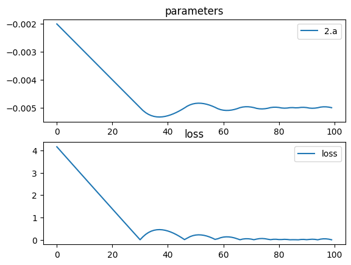

# Concave mirror


```python
import torch
import torch.nn as nn
import torch.optim as optim
import torchlensmaker as tlm

surface = tlm.Parabola(diameter=35.0, a=tlm.parameter(-0.002))

optics = nn.Sequential(
    tlm.PointSourceAtInfinity(beam_diameter=25),
    tlm.Gap(100),
    tlm.ReflectiveSurface(surface),
    tlm.Gap(-50),
    tlm.FocalPoint(),
)

tlm.show(optics, dim=2)
tlm.show(optics, dim=3)
```


<div data-jp-suppress-context-menu id='tlmviewer-17de44bb' class='tlmviewer' style='width: 100%; aspect-ratio: 16 / 9;'></div><script type='module'>async function importtlm() {
    try {
        return await import("/tlmviewer.js");
    } catch (error) {
        console.log("error", error);
        return await import("/files/test_notebooks/tlmviewer.js");
    }
}

const module = await importtlm();
const tlmviewer = module.tlmviewer;

const data = '{"mode": "2D", "camera": "XY", "data": [{"type": "surfaces", "data": [{"matrix": [[1.0, 0.0, 100.0], [0.0, 1.0, 0.0], [0.0, 0.0, 1.0]], "samples": [[-0.61250001, -17.5], [-0.60018879, -17.32323265], [-0.58800256, -17.1464653], [-0.57594121, -16.96969604], [-0.5640049, -16.7929287], [-0.5521937, -16.61616135], [-0.54050738, -16.439394], [-0.52894604, -16.26262665], [-0.51750982, -16.0858593], [-0.50619841, -15.909091], [-0.49501204, -15.73232365], [-0.48395061, -15.55555534], [-0.47301427, -15.37878799], [-0.46220288, -15.20202065], [-0.45151645, -15.02525234], [-0.44095504, -14.84848499], [-0.43051857, -14.67171669], [-0.42020714, -14.49494934], [-0.41002068, -14.31818199], [-0.39995918, -14.14141369], [-0.39002272, -13.96464634], [-0.38021123, -13.78787899], [-0.37052467, -13.61111069], [-0.3609632, -13.43434334], [-0.35152665, -13.25757599], [-0.34221506, -13.08080769], [-0.33302853, -12.90404034], [-0.32396695, -12.72727299], [-0.31503034, -12.55050468], [-0.30621877, -12.37373734], [-0.29753217, -12.19696999], [-0.2889705, -12.02020168], [-0.28053388, -11.84343433], [-0.27222225, -11.66666698], [-0.26403555, -11.48989868], [-0.25597388, -11.31313133], [-0.24803722, -11.13636398], [-0.24022549, -10.95959568], [-0.23253879, -10.78282833], [-0.22497708, -10.60606098], [-0.21754031, -10.42929268], [-0.21022856, -10.25252533], [-0.20304181, -10.07575798], [-0.19598001, -9.89898968], [-0.18904322, -9.72222233], [-0.18223143, -9.54545498], [-0.17554459, -9.36868668], [-0.16898276, -9.19191933], [-0.16254593, -9.01515198], [-0.15623406, -8.83838367], [-0.1500472, -8.66161633], [-0.1439853, -8.48484802], [-0.13804843, -8.30808067], [-0.13223651, -8.13131332], [-0.1265496, -7.9545455], [-0.12098765, -7.77777767], [-0.11555072, -7.60101032], [-0.11023876, -7.4242425], [-0.10505179, -7.24747467], [-0.09998981, -7.07070732], [-0.09505281, -6.8939395], [-0.0902408, -6.71717167], [-0.08555377, -6.54040384], [-0.08099174, -6.36363649], [-0.07655469, -6.18686867], [-0.07224263, -6.01010084], [-0.06805556, -5.83333349], [-0.06399347, -5.65656567], [-0.06005637, -5.47979784], [-0.05624427, -5.30303049], [-0.05255714, -5.12626266], [-0.048995, -4.94949484], [-0.04555786, -4.77272749], [-0.04224569, -4.59595966], [-0.03905851, -4.41919184], [-0.03599633, -4.24242401], [-0.03305913, -4.06565666], [-0.03024691, -3.88888884], [-0.02755969, -3.71212125], [-0.02499745, -3.53535366], [-0.0225602, -3.35858583], [-0.02024793, -3.18181825], [-0.01806066, -3.00505042], [-0.01599837, -2.82828283], [-0.01406107, -2.65151525], [-0.01224875, -2.47474742], [-0.01056142, -2.29797983], [-0.00899908, -2.12121201], [-0.00756173, -1.94444442], [-0.00624936, -1.76767683], [-0.00506198, -1.59090912], [-0.00399959, -1.41414142], [-0.00306219, -1.23737371], [-0.00224977, -1.060606], [-0.00156234, -0.88383842], [-0.0009999, -0.70707071], [-0.00056244, -0.530303], [-0.00024997, -0.35353535], [-6.249e-05, -0.17676768], [-0.0, 0.0], [-6.249e-05, 0.17676768], [-0.00024997, 0.35353535], [-0.00056244, 0.530303], [-0.0009999, 0.70707071], [-0.00156234, 0.88383842], [-0.00224977, 1.060606], [-0.00306219, 1.23737371], [-0.00399959, 1.41414142], [-0.00506198, 1.59090912], [-0.00624936, 1.76767683], [-0.00756173, 1.94444442], [-0.00899908, 2.12121201], [-0.01056142, 2.29797983], [-0.01224875, 2.47474742], [-0.01406107, 2.65151525], [-0.01599837, 2.82828283], [-0.01806066, 3.00505042], [-0.02024793, 3.18181825], [-0.0225602, 3.35858583], [-0.02499745, 3.53535366], [-0.02755969, 3.71212125], [-0.03024691, 3.88888884], [-0.03305913, 4.06565666], [-0.03599633, 4.24242401], [-0.03905851, 4.41919184], [-0.04224569, 4.59595966], [-0.04555786, 4.77272749], [-0.048995, 4.94949484], [-0.05255714, 5.12626266], [-0.05624427, 5.30303049], [-0.06005637, 5.47979784], [-0.06399347, 5.65656567], [-0.06805556, 5.83333349], [-0.07224263, 6.01010084], [-0.07655469, 6.18686867], [-0.08099174, 6.36363649], [-0.08555377, 6.54040384], [-0.0902408, 6.71717167], [-0.09505281, 6.8939395], [-0.09998981, 7.07070732], [-0.10505179, 7.24747467], [-0.11023876, 7.4242425], [-0.11555072, 7.60101032], [-0.12098765, 7.77777767], [-0.1265496, 7.9545455], [-0.13223651, 8.13131332], [-0.13804843, 8.30808067], [-0.1439853, 8.48484802], [-0.1500472, 8.66161633], [-0.15623406, 8.83838367], [-0.16254593, 9.01515198], [-0.16898276, 9.19191933], [-0.17554459, 9.36868668], [-0.18223143, 9.54545498], [-0.18904322, 9.72222233], [-0.19598001, 9.89898968], [-0.20304181, 10.07575798], [-0.21022856, 10.25252533], [-0.21754031, 10.42929268], [-0.22497708, 10.60606098], [-0.23253879, 10.78282833], [-0.24022549, 10.95959568], [-0.24803722, 11.13636398], [-0.25597388, 11.31313133], [-0.26403555, 11.48989868], [-0.27222225, 11.66666698], [-0.28053388, 11.84343433], [-0.2889705, 12.02020168], [-0.29753217, 12.19696999], [-0.30621877, 12.37373734], [-0.31503034, 12.55050468], [-0.32396695, 12.72727299], [-0.33302853, 12.90404034], [-0.34221506, 13.08080769], [-0.35152665, 13.25757599], [-0.3609632, 13.43434334], [-0.37052467, 13.61111069], [-0.38021123, 13.78787899], [-0.39002272, 13.96464634], [-0.39995918, 14.14141369], [-0.41002068, 14.31818199], [-0.42020714, 14.49494934], [-0.43051857, 14.67171669], [-0.44095504, 14.84848499], [-0.45151645, 15.02525234], [-0.46220288, 15.20202065], [-0.47301427, 15.37878799], [-0.48395061, 15.55555534], [-0.49501204, 15.73232365], [-0.50619841, 15.909091], [-0.51750982, 16.0858593], [-0.52894604, 16.26262665], [-0.54050738, 16.439394], [-0.5521937, 16.61616135], [-0.5640049, 16.7929287], [-0.57594121, 16.96969604], [-0.58800256, 17.1464653], [-0.60018879, 17.32323265], [-0.61250001, 17.5]]}]}, {"type": "points", "data": [[50.0, 0.0]], "color": "red"}, {"type": "rays", "points": [[0.0, -12.5, 99.6875, -12.5], [0.0, -9.72222222, 99.81095679, -9.72222222], [0.0, -6.94444444, 99.90354938, -6.94444444], [0.0, -4.16666667, 99.96527778, -4.16666667], [0.0, -1.38888889, 99.99614198, -1.38888889], [0.0, 1.38888889, 99.99614198, 1.38888889], [0.0, 4.16666667, 99.96527778, 4.16666667], [0.0, 6.94444444, 99.90354938, 6.94444444], [0.0, 9.72222222, 99.81095679, 9.72222222], [0.0, 12.5, 99.6875, 12.5]], "color": "#ffa724", "variables": {"base": [-12.5, -9.72222222, -6.94444444, -4.16666667, -1.38888889, 1.38888889, 4.16666667, 6.94444444, 9.72222222, 12.5]}, "domain": {"base": [-12.5, 12.5]}, "layers": [1]}, {"type": "rays", "points": [[99.6875, -12.5, 48.70733284, -7.3892063], [99.81095679, -9.72222222, 49.21333894, -5.78089129], [99.90354938, -6.94444444, 49.59682544, -4.14746829], [99.96527778, -4.16666667, 49.85441634, -2.4958405], [99.99614198, -1.38888889, 49.98379939, -0.83317904], [99.99614198, 1.38888889, 49.98379939, 0.83317904], [99.96527778, 4.16666667, 49.85441634, 2.4958405], [99.90354938, 6.94444444, 49.59682544, 4.14746829], [99.81095679, 9.72222222, 49.21333894, 5.78089129], [99.6875, 12.5, 48.70733284, 7.3892063]], "color": "#ffa724", "variables": {"base": [-12.5, -9.72222222, -6.94444444, -4.16666667, -1.38888889, 1.38888889, 4.16666667, 6.94444444, 9.72222222, 12.5]}, "domain": {"base": [-12.5, 12.5]}}, {"type": "points", "data": [[0.0, 0.0], [100.0, 0.0], [50.0, 0.0]], "layers": [4]}]}';

setTimeout(() => {
    tlmviewer.embed(document.getElementById("tlmviewer-17de44bb"), data);    
}, 0);
</script>


<div data-jp-suppress-context-menu id='tlmviewer-4e7d7cff' class='tlmviewer' style='width: 100%; aspect-ratio: 16 / 9;'></div><script type='module'>async function importtlm() {
    try {
        return await import("/tlmviewer.js");
    } catch (error) {
        console.log("error", error);
        return await import("/files/test_notebooks/tlmviewer.js");
    }
}

const module = await importtlm();
const tlmviewer = module.tlmviewer;

const data = '{"mode": "3D", "camera": "orthographic", "data": [{"type": "surfaces", "data": [{"matrix": [[1.0, 0.0, 0.0, 100.0], [0.0, 1.0, 0.0, 0.0], [0.0, 0.0, 1.0, 0.0], [0.0, 0.0, 0.0, 1.0]], "samples": [[-0.0, 0.0], [-6.249e-05, 0.17676768], [-0.00024997, 0.35353535], [-0.00056244, 0.530303], [-0.0009999, 0.70707071], [-0.00156234, 0.88383842], [-0.00224977, 1.060606], [-0.00306219, 1.23737371], [-0.00399959, 1.41414142], [-0.00506198, 1.59090912], [-0.00624936, 1.76767683], [-0.00756173, 1.94444442], [-0.00899908, 2.12121201], [-0.01056142, 2.29797983], [-0.01224875, 2.47474742], [-0.01406107, 2.65151525], [-0.01599837, 2.82828283], [-0.01806066, 3.00505042], [-0.02024793, 3.18181825], [-0.0225602, 3.35858583], [-0.02499745, 3.53535366], [-0.02755969, 3.71212125], [-0.03024691, 3.88888884], [-0.03305913, 4.06565666], [-0.03599633, 4.24242401], [-0.03905851, 4.41919184], [-0.04224569, 4.59595966], [-0.04555786, 4.77272749], [-0.048995, 4.94949484], [-0.05255714, 5.12626266], [-0.05624427, 5.30303049], [-0.06005637, 5.47979784], [-0.06399347, 5.65656567], [-0.06805556, 5.83333349], [-0.07224263, 6.01010084], [-0.07655469, 6.18686867], [-0.08099174, 6.36363649], [-0.08555377, 6.54040384], [-0.0902408, 6.71717167], [-0.09505281, 6.8939395], [-0.09998981, 7.07070732], [-0.10505179, 7.24747467], [-0.11023876, 7.4242425], [-0.11555072, 7.60101032], [-0.12098765, 7.77777767], [-0.1265496, 7.9545455], [-0.13223651, 8.13131332], [-0.13804843, 8.30808067], [-0.1439853, 8.48484802], [-0.1500472, 8.66161633], [-0.15623406, 8.83838367], [-0.16254593, 9.01515198], [-0.16898276, 9.19191933], [-0.17554459, 9.36868668], [-0.18223143, 9.54545498], [-0.18904322, 9.72222233], [-0.19598001, 9.89898968], [-0.20304181, 10.07575798], [-0.21022856, 10.25252533], [-0.21754031, 10.42929268], [-0.22497708, 10.60606098], [-0.23253879, 10.78282833], [-0.24022549, 10.95959568], [-0.24803722, 11.13636398], [-0.25597388, 11.31313133], [-0.26403555, 11.48989868], [-0.27222225, 11.66666698], [-0.28053388, 11.84343433], [-0.2889705, 12.02020168], [-0.29753217, 12.19696999], [-0.30621877, 12.37373734], [-0.31503034, 12.55050468], [-0.32396695, 12.72727299], [-0.33302853, 12.90404034], [-0.34221506, 13.08080769], [-0.35152665, 13.25757599], [-0.3609632, 13.43434334], [-0.37052467, 13.61111069], [-0.38021123, 13.78787899], [-0.39002272, 13.96464634], [-0.39995918, 14.14141369], [-0.41002068, 14.31818199], [-0.42020714, 14.49494934], [-0.43051857, 14.67171669], [-0.44095504, 14.84848499], [-0.45151645, 15.02525234], [-0.46220288, 15.20202065], [-0.47301427, 15.37878799], [-0.48395061, 15.55555534], [-0.49501204, 15.73232365], [-0.50619841, 15.909091], [-0.51750982, 16.0858593], [-0.52894604, 16.26262665], [-0.54050738, 16.439394], [-0.5521937, 16.61616135], [-0.5640049, 16.7929287], [-0.57594121, 16.96969604], [-0.58800256, 17.1464653], [-0.60018879, 17.32323265], [-0.61250001, 17.5]]}]}, {"type": "points", "data": [[50.0, 0.0, 0.0]], "color": "red"}, {"type": "rays", "points": [[0.0, 0.0, 0.0, 100.0, 0.0, 0.0], [0.0, -12.5, -0.0, 99.6875, -12.5, -0.0], [0.0, -9.57555554, -8.03484512, 99.6875, -9.57555554, -8.03484512], [0.0, -2.17060222, -12.31009691, 99.6875, -2.17060222, -12.31009691], [0.0, 6.25, -10.82531755, 99.6875, 6.25, -10.82531755], [0.0, 11.74615776, -4.27525179, 99.6875, 11.74615776, -4.27525179], [0.0, 11.74615776, 4.27525179, 99.6875, 11.74615776, 4.27525179], [0.0, 6.25, 10.82531755, 99.6875, 6.25, 10.82531755], [0.0, -2.17060222, 12.31009691, 99.6875, -2.17060222, 12.31009691], [0.0, -9.57555554, 8.03484512, 99.6875, -9.57555554, 8.03484512]], "color": "#ffa724", "variables": {}, "domain": {"base": [-12.5, 12.31009691]}, "layers": [1]}, {"type": "rays", "points": [[100.0, 0.0, 0.0, 50.0, 0.0, 0.0], [99.6875, -12.5, -0.0, 48.70733284, -7.3892063, -0.0], [99.6875, -9.57555554, -8.03484512, 48.70733284, -5.66046042, -4.74969025], [99.6875, -2.17060222, -12.31009691, 48.70733284, -1.28312221, -7.27694765], [99.6875, 6.25, -10.82531755, 48.70733284, 3.69460315, -6.39924037], [99.6875, 11.74615776, -4.27525179, 48.70733284, 6.94358263, -2.5272574], [99.6875, 11.74615776, 4.27525179, 48.70733284, 6.94358263, 2.5272574], [99.6875, 6.25, 10.82531755, 48.70733284, 3.69460315, 6.39924037], [99.6875, -2.17060222, 12.31009691, 48.70733284, -1.28312221, 7.27694765], [99.6875, -9.57555554, 8.03484512, 48.70733284, -5.66046042, 4.74969025]], "color": "#ffa724", "variables": {}, "domain": {"base": [-12.5, 12.31009691]}}, {"type": "points", "data": [[0.0, 0.0, 0.0], [100.0, 0.0, 0.0], [50.0, 0.0, 0.0]], "layers": [4]}]}';

setTimeout(() => {
    tlmviewer.embed(document.getElementById("tlmviewer-4e7d7cff"), data);    
}, 0);
</script>


```python
tlm.optimize(
    optics,
    optimizer = optim.Adam(optics.parameters(), lr=1e-4),
    sampling = {"base": 10},
    dim = 2,
    num_iter = 100
).plot()
```

    [  1/100] L=  4.160 | grad norm= 1393.0689593952104
    [  6/100] L=  3.464 | grad norm= 1392.1403696704538
    [ 11/100] L=  2.768 | grad norm= 1390.4294006735602
    [ 16/100] L=  2.074 | grad norm= 1387.94346131329
    [ 21/100] L=  1.381 | grad norm= 1384.6924916834748
    [ 26/100] L=  0.691 | grad norm= 1380.6890819904954
    [ 31/100] L=  0.004 | grad norm= 1375.9485016694568
    [ 36/100] L=  0.427 | grad norm= 1372.5964301942088
    [ 41/100] L=  0.394 | grad norm= 1372.8646377165207
    [ 46/100] L=  0.092 | grad norm= 1375.2292317666052
    [ 51/100] L=  0.213 | grad norm= 1377.4745676907712
    [ 56/100] L=  0.129 | grad norm= 1376.8715126844615
    [ 61/100] L=  0.122 | grad norm= 1375.0012770242408
    [ 66/100] L=  0.046 | grad norm= 1375.581445450623
    [ 71/100] L=  0.032 | grad norm= 1376.1613132849825
    [ 76/100] L=  0.049 | grad norm= 1375.5558162763846
    [ 81/100] L=  0.012 | grad norm= 1376.0120542542554
    [ 86/100] L=  0.006 | grad norm= 1375.9670528613453
    [ 91/100] L=  0.006 | grad norm= 1375.9704841745818
    [ 96/100] L=  0.030 | grad norm= 1376.1459912850867
    [100/100] L=  0.002 | grad norm= 1375.938118093794


    

    


```python
tlm.show(optics, dim=2)
tlm.show(optics, dim=3)
```


<div data-jp-suppress-context-menu id='tlmviewer-44d492b3' class='tlmviewer' style='width: 100%; aspect-ratio: 16 / 9;'></div><script type='module'>async function importtlm() {
    try {
        return await import("/tlmviewer.js");
    } catch (error) {
        console.log("error", error);
        return await import("/files/test_notebooks/tlmviewer.js");
    }
}

const module = await importtlm();
const tlmviewer = module.tlmviewer;

const data = '{"mode": "2D", "camera": "XY", "data": [{"type": "surfaces", "data": [{"matrix": [[1.0, 0.0, 100.0], [0.0, 1.0, 0.0], [0.0, 0.0, 1.0]], "samples": [[-1.5392102, -17.5], [-1.50827217, -17.32323265], [-1.47764826, -17.1464653], [-1.44733799, -16.96969604], [-1.41734219, -16.7929287], [-1.38766062, -16.61616135], [-1.35829294, -16.439394], [-1.32923949, -16.26262665], [-1.30050015, -16.0858593], [-1.27207458, -15.909091], [-1.24396336, -15.73232365], [-1.21616602, -15.55555534], [-1.18868303, -15.37878799], [-1.16151404, -15.20202065], [-1.13465905, -15.02525234], [-1.1081183, -14.84848499], [-1.08189154, -14.67171669], [-1.05597889, -14.49494934], [-1.03038037, -14.31818199], [-1.00509596, -14.14141369], [-0.98012561, -13.96464634], [-0.95546937, -13.78787899], [-0.93112713, -13.61111069], [-0.90709913, -13.43434334], [-0.88338518, -13.25757599], [-0.85998517, -13.08080769], [-0.8368994, -12.90404034], [-0.81412774, -12.72727299], [-0.79167008, -12.55050468], [-0.7695266, -12.37373734], [-0.74769723, -12.19696999], [-0.72618181, -12.02020168], [-0.70498061, -11.84343433], [-0.68409348, -11.66666698], [-0.6635204, -11.48989868], [-0.64326143, -11.31313133], [-0.62331659, -11.13636398], [-0.60368574, -10.95959568], [-0.58436906, -10.78282833], [-0.56536657, -10.60606098], [-0.54667795, -10.42929268], [-0.52830356, -10.25252533], [-0.5102433, -10.07575798], [-0.492497, -9.89898968], [-0.4750649, -9.72222233], [-0.45794687, -9.54545498], [-0.44114289, -9.36868668], [-0.42465305, -9.19191933], [-0.40847731, -9.01515198], [-0.39261562, -8.83838367], [-0.37706804, -8.66161633], [-0.3618345, -8.48484802], [-0.34691516, -8.30808067], [-0.33230987, -8.13131332], [-0.31801865, -7.9545455], [-0.3040415, -7.77777767], [-0.29037851, -7.60101032], [-0.27702957, -7.4242425], [-0.26399472, -7.24747467], [-0.25127402, -7.07070732], [-0.23886734, -6.8939395], [-0.22677478, -6.71717167], [-0.21499629, -6.54040384], [-0.20353194, -6.36363649], [-0.19238165, -6.18686867], [-0.18154545, -6.01010084], [-0.17102337, -5.83333349], [-0.16081536, -5.65656567], [-0.15092143, -5.47979784], [-0.14134164, -5.30303049], [-0.13207589, -5.12626266], [-0.12312425, -4.94949484], [-0.11448672, -4.77272749], [-0.10616326, -4.59595966], [-0.0981539, -4.41919184], [-0.09045862, -4.24242401], [-0.08307747, -4.06565666], [-0.07601038, -3.88888884], [-0.06925739, -3.71212125], [-0.0628185, -3.53535366], [-0.0566937, -3.35858583], [-0.05088298, -3.18181825], [-0.04538636, -3.00505042], [-0.04020384, -2.82828283], [-0.03533541, -2.65151525], [-0.03078106, -2.47474742], [-0.02654082, -2.29797983], [-0.02261466, -2.12121201], [-0.01900259, -1.94444442], [-0.01570463, -1.76767683], [-0.01272075, -1.59090912], [-0.01005096, -1.41414142], [-0.00769527, -1.23737371], [-0.00565366, -1.060606], [-0.00392616, -0.88383842], [-0.00251274, -0.70707071], [-0.00141342, -0.530303], [-0.00062818, -0.35353535], [-0.00015705, -0.17676768], [-0.0, 0.0], [-0.00015705, 0.17676768], [-0.00062818, 0.35353535], [-0.00141342, 0.530303], [-0.00251274, 0.70707071], [-0.00392616, 0.88383842], [-0.00565366, 1.060606], [-0.00769527, 1.23737371], [-0.01005096, 1.41414142], [-0.01272075, 1.59090912], [-0.01570463, 1.76767683], [-0.01900259, 1.94444442], [-0.02261466, 2.12121201], [-0.02654082, 2.29797983], [-0.03078106, 2.47474742], [-0.03533541, 2.65151525], [-0.04020384, 2.82828283], [-0.04538636, 3.00505042], [-0.05088298, 3.18181825], [-0.0566937, 3.35858583], [-0.0628185, 3.53535366], [-0.06925739, 3.71212125], [-0.07601038, 3.88888884], [-0.08307747, 4.06565666], [-0.09045862, 4.24242401], [-0.0981539, 4.41919184], [-0.10616326, 4.59595966], [-0.11448672, 4.77272749], [-0.12312425, 4.94949484], [-0.13207589, 5.12626266], [-0.14134164, 5.30303049], [-0.15092143, 5.47979784], [-0.16081536, 5.65656567], [-0.17102337, 5.83333349], [-0.18154545, 6.01010084], [-0.19238165, 6.18686867], [-0.20353194, 6.36363649], [-0.21499629, 6.54040384], [-0.22677478, 6.71717167], [-0.23886734, 6.8939395], [-0.25127402, 7.07070732], [-0.26399472, 7.24747467], [-0.27702957, 7.4242425], [-0.29037851, 7.60101032], [-0.3040415, 7.77777767], [-0.31801865, 7.9545455], [-0.33230987, 8.13131332], [-0.34691516, 8.30808067], [-0.3618345, 8.48484802], [-0.37706804, 8.66161633], [-0.39261562, 8.83838367], [-0.40847731, 9.01515198], [-0.42465305, 9.19191933], [-0.44114289, 9.36868668], [-0.45794687, 9.54545498], [-0.4750649, 9.72222233], [-0.492497, 9.89898968], [-0.5102433, 10.07575798], [-0.52830356, 10.25252533], [-0.54667795, 10.42929268], [-0.56536657, 10.60606098], [-0.58436906, 10.78282833], [-0.60368574, 10.95959568], [-0.62331659, 11.13636398], [-0.64326143, 11.31313133], [-0.6635204, 11.48989868], [-0.68409348, 11.66666698], [-0.70498061, 11.84343433], [-0.72618181, 12.02020168], [-0.74769723, 12.19696999], [-0.7695266, 12.37373734], [-0.79167008, 12.55050468], [-0.81412774, 12.72727299], [-0.8368994, 12.90404034], [-0.85998517, 13.08080769], [-0.88338518, 13.25757599], [-0.90709913, 13.43434334], [-0.93112713, 13.61111069], [-0.95546937, 13.78787899], [-0.98012561, 13.96464634], [-1.00509596, 14.14141369], [-1.03038037, 14.31818199], [-1.05597889, 14.49494934], [-1.08189154, 14.67171669], [-1.1081183, 14.84848499], [-1.13465905, 15.02525234], [-1.16151404, 15.20202065], [-1.18868303, 15.37878799], [-1.21616602, 15.55555534], [-1.24396336, 15.73232365], [-1.27207458, 15.909091], [-1.30050015, 16.0858593], [-1.32923949, 16.26262665], [-1.35829294, 16.439394], [-1.38766062, 16.61616135], [-1.41734219, 16.7929287], [-1.44733799, 16.96969604], [-1.47764826, 17.1464653], [-1.50827217, 17.32323265], [-1.5392102, 17.5]]}]}, {"type": "points", "data": [[50.0, 0.0]], "color": "red"}, {"type": "rays", "points": [[0.0, -12.5, 99.21468865, -12.5], [0.0, -9.72222222, 99.52493511, -9.72222222], [0.0, -6.94444444, 99.75761995, -6.94444444], [0.0, -4.16666667, 99.91274318, -4.16666667], [0.0, -1.38888889, 99.9903048, -1.38888889], [0.0, 1.38888889, 99.9903048, 1.38888889], [0.0, 4.16666667, 99.91274318, 4.16666667], [0.0, 6.94444444, 99.75761995, 6.94444444], [0.0, 9.72222222, 99.52493511, 9.72222222], [0.0, 12.5, 99.21468865, 12.5]], "color": "#ffa724", "variables": {"base": [-12.5, -9.72222222, -6.94444444, -4.16666667, -1.38888889, 1.38888889, 4.16666667, 6.94444444, 9.72222222, 12.5]}, "domain": {"base": [-12.5, 12.5]}, "layers": [1]}, {"type": "rays", "points": [[99.21468865, -12.5, 50.01578713, 0.061993], [99.52493511, -9.72222222, 50.00966816, 0.04912066], [99.75761995, -6.94444444, 50.00497859, 0.03557917], [99.91274318, -4.16666667, 50.00180343, 0.02154725], [99.9903048, -1.38888889, 50.000201, 0.00721597], [99.9903048, 1.38888889, 50.000201, -0.00721597], [99.91274318, 4.16666667, 50.00180343, -0.02154725], [99.75761995, 6.94444444, 50.00497859, -0.03557917], [99.52493511, 9.72222222, 50.00966816, -0.04912066], [99.21468865, 12.5, 50.01578713, -0.061993]], "color": "#ffa724", "variables": {"base": [-12.5, -9.72222222, -6.94444444, -4.16666667, -1.38888889, 1.38888889, 4.16666667, 6.94444444, 9.72222222, 12.5]}, "domain": {"base": [-12.5, 12.5]}}, {"type": "points", "data": [[0.0, 0.0], [100.0, 0.0], [50.0, 0.0]], "layers": [4]}]}';

setTimeout(() => {
    tlmviewer.embed(document.getElementById("tlmviewer-44d492b3"), data);    
}, 0);
</script>


<div data-jp-suppress-context-menu id='tlmviewer-57f0e598' class='tlmviewer' style='width: 100%; aspect-ratio: 16 / 9;'></div><script type='module'>async function importtlm() {
    try {
        return await import("/tlmviewer.js");
    } catch (error) {
        console.log("error", error);
        return await import("/files/test_notebooks/tlmviewer.js");
    }
}

const module = await importtlm();
const tlmviewer = module.tlmviewer;

const data = '{"mode": "3D", "camera": "orthographic", "data": [{"type": "surfaces", "data": [{"matrix": [[1.0, 0.0, 0.0, 100.0], [0.0, 1.0, 0.0, 0.0], [0.0, 0.0, 1.0, 0.0], [0.0, 0.0, 0.0, 1.0]], "samples": [[-0.0, 0.0], [-0.00015705, 0.17676768], [-0.00062818, 0.35353535], [-0.00141342, 0.530303], [-0.00251274, 0.70707071], [-0.00392616, 0.88383842], [-0.00565366, 1.060606], [-0.00769527, 1.23737371], [-0.01005096, 1.41414142], [-0.01272075, 1.59090912], [-0.01570463, 1.76767683], [-0.01900259, 1.94444442], [-0.02261466, 2.12121201], [-0.02654082, 2.29797983], [-0.03078106, 2.47474742], [-0.03533541, 2.65151525], [-0.04020384, 2.82828283], [-0.04538636, 3.00505042], [-0.05088298, 3.18181825], [-0.0566937, 3.35858583], [-0.0628185, 3.53535366], [-0.06925739, 3.71212125], [-0.07601038, 3.88888884], [-0.08307747, 4.06565666], [-0.09045862, 4.24242401], [-0.0981539, 4.41919184], [-0.10616326, 4.59595966], [-0.11448672, 4.77272749], [-0.12312425, 4.94949484], [-0.13207589, 5.12626266], [-0.14134164, 5.30303049], [-0.15092143, 5.47979784], [-0.16081536, 5.65656567], [-0.17102337, 5.83333349], [-0.18154545, 6.01010084], [-0.19238165, 6.18686867], [-0.20353194, 6.36363649], [-0.21499629, 6.54040384], [-0.22677478, 6.71717167], [-0.23886734, 6.8939395], [-0.25127402, 7.07070732], [-0.26399472, 7.24747467], [-0.27702957, 7.4242425], [-0.29037851, 7.60101032], [-0.3040415, 7.77777767], [-0.31801865, 7.9545455], [-0.33230987, 8.13131332], [-0.34691516, 8.30808067], [-0.3618345, 8.48484802], [-0.37706804, 8.66161633], [-0.39261562, 8.83838367], [-0.40847731, 9.01515198], [-0.42465305, 9.19191933], [-0.44114289, 9.36868668], [-0.45794687, 9.54545498], [-0.4750649, 9.72222233], [-0.492497, 9.89898968], [-0.5102433, 10.07575798], [-0.52830356, 10.25252533], [-0.54667795, 10.42929268], [-0.56536657, 10.60606098], [-0.58436906, 10.78282833], [-0.60368574, 10.95959568], [-0.62331659, 11.13636398], [-0.64326143, 11.31313133], [-0.6635204, 11.48989868], [-0.68409348, 11.66666698], [-0.70498061, 11.84343433], [-0.72618181, 12.02020168], [-0.74769723, 12.19696999], [-0.7695266, 12.37373734], [-0.79167008, 12.55050468], [-0.81412774, 12.72727299], [-0.8368994, 12.90404034], [-0.85998517, 13.08080769], [-0.88338518, 13.25757599], [-0.90709913, 13.43434334], [-0.93112713, 13.61111069], [-0.95546937, 13.78787899], [-0.98012561, 13.96464634], [-1.00509596, 14.14141369], [-1.03038037, 14.31818199], [-1.05597889, 14.49494934], [-1.08189154, 14.67171669], [-1.1081183, 14.84848499], [-1.13465905, 15.02525234], [-1.16151404, 15.20202065], [-1.18868303, 15.37878799], [-1.21616602, 15.55555534], [-1.24396336, 15.73232365], [-1.27207458, 15.909091], [-1.30050015, 16.0858593], [-1.32923949, 16.26262665], [-1.35829294, 16.439394], [-1.38766062, 16.61616135], [-1.41734219, 16.7929287], [-1.44733799, 16.96969604], [-1.47764826, 17.1464653], [-1.50827217, 17.32323265], [-1.5392102, 17.5]]}]}, {"type": "points", "data": [[50.0, 0.0, 0.0]], "color": "red"}, {"type": "rays", "points": [[0.0, 0.0, 0.0, 100.0, 0.0, 0.0], [0.0, -12.5, -0.0, 99.21468865, -12.5, -0.0], [0.0, -9.57555554, -8.03484512, 99.21468865, -9.57555554, -8.03484512], [0.0, -2.17060222, -12.31009691, 99.21468865, -2.17060222, -12.31009691], [0.0, 6.25, -10.82531755, 99.21468865, 6.25, -10.82531755], [0.0, 11.74615776, -4.27525179, 99.21468865, 11.74615776, -4.27525179], [0.0, 11.74615776, 4.27525179, 99.21468865, 11.74615776, 4.27525179], [0.0, 6.25, 10.82531755, 99.21468865, 6.25, 10.82531755], [0.0, -2.17060222, 12.31009691, 99.21468865, -2.17060222, 12.31009691], [0.0, -9.57555554, 8.03484512, 99.21468865, -9.57555554, 8.03484512]], "color": "#ffa724", "variables": {}, "domain": {"base": [-12.5, 12.31009691]}, "layers": [1]}, {"type": "rays", "points": [[100.0, 0.0, 0.0, 50.0, 0.0, 0.0], [99.21468865, -12.5, -0.0, 50.01578713, 0.061993, 0.0], [99.21468865, -9.57555554, -8.03484512, 50.01578713, 0.0474894, 0.03984833], [99.21468865, -2.17060222, -12.31009691, 50.01578713, 0.01076497, 0.06105119], [99.21468865, 6.25, -10.82531755, 50.01578713, -0.0309965, 0.05368752], [99.21468865, 11.74615776, -4.27525179, 50.01578713, -0.05825437, 0.02120286], [99.21468865, 11.74615776, 4.27525179, 50.01578713, -0.05825437, -0.02120286], [99.21468865, 6.25, 10.82531755, 50.01578713, -0.0309965, -0.05368752], [99.21468865, -2.17060222, 12.31009691, 50.01578713, 0.01076497, -0.06105119], [99.21468865, -9.57555554, 8.03484512, 50.01578713, 0.0474894, -0.03984833]], "color": "#ffa724", "variables": {}, "domain": {"base": [-12.5, 12.31009691]}}, {"type": "points", "data": [[0.0, 0.0, 0.0], [100.0, 0.0, 0.0], [50.0, 0.0, 0.0]], "layers": [4]}]}';

setTimeout(() => {
    tlmviewer.embed(document.getElementById("tlmviewer-57f0e598"), data);    
}, 0);
</script>

