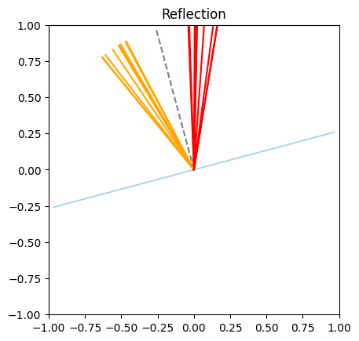

# Reflection and refraction in 2D and 3D

## Reflection in 2D


```python
import matplotlib.pyplot as plt
import torch
import math

from torchlensmaker.rot2d import rot2d
from torchlensmaker.physics import reflection

from torchlensmaker.testing.basic_transform import basic_transform


def plotv(v, **kwargs):
    plt.plot([0, v[0]], [0, v[1]], **kwargs)
    

def demo_reflection(theta_i: float, normal_angle: float) -> None:
    """
    theta_i: incident angle
    normal_angle: angle of the vector normal to the surface
    """
    
    # surface normal vector
    normal = rot2d(torch.tensor([1., 0.]), normal_angle)

    B = 10
    
    
    # Make some random incident rays around theta_i
    all_theta_i = torch.full((B,), theta_i) + torch.deg2rad(torch.tensor(20.))*torch.rand(B)
    V = torch.zeros(B, 2)
    for i in range(B):
        V[i] = torch.as_tensor(-rot2d(normal, all_theta_i[i]), dtype=torch.float32)

    # Use the same normal for all incident rays
    all_normal = torch.tile(torch.as_tensor(normal, dtype=torch.float32), (B, 1))
    
    # Sanity checks
    assert(torch.allclose(torch.linalg.norm(V, axis=1), torch.tensor(1.0)))
    assert(torch.allclose(torch.linalg.norm(all_normal, axis=1), torch.tensor(1.0)))
    assert( torch.allclose(torch.sum(-V * all_normal, dim=1), torch.cos(all_theta_i)) )
    
    reflected = reflection(V, normal)

    # Verify using the trigonometric version of reflection
    theta_r = torch.arctan2(reflected[:, 1], reflected[:, 0]) - torch.arctan2(all_normal[:, 1], all_normal[:, 0])    
    assert torch.allclose(theta_r, -all_theta_i)
    assert(torch.allclose(torch.linalg.norm(reflected, axis=1), torch.tensor(1.0)))

    # Rendering
    
    # Draw the surface
    plotv(rot2d(normal, math.pi/2), color="lightblue")
    plotv(rot2d(normal, -math.pi/2), color="lightblue")

    # Draw the normal
    plotv(normal, linestyle="--", color="grey")

    for i in range(B):
        # Draw incident light ray
        plotv(-V[i], color="orange")

        # Draw reflected light ray
        plotv(reflected[i], color="red")

    plt.gca().set_xlim([-1, 1])
    plt.gca().set_ylim([-1, 1])
    plt.gca().set_title("Reflection")
    plt.gca().set_aspect("equal")
    plt.show()


plt.figure()
demo_reflection(theta_i = torch.deg2rad(torch.tensor(12.16)), normal_angle=torch.deg2rad(torch.tensor(105.0)))
```


    

    


## Refraction in 2D


```python
import math
import torch

from torchlensmaker.physics import refraction

import matplotlib.pyplot as plt
import matplotlib.patches as mpatches
import matplotlib.lines as mlines

import numpy as np

from IPython.display import display, HTML

def plotv(v, **kwargs):
    plt.plot([0, v[0]], [0, v[1]], **kwargs)


def demo_batched_refraction(crit_option, theta_i: float, normal_angle: float, n1, n2):
    """
    Demo / Test of a batched refraction function
    
    theta_i: incident angle
    normal_angle: angle of the vector normal to the surface
    """

    # Critical angle
    if n1 > n2:
        critical_angle = np.arcsin(n2/n1, dtype=np.float32)
        print("Critical angle: {:.2f} deg".format(np.degrees(np.arcsin(n2/n1), dtype=np.float32)))
    else:
        critical_angle = None
        print("No critical angle")
    
    # Surface normal vector
    normal = rot2d(torch.tensor([1., 0.]), normal_angle)
    B = 10
    
    # Make B incident rays +- 20 deg around theta_i
    spread = np.radians(35)
    noise = torch.linspace(-spread/2, spread/2, B)
    all_theta_i = torch.full((B,), theta_i) + noise
    V = torch.zeros(B, 2)
    for i in range(B):
        V[i] = torch.as_tensor(-rot2d(normal, all_theta_i[i]), dtype=torch.float32)

    # Use the same normal for all incident rays
    all_normal = torch.tile(torch.as_tensor(normal, dtype=torch.float32), (B, 1))
    
    # Sanity checks
    assert(np.allclose(np.linalg.norm(V, axis=1), 1.0))
    assert(np.allclose(np.linalg.norm(all_normal, axis=1), 1.0))
    assert( torch.allclose(torch.sum(-V * all_normal, dim=1), torch.cos(all_theta_i)) )

    # Call refraction function
    refracted, _ = refraction(V, all_normal, n1, n2, critical_angle=crit_option)

    # Check for nans
    number_of_nonfinite = (~torch.isfinite(refracted).any(dim=1)).sum()
    if number_of_nonfinite > 0:
        print(f"Warning! {number_of_nonfinite} refracted rays contain nan!")

    if V.shape[0] != refracted.shape[0]:
        print(f"Warning! {V.shape[0]} incident rays but only {refracted.shape[0]} refracted rays.")

    # Rendering
    fig, ax = plt.subplots(1, 1, figsize=(6, 6))
    
    # Draw the surface
    plotv(rot2d(normal, math.pi/2), color="lightblue")
    plotv(rot2d(normal, -math.pi/2), color="lightblue")

    # Draw the normal
    plotv(normal, linestyle="--", color="grey")
    plotv(-normal, linestyle="--", color="grey")

    # Draw critical angle line
    if critical_angle is not None:
        plotv(1.5*rot2d(normal, critical_angle),  linestyle="--", color="lightgrey")
        plotv(1.5*rot2d(normal, -critical_angle),  linestyle="--", color="lightgrey")

    # Draw incident and refracted light rays
    for i in range(V.shape[0]):
        plotv(-V[i], color="orange")

    for i in range(refracted.shape[0]):
        plotv(refracted[i], color="red")

    ax.set_xlim([-1, 1])
    ax.set_ylim([-1, 1])
    title = f"critical_angle='{crit_option}' | n = ({n1}, {n2})"
    ax.set_title(title)
    ax.set_aspect("equal")

    orange_line = mlines.Line2D([], [], color='orange', label='incident')
    red_line = mlines.Line2D([], [], color='red', label='refracted')
    ax.legend(handles=[orange_line, red_line])
    
    display(fig)
    plt.close(fig)


crit_options = [
    'nan',
    'clamp',
    'drop',
]

plt.ioff()

theta_i = np.radians(-39.16, dtype=np.float32)
normal_angle=np.radians(105, dtype=np.float32)
n1, n2 = 1.5, 1.0

for c in crit_options:
    demo_batched_refraction(c, theta_i, normal_angle, n1, n2)
    display(HTML("<hr>"))
```

    Critical angle: 41.81 deg
    Warning! 4 refracted rays contain nan!


    

    


<hr>


    Critical angle: 41.81 deg


    

    


<hr>


    Critical angle: 41.81 deg
    Warning! 10 incident rays but only 6 refracted rays.


    

    


<hr>


## Common setup for 3D demo


```python
import torch
import torchlensmaker as tlm

def deg(x):
    return torch.deg2rad(torch.as_tensor(x))

def make_incident_vectors(a, b, alpha_n, beta_n):
    beta_range = torch.linspace(0, torch.deg2rad(torch.as_tensor(25.0)), beta_n)
    alpha_range = torch.linspace(-torch.pi, torch.pi, alpha_n)

    alpha, beta = map(
        lambda t: t.reshape(-1), torch.meshgrid(alpha_range, beta_range, indexing="xy")
    )

    x = torch.sin(beta) * torch.cos(alpha)
    y = torch.sin(beta) * torch.sin(alpha)
    z = torch.cos(beta)

    Rb = torch.tensor(
        [[1, 0, 0], [0, torch.cos(b), -torch.sin(b)], [0, torch.sin(b), torch.cos(b)]]
    )

    Ra = torch.tensor(
        [[torch.cos(a), 0, torch.sin(a)], [0, 1, 0], [-torch.sin(a), 0, torch.cos(a)]]
    )

    R = torch.mm(Rb, Ra)

    return -torch.mm(torch.column_stack((x, y, z)), R.T)


def demo_light(a, b, alpha_n, beta_n, function):
    # incident rays unit vectors
    incident = make_incident_vectors(a, b, alpha_n, beta_n)

    # colliding with the X=0 plane
    normals = torch.tensor([-1, 0, 0]).expand_as(incident)

    # compute reflection / refraction
    outcident = function(incident, normals)

    if isinstance(outcident, tuple):
        outcident = outcident[0]
    
    # verity unit norm
    assert torch.all(torch.le(torch.abs(torch.linalg.norm(outcident, dim=1) - 1.0), 1e-5))

    surface = tlm.surfaces.SquarePlane(2.)
    transform = basic_transform(1.0, "origin", [0, 0, 0], [0, 0, 0])(surface)

    # rays to display vectors
    incident_display = torch.column_stack((torch.zeros_like(incident), -incident))
    outcident_display = torch.column_stack((torch.zeros_like(outcident), outcident))

    scene = tlm.viewer.new_scene("3D")
    scene["data"].append(tlm.viewer.render_surfaces([surface], [transform], dim=3))

    scene["data"].append(tlm.viewer.render_rays(
        incident_display[:, :3],
        incident_display[:, :3] + 1 * incident_display[:, 3:6],
        default_color="orange"))

    scene["data"].append(tlm.viewer.render_rays(outcident_display[:, :3],
                               outcident_display[:, :3] + 1 * outcident_display[:, 3:6],
                          default_color="red"))

    tlm.viewer.ipython_display(scene)
```

## Reflection in 3D


```python
demo_light(deg(-30), deg(-50), 1, 1, tlm.reflection)
demo_light(deg(-30), deg(-50), 1, 30, tlm.reflection)
demo_light(deg(-30), deg(-50), 30, 30, tlm.reflection)
```


<div data-jp-suppress-context-menu id='tlmviewer-a12f252a' class='tlmviewer' style='width: 100%; aspect-ratio: 16 / 9;'></div><script type='module'>async function importtlm() {
    try {
        return await import("/tlmviewer.js");
    } catch (error) {
        console.log("error", error);
        return await import("/files/test_notebooks/tlmviewer.js");
    }
}

const module = await importtlm();
const tlmviewer = module.tlmviewer;

const data = '{"mode": "3D", "camera": "orthographic", "data": [{"type": "surfaces", "data": [{"matrix": [[1.0, 0.0, 0.0, 0.0], [0.0, 1.0, 0.0, 0.0], [0.0, 0.0, 1.0, 0.0], [0.0, 0.0, 0.0, 1.0]], "samples": [[0.0, 0.0], [0.0, 0.014284985139966011], [0.0, 0.028569970279932022], [0.0, 0.04285495728254318], [0.0, 0.057139940559864044], [0.0, 0.0714249238371849], [0.0, 0.08570991456508636], [0.0, 0.09999489784240723], [0.0, 0.11427988111972809], [0.0, 0.12856486439704895], [0.0, 0.1428498476743698], [0.0, 0.15713483095169067], [0.0, 0.17141982913017273], [0.0, 0.1857048124074936], [0.0, 0.19998979568481445], [0.0, 0.21427477896213531], [0.0, 0.22855976223945618], [0.0, 0.24284474551677704], [0.0, 0.2571297287940979], [0.0, 0.27141472697257996], [0.0, 0.2856996953487396], [0.0, 0.2999846935272217], [0.0, 0.31426966190338135], [0.0, 0.3285546600818634], [0.0, 0.34283965826034546], [0.0, 0.3571246266365051], [0.0, 0.3714096248149872], [0.0, 0.38569459319114685], [0.0, 0.3999795913696289], [0.0, 0.4142645597457886], [0.0, 0.42854955792427063], [0.0, 0.4428345263004303], [0.0, 0.45711952447891235], [0.0, 0.4714045226573944], [0.0, 0.4856894910335541], [0.0, 0.49997448921203613], [0.0, 0.5142594575881958], [0.0, 0.5285444259643555], [0.0, 0.5428294539451599], [0.0, 0.5571144223213196], [0.0, 0.5713993906974792], [0.0, 0.5856844186782837], [0.0, 0.5999693870544434], [0.0, 0.614254355430603], [0.0, 0.6285393238067627], [0.0, 0.6428243517875671], [0.0, 0.6571093201637268], [0.0, 0.6713942885398865], [0.0, 0.6856793165206909], [0.0, 0.6999642848968506], [0.0, 0.7142492532730103], [0.0, 0.7285342216491699], [0.0, 0.7428192496299744], [0.0, 0.757104218006134], [0.0, 0.7713891863822937], [0.0, 0.7856742143630981], [0.0, 0.7999591827392578], [0.0, 0.8142441511154175], [0.0, 0.8285291194915771], [0.0, 0.8428141474723816], [0.0, 0.8570991158485413], [0.0, 0.8713840842247009], [0.0, 0.8856691122055054], [0.0, 0.899954080581665], [0.0, 0.9142390489578247], [0.0, 0.9285240173339844], [0.0, 0.9428090453147888], [0.0, 0.9570940136909485], [0.0, 0.9713789820671082], [0.0, 0.9856640100479126], [0.0, 0.9999489784240723], [0.0, 1.014233946800232], [0.0, 1.0285189151763916], [0.0, 1.0428038835525513], [0.0, 1.057088851928711], [0.0, 1.0713739395141602], [0.0, 1.0856589078903198], [0.0, 1.0999438762664795], [0.0, 1.1142288446426392], [0.0, 1.1285138130187988], [0.0, 1.1427987813949585], [0.0, 1.1570837497711182], [0.0, 1.1713688373565674], [0.0, 1.185653805732727], [0.0, 1.1999387741088867], [0.0, 1.2142237424850464], [0.0, 1.228508710861206], [0.0, 1.2427936792373657], [0.0, 1.2570786476135254], [0.0, 1.2713637351989746], [0.0, 1.2856487035751343], [0.0, 1.299933671951294], [0.0, 1.3142186403274536], [0.0, 1.3285036087036133], [0.0, 1.342788577079773], [0.0, 1.3570735454559326], [0.0, 1.3713586330413818], [0.0, 1.3856436014175415], [0.0, 1.3999285697937012], [0.0, 1.4142135381698608]], "clip_planes": [[0.0, -1.0, 0.0, 1.0], [0.0, 1.0, 0.0, 1.0], [0.0, 0.0, -1.0, 1.0], [0.0, 0.0, 1.0, 1.0]]}]}, {"type": "rays", "points": [[0.0, 0.0, 0.0, -0.5, 0.663413941860199, 0.5566704273223877]], "color": "orange", "variables": {}, "domain": {}}, {"type": "rays", "points": [[0.0, 0.0, 0.0, -0.5, -0.663413941860199, -0.5566704273223877]], "color": "red", "variables": {}, "domain": {}}]}';

tlmviewer.embed(document.getElementById("tlmviewer-a12f252a"), data);    
</script>


<div data-jp-suppress-context-menu id='tlmviewer-6e48008e' class='tlmviewer' style='width: 100%; aspect-ratio: 16 / 9;'></div><script type='module'>async function importtlm() {
    try {
        return await import("/tlmviewer.js");
    } catch (error) {
        console.log("error", error);
        return await import("/files/test_notebooks/tlmviewer.js");
    }
}

const module = await importtlm();
const tlmviewer = module.tlmviewer;

const data = '{"mode": "3D", "camera": "orthographic", "data": [{"type": "surfaces", "data": [{"matrix": [[1.0, 0.0, 0.0, 0.0], [0.0, 1.0, 0.0, 0.0], [0.0, 0.0, 1.0, 0.0], [0.0, 0.0, 0.0, 1.0]], "samples": [[0.0, 0.0], [0.0, 0.014284985139966011], [0.0, 0.028569970279932022], [0.0, 0.04285495728254318], [0.0, 0.057139940559864044], [0.0, 0.0714249238371849], [0.0, 0.08570991456508636], [0.0, 0.09999489784240723], [0.0, 0.11427988111972809], [0.0, 0.12856486439704895], [0.0, 0.1428498476743698], [0.0, 0.15713483095169067], [0.0, 0.17141982913017273], [0.0, 0.1857048124074936], [0.0, 0.19998979568481445], [0.0, 0.21427477896213531], [0.0, 0.22855976223945618], [0.0, 0.24284474551677704], [0.0, 0.2571297287940979], [0.0, 0.27141472697257996], [0.0, 0.2856996953487396], [0.0, 0.2999846935272217], [0.0, 0.31426966190338135], [0.0, 0.3285546600818634], [0.0, 0.34283965826034546], [0.0, 0.3571246266365051], [0.0, 0.3714096248149872], [0.0, 0.38569459319114685], [0.0, 0.3999795913696289], [0.0, 0.4142645597457886], [0.0, 0.42854955792427063], [0.0, 0.4428345263004303], [0.0, 0.45711952447891235], [0.0, 0.4714045226573944], [0.0, 0.4856894910335541], [0.0, 0.49997448921203613], [0.0, 0.5142594575881958], [0.0, 0.5285444259643555], [0.0, 0.5428294539451599], [0.0, 0.5571144223213196], [0.0, 0.5713993906974792], [0.0, 0.5856844186782837], [0.0, 0.5999693870544434], [0.0, 0.614254355430603], [0.0, 0.6285393238067627], [0.0, 0.6428243517875671], [0.0, 0.6571093201637268], [0.0, 0.6713942885398865], [0.0, 0.6856793165206909], [0.0, 0.6999642848968506], [0.0, 0.7142492532730103], [0.0, 0.7285342216491699], [0.0, 0.7428192496299744], [0.0, 0.757104218006134], [0.0, 0.7713891863822937], [0.0, 0.7856742143630981], [0.0, 0.7999591827392578], [0.0, 0.8142441511154175], [0.0, 0.8285291194915771], [0.0, 0.8428141474723816], [0.0, 0.8570991158485413], [0.0, 0.8713840842247009], [0.0, 0.8856691122055054], [0.0, 0.899954080581665], [0.0, 0.9142390489578247], [0.0, 0.9285240173339844], [0.0, 0.9428090453147888], [0.0, 0.9570940136909485], [0.0, 0.9713789820671082], [0.0, 0.9856640100479126], [0.0, 0.9999489784240723], [0.0, 1.014233946800232], [0.0, 1.0285189151763916], [0.0, 1.0428038835525513], [0.0, 1.057088851928711], [0.0, 1.0713739395141602], [0.0, 1.0856589078903198], [0.0, 1.0999438762664795], [0.0, 1.1142288446426392], [0.0, 1.1285138130187988], [0.0, 1.1427987813949585], [0.0, 1.1570837497711182], [0.0, 1.1713688373565674], [0.0, 1.185653805732727], [0.0, 1.1999387741088867], [0.0, 1.2142237424850464], [0.0, 1.228508710861206], [0.0, 1.2427936792373657], [0.0, 1.2570786476135254], [0.0, 1.2713637351989746], [0.0, 1.2856487035751343], [0.0, 1.299933671951294], [0.0, 1.3142186403274536], [0.0, 1.3285036087036133], [0.0, 1.342788577079773], [0.0, 1.3570735454559326], [0.0, 1.3713586330413818], [0.0, 1.3856436014175415], [0.0, 1.3999285697937012], [0.0, 1.4142135381698608]], "clip_planes": [[0.0, -1.0, 0.0, 1.0], [0.0, 1.0, 0.0, 1.0], [0.0, 0.0, -1.0, 1.0], [0.0, 0.0, 1.0, 1.0]]}]}, {"type": "rays", "points": [[0.0, 0.0, 0.0, -0.5, 0.663413941860199, 0.5566704273223877], [0.0, 0.0, 0.0, -0.5129730701446533, 0.6575761437416077, 0.5517719388008118], [0.0, 0.0, 0.0, -0.5258300304412842, 0.6515894532203674, 0.5467485189437866], [0.0, 0.0, 0.0, -0.5385679602622986, 0.6454553008079529, 0.5416013598442078], [0.0, 0.0, 0.0, -0.5511839389801025, 0.6391750574111938, 0.5363315343856812], [0.0, 0.0, 0.0, -0.5636751651763916, 0.6327500343322754, 0.5309403538703918], [0.0, 0.0, 0.0, -0.5760388374328613, 0.6261818408966064, 0.5254289507865906], [0.0, 0.0, 0.0, -0.5882720351219177, 0.6194718480110168, 0.5197986364364624], [0.0, 0.0, 0.0, -0.6003720760345459, 0.6126216650009155, 0.5140506625175476], [0.0, 0.0, 0.0, -0.612336277961731, 0.6056327819824219, 0.5081862807273865], [0.0, 0.0, 0.0, -0.6241617202758789, 0.5985068082809448, 0.5022068619728088], [0.0, 0.0, 0.0, -0.6358460187911987, 0.5912452936172485, 0.49611374735832214], [0.0, 0.0, 0.0, -0.6473863124847412, 0.5838500261306763, 0.4899083375930786], [0.0, 0.0, 0.0, -0.658780038356781, 0.5763224959373474, 0.48359203338623047], [0.0, 0.0, 0.0, -0.6700246334075928, 0.56866455078125, 0.47716623544692993], [0.0, 0.0, 0.0, -0.6811175346374512, 0.5608779191970825, 0.4706324338912964], [0.0, 0.0, 0.0, -0.6920562982559204, 0.5529642105102539, 0.46399208903312683], [0.0, 0.0, 0.0, -0.7028383612632751, 0.5449253916740417, 0.45724672079086304], [0.0, 0.0, 0.0, -0.7134613394737244, 0.5367631912231445, 0.450397789478302], [0.0, 0.0, 0.0, -0.7239227890968323, 0.5284795165061951, 0.44344696402549744], [0.0, 0.0, 0.0, -0.7342203855514526, 0.5200761556625366, 0.43639570474624634], [0.0, 0.0, 0.0, -0.7443517446517944, 0.5115551352500916, 0.4292456805706024], [0.0, 0.0, 0.0, -0.754314661026001, 0.5029182434082031, 0.4219985008239746], [0.0, 0.0, 0.0, -0.7641067504882812, 0.4941675066947937, 0.41465577483177185], [0.0, 0.0, 0.0, -0.7737258672714233, 0.48530492186546326, 0.40721917152404785], [0.0, 0.0, 0.0, -0.7831698060035706, 0.4763324558734894, 0.3996903896331787], [0.0, 0.0, 0.0, -0.7924364805221558, 0.4672521948814392, 0.3920711278915405], [0.0, 0.0, 0.0, -0.8015238046646118, 0.4580661654472351, 0.3843631148338318], [0.0, 0.0, 0.0, -0.8104296922683716, 0.4487764239311218, 0.37656810879707336], [0.0, 0.0, 0.0, -0.8191520571708679, 0.4393850862979889, 0.36868783831596375]], "color": "orange", "variables": {}, "domain": {}}, {"type": "rays", "points": [[0.0, 0.0, 0.0, -0.5, -0.663413941860199, -0.5566704273223877], [0.0, 0.0, 0.0, -0.5129730701446533, -0.6575761437416077, -0.5517719388008118], [0.0, 0.0, 0.0, -0.525830090045929, -0.6515895128250122, -0.5467485785484314], [0.0, 0.0, 0.0, -0.5385679602622986, -0.6454553008079529, -0.5416013598442078], [0.0, 0.0, 0.0, -0.5511839389801025, -0.6391750574111938, -0.5363315343856812], [0.0, 0.0, 0.0, -0.5636752247810364, -0.6327500939369202, -0.5309404134750366], [0.0, 0.0, 0.0, -0.5760388374328613, -0.6261818408966064, -0.5254289507865906], [0.0, 0.0, 0.0, -0.5882720947265625, -0.6194719076156616, -0.5197986960411072], [0.0, 0.0, 0.0, -0.6003720760345459, -0.6126216650009155, -0.5140506625175476], [0.0, 0.0, 0.0, -0.612336277961731, -0.6056327819824219, -0.5081862807273865], [0.0, 0.0, 0.0, -0.6241617202758789, -0.5985068082809448, -0.5022068619728088], [0.0, 0.0, 0.0, -0.6358460187911987, -0.5912452936172485, -0.49611374735832214], [0.0, 0.0, 0.0, -0.6473863124847412, -0.5838500261306763, -0.4899083375930786], [0.0, 0.0, 0.0, -0.658780038356781, -0.5763224959373474, -0.48359203338623047], [0.0, 0.0, 0.0, -0.6700246334075928, -0.56866455078125, -0.47716623544692993], [0.0, 0.0, 0.0, -0.6811175346374512, -0.5608779191970825, -0.4706324338912964], [0.0, 0.0, 0.0, -0.6920562982559204, -0.5529642105102539, -0.46399208903312683], [0.0, 0.0, 0.0, -0.7028383612632751, -0.5449253916740417, -0.45724672079086304], [0.0, 0.0, 0.0, -0.7134613990783691, -0.5367632508277893, -0.4503978192806244], [0.0, 0.0, 0.0, -0.7239227890968323, -0.5284795165061951, -0.44344696402549744], [0.0, 0.0, 0.0, -0.7342204451560974, -0.5200762152671814, -0.4363957345485687], [0.0, 0.0, 0.0, -0.7443517446517944, -0.5115551352500916, -0.4292456805706024], [0.0, 0.0, 0.0, -0.754314661026001, -0.5029182434082031, -0.4219985008239746], [0.0, 0.0, 0.0, -0.7641067504882812, -0.4941675066947937, -0.41465577483177185], [0.0, 0.0, 0.0, -0.7737258672714233, -0.48530492186546326, -0.40721917152404785], [0.0, 0.0, 0.0, -0.7831698656082153, -0.47633248567581177, -0.3996904194355011], [0.0, 0.0, 0.0, -0.7924365401268005, -0.4672522246837616, -0.3920711576938629], [0.0, 0.0, 0.0, -0.8015238046646118, -0.4580661654472351, -0.3843631148338318], [0.0, 0.0, 0.0, -0.8104296922683716, -0.4487764239311218, -0.37656810879707336], [0.0, 0.0, 0.0, -0.8191520571708679, -0.4393850862979889, -0.36868783831596375]], "color": "red", "variables": {}, "domain": {}}]}';

tlmviewer.embed(document.getElementById("tlmviewer-6e48008e"), data);    
</script>


<div data-jp-suppress-context-menu id='tlmviewer-95455dd6' class='tlmviewer' style='width: 100%; aspect-ratio: 16 / 9;'></div><script type='module'>async function importtlm() {
    try {
        return await import("/tlmviewer.js");
    } catch (error) {
        console.log("error", error);
        return await import("/files/test_notebooks/tlmviewer.js");
    }
}

const module = await importtlm();
const tlmviewer = module.tlmviewer;

const data = '{"mode": "3D", "camera": "orthographic", "data": [{"type": "surfaces", "data": [{"matrix": [[1.0, 0.0, 0.0, 0.0], [0.0, 1.0, 0.0, 0.0], [0.0, 0.0, 1.0, 0.0], [0.0, 0.0, 0.0, 1.0]], "samples": [[0.0, 0.0], [0.0, 0.014284985139966011], [0.0, 0.028569970279932022], [0.0, 0.04285495728254318], [0.0, 0.057139940559864044], [0.0, 0.0714249238371849], [0.0, 0.08570991456508636], [0.0, 0.09999489784240723], [0.0, 0.11427988111972809], [0.0, 0.12856486439704895], [0.0, 0.1428498476743698], [0.0, 0.15713483095169067], [0.0, 0.17141982913017273], [0.0, 0.1857048124074936], [0.0, 0.19998979568481445], [0.0, 0.21427477896213531], [0.0, 0.22855976223945618], [0.0, 0.24284474551677704], [0.0, 0.2571297287940979], [0.0, 0.27141472697257996], [0.0, 0.2856996953487396], [0.0, 0.2999846935272217], [0.0, 0.31426966190338135], [0.0, 0.3285546600818634], [0.0, 0.34283965826034546], [0.0, 0.3571246266365051], [0.0, 0.3714096248149872], [0.0, 0.38569459319114685], [0.0, 0.3999795913696289], [0.0, 0.4142645597457886], [0.0, 0.42854955792427063], [0.0, 0.4428345263004303], [0.0, 0.45711952447891235], [0.0, 0.4714045226573944], [0.0, 0.4856894910335541], [0.0, 0.49997448921203613], [0.0, 0.5142594575881958], [0.0, 0.5285444259643555], [0.0, 0.5428294539451599], [0.0, 0.5571144223213196], [0.0, 0.5713993906974792], [0.0, 0.5856844186782837], [0.0, 0.5999693870544434], [0.0, 0.614254355430603], [0.0, 0.6285393238067627], [0.0, 0.6428243517875671], [0.0, 0.6571093201637268], [0.0, 0.6713942885398865], [0.0, 0.6856793165206909], [0.0, 0.6999642848968506], [0.0, 0.7142492532730103], [0.0, 0.7285342216491699], [0.0, 0.7428192496299744], [0.0, 0.757104218006134], [0.0, 0.7713891863822937], [0.0, 0.7856742143630981], [0.0, 0.7999591827392578], [0.0, 0.8142441511154175], [0.0, 0.8285291194915771], [0.0, 0.8428141474723816], [0.0, 0.8570991158485413], [0.0, 0.8713840842247009], [0.0, 0.8856691122055054], [0.0, 0.899954080581665], [0.0, 0.9142390489578247], [0.0, 0.9285240173339844], [0.0, 0.9428090453147888], [0.0, 0.9570940136909485], [0.0, 0.9713789820671082], [0.0, 0.9856640100479126], [0.0, 0.9999489784240723], [0.0, 1.014233946800232], [0.0, 1.0285189151763916], [0.0, 1.0428038835525513], [0.0, 1.057088851928711], [0.0, 1.0713739395141602], [0.0, 1.0856589078903198], [0.0, 1.0999438762664795], [0.0, 1.1142288446426392], [0.0, 1.1285138130187988], [0.0, 1.1427987813949585], [0.0, 1.1570837497711182], [0.0, 1.1713688373565674], [0.0, 1.185653805732727], [0.0, 1.1999387741088867], [0.0, 1.2142237424850464], [0.0, 1.228508710861206], [0.0, 1.2427936792373657], [0.0, 1.2570786476135254], [0.0, 1.2713637351989746], [0.0, 1.2856487035751343], [0.0, 1.299933671951294], [0.0, 1.3142186403274536], [0.0, 1.3285036087036133], [0.0, 1.342788577079773], [0.0, 1.3570735454559326], [0.0, 1.3713586330413818], [0.0, 1.3856436014175415], [0.0, 1.3999285697937012], [0.0, 1.4142135381698608]], "clip_planes": [[0.0, -1.0, 0.0, 1.0], [0.0, 1.0, 0.0, 1.0], [0.0, 0.0, -1.0, 1.0], [0.0, 0.0, 1.0, 1.0]]}]}, {"type": "rays", "points": [[0.0, 0.0, 0.0, -0.5, 0.663413941860199, 0.5566704273223877], [0.0, 0.0, 0.0, -0.5, 0.663413941860199, 0.5566704273223877], [0.0, 0.0, 0.0, -0.5, 0.663413941860199, 0.5566704273223877], [0.0, 0.0, 0.0, -0.5, 0.663413941860199, 0.5566704273223877], [0.0, 0.0, 0.0, -0.5, 0.663413941860199, 0.5566704273223877], [0.0, 0.0, 0.0, -0.5, 0.663413941860199, 0.5566704273223877], [0.0, 0.0, 0.0, -0.5, 0.663413941860199, 0.5566704273223877], [0.0, 0.0, 0.0, -0.5, 0.663413941860199, 0.5566704273223877], [0.0, 0.0, 0.0, -0.5, 0.663413941860199, 0.5566704273223877], [0.0, 0.0, 0.0, -0.5, 0.663413941860199, 0.5566704273223877], [0.0, 0.0, 0.0, -0.5, 0.663413941860199, 0.5566704273223877], [0.0, 0.0, 0.0, -0.5, 0.663413941860199, 0.5566704273223877], [0.0, 0.0, 0.0, -0.5, 0.663413941860199, 0.5566704273223877], [0.0, 0.0, 0.0, -0.5, 0.663413941860199, 0.5566704273223877], [0.0, 0.0, 0.0, -0.5, 0.663413941860199, 0.5566704273223877], [0.0, 0.0, 0.0, -0.5, 0.663413941860199, 0.5566704273223877], [0.0, 0.0, 0.0, -0.5, 0.663413941860199, 0.5566704273223877], [0.0, 0.0, 0.0, -0.5, 0.663413941860199, 0.5566704273223877], [0.0, 0.0, 0.0, -0.5, 0.663413941860199, 0.5566704273223877], [0.0, 0.0, 0.0, -0.5, 0.663413941860199, 0.5566704273223877], [0.0, 0.0, 0.0, -0.5, 0.663413941860199, 0.5566704273223877], [0.0, 0.0, 0.0, -0.5, 0.663413941860199, 0.5566704273223877], [0.0, 0.0, 0.0, -0.5, 0.663413941860199, 0.5566704273223877], [0.0, 0.0, 0.0, -0.5, 0.663413941860199, 0.5566704273223877], [0.0, 0.0, 0.0, -0.5, 0.663413941860199, 0.5566704273223877], [0.0, 0.0, 0.0, -0.5, 0.663413941860199, 0.5566704273223877], [0.0, 0.0, 0.0, -0.5, 0.663413941860199, 0.5566704273223877], [0.0, 0.0, 0.0, -0.5, 0.663413941860199, 0.5566704273223877], [0.0, 0.0, 0.0, -0.5, 0.663413941860199, 0.5566704273223877], [0.0, 0.0, 0.0, -0.5, 0.663413941860199, 0.5566704273223877], [0.0, 0.0, 0.0, -0.5129730701446533, 0.6575761437416077, 0.5517719388008118], [0.0, 0.0, 0.0, -0.5126684308052063, 0.6556318998336792, 0.5543625950813293], [0.0, 0.0, 0.0, -0.5117688179016113, 0.6540480256080627, 0.5570582747459412], [0.0, 0.0, 0.0, -0.5103162527084351, 0.6528985500335693, 0.5597327947616577], [0.0, 0.0, 0.0, -0.5083786249160767, 0.6522372961044312, 0.5622612237930298], [0.0, 0.0, 0.0, -0.5060465931892395, 0.6520951390266418, 0.564525306224823], [0.0, 0.0, 0.0, -0.5034292340278625, 0.6524786949157715, 0.5664191246032715], [0.0, 0.0, 0.0, -0.5006487965583801, 0.6533700823783875, 0.5678541660308838], [0.0, 0.0, 0.0, -0.4978354275226593, 0.654727578163147, 0.5687633156776428], [0.0, 0.0, 0.0, -0.4951206147670746, 0.656487762928009, 0.5691040754318237], [0.0, 0.0, 0.0, -0.49263131618499756, 0.658568263053894, 0.5688604712486267], [0.0, 0.0, 0.0, -0.4904839098453522, 0.6608718037605286, 0.5680440068244934], [0.0, 0.0, 0.0, -0.48877882957458496, 0.6632907390594482, 0.5666927099227905], [0.0, 0.0, 0.0, -0.487595796585083, 0.6657119393348694, 0.5648698806762695], [0.0, 0.0, 0.0, -0.4869901239871979, 0.6680221557617188, 0.5626606941223145], [0.0, 0.0, 0.0, -0.4869901239871979, 0.6701133847236633, 0.560168445110321], [0.0, 0.0, 0.0, -0.487595796585083, 0.6718878746032715, 0.55750972032547], [0.0, 0.0, 0.0, -0.48877882957458496, 0.6732625961303711, 0.5548087954521179], [0.0, 0.0, 0.0, -0.4904839098453522, 0.6741732954978943, 0.5521919131278992], [0.0, 0.0, 0.0, -0.49263131618499756, 0.6745773553848267, 0.5497815608978271], [0.0, 0.0, 0.0, -0.4951206147670746, 0.6744559407234192, 0.5476903915405273], [0.0, 0.0, 0.0, -0.4978354275226593, 0.6738147139549255, 0.5460160970687866], [0.0, 0.0, 0.0, -0.5006487965583801, 0.6726836562156677, 0.5448371171951294], [0.0, 0.0, 0.0, -0.5034292340278625, 0.6711156368255615, 0.5442084670066833], [0.0, 0.0, 0.0, -0.5060465931892395, 0.6691839694976807, 0.5441595911979675], [0.0, 0.0, 0.0, -0.5083786249160767, 0.6669790148735046, 0.5446927547454834], [0.0, 0.0, 0.0, -0.5103162527084351, 0.6646038293838501, 0.5457830429077148], [0.0, 0.0, 0.0, -0.5117688179016113, 0.6621695160865784, 0.5473794341087341], [0.0, 0.0, 0.0, -0.5126684308052063, 0.6597898602485657, 0.5494073629379272], [0.0, 0.0, 0.0, -0.5129730701446533, 0.6575761437416077, 0.5517719388008118], [0.0, 0.0, 0.0, -0.5258300304412842, 0.6515894532203674, 0.5467485189437866], [0.0, 0.0, 0.0, -0.5252208113670349, 0.6477013826370239, 0.5519292950630188], [0.0, 0.0, 0.0, -0.5234217643737793, 0.6445339918136597, 0.5573199391365051], [0.0, 0.0, 0.0, -0.5205169320106506, 0.6422353982925415, 0.5626684427261353], [0.0, 0.0, 0.0, -0.516642153263092, 0.6409129500389099, 0.5677247643470764], [0.0, 0.0, 0.0, -0.5119786858558655, 0.6406286358833313, 0.5722523331642151], [0.0, 0.0, 0.0, -0.5067444443702698, 0.6413956880569458, 0.5760395526885986], [0.0, 0.0, 0.0, -0.5011842846870422, 0.6431782841682434, 0.5789093375205994], [0.0, 0.0, 0.0, -0.4955581724643707, 0.6458929777145386, 0.5807273983955383], [0.0, 0.0, 0.0, -0.49012914299964905, 0.6494128704071045, 0.5814088582992554], [0.0, 0.0, 0.0, -0.48515111207962036, 0.6535734534263611, 0.5809217691421509], [0.0, 0.0, 0.0, -0.4808567762374878, 0.6581800580024719, 0.5792889595031738], [0.0, 0.0, 0.0, -0.4774470031261444, 0.6630173921585083, 0.5765867233276367], [0.0, 0.0, 0.0, -0.4750811755657196, 0.6678592562675476, 0.5729414224624634], [0.0, 0.0, 0.0, -0.4738699495792389, 0.6724791526794434, 0.5685235261917114], [0.0, 0.0, 0.0, -0.4738699495792389, 0.6766611337661743, 0.5635396242141724], [0.0, 0.0, 0.0, -0.4750811755657196, 0.6802096366882324, 0.558222770690918], [0.0, 0.0, 0.0, -0.4774470031261444, 0.6829587817192078, 0.5528215169906616], [0.0, 0.0, 0.0, -0.4808567762374878, 0.6847800016403198, 0.5475884079933167], [0.0, 0.0, 0.0, -0.48515111207962036, 0.6855880618095398, 0.5427682399749756], [0.0, 0.0, 0.0, -0.49012914299964905, 0.6853452920913696, 0.5385863184928894], [0.0, 0.0, 0.0, -0.4955581724643707, 0.6840629577636719, 0.5352382063865662], [0.0, 0.0, 0.0, -0.5011842846870422, 0.6818010807037354, 0.532880425453186], [0.0, 0.0, 0.0, -0.5067444443702698, 0.6786653995513916, 0.5316233038902283], [0.0, 0.0, 0.0, -0.5119786858558655, 0.6748024821281433, 0.5315255522727966], [0.0, 0.0, 0.0, -0.516642153263092, 0.6703930497169495, 0.5325917601585388], [0.0, 0.0, 0.0, -0.5205169320106506, 0.6656432151794434, 0.5347720384597778], [0.0, 0.0, 0.0, -0.5234217643737793, 0.6607751250267029, 0.5379645228385925], [0.0, 0.0, 0.0, -0.5252208113670349, 0.6560163497924805, 0.5420199036598206], [0.0, 0.0, 0.0, -0.5258300304412842, 0.6515894532203674, 0.5467485189437866], [0.0, 0.0, 0.0, -0.5385679602622986, 0.6454553008079529, 0.5416013598442078], [0.0, 0.0, 0.0, -0.5376543402671814, 0.6396243572235107, 0.549371063709259], [0.0, 0.0, 0.0, -0.5349562764167786, 0.634874165058136, 0.5574555397033691], [0.0, 0.0, 0.0, -0.53059983253479, 0.6314268708229065, 0.5654767751693726], [0.0, 0.0, 0.0, -0.5247887969017029, 0.6294436454772949, 0.5730597376823425], [0.0, 0.0, 0.0, -0.5177948474884033, 0.6290172338485718, 0.579849898815155], [0.0, 0.0, 0.0, -0.5099450349807739, 0.6301676034927368, 0.585529625415802], [0.0, 0.0, 0.0, -0.5016063451766968, 0.6328409314155579, 0.5898334383964539], [0.0, 0.0, 0.0, -0.49316874146461487, 0.6369122266769409, 0.5925601124763489], [0.0, 0.0, 0.0, -0.4850267767906189, 0.6421911120414734, 0.5935820937156677], [0.0, 0.0, 0.0, -0.4775610864162445, 0.6484307646751404, 0.5928515791893005], [0.0, 0.0, 0.0, -0.47112083435058594, 0.6553394198417664, 0.5904027819633484], [0.0, 0.0, 0.0, -0.46600714325904846, 0.6625940203666687, 0.5863502025604248], [0.0, 0.0, 0.0, -0.46245908737182617, 0.6698553562164307, 0.5808833241462708], [0.0, 0.0, 0.0, -0.46064257621765137, 0.6767839193344116, 0.5742577314376831], [0.0, 0.0, 0.0, -0.46064257621765137, 0.6830557584762573, 0.5667833089828491], [0.0, 0.0, 0.0, -0.46245908737182617, 0.6883775591850281, 0.5588094592094421], [0.0, 0.0, 0.0, -0.46600714325904846, 0.6925004720687866, 0.5507091283798218], [0.0, 0.0, 0.0, -0.47112083435058594, 0.6952317357063293, 0.5428609848022461], [0.0, 0.0, 0.0, -0.4775610864162445, 0.6964436173439026, 0.5356320738792419], [0.0, 0.0, 0.0, -0.4850267767906189, 0.6960794925689697, 0.5293603539466858], [0.0, 0.0, 0.0, -0.49316874146461487, 0.6941564083099365, 0.5243391394615173], [0.0, 0.0, 0.0, -0.5016063451766968, 0.6907641887664795, 0.5208031535148621], [0.0, 0.0, 0.0, -0.5099450349807739, 0.6860615611076355, 0.5189177989959717], [0.0, 0.0, 0.0, -0.5177948474884033, 0.6802683472633362, 0.518771231174469], [0.0, 0.0, 0.0, -0.5247887969017029, 0.6736553907394409, 0.5203701853752136], [0.0, 0.0, 0.0, -0.53059983253479, 0.6665319800376892, 0.5236400961875916], [0.0, 0.0, 0.0, -0.5349562764167786, 0.6592312455177307, 0.5284278988838196], [0.0, 0.0, 0.0, -0.5376543402671814, 0.6520944237709045, 0.5345097780227661], [0.0, 0.0, 0.0, -0.5385679602622986, 0.6454553008079529, 0.5416013598442078], [0.0, 0.0, 0.0, -0.5511839389801025, 0.6391750574111938, 0.5363315343856812], [0.0, 0.0, 0.0, -0.5499661564826965, 0.6314024329185486, 0.546688437461853], [0.0, 0.0, 0.0, -0.5463696718215942, 0.6250705122947693, 0.5574648976325989], [0.0, 0.0, 0.0, -0.540562629699707, 0.6204753518104553, 0.5681570768356323], [0.0, 0.0, 0.0, -0.5328165888786316, 0.6178317666053772, 0.5782650113105774], [0.0, 0.0, 0.0, -0.523493766784668, 0.6172633767127991, 0.5873161554336548], [0.0, 0.0, 0.0, -0.5130301117897034, 0.6187967658042908, 0.5948871374130249], [0.0, 0.0, 0.0, -0.5019147992134094, 0.6223602890968323, 0.6006240844726562], [0.0, 0.0, 0.0, -0.4906676709651947, 0.6277872323989868, 0.60425865650177], [0.0, 0.0, 0.0, -0.4798145592212677, 0.6348238587379456, 0.6056209206581116], [0.0, 0.0, 0.0, -0.4698629677295685, 0.6431412100791931, 0.604647159576416], [0.0, 0.0, 0.0, -0.4612782299518585, 0.6523503065109253, 0.6013829708099365], [0.0, 0.0, 0.0, -0.4544617533683777, 0.6620205640792847, 0.5959809422492981], [0.0, 0.0, 0.0, -0.44973224401474, 0.6716998219490051, 0.5886936783790588], [0.0, 0.0, 0.0, -0.4473108947277069, 0.6809355020523071, 0.5798619389533997], [0.0, 0.0, 0.0, -0.4473108947277069, 0.6892957091331482, 0.5698986053466797], [0.0, 0.0, 0.0, -0.44973224401474, 0.6963895559310913, 0.5592696666717529], [0.0, 0.0, 0.0, -0.4544617533683777, 0.7018852829933167, 0.5484720468521118], [0.0, 0.0, 0.0, -0.4612782299518585, 0.7055260539054871, 0.5380106568336487], [0.0, 0.0, 0.0, -0.4698629677295685, 0.7071415185928345, 0.5283746123313904], [0.0, 0.0, 0.0, -0.4798145592212677, 0.7066561579704285, 0.5200145840644836], [0.0, 0.0, 0.0, -0.4906676709651947, 0.7040926814079285, 0.5133213400840759], [0.0, 0.0, 0.0, -0.5019147992134094, 0.6995709538459778, 0.5086079835891724], [0.0, 0.0, 0.0, -0.5130301117897034, 0.6933023929595947, 0.5060948133468628], [0.0, 0.0, 0.0, -0.523493766784668, 0.6855801343917847, 0.5058994293212891], [0.0, 0.0, 0.0, -0.5328165888786316, 0.6767652034759521, 0.508030891418457], [0.0, 0.0, 0.0, -0.540562629699707, 0.6672698855400085, 0.5123895406723022], [0.0, 0.0, 0.0, -0.5463696718215942, 0.6575380563735962, 0.5187715888023376], [0.0, 0.0, 0.0, -0.5499661564826965, 0.64802485704422, 0.5268785953521729], [0.0, 0.0, 0.0, -0.5511839389801025, 0.6391749978065491, 0.5363315939903259], [0.0, 0.0, 0.0, -0.5636751651763916, 0.6327500343322754, 0.5309403538703918], [0.0, 0.0, 0.0, -0.5621534585952759, 0.6230376362800598, 0.5438820123672485], [0.0, 0.0, 0.0, -0.5576593279838562, 0.6151254177093506, 0.5573480129241943], [0.0, 0.0, 0.0, -0.5504029989242554, 0.6093833446502686, 0.570708692073822], [0.0, 0.0, 0.0, -0.5407238006591797, 0.6060799956321716, 0.5833393931388855], [0.0, 0.0, 0.0, -0.5290741920471191, 0.6053697466850281, 0.5946494340896606], [0.0, 0.0, 0.0, -0.5159990787506104, 0.6072858572006226, 0.6041100025177002], [0.0, 0.0, 0.0, -0.5021096467971802, 0.6117387413978577, 0.6112787127494812], [0.0, 0.0, 0.0, -0.4880554974079132, 0.6185201406478882, 0.6158203482627869], [0.0, 0.0, 0.0, -0.47449371218681335, 0.627312958240509, 0.617522656917572], [0.0, 0.0, 0.0, -0.4620584547519684, 0.6377061009407043, 0.6163058876991272], [0.0, 0.0, 0.0, -0.45133116841316223, 0.6492135524749756, 0.6122270226478577], [0.0, 0.0, 0.0, -0.4428134560585022, 0.6612973213195801, 0.6054767966270447], [0.0, 0.0, 0.0, -0.43690359592437744, 0.6733922362327576, 0.5963708162307739], [0.0, 0.0, 0.0, -0.43387794494628906, 0.6849328875541687, 0.585334837436676], [0.0, 0.0, 0.0, -0.43387794494628906, 0.6953796148300171, 0.5728849768638611], [0.0, 0.0, 0.0, -0.43690359592437744, 0.7042438983917236, 0.5596032738685608], [0.0, 0.0, 0.0, -0.4428134560585022, 0.711111307144165, 0.5461108088493347], [0.0, 0.0, 0.0, -0.45133116841316223, 0.7156606316566467, 0.5330384969711304], [0.0, 0.0, 0.0, -0.4620584547519684, 0.7176792621612549, 0.5209975838661194], [0.0, 0.0, 0.0, -0.47449371218681335, 0.7170727849006653, 0.5105510354042053], [0.0, 0.0, 0.0, -0.4880554974079132, 0.7138695120811462, 0.5021873712539673], [0.0, 0.0, 0.0, -0.5021096467971802, 0.7082192897796631, 0.4962976574897766], [0.0, 0.0, 0.0, -0.5159990787506104, 0.7003862261772156, 0.4931572675704956], [0.0, 0.0, 0.0, -0.5290741920471191, 0.690736711025238, 0.4929130971431732], [0.0, 0.0, 0.0, -0.5407238006591797, 0.6797218322753906, 0.49557650089263916], [0.0, 0.0, 0.0, -0.5504029989242554, 0.6678566336631775, 0.50102299451828], [0.0, 0.0, 0.0, -0.5576593279838562, 0.6556960344314575, 0.5089978575706482], [0.0, 0.0, 0.0, -0.5621534585952759, 0.6438085436820984, 0.5191282033920288], [0.0, 0.0, 0.0, -0.5636751651763916, 0.6327500343322754, 0.5309403538703918], [0.0, 0.0, 0.0, -0.5760388374328613, 0.6261818408966064, 0.5254289507865906], [0.0, 0.0, 0.0, -0.5742135047912598, 0.6145317554473877, 0.5409525036811829], [0.0, 0.0, 0.0, -0.5688228011131287, 0.6050410270690918, 0.5571050047874451], [0.0, 0.0, 0.0, -0.5601187944412231, 0.5981534719467163, 0.5731312036514282], [0.0, 0.0, 0.0, -0.5485085844993591, 0.5941910743713379, 0.5882816910743713], [0.0, 0.0, 0.0, -0.5345348715782166, 0.5933391451835632, 0.6018481254577637], [0.0, 0.0, 0.0, -0.5188512206077576, 0.5956375002861023, 0.613196074962616], [0.0, 0.0, 0.0, -0.5021908283233643, 0.6009787321090698, 0.6217949390411377], [0.0, 0.0, 0.0, -0.4853328466415405, 0.6091130375862122, 0.6272426843643188], [0.0, 0.0, 0.0, -0.46906548738479614, 0.6196600198745728, 0.6292845606803894], [0.0, 0.0, 0.0, -0.45414936542510986, 0.6321266293525696, 0.6278250813484192], [0.0, 0.0, 0.0, -0.4412819743156433, 0.6459298729896545, 0.622932493686676], [0.0, 0.0, 0.0, -0.4310649633407593, 0.6604242920875549, 0.6148355603218079], [0.0, 0.0, 0.0, -0.4239760637283325, 0.6749322414398193, 0.603912889957428], [0.0, 0.0, 0.0, -0.42034679651260376, 0.6887752413749695, 0.5906752347946167], [0.0, 0.0, 0.0, -0.42034679651260376, 0.7013061046600342, 0.5757415890693665], [0.0, 0.0, 0.0, -0.4239760637283325, 0.7119388580322266, 0.5598101615905762], [0.0, 0.0, 0.0, -0.4310649633407593, 0.7201762795448303, 0.5436259508132935], [0.0, 0.0, 0.0, -0.4412819743156433, 0.7256332635879517, 0.5279456973075867], [0.0, 0.0, 0.0, -0.45414936542510986, 0.7280545830726624, 0.5135025978088379], [0.0, 0.0, 0.0, -0.46906548738479614, 0.7273271083831787, 0.5009719133377075], [0.0, 0.0, 0.0, -0.4853328466415405, 0.7234848141670227, 0.4909397065639496], [0.0, 0.0, 0.0, -0.5021908283233643, 0.7167073488235474, 0.48387500643730164], [0.0, 0.0, 0.0, -0.5188512206077576, 0.7073115706443787, 0.4801081120967865], [0.0, 0.0, 0.0, -0.5345348715782166, 0.6957369446754456, 0.47981518507003784], [0.0, 0.0, 0.0, -0.5485085844993591, 0.682524561882019, 0.4830099642276764], [0.0, 0.0, 0.0, -0.5601187944412231, 0.6682922840118408, 0.48954302072525024], [0.0, 0.0, 0.0, -0.5688228011131287, 0.6537055969238281, 0.4991088807582855], [0.0, 0.0, 0.0, -0.5742135047912598, 0.6394465565681458, 0.5112602710723877], [0.0, 0.0, 0.0, -0.5760388374328613, 0.6261818408966064, 0.5254290103912354], [0.0, 0.0, 0.0, -0.5882720351219177, 0.6194718480110168, 0.5197986364364624], [0.0, 0.0, 0.0, -0.5861434936523438, 0.6058867573738098, 0.5379005670547485], [0.0, 0.0, 0.0, -0.5798574686050415, 0.5948197245597839, 0.5567358732223511], [0.0, 0.0, 0.0, -0.5697078108787537, 0.5867881178855896, 0.5754238963127136], [0.0, 0.0, 0.0, -0.5561691522598267, 0.5821676254272461, 0.593090832233429], [0.0, 0.0, 0.0, -0.5398745536804199, 0.5811741948127747, 0.6089105606079102], [0.0, 0.0, 0.0, -0.5215858817100525, 0.5838543176651001, 0.6221433281898499], [0.0, 0.0, 0.0, -0.5021583437919617, 0.5900826454162598, 0.6321704387664795], [0.0, 0.0, 0.0, -0.4825003445148468, 0.5995680093765259, 0.6385230422019958], [0.0, 0.0, 0.0, -0.4635310471057892, 0.61186683177948, 0.6409040093421936], [0.0, 0.0, 0.0, -0.4461374282836914, 0.6264040470123291, 0.6392021179199219], [0.0, 0.0, 0.0, -0.43113285303115845, 0.6424999237060547, 0.633496880531311], [0.0, 0.0, 0.0, -0.41921886801719666, 0.6594018340110779, 0.6240551471710205], [0.0, 0.0, 0.0, -0.4109525680541992, 0.676319420337677, 0.6113182902336121], [0.0, 0.0, 0.0, -0.40672045946121216, 0.6924616694450378, 0.5958819389343262], [0.0, 0.0, 0.0, -0.40672045946121216, 0.7070738077163696, 0.578467845916748], [0.0, 0.0, 0.0, -0.4109525680541992, 0.7194725871086121, 0.5598903298377991], [0.0, 0.0, 0.0, -0.41921886801719666, 0.7290782332420349, 0.541018009185791], [0.0, 0.0, 0.0, -0.43113285303115845, 0.7354415655136108, 0.5227333307266235], [0.0, 0.0, 0.0, -0.4461374282836914, 0.7382650971412659, 0.5058913230895996], [0.0, 0.0, 0.0, -0.4635310471057892, 0.7374167442321777, 0.4912794232368469], [0.0, 0.0, 0.0, -0.4825003445148468, 0.7329362630844116, 0.47958090901374817], [0.0, 0.0, 0.0, -0.5021583437919617, 0.7250331044197083, 0.4713427722454071], [0.0, 0.0, 0.0, -0.5215858817100525, 0.7140767574310303, 0.4669502377510071], [0.0, 0.0, 0.0, -0.5398745536804199, 0.7005796432495117, 0.4666086733341217], [0.0, 0.0, 0.0, -0.5561691522598267, 0.6851727962493896, 0.4703340530395508], [0.0, 0.0, 0.0, -0.5697078108787537, 0.6685765981674194, 0.4779522120952606], [0.0, 0.0, 0.0, -0.5798574686050415, 0.6515671610832214, 0.4891069233417511], [0.0, 0.0, 0.0, -0.5861434936523438, 0.6349397301673889, 0.5032765865325928], [0.0, 0.0, 0.0, -0.5882720351219177, 0.6194718480110168, 0.5197986364364624], [0.0, 0.0, 0.0, -0.6003720760345459, 0.6126216650009155, 0.5140506625175476], [0.0, 0.0, 0.0, -0.5979408621788025, 0.5971046686172485, 0.5347268581390381], [0.0, 0.0, 0.0, -0.5907608866691589, 0.5844637155532837, 0.5562407374382019], [0.0, 0.0, 0.0, -0.5791678428649902, 0.5752900242805481, 0.5775864124298096], [0.0, 0.0, 0.0, -0.5637038946151733, 0.5700123906135559, 0.5977657437324524], [0.0, 0.0, 0.0, -0.545091986656189, 0.5688776969909668, 0.6158351898193359], [0.0, 0.0, 0.0, -0.5242025256156921, 0.5719389319419861, 0.6309497952461243], [0.0, 0.0, 0.0, -0.5020121932029724, 0.5790530443191528, 0.6424028277397156], [0.0, 0.0, 0.0, -0.4795586168766022, 0.5898873209953308, 0.6496587991714478], [0.0, 0.0, 0.0, -0.45789170265197754, 0.6039351224899292, 0.6523784399032593], [0.0, 0.0, 0.0, -0.4380245506763458, 0.6205397248268127, 0.6504344940185547], [0.0, 0.0, 0.0, -0.42088615894317627, 0.6389245390892029, 0.6439179182052612], [0.0, 0.0, 0.0, -0.4072778820991516, 0.6582300662994385, 0.6331334710121155], [0.0, 0.0, 0.0, -0.39783602952957153, 0.6775535345077515, 0.6185852885246277], [0.0, 0.0, 0.0, -0.39300209283828735, 0.6959913969039917, 0.6009537577629089], [0.0, 0.0, 0.0, -0.39300209283828735, 0.7126815319061279, 0.5810632109642029], [0.0, 0.0, 0.0, -0.39783602952957153, 0.726843535900116, 0.5598437786102295], [0.0, 0.0, 0.0, -0.4072778820991516, 0.7378151416778564, 0.5382876396179199], [0.0, 0.0, 0.0, -0.42088615894317627, 0.7450834512710571, 0.517402708530426], [0.0, 0.0, 0.0, -0.4380245506763458, 0.7483084797859192, 0.4981655776500702], [0.0, 0.0, 0.0, -0.45789170265197754, 0.7473395466804504, 0.48147574067115784], [0.0, 0.0, 0.0, -0.4795586168766022, 0.7422218918800354, 0.46811357140541077], [0.0, 0.0, 0.0, -0.5020121932029724, 0.7331947684288025, 0.458703875541687], [0.0, 0.0, 0.0, -0.5242025256156921, 0.7206803560256958, 0.4536866843700409], [0.0, 0.0, 0.0, -0.545091986656189, 0.7052637934684753, 0.4532965421676636], [0.0, 0.0, 0.0, -0.5637038946151733, 0.6876659393310547, 0.4575517177581787], [0.0, 0.0, 0.0, -0.5791678428649902, 0.6687095761299133, 0.46625328063964844], [0.0, 0.0, 0.0, -0.5907608866691589, 0.6492812037467957, 0.4789942800998688], [0.0, 0.0, 0.0, -0.5979408621788025, 0.6302892565727234, 0.4951789975166321], [0.0, 0.0, 0.0, -0.6003720760345459, 0.6126216650009155, 0.5140506625175476], [0.0, 0.0, 0.0, -0.612336277961731, 0.6056327819824219, 0.5081862807273865], [0.0, 0.0, 0.0, -0.6096028685569763, 0.5881873369216919, 0.5314320921897888], [0.0, 0.0, 0.0, -0.6015305519104004, 0.5739754438400269, 0.5556196570396423], [0.0, 0.0, 0.0, -0.5884968042373657, 0.5636616349220276, 0.5796180963516235], [0.0, 0.0, 0.0, -0.5711109638214111, 0.557728111743927, 0.6023052930831909], [0.0, 0.0, 0.0, -0.550186038017273, 0.5564523935317993, 0.6226203441619873], [0.0, 0.0, 0.0, -0.526700496673584, 0.5598940849304199, 0.6396133899688721], [0.0, 0.0, 0.0, -0.5017523765563965, 0.56789231300354, 0.6524898409843445], [0.0, 0.0, 0.0, -0.47650831937789917, 0.5800729990005493, 0.6606475710868835], [0.0, 0.0, 0.0, -0.4521486759185791, 0.5958667397499084, 0.6637051701545715], [0.0, 0.0, 0.0, -0.429812490940094, 0.614534854888916, 0.6615196466445923], [0.0, 0.0, 0.0, -0.41054415702819824, 0.635204553604126, 0.6541932225227356], [0.0, 0.0, 0.0, -0.39524468779563904, 0.6569092869758606, 0.6420684456825256], [0.0, 0.0, 0.0, -0.38462939858436584, 0.6786342263221741, 0.6257122755050659], [0.0, 0.0, 0.0, -0.3791947066783905, 0.6993635296821594, 0.6058894991874695], [0.0, 0.0, 0.0, -0.3791947066783905, 0.7181278467178345, 0.5835270285606384], [0.0, 0.0, 0.0, -0.38462939858436584, 0.7340498566627502, 0.5596705079078674], [0.0, 0.0, 0.0, -0.39524468779563904, 0.7463850378990173, 0.5354353785514832], [0.0, 0.0, 0.0, -0.41054415702819824, 0.7545565962791443, 0.5119549632072449], [0.0, 0.0, 0.0, -0.429812490940094, 0.7581824660301208, 0.49032703042030334], [0.0, 0.0, 0.0, -0.4521486759185791, 0.7570931315422058, 0.4715630114078522], [0.0, 0.0, 0.0, -0.47650831937789917, 0.7513394355773926, 0.45654022693634033], [0.0, 0.0, 0.0, -0.5017523765563965, 0.7411904335021973, 0.4459611177444458], [0.0, 0.0, 0.0, -0.526700496673584, 0.7271207571029663, 0.4403204023838043], [0.0, 0.0, 0.0, -0.550186038017273, 0.7097882628440857, 0.4398817718029022], [0.0, 0.0, 0.0, -0.5711109638214111, 0.6900033950805664, 0.444665789604187], [0.0, 0.0, 0.0, -0.5884968042373657, 0.6686912178993225, 0.45444872975349426], [0.0, 0.0, 0.0, -0.6015305519104004, 0.6468483209609985, 0.46877315640449524], [0.0, 0.0, 0.0, -0.6096028685569763, 0.6254960298538208, 0.4869692921638489], [0.0, 0.0, 0.0, -0.612336277961731, 0.6056327819824219, 0.5081862807273865], [0.0, 0.0, 0.0, -0.6241617202758789, 0.5985068082809448, 0.5022068619728088], [0.0, 0.0, 0.0, -0.6211268901824951, 0.579136848449707, 0.5280169248580933], [0.0, 0.0, 0.0, -0.6121640801429749, 0.5633571743965149, 0.5548728108406067], [0.0, 0.0, 0.0, -0.5976924896240234, 0.551905632019043, 0.5815185904502869], [0.0, 0.0, 0.0, -0.5783887505531311, 0.545317530632019, 0.6067084670066833], [0.0, 0.0, 0.0, -0.5551555156707764, 0.5439010858535767, 0.6292645931243896], [0.0, 0.0, 0.0, -0.5290791392326355, 0.5477224588394165, 0.6481321454048157], [0.0, 0.0, 0.0, -0.5013789534568787, 0.5566030144691467, 0.6624290347099304], [0.0, 0.0, 0.0, -0.4733501374721527, 0.5701274275779724, 0.6714866757392883], [0.0, 0.0, 0.0, -0.44630327820777893, 0.5876633524894714, 0.6748815774917603], [0.0, 0.0, 0.0, -0.42150312662124634, 0.6083908677101135, 0.6724549531936646], [0.0, 0.0, 0.0, -0.4001092314720154, 0.6313406825065613, 0.6643203496932983], [0.0, 0.0, 0.0, -0.3831219971179962, 0.6554397940635681, 0.6508580446243286], [0.0, 0.0, 0.0, -0.3713357150554657, 0.6795613169670105, 0.632697582244873], [0.0, 0.0, 0.0, -0.3653014898300171, 0.7025772929191589, 0.6106880903244019], [0.0, 0.0, 0.0, -0.3653014898300171, 0.7234116196632385, 0.5858587622642517], [0.0, 0.0, 0.0, -0.3713357150554657, 0.7410899996757507, 0.5593705177307129], [0.0, 0.0, 0.0, -0.3831219971179962, 0.75478595495224, 0.532461941242218], [0.0, 0.0, 0.0, -0.4001092314720154, 0.7638589143753052, 0.5063912272453308], [0.0, 0.0, 0.0, -0.42150312662124634, 0.7678847908973694, 0.48237746953964233], [0.0, 0.0, 0.0, -0.44630327820777893, 0.7666752338409424, 0.4615435302257538], [0.0, 0.0, 0.0, -0.4733501374721527, 0.7602868676185608, 0.444863498210907], [0.0, 0.0, 0.0, -0.5013789534568787, 0.7490183115005493, 0.4331173896789551], [0.0, 0.0, 0.0, -0.5290791392326355, 0.733396589756012, 0.4268544316291809], [0.0, 0.0, 0.0, -0.5551555156707764, 0.7141520380973816, 0.4263674020767212], [0.0, 0.0, 0.0, -0.5783887505531311, 0.6921846270561218, 0.4316791594028473], [0.0, 0.0, 0.0, -0.5976924896240234, 0.6685214042663574, 0.44254130125045776], [0.0, 0.0, 0.0, -0.6121640801429749, 0.6442689299583435, 0.4584459364414215], [0.0, 0.0, 0.0, -0.6211268901824951, 0.6205612421035767, 0.4786493182182312], [0.0, 0.0, 0.0, -0.6241617202758789, 0.5985067486763, 0.5022068619728088], [0.0, 0.0, 0.0, -0.6358460187911987, 0.5912452936172485, 0.49611374735832214], [0.0, 0.0, 0.0, -0.632510244846344, 0.5699552893638611, 0.5244823694229126], [0.0, 0.0, 0.0, -0.6226590275764465, 0.5526114106178284, 0.5540003180503845], [0.0, 0.0, 0.0, -0.606752872467041, 0.5400246977806091, 0.5832874774932861], [0.0, 0.0, 0.0, -0.5855356454849243, 0.532783567905426, 0.6109743714332581], [0.0, 0.0, 0.0, -0.5599993467330933, 0.5312266945838928, 0.6357663869857788], [0.0, 0.0, 0.0, -0.531338095664978, 0.535426914691925, 0.6565042734146118], [0.0, 0.0, 0.0, -0.5008920431137085, 0.5451877117156982, 0.672218382358551], [0.0, 0.0, 0.0, -0.4700848162174225, 0.560052752494812, 0.6821738481521606], [0.0, 0.0, 0.0, -0.44035688042640686, 0.5793269872665405, 0.6859052777290344], [0.0, 0.0, 0.0, -0.4130983352661133, 0.6021091341972351, 0.68323814868927], [0.0, 0.0, 0.0, -0.3895837366580963, 0.6273339986801147, 0.6742971539497375], [0.0, 0.0, 0.0, -0.3709126114845276, 0.6538219451904297, 0.6595003604888916], [0.0, 0.0, 0.0, -0.35795795917510986, 0.6803345680236816, 0.6395396590232849], [0.0, 0.0, 0.0, -0.3513256013393402, 0.7056320905685425, 0.6153484582901001], [0.0, 0.0, 0.0, -0.3513256013393402, 0.7285315990447998, 0.588057816028595], [0.0, 0.0, 0.0, -0.35795795917510986, 0.747962474822998, 0.5589438676834106], [0.0, 0.0, 0.0, -0.3709126114845276, 0.7630160450935364, 0.5293679237365723], [0.0, 0.0, 0.0, -0.3895837366580963, 0.7729883790016174, 0.5007129311561584], [0.0, 0.0, 0.0, -0.4130983352661133, 0.7774133086204529, 0.4743187725543976], [0.0, 0.0, 0.0, -0.44035688042640686, 0.7760838866233826, 0.45141956210136414], [0.0, 0.0, 0.0, -0.4700848162174225, 0.7690622210502625, 0.4330861270427704], [0.0, 0.0, 0.0, -0.5008920431137085, 0.7566766738891602, 0.4201756417751312], [0.0, 0.0, 0.0, -0.531338095664978, 0.7395063638687134, 0.4132918417453766], [0.0, 0.0, 0.0, -0.5599993467330933, 0.7183542251586914, 0.4127565622329712], [0.0, 0.0, 0.0, -0.5855356454849243, 0.6942091584205627, 0.4185948371887207], [0.0, 0.0, 0.0, -0.606752872467041, 0.6682003140449524, 0.4305337369441986], [0.0, 0.0, 0.0, -0.6226590275764465, 0.6415437459945679, 0.44801491498947144], [0.0, 0.0, 0.0, -0.632510244846344, 0.6154859662055969, 0.47022104263305664], [0.0, 0.0, 0.0, -0.6358460187911987, 0.5912452936172485, 0.49611377716064453], [0.0, 0.0, 0.0, -0.6473863124847412, 0.5838500261306763, 0.4899083375930786], [0.0, 0.0, 0.0, -0.6437504291534424, 0.5606447458267212, 0.5208290219306946], [0.0, 0.0, 0.0, -0.6330130100250244, 0.5417405962944031, 0.5530024766921997], [0.0, 0.0, 0.0, -0.6156759262084961, 0.528021514415741, 0.5849242806434631], [0.0, 0.0, 0.0, -0.5925499796867371, 0.5201290249824524, 0.6151019334793091], [0.0, 0.0, 0.0, -0.5647164583206177, 0.518432080745697, 0.6421242952346802], [0.0, 0.0, 0.0, -0.5334768295288086, 0.5230101346969604, 0.6647277474403381], [0.0, 0.0, 0.0, -0.5002917647361755, 0.5336490273475647, 0.6818554997444153], [0.0, 0.0, 0.0, -0.4667131006717682, 0.5498513579368591, 0.6927065849304199], [0.0, 0.0, 0.0, -0.43431082367897034, 0.5708595514297485, 0.6967737078666687], [0.0, 0.0, 0.0, -0.40460005402565, 0.5956912040710449, 0.6938666105270386], [0.0, 0.0, 0.0, -0.37897008657455444, 0.6231852173805237, 0.6841212511062622], [0.0, 0.0, 0.0, -0.3586192727088928, 0.652056097984314, 0.6679933667182922], [0.0, 0.0, 0.0, -0.34449923038482666, 0.6809538006782532, 0.6462370157241821], [0.0, 0.0, 0.0, -0.33727020025253296, 0.7085270881652832, 0.6198695302009583], [0.0, 0.0, 0.0, -0.33727020025253296, 0.7334867119789124, 0.5901238322257996], [0.0, 0.0, 0.0, -0.34449923038482666, 0.7546655535697937, 0.558390736579895], [0.0, 0.0, 0.0, -0.3586192727088928, 0.7710733413696289, 0.526154100894928], [0.0, 0.0, 0.0, -0.37897008657455444, 0.7819429039955139, 0.4949212670326233], [0.0, 0.0, 0.0, -0.40460005402565, 0.7867658734321594, 0.4661526679992676], [0.0, 0.0, 0.0, -0.43431082367897034, 0.7853168249130249, 0.44119346141815186], [0.0, 0.0, 0.0, -0.4667131006717682, 0.7776634693145752, 0.42121070623397827], [0.0, 0.0, 0.0, -0.5002917647361755, 0.7641637325286865, 0.40713879466056824], [0.0, 0.0, 0.0, -0.5334768295288086, 0.7454487681388855, 0.3996357321739197], [0.0, 0.0, 0.0, -0.5647164583206177, 0.7223936915397644, 0.39905229210853577], [0.0, 0.0, 0.0, -0.5925499796867371, 0.6960765719413757, 0.40541577339172363], [0.0, 0.0, 0.0, -0.6156759262084961, 0.6677279472351074, 0.4184287190437317], [0.0, 0.0, 0.0, -0.6330130100250244, 0.6386733651161194, 0.4374825060367584], [0.0, 0.0, 0.0, -0.6437504291534424, 0.6102713942527771, 0.46168631315231323], [0.0, 0.0, 0.0, -0.6473863124847412, 0.5838500261306763, 0.489908367395401], [0.0, 0.0, 0.0, -0.658780038356781, 0.5763224959373474, 0.48359203338623047], [0.0, 0.0, 0.0, -0.6548449397087097, 0.5512071847915649, 0.5170577764511108], [0.0, 0.0, 0.0, -0.6432236433029175, 0.53074711561203, 0.5518794059753418], [0.0, 0.0, 0.0, -0.6244596242904663, 0.5158988237380981, 0.586428701877594], [0.0, 0.0, 0.0, -0.5994301438331604, 0.5073566436767578, 0.6190902590751648], [0.0, 0.0, 0.0, -0.5693056583404541, 0.5055200457572937, 0.6483367681503296], [0.0, 0.0, 0.0, -0.5354946851730347, 0.5104749202728271, 0.6728007197380066], [0.0, 0.0, 0.0, -0.49957823753356934, 0.5219895243644714, 0.6913382411003113], [0.0, 0.0, 0.0, -0.46323567628860474, 0.5395254492759705, 0.7030825018882751], [0.0, 0.0, 0.0, -0.42816638946533203, 0.562262773513794, 0.7074843645095825], [0.0, 0.0, 0.0, -0.396010160446167, 0.5891383290290833, 0.704338014125824], [0.0, 0.0, 0.0, -0.3682705760002136, 0.618895411491394, 0.6937904953956604], [0.0, 0.0, 0.0, -0.3462446928024292, 0.6501426100730896, 0.6763351559638977], [0.0, 0.0, 0.0, -0.3309624493122101, 0.6814188361167908, 0.6527880430221558], [0.0, 0.0, 0.0, -0.32313841581344604, 0.7112616896629333, 0.6242502331733704], [0.0, 0.0, 0.0, -0.32313841581344604, 0.7382757663726807, 0.592056155204773], [0.0, 0.0, 0.0, -0.3309624493122101, 0.7611978054046631, 0.5577111840248108], [0.0, 0.0, 0.0, -0.3462446928024292, 0.7789561152458191, 0.5228211283683777], [0.0, 0.0, 0.0, -0.3682705760002136, 0.7907202839851379, 0.4890175759792328], [0.0, 0.0, 0.0, -0.396010160446167, 0.7959402799606323, 0.45788100361824036], [0.0, 0.0, 0.0, -0.42816638946533203, 0.7943719625473022, 0.43086740374565125], [0.0, 0.0, 0.0, -0.46323567628860474, 0.7860887050628662, 0.40923988819122314], [0.0, 0.0, 0.0, -0.49957823753356934, 0.7714777588844299, 0.3940097391605377], [0.0, 0.0, 0.0, -0.5354946851730347, 0.7512223720550537, 0.38588905334472656], [0.0, 0.0, 0.0, -0.5693056583404541, 0.7262697219848633, 0.3852576017379761], [0.0, 0.0, 0.0, -0.5994301438331604, 0.6977863907814026, 0.39214491844177246], [0.0, 0.0, 0.0, -0.6244596242904663, 0.6671043634414673, 0.4062288999557495], [0.0, 0.0, 0.0, -0.6432236433029175, 0.635658323764801, 0.4268510341644287], [0.0, 0.0, 0.0, -0.6548449397087097, 0.6049185991287231, 0.4530470371246338], [0.0, 0.0, 0.0, -0.658780038356781, 0.5763224959373474, 0.48359203338623047], [0.0, 0.0, 0.0, -0.6700246334075928, 0.56866455078125, 0.47716623544692993], [0.0, 0.0, 0.0, -0.6657911539077759, 0.5416449308395386, 0.5131694674491882], [0.0, 0.0, 0.0, -0.653288722038269, 0.5196334719657898, 0.5506314039230347], [0.0, 0.0, 0.0, -0.6331019401550293, 0.5036593079566956, 0.5878003239631653], [0.0, 0.0, 0.0, -0.606174647808075, 0.49446946382522583, 0.6229383945465088], [0.0, 0.0, 0.0, -0.5737659931182861, 0.4924936294555664, 0.654402494430542], [0.0, 0.0, 0.0, -0.5373913645744324, 0.49782416224479675, 0.6807214021682739], [0.0, 0.0, 0.0, -0.49875158071517944, 0.5102118253707886, 0.7006645202636719], [0.0, 0.0, 0.0, -0.45965343713760376, 0.529077410697937, 0.7132992744445801], [0.0, 0.0, 0.0, -0.42192506790161133, 0.5535387992858887, 0.7180348634719849], [0.0, 0.0, 0.0, -0.3873306214809418, 0.582452118396759, 0.7146499156951904], [0.0, 0.0, 0.0, -0.3574877381324768, 0.6144654750823975, 0.7033027410507202], [0.0, 0.0, 0.0, -0.3337917923927307, 0.6480819582939148, 0.6845238208770752], [0.0, 0.0, 0.0, -0.3173507750034332, 0.6817296743392944, 0.6591913104057312], [0.0, 0.0, 0.0, -0.3089334964752197, 0.7138352990150452, 0.6284896731376648], [0.0, 0.0, 0.0, -0.3089334964752197, 0.742897629737854, 0.593854546546936], [0.0, 0.0, 0.0, -0.3173507750034332, 0.7675577998161316, 0.5569053292274475], [0.0, 0.0, 0.0, -0.3337917923927307, 0.7866625785827637, 0.5193698406219482], [0.0, 0.0, 0.0, -0.3574877381324768, 0.799318790435791, 0.483003169298172], [0.0, 0.0, 0.0, -0.3873306214809418, 0.8049345016479492, 0.4495057463645935], [0.0, 0.0, 0.0, -0.42192506790161133, 0.8032472729682922, 0.4204438626766205], [0.0, 0.0, 0.0, -0.45965343713760376, 0.7943359613418579, 0.39717647433280945], [0.0, 0.0, 0.0, -0.49875158071517944, 0.7786171436309814, 0.38079148530960083], [0.0, 0.0, 0.0, -0.5373913645744324, 0.7568259835243225, 0.3720551133155823], [0.0, 0.0, 0.0, -0.5737659931182861, 0.7299812436103821, 0.37137576937675476], [0.0, 0.0, 0.0, -0.606174647808075, 0.6993382573127747, 0.37878528237342834], [0.0, 0.0, 0.0, -0.6331019401550293, 0.6663298606872559, 0.3939371705055237], [0.0, 0.0, 0.0, -0.653288722038269, 0.6324994564056396, 0.4161229431629181], [0.0, 0.0, 0.0, -0.6657911539077759, 0.5994288921356201, 0.4443052113056183], [0.0, 0.0, 0.0, -0.6700246334075928, 0.56866455078125, 0.4771662652492523], [0.0, 0.0, 0.0, -0.6811175346374512, 0.5608779191970825, 0.4706324338912964], [0.0, 0.0, 0.0, -0.6765866875648499, 0.5319600701332092, 0.5091649889945984], [0.0, 0.0, 0.0, -0.6632059216499329, 0.5084021687507629, 0.5492587089538574], [0.0, 0.0, 0.0, -0.6416009068489075, 0.4913058280944824, 0.5890389680862427], [0.0, 0.0, 0.0, -0.6127818822860718, 0.48147034645080566, 0.626645565032959], [0.0, 0.0, 0.0, -0.5780964493751526, 0.47935569286346436, 0.6603201031684875], [0.0, 0.0, 0.0, -0.5391663908958435, 0.4850607216358185, 0.6884880065917969], [0.0, 0.0, 0.0, -0.49781206250190735, 0.4983186721801758, 0.7098321914672852], [0.0, 0.0, 0.0, -0.45596712827682495, 0.5185096263885498, 0.7233545780181885], [0.0, 0.0, 0.0, -0.4155882000923157, 0.5446894764900208, 0.7284228801727295], [0.0, 0.0, 0.0, -0.37856340408325195, 0.5756340622901917, 0.7248001098632812], [0.0, 0.0, 0.0, -0.346623957157135, 0.6098964214324951, 0.7126557230949402], [0.0, 0.0, 0.0, -0.32126331329345703, 0.6458746194839478, 0.6925575733184814], [0.0, 0.0, 0.0, -0.30366724729537964, 0.6818861961364746, 0.6654453277587891], [0.0, 0.0, 0.0, -0.2946586012840271, 0.7162473797798157, 0.6325868368148804], [0.0, 0.0, 0.0, -0.2946586012840271, 0.7473514080047607, 0.5955184698104858], [0.0, 0.0, 0.0, -0.30366724729537964, 0.7737439870834351, 0.555973470211029], [0.0, 0.0, 0.0, -0.32126331329345703, 0.7941909432411194, 0.5158010125160217], [0.0, 0.0, 0.0, -0.346623957157135, 0.8077362775802612, 0.47687941789627075], [0.0, 0.0, 0.0, -0.37856340408325195, 0.8137465715408325, 0.4410287141799927], [0.0, 0.0, 0.0, -0.4155882000923157, 0.8119407892227173, 0.4099251627922058], [0.0, 0.0, 0.0, -0.45596712827682495, 0.8024033904075623, 0.3850231468677521], [0.0, 0.0, 0.0, -0.49781206250190735, 0.7855803370475769, 0.3674870729446411], [0.0, 0.0, 0.0, -0.5391663908958435, 0.7622582316398621, 0.358136922121048], [0.0, 0.0, 0.0, -0.5780964493751526, 0.7335276007652283, 0.35740986466407776], [0.0, 0.0, 0.0, -0.6127818822860718, 0.7007318139076233, 0.3653399348258972], [0.0, 0.0, 0.0, -0.6416009068489075, 0.6654044389724731, 0.38155627250671387], [0.0, 0.0, 0.0, -0.6632059216499329, 0.629197359085083, 0.40530067682266235], [0.0, 0.0, 0.0, -0.6765866875648499, 0.5938035249710083, 0.4354628324508667], [0.0, 0.0, 0.0, -0.6811175346374512, 0.5608778595924377, 0.4706324636936188], [0.0, 0.0, 0.0, -0.6920562982559204, 0.5529642105102539, 0.46399208903312683], [0.0, 0.0, 0.0, -0.6872290372848511, 0.522154688835144, 0.5050452947616577], [0.0, 0.0, 0.0, -0.6729729175567627, 0.4970557987689972, 0.5477617383003235], [0.0, 0.0, 0.0, -0.6499546766281128, 0.478841096162796, 0.590144157409668], [0.0, 0.0, 0.0, -0.6192504167556763, 0.4683622121810913, 0.6302108764648438], [0.0, 0.0, 0.0, -0.5822960138320923, 0.4661092460155487, 0.6660882234573364], [0.0, 0.0, 0.0, -0.5408193469047546, 0.47218748927116394, 0.6960987448692322], [0.0, 0.0, 0.0, -0.4967598021030426, 0.4863126873970032, 0.7188391089439392], [0.0, 0.0, 0.0, -0.45217758417129517, 0.5078244209289551, 0.7332460880279541], [0.0, 0.0, 0.0, -0.40915727615356445, 0.5357168316841125, 0.7386459112167358], [0.0, 0.0, 0.0, -0.3697105050086975, 0.5686856508255005, 0.7347862124443054], [0.0, 0.0, 0.0, -0.3356817066669464, 0.605189323425293, 0.721847414970398], [0.0, 0.0, 0.0, -0.3086620569229126, 0.6435210108757019, 0.7004345059394836], [0.0, 0.0, 0.0, -0.28991496562957764, 0.6818882822990417, 0.6715487241744995], [0.0, 0.0, 0.0, -0.2803170680999756, 0.7184972167015076, 0.6365407109260559], [0.0, 0.0, 0.0, -0.2803170680999756, 0.7516359686851501, 0.5970475673675537], [0.0, 0.0, 0.0, -0.28991496562957764, 0.7797549962997437, 0.554915726184845], [0.0, 0.0, 0.0, -0.3086620569229126, 0.8015395402908325, 0.5121153593063354], [0.0, 0.0, 0.0, -0.3356817066669464, 0.8159708976745605, 0.4706477224826813], [0.0, 0.0, 0.0, -0.3697105050086975, 0.8223743438720703, 0.4324518144130707], [0.0, 0.0, 0.0, -0.40915727615356445, 0.820450484752655, 0.39931362867355347], [0.0, 0.0, 0.0, -0.45217758417129517, 0.8102891445159912, 0.3727826476097107], [0.0, 0.0, 0.0, -0.4967598021030426, 0.7923656105995178, 0.35409945249557495], [0.0, 0.0, 0.0, -0.5408193469047546, 0.7675178647041321, 0.34413763880729675], [0.0, 0.0, 0.0, -0.5822960138320923, 0.7369078397750854, 0.3433630168437958], [0.0, 0.0, 0.0, -0.6192504167556763, 0.7019667625427246, 0.35181182622909546], [0.0, 0.0, 0.0, -0.6499546766281128, 0.664328396320343, 0.3690890073776245], [0.0, 0.0, 0.0, -0.6729729175567627, 0.6257528066635132, 0.3943866193294525], [0.0, 0.0, 0.0, -0.6872290372848511, 0.5880436897277832, 0.42652183771133423], [0.0, 0.0, 0.0, -0.6920562982559204, 0.5529642105102539, 0.4639921188354492], [0.0, 0.0, 0.0, -0.7028383612632751, 0.5449253916740417, 0.45724672079086304], [0.0, 0.0, 0.0, -0.6977158188819885, 0.512231171131134, 0.5008112192153931], [0.0, 0.0, 0.0, -0.6825876235961914, 0.4855969548225403, 0.5461407899856567], [0.0, 0.0, 0.0, -0.6581612825393677, 0.46626797318458557, 0.5911158323287964], [0.0, 0.0, 0.0, -0.6255788207054138, 0.4551481008529663, 0.6336334943771362], [0.0, 0.0, 0.0, -0.5863637924194336, 0.4527572989463806, 0.6717056035995483], [0.0, 0.0, 0.0, -0.5423498749732971, 0.45920732617378235, 0.7035518884658813], [0.0, 0.0, 0.0, -0.49559512734413147, 0.4741966128349304, 0.7276833653450012], [0.0, 0.0, 0.0, -0.44828569889068604, 0.4970242977142334, 0.7429715991020203], [0.0, 0.0, 0.0, -0.4026337265968323, 0.5266229510307312, 0.748701810836792], [0.0, 0.0, 0.0, -0.36077389121055603, 0.5616085529327393, 0.7446059584617615], [0.0, 0.0, 0.0, -0.3246634900569916, 0.600345253944397, 0.7308756709098816], [0.0, 0.0, 0.0, -0.2959910035133362, 0.6410217881202698, 0.7081528902053833], [0.0, 0.0, 0.0, -0.2760971188545227, 0.6817361116409302, 0.6775000691413879], [0.0, 0.0, 0.0, -0.2659120559692383, 0.7205844521522522, 0.6403505802154541], [0.0, 0.0, 0.0, -0.2659120559692383, 0.7557503581047058, 0.598441481590271], [0.0, 0.0, 0.0, -0.2760971188545227, 0.7855895161628723, 0.5537323951721191], [0.0, 0.0, 0.0, -0.2959910035133362, 0.8087066411972046, 0.508313775062561], [0.0, 0.0, 0.0, -0.3246634900569916, 0.8240208625793457, 0.4643094837665558], [0.0, 0.0, 0.0, -0.36077389121055603, 0.8308160305023193, 0.4237770438194275], [0.0, 0.0, 0.0, -0.4026337265968323, 0.8287744522094727, 0.38861170411109924], [0.0, 0.0, 0.0, -0.44828569889068604, 0.8179915547370911, 0.36045777797698975], [0.0, 0.0, 0.0, -0.49559512734413147, 0.7989715933799744, 0.3406316637992859], [0.0, 0.0, 0.0, -0.5423498749732971, 0.7726038694381714, 0.3300604820251465], [0.0, 0.0, 0.0, -0.5863637924194336, 0.7401213049888611, 0.3292384743690491], [0.0, 0.0, 0.0, -0.6255788207054138, 0.70304274559021, 0.33820411562919617], [0.0, 0.0, 0.0, -0.6581612825393677, 0.6631020307540894, 0.35653814673423767], [0.0, 0.0, 0.0, -0.6825876235961914, 0.622166633605957, 0.38338330388069153], [0.0, 0.0, 0.0, -0.6977158188819885, 0.5821507573127747, 0.4174843430519104], [0.0, 0.0, 0.0, -0.7028383612632751, 0.5449253916740417, 0.4572467505931854], [0.0, 0.0, 0.0, -0.7134613394737244, 0.5367631912231445, 0.450397789478302], [0.0, 0.0, 0.0, -0.7080446481704712, 0.5021916627883911, 0.4964637756347656], [0.0, 0.0, 0.0, -0.6920478343963623, 0.474028080701828, 0.544396162033081], [0.0, 0.0, 0.0, -0.6662188768386841, 0.4535892605781555, 0.5919536352157593], [0.0, 0.0, 0.0, -0.6317655444145203, 0.4418308734893799, 0.6369126439094543], [0.0, 0.0, 0.0, -0.5902988314628601, 0.43930280208587646, 0.6771708726882935], [0.0, 0.0, 0.0, -0.5437576770782471, 0.4461232125759125, 0.7108457684516907], [0.0, 0.0, 0.0, -0.49431824684143066, 0.4619731605052948, 0.736362874507904], [0.0, 0.0, 0.0, -0.4442923069000244, 0.4861116111278534, 0.752528965473175], [0.0, 0.0, 0.0, -0.3960190415382385, 0.5174098014831543, 0.7585881948471069], [0.0, 0.0, 0.0, -0.35175561904907227, 0.5544043183326721, 0.7542572021484375], [0.0, 0.0, 0.0, -0.3135717511177063, 0.5953652262687683, 0.7397384643554688], [0.0, 0.0, 0.0, -0.28325289487838745, 0.6383773684501648, 0.7157109379768372], [0.0, 0.0, 0.0, -0.2622166872024536, 0.6814295053482056, 0.6832980513572693], [0.0, 0.0, 0.0, -0.25144678354263306, 0.7225085496902466, 0.6440154314041138], [0.0, 0.0, 0.0, -0.25144678354263306, 0.7596936821937561, 0.5996999740600586], [0.0, 0.0, 0.0, -0.2622166872024536, 0.7912461757659912, 0.5524236559867859], [0.0, 0.0, 0.0, -0.28325289487838745, 0.8156906962394714, 0.5043971538543701], [0.0, 0.0, 0.0, -0.3135717511177063, 0.8318842053413391, 0.4578661322593689], [0.0, 0.0, 0.0, -0.35175561904907227, 0.8390695452690125, 0.4150063097476959], [0.0, 0.0, 0.0, -0.3960190415382385, 0.8369107246398926, 0.37782177329063416], [0.0, 0.0, 0.0, -0.4442923069000244, 0.825508713722229, 0.3480512499809265], [0.0, 0.0, 0.0, -0.49431824684143066, 0.8053966164588928, 0.32708674669265747], [0.0, 0.0, 0.0, -0.5437576770782471, 0.7775148749351501, 0.3159085810184479], [0.0, 0.0, 0.0, -0.5902988314628601, 0.7431672215461731, 0.31503936648368835], [0.0, 0.0, 0.0, -0.6317655444145203, 0.7039596438407898, 0.3245198130607605], [0.0, 0.0, 0.0, -0.6662188768386841, 0.6617254614830017, 0.34390661120414734], [0.0, 0.0, 0.0, -0.6920478343963623, 0.6184396147727966, 0.3722931742668152], [0.0, 0.0, 0.0, -0.7080446481704712, 0.5761260390281677, 0.4083522856235504], [0.0, 0.0, 0.0, -0.7134613394737244, 0.5367631912231445, 0.4503978192806244], [0.0, 0.0, 0.0, -0.7239227890968323, 0.5284795165061951, 0.44344696402549744], [0.0, 0.0, 0.0, -0.7182131409645081, 0.4920385181903839, 0.4920039772987366], [0.0, 0.0, 0.0, -0.7013513445854187, 0.4623519778251648, 0.5425282716751099], [0.0, 0.0, 0.0, -0.6741256713867188, 0.44080790877342224, 0.5926575064659119], [0.0, 0.0, 0.0, -0.6378092765808105, 0.4284137189388275, 0.6400476694107056], [0.0, 0.0, 0.0, -0.5941002368927002, 0.42574891448020935, 0.6824828386306763], [0.0, 0.0, 0.0, -0.5450423359870911, 0.4329381287097931, 0.7179787158966064], [0.0, 0.0, 0.0, -0.49292945861816406, 0.44964519143104553, 0.7448756694793701], [0.0, 0.0, 0.0, -0.4401983618736267, 0.4750889241695404, 0.761915922164917], [0.0, 0.0, 0.0, -0.3893146812915802, 0.5080795884132385, 0.7683027982711792], [0.0, 0.0, 0.0, -0.3426576852798462, 0.547074556350708, 0.7637376189231873], [0.0, 0.0, 0.0, -0.3024090528488159, 0.5902504920959473, 0.7484337687492371], [0.0, 0.0, 0.0, -0.2704506814479828, 0.635588526725769, 0.7231069803237915], [0.0, 0.0, 0.0, -0.24827693402767181, 0.680968701839447, 0.6889413595199585], [0.0, 0.0, 0.0, -0.2369246780872345, 0.7242690920829773, 0.6475345492362976], [0.0, 0.0, 0.0, -0.2369246780872345, 0.7634649872779846, 0.6008226871490479], [0.0, 0.0, 0.0, -0.24827693402767181, 0.7967237234115601, 0.5509898662567139], [0.0, 0.0, 0.0, -0.2704506814479828, 0.8224900960922241, 0.5003663301467896], [0.0, 0.0, 0.0, -0.3024090528488159, 0.8395593166351318, 0.4513191282749176], [0.0, 0.0, 0.0, -0.3426576852798462, 0.8471331596374512, 0.4061416685581207], [0.0, 0.0, 0.0, -0.3893146812915802, 0.8448576331138611, 0.36694636940956116], [0.0, 0.0, 0.0, -0.4401983618736267, 0.8328390121459961, 0.335565984249115], [0.0, 0.0, 0.0, -0.49292945861816406, 0.8116393685340881, 0.3134678304195404], [0.0, 0.0, 0.0, -0.5450423359870911, 0.7822498679161072, 0.3016851842403412], [0.0, 0.0, 0.0, -0.5941002368927002, 0.7460448741912842, 0.30076897144317627], [0.0, 0.0, 0.0, -0.6378092765808105, 0.7047170996665955, 0.31076204776763916], [0.0, 0.0, 0.0, -0.6741256713867188, 0.6601991653442383, 0.33119720220565796], [0.0, 0.0, 0.0, -0.7013513445854187, 0.6145725846290588, 0.36111879348754883], [0.0, 0.0, 0.0, -0.7182131409645081, 0.5699709057807922, 0.3991278111934662], [0.0, 0.0, 0.0, -0.7239227890968323, 0.5284794569015503, 0.4434469938278198], [0.0, 0.0, 0.0, -0.7342203855514526, 0.5200761556625366, 0.43639570474624634], [0.0, 0.0, 0.0, -0.7282191514968872, 0.4817739725112915, 0.4874327480792999], [0.0, 0.0, 0.0, -0.7104960680007935, 0.450571209192276, 0.5405375957489014], [0.0, 0.0, 0.0, -0.6818798780441284, 0.4279267489910126, 0.5932271480560303], [0.0, 0.0, 0.0, -0.6437086462974548, 0.4148994982242584, 0.6430377960205078], [0.0, 0.0, 0.0, -0.5977671146392822, 0.41209861636161804, 0.6876403093338013], [0.0, 0.0, 0.0, -0.54620361328125, 0.4196550250053406, 0.7249491810798645], [0.0, 0.0, 0.0, -0.49142909049987793, 0.4372154176235199, 0.7532198429107666], [0.0, 0.0, 0.0, -0.43600475788116455, 0.4639586806297302, 0.7711305022239685], [0.0, 0.0, 0.0, -0.38252219557762146, 0.49863430857658386, 0.7778435349464417], [0.0, 0.0, 0.0, -0.33348220586776733, 0.5396209359169006, 0.7730451822280884], [0.0, 0.0, 0.0, -0.2911778688430786, 0.585002064704895, 0.7569597363471985], [0.0, 0.0, 0.0, -0.2575872540473938, 0.6326557397842407, 0.7303393483161926], [0.0, 0.0, 0.0, -0.23428095877170563, 0.6803537607192993, 0.6944287419319153], [0.0, 0.0, 0.0, -0.2223488986492157, 0.7258656620979309, 0.650907039642334], [0.0, 0.0, 0.0, -0.2223488986492157, 0.767063558101654, 0.6018093824386597], [0.0, 0.0, 0.0, -0.23428095877170563, 0.8020209670066833, 0.5494313836097717], [0.0, 0.0, 0.0, -0.2575872540473938, 0.8291033506393433, 0.49622222781181335], [0.0, 0.0, 0.0, -0.2911778688430786, 0.8470443487167358, 0.4446699619293213], [0.0, 0.0, 0.0, -0.33348220586776733, 0.8550050854682922, 0.3971850574016571], [0.0, 0.0, 0.0, -0.38252219557762146, 0.8526132702827454, 0.35598787665367126], [0.0, 0.0, 0.0, -0.43600475788116455, 0.8399808406829834, 0.32300472259521484], [0.0, 0.0, 0.0, -0.49142909049987793, 0.8176984190940857, 0.29977792501449585], [0.0, 0.0, 0.0, -0.54620361328125, 0.7868078947067261, 0.2873934507369995], [0.0, 0.0, 0.0, -0.5977671146392822, 0.7487536668777466, 0.2864304780960083], [0.0, 0.0, 0.0, -0.6437086462974548, 0.705315113067627, 0.29693394899368286], [0.0, 0.0, 0.0, -0.6818798780441284, 0.6585233807563782, 0.31841281056404114], [0.0, 0.0, 0.0, -0.7104960680007935, 0.6105664968490601, 0.349862664937973], [0.0, 0.0, 0.0, -0.7282191514968872, 0.563686728477478, 0.3898129463195801], [0.0, 0.0, 0.0, -0.7342203855514526, 0.5200761556625366, 0.4363957643508911], [0.0, 0.0, 0.0, -0.7443517446517944, 0.5115551352500916, 0.4292456805706024], [0.0, 0.0, 0.0, -0.7380602359771729, 0.4714003801345825, 0.4827512502670288], [0.0, 0.0, 0.0, -0.7194799780845642, 0.4386884272098541, 0.538424551486969], [0.0, 0.0, 0.0, -0.6894797682762146, 0.4149487614631653, 0.5936625599861145], [0.0, 0.0, 0.0, -0.6494622230529785, 0.4012914299964905, 0.6458823084831238], [0.0, 0.0, 0.0, -0.6012986898422241, 0.39835506677627563, 0.6926421523094177], [0.0, 0.0, 0.0, -0.5472412705421448, 0.4062769412994385, 0.7317554950714111], [0.0, 0.0, 0.0, -0.48981747031211853, 0.4246866703033447, 0.7613935470581055], [0.0, 0.0, 0.0, -0.43171244859695435, 0.4527234137058258, 0.7801704406738281], [0.0, 0.0, 0.0, -0.37564313411712646, 0.4890761971473694, 0.7872081995010376], [0.0, 0.0, 0.0, -0.32423126697540283, 0.5320451855659485, 0.782177746295929], [0.0, 0.0, 0.0, -0.2798807919025421, 0.5796212553977966, 0.7653142809867859], [0.0, 0.0, 0.0, -0.2446654736995697, 0.6295797824859619, 0.7374063730239868], [0.0, 0.0, 0.0, -0.2202320098876953, 0.6795847415924072, 0.6997588872909546], [0.0, 0.0, 0.0, -0.20772278308868408, 0.7272979617118835, 0.6541321873664856], [0.0, 0.0, 0.0, -0.20772278308868408, 0.7704883813858032, 0.6026598215103149], [0.0, 0.0, 0.0, -0.2202320098876953, 0.807136595249176, 0.5477485060691833], [0.0, 0.0, 0.0, -0.2446654736995697, 0.8355288505554199, 0.4919658303260803], [0.0, 0.0, 0.0, -0.2798807919025421, 0.8543375730514526, 0.43792012333869934], [0.0, 0.0, 0.0, -0.32423126697540283, 0.8626833558082581, 0.3881385326385498], [0.0, 0.0, 0.0, -0.37564313411712646, 0.8601759076118469, 0.34494879841804504], [0.0, 0.0, 0.0, -0.43171244859695435, 0.8469324707984924, 0.31037038564682007], [0.0, 0.0, 0.0, -0.48981747031211853, 0.8235722780227661, 0.2860201597213745], [0.0, 0.0, 0.0, -0.5472412705421448, 0.7911877036094666, 0.2730367183685303], [0.0, 0.0, 0.0, -0.6012986898422241, 0.7512929439544678, 0.2720271348953247], [0.0, 0.0, 0.0, -0.6494622230529785, 0.7057534456253052, 0.2830386757850647], [0.0, 0.0, 0.0, -0.6894797682762146, 0.6566985845565796, 0.30555635690689087], [0.0, 0.0, 0.0, -0.7194799780845642, 0.6064221262931824, 0.3385273516178131], [0.0, 0.0, 0.0, -0.7380602359771729, 0.5572749376296997, 0.3804098963737488], [0.0, 0.0, 0.0, -0.7443517446517944, 0.5115550756454468, 0.4292457401752472], [0.0, 0.0, 0.0, -0.754314661026001, 0.5029182434082031, 0.4219985008239746], [0.0, 0.0, 0.0, -0.7477343082427979, 0.4609200656414032, 0.4779604375362396], [0.0, 0.0, 0.0, -0.7283010482788086, 0.42670634388923645, 0.5361896753311157], [0.0, 0.0, 0.0, -0.696923553943634, 0.4018768072128296, 0.5939635038375854], [0.0, 0.0, 0.0, -0.6550688743591309, 0.38759249448776245, 0.6485806703567505], [0.0, 0.0, 0.0, -0.6046941876411438, 0.3845213055610657, 0.6974871754646301], [0.0, 0.0, 0.0, -0.5481550097465515, 0.39280688762664795, 0.738396167755127], [0.0, 0.0, 0.0, -0.4880949854850769, 0.41206175088882446, 0.7693948745727539], [0.0, 0.0, 0.0, -0.4273224472999573, 0.4413856565952301, 0.7890337705612183], [0.0, 0.0, 0.0, -0.3686790466308594, 0.47940734028816223, 0.7963946461677551], [0.0, 0.0, 0.0, -0.31490689516067505, 0.52434903383255, 0.7911332845687866], [0.0, 0.0, 0.0, -0.2685203552246094, 0.5741092562675476, 0.773495614528656], [0.0, 0.0, 0.0, -0.23168833553791046, 0.6263613104820251, 0.7443064451217651], [0.0, 0.0, 0.0, -0.20613312721252441, 0.6786619424819946, 0.7049306035041809], [0.0, 0.0, 0.0, -0.19304966926574707, 0.7285655736923218, 0.6572092771530151], [0.0, 0.0, 0.0, -0.19304966926574707, 0.7737388610839844, 0.6033738851547241], [0.0, 0.0, 0.0, -0.20613312721252441, 0.8120695352554321, 0.5459416508674622], [0.0, 0.0, 0.0, -0.23168833553791046, 0.8417652249336243, 0.4875980317592621], [0.0, 0.0, 0.0, -0.2685203552246094, 0.8614374399185181, 0.4310711920261383], [0.0, 0.0, 0.0, -0.31490689516067505, 0.8701663613319397, 0.37900418043136597], [0.0, 0.0, 0.0, -0.3686790466308594, 0.8675438165664673, 0.33383163809776306], [0.0, 0.0, 0.0, -0.4273224472999573, 0.853692352771759, 0.2976657748222351], [0.0, 0.0, 0.0, -0.4880949854850769, 0.8292598128318787, 0.2721976339817047], [0.0, 0.0, 0.0, -0.5481550097465515, 0.7953884601593018, 0.25861814618110657], [0.0, 0.0, 0.0, -0.6046941876411438, 0.7536621689796448, 0.25756222009658813], [0.0, 0.0, 0.0, -0.6550688743591309, 0.7060319781303406, 0.2690792679786682], [0.0, 0.0, 0.0, -0.696923553943634, 0.6547250151634216, 0.29263073205947876], [0.0, 0.0, 0.0, -0.7283010482788086, 0.602140486240387, 0.32711538672447205], [0.0, 0.0, 0.0, -0.7477343082427979, 0.5507370233535767, 0.37092071771621704], [0.0, 0.0, 0.0, -0.754314661026001, 0.5029181838035583, 0.421998530626297], [0.0, 0.0, 0.0, -0.7641067504882812, 0.4941675066947937, 0.41465577483177185], [0.0, 0.0, 0.0, -0.757239043712616, 0.45033538341522217, 0.4730614125728607], [0.0, 0.0, 0.0, -0.7369571924209595, 0.41462764143943787, 0.5338333249092102], [0.0, 0.0, 0.0, -0.7042095065116882, 0.38871389627456665, 0.5941300392150879], [0.0, 0.0, 0.0, -0.6605271697044373, 0.37380579113960266, 0.6511321663856506], [0.0, 0.0, 0.0, -0.6079527735710144, 0.37060052156448364, 0.7021742463111877], [0.0, 0.0, 0.0, -0.5489447116851807, 0.37924790382385254, 0.7448696494102478], [0.0, 0.0, 0.0, -0.4862619936466217, 0.3993435800075531, 0.7772219777107239], [0.0, 0.0, 0.0, -0.42283564805984497, 0.42994794249534607, 0.7977184653282166], [0.0, 0.0, 0.0, -0.36163145303726196, 0.4696299433708191, 0.8054007887840271], [0.0, 0.0, 0.0, -0.3055112361907959, 0.5165340900421143, 0.7999096512794495], [0.0, 0.0, 0.0, -0.25709912180900574, 0.5684672594070435, 0.781501829624176], [0.0, 0.0, 0.0, -0.21865877509117126, 0.623000979423523, 0.7510380148887634], [0.0, 0.0, 0.0, -0.19198763370513916, 0.6775854825973511, 0.7099427580833435], [0.0, 0.0, 0.0, -0.1783328354358673, 0.7296683192253113, 0.6601375937461853], [0.0, 0.0, 0.0, -0.1783328354358673, 0.7768141627311707, 0.6039513349533081], [0.0, 0.0, 0.0, -0.19198763370513916, 0.8168185949325562, 0.5440111756324768], [0.0, 0.0, 0.0, -0.21865877509117126, 0.8478110432624817, 0.4831198751926422], [0.0, 0.0, 0.0, -0.25709912180900574, 0.8683423399925232, 0.4241246283054352], [0.0, 0.0, 0.0, -0.3055112361907959, 0.8774523735046387, 0.36978399753570557], [0.0, 0.0, 0.0, -0.36163145303726196, 0.8747153282165527, 0.3226388990879059], [0.0, 0.0, 0.0, -0.42283564805984497, 0.8602590560913086, 0.28489378094673157], [0.0, 0.0, 0.0, -0.4862619936466217, 0.834759533405304, 0.25831353664398193], [0.0, 0.0, 0.0, -0.5489447116851807, 0.7994090914726257, 0.24414107203483582], [0.0, 0.0, 0.0, -0.6079527735710144, 0.7558607459068298, 0.24303904175758362], [0.0, 0.0, 0.0, -0.6605271697044373, 0.7061507105827332, 0.25505897402763367], [0.0, 0.0, 0.0, -0.7042095065116882, 0.6526033282279968, 0.2796388864517212], [0.0, 0.0, 0.0, -0.7369571924209595, 0.5977225303649902, 0.31562936305999756], [0.0, 0.0, 0.0, -0.757239043712616, 0.5440744161605835, 0.3613475561141968], [0.0, 0.0, 0.0, -0.7641067504882812, 0.4941674768924713, 0.4146558344364166], [0.0, 0.0, 0.0, -0.7737258672714233, 0.48530492186546326, 0.40721917152404785], [0.0, 0.0, 0.0, -0.7665723562240601, 0.4396487772464752, 0.46805527806282043], [0.0, 0.0, 0.0, -0.745446503162384, 0.40245509147644043, 0.5313562154769897], [0.0, 0.0, 0.0, -0.711336076259613, 0.37546294927597046, 0.594162106513977], [0.0, 0.0, 0.0, -0.665835976600647, 0.3599345088005066, 0.6535362601280212], [0.0, 0.0, 0.0, -0.6110737323760986, 0.35659581422805786, 0.706702470779419], [0.0, 0.0, 0.0, -0.5496100783348083, 0.3656030595302582, 0.7511745691299438], [0.0, 0.0, 0.0, -0.48431891202926636, 0.38653498888015747, 0.7848731875419617], [0.0, 0.0, 0.0, -0.4182531535625458, 0.4184129238128662, 0.8062226176261902], [0.0, 0.0, 0.0, -0.35450202226638794, 0.45974627137184143, 0.8142246007919312], [0.0, 0.0, 0.0, -0.2960464060306549, 0.5086023211479187, 0.8085049390792847], [0.0, 0.0, 0.0, -0.24561966955661774, 0.5626965761184692, 0.7893311381340027], [0.0, 0.0, 0.0, -0.20557966828346252, 0.619499683380127, 0.7575996518135071], [0.0, 0.0, 0.0, -0.17779865860939026, 0.6763556003570557, 0.7147942185401917], [0.0, 0.0, 0.0, -0.16357561945915222, 0.7306057810783386, 0.6629164218902588], [0.0, 0.0, 0.0, -0.16357561945915222, 0.7797135710716248, 0.6043920516967773], [0.0, 0.0, 0.0, -0.17779865860939026, 0.8213827610015869, 0.5419575572013855], [0.0, 0.0, 0.0, -0.20557966828346252, 0.8536649346351624, 0.4785323441028595], [0.0, 0.0, 0.0, -0.24561966955661774, 0.8750506043434143, 0.4170820713043213], [0.0, 0.0, 0.0, -0.2960464060306549, 0.884539783000946, 0.3604801297187805], [0.0, 0.0, 0.0, -0.35450202226638794, 0.8816887736320496, 0.31137311458587646], [0.0, 0.0, 0.0, -0.4182531535625458, 0.8666309714317322, 0.27205726504325867], [0.0, 0.0, 0.0, -0.48431891202926636, 0.8400703072547913, 0.24437089264392853], [0.0, 0.0, 0.0, -0.5496100783348083, 0.8032488226890564, 0.2296086698770523], [0.0, 0.0, 0.0, -0.6110737323760986, 0.7578882575035095, 0.22846077382564545], [0.0, 0.0, 0.0, -0.665835976600647, 0.7061095237731934, 0.24098093807697296], [0.0, 0.0, 0.0, -0.711336076259613, 0.6503338813781738, 0.2665836811065674], [0.0, 0.0, 0.0, -0.745446503162384, 0.5931692719459534, 0.3040718734264374], [0.0, 0.0, 0.0, -0.7665723562240601, 0.5372886657714844, 0.3516925871372223], [0.0, 0.0, 0.0, -0.7737258672714233, 0.48530489206314087, 0.4072192311286926], [0.0, 0.0, 0.0, -0.7831698060035706, 0.4763324558734894, 0.3996903896331787], [0.0, 0.0, 0.0, -0.775732159614563, 0.42886263132095337, 0.4629431962966919], [0.0, 0.0, 0.0, -0.7537670731544495, 0.3901914358139038, 0.5287587642669678], [0.0, 0.0, 0.0, -0.7183015942573547, 0.36212703585624695, 0.5940595865249634], [0.0, 0.0, 0.0, -0.670993983745575, 0.3459817171096802, 0.6557924151420593], [0.0, 0.0, 0.0, -0.6140563488006592, 0.3425104022026062, 0.7110705971717834], [0.0, 0.0, 0.0, -0.5501510500907898, 0.3518754541873932, 0.7573093771934509], [0.0, 0.0, 0.0, -0.4822661876678467, 0.37363892793655396, 0.792346715927124], [0.0, 0.0, 0.0, -0.41357600688934326, 0.40678319334983826, 0.8145442605018616], [0.0, 0.0, 0.0, -0.34729236364364624, 0.44975849986076355, 0.8228641152381897], [0.0, 0.0, 0.0, -0.2865145802497864, 0.5005553364753723, 0.8169172406196594], [0.0, 0.0, 0.0, -0.23408466577529907, 0.5567984580993652, 0.796981692314148], [0.0, 0.0, 0.0, -0.19245406985282898, 0.6158580780029297, 0.7639896869659424], [0.0, 0.0, 0.0, -0.16356945037841797, 0.6749725937843323, 0.7194838523864746], [0.0, 0.0, 0.0, -0.14878138899803162, 0.731377899646759, 0.6655452251434326], [0.0, 0.0, 0.0, -0.14878138899803162, 0.7824364900588989, 0.6046959757804871], [0.0, 0.0, 0.0, -0.16356945037841797, 0.8257609605789185, 0.5397812724113464], [0.0, 0.0, 0.0, -0.19245406985282898, 0.8593255877494812, 0.4738364517688751], [0.0, 0.0, 0.0, -0.23408466577529907, 0.881560742855072, 0.4099450707435608], [0.0, 0.0, 0.0, -0.2865145802497864, 0.8914269208908081, 0.35109463334083557], [0.0, 0.0, 0.0, -0.34729236364364624, 0.8884626626968384, 0.30003684759140015], [0.0, 0.0, 0.0, -0.41357600688934326, 0.8728066086769104, 0.2591591775417328], [0.0, 0.0, 0.0, -0.4822661876678467, 0.8451908230781555, 0.23037299513816833], [0.0, 0.0, 0.0, -0.5501510500907898, 0.8069066405296326, 0.21502432227134705], [0.0, 0.0, 0.0, -0.6140563488006592, 0.7597441673278809, 0.213830828666687], [0.0, 0.0, 0.0, -0.670993983745575, 0.7059085369110107, 0.22684833407402039], [0.0, 0.0, 0.0, -0.7183015942573547, 0.6479171514511108, 0.25346818566322327], [0.0, 0.0, 0.0, -0.7537670731544495, 0.5884817242622375, 0.2924456000328064], [0.0, 0.0, 0.0, -0.775732159614563, 0.5303812623023987, 0.34195801615715027], [0.0, 0.0, 0.0, -0.7831698060035706, 0.476332426071167, 0.3996904492378235], [0.0, 0.0, 0.0, -0.7924364805221558, 0.4672521948814392, 0.3920711278915405], [0.0, 0.0, 0.0, -0.7847163677215576, 0.4179793894290924, 0.4577263593673706], [0.0, 0.0, 0.0, -0.7619170546531677, 0.37783941626548767, 0.5260416269302368], [0.0, 0.0, 0.0, -0.725104570388794, 0.3487091362476349, 0.5938226580619812], [0.0, 0.0, 0.0, -0.67600017786026, 0.3319506049156189, 0.6579001545906067], [0.0, 0.0, 0.0, -0.6168999671936035, 0.32834744453430176, 0.7152778506278992], [0.0, 0.0, 0.0, -0.5505675077438354, 0.3380681872367859, 0.763272762298584], [0.0, 0.0, 0.0, -0.48010432720184326, 0.3606582581996918, 0.7996408343315125], [0.0, 0.0, 0.0, -0.4088051915168762, 0.3950613737106323, 0.8226814866065979], [0.0, 0.0, 0.0, -0.340004026889801, 0.4396689236164093, 0.8313173651695251], [0.0, 0.0, 0.0, -0.2769179046154022, 0.4923950731754303, 0.8251445889472961], [0.0, 0.0, 0.0, -0.2224966138601303, 0.5507743954658508, 0.8044519424438477], [0.0, 0.0, 0.0, -0.17928487062454224, 0.6120771169662476, 0.770206868648529], [0.0, 0.0, 0.0, -0.14930319786071777, 0.6734368801116943, 0.7240105867385864], [0.0, 0.0, 0.0, -0.13395348191261292, 0.7319844961166382, 0.6680233478546143], [0.0, 0.0, 0.0, -0.13395348191261292, 0.7849823236465454, 0.6048629879951477], [0.0, 0.0, 0.0, -0.14930319786071777, 0.8299522995948792, 0.537482738494873], [0.0, 0.0, 0.0, -0.17928487062454224, 0.8647916913032532, 0.4690333306789398], [0.0, 0.0, 0.0, -0.2224966138601303, 0.8878713846206665, 0.4027153253555298], [0.0, 0.0, 0.0, -0.2769179046154022, 0.8981122970581055, 0.34162965416908264], [0.0, 0.0, 0.0, -0.340004026889801, 0.895035445690155, 0.28863266110420227], [0.0, 0.0, 0.0, -0.4088051915168762, 0.8787847757339478, 0.24620242416858673], [0.0, 0.0, 0.0, -0.48010432720184326, 0.8501201272010803, 0.2163229137659073], [0.0, 0.0, 0.0, -0.5505675077438354, 0.8103818297386169, 0.20039130747318268], [0.0, 0.0, 0.0, -0.6168999671936035, 0.7614280581474304, 0.19915245473384857], [0.0, 0.0, 0.0, -0.67600017786026, 0.7055477499961853, 0.2126644104719162], [0.0, 0.0, 0.0, -0.725104570388794, 0.6453538537025452, 0.24029527604579926], [0.0, 0.0, 0.0, -0.7619170546531677, 0.5836609601974487, 0.2807530462741852], [0.0, 0.0, 0.0, -0.7847163677215576, 0.5233538150787354, 0.332146018743515], [0.0, 0.0, 0.0, -0.7924364805221558, 0.4672521650791168, 0.3920711874961853], [0.0, 0.0, 0.0, -0.8015238046646118, 0.4580661654472351, 0.3843631148338318], [0.0, 0.0, 0.0, -0.7935229539871216, 0.4070015847682953, 0.4524058699607849], [0.0, 0.0, 0.0, -0.769894540309906, 0.3654019236564636, 0.5232053995132446], [0.0, 0.0, 0.0, -0.731743335723877, 0.3352123200893402, 0.5934512615203857], [0.0, 0.0, 0.0, -0.6808533072471619, 0.31784433126449585, 0.6598589420318604], [0.0, 0.0, 0.0, -0.6196039319038391, 0.3141101896762848, 0.7193231582641602], [0.0, 0.0, 0.0, -0.5508593320846558, 0.3241844177246094, 0.769063413143158], [0.0, 0.0, 0.0, -0.47783374786376953, 0.3475959599018097, 0.8067539930343628], [0.0, 0.0, 0.0, -0.4039418697357178, 0.3832501471042633, 0.8306325078010559], [0.0, 0.0, 0.0, -0.33263877034187317, 0.42947983741760254, 0.8395823836326599], [0.0, 0.0, 0.0, -0.26725852489471436, 0.4841233193874359, 0.8331851959228516], [0.0, 0.0, 0.0, -0.21085824072360992, 0.5446255803108215, 0.811739981174469], [0.0, 0.0, 0.0, -0.16607511043548584, 0.6081575751304626, 0.7762495875358582], [0.0, 0.0, 0.0, -0.13500311970710754, 0.671748697757721, 0.7283734679222107], [0.0, 0.0, 0.0, -0.11909523606300354, 0.7324253916740417, 0.6703502535820007], [0.0, 0.0, 0.0, -0.11909523606300354, 0.7873504757881165, 0.6048930883407593], [0.0, 0.0, 0.0, -0.13500311970710754, 0.8339557647705078, 0.5350626111030579], [0.0, 0.0, 0.0, -0.16607511043548584, 0.8700620532035828, 0.46412402391433716], [0.0, 0.0, 0.0, -0.21085824072360992, 0.8939810991287231, 0.39539435505867004], [0.0, 0.0, 0.0, -0.26725852489471436, 0.904594361782074, 0.33208733797073364], [0.0, 0.0, 0.0, -0.33263877034187317, 0.9014056324958801, 0.27716314792633057], [0.0, 0.0, 0.0, -0.4039418697357178, 0.8845639824867249, 0.23318994045257568], [0.0, 0.0, 0.0, -0.47783374786376953, 0.8548570275306702, 0.20222386717796326], [0.0, 0.0, 0.0, -0.5508593320846558, 0.8136736154556274, 0.18571290373802185], [0.0, 0.0, 0.0, -0.6196039319038391, 0.7629396915435791, 0.18442904949188232], [0.0, 0.0, 0.0, -0.6808533072471619, 0.7050272822380066, 0.1984322965145111], [0.0, 0.0, 0.0, -0.731743335723877, 0.6426444053649902, 0.2270679771900177], [0.0, 0.0, 0.0, -0.769894540309906, 0.5787081122398376, 0.2689970135688782], [0.0, 0.0, 0.0, -0.7935229539871216, 0.5162078738212585, 0.322258859872818], [0.0, 0.0, 0.0, -0.8015238046646118, 0.4580661356449127, 0.38436317443847656], [0.0, 0.0, 0.0, -0.8104296922683716, 0.4487764239311218, 0.37656810879707336], [0.0, 0.0, 0.0, -0.8021498918533325, 0.395931601524353, 0.4469829797744751], [0.0, 0.0, 0.0, -0.7776976823806763, 0.35288169980049133, 0.5202507376670837], [0.0, 0.0, 0.0, -0.7382165193557739, 0.3216395974159241, 0.5929455757141113], [0.0, 0.0, 0.0, -0.6855522990226746, 0.3036661744117737, 0.6616683006286621], [0.0, 0.0, 0.0, -0.6221676468849182, 0.2998017966747284, 0.7232056260108948], [0.0, 0.0, 0.0, -0.5510264039039612, 0.31022724509239197, 0.7746798992156982], [0.0, 0.0, 0.0, -0.47545501589775085, 0.3344549834728241, 0.8136844635009766], [0.0, 0.0, 0.0, -0.3989870846271515, 0.3713521659374237, 0.8383954167366028], [0.0, 0.0, 0.0, -0.325198233127594, 0.4191935062408447, 0.8476573824882507], [0.0, 0.0, 0.0, -0.25753867626190186, 0.47574201226234436, 0.8410371541976929], [0.0, 0.0, 0.0, -0.19917210936546326, 0.5383535027503967, 0.8188443183898926], [0.0, 0.0, 0.0, -0.15282773971557617, 0.6041004061698914, 0.7821166515350342], [0.0, 0.0, 0.0, -0.1206725537776947, 0.6699084043502808, 0.7325714230537415], [0.0, 0.0, 0.0, -0.10421007871627808, 0.7327004075050354, 0.6725254058837891], [0.0, 0.0, 0.0, -0.10421007871627808, 0.7895402908325195, 0.6047862768173218], [0.0, 0.0, 0.0, -0.1206725537776947, 0.837770402431488, 0.5325213074684143], [0.0, 0.0, 0.0, -0.15282773971557617, 0.8751354813575745, 0.45910966396331787], [0.0, 0.0, 0.0, -0.19917210936546326, 0.8998883366584778, 0.38798391819000244], [0.0, 0.0, 0.0, -0.25753867626190186, 0.9108715653419495, 0.32246989011764526], [0.0, 0.0, 0.0, -0.325198233127594, 0.9075717329978943, 0.2656308710575104], [0.0, 0.0, 0.0, -0.3989870846271515, 0.8901429176330566, 0.22012469172477722], [0.0, 0.0, 0.0, -0.47545501589775085, 0.8594002723693848, 0.1880790889263153], [0.0, 0.0, 0.0, -0.5510264039039612, 0.8167811632156372, 0.17099249362945557], [0.0, 0.0, 0.0, -0.6221676468849182, 0.7642785310745239, 0.16966384649276733], [0.0, 0.0, 0.0, -0.6855522990226746, 0.7043471336364746, 0.18415534496307373], [0.0, 0.0, 0.0, -0.7382165193557739, 0.6397895216941833, 0.21378928422927856], [0.0, 0.0, 0.0, -0.7776976823806763, 0.5736241936683655, 0.2571800649166107], [0.0, 0.0, 0.0, -0.8021498918533325, 0.508945107460022, 0.3122987747192383], [0.0, 0.0, 0.0, -0.8104296922683716, 0.44877636432647705, 0.37656816840171814], [0.0, 0.0, 0.0, -0.8191520571708679, 0.4393850862979889, 0.36868783831596375], [0.0, 0.0, 0.0, -0.8105952739715576, 0.3847719728946686, 0.44145891070365906], [0.0, 0.0, 0.0, -0.7853248119354248, 0.34028157591819763, 0.5171782970428467], [0.0, 0.0, 0.0, -0.7445225715637207, 0.3079940378665924, 0.592305600643158], [0.0, 0.0, 0.0, -0.6900960803031921, 0.2894192039966583, 0.6633279323577881], [0.0, 0.0, 0.0, -0.6245905160903931, 0.2854255437850952, 0.7269244194030762], [0.0, 0.0, 0.0, -0.5510687828063965, 0.29619982838630676, 0.7801210880279541], [0.0, 0.0, 0.0, -0.4729686677455902, 0.321238249540329, 0.8204308152198792], [0.0, 0.0, 0.0, -0.3939419984817505, 0.35937008261680603, 0.8459686636924744], [0.0, 0.0, 0.0, -0.31768402457237244, 0.4088122546672821, 0.8555405139923096], [0.0, 0.0, 0.0, -0.24776047468185425, 0.4672529399394989, 0.8486987352371216], [0.0, 0.0, 0.0, -0.1874409019947052, 0.5319595336914062, 0.8257632851600647], [0.0, 0.0, 0.0, -0.1395457684993744, 0.5999064445495605, 0.7878066897392273], [0.0, 0.0, 0.0, -0.10631459951400757, 0.667916476726532, 0.7366036176681519], [0.0, 0.0, 0.0, -0.08930125832557678, 0.7328096032142639, 0.674548327922821], [0.0, 0.0, 0.0, -0.08930125832557678, 0.7915514707565308, 0.6045425534248352], [0.0, 0.0, 0.0, -0.10631459951400757, 0.841395378112793, 0.5298594832420349], [0.0, 0.0, 0.0, -0.1395457684993744, 0.8800107836723328, 0.4539913535118103], [0.0, 0.0, 0.0, -0.1874409019947052, 0.9055919051170349, 0.3804856538772583], [0.0, 0.0, 0.0, -0.24776047468185425, 0.9169427156448364, 0.31277939677238464], [0.0, 0.0, 0.0, -0.31768402457237244, 0.9135323762893677, 0.2540384829044342], [0.0, 0.0, 0.0, -0.3939419984817505, 0.8955204486846924, 0.20700955390930176], [0.0, 0.0, 0.0, -0.4729686677455902, 0.863749086856842, 0.17389166355133057], [0.0, 0.0, 0.0, -0.5510687828063965, 0.8197038769721985, 0.15623334050178528], [0.0, 0.0, 0.0, -0.6245905160903931, 0.7654443979263306, 0.1548602283000946], [0.0, 0.0, 0.0, -0.6900960803031921, 0.7035076022148132, 0.1698366105556488], [0.0, 0.0, 0.0, -0.7445225715637207, 0.6367897391319275, 0.2004621922969818], [0.0, 0.0, 0.0, -0.7853248119354248, 0.5684104561805725, 0.2453048825263977], [0.0, 0.0, 0.0, -0.8105952739715576, 0.5015670657157898, 0.3022679388523102], [0.0, 0.0, 0.0, -0.8191520571708679, 0.4393850266933441, 0.3686878979206085]], "color": "orange", "variables": {}, "domain": {}}, {"type": "rays", "points": [[0.0, 0.0, 0.0, -0.5, -0.663413941860199, -0.5566704273223877], [0.0, 0.0, 0.0, -0.5, -0.663413941860199, -0.5566704273223877], [0.0, 0.0, 0.0, -0.5, -0.663413941860199, -0.5566704273223877], [0.0, 0.0, 0.0, -0.5, -0.663413941860199, -0.5566704273223877], [0.0, 0.0, 0.0, -0.5, -0.663413941860199, -0.5566704273223877], [0.0, 0.0, 0.0, -0.5, -0.663413941860199, -0.5566704273223877], [0.0, 0.0, 0.0, -0.5, -0.663413941860199, -0.5566704273223877], [0.0, 0.0, 0.0, -0.5, -0.663413941860199, -0.5566704273223877], [0.0, 0.0, 0.0, -0.5, -0.663413941860199, -0.5566704273223877], [0.0, 0.0, 0.0, -0.5, -0.663413941860199, -0.5566704273223877], [0.0, 0.0, 0.0, -0.5, -0.663413941860199, -0.5566704273223877], [0.0, 0.0, 0.0, -0.5, -0.663413941860199, -0.5566704273223877], [0.0, 0.0, 0.0, -0.5, -0.663413941860199, -0.5566704273223877], [0.0, 0.0, 0.0, -0.5, -0.663413941860199, -0.5566704273223877], [0.0, 0.0, 0.0, -0.5, -0.663413941860199, -0.5566704273223877], [0.0, 0.0, 0.0, -0.5, -0.663413941860199, -0.5566704273223877], [0.0, 0.0, 0.0, -0.5, -0.663413941860199, -0.5566704273223877], [0.0, 0.0, 0.0, -0.5, -0.663413941860199, -0.5566704273223877], [0.0, 0.0, 0.0, -0.5, -0.663413941860199, -0.5566704273223877], [0.0, 0.0, 0.0, -0.5, -0.663413941860199, -0.5566704273223877], [0.0, 0.0, 0.0, -0.5, -0.663413941860199, -0.5566704273223877], [0.0, 0.0, 0.0, -0.5, -0.663413941860199, -0.5566704273223877], [0.0, 0.0, 0.0, -0.5, -0.663413941860199, -0.5566704273223877], [0.0, 0.0, 0.0, -0.5, -0.663413941860199, -0.5566704273223877], [0.0, 0.0, 0.0, -0.5, -0.663413941860199, -0.5566704273223877], [0.0, 0.0, 0.0, -0.5, -0.663413941860199, -0.5566704273223877], [0.0, 0.0, 0.0, -0.5, -0.663413941860199, -0.5566704273223877], [0.0, 0.0, 0.0, -0.5, -0.663413941860199, -0.5566704273223877], [0.0, 0.0, 0.0, -0.5, -0.663413941860199, -0.5566704273223877], [0.0, 0.0, 0.0, -0.5, -0.663413941860199, -0.5566704273223877], [0.0, 0.0, 0.0, -0.5129730701446533, -0.6575761437416077, -0.5517719388008118], [0.0, 0.0, 0.0, -0.5126684308052063, -0.6556318998336792, -0.5543625950813293], [0.0, 0.0, 0.0, -0.5117688179016113, -0.6540480256080627, -0.5570582747459412], [0.0, 0.0, 0.0, -0.5103162527084351, -0.6528985500335693, -0.5597327947616577], [0.0, 0.0, 0.0, -0.5083786249160767, -0.6522372961044312, -0.5622612237930298], [0.0, 0.0, 0.0, -0.5060465931892395, -0.6520951390266418, -0.564525306224823], [0.0, 0.0, 0.0, -0.5034292340278625, -0.6524786949157715, -0.5664191246032715], [0.0, 0.0, 0.0, -0.5006487965583801, -0.6533700823783875, -0.5678541660308838], [0.0, 0.0, 0.0, -0.4978354275226593, -0.654727578163147, -0.5687633156776428], [0.0, 0.0, 0.0, -0.4951206147670746, -0.656487762928009, -0.5691040754318237], [0.0, 0.0, 0.0, -0.49263131618499756, -0.658568263053894, -0.5688604712486267], [0.0, 0.0, 0.0, -0.4904839098453522, -0.6608718037605286, -0.5680440068244934], [0.0, 0.0, 0.0, -0.48877882957458496, -0.6632907390594482, -0.5666927099227905], [0.0, 0.0, 0.0, -0.487595796585083, -0.6657119393348694, -0.5648698806762695], [0.0, 0.0, 0.0, -0.4869901239871979, -0.6680221557617188, -0.5626606941223145], [0.0, 0.0, 0.0, -0.4869901239871979, -0.6701133847236633, -0.560168445110321], [0.0, 0.0, 0.0, -0.487595796585083, -0.6718878746032715, -0.55750972032547], [0.0, 0.0, 0.0, -0.48877882957458496, -0.6732625961303711, -0.5548087954521179], [0.0, 0.0, 0.0, -0.4904839098453522, -0.6741732954978943, -0.5521919131278992], [0.0, 0.0, 0.0, -0.49263134598731995, -0.6745774149894714, -0.5497816205024719], [0.0, 0.0, 0.0, -0.4951206147670746, -0.6744559407234192, -0.5476903915405273], [0.0, 0.0, 0.0, -0.4978354573249817, -0.6738147735595703, -0.5460161566734314], [0.0, 0.0, 0.0, -0.5006487965583801, -0.6726836562156677, -0.5448371171951294], [0.0, 0.0, 0.0, -0.5034292340278625, -0.6711156368255615, -0.5442084670066833], [0.0, 0.0, 0.0, -0.5060465931892395, -0.6691839694976807, -0.5441595911979675], [0.0, 0.0, 0.0, -0.5083786249160767, -0.6669790148735046, -0.5446927547454834], [0.0, 0.0, 0.0, -0.5103162527084351, -0.6646038293838501, -0.5457830429077148], [0.0, 0.0, 0.0, -0.5117688179016113, -0.6621695160865784, -0.5473794341087341], [0.0, 0.0, 0.0, -0.5126684308052063, -0.6597898602485657, -0.5494073629379272], [0.0, 0.0, 0.0, -0.5129730701446533, -0.6575761437416077, -0.5517719388008118], [0.0, 0.0, 0.0, -0.525830090045929, -0.6515895128250122, -0.5467485785484314], [0.0, 0.0, 0.0, -0.5252208709716797, -0.6477014422416687, -0.5519293546676636], [0.0, 0.0, 0.0, -0.5234218239784241, -0.6445340514183044, -0.5573199987411499], [0.0, 0.0, 0.0, -0.5205169320106506, -0.6422353982925415, -0.5626684427261353], [0.0, 0.0, 0.0, -0.5166422128677368, -0.6409130096435547, -0.5677248239517212], [0.0, 0.0, 0.0, -0.5119786858558655, -0.6406286358833313, -0.5722523331642151], [0.0, 0.0, 0.0, -0.5067445039749146, -0.6413957476615906, -0.5760396122932434], [0.0, 0.0, 0.0, -0.5011842846870422, -0.6431782841682434, -0.5789093375205994], [0.0, 0.0, 0.0, -0.4955581724643707, -0.6458929777145386, -0.5807273983955383], [0.0, 0.0, 0.0, -0.49012917280197144, -0.6494129300117493, -0.5814089179039001], [0.0, 0.0, 0.0, -0.48515111207962036, -0.6535734534263611, -0.5809217691421509], [0.0, 0.0, 0.0, -0.4808568060398102, -0.6581801176071167, -0.5792890191078186], [0.0, 0.0, 0.0, -0.4774470329284668, -0.6630174517631531, -0.5765867829322815], [0.0, 0.0, 0.0, -0.475081205368042, -0.6678593158721924, -0.5729414820671082], [0.0, 0.0, 0.0, -0.4738699793815613, -0.6724792122840881, -0.5685235857963562], [0.0, 0.0, 0.0, -0.4738699793815613, -0.6766611933708191, -0.5635396838188171], [0.0, 0.0, 0.0, -0.475081205368042, -0.6802096962928772, -0.5582228302955627], [0.0, 0.0, 0.0, -0.4774470329284668, -0.6829588413238525, -0.5528215765953064], [0.0, 0.0, 0.0, -0.4808567762374878, -0.6847800016403198, -0.5475884079933167], [0.0, 0.0, 0.0, -0.48515111207962036, -0.6855880618095398, -0.5427682399749756], [0.0, 0.0, 0.0, -0.49012914299964905, -0.6853452920913696, -0.5385863184928894], [0.0, 0.0, 0.0, -0.4955581724643707, -0.6840629577636719, -0.5352382063865662], [0.0, 0.0, 0.0, -0.501184344291687, -0.6818011403083801, -0.5328804850578308], [0.0, 0.0, 0.0, -0.5067444443702698, -0.6786653995513916, -0.5316233038902283], [0.0, 0.0, 0.0, -0.5119786858558655, -0.6748024821281433, -0.5315255522727966], [0.0, 0.0, 0.0, -0.5166422128677368, -0.6703931093215942, -0.5325918197631836], [0.0, 0.0, 0.0, -0.5205169916152954, -0.6656432747840881, -0.5347720980644226], [0.0, 0.0, 0.0, -0.5234218239784241, -0.6607751846313477, -0.5379645824432373], [0.0, 0.0, 0.0, -0.5252208709716797, -0.6560164093971252, -0.5420199632644653], [0.0, 0.0, 0.0, -0.525830090045929, -0.6515895128250122, -0.5467485785484314], [0.0, 0.0, 0.0, -0.5385679602622986, -0.6454553008079529, -0.5416013598442078], [0.0, 0.0, 0.0, -0.5376543402671814, -0.6396243572235107, -0.549371063709259], [0.0, 0.0, 0.0, -0.5349562764167786, -0.634874165058136, -0.5574555397033691], [0.0, 0.0, 0.0, -0.53059983253479, -0.6314268708229065, -0.5654767751693726], [0.0, 0.0, 0.0, -0.5247887969017029, -0.6294436454772949, -0.5730597376823425], [0.0, 0.0, 0.0, -0.5177948474884033, -0.6290172338485718, -0.579849898815155], [0.0, 0.0, 0.0, -0.5099450349807739, -0.6301676034927368, -0.585529625415802], [0.0, 0.0, 0.0, -0.5016063451766968, -0.6328409314155579, -0.5898334383964539], [0.0, 0.0, 0.0, -0.49316874146461487, -0.6369122266769409, -0.5925601124763489], [0.0, 0.0, 0.0, -0.4850267767906189, -0.6421911120414734, -0.5935820937156677], [0.0, 0.0, 0.0, -0.4775610864162445, -0.6484307646751404, -0.5928515791893005], [0.0, 0.0, 0.0, -0.47112083435058594, -0.6553394198417664, -0.5904027819633484], [0.0, 0.0, 0.0, -0.46600714325904846, -0.6625940203666687, -0.5863502025604248], [0.0, 0.0, 0.0, -0.46245908737182617, -0.6698553562164307, -0.5808833241462708], [0.0, 0.0, 0.0, -0.46064257621765137, -0.6767839193344116, -0.5742577314376831], [0.0, 0.0, 0.0, -0.46064257621765137, -0.6830557584762573, -0.5667833089828491], [0.0, 0.0, 0.0, -0.46245908737182617, -0.6883775591850281, -0.5588094592094421], [0.0, 0.0, 0.0, -0.46600714325904846, -0.6925004720687866, -0.5507091283798218], [0.0, 0.0, 0.0, -0.47112083435058594, -0.6952317357063293, -0.5428609848022461], [0.0, 0.0, 0.0, -0.4775610864162445, -0.6964436173439026, -0.5356320738792419], [0.0, 0.0, 0.0, -0.4850267767906189, -0.6960794925689697, -0.5293603539466858], [0.0, 0.0, 0.0, -0.49316874146461487, -0.6941564083099365, -0.5243391394615173], [0.0, 0.0, 0.0, -0.5016063451766968, -0.6907641887664795, -0.5208031535148621], [0.0, 0.0, 0.0, -0.5099450349807739, -0.6860615611076355, -0.5189177989959717], [0.0, 0.0, 0.0, -0.5177948474884033, -0.6802683472633362, -0.518771231174469], [0.0, 0.0, 0.0, -0.5247887969017029, -0.6736553907394409, -0.5203701853752136], [0.0, 0.0, 0.0, -0.53059983253479, -0.6665319800376892, -0.5236400961875916], [0.0, 0.0, 0.0, -0.5349562764167786, -0.6592312455177307, -0.5284278988838196], [0.0, 0.0, 0.0, -0.5376543402671814, -0.6520944237709045, -0.5345097780227661], [0.0, 0.0, 0.0, -0.5385679602622986, -0.6454553008079529, -0.5416013598442078], [0.0, 0.0, 0.0, -0.5511839389801025, -0.6391750574111938, -0.5363315343856812], [0.0, 0.0, 0.0, -0.5499661564826965, -0.6314024329185486, -0.546688437461853], [0.0, 0.0, 0.0, -0.5463696718215942, -0.6250705122947693, -0.5574648976325989], [0.0, 0.0, 0.0, -0.540562629699707, -0.6204753518104553, -0.5681570768356323], [0.0, 0.0, 0.0, -0.5328165888786316, -0.6178317666053772, -0.5782650113105774], [0.0, 0.0, 0.0, -0.523493766784668, -0.6172633767127991, -0.5873161554336548], [0.0, 0.0, 0.0, -0.5130301117897034, -0.6187967658042908, -0.5948871374130249], [0.0, 0.0, 0.0, -0.5019147992134094, -0.6223602890968323, -0.6006240844726562], [0.0, 0.0, 0.0, -0.4906676709651947, -0.6277872323989868, -0.60425865650177], [0.0, 0.0, 0.0, -0.4798145592212677, -0.6348238587379456, -0.6056209206581116], [0.0, 0.0, 0.0, -0.4698629677295685, -0.6431412100791931, -0.604647159576416], [0.0, 0.0, 0.0, -0.4612782299518585, -0.6523503065109253, -0.6013829708099365], [0.0, 0.0, 0.0, -0.4544617533683777, -0.6620205640792847, -0.5959809422492981], [0.0, 0.0, 0.0, -0.44973224401474, -0.6716998219490051, -0.5886936783790588], [0.0, 0.0, 0.0, -0.4473108947277069, -0.6809355020523071, -0.5798619389533997], [0.0, 0.0, 0.0, -0.4473108947277069, -0.6892957091331482, -0.5698986053466797], [0.0, 0.0, 0.0, -0.44973224401474, -0.6963895559310913, -0.5592696666717529], [0.0, 0.0, 0.0, -0.4544617533683777, -0.7018852829933167, -0.5484720468521118], [0.0, 0.0, 0.0, -0.4612782299518585, -0.7055260539054871, -0.5380106568336487], [0.0, 0.0, 0.0, -0.4698629677295685, -0.7071415185928345, -0.5283746123313904], [0.0, 0.0, 0.0, -0.4798145592212677, -0.7066561579704285, -0.5200145840644836], [0.0, 0.0, 0.0, -0.4906676709651947, -0.7040926814079285, -0.5133213400840759], [0.0, 0.0, 0.0, -0.5019147992134094, -0.6995709538459778, -0.5086079835891724], [0.0, 0.0, 0.0, -0.5130301117897034, -0.6933023929595947, -0.5060948133468628], [0.0, 0.0, 0.0, -0.523493766784668, -0.6855801343917847, -0.5058994293212891], [0.0, 0.0, 0.0, -0.5328165888786316, -0.6767652034759521, -0.508030891418457], [0.0, 0.0, 0.0, -0.540562629699707, -0.6672698855400085, -0.5123895406723022], [0.0, 0.0, 0.0, -0.5463696718215942, -0.6575380563735962, -0.5187715888023376], [0.0, 0.0, 0.0, -0.5499661564826965, -0.64802485704422, -0.5268785953521729], [0.0, 0.0, 0.0, -0.5511839389801025, -0.6391749978065491, -0.5363315939903259], [0.0, 0.0, 0.0, -0.5636752247810364, -0.6327500939369202, -0.5309404134750366], [0.0, 0.0, 0.0, -0.5621534585952759, -0.6230376362800598, -0.5438820123672485], [0.0, 0.0, 0.0, -0.5576593279838562, -0.6151254177093506, -0.5573480129241943], [0.0, 0.0, 0.0, -0.5504030585289001, -0.6093834042549133, -0.5707087516784668], [0.0, 0.0, 0.0, -0.5407238006591797, -0.6060799956321716, -0.5833393931388855], [0.0, 0.0, 0.0, -0.5290741920471191, -0.6053697466850281, -0.5946494340896606], [0.0, 0.0, 0.0, -0.5159990787506104, -0.6072858572006226, -0.6041100025177002], [0.0, 0.0, 0.0, -0.5021096467971802, -0.6117387413978577, -0.6112787127494812], [0.0, 0.0, 0.0, -0.4880554974079132, -0.6185201406478882, -0.6158203482627869], [0.0, 0.0, 0.0, -0.47449371218681335, -0.627312958240509, -0.617522656917572], [0.0, 0.0, 0.0, -0.4620584547519684, -0.6377061009407043, -0.6163058876991272], [0.0, 0.0, 0.0, -0.4513311982154846, -0.6492136120796204, -0.6122270822525024], [0.0, 0.0, 0.0, -0.4428134560585022, -0.6612973213195801, -0.6054767966270447], [0.0, 0.0, 0.0, -0.43690359592437744, -0.6733922362327576, -0.5963708162307739], [0.0, 0.0, 0.0, -0.43387794494628906, -0.6849328875541687, -0.585334837436676], [0.0, 0.0, 0.0, -0.43387794494628906, -0.6953796148300171, -0.5728849768638611], [0.0, 0.0, 0.0, -0.43690359592437744, -0.7042438983917236, -0.5596032738685608], [0.0, 0.0, 0.0, -0.4428134560585022, -0.711111307144165, -0.5461108088493347], [0.0, 0.0, 0.0, -0.45133116841316223, -0.7156606316566467, -0.5330384969711304], [0.0, 0.0, 0.0, -0.4620584547519684, -0.7176792621612549, -0.5209975838661194], [0.0, 0.0, 0.0, -0.47449371218681335, -0.7170727849006653, -0.5105510354042053], [0.0, 0.0, 0.0, -0.4880554974079132, -0.7138695120811462, -0.5021873712539673], [0.0, 0.0, 0.0, -0.5021096467971802, -0.7082192897796631, -0.4962976574897766], [0.0, 0.0, 0.0, -0.5159990787506104, -0.7003862261772156, -0.4931572675704956], [0.0, 0.0, 0.0, -0.5290741920471191, -0.690736711025238, -0.4929130971431732], [0.0, 0.0, 0.0, -0.5407238006591797, -0.6797218322753906, -0.49557650089263916], [0.0, 0.0, 0.0, -0.5504029989242554, -0.6678566336631775, -0.50102299451828], [0.0, 0.0, 0.0, -0.5576593279838562, -0.6556960344314575, -0.5089978575706482], [0.0, 0.0, 0.0, -0.5621534585952759, -0.6438085436820984, -0.5191282033920288], [0.0, 0.0, 0.0, -0.5636752247810364, -0.6327500939369202, -0.5309404134750366], [0.0, 0.0, 0.0, -0.5760388374328613, -0.6261818408966064, -0.5254289507865906], [0.0, 0.0, 0.0, -0.5742135047912598, -0.6145317554473877, -0.5409525036811829], [0.0, 0.0, 0.0, -0.5688228011131287, -0.6050410270690918, -0.5571050047874451], [0.0, 0.0, 0.0, -0.5601187944412231, -0.5981534719467163, -0.5731312036514282], [0.0, 0.0, 0.0, -0.5485085844993591, -0.5941910743713379, -0.5882816910743713], [0.0, 0.0, 0.0, -0.5345348715782166, -0.5933391451835632, -0.6018481254577637], [0.0, 0.0, 0.0, -0.5188512206077576, -0.5956375002861023, -0.613196074962616], [0.0, 0.0, 0.0, -0.5021908283233643, -0.6009787321090698, -0.6217949390411377], [0.0, 0.0, 0.0, -0.4853328466415405, -0.6091130375862122, -0.6272426843643188], [0.0, 0.0, 0.0, -0.46906548738479614, -0.6196600198745728, -0.6292845606803894], [0.0, 0.0, 0.0, -0.45414936542510986, -0.6321266293525696, -0.6278250813484192], [0.0, 0.0, 0.0, -0.4412819743156433, -0.6459298729896545, -0.622932493686676], [0.0, 0.0, 0.0, -0.4310649633407593, -0.6604242920875549, -0.6148355603218079], [0.0, 0.0, 0.0, -0.4239760637283325, -0.6749322414398193, -0.603912889957428], [0.0, 0.0, 0.0, -0.42034679651260376, -0.6887752413749695, -0.5906752347946167], [0.0, 0.0, 0.0, -0.42034679651260376, -0.7013061046600342, -0.5757415890693665], [0.0, 0.0, 0.0, -0.4239760637283325, -0.7119388580322266, -0.5598101615905762], [0.0, 0.0, 0.0, -0.4310649633407593, -0.7201762795448303, -0.5436259508132935], [0.0, 0.0, 0.0, -0.4412819743156433, -0.7256332635879517, -0.5279456973075867], [0.0, 0.0, 0.0, -0.45414936542510986, -0.7280545830726624, -0.5135025978088379], [0.0, 0.0, 0.0, -0.46906548738479614, -0.7273271083831787, -0.5009719133377075], [0.0, 0.0, 0.0, -0.4853328466415405, -0.7234848141670227, -0.4909397065639496], [0.0, 0.0, 0.0, -0.5021908283233643, -0.7167073488235474, -0.48387500643730164], [0.0, 0.0, 0.0, -0.5188512206077576, -0.7073115706443787, -0.4801081120967865], [0.0, 0.0, 0.0, -0.5345348715782166, -0.6957369446754456, -0.47981518507003784], [0.0, 0.0, 0.0, -0.5485085844993591, -0.682524561882019, -0.4830099642276764], [0.0, 0.0, 0.0, -0.5601187944412231, -0.6682922840118408, -0.48954302072525024], [0.0, 0.0, 0.0, -0.5688228011131287, -0.6537055969238281, -0.4991088807582855], [0.0, 0.0, 0.0, -0.5742135047912598, -0.6394465565681458, -0.5112602710723877], [0.0, 0.0, 0.0, -0.5760388374328613, -0.6261818408966064, -0.5254290103912354], [0.0, 0.0, 0.0, -0.5882720947265625, -0.6194719076156616, -0.5197986960411072], [0.0, 0.0, 0.0, -0.5861434936523438, -0.6058867573738098, -0.5379005670547485], [0.0, 0.0, 0.0, -0.5798574686050415, -0.5948197245597839, -0.5567358732223511], [0.0, 0.0, 0.0, -0.5697078704833984, -0.5867881774902344, -0.5754239559173584], [0.0, 0.0, 0.0, -0.5561691522598267, -0.5821676254272461, -0.593090832233429], [0.0, 0.0, 0.0, -0.5398745536804199, -0.5811741948127747, -0.6089105606079102], [0.0, 0.0, 0.0, -0.5215858817100525, -0.5838543176651001, -0.6221433281898499], [0.0, 0.0, 0.0, -0.5021583437919617, -0.5900826454162598, -0.6321704387664795], [0.0, 0.0, 0.0, -0.4825003445148468, -0.5995680093765259, -0.6385230422019958], [0.0, 0.0, 0.0, -0.4635310471057892, -0.61186683177948, -0.6409040093421936], [0.0, 0.0, 0.0, -0.4461374282836914, -0.6264040470123291, -0.6392021179199219], [0.0, 0.0, 0.0, -0.43113285303115845, -0.6424999237060547, -0.633496880531311], [0.0, 0.0, 0.0, -0.41921886801719666, -0.6594018340110779, -0.6240551471710205], [0.0, 0.0, 0.0, -0.4109525680541992, -0.676319420337677, -0.6113182902336121], [0.0, 0.0, 0.0, -0.40672045946121216, -0.6924616694450378, -0.5958819389343262], [0.0, 0.0, 0.0, -0.40672048926353455, -0.7070738673210144, -0.5784679055213928], [0.0, 0.0, 0.0, -0.4109525680541992, -0.7194725871086121, -0.5598903298377991], [0.0, 0.0, 0.0, -0.41921886801719666, -0.7290782332420349, -0.541018009185791], [0.0, 0.0, 0.0, -0.43113285303115845, -0.7354415655136108, -0.5227333307266235], [0.0, 0.0, 0.0, -0.4461374282836914, -0.7382650971412659, -0.5058913230895996], [0.0, 0.0, 0.0, -0.4635310769081116, -0.7374168038368225, -0.4912794530391693], [0.0, 0.0, 0.0, -0.4825003445148468, -0.7329362630844116, -0.47958090901374817], [0.0, 0.0, 0.0, -0.5021583437919617, -0.7250331044197083, -0.4713427722454071], [0.0, 0.0, 0.0, -0.5215858817100525, -0.7140767574310303, -0.4669502377510071], [0.0, 0.0, 0.0, -0.5398745536804199, -0.7005796432495117, -0.4666086733341217], [0.0, 0.0, 0.0, -0.5561691522598267, -0.6851727962493896, -0.4703340530395508], [0.0, 0.0, 0.0, -0.5697078108787537, -0.6685765981674194, -0.4779522120952606], [0.0, 0.0, 0.0, -0.5798574686050415, -0.6515671610832214, -0.4891069233417511], [0.0, 0.0, 0.0, -0.5861435532569885, -0.6349397897720337, -0.5032766461372375], [0.0, 0.0, 0.0, -0.5882720947265625, -0.6194719076156616, -0.5197986960411072], [0.0, 0.0, 0.0, -0.6003720760345459, -0.6126216650009155, -0.5140506625175476], [0.0, 0.0, 0.0, -0.5979408621788025, -0.5971046686172485, -0.5347268581390381], [0.0, 0.0, 0.0, -0.5907608866691589, -0.5844637155532837, -0.5562407374382019], [0.0, 0.0, 0.0, -0.5791678428649902, -0.5752900242805481, -0.5775864124298096], [0.0, 0.0, 0.0, -0.5637038946151733, -0.5700123906135559, -0.5977657437324524], [0.0, 0.0, 0.0, -0.545091986656189, -0.5688776969909668, -0.6158351898193359], [0.0, 0.0, 0.0, -0.5242025256156921, -0.5719389319419861, -0.6309497952461243], [0.0, 0.0, 0.0, -0.5020121932029724, -0.5790530443191528, -0.6424028277397156], [0.0, 0.0, 0.0, -0.4795586168766022, -0.5898873209953308, -0.6496587991714478], [0.0, 0.0, 0.0, -0.45789170265197754, -0.6039351224899292, -0.6523784399032593], [0.0, 0.0, 0.0, -0.4380245506763458, -0.6205397248268127, -0.6504344940185547], [0.0, 0.0, 0.0, -0.42088615894317627, -0.6389245390892029, -0.6439179182052612], [0.0, 0.0, 0.0, -0.4072778820991516, -0.6582300662994385, -0.6331334710121155], [0.0, 0.0, 0.0, -0.39783602952957153, -0.6775535345077515, -0.6185852885246277], [0.0, 0.0, 0.0, -0.39300209283828735, -0.6959913969039917, -0.6009537577629089], [0.0, 0.0, 0.0, -0.39300209283828735, -0.7126815319061279, -0.5810632109642029], [0.0, 0.0, 0.0, -0.39783602952957153, -0.726843535900116, -0.5598437786102295], [0.0, 0.0, 0.0, -0.4072778820991516, -0.7378151416778564, -0.5382876396179199], [0.0, 0.0, 0.0, -0.42088615894317627, -0.7450834512710571, -0.517402708530426], [0.0, 0.0, 0.0, -0.4380245506763458, -0.7483084797859192, -0.4981655776500702], [0.0, 0.0, 0.0, -0.45789170265197754, -0.7473395466804504, -0.48147574067115784], [0.0, 0.0, 0.0, -0.4795586168766022, -0.7422218918800354, -0.46811357140541077], [0.0, 0.0, 0.0, -0.5020121932029724, -0.7331947684288025, -0.458703875541687], [0.0, 0.0, 0.0, -0.5242025256156921, -0.7206803560256958, -0.4536866843700409], [0.0, 0.0, 0.0, -0.545091986656189, -0.7052637934684753, -0.4532965421676636], [0.0, 0.0, 0.0, -0.5637038946151733, -0.6876659393310547, -0.4575517177581787], [0.0, 0.0, 0.0, -0.5791678428649902, -0.6687095761299133, -0.46625328063964844], [0.0, 0.0, 0.0, -0.5907608866691589, -0.6492812037467957, -0.4789942800998688], [0.0, 0.0, 0.0, -0.5979408621788025, -0.6302892565727234, -0.4951789975166321], [0.0, 0.0, 0.0, -0.6003720760345459, -0.6126216650009155, -0.5140506625175476], [0.0, 0.0, 0.0, -0.612336277961731, -0.6056327819824219, -0.5081862807273865], [0.0, 0.0, 0.0, -0.6096028685569763, -0.5881873369216919, -0.5314320921897888], [0.0, 0.0, 0.0, -0.6015305519104004, -0.5739754438400269, -0.5556196570396423], [0.0, 0.0, 0.0, -0.5884968042373657, -0.5636616349220276, -0.5796180963516235], [0.0, 0.0, 0.0, -0.5711109638214111, -0.557728111743927, -0.6023052930831909], [0.0, 0.0, 0.0, -0.550186038017273, -0.5564523935317993, -0.6226203441619873], [0.0, 0.0, 0.0, -0.526700496673584, -0.5598940849304199, -0.6396133899688721], [0.0, 0.0, 0.0, -0.5017523765563965, -0.56789231300354, -0.6524898409843445], [0.0, 0.0, 0.0, -0.47650831937789917, -0.5800729990005493, -0.6606475710868835], [0.0, 0.0, 0.0, -0.4521486759185791, -0.5958667397499084, -0.6637051701545715], [0.0, 0.0, 0.0, -0.429812490940094, -0.614534854888916, -0.6615196466445923], [0.0, 0.0, 0.0, -0.41054415702819824, -0.635204553604126, -0.6541932225227356], [0.0, 0.0, 0.0, -0.39524468779563904, -0.6569092869758606, -0.6420684456825256], [0.0, 0.0, 0.0, -0.38462939858436584, -0.6786342263221741, -0.6257122755050659], [0.0, 0.0, 0.0, -0.3791947066783905, -0.6993635296821594, -0.6058894991874695], [0.0, 0.0, 0.0, -0.3791947066783905, -0.7181278467178345, -0.5835270285606384], [0.0, 0.0, 0.0, -0.38462939858436584, -0.7340498566627502, -0.5596705079078674], [0.0, 0.0, 0.0, -0.39524468779563904, -0.7463850378990173, -0.5354353785514832], [0.0, 0.0, 0.0, -0.41054415702819824, -0.7545565962791443, -0.5119549632072449], [0.0, 0.0, 0.0, -0.429812490940094, -0.7581824660301208, -0.49032703042030334], [0.0, 0.0, 0.0, -0.4521486759185791, -0.7570931315422058, -0.4715630114078522], [0.0, 0.0, 0.0, -0.47650831937789917, -0.7513394355773926, -0.45654022693634033], [0.0, 0.0, 0.0, -0.5017523765563965, -0.7411904335021973, -0.4459611177444458], [0.0, 0.0, 0.0, -0.526700496673584, -0.7271207571029663, -0.4403204023838043], [0.0, 0.0, 0.0, -0.550186038017273, -0.7097882628440857, -0.4398817718029022], [0.0, 0.0, 0.0, -0.5711109638214111, -0.6900033950805664, -0.444665789604187], [0.0, 0.0, 0.0, -0.5884968042373657, -0.6686912178993225, -0.45444872975349426], [0.0, 0.0, 0.0, -0.6015305519104004, -0.6468483209609985, -0.46877315640449524], [0.0, 0.0, 0.0, -0.6096028685569763, -0.6254960298538208, -0.4869692921638489], [0.0, 0.0, 0.0, -0.612336277961731, -0.6056327819824219, -0.5081862807273865], [0.0, 0.0, 0.0, -0.6241617202758789, -0.5985068082809448, -0.5022068619728088], [0.0, 0.0, 0.0, -0.6211269497871399, -0.5791369080543518, -0.528016984462738], [0.0, 0.0, 0.0, -0.6121640801429749, -0.5633571743965149, -0.5548728108406067], [0.0, 0.0, 0.0, -0.5976924896240234, -0.551905632019043, -0.5815185904502869], [0.0, 0.0, 0.0, -0.5783888101577759, -0.5453175902366638, -0.6067085266113281], [0.0, 0.0, 0.0, -0.5551555752754211, -0.5439011454582214, -0.6292646527290344], [0.0, 0.0, 0.0, -0.5290791988372803, -0.5477225184440613, -0.6481322050094604], [0.0, 0.0, 0.0, -0.5013789534568787, -0.5566030144691467, -0.6624290347099304], [0.0, 0.0, 0.0, -0.4733501374721527, -0.5701274275779724, -0.6714866757392883], [0.0, 0.0, 0.0, -0.44630327820777893, -0.5876633524894714, -0.6748815774917603], [0.0, 0.0, 0.0, -0.42150312662124634, -0.6083908677101135, -0.6724549531936646], [0.0, 0.0, 0.0, -0.4001092314720154, -0.6313406825065613, -0.6643203496932983], [0.0, 0.0, 0.0, -0.3831220269203186, -0.6554398536682129, -0.6508581042289734], [0.0, 0.0, 0.0, -0.3713357150554657, -0.6795613169670105, -0.632697582244873], [0.0, 0.0, 0.0, -0.3653014898300171, -0.7025772929191589, -0.6106880903244019], [0.0, 0.0, 0.0, -0.3653014898300171, -0.7234116196632385, -0.5858587622642517], [0.0, 0.0, 0.0, -0.3713357448577881, -0.7410900592803955, -0.5593705773353577], [0.0, 0.0, 0.0, -0.3831219971179962, -0.75478595495224, -0.532461941242218], [0.0, 0.0, 0.0, -0.40010926127433777, -0.76385897397995, -0.5063912868499756], [0.0, 0.0, 0.0, -0.4215031564235687, -0.7678848505020142, -0.4823774993419647], [0.0, 0.0, 0.0, -0.4463033080101013, -0.7666752934455872, -0.46154356002807617], [0.0, 0.0, 0.0, -0.4733501374721527, -0.7602868676185608, -0.444863498210907], [0.0, 0.0, 0.0, -0.5013790130615234, -0.7490183711051941, -0.43311741948127747], [0.0, 0.0, 0.0, -0.5290791392326355, -0.733396589756012, -0.4268544316291809], [0.0, 0.0, 0.0, -0.5551555752754211, -0.7141520977020264, -0.4263674318790436], [0.0, 0.0, 0.0, -0.5783887505531311, -0.6921846270561218, -0.4316791594028473], [0.0, 0.0, 0.0, -0.5976924896240234, -0.6685214042663574, -0.44254130125045776], [0.0, 0.0, 0.0, -0.6121641397476196, -0.6442689895629883, -0.4584459662437439], [0.0, 0.0, 0.0, -0.6211268901824951, -0.6205612421035767, -0.4786493182182312], [0.0, 0.0, 0.0, -0.6241617798805237, -0.5985068082809448, -0.5022069215774536], [0.0, 0.0, 0.0, -0.6358460187911987, -0.5912452936172485, -0.49611374735832214], [0.0, 0.0, 0.0, -0.632510244846344, -0.5699552893638611, -0.5244823694229126], [0.0, 0.0, 0.0, -0.6226590275764465, -0.5526114106178284, -0.5540003180503845], [0.0, 0.0, 0.0, -0.606752872467041, -0.5400246977806091, -0.5832874774932861], [0.0, 0.0, 0.0, -0.5855356454849243, -0.532783567905426, -0.6109743714332581], [0.0, 0.0, 0.0, -0.559999406337738, -0.5312267541885376, -0.6357664465904236], [0.0, 0.0, 0.0, -0.531338095664978, -0.535426914691925, -0.6565042734146118], [0.0, 0.0, 0.0, -0.5008920431137085, -0.5451877117156982, -0.672218382358551], [0.0, 0.0, 0.0, -0.4700848162174225, -0.560052752494812, -0.6821738481521606], [0.0, 0.0, 0.0, -0.44035688042640686, -0.5793269872665405, -0.6859052777290344], [0.0, 0.0, 0.0, -0.4130983352661133, -0.6021091341972351, -0.68323814868927], [0.0, 0.0, 0.0, -0.3895837366580963, -0.6273339986801147, -0.6742971539497375], [0.0, 0.0, 0.0, -0.3709126114845276, -0.6538219451904297, -0.6595003604888916], [0.0, 0.0, 0.0, -0.35795795917510986, -0.6803345680236816, -0.6395396590232849], [0.0, 0.0, 0.0, -0.3513256013393402, -0.7056320905685425, -0.6153484582901001], [0.0, 0.0, 0.0, -0.3513256013393402, -0.7285315990447998, -0.588057816028595], [0.0, 0.0, 0.0, -0.35795795917510986, -0.747962474822998, -0.5589438676834106], [0.0, 0.0, 0.0, -0.3709126114845276, -0.7630160450935364, -0.5293679237365723], [0.0, 0.0, 0.0, -0.3895837366580963, -0.7729883790016174, -0.5007129311561584], [0.0, 0.0, 0.0, -0.4130983352661133, -0.7774133086204529, -0.4743187725543976], [0.0, 0.0, 0.0, -0.44035688042640686, -0.7760838866233826, -0.45141956210136414], [0.0, 0.0, 0.0, -0.4700848162174225, -0.7690622210502625, -0.4330861270427704], [0.0, 0.0, 0.0, -0.5008920431137085, -0.7566766738891602, -0.4201756417751312], [0.0, 0.0, 0.0, -0.531338095664978, -0.7395063638687134, -0.4132918417453766], [0.0, 0.0, 0.0, -0.5599993467330933, -0.7183542251586914, -0.4127565622329712], [0.0, 0.0, 0.0, -0.5855356454849243, -0.6942091584205627, -0.4185948371887207], [0.0, 0.0, 0.0, -0.606752872467041, -0.6682003140449524, -0.4305337369441986], [0.0, 0.0, 0.0, -0.6226590275764465, -0.6415437459945679, -0.44801491498947144], [0.0, 0.0, 0.0, -0.632510244846344, -0.6154859662055969, -0.47022104263305664], [0.0, 0.0, 0.0, -0.6358460187911987, -0.5912452936172485, -0.49611377716064453], [0.0, 0.0, 0.0, -0.6473863124847412, -0.5838500261306763, -0.4899083375930786], [0.0, 0.0, 0.0, -0.6437504291534424, -0.5606447458267212, -0.5208290219306946], [0.0, 0.0, 0.0, -0.6330130100250244, -0.5417405962944031, -0.5530024766921997], [0.0, 0.0, 0.0, -0.6156759262084961, -0.528021514415741, -0.5849242806434631], [0.0, 0.0, 0.0, -0.5925499796867371, -0.5201290249824524, -0.6151019334793091], [0.0, 0.0, 0.0, -0.5647164583206177, -0.518432080745697, -0.6421242952346802], [0.0, 0.0, 0.0, -0.5334768295288086, -0.5230101346969604, -0.6647277474403381], [0.0, 0.0, 0.0, -0.5002917647361755, -0.5336490273475647, -0.6818554997444153], [0.0, 0.0, 0.0, -0.4667131006717682, -0.5498513579368591, -0.6927065849304199], [0.0, 0.0, 0.0, -0.43431082367897034, -0.5708595514297485, -0.6967737078666687], [0.0, 0.0, 0.0, -0.40460005402565, -0.5956912040710449, -0.6938666105270386], [0.0, 0.0, 0.0, -0.37897008657455444, -0.6231852173805237, -0.6841212511062622], [0.0, 0.0, 0.0, -0.3586192727088928, -0.652056097984314, -0.6679933667182922], [0.0, 0.0, 0.0, -0.34449923038482666, -0.6809538006782532, -0.6462370157241821], [0.0, 0.0, 0.0, -0.33727020025253296, -0.7085270881652832, -0.6198695302009583], [0.0, 0.0, 0.0, -0.33727020025253296, -0.7334867119789124, -0.5901238322257996], [0.0, 0.0, 0.0, -0.34449923038482666, -0.7546655535697937, -0.558390736579895], [0.0, 0.0, 0.0, -0.3586192727088928, -0.7710733413696289, -0.526154100894928], [0.0, 0.0, 0.0, -0.37897008657455444, -0.7819429039955139, -0.4949212670326233], [0.0, 0.0, 0.0, -0.40460005402565, -0.7867658734321594, -0.4661526679992676], [0.0, 0.0, 0.0, -0.43431082367897034, -0.7853168249130249, -0.44119346141815186], [0.0, 0.0, 0.0, -0.4667131006717682, -0.7776634693145752, -0.42121070623397827], [0.0, 0.0, 0.0, -0.5002917647361755, -0.7641637325286865, -0.40713879466056824], [0.0, 0.0, 0.0, -0.5334768295288086, -0.7454487681388855, -0.3996357321739197], [0.0, 0.0, 0.0, -0.5647164583206177, -0.7223936915397644, -0.39905229210853577], [0.0, 0.0, 0.0, -0.5925499796867371, -0.6960765719413757, -0.40541577339172363], [0.0, 0.0, 0.0, -0.6156759262084961, -0.6677279472351074, -0.4184287190437317], [0.0, 0.0, 0.0, -0.6330130100250244, -0.6386733651161194, -0.4374825060367584], [0.0, 0.0, 0.0, -0.6437504291534424, -0.6102713942527771, -0.46168631315231323], [0.0, 0.0, 0.0, -0.6473863124847412, -0.5838500261306763, -0.489908367395401], [0.0, 0.0, 0.0, -0.658780038356781, -0.5763224959373474, -0.48359203338623047], [0.0, 0.0, 0.0, -0.6548449397087097, -0.5512071847915649, -0.5170577764511108], [0.0, 0.0, 0.0, -0.6432236433029175, -0.53074711561203, -0.5518794059753418], [0.0, 0.0, 0.0, -0.6244596242904663, -0.5158988237380981, -0.586428701877594], [0.0, 0.0, 0.0, -0.5994301438331604, -0.5073566436767578, -0.6190902590751648], [0.0, 0.0, 0.0, -0.5693056583404541, -0.5055200457572937, -0.6483367681503296], [0.0, 0.0, 0.0, -0.5354946851730347, -0.5104749202728271, -0.6728007197380066], [0.0, 0.0, 0.0, -0.49957823753356934, -0.5219895243644714, -0.6913382411003113], [0.0, 0.0, 0.0, -0.46323567628860474, -0.5395254492759705, -0.7030825018882751], [0.0, 0.0, 0.0, -0.42816638946533203, -0.562262773513794, -0.7074843645095825], [0.0, 0.0, 0.0, -0.396010160446167, -0.5891383290290833, -0.704338014125824], [0.0, 0.0, 0.0, -0.3682705760002136, -0.618895411491394, -0.6937904953956604], [0.0, 0.0, 0.0, -0.3462446928024292, -0.6501426100730896, -0.6763351559638977], [0.0, 0.0, 0.0, -0.3309624493122101, -0.6814188361167908, -0.6527880430221558], [0.0, 0.0, 0.0, -0.32313841581344604, -0.7112616896629333, -0.6242502331733704], [0.0, 0.0, 0.0, -0.32313841581344604, -0.7382757663726807, -0.592056155204773], [0.0, 0.0, 0.0, -0.3309624493122101, -0.7611978054046631, -0.5577111840248108], [0.0, 0.0, 0.0, -0.3462447226047516, -0.7789561748504639, -0.5228211879730225], [0.0, 0.0, 0.0, -0.368270605802536, -0.7907203435897827, -0.4890176057815552], [0.0, 0.0, 0.0, -0.3960101902484894, -0.7959403395652771, -0.45788103342056274], [0.0, 0.0, 0.0, -0.42816638946533203, -0.7943719625473022, -0.43086740374565125], [0.0, 0.0, 0.0, -0.46323567628860474, -0.7860887050628662, -0.40923988819122314], [0.0, 0.0, 0.0, -0.49957823753356934, -0.7714777588844299, -0.3940097391605377], [0.0, 0.0, 0.0, -0.5354947447776794, -0.7512224316596985, -0.38588908314704895], [0.0, 0.0, 0.0, -0.5693056583404541, -0.7262697219848633, -0.3852576017379761], [0.0, 0.0, 0.0, -0.5994301438331604, -0.6977863907814026, -0.39214491844177246], [0.0, 0.0, 0.0, -0.6244596838951111, -0.6671044230461121, -0.4062289297580719], [0.0, 0.0, 0.0, -0.6432237029075623, -0.6356583833694458, -0.4268510639667511], [0.0, 0.0, 0.0, -0.6548449397087097, -0.6049185991287231, -0.4530470371246338], [0.0, 0.0, 0.0, -0.658780038356781, -0.5763224959373474, -0.48359203338623047], [0.0, 0.0, 0.0, -0.6700246334075928, -0.56866455078125, -0.47716623544692993], [0.0, 0.0, 0.0, -0.6657911539077759, -0.5416449308395386, -0.5131694674491882], [0.0, 0.0, 0.0, -0.653288722038269, -0.5196334719657898, -0.5506314039230347], [0.0, 0.0, 0.0, -0.6331019401550293, -0.5036593079566956, -0.5878003239631653], [0.0, 0.0, 0.0, -0.606174647808075, -0.49446946382522583, -0.6229383945465088], [0.0, 0.0, 0.0, -0.5737659931182861, -0.4924936294555664, -0.654402494430542], [0.0, 0.0, 0.0, -0.5373913645744324, -0.49782416224479675, -0.6807214021682739], [0.0, 0.0, 0.0, -0.49875158071517944, -0.5102118253707886, -0.7006645202636719], [0.0, 0.0, 0.0, -0.45965343713760376, -0.529077410697937, -0.7132992744445801], [0.0, 0.0, 0.0, -0.42192506790161133, -0.5535387992858887, -0.7180348634719849], [0.0, 0.0, 0.0, -0.3873306214809418, -0.582452118396759, -0.7146499156951904], [0.0, 0.0, 0.0, -0.3574877381324768, -0.6144654750823975, -0.7033027410507202], [0.0, 0.0, 0.0, -0.3337917923927307, -0.6480819582939148, -0.6845238208770752], [0.0, 0.0, 0.0, -0.3173507750034332, -0.6817296743392944, -0.6591913104057312], [0.0, 0.0, 0.0, -0.3089334964752197, -0.7138352990150452, -0.6284896731376648], [0.0, 0.0, 0.0, -0.3089334964752197, -0.742897629737854, -0.593854546546936], [0.0, 0.0, 0.0, -0.3173507750034332, -0.7675577998161316, -0.5569053292274475], [0.0, 0.0, 0.0, -0.3337917923927307, -0.7866625785827637, -0.5193698406219482], [0.0, 0.0, 0.0, -0.3574877381324768, -0.799318790435791, -0.483003169298172], [0.0, 0.0, 0.0, -0.38733065128326416, -0.804934561252594, -0.4495057761669159], [0.0, 0.0, 0.0, -0.42192506790161133, -0.8032472729682922, -0.4204438626766205], [0.0, 0.0, 0.0, -0.45965343713760376, -0.7943359613418579, -0.39717647433280945], [0.0, 0.0, 0.0, -0.49875161051750183, -0.7786172032356262, -0.3807915151119232], [0.0, 0.0, 0.0, -0.5373913645744324, -0.7568259835243225, -0.3720551133155823], [0.0, 0.0, 0.0, -0.5737659931182861, -0.7299812436103821, -0.37137576937675476], [0.0, 0.0, 0.0, -0.606174647808075, -0.6993382573127747, -0.37878528237342834], [0.0, 0.0, 0.0, -0.6331019401550293, -0.6663298606872559, -0.3939371705055237], [0.0, 0.0, 0.0, -0.653288722038269, -0.6324994564056396, -0.4161229431629181], [0.0, 0.0, 0.0, -0.6657911539077759, -0.5994288921356201, -0.4443052113056183], [0.0, 0.0, 0.0, -0.6700246334075928, -0.56866455078125, -0.4771662652492523], [0.0, 0.0, 0.0, -0.6811175346374512, -0.5608779191970825, -0.4706324338912964], [0.0, 0.0, 0.0, -0.6765866875648499, -0.5319600701332092, -0.5091649889945984], [0.0, 0.0, 0.0, -0.6632059216499329, -0.5084021687507629, -0.5492587089538574], [0.0, 0.0, 0.0, -0.6416009068489075, -0.4913058280944824, -0.5890389680862427], [0.0, 0.0, 0.0, -0.6127819418907166, -0.48147037625312805, -0.6266456246376038], [0.0, 0.0, 0.0, -0.5780964493751526, -0.47935569286346436, -0.6603201031684875], [0.0, 0.0, 0.0, -0.5391663908958435, -0.4850607216358185, -0.6884880065917969], [0.0, 0.0, 0.0, -0.49781206250190735, -0.4983186721801758, -0.7098321914672852], [0.0, 0.0, 0.0, -0.45596712827682495, -0.5185096263885498, -0.7233545780181885], [0.0, 0.0, 0.0, -0.4155882000923157, -0.5446894764900208, -0.7284228801727295], [0.0, 0.0, 0.0, -0.37856340408325195, -0.5756340622901917, -0.7248001098632812], [0.0, 0.0, 0.0, -0.346623957157135, -0.6098964214324951, -0.7126557230949402], [0.0, 0.0, 0.0, -0.32126331329345703, -0.6458746194839478, -0.6925575733184814], [0.0, 0.0, 0.0, -0.30366724729537964, -0.6818861961364746, -0.6654453277587891], [0.0, 0.0, 0.0, -0.2946586012840271, -0.7162473797798157, -0.6325868368148804], [0.0, 0.0, 0.0, -0.2946586012840271, -0.7473514080047607, -0.5955184698104858], [0.0, 0.0, 0.0, -0.30366724729537964, -0.7737439870834351, -0.555973470211029], [0.0, 0.0, 0.0, -0.32126331329345703, -0.7941909432411194, -0.5158010125160217], [0.0, 0.0, 0.0, -0.346623957157135, -0.8077362775802612, -0.47687941789627075], [0.0, 0.0, 0.0, -0.37856340408325195, -0.8137465715408325, -0.4410287141799927], [0.0, 0.0, 0.0, -0.4155882000923157, -0.8119407892227173, -0.4099251627922058], [0.0, 0.0, 0.0, -0.45596712827682495, -0.8024033904075623, -0.3850231468677521], [0.0, 0.0, 0.0, -0.49781206250190735, -0.7855803370475769, -0.3674870729446411], [0.0, 0.0, 0.0, -0.5391663908958435, -0.7622582316398621, -0.358136922121048], [0.0, 0.0, 0.0, -0.5780964493751526, -0.7335276007652283, -0.35740986466407776], [0.0, 0.0, 0.0, -0.6127818822860718, -0.7007318139076233, -0.3653399348258972], [0.0, 0.0, 0.0, -0.6416009068489075, -0.6654044389724731, -0.38155627250671387], [0.0, 0.0, 0.0, -0.6632059216499329, -0.629197359085083, -0.40530067682266235], [0.0, 0.0, 0.0, -0.6765866875648499, -0.5938035249710083, -0.4354628324508667], [0.0, 0.0, 0.0, -0.6811175346374512, -0.5608778595924377, -0.4706324636936188], [0.0, 0.0, 0.0, -0.6920562982559204, -0.5529642105102539, -0.46399208903312683], [0.0, 0.0, 0.0, -0.6872290372848511, -0.522154688835144, -0.5050452947616577], [0.0, 0.0, 0.0, -0.6729729771614075, -0.4970558285713196, -0.5477617979049683], [0.0, 0.0, 0.0, -0.6499546766281128, -0.478841096162796, -0.590144157409668], [0.0, 0.0, 0.0, -0.6192504167556763, -0.4683622121810913, -0.6302108764648438], [0.0, 0.0, 0.0, -0.5822960138320923, -0.4661092460155487, -0.6660882234573364], [0.0, 0.0, 0.0, -0.5408193469047546, -0.47218748927116394, -0.6960987448692322], [0.0, 0.0, 0.0, -0.4967598021030426, -0.4863126873970032, -0.7188391089439392], [0.0, 0.0, 0.0, -0.45217758417129517, -0.5078244209289551, -0.7332460880279541], [0.0, 0.0, 0.0, -0.40915727615356445, -0.5357168316841125, -0.7386459112167358], [0.0, 0.0, 0.0, -0.3697105050086975, -0.5686856508255005, -0.7347862124443054], [0.0, 0.0, 0.0, -0.3356817066669464, -0.605189323425293, -0.721847414970398], [0.0, 0.0, 0.0, -0.3086620569229126, -0.6435210108757019, -0.7004345059394836], [0.0, 0.0, 0.0, -0.28991496562957764, -0.6818882822990417, -0.6715487241744995], [0.0, 0.0, 0.0, -0.2803170680999756, -0.7184972167015076, -0.6365407109260559], [0.0, 0.0, 0.0, -0.2803170680999756, -0.7516359686851501, -0.5970475673675537], [0.0, 0.0, 0.0, -0.28991496562957764, -0.7797549962997437, -0.554915726184845], [0.0, 0.0, 0.0, -0.3086620569229126, -0.8015395402908325, -0.5121153593063354], [0.0, 0.0, 0.0, -0.3356817066669464, -0.8159708976745605, -0.4706477224826813], [0.0, 0.0, 0.0, -0.3697105050086975, -0.8223743438720703, -0.4324518144130707], [0.0, 0.0, 0.0, -0.40915727615356445, -0.820450484752655, -0.39931362867355347], [0.0, 0.0, 0.0, -0.45217758417129517, -0.8102891445159912, -0.3727826476097107], [0.0, 0.0, 0.0, -0.4967598021030426, -0.7923656105995178, -0.35409945249557495], [0.0, 0.0, 0.0, -0.5408193469047546, -0.7675178647041321, -0.34413763880729675], [0.0, 0.0, 0.0, -0.5822960138320923, -0.7369078397750854, -0.3433630168437958], [0.0, 0.0, 0.0, -0.619250476360321, -0.7019668221473694, -0.35181185603141785], [0.0, 0.0, 0.0, -0.6499546766281128, -0.664328396320343, -0.3690890073776245], [0.0, 0.0, 0.0, -0.6729729771614075, -0.625752866268158, -0.3943866491317749], [0.0, 0.0, 0.0, -0.6872290372848511, -0.5880436897277832, -0.42652183771133423], [0.0, 0.0, 0.0, -0.6920562982559204, -0.5529642105102539, -0.4639921188354492], [0.0, 0.0, 0.0, -0.7028383612632751, -0.5449253916740417, -0.45724672079086304], [0.0, 0.0, 0.0, -0.6977158188819885, -0.512231171131134, -0.5008112192153931], [0.0, 0.0, 0.0, -0.6825876235961914, -0.4855969548225403, -0.5461407899856567], [0.0, 0.0, 0.0, -0.6581612825393677, -0.46626797318458557, -0.5911158323287964], [0.0, 0.0, 0.0, -0.6255788207054138, -0.4551481008529663, -0.6336334943771362], [0.0, 0.0, 0.0, -0.5863637924194336, -0.4527572989463806, -0.6717056035995483], [0.0, 0.0, 0.0, -0.5423498749732971, -0.45920732617378235, -0.7035518884658813], [0.0, 0.0, 0.0, -0.49559512734413147, -0.4741966128349304, -0.7276833653450012], [0.0, 0.0, 0.0, -0.44828569889068604, -0.4970242977142334, -0.7429715991020203], [0.0, 0.0, 0.0, -0.4026337265968323, -0.5266229510307312, -0.748701810836792], [0.0, 0.0, 0.0, -0.36077389121055603, -0.5616085529327393, -0.7446059584617615], [0.0, 0.0, 0.0, -0.3246634900569916, -0.600345253944397, -0.7308756709098816], [0.0, 0.0, 0.0, -0.2959910035133362, -0.6410217881202698, -0.7081528902053833], [0.0, 0.0, 0.0, -0.2760971188545227, -0.6817361116409302, -0.6775000691413879], [0.0, 0.0, 0.0, -0.2659120559692383, -0.7205844521522522, -0.6403505802154541], [0.0, 0.0, 0.0, -0.2659120559692383, -0.7557503581047058, -0.598441481590271], [0.0, 0.0, 0.0, -0.2760971188545227, -0.7855895161628723, -0.5537323951721191], [0.0, 0.0, 0.0, -0.2959910035133362, -0.8087066411972046, -0.508313775062561], [0.0, 0.0, 0.0, -0.3246634900569916, -0.8240208625793457, -0.4643094837665558], [0.0, 0.0, 0.0, -0.36077389121055603, -0.8308160305023193, -0.4237770438194275], [0.0, 0.0, 0.0, -0.4026337265968323, -0.8287744522094727, -0.38861170411109924], [0.0, 0.0, 0.0, -0.44828569889068604, -0.8179915547370911, -0.36045777797698975], [0.0, 0.0, 0.0, -0.49559512734413147, -0.7989715933799744, -0.3406316637992859], [0.0, 0.0, 0.0, -0.5423498749732971, -0.7726038694381714, -0.3300604820251465], [0.0, 0.0, 0.0, -0.5863637924194336, -0.7401213049888611, -0.3292384743690491], [0.0, 0.0, 0.0, -0.6255788207054138, -0.70304274559021, -0.33820411562919617], [0.0, 0.0, 0.0, -0.6581612825393677, -0.6631020307540894, -0.35653814673423767], [0.0, 0.0, 0.0, -0.6825876832008362, -0.6221666932106018, -0.3833833336830139], [0.0, 0.0, 0.0, -0.6977158188819885, -0.5821507573127747, -0.4174843430519104], [0.0, 0.0, 0.0, -0.7028383612632751, -0.5449253916740417, -0.4572467505931854], [0.0, 0.0, 0.0, -0.7134613990783691, -0.5367632508277893, -0.4503978192806244], [0.0, 0.0, 0.0, -0.7080446481704712, -0.5021916627883911, -0.4964637756347656], [0.0, 0.0, 0.0, -0.6920478343963623, -0.474028080701828, -0.544396162033081], [0.0, 0.0, 0.0, -0.6662189364433289, -0.4535892903804779, -0.591953694820404], [0.0, 0.0, 0.0, -0.631765604019165, -0.44183090329170227, -0.6369127035140991], [0.0, 0.0, 0.0, -0.5902988314628601, -0.43930280208587646, -0.6771708726882935], [0.0, 0.0, 0.0, -0.5437576770782471, -0.4461232125759125, -0.7108457684516907], [0.0, 0.0, 0.0, -0.49431824684143066, -0.4619731605052948, -0.736362874507904], [0.0, 0.0, 0.0, -0.4442923069000244, -0.4861116111278534, -0.752528965473175], [0.0, 0.0, 0.0, -0.3960190415382385, -0.5174098014831543, -0.7585881948471069], [0.0, 0.0, 0.0, -0.35175561904907227, -0.5544043183326721, -0.7542572021484375], [0.0, 0.0, 0.0, -0.3135717511177063, -0.5953652262687683, -0.7397384643554688], [0.0, 0.0, 0.0, -0.28325289487838745, -0.6383773684501648, -0.7157109379768372], [0.0, 0.0, 0.0, -0.2622166872024536, -0.6814295053482056, -0.6832980513572693], [0.0, 0.0, 0.0, -0.25144678354263306, -0.7225085496902466, -0.6440154314041138], [0.0, 0.0, 0.0, -0.25144678354263306, -0.7596936821937561, -0.5996999740600586], [0.0, 0.0, 0.0, -0.2622166872024536, -0.7912461757659912, -0.5524236559867859], [0.0, 0.0, 0.0, -0.28325289487838745, -0.8156906962394714, -0.5043971538543701], [0.0, 0.0, 0.0, -0.3135717809200287, -0.8318842649459839, -0.4578661620616913], [0.0, 0.0, 0.0, -0.35175564885139465, -0.8390696048736572, -0.4150063395500183], [0.0, 0.0, 0.0, -0.3960190713405609, -0.8369107842445374, -0.37782180309295654], [0.0, 0.0, 0.0, -0.4442923367023468, -0.8255087733268738, -0.3480512797832489], [0.0, 0.0, 0.0, -0.49431824684143066, -0.8053966164588928, -0.32708674669265747], [0.0, 0.0, 0.0, -0.5437576770782471, -0.7775148749351501, -0.3159085810184479], [0.0, 0.0, 0.0, -0.5902988314628601, -0.7431672215461731, -0.31503936648368835], [0.0, 0.0, 0.0, -0.6317655444145203, -0.7039596438407898, -0.3245198130607605], [0.0, 0.0, 0.0, -0.6662189364433289, -0.6617255210876465, -0.3439066410064697], [0.0, 0.0, 0.0, -0.6920478940010071, -0.6184396743774414, -0.3722932040691376], [0.0, 0.0, 0.0, -0.7080446481704712, -0.5761260390281677, -0.4083522856235504], [0.0, 0.0, 0.0, -0.7134613394737244, -0.5367631912231445, -0.4503978192806244], [0.0, 0.0, 0.0, -0.7239227890968323, -0.5284795165061951, -0.44344696402549744], [0.0, 0.0, 0.0, -0.7182132005691528, -0.4920385479927063, -0.49200400710105896], [0.0, 0.0, 0.0, -0.7013513445854187, -0.4623519778251648, -0.5425282716751099], [0.0, 0.0, 0.0, -0.6741257309913635, -0.44080793857574463, -0.5926575660705566], [0.0, 0.0, 0.0, -0.6378092765808105, -0.4284137189388275, -0.6400476694107056], [0.0, 0.0, 0.0, -0.5941002368927002, -0.42574891448020935, -0.6824828386306763], [0.0, 0.0, 0.0, -0.5450423359870911, -0.4329381287097931, -0.7179787158966064], [0.0, 0.0, 0.0, -0.49292945861816406, -0.44964519143104553, -0.7448756694793701], [0.0, 0.0, 0.0, -0.4401983916759491, -0.4750889539718628, -0.7619159817695618], [0.0, 0.0, 0.0, -0.3893146812915802, -0.5080795884132385, -0.7683027982711792], [0.0, 0.0, 0.0, -0.3426576852798462, -0.547074556350708, -0.7637376189231873], [0.0, 0.0, 0.0, -0.3024090528488159, -0.5902504920959473, -0.7484337687492371], [0.0, 0.0, 0.0, -0.2704506814479828, -0.635588526725769, -0.7231069803237915], [0.0, 0.0, 0.0, -0.24827693402767181, -0.680968701839447, -0.6889413595199585], [0.0, 0.0, 0.0, -0.2369246780872345, -0.7242690920829773, -0.6475345492362976], [0.0, 0.0, 0.0, -0.2369246780872345, -0.7634649872779846, -0.6008226871490479], [0.0, 0.0, 0.0, -0.248276948928833, -0.7967237830162048, -0.5509899258613586], [0.0, 0.0, 0.0, -0.2704506814479828, -0.8224900960922241, -0.5003663301467896], [0.0, 0.0, 0.0, -0.3024090528488159, -0.8395593166351318, -0.4513191282749176], [0.0, 0.0, 0.0, -0.3426577150821686, -0.847133219242096, -0.4061416983604431], [0.0, 0.0, 0.0, -0.3893146812915802, -0.8448576331138611, -0.36694636940956116], [0.0, 0.0, 0.0, -0.4401983618736267, -0.8328390121459961, -0.335565984249115], [0.0, 0.0, 0.0, -0.49292945861816406, -0.8116393685340881, -0.3134678304195404], [0.0, 0.0, 0.0, -0.5450423359870911, -0.7822498679161072, -0.3016851842403412], [0.0, 0.0, 0.0, -0.5941002368927002, -0.7460448741912842, -0.30076897144317627], [0.0, 0.0, 0.0, -0.6378093361854553, -0.7047171592712402, -0.31076207756996155], [0.0, 0.0, 0.0, -0.6741257309913635, -0.6601992249488831, -0.33119723200798035], [0.0, 0.0, 0.0, -0.7013514041900635, -0.6145726442337036, -0.3611188232898712], [0.0, 0.0, 0.0, -0.7182132005691528, -0.569970965385437, -0.3991278409957886], [0.0, 0.0, 0.0, -0.7239227890968323, -0.5284794569015503, -0.4434469938278198], [0.0, 0.0, 0.0, -0.7342204451560974, -0.5200762152671814, -0.4363957345485687], [0.0, 0.0, 0.0, -0.728219211101532, -0.4817740023136139, -0.4874327778816223], [0.0, 0.0, 0.0, -0.7104960680007935, -0.450571209192276, -0.5405375957489014], [0.0, 0.0, 0.0, -0.6818799376487732, -0.42792677879333496, -0.593227207660675], [0.0, 0.0, 0.0, -0.6437086462974548, -0.4148994982242584, -0.6430377960205078], [0.0, 0.0, 0.0, -0.5977671146392822, -0.41209861636161804, -0.6876403093338013], [0.0, 0.0, 0.0, -0.54620361328125, -0.4196550250053406, -0.7249491810798645], [0.0, 0.0, 0.0, -0.49142909049987793, -0.4372154176235199, -0.7532198429107666], [0.0, 0.0, 0.0, -0.43600475788116455, -0.4639586806297302, -0.7711305022239685], [0.0, 0.0, 0.0, -0.38252219557762146, -0.49863430857658386, -0.7778435349464417], [0.0, 0.0, 0.0, -0.33348220586776733, -0.5396209359169006, -0.7730451822280884], [0.0, 0.0, 0.0, -0.2911778688430786, -0.585002064704895, -0.7569597363471985], [0.0, 0.0, 0.0, -0.2575872540473938, -0.6326557397842407, -0.7303393483161926], [0.0, 0.0, 0.0, -0.23428095877170563, -0.6803537607192993, -0.6944287419319153], [0.0, 0.0, 0.0, -0.2223489135503769, -0.7258657217025757, -0.6509070992469788], [0.0, 0.0, 0.0, -0.2223488986492157, -0.767063558101654, -0.6018093824386597], [0.0, 0.0, 0.0, -0.23428095877170563, -0.8020209670066833, -0.5494313836097717], [0.0, 0.0, 0.0, -0.2575872540473938, -0.8291033506393433, -0.49622222781181335], [0.0, 0.0, 0.0, -0.2911778688430786, -0.8470443487167358, -0.4446699619293213], [0.0, 0.0, 0.0, -0.33348220586776733, -0.8550050854682922, -0.3971850574016571], [0.0, 0.0, 0.0, -0.38252222537994385, -0.8526133298873901, -0.35598790645599365], [0.0, 0.0, 0.0, -0.43600475788116455, -0.8399808406829834, -0.32300472259521484], [0.0, 0.0, 0.0, -0.49142909049987793, -0.8176984190940857, -0.29977792501449585], [0.0, 0.0, 0.0, -0.54620361328125, -0.7868078947067261, -0.2873934507369995], [0.0, 0.0, 0.0, -0.5977671146392822, -0.7487536668777466, -0.2864304780960083], [0.0, 0.0, 0.0, -0.6437086462974548, -0.705315113067627, -0.29693394899368286], [0.0, 0.0, 0.0, -0.6818799376487732, -0.658523440361023, -0.3184128403663635], [0.0, 0.0, 0.0, -0.7104960680007935, -0.6105664968490601, -0.349862664937973], [0.0, 0.0, 0.0, -0.728219211101532, -0.5636867880821228, -0.38981297612190247], [0.0, 0.0, 0.0, -0.7342203855514526, -0.5200761556625366, -0.4363957643508911], [0.0, 0.0, 0.0, -0.7443517446517944, -0.5115551352500916, -0.4292456805706024], [0.0, 0.0, 0.0, -0.7380602359771729, -0.4714003801345825, -0.4827512502670288], [0.0, 0.0, 0.0, -0.7194799780845642, -0.4386884272098541, -0.538424551486969], [0.0, 0.0, 0.0, -0.6894797682762146, -0.4149487614631653, -0.5936625599861145], [0.0, 0.0, 0.0, -0.6494622826576233, -0.40129145979881287, -0.6458823680877686], [0.0, 0.0, 0.0, -0.6012986898422241, -0.39835506677627563, -0.6926421523094177], [0.0, 0.0, 0.0, -0.5472412705421448, -0.4062769412994385, -0.7317554950714111], [0.0, 0.0, 0.0, -0.48981747031211853, -0.4246866703033447, -0.7613935470581055], [0.0, 0.0, 0.0, -0.43171244859695435, -0.4527234137058258, -0.7801704406738281], [0.0, 0.0, 0.0, -0.37564313411712646, -0.4890761971473694, -0.7872081995010376], [0.0, 0.0, 0.0, -0.32423126697540283, -0.5320451855659485, -0.782177746295929], [0.0, 0.0, 0.0, -0.2798807919025421, -0.5796212553977966, -0.7653142809867859], [0.0, 0.0, 0.0, -0.2446654736995697, -0.6295797824859619, -0.7374063730239868], [0.0, 0.0, 0.0, -0.2202320098876953, -0.6795847415924072, -0.6997588872909546], [0.0, 0.0, 0.0, -0.20772278308868408, -0.7272979617118835, -0.6541321873664856], [0.0, 0.0, 0.0, -0.20772278308868408, -0.7704883813858032, -0.6026598215103149], [0.0, 0.0, 0.0, -0.2202320098876953, -0.807136595249176, -0.5477485060691833], [0.0, 0.0, 0.0, -0.2446654736995697, -0.8355288505554199, -0.4919658303260803], [0.0, 0.0, 0.0, -0.2798808217048645, -0.8543376326560974, -0.43792015314102173], [0.0, 0.0, 0.0, -0.32423126697540283, -0.8626833558082581, -0.3881385326385498], [0.0, 0.0, 0.0, -0.37564313411712646, -0.8601759076118469, -0.34494879841804504], [0.0, 0.0, 0.0, -0.43171244859695435, -0.8469324707984924, -0.31037038564682007], [0.0, 0.0, 0.0, -0.48981747031211853, -0.8235722780227661, -0.2860201597213745], [0.0, 0.0, 0.0, -0.5472412705421448, -0.7911877036094666, -0.2730367183685303], [0.0, 0.0, 0.0, -0.6012987494468689, -0.7512930035591125, -0.2720271646976471], [0.0, 0.0, 0.0, -0.6494622230529785, -0.7057534456253052, -0.2830386757850647], [0.0, 0.0, 0.0, -0.6894797682762146, -0.6566985845565796, -0.30555635690689087], [0.0, 0.0, 0.0, -0.7194799780845642, -0.6064221262931824, -0.3385273516178131], [0.0, 0.0, 0.0, -0.7380602955818176, -0.5572749972343445, -0.38040992617607117], [0.0, 0.0, 0.0, -0.7443517446517944, -0.5115550756454468, -0.4292457401752472], [0.0, 0.0, 0.0, -0.754314661026001, -0.5029182434082031, -0.4219985008239746], [0.0, 0.0, 0.0, -0.7477343082427979, -0.4609200656414032, -0.4779604375362396], [0.0, 0.0, 0.0, -0.7283010482788086, -0.42670634388923645, -0.5361896753311157], [0.0, 0.0, 0.0, -0.696923553943634, -0.4018768072128296, -0.5939635038375854], [0.0, 0.0, 0.0, -0.6550688743591309, -0.38759249448776245, -0.6485806703567505], [0.0, 0.0, 0.0, -0.6046941876411438, -0.3845213055610657, -0.6974871754646301], [0.0, 0.0, 0.0, -0.5481550097465515, -0.39280688762664795, -0.738396167755127], [0.0, 0.0, 0.0, -0.4880949854850769, -0.41206175088882446, -0.7693948745727539], [0.0, 0.0, 0.0, -0.4273224472999573, -0.4413856565952301, -0.7890337705612183], [0.0, 0.0, 0.0, -0.3686790466308594, -0.47940734028816223, -0.7963946461677551], [0.0, 0.0, 0.0, -0.31490689516067505, -0.52434903383255, -0.7911332845687866], [0.0, 0.0, 0.0, -0.2685203552246094, -0.5741092562675476, -0.773495614528656], [0.0, 0.0, 0.0, -0.23168833553791046, -0.6263613104820251, -0.7443064451217651], [0.0, 0.0, 0.0, -0.20613312721252441, -0.6786619424819946, -0.7049306035041809], [0.0, 0.0, 0.0, -0.19304966926574707, -0.7285655736923218, -0.6572092771530151], [0.0, 0.0, 0.0, -0.19304966926574707, -0.7737388610839844, -0.6033738851547241], [0.0, 0.0, 0.0, -0.20613312721252441, -0.8120695352554321, -0.5459416508674622], [0.0, 0.0, 0.0, -0.23168833553791046, -0.8417652249336243, -0.4875980317592621], [0.0, 0.0, 0.0, -0.2685203552246094, -0.8614374399185181, -0.4310711920261383], [0.0, 0.0, 0.0, -0.31490689516067505, -0.8701663613319397, -0.37900418043136597], [0.0, 0.0, 0.0, -0.3686790466308594, -0.8675438165664673, -0.33383163809776306], [0.0, 0.0, 0.0, -0.4273224472999573, -0.853692352771759, -0.2976657748222351], [0.0, 0.0, 0.0, -0.4880949854850769, -0.8292598128318787, -0.2721976339817047], [0.0, 0.0, 0.0, -0.5481550097465515, -0.7953884601593018, -0.25861814618110657], [0.0, 0.0, 0.0, -0.6046941876411438, -0.7536621689796448, -0.25756222009658813], [0.0, 0.0, 0.0, -0.6550688743591309, -0.7060319781303406, -0.2690792679786682], [0.0, 0.0, 0.0, -0.696923553943634, -0.6547250151634216, -0.29263073205947876], [0.0, 0.0, 0.0, -0.7283010482788086, -0.602140486240387, -0.32711538672447205], [0.0, 0.0, 0.0, -0.7477343082427979, -0.5507370233535767, -0.37092071771621704], [0.0, 0.0, 0.0, -0.754314661026001, -0.5029181838035583, -0.421998530626297], [0.0, 0.0, 0.0, -0.7641067504882812, -0.4941675066947937, -0.41465577483177185], [0.0, 0.0, 0.0, -0.757239043712616, -0.45033538341522217, -0.4730614125728607], [0.0, 0.0, 0.0, -0.7369571924209595, -0.41462764143943787, -0.5338333249092102], [0.0, 0.0, 0.0, -0.7042095065116882, -0.38871389627456665, -0.5941300392150879], [0.0, 0.0, 0.0, -0.6605271697044373, -0.37380579113960266, -0.6511321663856506], [0.0, 0.0, 0.0, -0.6079527735710144, -0.37060052156448364, -0.7021742463111877], [0.0, 0.0, 0.0, -0.5489447116851807, -0.37924790382385254, -0.7448696494102478], [0.0, 0.0, 0.0, -0.4862619936466217, -0.3993435800075531, -0.7772219777107239], [0.0, 0.0, 0.0, -0.42283564805984497, -0.42994794249534607, -0.7977184653282166], [0.0, 0.0, 0.0, -0.36163145303726196, -0.4696299433708191, -0.8054007887840271], [0.0, 0.0, 0.0, -0.3055112361907959, -0.5165340900421143, -0.7999096512794495], [0.0, 0.0, 0.0, -0.25709912180900574, -0.5684672594070435, -0.781501829624176], [0.0, 0.0, 0.0, -0.21865877509117126, -0.623000979423523, -0.7510380148887634], [0.0, 0.0, 0.0, -0.19198763370513916, -0.6775854825973511, -0.7099427580833435], [0.0, 0.0, 0.0, -0.1783328354358673, -0.7296683192253113, -0.6601375937461853], [0.0, 0.0, 0.0, -0.1783328354358673, -0.7768141627311707, -0.6039513349533081], [0.0, 0.0, 0.0, -0.19198763370513916, -0.8168185949325562, -0.5440111756324768], [0.0, 0.0, 0.0, -0.21865877509117126, -0.8478110432624817, -0.4831198751926422], [0.0, 0.0, 0.0, -0.25709912180900574, -0.8683423399925232, -0.4241246283054352], [0.0, 0.0, 0.0, -0.3055112361907959, -0.8774523735046387, -0.36978399753570557], [0.0, 0.0, 0.0, -0.36163145303726196, -0.8747153282165527, -0.3226388990879059], [0.0, 0.0, 0.0, -0.42283564805984497, -0.8602590560913086, -0.28489378094673157], [0.0, 0.0, 0.0, -0.4862619936466217, -0.834759533405304, -0.25831353664398193], [0.0, 0.0, 0.0, -0.5489447116851807, -0.7994090914726257, -0.24414107203483582], [0.0, 0.0, 0.0, -0.6079527735710144, -0.7558607459068298, -0.24303904175758362], [0.0, 0.0, 0.0, -0.6605271697044373, -0.7061507105827332, -0.25505897402763367], [0.0, 0.0, 0.0, -0.7042095065116882, -0.6526033282279968, -0.2796388864517212], [0.0, 0.0, 0.0, -0.7369571924209595, -0.5977225303649902, -0.31562936305999756], [0.0, 0.0, 0.0, -0.757239043712616, -0.5440744161605835, -0.3613475561141968], [0.0, 0.0, 0.0, -0.7641067504882812, -0.4941674768924713, -0.4146558344364166], [0.0, 0.0, 0.0, -0.7737258672714233, -0.48530492186546326, -0.40721917152404785], [0.0, 0.0, 0.0, -0.7665723562240601, -0.4396487772464752, -0.46805527806282043], [0.0, 0.0, 0.0, -0.745446503162384, -0.40245509147644043, -0.5313562154769897], [0.0, 0.0, 0.0, -0.711336076259613, -0.37546294927597046, -0.594162106513977], [0.0, 0.0, 0.0, -0.665835976600647, -0.3599345088005066, -0.6535362601280212], [0.0, 0.0, 0.0, -0.6110737323760986, -0.35659581422805786, -0.706702470779419], [0.0, 0.0, 0.0, -0.5496100783348083, -0.3656030595302582, -0.7511745691299438], [0.0, 0.0, 0.0, -0.48431891202926636, -0.38653498888015747, -0.7848731875419617], [0.0, 0.0, 0.0, -0.41825318336486816, -0.4184129536151886, -0.806222677230835], [0.0, 0.0, 0.0, -0.35450202226638794, -0.45974627137184143, -0.8142246007919312], [0.0, 0.0, 0.0, -0.2960464060306549, -0.5086023211479187, -0.8085049390792847], [0.0, 0.0, 0.0, -0.24561966955661774, -0.5626965761184692, -0.7893311381340027], [0.0, 0.0, 0.0, -0.20557966828346252, -0.619499683380127, -0.7575996518135071], [0.0, 0.0, 0.0, -0.17779865860939026, -0.6763556003570557, -0.7147942185401917], [0.0, 0.0, 0.0, -0.16357561945915222, -0.7306057810783386, -0.6629164218902588], [0.0, 0.0, 0.0, -0.16357561945915222, -0.7797135710716248, -0.6043920516967773], [0.0, 0.0, 0.0, -0.17779865860939026, -0.8213827610015869, -0.5419575572013855], [0.0, 0.0, 0.0, -0.20557966828346252, -0.8536649346351624, -0.4785323441028595], [0.0, 0.0, 0.0, -0.24561966955661774, -0.8750506043434143, -0.4170820713043213], [0.0, 0.0, 0.0, -0.2960464060306549, -0.884539783000946, -0.3604801297187805], [0.0, 0.0, 0.0, -0.35450202226638794, -0.8816887736320496, -0.31137311458587646], [0.0, 0.0, 0.0, -0.4182531535625458, -0.8666309714317322, -0.27205726504325867], [0.0, 0.0, 0.0, -0.48431891202926636, -0.8400703072547913, -0.24437089264392853], [0.0, 0.0, 0.0, -0.5496100783348083, -0.8032488226890564, -0.2296086698770523], [0.0, 0.0, 0.0, -0.6110737323760986, -0.7578882575035095, -0.22846077382564545], [0.0, 0.0, 0.0, -0.665835976600647, -0.7061095237731934, -0.24098093807697296], [0.0, 0.0, 0.0, -0.711336076259613, -0.6503338813781738, -0.2665836811065674], [0.0, 0.0, 0.0, -0.7454465627670288, -0.5931693315505981, -0.30407190322875977], [0.0, 0.0, 0.0, -0.7665723562240601, -0.5372886657714844, -0.3516925871372223], [0.0, 0.0, 0.0, -0.7737258672714233, -0.48530489206314087, -0.4072192311286926], [0.0, 0.0, 0.0, -0.7831698656082153, -0.47633248567581177, -0.3996904194355011], [0.0, 0.0, 0.0, -0.775732159614563, -0.42886263132095337, -0.4629431962966919], [0.0, 0.0, 0.0, -0.7537670731544495, -0.3901914358139038, -0.5287587642669678], [0.0, 0.0, 0.0, -0.7183016538619995, -0.36212706565856934, -0.5940596461296082], [0.0, 0.0, 0.0, -0.6709940433502197, -0.34598174691200256, -0.6557924747467041], [0.0, 0.0, 0.0, -0.6140563488006592, -0.3425104022026062, -0.7110705971717834], [0.0, 0.0, 0.0, -0.5501510500907898, -0.3518754541873932, -0.7573093771934509], [0.0, 0.0, 0.0, -0.4822661876678467, -0.37363892793655396, -0.792346715927124], [0.0, 0.0, 0.0, -0.41357600688934326, -0.40678319334983826, -0.8145442605018616], [0.0, 0.0, 0.0, -0.34729236364364624, -0.44975849986076355, -0.8228641152381897], [0.0, 0.0, 0.0, -0.2865145802497864, -0.5005553364753723, -0.8169172406196594], [0.0, 0.0, 0.0, -0.23408466577529907, -0.5567984580993652, -0.796981692314148], [0.0, 0.0, 0.0, -0.19245408475399017, -0.6158581376075745, -0.7639897465705872], [0.0, 0.0, 0.0, -0.16356945037841797, -0.6749725937843323, -0.7194838523864746], [0.0, 0.0, 0.0, -0.1487814038991928, -0.7313779592514038, -0.6655452847480774], [0.0, 0.0, 0.0, -0.14878138899803162, -0.7824364900588989, -0.6046959757804871], [0.0, 0.0, 0.0, -0.16356946527957916, -0.8257610201835632, -0.5397813320159912], [0.0, 0.0, 0.0, -0.19245406985282898, -0.8593255877494812, -0.4738364517688751], [0.0, 0.0, 0.0, -0.23408468067646027, -0.8815608024597168, -0.4099451005458832], [0.0, 0.0, 0.0, -0.28651461005210876, -0.8914269804954529, -0.35109466314315796], [0.0, 0.0, 0.0, -0.34729236364364624, -0.8884626626968384, -0.30003684759140015], [0.0, 0.0, 0.0, -0.41357603669166565, -0.8728066682815552, -0.2591592073440552], [0.0, 0.0, 0.0, -0.48226621747016907, -0.8451908826828003, -0.23037301003932953], [0.0, 0.0, 0.0, -0.5501511096954346, -0.8069067001342773, -0.21502433717250824], [0.0, 0.0, 0.0, -0.6140563488006592, -0.7597441673278809, -0.213830828666687], [0.0, 0.0, 0.0, -0.6709940433502197, -0.7059085965156555, -0.22684834897518158], [0.0, 0.0, 0.0, -0.7183016538619995, -0.6479172110557556, -0.25346821546554565], [0.0, 0.0, 0.0, -0.7537670731544495, -0.5884817242622375, -0.2924456000328064], [0.0, 0.0, 0.0, -0.775732159614563, -0.5303812623023987, -0.34195801615715027], [0.0, 0.0, 0.0, -0.7831698656082153, -0.4763324558734894, -0.3996904790401459], [0.0, 0.0, 0.0, -0.7924365401268005, -0.4672522246837616, -0.3920711576938629], [0.0, 0.0, 0.0, -0.7847164273262024, -0.4179794192314148, -0.457726389169693], [0.0, 0.0, 0.0, -0.7619170546531677, -0.37783941626548767, -0.5260416269302368], [0.0, 0.0, 0.0, -0.725104570388794, -0.3487091362476349, -0.5938226580619812], [0.0, 0.0, 0.0, -0.67600017786026, -0.3319506049156189, -0.6579001545906067], [0.0, 0.0, 0.0, -0.6168999671936035, -0.32834744453430176, -0.7152778506278992], [0.0, 0.0, 0.0, -0.5505675077438354, -0.3380681872367859, -0.763272762298584], [0.0, 0.0, 0.0, -0.48010432720184326, -0.3606582581996918, -0.7996408343315125], [0.0, 0.0, 0.0, -0.4088051915168762, -0.3950613737106323, -0.8226814866065979], [0.0, 0.0, 0.0, -0.340004026889801, -0.4396689236164093, -0.8313173651695251], [0.0, 0.0, 0.0, -0.2769179046154022, -0.4923950731754303, -0.8251445889472961], [0.0, 0.0, 0.0, -0.2224966138601303, -0.5507743954658508, -0.8044519424438477], [0.0, 0.0, 0.0, -0.17928487062454224, -0.6120771169662476, -0.770206868648529], [0.0, 0.0, 0.0, -0.14930319786071777, -0.6734368801116943, -0.7240105867385864], [0.0, 0.0, 0.0, -0.13395348191261292, -0.7319844961166382, -0.6680233478546143], [0.0, 0.0, 0.0, -0.13395348191261292, -0.7849823236465454, -0.6048629879951477], [0.0, 0.0, 0.0, -0.14930321276187897, -0.8299523591995239, -0.5374827980995178], [0.0, 0.0, 0.0, -0.17928487062454224, -0.8647916913032532, -0.4690333306789398], [0.0, 0.0, 0.0, -0.2224966138601303, -0.8878713846206665, -0.4027153253555298], [0.0, 0.0, 0.0, -0.2769179046154022, -0.8981122970581055, -0.34162965416908264], [0.0, 0.0, 0.0, -0.340004026889801, -0.895035445690155, -0.28863266110420227], [0.0, 0.0, 0.0, -0.4088051915168762, -0.8787847757339478, -0.24620242416858673], [0.0, 0.0, 0.0, -0.48010432720184326, -0.8501201272010803, -0.2163229137659073], [0.0, 0.0, 0.0, -0.5505675673484802, -0.8103818893432617, -0.20039132237434387], [0.0, 0.0, 0.0, -0.6168999671936035, -0.7614280581474304, -0.19915245473384857], [0.0, 0.0, 0.0, -0.67600017786026, -0.7055477499961853, -0.2126644104719162], [0.0, 0.0, 0.0, -0.725104570388794, -0.6453538537025452, -0.24029527604579926], [0.0, 0.0, 0.0, -0.7619171142578125, -0.5836610198020935, -0.28075307607650757], [0.0, 0.0, 0.0, -0.7847164273262024, -0.5233538746833801, -0.3321460485458374], [0.0, 0.0, 0.0, -0.7924364805221558, -0.4672521650791168, -0.3920711874961853], [0.0, 0.0, 0.0, -0.8015238046646118, -0.4580661654472351, -0.3843631148338318], [0.0, 0.0, 0.0, -0.7935229539871216, -0.4070015847682953, -0.4524058699607849], [0.0, 0.0, 0.0, -0.769894540309906, -0.3654019236564636, -0.5232053995132446], [0.0, 0.0, 0.0, -0.731743335723877, -0.3352123200893402, -0.5934512615203857], [0.0, 0.0, 0.0, -0.6808533072471619, -0.31784433126449585, -0.6598589420318604], [0.0, 0.0, 0.0, -0.6196039319038391, -0.3141101896762848, -0.7193231582641602], [0.0, 0.0, 0.0, -0.5508593320846558, -0.3241844177246094, -0.769063413143158], [0.0, 0.0, 0.0, -0.47783374786376953, -0.3475959599018097, -0.8067539930343628], [0.0, 0.0, 0.0, -0.4039418697357178, -0.3832501471042633, -0.8306325078010559], [0.0, 0.0, 0.0, -0.33263877034187317, -0.42947983741760254, -0.8395823836326599], [0.0, 0.0, 0.0, -0.26725852489471436, -0.4841233193874359, -0.8331851959228516], [0.0, 0.0, 0.0, -0.21085824072360992, -0.5446255803108215, -0.811739981174469], [0.0, 0.0, 0.0, -0.16607511043548584, -0.6081575751304626, -0.7762495875358582], [0.0, 0.0, 0.0, -0.13500311970710754, -0.671748697757721, -0.7283734679222107], [0.0, 0.0, 0.0, -0.11909523606300354, -0.7324253916740417, -0.6703502535820007], [0.0, 0.0, 0.0, -0.11909523606300354, -0.7873504757881165, -0.6048930883407593], [0.0, 0.0, 0.0, -0.13500311970710754, -0.8339557647705078, -0.5350626111030579], [0.0, 0.0, 0.0, -0.16607511043548584, -0.8700620532035828, -0.46412402391433716], [0.0, 0.0, 0.0, -0.21085824072360992, -0.8939810991287231, -0.39539435505867004], [0.0, 0.0, 0.0, -0.26725852489471436, -0.904594361782074, -0.33208733797073364], [0.0, 0.0, 0.0, -0.33263877034187317, -0.9014056324958801, -0.27716314792633057], [0.0, 0.0, 0.0, -0.4039418697357178, -0.8845639824867249, -0.23318994045257568], [0.0, 0.0, 0.0, -0.47783374786376953, -0.8548570275306702, -0.20222386717796326], [0.0, 0.0, 0.0, -0.5508593320846558, -0.8136736154556274, -0.18571290373802185], [0.0, 0.0, 0.0, -0.6196039319038391, -0.7629396915435791, -0.18442904949188232], [0.0, 0.0, 0.0, -0.6808533072471619, -0.7050272822380066, -0.1984322965145111], [0.0, 0.0, 0.0, -0.731743335723877, -0.6426444053649902, -0.2270679771900177], [0.0, 0.0, 0.0, -0.769894540309906, -0.5787081122398376, -0.2689970135688782], [0.0, 0.0, 0.0, -0.7935229539871216, -0.5162078738212585, -0.322258859872818], [0.0, 0.0, 0.0, -0.8015238046646118, -0.4580661356449127, -0.38436317443847656], [0.0, 0.0, 0.0, -0.8104296922683716, -0.4487764239311218, -0.37656810879707336], [0.0, 0.0, 0.0, -0.8021498918533325, -0.395931601524353, -0.4469829797744751], [0.0, 0.0, 0.0, -0.7776976823806763, -0.35288169980049133, -0.5202507376670837], [0.0, 0.0, 0.0, -0.7382165193557739, -0.3216395974159241, -0.5929455757141113], [0.0, 0.0, 0.0, -0.6855522990226746, -0.3036661744117737, -0.6616683006286621], [0.0, 0.0, 0.0, -0.6221676468849182, -0.2998017966747284, -0.7232056260108948], [0.0, 0.0, 0.0, -0.551026463508606, -0.31022727489471436, -0.774679958820343], [0.0, 0.0, 0.0, -0.47545501589775085, -0.3344549834728241, -0.8136844635009766], [0.0, 0.0, 0.0, -0.3989870846271515, -0.3713521659374237, -0.8383954167366028], [0.0, 0.0, 0.0, -0.325198233127594, -0.4191935062408447, -0.8476573824882507], [0.0, 0.0, 0.0, -0.25753867626190186, -0.47574201226234436, -0.8410371541976929], [0.0, 0.0, 0.0, -0.19917210936546326, -0.5383535027503967, -0.8188443183898926], [0.0, 0.0, 0.0, -0.15282773971557617, -0.6041004061698914, -0.7821166515350342], [0.0, 0.0, 0.0, -0.1206725537776947, -0.6699084043502808, -0.7325714230537415], [0.0, 0.0, 0.0, -0.10421007871627808, -0.7327004075050354, -0.6725254058837891], [0.0, 0.0, 0.0, -0.10421007871627808, -0.7895402908325195, -0.6047862768173218], [0.0, 0.0, 0.0, -0.1206725537776947, -0.837770402431488, -0.5325213074684143], [0.0, 0.0, 0.0, -0.15282773971557617, -0.8751354813575745, -0.45910966396331787], [0.0, 0.0, 0.0, -0.19917210936546326, -0.8998883366584778, -0.38798391819000244], [0.0, 0.0, 0.0, -0.25753867626190186, -0.9108715653419495, -0.32246989011764526], [0.0, 0.0, 0.0, -0.325198233127594, -0.9075717329978943, -0.2656308710575104], [0.0, 0.0, 0.0, -0.3989870846271515, -0.8901429176330566, -0.22012469172477722], [0.0, 0.0, 0.0, -0.47545501589775085, -0.8594002723693848, -0.1880790889263153], [0.0, 0.0, 0.0, -0.5510264039039612, -0.8167811632156372, -0.17099249362945557], [0.0, 0.0, 0.0, -0.6221676468849182, -0.7642785310745239, -0.16966384649276733], [0.0, 0.0, 0.0, -0.6855522990226746, -0.7043471336364746, -0.18415534496307373], [0.0, 0.0, 0.0, -0.7382165193557739, -0.6397895216941833, -0.21378928422927856], [0.0, 0.0, 0.0, -0.7776976823806763, -0.5736241936683655, -0.2571800649166107], [0.0, 0.0, 0.0, -0.8021498918533325, -0.508945107460022, -0.3122987747192383], [0.0, 0.0, 0.0, -0.8104296922683716, -0.44877636432647705, -0.37656816840171814], [0.0, 0.0, 0.0, -0.8191520571708679, -0.4393850862979889, -0.36868783831596375], [0.0, 0.0, 0.0, -0.8105952739715576, -0.3847719728946686, -0.44145891070365906], [0.0, 0.0, 0.0, -0.7853248119354248, -0.34028157591819763, -0.5171782970428467], [0.0, 0.0, 0.0, -0.7445225715637207, -0.3079940378665924, -0.592305600643158], [0.0, 0.0, 0.0, -0.6900960803031921, -0.2894192039966583, -0.6633279323577881], [0.0, 0.0, 0.0, -0.6245904564857483, -0.2854255139827728, -0.7269243597984314], [0.0, 0.0, 0.0, -0.5510687828063965, -0.29619982838630676, -0.7801210880279541], [0.0, 0.0, 0.0, -0.4729686677455902, -0.321238249540329, -0.8204308152198792], [0.0, 0.0, 0.0, -0.3939419984817505, -0.35937008261680603, -0.8459686636924744], [0.0, 0.0, 0.0, -0.31768402457237244, -0.4088122546672821, -0.8555405139923096], [0.0, 0.0, 0.0, -0.24776047468185425, -0.4672529399394989, -0.8486987352371216], [0.0, 0.0, 0.0, -0.1874409019947052, -0.5319595336914062, -0.8257632851600647], [0.0, 0.0, 0.0, -0.1395457684993744, -0.5999064445495605, -0.7878066897392273], [0.0, 0.0, 0.0, -0.10631459951400757, -0.667916476726532, -0.7366036176681519], [0.0, 0.0, 0.0, -0.08930125832557678, -0.7328096032142639, -0.674548327922821], [0.0, 0.0, 0.0, -0.08930125832557678, -0.7915514707565308, -0.6045425534248352], [0.0, 0.0, 0.0, -0.10631459951400757, -0.841395378112793, -0.5298594832420349], [0.0, 0.0, 0.0, -0.1395457684993744, -0.8800107836723328, -0.4539913535118103], [0.0, 0.0, 0.0, -0.1874409019947052, -0.9055919051170349, -0.3804856538772583], [0.0, 0.0, 0.0, -0.24776047468185425, -0.9169427156448364, -0.31277939677238464], [0.0, 0.0, 0.0, -0.31768402457237244, -0.9135323762893677, -0.2540384829044342], [0.0, 0.0, 0.0, -0.3939419984817505, -0.8955204486846924, -0.20700955390930176], [0.0, 0.0, 0.0, -0.4729686677455902, -0.863749086856842, -0.17389166355133057], [0.0, 0.0, 0.0, -0.5510687828063965, -0.8197038769721985, -0.15623334050178528], [0.0, 0.0, 0.0, -0.6245905160903931, -0.7654443979263306, -0.1548602283000946], [0.0, 0.0, 0.0, -0.6900960803031921, -0.7035076022148132, -0.1698366105556488], [0.0, 0.0, 0.0, -0.7445225715637207, -0.6367897391319275, -0.2004621922969818], [0.0, 0.0, 0.0, -0.7853248715400696, -0.5684105157852173, -0.2453048974275589], [0.0, 0.0, 0.0, -0.8105952739715576, -0.5015670657157898, -0.3022679388523102], [0.0, 0.0, 0.0, -0.8191520571708679, -0.4393850266933441, -0.3686878979206085]], "color": "red", "variables": {}, "domain": {}}]}';

tlmviewer.embed(document.getElementById("tlmviewer-95455dd6"), data);    
</script>


## Refraction in 3D


```python
# A single ray entering a denser medium
demo_light(deg(-30), deg(-50), 1, 1, lambda rays, normals: tlm.refraction(rays, normals, n1=1.0, n2=1.5))
```


<div data-jp-suppress-context-menu id='tlmviewer-f66745ec' class='tlmviewer' style='width: 100%; aspect-ratio: 16 / 9;'></div><script type='module'>async function importtlm() {
    try {
        return await import("/tlmviewer.js");
    } catch (error) {
        console.log("error", error);
        return await import("/files/test_notebooks/tlmviewer.js");
    }
}

const module = await importtlm();
const tlmviewer = module.tlmviewer;

const data = '{"mode": "3D", "camera": "orthographic", "data": [{"type": "surfaces", "data": [{"matrix": [[1.0, 0.0, 0.0, 0.0], [0.0, 1.0, 0.0, 0.0], [0.0, 0.0, 1.0, 0.0], [0.0, 0.0, 0.0, 1.0]], "samples": [[0.0, 0.0], [0.0, 0.014284985139966011], [0.0, 0.028569970279932022], [0.0, 0.04285495728254318], [0.0, 0.057139940559864044], [0.0, 0.0714249238371849], [0.0, 0.08570991456508636], [0.0, 0.09999489784240723], [0.0, 0.11427988111972809], [0.0, 0.12856486439704895], [0.0, 0.1428498476743698], [0.0, 0.15713483095169067], [0.0, 0.17141982913017273], [0.0, 0.1857048124074936], [0.0, 0.19998979568481445], [0.0, 0.21427477896213531], [0.0, 0.22855976223945618], [0.0, 0.24284474551677704], [0.0, 0.2571297287940979], [0.0, 0.27141472697257996], [0.0, 0.2856996953487396], [0.0, 0.2999846935272217], [0.0, 0.31426966190338135], [0.0, 0.3285546600818634], [0.0, 0.34283965826034546], [0.0, 0.3571246266365051], [0.0, 0.3714096248149872], [0.0, 0.38569459319114685], [0.0, 0.3999795913696289], [0.0, 0.4142645597457886], [0.0, 0.42854955792427063], [0.0, 0.4428345263004303], [0.0, 0.45711952447891235], [0.0, 0.4714045226573944], [0.0, 0.4856894910335541], [0.0, 0.49997448921203613], [0.0, 0.5142594575881958], [0.0, 0.5285444259643555], [0.0, 0.5428294539451599], [0.0, 0.5571144223213196], [0.0, 0.5713993906974792], [0.0, 0.5856844186782837], [0.0, 0.5999693870544434], [0.0, 0.614254355430603], [0.0, 0.6285393238067627], [0.0, 0.6428243517875671], [0.0, 0.6571093201637268], [0.0, 0.6713942885398865], [0.0, 0.6856793165206909], [0.0, 0.6999642848968506], [0.0, 0.7142492532730103], [0.0, 0.7285342216491699], [0.0, 0.7428192496299744], [0.0, 0.757104218006134], [0.0, 0.7713891863822937], [0.0, 0.7856742143630981], [0.0, 0.7999591827392578], [0.0, 0.8142441511154175], [0.0, 0.8285291194915771], [0.0, 0.8428141474723816], [0.0, 0.8570991158485413], [0.0, 0.8713840842247009], [0.0, 0.8856691122055054], [0.0, 0.899954080581665], [0.0, 0.9142390489578247], [0.0, 0.9285240173339844], [0.0, 0.9428090453147888], [0.0, 0.9570940136909485], [0.0, 0.9713789820671082], [0.0, 0.9856640100479126], [0.0, 0.9999489784240723], [0.0, 1.014233946800232], [0.0, 1.0285189151763916], [0.0, 1.0428038835525513], [0.0, 1.057088851928711], [0.0, 1.0713739395141602], [0.0, 1.0856589078903198], [0.0, 1.0999438762664795], [0.0, 1.1142288446426392], [0.0, 1.1285138130187988], [0.0, 1.1427987813949585], [0.0, 1.1570837497711182], [0.0, 1.1713688373565674], [0.0, 1.185653805732727], [0.0, 1.1999387741088867], [0.0, 1.2142237424850464], [0.0, 1.228508710861206], [0.0, 1.2427936792373657], [0.0, 1.2570786476135254], [0.0, 1.2713637351989746], [0.0, 1.2856487035751343], [0.0, 1.299933671951294], [0.0, 1.3142186403274536], [0.0, 1.3285036087036133], [0.0, 1.342788577079773], [0.0, 1.3570735454559326], [0.0, 1.3713586330413818], [0.0, 1.3856436014175415], [0.0, 1.3999285697937012], [0.0, 1.4142135381698608]], "clip_planes": [[0.0, -1.0, 0.0, 1.0], [0.0, 1.0, 0.0, 1.0], [0.0, 0.0, -1.0, 1.0], [0.0, 0.0, 1.0, 1.0]]}]}, {"type": "rays", "points": [[0.0, 0.0, 0.0, -0.5, 0.663413941860199, 0.5566704273223877]], "color": "orange", "variables": {}, "domain": {}}, {"type": "rays", "points": [[0.0, 0.0, 0.0, 0.8164965510368347, -0.4422759711742401, -0.3711136281490326]], "color": "red", "variables": {}, "domain": {}}]}';

tlmviewer.embed(document.getElementById("tlmviewer-f66745ec"), data);    
</script>


```python
# a 2D cone of 3D rays entering glass
demo_light(deg(-30), deg(-50), 1, 30, lambda rays, normals: tlm.refraction(rays, normals, n1=1.0, n2=1.5))
```


<div data-jp-suppress-context-menu id='tlmviewer-ac70e4a8' class='tlmviewer' style='width: 100%; aspect-ratio: 16 / 9;'></div><script type='module'>async function importtlm() {
    try {
        return await import("/tlmviewer.js");
    } catch (error) {
        console.log("error", error);
        return await import("/files/test_notebooks/tlmviewer.js");
    }
}

const module = await importtlm();
const tlmviewer = module.tlmviewer;

const data = '{"mode": "3D", "camera": "orthographic", "data": [{"type": "surfaces", "data": [{"matrix": [[1.0, 0.0, 0.0, 0.0], [0.0, 1.0, 0.0, 0.0], [0.0, 0.0, 1.0, 0.0], [0.0, 0.0, 0.0, 1.0]], "samples": [[0.0, 0.0], [0.0, 0.014284985139966011], [0.0, 0.028569970279932022], [0.0, 0.04285495728254318], [0.0, 0.057139940559864044], [0.0, 0.0714249238371849], [0.0, 0.08570991456508636], [0.0, 0.09999489784240723], [0.0, 0.11427988111972809], [0.0, 0.12856486439704895], [0.0, 0.1428498476743698], [0.0, 0.15713483095169067], [0.0, 0.17141982913017273], [0.0, 0.1857048124074936], [0.0, 0.19998979568481445], [0.0, 0.21427477896213531], [0.0, 0.22855976223945618], [0.0, 0.24284474551677704], [0.0, 0.2571297287940979], [0.0, 0.27141472697257996], [0.0, 0.2856996953487396], [0.0, 0.2999846935272217], [0.0, 0.31426966190338135], [0.0, 0.3285546600818634], [0.0, 0.34283965826034546], [0.0, 0.3571246266365051], [0.0, 0.3714096248149872], [0.0, 0.38569459319114685], [0.0, 0.3999795913696289], [0.0, 0.4142645597457886], [0.0, 0.42854955792427063], [0.0, 0.4428345263004303], [0.0, 0.45711952447891235], [0.0, 0.4714045226573944], [0.0, 0.4856894910335541], [0.0, 0.49997448921203613], [0.0, 0.5142594575881958], [0.0, 0.5285444259643555], [0.0, 0.5428294539451599], [0.0, 0.5571144223213196], [0.0, 0.5713993906974792], [0.0, 0.5856844186782837], [0.0, 0.5999693870544434], [0.0, 0.614254355430603], [0.0, 0.6285393238067627], [0.0, 0.6428243517875671], [0.0, 0.6571093201637268], [0.0, 0.6713942885398865], [0.0, 0.6856793165206909], [0.0, 0.6999642848968506], [0.0, 0.7142492532730103], [0.0, 0.7285342216491699], [0.0, 0.7428192496299744], [0.0, 0.757104218006134], [0.0, 0.7713891863822937], [0.0, 0.7856742143630981], [0.0, 0.7999591827392578], [0.0, 0.8142441511154175], [0.0, 0.8285291194915771], [0.0, 0.8428141474723816], [0.0, 0.8570991158485413], [0.0, 0.8713840842247009], [0.0, 0.8856691122055054], [0.0, 0.899954080581665], [0.0, 0.9142390489578247], [0.0, 0.9285240173339844], [0.0, 0.9428090453147888], [0.0, 0.9570940136909485], [0.0, 0.9713789820671082], [0.0, 0.9856640100479126], [0.0, 0.9999489784240723], [0.0, 1.014233946800232], [0.0, 1.0285189151763916], [0.0, 1.0428038835525513], [0.0, 1.057088851928711], [0.0, 1.0713739395141602], [0.0, 1.0856589078903198], [0.0, 1.0999438762664795], [0.0, 1.1142288446426392], [0.0, 1.1285138130187988], [0.0, 1.1427987813949585], [0.0, 1.1570837497711182], [0.0, 1.1713688373565674], [0.0, 1.185653805732727], [0.0, 1.1999387741088867], [0.0, 1.2142237424850464], [0.0, 1.228508710861206], [0.0, 1.2427936792373657], [0.0, 1.2570786476135254], [0.0, 1.2713637351989746], [0.0, 1.2856487035751343], [0.0, 1.299933671951294], [0.0, 1.3142186403274536], [0.0, 1.3285036087036133], [0.0, 1.342788577079773], [0.0, 1.3570735454559326], [0.0, 1.3713586330413818], [0.0, 1.3856436014175415], [0.0, 1.3999285697937012], [0.0, 1.4142135381698608]], "clip_planes": [[0.0, -1.0, 0.0, 1.0], [0.0, 1.0, 0.0, 1.0], [0.0, 0.0, -1.0, 1.0], [0.0, 0.0, 1.0, 1.0]]}]}, {"type": "rays", "points": [[0.0, 0.0, 0.0, -0.5, 0.663413941860199, 0.5566704273223877], [0.0, 0.0, 0.0, -0.5129730701446533, 0.6575761437416077, 0.5517719388008118], [0.0, 0.0, 0.0, -0.5258300304412842, 0.6515894532203674, 0.5467485189437866], [0.0, 0.0, 0.0, -0.5385679602622986, 0.6454553008079529, 0.5416013598442078], [0.0, 0.0, 0.0, -0.5511839389801025, 0.6391750574111938, 0.5363315343856812], [0.0, 0.0, 0.0, -0.5636751651763916, 0.6327500343322754, 0.5309403538703918], [0.0, 0.0, 0.0, -0.5760388374328613, 0.6261818408966064, 0.5254289507865906], [0.0, 0.0, 0.0, -0.5882720351219177, 0.6194718480110168, 0.5197986364364624], [0.0, 0.0, 0.0, -0.6003720760345459, 0.6126216650009155, 0.5140506625175476], [0.0, 0.0, 0.0, -0.612336277961731, 0.6056327819824219, 0.5081862807273865], [0.0, 0.0, 0.0, -0.6241617202758789, 0.5985068082809448, 0.5022068619728088], [0.0, 0.0, 0.0, -0.6358460187911987, 0.5912452936172485, 0.49611374735832214], [0.0, 0.0, 0.0, -0.6473863124847412, 0.5838500261306763, 0.4899083375930786], [0.0, 0.0, 0.0, -0.658780038356781, 0.5763224959373474, 0.48359203338623047], [0.0, 0.0, 0.0, -0.6700246334075928, 0.56866455078125, 0.47716623544692993], [0.0, 0.0, 0.0, -0.6811175346374512, 0.5608779191970825, 0.4706324338912964], [0.0, 0.0, 0.0, -0.6920562982559204, 0.5529642105102539, 0.46399208903312683], [0.0, 0.0, 0.0, -0.7028383612632751, 0.5449253916740417, 0.45724672079086304], [0.0, 0.0, 0.0, -0.7134613394737244, 0.5367631912231445, 0.450397789478302], [0.0, 0.0, 0.0, -0.7239227890968323, 0.5284795165061951, 0.44344696402549744], [0.0, 0.0, 0.0, -0.7342203855514526, 0.5200761556625366, 0.43639570474624634], [0.0, 0.0, 0.0, -0.7443517446517944, 0.5115551352500916, 0.4292456805706024], [0.0, 0.0, 0.0, -0.754314661026001, 0.5029182434082031, 0.4219985008239746], [0.0, 0.0, 0.0, -0.7641067504882812, 0.4941675066947937, 0.41465577483177185], [0.0, 0.0, 0.0, -0.7737258672714233, 0.48530492186546326, 0.40721917152404785], [0.0, 0.0, 0.0, -0.7831698060035706, 0.4763324558734894, 0.3996903896331787], [0.0, 0.0, 0.0, -0.7924364805221558, 0.4672521948814392, 0.3920711278915405], [0.0, 0.0, 0.0, -0.8015238046646118, 0.4580661654472351, 0.3843631148338318], [0.0, 0.0, 0.0, -0.8104296922683716, 0.4487764239311218, 0.37656810879707336], [0.0, 0.0, 0.0, -0.8191520571708679, 0.4393850862979889, 0.36868783831596375]], "color": "orange", "variables": {}, "domain": {}}, {"type": "rays", "points": [[0.0, 0.0, 0.0, 0.8164965510368347, -0.4422759711742401, -0.3711136281490326], [0.0, 0.0, 0.0, 0.8200653791427612, -0.43838411569595337, -0.3678479790687561], [0.0, 0.0, 0.0, 0.8236766457557678, -0.4343929886817932, -0.364499032497406], [0.0, 0.0, 0.0, 0.8273264765739441, -0.43030357360839844, -0.36106762290000916], [0.0, 0.0, 0.0, 0.8310111165046692, -0.4261167347431183, -0.3575544059276581], [0.0, 0.0, 0.0, 0.8347267508506775, -0.4218333661556244, -0.353960245847702], [0.0, 0.0, 0.0, 0.8384696841239929, -0.4174545705318451, -0.35028597712516785], [0.0, 0.0, 0.0, 0.8422362208366394, -0.4129812717437744, -0.3465324640274048], [0.0, 0.0, 0.0, 0.8460224866867065, -0.40841445326805115, -0.34270045161247253], [0.0, 0.0, 0.0, 0.8498250246047974, -0.40375521779060364, -0.3387908935546875], [0.0, 0.0, 0.0, 0.8536400198936462, -0.3990045487880707, -0.33480459451675415], [0.0, 0.0, 0.0, 0.8574640154838562, -0.3941635489463806, -0.3307425081729889], [0.0, 0.0, 0.0, 0.8612933158874512, -0.3892333507537842, -0.32660555839538574], [0.0, 0.0, 0.0, 0.8651245832443237, -0.38421499729156494, -0.3223946988582611], [0.0, 0.0, 0.0, 0.8689541816711426, -0.3791097402572632, -0.318110853433609], [0.0, 0.0, 0.0, 0.8727787137031555, -0.3739186227321625, -0.31375497579574585], [0.0, 0.0, 0.0, 0.8765949010848999, -0.36864280700683594, -0.3093280792236328], [0.0, 0.0, 0.0, 0.8803993463516235, -0.36328360438346863, -0.3048311471939087], [0.0, 0.0, 0.0, 0.8841888308525085, -0.35784217715263367, -0.30026522278785706], [0.0, 0.0, 0.0, 0.8879600167274475, -0.3523196876049042, -0.2956313192844391], [0.0, 0.0, 0.0, 0.8917098641395569, -0.3467174470424652, -0.29093047976493835], [0.0, 0.0, 0.0, 0.8954352140426636, -0.34103676676750183, -0.2861638069152832], [0.0, 0.0, 0.0, 0.899133026599884, -0.33527883887290955, -0.2813323438167572], [0.0, 0.0, 0.0, 0.9028003811836243, -0.3294450342655182, -0.2764372229576111], [0.0, 0.0, 0.0, 0.9064342379570007, -0.3235366642475128, -0.2714794874191284], [0.0, 0.0, 0.0, 0.9100317358970642, -0.3175549805164337, -0.26646026968955994], [0.0, 0.0, 0.0, 0.913590133190155, -0.31150147318840027, -0.26138076186180115], [0.0, 0.0, 0.0, 0.9171066880226135, -0.3053774833679199, -0.25624212622642517], [0.0, 0.0, 0.0, 0.9205785989761353, -0.29918429255485535, -0.2510454058647156], [0.0, 0.0, 0.0, 0.9240033626556396, -0.2929233908653259, -0.24579189717769623]], "color": "red", "variables": {}, "domain": {}}]}';

tlmviewer.embed(document.getElementById("tlmviewer-ac70e4a8"), data);    
</script>


```python
# a 3D cone of rays entering diamond
demo_light(deg(-30), deg(-50), 30, 30, lambda rays, normals: tlm.refraction(rays, normals, n1=1.0, n2=2.417))
```


<div data-jp-suppress-context-menu id='tlmviewer-190bf5d2' class='tlmviewer' style='width: 100%; aspect-ratio: 16 / 9;'></div><script type='module'>async function importtlm() {
    try {
        return await import("/tlmviewer.js");
    } catch (error) {
        console.log("error", error);
        return await import("/files/test_notebooks/tlmviewer.js");
    }
}

const module = await importtlm();
const tlmviewer = module.tlmviewer;

const data = '{"mode": "3D", "camera": "orthographic", "data": [{"type": "surfaces", "data": [{"matrix": [[1.0, 0.0, 0.0, 0.0], [0.0, 1.0, 0.0, 0.0], [0.0, 0.0, 1.0, 0.0], [0.0, 0.0, 0.0, 1.0]], "samples": [[0.0, 0.0], [0.0, 0.014284985139966011], [0.0, 0.028569970279932022], [0.0, 0.04285495728254318], [0.0, 0.057139940559864044], [0.0, 0.0714249238371849], [0.0, 0.08570991456508636], [0.0, 0.09999489784240723], [0.0, 0.11427988111972809], [0.0, 0.12856486439704895], [0.0, 0.1428498476743698], [0.0, 0.15713483095169067], [0.0, 0.17141982913017273], [0.0, 0.1857048124074936], [0.0, 0.19998979568481445], [0.0, 0.21427477896213531], [0.0, 0.22855976223945618], [0.0, 0.24284474551677704], [0.0, 0.2571297287940979], [0.0, 0.27141472697257996], [0.0, 0.2856996953487396], [0.0, 0.2999846935272217], [0.0, 0.31426966190338135], [0.0, 0.3285546600818634], [0.0, 0.34283965826034546], [0.0, 0.3571246266365051], [0.0, 0.3714096248149872], [0.0, 0.38569459319114685], [0.0, 0.3999795913696289], [0.0, 0.4142645597457886], [0.0, 0.42854955792427063], [0.0, 0.4428345263004303], [0.0, 0.45711952447891235], [0.0, 0.4714045226573944], [0.0, 0.4856894910335541], [0.0, 0.49997448921203613], [0.0, 0.5142594575881958], [0.0, 0.5285444259643555], [0.0, 0.5428294539451599], [0.0, 0.5571144223213196], [0.0, 0.5713993906974792], [0.0, 0.5856844186782837], [0.0, 0.5999693870544434], [0.0, 0.614254355430603], [0.0, 0.6285393238067627], [0.0, 0.6428243517875671], [0.0, 0.6571093201637268], [0.0, 0.6713942885398865], [0.0, 0.6856793165206909], [0.0, 0.6999642848968506], [0.0, 0.7142492532730103], [0.0, 0.7285342216491699], [0.0, 0.7428192496299744], [0.0, 0.757104218006134], [0.0, 0.7713891863822937], [0.0, 0.7856742143630981], [0.0, 0.7999591827392578], [0.0, 0.8142441511154175], [0.0, 0.8285291194915771], [0.0, 0.8428141474723816], [0.0, 0.8570991158485413], [0.0, 0.8713840842247009], [0.0, 0.8856691122055054], [0.0, 0.899954080581665], [0.0, 0.9142390489578247], [0.0, 0.9285240173339844], [0.0, 0.9428090453147888], [0.0, 0.9570940136909485], [0.0, 0.9713789820671082], [0.0, 0.9856640100479126], [0.0, 0.9999489784240723], [0.0, 1.014233946800232], [0.0, 1.0285189151763916], [0.0, 1.0428038835525513], [0.0, 1.057088851928711], [0.0, 1.0713739395141602], [0.0, 1.0856589078903198], [0.0, 1.0999438762664795], [0.0, 1.1142288446426392], [0.0, 1.1285138130187988], [0.0, 1.1427987813949585], [0.0, 1.1570837497711182], [0.0, 1.1713688373565674], [0.0, 1.185653805732727], [0.0, 1.1999387741088867], [0.0, 1.2142237424850464], [0.0, 1.228508710861206], [0.0, 1.2427936792373657], [0.0, 1.2570786476135254], [0.0, 1.2713637351989746], [0.0, 1.2856487035751343], [0.0, 1.299933671951294], [0.0, 1.3142186403274536], [0.0, 1.3285036087036133], [0.0, 1.342788577079773], [0.0, 1.3570735454559326], [0.0, 1.3713586330413818], [0.0, 1.3856436014175415], [0.0, 1.3999285697937012], [0.0, 1.4142135381698608]], "clip_planes": [[0.0, -1.0, 0.0, 1.0], [0.0, 1.0, 0.0, 1.0], [0.0, 0.0, -1.0, 1.0], [0.0, 0.0, 1.0, 1.0]]}]}, {"type": "rays", "points": [[0.0, 0.0, 0.0, -0.5, 0.663413941860199, 0.5566704273223877], [0.0, 0.0, 0.0, -0.5, 0.663413941860199, 0.5566704273223877], [0.0, 0.0, 0.0, -0.5, 0.663413941860199, 0.5566704273223877], [0.0, 0.0, 0.0, -0.5, 0.663413941860199, 0.5566704273223877], [0.0, 0.0, 0.0, -0.5, 0.663413941860199, 0.5566704273223877], [0.0, 0.0, 0.0, -0.5, 0.663413941860199, 0.5566704273223877], [0.0, 0.0, 0.0, -0.5, 0.663413941860199, 0.5566704273223877], [0.0, 0.0, 0.0, -0.5, 0.663413941860199, 0.5566704273223877], [0.0, 0.0, 0.0, -0.5, 0.663413941860199, 0.5566704273223877], [0.0, 0.0, 0.0, -0.5, 0.663413941860199, 0.5566704273223877], [0.0, 0.0, 0.0, -0.5, 0.663413941860199, 0.5566704273223877], [0.0, 0.0, 0.0, -0.5, 0.663413941860199, 0.5566704273223877], [0.0, 0.0, 0.0, -0.5, 0.663413941860199, 0.5566704273223877], [0.0, 0.0, 0.0, -0.5, 0.663413941860199, 0.5566704273223877], [0.0, 0.0, 0.0, -0.5, 0.663413941860199, 0.5566704273223877], [0.0, 0.0, 0.0, -0.5, 0.663413941860199, 0.5566704273223877], [0.0, 0.0, 0.0, -0.5, 0.663413941860199, 0.5566704273223877], [0.0, 0.0, 0.0, -0.5, 0.663413941860199, 0.5566704273223877], [0.0, 0.0, 0.0, -0.5, 0.663413941860199, 0.5566704273223877], [0.0, 0.0, 0.0, -0.5, 0.663413941860199, 0.5566704273223877], [0.0, 0.0, 0.0, -0.5, 0.663413941860199, 0.5566704273223877], [0.0, 0.0, 0.0, -0.5, 0.663413941860199, 0.5566704273223877], [0.0, 0.0, 0.0, -0.5, 0.663413941860199, 0.5566704273223877], [0.0, 0.0, 0.0, -0.5, 0.663413941860199, 0.5566704273223877], [0.0, 0.0, 0.0, -0.5, 0.663413941860199, 0.5566704273223877], [0.0, 0.0, 0.0, -0.5, 0.663413941860199, 0.5566704273223877], [0.0, 0.0, 0.0, -0.5, 0.663413941860199, 0.5566704273223877], [0.0, 0.0, 0.0, -0.5, 0.663413941860199, 0.5566704273223877], [0.0, 0.0, 0.0, -0.5, 0.663413941860199, 0.5566704273223877], [0.0, 0.0, 0.0, -0.5, 0.663413941860199, 0.5566704273223877], [0.0, 0.0, 0.0, -0.5129730701446533, 0.6575761437416077, 0.5517719388008118], [0.0, 0.0, 0.0, -0.5126684308052063, 0.6556318998336792, 0.5543625950813293], [0.0, 0.0, 0.0, -0.5117688179016113, 0.6540480256080627, 0.5570582747459412], [0.0, 0.0, 0.0, -0.5103162527084351, 0.6528985500335693, 0.5597327947616577], [0.0, 0.0, 0.0, -0.5083786249160767, 0.6522372961044312, 0.5622612237930298], [0.0, 0.0, 0.0, -0.5060465931892395, 0.6520951390266418, 0.564525306224823], [0.0, 0.0, 0.0, -0.5034292340278625, 0.6524786949157715, 0.5664191246032715], [0.0, 0.0, 0.0, -0.5006487965583801, 0.6533700823783875, 0.5678541660308838], [0.0, 0.0, 0.0, -0.4978354275226593, 0.654727578163147, 0.5687633156776428], [0.0, 0.0, 0.0, -0.4951206147670746, 0.656487762928009, 0.5691040754318237], [0.0, 0.0, 0.0, -0.49263131618499756, 0.658568263053894, 0.5688604712486267], [0.0, 0.0, 0.0, -0.4904839098453522, 0.6608718037605286, 0.5680440068244934], [0.0, 0.0, 0.0, -0.48877882957458496, 0.6632907390594482, 0.5666927099227905], [0.0, 0.0, 0.0, -0.487595796585083, 0.6657119393348694, 0.5648698806762695], [0.0, 0.0, 0.0, -0.4869901239871979, 0.6680221557617188, 0.5626606941223145], [0.0, 0.0, 0.0, -0.4869901239871979, 0.6701133847236633, 0.560168445110321], [0.0, 0.0, 0.0, -0.487595796585083, 0.6718878746032715, 0.55750972032547], [0.0, 0.0, 0.0, -0.48877882957458496, 0.6732625961303711, 0.5548087954521179], [0.0, 0.0, 0.0, -0.4904839098453522, 0.6741732954978943, 0.5521919131278992], [0.0, 0.0, 0.0, -0.49263131618499756, 0.6745773553848267, 0.5497815608978271], [0.0, 0.0, 0.0, -0.4951206147670746, 0.6744559407234192, 0.5476903915405273], [0.0, 0.0, 0.0, -0.4978354275226593, 0.6738147139549255, 0.5460160970687866], [0.0, 0.0, 0.0, -0.5006487965583801, 0.6726836562156677, 0.5448371171951294], [0.0, 0.0, 0.0, -0.5034292340278625, 0.6711156368255615, 0.5442084670066833], [0.0, 0.0, 0.0, -0.5060465931892395, 0.6691839694976807, 0.5441595911979675], [0.0, 0.0, 0.0, -0.5083786249160767, 0.6669790148735046, 0.5446927547454834], [0.0, 0.0, 0.0, -0.5103162527084351, 0.6646038293838501, 0.5457830429077148], [0.0, 0.0, 0.0, -0.5117688179016113, 0.6621695160865784, 0.5473794341087341], [0.0, 0.0, 0.0, -0.5126684308052063, 0.6597898602485657, 0.5494073629379272], [0.0, 0.0, 0.0, -0.5129730701446533, 0.6575761437416077, 0.5517719388008118], [0.0, 0.0, 0.0, -0.5258300304412842, 0.6515894532203674, 0.5467485189437866], [0.0, 0.0, 0.0, -0.5252208113670349, 0.6477013826370239, 0.5519292950630188], [0.0, 0.0, 0.0, -0.5234217643737793, 0.6445339918136597, 0.5573199391365051], [0.0, 0.0, 0.0, -0.5205169320106506, 0.6422353982925415, 0.5626684427261353], [0.0, 0.0, 0.0, -0.516642153263092, 0.6409129500389099, 0.5677247643470764], [0.0, 0.0, 0.0, -0.5119786858558655, 0.6406286358833313, 0.5722523331642151], [0.0, 0.0, 0.0, -0.5067444443702698, 0.6413956880569458, 0.5760395526885986], [0.0, 0.0, 0.0, -0.5011842846870422, 0.6431782841682434, 0.5789093375205994], [0.0, 0.0, 0.0, -0.4955581724643707, 0.6458929777145386, 0.5807273983955383], [0.0, 0.0, 0.0, -0.49012914299964905, 0.6494128704071045, 0.5814088582992554], [0.0, 0.0, 0.0, -0.48515111207962036, 0.6535734534263611, 0.5809217691421509], [0.0, 0.0, 0.0, -0.4808567762374878, 0.6581800580024719, 0.5792889595031738], [0.0, 0.0, 0.0, -0.4774470031261444, 0.6630173921585083, 0.5765867233276367], [0.0, 0.0, 0.0, -0.4750811755657196, 0.6678592562675476, 0.5729414224624634], [0.0, 0.0, 0.0, -0.4738699495792389, 0.6724791526794434, 0.5685235261917114], [0.0, 0.0, 0.0, -0.4738699495792389, 0.6766611337661743, 0.5635396242141724], [0.0, 0.0, 0.0, -0.4750811755657196, 0.6802096366882324, 0.558222770690918], [0.0, 0.0, 0.0, -0.4774470031261444, 0.6829587817192078, 0.5528215169906616], [0.0, 0.0, 0.0, -0.4808567762374878, 0.6847800016403198, 0.5475884079933167], [0.0, 0.0, 0.0, -0.48515111207962036, 0.6855880618095398, 0.5427682399749756], [0.0, 0.0, 0.0, -0.49012914299964905, 0.6853452920913696, 0.5385863184928894], [0.0, 0.0, 0.0, -0.4955581724643707, 0.6840629577636719, 0.5352382063865662], [0.0, 0.0, 0.0, -0.5011842846870422, 0.6818010807037354, 0.532880425453186], [0.0, 0.0, 0.0, -0.5067444443702698, 0.6786653995513916, 0.5316233038902283], [0.0, 0.0, 0.0, -0.5119786858558655, 0.6748024821281433, 0.5315255522727966], [0.0, 0.0, 0.0, -0.516642153263092, 0.6703930497169495, 0.5325917601585388], [0.0, 0.0, 0.0, -0.5205169320106506, 0.6656432151794434, 0.5347720384597778], [0.0, 0.0, 0.0, -0.5234217643737793, 0.6607751250267029, 0.5379645228385925], [0.0, 0.0, 0.0, -0.5252208113670349, 0.6560163497924805, 0.5420199036598206], [0.0, 0.0, 0.0, -0.5258300304412842, 0.6515894532203674, 0.5467485189437866], [0.0, 0.0, 0.0, -0.5385679602622986, 0.6454553008079529, 0.5416013598442078], [0.0, 0.0, 0.0, -0.5376543402671814, 0.6396243572235107, 0.549371063709259], [0.0, 0.0, 0.0, -0.5349562764167786, 0.634874165058136, 0.5574555397033691], [0.0, 0.0, 0.0, -0.53059983253479, 0.6314268708229065, 0.5654767751693726], [0.0, 0.0, 0.0, -0.5247887969017029, 0.6294436454772949, 0.5730597376823425], [0.0, 0.0, 0.0, -0.5177948474884033, 0.6290172338485718, 0.579849898815155], [0.0, 0.0, 0.0, -0.5099450349807739, 0.6301676034927368, 0.585529625415802], [0.0, 0.0, 0.0, -0.5016063451766968, 0.6328409314155579, 0.5898334383964539], [0.0, 0.0, 0.0, -0.49316874146461487, 0.6369122266769409, 0.5925601124763489], [0.0, 0.0, 0.0, -0.4850267767906189, 0.6421911120414734, 0.5935820937156677], [0.0, 0.0, 0.0, -0.4775610864162445, 0.6484307646751404, 0.5928515791893005], [0.0, 0.0, 0.0, -0.47112083435058594, 0.6553394198417664, 0.5904027819633484], [0.0, 0.0, 0.0, -0.46600714325904846, 0.6625940203666687, 0.5863502025604248], [0.0, 0.0, 0.0, -0.46245908737182617, 0.6698553562164307, 0.5808833241462708], [0.0, 0.0, 0.0, -0.46064257621765137, 0.6767839193344116, 0.5742577314376831], [0.0, 0.0, 0.0, -0.46064257621765137, 0.6830557584762573, 0.5667833089828491], [0.0, 0.0, 0.0, -0.46245908737182617, 0.6883775591850281, 0.5588094592094421], [0.0, 0.0, 0.0, -0.46600714325904846, 0.6925004720687866, 0.5507091283798218], [0.0, 0.0, 0.0, -0.47112083435058594, 0.6952317357063293, 0.5428609848022461], [0.0, 0.0, 0.0, -0.4775610864162445, 0.6964436173439026, 0.5356320738792419], [0.0, 0.0, 0.0, -0.4850267767906189, 0.6960794925689697, 0.5293603539466858], [0.0, 0.0, 0.0, -0.49316874146461487, 0.6941564083099365, 0.5243391394615173], [0.0, 0.0, 0.0, -0.5016063451766968, 0.6907641887664795, 0.5208031535148621], [0.0, 0.0, 0.0, -0.5099450349807739, 0.6860615611076355, 0.5189177989959717], [0.0, 0.0, 0.0, -0.5177948474884033, 0.6802683472633362, 0.518771231174469], [0.0, 0.0, 0.0, -0.5247887969017029, 0.6736553907394409, 0.5203701853752136], [0.0, 0.0, 0.0, -0.53059983253479, 0.6665319800376892, 0.5236400961875916], [0.0, 0.0, 0.0, -0.5349562764167786, 0.6592312455177307, 0.5284278988838196], [0.0, 0.0, 0.0, -0.5376543402671814, 0.6520944237709045, 0.5345097780227661], [0.0, 0.0, 0.0, -0.5385679602622986, 0.6454553008079529, 0.5416013598442078], [0.0, 0.0, 0.0, -0.5511839389801025, 0.6391750574111938, 0.5363315343856812], [0.0, 0.0, 0.0, -0.5499661564826965, 0.6314024329185486, 0.546688437461853], [0.0, 0.0, 0.0, -0.5463696718215942, 0.6250705122947693, 0.5574648976325989], [0.0, 0.0, 0.0, -0.540562629699707, 0.6204753518104553, 0.5681570768356323], [0.0, 0.0, 0.0, -0.5328165888786316, 0.6178317666053772, 0.5782650113105774], [0.0, 0.0, 0.0, -0.523493766784668, 0.6172633767127991, 0.5873161554336548], [0.0, 0.0, 0.0, -0.5130301117897034, 0.6187967658042908, 0.5948871374130249], [0.0, 0.0, 0.0, -0.5019147992134094, 0.6223602890968323, 0.6006240844726562], [0.0, 0.0, 0.0, -0.4906676709651947, 0.6277872323989868, 0.60425865650177], [0.0, 0.0, 0.0, -0.4798145592212677, 0.6348238587379456, 0.6056209206581116], [0.0, 0.0, 0.0, -0.4698629677295685, 0.6431412100791931, 0.604647159576416], [0.0, 0.0, 0.0, -0.4612782299518585, 0.6523503065109253, 0.6013829708099365], [0.0, 0.0, 0.0, -0.4544617533683777, 0.6620205640792847, 0.5959809422492981], [0.0, 0.0, 0.0, -0.44973224401474, 0.6716998219490051, 0.5886936783790588], [0.0, 0.0, 0.0, -0.4473108947277069, 0.6809355020523071, 0.5798619389533997], [0.0, 0.0, 0.0, -0.4473108947277069, 0.6892957091331482, 0.5698986053466797], [0.0, 0.0, 0.0, -0.44973224401474, 0.6963895559310913, 0.5592696666717529], [0.0, 0.0, 0.0, -0.4544617533683777, 0.7018852829933167, 0.5484720468521118], [0.0, 0.0, 0.0, -0.4612782299518585, 0.7055260539054871, 0.5380106568336487], [0.0, 0.0, 0.0, -0.4698629677295685, 0.7071415185928345, 0.5283746123313904], [0.0, 0.0, 0.0, -0.4798145592212677, 0.7066561579704285, 0.5200145840644836], [0.0, 0.0, 0.0, -0.4906676709651947, 0.7040926814079285, 0.5133213400840759], [0.0, 0.0, 0.0, -0.5019147992134094, 0.6995709538459778, 0.5086079835891724], [0.0, 0.0, 0.0, -0.5130301117897034, 0.6933023929595947, 0.5060948133468628], [0.0, 0.0, 0.0, -0.523493766784668, 0.6855801343917847, 0.5058994293212891], [0.0, 0.0, 0.0, -0.5328165888786316, 0.6767652034759521, 0.508030891418457], [0.0, 0.0, 0.0, -0.540562629699707, 0.6672698855400085, 0.5123895406723022], [0.0, 0.0, 0.0, -0.5463696718215942, 0.6575380563735962, 0.5187715888023376], [0.0, 0.0, 0.0, -0.5499661564826965, 0.64802485704422, 0.5268785953521729], [0.0, 0.0, 0.0, -0.5511839389801025, 0.6391749978065491, 0.5363315939903259], [0.0, 0.0, 0.0, -0.5636751651763916, 0.6327500343322754, 0.5309403538703918], [0.0, 0.0, 0.0, -0.5621534585952759, 0.6230376362800598, 0.5438820123672485], [0.0, 0.0, 0.0, -0.5576593279838562, 0.6151254177093506, 0.5573480129241943], [0.0, 0.0, 0.0, -0.5504029989242554, 0.6093833446502686, 0.570708692073822], [0.0, 0.0, 0.0, -0.5407238006591797, 0.6060799956321716, 0.5833393931388855], [0.0, 0.0, 0.0, -0.5290741920471191, 0.6053697466850281, 0.5946494340896606], [0.0, 0.0, 0.0, -0.5159990787506104, 0.6072858572006226, 0.6041100025177002], [0.0, 0.0, 0.0, -0.5021096467971802, 0.6117387413978577, 0.6112787127494812], [0.0, 0.0, 0.0, -0.4880554974079132, 0.6185201406478882, 0.6158203482627869], [0.0, 0.0, 0.0, -0.47449371218681335, 0.627312958240509, 0.617522656917572], [0.0, 0.0, 0.0, -0.4620584547519684, 0.6377061009407043, 0.6163058876991272], [0.0, 0.0, 0.0, -0.45133116841316223, 0.6492135524749756, 0.6122270226478577], [0.0, 0.0, 0.0, -0.4428134560585022, 0.6612973213195801, 0.6054767966270447], [0.0, 0.0, 0.0, -0.43690359592437744, 0.6733922362327576, 0.5963708162307739], [0.0, 0.0, 0.0, -0.43387794494628906, 0.6849328875541687, 0.585334837436676], [0.0, 0.0, 0.0, -0.43387794494628906, 0.6953796148300171, 0.5728849768638611], [0.0, 0.0, 0.0, -0.43690359592437744, 0.7042438983917236, 0.5596032738685608], [0.0, 0.0, 0.0, -0.4428134560585022, 0.711111307144165, 0.5461108088493347], [0.0, 0.0, 0.0, -0.45133116841316223, 0.7156606316566467, 0.5330384969711304], [0.0, 0.0, 0.0, -0.4620584547519684, 0.7176792621612549, 0.5209975838661194], [0.0, 0.0, 0.0, -0.47449371218681335, 0.7170727849006653, 0.5105510354042053], [0.0, 0.0, 0.0, -0.4880554974079132, 0.7138695120811462, 0.5021873712539673], [0.0, 0.0, 0.0, -0.5021096467971802, 0.7082192897796631, 0.4962976574897766], [0.0, 0.0, 0.0, -0.5159990787506104, 0.7003862261772156, 0.4931572675704956], [0.0, 0.0, 0.0, -0.5290741920471191, 0.690736711025238, 0.4929130971431732], [0.0, 0.0, 0.0, -0.5407238006591797, 0.6797218322753906, 0.49557650089263916], [0.0, 0.0, 0.0, -0.5504029989242554, 0.6678566336631775, 0.50102299451828], [0.0, 0.0, 0.0, -0.5576593279838562, 0.6556960344314575, 0.5089978575706482], [0.0, 0.0, 0.0, -0.5621534585952759, 0.6438085436820984, 0.5191282033920288], [0.0, 0.0, 0.0, -0.5636751651763916, 0.6327500343322754, 0.5309403538703918], [0.0, 0.0, 0.0, -0.5760388374328613, 0.6261818408966064, 0.5254289507865906], [0.0, 0.0, 0.0, -0.5742135047912598, 0.6145317554473877, 0.5409525036811829], [0.0, 0.0, 0.0, -0.5688228011131287, 0.6050410270690918, 0.5571050047874451], [0.0, 0.0, 0.0, -0.5601187944412231, 0.5981534719467163, 0.5731312036514282], [0.0, 0.0, 0.0, -0.5485085844993591, 0.5941910743713379, 0.5882816910743713], [0.0, 0.0, 0.0, -0.5345348715782166, 0.5933391451835632, 0.6018481254577637], [0.0, 0.0, 0.0, -0.5188512206077576, 0.5956375002861023, 0.613196074962616], [0.0, 0.0, 0.0, -0.5021908283233643, 0.6009787321090698, 0.6217949390411377], [0.0, 0.0, 0.0, -0.4853328466415405, 0.6091130375862122, 0.6272426843643188], [0.0, 0.0, 0.0, -0.46906548738479614, 0.6196600198745728, 0.6292845606803894], [0.0, 0.0, 0.0, -0.45414936542510986, 0.6321266293525696, 0.6278250813484192], [0.0, 0.0, 0.0, -0.4412819743156433, 0.6459298729896545, 0.622932493686676], [0.0, 0.0, 0.0, -0.4310649633407593, 0.6604242920875549, 0.6148355603218079], [0.0, 0.0, 0.0, -0.4239760637283325, 0.6749322414398193, 0.603912889957428], [0.0, 0.0, 0.0, -0.42034679651260376, 0.6887752413749695, 0.5906752347946167], [0.0, 0.0, 0.0, -0.42034679651260376, 0.7013061046600342, 0.5757415890693665], [0.0, 0.0, 0.0, -0.4239760637283325, 0.7119388580322266, 0.5598101615905762], [0.0, 0.0, 0.0, -0.4310649633407593, 0.7201762795448303, 0.5436259508132935], [0.0, 0.0, 0.0, -0.4412819743156433, 0.7256332635879517, 0.5279456973075867], [0.0, 0.0, 0.0, -0.45414936542510986, 0.7280545830726624, 0.5135025978088379], [0.0, 0.0, 0.0, -0.46906548738479614, 0.7273271083831787, 0.5009719133377075], [0.0, 0.0, 0.0, -0.4853328466415405, 0.7234848141670227, 0.4909397065639496], [0.0, 0.0, 0.0, -0.5021908283233643, 0.7167073488235474, 0.48387500643730164], [0.0, 0.0, 0.0, -0.5188512206077576, 0.7073115706443787, 0.4801081120967865], [0.0, 0.0, 0.0, -0.5345348715782166, 0.6957369446754456, 0.47981518507003784], [0.0, 0.0, 0.0, -0.5485085844993591, 0.682524561882019, 0.4830099642276764], [0.0, 0.0, 0.0, -0.5601187944412231, 0.6682922840118408, 0.48954302072525024], [0.0, 0.0, 0.0, -0.5688228011131287, 0.6537055969238281, 0.4991088807582855], [0.0, 0.0, 0.0, -0.5742135047912598, 0.6394465565681458, 0.5112602710723877], [0.0, 0.0, 0.0, -0.5760388374328613, 0.6261818408966064, 0.5254290103912354], [0.0, 0.0, 0.0, -0.5882720351219177, 0.6194718480110168, 0.5197986364364624], [0.0, 0.0, 0.0, -0.5861434936523438, 0.6058867573738098, 0.5379005670547485], [0.0, 0.0, 0.0, -0.5798574686050415, 0.5948197245597839, 0.5567358732223511], [0.0, 0.0, 0.0, -0.5697078108787537, 0.5867881178855896, 0.5754238963127136], [0.0, 0.0, 0.0, -0.5561691522598267, 0.5821676254272461, 0.593090832233429], [0.0, 0.0, 0.0, -0.5398745536804199, 0.5811741948127747, 0.6089105606079102], [0.0, 0.0, 0.0, -0.5215858817100525, 0.5838543176651001, 0.6221433281898499], [0.0, 0.0, 0.0, -0.5021583437919617, 0.5900826454162598, 0.6321704387664795], [0.0, 0.0, 0.0, -0.4825003445148468, 0.5995680093765259, 0.6385230422019958], [0.0, 0.0, 0.0, -0.4635310471057892, 0.61186683177948, 0.6409040093421936], [0.0, 0.0, 0.0, -0.4461374282836914, 0.6264040470123291, 0.6392021179199219], [0.0, 0.0, 0.0, -0.43113285303115845, 0.6424999237060547, 0.633496880531311], [0.0, 0.0, 0.0, -0.41921886801719666, 0.6594018340110779, 0.6240551471710205], [0.0, 0.0, 0.0, -0.4109525680541992, 0.676319420337677, 0.6113182902336121], [0.0, 0.0, 0.0, -0.40672045946121216, 0.6924616694450378, 0.5958819389343262], [0.0, 0.0, 0.0, -0.40672045946121216, 0.7070738077163696, 0.578467845916748], [0.0, 0.0, 0.0, -0.4109525680541992, 0.7194725871086121, 0.5598903298377991], [0.0, 0.0, 0.0, -0.41921886801719666, 0.7290782332420349, 0.541018009185791], [0.0, 0.0, 0.0, -0.43113285303115845, 0.7354415655136108, 0.5227333307266235], [0.0, 0.0, 0.0, -0.4461374282836914, 0.7382650971412659, 0.5058913230895996], [0.0, 0.0, 0.0, -0.4635310471057892, 0.7374167442321777, 0.4912794232368469], [0.0, 0.0, 0.0, -0.4825003445148468, 0.7329362630844116, 0.47958090901374817], [0.0, 0.0, 0.0, -0.5021583437919617, 0.7250331044197083, 0.4713427722454071], [0.0, 0.0, 0.0, -0.5215858817100525, 0.7140767574310303, 0.4669502377510071], [0.0, 0.0, 0.0, -0.5398745536804199, 0.7005796432495117, 0.4666086733341217], [0.0, 0.0, 0.0, -0.5561691522598267, 0.6851727962493896, 0.4703340530395508], [0.0, 0.0, 0.0, -0.5697078108787537, 0.6685765981674194, 0.4779522120952606], [0.0, 0.0, 0.0, -0.5798574686050415, 0.6515671610832214, 0.4891069233417511], [0.0, 0.0, 0.0, -0.5861434936523438, 0.6349397301673889, 0.5032765865325928], [0.0, 0.0, 0.0, -0.5882720351219177, 0.6194718480110168, 0.5197986364364624], [0.0, 0.0, 0.0, -0.6003720760345459, 0.6126216650009155, 0.5140506625175476], [0.0, 0.0, 0.0, -0.5979408621788025, 0.5971046686172485, 0.5347268581390381], [0.0, 0.0, 0.0, -0.5907608866691589, 0.5844637155532837, 0.5562407374382019], [0.0, 0.0, 0.0, -0.5791678428649902, 0.5752900242805481, 0.5775864124298096], [0.0, 0.0, 0.0, -0.5637038946151733, 0.5700123906135559, 0.5977657437324524], [0.0, 0.0, 0.0, -0.545091986656189, 0.5688776969909668, 0.6158351898193359], [0.0, 0.0, 0.0, -0.5242025256156921, 0.5719389319419861, 0.6309497952461243], [0.0, 0.0, 0.0, -0.5020121932029724, 0.5790530443191528, 0.6424028277397156], [0.0, 0.0, 0.0, -0.4795586168766022, 0.5898873209953308, 0.6496587991714478], [0.0, 0.0, 0.0, -0.45789170265197754, 0.6039351224899292, 0.6523784399032593], [0.0, 0.0, 0.0, -0.4380245506763458, 0.6205397248268127, 0.6504344940185547], [0.0, 0.0, 0.0, -0.42088615894317627, 0.6389245390892029, 0.6439179182052612], [0.0, 0.0, 0.0, -0.4072778820991516, 0.6582300662994385, 0.6331334710121155], [0.0, 0.0, 0.0, -0.39783602952957153, 0.6775535345077515, 0.6185852885246277], [0.0, 0.0, 0.0, -0.39300209283828735, 0.6959913969039917, 0.6009537577629089], [0.0, 0.0, 0.0, -0.39300209283828735, 0.7126815319061279, 0.5810632109642029], [0.0, 0.0, 0.0, -0.39783602952957153, 0.726843535900116, 0.5598437786102295], [0.0, 0.0, 0.0, -0.4072778820991516, 0.7378151416778564, 0.5382876396179199], [0.0, 0.0, 0.0, -0.42088615894317627, 0.7450834512710571, 0.517402708530426], [0.0, 0.0, 0.0, -0.4380245506763458, 0.7483084797859192, 0.4981655776500702], [0.0, 0.0, 0.0, -0.45789170265197754, 0.7473395466804504, 0.48147574067115784], [0.0, 0.0, 0.0, -0.4795586168766022, 0.7422218918800354, 0.46811357140541077], [0.0, 0.0, 0.0, -0.5020121932029724, 0.7331947684288025, 0.458703875541687], [0.0, 0.0, 0.0, -0.5242025256156921, 0.7206803560256958, 0.4536866843700409], [0.0, 0.0, 0.0, -0.545091986656189, 0.7052637934684753, 0.4532965421676636], [0.0, 0.0, 0.0, -0.5637038946151733, 0.6876659393310547, 0.4575517177581787], [0.0, 0.0, 0.0, -0.5791678428649902, 0.6687095761299133, 0.46625328063964844], [0.0, 0.0, 0.0, -0.5907608866691589, 0.6492812037467957, 0.4789942800998688], [0.0, 0.0, 0.0, -0.5979408621788025, 0.6302892565727234, 0.4951789975166321], [0.0, 0.0, 0.0, -0.6003720760345459, 0.6126216650009155, 0.5140506625175476], [0.0, 0.0, 0.0, -0.612336277961731, 0.6056327819824219, 0.5081862807273865], [0.0, 0.0, 0.0, -0.6096028685569763, 0.5881873369216919, 0.5314320921897888], [0.0, 0.0, 0.0, -0.6015305519104004, 0.5739754438400269, 0.5556196570396423], [0.0, 0.0, 0.0, -0.5884968042373657, 0.5636616349220276, 0.5796180963516235], [0.0, 0.0, 0.0, -0.5711109638214111, 0.557728111743927, 0.6023052930831909], [0.0, 0.0, 0.0, -0.550186038017273, 0.5564523935317993, 0.6226203441619873], [0.0, 0.0, 0.0, -0.526700496673584, 0.5598940849304199, 0.6396133899688721], [0.0, 0.0, 0.0, -0.5017523765563965, 0.56789231300354, 0.6524898409843445], [0.0, 0.0, 0.0, -0.47650831937789917, 0.5800729990005493, 0.6606475710868835], [0.0, 0.0, 0.0, -0.4521486759185791, 0.5958667397499084, 0.6637051701545715], [0.0, 0.0, 0.0, -0.429812490940094, 0.614534854888916, 0.6615196466445923], [0.0, 0.0, 0.0, -0.41054415702819824, 0.635204553604126, 0.6541932225227356], [0.0, 0.0, 0.0, -0.39524468779563904, 0.6569092869758606, 0.6420684456825256], [0.0, 0.0, 0.0, -0.38462939858436584, 0.6786342263221741, 0.6257122755050659], [0.0, 0.0, 0.0, -0.3791947066783905, 0.6993635296821594, 0.6058894991874695], [0.0, 0.0, 0.0, -0.3791947066783905, 0.7181278467178345, 0.5835270285606384], [0.0, 0.0, 0.0, -0.38462939858436584, 0.7340498566627502, 0.5596705079078674], [0.0, 0.0, 0.0, -0.39524468779563904, 0.7463850378990173, 0.5354353785514832], [0.0, 0.0, 0.0, -0.41054415702819824, 0.7545565962791443, 0.5119549632072449], [0.0, 0.0, 0.0, -0.429812490940094, 0.7581824660301208, 0.49032703042030334], [0.0, 0.0, 0.0, -0.4521486759185791, 0.7570931315422058, 0.4715630114078522], [0.0, 0.0, 0.0, -0.47650831937789917, 0.7513394355773926, 0.45654022693634033], [0.0, 0.0, 0.0, -0.5017523765563965, 0.7411904335021973, 0.4459611177444458], [0.0, 0.0, 0.0, -0.526700496673584, 0.7271207571029663, 0.4403204023838043], [0.0, 0.0, 0.0, -0.550186038017273, 0.7097882628440857, 0.4398817718029022], [0.0, 0.0, 0.0, -0.5711109638214111, 0.6900033950805664, 0.444665789604187], [0.0, 0.0, 0.0, -0.5884968042373657, 0.6686912178993225, 0.45444872975349426], [0.0, 0.0, 0.0, -0.6015305519104004, 0.6468483209609985, 0.46877315640449524], [0.0, 0.0, 0.0, -0.6096028685569763, 0.6254960298538208, 0.4869692921638489], [0.0, 0.0, 0.0, -0.612336277961731, 0.6056327819824219, 0.5081862807273865], [0.0, 0.0, 0.0, -0.6241617202758789, 0.5985068082809448, 0.5022068619728088], [0.0, 0.0, 0.0, -0.6211268901824951, 0.579136848449707, 0.5280169248580933], [0.0, 0.0, 0.0, -0.6121640801429749, 0.5633571743965149, 0.5548728108406067], [0.0, 0.0, 0.0, -0.5976924896240234, 0.551905632019043, 0.5815185904502869], [0.0, 0.0, 0.0, -0.5783887505531311, 0.545317530632019, 0.6067084670066833], [0.0, 0.0, 0.0, -0.5551555156707764, 0.5439010858535767, 0.6292645931243896], [0.0, 0.0, 0.0, -0.5290791392326355, 0.5477224588394165, 0.6481321454048157], [0.0, 0.0, 0.0, -0.5013789534568787, 0.5566030144691467, 0.6624290347099304], [0.0, 0.0, 0.0, -0.4733501374721527, 0.5701274275779724, 0.6714866757392883], [0.0, 0.0, 0.0, -0.44630327820777893, 0.5876633524894714, 0.6748815774917603], [0.0, 0.0, 0.0, -0.42150312662124634, 0.6083908677101135, 0.6724549531936646], [0.0, 0.0, 0.0, -0.4001092314720154, 0.6313406825065613, 0.6643203496932983], [0.0, 0.0, 0.0, -0.3831219971179962, 0.6554397940635681, 0.6508580446243286], [0.0, 0.0, 0.0, -0.3713357150554657, 0.6795613169670105, 0.632697582244873], [0.0, 0.0, 0.0, -0.3653014898300171, 0.7025772929191589, 0.6106880903244019], [0.0, 0.0, 0.0, -0.3653014898300171, 0.7234116196632385, 0.5858587622642517], [0.0, 0.0, 0.0, -0.3713357150554657, 0.7410899996757507, 0.5593705177307129], [0.0, 0.0, 0.0, -0.3831219971179962, 0.75478595495224, 0.532461941242218], [0.0, 0.0, 0.0, -0.4001092314720154, 0.7638589143753052, 0.5063912272453308], [0.0, 0.0, 0.0, -0.42150312662124634, 0.7678847908973694, 0.48237746953964233], [0.0, 0.0, 0.0, -0.44630327820777893, 0.7666752338409424, 0.4615435302257538], [0.0, 0.0, 0.0, -0.4733501374721527, 0.7602868676185608, 0.444863498210907], [0.0, 0.0, 0.0, -0.5013789534568787, 0.7490183115005493, 0.4331173896789551], [0.0, 0.0, 0.0, -0.5290791392326355, 0.733396589756012, 0.4268544316291809], [0.0, 0.0, 0.0, -0.5551555156707764, 0.7141520380973816, 0.4263674020767212], [0.0, 0.0, 0.0, -0.5783887505531311, 0.6921846270561218, 0.4316791594028473], [0.0, 0.0, 0.0, -0.5976924896240234, 0.6685214042663574, 0.44254130125045776], [0.0, 0.0, 0.0, -0.6121640801429749, 0.6442689299583435, 0.4584459364414215], [0.0, 0.0, 0.0, -0.6211268901824951, 0.6205612421035767, 0.4786493182182312], [0.0, 0.0, 0.0, -0.6241617202758789, 0.5985067486763, 0.5022068619728088], [0.0, 0.0, 0.0, -0.6358460187911987, 0.5912452936172485, 0.49611374735832214], [0.0, 0.0, 0.0, -0.632510244846344, 0.5699552893638611, 0.5244823694229126], [0.0, 0.0, 0.0, -0.6226590275764465, 0.5526114106178284, 0.5540003180503845], [0.0, 0.0, 0.0, -0.606752872467041, 0.5400246977806091, 0.5832874774932861], [0.0, 0.0, 0.0, -0.5855356454849243, 0.532783567905426, 0.6109743714332581], [0.0, 0.0, 0.0, -0.5599993467330933, 0.5312266945838928, 0.6357663869857788], [0.0, 0.0, 0.0, -0.531338095664978, 0.535426914691925, 0.6565042734146118], [0.0, 0.0, 0.0, -0.5008920431137085, 0.5451877117156982, 0.672218382358551], [0.0, 0.0, 0.0, -0.4700848162174225, 0.560052752494812, 0.6821738481521606], [0.0, 0.0, 0.0, -0.44035688042640686, 0.5793269872665405, 0.6859052777290344], [0.0, 0.0, 0.0, -0.4130983352661133, 0.6021091341972351, 0.68323814868927], [0.0, 0.0, 0.0, -0.3895837366580963, 0.6273339986801147, 0.6742971539497375], [0.0, 0.0, 0.0, -0.3709126114845276, 0.6538219451904297, 0.6595003604888916], [0.0, 0.0, 0.0, -0.35795795917510986, 0.6803345680236816, 0.6395396590232849], [0.0, 0.0, 0.0, -0.3513256013393402, 0.7056320905685425, 0.6153484582901001], [0.0, 0.0, 0.0, -0.3513256013393402, 0.7285315990447998, 0.588057816028595], [0.0, 0.0, 0.0, -0.35795795917510986, 0.747962474822998, 0.5589438676834106], [0.0, 0.0, 0.0, -0.3709126114845276, 0.7630160450935364, 0.5293679237365723], [0.0, 0.0, 0.0, -0.3895837366580963, 0.7729883790016174, 0.5007129311561584], [0.0, 0.0, 0.0, -0.4130983352661133, 0.7774133086204529, 0.4743187725543976], [0.0, 0.0, 0.0, -0.44035688042640686, 0.7760838866233826, 0.45141956210136414], [0.0, 0.0, 0.0, -0.4700848162174225, 0.7690622210502625, 0.4330861270427704], [0.0, 0.0, 0.0, -0.5008920431137085, 0.7566766738891602, 0.4201756417751312], [0.0, 0.0, 0.0, -0.531338095664978, 0.7395063638687134, 0.4132918417453766], [0.0, 0.0, 0.0, -0.5599993467330933, 0.7183542251586914, 0.4127565622329712], [0.0, 0.0, 0.0, -0.5855356454849243, 0.6942091584205627, 0.4185948371887207], [0.0, 0.0, 0.0, -0.606752872467041, 0.6682003140449524, 0.4305337369441986], [0.0, 0.0, 0.0, -0.6226590275764465, 0.6415437459945679, 0.44801491498947144], [0.0, 0.0, 0.0, -0.632510244846344, 0.6154859662055969, 0.47022104263305664], [0.0, 0.0, 0.0, -0.6358460187911987, 0.5912452936172485, 0.49611377716064453], [0.0, 0.0, 0.0, -0.6473863124847412, 0.5838500261306763, 0.4899083375930786], [0.0, 0.0, 0.0, -0.6437504291534424, 0.5606447458267212, 0.5208290219306946], [0.0, 0.0, 0.0, -0.6330130100250244, 0.5417405962944031, 0.5530024766921997], [0.0, 0.0, 0.0, -0.6156759262084961, 0.528021514415741, 0.5849242806434631], [0.0, 0.0, 0.0, -0.5925499796867371, 0.5201290249824524, 0.6151019334793091], [0.0, 0.0, 0.0, -0.5647164583206177, 0.518432080745697, 0.6421242952346802], [0.0, 0.0, 0.0, -0.5334768295288086, 0.5230101346969604, 0.6647277474403381], [0.0, 0.0, 0.0, -0.5002917647361755, 0.5336490273475647, 0.6818554997444153], [0.0, 0.0, 0.0, -0.4667131006717682, 0.5498513579368591, 0.6927065849304199], [0.0, 0.0, 0.0, -0.43431082367897034, 0.5708595514297485, 0.6967737078666687], [0.0, 0.0, 0.0, -0.40460005402565, 0.5956912040710449, 0.6938666105270386], [0.0, 0.0, 0.0, -0.37897008657455444, 0.6231852173805237, 0.6841212511062622], [0.0, 0.0, 0.0, -0.3586192727088928, 0.652056097984314, 0.6679933667182922], [0.0, 0.0, 0.0, -0.34449923038482666, 0.6809538006782532, 0.6462370157241821], [0.0, 0.0, 0.0, -0.33727020025253296, 0.7085270881652832, 0.6198695302009583], [0.0, 0.0, 0.0, -0.33727020025253296, 0.7334867119789124, 0.5901238322257996], [0.0, 0.0, 0.0, -0.34449923038482666, 0.7546655535697937, 0.558390736579895], [0.0, 0.0, 0.0, -0.3586192727088928, 0.7710733413696289, 0.526154100894928], [0.0, 0.0, 0.0, -0.37897008657455444, 0.7819429039955139, 0.4949212670326233], [0.0, 0.0, 0.0, -0.40460005402565, 0.7867658734321594, 0.4661526679992676], [0.0, 0.0, 0.0, -0.43431082367897034, 0.7853168249130249, 0.44119346141815186], [0.0, 0.0, 0.0, -0.4667131006717682, 0.7776634693145752, 0.42121070623397827], [0.0, 0.0, 0.0, -0.5002917647361755, 0.7641637325286865, 0.40713879466056824], [0.0, 0.0, 0.0, -0.5334768295288086, 0.7454487681388855, 0.3996357321739197], [0.0, 0.0, 0.0, -0.5647164583206177, 0.7223936915397644, 0.39905229210853577], [0.0, 0.0, 0.0, -0.5925499796867371, 0.6960765719413757, 0.40541577339172363], [0.0, 0.0, 0.0, -0.6156759262084961, 0.6677279472351074, 0.4184287190437317], [0.0, 0.0, 0.0, -0.6330130100250244, 0.6386733651161194, 0.4374825060367584], [0.0, 0.0, 0.0, -0.6437504291534424, 0.6102713942527771, 0.46168631315231323], [0.0, 0.0, 0.0, -0.6473863124847412, 0.5838500261306763, 0.489908367395401], [0.0, 0.0, 0.0, -0.658780038356781, 0.5763224959373474, 0.48359203338623047], [0.0, 0.0, 0.0, -0.6548449397087097, 0.5512071847915649, 0.5170577764511108], [0.0, 0.0, 0.0, -0.6432236433029175, 0.53074711561203, 0.5518794059753418], [0.0, 0.0, 0.0, -0.6244596242904663, 0.5158988237380981, 0.586428701877594], [0.0, 0.0, 0.0, -0.5994301438331604, 0.5073566436767578, 0.6190902590751648], [0.0, 0.0, 0.0, -0.5693056583404541, 0.5055200457572937, 0.6483367681503296], [0.0, 0.0, 0.0, -0.5354946851730347, 0.5104749202728271, 0.6728007197380066], [0.0, 0.0, 0.0, -0.49957823753356934, 0.5219895243644714, 0.6913382411003113], [0.0, 0.0, 0.0, -0.46323567628860474, 0.5395254492759705, 0.7030825018882751], [0.0, 0.0, 0.0, -0.42816638946533203, 0.562262773513794, 0.7074843645095825], [0.0, 0.0, 0.0, -0.396010160446167, 0.5891383290290833, 0.704338014125824], [0.0, 0.0, 0.0, -0.3682705760002136, 0.618895411491394, 0.6937904953956604], [0.0, 0.0, 0.0, -0.3462446928024292, 0.6501426100730896, 0.6763351559638977], [0.0, 0.0, 0.0, -0.3309624493122101, 0.6814188361167908, 0.6527880430221558], [0.0, 0.0, 0.0, -0.32313841581344604, 0.7112616896629333, 0.6242502331733704], [0.0, 0.0, 0.0, -0.32313841581344604, 0.7382757663726807, 0.592056155204773], [0.0, 0.0, 0.0, -0.3309624493122101, 0.7611978054046631, 0.5577111840248108], [0.0, 0.0, 0.0, -0.3462446928024292, 0.7789561152458191, 0.5228211283683777], [0.0, 0.0, 0.0, -0.3682705760002136, 0.7907202839851379, 0.4890175759792328], [0.0, 0.0, 0.0, -0.396010160446167, 0.7959402799606323, 0.45788100361824036], [0.0, 0.0, 0.0, -0.42816638946533203, 0.7943719625473022, 0.43086740374565125], [0.0, 0.0, 0.0, -0.46323567628860474, 0.7860887050628662, 0.40923988819122314], [0.0, 0.0, 0.0, -0.49957823753356934, 0.7714777588844299, 0.3940097391605377], [0.0, 0.0, 0.0, -0.5354946851730347, 0.7512223720550537, 0.38588905334472656], [0.0, 0.0, 0.0, -0.5693056583404541, 0.7262697219848633, 0.3852576017379761], [0.0, 0.0, 0.0, -0.5994301438331604, 0.6977863907814026, 0.39214491844177246], [0.0, 0.0, 0.0, -0.6244596242904663, 0.6671043634414673, 0.4062288999557495], [0.0, 0.0, 0.0, -0.6432236433029175, 0.635658323764801, 0.4268510341644287], [0.0, 0.0, 0.0, -0.6548449397087097, 0.6049185991287231, 0.4530470371246338], [0.0, 0.0, 0.0, -0.658780038356781, 0.5763224959373474, 0.48359203338623047], [0.0, 0.0, 0.0, -0.6700246334075928, 0.56866455078125, 0.47716623544692993], [0.0, 0.0, 0.0, -0.6657911539077759, 0.5416449308395386, 0.5131694674491882], [0.0, 0.0, 0.0, -0.653288722038269, 0.5196334719657898, 0.5506314039230347], [0.0, 0.0, 0.0, -0.6331019401550293, 0.5036593079566956, 0.5878003239631653], [0.0, 0.0, 0.0, -0.606174647808075, 0.49446946382522583, 0.6229383945465088], [0.0, 0.0, 0.0, -0.5737659931182861, 0.4924936294555664, 0.654402494430542], [0.0, 0.0, 0.0, -0.5373913645744324, 0.49782416224479675, 0.6807214021682739], [0.0, 0.0, 0.0, -0.49875158071517944, 0.5102118253707886, 0.7006645202636719], [0.0, 0.0, 0.0, -0.45965343713760376, 0.529077410697937, 0.7132992744445801], [0.0, 0.0, 0.0, -0.42192506790161133, 0.5535387992858887, 0.7180348634719849], [0.0, 0.0, 0.0, -0.3873306214809418, 0.582452118396759, 0.7146499156951904], [0.0, 0.0, 0.0, -0.3574877381324768, 0.6144654750823975, 0.7033027410507202], [0.0, 0.0, 0.0, -0.3337917923927307, 0.6480819582939148, 0.6845238208770752], [0.0, 0.0, 0.0, -0.3173507750034332, 0.6817296743392944, 0.6591913104057312], [0.0, 0.0, 0.0, -0.3089334964752197, 0.7138352990150452, 0.6284896731376648], [0.0, 0.0, 0.0, -0.3089334964752197, 0.742897629737854, 0.593854546546936], [0.0, 0.0, 0.0, -0.3173507750034332, 0.7675577998161316, 0.5569053292274475], [0.0, 0.0, 0.0, -0.3337917923927307, 0.7866625785827637, 0.5193698406219482], [0.0, 0.0, 0.0, -0.3574877381324768, 0.799318790435791, 0.483003169298172], [0.0, 0.0, 0.0, -0.3873306214809418, 0.8049345016479492, 0.4495057463645935], [0.0, 0.0, 0.0, -0.42192506790161133, 0.8032472729682922, 0.4204438626766205], [0.0, 0.0, 0.0, -0.45965343713760376, 0.7943359613418579, 0.39717647433280945], [0.0, 0.0, 0.0, -0.49875158071517944, 0.7786171436309814, 0.38079148530960083], [0.0, 0.0, 0.0, -0.5373913645744324, 0.7568259835243225, 0.3720551133155823], [0.0, 0.0, 0.0, -0.5737659931182861, 0.7299812436103821, 0.37137576937675476], [0.0, 0.0, 0.0, -0.606174647808075, 0.6993382573127747, 0.37878528237342834], [0.0, 0.0, 0.0, -0.6331019401550293, 0.6663298606872559, 0.3939371705055237], [0.0, 0.0, 0.0, -0.653288722038269, 0.6324994564056396, 0.4161229431629181], [0.0, 0.0, 0.0, -0.6657911539077759, 0.5994288921356201, 0.4443052113056183], [0.0, 0.0, 0.0, -0.6700246334075928, 0.56866455078125, 0.4771662652492523], [0.0, 0.0, 0.0, -0.6811175346374512, 0.5608779191970825, 0.4706324338912964], [0.0, 0.0, 0.0, -0.6765866875648499, 0.5319600701332092, 0.5091649889945984], [0.0, 0.0, 0.0, -0.6632059216499329, 0.5084021687507629, 0.5492587089538574], [0.0, 0.0, 0.0, -0.6416009068489075, 0.4913058280944824, 0.5890389680862427], [0.0, 0.0, 0.0, -0.6127818822860718, 0.48147034645080566, 0.626645565032959], [0.0, 0.0, 0.0, -0.5780964493751526, 0.47935569286346436, 0.6603201031684875], [0.0, 0.0, 0.0, -0.5391663908958435, 0.4850607216358185, 0.6884880065917969], [0.0, 0.0, 0.0, -0.49781206250190735, 0.4983186721801758, 0.7098321914672852], [0.0, 0.0, 0.0, -0.45596712827682495, 0.5185096263885498, 0.7233545780181885], [0.0, 0.0, 0.0, -0.4155882000923157, 0.5446894764900208, 0.7284228801727295], [0.0, 0.0, 0.0, -0.37856340408325195, 0.5756340622901917, 0.7248001098632812], [0.0, 0.0, 0.0, -0.346623957157135, 0.6098964214324951, 0.7126557230949402], [0.0, 0.0, 0.0, -0.32126331329345703, 0.6458746194839478, 0.6925575733184814], [0.0, 0.0, 0.0, -0.30366724729537964, 0.6818861961364746, 0.6654453277587891], [0.0, 0.0, 0.0, -0.2946586012840271, 0.7162473797798157, 0.6325868368148804], [0.0, 0.0, 0.0, -0.2946586012840271, 0.7473514080047607, 0.5955184698104858], [0.0, 0.0, 0.0, -0.30366724729537964, 0.7737439870834351, 0.555973470211029], [0.0, 0.0, 0.0, -0.32126331329345703, 0.7941909432411194, 0.5158010125160217], [0.0, 0.0, 0.0, -0.346623957157135, 0.8077362775802612, 0.47687941789627075], [0.0, 0.0, 0.0, -0.37856340408325195, 0.8137465715408325, 0.4410287141799927], [0.0, 0.0, 0.0, -0.4155882000923157, 0.8119407892227173, 0.4099251627922058], [0.0, 0.0, 0.0, -0.45596712827682495, 0.8024033904075623, 0.3850231468677521], [0.0, 0.0, 0.0, -0.49781206250190735, 0.7855803370475769, 0.3674870729446411], [0.0, 0.0, 0.0, -0.5391663908958435, 0.7622582316398621, 0.358136922121048], [0.0, 0.0, 0.0, -0.5780964493751526, 0.7335276007652283, 0.35740986466407776], [0.0, 0.0, 0.0, -0.6127818822860718, 0.7007318139076233, 0.3653399348258972], [0.0, 0.0, 0.0, -0.6416009068489075, 0.6654044389724731, 0.38155627250671387], [0.0, 0.0, 0.0, -0.6632059216499329, 0.629197359085083, 0.40530067682266235], [0.0, 0.0, 0.0, -0.6765866875648499, 0.5938035249710083, 0.4354628324508667], [0.0, 0.0, 0.0, -0.6811175346374512, 0.5608778595924377, 0.4706324636936188], [0.0, 0.0, 0.0, -0.6920562982559204, 0.5529642105102539, 0.46399208903312683], [0.0, 0.0, 0.0, -0.6872290372848511, 0.522154688835144, 0.5050452947616577], [0.0, 0.0, 0.0, -0.6729729175567627, 0.4970557987689972, 0.5477617383003235], [0.0, 0.0, 0.0, -0.6499546766281128, 0.478841096162796, 0.590144157409668], [0.0, 0.0, 0.0, -0.6192504167556763, 0.4683622121810913, 0.6302108764648438], [0.0, 0.0, 0.0, -0.5822960138320923, 0.4661092460155487, 0.6660882234573364], [0.0, 0.0, 0.0, -0.5408193469047546, 0.47218748927116394, 0.6960987448692322], [0.0, 0.0, 0.0, -0.4967598021030426, 0.4863126873970032, 0.7188391089439392], [0.0, 0.0, 0.0, -0.45217758417129517, 0.5078244209289551, 0.7332460880279541], [0.0, 0.0, 0.0, -0.40915727615356445, 0.5357168316841125, 0.7386459112167358], [0.0, 0.0, 0.0, -0.3697105050086975, 0.5686856508255005, 0.7347862124443054], [0.0, 0.0, 0.0, -0.3356817066669464, 0.605189323425293, 0.721847414970398], [0.0, 0.0, 0.0, -0.3086620569229126, 0.6435210108757019, 0.7004345059394836], [0.0, 0.0, 0.0, -0.28991496562957764, 0.6818882822990417, 0.6715487241744995], [0.0, 0.0, 0.0, -0.2803170680999756, 0.7184972167015076, 0.6365407109260559], [0.0, 0.0, 0.0, -0.2803170680999756, 0.7516359686851501, 0.5970475673675537], [0.0, 0.0, 0.0, -0.28991496562957764, 0.7797549962997437, 0.554915726184845], [0.0, 0.0, 0.0, -0.3086620569229126, 0.8015395402908325, 0.5121153593063354], [0.0, 0.0, 0.0, -0.3356817066669464, 0.8159708976745605, 0.4706477224826813], [0.0, 0.0, 0.0, -0.3697105050086975, 0.8223743438720703, 0.4324518144130707], [0.0, 0.0, 0.0, -0.40915727615356445, 0.820450484752655, 0.39931362867355347], [0.0, 0.0, 0.0, -0.45217758417129517, 0.8102891445159912, 0.3727826476097107], [0.0, 0.0, 0.0, -0.4967598021030426, 0.7923656105995178, 0.35409945249557495], [0.0, 0.0, 0.0, -0.5408193469047546, 0.7675178647041321, 0.34413763880729675], [0.0, 0.0, 0.0, -0.5822960138320923, 0.7369078397750854, 0.3433630168437958], [0.0, 0.0, 0.0, -0.6192504167556763, 0.7019667625427246, 0.35181182622909546], [0.0, 0.0, 0.0, -0.6499546766281128, 0.664328396320343, 0.3690890073776245], [0.0, 0.0, 0.0, -0.6729729175567627, 0.6257528066635132, 0.3943866193294525], [0.0, 0.0, 0.0, -0.6872290372848511, 0.5880436897277832, 0.42652183771133423], [0.0, 0.0, 0.0, -0.6920562982559204, 0.5529642105102539, 0.4639921188354492], [0.0, 0.0, 0.0, -0.7028383612632751, 0.5449253916740417, 0.45724672079086304], [0.0, 0.0, 0.0, -0.6977158188819885, 0.512231171131134, 0.5008112192153931], [0.0, 0.0, 0.0, -0.6825876235961914, 0.4855969548225403, 0.5461407899856567], [0.0, 0.0, 0.0, -0.6581612825393677, 0.46626797318458557, 0.5911158323287964], [0.0, 0.0, 0.0, -0.6255788207054138, 0.4551481008529663, 0.6336334943771362], [0.0, 0.0, 0.0, -0.5863637924194336, 0.4527572989463806, 0.6717056035995483], [0.0, 0.0, 0.0, -0.5423498749732971, 0.45920732617378235, 0.7035518884658813], [0.0, 0.0, 0.0, -0.49559512734413147, 0.4741966128349304, 0.7276833653450012], [0.0, 0.0, 0.0, -0.44828569889068604, 0.4970242977142334, 0.7429715991020203], [0.0, 0.0, 0.0, -0.4026337265968323, 0.5266229510307312, 0.748701810836792], [0.0, 0.0, 0.0, -0.36077389121055603, 0.5616085529327393, 0.7446059584617615], [0.0, 0.0, 0.0, -0.3246634900569916, 0.600345253944397, 0.7308756709098816], [0.0, 0.0, 0.0, -0.2959910035133362, 0.6410217881202698, 0.7081528902053833], [0.0, 0.0, 0.0, -0.2760971188545227, 0.6817361116409302, 0.6775000691413879], [0.0, 0.0, 0.0, -0.2659120559692383, 0.7205844521522522, 0.6403505802154541], [0.0, 0.0, 0.0, -0.2659120559692383, 0.7557503581047058, 0.598441481590271], [0.0, 0.0, 0.0, -0.2760971188545227, 0.7855895161628723, 0.5537323951721191], [0.0, 0.0, 0.0, -0.2959910035133362, 0.8087066411972046, 0.508313775062561], [0.0, 0.0, 0.0, -0.3246634900569916, 0.8240208625793457, 0.4643094837665558], [0.0, 0.0, 0.0, -0.36077389121055603, 0.8308160305023193, 0.4237770438194275], [0.0, 0.0, 0.0, -0.4026337265968323, 0.8287744522094727, 0.38861170411109924], [0.0, 0.0, 0.0, -0.44828569889068604, 0.8179915547370911, 0.36045777797698975], [0.0, 0.0, 0.0, -0.49559512734413147, 0.7989715933799744, 0.3406316637992859], [0.0, 0.0, 0.0, -0.5423498749732971, 0.7726038694381714, 0.3300604820251465], [0.0, 0.0, 0.0, -0.5863637924194336, 0.7401213049888611, 0.3292384743690491], [0.0, 0.0, 0.0, -0.6255788207054138, 0.70304274559021, 0.33820411562919617], [0.0, 0.0, 0.0, -0.6581612825393677, 0.6631020307540894, 0.35653814673423767], [0.0, 0.0, 0.0, -0.6825876235961914, 0.622166633605957, 0.38338330388069153], [0.0, 0.0, 0.0, -0.6977158188819885, 0.5821507573127747, 0.4174843430519104], [0.0, 0.0, 0.0, -0.7028383612632751, 0.5449253916740417, 0.4572467505931854], [0.0, 0.0, 0.0, -0.7134613394737244, 0.5367631912231445, 0.450397789478302], [0.0, 0.0, 0.0, -0.7080446481704712, 0.5021916627883911, 0.4964637756347656], [0.0, 0.0, 0.0, -0.6920478343963623, 0.474028080701828, 0.544396162033081], [0.0, 0.0, 0.0, -0.6662188768386841, 0.4535892605781555, 0.5919536352157593], [0.0, 0.0, 0.0, -0.6317655444145203, 0.4418308734893799, 0.6369126439094543], [0.0, 0.0, 0.0, -0.5902988314628601, 0.43930280208587646, 0.6771708726882935], [0.0, 0.0, 0.0, -0.5437576770782471, 0.4461232125759125, 0.7108457684516907], [0.0, 0.0, 0.0, -0.49431824684143066, 0.4619731605052948, 0.736362874507904], [0.0, 0.0, 0.0, -0.4442923069000244, 0.4861116111278534, 0.752528965473175], [0.0, 0.0, 0.0, -0.3960190415382385, 0.5174098014831543, 0.7585881948471069], [0.0, 0.0, 0.0, -0.35175561904907227, 0.5544043183326721, 0.7542572021484375], [0.0, 0.0, 0.0, -0.3135717511177063, 0.5953652262687683, 0.7397384643554688], [0.0, 0.0, 0.0, -0.28325289487838745, 0.6383773684501648, 0.7157109379768372], [0.0, 0.0, 0.0, -0.2622166872024536, 0.6814295053482056, 0.6832980513572693], [0.0, 0.0, 0.0, -0.25144678354263306, 0.7225085496902466, 0.6440154314041138], [0.0, 0.0, 0.0, -0.25144678354263306, 0.7596936821937561, 0.5996999740600586], [0.0, 0.0, 0.0, -0.2622166872024536, 0.7912461757659912, 0.5524236559867859], [0.0, 0.0, 0.0, -0.28325289487838745, 0.8156906962394714, 0.5043971538543701], [0.0, 0.0, 0.0, -0.3135717511177063, 0.8318842053413391, 0.4578661322593689], [0.0, 0.0, 0.0, -0.35175561904907227, 0.8390695452690125, 0.4150063097476959], [0.0, 0.0, 0.0, -0.3960190415382385, 0.8369107246398926, 0.37782177329063416], [0.0, 0.0, 0.0, -0.4442923069000244, 0.825508713722229, 0.3480512499809265], [0.0, 0.0, 0.0, -0.49431824684143066, 0.8053966164588928, 0.32708674669265747], [0.0, 0.0, 0.0, -0.5437576770782471, 0.7775148749351501, 0.3159085810184479], [0.0, 0.0, 0.0, -0.5902988314628601, 0.7431672215461731, 0.31503936648368835], [0.0, 0.0, 0.0, -0.6317655444145203, 0.7039596438407898, 0.3245198130607605], [0.0, 0.0, 0.0, -0.6662188768386841, 0.6617254614830017, 0.34390661120414734], [0.0, 0.0, 0.0, -0.6920478343963623, 0.6184396147727966, 0.3722931742668152], [0.0, 0.0, 0.0, -0.7080446481704712, 0.5761260390281677, 0.4083522856235504], [0.0, 0.0, 0.0, -0.7134613394737244, 0.5367631912231445, 0.4503978192806244], [0.0, 0.0, 0.0, -0.7239227890968323, 0.5284795165061951, 0.44344696402549744], [0.0, 0.0, 0.0, -0.7182131409645081, 0.4920385181903839, 0.4920039772987366], [0.0, 0.0, 0.0, -0.7013513445854187, 0.4623519778251648, 0.5425282716751099], [0.0, 0.0, 0.0, -0.6741256713867188, 0.44080790877342224, 0.5926575064659119], [0.0, 0.0, 0.0, -0.6378092765808105, 0.4284137189388275, 0.6400476694107056], [0.0, 0.0, 0.0, -0.5941002368927002, 0.42574891448020935, 0.6824828386306763], [0.0, 0.0, 0.0, -0.5450423359870911, 0.4329381287097931, 0.7179787158966064], [0.0, 0.0, 0.0, -0.49292945861816406, 0.44964519143104553, 0.7448756694793701], [0.0, 0.0, 0.0, -0.4401983618736267, 0.4750889241695404, 0.761915922164917], [0.0, 0.0, 0.0, -0.3893146812915802, 0.5080795884132385, 0.7683027982711792], [0.0, 0.0, 0.0, -0.3426576852798462, 0.547074556350708, 0.7637376189231873], [0.0, 0.0, 0.0, -0.3024090528488159, 0.5902504920959473, 0.7484337687492371], [0.0, 0.0, 0.0, -0.2704506814479828, 0.635588526725769, 0.7231069803237915], [0.0, 0.0, 0.0, -0.24827693402767181, 0.680968701839447, 0.6889413595199585], [0.0, 0.0, 0.0, -0.2369246780872345, 0.7242690920829773, 0.6475345492362976], [0.0, 0.0, 0.0, -0.2369246780872345, 0.7634649872779846, 0.6008226871490479], [0.0, 0.0, 0.0, -0.24827693402767181, 0.7967237234115601, 0.5509898662567139], [0.0, 0.0, 0.0, -0.2704506814479828, 0.8224900960922241, 0.5003663301467896], [0.0, 0.0, 0.0, -0.3024090528488159, 0.8395593166351318, 0.4513191282749176], [0.0, 0.0, 0.0, -0.3426576852798462, 0.8471331596374512, 0.4061416685581207], [0.0, 0.0, 0.0, -0.3893146812915802, 0.8448576331138611, 0.36694636940956116], [0.0, 0.0, 0.0, -0.4401983618736267, 0.8328390121459961, 0.335565984249115], [0.0, 0.0, 0.0, -0.49292945861816406, 0.8116393685340881, 0.3134678304195404], [0.0, 0.0, 0.0, -0.5450423359870911, 0.7822498679161072, 0.3016851842403412], [0.0, 0.0, 0.0, -0.5941002368927002, 0.7460448741912842, 0.30076897144317627], [0.0, 0.0, 0.0, -0.6378092765808105, 0.7047170996665955, 0.31076204776763916], [0.0, 0.0, 0.0, -0.6741256713867188, 0.6601991653442383, 0.33119720220565796], [0.0, 0.0, 0.0, -0.7013513445854187, 0.6145725846290588, 0.36111879348754883], [0.0, 0.0, 0.0, -0.7182131409645081, 0.5699709057807922, 0.3991278111934662], [0.0, 0.0, 0.0, -0.7239227890968323, 0.5284794569015503, 0.4434469938278198], [0.0, 0.0, 0.0, -0.7342203855514526, 0.5200761556625366, 0.43639570474624634], [0.0, 0.0, 0.0, -0.7282191514968872, 0.4817739725112915, 0.4874327480792999], [0.0, 0.0, 0.0, -0.7104960680007935, 0.450571209192276, 0.5405375957489014], [0.0, 0.0, 0.0, -0.6818798780441284, 0.4279267489910126, 0.5932271480560303], [0.0, 0.0, 0.0, -0.6437086462974548, 0.4148994982242584, 0.6430377960205078], [0.0, 0.0, 0.0, -0.5977671146392822, 0.41209861636161804, 0.6876403093338013], [0.0, 0.0, 0.0, -0.54620361328125, 0.4196550250053406, 0.7249491810798645], [0.0, 0.0, 0.0, -0.49142909049987793, 0.4372154176235199, 0.7532198429107666], [0.0, 0.0, 0.0, -0.43600475788116455, 0.4639586806297302, 0.7711305022239685], [0.0, 0.0, 0.0, -0.38252219557762146, 0.49863430857658386, 0.7778435349464417], [0.0, 0.0, 0.0, -0.33348220586776733, 0.5396209359169006, 0.7730451822280884], [0.0, 0.0, 0.0, -0.2911778688430786, 0.585002064704895, 0.7569597363471985], [0.0, 0.0, 0.0, -0.2575872540473938, 0.6326557397842407, 0.7303393483161926], [0.0, 0.0, 0.0, -0.23428095877170563, 0.6803537607192993, 0.6944287419319153], [0.0, 0.0, 0.0, -0.2223488986492157, 0.7258656620979309, 0.650907039642334], [0.0, 0.0, 0.0, -0.2223488986492157, 0.767063558101654, 0.6018093824386597], [0.0, 0.0, 0.0, -0.23428095877170563, 0.8020209670066833, 0.5494313836097717], [0.0, 0.0, 0.0, -0.2575872540473938, 0.8291033506393433, 0.49622222781181335], [0.0, 0.0, 0.0, -0.2911778688430786, 0.8470443487167358, 0.4446699619293213], [0.0, 0.0, 0.0, -0.33348220586776733, 0.8550050854682922, 0.3971850574016571], [0.0, 0.0, 0.0, -0.38252219557762146, 0.8526132702827454, 0.35598787665367126], [0.0, 0.0, 0.0, -0.43600475788116455, 0.8399808406829834, 0.32300472259521484], [0.0, 0.0, 0.0, -0.49142909049987793, 0.8176984190940857, 0.29977792501449585], [0.0, 0.0, 0.0, -0.54620361328125, 0.7868078947067261, 0.2873934507369995], [0.0, 0.0, 0.0, -0.5977671146392822, 0.7487536668777466, 0.2864304780960083], [0.0, 0.0, 0.0, -0.6437086462974548, 0.705315113067627, 0.29693394899368286], [0.0, 0.0, 0.0, -0.6818798780441284, 0.6585233807563782, 0.31841281056404114], [0.0, 0.0, 0.0, -0.7104960680007935, 0.6105664968490601, 0.349862664937973], [0.0, 0.0, 0.0, -0.7282191514968872, 0.563686728477478, 0.3898129463195801], [0.0, 0.0, 0.0, -0.7342203855514526, 0.5200761556625366, 0.4363957643508911], [0.0, 0.0, 0.0, -0.7443517446517944, 0.5115551352500916, 0.4292456805706024], [0.0, 0.0, 0.0, -0.7380602359771729, 0.4714003801345825, 0.4827512502670288], [0.0, 0.0, 0.0, -0.7194799780845642, 0.4386884272098541, 0.538424551486969], [0.0, 0.0, 0.0, -0.6894797682762146, 0.4149487614631653, 0.5936625599861145], [0.0, 0.0, 0.0, -0.6494622230529785, 0.4012914299964905, 0.6458823084831238], [0.0, 0.0, 0.0, -0.6012986898422241, 0.39835506677627563, 0.6926421523094177], [0.0, 0.0, 0.0, -0.5472412705421448, 0.4062769412994385, 0.7317554950714111], [0.0, 0.0, 0.0, -0.48981747031211853, 0.4246866703033447, 0.7613935470581055], [0.0, 0.0, 0.0, -0.43171244859695435, 0.4527234137058258, 0.7801704406738281], [0.0, 0.0, 0.0, -0.37564313411712646, 0.4890761971473694, 0.7872081995010376], [0.0, 0.0, 0.0, -0.32423126697540283, 0.5320451855659485, 0.782177746295929], [0.0, 0.0, 0.0, -0.2798807919025421, 0.5796212553977966, 0.7653142809867859], [0.0, 0.0, 0.0, -0.2446654736995697, 0.6295797824859619, 0.7374063730239868], [0.0, 0.0, 0.0, -0.2202320098876953, 0.6795847415924072, 0.6997588872909546], [0.0, 0.0, 0.0, -0.20772278308868408, 0.7272979617118835, 0.6541321873664856], [0.0, 0.0, 0.0, -0.20772278308868408, 0.7704883813858032, 0.6026598215103149], [0.0, 0.0, 0.0, -0.2202320098876953, 0.807136595249176, 0.5477485060691833], [0.0, 0.0, 0.0, -0.2446654736995697, 0.8355288505554199, 0.4919658303260803], [0.0, 0.0, 0.0, -0.2798807919025421, 0.8543375730514526, 0.43792012333869934], [0.0, 0.0, 0.0, -0.32423126697540283, 0.8626833558082581, 0.3881385326385498], [0.0, 0.0, 0.0, -0.37564313411712646, 0.8601759076118469, 0.34494879841804504], [0.0, 0.0, 0.0, -0.43171244859695435, 0.8469324707984924, 0.31037038564682007], [0.0, 0.0, 0.0, -0.48981747031211853, 0.8235722780227661, 0.2860201597213745], [0.0, 0.0, 0.0, -0.5472412705421448, 0.7911877036094666, 0.2730367183685303], [0.0, 0.0, 0.0, -0.6012986898422241, 0.7512929439544678, 0.2720271348953247], [0.0, 0.0, 0.0, -0.6494622230529785, 0.7057534456253052, 0.2830386757850647], [0.0, 0.0, 0.0, -0.6894797682762146, 0.6566985845565796, 0.30555635690689087], [0.0, 0.0, 0.0, -0.7194799780845642, 0.6064221262931824, 0.3385273516178131], [0.0, 0.0, 0.0, -0.7380602359771729, 0.5572749376296997, 0.3804098963737488], [0.0, 0.0, 0.0, -0.7443517446517944, 0.5115550756454468, 0.4292457401752472], [0.0, 0.0, 0.0, -0.754314661026001, 0.5029182434082031, 0.4219985008239746], [0.0, 0.0, 0.0, -0.7477343082427979, 0.4609200656414032, 0.4779604375362396], [0.0, 0.0, 0.0, -0.7283010482788086, 0.42670634388923645, 0.5361896753311157], [0.0, 0.0, 0.0, -0.696923553943634, 0.4018768072128296, 0.5939635038375854], [0.0, 0.0, 0.0, -0.6550688743591309, 0.38759249448776245, 0.6485806703567505], [0.0, 0.0, 0.0, -0.6046941876411438, 0.3845213055610657, 0.6974871754646301], [0.0, 0.0, 0.0, -0.5481550097465515, 0.39280688762664795, 0.738396167755127], [0.0, 0.0, 0.0, -0.4880949854850769, 0.41206175088882446, 0.7693948745727539], [0.0, 0.0, 0.0, -0.4273224472999573, 0.4413856565952301, 0.7890337705612183], [0.0, 0.0, 0.0, -0.3686790466308594, 0.47940734028816223, 0.7963946461677551], [0.0, 0.0, 0.0, -0.31490689516067505, 0.52434903383255, 0.7911332845687866], [0.0, 0.0, 0.0, -0.2685203552246094, 0.5741092562675476, 0.773495614528656], [0.0, 0.0, 0.0, -0.23168833553791046, 0.6263613104820251, 0.7443064451217651], [0.0, 0.0, 0.0, -0.20613312721252441, 0.6786619424819946, 0.7049306035041809], [0.0, 0.0, 0.0, -0.19304966926574707, 0.7285655736923218, 0.6572092771530151], [0.0, 0.0, 0.0, -0.19304966926574707, 0.7737388610839844, 0.6033738851547241], [0.0, 0.0, 0.0, -0.20613312721252441, 0.8120695352554321, 0.5459416508674622], [0.0, 0.0, 0.0, -0.23168833553791046, 0.8417652249336243, 0.4875980317592621], [0.0, 0.0, 0.0, -0.2685203552246094, 0.8614374399185181, 0.4310711920261383], [0.0, 0.0, 0.0, -0.31490689516067505, 0.8701663613319397, 0.37900418043136597], [0.0, 0.0, 0.0, -0.3686790466308594, 0.8675438165664673, 0.33383163809776306], [0.0, 0.0, 0.0, -0.4273224472999573, 0.853692352771759, 0.2976657748222351], [0.0, 0.0, 0.0, -0.4880949854850769, 0.8292598128318787, 0.2721976339817047], [0.0, 0.0, 0.0, -0.5481550097465515, 0.7953884601593018, 0.25861814618110657], [0.0, 0.0, 0.0, -0.6046941876411438, 0.7536621689796448, 0.25756222009658813], [0.0, 0.0, 0.0, -0.6550688743591309, 0.7060319781303406, 0.2690792679786682], [0.0, 0.0, 0.0, -0.696923553943634, 0.6547250151634216, 0.29263073205947876], [0.0, 0.0, 0.0, -0.7283010482788086, 0.602140486240387, 0.32711538672447205], [0.0, 0.0, 0.0, -0.7477343082427979, 0.5507370233535767, 0.37092071771621704], [0.0, 0.0, 0.0, -0.754314661026001, 0.5029181838035583, 0.421998530626297], [0.0, 0.0, 0.0, -0.7641067504882812, 0.4941675066947937, 0.41465577483177185], [0.0, 0.0, 0.0, -0.757239043712616, 0.45033538341522217, 0.4730614125728607], [0.0, 0.0, 0.0, -0.7369571924209595, 0.41462764143943787, 0.5338333249092102], [0.0, 0.0, 0.0, -0.7042095065116882, 0.38871389627456665, 0.5941300392150879], [0.0, 0.0, 0.0, -0.6605271697044373, 0.37380579113960266, 0.6511321663856506], [0.0, 0.0, 0.0, -0.6079527735710144, 0.37060052156448364, 0.7021742463111877], [0.0, 0.0, 0.0, -0.5489447116851807, 0.37924790382385254, 0.7448696494102478], [0.0, 0.0, 0.0, -0.4862619936466217, 0.3993435800075531, 0.7772219777107239], [0.0, 0.0, 0.0, -0.42283564805984497, 0.42994794249534607, 0.7977184653282166], [0.0, 0.0, 0.0, -0.36163145303726196, 0.4696299433708191, 0.8054007887840271], [0.0, 0.0, 0.0, -0.3055112361907959, 0.5165340900421143, 0.7999096512794495], [0.0, 0.0, 0.0, -0.25709912180900574, 0.5684672594070435, 0.781501829624176], [0.0, 0.0, 0.0, -0.21865877509117126, 0.623000979423523, 0.7510380148887634], [0.0, 0.0, 0.0, -0.19198763370513916, 0.6775854825973511, 0.7099427580833435], [0.0, 0.0, 0.0, -0.1783328354358673, 0.7296683192253113, 0.6601375937461853], [0.0, 0.0, 0.0, -0.1783328354358673, 0.7768141627311707, 0.6039513349533081], [0.0, 0.0, 0.0, -0.19198763370513916, 0.8168185949325562, 0.5440111756324768], [0.0, 0.0, 0.0, -0.21865877509117126, 0.8478110432624817, 0.4831198751926422], [0.0, 0.0, 0.0, -0.25709912180900574, 0.8683423399925232, 0.4241246283054352], [0.0, 0.0, 0.0, -0.3055112361907959, 0.8774523735046387, 0.36978399753570557], [0.0, 0.0, 0.0, -0.36163145303726196, 0.8747153282165527, 0.3226388990879059], [0.0, 0.0, 0.0, -0.42283564805984497, 0.8602590560913086, 0.28489378094673157], [0.0, 0.0, 0.0, -0.4862619936466217, 0.834759533405304, 0.25831353664398193], [0.0, 0.0, 0.0, -0.5489447116851807, 0.7994090914726257, 0.24414107203483582], [0.0, 0.0, 0.0, -0.6079527735710144, 0.7558607459068298, 0.24303904175758362], [0.0, 0.0, 0.0, -0.6605271697044373, 0.7061507105827332, 0.25505897402763367], [0.0, 0.0, 0.0, -0.7042095065116882, 0.6526033282279968, 0.2796388864517212], [0.0, 0.0, 0.0, -0.7369571924209595, 0.5977225303649902, 0.31562936305999756], [0.0, 0.0, 0.0, -0.757239043712616, 0.5440744161605835, 0.3613475561141968], [0.0, 0.0, 0.0, -0.7641067504882812, 0.4941674768924713, 0.4146558344364166], [0.0, 0.0, 0.0, -0.7737258672714233, 0.48530492186546326, 0.40721917152404785], [0.0, 0.0, 0.0, -0.7665723562240601, 0.4396487772464752, 0.46805527806282043], [0.0, 0.0, 0.0, -0.745446503162384, 0.40245509147644043, 0.5313562154769897], [0.0, 0.0, 0.0, -0.711336076259613, 0.37546294927597046, 0.594162106513977], [0.0, 0.0, 0.0, -0.665835976600647, 0.3599345088005066, 0.6535362601280212], [0.0, 0.0, 0.0, -0.6110737323760986, 0.35659581422805786, 0.706702470779419], [0.0, 0.0, 0.0, -0.5496100783348083, 0.3656030595302582, 0.7511745691299438], [0.0, 0.0, 0.0, -0.48431891202926636, 0.38653498888015747, 0.7848731875419617], [0.0, 0.0, 0.0, -0.4182531535625458, 0.4184129238128662, 0.8062226176261902], [0.0, 0.0, 0.0, -0.35450202226638794, 0.45974627137184143, 0.8142246007919312], [0.0, 0.0, 0.0, -0.2960464060306549, 0.5086023211479187, 0.8085049390792847], [0.0, 0.0, 0.0, -0.24561966955661774, 0.5626965761184692, 0.7893311381340027], [0.0, 0.0, 0.0, -0.20557966828346252, 0.619499683380127, 0.7575996518135071], [0.0, 0.0, 0.0, -0.17779865860939026, 0.6763556003570557, 0.7147942185401917], [0.0, 0.0, 0.0, -0.16357561945915222, 0.7306057810783386, 0.6629164218902588], [0.0, 0.0, 0.0, -0.16357561945915222, 0.7797135710716248, 0.6043920516967773], [0.0, 0.0, 0.0, -0.17779865860939026, 0.8213827610015869, 0.5419575572013855], [0.0, 0.0, 0.0, -0.20557966828346252, 0.8536649346351624, 0.4785323441028595], [0.0, 0.0, 0.0, -0.24561966955661774, 0.8750506043434143, 0.4170820713043213], [0.0, 0.0, 0.0, -0.2960464060306549, 0.884539783000946, 0.3604801297187805], [0.0, 0.0, 0.0, -0.35450202226638794, 0.8816887736320496, 0.31137311458587646], [0.0, 0.0, 0.0, -0.4182531535625458, 0.8666309714317322, 0.27205726504325867], [0.0, 0.0, 0.0, -0.48431891202926636, 0.8400703072547913, 0.24437089264392853], [0.0, 0.0, 0.0, -0.5496100783348083, 0.8032488226890564, 0.2296086698770523], [0.0, 0.0, 0.0, -0.6110737323760986, 0.7578882575035095, 0.22846077382564545], [0.0, 0.0, 0.0, -0.665835976600647, 0.7061095237731934, 0.24098093807697296], [0.0, 0.0, 0.0, -0.711336076259613, 0.6503338813781738, 0.2665836811065674], [0.0, 0.0, 0.0, -0.745446503162384, 0.5931692719459534, 0.3040718734264374], [0.0, 0.0, 0.0, -0.7665723562240601, 0.5372886657714844, 0.3516925871372223], [0.0, 0.0, 0.0, -0.7737258672714233, 0.48530489206314087, 0.4072192311286926], [0.0, 0.0, 0.0, -0.7831698060035706, 0.4763324558734894, 0.3996903896331787], [0.0, 0.0, 0.0, -0.775732159614563, 0.42886263132095337, 0.4629431962966919], [0.0, 0.0, 0.0, -0.7537670731544495, 0.3901914358139038, 0.5287587642669678], [0.0, 0.0, 0.0, -0.7183015942573547, 0.36212703585624695, 0.5940595865249634], [0.0, 0.0, 0.0, -0.670993983745575, 0.3459817171096802, 0.6557924151420593], [0.0, 0.0, 0.0, -0.6140563488006592, 0.3425104022026062, 0.7110705971717834], [0.0, 0.0, 0.0, -0.5501510500907898, 0.3518754541873932, 0.7573093771934509], [0.0, 0.0, 0.0, -0.4822661876678467, 0.37363892793655396, 0.792346715927124], [0.0, 0.0, 0.0, -0.41357600688934326, 0.40678319334983826, 0.8145442605018616], [0.0, 0.0, 0.0, -0.34729236364364624, 0.44975849986076355, 0.8228641152381897], [0.0, 0.0, 0.0, -0.2865145802497864, 0.5005553364753723, 0.8169172406196594], [0.0, 0.0, 0.0, -0.23408466577529907, 0.5567984580993652, 0.796981692314148], [0.0, 0.0, 0.0, -0.19245406985282898, 0.6158580780029297, 0.7639896869659424], [0.0, 0.0, 0.0, -0.16356945037841797, 0.6749725937843323, 0.7194838523864746], [0.0, 0.0, 0.0, -0.14878138899803162, 0.731377899646759, 0.6655452251434326], [0.0, 0.0, 0.0, -0.14878138899803162, 0.7824364900588989, 0.6046959757804871], [0.0, 0.0, 0.0, -0.16356945037841797, 0.8257609605789185, 0.5397812724113464], [0.0, 0.0, 0.0, -0.19245406985282898, 0.8593255877494812, 0.4738364517688751], [0.0, 0.0, 0.0, -0.23408466577529907, 0.881560742855072, 0.4099450707435608], [0.0, 0.0, 0.0, -0.2865145802497864, 0.8914269208908081, 0.35109463334083557], [0.0, 0.0, 0.0, -0.34729236364364624, 0.8884626626968384, 0.30003684759140015], [0.0, 0.0, 0.0, -0.41357600688934326, 0.8728066086769104, 0.2591591775417328], [0.0, 0.0, 0.0, -0.4822661876678467, 0.8451908230781555, 0.23037299513816833], [0.0, 0.0, 0.0, -0.5501510500907898, 0.8069066405296326, 0.21502432227134705], [0.0, 0.0, 0.0, -0.6140563488006592, 0.7597441673278809, 0.213830828666687], [0.0, 0.0, 0.0, -0.670993983745575, 0.7059085369110107, 0.22684833407402039], [0.0, 0.0, 0.0, -0.7183015942573547, 0.6479171514511108, 0.25346818566322327], [0.0, 0.0, 0.0, -0.7537670731544495, 0.5884817242622375, 0.2924456000328064], [0.0, 0.0, 0.0, -0.775732159614563, 0.5303812623023987, 0.34195801615715027], [0.0, 0.0, 0.0, -0.7831698060035706, 0.476332426071167, 0.3996904492378235], [0.0, 0.0, 0.0, -0.7924364805221558, 0.4672521948814392, 0.3920711278915405], [0.0, 0.0, 0.0, -0.7847163677215576, 0.4179793894290924, 0.4577263593673706], [0.0, 0.0, 0.0, -0.7619170546531677, 0.37783941626548767, 0.5260416269302368], [0.0, 0.0, 0.0, -0.725104570388794, 0.3487091362476349, 0.5938226580619812], [0.0, 0.0, 0.0, -0.67600017786026, 0.3319506049156189, 0.6579001545906067], [0.0, 0.0, 0.0, -0.6168999671936035, 0.32834744453430176, 0.7152778506278992], [0.0, 0.0, 0.0, -0.5505675077438354, 0.3380681872367859, 0.763272762298584], [0.0, 0.0, 0.0, -0.48010432720184326, 0.3606582581996918, 0.7996408343315125], [0.0, 0.0, 0.0, -0.4088051915168762, 0.3950613737106323, 0.8226814866065979], [0.0, 0.0, 0.0, -0.340004026889801, 0.4396689236164093, 0.8313173651695251], [0.0, 0.0, 0.0, -0.2769179046154022, 0.4923950731754303, 0.8251445889472961], [0.0, 0.0, 0.0, -0.2224966138601303, 0.5507743954658508, 0.8044519424438477], [0.0, 0.0, 0.0, -0.17928487062454224, 0.6120771169662476, 0.770206868648529], [0.0, 0.0, 0.0, -0.14930319786071777, 0.6734368801116943, 0.7240105867385864], [0.0, 0.0, 0.0, -0.13395348191261292, 0.7319844961166382, 0.6680233478546143], [0.0, 0.0, 0.0, -0.13395348191261292, 0.7849823236465454, 0.6048629879951477], [0.0, 0.0, 0.0, -0.14930319786071777, 0.8299522995948792, 0.537482738494873], [0.0, 0.0, 0.0, -0.17928487062454224, 0.8647916913032532, 0.4690333306789398], [0.0, 0.0, 0.0, -0.2224966138601303, 0.8878713846206665, 0.4027153253555298], [0.0, 0.0, 0.0, -0.2769179046154022, 0.8981122970581055, 0.34162965416908264], [0.0, 0.0, 0.0, -0.340004026889801, 0.895035445690155, 0.28863266110420227], [0.0, 0.0, 0.0, -0.4088051915168762, 0.8787847757339478, 0.24620242416858673], [0.0, 0.0, 0.0, -0.48010432720184326, 0.8501201272010803, 0.2163229137659073], [0.0, 0.0, 0.0, -0.5505675077438354, 0.8103818297386169, 0.20039130747318268], [0.0, 0.0, 0.0, -0.6168999671936035, 0.7614280581474304, 0.19915245473384857], [0.0, 0.0, 0.0, -0.67600017786026, 0.7055477499961853, 0.2126644104719162], [0.0, 0.0, 0.0, -0.725104570388794, 0.6453538537025452, 0.24029527604579926], [0.0, 0.0, 0.0, -0.7619170546531677, 0.5836609601974487, 0.2807530462741852], [0.0, 0.0, 0.0, -0.7847163677215576, 0.5233538150787354, 0.332146018743515], [0.0, 0.0, 0.0, -0.7924364805221558, 0.4672521650791168, 0.3920711874961853], [0.0, 0.0, 0.0, -0.8015238046646118, 0.4580661654472351, 0.3843631148338318], [0.0, 0.0, 0.0, -0.7935229539871216, 0.4070015847682953, 0.4524058699607849], [0.0, 0.0, 0.0, -0.769894540309906, 0.3654019236564636, 0.5232053995132446], [0.0, 0.0, 0.0, -0.731743335723877, 0.3352123200893402, 0.5934512615203857], [0.0, 0.0, 0.0, -0.6808533072471619, 0.31784433126449585, 0.6598589420318604], [0.0, 0.0, 0.0, -0.6196039319038391, 0.3141101896762848, 0.7193231582641602], [0.0, 0.0, 0.0, -0.5508593320846558, 0.3241844177246094, 0.769063413143158], [0.0, 0.0, 0.0, -0.47783374786376953, 0.3475959599018097, 0.8067539930343628], [0.0, 0.0, 0.0, -0.4039418697357178, 0.3832501471042633, 0.8306325078010559], [0.0, 0.0, 0.0, -0.33263877034187317, 0.42947983741760254, 0.8395823836326599], [0.0, 0.0, 0.0, -0.26725852489471436, 0.4841233193874359, 0.8331851959228516], [0.0, 0.0, 0.0, -0.21085824072360992, 0.5446255803108215, 0.811739981174469], [0.0, 0.0, 0.0, -0.16607511043548584, 0.6081575751304626, 0.7762495875358582], [0.0, 0.0, 0.0, -0.13500311970710754, 0.671748697757721, 0.7283734679222107], [0.0, 0.0, 0.0, -0.11909523606300354, 0.7324253916740417, 0.6703502535820007], [0.0, 0.0, 0.0, -0.11909523606300354, 0.7873504757881165, 0.6048930883407593], [0.0, 0.0, 0.0, -0.13500311970710754, 0.8339557647705078, 0.5350626111030579], [0.0, 0.0, 0.0, -0.16607511043548584, 0.8700620532035828, 0.46412402391433716], [0.0, 0.0, 0.0, -0.21085824072360992, 0.8939810991287231, 0.39539435505867004], [0.0, 0.0, 0.0, -0.26725852489471436, 0.904594361782074, 0.33208733797073364], [0.0, 0.0, 0.0, -0.33263877034187317, 0.9014056324958801, 0.27716314792633057], [0.0, 0.0, 0.0, -0.4039418697357178, 0.8845639824867249, 0.23318994045257568], [0.0, 0.0, 0.0, -0.47783374786376953, 0.8548570275306702, 0.20222386717796326], [0.0, 0.0, 0.0, -0.5508593320846558, 0.8136736154556274, 0.18571290373802185], [0.0, 0.0, 0.0, -0.6196039319038391, 0.7629396915435791, 0.18442904949188232], [0.0, 0.0, 0.0, -0.6808533072471619, 0.7050272822380066, 0.1984322965145111], [0.0, 0.0, 0.0, -0.731743335723877, 0.6426444053649902, 0.2270679771900177], [0.0, 0.0, 0.0, -0.769894540309906, 0.5787081122398376, 0.2689970135688782], [0.0, 0.0, 0.0, -0.7935229539871216, 0.5162078738212585, 0.322258859872818], [0.0, 0.0, 0.0, -0.8015238046646118, 0.4580661356449127, 0.38436317443847656], [0.0, 0.0, 0.0, -0.8104296922683716, 0.4487764239311218, 0.37656810879707336], [0.0, 0.0, 0.0, -0.8021498918533325, 0.395931601524353, 0.4469829797744751], [0.0, 0.0, 0.0, -0.7776976823806763, 0.35288169980049133, 0.5202507376670837], [0.0, 0.0, 0.0, -0.7382165193557739, 0.3216395974159241, 0.5929455757141113], [0.0, 0.0, 0.0, -0.6855522990226746, 0.3036661744117737, 0.6616683006286621], [0.0, 0.0, 0.0, -0.6221676468849182, 0.2998017966747284, 0.7232056260108948], [0.0, 0.0, 0.0, -0.5510264039039612, 0.31022724509239197, 0.7746798992156982], [0.0, 0.0, 0.0, -0.47545501589775085, 0.3344549834728241, 0.8136844635009766], [0.0, 0.0, 0.0, -0.3989870846271515, 0.3713521659374237, 0.8383954167366028], [0.0, 0.0, 0.0, -0.325198233127594, 0.4191935062408447, 0.8476573824882507], [0.0, 0.0, 0.0, -0.25753867626190186, 0.47574201226234436, 0.8410371541976929], [0.0, 0.0, 0.0, -0.19917210936546326, 0.5383535027503967, 0.8188443183898926], [0.0, 0.0, 0.0, -0.15282773971557617, 0.6041004061698914, 0.7821166515350342], [0.0, 0.0, 0.0, -0.1206725537776947, 0.6699084043502808, 0.7325714230537415], [0.0, 0.0, 0.0, -0.10421007871627808, 0.7327004075050354, 0.6725254058837891], [0.0, 0.0, 0.0, -0.10421007871627808, 0.7895402908325195, 0.6047862768173218], [0.0, 0.0, 0.0, -0.1206725537776947, 0.837770402431488, 0.5325213074684143], [0.0, 0.0, 0.0, -0.15282773971557617, 0.8751354813575745, 0.45910966396331787], [0.0, 0.0, 0.0, -0.19917210936546326, 0.8998883366584778, 0.38798391819000244], [0.0, 0.0, 0.0, -0.25753867626190186, 0.9108715653419495, 0.32246989011764526], [0.0, 0.0, 0.0, -0.325198233127594, 0.9075717329978943, 0.2656308710575104], [0.0, 0.0, 0.0, -0.3989870846271515, 0.8901429176330566, 0.22012469172477722], [0.0, 0.0, 0.0, -0.47545501589775085, 0.8594002723693848, 0.1880790889263153], [0.0, 0.0, 0.0, -0.5510264039039612, 0.8167811632156372, 0.17099249362945557], [0.0, 0.0, 0.0, -0.6221676468849182, 0.7642785310745239, 0.16966384649276733], [0.0, 0.0, 0.0, -0.6855522990226746, 0.7043471336364746, 0.18415534496307373], [0.0, 0.0, 0.0, -0.7382165193557739, 0.6397895216941833, 0.21378928422927856], [0.0, 0.0, 0.0, -0.7776976823806763, 0.5736241936683655, 0.2571800649166107], [0.0, 0.0, 0.0, -0.8021498918533325, 0.508945107460022, 0.3122987747192383], [0.0, 0.0, 0.0, -0.8104296922683716, 0.44877636432647705, 0.37656816840171814], [0.0, 0.0, 0.0, -0.8191520571708679, 0.4393850862979889, 0.36868783831596375], [0.0, 0.0, 0.0, -0.8105952739715576, 0.3847719728946686, 0.44145891070365906], [0.0, 0.0, 0.0, -0.7853248119354248, 0.34028157591819763, 0.5171782970428467], [0.0, 0.0, 0.0, -0.7445225715637207, 0.3079940378665924, 0.592305600643158], [0.0, 0.0, 0.0, -0.6900960803031921, 0.2894192039966583, 0.6633279323577881], [0.0, 0.0, 0.0, -0.6245905160903931, 0.2854255437850952, 0.7269244194030762], [0.0, 0.0, 0.0, -0.5510687828063965, 0.29619982838630676, 0.7801210880279541], [0.0, 0.0, 0.0, -0.4729686677455902, 0.321238249540329, 0.8204308152198792], [0.0, 0.0, 0.0, -0.3939419984817505, 0.35937008261680603, 0.8459686636924744], [0.0, 0.0, 0.0, -0.31768402457237244, 0.4088122546672821, 0.8555405139923096], [0.0, 0.0, 0.0, -0.24776047468185425, 0.4672529399394989, 0.8486987352371216], [0.0, 0.0, 0.0, -0.1874409019947052, 0.5319595336914062, 0.8257632851600647], [0.0, 0.0, 0.0, -0.1395457684993744, 0.5999064445495605, 0.7878066897392273], [0.0, 0.0, 0.0, -0.10631459951400757, 0.667916476726532, 0.7366036176681519], [0.0, 0.0, 0.0, -0.08930125832557678, 0.7328096032142639, 0.674548327922821], [0.0, 0.0, 0.0, -0.08930125832557678, 0.7915514707565308, 0.6045425534248352], [0.0, 0.0, 0.0, -0.10631459951400757, 0.841395378112793, 0.5298594832420349], [0.0, 0.0, 0.0, -0.1395457684993744, 0.8800107836723328, 0.4539913535118103], [0.0, 0.0, 0.0, -0.1874409019947052, 0.9055919051170349, 0.3804856538772583], [0.0, 0.0, 0.0, -0.24776047468185425, 0.9169427156448364, 0.31277939677238464], [0.0, 0.0, 0.0, -0.31768402457237244, 0.9135323762893677, 0.2540384829044342], [0.0, 0.0, 0.0, -0.3939419984817505, 0.8955204486846924, 0.20700955390930176], [0.0, 0.0, 0.0, -0.4729686677455902, 0.863749086856842, 0.17389166355133057], [0.0, 0.0, 0.0, -0.5510687828063965, 0.8197038769721985, 0.15623334050178528], [0.0, 0.0, 0.0, -0.6245905160903931, 0.7654443979263306, 0.1548602283000946], [0.0, 0.0, 0.0, -0.6900960803031921, 0.7035076022148132, 0.1698366105556488], [0.0, 0.0, 0.0, -0.7445225715637207, 0.6367897391319275, 0.2004621922969818], [0.0, 0.0, 0.0, -0.7853248119354248, 0.5684104561805725, 0.2453048825263977], [0.0, 0.0, 0.0, -0.8105952739715576, 0.5015670657157898, 0.3022679388523102], [0.0, 0.0, 0.0, -0.8191520571708679, 0.4393850266933441, 0.3686878979206085]], "color": "orange", "variables": {}, "domain": {}}, {"type": "rays", "points": [[0.0, 0.0, 0.0, 0.9336042404174805, -0.2744782269001007, -0.23031459748744965], [0.0, 0.0, 0.0, 0.9336042404174805, -0.2744782269001007, -0.23031459748744965], [0.0, 0.0, 0.0, 0.9336042404174805, -0.2744782269001007, -0.23031459748744965], [0.0, 0.0, 0.0, 0.9336042404174805, -0.2744782269001007, -0.23031459748744965], [0.0, 0.0, 0.0, 0.9336042404174805, -0.2744782269001007, -0.23031459748744965], [0.0, 0.0, 0.0, 0.9336042404174805, -0.2744782269001007, -0.23031459748744965], [0.0, 0.0, 0.0, 0.9336042404174805, -0.2744782269001007, -0.23031459748744965], [0.0, 0.0, 0.0, 0.9336042404174805, -0.2744782269001007, -0.23031459748744965], [0.0, 0.0, 0.0, 0.9336042404174805, -0.2744782269001007, -0.23031459748744965], [0.0, 0.0, 0.0, 0.9336042404174805, -0.2744782269001007, -0.23031459748744965], [0.0, 0.0, 0.0, 0.9336042404174805, -0.2744782269001007, -0.23031459748744965], [0.0, 0.0, 0.0, 0.9336042404174805, -0.2744782269001007, -0.23031459748744965], [0.0, 0.0, 0.0, 0.9336042404174805, -0.2744782269001007, -0.23031459748744965], [0.0, 0.0, 0.0, 0.9336042404174805, -0.2744782269001007, -0.23031459748744965], [0.0, 0.0, 0.0, 0.9336042404174805, -0.2744782269001007, -0.23031459748744965], [0.0, 0.0, 0.0, 0.9336042404174805, -0.2744782269001007, -0.23031459748744965], [0.0, 0.0, 0.0, 0.9336042404174805, -0.2744782269001007, -0.23031459748744965], [0.0, 0.0, 0.0, 0.9336042404174805, -0.2744782269001007, -0.23031459748744965], [0.0, 0.0, 0.0, 0.9336042404174805, -0.2744782269001007, -0.23031459748744965], [0.0, 0.0, 0.0, 0.9336042404174805, -0.2744782269001007, -0.23031459748744965], [0.0, 0.0, 0.0, 0.9336042404174805, -0.2744782269001007, -0.23031459748744965], [0.0, 0.0, 0.0, 0.9336042404174805, -0.2744782269001007, -0.23031459748744965], [0.0, 0.0, 0.0, 0.9336042404174805, -0.2744782269001007, -0.23031459748744965], [0.0, 0.0, 0.0, 0.9336042404174805, -0.2744782269001007, -0.23031459748744965], [0.0, 0.0, 0.0, 0.9336042404174805, -0.2744782269001007, -0.23031459748744965], [0.0, 0.0, 0.0, 0.9336042404174805, -0.2744782269001007, -0.23031459748744965], [0.0, 0.0, 0.0, 0.9336042404174805, -0.2744782269001007, -0.23031459748744965], [0.0, 0.0, 0.0, 0.9336042404174805, -0.2744782269001007, -0.23031459748744965], [0.0, 0.0, 0.0, 0.9336042404174805, -0.2744782269001007, -0.23031459748744965], [0.0, 0.0, 0.0, 0.9336042404174805, -0.2744782269001007, -0.23031459748744965], [0.0, 0.0, 0.0, 0.9348081946372986, -0.27206292748451233, -0.22828792035579681], [0.0, 0.0, 0.0, 0.9347795844078064, -0.27125853300094604, -0.22935977578163147], [0.0, 0.0, 0.0, 0.9346952438354492, -0.2706032395362854, -0.23047508299350739], [0.0, 0.0, 0.0, 0.9345592856407166, -0.27012768387794495, -0.23158162832260132], [0.0, 0.0, 0.0, 0.9343785047531128, -0.2698540687561035, -0.2326277196407318], [0.0, 0.0, 0.0, 0.9341617822647095, -0.2697952389717102, -0.23356445133686066], [0.0, 0.0, 0.0, 0.9339196085929871, -0.2699539363384247, -0.23434799909591675], [0.0, 0.0, 0.0, 0.9336637854576111, -0.2703227698802948, -0.2349417358636856], [0.0, 0.0, 0.0, 0.9334062337875366, -0.27088436484336853, -0.2353178709745407], [0.0, 0.0, 0.0, 0.9331589937210083, -0.27161264419555664, -0.2354588508605957], [0.0, 0.0, 0.0, 0.9329334497451782, -0.27247339487075806, -0.23535805940628052], [0.0, 0.0, 0.0, 0.9327397346496582, -0.27342647314071655, -0.23502026498317719], [0.0, 0.0, 0.0, 0.9325865507125854, -0.27442729473114014, -0.2344612032175064], [0.0, 0.0, 0.0, 0.93248051404953, -0.27542901039123535, -0.2337070107460022], [0.0, 0.0, 0.0, 0.9324263334274292, -0.2763848304748535, -0.23279298841953278], [0.0, 0.0, 0.0, 0.9324263334274292, -0.2772500514984131, -0.2317618578672409], [0.0, 0.0, 0.0, 0.93248051404953, -0.2779842019081116, -0.23066185414791107], [0.0, 0.0, 0.0, 0.9325865507125854, -0.2785530090332031, -0.22954440116882324], [0.0, 0.0, 0.0, 0.932739794254303, -0.27892979979515076, -0.22846169769763947], [0.0, 0.0, 0.0, 0.9329334497451782, -0.27909696102142334, -0.2274644374847412], [0.0, 0.0, 0.0, 0.9331589937210083, -0.2790467143058777, -0.22659924626350403], [0.0, 0.0, 0.0, 0.9334062337875366, -0.2787814140319824, -0.22590652108192444], [0.0, 0.0, 0.0, 0.9336637854576111, -0.2783134877681732, -0.22541874647140503], [0.0, 0.0, 0.0, 0.9339196085929871, -0.2776647210121155, -0.22515864670276642], [0.0, 0.0, 0.0, 0.9341617822647095, -0.27686551213264465, -0.22513842582702637], [0.0, 0.0, 0.0, 0.9343785047531128, -0.2759532332420349, -0.2253590077161789], [0.0, 0.0, 0.0, 0.9345592856407166, -0.27497053146362305, -0.22581009566783905], [0.0, 0.0, 0.0, 0.9346952438354492, -0.27396342158317566, -0.22647060453891754], [0.0, 0.0, 0.0, 0.9347796440124512, -0.27297887206077576, -0.22730962932109833], [0.0, 0.0, 0.0, 0.9348081946372986, -0.27206292748451233, -0.22828792035579681], [0.0, 0.0, 0.0, 0.9360302686691284, -0.2695860266685486, -0.22620955109596252], [0.0, 0.0, 0.0, 0.935971736907959, -0.26797741651535034, -0.22835303843021393], [0.0, 0.0, 0.0, 0.9357991814613342, -0.2666669189929962, -0.2305833250284195], [0.0, 0.0, 0.0, 0.9355217814445496, -0.26571592688560486, -0.23279619216918945], [0.0, 0.0, 0.0, 0.9351540803909302, -0.26516878604888916, -0.2348881959915161], [0.0, 0.0, 0.0, 0.9347149133682251, -0.26505112648010254, -0.2367614060640335], [0.0, 0.0, 0.0, 0.9342265129089355, -0.2653684914112091, -0.23832830786705017], [0.0, 0.0, 0.0, 0.9337129592895508, -0.2661060094833374, -0.23951564729213715], [0.0, 0.0, 0.0, 0.9331987500190735, -0.26722919940948486, -0.24026784300804138], [0.0, 0.0, 0.0, 0.9327078461647034, -0.2686854898929596, -0.24054978787899017], [0.0, 0.0, 0.0, 0.9322622418403625, -0.2704068720340729, -0.24034826457500458], [0.0, 0.0, 0.0, 0.931881308555603, -0.27231279015541077, -0.2396727055311203], [0.0, 0.0, 0.0, 0.9315811395645142, -0.27431416511535645, -0.2385546863079071], [0.0, 0.0, 0.0, 0.9313740730285645, -0.27631741762161255, -0.2370464950799942], [0.0, 0.0, 0.0, 0.9312684535980225, -0.27822887897491455, -0.23521867394447327], [0.0, 0.0, 0.0, 0.9312684535980225, -0.279959112405777, -0.23315665125846863], [0.0, 0.0, 0.0, 0.9313740730285645, -0.2814272344112396, -0.23095686733722687], [0.0, 0.0, 0.0, 0.9315811395645142, -0.282564640045166, -0.22872216999530792], [0.0, 0.0, 0.0, 0.931881308555603, -0.2833181619644165, -0.22655704617500305], [0.0, 0.0, 0.0, 0.9322622418403625, -0.28365248441696167, -0.22456276416778564], [0.0, 0.0, 0.0, 0.9327078461647034, -0.28355202078819275, -0.2228325605392456], [0.0, 0.0, 0.0, 0.9331988096237183, -0.2830215096473694, -0.22144733369350433], [0.0, 0.0, 0.0, 0.9337129592895508, -0.282085657119751, -0.2204718291759491], [0.0, 0.0, 0.0, 0.9342265129089355, -0.2807883322238922, -0.21995170414447784], [0.0, 0.0, 0.0, 0.9347149133682251, -0.2791900932788849, -0.21991126239299774], [0.0, 0.0, 0.0, 0.9351540207862854, -0.2773657441139221, -0.2203523963689804], [0.0, 0.0, 0.0, 0.9355217814445496, -0.2754005789756775, -0.22125445306301117], [0.0, 0.0, 0.0, 0.9357991814613342, -0.27338647842407227, -0.22257529199123383], [0.0, 0.0, 0.0, 0.935971736907959, -0.27141761779785156, -0.22425317764282227], [0.0, 0.0, 0.0, 0.9360302686691284, -0.2695860266685486, -0.22620955109596252], [0.0, 0.0, 0.0, 0.9372691512107849, -0.26704809069633484, -0.22407998144626617], [0.0, 0.0, 0.0, 0.9371793866157532, -0.2646356523036957, -0.22729460895061493], [0.0, 0.0, 0.0, 0.9369150400161743, -0.2626703083515167, -0.23063942790031433], [0.0, 0.0, 0.0, 0.9364908933639526, -0.2612440288066864, -0.23395811021327972], [0.0, 0.0, 0.0, 0.9359301924705505, -0.2604235112667084, -0.237095445394516], [0.0, 0.0, 0.0, 0.9352631568908691, -0.2602471113204956, -0.23990480601787567], [0.0, 0.0, 0.0, 0.9345245957374573, -0.2607230246067047, -0.24225468933582306], [0.0, 0.0, 0.0, 0.9337517619132996, -0.26182910799980164, -0.24403534829616547], [0.0, 0.0, 0.0, 0.9329820275306702, -0.2635135352611542, -0.2451634556055069], [0.0, 0.0, 0.0, 0.9322511553764343, -0.2656975984573364, -0.24558629095554352], [0.0, 0.0, 0.0, 0.9315911531448364, -0.26827919483184814, -0.2452840656042099], [0.0, 0.0, 0.0, 0.9310296773910522, -0.271137535572052, -0.2442709058523178], [0.0, 0.0, 0.0, 0.9305890202522278, -0.27413901686668396, -0.24259419739246368], [0.0, 0.0, 0.0, 0.9302859902381897, -0.27714332938194275, -0.24033236503601074], [0.0, 0.0, 0.0, 0.9301316738128662, -0.2800098955631256, -0.23759110271930695], [0.0, 0.0, 0.0, 0.9301316738128662, -0.28260475397109985, -0.23449866473674774], [0.0, 0.0, 0.0, 0.9302859902381897, -0.28480660915374756, -0.23119960725307465], [0.0, 0.0, 0.0, 0.9305890202522278, -0.2865123748779297, -0.22784820199012756], [0.0, 0.0, 0.0, 0.9310296177864075, -0.2876424193382263, -0.2246011346578598], [0.0, 0.0, 0.0, 0.9315911531448364, -0.2881438136100769, -0.22161027789115906], [0.0, 0.0, 0.0, 0.9322511553764343, -0.2879931628704071, -0.2190154492855072], [0.0, 0.0, 0.0, 0.9329820871353149, -0.2871975302696228, -0.21693800389766693], [0.0, 0.0, 0.0, 0.9337517619132996, -0.2857940196990967, -0.21547502279281616], [0.0, 0.0, 0.0, 0.9345245957374573, -0.283848375082016, -0.21469497680664062], [0.0, 0.0, 0.0, 0.9352631568908691, -0.281451553106308, -0.21463435888290405], [0.0, 0.0, 0.0, 0.9359302520751953, -0.2787155210971832, -0.21529589593410492], [0.0, 0.0, 0.0, 0.9364908933639526, -0.2757682800292969, -0.21664877235889435], [0.0, 0.0, 0.0, 0.9369150400161743, -0.2727476954460144, -0.2186296582221985], [0.0, 0.0, 0.0, 0.9371793866157532, -0.2697949707508087, -0.22114595770835876], [0.0, 0.0, 0.0, 0.9372691512107849, -0.26704809069633484, -0.22407998144626617], [0.0, 0.0, 0.0, 0.9385237693786621, -0.26444974541664124, -0.22189967334270477], [0.0, 0.0, 0.0, 0.9384015202522278, -0.26123395562171936, -0.22618471086025238], [0.0, 0.0, 0.0, 0.9380418062210083, -0.258614182472229, -0.23064330220222473], [0.0, 0.0, 0.0, 0.9374657273292542, -0.25671300292015076, -0.23506703972816467], [0.0, 0.0, 0.0, 0.9367063045501709, -0.25561925768852234, -0.2392490655183792], [0.0, 0.0, 0.0, 0.9358060359954834, -0.25538408756256104, -0.24299384653568268], [0.0, 0.0, 0.0, 0.9348135590553284, -0.2560185194015503, -0.2461262345314026], [0.0, 0.0, 0.0, 0.9337801337242126, -0.25749289989471436, -0.2484998255968094], [0.0, 0.0, 0.0, 0.9327563047409058, -0.25973817706108093, -0.2500035762786865], [0.0, 0.0, 0.0, 0.9317893385887146, -0.2626495361328125, -0.250567227602005], [0.0, 0.0, 0.0, 0.9309208393096924, -0.2660906910896301, -0.25016430020332336], [0.0, 0.0, 0.0, 0.9301856160163879, -0.2699008584022522, -0.24881380796432495], [0.0, 0.0, 0.0, 0.929611086845398, -0.2739017605781555, -0.24657878279685974], [0.0, 0.0, 0.0, 0.9292172789573669, -0.2779064476490021, -0.24356378614902496], [0.0, 0.0, 0.0, 0.929017186164856, -0.2817275822162628, -0.23990978300571442], [0.0, 0.0, 0.0, 0.929017186164856, -0.2851864993572235, -0.23578760027885437], [0.0, 0.0, 0.0, 0.9292172789573669, -0.28812146186828613, -0.23139001429080963], [0.0, 0.0, 0.0, 0.929611086845398, -0.29039523005485535, -0.2269226461648941], [0.0, 0.0, 0.0, 0.9301856160163879, -0.291901558637619, -0.22259439527988434], [0.0, 0.0, 0.0, 0.9309208393096924, -0.2925699055194855, -0.2186076045036316], [0.0, 0.0, 0.0, 0.9317893385887146, -0.29236912727355957, -0.21514877676963806], [0.0, 0.0, 0.0, 0.9327563047409058, -0.2913084924221039, -0.21237953007221222], [0.0, 0.0, 0.0, 0.9337801337242126, -0.28943774104118347, -0.21042945981025696], [0.0, 0.0, 0.0, 0.9348135590553284, -0.2868441641330719, -0.20938965678215027], [0.0, 0.0, 0.0, 0.9358060359954834, -0.283649206161499, -0.20930881798267365], [0.0, 0.0, 0.0, 0.9367063045501709, -0.2800021469593048, -0.21019068360328674], [0.0, 0.0, 0.0, 0.9374657273292542, -0.2760735750198364, -0.211994007229805], [0.0, 0.0, 0.0, 0.9380418062210083, -0.27204716205596924, -0.2146344929933548], [0.0, 0.0, 0.0, 0.9384015202522278, -0.2681112587451935, -0.21798866987228394], [0.0, 0.0, 0.0, 0.9385237693786621, -0.26444971561431885, -0.22189970314502716], [0.0, 0.0, 0.0, 0.9397929310798645, -0.261791467666626, -0.2196691483259201], [0.0, 0.0, 0.0, 0.9396368861198425, -0.25777313113212585, -0.22502359747886658], [0.0, 0.0, 0.0, 0.9391783475875854, -0.25449952483177185, -0.2305949479341507], [0.0, 0.0, 0.0, 0.9384453296661377, -0.2521238327026367, -0.2361227422952652], [0.0, 0.0, 0.0, 0.9374815821647644, -0.2507571280002594, -0.2413485199213028], [0.0, 0.0, 0.0, 0.9363431334495544, -0.2504632771015167, -0.2460278868675232], [0.0, 0.0, 0.0, 0.9350932240486145, -0.2512560188770294, -0.24994206428527832], [0.0, 0.0, 0.0, 0.9337980151176453, -0.25309833884239197, -0.25290802121162415], [0.0, 0.0, 0.0, 0.9325217008590698, -0.25590407848358154, -0.2547870874404907], [0.0, 0.0, 0.0, 0.9313228130340576, -0.25954195857048035, -0.25549137592315674], [0.0, 0.0, 0.0, 0.9302518963813782, -0.26384198665618896, -0.2549879550933838], [0.0, 0.0, 0.0, 0.929349958896637, -0.26860302686691284, -0.25330036878585815], [0.0, 0.0, 0.0, 0.9286482930183411, -0.27360251545906067, -0.25050756335258484], [0.0, 0.0, 0.0, 0.9281690120697021, -0.278606653213501, -0.24674010276794434], [0.0, 0.0, 0.0, 0.9279260039329529, -0.2833814024925232, -0.24217410385608673], [0.0, 0.0, 0.0, 0.9279260039329529, -0.28770360350608826, -0.23702314496040344], [0.0, 0.0, 0.0, 0.9281690120697021, -0.29137110710144043, -0.23152804374694824], [0.0, 0.0, 0.0, 0.9286482930183411, -0.29421237111091614, -0.22594571113586426], [0.0, 0.0, 0.0, 0.929349958896637, -0.2960945665836334, -0.2205372303724289], [0.0, 0.0, 0.0, 0.9302518963813782, -0.2969297468662262, -0.21555545926094055], [0.0, 0.0, 0.0, 0.9313228130340576, -0.2966788411140442, -0.21123334765434265], [0.0, 0.0, 0.0, 0.9325217008590698, -0.29535356163978577, -0.20777301490306854], [0.0, 0.0, 0.0, 0.9337980151176453, -0.29301583766937256, -0.20533621311187744], [0.0, 0.0, 0.0, 0.9350932836532593, -0.2897750437259674, -0.20403693616390228], [0.0, 0.0, 0.0, 0.9363431334495544, -0.28578266501426697, -0.203935906291008], [0.0, 0.0, 0.0, 0.9374815821647644, -0.28122541308403015, -0.20503784716129303], [0.0, 0.0, 0.0, 0.9384453296661377, -0.2763163447380066, -0.20729126036167145], [0.0, 0.0, 0.0, 0.9391783475875854, -0.2712850570678711, -0.21059074997901917], [0.0, 0.0, 0.0, 0.9396368861198425, -0.2663668096065521, -0.21478204429149628], [0.0, 0.0, 0.0, 0.9397929310798645, -0.261791467666626, -0.2196691483259201], [0.0, 0.0, 0.0, 0.9410753846168518, -0.25907400250434875, -0.21738889813423157], [0.0, 0.0, 0.0, 0.9408843517303467, -0.25425392389297485, -0.223811537027359], [0.0, 0.0, 0.0, 0.9403237104415894, -0.25032728910446167, -0.230494424700737], [0.0, 0.0, 0.0, 0.9394288659095764, -0.24747765064239502, -0.23712503910064697], [0.0, 0.0, 0.0, 0.9382554888725281, -0.24583826959133148, -0.24339333176612854], [0.0, 0.0, 0.0, 0.9368738532066345, -0.24548576772212982, -0.2490062415599823], [0.0, 0.0, 0.0, 0.9353633522987366, -0.2464366853237152, -0.2537012994289398], [0.0, 0.0, 0.0, 0.933805525302887, -0.248646542429924, -0.25725895166397095], [0.0, 0.0, 0.0, 0.9322783946990967, -0.2520120143890381, -0.25951290130615234], [0.0, 0.0, 0.0, 0.9308519959449768, -0.2563757002353668, -0.26035770773887634], [0.0, 0.0, 0.0, 0.9295849800109863, -0.26153358817100525, -0.25975388288497925], [0.0, 0.0, 0.0, 0.9285234808921814, -0.26724445819854736, -0.2577296197414398], [0.0, 0.0, 0.0, 0.9277015924453735, -0.2732413113117218, -0.25437960028648376], [0.0, 0.0, 0.0, 0.9271422028541565, -0.2792437672615051, -0.2498605102300644], [0.0, 0.0, 0.0, 0.9268592596054077, -0.28497111797332764, -0.24438361823558807], [0.0, 0.0, 0.0, 0.9268592596054077, -0.2901555895805359, -0.23820503056049347], [0.0, 0.0, 0.0, 0.9271422028541565, -0.294554740190506, -0.2316136211156845], [0.0, 0.0, 0.0, 0.9277015328407288, -0.29796287417411804, -0.22491763532161713], [0.0, 0.0, 0.0, 0.9285234808921814, -0.3002206087112427, -0.21843014657497406], [0.0, 0.0, 0.0, 0.9295849204063416, -0.30122241377830505, -0.21245451271533966], [0.0, 0.0, 0.0, 0.9308519959449768, -0.30092141032218933, -0.20727013051509857], [0.0, 0.0, 0.0, 0.9322783946990967, -0.2993317246437073, -0.2031194418668747], [0.0, 0.0, 0.0, 0.933805525302887, -0.2965276539325714, -0.2001965194940567], [0.0, 0.0, 0.0, 0.9353633522987366, -0.2926402688026428, -0.19863802194595337], [0.0, 0.0, 0.0, 0.9368738532066345, -0.2878514230251312, -0.1985168159008026], [0.0, 0.0, 0.0, 0.9382554292678833, -0.282384991645813, -0.19983862340450287], [0.0, 0.0, 0.0, 0.9394288659095764, -0.27649661898612976, -0.20254158973693848], [0.0, 0.0, 0.0, 0.9403236508369446, -0.2704615592956543, -0.20649932324886322], [0.0, 0.0, 0.0, 0.9408843517303467, -0.26456207036972046, -0.2115267813205719], [0.0, 0.0, 0.0, 0.941075325012207, -0.25907397270202637, -0.21738889813423157], [0.0, 0.0, 0.0, 0.9423698782920837, -0.25629785656929016, -0.21505942940711975], [0.0, 0.0, 0.0, 0.9421427845954895, -0.2506771981716156, -0.22254885733127594], [0.0, 0.0, 0.0, 0.9414766430854797, -0.2460983395576477, -0.23034168779850006], [0.0, 0.0, 0.0, 0.9404153823852539, -0.24277538061141968, -0.23807358741760254], [0.0, 0.0, 0.0, 0.9390270709991455, -0.24086371064186096, -0.24538303911685944], [0.0, 0.0, 0.0, 0.937397837638855, -0.24045269191265106, -0.2519282400608063], [0.0, 0.0, 0.0, 0.9356237053871155, -0.24156157672405243, -0.2574031352996826], [0.0, 0.0, 0.0, 0.9338025450706482, -0.2441384643316269, -0.26155170798301697], [0.0, 0.0, 0.0, 0.9320266842842102, -0.2480628788471222, -0.2641799747943878], [0.0, 0.0, 0.0, 0.9303773045539856, -0.2531513571739197, -0.2651650607585907], [0.0, 0.0, 0.0, 0.928920567035675, -0.2591659128665924, -0.264460951089859], [0.0, 0.0, 0.0, 0.9277070164680481, -0.26582539081573486, -0.2621005177497864], [0.0, 0.0, 0.0, 0.9267718195915222, -0.27281829714775085, -0.25819408893585205], [0.0, 0.0, 0.0, 0.9261378645896912, -0.27981770038604736, -0.252924382686615], [0.0, 0.0, 0.0, 0.9258180260658264, -0.2864963710308075, -0.24653783440589905], [0.0, 0.0, 0.0, 0.9258180260658264, -0.29254189133644104, -0.23933298885822296], [0.0, 0.0, 0.0, 0.9261378645896912, -0.29767173528671265, -0.23164679110050201], [0.0, 0.0, 0.0, 0.9267718195915222, -0.3016459345817566, -0.22383864223957062], [0.0, 0.0, 0.0, 0.9277070164680481, -0.304278701543808, -0.21627362072467804], [0.0, 0.0, 0.0, 0.9289206266403198, -0.30544689297676086, -0.20930548012256622], [0.0, 0.0, 0.0, 0.9303773045539856, -0.3050958514213562, -0.20325998961925507], [0.0, 0.0, 0.0, 0.932026743888855, -0.30324211716651917, -0.19841989874839783], [0.0, 0.0, 0.0, 0.9338024854660034, -0.2999722957611084, -0.19501148164272308], [0.0, 0.0, 0.0, 0.9356237053871155, -0.29543930292129517, -0.19319415092468262], [0.0, 0.0, 0.0, 0.937397837638855, -0.289855033159256, -0.19305281341075897], [0.0, 0.0, 0.0, 0.9390270709991455, -0.2834806740283966, -0.1945941299200058], [0.0, 0.0, 0.0, 0.9404153823852539, -0.2766142189502716, -0.19774603843688965], [0.0, 0.0, 0.0, 0.9414766430854797, -0.2695767879486084, -0.20236115157604218], [0.0, 0.0, 0.0, 0.9421427845954895, -0.2626974582672119, -0.20822367072105408], [0.0, 0.0, 0.0, 0.9423698782920837, -0.25629785656929016, -0.21505942940711975], [0.0, 0.0, 0.0, 0.94367516040802, -0.25346365571022034, -0.21268127858638763], [0.0, 0.0, 0.0, 0.9434109330177307, -0.24704371392726898, -0.22123578190803528], [0.0, 0.0, 0.0, 0.9426363110542297, -0.24181370437145233, -0.23013684153556824], [0.0, 0.0, 0.0, 0.9414040446281433, -0.2380182147026062, -0.23896831274032593], [0.0, 0.0, 0.0, 0.9397958517074585, -0.23583465814590454, -0.24731720983982086], [0.0, 0.0, 0.0, 0.9379144906997681, -0.23536519706249237, -0.2547931969165802], [0.0, 0.0, 0.0, 0.9358739852905273, -0.23663173615932465, -0.2610466480255127], [0.0, 0.0, 0.0, 0.933789074420929, -0.2395751029253006, -0.26578518748283386], [0.0, 0.0, 0.0, 0.9317668080329895, -0.24405764043331146, -0.2687872648239136], [0.0, 0.0, 0.0, 0.9298991560935974, -0.249869704246521, -0.269912451505661], [0.0, 0.0, 0.0, 0.9282594323158264, -0.25673964619636536, -0.2691081762313843], [0.0, 0.0, 0.0, 0.9269011616706848, -0.26434609293937683, -0.26641201972961426], [0.0, 0.0, 0.0, 0.9258599281311035, -0.2723334729671478, -0.2619501054286957], [0.0, 0.0, 0.0, 0.9251569509506226, -0.28032830357551575, -0.25593101978302], [0.0, 0.0, 0.0, 0.9248031973838806, -0.28795671463012695, -0.24863621592521667], [0.0, 0.0, 0.0, 0.9248031973838806, -0.2948620319366455, -0.24040678143501282], [0.0, 0.0, 0.0, 0.9251569509506226, -0.30072134733200073, -0.23162753880023956], [0.0, 0.0, 0.0, 0.9258599281311035, -0.30526068806648254, -0.22270898520946503], [0.0, 0.0, 0.0, 0.9269011616706848, -0.30826786160469055, -0.21406812965869904], [0.0, 0.0, 0.0, 0.9282594323158264, -0.30960217118263245, -0.20610904693603516], [0.0, 0.0, 0.0, 0.9298991560935974, -0.30920132994651794, -0.19920386373996735], [0.0, 0.0, 0.0, 0.9317667484283447, -0.30708393454551697, -0.1936754435300827], [0.0, 0.0, 0.0, 0.933789074420929, -0.3033490777015686, -0.1897823065519333], [0.0, 0.0, 0.0, 0.9358739852905273, -0.29817143082618713, -0.18770651519298553], [0.0, 0.0, 0.0, 0.9379145503044128, -0.29179301857948303, -0.18754510581493378], [0.0, 0.0, 0.0, 0.9397958517074585, -0.28451216220855713, -0.1893056184053421], [0.0, 0.0, 0.0, 0.9414040446281433, -0.2766692638397217, -0.19290578365325928], [0.0, 0.0, 0.0, 0.9426363110542297, -0.2686310410499573, -0.19817720353603363], [0.0, 0.0, 0.0, 0.9434109330177307, -0.26077336072921753, -0.20487338304519653], [0.0, 0.0, 0.0, 0.94367516040802, -0.25346365571022034, -0.21268127858638763], [0.0, 0.0, 0.0, 0.9449902176856995, -0.2505721151828766, -0.2102549821138382], [0.0, 0.0, 0.0, 0.9446876645088196, -0.24335430562496185, -0.2198726087808609], [0.0, 0.0, 0.0, 0.9438014626502991, -0.23747430741786957, -0.22987985610961914], [0.0, 0.0, 0.0, 0.9423938393592834, -0.2332071214914322, -0.23980888724327087], [0.0, 0.0, 0.0, 0.940561056137085, -0.23075219988822937, -0.249195396900177], [0.0, 0.0, 0.0, 0.9384235739707947, -0.23022441565990448, -0.25760048627853394], [0.0, 0.0, 0.0, 0.9361140131950378, -0.23164834082126617, -0.26463109254837036], [0.0, 0.0, 0.0, 0.933765172958374, -0.2349575012922287, -0.2699585556983948], [0.0, 0.0, 0.0, 0.9314988255500793, -0.23999708890914917, -0.27333369851112366], [0.0, 0.0, 0.0, 0.9294179677963257, -0.24653153121471405, -0.27459874749183655], [0.0, 0.0, 0.0, 0.9276021122932434, -0.2542552351951599, -0.27369454503059387], [0.0, 0.0, 0.0, 0.926106870174408, -0.2628070116043091, -0.2706632912158966], [0.0, 0.0, 0.0, 0.9249668121337891, -0.27178701758384705, -0.2656468451023102], [0.0, 0.0, 0.0, 0.9242004752159119, -0.28077542781829834, -0.258879691362381], [0.0, 0.0, 0.0, 0.9238159656524658, -0.2893519103527069, -0.25067833065986633], [0.0, 0.0, 0.0, 0.9238159656524658, -0.29711538553237915, -0.24142616987228394], [0.0, 0.0, 0.0, 0.9242004752159119, -0.30370286107063293, -0.23155584931373596], [0.0, 0.0, 0.0, 0.9249668121337891, -0.3088063597679138, -0.22152890264987946], [0.0, 0.0, 0.0, 0.926106870174408, -0.3121872544288635, -0.21181420981884003], [0.0, 0.0, 0.0, 0.9276021122932434, -0.31368741393089294, -0.20286597311496735], [0.0, 0.0, 0.0, 0.9294179677963257, -0.31323668360710144, -0.19510260224342346], [0.0, 0.0, 0.0, 0.9314988255500793, -0.3108561933040619, -0.18888713419437408], [0.0, 0.0, 0.0, 0.933765172958374, -0.30665716528892517, -0.18451017141342163], [0.0, 0.0, 0.0, 0.9361140131950378, -0.30083605647087097, -0.182176411151886], [0.0, 0.0, 0.0, 0.9384235143661499, -0.29366496205329895, -0.18199492990970612], [0.0, 0.0, 0.0, 0.940561056137085, -0.28547924757003784, -0.1839742511510849], [0.0, 0.0, 0.0, 0.9423938393592834, -0.27666163444519043, -0.18802180886268616], [0.0, 0.0, 0.0, 0.9438014626502991, -0.2676244378089905, -0.19394834339618683], [0.0, 0.0, 0.0, 0.9446876645088196, -0.2587902545928955, -0.20147675275802612], [0.0, 0.0, 0.0, 0.9449902176856995, -0.2505721151828766, -0.2102549821138382], [0.0, 0.0, 0.0, 0.9463136196136475, -0.24762381613254547, -0.20778106153011322], [0.0, 0.0, 0.0, 0.9459717273712158, -0.23960977792739868, -0.2184596210718155], [0.0, 0.0, 0.0, 0.9449711441993713, -0.2330811619758606, -0.2295708805322647], [0.0, 0.0, 0.0, 0.9433839917182922, -0.22834323346614838, -0.24059519171714783], [0.0, 0.0, 0.0, 0.9413220286369324, -0.22561749815940857, -0.25101715326309204], [0.0, 0.0, 0.0, 0.9389244318008423, -0.22503146529197693, -0.26034942269325256], [0.0, 0.0, 0.0, 0.9363436102867126, -0.22661250829696655, -0.26815560460090637], [0.0, 0.0, 0.0, 0.9337308406829834, -0.23028671741485596, -0.27407073974609375], [0.0, 0.0, 0.0, 0.9312231540679932, -0.2358822524547577, -0.2778182327747345], [0.0, 0.0, 0.0, 0.9289342164993286, -0.24313749372959137, -0.2792228162288666], [0.0, 0.0, 0.0, 0.9269492030143738, -0.25171324610710144, -0.2782188653945923], [0.0, 0.0, 0.0, 0.9253247976303101, -0.2612084150314331, -0.27485328912734985], [0.0, 0.0, 0.0, 0.9240932464599609, -0.27117905020713806, -0.2692834138870239], [0.0, 0.0, 0.0, 0.9232693314552307, -0.28115901350975037, -0.2617698013782501], [0.0, 0.0, 0.0, 0.9228571653366089, -0.29068154096603394, -0.25266367197036743], [0.0, 0.0, 0.0, 0.9228571653366089, -0.2993014454841614, -0.24239087104797363], [0.0, 0.0, 0.0, 0.9232693314552307, -0.3066156208515167, -0.2314317226409912], [0.0, 0.0, 0.0, 0.9240932464599609, -0.31228214502334595, -0.2202986776828766], [0.0, 0.0, 0.0, 0.9253247380256653, -0.3160359561443329, -0.20951229333877563], [0.0, 0.0, 0.0, 0.9269492030143738, -0.31770163774490356, -0.1995769441127777], [0.0, 0.0, 0.0, 0.9289342164993286, -0.317201167345047, -0.1909571886062622], [0.0, 0.0, 0.0, 0.9312231540679932, -0.3145580589771271, -0.18405605852603912], [0.0, 0.0, 0.0, 0.9337308406829834, -0.3098958432674408, -0.17919626832008362], [0.0, 0.0, 0.0, 0.9363436102867126, -0.3034325838088989, -0.17660504579544067], [0.0, 0.0, 0.0, 0.9389244318008423, -0.2954704165458679, -0.17640355229377747], [0.0, 0.0, 0.0, 0.9413220286369324, -0.28638172149658203, -0.1786012202501297], [0.0, 0.0, 0.0, 0.9433839917182922, -0.27659139037132263, -0.1830952763557434], [0.0, 0.0, 0.0, 0.9449711441993713, -0.2665572762489319, -0.18967561423778534], [0.0, 0.0, 0.0, 0.9459717273712158, -0.2567485272884369, -0.19803446531295776], [0.0, 0.0, 0.0, 0.9463136196136475, -0.24762380123138428, -0.20778106153011322], [0.0, 0.0, 0.0, 0.9476442337036133, -0.2446194738149643, -0.20526012778282166], [0.0, 0.0, 0.0, 0.9472620487213135, -0.2358110249042511, -0.21699725091457367], [0.0, 0.0, 0.0, 0.9461442232131958, -0.2286352515220642, -0.22920989990234375], [0.0, 0.0, 0.0, 0.9443735480308533, -0.2234276682138443, -0.24132703244686127], [0.0, 0.0, 0.0, 0.9420780539512634, -0.22043174505233765, -0.25278210639953613], [0.0, 0.0, 0.0, 0.9394167065620422, -0.2197876274585724, -0.2630394697189331], [0.0, 0.0, 0.0, 0.9365625381469727, -0.2215254008769989, -0.2716194689273834], [0.0, 0.0, 0.0, 0.9336861371994019, -0.22556380927562714, -0.2781209945678711], [0.0, 0.0, 0.0, 0.9309400320053101, -0.23171401023864746, -0.2822399139404297], [0.0, 0.0, 0.0, 0.9284483194351196, -0.239688441157341, -0.2837837040424347], [0.0, 0.0, 0.0, 0.9263012409210205, -0.2491142302751541, -0.2826802432537079], [0.0, 0.0, 0.0, 0.9245555996894836, -0.25955066084861755, -0.2789810299873352], [0.0, 0.0, 0.0, 0.9232401847839355, -0.2705096900463104, -0.27285903692245483], [0.0, 0.0, 0.0, 0.9223644733428955, -0.2814789116382599, -0.26460060477256775], [0.0, 0.0, 0.0, 0.921927809715271, -0.2919453978538513, -0.25459182262420654], [0.0, 0.0, 0.0, 0.921927809715271, -0.30141976475715637, -0.2433006912469864], [0.0, 0.0, 0.0, 0.9223644733428955, -0.30945900082588196, -0.2312552034854889], [0.0, 0.0, 0.0, 0.9232401847839355, -0.3156872093677521, -0.2190185785293579], [0.0, 0.0, 0.0, 0.9245555996894836, -0.3198131322860718, -0.2071629762649536], [0.0, 0.0, 0.0, 0.9263012409210205, -0.3216438889503479, -0.19624276459217072], [0.0, 0.0, 0.0, 0.9284483194351196, -0.3210938572883606, -0.1867685317993164], [0.0, 0.0, 0.0, 0.9309400320053101, -0.31818875670433044, -0.17918334901332855], [0.0, 0.0, 0.0, 0.9336861371994019, -0.31306442618370056, -0.17384180426597595], [0.0, 0.0, 0.0, 0.9365625381469727, -0.30596041679382324, -0.17099371552467346], [0.0, 0.0, 0.0, 0.9394166469573975, -0.2972090244293213, -0.1707722544670105], [0.0, 0.0, 0.0, 0.9420780539512634, -0.2872193455696106, -0.1731877624988556], [0.0, 0.0, 0.0, 0.9443735480308533, -0.2764585316181183, -0.17812731862068176], [0.0, 0.0, 0.0, 0.946144163608551, -0.2654297649860382, -0.1853599101305008], [0.0, 0.0, 0.0, 0.9472620487213135, -0.25464871525764465, -0.1945473849773407], [0.0, 0.0, 0.0, 0.9476442337036133, -0.2446194738149643, -0.20526014268398285], [0.0, 0.0, 0.0, 0.9489808082580566, -0.24155978858470917, -0.20269271731376648], [0.0, 0.0, 0.0, 0.9485573172569275, -0.23195892572402954, -0.21548572182655334], [0.0, 0.0, 0.0, 0.947319507598877, -0.2241375893354416, -0.228797048330307], [0.0, 0.0, 0.0, 0.9453616142272949, -0.2184615135192871, -0.24200424551963806], [0.0, 0.0, 0.0, 0.9428285360336304, -0.2151961326599121, -0.25448983907699585], [0.0, 0.0, 0.0, 0.9398998618125916, -0.2144940197467804, -0.26566994190216064], [0.0, 0.0, 0.0, 0.9367706179618835, -0.21638813614845276, -0.27502182126045227], [0.0, 0.0, 0.0, 0.9336310029029846, -0.220789834856987, -0.28210821747779846], [0.0, 0.0, 0.0, 0.9306495189666748, -0.2274933159351349, -0.28659766912460327], [0.0, 0.0, 0.0, 0.9279606938362122, -0.23618517816066742, -0.2882803976535797], [0.0, 0.0, 0.0, 0.9256589412689209, -0.24645890295505524, -0.2870776057243347], [0.0, 0.0, 0.0, 0.9238002300262451, -0.25783419609069824, -0.28304561972618103], [0.0, 0.0, 0.0, 0.9224084615707397, -0.26977911591529846, -0.2763729393482208], [0.0, 0.0, 0.0, 0.9214867353439331, -0.2817351222038269, -0.2673715353012085], [0.0, 0.0, 0.0, 0.9210288524627686, -0.2931431829929352, -0.25646233558654785], [0.0, 0.0, 0.0, 0.9210288524627686, -0.30346986651420593, -0.24415548145771027], [0.0, 0.0, 0.0, 0.9214867949485779, -0.3122323453426361, -0.23102636635303497], [0.0, 0.0, 0.0, 0.9224084615707397, -0.3190208375453949, -0.2176889181137085], [0.0, 0.0, 0.0, 0.9238001704216003, -0.32351794838905334, -0.20476675033569336], [0.0, 0.0, 0.0, 0.9256589412689209, -0.3255133628845215, -0.19286414980888367], [0.0, 0.0, 0.0, 0.9279606938362122, -0.324913889169693, -0.18253764510154724], [0.0, 0.0, 0.0, 0.9306495189666748, -0.32174739241600037, -0.17427003383636475], [0.0, 0.0, 0.0, 0.9336310029029846, -0.3161620497703552, -0.16844798624515533], [0.0, 0.0, 0.0, 0.9367706179618835, -0.30841898918151855, -0.16534370183944702], [0.0, 0.0, 0.0, 0.9398999214172363, -0.29888027906417847, -0.1651023030281067], [0.0, 0.0, 0.0, 0.9428284764289856, -0.2879919409751892, -0.16773509979248047], [0.0, 0.0, 0.0, 0.9453616142272949, -0.2762630879878998, -0.17311903834342957], [0.0, 0.0, 0.0, 0.947319507598877, -0.26424217224121094, -0.18100227415561676], [0.0, 0.0, 0.0, 0.9485573172569275, -0.2524912655353546, -0.19101625680923462], [0.0, 0.0, 0.0, 0.9489808082580566, -0.24155978858470917, -0.20269273221492767], [0.0, 0.0, 0.0, 0.9503220915794373, -0.23844537138938904, -0.20007944107055664], [0.0, 0.0, 0.0, 0.9498564004898071, -0.22805427014827728, -0.21392542123794556], [0.0, 0.0, 0.0, 0.9484961032867432, -0.2195892035961151, -0.22833238542079926], [0.0, 0.0, 0.0, 0.9463472962379456, -0.21344593167304993, -0.24262669682502747], [0.0, 0.0, 0.0, 0.9435727000236511, -0.20991171896457672, -0.25613993406295776], [0.0, 0.0, 0.0, 0.9403737187385559, -0.20915184915065765, -0.2682402729988098], [0.0, 0.0, 0.0, 0.9369677305221558, -0.21120187640190125, -0.2783619165420532], [0.0, 0.0, 0.0, 0.933565616607666, -0.2159658670425415, -0.2860315144062042], [0.0, 0.0, 0.0, 0.9303521513938904, -0.22322112321853638, -0.29089057445526123], [0.0, 0.0, 0.0, 0.9274717569351196, -0.23262836039066315, -0.2927117645740509], [0.0, 0.0, 0.0, 0.9250228404998779, -0.243747740983963, -0.29140999913215637], [0.0, 0.0, 0.0, 0.9230591654777527, -0.25605934858322144, -0.2870461344718933], [0.0, 0.0, 0.0, 0.9215986728668213, -0.26898741722106934, -0.27982422709465027], [0.0, 0.0, 0.0, 0.9206370711326599, -0.28192752599716187, -0.27008193731307983], [0.0, 0.0, 0.0, 0.9201611876487732, -0.29427456855773926, -0.25827479362487793], [0.0, 0.0, 0.0, 0.9201611876487732, -0.30545127391815186, -0.24495495855808258], [0.0, 0.0, 0.0, 0.9206370711326599, -0.31493493914604187, -0.23074519634246826], [0.0, 0.0, 0.0, 0.9215987324714661, -0.32228219509124756, -0.21630993485450745], [0.0, 0.0, 0.0, 0.9230591654777527, -0.32714948058128357, -0.20232419669628143], [0.0, 0.0, 0.0, 0.9250229001045227, -0.3293091952800751, -0.18944187462329865], [0.0, 0.0, 0.0, 0.9274718165397644, -0.3286603093147278, -0.17826537787914276], [0.0, 0.0, 0.0, 0.9303520917892456, -0.32523322105407715, -0.16931727528572083], [0.0, 0.0, 0.0, 0.933565616607666, -0.3191881477832794, -0.16301602125167847], [0.0, 0.0, 0.0, 0.936967670917511, -0.3108077645301819, -0.15965619683265686], [0.0, 0.0, 0.0, 0.9403737187385559, -0.30048394203186035, -0.15939494967460632], [0.0, 0.0, 0.0, 0.9435727000236511, -0.28869935870170593, -0.16224446892738342], [0.0, 0.0, 0.0, 0.9463472962379456, -0.2760051190853119, -0.16807153820991516], [0.0, 0.0, 0.0, 0.9484961628913879, -0.26299476623535156, -0.17660365998744965], [0.0, 0.0, 0.0, 0.9498564004898071, -0.2502766251564026, -0.1874418705701828], [0.0, 0.0, 0.0, 0.9503220915794373, -0.23844537138938904, -0.20007944107055664], [0.0, 0.0, 0.0, 0.9516668319702148, -0.23527701199054718, -0.1974208503961563], [0.0, 0.0, 0.0, 0.9511581063270569, -0.22409801185131073, -0.21231669187545776], [0.0, 0.0, 0.0, 0.9496729373931885, -0.21499107778072357, -0.22781604528427124], [0.0, 0.0, 0.0, 0.9473296999931335, -0.2083819955587387, -0.24319416284561157], [0.0, 0.0, 0.0, 0.9443099498748779, -0.20457983016967773, -0.2577320635318756], [0.0, 0.0, 0.0, 0.9408376216888428, -0.20376235246658325, -0.27074986696243286], [0.0, 0.0, 0.0, 0.9371535778045654, -0.20596778392791748, -0.2816389501094818], [0.0, 0.0, 0.0, 0.9334899187088013, -0.211093008518219, -0.2898901402950287], [0.0, 0.0, 0.0, 0.9300479292869568, -0.21889838576316833, -0.29511758685112], [0.0, 0.0, 0.0, 0.926982045173645, -0.2290189415216446, -0.29707688093185425], [0.0, 0.0, 0.0, 0.9243935942649841, -0.24098142981529236, -0.29567644000053406], [0.0, 0.0, 0.0, 0.9223332405090332, -0.25422653555870056, -0.2909817099571228], [0.0, 0.0, 0.0, 0.9208119511604309, -0.26813483238220215, -0.28321215510368347], [0.0, 0.0, 0.0, 0.9198163151741028, -0.28205612301826477, -0.2727311849594116], [0.0, 0.0, 0.0, 0.9193257093429565, -0.2953394055366516, -0.2600288391113281], [0.0, 0.0, 0.0, 0.9193256497383118, -0.30736351013183594, -0.24569901823997498], [0.0, 0.0, 0.0, 0.9198163151741028, -0.31756630539894104, -0.23041179776191711], [0.0, 0.0, 0.0, 0.9208119511604309, -0.32547062635421753, -0.2148820012807846], [0.0, 0.0, 0.0, 0.9223332405090332, -0.33070701360702515, -0.19983582198619843], [0.0, 0.0, 0.0, 0.9243935942649841, -0.33303043246269226, -0.18597672879695892], [0.0, 0.0, 0.0, 0.926982045173645, -0.3323323130607605, -0.17395277321338654], [0.0, 0.0, 0.0, 0.9300479292869568, -0.32864540815353394, -0.16432620584964752], [0.0, 0.0, 0.0, 0.9334899187088013, -0.32214194536209106, -0.15754714608192444], [0.0, 0.0, 0.0, 0.9371535181999207, -0.31312617659568787, -0.1539326012134552], [0.0, 0.0, 0.0, 0.9408376216888428, -0.30201953649520874, -0.15365153551101685], [0.0, 0.0, 0.0, 0.9443099498748779, -0.28934141993522644, -0.15671710669994354], [0.0, 0.0, 0.0, 0.9473296999931335, -0.275684654712677, -0.16298599541187286], [0.0, 0.0, 0.0, 0.9496729373931885, -0.2616878151893616, -0.17216505110263824], [0.0, 0.0, 0.0, 0.9511581063270569, -0.24800531566143036, -0.1838250607252121], [0.0, 0.0, 0.0, 0.9516668319702148, -0.23527701199054718, -0.1974208652973175], [0.0, 0.0, 0.0, 0.9530138373374939, -0.2320553958415985, -0.19471758604049683], [0.0, 0.0, 0.0, 0.9524612426757812, -0.2200910598039627, -0.2106599062681198], [0.0, 0.0, 0.0, 0.9508488774299622, -0.21034428477287292, -0.22724810242652893], [0.0, 0.0, 0.0, 0.948307991027832, -0.20327091217041016, -0.2437066286802292], [0.0, 0.0, 0.0, 0.9450396299362183, -0.19920162856578827, -0.25926584005355835], [0.0, 0.0, 0.0, 0.9412912726402283, -0.1983267217874527, -0.2731982171535492], [0.0, 0.0, 0.0, 0.937328040599823, -0.20068709552288055, -0.2848522961139679], [0.0, 0.0, 0.0, 0.9334040880203247, -0.206172376871109, -0.29368314146995544], [0.0, 0.0, 0.0, 0.9297372698783875, -0.21452610194683075, -0.2992778420448303], [0.0, 0.0, 0.0, 0.9264918565750122, -0.22535765171051025, -0.30137479305267334], [0.0, 0.0, 0.0, 0.9237716197967529, -0.23816055059432983, -0.2998759150505066], [0.0, 0.0, 0.0, 0.921623170375824, -0.25233614444732666, -0.2948513627052307], [0.0, 0.0, 0.0, 0.9200487732887268, -0.267221599817276, -0.28653600811958313], [0.0, 0.0, 0.0, 0.9190252423286438, -0.28212088346481323, -0.2753187119960785], [0.0, 0.0, 0.0, 0.9185231328010559, -0.2963373363018036, -0.26172396540641785], [0.0, 0.0, 0.0, 0.9185231328010559, -0.30920618772506714, -0.24638743698596954], [0.0, 0.0, 0.0, 0.9190252423286438, -0.3201257586479187, -0.2300262451171875], [0.0, 0.0, 0.0, 0.9200488328933716, -0.3285854160785675, -0.21340547502040863], [0.0, 0.0, 0.0, 0.9216231107711792, -0.33418959379196167, -0.1973021924495697], [0.0, 0.0, 0.0, 0.9237716197967529, -0.3366762697696686, -0.1824694573879242], [0.0, 0.0, 0.0, 0.9264918565750122, -0.33592915534973145, -0.16960079967975616], [0.0, 0.0, 0.0, 0.9297372698783875, -0.33198317885398865, -0.15929794311523438], [0.0, 0.0, 0.0, 0.9334040880203247, -0.3250228762626648, -0.15204264223575592], [0.0, 0.0, 0.0, 0.9373281002044678, -0.3153737187385559, -0.14817415177822113], [0.0, 0.0, 0.0, 0.9412912726402283, -0.30348679423332214, -0.14787332713603973], [0.0, 0.0, 0.0, 0.945039689540863, -0.2899179756641388, -0.1511542946100235], [0.0, 0.0, 0.0, 0.948307991027832, -0.2753017842769623, -0.1578635722398758], [0.0, 0.0, 0.0, 0.9508488774299622, -0.26032161712646484, -0.16768749058246613], [0.0, 0.0, 0.0, 0.9524612426757812, -0.2456779181957245, -0.18016667664051056], [0.0, 0.0, 0.0, 0.9530138373374939, -0.23205536603927612, -0.19471760094165802], [0.0, 0.0, 0.0, 0.9543618559837341, -0.22878120839595795, -0.19197024405002594], [0.0, 0.0, 0.0, 0.9537645578384399, -0.2160342037677765, -0.20895542204380035], [0.0, 0.0, 0.0, 0.9520228505134583, -0.20564988255500793, -0.22662876546382904], [0.0, 0.0, 0.0, 0.9492812752723694, -0.198113813996315, -0.2441638857126236], [0.0, 0.0, 0.0, 0.9457611441612244, -0.19377832114696503, -0.2607409358024597], [0.0, 0.0, 0.0, 0.941734254360199, -0.1928461790084839, -0.27558469772338867], [0.0, 0.0, 0.0, 0.9374910593032837, -0.1953609734773636, -0.2880011200904846], [0.0, 0.0, 0.0, 0.9333081245422363, -0.2012050747871399, -0.29740962386131287], [0.0, 0.0, 0.0, 0.9294204115867615, -0.2101052701473236, -0.3033703565597534], [0.0, 0.0, 0.0, 0.926001787185669, -0.22164534032344818, -0.3056044280529022], [0.0, 0.0, 0.0, 0.9231576919555664, -0.23528574407100677, -0.30400756001472473], [0.0, 0.0, 0.0, 0.920929491519928, -0.25038862228393555, -0.2986542880535126], [0.0, 0.0, 0.0, 0.9193100333213806, -0.26624780893325806, -0.2897949814796448], [0.0, 0.0, 0.0, 0.9182647466659546, -0.2821217477321625, -0.2778438925743103], [0.0, 0.0, 0.0, 0.9177544713020325, -0.29726818203926086, -0.26335981488227844], [0.0, 0.0, 0.0, 0.9177544713020325, -0.31097885966300964, -0.24702008068561554], [0.0, 0.0, 0.0, 0.9182647466659546, -0.3226127326488495, -0.22958862781524658], [0.0, 0.0, 0.0, 0.9193100929260254, -0.3316258192062378, -0.21188057959079742], [0.0, 0.0, 0.0, 0.9209295511245728, -0.3375965654850006, -0.1947239339351654], [0.0, 0.0, 0.0, 0.9231576919555664, -0.34024590253829956, -0.1789209097623825], [0.0, 0.0, 0.0, 0.926001787185669, -0.3394499123096466, -0.16521042585372925], [0.0, 0.0, 0.0, 0.9294204115867615, -0.335245817899704, -0.15423361957073212], [0.0, 0.0, 0.0, 0.9333081245422363, -0.3278301954269409, -0.14650370180606842], [0.0, 0.0, 0.0, 0.9374910593032837, -0.31754979491233826, -0.14238213002681732], [0.0, 0.0, 0.0, 0.941734254360199, -0.3048853278160095, -0.14206165075302124], [0.0, 0.0, 0.0, 0.9457611441612244, -0.29042893648147583, -0.1455572247505188], [0.0, 0.0, 0.0, 0.9492812752723694, -0.2748565971851349, -0.15270541608333588], [0.0, 0.0, 0.0, 0.9520228505134583, -0.25889647006988525, -0.1631719470024109], [0.0, 0.0, 0.0, 0.9537646174430847, -0.2432948648929596, -0.17646746337413788], [0.0, 0.0, 0.0, 0.9543618559837341, -0.22878120839595795, -0.19197024405002594], [0.0, 0.0, 0.0, 0.9557097554206848, -0.22545525431632996, -0.1891794353723526], [0.0, 0.0, 0.0, 0.955066978931427, -0.21192848682403564, -0.20720364153385162], [0.0, 0.0, 0.0, 0.9531939029693604, -0.20090895891189575, -0.22595812380313873], [0.0, 0.0, 0.0, 0.950248658657074, -0.19291184842586517, -0.2445659041404724], [0.0, 0.0, 0.0, 0.9464737772941589, -0.1883111596107483, -0.26215699315071106], [0.0, 0.0, 0.0, 0.9421662092208862, -0.1873220056295395, -0.2779088020324707], [0.0, 0.0, 0.0, 0.9376423954963684, -0.18999060988426208, -0.29108476638793945], [0.0, 0.0, 0.0, 0.9332021474838257, -0.19619223475456238, -0.30106884241104126], [0.0, 0.0, 0.0, 0.929097592830658, -0.2056368589401245, -0.3073941171169281], [0.0, 0.0, 0.0, 0.9255121946334839, -0.21788290143013, -0.30976492166519165], [0.0, 0.0, 0.0, 0.9225522875785828, -0.2323576956987381, -0.3080703318119049], [0.0, 0.0, 0.0, 0.9202530980110168, -0.24838444590568542, -0.30238959193229675], [0.0, 0.0, 0.0, 0.9185965061187744, -0.2652137875556946, -0.2929883599281311], [0.0, 0.0, 0.0, 0.9175354242324829, -0.2820587754249573, -0.2803061902523041], [0.0, 0.0, 0.0, 0.9170203804969788, -0.2981317341327667, -0.26493608951568604], [0.0, 0.0, 0.0, 0.9170203804969788, -0.3126811385154724, -0.24759680032730103], [0.0, 0.0, 0.0, 0.9175354242324829, -0.3250266909599304, -0.22909903526306152], [0.0, 0.0, 0.0, 0.9185965061187744, -0.3345910608768463, -0.21030771732330322], [0.0, 0.0, 0.0, 0.9202530980110168, -0.3409270942211151, -0.19210155308246613], [0.0, 0.0, 0.0, 0.922552227973938, -0.34373852610588074, -0.17533183097839355], [0.0, 0.0, 0.0, 0.9255121946334839, -0.3428938686847687, -0.16078267991542816], [0.0, 0.0, 0.0, 0.929097592830658, -0.33843258023262024, -0.14913436770439148], [0.0, 0.0, 0.0, 0.9332021474838257, -0.33056336641311646, -0.1409316062927246], [0.0, 0.0, 0.0, 0.9376423954963684, -0.31965404748916626, -0.1365579068660736], [0.0, 0.0, 0.0, 0.9421662092208862, -0.306214839220047, -0.13621781766414642], [0.0, 0.0, 0.0, 0.9464737772941589, -0.29087409377098083, -0.1399272233247757], [0.0, 0.0, 0.0, 0.950248658657074, -0.274349182844162, -0.14751267433166504], [0.0, 0.0, 0.0, 0.9531939029693604, -0.25741276144981384, -0.1586194932460785], [0.0, 0.0, 0.0, 0.9550670385360718, -0.24085675179958344, -0.17272832989692688], [0.0, 0.0, 0.0, 0.9557097554206848, -0.22545525431632996, -0.1891794502735138], [0.0, 0.0, 0.0, 0.9570561647415161, -0.22207826375961304, -0.18634578585624695], [0.0, 0.0, 0.0, 0.9563673138618469, -0.20777477324008942, -0.20540493726730347], [0.0, 0.0, 0.0, 0.954360842704773, -0.19612248241901398, -0.22523629665374756], [0.0, 0.0, 0.0, 0.9512093663215637, -0.18766620755195618, -0.2449125349521637], [0.0, 0.0, 0.0, 0.947176992893219, -0.18280136585235596, -0.2635137438774109], [0.0, 0.0, 0.0, 0.9425867795944214, -0.1817554086446762, -0.2801699936389923], [0.0, 0.0, 0.0, 0.9377819299697876, -0.18457724153995514, -0.2941024899482727], [0.0, 0.0, 0.0, 0.9330862164497375, -0.19113494455814362, -0.3046598732471466], [0.0, 0.0, 0.0, 0.9287691712379456, -0.20112188160419464, -0.3113483488559723], [0.0, 0.0, 0.0, 0.9250234961509705, -0.21407106518745422, -0.31385526061058044], [0.0, 0.0, 0.0, 0.9219558835029602, -0.22937703132629395, -0.3120633661746979], [0.0, 0.0, 0.0, 0.9195944666862488, -0.24632404744625092, -0.3060564696788788], [0.0, 0.0, 0.0, 0.9179087281227112, -0.2641197144985199, -0.2961153984069824], [0.0, 0.0, 0.0, 0.9168382287025452, -0.28193196654319763, -0.28270503878593445], [0.0, 0.0, 0.0, 0.9163216352462769, -0.29892784357070923, -0.2664524018764496], [0.0, 0.0, 0.0, 0.9163216352462769, -0.3143126666545868, -0.24811749160289764], [0.0, 0.0, 0.0, 0.9168382287025452, -0.32736706733703613, -0.22855757176876068], [0.0, 0.0, 0.0, 0.917908787727356, -0.3374806344509125, -0.20868729054927826], [0.0, 0.0, 0.0, 0.9195944666862488, -0.34418049454689026, -0.18943572044372559], [0.0, 0.0, 0.0, 0.9219558835029602, -0.34715327620506287, -0.1717030555009842], [0.0, 0.0, 0.0, 0.9250234961509705, -0.34626010060310364, -0.15631847083568573], [0.0, 0.0, 0.0, 0.9287691712379456, -0.34154269099235535, -0.1440013349056244], [0.0, 0.0, 0.0, 0.9330862164497375, -0.3332216143608093, -0.13532757759094238], [0.0, 0.0, 0.0, 0.9377819299697876, -0.32168591022491455, -0.13070276379585266], [0.0, 0.0, 0.0, 0.9425867795944214, -0.3074750602245331, -0.13034315407276154], [0.0, 0.0, 0.0, 0.947176992893219, -0.2912534773349762, -0.13426554203033447], [0.0, 0.0, 0.0, 0.9512093663215637, -0.27377966046333313, -0.14228655397891998], [0.0, 0.0, 0.0, 0.954360842704773, -0.2558707296848297, -0.15403109788894653], [0.0, 0.0, 0.0, 0.9563673138618469, -0.2383640855550766, -0.16895005106925964], [0.0, 0.0, 0.0, 0.9570561647415161, -0.22207826375961304, -0.18634580075740814], [0.0, 0.0, 0.0, 0.9583999514579773, -0.21865101158618927, -0.1834699809551239], [0.0, 0.0, 0.0, 0.9576643705368042, -0.2035740613937378, -0.2035597711801529], [0.0, 0.0, 0.0, 0.9555227160453796, -0.1912916600704193, -0.22446349263191223], [0.0, 0.0, 0.0, 0.9521624445915222, -0.1823781132698059, -0.24520374834537506], [0.0, 0.0, 0.0, 0.9478700757026672, -0.1772501915693283, -0.2648107707500458], [0.0, 0.0, 0.0, 0.9429954886436462, -0.17614765465259552, -0.2823677361011505], [0.0, 0.0, 0.0, 0.9379096031188965, -0.17912209033966064, -0.29705366492271423], [0.0, 0.0, 0.0, 0.9329604506492615, -0.1860344260931015, -0.30818191170692444], [0.0, 0.0, 0.0, 0.9284354448318481, -0.19656139612197876, -0.3152320683002472], [0.0, 0.0, 0.0, 0.9245362281799316, -0.21021082997322083, -0.317874550819397], [0.0, 0.0, 0.0, 0.921369194984436, -0.22634445130825043, -0.315985769033432], [0.0, 0.0, 0.0, 0.9189542531967163, -0.24420788884162903, -0.30965399742126465], [0.0, 0.0, 0.0, 0.9172475337982178, -0.2629658579826355, -0.2991754114627838], [0.0, 0.0, 0.0, 0.9161736965179443, -0.28174132108688354, -0.28503987193107605], [0.0, 0.0, 0.0, 0.9156589508056641, -0.2996562421321869, -0.26790839433670044], [0.0, 0.0, 0.0, 0.9156589508056641, -0.31587299704551697, -0.24858200550079346], [0.0, 0.0, 0.0, 0.9161736369132996, -0.32963329553604126, -0.2279643565416336], [0.0, 0.0, 0.0, 0.9172475337982178, -0.3402937650680542, -0.20701956748962402], [0.0, 0.0, 0.0, 0.9189542531967163, -0.3473559319972992, -0.18672697246074677], [0.0, 0.0, 0.0, 0.921369194984436, -0.3504894971847534, -0.16803543269634247], [0.0, 0.0, 0.0, 0.9245362281799316, -0.3495480418205261, -0.15181893110275269], [0.0, 0.0, 0.0, 0.9284354448318481, -0.3445754945278168, -0.13883572816848755], [0.0, 0.0, 0.0, 0.9329604506492615, -0.33580446243286133, -0.129692941904068], [0.0, 0.0, 0.0, 0.9379096031188965, -0.3236449360847473, -0.12481802701950073], [0.0, 0.0, 0.0, 0.9429954886436462, -0.3086656332015991, -0.12443895637989044], [0.0, 0.0, 0.0, 0.9478700757026672, -0.2915668487548828, -0.1285734474658966], [0.0, 0.0, 0.0, 0.9521624445915222, -0.27314817905426025, -0.13702821731567383], [0.0, 0.0, 0.0, 0.9555227160453796, -0.2542708218097687, -0.14940784871578217], [0.0, 0.0, 0.0, 0.9576643705368042, -0.23581749200820923, -0.1651335507631302], [0.0, 0.0, 0.0, 0.9584000110626221, -0.21865099668502808, -0.1834700107574463], [0.0, 0.0, 0.0, 0.9597399830818176, -0.21517424285411835, -0.1805526167154312], [0.0, 0.0, 0.0, 0.9589570164680481, -0.1993272602558136, -0.20166850090026855], [0.0, 0.0, 0.0, 0.9566785097122192, -0.18641753494739532, -0.22363987565040588], [0.0, 0.0, 0.0, 0.9531071782112122, -0.1770487278699875, -0.24543945491313934], [0.0, 0.0, 0.0, 0.9485524892807007, -0.17165885865688324, -0.2660478949546814], [0.0, 0.0, 0.0, 0.9433920979499817, -0.1705000400543213, -0.2845015525817871], [0.0, 0.0, 0.0, 0.9380252361297607, -0.1736263930797577, -0.29993757605552673], [0.0, 0.0, 0.0, 0.9328249096870422, -0.18089176714420319, -0.3116341829299927], [0.0, 0.0, 0.0, 0.9280966520309448, -0.19195641577243805, -0.31904447078704834], [0.0, 0.0, 0.0, 0.9240507483482361, -0.2063029706478119, -0.3218218982219696], [0.0, 0.0, 0.0, 0.9207927584648132, -0.22326062619686127, -0.31983667612075806], [0.0, 0.0, 0.0, 0.918333113193512, -0.24203641712665558, -0.3131815195083618], [0.0, 0.0, 0.0, 0.9166135191917419, -0.2617524564266205, -0.302167683839798], [0.0, 0.0, 0.0, 0.915542483329773, -0.2814868986606598, -0.2873102128505707], [0.0, 0.0, 0.0, 0.9150329828262329, -0.30031678080558777, -0.26930367946624756], [0.0, 0.0, 0.0, 0.9150329828262329, -0.31736183166503906, -0.2489902228116989], [0.0, 0.0, 0.0, 0.915542483329773, -0.3318249583244324, -0.22731955349445343], [0.0, 0.0, 0.0, 0.9166135191917419, -0.3430299162864685, -0.20530501008033752], [0.0, 0.0, 0.0, 0.918333113193512, -0.3504527509212494, -0.1839759796857834], [0.0, 0.0, 0.0, 0.9207926988601685, -0.3537463843822479, -0.16432976722717285], [0.0, 0.0, 0.0, 0.9240507483482361, -0.3527568280696869, -0.14728499948978424], [0.0, 0.0, 0.0, 0.9280966520309448, -0.347530335187912, -0.1336386799812317], [0.0, 0.0, 0.0, 0.9328249096870422, -0.3383112847805023, -0.12402892112731934], [0.0, 0.0, 0.0, 0.9380252361297607, -0.3255307674407959, -0.11890502274036407], [0.0, 0.0, 0.0, 0.9433920979499817, -0.3097863495349884, -0.11850660294294357], [0.0, 0.0, 0.0, 0.9485524892807007, -0.29181426763534546, -0.12285226583480835], [0.0, 0.0, 0.0, 0.9531071782112122, -0.2724548578262329, -0.13173885643482208], [0.0, 0.0, 0.0, 0.9566785097122192, -0.2526133358478546, -0.14475078880786896], [0.0, 0.0, 0.0, 0.9589569568634033, -0.2332175076007843, -0.16127964854240417], [0.0, 0.0, 0.0, 0.9597399830818176, -0.21517424285411835, -0.1805526465177536], [0.0, 0.0, 0.0, 0.961074948310852, -0.21164877712726593, -0.177594393491745], [0.0, 0.0, 0.0, 0.9602439999580383, -0.19503530859947205, -0.19973157346248627], [0.0, 0.0, 0.0, 0.9578271508216858, -0.18150120973587036, -0.22276563942432404], [0.0, 0.0, 0.0, 0.9540426135063171, -0.17167924344539642, -0.24561958014965057], [0.0, 0.0, 0.0, 0.9492235779762268, -0.1660287231206894, -0.2672247588634491], [0.0, 0.0, 0.0, 0.9437761902809143, -0.164813831448555, -0.2865709960460663], [0.0, 0.0, 0.0, 0.9381287693977356, -0.16809141635894775, -0.30275362730026245], [0.0, 0.0, 0.0, 0.9326797723770142, -0.17570817470550537, -0.3150159418582916], [0.0, 0.0, 0.0, 0.9277530908584595, -0.18730798363685608, -0.3227846026420593], [0.0, 0.0, 0.0, 0.923567533493042, -0.20234844088554382, -0.3256963789463043], [0.0, 0.0, 0.0, 0.9202269911766052, -0.22012625634670258, -0.32361510396003723], [0.0, 0.0, 0.0, 0.9177316427230835, -0.23981018364429474, -0.3166380822658539], [0.0, 0.0, 0.0, 0.9160072803497314, -0.2604798376560211, -0.3050915598869324], [0.0, 0.0, 0.0, 0.9149453639984131, -0.28116869926452637, -0.28951549530029297], [0.0, 0.0, 0.0, 0.9144444465637207, -0.3009093999862671, -0.2706380784511566], [0.0, 0.0, 0.0, 0.9144444465637207, -0.3187788128852844, -0.24934208393096924], [0.0, 0.0, 0.0, 0.9149453639984131, -0.3339415192604065, -0.2266232967376709], [0.0, 0.0, 0.0, 0.9160072803497314, -0.3456883728504181, -0.20354397594928741], [0.0, 0.0, 0.0, 0.9177316427230835, -0.35347023606300354, -0.181183323264122], [0.0, 0.0, 0.0, 0.9202269911766052, -0.3569231629371643, -0.1605868935585022], [0.0, 0.0, 0.0, 0.923567533493042, -0.35588574409484863, -0.14271773397922516], [0.0, 0.0, 0.0, 0.9277530908584595, -0.3504064679145813, -0.1284114122390747], [0.0, 0.0, 0.0, 0.9326798319816589, -0.34074151515960693, -0.11833684146404266], [0.0, 0.0, 0.0, 0.9381287693977356, -0.3273428678512573, -0.11296512931585312], [0.0, 0.0, 0.0, 0.9437761902809143, -0.31083694100379944, -0.11254741996526718], [0.0, 0.0, 0.0, 0.9492235779762268, -0.2919956147670746, -0.11710329353809357], [0.0, 0.0, 0.0, 0.9540426135063171, -0.27169984579086304, -0.12641966342926025], [0.0, 0.0, 0.0, 0.9578271508216858, -0.25089871883392334, -0.14006097614765167], [0.0, 0.0, 0.0, 0.9602439999580383, -0.23056471347808838, -0.15738926827907562], [0.0, 0.0, 0.0, 0.961074948310852, -0.21164876222610474, -0.17759442329406738], [0.0, 0.0, 0.0, 0.9624037146568298, -0.2080753892660141, -0.17459598183631897], [0.0, 0.0, 0.0, 0.9615243077278137, -0.1906992346048355, -0.19774945080280304], [0.0, 0.0, 0.0, 0.9589676260948181, -0.17654380202293396, -0.2218409925699234], [0.0, 0.0, 0.0, 0.9549679756164551, -0.166270911693573, -0.24574409425258636], [0.0, 0.0, 0.0, 0.9498828053474426, -0.16036097705364227, -0.26834118366241455], [0.0, 0.0, 0.0, 0.9441474676132202, -0.1590903103351593, -0.28857555985450745], [0.0, 0.0, 0.0, 0.9382200837135315, -0.16251835227012634, -0.3055010735988617], [0.0, 0.0, 0.0, 0.9325252175331116, -0.1704847812652588, -0.3183263838291168], [0.0, 0.0, 0.0, 0.9274051189422607, -0.18261714279651642, -0.32645168900489807], [0.0, 0.0, 0.0, 0.9230870604515076, -0.19834810495376587, -0.32949718832969666], [0.0, 0.0, 0.0, 0.9196725487709045, -0.21694210171699524, -0.3273203670978546], [0.0, 0.0, 0.0, 0.9171504378318787, -0.2375296801328659, -0.3200230002403259], [0.0, 0.0, 0.0, 0.9154295325279236, -0.2591482400894165, -0.3079463839530945], [0.0, 0.0, 0.0, 0.9143828749656677, -0.2807869017124176, -0.29165518283843994], [0.0, 0.0, 0.0, 0.9138938784599304, -0.30143383145332336, -0.2719111442565918], [0.0, 0.0, 0.0, 0.9138938784599304, -0.3201236426830292, -0.24963751435279846], [0.0, 0.0, 0.0, 0.9143828749656677, -0.33598241209983826, -0.22587572038173676], [0.0, 0.0, 0.0, 0.9154295325279236, -0.3482685983181, -0.20173686742782593], [0.0, 0.0, 0.0, 0.9171504378318787, -0.35640770196914673, -0.17834967374801636], [0.0, 0.0, 0.0, 0.9196725487709045, -0.3600192070007324, -0.15680769085884094], [0.0, 0.0, 0.0, 0.9230870604515076, -0.3589341640472412, -0.1381181925535202], [0.0, 0.0, 0.0, 0.9274051785469055, -0.35320329666137695, -0.12315505743026733], [0.0, 0.0, 0.0, 0.9325252175331116, -0.3430946469306946, -0.11261796206235886], [0.0, 0.0, 0.0, 0.9382200837135315, -0.32908084988594055, -0.10699964314699173], [0.0, 0.0, 0.0, 0.9441474676132202, -0.3118171691894531, -0.10656276345252991], [0.0, 0.0, 0.0, 0.9498828053474426, -0.2921108603477478, -0.11132778227329254], [0.0, 0.0, 0.0, 0.9549679756164551, -0.27088332176208496, -0.12107187509536743], [0.0, 0.0, 0.0, 0.9589676260948181, -0.24912722408771515, -0.13533943891525269], [0.0, 0.0, 0.0, 0.9615243077278137, -0.2278597354888916, -0.15346325933933258], [0.0, 0.0, 0.0, 0.9624037146568298, -0.2080753594636917, -0.17459599673748016], [0.0, 0.0, 0.0, 0.9637250900268555, -0.20445489883422852, -0.17155802249908447], [0.0, 0.0, 0.0, 0.9627967476844788, -0.186319962143898, -0.1957225501537323], [0.0, 0.0, 0.0, 0.9600989818572998, -0.17154638469219208, -0.22086606919765472], [0.0, 0.0, 0.0, 0.9558824896812439, -0.1608249396085739, -0.24581299722194672], [0.0, 0.0, 0.0, 0.9505296349525452, -0.15465691685676575, -0.2693968415260315], [0.0, 0.0, 0.0, 0.9445056319236755, -0.15333078801631927, -0.2905147671699524], [0.0, 0.0, 0.0, 0.9382991194725037, -0.15690851211547852, -0.30817940831184387], [0.0, 0.0, 0.0, 0.9323613047599792, -0.16522283852100372, -0.32156476378440857], [0.0, 0.0, 0.0, 0.9270530343055725, -0.17788495123386383, -0.33004486560821533], [0.0, 0.0, 0.0, 0.9226096868515015, -0.19430282711982727, -0.3332233130931854], [0.0, 0.0, 0.0, 0.9191299080848694, -0.213708758354187, -0.33095142245292664], [0.0, 0.0, 0.0, 0.9165900349617004, -0.23519538342952728, -0.3233354389667511], [0.0, 0.0, 0.0, 0.9148807525634766, -0.25775793194770813, -0.3107314705848694], [0.0, 0.0, 0.0, 0.9138556122779846, -0.2803415358066559, -0.29372891783714294], [0.0, 0.0, 0.0, 0.9133818745613098, -0.301890105009079, -0.27312272787094116], [0.0, 0.0, 0.0, 0.9133818745613098, -0.32139599323272705, -0.24987642467021942], [0.0, 0.0, 0.0, 0.9138556122779846, -0.3379473090171814, -0.22507703304290771], [0.0, 0.0, 0.0, 0.9148807525634766, -0.350769966840744, -0.1998840868473053], [0.0, 0.0, 0.0, 0.9165900349617004, -0.3592644929885864, -0.17547562718391418], [0.0, 0.0, 0.0, 0.9191298484802246, -0.363033652305603, -0.15299296379089355], [0.0, 0.0, 0.0, 0.9226096868515015, -0.3619012236595154, -0.13348732888698578], [0.0, 0.0, 0.0, 0.9270530343055725, -0.3559201657772064, -0.11787081509828568], [0.0, 0.0, 0.0, 0.9323612451553345, -0.3453700840473175, -0.10687361657619476], [0.0, 0.0, 0.0, 0.9382991194725037, -0.33074432611465454, -0.10100995749235153], [0.0, 0.0, 0.0, 0.9445056319236755, -0.31272685527801514, -0.10055401176214218], [0.0, 0.0, 0.0, 0.9505296945571899, -0.2921600043773651, -0.10552708804607391], [0.0, 0.0, 0.0, 0.9558824896812439, -0.2700054943561554, -0.11569667607545853], [0.0, 0.0, 0.0, 0.9600989818572998, -0.24729934334754944, -0.13058723509311676], [0.0, 0.0, 0.0, 0.9627967476844788, -0.22510318458080292, -0.14950250089168549], [0.0, 0.0, 0.0, 0.9637250900268555, -0.20445488393306732, -0.17155805230140686], [0.0, 0.0, 0.0, 0.9650379419326782, -0.20078812539577484, -0.1684812307357788], [0.0, 0.0, 0.0, 0.9640601873397827, -0.18189853429794312, -0.19365131855010986], [0.0, 0.0, 0.0, 0.9612202048301697, -0.16651016473770142, -0.21984119713306427], [0.0, 0.0, 0.0, 0.9567853212356567, -0.15534254908561707, -0.24582625925540924], [0.0, 0.0, 0.0, 0.9511634707450867, -0.14891786873340607, -0.2703914940357208], [0.0, 0.0, 0.0, 0.9448503255844116, -0.1475365310907364, -0.29238826036453247], [0.0, 0.0, 0.0, 0.9383657574653625, -0.15126314759254456, -0.31078797578811646], [0.0, 0.0, 0.0, 0.9321881532669067, -0.1599234640598297, -0.3247303366661072], [0.0, 0.0, 0.0, 0.9266971349716187, -0.17311249673366547, -0.33356332778930664], [0.0, 0.0, 0.0, 0.9221359491348267, -0.19021360576152802, -0.3368740677833557], [0.0, 0.0, 0.0, 0.918599545955658, -0.21042709052562714, -0.33450761437416077], [0.0, 0.0, 0.0, 0.9160510301589966, -0.23280784487724304, -0.3265747129917145], [0.0, 0.0, 0.0, 0.9143615365028381, -0.2563093602657318, -0.3134462833404541], [0.0, 0.0, 0.0, 0.913364052772522, -0.279832661151886, -0.2957361042499542], [0.0, 0.0, 0.0, 0.9129089117050171, -0.30227792263031006, -0.2742724120616913], [0.0, 0.0, 0.0, 0.9129089117050171, -0.32259559631347656, -0.25005877017974854], [0.0, 0.0, 0.0, 0.913364052772522, -0.33983567357063293, -0.22422736883163452], [0.0, 0.0, 0.0, 0.9143615365028381, -0.35319197177886963, -0.19798608124256134], [0.0, 0.0, 0.0, 0.9160510301589966, -0.3620399534702301, -0.1725618690252304], [0.0, 0.0, 0.0, 0.918599545955658, -0.36596596240997314, -0.14914360642433167], [0.0, 0.0, 0.0, 0.9221359491348267, -0.36478641629219055, -0.1288262903690338], [0.0, 0.0, 0.0, 0.9266971349716187, -0.35855647921562195, -0.11255989968776703], [0.0, 0.0, 0.0, 0.9321881532669067, -0.3475673794746399, -0.10110504925251007], [0.0, 0.0, 0.0, 0.9383657574653625, -0.332332968711853, -0.09499737620353699], [0.0, 0.0, 0.0, 0.9448503255844116, -0.3135656714439392, -0.09452245384454727], [0.0, 0.0, 0.0, 0.9511634707450867, -0.29214292764663696, -0.09970249235630035], [0.0, 0.0, 0.0, 0.9567853212356567, -0.26906654238700867, -0.11029527336359024], [0.0, 0.0, 0.0, 0.9612202048301697, -0.24541549384593964, -0.12580548226833344], [0.0, 0.0, 0.0, 0.9640602469444275, -0.22229568660259247, -0.14550790190696716], [0.0, 0.0, 0.0, 0.9650379419326782, -0.20078811049461365, -0.1684812605381012], [0.0, 0.0, 0.0, 0.9663410782814026, -0.19707588851451874, -0.1653663069009781], [0.0, 0.0, 0.0, 0.9653136134147644, -0.17743591964244843, -0.19153627753257751], [0.0, 0.0, 0.0, 0.9623302817344666, -0.1614362597465515, -0.21876655519008636], [0.0, 0.0, 0.0, 0.9576756954193115, -0.14982499182224274, -0.24578385055065155], [0.0, 0.0, 0.0, 0.9517837166786194, -0.1431450992822647, -0.27132493257522583], [0.0, 0.0, 0.0, 0.9451812505722046, -0.14170889556407928, -0.2941955029964447], [0.0, 0.0, 0.0, 0.9384200572967529, -0.14558355510234833, -0.3133261501789093], [0.0, 0.0, 0.0, 0.9320059418678284, -0.15458787977695465, -0.32782238721847534], [0.0, 0.0, 0.0, 0.926337718963623, -0.16830085217952728, -0.3370063006877899], [0.0, 0.0, 0.0, 0.9216662049293518, -0.18608129024505615, -0.3404485285282135], [0.0, 0.0, 0.0, 0.918082058429718, -0.20709778368473053, -0.33798810839653015], [0.0, 0.0, 0.0, 0.9155339002609253, -0.23036757111549377, -0.3297400176525116], [0.0, 0.0, 0.0, 0.9138723611831665, -0.2548026740550995, -0.31609004735946655], [0.0, 0.0, 0.0, 0.9129087328910828, -0.2792604863643646, -0.2976763844490051], [0.0, 0.0, 0.0, 0.9124755859375, -0.30259737372398376, -0.27536001801490784], [0.0, 0.0, 0.0, 0.9124755859375, -0.32372215390205383, -0.2501845061779022], [0.0, 0.0, 0.0, 0.9129087924957275, -0.34164708852767944, -0.22332696616649628], [0.0, 0.0, 0.0, 0.9138723611831665, -0.3555339574813843, -0.1960432082414627], [0.0, 0.0, 0.0, 0.9155339002609253, -0.36473342776298523, -0.16960904002189636], [0.0, 0.0, 0.0, 0.9180819988250732, -0.36881542205810547, -0.1452604979276657], [0.0, 0.0, 0.0, 0.9216662049293518, -0.36758899688720703, -0.1241360530257225], [0.0, 0.0, 0.0, 0.926337718963623, -0.36111152172088623, -0.10722348839044571], [0.0, 0.0, 0.0, 0.9320059418678284, -0.3496858775615692, -0.09531360864639282], [0.0, 0.0, 0.0, 0.9384200572967529, -0.3338463306427002, -0.08896330744028091], [0.0, 0.0, 0.0, 0.9451812505722046, -0.3143335282802582, -0.08846951276063919], [0.0, 0.0, 0.0, 0.9517837166786194, -0.2920597791671753, -0.09385532885789871], [0.0, 0.0, 0.0, 0.9576757550239563, -0.2680667042732239, -0.10486892610788345], [0.0, 0.0, 0.0, 0.9623302817344666, -0.24347609281539917, -0.12099528312683105], [0.0, 0.0, 0.0, 0.9653136134147644, -0.219437837600708, -0.14148034155368805], [0.0, 0.0, 0.0, 0.9663410782814026, -0.19707587361335754, -0.16536633670330048], [0.0, 0.0, 0.0, 0.9676333665847778, -0.19331906735897064, -0.16221395134925842], [0.0, 0.0, 0.0, 0.9665558338165283, -0.17293313145637512, -0.18937787413597107], [0.0, 0.0, 0.0, 0.9634283185005188, -0.1563257873058319, -0.2176423817873001], [0.0, 0.0, 0.0, 0.958552896976471, -0.1442735344171524, -0.24568581581115723], [0.0, 0.0, 0.0, 0.9523899555206299, -0.13733993470668793, -0.27219700813293457], [0.0, 0.0, 0.0, 0.9454981684684753, -0.13584916293621063, -0.2959361970424652], [0.0, 0.0, 0.0, 0.9384618401527405, -0.13987098634243011, -0.3157934248447418], [0.0, 0.0, 0.0, 0.9318149089813232, -0.14921730756759644, -0.33084020018577576], [0.0, 0.0, 0.0, 0.9259751439094543, -0.16345112025737762, -0.3403729498386383], [0.0, 0.0, 0.0, 0.9212009310722351, -0.18190686404705048, -0.3439459204673767], [0.0, 0.0, 0.0, 0.9175778031349182, -0.20372158288955688, -0.34139204025268555], [0.0, 0.0, 0.0, 0.9150391221046448, -0.22787520289421082, -0.3328307271003723], [0.0, 0.0, 0.0, 0.9134137630462646, -0.25323835015296936, -0.3186623156070709], [0.0, 0.0, 0.0, 0.91249018907547, -0.27862513065338135, -0.29954928159713745], [0.0, 0.0, 0.0, 0.9120822548866272, -0.30284833908081055, -0.2763853073120117], [0.0, 0.0, 0.0, 0.9120822548866272, -0.32477545738220215, -0.2502535879611969], [0.0, 0.0, 0.0, 0.91249018907547, -0.34338119626045227, -0.2223759889602661], [0.0, 0.0, 0.0, 0.9134137630462646, -0.35779547691345215, -0.19405597448349], [0.0, 0.0, 0.0, 0.9150391221046448, -0.36734437942504883, -0.16661784052848816], [0.0, 0.0, 0.0, 0.9175778031349182, -0.37158140540122986, -0.14134448766708374], [0.0, 0.0, 0.0, 0.9212009310722351, -0.37030839920043945, -0.11941772699356079], [0.0, 0.0, 0.0, 0.9259751439094543, -0.3635849058628082, -0.10186281055212021], [0.0, 0.0, 0.0, 0.9318149089813232, -0.351725310087204, -0.08950058370828629], [0.0, 0.0, 0.0, 0.9384618997573853, -0.33528417348861694, -0.08290910720825195], [0.0, 0.0, 0.0, 0.9454981684684753, -0.31503021717071533, -0.08239654451608658], [0.0, 0.0, 0.0, 0.9523899555206299, -0.2919105589389801, -0.08798693120479584], [0.0, 0.0, 0.0, 0.958552896976471, -0.26700612902641296, -0.09941881150007248], [0.0, 0.0, 0.0, 0.9634283185005188, -0.24148157238960266, -0.1161576509475708], [0.0, 0.0, 0.0, 0.9665558338165283, -0.21653032302856445, -0.13742077350616455], [0.0, 0.0, 0.0, 0.9676334261894226, -0.19331906735897064, -0.1622139811515808], [0.0, 0.0, 0.0, 0.9689137935638428, -0.18951848149299622, -0.15902487933635712], [0.0, 0.0, 0.0, 0.9677857756614685, -0.16839121282100677, -0.18717660009860992], [0.0, 0.0, 0.0, 0.9645132422447205, -0.1511799395084381, -0.2164689153432846], [0.0, 0.0, 0.0, 0.9594160914421082, -0.13868942856788635, -0.24553216993808746], [0.0, 0.0, 0.0, 0.9529815316200256, -0.1315036565065384, -0.27300745248794556], [0.0, 0.0, 0.0, 0.94580078125, -0.12995871901512146, -0.29760992527008057], [0.0, 0.0, 0.0, 0.93849116563797, -0.13412676751613617, -0.31818923354148865], [0.0, 0.0, 0.0, 0.9316150546073914, -0.14381296932697296, -0.33378317952156067], [0.0, 0.0, 0.0, 0.9256097078323364, -0.15856438875198364, -0.3436625897884369], [0.0, 0.0, 0.0, 0.9207404851913452, -0.1776912808418274, -0.34736546874046326], [0.0, 0.0, 0.0, 0.9170873761177063, -0.20029926300048828, -0.3447187542915344], [0.0, 0.0, 0.0, 0.9145672917366028, -0.22533121705055237, -0.33584606647491455], [0.0, 0.0, 0.0, 0.912986159324646, -0.2516166865825653, -0.3211624026298523], [0.0, 0.0, 0.0, 0.9121087193489075, -0.27792662382125854, -0.3013543486595154], [0.0, 0.0, 0.0, 0.9117293953895569, -0.303030788898468, -0.2773480713367462], [0.0, 0.0, 0.0, 0.9117293953895569, -0.3257552683353424, -0.25026607513427734], [0.0, 0.0, 0.0, 0.9121087193489075, -0.3450375497341156, -0.22137467563152313], [0.0, 0.0, 0.0, 0.9129862189292908, -0.35997602343559265, -0.1920248419046402], [0.0, 0.0, 0.0, 0.9145672917366028, -0.36987221240997314, -0.16358889639377594], [0.0, 0.0, 0.0, 0.9170873761177063, -0.37426328659057617, -0.13739649951457977], [0.0, 0.0, 0.0, 0.9207404851913452, -0.3729439675807953, -0.11467237770557404], [0.0, 0.0, 0.0, 0.9256097078323364, -0.3659759759902954, -0.09647907316684723], [0.0, 0.0, 0.0, 0.9316150546073914, -0.3536851406097412, -0.08366730064153671], [0.0, 0.0, 0.0, 0.93849116563797, -0.33664608001708984, -0.07683611661195755], [0.0, 0.0, 0.0, 0.94580078125, -0.3156556189060211, -0.07630494236946106], [0.0, 0.0, 0.0, 0.9529815316200256, -0.2916952073574066, -0.0820985957980156], [0.0, 0.0, 0.0, 0.9594160914421082, -0.2658851742744446, -0.09394621104001999], [0.0, 0.0, 0.0, 0.9645132422447205, -0.23943239450454712, -0.11129375547170639], [0.0, 0.0, 0.0, 0.9677857756614685, -0.21357378363609314, -0.1333300918340683], [0.0, 0.0, 0.0, 0.968913733959198, -0.18951845169067383, -0.1590248942375183], [0.0, 0.0, 0.0, 0.9701810479164124, -0.18567496538162231, -0.15579979121685028], [0.0, 0.0, 0.0, 0.9690024852752686, -0.16381117701530457, -0.18493297696113586], [0.0, 0.0, 0.0, 0.9655842781066895, -0.14599986374378204, -0.21524646878242493], [0.0, 0.0, 0.0, 0.9602645635604858, -0.13307388126850128, -0.24532294273376465], [0.0, 0.0, 0.0, 0.9535580277442932, -0.12563765048980713, -0.2737560272216797], [0.0, 0.0, 0.0, 0.9460887908935547, -0.12403880059719086, -0.29921621084213257], [0.0, 0.0, 0.0, 0.9385079741477966, -0.12835219502449036, -0.3205130100250244], [0.0, 0.0, 0.0, 0.9314066767692566, -0.13837607204914093, -0.3366505801677704], [0.0, 0.0, 0.0, 0.9252418279647827, -0.15364177525043488, -0.3468744158744812], [0.0, 0.0, 0.0, 0.9202854037284851, -0.17343546450138092, -0.35070642828941345], [0.0, 0.0, 0.0, 0.9166111946105957, -0.1968315988779068, -0.34796735644340515], [0.0, 0.0, 0.0, 0.9141187071800232, -0.22273623943328857, -0.3387853801250458], [0.0, 0.0, 0.0, 0.9125900268554688, -0.24993810057640076, -0.32358983159065247], [0.0, 0.0, 0.0, 0.911764919757843, -0.2771652638912201, -0.3030911982059479], [0.0, 0.0, 0.0, 0.9114173054695129, -0.30314457416534424, -0.27824801206588745], [0.0, 0.0, 0.0, 0.9114173054695129, -0.32666128873825073, -0.2502219080924988], [0.0, 0.0, 0.0, 0.9117648601531982, -0.3466157913208008, -0.22032324969768524], [0.0, 0.0, 0.0, 0.9125900864601135, -0.3620750904083252, -0.18995021283626556], [0.0, 0.0, 0.0, 0.9141187071800232, -0.3723162114620209, -0.160522922873497], [0.0, 0.0, 0.0, 0.9166111946105957, -0.3768603801727295, -0.13341741263866425], [0.0, 0.0, 0.0, 0.9202854037284851, -0.3754951059818268, -0.1099010556936264], [0.0, 0.0, 0.0, 0.9252418279647827, -0.3682842254638672, -0.09107352048158646], [0.0, 0.0, 0.0, 0.9314067363739014, -0.3555648624897003, -0.07781510055065155], [0.0, 0.0, 0.0, 0.9385079741477966, -0.3379318118095398, -0.07074575871229172], [0.0, 0.0, 0.0, 0.9460888504981995, -0.3162095844745636, -0.07019605487585068], [0.0, 0.0, 0.0, 0.9535579681396484, -0.2914137840270996, -0.07619170099496841], [0.0, 0.0, 0.0, 0.9602645635604858, -0.2647039592266083, -0.08845232427120209], [0.0, 0.0, 0.0, 0.9655842781066895, -0.23732899129390717, -0.10640465468168259], [0.0, 0.0, 0.0, 0.9690024256706238, -0.21056891977787018, -0.1292092502117157], [0.0, 0.0, 0.0, 0.9701810479164124, -0.18567495048046112, -0.15579982101917267], [0.0, 0.0, 0.0, 0.9714341759681702, -0.18178942799568176, -0.1525394320487976], [0.0, 0.0, 0.0, 0.9702047109603882, -0.15919402241706848, -0.1826474517583847], [0.0, 0.0, 0.0, 0.9666404128074646, -0.14078673720359802, -0.21397528052330017], [0.0, 0.0, 0.0, 0.9610975980758667, -0.12742821872234344, -0.24505816400051117], [0.0, 0.0, 0.0, 0.9541189074516296, -0.11974315345287323, -0.2744426727294922], [0.0, 0.0, 0.0, 0.9463620185852051, -0.11809083074331284, -0.3007548153400421], [0.0, 0.0, 0.0, 0.9385122060775757, -0.12254853546619415, -0.32276418805122375], [0.0, 0.0, 0.0, 0.931190013885498, -0.13290785253047943, -0.33944180607795715], [0.0, 0.0, 0.0, 0.9248716235160828, -0.14868435263633728, -0.35000771284103394], [0.0, 0.0, 0.0, 0.9198359847068787, -0.16914035379886627, -0.35396793484687805], [0.0, 0.0, 0.0, 0.9161497354507446, -0.1933193802833557, -0.35113725066185], [0.0, 0.0, 0.0, 0.9136939644813538, -0.2200908213853836, -0.34164801239967346], [0.0, 0.0, 0.0, 0.9122257828712463, -0.24820291996002197, -0.32594403624534607], [0.0, 0.0, 0.0, 0.9114588499069214, -0.27634111046791077, -0.3047594428062439], [0.0, 0.0, 0.0, 0.9111462831497192, -0.3031897246837616, -0.2790849506855011], [0.0, 0.0, 0.0, 0.911146342754364, -0.3274933695793152, -0.2501210570335388], [0.0, 0.0, 0.0, 0.9114588499069214, -0.34811556339263916, -0.21922194957733154], [0.0, 0.0, 0.0, 0.9122257828712463, -0.3640921711921692, -0.18783259391784668], [0.0, 0.0, 0.0, 0.9136939644813538, -0.374675989151001, -0.15742062032222748], [0.0, 0.0, 0.0, 0.9161496758460999, -0.379372239112854, -0.1294081062078476], [0.0, 0.0, 0.0, 0.9198360443115234, -0.37796127796173096, -0.10510487854480743], [0.0, 0.0, 0.0, 0.9248716831207275, -0.3705090880393982, -0.08564731478691101], [0.0, 0.0, 0.0, 0.931190013885498, -0.35736414790153503, -0.07194525003433228], [0.0, 0.0, 0.0, 0.9385122060775757, -0.33914101123809814, -0.06463935971260071], [0.0, 0.0, 0.0, 0.9463620185852051, -0.31669190526008606, -0.06407125294208527], [0.0, 0.0, 0.0, 0.9541189074516296, -0.2910664677619934, -0.07026752829551697], [0.0, 0.0, 0.0, 0.9610975980758667, -0.2634628415107727, -0.08293842524290085], [0.0, 0.0, 0.0, 0.9666404128074646, -0.23517188429832458, -0.10149146616458893], [0.0, 0.0, 0.0, 0.9702047109603882, -0.2075163573026657, -0.1250591278076172], [0.0, 0.0, 0.0, 0.9714341759681702, -0.18178941309452057, -0.15253946185112]], "color": "red", "variables": {}, "domain": {}}]}';

tlmviewer.embed(document.getElementById("tlmviewer-190bf5d2"), data);    
</script>


```python
# 3D cone of rays exiting from glass to air
# some rays are beyond the critical angle
demo_light(deg(-30), deg(-20), 30, 30, lambda rays, normals: tlm.refraction(rays, normals, n1=1.5, n2=1.0, critical_angle="drop"))
```


<div data-jp-suppress-context-menu id='tlmviewer-6024eb7f' class='tlmviewer' style='width: 100%; aspect-ratio: 16 / 9;'></div><script type='module'>async function importtlm() {
    try {
        return await import("/tlmviewer.js");
    } catch (error) {
        console.log("error", error);
        return await import("/files/test_notebooks/tlmviewer.js");
    }
}

const module = await importtlm();
const tlmviewer = module.tlmviewer;

const data = '{"mode": "3D", "camera": "orthographic", "data": [{"type": "surfaces", "data": [{"matrix": [[1.0, 0.0, 0.0, 0.0], [0.0, 1.0, 0.0, 0.0], [0.0, 0.0, 1.0, 0.0], [0.0, 0.0, 0.0, 1.0]], "samples": [[0.0, 0.0], [0.0, 0.014284985139966011], [0.0, 0.028569970279932022], [0.0, 0.04285495728254318], [0.0, 0.057139940559864044], [0.0, 0.0714249238371849], [0.0, 0.08570991456508636], [0.0, 0.09999489784240723], [0.0, 0.11427988111972809], [0.0, 0.12856486439704895], [0.0, 0.1428498476743698], [0.0, 0.15713483095169067], [0.0, 0.17141982913017273], [0.0, 0.1857048124074936], [0.0, 0.19998979568481445], [0.0, 0.21427477896213531], [0.0, 0.22855976223945618], [0.0, 0.24284474551677704], [0.0, 0.2571297287940979], [0.0, 0.27141472697257996], [0.0, 0.2856996953487396], [0.0, 0.2999846935272217], [0.0, 0.31426966190338135], [0.0, 0.3285546600818634], [0.0, 0.34283965826034546], [0.0, 0.3571246266365051], [0.0, 0.3714096248149872], [0.0, 0.38569459319114685], [0.0, 0.3999795913696289], [0.0, 0.4142645597457886], [0.0, 0.42854955792427063], [0.0, 0.4428345263004303], [0.0, 0.45711952447891235], [0.0, 0.4714045226573944], [0.0, 0.4856894910335541], [0.0, 0.49997448921203613], [0.0, 0.5142594575881958], [0.0, 0.5285444259643555], [0.0, 0.5428294539451599], [0.0, 0.5571144223213196], [0.0, 0.5713993906974792], [0.0, 0.5856844186782837], [0.0, 0.5999693870544434], [0.0, 0.614254355430603], [0.0, 0.6285393238067627], [0.0, 0.6428243517875671], [0.0, 0.6571093201637268], [0.0, 0.6713942885398865], [0.0, 0.6856793165206909], [0.0, 0.6999642848968506], [0.0, 0.7142492532730103], [0.0, 0.7285342216491699], [0.0, 0.7428192496299744], [0.0, 0.757104218006134], [0.0, 0.7713891863822937], [0.0, 0.7856742143630981], [0.0, 0.7999591827392578], [0.0, 0.8142441511154175], [0.0, 0.8285291194915771], [0.0, 0.8428141474723816], [0.0, 0.8570991158485413], [0.0, 0.8713840842247009], [0.0, 0.8856691122055054], [0.0, 0.899954080581665], [0.0, 0.9142390489578247], [0.0, 0.9285240173339844], [0.0, 0.9428090453147888], [0.0, 0.9570940136909485], [0.0, 0.9713789820671082], [0.0, 0.9856640100479126], [0.0, 0.9999489784240723], [0.0, 1.014233946800232], [0.0, 1.0285189151763916], [0.0, 1.0428038835525513], [0.0, 1.057088851928711], [0.0, 1.0713739395141602], [0.0, 1.0856589078903198], [0.0, 1.0999438762664795], [0.0, 1.1142288446426392], [0.0, 1.1285138130187988], [0.0, 1.1427987813949585], [0.0, 1.1570837497711182], [0.0, 1.1713688373565674], [0.0, 1.185653805732727], [0.0, 1.1999387741088867], [0.0, 1.2142237424850464], [0.0, 1.228508710861206], [0.0, 1.2427936792373657], [0.0, 1.2570786476135254], [0.0, 1.2713637351989746], [0.0, 1.2856487035751343], [0.0, 1.299933671951294], [0.0, 1.3142186403274536], [0.0, 1.3285036087036133], [0.0, 1.342788577079773], [0.0, 1.3570735454559326], [0.0, 1.3713586330413818], [0.0, 1.3856436014175415], [0.0, 1.3999285697937012], [0.0, 1.4142135381698608]], "clip_planes": [[0.0, -1.0, 0.0, 1.0], [0.0, 1.0, 0.0, 1.0], [0.0, 0.0, -1.0, 1.0], [0.0, 0.0, 1.0, 1.0]]}]}, {"type": "rays", "points": [[0.0, 0.0, 0.0, -0.5, 0.2961980998516083, 0.813797652721405], [0.0, 0.0, 0.0, -0.5, 0.2961980998516083, 0.813797652721405], [0.0, 0.0, 0.0, -0.5, 0.2961980998516083, 0.813797652721405], [0.0, 0.0, 0.0, -0.5, 0.2961980998516083, 0.813797652721405], [0.0, 0.0, 0.0, -0.5, 0.2961980998516083, 0.813797652721405], [0.0, 0.0, 0.0, -0.5, 0.2961980998516083, 0.813797652721405], [0.0, 0.0, 0.0, -0.5, 0.2961980998516083, 0.813797652721405], [0.0, 0.0, 0.0, -0.5, 0.2961980998516083, 0.813797652721405], [0.0, 0.0, 0.0, -0.5, 0.2961980998516083, 0.813797652721405], [0.0, 0.0, 0.0, -0.5, 0.2961980998516083, 0.813797652721405], [0.0, 0.0, 0.0, -0.5, 0.2961980998516083, 0.813797652721405], [0.0, 0.0, 0.0, -0.5, 0.2961980998516083, 0.813797652721405], [0.0, 0.0, 0.0, -0.5, 0.2961980998516083, 0.813797652721405], [0.0, 0.0, 0.0, -0.5, 0.2961980998516083, 0.813797652721405], [0.0, 0.0, 0.0, -0.5, 0.2961980998516083, 0.813797652721405], [0.0, 0.0, 0.0, -0.5, 0.2961980998516083, 0.813797652721405], [0.0, 0.0, 0.0, -0.5, 0.2961980998516083, 0.813797652721405], [0.0, 0.0, 0.0, -0.5, 0.2961980998516083, 0.813797652721405], [0.0, 0.0, 0.0, -0.5, 0.2961980998516083, 0.813797652721405], [0.0, 0.0, 0.0, -0.5, 0.2961980998516083, 0.813797652721405], [0.0, 0.0, 0.0, -0.5, 0.2961980998516083, 0.813797652721405], [0.0, 0.0, 0.0, -0.5, 0.2961980998516083, 0.813797652721405], [0.0, 0.0, 0.0, -0.5, 0.2961980998516083, 0.813797652721405], [0.0, 0.0, 0.0, -0.5, 0.2961980998516083, 0.813797652721405], [0.0, 0.0, 0.0, -0.5, 0.2961980998516083, 0.813797652721405], [0.0, 0.0, 0.0, -0.5, 0.2961980998516083, 0.813797652721405], [0.0, 0.0, 0.0, -0.5, 0.2961980998516083, 0.813797652721405], [0.0, 0.0, 0.0, -0.5, 0.2961980998516083, 0.813797652721405], [0.0, 0.0, 0.0, -0.5, 0.2961980998516083, 0.813797652721405], [0.0, 0.0, 0.0, -0.5, 0.2961980998516083, 0.813797652721405], [0.0, 0.0, 0.0, -0.5129730701446533, 0.2935916781425476, 0.8066365122795105], [0.0, 0.0, 0.0, -0.5126684308052063, 0.2906125485897064, 0.8079079985618591], [0.0, 0.0, 0.0, -0.5117688179016113, 0.28789305686950684, 0.8094505667686462], [0.0, 0.0, 0.0, -0.5103162527084351, 0.28556033968925476, 0.8111920356750488], [0.0, 0.0, 0.0, -0.5083786249160767, 0.2837234437465668, 0.8130511045455933], [0.0, 0.0, 0.0, -0.5060465931892395, 0.2824682891368866, 0.8149407505989075], [0.0, 0.0, 0.0, -0.5034292340278625, 0.2818535566329956, 0.8167726397514343], [0.0, 0.0, 0.0, -0.5006487965583801, 0.28190797567367554, 0.8184611201286316], [0.0, 0.0, 0.0, -0.4978354275226593, 0.2826290428638458, 0.8199272155761719], [0.0, 0.0, 0.0, -0.4951206147670746, 0.2839830219745636, 0.8211023807525635], [0.0, 0.0, 0.0, -0.49263131618499756, 0.285906583070755, 0.8219317197799683], [0.0, 0.0, 0.0, -0.4904839098453522, 0.288309782743454, 0.8223763704299927], [0.0, 0.0, 0.0, -0.48877882957458496, 0.2910802662372589, 0.8224156498908997], [0.0, 0.0, 0.0, -0.487595796585083, 0.2940885126590729, 0.8220475912094116], [0.0, 0.0, 0.0, -0.4869901239871979, 0.29719382524490356, 0.8212894797325134], [0.0, 0.0, 0.0, -0.4869901239871979, 0.30025097727775574, 0.8201767802238464], [0.0, 0.0, 0.0, -0.487595796585083, 0.3031170964241028, 0.8187614679336548], [0.0, 0.0, 0.0, -0.48877882957458496, 0.30565810203552246, 0.8171097040176392], [0.0, 0.0, 0.0, -0.4904839098453522, 0.3077552020549774, 0.815298855304718], [0.0, 0.0, 0.0, -0.49263131618499756, 0.30931034684181213, 0.8134134411811829], [0.0, 0.0, 0.0, -0.4951206147670746, 0.31025078892707825, 0.8115416765213013], [0.0, 0.0, 0.0, -0.4978354275226593, 0.3105325996875763, 0.8097711205482483], [0.0, 0.0, 0.0, -0.5006487965583801, 0.3101425766944885, 0.8081845641136169], [0.0, 0.0, 0.0, -0.5034292340278625, 0.3090989291667938, 0.806856095790863], [0.0, 0.0, 0.0, -0.5060465931892395, 0.307450532913208, 0.8058479428291321], [0.0, 0.0, 0.0, -0.5083786249160767, 0.3052743673324585, 0.8052071928977966], [0.0, 0.0, 0.0, -0.5103162527084351, 0.30267226696014404, 0.8049638271331787], [0.0, 0.0, 0.0, -0.5117688179016113, 0.29976585507392883, 0.8051292300224304], [0.0, 0.0, 0.0, -0.5126684308052063, 0.29669106006622314, 0.8056955933570862], [0.0, 0.0, 0.0, -0.5129730701446533, 0.2935916483402252, 0.8066365122795105], [0.0, 0.0, 0.0, -0.5258300304412842, 0.29091876745224, 0.7992927432060242], [0.0, 0.0, 0.0, -0.5252208113670349, 0.2849612236022949, 0.8018354177474976], [0.0, 0.0, 0.0, -0.5234217643737793, 0.2795228362083435, 0.8049201965332031], [0.0, 0.0, 0.0, -0.5205169320106506, 0.27485790848731995, 0.8084028363227844], [0.0, 0.0, 0.0, -0.516642153263092, 0.2711845338344574, 0.8121204972267151], [0.0, 0.0, 0.0, -0.5119786858558655, 0.2686745226383209, 0.8158993124961853], [0.0, 0.0, 0.0, -0.5067444443702698, 0.2674451768398285, 0.8195626735687256], [0.0, 0.0, 0.0, -0.5011842846870422, 0.26755404472351074, 0.8229392766952515], [0.0, 0.0, 0.0, -0.4955581724643707, 0.268996000289917, 0.8258711099624634], [0.0, 0.0, 0.0, -0.49012914299964905, 0.2717036306858063, 0.8282212615013123], [0.0, 0.0, 0.0, -0.48515111207962036, 0.27555030584335327, 0.8298797011375427], [0.0, 0.0, 0.0, -0.4808567762374878, 0.28035619854927063, 0.8307689428329468], [0.0, 0.0, 0.0, -0.4774470031261444, 0.28589653968811035, 0.8308473825454712], [0.0, 0.0, 0.0, -0.4750811755657196, 0.291912317276001, 0.8301113843917847], [0.0, 0.0, 0.0, -0.4738699495792389, 0.29812222719192505, 0.8285953402519226], [0.0, 0.0, 0.0, -0.4738699495792389, 0.30423590540885925, 0.8263701796531677], [0.0, 0.0, 0.0, -0.4750811755657196, 0.3099674582481384, 0.8235398530960083], [0.0, 0.0, 0.0, -0.4774470031261444, 0.3150489032268524, 0.8202368021011353], [0.0, 0.0, 0.0, -0.4808567762374878, 0.3192426264286041, 0.8166154026985168], [0.0, 0.0, 0.0, -0.48515111207962036, 0.3223525583744049, 0.8128450512886047], [0.0, 0.0, 0.0, -0.49012914299964905, 0.3242332637310028, 0.8091019988059998], [0.0, 0.0, 0.0, -0.4955581724643707, 0.32479679584503174, 0.8055613040924072], [0.0, 0.0, 0.0, -0.5011842846870422, 0.32401683926582336, 0.8023884892463684], [0.0, 0.0, 0.0, -0.5067444443702698, 0.32192981243133545, 0.7997319102287292], [0.0, 0.0, 0.0, -0.5119786858558655, 0.3186333179473877, 0.7977158427238464], [0.0, 0.0, 0.0, -0.516642153263092, 0.31428152322769165, 0.7964344620704651], [0.0, 0.0, 0.0, -0.5205169320106506, 0.3090778887271881, 0.7959477305412292], [0.0, 0.0, 0.0, -0.5234217643737793, 0.3032657504081726, 0.7962784767150879], [0.0, 0.0, 0.0, -0.5252208113670349, 0.29711687564849854, 0.7974111437797546], [0.0, 0.0, 0.0, -0.5258300304412842, 0.29091876745224, 0.799292802810669], [0.0, 0.0, 0.0, -0.5385679602622986, 0.28818002343177795, 0.7917681336402893], [0.0, 0.0, 0.0, -0.5376543402671814, 0.27924540638923645, 0.7955814003944397], [0.0, 0.0, 0.0, -0.5349562764167786, 0.2710893750190735, 0.8002076745033264], [0.0, 0.0, 0.0, -0.53059983253479, 0.264093279838562, 0.8054306507110596], [0.0, 0.0, 0.0, -0.5247887969017029, 0.25858429074287415, 0.8110060691833496], [0.0, 0.0, 0.0, -0.5177948474884033, 0.25481995940208435, 0.8166732788085938], [0.0, 0.0, 0.0, -0.5099450349807739, 0.25297629833221436, 0.8221672773361206], [0.0, 0.0, 0.0, -0.5016063451766968, 0.25313955545425415, 0.8272311687469482], [0.0, 0.0, 0.0, -0.49316874146461487, 0.2553020715713501, 0.831628143787384], [0.0, 0.0, 0.0, -0.4850267767906189, 0.25936275720596313, 0.8351526856422424], [0.0, 0.0, 0.0, -0.4775610864162445, 0.2651316821575165, 0.8376398682594299], [0.0, 0.0, 0.0, -0.47112083435058594, 0.2723391652107239, 0.8389734625816345], [0.0, 0.0, 0.0, -0.46600714325904846, 0.2806481122970581, 0.8390911221504211], [0.0, 0.0, 0.0, -0.46245908737182617, 0.28967010974884033, 0.8379873633384705], [0.0, 0.0, 0.0, -0.46064257621765137, 0.2989831864833832, 0.8357137441635132], [0.0, 0.0, 0.0, -0.46064257621765137, 0.3081519603729248, 0.8323765397071838], [0.0, 0.0, 0.0, -0.46245908737182617, 0.31674766540527344, 0.828131914138794], [0.0, 0.0, 0.0, -0.46600714325904846, 0.324368417263031, 0.823178231716156], [0.0, 0.0, 0.0, -0.47112083435058594, 0.33065783977508545, 0.8177472352981567], [0.0, 0.0, 0.0, -0.4775610864162445, 0.335321843624115, 0.8120927214622498], [0.0, 0.0, 0.0, -0.4850267767906189, 0.33814236521720886, 0.8064792156219482], [0.0, 0.0, 0.0, -0.49316874146461487, 0.3389874994754791, 0.8011691570281982], [0.0, 0.0, 0.0, -0.5016063451766968, 0.3378177583217621, 0.796410858631134], [0.0, 0.0, 0.0, -0.5099450349807739, 0.33468782901763916, 0.7924267053604126], [0.0, 0.0, 0.0, -0.5177948474884033, 0.32974404096603394, 0.7894031405448914], [0.0, 0.0, 0.0, -0.5247887969017029, 0.32321757078170776, 0.7874814867973328], [0.0, 0.0, 0.0, -0.53059983253479, 0.31541359424591064, 0.7867515683174133], [0.0, 0.0, 0.0, -0.5349562764167786, 0.3066970407962799, 0.7872475385665894], [0.0, 0.0, 0.0, -0.5376543402671814, 0.2974754273891449, 0.7889462113380432], [0.0, 0.0, 0.0, -0.5385679602622986, 0.28818002343177795, 0.7917681336402893], [0.0, 0.0, 0.0, -0.5511839389801025, 0.28537601232528687, 0.7840642333030701], [0.0, 0.0, 0.0, -0.5499661564826965, 0.2734663486480713, 0.7891471982002258], [0.0, 0.0, 0.0, -0.5463696718215942, 0.2625944912433624, 0.7953139543533325], [0.0, 0.0, 0.0, -0.540562629699707, 0.25326886773109436, 0.802276074886322], [0.0, 0.0, 0.0, -0.5328165888786316, 0.24592545628547668, 0.8097079992294312], [0.0, 0.0, 0.0, -0.523493766784668, 0.2409076690673828, 0.8172623515129089], [0.0, 0.0, 0.0, -0.5130301117897034, 0.23845013976097107, 0.8245857357978821], [0.0, 0.0, 0.0, -0.5019147992134094, 0.23866775631904602, 0.8313357830047607], [0.0, 0.0, 0.0, -0.4906676709651947, 0.24155035614967346, 0.8371968865394592], [0.0, 0.0, 0.0, -0.4798145592212677, 0.24696314334869385, 0.8418949842453003], [0.0, 0.0, 0.0, -0.4698629677295685, 0.25465303659439087, 0.8452103734016418], [0.0, 0.0, 0.0, -0.4612782299518585, 0.2642604410648346, 0.8469880819320679], [0.0, 0.0, 0.0, -0.4544617533683777, 0.2753361463546753, 0.8471449017524719], [0.0, 0.0, 0.0, -0.44973224401474, 0.287362277507782, 0.8456735610961914], [0.0, 0.0, 0.0, -0.4473108947277069, 0.29977646470069885, 0.8426428437232971], [0.0, 0.0, 0.0, -0.4473108947277069, 0.31199824810028076, 0.8381944894790649], [0.0, 0.0, 0.0, -0.44973224401474, 0.32345616817474365, 0.8325364589691162], [0.0, 0.0, 0.0, -0.4544617533683777, 0.3336144685745239, 0.8259333372116089], [0.0, 0.0, 0.0, -0.4612782299518585, 0.3419981300830841, 0.8186938762664795], [0.0, 0.0, 0.0, -0.4698629677295685, 0.34821516275405884, 0.8111565113067627], [0.0, 0.0, 0.0, -0.4798145592212677, 0.35197487473487854, 0.8036738634109497], [0.0, 0.0, 0.0, -0.4906676709651947, 0.3531014323234558, 0.7965956330299377], [0.0, 0.0, 0.0, -0.5019147992134094, 0.3515421748161316, 0.7902528643608093], [0.0, 0.0, 0.0, -0.5130301117897034, 0.3473700284957886, 0.784942090511322], [0.0, 0.0, 0.0, -0.523493766784668, 0.3407800793647766, 0.7809117436408997], [0.0, 0.0, 0.0, -0.5328165888786316, 0.3320804238319397, 0.7783501744270325], [0.0, 0.0, 0.0, -0.540562629699707, 0.3216778635978699, 0.7773772478103638], [0.0, 0.0, 0.0, -0.5463696718215942, 0.3100588619709015, 0.7780383229255676], [0.0, 0.0, 0.0, -0.5499661564826965, 0.29776665568351746, 0.7803026437759399], [0.0, 0.0, 0.0, -0.5511839389801025, 0.28537601232528687, 0.7840642333030701], [0.0, 0.0, 0.0, -0.5636751651763916, 0.28250741958618164, 0.7761828303337097], [0.0, 0.0, 0.0, -0.5621534585952759, 0.2676253914833069, 0.7825344204902649], [0.0, 0.0, 0.0, -0.5576593279838562, 0.2540402114391327, 0.7902402281761169], [0.0, 0.0, 0.0, -0.5504029989242554, 0.2423871010541916, 0.7989398837089539], [0.0, 0.0, 0.0, -0.5407238006591797, 0.2332109659910202, 0.8082267045974731], [0.0, 0.0, 0.0, -0.5290741920471191, 0.22694087028503418, 0.8176663517951965], [0.0, 0.0, 0.0, -0.5159990787506104, 0.22386999428272247, 0.8268174529075623], [0.0, 0.0, 0.0, -0.5021096467971802, 0.224141925573349, 0.8352521657943726], [0.0, 0.0, 0.0, -0.4880554974079132, 0.2277439385652542, 0.8425760865211487], [0.0, 0.0, 0.0, -0.47449371218681335, 0.23450763523578644, 0.8484467267990112], [0.0, 0.0, 0.0, -0.4620584547519684, 0.24411672353744507, 0.8525895476341248], [0.0, 0.0, 0.0, -0.45133116841316223, 0.2561219334602356, 0.854810893535614], [0.0, 0.0, 0.0, -0.4428134560585022, 0.2699618637561798, 0.8550068736076355], [0.0, 0.0, 0.0, -0.43690359592437744, 0.2849893867969513, 0.8531683683395386], [0.0, 0.0, 0.0, -0.43387794494628906, 0.30050185322761536, 0.8493812680244446], [0.0, 0.0, 0.0, -0.43387794494628906, 0.3157739043235779, 0.8438226580619812], [0.0, 0.0, 0.0, -0.43690359592437744, 0.3300914466381073, 0.8367525339126587], [0.0, 0.0, 0.0, -0.4428134560585022, 0.3427850008010864, 0.8285014033317566], [0.0, 0.0, 0.0, -0.45133116841316223, 0.3532610535621643, 0.8194551467895508], [0.0, 0.0, 0.0, -0.4620584547519684, 0.361029714345932, 0.8100367188453674], [0.0, 0.0, 0.0, -0.47449371218681335, 0.3657277226448059, 0.8006864786148071], [0.0, 0.0, 0.0, -0.4880554974079132, 0.3671354651451111, 0.7918417453765869], [0.0, 0.0, 0.0, -0.5021096467971802, 0.36518704891204834, 0.7839159369468689], [0.0, 0.0, 0.0, -0.5159990787506104, 0.35997363924980164, 0.777279794216156], [0.0, 0.0, 0.0, -0.5290741920471191, 0.35173898935317993, 0.7722435593605042], [0.0, 0.0, 0.0, -0.5407238006591797, 0.3408680856227875, 0.7690426707267761], [0.0, 0.0, 0.0, -0.5504029989242554, 0.32786932587623596, 0.7678269147872925], [0.0, 0.0, 0.0, -0.5576593279838562, 0.31335049867630005, 0.7686530351638794], [0.0, 0.0, 0.0, -0.5621534585952759, 0.29799044132232666, 0.7714824080467224], [0.0, 0.0, 0.0, -0.5636751651763916, 0.28250741958618164, 0.7761828303337097], [0.0, 0.0, 0.0, -0.5760388374328613, 0.2795748710632324, 0.7681257128715515], [0.0, 0.0, 0.0, -0.5742135047912598, 0.2617238461971283, 0.7757444381713867], [0.0, 0.0, 0.0, -0.5688228011131287, 0.2454283982515335, 0.7849875688552856], [0.0, 0.0, 0.0, -0.5601187944412231, 0.23145048320293427, 0.7954228520393372], [0.0, 0.0, 0.0, -0.5485085844993591, 0.22044368088245392, 0.8065624237060547], [0.0, 0.0, 0.0, -0.5345348715782166, 0.21292269229888916, 0.8178852796554565], [0.0, 0.0, 0.0, -0.5188512206077576, 0.2092391699552536, 0.8288620710372925], [0.0, 0.0, 0.0, -0.5021908283233643, 0.20956535637378693, 0.8389795422554016], [0.0, 0.0, 0.0, -0.4853328466415405, 0.21388599276542664, 0.8477645516395569], [0.0, 0.0, 0.0, -0.46906548738479614, 0.22199904918670654, 0.8548063635826111], [0.0, 0.0, 0.0, -0.45414936542510986, 0.23352517187595367, 0.859775722026825], [0.0, 0.0, 0.0, -0.4412819743156433, 0.24792541563510895, 0.8624402284622192], [0.0, 0.0, 0.0, -0.4310649633407593, 0.26452645659446716, 0.8626753091812134], [0.0, 0.0, 0.0, -0.4239760637283325, 0.28255200386047363, 0.8604699969291687], [0.0, 0.0, 0.0, -0.42034679651260376, 0.30115923285484314, 0.8559273481369019], [0.0, 0.0, 0.0, -0.42034679651260376, 0.3194780945777893, 0.8492598533630371], [0.0, 0.0, 0.0, -0.4239760637283325, 0.336652010679245, 0.840779185295105], [0.0, 0.0, 0.0, -0.4310649633407593, 0.35187795758247375, 0.8308819532394409], [0.0, 0.0, 0.0, -0.4412819743156433, 0.36444395780563354, 0.820030927658081], [0.0, 0.0, 0.0, -0.45414936542510986, 0.37376248836517334, 0.8087335228919983], [0.0, 0.0, 0.0, -0.46906548738479614, 0.37939777970314026, 0.7975179553031921], [0.0, 0.0, 0.0, -0.4853328466415405, 0.3810863494873047, 0.7869086265563965], [0.0, 0.0, 0.0, -0.5021908283233643, 0.37874922156333923, 0.7774016261100769], [0.0, 0.0, 0.0, -0.5188512206077576, 0.37249574065208435, 0.769441545009613], [0.0, 0.0, 0.0, -0.5345348715782166, 0.36261823773384094, 0.7634005546569824], [0.0, 0.0, 0.0, -0.5485085844993591, 0.3495786190032959, 0.7595611214637756], [0.0, 0.0, 0.0, -0.5601187944412231, 0.3339865505695343, 0.7581027746200562], [0.0, 0.0, 0.0, -0.5688228011131287, 0.3165712058544159, 0.759093701839447], [0.0, 0.0, 0.0, -0.5742135047912598, 0.2981468141078949, 0.7624875903129578], [0.0, 0.0, 0.0, -0.5760388374328613, 0.2795748710632324, 0.7681257128715515], [0.0, 0.0, 0.0, -0.5882720351219177, 0.2765790522098541, 0.7598947286605835], [0.0, 0.0, 0.0, -0.5861434936523438, 0.25576305389404297, 0.7687788605690002], [0.0, 0.0, 0.0, -0.5798574686050415, 0.23676101863384247, 0.7795572280883789], [0.0, 0.0, 0.0, -0.5697078108787537, 0.22046145796775818, 0.791725754737854], [0.0, 0.0, 0.0, -0.5561691522598267, 0.20762650668621063, 0.8047155141830444], [0.0, 0.0, 0.0, -0.5398745536804199, 0.19885630905628204, 0.8179190754890442], [0.0, 0.0, 0.0, -0.5215858817100525, 0.1945609748363495, 0.8307190537452698], [0.0, 0.0, 0.0, -0.5021583437919617, 0.19494134187698364, 0.8425169587135315], [0.0, 0.0, 0.0, -0.4825003445148468, 0.19997960329055786, 0.8527610898017883], [0.0, 0.0, 0.0, -0.4635310471057892, 0.2094402015209198, 0.86097252368927], [0.0, 0.0, 0.0, -0.4461374282836914, 0.2228807508945465, 0.8667672276496887], [0.0, 0.0, 0.0, -0.43113285303115845, 0.23967278003692627, 0.8698742985725403], [0.0, 0.0, 0.0, -0.41921886801719666, 0.25903114676475525, 0.8701484203338623], [0.0, 0.0, 0.0, -0.4109525680541992, 0.2800506353378296, 0.8675768375396729], [0.0, 0.0, 0.0, -0.40672045946121216, 0.3017484247684479, 0.8622797131538391], [0.0, 0.0, 0.0, -0.40672045946121216, 0.3231099545955658, 0.8545047044754028], [0.0, 0.0, 0.0, -0.4109525680541992, 0.34313634037971497, 0.8446155190467834], [0.0, 0.0, 0.0, -0.41921886801719666, 0.3608912229537964, 0.8330743908882141], [0.0, 0.0, 0.0, -0.43113285303115845, 0.37554439902305603, 0.8204210996627808], [0.0, 0.0, 0.0, -0.4461374282836914, 0.386410653591156, 0.8072472214698792], [0.0, 0.0, 0.0, -0.4635310471057892, 0.39298194646835327, 0.7941688299179077], [0.0, 0.0, 0.0, -0.4825003445148468, 0.3949509859085083, 0.7817973494529724], [0.0, 0.0, 0.0, -0.5021583437919617, 0.3922256827354431, 0.7707113027572632], [0.0, 0.0, 0.0, -0.5215858817100525, 0.3849335014820099, 0.7614290714263916], [0.0, 0.0, 0.0, -0.5398745536804199, 0.37341544032096863, 0.7543847560882568], [0.0, 0.0, 0.0, -0.5561691522598267, 0.3582099676132202, 0.7499076128005981], [0.0, 0.0, 0.0, -0.5697078108787537, 0.34002819657325745, 0.7482070326805115], [0.0, 0.0, 0.0, -0.5798574686050415, 0.31972020864486694, 0.7493625283241272], [0.0, 0.0, 0.0, -0.5861434936523438, 0.2982356548309326, 0.7533200979232788], [0.0, 0.0, 0.0, -0.5882720351219177, 0.27657902240753174, 0.7598947286605835], [0.0, 0.0, 0.0, -0.6003720760345459, 0.2735206186771393, 0.7514917254447937], [0.0, 0.0, 0.0, -0.5979408621788025, 0.24974437057971954, 0.7616392970085144], [0.0, 0.0, 0.0, -0.5907608866691589, 0.22804006934165955, 0.773950457572937], [0.0, 0.0, 0.0, -0.5791678428649902, 0.2094225436449051, 0.7878494262695312], [0.0, 0.0, 0.0, -0.5637038946151733, 0.19476233422756195, 0.8026864528656006], [0.0, 0.0, 0.0, -0.545091986656189, 0.1847449392080307, 0.8177676796913147], [0.0, 0.0, 0.0, -0.5242025256156921, 0.17983876168727875, 0.8323879837989807], [0.0, 0.0, 0.0, -0.5020121932029724, 0.18027320504188538, 0.8458636403083801], [0.0, 0.0, 0.0, -0.4795586168766022, 0.18602797389030457, 0.8575646281242371], [0.0, 0.0, 0.0, -0.45789170265197754, 0.19683395326137543, 0.8669438362121582], [0.0, 0.0, 0.0, -0.4380245506763458, 0.21218587458133698, 0.8735625743865967], [0.0, 0.0, 0.0, -0.42088615894317627, 0.23136591911315918, 0.8771114945411682], [0.0, 0.0, 0.0, -0.4072778820991516, 0.25347721576690674, 0.8774246573448181], [0.0, 0.0, 0.0, -0.39783602952957153, 0.2774859070777893, 0.8744872808456421], [0.0, 0.0, 0.0, -0.39300209283828735, 0.3022693395614624, 0.868436872959137], [0.0, 0.0, 0.0, -0.39300209283828735, 0.3266686797142029, 0.859556257724762], [0.0, 0.0, 0.0, -0.39783602952957153, 0.349543035030365, 0.8482606410980225], [0.0, 0.0, 0.0, -0.4072778820991516, 0.36982282996177673, 0.8350782990455627], [0.0, 0.0, 0.0, -0.42088615894317627, 0.3865598142147064, 0.8206255435943604], [0.0, 0.0, 0.0, -0.4380245506763458, 0.3989713788032532, 0.8055782318115234], [0.0, 0.0, 0.0, -0.45789170265197754, 0.406477153301239, 0.7906399369239807], [0.0, 0.0, 0.0, -0.4795586168766022, 0.40872618556022644, 0.7765091061592102], [0.0, 0.0, 0.0, -0.5020121932029724, 0.40561336278915405, 0.7638465166091919], [0.0, 0.0, 0.0, -0.5242025256156921, 0.3972841501235962, 0.7532443404197693], [0.0, 0.0, 0.0, -0.545091986656189, 0.38412806391716003, 0.7451981902122498], [0.0, 0.0, 0.0, -0.5637038946151733, 0.3667602837085724, 0.7400843501091003], [0.0, 0.0, 0.0, -0.5791678428649902, 0.3459928631782532, 0.7381419539451599], [0.0, 0.0, 0.0, -0.5907608866691589, 0.32279688119888306, 0.7394617795944214], [0.0, 0.0, 0.0, -0.5979408621788025, 0.2982569932937622, 0.7439821362495422], [0.0, 0.0, 0.0, -0.6003720760345459, 0.2735205888748169, 0.7514917254447937], [0.0, 0.0, 0.0, -0.612336277961731, 0.2704002261161804, 0.7429185509681702], [0.0, 0.0, 0.0, -0.6096028685569763, 0.24366913735866547, 0.7543272972106934], [0.0, 0.0, 0.0, -0.6015305519104004, 0.21926747262477875, 0.7681684494018555], [0.0, 0.0, 0.0, -0.5884968042373657, 0.19833621382713318, 0.7837947607040405], [0.0, 0.0, 0.0, -0.5711109638214111, 0.1818540394306183, 0.8004757165908813], [0.0, 0.0, 0.0, -0.550186038017273, 0.17059171199798584, 0.8174312114715576], [0.0, 0.0, 0.0, -0.526700496673584, 0.16507580876350403, 0.8338684439659119], [0.0, 0.0, 0.0, -0.5017523765563965, 0.16556425392627716, 0.8490188717842102], [0.0, 0.0, 0.0, -0.47650831937789917, 0.17203420400619507, 0.8621740341186523], [0.0, 0.0, 0.0, -0.4521486759185791, 0.18418313562870026, 0.8727188110351562], [0.0, 0.0, 0.0, -0.429812490940094, 0.20144295692443848, 0.8801601529121399], [0.0, 0.0, 0.0, -0.41054415702819824, 0.22300665080547333, 0.8841501474380493], [0.0, 0.0, 0.0, -0.39524468779563904, 0.24786591529846191, 0.8845021724700928], [0.0, 0.0, 0.0, -0.38462939858436584, 0.27485835552215576, 0.8811997771263123], [0.0, 0.0, 0.0, -0.3791947066783905, 0.3027217984199524, 0.8743974566459656], [0.0, 0.0, 0.0, -0.3791947066783905, 0.3301534354686737, 0.8644131422042847], [0.0, 0.0, 0.0, -0.38462939858436584, 0.3558705747127533, 0.8517137765884399], [0.0, 0.0, 0.0, -0.39524468779563904, 0.37867069244384766, 0.8368931412696838], [0.0, 0.0, 0.0, -0.41054415702819824, 0.39748772978782654, 0.8206442594528198], [0.0, 0.0, 0.0, -0.429812490940094, 0.41144177317619324, 0.803726851940155], [0.0, 0.0, 0.0, -0.4521486759185791, 0.41988033056259155, 0.7869320511817932], [0.0, 0.0, 0.0, -0.47650831937789917, 0.42240890860557556, 0.7710450887680054], [0.0, 0.0, 0.0, -0.5017523765563965, 0.4189091920852661, 0.7568088173866272], [0.0, 0.0, 0.0, -0.526700496673584, 0.40954485535621643, 0.744888961315155], [0.0, 0.0, 0.0, -0.550186038017273, 0.3947537839412689, 0.7358428835868835], [0.0, 0.0, 0.0, -0.5711109638214111, 0.37522754073143005, 0.7300935387611389], [0.0, 0.0, 0.0, -0.5884968042373657, 0.35187917947769165, 0.7279096841812134], [0.0, 0.0, 0.0, -0.6015305519104004, 0.32580047845840454, 0.7293936014175415], [0.0, 0.0, 0.0, -0.6096028685569763, 0.2982107996940613, 0.7344757318496704], [0.0, 0.0, 0.0, -0.612336277961731, 0.2704002261161804, 0.7429186105728149], [0.0, 0.0, 0.0, -0.6241617202758789, 0.2672186493873596, 0.7341772317886353], [0.0, 0.0, 0.0, -0.6211268901824951, 0.23753874003887177, 0.746844470500946], [0.0, 0.0, 0.0, -0.6121640801429749, 0.21044524013996124, 0.7622124552726746], [0.0, 0.0, 0.0, -0.5976924896240234, 0.187204971909523, 0.7795626521110535], [0.0, 0.0, 0.0, -0.5783887505531311, 0.1689046025276184, 0.7980837225914001], [0.0, 0.0, 0.0, -0.5551555156707764, 0.15639986097812653, 0.8169096112251282], [0.0, 0.0, 0.0, -0.5290791392326355, 0.15027548372745514, 0.8351601362228394], [0.0, 0.0, 0.0, -0.5013789534568787, 0.15081781148910522, 0.8519818186759949], [0.0, 0.0, 0.0, -0.4733501374721527, 0.15800148248672485, 0.8665881752967834], [0.0, 0.0, 0.0, -0.44630327820777893, 0.1714906096458435, 0.8782961964607239], [0.0, 0.0, 0.0, -0.42150312662124634, 0.1906544417142868, 0.886558473110199], [0.0, 0.0, 0.0, -0.4001092314720154, 0.21459689736366272, 0.8909885883331299], [0.0, 0.0, 0.0, -0.3831219971179962, 0.24219848215579987, 0.8913794755935669], [0.0, 0.0, 0.0, -0.3713357150554657, 0.2721685469150543, 0.8877127766609192], [0.0, 0.0, 0.0, -0.3653014898300171, 0.30310574173927307, 0.8801599740982056], [0.0, 0.0, 0.0, -0.3653014898300171, 0.3335634469985962, 0.869074285030365], [0.0, 0.0, 0.0, -0.3713357150554657, 0.3621175289154053, 0.8549740314483643], [0.0, 0.0, 0.0, -0.3831219971179962, 0.3874328136444092, 0.8385184407234192], [0.0, 0.0, 0.0, -0.4001092314720154, 0.4083256125450134, 0.8204771280288696], [0.0, 0.0, 0.0, -0.42150312662124634, 0.423818975687027, 0.8016934990882874], [0.0, 0.0, 0.0, -0.44630327820777893, 0.43318846821784973, 0.7830460071563721], [0.0, 0.0, 0.0, -0.4733501374721527, 0.4359959661960602, 0.7654064893722534], [0.0, 0.0, 0.0, -0.5013789534568787, 0.4321101903915405, 0.7495997548103333], [0.0, 0.0, 0.0, -0.5290791392326355, 0.42171281576156616, 0.736365020275116], [0.0, 0.0, 0.0, -0.5551555156707764, 0.4052900969982147, 0.7263209819793701], [0.0, 0.0, 0.0, -0.5783887505531311, 0.3836098313331604, 0.7199373841285706], [0.0, 0.0, 0.0, -0.5976924896240234, 0.3576858341693878, 0.7175126671791077], [0.0, 0.0, 0.0, -0.6121640801429749, 0.3287302851676941, 0.719160258769989], [0.0, 0.0, 0.0, -0.6211268901824951, 0.2980971038341522, 0.7248030304908752], [0.0, 0.0, 0.0, -0.6241617202758789, 0.26721861958503723, 0.7341772317886353], [0.0, 0.0, 0.0, -0.6358460187911987, 0.2639765739440918, 0.7252697348594666], [0.0, 0.0, 0.0, -0.632510244846344, 0.23135457932949066, 0.7391926646232605], [0.0, 0.0, 0.0, -0.6226590275764465, 0.201575368642807, 0.7560840249061584], [0.0, 0.0, 0.0, -0.606752872467041, 0.17603135108947754, 0.7751540541648865], [0.0, 0.0, 0.0, -0.5855356454849243, 0.15591691434383392, 0.7955110669136047], [0.0, 0.0, 0.0, -0.5599993467330933, 0.14217261970043182, 0.8162031769752502], [0.0, 0.0, 0.0, -0.531338095664978, 0.1354411542415619, 0.8362627625465393], [0.0, 0.0, 0.0, -0.5008920431137085, 0.13603723049163818, 0.8547520041465759], [0.0, 0.0, 0.0, -0.4700848162174225, 0.1439329981803894, 0.8708062171936035], [0.0, 0.0, 0.0, -0.44035688042640686, 0.15875926613807678, 0.8836748600006104], [0.0, 0.0, 0.0, -0.4130983352661133, 0.17982275784015656, 0.8927561044692993], [0.0, 0.0, 0.0, -0.3895837366580963, 0.20613858103752136, 0.8976253867149353], [0.0, 0.0, 0.0, -0.3709126114845276, 0.23647622764110565, 0.8980550169944763], [0.0, 0.0, 0.0, -0.35795795917510986, 0.2694171369075775, 0.8940248489379883], [0.0, 0.0, 0.0, -0.3513256013393402, 0.3034210503101349, 0.885723352432251], [0.0, 0.0, 0.0, -0.3513256013393402, 0.33689796924591064, 0.8735387921333313], [0.0, 0.0, 0.0, -0.35795795917510986, 0.3682825565338135, 0.8580408096313477], [0.0, 0.0, 0.0, -0.3709126114845276, 0.3961072862148285, 0.8399540185928345], [0.0, 0.0, 0.0, -0.3895837366580963, 0.41907113790512085, 0.8201242685317993], [0.0, 0.0, 0.0, -0.4130983352661133, 0.4361003041267395, 0.7994787096977234], [0.0, 0.0, 0.0, -0.44035688042640686, 0.4463985562324524, 0.7789826989173889], [0.0, 0.0, 0.0, -0.4700848162174225, 0.44948434829711914, 0.7595946192741394], [0.0, 0.0, 0.0, -0.5008920431137085, 0.4452133774757385, 0.7422210574150085], [0.0, 0.0, 0.0, -0.531338095664978, 0.4337853789329529, 0.7276743650436401], [0.0, 0.0, 0.0, -0.5599993467330933, 0.4157347083091736, 0.7166346907615662], [0.0, 0.0, 0.0, -0.5855356454849243, 0.3919053375720978, 0.709618330001831], [0.0, 0.0, 0.0, -0.606752872467041, 0.363411545753479, 0.706953227519989], [0.0, 0.0, 0.0, -0.6226590275764465, 0.33158573508262634, 0.7087641358375549], [0.0, 0.0, 0.0, -0.632510244846344, 0.2979159355163574, 0.7149662971496582], [0.0, 0.0, 0.0, -0.6358460187911987, 0.2639765441417694, 0.7252697348594666], [0.0, 0.0, 0.0, -0.6473863124847412, 0.26067477464675903, 0.7161980271339417], [0.0, 0.0, 0.0, -0.6437504291534424, 0.22511805593967438, 0.7313734889030457], [0.0, 0.0, 0.0, -0.6330130100250244, 0.1926598846912384, 0.7497844099998474], [0.0, 0.0, 0.0, -0.6156759262084961, 0.1648178994655609, 0.7705700397491455], [0.0, 0.0, 0.0, -0.5925499796867371, 0.1428939402103424, 0.7927583456039429], [0.0, 0.0, 0.0, -0.5647164583206177, 0.1279132217168808, 0.8153119087219238], [0.0, 0.0, 0.0, -0.5334768295288086, 0.1205761730670929, 0.8371761441230774], [0.0, 0.0, 0.0, -0.5002917647361755, 0.12122586369514465, 0.8573286533355713], [0.0, 0.0, 0.0, -0.4667131006717682, 0.1298319548368454, 0.8748271465301514], [0.0, 0.0, 0.0, -0.43431082367897034, 0.1459919959306717, 0.8888534307479858], [0.0, 0.0, 0.0, -0.40460005402565, 0.1689503788948059, 0.8987516760826111], [0.0, 0.0, 0.0, -0.37897008657455444, 0.19763359427452087, 0.9040589332580566], [0.0, 0.0, 0.0, -0.3586192727088928, 0.23070044815540314, 0.9045272469520569], [0.0, 0.0, 0.0, -0.34449923038482666, 0.2666047513484955, 0.9001345038414001], [0.0, 0.0, 0.0, -0.33727020025253296, 0.30366769433021545, 0.891086220741272], [0.0, 0.0, 0.0, -0.33727020025253296, 0.3401561975479126, 0.8778055310249329], [0.0, 0.0, 0.0, -0.34449923038482666, 0.3743641674518585, 0.8609132766723633], [0.0, 0.0, 0.0, -0.3586192727088928, 0.40469205379486084, 0.8411994576454163], [0.0, 0.0, 0.0, -0.37897008657455444, 0.42972174286842346, 0.8195858001708984], [0.0, 0.0, 0.0, -0.40460005402565, 0.4482828974723816, 0.7970829606056213], [0.0, 0.0, 0.0, -0.43431082367897034, 0.4595075845718384, 0.7747430801391602], [0.0, 0.0, 0.0, -0.4667131006717682, 0.4628709852695465, 0.7536108493804932], [0.0, 0.0, 0.0, -0.5002917647361755, 0.45821577310562134, 0.734674334526062], [0.0, 0.0, 0.0, -0.5334768295288086, 0.44575968384742737, 0.7188190221786499], [0.0, 0.0, 0.0, -0.5647164583206177, 0.4260851740837097, 0.7067862153053284], [0.0, 0.0, 0.0, -0.5925499796867371, 0.4001120924949646, 0.6991386413574219], [0.0, 0.0, 0.0, -0.6156759262084961, 0.36905500292778015, 0.6962338089942932], [0.0, 0.0, 0.0, -0.6330130100250244, 0.3343660831451416, 0.6982076168060303], [0.0, 0.0, 0.0, -0.6437504291534424, 0.29766735434532166, 0.7049676775932312], [0.0, 0.0, 0.0, -0.6473863124847412, 0.26067474484443665, 0.7161980271339417], [0.0, 0.0, 0.0, -0.658780038356781, 0.25731390714645386, 0.7069641947746277], [0.0, 0.0, 0.0, -0.6548449397087097, 0.21883055567741394, 0.7233887314796448], [0.0, 0.0, 0.0, -0.6432236433029175, 0.1837007701396942, 0.7433150410652161], [0.0, 0.0, 0.0, -0.6244596242904663, 0.1535671204328537, 0.7658115029335022], [0.0, 0.0, 0.0, -0.5994301438331604, 0.12983863055706024, 0.7898261547088623], [0.0, 0.0, 0.0, -0.5693056583404541, 0.11362481862306595, 0.8142361044883728], [0.0, 0.0, 0.0, -0.5354946851730347, 0.10568387061357498, 0.837899923324585], [0.0, 0.0, 0.0, -0.49957823753356934, 0.10638704150915146, 0.8597111701965332], [0.0, 0.0, 0.0, -0.46323567628860474, 0.11570147424936295, 0.8786500096321106], [0.0, 0.0, 0.0, -0.42816638946533203, 0.13319166004657745, 0.8938307762145996], [0.0, 0.0, 0.0, -0.396010160446167, 0.15803974866867065, 0.9045436978340149], [0.0, 0.0, 0.0, -0.3682705760002136, 0.18908385932445526, 0.9102878570556641], [0.0, 0.0, 0.0, -0.3462446928024292, 0.224872425198555, 0.9107946753501892], [0.0, 0.0, 0.0, -0.3309624493122101, 0.26373201608657837, 0.906040370464325], [0.0, 0.0, 0.0, -0.32313841581344604, 0.3038455843925476, 0.896247386932373], [0.0, 0.0, 0.0, -0.32313841581344604, 0.34333744645118713, 0.8818734884262085], [0.0, 0.0, 0.0, -0.3309624493122101, 0.38036105036735535, 0.8635908961296082], [0.0, 0.0, 0.0, -0.3462446928024292, 0.4131852090358734, 0.8422544002532959], [0.0, 0.0, 0.0, -0.3682705760002136, 0.44027507305145264, 0.818861722946167], [0.0, 0.0, 0.0, -0.396010160446167, 0.4603639841079712, 0.7945066690444946], [0.0, 0.0, 0.0, -0.42816638946533203, 0.4725125730037689, 0.7703280448913574], [0.0, 0.0, 0.0, -0.46323567628860474, 0.47615280747413635, 0.747456431388855], [0.0, 0.0, 0.0, -0.49957823753356934, 0.47111445665359497, 0.7269612550735474], [0.0, 0.0, 0.0, -0.5354946851730347, 0.4576331079006195, 0.7098008990287781], [0.0, 0.0, 0.0, -0.5693056583404541, 0.4363391697406769, 0.6967777013778687], [0.0, 0.0, 0.0, -0.5994301438331604, 0.4082282781600952, 0.6885005831718445], [0.0, 0.0, 0.0, -0.6244596242904663, 0.3746148645877838, 0.6853566765785217], [0.0, 0.0, 0.0, -0.6432236433029175, 0.3370707333087921, 0.6874929666519165], [0.0, 0.0, 0.0, -0.6548449397087097, 0.29735133051872253, 0.6948094964027405], [0.0, 0.0, 0.0, -0.658780038356781, 0.25731387734413147, 0.7069641947746277], [0.0, 0.0, 0.0, -0.6700246334075928, 0.2538948357105255, 0.6975703239440918], [0.0, 0.0, 0.0, -0.6657911539077759, 0.21249352395534515, 0.7152402400970459], [0.0, 0.0, 0.0, -0.653288722038269, 0.174700066447258, 0.7366774678230286], [0.0, 0.0, 0.0, -0.6331019401550293, 0.14228159189224243, 0.760879635810852], [0.0, 0.0, 0.0, -0.606174647808075, 0.11675390601158142, 0.7867151498794556], [0.0, 0.0, 0.0, -0.5737659931182861, 0.0993107259273529, 0.8129759430885315], [0.0, 0.0, 0.0, -0.5373913645744324, 0.09076766669750214, 0.8384340405464172], [0.0, 0.0, 0.0, -0.49875158071517944, 0.0915241539478302, 0.8618991374969482], [0.0, 0.0, 0.0, -0.45965343713760376, 0.10154484212398529, 0.8822739124298096], [0.0, 0.0, 0.0, -0.42192506790161133, 0.12036119401454926, 0.8986057639122009], [0.0, 0.0, 0.0, -0.3873306214809418, 0.14709334075450897, 0.91013103723526], [0.0, 0.0, 0.0, -0.3574877381324768, 0.18049131333827972, 0.916310727596283], [0.0, 0.0, 0.0, -0.3337917923927307, 0.21899351477622986, 0.9168559312820435], [0.0, 0.0, 0.0, -0.3173507750034332, 0.2607995569705963, 0.9117411971092224], [0.0, 0.0, 0.0, -0.3089334964752197, 0.30395469069480896, 0.9012055993080139], [0.0, 0.0, 0.0, -0.3089334964752197, 0.34644097089767456, 0.8857418894767761], [0.0, 0.0, 0.0, -0.3173507750034332, 0.3862718343734741, 0.8660730123519897], [0.0, 0.0, 0.0, -0.3337917923927307, 0.4215848445892334, 0.8431187272071838], [0.0, 0.0, 0.0, -0.3574877381324768, 0.45072877407073975, 0.8179523348808289], [0.0, 0.0, 0.0, -0.3873306214809418, 0.472340852022171, 0.7917506098747253], [0.0, 0.0, 0.0, -0.42192506790161133, 0.48541060090065, 0.7657386660575867], [0.0, 0.0, 0.0, -0.45965343713760376, 0.4893268346786499, 0.7411328554153442], [0.0, 0.0, 0.0, -0.49875158071517944, 0.48390647768974304, 0.7190836668014526], [0.0, 0.0, 0.0, -0.5373913645744324, 0.46940290927886963, 0.7006220817565918], [0.0, 0.0, 0.0, -0.5737659931182861, 0.4464944303035736, 0.6866114139556885], [0.0, 0.0, 0.0, -0.606174647808075, 0.4162520468235016, 0.677706778049469], [0.0, 0.0, 0.0, -0.6331019401550293, 0.38008996844291687, 0.6743244528770447], [0.0, 0.0, 0.0, -0.653288722038269, 0.3396990895271301, 0.6766226887702942], [0.0, 0.0, 0.0, -0.6657911539077759, 0.2969680428504944, 0.6844940185546875], [0.0, 0.0, 0.0, -0.6700246334075928, 0.2538948059082031, 0.6975703239440918], [0.0, 0.0, 0.0, -0.6811175346374512, 0.2504182755947113, 0.6880185604095459], [0.0, 0.0, 0.0, -0.6765866875648499, 0.20610839128494263, 0.7069298028945923], [0.0, 0.0, 0.0, -0.6632059216499329, 0.1656598299741745, 0.7298730611801147], [0.0, 0.0, 0.0, -0.6416009068489075, 0.13096384704113007, 0.7557755708694458], [0.0, 0.0, 0.0, -0.6127818822860718, 0.1036427691578865, 0.7834261059761047], [0.0, 0.0, 0.0, -0.5780964493751526, 0.08497414737939835, 0.8115317821502686], [0.0, 0.0, 0.0, -0.5391663908958435, 0.07583089917898178, 0.8387784361839294], [0.0, 0.0, 0.0, -0.49781206250190735, 0.0766405388712883, 0.8638919591903687], [0.0, 0.0, 0.0, -0.45596712827682495, 0.08736521750688553, 0.8856981992721558], [0.0, 0.0, 0.0, -0.4155882000923157, 0.10750346630811691, 0.9031773805618286], [0.0, 0.0, 0.0, -0.37856340408325195, 0.13611362874507904, 0.9155123233795166], [0.0, 0.0, 0.0, -0.346623957157135, 0.17185793817043304, 0.9221261143684387], [0.0, 0.0, 0.0, -0.32126331329345703, 0.2130650281906128, 0.9227096438407898], [0.0, 0.0, 0.0, -0.30366724729537964, 0.2578080892562866, 0.9172356128692627], [0.0, 0.0, 0.0, -0.2946586012840271, 0.3039949834346771, 0.9059598445892334], [0.0, 0.0, 0.0, -0.2946586012840271, 0.3494660556316376, 0.8894097208976746], [0.0, 0.0, 0.0, -0.30366724729537964, 0.3920951783657074, 0.8683590888977051], [0.0, 0.0, 0.0, -0.32126331329345703, 0.4298890233039856, 0.843792200088501], [0.0, 0.0, 0.0, -0.346623957157135, 0.461080402135849, 0.8168577551841736], [0.0, 0.0, 0.0, -0.37856340408325195, 0.4842108190059662, 0.7888153195381165], [0.0, 0.0, 0.0, -0.4155882000923157, 0.4981987476348877, 0.7609759569168091], [0.0, 0.0, 0.0, -0.45596712827682495, 0.5023901462554932, 0.7346414923667908], [0.0, 0.0, 0.0, -0.49781206250190735, 0.49658897519111633, 0.7110432386398315], [0.0, 0.0, 0.0, -0.5391663908958435, 0.48106649518013, 0.691284716129303], [0.0, 0.0, 0.0, -0.5780964493751526, 0.4565485715866089, 0.6762897968292236], [0.0, 0.0, 0.0, -0.6127818822860718, 0.42418158054351807, 0.6667595505714417], [0.0, 0.0, 0.0, -0.6416009068489075, 0.38547900319099426, 0.6631395816802979], [0.0, 0.0, 0.0, -0.6632059216499329, 0.3422505259513855, 0.6655992865562439], [0.0, 0.0, 0.0, -0.6765866875648499, 0.2965174913406372, 0.6740235686302185], [0.0, 0.0, 0.0, -0.6811175346374512, 0.2504182457923889, 0.6880185604095459], [0.0, 0.0, 0.0, -0.6920562982559204, 0.2468850165605545, 0.6783109903335571], [0.0, 0.0, 0.0, -0.6872290372848511, 0.19967660307884216, 0.6984593272209167], [0.0, 0.0, 0.0, -0.6729729175567627, 0.1565820872783661, 0.7229034304618835], [0.0, 0.0, 0.0, -0.6499546766281128, 0.11961644142866135, 0.7505003213882446], [0.0, 0.0, 0.0, -0.6192504167556763, 0.09050815552473068, 0.7799596786499023], [0.0, 0.0, 0.0, -0.5822960138320923, 0.07061832398176193, 0.8099039196968079], [0.0, 0.0, 0.0, -0.5408193469047546, 0.060876987874507904, 0.8389328718185425], [0.0, 0.0, 0.0, -0.4967598021030426, 0.06173957139253616, 0.865689218044281], [0.0, 0.0, 0.0, -0.45217758417129517, 0.07316582649946213, 0.8889219164848328], [0.0, 0.0, 0.0, -0.40915727615356445, 0.09462141245603561, 0.9075444936752319], [0.0, 0.0, 0.0, -0.3697105050086975, 0.12510311603546143, 0.9206863045692444], [0.0, 0.0, 0.0, -0.3356817066669464, 0.16318565607070923, 0.9277328252792358], [0.0, 0.0, 0.0, -0.3086620569229126, 0.20708830654621124, 0.9283545017242432], [0.0, 0.0, 0.0, -0.28991496562957764, 0.25475823879241943, 0.9225223064422607], [0.0, 0.0, 0.0, -0.2803170680999756, 0.3039664626121521, 0.9105089902877808], [0.0, 0.0, 0.0, -0.2803170680999756, 0.35241204500198364, 0.8928762674331665], [0.0, 0.0, 0.0, -0.28991496562957764, 0.39782974123954773, 0.8704485893249512], [0.0, 0.0, 0.0, -0.3086620569229126, 0.43809589743614197, 0.844274640083313], [0.0, 0.0, 0.0, -0.3356817066669464, 0.47132766246795654, 0.815578281879425], [0.0, 0.0, 0.0, -0.3697105050086975, 0.4959711730480194, 0.7857013940811157], [0.0, 0.0, 0.0, -0.40915727615356445, 0.5108740925788879, 0.7560409307479858], [0.0, 0.0, 0.0, -0.45217758417129517, 0.5153396725654602, 0.7279837727546692], [0.0, 0.0, 0.0, -0.4967598021030426, 0.5091590285301208, 0.7028418779373169], [0.0, 0.0, 0.0, -0.5408193469047546, 0.49262115359306335, 0.681790828704834], [0.0, 0.0, 0.0, -0.5822960138320923, 0.466499388217926, 0.665814995765686], [0.0, 0.0, 0.0, -0.6192504167556763, 0.4320151209831238, 0.6556612849235535], [0.0, 0.0, 0.0, -0.6499546766281128, 0.3907807767391205, 0.6518046259880066], [0.0, 0.0, 0.0, -0.6729729175567627, 0.34472453594207764, 0.6544252038002014], [0.0, 0.0, 0.0, -0.6872290372848511, 0.29599982500076294, 0.6634005308151245], [0.0, 0.0, 0.0, -0.6920562982559204, 0.24688497185707092, 0.6783109903335571], [0.0, 0.0, 0.0, -0.7028383612632751, 0.24329587817192078, 0.6684499382972717], [0.0, 0.0, 0.0, -0.6977158188819885, 0.19319960474967957, 0.6898307800292969], [0.0, 0.0, 0.0, -0.6825876235961914, 0.14746889472007751, 0.7157701849937439], [0.0, 0.0, 0.0, -0.6581612825393677, 0.1082419753074646, 0.7450552582740784], [0.0, 0.0, 0.0, -0.6255788207054138, 0.07735307514667511, 0.7763167023658752], [0.0, 0.0, 0.0, -0.5863637924194336, 0.05624653026461601, 0.8080926537513733], [0.0, 0.0, 0.0, -0.5423498749732971, 0.04590926691889763, 0.8388974070549011], [0.0, 0.0, 0.0, -0.49559512734413147, 0.046824630349874496, 0.8672905564308167], [0.0, 0.0, 0.0, -0.44828569889068604, 0.05894983932375908, 0.891944408416748], [0.0, 0.0, 0.0, -0.4026337265968323, 0.08171795308589935, 0.9117062091827393], [0.0, 0.0, 0.0, -0.36077389121055603, 0.1140642911195755, 0.9256519079208374], [0.0, 0.0, 0.0, -0.3246634900569916, 0.15447640419006348, 0.9331294894218445], [0.0, 0.0, 0.0, -0.2959910035133362, 0.20106469094753265, 0.9337891936302185], [0.0, 0.0, 0.0, -0.2760971188545227, 0.25165072083473206, 0.9276002645492554], [0.0, 0.0, 0.0, -0.2659120559692383, 0.3038691282272339, 0.9148520231246948], [0.0, 0.0, 0.0, -0.2659120559692383, 0.35527825355529785, 0.8961406350135803], [0.0, 0.0, 0.0, -0.2760971188545227, 0.40347427129745483, 0.872340977191925], [0.0, 0.0, 0.0, -0.2959910035133362, 0.4462035894393921, 0.8445659279823303], [0.0, 0.0, 0.0, -0.3246634900569916, 0.48146823048591614, 0.8141141533851624], [0.0, 0.0, 0.0, -0.36077389121055603, 0.5076192617416382, 0.7824096083641052], [0.0, 0.0, 0.0, -0.4026337265968323, 0.5234338641166687, 0.7509347796440125], [0.0, 0.0, 0.0, -0.44828569889068604, 0.5281725525856018, 0.7211613059043884], [0.0, 0.0, 0.0, -0.49559512734413147, 0.5216138362884521, 0.6944814324378967], [0.0, 0.0, 0.0, -0.5423498749732971, 0.5040643215179443, 0.6721426248550415], [0.0, 0.0, 0.0, -0.5863637924194336, 0.47634458541870117, 0.6551895141601562], [0.0, 0.0, 0.0, -0.6255788207054138, 0.4397508203983307, 0.6444146633148193], [0.0, 0.0, 0.0, -0.6581612825393677, 0.3959940969944, 0.6403220891952515], [0.0, 0.0, 0.0, -0.6825876235961914, 0.347120463848114, 0.6431029438972473], [0.0, 0.0, 0.0, -0.6977158188819885, 0.29541516304016113, 0.6526273488998413], [0.0, 0.0, 0.0, -0.7028383612632751, 0.2432958334684372, 0.6684499382972717], [0.0, 0.0, 0.0, -0.7134613394737244, 0.2396516501903534, 0.6584374904632568], [0.0, 0.0, 0.0, -0.7080446481704712, 0.18667885661125183, 0.6810460686683655], [0.0, 0.0, 0.0, -0.6920478343963623, 0.13832229375839233, 0.70847487449646], [0.0, 0.0, 0.0, -0.6662188768386841, 0.09684298932552338, 0.7394415140151978], [0.0, 0.0, 0.0, -0.6317655444145203, 0.06418044865131378, 0.7724979519844055], [0.0, 0.0, 0.0, -0.5902988314628601, 0.041861966252326965, 0.8060985207557678], [0.0, 0.0, 0.0, -0.5437576770782471, 0.0309311430901289, 0.8386720418930054], [0.0, 0.0, 0.0, -0.49431824684143066, 0.031899064779281616, 0.8686954975128174], [0.0, 0.0, 0.0, -0.4442923069000244, 0.04472051560878754, 0.8947649598121643], [0.0, 0.0, 0.0, -0.3960190415382385, 0.06879594922065735, 0.9156615138053894], [0.0, 0.0, 0.0, -0.35175561904907227, 0.10299961268901825, 0.9304079413414001], [0.0, 0.0, 0.0, -0.3135717511177063, 0.14573219418525696, 0.9383148550987244], [0.0, 0.0, 0.0, -0.28325289487838745, 0.19499556720256805, 0.9390124678611755], [0.0, 0.0, 0.0, -0.2622166872024536, 0.2484862357378006, 0.9324681758880615], [0.0, 0.0, 0.0, -0.25144678354263306, 0.3037030100822449, 0.9189879894256592], [0.0, 0.0, 0.0, -0.25144678354263306, 0.35806402564048767, 0.8992021679878235], [0.0, 0.0, 0.0, -0.2622166872024536, 0.40902745723724365, 0.8740359544754028], [0.0, 0.0, 0.0, -0.28325289487838745, 0.4542102813720703, 0.844666063785553], [0.0, 0.0, 0.0, -0.3135717511177063, 0.49149978160858154, 0.8124657869338989], [0.0, 0.0, 0.0, -0.35175561904907227, 0.5191524028778076, 0.778940737247467], [0.0, 0.0, 0.0, -0.3960190415382385, 0.5358750820159912, 0.7456585764884949], [0.0, 0.0, 0.0, -0.4442923069000244, 0.540885865688324, 0.7141755223274231], [0.0, 0.0, 0.0, -0.49431824684143066, 0.5339505672454834, 0.6859636902809143], [0.0, 0.0, 0.0, -0.5437576770782471, 0.5153933167457581, 0.6623422503471375], [0.0, 0.0, 0.0, -0.5902988314628601, 0.48608195781707764, 0.6444156765937805], [0.0, 0.0, 0.0, -0.6317655444145203, 0.4473869800567627, 0.6330221891403198], [0.0, 0.0, 0.0, -0.6662188768386841, 0.401117742061615, 0.6286945343017578], [0.0, 0.0, 0.0, -0.6920478343963623, 0.34943780303001404, 0.6316351294517517], [0.0, 0.0, 0.0, -0.7080446481704712, 0.29476362466812134, 0.6417064070701599], [0.0, 0.0, 0.0, -0.7134613394737244, 0.2396516054868698, 0.6584374904632568], [0.0, 0.0, 0.0, -0.7239227890968323, 0.2359531819820404, 0.6482760310173035], [0.0, 0.0, 0.0, -0.7182131409645081, 0.18011587858200073, 0.6721071600914001], [0.0, 0.0, 0.0, -0.7013513445854187, 0.12914443016052246, 0.7010192275047302], [0.0, 0.0, 0.0, -0.6741256713867188, 0.08542211353778839, 0.7336603403091431], [0.0, 0.0, 0.0, -0.6378092765808105, 0.05099332332611084, 0.7685043215751648], [0.0, 0.0, 0.0, -0.5941002368927002, 0.027467964217066765, 0.8039218783378601], [0.0, 0.0, 0.0, -0.5450423359870911, 0.01594608835875988, 0.8382568359375], [0.0, 0.0, 0.0, -0.49292945861816406, 0.01696634106338024, 0.8699038028717041], [0.0, 0.0, 0.0, -0.4401983618736267, 0.03048109821975231, 0.8973829746246338], [0.0, 0.0, 0.0, -0.3893146812915802, 0.05585840344429016, 0.9194095134735107], [0.0, 0.0, 0.0, -0.3426576852798462, 0.09191165864467621, 0.9349533915519714], [0.0, 0.0, 0.0, -0.3024090528488159, 0.13695500791072845, 0.9432878494262695], [0.0, 0.0, 0.0, -0.2704506814479828, 0.18888232111930847, 0.9440231919288635], [0.0, 0.0, 0.0, -0.24827693402767181, 0.24526549875736237, 0.937125027179718], [0.0, 0.0, 0.0, -0.2369246780872345, 0.30346813797950745, 0.9229158759117126], [0.0, 0.0, 0.0, -0.2369246780872345, 0.36076873540878296, 0.9020601511001587], [0.0, 0.0, 0.0, -0.24827693402767181, 0.4144880175590515, 0.8755330443382263], [0.0, 0.0, 0.0, -0.2704506814479828, 0.4621141254901886, 0.8445749878883362], [0.0, 0.0, 0.0, -0.3024090528488159, 0.5014200806617737, 0.8106334209442139], [0.0, 0.0, 0.0, -0.3426576852798462, 0.53056800365448, 0.7752955555915833], [0.0, 0.0, 0.0, -0.3893146812915802, 0.548194944858551, 0.7402136325836182], [0.0, 0.0, 0.0, -0.4401983618736267, 0.5534767508506775, 0.7070281505584717], [0.0, 0.0, 0.0, -0.49292945861816406, 0.5461663603782654, 0.6772907376289368], [0.0, 0.0, 0.0, -0.5450423359870911, 0.5266056656837463, 0.6523919701576233], [0.0, 0.0, 0.0, -0.5941002368927002, 0.49570930004119873, 0.6334959864616394], [0.0, 0.0, 0.0, -0.6378092765808105, 0.4549218714237213, 0.6214863657951355], [0.0, 0.0, 0.0, -0.6741256713867188, 0.40615060925483704, 0.6169247627258301], [0.0, 0.0, 0.0, -0.7013513445854187, 0.3516760766506195, 0.6200243234634399], [0.0, 0.0, 0.0, -0.7182131409645081, 0.2940453588962555, 0.6306402087211609], [0.0, 0.0, 0.0, -0.7239227890968323, 0.23595313727855682, 0.6482760310173035], [0.0, 0.0, 0.0, -0.7342203855514526, 0.23220130801200867, 0.6379678249359131], [0.0, 0.0, 0.0, -0.7282191514968872, 0.17351210117340088, 0.6630160808563232], [0.0, 0.0, 0.0, -0.7104960680007935, 0.11993727833032608, 0.6934048533439636], [0.0, 0.0, 0.0, -0.6818798780441284, 0.0739818587899208, 0.7277131080627441], [0.0, 0.0, 0.0, -0.6437086462974548, 0.037794627249240875, 0.7643367648124695], [0.0, 0.0, 0.0, -0.5977671146392822, 0.01306769996881485, 0.8015632629394531], [0.0, 0.0, 0.0, -0.54620361328125, 0.0009573472780175507, 0.8376518487930298], [0.0, 0.0, 0.0, -0.49142909049987793, 0.0020297241862863302, 0.8709151744842529], [0.0, 0.0, 0.0, -0.43600475788116455, 0.016234762966632843, 0.8997978568077087], [0.0, 0.0, 0.0, -0.38252219557762146, 0.042908184230327606, 0.9229493737220764], [0.0, 0.0, 0.0, -0.33348220586776733, 0.08080286532640457, 0.9392871856689453], [0.0, 0.0, 0.0, -0.2911778688430786, 0.12814678251743317, 0.9480473399162292], [0.0, 0.0, 0.0, -0.2575872540473938, 0.18272627890110016, 0.9488202333450317], [0.0, 0.0, 0.0, -0.23428095877170563, 0.24198924005031586, 0.9415697455406189], [0.0, 0.0, 0.0, -0.2223488986492157, 0.3031645715236664, 0.9266348481178284], [0.0, 0.0, 0.0, -0.2223488986492157, 0.36339178681373596, 0.9047139286994934], [0.0, 0.0, 0.0, -0.23428095877170563, 0.4198547899723053, 0.8768319487571716], [0.0, 0.0, 0.0, -0.2575872540473938, 0.46991339325904846, 0.8442926406860352], [0.0, 0.0, 0.0, -0.2911778688430786, 0.5112268924713135, 0.8086175918579102], [0.0, 0.0, 0.0, -0.33348220586776733, 0.5418635606765747, 0.7714748382568359], [0.0, 0.0, 0.0, -0.38252219557762146, 0.560390830039978, 0.7346011400222778], [0.0, 0.0, 0.0, -0.43600475788116455, 0.5659423470497131, 0.6997206807136536], [0.0, 0.0, 0.0, -0.49142909049987793, 0.558258593082428, 0.6684644222259521], [0.0, 0.0, 0.0, -0.54620361328125, 0.5376988649368286, 0.6422939300537109], [0.0, 0.0, 0.0, -0.5977671146392822, 0.5052244663238525, 0.6224328279495239], [0.0, 0.0, 0.0, -0.6437086462974548, 0.46235379576683044, 0.6098098754882812], [0.0, 0.0, 0.0, -0.6818798780441284, 0.41109153628349304, 0.605015218257904], [0.0, 0.0, 0.0, -0.7104960680007935, 0.35383471846580505, 0.6082731485366821], [0.0, 0.0, 0.0, -0.7282191514968872, 0.29326051473617554, 0.6194312572479248], [0.0, 0.0, 0.0, -0.7342203855514526, 0.2322012484073639, 0.6379678249359131], [0.0, 0.0, 0.0, -0.7443517446517944, 0.22839686274528503, 0.6275151968002319], [0.0, 0.0, 0.0, -0.7380602359771729, 0.16686907410621643, 0.6537749767303467], [0.0, 0.0, 0.0, -0.7194799780845642, 0.11070302128791809, 0.6856335401535034], [0.0, 0.0, 0.0, -0.6894797682762146, 0.06252488493919373, 0.7216011881828308], [0.0, 0.0, 0.0, -0.6494622230529785, 0.024587390944361687, 0.7599961757659912], [0.0, 0.0, 0.0, -0.6012986898422241, -0.0013354741968214512, 0.7990231513977051], [0.0, 0.0, 0.0, -0.5472412705421448, -0.014031561091542244, 0.836857259273529], [0.0, 0.0, 0.0, -0.48981747031211853, -0.012907357886433601, 0.8717294335365295], [0.0, 0.0, 0.0, -0.43171244859695435, 0.001984742935746908, 0.9020090699195862], [0.0, 0.0, 0.0, -0.37564313411712646, 0.029948292300105095, 0.9262803196907043], [0.0, 0.0, 0.0, -0.32423126697540283, 0.06967577338218689, 0.9434083700180054], [0.0, 0.0, 0.0, -0.2798807919025421, 0.11930960416793823, 0.9525921940803528], [0.0, 0.0, 0.0, -0.2446654736995697, 0.1765289008617401, 0.9534024596214294], [0.0, 0.0, 0.0, -0.2202320098876953, 0.23865820467472076, 0.9458012580871582], [0.0, 0.0, 0.0, -0.20772278308868408, 0.30279240012168884, 0.9301440715789795], [0.0, 0.0, 0.0, -0.20772278308868408, 0.3659325838088989, 0.9071629047393799], [0.0, 0.0, 0.0, -0.2202320098876953, 0.42512649297714233, 0.8779323697090149], [0.0, 0.0, 0.0, -0.2446654736995697, 0.47760626673698425, 0.843819260597229], [0.0, 0.0, 0.0, -0.2798807919025421, 0.5209179520606995, 0.8064187169075012], [0.0, 0.0, 0.0, -0.32423126697540283, 0.5530363917350769, 0.7674794793128967], [0.0, 0.0, 0.0, -0.37564313411712646, 0.5724597573280334, 0.7288223505020142], [0.0, 0.0, 0.0, -0.43171244859695435, 0.5782797932624817, 0.6922548413276672], [0.0, 0.0, 0.0, -0.48981747031211853, 0.570224404335022, 0.6594868302345276], [0.0, 0.0, 0.0, -0.5472412705421448, 0.54867023229599, 0.6320505738258362], [0.0, 0.0, 0.0, -0.6012986898422241, 0.5146251916885376, 0.611228883266449], [0.0, 0.0, 0.0, -0.6494622230529785, 0.469681054353714, 0.5979953408241272], [0.0, 0.0, 0.0, -0.6894797682762146, 0.41593942046165466, 0.5929688215255737], [0.0, 0.0, 0.0, -0.7194799780845642, 0.3559132516384125, 0.5963842868804932], [0.0, 0.0, 0.0, -0.7380602359771729, 0.2924093008041382, 0.608082115650177], [0.0, 0.0, 0.0, -0.7443517446517944, 0.22839680314064026, 0.6275151968002319], [0.0, 0.0, 0.0, -0.754314661026001, 0.22454071044921875, 0.616920530796051], [0.0, 0.0, 0.0, -0.7477343082427979, 0.16018825769424438, 0.6443858742713928], [0.0, 0.0, 0.0, -0.7283010482788086, 0.10144369304180145, 0.6777069568634033], [0.0, 0.0, 0.0, -0.696923553943634, 0.051053762435913086, 0.7153258919715881], [0.0, 0.0, 0.0, -0.6550688743591309, 0.011374594643712044, 0.7554835081100464], [0.0, 0.0, 0.0, -0.6046941876411438, -0.015738366171717644, 0.7963021993637085], [0.0, 0.0, 0.0, -0.5481550097465515, -0.02901732735335827, 0.8358732461929321], [0.0, 0.0, 0.0, -0.4880949854850769, -0.02784147672355175, 0.8723463416099548], [0.0, 0.0, 0.0, -0.4273224472999573, -0.012265710160136223, 0.9040160775184631], [0.0, 0.0, 0.0, -0.3686790466308594, 0.01698160357773304, 0.9294016361236572], [0.0, 0.0, 0.0, -0.31490689516067505, 0.058532923460006714, 0.9473159909248352], [0.0, 0.0, 0.0, -0.2685203552246094, 0.11044538021087646, 0.956921398639679], [0.0, 0.0, 0.0, -0.23168833553791046, 0.17029155790805817, 0.9577689170837402], [0.0, 0.0, 0.0, -0.20613312721252441, 0.23527313768863678, 0.9498187303543091], [0.0, 0.0, 0.0, -0.19304966926574707, 0.3023516535758972, 0.9334427118301392], [0.0, 0.0, 0.0, -0.19304966926574707, 0.3683905601501465, 0.9094064831733704], [0.0, 0.0, 0.0, -0.20613312721252441, 0.4303019940853119, 0.878834068775177], [0.0, 0.0, 0.0, -0.23168833553791046, 0.4851910471916199, 0.8431548476219177], [0.0, 0.0, 0.0, -0.2685203552246094, 0.5304911136627197, 0.8040372729301453], [0.0, 0.0, 0.0, -0.31490689516067505, 0.5640841126441956, 0.7633103728294373], [0.0, 0.0, 0.0, -0.3686790466308594, 0.5843991637229919, 0.7228785157203674], [0.0, 0.0, 0.0, -0.4273224472999573, 0.5904864072799683, 0.6846322417259216], [0.0, 0.0, 0.0, -0.4880949854850769, 0.582061231136322, 0.6503599286079407], [0.0, 0.0, 0.0, -0.5481550097465515, 0.559517502784729, 0.6216641068458557], [0.0, 0.0, 0.0, -0.6046941876411438, 0.5239094495773315, 0.5998864769935608], [0.0, 0.0, 0.0, -0.6550688743591309, 0.47690197825431824, 0.5860454440116882], [0.0, 0.0, 0.0, -0.696923553943634, 0.42069312930107117, 0.5807881355285645], [0.0, 0.0, 0.0, -0.7283010482788086, 0.35791125893592834, 0.5843604207038879], [0.0, 0.0, 0.0, -0.7477343082427979, 0.29149189591407776, 0.5965952277183533], [0.0, 0.0, 0.0, -0.754314661026001, 0.22454066574573517, 0.616920530796051], [0.0, 0.0, 0.0, -0.7641067504882812, 0.22063373029232025, 0.6061861515045166], [0.0, 0.0, 0.0, -0.757239043712616, 0.1534711867570877, 0.6348508596420288], [0.0, 0.0, 0.0, -0.7369571924209595, 0.0921613797545433, 0.6696270108222961], [0.0, 0.0, 0.0, -0.7042095065116882, 0.039571069180965424, 0.708888590335846], [0.0, 0.0, 0.0, -0.6605271697044373, -0.0018407913157716393, 0.750799834728241], [0.0, 0.0, 0.0, -0.6079527735710144, -0.0301376786082983, 0.7934009432792664], [0.0, 0.0, 0.0, -0.5489447116851807, -0.04399653524160385, 0.8346999287605286], [0.0, 0.0, 0.0, -0.4862619936466217, -0.042769305408000946, 0.8727657198905945], [0.0, 0.0, 0.0, -0.42283564805984497, -0.026513388380408287, 0.9058184027671814], [0.0, 0.0, 0.0, -0.36163145303726196, 0.004011073615401983, 0.9323124885559082], [0.0, 0.0, 0.0, -0.3055112361907959, 0.047376833856105804, 0.9510090947151184], [0.0, 0.0, 0.0, -0.25709912180900574, 0.10155615955591202, 0.9610339999198914], [0.0, 0.0, 0.0, -0.21865877509117126, 0.16401568055152893, 0.9619184732437134], [0.0, 0.0, 0.0, -0.19198763370513916, 0.23183482885360718, 0.9536211490631104], [0.0, 0.0, 0.0, -0.1783328354358673, 0.30184248089790344, 0.9365299940109253], [0.0, 0.0, 0.0, -0.1783328354358673, 0.3707651197910309, 0.9114442467689514], [0.0, 0.0, 0.0, -0.19198763370513916, 0.4353800415992737, 0.8795367479324341], [0.0, 0.0, 0.0, -0.21865877509117126, 0.49266594648361206, 0.8422995209693909], [0.0, 0.0, 0.0, -0.25709912180900574, 0.5399441719055176, 0.8014737963676453], [0.0, 0.0, 0.0, -0.3055112361907959, 0.5750040411949158, 0.7589684724807739], [0.0, 0.0, 0.0, -0.36163145303726196, 0.5962062478065491, 0.7167710661888123], [0.0, 0.0, 0.0, -0.42283564805984497, 0.6025592684745789, 0.6768547296524048], [0.0, 0.0, 0.0, -0.4862619936466217, 0.5937661528587341, 0.6410858035087585], [0.0, 0.0, 0.0, -0.5489447116851807, 0.5702380537986755, 0.6111368536949158], [0.0, 0.0, 0.0, -0.6079527735710144, 0.5330750942230225, 0.5884082913398743], [0.0, 0.0, 0.0, -0.6605271697044373, 0.48401492834091187, 0.5739628672599792], [0.0, 0.0, 0.0, -0.7042095065116882, 0.4253515899181366, 0.5684760212898254], [0.0, 0.0, 0.0, -0.7369571924209595, 0.3598282039165497, 0.5722042918205261], [0.0, 0.0, 0.0, -0.757239043712616, 0.2905084788799286, 0.5849733352661133], [0.0, 0.0, 0.0, -0.7641067504882812, 0.22063367068767548, 0.6061861515045166], [0.0, 0.0, 0.0, -0.7737258672714233, 0.21667680144309998, 0.5953145623207092], [0.0, 0.0, 0.0, -0.7665723562240601, 0.1467193365097046, 0.6251721382141113], [0.0, 0.0, 0.0, -0.745446503162384, 0.08285821974277496, 0.6613954901695251], [0.0, 0.0, 0.0, -0.711336076259613, 0.028079401701688766, 0.7022908926010132], [0.0, 0.0, 0.0, -0.665835976600647, -0.015055748634040356, 0.7459462285041809], [0.0, 0.0, 0.0, -0.6110737323760986, -0.04453018680214882, 0.7903201580047607], [0.0, 0.0, 0.0, -0.5496100783348083, -0.0589657761156559, 0.8333377242088318], [0.0, 0.0, 0.0, -0.48431891202926636, -0.05768749490380287, 0.8729875683784485], [0.0, 0.0, 0.0, -0.4182531535625458, -0.040755096822977066, 0.9074157476425171], [0.0, 0.0, 0.0, -0.35450202226638794, -0.008960369043052197, 0.9350122809410095], [0.0, 0.0, 0.0, -0.2960464060306549, 0.036210011690855026, 0.9544869661331177], [0.0, 0.0, 0.0, -0.24561966955661774, 0.09264394640922546, 0.9649290442466736], [0.0, 0.0, 0.0, -0.20557966828346252, 0.15770262479782104, 0.965850293636322], [0.0, 0.0, 0.0, -0.17779865860939026, 0.22834400832653046, 0.9572076797485352], [0.0, 0.0, 0.0, -0.16357561945915222, 0.3012649416923523, 0.9394053220748901], [0.0, 0.0, 0.0, -0.16357561945915222, 0.37305572628974915, 0.9132756590843201], [0.0, 0.0, 0.0, -0.17779865860939026, 0.44035956263542175, 0.8800403475761414], [0.0, 0.0, 0.0, -0.20557966828346252, 0.5000293254852295, 0.8412535786628723], [0.0, 0.0, 0.0, -0.24561966955661774, 0.5492749810218811, 0.7987289428710938], [0.0, 0.0, 0.0, -0.2960464060306549, 0.5857938528060913, 0.7544547915458679], [0.0, 0.0, 0.0, -0.35450202226638794, 0.6078783273696899, 0.7105013728141785], [0.0, 0.0, 0.0, -0.4182531535625458, 0.6144957542419434, 0.6689239144325256], [0.0, 0.0, 0.0, -0.48431891202926636, 0.6053367257118225, 0.6316665410995483], [0.0, 0.0, 0.0, -0.5496100783348083, 0.5808295011520386, 0.6004713177680969], [0.0, 0.0, 0.0, -0.6110737323760986, 0.5421200394630432, 0.5767968893051147], [0.0, 0.0, 0.0, -0.665835976600647, 0.4910183250904083, 0.5617503523826599], [0.0, 0.0, 0.0, -0.711336076259613, 0.4299137592315674, 0.5560351610183716], [0.0, 0.0, 0.0, -0.745446503162384, 0.36166369915008545, 0.5599185824394226], [0.0, 0.0, 0.0, -0.7665723562240601, 0.28945931792259216, 0.5732190012931824], [0.0, 0.0, 0.0, -0.7737258672714233, 0.2166767418384552, 0.595314621925354], [0.0, 0.0, 0.0, -0.7831698060035706, 0.21267081797122955, 0.5843082070350647], [0.0, 0.0, 0.0, -0.775732159614563, 0.13993430137634277, 0.6153518557548523], [0.0, 0.0, 0.0, -0.7537670731544495, 0.07353631407022476, 0.6530141830444336], [0.0, 0.0, 0.0, -0.7183015942573547, 0.01658140867948532, 0.6955341696739197], [0.0, 0.0, 0.0, -0.670993983745575, -0.0282672718167305, 0.7409237027168274], [0.0, 0.0, 0.0, -0.6140563488006592, -0.05891258269548416, 0.7870603799819946], [0.0, 0.0, 0.0, -0.5501510500907898, -0.07392159849405289, 0.8317868113517761], [0.0, 0.0, 0.0, -0.4822661876678467, -0.07259253412485123, 0.8730117678642273], [0.0, 0.0, 0.0, -0.41357600688934326, -0.054987527430057526, 0.9088075757026672], [0.0, 0.0, 0.0, -0.34729236364364624, -0.021929778158664703, 0.9375004172325134], [0.0, 0.0, 0.0, -0.2865145802497864, 0.02503504604101181, 0.9577486515045166], [0.0, 0.0, 0.0, -0.23408466577529907, 0.08371075242757797, 0.9686055779457092], [0.0, 0.0, 0.0, -0.19245406985282898, 0.1513538956642151, 0.9695634841918945], [0.0, 0.0, 0.0, -0.16356945037841797, 0.22480149567127228, 0.9605775475502014], [0.0, 0.0, 0.0, -0.14878138899803162, 0.3006192445755005, 0.9420679807662964], [0.0, 0.0, 0.0, -0.14878138899803162, 0.37526190280914307, 0.9149003028869629], [0.0, 0.0, 0.0, -0.16356945037841797, 0.4452393651008606, 0.8803447484970093], [0.0, 0.0, 0.0, -0.19245406985282898, 0.5072795152664185, 0.8400171399116516], [0.0, 0.0, 0.0, -0.23408466577529907, 0.5584814548492432, 0.7958031892776489], [0.0, 0.0, 0.0, -0.2865145802497864, 0.5964509844779968, 0.7497702836990356], [0.0, 0.0, 0.0, -0.34729236364364624, 0.6194127798080444, 0.7040708065032959], [0.0, 0.0, 0.0, -0.41357600688934326, 0.6262930631637573, 0.660841703414917], [0.0, 0.0, 0.0, -0.4822661876678467, 0.6167702078819275, 0.622104287147522], [0.0, 0.0, 0.0, -0.5501510500907898, 0.5912894606590271, 0.5896698236465454], [0.0, 0.0, 0.0, -0.6140563488006592, 0.5510423183441162, 0.5650549530982971], [0.0, 0.0, 0.0, -0.670993983745575, 0.4979105591773987, 0.5494106411933899], [0.0, 0.0, 0.0, -0.7183015942573547, 0.43437862396240234, 0.5434684157371521], [0.0, 0.0, 0.0, -0.7537670731544495, 0.36341729760169983, 0.5475061535835266], [0.0, 0.0, 0.0, -0.775732159614563, 0.2883446216583252, 0.5613349080085754], [0.0, 0.0, 0.0, -0.7831698060035706, 0.21267075836658478, 0.5843082666397095], [0.0, 0.0, 0.0, -0.7924364805221558, 0.208616703748703, 0.5731696486473083], [0.0, 0.0, 0.0, -0.7847163677215576, 0.13311758637428284, 0.605392336845398], [0.0, 0.0, 0.0, -0.7619170546531677, 0.06419772654771805, 0.6444850564002991], [0.0, 0.0, 0.0, -0.725104570388794, 0.005079633556306362, 0.6886200308799744], [0.0, 0.0, 0.0, -0.67600017786026, -0.041472427546978, 0.7357335090637207], [0.0, 0.0, 0.0, -0.6168999671936035, -0.07328169792890549, 0.7836225032806396], [0.0, 0.0, 0.0, -0.5505675077438354, -0.08886074274778366, 0.8300476670265198], [0.0, 0.0, 0.0, -0.48010432720184326, -0.08748122304677963, 0.8728383779525757], [0.0, 0.0, 0.0, -0.4088051915168762, -0.0692075714468956, 0.9099937081336975], [0.0, 0.0, 0.0, -0.340004026889801, -0.0348941907286644, 0.9397763609886169], [0.0, 0.0, 0.0, -0.2769179046154022, 0.013854331336915493, 0.960793673992157], [0.0, 0.0, 0.0, -0.2224966138601303, 0.07475865632295609, 0.9720629453659058], [0.0, 0.0, 0.0, -0.17928487062454224, 0.14497090876102448, 0.973057210445404], [0.0, 0.0, 0.0, -0.14930319786071777, 0.2212081104516983, 0.963729977607727], [0.0, 0.0, 0.0, -0.13395348191261292, 0.2999054491519928, 0.9445173740386963], [0.0, 0.0, 0.0, -0.13395348191261292, 0.37738311290740967, 0.9163178205490112], [0.0, 0.0, 0.0, -0.14930319786071777, 0.45001840591430664, 0.8804498314857483], [0.0, 0.0, 0.0, -0.17928487062454224, 0.51441490650177, 0.8385905623435974], [0.0, 0.0, 0.0, -0.2224966138601303, 0.5675615072250366, 0.7926973700523376], [0.0, 0.0, 0.0, -0.2769179046154022, 0.6069731712341309, 0.7449160814285278], [0.0, 0.0, 0.0, -0.340004026889801, 0.630807101726532, 0.6974809169769287], [0.0, 0.0, 0.0, -0.4088051915168762, 0.637948751449585, 0.6526098847389221], [0.0, 0.0, 0.0, -0.48010432720184326, 0.6280642151832581, 0.6124011874198914], [0.0, 0.0, 0.0, -0.5505675077438354, 0.6016156077384949, 0.5787348747253418], [0.0, 0.0, 0.0, -0.6168999671936035, 0.5598398447036743, 0.5531851053237915], [0.0, 0.0, 0.0, -0.67600017786026, 0.5046900510787964, 0.5369465947151184], [0.0, 0.0, 0.0, -0.725104570388794, 0.4387451708316803, 0.530778706073761], [0.0, 0.0, 0.0, -0.7619170546531677, 0.36508867144584656, 0.5349697470664978], [0.0, 0.0, 0.0, -0.7847163677215576, 0.2871646583080292, 0.5493237972259521], [0.0, 0.0, 0.0, -0.7924364805221558, 0.20861664414405823, 0.5731696486473083], [0.0, 0.0, 0.0, -0.8015238046646118, 0.20451535284519196, 0.5619012713432312], [0.0, 0.0, 0.0, -0.7935229539871216, 0.12627075612545013, 0.5952957272529602], [0.0, 0.0, 0.0, -0.769894540309906, 0.05484464019536972, 0.6358100771903992], [0.0, 0.0, 0.0, -0.731743335723877, -0.006423270795494318, 0.6815499663352966], [0.0, 0.0, 0.0, -0.6808533072471619, -0.05466822534799576, 0.7303767204284668], [0.0, 0.0, 0.0, -0.6196039319038391, -0.08763418346643448, 0.7800071835517883], [0.0, 0.0, 0.0, -0.5508593320846558, -0.10377977043390274, 0.8281206488609314], [0.0, 0.0, 0.0, -0.47783374786376953, -0.10235009342432022, 0.8724673986434937], [0.0, 0.0, 0.0, -0.4039418697357178, -0.08341190963983536, 0.9109739065170288], [0.0, 0.0, 0.0, -0.33263877034187317, -0.04785076528787613, 0.9418395757675171], [0.0, 0.0, 0.0, -0.26725852489471436, 0.002670490648597479, 0.9636211395263672], [0.0, 0.0, 0.0, -0.21085824072360992, 0.06578957289457321, 0.9753002524375916], [0.0, 0.0, 0.0, -0.16607511043548584, 0.138555109500885, 0.9763306379318237], [0.0, 0.0, 0.0, -0.13500311970710754, 0.2175646722316742, 0.9666642546653748], [0.0, 0.0, 0.0, -0.11909523606300354, 0.2991238236427307, 0.9467530250549316], [0.0, 0.0, 0.0, -0.11909523606300354, 0.37941890954971313, 0.917527973651886], [0.0, 0.0, 0.0, -0.13500311970710754, 0.45469555258750916, 0.8803556561470032], [0.0, 0.0, 0.0, -0.16607511043548584, 0.5214338302612305, 0.8369742035865784], [0.0, 0.0, 0.0, -0.21085824072360992, 0.5765131115913391, 0.7894120812416077], [0.0, 0.0, 0.0, -0.26725852489471436, 0.6173579692840576, 0.7398931980133057], [0.0, 0.0, 0.0, -0.33263877034187317, 0.6420585513114929, 0.6907330751419067], [0.0, 0.0, 0.0, -0.4039418697357178, 0.6494598984718323, 0.6442303657531738], [0.0, 0.0, 0.0, -0.47783374786376953, 0.639215886592865, 0.6025594472885132], [0.0, 0.0, 0.0, -0.5508593320846558, 0.6118055582046509, 0.5676688551902771], [0.0, 0.0, 0.0, -0.6196039319038391, 0.5685105919837952, 0.5411900281906128], [0.0, 0.0, 0.0, -0.6808533072471619, 0.5113553404808044, 0.5243610143661499], [0.0, 0.0, 0.0, -0.731743335723877, 0.4430123567581177, 0.5179688334465027], [0.0, 0.0, 0.0, -0.769894540309906, 0.3666774034500122, 0.5223122835159302], [0.0, 0.0, 0.0, -0.7935229539871216, 0.2859196960926056, 0.5371882915496826], [0.0, 0.0, 0.0, -0.8015238046646118, 0.20451529324054718, 0.5619012713432312], [0.0, 0.0, 0.0, -0.8104296922683716, 0.20036771893501282, 0.5505056977272034], [0.0, 0.0, 0.0, -0.8021498918533325, 0.11939533054828644, 0.5850644111633301], [0.0, 0.0, 0.0, -0.7776976823806763, 0.04547913372516632, 0.6269911527633667], [0.0, 0.0, 0.0, -0.7382165193557739, -0.017924711108207703, 0.6743256449699402], [0.0, 0.0, 0.0, -0.6855522990226746, -0.06785155832767487, 0.7248546481132507], [0.0, 0.0, 0.0, -0.6221676468849182, -0.10196684300899506, 0.7762153148651123], [0.0, 0.0, 0.0, -0.5510264039039612, -0.11867527663707733, 0.8260061144828796], [0.0, 0.0, 0.0, -0.47545501589775085, -0.1171957403421402, 0.871898889541626], [0.0, 0.0, 0.0, -0.3989870846271515, -0.09759731590747833, 0.9117478132247925], [0.0, 0.0, 0.0, -0.325198233127594, -0.06079648435115814, 0.9436895251274109], [0.0, 0.0, 0.0, -0.25753867626190186, -0.008513912558555603, 0.9662304520606995], [0.0, 0.0, 0.0, -0.19917210936546326, 0.05680565536022186, 0.9783167243003845], [0.0, 0.0, 0.0, -0.15282773971557617, 0.1321079581975937, 0.9793830513954163], [0.0, 0.0, 0.0, -0.1206725537776947, 0.21387195587158203, 0.9693796634674072], [0.0, 0.0, 0.0, -0.10421007871627808, 0.298274427652359, 0.9487742781639099], [0.0, 0.0, 0.0, -0.10421007871627808, 0.38136881589889526, 0.9185304045677185], [0.0, 0.0, 0.0, -0.1206725537776947, 0.45926979184150696, 0.8800621628761292], [0.0, 0.0, 0.0, -0.15282773971557617, 0.5283346772193909, 0.8351683020591736], [0.0, 0.0, 0.0, -0.19917210936546326, 0.5853341817855835, 0.7859480381011963], [0.0, 0.0, 0.0, -0.25753867626190186, 0.6276029348373413, 0.7347028851509094], [0.0, 0.0, 0.0, -0.325198233127594, 0.6531646847724915, 0.6838288903236389], [0.0, 0.0, 0.0, -0.3989870846271515, 0.6608240604400635, 0.6357049942016602], [0.0, 0.0, 0.0, -0.47545501589775085, 0.6502229571342468, 0.5925813317298889], [0.0, 0.0, 0.0, -0.5510264039039612, 0.6218569874763489, 0.5564743876457214], [0.0, 0.0, 0.0, -0.6221676468849182, 0.577052652835846, 0.5290724039077759], [0.0, 0.0, 0.0, -0.6855522990226746, 0.5179048776626587, 0.5116567611694336], [0.0, 0.0, 0.0, -0.7382165193557739, 0.44717928767204285, 0.5050416588783264], [0.0, 0.0, 0.0, -0.7776976823806763, 0.36818310618400574, 0.5095365643501282], [0.0, 0.0, 0.0, -0.8021498918533325, 0.28460997343063354, 0.5249311923980713], [0.0, 0.0, 0.0, -0.8104296922683716, 0.20036764442920685, 0.5505057573318481], [0.0, 0.0, 0.0, -0.8191520571708679, 0.1961747109889984, 0.538985550403595], [0.0, 0.0, 0.0, -0.8105952739715576, 0.11249285936355591, 0.5747005939483643], [0.0, 0.0, 0.0, -0.7853248119354248, 0.03610333800315857, 0.618030309677124], [0.0, 0.0, 0.0, -0.7445225715637207, -0.029422136023640633, 0.666948676109314], [0.0, 0.0, 0.0, -0.6900960803031921, -0.08101961016654968, 0.7191684246063232], [0.0, 0.0, 0.0, -0.6245905160903931, -0.11627641320228577, 0.7722476720809937], [0.0, 0.0, 0.0, -0.5510687828063965, -0.1335439383983612, 0.8237045407295227], [0.0, 0.0, 0.0, -0.4729686677455902, -0.1320149004459381, 0.871133029460907], [0.0, 0.0, 0.0, -0.3939419984817505, -0.1117607057094574, 0.912315309047699], [0.0, 0.0, 0.0, -0.31768402457237244, -0.07372841238975525, 0.9453258514404297], [0.0, 0.0, 0.0, -0.24776047468185425, -0.019696446135640144, 0.9686210751533508], [0.0, 0.0, 0.0, -0.1874409019947052, 0.04780885577201843, 0.9811117053031921], [0.0, 0.0, 0.0, -0.1395457684993744, 0.12563085556030273, 0.9822137355804443], [0.0, 0.0, 0.0, -0.10631459951400757, 0.21013081073760986, 0.9718756079673767], [0.0, 0.0, 0.0, -0.08930125832557678, 0.29735755920410156, 0.9505807161331177], [0.0, 0.0, 0.0, -0.08930125832557678, 0.38323238492012024, 0.9193248748779297], [0.0, 0.0, 0.0, -0.10631459951400757, 0.4637400209903717, 0.879569411277771], [0.0, 0.0, 0.0, -0.1395457684993744, 0.5351159572601318, 0.833173394203186], [0.0, 0.0, 0.0, -0.1874409019947052, 0.5940226912498474, 0.7823061347007751], [0.0, 0.0, 0.0, -0.24776047468185425, 0.63770592212677, 0.7293462157249451], [0.0, 0.0, 0.0, -0.31768402457237244, 0.6641229391098022, 0.6767699122428894], [0.0, 0.0, 0.0, -0.3939419984817505, 0.6720386147499084, 0.6270356774330139], [0.0, 0.0, 0.0, -0.4729686677455902, 0.6610827445983887, 0.5824690461158752], [0.0, 0.0, 0.0, -0.5510687828063965, 0.6317676305770874, 0.5451539158821106], [0.0, 0.0, 0.0, -0.6245905160903931, 0.5854641199111938, 0.5168350338935852], [0.0, 0.0, 0.0, -0.6900960803031921, 0.524337112903595, 0.49883660674095154], [0.0, 0.0, 0.0, -0.7445225715637207, 0.451244980096817, 0.49200016260147095], [0.0, 0.0, 0.0, -0.7853248119354248, 0.3696054518222809, 0.4966454803943634], [0.0, 0.0, 0.0, -0.8105952739715576, 0.2832358479499817, 0.5125551819801331], [0.0, 0.0, 0.0, -0.8191520571708679, 0.19617463648319244, 0.538985550403595]], "color": "orange", "variables": {}, "domain": {}}, {"type": "rays", "points": [[0.0, 0.0, 0.0, 0.17386378347873688, -0.3368110656738281, -0.9253808259963989], [0.0, 0.0, 0.0, 0.08938514441251755, -0.24028238654136658, -0.9665788412094116], [0.0, 0.0, 0.0, 0.08938615024089813, -0.43723785877227783, -0.8948928117752075], [0.0, 0.0, 0.0, 0.17386394739151, -0.33681100606918335, -0.9253808259963989], [0.0, 0.0, 0.0, 0.25235486030578613, -0.3309505879878998, -0.9092792272567749], [0.0, 0.0, 0.0, 0.2004363238811493, -0.23020678758621216, -0.9522762894630432], [0.0, 0.0, 0.0, 0.20043647289276123, -0.4357627034187317, -0.8774600028991699], [0.0, 0.0, 0.0, 0.2523549795150757, -0.3309504985809326, -0.9092792272567749], [0.0, 0.0, 0.0, 0.31139427423477173, -0.32501518726348877, -0.8929718732833862], [0.0, 0.0, 0.0, 0.2686535716056824, -0.22007901966571808, -0.9377582669258118], [0.0, 0.0, 0.0, 0.017428290098905563, -0.12428732961416245, -0.9920932054519653], [0.0, 0.0, 0.0, 0.017428291961550713, -0.542495608329773, -0.8398779034614563], [0.0, 0.0, 0.0, 0.26865389943122864, -0.43418899178504944, -0.859828531742096], [0.0, 0.0, 0.0, 0.3113941550254822, -0.325015127658844, -0.892971932888031], [0.0, 0.0, 0.0, 0.3606228232383728, -0.3190062344074249, -0.8764623403549194], [0.0, 0.0, 0.0, 0.3224301040172577, -0.20990145206451416, -0.923027753829956], [0.0, 0.0, 0.0, 0.16843685507774353, -0.11030447483062744, -0.9795212745666504], [0.0, 0.0, 0.0, 0.16843652725219727, -0.5451260209083557, -0.8212593197822571], [0.0, 0.0, 0.0, 0.32242992520332336, -0.4325169324874878, -0.8420023918151855], [0.0, 0.0, 0.0, 0.36062273383140564, -0.31900614500045776, -0.8764623999595642], [0.0, 0.0, 0.0, 0.4036089777946472, -0.3129250407218933, -0.8597544431686401], [0.0, 0.0, 0.0, 0.36810949444770813, -0.19967637956142426, -0.9080885052680969], [0.0, 0.0, 0.0, 0.23699088394641876, -0.09629659354686737, -0.966727614402771], [0.0, 0.0, 0.0, 0.2369910180568695, -0.5476329922676086, -0.8024545907974243], [0.0, 0.0, 0.0, 0.36810949444770813, -0.43074697256088257, -0.8239856958389282], [0.0, 0.0, 0.0, 0.4036090672016144, -0.31292498111724854, -0.8597544431686401], [0.0, 0.0, 0.0, 0.44214364886283875, -0.30677303671836853, -0.8428518772125244], [0.0, 0.0, 0.0, 0.40838342905044556, -0.1894061267375946, -0.8929436206817627], [0.0, 0.0, 0.0, 0.2892397940158844, -0.08226696401834488, -0.9537151455879211], [0.0, 0.0, 0.0, 0.2892395853996277, -0.5500161051750183, -0.7834684252738953], [0.0, 0.0, 0.0, 0.40838342905044556, -0.4288795590400696, -0.8057824373245239], [0.0, 0.0, 0.0, 0.4421437382698059, -0.30677294731140137, -0.8428518772125244], [0.0, 0.0, 0.0, 0.4772750735282898, -0.3005515933036804, -0.8257585763931274], [0.0, 0.0, 0.0, 0.4446907341480255, -0.17909300327301025, -0.8775966167449951], [0.0, 0.0, 0.0, 0.33291274309158325, -0.06821870058774948, -0.94048672914505], [0.0, 0.0, 0.0, 0.3329125642776489, -0.5522746443748474, -0.7643048763275146], [0.0, 0.0, 0.0, 0.4446907937526703, -0.4269149601459503, -0.7873967885971069], [0.0, 0.0, 0.0, 0.4772750735282898, -0.30055147409439087, -0.8257586359977722], [0.0, 0.0, 0.0, 0.5096789598464966, -0.2942620813846588, -0.8084784150123596], [0.0, 0.0, 0.0, 0.4779072105884552, -0.16873930394649506, -0.8620509505271912], [0.0, 0.0, 0.0, 0.3710174560546875, -0.054155007004737854, -0.927045464515686], [0.0, 0.0, 0.0, 0.37101736664772034, -0.5544081926345825, -0.7449682354927063], [0.0, 0.0, 0.0, 0.47790732979774475, -0.42485377192497253, -0.768832802772522], [0.0, 0.0, 0.0, 0.5096789598464966, -0.29426196217536926, -0.8084783554077148]], "color": "red", "variables": {}, "domain": {}}]}';

tlmviewer.embed(document.getElementById("tlmviewer-6024eb7f"), data);    
</script>


```python
# 3D cone of rays exiting from diamond to air
# with total internal reflection
demo_light(deg(-60), deg(-20), 30, 20, lambda rays, normals: tlm.refraction(rays, normals, n1=2.417, n2=1.0, critical_angle="reflect"))
```


<div data-jp-suppress-context-menu id='tlmviewer-06bfd4b9' class='tlmviewer' style='width: 100%; aspect-ratio: 16 / 9;'></div><script type='module'>async function importtlm() {
    try {
        return await import("/tlmviewer.js");
    } catch (error) {
        console.log("error", error);
        return await import("/files/test_notebooks/tlmviewer.js");
    }
}

const module = await importtlm();
const tlmviewer = module.tlmviewer;

const data = '{"mode": "3D", "camera": "orthographic", "data": [{"type": "surfaces", "data": [{"matrix": [[1.0, 0.0, 0.0, 0.0], [0.0, 1.0, 0.0, 0.0], [0.0, 0.0, 1.0, 0.0], [0.0, 0.0, 0.0, 1.0]], "samples": [[0.0, 0.0], [0.0, 0.014284985139966011], [0.0, 0.028569970279932022], [0.0, 0.04285495728254318], [0.0, 0.057139940559864044], [0.0, 0.0714249238371849], [0.0, 0.08570991456508636], [0.0, 0.09999489784240723], [0.0, 0.11427988111972809], [0.0, 0.12856486439704895], [0.0, 0.1428498476743698], [0.0, 0.15713483095169067], [0.0, 0.17141982913017273], [0.0, 0.1857048124074936], [0.0, 0.19998979568481445], [0.0, 0.21427477896213531], [0.0, 0.22855976223945618], [0.0, 0.24284474551677704], [0.0, 0.2571297287940979], [0.0, 0.27141472697257996], [0.0, 0.2856996953487396], [0.0, 0.2999846935272217], [0.0, 0.31426966190338135], [0.0, 0.3285546600818634], [0.0, 0.34283965826034546], [0.0, 0.3571246266365051], [0.0, 0.3714096248149872], [0.0, 0.38569459319114685], [0.0, 0.3999795913696289], [0.0, 0.4142645597457886], [0.0, 0.42854955792427063], [0.0, 0.4428345263004303], [0.0, 0.45711952447891235], [0.0, 0.4714045226573944], [0.0, 0.4856894910335541], [0.0, 0.49997448921203613], [0.0, 0.5142594575881958], [0.0, 0.5285444259643555], [0.0, 0.5428294539451599], [0.0, 0.5571144223213196], [0.0, 0.5713993906974792], [0.0, 0.5856844186782837], [0.0, 0.5999693870544434], [0.0, 0.614254355430603], [0.0, 0.6285393238067627], [0.0, 0.6428243517875671], [0.0, 0.6571093201637268], [0.0, 0.6713942885398865], [0.0, 0.6856793165206909], [0.0, 0.6999642848968506], [0.0, 0.7142492532730103], [0.0, 0.7285342216491699], [0.0, 0.7428192496299744], [0.0, 0.757104218006134], [0.0, 0.7713891863822937], [0.0, 0.7856742143630981], [0.0, 0.7999591827392578], [0.0, 0.8142441511154175], [0.0, 0.8285291194915771], [0.0, 0.8428141474723816], [0.0, 0.8570991158485413], [0.0, 0.8713840842247009], [0.0, 0.8856691122055054], [0.0, 0.899954080581665], [0.0, 0.9142390489578247], [0.0, 0.9285240173339844], [0.0, 0.9428090453147888], [0.0, 0.9570940136909485], [0.0, 0.9713789820671082], [0.0, 0.9856640100479126], [0.0, 0.9999489784240723], [0.0, 1.014233946800232], [0.0, 1.0285189151763916], [0.0, 1.0428038835525513], [0.0, 1.057088851928711], [0.0, 1.0713739395141602], [0.0, 1.0856589078903198], [0.0, 1.0999438762664795], [0.0, 1.1142288446426392], [0.0, 1.1285138130187988], [0.0, 1.1427987813949585], [0.0, 1.1570837497711182], [0.0, 1.1713688373565674], [0.0, 1.185653805732727], [0.0, 1.1999387741088867], [0.0, 1.2142237424850464], [0.0, 1.228508710861206], [0.0, 1.2427936792373657], [0.0, 1.2570786476135254], [0.0, 1.2713637351989746], [0.0, 1.2856487035751343], [0.0, 1.299933671951294], [0.0, 1.3142186403274536], [0.0, 1.3285036087036133], [0.0, 1.342788577079773], [0.0, 1.3570735454559326], [0.0, 1.3713586330413818], [0.0, 1.3856436014175415], [0.0, 1.3999285697937012], [0.0, 1.4142135381698608]], "clip_planes": [[0.0, -1.0, 0.0, 1.0], [0.0, 1.0, 0.0, 1.0], [0.0, 0.0, -1.0, 1.0], [0.0, 0.0, 1.0, 1.0]]}]}, {"type": "rays", "points": [[0.0, 0.0, 0.0, -0.8660253882408142, 0.17101004719734192, 0.46984627842903137], [0.0, 0.0, 0.0, -0.8660253882408142, 0.17101004719734192, 0.46984627842903137], [0.0, 0.0, 0.0, -0.8660253882408142, 0.17101004719734192, 0.46984627842903137], [0.0, 0.0, 0.0, -0.8660253882408142, 0.17101004719734192, 0.46984627842903137], [0.0, 0.0, 0.0, -0.8660253882408142, 0.17101004719734192, 0.46984627842903137], [0.0, 0.0, 0.0, -0.8660253882408142, 0.17101004719734192, 0.46984627842903137], [0.0, 0.0, 0.0, -0.8660253882408142, 0.17101004719734192, 0.46984627842903137], [0.0, 0.0, 0.0, -0.8660253882408142, 0.17101004719734192, 0.46984627842903137], [0.0, 0.0, 0.0, -0.8660253882408142, 0.17101004719734192, 0.46984627842903137], [0.0, 0.0, 0.0, -0.8660253882408142, 0.17101004719734192, 0.46984627842903137], [0.0, 0.0, 0.0, -0.8660253882408142, 0.17101004719734192, 0.46984627842903137], [0.0, 0.0, 0.0, -0.8660253882408142, 0.17101004719734192, 0.46984627842903137], [0.0, 0.0, 0.0, -0.8660253882408142, 0.17101004719734192, 0.46984627842903137], [0.0, 0.0, 0.0, -0.8660253882408142, 0.17101004719734192, 0.46984627842903137], [0.0, 0.0, 0.0, -0.8660253882408142, 0.17101004719734192, 0.46984627842903137], [0.0, 0.0, 0.0, -0.8660253882408142, 0.17101004719734192, 0.46984627842903137], [0.0, 0.0, 0.0, -0.8660253882408142, 0.17101004719734192, 0.46984627842903137], [0.0, 0.0, 0.0, -0.8660253882408142, 0.17101004719734192, 0.46984627842903137], [0.0, 0.0, 0.0, -0.8660253882408142, 0.17101004719734192, 0.46984627842903137], [0.0, 0.0, 0.0, -0.8660253882408142, 0.17101004719734192, 0.46984627842903137], [0.0, 0.0, 0.0, -0.8660253882408142, 0.17101004719734192, 0.46984627842903137], [0.0, 0.0, 0.0, -0.8660253882408142, 0.17101004719734192, 0.46984627842903137], [0.0, 0.0, 0.0, -0.8660253882408142, 0.17101004719734192, 0.46984627842903137], [0.0, 0.0, 0.0, -0.8660253882408142, 0.17101004719734192, 0.46984627842903137], [0.0, 0.0, 0.0, -0.8660253882408142, 0.17101004719734192, 0.46984627842903137], [0.0, 0.0, 0.0, -0.8660253882408142, 0.17101004719734192, 0.46984627842903137], [0.0, 0.0, 0.0, -0.8660253882408142, 0.17101004719734192, 0.46984627842903137], [0.0, 0.0, 0.0, -0.8660253882408142, 0.17101004719734192, 0.46984627842903137], [0.0, 0.0, 0.0, -0.8660253882408142, 0.17101004719734192, 0.46984627842903137], [0.0, 0.0, 0.0, -0.8660253882408142, 0.17101004719734192, 0.46984627842903137], [0.0, 0.0, 0.0, -0.8772784471511841, 0.16416341066360474, 0.4510352909564972], [0.0, 0.0, 0.0, -0.8770099878311157, 0.15968377888202667, 0.45316049456596375], [0.0, 0.0, 0.0, -0.8762173056602478, 0.155731663107872, 0.45606014132499695], [0.0, 0.0, 0.0, -0.8749372959136963, 0.15249183773994446, 0.4595986008644104], [0.0, 0.0, 0.0, -0.8732299208641052, 0.15011578798294067, 0.46361044049263], [0.0, 0.0, 0.0, -0.8711749911308289, 0.14871461689472198, 0.4679080843925476], [0.0, 0.0, 0.0, -0.8688686490058899, 0.14835385978221893, 0.4722905457019806], [0.0, 0.0, 0.0, -0.8664186000823975, 0.14905035495758057, 0.47655293345451355], [0.0, 0.0, 0.0, -0.8639395236968994, 0.15077157318592072, 0.4804958999156952], [0.0, 0.0, 0.0, -0.8615472912788391, 0.15343700349330902, 0.48393514752388], [0.0, 0.0, 0.0, -0.85935378074646, 0.15692201256752014, 0.4867098033428192], [0.0, 0.0, 0.0, -0.8574615716934204, 0.16106365621089935, 0.48869016766548157], [0.0, 0.0, 0.0, -0.8559591174125671, 0.1656682789325714, 0.4897835850715637], [0.0, 0.0, 0.0, -0.8549166321754456, 0.1705205738544464, 0.48993900418281555], [0.0, 0.0, 0.0, -0.8543829321861267, 0.17539364099502563, 0.4891490936279297], [0.0, 0.0, 0.0, -0.8543829321861267, 0.18005962669849396, 0.48745080828666687], [0.0, 0.0, 0.0, -0.8549166321754456, 0.18430034816265106, 0.4849235713481903], [0.0, 0.0, 0.0, -0.8559591174125671, 0.1879175305366516, 0.4816855192184448], [0.0, 0.0, 0.0, -0.8574615716934204, 0.19074203073978424, 0.4778881072998047], [0.0, 0.0, 0.0, -0.85935378074646, 0.19264177978038788, 0.4737088680267334], [0.0, 0.0, 0.0, -0.8615472912788391, 0.1935279369354248, 0.46934324502944946], [0.0, 0.0, 0.0, -0.8639395236968994, 0.19335907697677612, 0.4649953246116638], [0.0, 0.0, 0.0, -0.8664186000823975, 0.19214309751987457, 0.4608684480190277], [0.0, 0.0, 0.0, -0.8688686490058899, 0.1899368315935135, 0.4571555554866791], [0.0, 0.0, 0.0, -0.8711749911308289, 0.18684348464012146, 0.454030305147171], [0.0, 0.0, 0.0, -0.8732299208641052, 0.18300765752792358, 0.451638787984848], [0.0, 0.0, 0.0, -0.8749372959136963, 0.1786087453365326, 0.4500928223133087], [0.0, 0.0, 0.0, -0.8762173056602478, 0.17385239899158478, 0.44946470856666565], [0.0, 0.0, 0.0, -0.8770099878311157, 0.1689610630273819, 0.4497838616371155], [0.0, 0.0, 0.0, -0.8772784471511841, 0.16416339576244354, 0.4510352909564972], [0.0, 0.0, 0.0, -0.8880688548088074, 0.1572301983833313, 0.43198642134666443], [0.0, 0.0, 0.0, -0.8875321745872498, 0.1482733190059662, 0.4362357556819916], [0.0, 0.0, 0.0, -0.8859471082687378, 0.1403711587190628, 0.44203346967697144], [0.0, 0.0, 0.0, -0.8833878040313721, 0.1338932067155838, 0.4491085410118103], [0.0, 0.0, 0.0, -0.8799740076065063, 0.12914235889911652, 0.4571301341056824], [0.0, 0.0, 0.0, -0.8758652210235596, 0.12634076178073883, 0.4657231271266937], [0.0, 0.0, 0.0, -0.8712536692619324, 0.12561942636966705, 0.47448572516441345], [0.0, 0.0, 0.0, -0.8663549423217773, 0.12701207399368286, 0.4830082654953003], [0.0, 0.0, 0.0, -0.8613981008529663, 0.13045358657836914, 0.4908921718597412], [0.0, 0.0, 0.0, -0.856614887714386, 0.13578303158283234, 0.4977688193321228], [0.0, 0.0, 0.0, -0.8522290587425232, 0.14275123178958893, 0.5033167004585266], [0.0, 0.0, 0.0, -0.8484455943107605, 0.15103234350681305, 0.5072763562202454], [0.0, 0.0, 0.0, -0.8454414010047913, 0.16023916006088257, 0.5094626545906067], [0.0, 0.0, 0.0, -0.8433570265769958, 0.16994117200374603, 0.5097733736038208], [0.0, 0.0, 0.0, -0.8422898650169373, 0.17968474328517914, 0.5081939697265625], [0.0, 0.0, 0.0, -0.8422898650169373, 0.1890142560005188, 0.5047982931137085], [0.0, 0.0, 0.0, -0.8433570265769958, 0.19749347865581512, 0.49974513053894043], [0.0, 0.0, 0.0, -0.8454414010047913, 0.2047259360551834, 0.49327078461647034], [0.0, 0.0, 0.0, -0.8484455943107605, 0.2103734314441681, 0.48567795753479004], [0.0, 0.0, 0.0, -0.8522290587425232, 0.21417193114757538, 0.47732168436050415], [0.0, 0.0, 0.0, -0.856614887714386, 0.21594376862049103, 0.46859270334243774], [0.0, 0.0, 0.0, -0.8613981008529663, 0.21560613811016083, 0.4598991572856903], [0.0, 0.0, 0.0, -0.8663549423217773, 0.21317481994628906, 0.4516475796699524], [0.0, 0.0, 0.0, -0.8712536692619324, 0.2087634652853012, 0.4442237913608551], [0.0, 0.0, 0.0, -0.8758652210235596, 0.20257839560508728, 0.4379749000072479], [0.0, 0.0, 0.0, -0.8799740076065063, 0.19490878283977509, 0.4331931173801422], [0.0, 0.0, 0.0, -0.8833878040313721, 0.18611323833465576, 0.43010202050209045], [0.0, 0.0, 0.0, -0.8859471082687378, 0.17660307884216309, 0.428846150636673], [0.0, 0.0, 0.0, -0.8875321745872498, 0.16682296991348267, 0.42948421835899353], [0.0, 0.0, 0.0, -0.8880688548088074, 0.1572301834821701, 0.43198642134666443], [0.0, 0.0, 0.0, -0.8983909487724304, 0.1502140611410141, 0.4127097427845001], [0.0, 0.0, 0.0, -0.8975862264633179, 0.1367846429347992, 0.419080913066864], [0.0, 0.0, 0.0, -0.8952096700668335, 0.12493661791086197, 0.42777371406555176], [0.0, 0.0, 0.0, -0.8913724422454834, 0.1152239590883255, 0.4383816421031952], [0.0, 0.0, 0.0, -0.8862539529800415, 0.10810080915689468, 0.4504086971282959], [0.0, 0.0, 0.0, -0.880093514919281, 0.10390026867389679, 0.46329253911972046], [0.0, 0.0, 0.0, -0.8731792569160461, 0.10281874239444733, 0.4764306843280792], [0.0, 0.0, 0.0, -0.8658343553543091, 0.10490678995847702, 0.489208847284317], [0.0, 0.0, 0.0, -0.8584023714065552, 0.11006678640842438, 0.5010294914245605], [0.0, 0.0, 0.0, -0.8512307405471802, 0.11805745214223862, 0.5113399624824524], [0.0, 0.0, 0.0, -0.8446547985076904, 0.1285051554441452, 0.519658088684082], [0.0, 0.0, 0.0, -0.838982105255127, 0.14092135429382324, 0.52559494972229], [0.0, 0.0, 0.0, -0.8344778418540955, 0.15472552180290222, 0.5288729667663574], [0.0, 0.0, 0.0, -0.8313526511192322, 0.16927215456962585, 0.5293388366699219], [0.0, 0.0, 0.0, -0.8297526240348816, 0.18388107419013977, 0.5269708037376404], [0.0, 0.0, 0.0, -0.8297526240348816, 0.1978691965341568, 0.5218795537948608], [0.0, 0.0, 0.0, -0.8313526511192322, 0.210582435131073, 0.5143031477928162], [0.0, 0.0, 0.0, -0.8344778418540955, 0.2214263528585434, 0.5045958757400513], [0.0, 0.0, 0.0, -0.838982105255127, 0.22989389300346375, 0.49321162700653076], [0.0, 0.0, 0.0, -0.8446547985076904, 0.23558911681175232, 0.48068273067474365], [0.0, 0.0, 0.0, -0.8512307405471802, 0.23824572563171387, 0.46759501099586487], [0.0, 0.0, 0.0, -0.8584023714065552, 0.23773950338363647, 0.45456045866012573], [0.0, 0.0, 0.0, -0.8658343553543091, 0.23409411311149597, 0.4421885013580322], [0.0, 0.0, 0.0, -0.8731792569160461, 0.22748000919818878, 0.43105772137641907], [0.0, 0.0, 0.0, -0.880093514919281, 0.2182064652442932, 0.4216884970664978], [0.0, 0.0, 0.0, -0.8862539529800415, 0.20670709013938904, 0.41451895236968994], [0.0, 0.0, 0.0, -0.8913724422454834, 0.19351959228515625, 0.40988436341285706], [0.0, 0.0, 0.0, -0.8952096700668335, 0.17926062643527985, 0.4080013930797577], [0.0, 0.0, 0.0, -0.8975862264633179, 0.16459688544273376, 0.4089581072330475], [0.0, 0.0, 0.0, -0.8983909487724304, 0.1502140462398529, 0.4127097427845001], [0.0, 0.0, 0.0, -0.9082392454147339, 0.1431187093257904, 0.39321544766426086], [0.0, 0.0, 0.0, -0.9071669578552246, 0.12522384524345398, 0.4017051160335541], [0.0, 0.0, 0.0, -0.9040001630783081, 0.10943619906902313, 0.4132883548736572], [0.0, 0.0, 0.0, -0.898887038230896, 0.09649395197629929, 0.4274235665798187], [0.0, 0.0, 0.0, -0.8920665979385376, 0.08700226992368698, 0.44344979524612427], [0.0, 0.0, 0.0, -0.8838577270507812, 0.08140500634908676, 0.46061766147613525], [0.0, 0.0, 0.0, -0.8746443390846252, 0.07996384799480438, 0.4781244099140167], [0.0, 0.0, 0.0, -0.8648571968078613, 0.08274620026350021, 0.49515148997306824], [0.0, 0.0, 0.0, -0.854953944683075, 0.08962195366621017, 0.5109026432037354], [0.0, 0.0, 0.0, -0.8453976511955261, 0.1002696231007576, 0.5246414542198181], [0.0, 0.0, 0.0, -0.836635172367096, 0.11419130861759186, 0.535725474357605], [0.0, 0.0, 0.0, -0.8290762305259705, 0.1307360678911209, 0.5436364412307739], [0.0, 0.0, 0.0, -0.823074221611023, 0.14913029968738556, 0.5480044484138489], [0.0, 0.0, 0.0, -0.8189098834991455, 0.16851386427879333, 0.5486252307891846], [0.0, 0.0, 0.0, -0.8167778253555298, 0.18798044323921204, 0.5454697608947754], [0.0, 0.0, 0.0, -0.8167778253555298, 0.20661978423595428, 0.5386855602264404], [0.0, 0.0, 0.0, -0.8189098834991455, 0.22356034815311432, 0.5285899043083191], [0.0, 0.0, 0.0, -0.823074221611023, 0.2380100041627884, 0.5156548619270325], [0.0, 0.0, 0.0, -0.8290762305259705, 0.24929310381412506, 0.5004852414131165], [0.0, 0.0, 0.0, -0.836635172367096, 0.25688207149505615, 0.4837903082370758], [0.0, 0.0, 0.0, -0.8453976511955261, 0.260422021150589, 0.4663507640361786], [0.0, 0.0, 0.0, -0.854953944683075, 0.2597474753856659, 0.44898203015327454], [0.0, 0.0, 0.0, -0.8648571968078613, 0.25488993525505066, 0.4324962794780731], [0.0, 0.0, 0.0, -0.8746443390846252, 0.2460765689611435, 0.4176643490791321], [0.0, 0.0, 0.0, -0.8838577270507812, 0.23371945321559906, 0.4051797389984131], [0.0, 0.0, 0.0, -0.8920665979385376, 0.2183964103460312, 0.3956262469291687], [0.0, 0.0, 0.0, -0.898887038230896, 0.20082388818264008, 0.3894505798816681], [0.0, 0.0, 0.0, -0.9040001630783081, 0.18182362616062164, 0.38694149255752563], [0.0, 0.0, 0.0, -0.9071669578552246, 0.1622840166091919, 0.3882163166999817], [0.0, 0.0, 0.0, -0.9082392454147339, 0.1431186944246292, 0.39321544766426086], [0.0, 0.0, 0.0, -0.9176086187362671, 0.13594789803028107, 0.37351375818252563], [0.0, 0.0, 0.0, -0.9162693023681641, 0.11359700560569763, 0.38411745429039], [0.0, 0.0, 0.0, -0.9123139977455139, 0.09387806057929993, 0.3985850512981415], [0.0, 0.0, 0.0, -0.9059275984764099, 0.07771306484937668, 0.4162400960922241], [0.0, 0.0, 0.0, -0.8974087834358215, 0.06585785746574402, 0.4362570345401764], [0.0, 0.0, 0.0, -0.8871558308601379, 0.058866798877716064, 0.45769989490509033], [0.0, 0.0, 0.0, -0.8756482005119324, 0.05706678330898285, 0.4795660078525543], [0.0, 0.0, 0.0, -0.8634239435195923, 0.060541972517967224, 0.5008329749107361], [0.0, 0.0, 0.0, -0.8510547280311584, 0.06912986934185028, 0.5205063819885254], [0.0, 0.0, 0.0, -0.8391187787055969, 0.08242892473936081, 0.5376663208007812], [0.0, 0.0, 0.0, -0.828174352645874, 0.09981726109981537, 0.5515103936195374], [0.0, 0.0, 0.0, -0.8187331557273865, 0.12048184871673584, 0.5613912343978882], [0.0, 0.0, 0.0, -0.811236560344696, 0.14345641434192657, 0.5668469071388245], [0.0, 0.0, 0.0, -0.8060352206230164, 0.1676667183637619, 0.5676222443580627], [0.0, 0.0, 0.0, -0.803372323513031, 0.19198068976402283, 0.5636810064315796], [0.0, 0.0, 0.0, -0.803372323513031, 0.21526142954826355, 0.5552075505256653], [0.0, 0.0, 0.0, -0.8060352206230164, 0.23642036318778992, 0.5425979495048523], [0.0, 0.0, 0.0, -0.811236560344696, 0.2544681429862976, 0.5264419317245483], [0.0, 0.0, 0.0, -0.8187331557273865, 0.26856085658073425, 0.5074948668479919], [0.0, 0.0, 0.0, -0.828174352645874, 0.2780395448207855, 0.4866427779197693], [0.0, 0.0, 0.0, -0.8391187787055969, 0.282461017370224, 0.46486058831214905], [0.0, 0.0, 0.0, -0.8510547280311584, 0.28161847591400146, 0.4431668519973755], [0.0, 0.0, 0.0, -0.8634239435195923, 0.27555137872695923, 0.4225759506225586], [0.0, 0.0, 0.0, -0.8756482005119324, 0.2645433843135834, 0.40405070781707764], [0.0, 0.0, 0.0, -0.8871558308601379, 0.2491092085838318, 0.3884572982788086], [0.0, 0.0, 0.0, -0.8974087834358215, 0.2299705445766449, 0.3765248954296112], [0.0, 0.0, 0.0, -0.9059275984764099, 0.20802228152751923, 0.36881139874458313], [0.0, 0.0, 0.0, -0.9123139977455139, 0.18429075181484222, 0.36567753553390503], [0.0, 0.0, 0.0, -0.9162693023681641, 0.15988557040691376, 0.3672698140144348], [0.0, 0.0, 0.0, -0.9176086187362671, 0.13594786822795868, 0.37351375818252563], [0.0, 0.0, 0.0, -0.9264940619468689, 0.12870536744594574, 0.3536151051521301], [0.0, 0.0, 0.0, -0.9248884320259094, 0.10191025584936142, 0.3663272261619568], [0.0, 0.0, 0.0, -0.920146644115448, 0.07827041298151016, 0.3836715519428253], [0.0, 0.0, 0.0, -0.9124903678894043, 0.058891188353300095, 0.40483707189559937], [0.0, 0.0, 0.0, -0.9022777080535889, 0.0446786992251873, 0.4288341701030731], [0.0, 0.0, 0.0, -0.8899860382080078, 0.03629754111170769, 0.4545406997203827], [0.0, 0.0, 0.0, -0.8761902451515198, 0.034139614552259445, 0.48075467348098755], [0.0, 0.0, 0.0, -0.861535370349884, 0.038305800408124924, 0.5062503814697266], [0.0, 0.0, 0.0, -0.8467066287994385, 0.048601310700178146, 0.5298356413841248], [0.0, 0.0, 0.0, -0.8323974013328552, 0.06454472243785858, 0.5504075884819031], [0.0, 0.0, 0.0, -0.819276750087738, 0.08539055287837982, 0.567004382610321], [0.0, 0.0, 0.0, -0.8079582452774048, 0.11016407608985901, 0.5788499712944031], [0.0, 0.0, 0.0, -0.7989710569381714, 0.13770689070224762, 0.5853904485702515], [0.0, 0.0, 0.0, -0.7927355170249939, 0.16673113405704498, 0.5863199234008789], [0.0, 0.0, 0.0, -0.789543092250824, 0.19587966799736023, 0.5815950632095337], [0.0, 0.0, 0.0, -0.789543092250824, 0.2237895280122757, 0.5714367032051086], [0.0, 0.0, 0.0, -0.7927355170249939, 0.24915571510791779, 0.5563198328018188], [0.0, 0.0, 0.0, -0.7989710569381714, 0.2707920968532562, 0.5369513630867004], [0.0, 0.0, 0.0, -0.8079582452774048, 0.2876869738101959, 0.5142369270324707], [0.0, 0.0, 0.0, -0.819276750087738, 0.2990504205226898, 0.48923859000205994], [0.0, 0.0, 0.0, -0.8323974013328552, 0.3043510317802429, 0.4631252586841583], [0.0, 0.0, 0.0, -0.8467066287994385, 0.30334097146987915, 0.43711796402931213], [0.0, 0.0, 0.0, -0.861535370349884, 0.296067476272583, 0.41243278980255127], [0.0, 0.0, 0.0, -0.8761902451515198, 0.28287068009376526, 0.39022397994995117], [0.0, 0.0, 0.0, -0.8899860382080078, 0.26436758041381836, 0.3715299963951111], [0.0, 0.0, 0.0, -0.9022777080535889, 0.24142341315746307, 0.3572249412536621], [0.0, 0.0, 0.0, -0.9124903678894043, 0.21511097252368927, 0.34797772765159607], [0.0, 0.0, 0.0, -0.920146644115448, 0.18666067719459534, 0.34422072768211365], [0.0, 0.0, 0.0, -0.9248884320259094, 0.15740279853343964, 0.3461295962333679], [0.0, 0.0, 0.0, -0.9264940619468689, 0.12870535254478455, 0.3536151051521301], [0.0, 0.0, 0.0, -0.934890866279602, 0.12139498442411423, 0.3335299789905548], [0.0, 0.0, 0.0, -0.933019757270813, 0.09016977250576019, 0.3483438193798065], [0.0, 0.0, 0.0, -0.9274939894676208, 0.06262149661779404, 0.3685557246208191], [0.0, 0.0, 0.0, -0.918571949005127, 0.04003826528787613, 0.39322060346603394], [0.0, 0.0, 0.0, -0.9066707491874695, 0.02347598411142826, 0.421185165643692], [0.0, 0.0, 0.0, -0.8923469185829163, 0.013709151186048985, 0.4511418342590332], [0.0, 0.0, 0.0, -0.8762702345848083, 0.011194446124136448, 0.48168981075286865], [0.0, 0.0, 0.0, -0.859192430973053, 0.016049453988671303, 0.5114007592201233], [0.0, 0.0, 0.0, -0.8419119715690613, 0.028047138825058937, 0.5388854146003723], [0.0, 0.0, 0.0, -0.825236976146698, 0.04662652313709259, 0.5628585815429688], [0.0, 0.0, 0.0, -0.8099470734596252, 0.07091884315013885, 0.5821993947029114], [0.0, 0.0, 0.0, -0.7967572808265686, 0.09978821128606796, 0.5960034132003784], [0.0, 0.0, 0.0, -0.7862842679023743, 0.13188473880290985, 0.6036252379417419], [0.0, 0.0, 0.0, -0.7790177464485168, 0.16570763289928436, 0.6047084331512451], [0.0, 0.0, 0.0, -0.7752974629402161, 0.19967536628246307, 0.5992023348808289], [0.0, 0.0, 0.0, -0.7752974629402161, 0.23219962418079376, 0.5873644948005676], [0.0, 0.0, 0.0, -0.7790177464485168, 0.2617596387863159, 0.5697483420372009], [0.0, 0.0, 0.0, -0.7862842679023743, 0.2869732081890106, 0.5471776127815247], [0.0, 0.0, 0.0, -0.7967572808265686, 0.30666136741638184, 0.5207077264785767], [0.0, 0.0, 0.0, -0.8099470734596252, 0.31990355253219604, 0.4915763735771179], [0.0, 0.0, 0.0, -0.825236976146698, 0.3260805308818817, 0.46114566922187805], [0.0, 0.0, 0.0, -0.8419119715690613, 0.3249034881591797, 0.43083852529525757], [0.0, 0.0, 0.0, -0.859192430973053, 0.31642743945121765, 0.40207210183143616], [0.0, 0.0, 0.0, -0.8762702345848083, 0.30104875564575195, 0.37619146704673767], [0.0, 0.0, 0.0, -0.8923469185829163, 0.2794865369796753, 0.35440677404403687], [0.0, 0.0, 0.0, -0.9066707491874695, 0.25274893641471863, 0.3377366364002228], [0.0, 0.0, 0.0, -0.918571949005127, 0.22208622097969055, 0.32696056365966797], [0.0, 0.0, 0.0, -0.9274939894676208, 0.18893218040466309, 0.3225823938846588], [0.0, 0.0, 0.0, -0.933019757270813, 0.15483702719211578, 0.3248068690299988], [0.0, 0.0, 0.0, -0.934890866279602, 0.12139495462179184, 0.3335299789905548], [0.0, 0.0, 0.0, -0.942794680595398, 0.11402057111263275, 0.3132689297199249], [0.0, 0.0, 0.0, -0.9406591057777405, 0.0783817246556282, 0.3301767110824585], [0.0, 0.0, 0.0, -0.9343522787094116, 0.04693956300616264, 0.3532455265522003], [0.0, 0.0, 0.0, -0.92416912317276, 0.02116420492529869, 0.38139671087265015], [0.0, 0.0, 0.0, -0.9105857014656067, 0.0022608893923461437, 0.4133140444755554], [0.0, 0.0, 0.0, -0.894237220287323, -0.00888647511601448, 0.44750502705574036], [0.0, 0.0, 0.0, -0.8758881092071533, -0.011756617575883865, 0.48237091302871704], [0.0, 0.0, 0.0, -0.8563963770866394, -0.006215367931872606, 0.5162814855575562], [0.0, 0.0, 0.0, -0.836673378944397, 0.007478173356503248, 0.5476510524749756], [0.0, 0.0, 0.0, -0.8176413774490356, 0.028683703392744064, 0.5750128030776978], [0.0, 0.0, 0.0, -0.8001903295516968, 0.056409697979688644, 0.5970873832702637], [0.0, 0.0, 0.0, -0.7851361632347107, 0.08935970067977905, 0.6128425598144531], [0.0, 0.0, 0.0, -0.77318274974823, 0.1259930431842804, 0.6215417385101318], [0.0, 0.0, 0.0, -0.764889121055603, 0.16459673643112183, 0.6227779984474182], [0.0, 0.0, 0.0, -0.7606430649757385, 0.203365758061409, 0.6164937019348145], [0.0, 0.0, 0.0, -0.7606430649757385, 0.2404872626066208, 0.6029825806617737], [0.0, 0.0, 0.0, -0.764889121055603, 0.27422553300857544, 0.5828763842582703], [0.0, 0.0, 0.0, -0.77318274974823, 0.3030030131340027, 0.557115375995636], [0.0, 0.0, 0.0, -0.7851361632347107, 0.3254740834236145, 0.5269039869308472], [0.0, 0.0, 0.0, -0.8001903295516968, 0.3405880033969879, 0.49365493655204773], [0.0, 0.0, 0.0, -0.8176413774490356, 0.3476380705833435, 0.4589228928089142], [0.0, 0.0, 0.0, -0.836673378944397, 0.34629467129707336, 0.4243319034576416], [0.0, 0.0, 0.0, -0.8563963770866394, 0.336620569229126, 0.391499400138855], [0.0, 0.0, 0.0, -0.8758881092071533, 0.3190681040287018, 0.36196058988571167], [0.0, 0.0, 0.0, -0.894237220287323, 0.2944580912590027, 0.3370966613292694], [0.0, 0.0, 0.0, -0.9105857014656067, 0.2639411985874176, 0.3180702328681946], [0.0, 0.0, 0.0, -0.92416912317276, 0.2289443463087082, 0.3057709336280823], [0.0, 0.0, 0.0, -0.9343522787094116, 0.19110403954982758, 0.300773948431015], [0.0, 0.0, 0.0, -0.9406591057777405, 0.15218958258628845, 0.30331283807754517], [0.0, 0.0, 0.0, -0.942794680595398, 0.11402054131031036, 0.3132689297199249], [0.0, 0.0, 0.0, -0.9502013325691223, 0.1065860390663147, 0.29284271597862244], [0.0, 0.0, 0.0, -0.9478024244308472, 0.06655235588550568, 0.31183546781539917], [0.0, 0.0, 0.0, -0.9407178163528442, 0.031232869252562523, 0.33774903416633606], [0.0, 0.0, 0.0, -0.9292789101600647, 0.0022790045477449894, 0.3693717420101166], [0.0, 0.0, 0.0, -0.9140204191207886, -0.01895538903772831, 0.4052249789237976], [0.0, 0.0, 0.0, -0.8956559300422668, -0.03147738426923752, 0.44363224506378174], [0.0, 0.0, 0.0, -0.8750441074371338, -0.03470148891210556, 0.48279765248298645], [0.0, 0.0, 0.0, -0.8531486988067627, -0.028476933017373085, 0.520889937877655], [0.0, 0.0, 0.0, -0.8309935927391052, -0.013094747439026833, 0.5561278462409973], [0.0, 0.0, 0.0, -0.8096145987510681, 0.010725772008299828, 0.5868637561798096], [0.0, 0.0, 0.0, -0.7900115251541138, 0.041870810091495514, 0.6116604804992676], [0.0, 0.0, 0.0, -0.7731009125709534, 0.07888408750295639, 0.6293585300445557], [0.0, 0.0, 0.0, -0.759673535823822, 0.12003489583730698, 0.6391304135322571], [0.0, 0.0, 0.0, -0.7503571510314941, 0.16339905560016632, 0.6405192017555237], [0.0, 0.0, 0.0, -0.7455874681472778, 0.2069488912820816, 0.6334598660469055], [0.0, 0.0, 0.0, -0.7455874681472778, 0.24864807724952698, 0.6182826161384583], [0.0, 0.0, 0.0, -0.7503571510314941, 0.28654682636260986, 0.5956970453262329], [0.0, 0.0, 0.0, -0.759673535823822, 0.31887301802635193, 0.5667592883110046], [0.0, 0.0, 0.0, -0.7731009125709534, 0.34411513805389404, 0.5328223705291748], [0.0, 0.0, 0.0, -0.7900115251541138, 0.36109283566474915, 0.495473176240921], [0.0, 0.0, 0.0, -0.8096145987510681, 0.3690122961997986, 0.45645812153816223], [0.0, 0.0, 0.0, -0.8309935927391052, 0.36750322580337524, 0.4176015257835388], [0.0, 0.0, 0.0, -0.8531486988067627, 0.3566361665725708, 0.38072022795677185], [0.0, 0.0, 0.0, -0.8750441074371338, 0.33691921830177307, 0.3475387990474701], [0.0, 0.0, 0.0, -0.8956559300422668, 0.3092743754386902, 0.31960874795913696], [0.0, 0.0, 0.0, -0.9140204191207886, 0.27499425411224365, 0.29823607206344604], [0.0, 0.0, 0.0, -0.9292789101600647, 0.23568174242973328, 0.28442010283470154], [0.0, 0.0, 0.0, -0.9407178163528442, 0.19317512214183807, 0.2788068652153015], [0.0, 0.0, 0.0, -0.9478024244308472, 0.14946188032627106, 0.2816588580608368], [0.0, 0.0, 0.0, -0.9502013325691223, 0.10658600181341171, 0.29284271597862244], [0.0, 0.0, 0.0, -0.9571068286895752, 0.09909529983997345, 0.2722620666027069], [0.0, 0.0, 0.0, -0.9544458389282227, 0.05468789488077164, 0.29332980513572693], [0.0, 0.0, 0.0, -0.9465872645378113, 0.0155097097158432, 0.32207444310188293], [0.0, 0.0, 0.0, -0.9338986277580261, -0.016607388854026794, 0.35715198516845703], [0.0, 0.0, 0.0, -0.9169731736183167, -0.04016166925430298, 0.39692220091819763], [0.0, 0.0, 0.0, -0.8966023325920105, -0.0540517121553421, 0.4395255148410797], [0.0, 0.0, 0.0, -0.8737386465072632, -0.05762803554534912, 0.4829697906970978], [0.0, 0.0, 0.0, -0.8494511246681213, -0.05072341859340668, 0.5252236723899841], [0.0, 0.0, 0.0, -0.82487553358078, -0.033660754561424255, 0.5643113851547241], [0.0, 0.0, 0.0, -0.8011609315872192, -0.007237792480736971, 0.5984052419662476], [0.0, 0.0, 0.0, -0.7794161438941956, 0.027309894561767578, 0.6259109973907471], [0.0, 0.0, 0.0, -0.7606580853462219, 0.0683668851852417, 0.6455426216125488], [0.0, 0.0, 0.0, -0.7457637190818787, 0.11401344835758209, 0.6563820838928223], [0.0, 0.0, 0.0, -0.7354295253753662, 0.1621151864528656, 0.6579225659370422], [0.0, 0.0, 0.0, -0.7301387190818787, 0.21042290329933167, 0.6500920057296753], [0.0, 0.0, 0.0, -0.7301387190818787, 0.2566777467727661, 0.6332566142082214], [0.0, 0.0, 0.0, -0.7354295253753662, 0.2987169921398163, 0.6082035899162292], [0.0, 0.0, 0.0, -0.7457637190818787, 0.3345748484134674, 0.5761042833328247], [0.0, 0.0, 0.0, -0.7606580853462219, 0.3625746965408325, 0.5384597182273865], [0.0, 0.0, 0.0, -0.7794161438941956, 0.381407231092453, 0.4970301389694214], [0.0, 0.0, 0.0, -0.8011609315872192, 0.390191912651062, 0.45375263690948486], [0.0, 0.0, 0.0, -0.82487553358078, 0.38851794600486755, 0.4106508791446686], [0.0, 0.0, 0.0, -0.8494511246681213, 0.3764636218547821, 0.3697402775287628], [0.0, 0.0, 0.0, -0.8737386465072632, 0.35459262132644653, 0.3329337537288666], [0.0, 0.0, 0.0, -0.8966023325920105, 0.32392755150794983, 0.3019523322582245], [0.0, 0.0, 0.0, -0.9169731736183167, 0.2859022915363312, 0.27824464440345764], [0.0, 0.0, 0.0, -0.9338986277580261, 0.24229483306407928, 0.26291927695274353], [0.0, 0.0, 0.0, -0.9465872645378113, 0.19514432549476624, 0.2566927969455719], [0.0, 0.0, 0.0, -0.9544458389282227, 0.1466553807258606, 0.25985637307167053], [0.0, 0.0, 0.0, -0.9571068286895752, 0.09909525513648987, 0.2722620666027069], [0.0, 0.0, 0.0, -0.9635075926780701, 0.09155228734016418, 0.2515377998352051], [0.0, 0.0, 0.0, -0.9605859518051147, 0.04279457405209541, 0.2746694087982178], [0.0, 0.0, 0.0, -0.9519575238227844, -0.0002216420107288286, 0.30623000860214233], [0.0, 0.0, 0.0, -0.9380258321762085, -0.03548503294587135, 0.3447438180446625], [0.0, 0.0, 0.0, -0.9194422960281372, -0.06134680286049843, 0.38841012120246887], [0.0, 0.0, 0.0, -0.8970758318901062, -0.07659754157066345, 0.4351869821548462], [0.0, 0.0, 0.0, -0.8719723224639893, -0.08052420616149902, 0.4828872084617615], [0.0, 0.0, 0.0, -0.8453055620193481, -0.07294319570064545, 0.529280424118042], [0.0, 0.0, 0.0, -0.8183224201202393, -0.05420899763703346, 0.5721972584724426], [0.0, 0.0, 0.0, -0.7922846674919128, -0.02519756741821766, 0.6096310615539551], [0.0, 0.0, 0.0, -0.7684097290039062, 0.012734530493617058, 0.6398314237594604], [0.0, 0.0, 0.0, -0.7478139996528625, 0.0578136183321476, 0.661386251449585], [0.0, 0.0, 0.0, -0.7314605116844177, 0.10793188959360123, 0.673287570476532], [0.0, 0.0, 0.0, -0.72011399269104, 0.16074582934379578, 0.6749789714813232], [0.0, 0.0, 0.0, -0.7143048644065857, 0.21378593146800995, 0.666381299495697], [0.0, 0.0, 0.0, -0.7143048644065857, 0.2645720839500427, 0.6478966474533081], [0.0, 0.0, 0.0, -0.72011399269104, 0.31072962284088135, 0.6203893423080444], [0.0, 0.0, 0.0, -0.7314605116844177, 0.35010024905204773, 0.5851455330848694], [0.0, 0.0, 0.0, -0.7478139996528625, 0.38084304332733154, 0.543813169002533], [0.0, 0.0, 0.0, -0.7684097290039062, 0.4015204906463623, 0.4983249306678772], [0.0, 0.0, 0.0, -0.7922846674919128, 0.4111657440662384, 0.4508078396320343], [0.0, 0.0, 0.0, -0.8183224201202393, 0.40932780504226685, 0.40348368883132935], [0.0, 0.0, 0.0, -0.8453055620193481, 0.39609259366989136, 0.3585653305053711], [0.0, 0.0, 0.0, -0.8719723224639893, 0.3720790147781372, 0.31815311312675476], [0.0, 0.0, 0.0, -0.8970758318901062, 0.3384099304676056, 0.28413665294647217], [0.0, 0.0, 0.0, -0.9194422960281372, 0.29665955901145935, 0.2581064701080322], [0.0, 0.0, 0.0, -0.9380258321762085, 0.24878016114234924, 0.2412797510623932], [0.0, 0.0, 0.0, -0.9519575238227844, 0.19701062142848969, 0.2344433218240738], [0.0, 0.0, 0.0, -0.9605859518051147, 0.14377151429653168, 0.23791678249835968], [0.0, 0.0, 0.0, -0.9635075926780701, 0.0915522426366806, 0.25153782963752747], [0.0, 0.0, 0.0, -0.9694002270698547, 0.08396098762750626, 0.23068086802959442], [0.0, 0.0, 0.0, -0.966219425201416, 0.030878687277436256, 0.25586414337158203], [0.0, 0.0, 0.0, -0.9568257331848145, -0.015952875837683678, 0.29022401571273804], [0.0, 0.0, 0.0, -0.9416583776473999, -0.05434399098157883, 0.33215388655662537], [0.0, 0.0, 0.0, -0.92142653465271, -0.08249955624341965, 0.3796931505203247], [0.0, 0.0, 0.0, -0.8970762491226196, -0.09910299628973007, 0.43061894178390503], [0.0, 0.0, 0.0, -0.869746208190918, -0.10337793081998825, 0.4825499653816223], [0.0, 0.0, 0.0, -0.8407142162322998, -0.09512453526258469, 0.5330580472946167], [0.0, 0.0, 0.0, -0.8113377690315247, -0.07472867518663406, 0.5797814726829529], [0.0, 0.0, 0.0, -0.782990574836731, -0.043144069612026215, 0.6205354332923889], [0.0, 0.0, 0.0, -0.7569980621337891, -0.0018475715769454837, 0.6534144282341003], [0.0, 0.0, 0.0, -0.7345755696296692, 0.04722984880208969, 0.6768810749053955], [0.0, 0.0, 0.0, -0.7167716026306152, 0.10179338604211807, 0.6898379921913147], [0.0, 0.0, 0.0, -0.7044186592102051, 0.15929169952869415, 0.6916794180870056], [0.0, 0.0, 0.0, -0.698094367980957, 0.21703623235225677, 0.682319164276123], [0.0, 0.0, 0.0, -0.698094367980957, 0.27232688665390015, 0.6621950268745422], [0.0, 0.0, 0.0, -0.7044186592102051, 0.32257840037345886, 0.6322479248046875], [0.0, 0.0, 0.0, -0.7167716026306152, 0.3654410243034363, 0.5938780903816223], [0.0, 0.0, 0.0, -0.7345755696296692, 0.3989105820655823, 0.5488797426223755], [0.0, 0.0, 0.0, -0.7569980621337891, 0.42142200469970703, 0.4993569552898407], [0.0, 0.0, 0.0, -0.782990574836731, 0.4319227635860443, 0.4476252794265747], [0.0, 0.0, 0.0, -0.8113377690315247, 0.4299217760562897, 0.39610370993614197], [0.0, 0.0, 0.0, -0.8407142162322998, 0.41551268100738525, 0.34720128774642944], [0.0, 0.0, 0.0, -0.869746208190918, 0.3893691897392273, 0.3032046854496002], [0.0, 0.0, 0.0, -0.8970762491226196, 0.35271379351615906, 0.26617109775543213], [0.0, 0.0, 0.0, -0.92142653465271, 0.3072603642940521, 0.23783215880393982], [0.0, 0.0, 0.0, -0.9416583776473999, 0.2551342844963074, 0.21951299905776978], [0.0, 0.0, 0.0, -0.9568257331848145, 0.19877301156520844, 0.21207021176815033], [0.0, 0.0, 0.0, -0.966219425201416, 0.14081184566020966, 0.2158517688512802], [0.0, 0.0, 0.0, -0.9694002270698547, 0.08396094292402267, 0.2306808978319168], [0.0, 0.0, 0.0, -0.9747816920280457, 0.076325424015522, 0.20970231294631958], [0.0, 0.0, 0.0, -0.9713433980941772, 0.018946528434753418, 0.23692400753498077], [0.0, 0.0, 0.0, -0.961189329624176, -0.03167569637298584, 0.2740650475025177], [0.0, 0.0, 0.0, -0.9447943568229675, -0.07317426800727844, 0.3193887770175934], [0.0, 0.0, 0.0, -0.9229248762130737, -0.10360878705978394, 0.3707759976387024], [0.0, 0.0, 0.0, -0.8966036438941956, -0.12155616283416748, 0.425823837518692], [0.0, 0.0, 0.0, -0.8670614361763, -0.1261771321296692, 0.481958270072937], [0.0, 0.0, 0.0, -0.8356795310974121, -0.11725568771362305, 0.5365545749664307], [0.0, 0.0, 0.0, -0.8039253354072571, -0.09520894289016724, 0.5870599150657654], [0.0, 0.0, 0.0, -0.7732836008071899, -0.061067819595336914, 0.6311126351356506], [0.0, 0.0, 0.0, -0.7451872229576111, -0.016428664326667786, 0.6666529178619385], [0.0, 0.0, 0.0, -0.7209498286247253, 0.03662118315696716, 0.692018985748291], [0.0, 0.0, 0.0, -0.701704740524292, 0.09560121595859528, 0.7060246467590332], [0.0, 0.0, 0.0, -0.6883519291877747, 0.1577535718679428, 0.7080150842666626], [0.0, 0.0, 0.0, -0.6815156936645508, 0.22017207741737366, 0.6978972554206848], [0.0, 0.0, 0.0, -0.6815156936645508, 0.27993810176849365, 0.6761442422866821], [0.0, 0.0, 0.0, -0.6883519291877747, 0.3342570662498474, 0.643773078918457], [0.0, 0.0, 0.0, -0.701704740524292, 0.380589097738266, 0.6022975444793701], [0.0, 0.0, 0.0, -0.7209498286247253, 0.4167677164077759, 0.5536569356918335], [0.0, 0.0, 0.0, -0.7451872229576111, 0.4411013126373291, 0.5001256465911865], [0.0, 0.0, 0.0, -0.7732836008071899, 0.45245200395584106, 0.44420671463012695], [0.0, 0.0, 0.0, -0.8039253354072571, 0.4502890706062317, 0.38851484656333923], [0.0, 0.0, 0.0, -0.8356795310974121, 0.4347136616706848, 0.3356541693210602], [0.0, 0.0, 0.0, -0.8670614361763, 0.40645408630371094, 0.2880963683128357], [0.0, 0.0, 0.0, -0.8966036438941956, 0.3668317198753357, 0.24806520342826843], [0.0, 0.0, 0.0, -0.9229248762130737, 0.3176991641521454, 0.21743245422840118], [0.0, 0.0, 0.0, -0.9447943568229675, 0.26135388016700745, 0.19763047993183136], [0.0, 0.0, 0.0, -0.961189329624176, 0.20043058693408966, 0.18958525359630585], [0.0, 0.0, 0.0, -0.9713433980941772, 0.1377779245376587, 0.19367291033267975], [0.0, 0.0, 0.0, -0.9747816920280457, 0.07632537931203842, 0.20970234274864197], [0.0, 0.0, 0.0, -0.9796490669250488, 0.06864960491657257, 0.1886131763458252], [0.0, 0.0, 0.0, -0.9759551286697388, 0.007004374172538519, 0.21785889565944672], [0.0, 0.0, 0.0, -0.9650460481643677, -0.04738181084394455, 0.25776150822639465], [0.0, 0.0, 0.0, -0.9474319815635681, -0.09196596592664719, 0.30645522475242615], [0.0, 0.0, 0.0, -0.9239364862442017, -0.12466340512037277, 0.361663281917572], [0.0, 0.0, 0.0, -0.8956581950187683, -0.14394520223140717, 0.42080414295196533], [0.0, 0.0, 0.0, -0.8639193773269653, -0.1489097625017166, 0.48111236095428467], [0.0, 0.0, 0.0, -0.8302041292190552, -0.13932497799396515, 0.5397681593894958], [0.0, 0.0, 0.0, -0.7960888743400574, -0.11563896387815475, 0.5940287113189697], [0.0, 0.0, 0.0, -0.7631688117980957, -0.07895930856466293, 0.6413569450378418], [0.0, 0.0, 0.0, -0.7329833507537842, -0.031001081690192223, 0.6795397996902466], [0.0, 0.0, 0.0, -0.7069438099861145, 0.025993207469582558, 0.706791877746582], [0.0, 0.0, 0.0, -0.6862677931785583, 0.0893586277961731, 0.7218389511108398], [0.0, 0.0, 0.0, -0.6719221472740173, 0.15613225102424622, 0.7239773869514465], [0.0, 0.0, 0.0, -0.6645776033401489, 0.22319179773330688, 0.7131072282791138], [0.0, 0.0, 0.0, -0.6645776033401489, 0.28740164637565613, 0.6897367835044861], [0.0, 0.0, 0.0, -0.6719221472740173, 0.34575942158699036, 0.6549587845802307], [0.0, 0.0, 0.0, -0.6862677931785583, 0.3955364227294922, 0.6103993654251099], [0.0, 0.0, 0.0, -0.7069438099861145, 0.43440505862236023, 0.5581421256065369], [0.0, 0.0, 0.0, -0.7329833507537842, 0.46054792404174805, 0.5006305575370789], [0.0, 0.0, 0.0, -0.7631688117980957, 0.47274258732795715, 0.4405538737773895], [0.0, 0.0, 0.0, -0.7960888743400574, 0.47041887044906616, 0.3807210922241211], [0.0, 0.0, 0.0, -0.8302041292190552, 0.45368537306785583, 0.323930025100708], [0.0, 0.0, 0.0, -0.8639193773269653, 0.4233245551586151, 0.2728361189365387], [0.0, 0.0, 0.0, -0.8956581950187683, 0.38075608015060425, 0.22982847690582275], [0.0, 0.0, 0.0, -0.9239364862442017, 0.32797038555145264, 0.1969180703163147], [0.0, 0.0, 0.0, -0.9474319815635681, 0.26743564009666443, 0.17564374208450317], [0.0, 0.0, 0.0, -0.9650460481643677, 0.20198245346546173, 0.16700032353401184], [0.0, 0.0, 0.0, -0.9759551286697388, 0.13467133045196533, 0.17139193415641785], [0.0, 0.0, 0.0, -0.9796490669250488, 0.06864956021308899, 0.1886131763458252], [0.0, 0.0, 0.0, -0.9839997887611389, 0.06093757972121239, 0.16742455959320068], [0.0, 0.0, 0.0, -0.9800521731376648, -0.004941488616168499, 0.1986788809299469], [0.0, 0.0, 0.0, -0.968393862247467, -0.06306294351816177, 0.24132202565670013], [0.0, 0.0, 0.0, -0.9495700597763062, -0.11070913821458817, 0.29336005449295044], [0.0, 0.0, 0.0, -0.9244608879089355, -0.14565230906009674, 0.3523598611354828], [0.0, 0.0, 0.0, -0.8942403793334961, -0.16625840961933136, 0.41556254029273987], [0.0, 0.0, 0.0, -0.8603217601776123, -0.17156393826007843, 0.48001277446746826], [0.0, 0.0, 0.0, -0.8242908716201782, -0.16132085025310516, 0.5426970720291138], [0.0, 0.0, 0.0, -0.7878325581550598, -0.13600806891918182, 0.6006842851638794], [0.0, 0.0, 0.0, -0.752651572227478, -0.09680921584367752, 0.6512630581855774], [0.0, 0.0, 0.0, -0.7203929424285889, -0.045557182282209396, 0.692068338394165], [0.0, 0.0, 0.0, -0.6925649642944336, 0.015351523645222187, 0.7211921215057373], [0.0, 0.0, 0.0, -0.6704689860343933, 0.08306890726089478, 0.7372726202011108], [0.0, 0.0, 0.0, -0.6551380157470703, 0.15442858636379242, 0.7395579814910889], [0.0, 0.0, 0.0, -0.6472890377044678, 0.2260938286781311, 0.7279412150382996], [0.0, 0.0, 0.0, -0.6472890377044678, 0.2947136461734772, 0.7029656767845154], [0.0, 0.0, 0.0, -0.6551380157470703, 0.35707950592041016, 0.665799081325531], [0.0, 0.0, 0.0, -0.6704689860343933, 0.4102751910686493, 0.6181792616844177], [0.0, 0.0, 0.0, -0.6925649642944336, 0.45181336998939514, 0.5623329877853394], [0.0, 0.0, 0.0, -0.7203929424285889, 0.47975173592567444, 0.5008715391159058], [0.0, 0.0, 0.0, -0.752651572227478, 0.49278396368026733, 0.43666866421699524], [0.0, 0.0, 0.0, -0.7878325581550598, 0.49030062556266785, 0.37272655963897705], [0.0, 0.0, 0.0, -0.8242908716201782, 0.4724178612232208, 0.31203505396842957], [0.0, 0.0, 0.0, -0.8603217601776123, 0.4399718642234802, 0.2574319839477539], [0.0, 0.0, 0.0, -0.8942403793334961, 0.39447975158691406, 0.21147054433822632], [0.0, 0.0, 0.0, -0.9244608879089355, 0.3380686640739441, 0.1762998402118683], [0.0, 0.0, 0.0, -0.9495700597763062, 0.27337634563446045, 0.15356439352035522], [0.0, 0.0, 0.0, -0.968393862247467, 0.20342782139778137, 0.144327312707901], [0.0, 0.0, 0.0, -0.9800521731376648, 0.1314937174320221, 0.14902052283287048], [0.0, 0.0, 0.0, -0.9839997887611389, 0.06093752011656761, 0.16742455959320068], [0.0, 0.0, 0.0, -0.9878315925598145, 0.05319342389702797, 0.14614763855934143], [0.0, 0.0, 0.0, -0.9836323261260986, -0.016884738579392433, 0.17939409613609314], [0.0, 0.0, 0.0, -0.9712309837341309, -0.07871080189943314, 0.22475528717041016], [0.0, 0.0, 0.0, -0.9512073397636414, -0.12939397990703583, 0.2801102101802826], [0.0, 0.0, 0.0, -0.9244977235794067, -0.16656436026096344, 0.3428705930709839], [0.0, 0.0, 0.0, -0.8923510313034058, -0.18848387897014618, 0.4101017713546753], [0.0, 0.0, 0.0, -0.856270432472229, -0.19412757456302643, 0.47866004705429077], [0.0, 0.0, 0.0, -0.8179429769515991, -0.1832316368818283, 0.5453397631645203], [0.0, 0.0, 0.0, -0.7791607975959778, -0.15630541741847992, 0.6070230603218079], [0.0, 0.0, 0.0, -0.741737425327301, -0.1146080270409584, 0.6608256697654724], [0.0, 0.0, 0.0, -0.7074226140975952, -0.060089241713285446, 0.704231858253479], [0.0, 0.0, 0.0, -0.6778209209442139, 0.0047017536126077175, 0.735211968421936], [0.0, 0.0, 0.0, -0.6543164849281311, 0.07673539221286774, 0.7523174285888672], [0.0, 0.0, 0.0, -0.6380084156990051, 0.15264347195625305, 0.7547484040260315], [0.0, 0.0, 0.0, -0.629659116268158, 0.22887662053108215, 0.7423912882804871], [0.0, 0.0, 0.0, -0.629659116268158, 0.3018702268600464, 0.715823769569397], [0.0, 0.0, 0.0, -0.6380084156990051, 0.3682112395763397, 0.6762881875038147], [0.0, 0.0, 0.0, -0.6543164849281311, 0.42479759454727173, 0.625633180141449], [0.0, 0.0, 0.0, -0.6778209209442139, 0.46898338198661804, 0.5662272572517395], [0.0, 0.0, 0.0, -0.7074226140975952, 0.4987025260925293, 0.5008482933044434], [0.0, 0.0, 0.0, -0.741737425327301, 0.5125653743743896, 0.4325532019138336], [0.0, 0.0, 0.0, -0.7791607975959778, 0.5099237561225891, 0.36453548073768616], [0.0, 0.0, 0.0, -0.8179429769515991, 0.4909012019634247, 0.29997551441192627], [0.0, 0.0, 0.0, -0.856270432472229, 0.45638710260391235, 0.24189206957817078], [0.0, 0.0, 0.0, -0.8923510313034058, 0.4079953730106354, 0.19300109148025513], [0.0, 0.0, 0.0, -0.9244977235794067, 0.34798866510391235, 0.15558862686157227], [0.0, 0.0, 0.0, -0.9512073397636414, 0.2791728973388672, 0.13140404224395752], [0.0, 0.0, 0.0, -0.9712309837341309, 0.20476587116718292, 0.12157822400331497], [0.0, 0.0, 0.0, -0.9836323261260986, 0.1282467544078827, 0.12657055258750916], [0.0, 0.0, 0.0, -0.9878315925598145, 0.053193364292383194, 0.14614763855934143], [0.0, 0.0, 0.0, -0.9911424517631531, 0.045421209186315536, 0.12479368597269058], [0.0, 0.0, 0.0, -0.986693799495697, -0.028819065541028976, 0.16001473367214203], [0.0, 0.0, 0.0, -0.973555862903595, -0.09431715309619904, 0.2080700546503067], [0.0, 0.0, 0.0, -0.9523429870605469, -0.14801053702831268, 0.26671260595321655], [0.0, 0.0, 0.0, -0.9240469932556152, -0.1873885840177536, 0.3332005441188812], [0.0, 0.0, 0.0, -0.889991044998169, -0.21060998737812042, 0.4044247567653656], [0.0, 0.0, 0.0, -0.8517674803733826, -0.2165888398885727, 0.4770548641681671], [0.0, 0.0, 0.0, -0.8111636638641357, -0.20504574477672577, 0.5476949214935303], [0.0, 0.0, 0.0, -0.770078182220459, -0.17652033269405365, 0.6130416989326477], [0.0, 0.0, 0.0, -0.7304320931434631, -0.13234646618366241, 0.6700398325920105], [0.0, 0.0, 0.0, -0.6940792202949524, -0.07458965480327606, 0.7160239815711975], [0.0, 0.0, 0.0, -0.6627194285392761, -0.005950521677732468, 0.7488440871238708], [0.0, 0.0, 0.0, -0.6378189921379089, 0.07036140561103821, 0.7669655084609985], [0.0, 0.0, 0.0, -0.6205423474311829, 0.1507778763771057, 0.7695409059524536], [0.0, 0.0, 0.0, -0.6116971969604492, 0.23153871297836304, 0.756449818611145], [0.0, 0.0, 0.0, -0.6116971969604492, 0.30886760354042053, 0.728304386138916], [0.0, 0.0, 0.0, -0.6205423474311829, 0.37914878129959106, 0.6864206790924072], [0.0, 0.0, 0.0, -0.6378189921379089, 0.43909597396850586, 0.6327571272850037], [0.0, 0.0, 0.0, -0.6627194285392761, 0.48590606451034546, 0.5698229670524597], [0.0, 0.0, 0.0, -0.6940792202949524, 0.5173903107643127, 0.5005609393119812], [0.0, 0.0, 0.0, -0.7304320931434631, 0.5320765376091003, 0.4282096326351166], [0.0, 0.0, 0.0, -0.770078182220459, 0.5292779803276062, 0.35615214705467224], [0.0, 0.0, 0.0, -0.8111636638641357, 0.5091255903244019, 0.2877577841281891], [0.0, 0.0, 0.0, -0.8517674803733826, 0.47256162762641907, 0.2262246459722519], [0.0, 0.0, 0.0, -0.889991044998169, 0.42129582166671753, 0.17442987859249115], [0.0, 0.0, 0.0, -0.9240469932556152, 0.3577251732349396, 0.1347953826189041], [0.0, 0.0, 0.0, -0.9523429870605469, 0.2848222255706787, 0.10917440801858902], [0.0, 0.0, 0.0, -0.973555862903595, 0.20599597692489624, 0.09876502305269241], [0.0, 0.0, 0.0, -0.986693799495697, 0.12493216246366501, 0.10405383259057999], [0.0, 0.0, 0.0, -0.9911424517631531, 0.04542114958167076, 0.12479368597269058], [0.0, 0.0, 0.0, -0.9939306378364563, 0.03762504830956459, 0.10337390750646591], [0.0, 0.0, 0.0, -0.9892349243164062, -0.040738221257925034, 0.14055097103118896], [0.0, 0.0, 0.0, -0.9753673672676086, -0.10987379401922226, 0.19127507507801056], [0.0, 0.0, 0.0, -0.9529764652252197, -0.16654905676841736, 0.25317439436912537], [0.0, 0.0, 0.0, -0.9231089949607849, -0.20811396837234497, 0.3233547508716583], [0.0, 0.0, 0.0, -0.8871616721153259, -0.23262497782707214, 0.3985344469547272], [0.0, 0.0, 0.0, -0.8468154072761536, -0.23893588781356812, 0.4751981198787689], [0.0, 0.0, 0.0, -0.8039566278457642, -0.22675174474716187, 0.549761176109314], [0.0, 0.0, 0.0, -0.7605894207954407, -0.19664213061332703, 0.6187370419502258], [0.0, 0.0, 0.0, -0.7187415361404419, -0.15001502633094788, 0.6789005994796753], [0.0, 0.0, 0.0, -0.6803697943687439, -0.08905065804719925, 0.7274385690689087], [0.0, 0.0, 0.0, -0.6472684144973755, -0.01659964956343174, 0.7620813250541687], [0.0, 0.0, 0.0, -0.6209851503372192, 0.0639503002166748, 0.7812091112136841], [0.0, 0.0, 0.0, -0.6027489900588989, 0.1488327533006668, 0.7839275598526001], [0.0, 0.0, 0.0, -0.5934126377105713, 0.23407869040966034, 0.7701094150543213], [0.0, 0.0, 0.0, -0.5934126377105713, 0.31570208072662354, 0.7404009103775024], [0.0, 0.0, 0.0, -0.6027489900588989, 0.38988637924194336, 0.6961911916732788], [0.0, 0.0, 0.0, -0.6209851503372192, 0.4531627595424652, 0.6395473480224609], [0.0, 0.0, 0.0, -0.6472684144973755, 0.5025724768638611, 0.5731181502342224], [0.0, 0.0, 0.0, -0.6803697943687439, 0.5358052253723145, 0.5000095963478088], [0.0, 0.0, 0.0, -0.7187415361404419, 0.5513070821762085, 0.42364025115966797], [0.0, 0.0, 0.0, -0.7605894207954407, 0.5483531355857849, 0.34758099913597107], [0.0, 0.0, 0.0, -0.8039566278457642, 0.5270815491676331, 0.27538830041885376], [0.0, 0.0, 0.0, -0.8468154072761536, 0.4884869456291199, 0.2104378640651703], [0.0, 0.0, 0.0, -0.8871616721153259, 0.434374064207077, 0.15576666593551636], [0.0, 0.0, 0.0, -0.9231089949607849, 0.3672729730606079, 0.11393102258443832], [0.0, 0.0, 0.0, -0.9529764652252197, 0.29032132029533386, 0.0868871733546257], [0.0, 0.0, 0.0, -0.9753673672676086, 0.2071174532175064, 0.07589971274137497], [0.0, 0.0, 0.0, -0.9892349243164062, 0.12155169993638992, 0.08148228377103806], [0.0, 0.0, 0.0, -0.9939306378364563, 0.037624988704919815, 0.10337390750646591], [0.0, 0.0, 0.0, -0.9961947202682495, 0.029809048399329185, 0.08189961314201355], [0.0, 0.0, 0.0, -0.9912543892860413, -0.05263588950037956, 0.12101307511329651], [0.0, 0.0, 0.0, -0.9766645431518555, -0.12537245452404022, 0.17437922954559326], [0.0, 0.0, 0.0, -0.9531072974205017, -0.1849997490644455, 0.2395026683807373], [0.0, 0.0, 0.0, -0.921684205532074, -0.22872962057590485, 0.31333842873573303], [0.0, 0.0, 0.0, -0.8838645219802856, -0.2545172870159149, 0.3924339711666107], [0.0, 0.0, 0.0, -0.8414167761802673, -0.26115691661834717, 0.4730907678604126], [0.0, 0.0, 0.0, -0.7963256239891052, -0.24833814799785614, 0.5515375733375549], [0.0, 0.0, 0.0, -0.7506995797157288, -0.216660276055336, 0.6241061687469482], [0.0, 0.0, 0.0, -0.7066720128059387, -0.16760452091693878, 0.6874033808708191], [0.0, 0.0, 0.0, -0.6663016080856323, -0.1034647598862648, 0.7384694814682007], [0.0, 0.0, 0.0, -0.631476104259491, -0.02723998762667179, 0.7749167084693909], [0.0, 0.0, 0.0, -0.6038238406181335, 0.05750547721982002, 0.7950407862663269], [0.0, 0.0, 0.0, -0.5846378207206726, 0.1468091607093811, 0.7979007959365845], [0.0, 0.0, 0.0, -0.5748151540756226, 0.236495241522789, 0.7833629250526428], [0.0, 0.0, 0.0, -0.5748151540756226, 0.32237008213996887, 0.7521070241928101], [0.0, 0.0, 0.0, -0.5846378207206726, 0.40041837096214294, 0.7055945992469788], [0.0, 0.0, 0.0, -0.6038238406181335, 0.46699059009552, 0.6460004448890686], [0.0, 0.0, 0.0, -0.631476104259491, 0.5189738869667053, 0.5761110782623291], [0.0, 0.0, 0.0, -0.6663016080856323, 0.5539376139640808, 0.49919459223747253], [0.0, 0.0, 0.0, -0.7066720128059387, 0.5702468752861023, 0.4188474118709564], [0.0, 0.0, 0.0, -0.7506995797157288, 0.5671390891075134, 0.3388265371322632], [0.0, 0.0, 0.0, -0.7963256239891052, 0.5447595119476318, 0.2628735899925232], [0.0, 0.0, 0.0, -0.8414167761802673, 0.5041546821594238, 0.1945401430130005], [0.0, 0.0, 0.0, -0.8838645219802856, 0.4472232758998871, 0.13702130317687988], [0.0, 0.0, 0.0, -0.921684205532074, 0.3766271471977234, 0.09300661087036133], [0.0, 0.0, 0.0, -0.9531072974205017, 0.2956673800945282, 0.06455415487289429], [0.0, 0.0, 0.0, -0.9766645431518555, 0.2081296592950821, 0.052994366735219955], [0.0, 0.0, 0.0, -0.9912543892860413, 0.11810712516307831, 0.058867719024419785], [0.0, 0.0, 0.0, -0.9961947202682495, 0.02980898879468441, 0.08189961314201355]], "color": "orange", "variables": {}, "domain": {}}, {"type": "rays", "points": [[0.0, 0.0, 0.0, -0.866025447845459, -0.1710100620985031, -0.46984630823135376], [0.0, 0.0, 0.0, -0.866025447845459, -0.1710100620985031, -0.46984630823135376], [0.0, 0.0, 0.0, -0.866025447845459, -0.1710100620985031, -0.46984630823135376], [0.0, 0.0, 0.0, -0.866025447845459, -0.1710100620985031, -0.46984630823135376], [0.0, 0.0, 0.0, -0.866025447845459, -0.1710100620985031, -0.46984630823135376], [0.0, 0.0, 0.0, -0.866025447845459, -0.1710100620985031, -0.46984630823135376], [0.0, 0.0, 0.0, -0.866025447845459, -0.1710100620985031, -0.46984630823135376], [0.0, 0.0, 0.0, -0.866025447845459, -0.1710100620985031, -0.46984630823135376], [0.0, 0.0, 0.0, -0.866025447845459, -0.1710100620985031, -0.46984630823135376], [0.0, 0.0, 0.0, -0.866025447845459, -0.1710100620985031, -0.46984630823135376], [0.0, 0.0, 0.0, -0.866025447845459, -0.1710100620985031, -0.46984630823135376], [0.0, 0.0, 0.0, -0.866025447845459, -0.1710100620985031, -0.46984630823135376], [0.0, 0.0, 0.0, -0.866025447845459, -0.1710100620985031, -0.46984630823135376], [0.0, 0.0, 0.0, -0.866025447845459, -0.1710100620985031, -0.46984630823135376], [0.0, 0.0, 0.0, -0.866025447845459, -0.1710100620985031, -0.46984630823135376], [0.0, 0.0, 0.0, -0.866025447845459, -0.1710100620985031, -0.46984630823135376], [0.0, 0.0, 0.0, -0.866025447845459, -0.1710100620985031, -0.46984630823135376], [0.0, 0.0, 0.0, -0.866025447845459, -0.1710100620985031, -0.46984630823135376], [0.0, 0.0, 0.0, -0.866025447845459, -0.1710100620985031, -0.46984630823135376], [0.0, 0.0, 0.0, -0.866025447845459, -0.1710100620985031, -0.46984630823135376], [0.0, 0.0, 0.0, -0.866025447845459, -0.1710100620985031, -0.46984630823135376], [0.0, 0.0, 0.0, -0.866025447845459, -0.1710100620985031, -0.46984630823135376], [0.0, 0.0, 0.0, -0.866025447845459, -0.1710100620985031, -0.46984630823135376], [0.0, 0.0, 0.0, -0.866025447845459, -0.1710100620985031, -0.46984630823135376], [0.0, 0.0, 0.0, -0.866025447845459, -0.1710100620985031, -0.46984630823135376], [0.0, 0.0, 0.0, -0.866025447845459, -0.1710100620985031, -0.46984630823135376], [0.0, 0.0, 0.0, -0.866025447845459, -0.1710100620985031, -0.46984630823135376], [0.0, 0.0, 0.0, -0.866025447845459, -0.1710100620985031, -0.46984630823135376], [0.0, 0.0, 0.0, -0.866025447845459, -0.1710100620985031, -0.46984630823135376], [0.0, 0.0, 0.0, -0.866025447845459, -0.1710100620985031, -0.46984630823135376], [0.0, 0.0, 0.0, -0.8772784471511841, -0.16416341066360474, -0.4510352909564972], [0.0, 0.0, 0.0, -0.8770100474357605, -0.15968379378318787, -0.45316052436828613], [0.0, 0.0, 0.0, -0.8762173652648926, -0.1557316780090332, -0.45606017112731934], [0.0, 0.0, 0.0, -0.8749373555183411, -0.15249185264110565, -0.4595986306667328], [0.0, 0.0, 0.0, -0.87322998046875, -0.15011580288410187, -0.4636104702949524], [0.0, 0.0, 0.0, -0.8711750507354736, -0.14871463179588318, -0.46790811419487], [0.0, 0.0, 0.0, -0.8688687086105347, -0.14835387468338013, -0.472290575504303], [0.0, 0.0, 0.0, -0.8664186596870422, -0.14905036985874176, -0.47655296325683594], [0.0, 0.0, 0.0, -0.8639395833015442, -0.1507715880870819, -0.4804959297180176], [0.0, 0.0, 0.0, -0.8615473508834839, -0.15343701839447021, -0.4839351773262024], [0.0, 0.0, 0.0, -0.8593538403511047, -0.15692202746868134, -0.4867098331451416], [0.0, 0.0, 0.0, -0.8574616312980652, -0.16106367111206055, -0.48869019746780396], [0.0, 0.0, 0.0, -0.8559591770172119, -0.1656682938337326, -0.4897836148738861], [0.0, 0.0, 0.0, -0.8549166321754456, -0.1705205738544464, -0.48993900418281555], [0.0, 0.0, 0.0, -0.8543829917907715, -0.17539365589618683, -0.4891491234302521], [0.0, 0.0, 0.0, -0.8543829321861267, -0.18005962669849396, -0.48745080828666687], [0.0, 0.0, 0.0, -0.8549166917800903, -0.18430036306381226, -0.4849236011505127], [0.0, 0.0, 0.0, -0.8559591770172119, -0.1879175454378128, -0.4816855490207672], [0.0, 0.0, 0.0, -0.8574616312980652, -0.19074204564094543, -0.4778881371021271], [0.0, 0.0, 0.0, -0.8593538403511047, -0.19264179468154907, -0.4737088978290558], [0.0, 0.0, 0.0, -0.8615473508834839, -0.193527951836586, -0.46934327483177185], [0.0, 0.0, 0.0, -0.8639395833015442, -0.19335909187793732, -0.4649953544139862], [0.0, 0.0, 0.0, -0.8664186596870422, -0.19214311242103577, -0.4608684778213501], [0.0, 0.0, 0.0, -0.8688687086105347, -0.18993684649467468, -0.45715558528900146], [0.0, 0.0, 0.0, -0.8711750507354736, -0.18684349954128265, -0.4540303349494934], [0.0, 0.0, 0.0, -0.87322998046875, -0.18300767242908478, -0.4516388177871704], [0.0, 0.0, 0.0, -0.8749373555183411, -0.1786087602376938, -0.4500928521156311], [0.0, 0.0, 0.0, -0.8762173652648926, -0.17385241389274597, -0.44946473836898804], [0.0, 0.0, 0.0, -0.8770101070404053, -0.1689610779285431, -0.44978392124176025], [0.0, 0.0, 0.0, -0.8772784471511841, -0.16416339576244354, -0.4510352909564972], [0.0, 0.0, 0.0, -0.8880689144134521, -0.1572302132844925, -0.4319864511489868], [0.0, 0.0, 0.0, -0.8875321745872498, -0.1482733190059662, -0.4362357556819916], [0.0, 0.0, 0.0, -0.8859471678733826, -0.140371173620224, -0.4420334994792938], [0.0, 0.0, 0.0, -0.8833878636360168, -0.133893221616745, -0.4491085708141327], [0.0, 0.0, 0.0, -0.8799740076065063, -0.12914235889911652, -0.4571301341056824], [0.0, 0.0, 0.0, -0.8758652806282043, -0.12634077668190002, -0.4657231569290161], [0.0, 0.0, 0.0, -0.8712537288665771, -0.12561944127082825, -0.47448575496673584], [0.0, 0.0, 0.0, -0.8663550019264221, -0.12701208889484406, -0.4830082952976227], [0.0, 0.0, 0.0, -0.8613981604576111, -0.13045360147953033, -0.4908922016620636], [0.0, 0.0, 0.0, -0.8566149473190308, -0.13578304648399353, -0.4977688491344452], [0.0, 0.0, 0.0, -0.8522290587425232, -0.14275123178958893, -0.5033167004585266], [0.0, 0.0, 0.0, -0.8484456539154053, -0.15103235840797424, -0.5072764158248901], [0.0, 0.0, 0.0, -0.845441460609436, -0.16023917496204376, -0.5094627141952515], [0.0, 0.0, 0.0, -0.8433570265769958, -0.16994117200374603, -0.5097733736038208], [0.0, 0.0, 0.0, -0.842289924621582, -0.17968475818634033, -0.5081940293312073], [0.0, 0.0, 0.0, -0.842289924621582, -0.18901427090168, -0.5047983527183533], [0.0, 0.0, 0.0, -0.8433570861816406, -0.19749349355697632, -0.4997451603412628], [0.0, 0.0, 0.0, -0.845441460609436, -0.2047259509563446, -0.4932708144187927], [0.0, 0.0, 0.0, -0.8484456539154053, -0.21037344634532928, -0.4856779873371124], [0.0, 0.0, 0.0, -0.8522290587425232, -0.21417193114757538, -0.47732168436050415], [0.0, 0.0, 0.0, -0.8566149473190308, -0.21594378352165222, -0.46859273314476013], [0.0, 0.0, 0.0, -0.8613981604576111, -0.21560615301132202, -0.4598991870880127], [0.0, 0.0, 0.0, -0.8663550019264221, -0.21317483484745026, -0.4516476094722748], [0.0, 0.0, 0.0, -0.8712537288665771, -0.2087634801864624, -0.4442238211631775], [0.0, 0.0, 0.0, -0.8758652806282043, -0.20257841050624847, -0.4379749298095703], [0.0, 0.0, 0.0, -0.8799740076065063, -0.19490878283977509, -0.4331931173801422], [0.0, 0.0, 0.0, -0.8833878636360168, -0.18611325323581696, -0.43010205030441284], [0.0, 0.0, 0.0, -0.8859471678733826, -0.17660309374332428, -0.42884618043899536], [0.0, 0.0, 0.0, -0.8875322341918945, -0.16682298481464386, -0.4294842481613159], [0.0, 0.0, 0.0, -0.8880689144134521, -0.1572301983833313, -0.4319864511489868], [0.0, 0.0, 0.0, -0.8983910083770752, -0.1502140760421753, -0.4127097725868225], [0.0, 0.0, 0.0, -0.8975862860679626, -0.1367846578359604, -0.4190809428691864], [0.0, 0.0, 0.0, -0.8952097296714783, -0.12493662536144257, -0.42777374386787415], [0.0, 0.0, 0.0, -0.8913725018501282, -0.1152239665389061, -0.4383816719055176], [0.0, 0.0, 0.0, -0.886254072189331, -0.10810082405805588, -0.4504087567329407], [0.0, 0.0, 0.0, -0.8800935745239258, -0.10390027612447739, -0.46329256892204285], [0.0, 0.0, 0.0, -0.8731793165206909, -0.10281874984502792, -0.4764307141304016], [0.0, 0.0, 0.0, -0.8658344149589539, -0.10490679740905762, -0.4892088770866394], [0.0, 0.0, 0.0, -0.8584024310112, -0.11006679385900497, -0.5010295510292053], [0.0, 0.0, 0.0, -0.8512307405471802, -0.11805745214223862, -0.5113399624824524], [0.0, 0.0, 0.0, -0.84465491771698, -0.1285051703453064, -0.5196581482887268], [0.0, 0.0, 0.0, -0.8389821648597717, -0.14092136919498444, -0.5255950093269348], [0.0, 0.0, 0.0, -0.834477961063385, -0.15472553670406342, -0.5288730263710022], [0.0, 0.0, 0.0, -0.831352710723877, -0.16927216947078705, -0.5293388962745667], [0.0, 0.0, 0.0, -0.8297526836395264, -0.18388108909130096, -0.5269708633422852], [0.0, 0.0, 0.0, -0.8297526836395264, -0.197869211435318, -0.5218796133995056], [0.0, 0.0, 0.0, -0.831352710723877, -0.2105824500322342, -0.5143032073974609], [0.0, 0.0, 0.0, -0.8344779014587402, -0.2214263677597046, -0.504595935344696], [0.0, 0.0, 0.0, -0.8389821648597717, -0.22989390790462494, -0.49321165680885315], [0.0, 0.0, 0.0, -0.8446548581123352, -0.2355891317129135, -0.48068276047706604], [0.0, 0.0, 0.0, -0.851230800151825, -0.23824574053287506, -0.46759504079818726], [0.0, 0.0, 0.0, -0.8584024310112, -0.23773951828479767, -0.4545604884624481], [0.0, 0.0, 0.0, -0.8658344745635986, -0.23409414291381836, -0.442188560962677], [0.0, 0.0, 0.0, -0.8731793165206909, -0.22748002409934998, -0.43105775117874146], [0.0, 0.0, 0.0, -0.8800936341285706, -0.2182064950466156, -0.4216885566711426], [0.0, 0.0, 0.0, -0.886254072189331, -0.20670711994171143, -0.4145190119743347], [0.0, 0.0, 0.0, -0.891372561454773, -0.19351962208747864, -0.40988442301750183], [0.0, 0.0, 0.0, -0.8952097296714783, -0.17926064133644104, -0.4080014228820801], [0.0, 0.0, 0.0, -0.8975862860679626, -0.16459690034389496, -0.4089581370353699], [0.0, 0.0, 0.0, -0.8983910083770752, -0.1502140611410141, -0.4127097725868225], [0.0, 0.0, 0.0, -0.9082393050193787, -0.1431187242269516, -0.39321547746658325], [0.0, 0.0, 0.0, -0.9071670174598694, -0.12522386014461517, -0.40170514583587646], [0.0, 0.0, 0.0, -0.9040002822875977, -0.10943621397018433, -0.413288414478302], [0.0, 0.0, 0.0, -0.8988870978355408, -0.09649395942687988, -0.4274235963821411], [0.0, 0.0, 0.0, -0.8920666575431824, -0.08700227737426758, -0.44344982504844666], [0.0, 0.0, 0.0, -0.883857786655426, -0.08140501379966736, -0.46061769127845764], [0.0, 0.0, 0.0, -0.87464439868927, -0.07996385544538498, -0.4781244397163391], [0.0, 0.0, 0.0, -0.8648572564125061, -0.08274620771408081, -0.4951515197753906], [0.0, 0.0, 0.0, -0.8549540638923645, -0.08962196111679077, -0.5109027028083801], [0.0, 0.0, 0.0, -0.8453977704048157, -0.10026963800191879, -0.5246415138244629], [0.0, 0.0, 0.0, -0.8366352915763855, -0.11419132351875305, -0.5357255339622498], [0.0, 0.0, 0.0, -0.8290762901306152, -0.1307360827922821, -0.5436365008354187], [0.0, 0.0, 0.0, -0.8230742812156677, -0.14913031458854675, -0.5480045080184937], [0.0, 0.0, 0.0, -0.8189099431037903, -0.16851387917995453, -0.5486252903938293], [0.0, 0.0, 0.0, -0.8167778849601746, -0.18798045814037323, -0.5454698204994202], [0.0, 0.0, 0.0, -0.8167778253555298, -0.20661978423595428, -0.5386855602264404], [0.0, 0.0, 0.0, -0.8189099431037903, -0.2235603630542755, -0.5285899639129639], [0.0, 0.0, 0.0, -0.8230742812156677, -0.23801001906394958, -0.5156549215316772], [0.0, 0.0, 0.0, -0.8290762901306152, -0.24929311871528625, -0.5004853010177612], [0.0, 0.0, 0.0, -0.8366352319717407, -0.25688210129737854, -0.4837903380393982], [0.0, 0.0, 0.0, -0.8453977108001709, -0.2604220509529114, -0.466350793838501], [0.0, 0.0, 0.0, -0.8549540042877197, -0.2597475051879883, -0.4489820599555969], [0.0, 0.0, 0.0, -0.8648572564125061, -0.25488996505737305, -0.4324963092803955], [0.0, 0.0, 0.0, -0.87464439868927, -0.2460765838623047, -0.41766437888145447], [0.0, 0.0, 0.0, -0.883857786655426, -0.23371946811676025, -0.4051797688007355], [0.0, 0.0, 0.0, -0.8920666575431824, -0.21839642524719238, -0.3956262767314911], [0.0, 0.0, 0.0, -0.8988870978355408, -0.20082390308380127, -0.3894506096839905], [0.0, 0.0, 0.0, -0.9040002822875977, -0.18182364106178284, -0.3869415521621704], [0.0, 0.0, 0.0, -0.9071670174598694, -0.1622840315103531, -0.3882163465023041], [0.0, 0.0, 0.0, -0.9082393050193787, -0.1431187093257904, -0.39321547746658325], [0.0, 0.0, 0.0, 0.27751466631889343, -0.32858607172966003, -0.9027827978134155], [0.0, 0.0, 0.0, 0.25033167004585266, -0.2745639681816101, -0.9284119009971619], [0.0, 0.0, 0.0, 0.14287631213665009, -0.2269032895565033, -0.9633801579475403], [0.0, 0.0, 0.0, -0.9059276580810547, -0.07771307229995728, -0.4162401258945465], [0.0, 0.0, 0.0, -0.8974088430404663, -0.06585786491632462, -0.4362570643424988], [0.0, 0.0, 0.0, -0.8871558904647827, -0.05886680260300636, -0.4576999247074127], [0.0, 0.0, 0.0, -0.8756482601165771, -0.05706678703427315, -0.4795660376548767], [0.0, 0.0, 0.0, -0.8634240031242371, -0.06054197624325752, -0.5008330345153809], [0.0, 0.0, 0.0, -0.8510547876358032, -0.06912987679243088, -0.5205064415931702], [0.0, 0.0, 0.0, -0.8391188383102417, -0.0824289321899414, -0.537666380405426], [0.0, 0.0, 0.0, -0.8281744122505188, -0.09981726855039597, -0.5515104532241821], [0.0, 0.0, 0.0, -0.8187332153320312, -0.12048185616731644, -0.561391294002533], [0.0, 0.0, 0.0, -0.8112366199493408, -0.14345642924308777, -0.5668469667434692], [0.0, 0.0, 0.0, -0.8060352802276611, -0.1676667332649231, -0.5676223039627075], [0.0, 0.0, 0.0, -0.8033723831176758, -0.19198070466518402, -0.5636810660362244], [0.0, 0.0, 0.0, -0.803372323513031, -0.21526142954826355, -0.5552075505256653], [0.0, 0.0, 0.0, -0.8060352802276611, -0.2364203780889511, -0.5425980091094971], [0.0, 0.0, 0.0, -0.8112366199493408, -0.25446817278862, -0.5264419913291931], [0.0, 0.0, 0.0, -0.8187332153320312, -0.26856088638305664, -0.5074949264526367], [0.0, 0.0, 0.0, -0.8281744122505188, -0.2780395746231079, -0.4866428077220917], [0.0, 0.0, 0.0, -0.8391188383102417, -0.2824610471725464, -0.46486061811447144], [0.0, 0.0, 0.0, -0.8510547280311584, -0.28161847591400146, -0.4431668519973755], [0.0, 0.0, 0.0, -0.8634240031242371, -0.2755514085292816, -0.422575980424881], [0.0, 0.0, 0.0, -0.8756482601165771, -0.26454341411590576, -0.4040507376194], [0.0, 0.0, 0.0, -0.8871558904647827, -0.24910922348499298, -0.388457328081131], [0.0, 0.0, 0.0, -0.8974088430404663, -0.2299705594778061, -0.3765249252319336], [0.0, 0.0, 0.0, -0.9059276580810547, -0.20802229642868042, -0.3688114285469055], [0.0, 0.0, 0.0, 0.1428762972354889, -0.4454307556152344, -0.8838426470756531], [0.0, 0.0, 0.0, 0.2503315508365631, -0.38644343614578247, -0.8876911401748657], [0.0, 0.0, 0.0, 0.2775147557258606, -0.32858601212501526, -0.9027827978134155], [0.0, 0.0, 0.0, 0.41561704874038696, -0.3110808730125427, -0.8546877503395081], [0.0, 0.0, 0.0, 0.394172340631485, -0.2463170886039734, -0.8854129314422607], [0.0, 0.0, 0.0, 0.32289689779281616, -0.18917959928512573, -0.927334189414978], [0.0, 0.0, 0.0, 0.1493123173713684, -0.1423400193452835, -0.9784913063049316], [0.0, 0.0, 0.0, -0.9022777676582336, -0.0446787029504776, -0.4288341999053955], [0.0, 0.0, 0.0, -0.8899860978126526, -0.036297544836997986, -0.4545407295227051], [0.0, 0.0, 0.0, -0.8761903047561646, -0.034139618277549744, -0.48075470328330994], [0.0, 0.0, 0.0, -0.8615354299545288, -0.03830580413341522, -0.5062504410743713], [0.0, 0.0, 0.0, -0.8467066884040833, -0.048601314425468445, -0.5298357009887695], [0.0, 0.0, 0.0, -0.8323974013328552, -0.06454472243785858, -0.5504075884819031], [0.0, 0.0, 0.0, -0.8192768096923828, -0.08539056032896042, -0.5670044422149658], [0.0, 0.0, 0.0, -0.8079583048820496, -0.1101640835404396, -0.5788500308990479], [0.0, 0.0, 0.0, -0.7989711165428162, -0.1377069056034088, -0.5853905081748962], [0.0, 0.0, 0.0, -0.7927355766296387, -0.16673114895820618, -0.5863199830055237], [0.0, 0.0, 0.0, -0.7895431518554688, -0.19587968289852142, -0.5815951228141785], [0.0, 0.0, 0.0, -0.7895431518554688, -0.2237895429134369, -0.5714367628097534], [0.0, 0.0, 0.0, -0.7927355766296387, -0.24915573000907898, -0.5563198924064636], [0.0, 0.0, 0.0, -0.7989711165428162, -0.2707921266555786, -0.5369514226913452], [0.0, 0.0, 0.0, -0.8079583048820496, -0.2876870036125183, -0.5142369866371155], [0.0, 0.0, 0.0, -0.8192768096923828, -0.2990504503250122, -0.4892386198043823], [0.0, 0.0, 0.0, -0.8323974013328552, -0.3043510317802429, -0.4631252586841583], [0.0, 0.0, 0.0, -0.8467066884040833, -0.30334100127220154, -0.4371179938316345], [0.0, 0.0, 0.0, -0.8615354299545288, -0.2960675060749054, -0.41243281960487366], [0.0, 0.0, 0.0, -0.8761903047561646, -0.28287070989608765, -0.39022400975227356], [0.0, 0.0, 0.0, -0.8899860978126526, -0.26436761021614075, -0.37153002619743347], [0.0, 0.0, 0.0, -0.9022777676582336, -0.24142342805862427, -0.3572249710559845], [0.0, 0.0, 0.0, 0.14931270480155945, -0.519923210144043, -0.8410621881484985], [0.0, 0.0, 0.0, 0.32289689779281616, -0.45115888118743896, -0.8319815397262573], [0.0, 0.0, 0.0, 0.39417243003845215, -0.3804425597190857, -0.8365952372550964], [0.0, 0.0, 0.0, 0.41561707854270935, -0.3110808730125427, -0.8546878099441528], [0.0, 0.0, 0.0, 0.5138528347015381, -0.2934116721153259, -0.8061419725418091], [0.0, 0.0, 0.0, 0.49358612298965454, -0.2179403454065323, -0.8419470191001892], [0.0, 0.0, 0.0, 0.4284484386444092, -0.15135616064071655, -0.8907992243766785], [0.0, 0.0, 0.0, 0.2955467104911804, -0.09677249193191528, -0.95041424036026], [0.0, 0.0, 0.0, -0.9066708087921143, -0.02347598597407341, -0.4211851954460144], [0.0, 0.0, 0.0, -0.892346978187561, -0.01370915211737156, -0.4511418640613556], [0.0, 0.0, 0.0, -0.8762702941894531, -0.011194447055459023, -0.48168984055519104], [0.0, 0.0, 0.0, -0.859192430973053, -0.016049453988671303, -0.5114007592201233], [0.0, 0.0, 0.0, -0.841912031173706, -0.028047140687704086, -0.5388854742050171], [0.0, 0.0, 0.0, -0.8252370357513428, -0.04662652686238289, -0.5628586411476135], [0.0, 0.0, 0.0, -0.80994713306427, -0.07091885060071945, -0.5821994543075562], [0.0, 0.0, 0.0, -0.7967573404312134, -0.09978821873664856, -0.5960034728050232], [0.0, 0.0, 0.0, -0.7862842679023743, -0.13188473880290985, -0.6036252379417419], [0.0, 0.0, 0.0, -0.7790178060531616, -0.16570764780044556, -0.6047084927558899], [0.0, 0.0, 0.0, -0.7752975821495056, -0.19967539608478546, -0.5992023944854736], [0.0, 0.0, 0.0, -0.7752975225448608, -0.23219963908195496, -0.5873645544052124], [0.0, 0.0, 0.0, -0.7790178060531616, -0.2617596685886383, -0.5697484016418457], [0.0, 0.0, 0.0, -0.7862842679023743, -0.2869732081890106, -0.5471776127815247], [0.0, 0.0, 0.0, -0.7967573404312134, -0.3066613972187042, -0.5207077860832214], [0.0, 0.0, 0.0, -0.8099471926689148, -0.31990358233451843, -0.4915764331817627], [0.0, 0.0, 0.0, -0.8252370357513428, -0.3260805606842041, -0.46114569902420044], [0.0, 0.0, 0.0, -0.841912031173706, -0.3249035179615021, -0.43083855509757996], [0.0, 0.0, 0.0, -0.8591924905776978, -0.31642746925354004, -0.40207213163375854], [0.0, 0.0, 0.0, -0.8762702941894531, -0.30104878544807434, -0.37619149684906006], [0.0, 0.0, 0.0, -0.892346978187561, -0.2794865667819977, -0.35440680384635925], [0.0, 0.0, 0.0, -0.9066708087921143, -0.252748966217041, -0.33773666620254517], [0.0, 0.0, 0.0, 0.29554691910743713, -0.5367823839187622, -0.7902637124061584], [0.0, 0.0, 0.0, 0.4284484386444092, -0.4566490948200226, -0.7796816825866699], [0.0, 0.0, 0.0, 0.49358606338500977, -0.3742411136627197, -0.7850582003593445], [0.0, 0.0, 0.0, 0.5138528347015381, -0.29341161251068115, -0.8061419725418091], [0.0, 0.0, 0.0, 0.5922359824180603, -0.2755877673625946, -0.757171094417572], [0.0, 0.0, 0.0, 0.5720541477203369, -0.18944863975048065, -0.7980371117591858], [0.0, 0.0, 0.0, 0.5080978870391846, -0.11345292627811432, -0.8537944555282593], [0.0, 0.0, 0.0, 0.3841898441314697, -0.05115388333797455, -0.9218358993530273], [0.0, 0.0, 0.0, 0.04482224956154823, -0.005464569665491581, -0.9989800453186035], [0.0, 0.0, 0.0, -0.8942372798919678, 0.008886476047337055, -0.44750505685806274], [0.0, 0.0, 0.0, -0.8758881688117981, 0.01175661850720644, -0.48237094283103943], [0.0, 0.0, 0.0, -0.8563964366912842, 0.006215368397533894, -0.5162815451622009], [0.0, 0.0, 0.0, -0.8366734385490417, -0.0074781738221645355, -0.5476511120796204], [0.0, 0.0, 0.0, -0.8176414370536804, -0.028683705255389214, -0.5750128626823425], [0.0, 0.0, 0.0, -0.8001903891563416, -0.05640970170497894, -0.5970874428749084], [0.0, 0.0, 0.0, -0.7851361632347107, -0.08935970067977905, -0.6128425598144531], [0.0, 0.0, 0.0, -0.77318274974823, -0.1259930431842804, -0.6215417385101318], [0.0, 0.0, 0.0, -0.7648891806602478, -0.16459675133228302, -0.622778058052063], [0.0, 0.0, 0.0, -0.7606430649757385, -0.203365758061409, -0.6164937019348145], [0.0, 0.0, 0.0, -0.7606430649757385, -0.2404872626066208, -0.6029825806617737], [0.0, 0.0, 0.0, -0.7648891806602478, -0.2742255628108978, -0.582876443862915], [0.0, 0.0, 0.0, -0.7731828093528748, -0.3030030429363251, -0.5571154356002808], [0.0, 0.0, 0.0, -0.7851361632347107, -0.3254740834236145, -0.5269039869308472], [0.0, 0.0, 0.0, -0.8001903891563416, -0.3405880331993103, -0.4936549663543701], [0.0, 0.0, 0.0, -0.8176414370536804, -0.3476381003856659, -0.4589229226112366], [0.0, 0.0, 0.0, -0.8366734385490417, -0.34629470109939575, -0.424331933259964], [0.0, 0.0, 0.0, -0.8563963770866394, -0.336620569229126, -0.391499400138855], [0.0, 0.0, 0.0, -0.8758881688117981, -0.31906813383102417, -0.36196061968803406], [0.0, 0.0, 0.0, -0.8942372798919678, -0.2944581210613251, -0.3370966911315918], [0.0, 0.0, 0.0, 0.044820256531238556, -0.6379458904266357, -0.7687757611274719], [0.0, 0.0, 0.0, 0.3841899335384369, -0.5533584952354431, -0.7390483617782593], [0.0, 0.0, 0.0, 0.5080978870391846, -0.46189847588539124, -0.7269706726074219], [0.0, 0.0, 0.0, 0.5720542073249817, -0.3678422272205353, -0.7331071496009827], [0.0, 0.0, 0.0, 0.5922359824180603, -0.27558764815330505, -0.7571710348129272], [0.0, 0.0, 0.0, 0.6577618718147278, -0.2576184570789337, -0.7078008651733398], [0.0, 0.0, 0.0, 0.6372219324111938, -0.16085705161094666, -0.7537063360214233], [0.0, 0.0, 0.0, 0.5726178884506226, -0.07548985630273819, -0.8163394927978516], [0.0, 0.0, 0.0, 0.4504760503768921, -0.0055083539336919785, -0.8927715420722961], [0.0, 0.0, 0.0, 0.19652031362056732, 0.045815177261829376, -0.979428768157959], [0.0, 0.0, 0.0, -0.8956559896469116, 0.03147738799452782, -0.4436322748661041], [0.0, 0.0, 0.0, -0.8750441670417786, 0.03470149263739586, -0.48279768228530884], [0.0, 0.0, 0.0, -0.8531487584114075, 0.028476934880018234, -0.5208899974822998], [0.0, 0.0, 0.0, -0.8309935927391052, 0.013094747439026833, -0.5561278462409973], [0.0, 0.0, 0.0, -0.8096146583557129, -0.010725772939622402, -0.5868638157844543], [0.0, 0.0, 0.0, -0.7900115847587585, -0.04187081381678581, -0.6116605401039124], [0.0, 0.0, 0.0, -0.7731009721755981, -0.07888409495353699, -0.6293585896492004], [0.0, 0.0, 0.0, -0.7596735954284668, -0.12003490328788757, -0.6391304731369019], [0.0, 0.0, 0.0, -0.7503572106361389, -0.16339907050132751, -0.6405192613601685], [0.0, 0.0, 0.0, -0.7455875277519226, -0.2069489061832428, -0.6334599256515503], [0.0, 0.0, 0.0, -0.7455875277519226, -0.24864809215068817, -0.618282675743103], [0.0, 0.0, 0.0, -0.7503572106361389, -0.28654685616493225, -0.5956971049308777], [0.0, 0.0, 0.0, -0.7596735954284668, -0.3188730478286743, -0.5667593479156494], [0.0, 0.0, 0.0, -0.7731009721755981, -0.34411516785621643, -0.5328224301338196], [0.0, 0.0, 0.0, -0.7900115847587585, -0.36109286546707153, -0.4954732060432434], [0.0, 0.0, 0.0, -0.8096146583557129, -0.36901232600212097, -0.4564581513404846], [0.0, 0.0, 0.0, -0.8309935927391052, -0.36750322580337524, -0.4176015257835388], [0.0, 0.0, 0.0, -0.8531487584114075, -0.3566361963748932, -0.38072025775909424], [0.0, 0.0, 0.0, -0.8750441670417786, -0.33691924810409546, -0.3475388288497925], [0.0, 0.0, 0.0, -0.8956559896469116, -0.3092744052410126, -0.31960877776145935], [0.0, 0.0, 0.0, 0.19652031362056732, -0.6646611094474792, -0.7208365797996521], [0.0, 0.0, 0.0, 0.4504760503768921, -0.5696427822113037, -0.6874433755874634], [0.0, 0.0, 0.0, 0.5726178884506226, -0.46690428256988525, -0.6738762259483337], [0.0, 0.0, 0.0, 0.6372219324111938, -0.3612493872642517, -0.6807695031166077], [0.0, 0.0, 0.0, 0.6577619314193726, -0.25761836767196655, -0.7078008651733398], [0.0, 0.0, 0.0, 0.7138583660125732, -0.2395133525133133, -0.658057451248169], [0.0, 0.0, 0.0, 0.6927324533462524, -0.13218066096305847, -0.7089782357215881], [0.0, 0.0, 0.0, 0.6265813708305359, -0.0374869741499424, -0.7784540057182312], [0.0, 0.0, 0.0, 0.5032014846801758, 0.0401400588452816, -0.8632363677024841], [0.0, 0.0, 0.0, 0.26496008038520813, 0.09707075357437134, -0.9593609571456909], [0.0, 0.0, 0.0, -0.8966023325920105, 0.0540517121553421, -0.4395255148410797], [0.0, 0.0, 0.0, -0.8737386465072632, 0.05762803554534912, -0.4829697906970978], [0.0, 0.0, 0.0, -0.8494511246681213, 0.05072341859340668, -0.5252236723899841], [0.0, 0.0, 0.0, -0.82487553358078, 0.033660754561424255, -0.5643113851547241], [0.0, 0.0, 0.0, -0.8011609315872192, 0.007237792480736971, -0.5984052419662476], [0.0, 0.0, 0.0, -0.7794162034988403, -0.027309896424412727, -0.6259110569953918], [0.0, 0.0, 0.0, -0.7606580853462219, -0.0683668851852417, -0.6455426216125488], [0.0, 0.0, 0.0, -0.7457637190818787, -0.11401344835758209, -0.6563820838928223], [0.0, 0.0, 0.0, -0.7354295253753662, -0.1621151864528656, -0.6579225659370422], [0.0, 0.0, 0.0, -0.7301387190818787, -0.21042290329933167, -0.6500920057296753], [0.0, 0.0, 0.0, -0.7301387786865234, -0.2566777765750885, -0.6332566738128662], [0.0, 0.0, 0.0, -0.7354295253753662, -0.2987169921398163, -0.6082035899162292], [0.0, 0.0, 0.0, -0.7457637190818787, -0.3345748484134674, -0.5761042833328247], [0.0, 0.0, 0.0, -0.7606580853462219, -0.3625746965408325, -0.5384597182273865], [0.0, 0.0, 0.0, -0.7794162034988403, -0.3814072608947754, -0.4970301687717438], [0.0, 0.0, 0.0, -0.8011609315872192, -0.390191912651062, -0.45375263690948486], [0.0, 0.0, 0.0, -0.8248755931854248, -0.38851797580718994, -0.41065090894699097], [0.0, 0.0, 0.0, -0.8494511246681213, -0.3764636218547821, -0.3697402775287628], [0.0, 0.0, 0.0, -0.8737386465072632, -0.35459262132644653, -0.3329337537288666], [0.0, 0.0, 0.0, -0.8966023325920105, -0.32392755150794983, -0.3019523322582245], [0.0, 0.0, 0.0, 0.2649599611759186, -0.6910258531570435, -0.6725172996520996], [0.0, 0.0, 0.0, 0.5032016038894653, -0.5856266021728516, -0.6354759335517883], [0.0, 0.0, 0.0, 0.6265813708305359, -0.47166383266448975, -0.6204264760017395], [0.0, 0.0, 0.0, 0.6927325129508972, -0.354466050863266, -0.6280728578567505], [0.0, 0.0, 0.0, 0.713858425617218, -0.23951323330402374, -0.658057451248169], [0.0, 0.0, 0.0, 0.7625028491020203, -0.22128188610076904, -0.6079668998718262], [0.0, 0.0, 0.0, 0.7406551241874695, -0.1034344956278801, -0.6638760566711426], [0.0, 0.0, 0.0, 0.6724328398704529, 0.0005357087356969714, -0.740157961845398], [0.0, 0.0, 0.0, 0.5462100505828857, 0.08576732873916626, -0.8332458138465881], [0.0, 0.0, 0.0, 0.31095483899116516, 0.148275226354599, -0.9387872815132141], [0.0, 0.0, 0.0, -0.897075891494751, 0.07659754902124405, -0.4351870119571686], [0.0, 0.0, 0.0, -0.871972382068634, 0.08052421361207962, -0.48288723826408386], [0.0, 0.0, 0.0, -0.8453055620193481, 0.07294319570064545, -0.529280424118042], [0.0, 0.0, 0.0, -0.818322479724884, 0.05420900136232376, -0.5721973180770874], [0.0, 0.0, 0.0, -0.7922847270965576, 0.025197569280862808, -0.6096311211585999], [0.0, 0.0, 0.0, -0.768409788608551, -0.012734531424939632, -0.6398314833641052], [0.0, 0.0, 0.0, -0.7478140592575073, -0.0578136220574379, -0.6613863110542297], [0.0, 0.0, 0.0, -0.7314605712890625, -0.10793189704418182, -0.6732876300811768], [0.0, 0.0, 0.0, -0.72011399269104, -0.16074582934379578, -0.6749789714813232], [0.0, 0.0, 0.0, -0.7143049240112305, -0.21378594636917114, -0.6663813591003418], [0.0, 0.0, 0.0, -0.7143049240112305, -0.2645721137523651, -0.6478967070579529], [0.0, 0.0, 0.0, -0.72011399269104, -0.31072962284088135, -0.6203893423080444], [0.0, 0.0, 0.0, -0.7314605712890625, -0.3501002788543701, -0.5851455926895142], [0.0, 0.0, 0.0, -0.7478140592575073, -0.38084307312965393, -0.5438132286071777], [0.0, 0.0, 0.0, -0.768409788608551, -0.4015205204486847, -0.4983249604701996], [0.0, 0.0, 0.0, -0.7922847270965576, -0.4111657738685608, -0.4508078694343567], [0.0, 0.0, 0.0, -0.818322479724884, -0.40932783484458923, -0.40348371863365173], [0.0, 0.0, 0.0, -0.8453056216239929, -0.39609262347221375, -0.3585653603076935], [0.0, 0.0, 0.0, -0.871972382068634, -0.3720790445804596, -0.31815314292907715], [0.0, 0.0, 0.0, -0.897075891494751, -0.338409960269928, -0.28413668274879456], [0.0, 0.0, 0.0, 0.31095483899116516, -0.7170261740684509, -0.6238433718681335], [0.0, 0.0, 0.0, 0.546209990978241, -0.6013016700744629, -0.5831731557846069], [0.0, 0.0, 0.0, 0.6724328994750977, -0.4761746823787689, -0.5666494965553284], [0.0, 0.0, 0.0, 0.7406551837921143, -0.34749576449394226, -0.5750448703765869], [0.0, 0.0, 0.0, 0.7625027894973755, -0.22128178179264069, -0.607966959476471], [0.0, 0.0, 0.0, 0.8049531579017639, -0.20293371379375458, -0.5575556755065918], [0.0, 0.0, 0.0, 0.7822928428649902, -0.07463379949331284, -0.6184237003326416], [0.0, 0.0, 0.0, 0.7116538286209106, 0.038558103144168854, -0.7014714479446411], [0.0, 0.0, 0.0, 0.5815787315368652, 0.13134942948818207, -0.8028159737586975], [0.0, 0.0, 0.0, 0.3435579836368561, 0.19940143823623657, -0.9177183508872986], [0.0, 0.0, 0.0, -0.8970763087272644, 0.09910300374031067, -0.4306189715862274], [0.0, 0.0, 0.0, -0.8697462677955627, 0.10337793827056885, -0.4825499951839447], [0.0, 0.0, 0.0, -0.8407142162322998, 0.09512453526258469, -0.5330580472946167], [0.0, 0.0, 0.0, -0.8113378286361694, 0.07472868263721466, -0.5797815322875977], [0.0, 0.0, 0.0, -0.7829906344413757, 0.04314407333731651, -0.6205354928970337], [0.0, 0.0, 0.0, -0.7569981217384338, 0.0018475716933608055, -0.6534144878387451], [0.0, 0.0, 0.0, -0.734575629234314, -0.04722985252737999, -0.6768811345100403], [0.0, 0.0, 0.0, -0.71677166223526, -0.10179339349269867, -0.6898380517959595], [0.0, 0.0, 0.0, -0.7044187188148499, -0.15929171442985535, -0.6916794776916504], [0.0, 0.0, 0.0, -0.6980944275856018, -0.21703624725341797, -0.6823192238807678], [0.0, 0.0, 0.0, -0.6980944275856018, -0.27232691645622253, -0.662195086479187], [0.0, 0.0, 0.0, -0.7044187188148499, -0.32257843017578125, -0.6322479844093323], [0.0, 0.0, 0.0, -0.71677166223526, -0.36544105410575867, -0.5938781499862671], [0.0, 0.0, 0.0, -0.734575629234314, -0.39891061186790466, -0.5488798022270203], [0.0, 0.0, 0.0, -0.7569981217384338, -0.4214220345020294, -0.4993569850921631], [0.0, 0.0, 0.0, -0.7829906344413757, -0.4319227933883667, -0.4476253092288971], [0.0, 0.0, 0.0, -0.8113378286361694, -0.42992180585861206, -0.39610373973846436], [0.0, 0.0, 0.0, -0.8407142758369446, -0.41551271080970764, -0.34720131754875183], [0.0, 0.0, 0.0, -0.8697462677955627, -0.3893692195415497, -0.3032047152519226], [0.0, 0.0, 0.0, -0.8970763683319092, -0.35271382331848145, -0.2661711275577545], [0.0, 0.0, 0.0, 0.3435579836368561, -0.7426483035087585, -0.5748403668403625], [0.0, 0.0, 0.0, 0.5815788507461548, -0.6166595816612244, -0.5305629372596741], [0.0, 0.0, 0.0, 0.7116537094116211, -0.480434387922287, -0.5125737190246582], [0.0, 0.0, 0.0, 0.7822927236557007, -0.340342253446579, -0.5217137336730957], [0.0, 0.0, 0.0, 0.8049531579017639, -0.20293360948562622, -0.5575557351112366], [0.0, 0.0, 0.0, 0.8420631289482117, -0.18447856605052948, -0.50685054063797], [0.0, 0.0, 0.0, 0.8185232281684875, -0.04579376056790352, -0.572645366191864], [0.0, 0.0, 0.0, 0.7452145218849182, 0.07656016200780869, -0.6624152064323425], [0.0, 0.0, 0.0, 0.610568106174469, 0.1768622100353241, -0.7719627022743225], [0.0, 0.0, 0.0, 0.36630013585090637, 0.25042247772216797, -0.896165668964386], [0.0, 0.0, 0.0, -0.8966037034988403, 0.12155617028474808, -0.4258238673210144], [0.0, 0.0, 0.0, -0.8670614957809448, 0.12617714703083038, -0.4819582998752594], [0.0, 0.0, 0.0, -0.8356795907020569, 0.11725569516420364, -0.5365546345710754], [0.0, 0.0, 0.0, -0.8039253354072571, 0.09520894289016724, -0.5870599150657654], [0.0, 0.0, 0.0, -0.7732836604118347, 0.06106782332062721, -0.6311126947402954], [0.0, 0.0, 0.0, -0.7451872229576111, 0.016428664326667786, -0.6666529178619385], [0.0, 0.0, 0.0, -0.7209498286247253, -0.03662118315696716, -0.692018985748291], [0.0, 0.0, 0.0, -0.7017048001289368, -0.09560122340917587, -0.706024706363678], [0.0, 0.0, 0.0, -0.6883519887924194, -0.157753586769104, -0.7080151438713074], [0.0, 0.0, 0.0, -0.6815156936645508, -0.22017207741737366, -0.6978972554206848], [0.0, 0.0, 0.0, -0.6815156936645508, -0.27993810176849365, -0.6761442422866821], [0.0, 0.0, 0.0, -0.6883519887924194, -0.3342570960521698, -0.6437731385231018], [0.0, 0.0, 0.0, -0.7017048001289368, -0.3805891275405884, -0.6022976040840149], [0.0, 0.0, 0.0, -0.7209498286247253, -0.4167677164077759, -0.5536569356918335], [0.0, 0.0, 0.0, -0.7451872229576111, -0.4411013126373291, -0.5001256465911865], [0.0, 0.0, 0.0, -0.7732836604118347, -0.45245203375816345, -0.44420674443244934], [0.0, 0.0, 0.0, -0.8039253354072571, -0.4502890706062317, -0.38851484656333923], [0.0, 0.0, 0.0, -0.8356795310974121, -0.4347136616706848, -0.3356541693210602], [0.0, 0.0, 0.0, -0.8670614361763, -0.40645408630371094, -0.2880963683128357], [0.0, 0.0, 0.0, -0.8966036438941956, -0.3668317198753357, -0.24806520342826843], [0.0, 0.0, 0.0, 0.366300106048584, -0.7678788900375366, -0.5255342721939087], [0.0, 0.0, 0.0, 0.610568106174469, -0.6316923499107361, -0.47767287492752075], [0.0, 0.0, 0.0, 0.7452145218849182, -0.48444074392318726, -0.45822757482528687], [0.0, 0.0, 0.0, 0.8185232281684875, -0.3330092430114746, -0.4681074321269989], [0.0, 0.0, 0.0, 0.8420630693435669, -0.18447844684123993, -0.5068506002426147], [0.0, 0.0, 0.0, 0.8744391202926636, -0.16592609882354736, -0.45587804913520813], [0.0, 0.0, 0.0, 0.8499663472175598, -0.016929572448134422, -0.5265649557113647], [0.0, 0.0, 0.0, 0.773785412311554, 0.11452184617519379, -0.6230096220970154], [0.0, 0.0, 0.0, 0.6339960694313049, 0.22228173911571503, -0.7407022714614868], [0.0, 0.0, 0.0, 0.3809073269367218, 0.3013114631175995, -0.8741401433944702], [0.0, 0.0, 0.0, -0.8956582546234131, 0.14394521713256836, -0.4208041727542877], [0.0, 0.0, 0.0, -0.8639194369316101, 0.1489097774028778, -0.48111239075660706], [0.0, 0.0, 0.0, -0.8302041292190552, 0.13932497799396515, -0.5397681593894958], [0.0, 0.0, 0.0, -0.7960889339447021, 0.11563897132873535, -0.5940287709236145], [0.0, 0.0, 0.0, -0.7631688714027405, 0.07895931601524353, -0.6413570046424866], [0.0, 0.0, 0.0, -0.7329833507537842, 0.031001081690192223, -0.6795397996902466], [0.0, 0.0, 0.0, -0.7069438695907593, -0.025993209332227707, -0.7067919373512268], [0.0, 0.0, 0.0, -0.6862678527832031, -0.08935863524675369, -0.7218390107154846], [0.0, 0.0, 0.0, -0.6719222068786621, -0.1561322659254074, -0.7239774465560913], [0.0, 0.0, 0.0, -0.6645776629447937, -0.22319181263446808, -0.7131072878837585], [0.0, 0.0, 0.0, -0.6645776629447937, -0.2874016761779785, -0.6897368431091309], [0.0, 0.0, 0.0, -0.6719222068786621, -0.34575945138931274, -0.6549588441848755], [0.0, 0.0, 0.0, -0.6862678527832031, -0.3955364525318146, -0.6103994250297546], [0.0, 0.0, 0.0, -0.7069438695907593, -0.4344050884246826, -0.5581421852111816], [0.0, 0.0, 0.0, -0.732983410358429, -0.46054795384407043, -0.5006306171417236], [0.0, 0.0, 0.0, -0.7631688714027405, -0.47274261713027954, -0.4405539035797119], [0.0, 0.0, 0.0, -0.7960889339447021, -0.47041890025138855, -0.3807211220264435], [0.0, 0.0, 0.0, -0.8302041888237, -0.4536854028701782, -0.3239300549030304], [0.0, 0.0, 0.0, -0.8639194369316101, -0.4233245849609375, -0.2728361487388611], [0.0, 0.0, 0.0, -0.8956582546234131, -0.38075610995292664, -0.22982849180698395], [0.0, 0.0, 0.0, 0.38090717792510986, -0.7927044630050659, -0.4759509861469269], [0.0, 0.0, 0.0, 0.6339960694313049, -0.6463919878005981, -0.424530953168869], [0.0, 0.0, 0.0, 0.7737854719161987, -0.4881916344165802, -0.4036398231983185], [0.0, 0.0, 0.0, 0.8499663472175598, -0.32550060749053955, -0.4142543077468872], [0.0, 0.0, 0.0, 0.8744391202926636, -0.165925994515419, -0.45587804913520813], [0.0, 0.0, 0.0, 0.9025258421897888, -0.14728613197803497, -0.40466517210006714], [0.0, 0.0, 0.0, 0.8770740032196045, 0.011943579651415348, -0.4802069067955017], [0.0, 0.0, 0.0, 0.7978452444076538, 0.15242315828800201, -0.5832754373550415], [0.0, 0.0, 0.0, 0.652414858341217, 0.2675839960575104, -0.709051251411438], [0.0, 0.0, 0.0, 0.3882685601711273, 0.352041631937027, -0.8516538143157959], [0.0, 0.0, 0.0, -0.8942404389381409, 0.16625842452049255, -0.41556257009506226], [0.0, 0.0, 0.0, -0.8603217601776123, 0.17156393826007843, -0.48001277446746826], [0.0, 0.0, 0.0, -0.8242908716201782, 0.16132085025310516, -0.5426970720291138], [0.0, 0.0, 0.0, -0.7878326177597046, 0.13600808382034302, -0.6006843447685242], [0.0, 0.0, 0.0, -0.7526516318321228, 0.09680922329425812, -0.6512631177902222], [0.0, 0.0, 0.0, -0.7203929424285889, 0.045557182282209396, -0.692068338394165], [0.0, 0.0, 0.0, -0.6925649642944336, -0.015351523645222187, -0.7211921215057373], [0.0, 0.0, 0.0, -0.6704689860343933, -0.08306890726089478, -0.7372726202011108], [0.0, 0.0, 0.0, -0.6551380157470703, -0.15442858636379242, -0.7395579814910889], [0.0, 0.0, 0.0, -0.6472890973091125, -0.2260938435792923, -0.7279412746429443], [0.0, 0.0, 0.0, -0.6472890377044678, -0.2947136461734772, -0.7029656767845154], [0.0, 0.0, 0.0, -0.6551380157470703, -0.35707950592041016, -0.665799081325531], [0.0, 0.0, 0.0, -0.6704689860343933, -0.4102751910686493, -0.6181792616844177], [0.0, 0.0, 0.0, -0.6925650238990784, -0.45181339979171753, -0.5623330473899841], [0.0, 0.0, 0.0, -0.7203929424285889, -0.47975173592567444, -0.5008715391159058], [0.0, 0.0, 0.0, -0.752651572227478, -0.49278396368026733, -0.43666866421699524], [0.0, 0.0, 0.0, -0.7878326177597046, -0.49030065536499023, -0.37272658944129944], [0.0, 0.0, 0.0, -0.824290931224823, -0.4724178910255432, -0.31203508377075195], [0.0, 0.0, 0.0, -0.8603217601776123, -0.4399718642234802, -0.2574319839477539], [0.0, 0.0, 0.0, -0.8942404389381409, -0.39447978138923645, -0.2114705592393875], [0.0, 0.0, 0.0, 0.3882686495780945, -0.8171119689941406, -0.4261167347431183], [0.0, 0.0, 0.0, 0.6524147987365723, -0.6607506275177002, -0.3711651563644409], [0.0, 0.0, 0.0, 0.7978453040122986, -0.49168509244918823, -0.3488391637802124], [0.0, 0.0, 0.0, 0.8770740032196045, -0.31782034039497375, -0.36018264293670654], [0.0, 0.0, 0.0, 0.9025259017944336, -0.14728598296642303, -0.40466517210006714], [0.0, 0.0, 0.0, 0.9266566038131714, -0.12856851518154144, -0.3532388508319855], [0.0, 0.0, 0.0, 0.9001830220222473, 0.04081041365861893, -0.43359553813934326], [0.0, 0.0, 0.0, 0.8177435994148254, 0.19024401903152466, -0.5432335138320923], [0.0, 0.0, 0.0, 0.6662024259567261, 0.31274524331092834, -0.6770263910293579], [0.0, 0.0, 0.0, 0.38878077268600464, 0.40258610248565674, -0.8287183046340942], [0.0, 0.0, 0.0, -0.8923510909080505, 0.18848389387130737, -0.4101018011569977], [0.0, 0.0, 0.0, -0.856270432472229, 0.19412757456302643, -0.47866004705429077], [0.0, 0.0, 0.0, -0.8179429769515991, 0.1832316368818283, -0.5453397631645203], [0.0, 0.0, 0.0, -0.7791608572006226, 0.1563054323196411, -0.6070231199264526], [0.0, 0.0, 0.0, -0.741737425327301, 0.1146080270409584, -0.6608256697654724], [0.0, 0.0, 0.0, -0.7074226140975952, 0.060089241713285446, -0.704231858253479], [0.0, 0.0, 0.0, -0.6778209805488586, -0.004701754078269005, -0.7352120280265808], [0.0, 0.0, 0.0, -0.6543165445327759, -0.07673539966344833, -0.752317488193512], [0.0, 0.0, 0.0, -0.6380084753036499, -0.15264348685741425, -0.7547484636306763], [0.0, 0.0, 0.0, -0.6296591758728027, -0.22887663543224335, -0.7423913478851318], [0.0, 0.0, 0.0, -0.6296591758728027, -0.3018702566623688, -0.7158238291740417], [0.0, 0.0, 0.0, -0.6380084753036499, -0.3682112693786621, -0.6762882471084595], [0.0, 0.0, 0.0, -0.6543165445327759, -0.4247976243495941, -0.6256332397460938], [0.0, 0.0, 0.0, -0.6778209805488586, -0.46898341178894043, -0.5662273168563843], [0.0, 0.0, 0.0, -0.7074226140975952, -0.4987024962902069, -0.5008482933044434], [0.0, 0.0, 0.0, -0.7417374849319458, -0.5125654339790344, -0.432553231716156], [0.0, 0.0, 0.0, -0.7791608572006226, -0.5099238157272339, -0.36453551054000854], [0.0, 0.0, 0.0, -0.8179429769515991, -0.4909012019634247, -0.29997551441192627], [0.0, 0.0, 0.0, -0.856270432472229, -0.45638710260391235, -0.24189206957817078], [0.0, 0.0, 0.0, -0.8923510313034058, -0.4079953730106354, -0.19300109148025513], [0.0, 0.0, 0.0, 0.3887808918952942, -0.841088593006134, -0.3760577142238617], [0.0, 0.0, 0.0, 0.6662024259567261, -0.6747609972953796, -0.31760361790657043], [0.0, 0.0, 0.0, 0.8177435994148254, -0.4949191212654114, -0.29385456442832947], [0.0, 0.0, 0.0, 0.9001830220222473, -0.3099724054336548, -0.3059210181236267], [0.0, 0.0, 0.0, 0.9266566634178162, -0.1285683661699295, -0.3532388508319855], [0.0, 0.0, 0.0, 0.9470846056938171, -0.10978306829929352, -0.3016263544559479], [0.0, 0.0, 0.0, 0.9195478558540344, 0.06965569406747818, -0.38675564527511597], [0.0, 0.0, 0.0, 0.8337376117706299, 0.22796456515789032, -0.5029053092002869], [0.0, 0.0, 0.0, 0.6756142973899841, 0.35774150490760803, -0.6446444392204285], [0.0, 0.0, 0.0, 0.382470041513443, 0.45291823148727417, -0.8053457140922546], [0.0, 0.0, 0.0, -0.889991044998169, 0.21060998737812042, -0.4044247567653656], [0.0, 0.0, 0.0, -0.8517675399780273, 0.2165888547897339, -0.4770548939704895], [0.0, 0.0, 0.0, -0.8111637234687805, 0.20504575967788696, -0.547694981098175], [0.0, 0.0, 0.0, -0.7700782418251038, 0.17652034759521484, -0.6130417585372925], [0.0, 0.0, 0.0, -0.7304320931434631, 0.13234646618366241, -0.6700398325920105], [0.0, 0.0, 0.0, -0.6940792798995972, 0.07458966225385666, -0.7160240411758423], [0.0, 0.0, 0.0, -0.6627194881439209, 0.005950522143393755, -0.7488441467285156], [0.0, 0.0, 0.0, -0.6378190517425537, -0.0703614130616188, -0.7669655680656433], [0.0, 0.0, 0.0, -0.6205424070358276, -0.1507778912782669, -0.7695409655570984], [0.0, 0.0, 0.0, -0.611697256565094, -0.23153872787952423, -0.7564498782157898], [0.0, 0.0, 0.0, -0.611697256565094, -0.3088676333427429, -0.7283044457435608], [0.0, 0.0, 0.0, -0.6205424070358276, -0.37914881110191345, -0.686420738697052], [0.0, 0.0, 0.0, -0.6378190517425537, -0.43909600377082825, -0.6327571868896484], [0.0, 0.0, 0.0, -0.6627194881439209, -0.48590609431266785, -0.5698230266571045], [0.0, 0.0, 0.0, -0.6940792798995972, -0.5173903703689575, -0.500560998916626], [0.0, 0.0, 0.0, -0.7304320931434631, -0.5320765376091003, -0.4282096326351166], [0.0, 0.0, 0.0, -0.7700782418251038, -0.529278039932251, -0.35615217685699463], [0.0, 0.0, 0.0, -0.8111637234687805, -0.5091256499290466, -0.2877578139305115], [0.0, 0.0, 0.0, -0.8517675399780273, -0.47256165742874146, -0.22622466087341309], [0.0, 0.0, 0.0, -0.889991044998169, -0.42129582166671753, -0.17442987859249115], [0.0, 0.0, 0.0, 0.38246995210647583, -0.8646217584609985, -0.32580044865608215], [0.0, 0.0, 0.0, 0.6756141781806946, -0.6884153485298157, -0.2638745605945587], [0.0, 0.0, 0.0, 0.8337376117706299, -0.497892290353775, -0.2387150675058365], [0.0, 0.0, 0.0, 0.9195478558540344, -0.3019610345363617, -0.25149813294410706], [0.0, 0.0, 0.0, 0.9470846056938171, -0.10978291928768158, -0.3016263544559479], [0.0, 0.0, 0.0, 0.9640034437179565, -0.09093975275754929, -0.24985475838184357], [0.0, 0.0, 0.0, 0.9353613257408142, 0.09846428036689758, -0.3397116959095001], [0.0, 0.0, 0.0, 0.846015989780426, 0.26556500792503357, -0.46231189370155334], [0.0, 0.0, 0.0, 0.6808121204376221, 0.4025491178035736, -0.611922562122345], [0.0, 0.0, 0.0, 0.3690006732940674, 0.5030114650726318, -0.7815484404563904], [0.0, 0.0, 0.0, -0.8871617317199707, 0.23262499272823334, -0.39853447675704956], [0.0, 0.0, 0.0, -0.8468154668807983, 0.2389359027147293, -0.4751981496810913], [0.0, 0.0, 0.0, -0.8039566874504089, 0.22675175964832306, -0.5497612357139587], [0.0, 0.0, 0.0, -0.7605894804000854, 0.19664214551448822, -0.6187371015548706], [0.0, 0.0, 0.0, -0.7187415957450867, 0.15001504123210907, -0.6789006590843201], [0.0, 0.0, 0.0, -0.6803698539733887, 0.08905066549777985, -0.7274386286735535], [0.0, 0.0, 0.0, -0.6472684741020203, 0.01659965142607689, -0.7620813846588135], [0.0, 0.0, 0.0, -0.620985209941864, -0.0639503076672554, -0.7812091708183289], [0.0, 0.0, 0.0, -0.6027490496635437, -0.148832768201828, -0.7839276194572449], [0.0, 0.0, 0.0, -0.5934126973152161, -0.23407870531082153, -0.7701094746589661], [0.0, 0.0, 0.0, -0.5934126973152161, -0.3157021105289459, -0.7404009699821472], [0.0, 0.0, 0.0, -0.6027490496635437, -0.38988640904426575, -0.6961912512779236], [0.0, 0.0, 0.0, -0.620985209941864, -0.45316281914711, -0.6395474076271057], [0.0, 0.0, 0.0, -0.6472684741020203, -0.5025725364685059, -0.5731182098388672], [0.0, 0.0, 0.0, -0.6803698539733887, -0.5358052849769592, -0.5000096559524536], [0.0, 0.0, 0.0, -0.7187415361404419, -0.5513070821762085, -0.42364025115966797], [0.0, 0.0, 0.0, -0.7605894207954407, -0.5483531355857849, -0.34758099913597107], [0.0, 0.0, 0.0, -0.8039566278457642, -0.5270815491676331, -0.27538830041885376], [0.0, 0.0, 0.0, -0.8468154668807983, -0.48848697543144226, -0.21043787896633148], [0.0, 0.0, 0.0, -0.8871617317199707, -0.4343740940093994, -0.15576668083667755], [0.0, 0.0, 0.0, 0.36900076270103455, -0.887698769569397, -0.2753712832927704], [0.0, 0.0, 0.0, 0.6808121204376221, -0.7017066478729248, -0.21000629663467407], [0.0, 0.0, 0.0, 0.846015989780426, -0.5006029605865479, -0.1834496259689331], [0.0, 0.0, 0.0, 0.9353613257408142, -0.29379045963287354, -0.19694268703460693], [0.0, 0.0, 0.0, 0.9640034437179565, -0.09093960374593735, -0.24985475838184357], [0.0, 0.0, 0.0, 0.9775604009628296, -0.07204847037792206, -0.19795137643814087], [0.0, 0.0, 0.0, 0.9477685689926147, 0.12722094357013702, -0.29248860478401184], [0.0, 0.0, 0.0, 0.8547133207321167, 0.3030252158641815, -0.4214746057987213], [0.0, 0.0, 0.0, 0.6818813681602478, 0.44714438915252686, -0.5788779854774475], [0.0, 0.0, 0.0, 0.3475717306137085, 0.5528395175933838, -0.7573390007019043], [0.0, 0.0, 0.0, -0.8838645815849304, 0.2545173168182373, -0.3924340009689331], [0.0, 0.0, 0.0, -0.8414168357849121, 0.26115694642066956, -0.473090797662735], [0.0, 0.0, 0.0, -0.7963256239891052, 0.24833814799785614, -0.5515375733375549], [0.0, 0.0, 0.0, -0.7506995797157288, 0.216660276055336, -0.6241061687469482], [0.0, 0.0, 0.0, -0.7066720128059387, 0.16760452091693878, -0.6874033808708191], [0.0, 0.0, 0.0, -0.6663016080856323, 0.1034647598862648, -0.7384694814682007], [0.0, 0.0, 0.0, -0.631476104259491, 0.02723998762667179, -0.7749167084693909], [0.0, 0.0, 0.0, -0.6038239002227783, -0.05750548094511032, -0.7950408458709717], [0.0, 0.0, 0.0, -0.5846378207206726, -0.1468091607093811, -0.7979007959365845], [0.0, 0.0, 0.0, -0.5748152136802673, -0.2364952564239502, -0.7833629846572876], [0.0, 0.0, 0.0, -0.5748152136802673, -0.32237011194229126, -0.7521070837974548], [0.0, 0.0, 0.0, -0.5846378803253174, -0.40041840076446533, -0.7055946588516235], [0.0, 0.0, 0.0, -0.6038238406181335, -0.46699059009552, -0.6460004448890686], [0.0, 0.0, 0.0, -0.6314761638641357, -0.5189739465713501, -0.5761111378669739], [0.0, 0.0, 0.0, -0.6663016676902771, -0.5539376735687256, -0.4991946220397949], [0.0, 0.0, 0.0, -0.7066720128059387, -0.5702468752861023, -0.4188474118709564], [0.0, 0.0, 0.0, -0.7506995797157288, -0.5671390891075134, -0.3388265371322632], [0.0, 0.0, 0.0, -0.79632568359375, -0.5447595715522766, -0.2628736197948456], [0.0, 0.0, 0.0, -0.8414167761802673, -0.5041546821594238, -0.1945401430130005], [0.0, 0.0, 0.0, -0.8838645219802856, -0.4472232758998871, -0.13702130317687988], [0.0, 0.0, 0.0, 0.34757155179977417, -0.9103078246116638, -0.22479698061943054], [0.0, 0.0, 0.0, 0.681881308555603, -0.7146281003952026, -0.1560273915529251], [0.0, 0.0, 0.0, 0.8547133803367615, -0.5030494332313538, -0.12808740139007568], [0.0, 0.0, 0.0, 0.9477685689926147, -0.28546494245529175, -0.14228327572345734], [0.0, 0.0, 0.0, 0.9775604009628296, -0.07204832881689072, -0.19795137643814087]], "color": "red", "variables": {}, "domain": {}}]}';

tlmviewer.embed(document.getElementById("tlmviewer-06bfd4b9"), data);    
</script>

