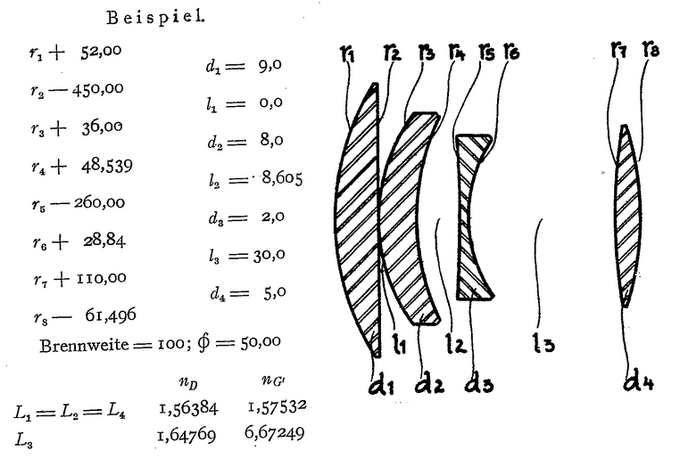
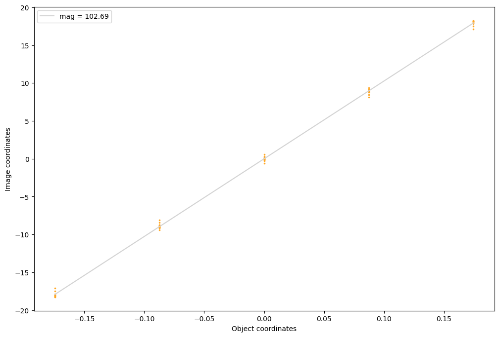
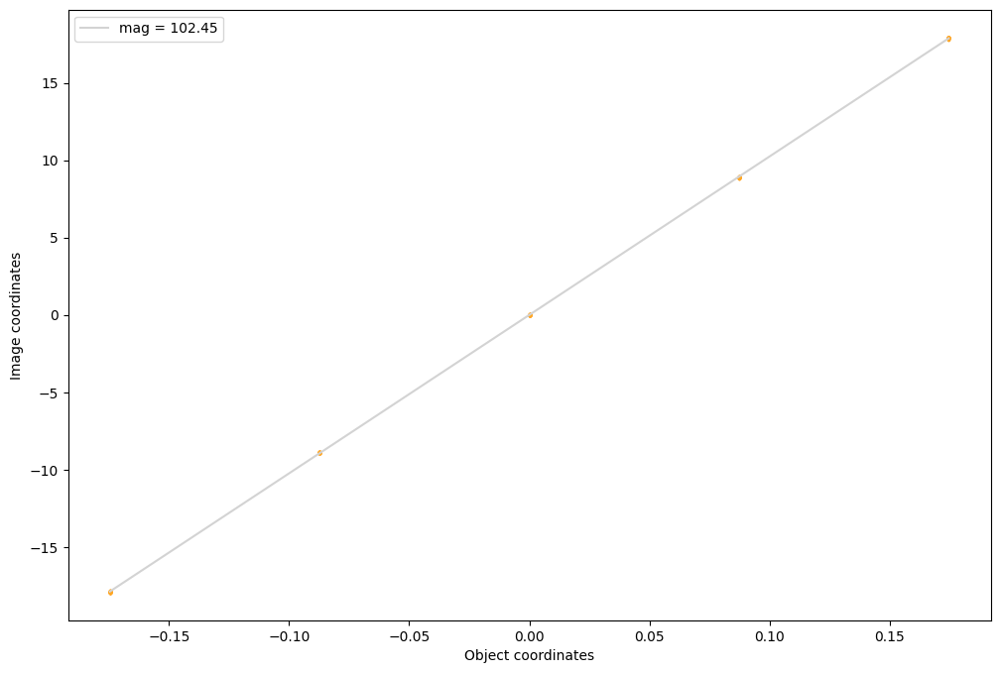

# Ernostar 1928

https://worldwide.espacenet.com/patent/search/family/007074834/publication/DE458499C?q=pn%3DDE458499C




```python
import torch
import torchlensmaker as tlm

# TODO make name optional in materialmodel

# Fit Cauchy model from given values
def fit_cauchy(Nd, Ng, lambda_d, lambda_g):
    B = (Ng - Nd) / (1/(lambda_g**2) - 1/(lambda_d**2))
    A = Nd - B/(lambda_d**2)
    return tlm.CauchyMaterial(A, B)

# is L3 N_G' a typo?
# what is 6.67 ??

material1 = fit_cauchy(Nd=1.56384, Ng=1.57532, lambda_d=0.58929 , lambda_g=0.430790)
material2 = fit_cauchy(Nd=1.64769, Ng=1.67249, lambda_d=0.58929 , lambda_g=0.430790)

print(material1, material2)

tlm.plot_material_models([material1, material2], labels=["1", "2"])

# eye balling those as I can't find them in the patent
D1, D2, D3, D4 = 50, 35, 30, 35

r1 = tlm.Sphere(D1, 52)
r2 = tlm.Sphere(D1, -450)
r3 = tlm.Sphere(D2, 36)
r4 = tlm.Sphere(D2, 48.539)
r5 = tlm.Sphere(D3, -260)
r6 = tlm.Sphere(D3, 28.84)
r7 = tlm.Sphere(D4, 110)
r8 = tlm.Sphere(D4, -61.496)
d1, d2, d3, d4 = 9, 8, 2, 5
l1, l2, l3 = 0, 8.605, 30

L1 = tlm.Lens(r1, r2, material=material1, inner_thickness=d1)
L2 = tlm.Lens(r3, r4, material=material1, inner_thickness=d2)
L3 = tlm.Lens(r5, r6, material=material2, inner_thickness=d3)
L4 = tlm.Lens(r7, r8, material=material1, inner_thickness=d4)

x = tlm.parameter(60)

optics = tlm.Sequential(
    tlm.ObjectAtInfinity(beam_diameter=15, angular_size=20),
    tlm.ChromaticRange(400, 800),
    tlm.Gap(10),
    L1,
    tlm.Gap(l1),
    L2,
    tlm.Gap(l2),
    L3,
    tlm.Gap(l3),
    L4,
    tlm.Gap(x),
    tlm.ImagePlane(100),
)

tlm.show(optics, dim=2, sampling={"base": 5, "object": 5, "wavelength": 5})

tlm.plot_magnification(optics, sampling={"base": 5, "object": 5, "wavelength": 3})
```

    CauchyMaterial(name='(unnamed)', A=1.5506632102741738, B=0.00457580763154747, C=0, D=0) CauchyMaterial(name='(unnamed)', A=1.6192244612194704, B=0.009885019970590192, C=0, D=0)


<div data-jp-suppress-context-menu id='tlmviewer-6321b3a8' class='tlmviewer' style='width: 100%; aspect-ratio: 16 / 9;'></div><script type='module'>async function importtlm() {
    try {
        return await import("/tlmviewer.js");
    } catch (error) {
        console.log("error", error);
        return await import("/files/test_notebooks/tlmviewer.js");
    }
}

const module = await importtlm();
const tlmviewer = module.tlmviewer;

const data = '{"mode": "2D", "camera": "XY", "data": [{"type": "surfaces", "data": [{"matrix": [[1.0, 0.0, 10.0], [0.0, 1.0, 0.0], [0.0, 0.0, 1.0]], "samples": [[6.40394974, 25.00000763], [6.27788925, 24.76870155], [6.15299606, 24.53674889], [6.02928162, 24.30417824], [5.90674973, 24.07098389], [5.78539276, 23.83716011], [5.6652298, 23.60273552], [5.54625702, 23.3677063], [5.42847443, 23.13207626], [5.31188965, 22.89585304], [5.19649124, 22.65903091], [5.08230209, 22.42163849], [4.9693222, 22.18367004], [4.85753632, 21.94512177], [4.74697113, 21.70602036], [4.6376152, 21.46636391], [4.52947998, 21.22615433], [4.42255783, 20.98540306], [4.31685638, 20.74409866], [4.21237946, 20.50227547], [4.10913086, 20.25992584], [4.00710297, 20.01704407], [3.90631485, 19.77365875], [3.8067627, 19.52976799], [3.70844269, 19.2853756], [3.61136627, 19.04048729], [3.51552582, 18.79510117], [3.42093277, 18.54924202], [3.32758713, 18.30290794], [3.23548889, 18.05609131], [3.14464569, 17.80882454], [3.05505371, 17.56110001], [2.96671677, 17.31292343], [2.87964249, 17.06430435], [2.79381943, 16.81523514], [2.70926666, 16.56574631], [2.62598419, 16.31583214], [2.54395676, 16.06548691], [2.46320724, 15.81474113], [2.38372421, 15.56359005], [2.3055191, 15.31203938], [2.2285881, 15.06009674], [2.1529274, 14.80775356], [2.07855225, 14.55504417], [2.00545883, 14.30196095], [1.93364716, 14.04849815], [1.86312103, 13.79468632], [1.79388428, 13.54052067], [1.72592926, 13.28600883], [1.65927124, 13.03115559], [1.59389877, 12.77595425], [1.52982712, 12.52043915], [1.46704483, 12.26460171], [1.40555954, 12.00843716], [1.34537506, 11.75197697], [1.28649139, 11.49521446], [1.22890854, 11.23815823], [1.1726265, 10.98081303], [1.11764908, 10.72317314], [1.0639801, 10.465271], [1.01161575, 10.20709991], [0.96055984, 9.94865608], [0.91081619, 9.68996811], [0.8623848, 9.43103027], [0.81526566, 9.17185211], [0.76945877, 8.91243744], [0.72496414, 8.65278244], [0.68178558, 8.39291763], [0.63993073, 8.1328373], [0.59938431, 7.87253475], [0.56016159, 7.61204386], [0.52226257, 7.35135746], [0.48568344, 7.09048223], [0.45042419, 6.82942486], [0.41648483, 6.56818056], [0.38387299, 6.30677938], [0.35258484, 6.04521656], [0.32262421, 5.78348637], [0.29398727, 5.5216198], [0.26667786, 5.25961161], [0.24069977, 4.99746799], [0.21604538, 4.73519707], [0.19271851, 4.47279167], [0.17072678, 4.21028423], [0.15006256, 3.94766831], [0.13072968, 3.68493891], [0.11272812, 3.42212701], [0.09605789, 3.15922785], [0.08071899, 2.89624739], [0.06671143, 2.6331923], [0.054039, 2.37005758], [0.04270172, 2.10687447], [0.03269196, 1.84363699], [0.02402115, 1.58033991], [0.01668167, 1.31701481], [0.01067734, 1.05365574], [0.00600815, 0.79026973], [0.00267029, 0.5268634], [0.00066757, 0.26343116], [0.0, -4.55e-06], [0.00066757, -0.26343116], [0.00267029, -0.5268634], [0.00600815, -0.79026973], [0.01067734, -1.05365574], [0.01668167, -1.31701481], [0.02402115, -1.58033991], [0.03269196, -1.84363699], [0.04270172, -2.10687447], [0.054039, -2.37005758], [0.06671143, -2.6331923], [0.08071899, -2.89624739], [0.09605789, -3.15922785], [0.11272812, -3.42212701], [0.13072968, -3.68493891], [0.15006256, -3.94766831], [0.17072678, -4.21028423], [0.19271851, -4.47279167], [0.21604538, -4.73519707], [0.24069977, -4.99746799], [0.26667786, -5.25961161], [0.29398727, -5.5216198], [0.32262421, -5.78348637], [0.35258484, -6.04521656], [0.38387299, -6.30677938], [0.41648483, -6.56818056], [0.45042419, -6.82942486], [0.48568344, -7.09048223], [0.52226257, -7.35135746], [0.56016159, -7.61204386], [0.59938431, -7.87253475], [0.63993073, -8.1328373], [0.68178558, -8.39291763], [0.72496414, -8.65278244], [0.76945877, -8.91243744], [0.81526566, -9.17185211], [0.8623848, -9.43103027], [0.91081619, -9.68996811], [0.96055984, -9.94865608], [1.01161575, -10.20709991], [1.0639801, -10.465271], [1.11764908, -10.72317314], [1.1726265, -10.98081303], [1.22890854, -11.23815823], [1.28649139, -11.49521446], [1.34537506, -11.75197697], [1.40555954, -12.00843716], [1.46704483, -12.26460171], [1.52982712, -12.52043915], [1.59389877, -12.77595425], [1.65927124, -13.03115559], [1.72592926, -13.28600883], [1.79388428, -13.54052067], [1.86312103, -13.79468632], [1.93364716, -14.04849815], [2.00545883, -14.30196095], [2.07855225, -14.55504417], [2.1529274, -14.80775356], [2.2285881, -15.06009674], [2.3055191, -15.31203938], [2.38372421, -15.56359005], [2.46320724, -15.81474113], [2.54395676, -16.06548691], [2.62598419, -16.31583214], [2.70926666, -16.56574631], [2.79381943, -16.81523514], [2.87964249, -17.06430435], [2.96671677, -17.31292343], [3.05505371, -17.56110001], [3.14464569, -17.80882454], [3.23548889, -18.05609131], [3.32758713, -18.30290794], [3.42093277, -18.54924202], [3.51552582, -18.79510117], [3.61136627, -19.04048729], [3.70844269, -19.2853756], [3.8067627, -19.52976799], [3.90631485, -19.77365875], [4.00710297, -20.01704407], [4.10913086, -20.25992584], [4.21237946, -20.50227547], [4.31685638, -20.74409866], [4.42255783, -20.98540306], [4.52947998, -21.22615433], [4.6376152, -21.46636391], [4.74697113, -21.70602036], [4.85753632, -21.94512177], [4.9693222, -22.18367004], [5.08230209, -22.42163849], [5.19649124, -22.65903091], [5.31188965, -22.89585304], [5.42847443, -23.13207626], [5.54625702, -23.3677063], [5.6652298, -23.60273552], [5.78539276, -23.83716011], [5.90674973, -24.07098389], [6.02928162, -24.30417824], [6.15299606, -24.53674889], [6.27788925, -24.76870155], [6.40394974, -25.00000763]]}]}, {"type": "surfaces", "data": [{"matrix": [[1.0, 0.0, 19.0], [0.0, 1.0, 0.0], [0.0, 0.0, 1.0]], "samples": [[-0.69497681, -25.0], [-0.68099976, -24.74773026], [-0.66720581, -24.49545288], [-0.65353394, -24.24316978], [-0.63998413, -23.99087715], [-0.6265564, -23.73857689], [-0.61331177, -23.4862709], [-0.60018921, -23.23395729], [-0.58721924, -22.98163414], [-0.57440186, -22.72930336], [-0.56170654, -22.47696686], [-0.54916382, -22.22462463], [-0.53674316, -21.97227478], [-0.5244751, -21.7199173], [-0.51235962, -21.46755219], [-0.50036621, -21.21517944], [-0.48852539, -20.96280289], [-0.47683716, -20.71042061], [-0.465271, -20.45802879], [-0.45385742, -20.20563126], [-0.44259644, -19.95322609], [-0.43145752, -19.70081902], [-0.42047119, -19.4484005], [-0.40963745, -19.19597816], [-0.39889526, -18.94355011], [-0.3883667, -18.69111633], [-0.37792969, -18.43867683], [-0.36764526, -18.18622971], [-0.35751343, -17.93377686], [-0.34750366, -17.68132019], [-0.33764648, -17.4288578], [-0.32794189, -17.17638969], [-0.31835938, -16.92391586], [-0.30892944, -16.67143631], [-0.29962158, -16.41895103], [-0.29049683, -16.16646194], [-0.28146362, -15.91396713], [-0.27261353, -15.6614666], [-0.26391602, -15.40896225], [-0.25531006, -15.15645409], [-0.24685669, -14.90393925], [-0.23858643, -14.65141964], [-0.23043823, -14.39889622], [-0.22241211, -14.14636612], [-0.21453857, -13.89383411], [-0.20678711, -13.64129734], [-0.19924927, -13.3887558], [-0.19177246, -13.13621044], [-0.18447876, -12.88366032], [-0.17730713, -12.63110638], [-0.17028809, -12.37855053], [-0.16339111, -12.12598896], [-0.15667725, -11.87342262], [-0.15005493, -11.62085438], [-0.14364624, -11.36828041], [-0.13729858, -11.11570454], [-0.13113403, -10.86312389], [-0.12509155, -10.61054134], [-0.11923218, -10.35795403], [-0.11349487, -10.10536289], [-0.10787964, -9.85277081], [-0.10241699, -9.60017395], [-0.09710693, -9.34757519], [-0.09191895, -9.09497261], [-0.08688354, -8.84236813], [-0.08200073, -8.58975983], [-0.07723999, -8.33714962], [-0.07263184, -8.0845356], [-0.06814575, -7.83191967], [-0.06384277, -7.57930136], [-0.05966187, -7.32668114], [-0.05560303, -7.07405806], [-0.05172729, -6.82143307], [-0.04794312, -6.56880522], [-0.04434204, -6.31617594], [-0.04086304, -6.06354475], [-0.03753662, -5.81091166], [-0.03433228, -5.55827618], [-0.03128052, -5.30563974], [-0.02838135, -5.05300045], [-0.02560425, -4.8003602], [-0.02297974, -4.54771852], [-0.02047729, -4.29507542], [-0.01815796, -4.04243088], [-0.01596069, -3.78978539], [-0.0138855, -3.53713846], [-0.01199341, -3.28449035], [-0.01022339, -3.03184128], [-0.00857544, -2.77919126], [-0.00708008, -2.52654004], [-0.0057373, -2.27388835], [-0.00454712, -2.02123594], [-0.00344849, -1.76858282], [-0.00253296, -1.51592922], [-0.00177002, -1.26327503], [-0.00112915, -1.01062047], [-0.00064087, -0.75796568], [-0.00027466, -0.5053106], [-9.155e-05, -0.25265533], [0.0, 0.0], [-9.155e-05, 0.25265533], [-0.00027466, 0.5053106], [-0.00064087, 0.75796568], [-0.00112915, 1.01062047], [-0.00177002, 1.26327503], [-0.00253296, 1.51592922], [-0.00344849, 1.76858282], [-0.00454712, 2.02123594], [-0.0057373, 2.27388835], [-0.00708008, 2.52654004], [-0.00857544, 2.77919126], [-0.01022339, 3.03184128], [-0.01199341, 3.28449035], [-0.0138855, 3.53713846], [-0.01596069, 3.78978539], [-0.01815796, 4.04243088], [-0.02047729, 4.29507542], [-0.02297974, 4.54771852], [-0.02560425, 4.8003602], [-0.02838135, 5.05300045], [-0.03128052, 5.30563974], [-0.03433228, 5.55827618], [-0.03753662, 5.81091166], [-0.04086304, 6.06354475], [-0.04434204, 6.31617594], [-0.04794312, 6.56880522], [-0.05172729, 6.82143307], [-0.05560303, 7.07405806], [-0.05966187, 7.32668114], [-0.06384277, 7.57930136], [-0.06814575, 7.83191967], [-0.07263184, 8.0845356], [-0.07723999, 8.33714962], [-0.08200073, 8.58975983], [-0.08688354, 8.84236813], [-0.09191895, 9.09497261], [-0.09710693, 9.34757519], [-0.10241699, 9.60017395], [-0.10787964, 9.85277081], [-0.11349487, 10.10536289], [-0.11923218, 10.35795403], [-0.12509155, 10.61054134], [-0.13113403, 10.86312389], [-0.13729858, 11.11570454], [-0.14364624, 11.36828041], [-0.15005493, 11.62085438], [-0.15667725, 11.87342262], [-0.16339111, 12.12598896], [-0.17028809, 12.37855053], [-0.17730713, 12.63110638], [-0.18447876, 12.88366032], [-0.19177246, 13.13621044], [-0.19924927, 13.3887558], [-0.20678711, 13.64129734], [-0.21453857, 13.89383411], [-0.22241211, 14.14636612], [-0.23043823, 14.39889622], [-0.23858643, 14.65141964], [-0.24685669, 14.90393925], [-0.25531006, 15.15645409], [-0.26391602, 15.40896225], [-0.27261353, 15.6614666], [-0.28146362, 15.91396713], [-0.29049683, 16.16646194], [-0.29962158, 16.41895103], [-0.30892944, 16.67143631], [-0.31835938, 16.92391586], [-0.32794189, 17.17638969], [-0.33764648, 17.4288578], [-0.34750366, 17.68132019], [-0.35751343, 17.93377686], [-0.36764526, 18.18622971], [-0.37792969, 18.43867683], [-0.3883667, 18.69111633], [-0.39889526, 18.94355011], [-0.40963745, 19.19597816], [-0.42047119, 19.4484005], [-0.43145752, 19.70081902], [-0.44259644, 19.95322609], [-0.45385742, 20.20563126], [-0.465271, 20.45802879], [-0.47683716, 20.71042061], [-0.48852539, 20.96280289], [-0.50036621, 21.21517944], [-0.51235962, 21.46755219], [-0.5244751, 21.7199173], [-0.53674316, 21.97227478], [-0.54916382, 22.22462463], [-0.56170654, 22.47696686], [-0.57440186, 22.72930336], [-0.58721924, 22.98163414], [-0.60018921, 23.23395729], [-0.61331177, 23.4862709], [-0.6265564, 23.73857689], [-0.63998413, 23.99087715], [-0.65353394, 24.24316978], [-0.66720581, 24.49545288], [-0.68099976, 24.74773026], [-0.69497681, 25.0]]}]}, {"type": "surfaces", "data": [{"matrix": [[1.0, 0.0, 19.0], [0.0, 1.0, 0.0], [0.0, 0.0, 1.0]], "samples": [[4.53970909, 17.50000381], [4.45038986, 17.3384552], [4.36189842, 17.17645264], [4.27424431, 17.01400566], [4.18741989, 16.85110283], [4.10143089, 16.68775749], [4.01628113, 16.52397346], [3.93197632, 16.35976219], [3.84851074, 16.19511414], [3.76589203, 16.03004074], [3.68411636, 15.86454391], [3.60319519, 15.69863129], [3.52312469, 15.53231335], [3.44391251, 15.36557961], [3.36555099, 15.19844151], [3.28804398, 15.03090286], [3.21140289, 14.86297131], [3.13562393, 14.69465446], [3.06070709, 14.52594471], [2.98665619, 14.35685349], [2.91347504, 14.18738365], [2.84115982, 14.01754093], [2.7697258, 13.84733772], [2.69915771, 13.67676258], [2.6294632, 13.5058279], [2.56064987, 13.33453751], [2.49271393, 13.16289806], [2.42566299, 12.99091911], [2.35949326, 12.81859112], [2.29420471, 12.64592552], [2.22980499, 12.472929], [2.1662941, 12.29961014], [2.10367203, 12.1259613], [2.04193878, 11.95199394], [1.98110199, 11.77771187], [1.92115784, 11.60312748], [1.86211014, 11.42823219], [1.80395889, 11.25303459], [1.7467041, 11.07754135], [1.69035721, 10.90175724], [1.63491058, 10.7256937], [1.58036041, 10.54934025], [1.52672195, 10.37271023], [1.47398758, 10.19580746], [1.4221611, 10.0186367], [1.37124634, 9.84120941], [1.32123947, 9.66351604], [1.27214432, 9.485569], [1.22396088, 9.30737114], [1.17669296, 9.12893105], [1.13034439, 8.95025635], [1.08490753, 8.77134037], [1.04039001, 8.59219265], [0.99679184, 8.41281891], [0.95411682, 8.23322487], [0.91236115, 8.05342197], [0.87152863, 7.87339878], [0.83161926, 7.69316912], [0.79263306, 7.51273727], [0.75457001, 7.33210707], [0.71743774, 7.15129328], [0.68123245, 6.97028303], [0.64595795, 6.78908873], [0.61161041, 6.60771704], [0.57819748, 6.42617893], [0.5457077, 6.2444644], [0.51415634, 6.06258535], [0.48353577, 5.88054657], [0.45384979, 5.69835281], [0.42509842, 5.51601887], [0.39728165, 5.3335309], [0.37040329, 5.15090227], [0.34445953, 4.96813869], [0.31945419, 4.78524446], [0.29538727, 4.60223293], [0.27225876, 4.4190917], [0.25006866, 4.2358346], [0.22881699, 4.05246592], [0.20850754, 3.868999], [0.18914032, 3.68542218], [0.17071152, 3.50174832], [0.15322876, 3.31798244], [0.13668823, 3.13412929], [0.12108612, 2.95020223], [0.10643387, 2.7661891], [0.09272003, 2.58210301], [0.07995224, 2.39794922], [0.06812668, 2.21373272], [0.05725098, 2.02946615], [0.0473175, 1.84513783], [0.03832626, 1.66076088], [0.03028488, 1.47634041], [0.02318573, 1.29188955], [0.01703644, 1.10739625], [0.01183319, 0.92287374], [0.00757217, 0.73832703], [0.00426102, 0.55376089], [0.00189209, 0.36918882], [0.00047302, 0.18459839], [0.0, -3.15e-06], [0.00047302, -0.18459839], [0.00189209, -0.36918882], [0.00426102, -0.55376089], [0.00757217, -0.73832703], [0.01183319, -0.92287374], [0.01703644, -1.10739625], [0.02318573, -1.29188955], [0.03028488, -1.47634041], [0.03832626, -1.66076088], [0.0473175, -1.84513783], [0.05725098, -2.02946615], [0.06812668, -2.21373272], [0.07995224, -2.39794922], [0.09272003, -2.58210301], [0.10643387, -2.7661891], [0.12108612, -2.95020223], [0.13668823, -3.13412929], [0.15322876, -3.31798244], [0.17071152, -3.50174832], [0.18914032, -3.68542218], [0.20850754, -3.868999], [0.22881699, -4.05246592], [0.25006866, -4.2358346], [0.27225876, -4.4190917], [0.29538727, -4.60223293], [0.31945419, -4.78524446], [0.34445953, -4.96813869], [0.37040329, -5.15090227], [0.39728165, -5.3335309], [0.42509842, -5.51601887], [0.45384979, -5.69835281], [0.48353577, -5.88054657], [0.51415634, -6.06258535], [0.5457077, -6.2444644], [0.57819748, -6.42617893], [0.61161041, -6.60771704], [0.64595795, -6.78908873], [0.68123245, -6.97028303], [0.71743774, -7.15129328], [0.75457001, -7.33210707], [0.79263306, -7.51273727], [0.83161926, -7.69316912], [0.87152863, -7.87339878], [0.91236115, -8.05342197], [0.95411682, -8.23322487], [0.99679184, -8.41281891], [1.04039001, -8.59219265], [1.08490753, -8.77134037], [1.13034439, -8.95025635], [1.17669296, -9.12893105], [1.22396088, -9.30737114], [1.27214432, -9.485569], [1.32123947, -9.66351604], [1.37124634, -9.84120941], [1.4221611, -10.0186367], [1.47398758, -10.19580746], [1.52672195, -10.37271023], [1.58036041, -10.54934025], [1.63491058, -10.7256937], [1.69035721, -10.90175724], [1.7467041, -11.07754135], [1.80395889, -11.25303459], [1.86211014, -11.42823219], [1.92115784, -11.60312748], [1.98110199, -11.77771187], [2.04193878, -11.95199394], [2.10367203, -12.1259613], [2.1662941, -12.29961014], [2.22980499, -12.472929], [2.29420471, -12.64592552], [2.35949326, -12.81859112], [2.42566299, -12.99091911], [2.49271393, -13.16289806], [2.56064987, -13.33453751], [2.6294632, -13.5058279], [2.69915771, -13.67676258], [2.7697258, -13.84733772], [2.84115982, -14.01754093], [2.91347504, -14.18738365], [2.98665619, -14.35685349], [3.06070709, -14.52594471], [3.13562393, -14.69465446], [3.21140289, -14.86297131], [3.28804398, -15.03090286], [3.36555099, -15.19844151], [3.44391251, -15.36557961], [3.52312469, -15.53231335], [3.60319519, -15.69863129], [3.68411636, -15.86454391], [3.76589203, -16.03004074], [3.84851074, -16.19511414], [3.93197632, -16.35976219], [4.01628113, -16.52397346], [4.10143089, -16.68775749], [4.18741989, -16.85110283], [4.27424431, -17.01400566], [4.36189842, -17.17645264], [4.45038986, -17.3384552], [4.53970909, -17.50000381]]}]}, {"type": "surfaces", "data": [{"matrix": [[1.0, 0.0, 27.0], [0.0, 1.0, 0.0], [0.0, 0.0, 1.0]], "samples": [[3.26445389, 17.50000381], [3.19957352, 17.33120918], [3.13531494, 17.16216469], [3.07169342, 16.99289513], [3.00869751, 16.8233757], [2.94633102, 16.65362549], [2.88460541, 16.48365211], [2.82350922, 16.31344032], [2.76304626, 16.14300346], [2.70322418, 15.97235203], [2.64403152, 15.8014679], [2.58547974, 15.63037586], [2.527565, 15.45905495], [2.47029114, 15.28753185], [2.41365433, 15.11578369], [2.35765839, 14.94382668], [2.30230331, 14.77167416], [2.2475853, 14.59930515], [2.19351959, 14.42674446], [2.14009094, 14.2539711], [2.08731079, 14.08101273], [2.03516769, 13.9078474], [1.9836731, 13.73448849], [1.93283081, 13.56095028], [1.88262939, 13.38721275], [1.83307266, 13.21328926], [1.78417206, 13.03919411], [1.73591614, 12.86490631], [1.68831253, 12.69045067], [1.64135742, 12.51580906], [1.59505081, 12.34100437], [1.54940033, 12.16601658], [1.50439835, 11.99085999], [1.46005249, 11.81554794], [1.41635513, 11.64006138], [1.37331772, 11.46442413], [1.33093262, 11.28861713], [1.28920364, 11.11265278], [1.24812698, 10.93654537], [1.20771027, 10.76027489], [1.16794968, 10.58386707], [1.12884521, 10.4073], [1.0904007, 10.23058891], [1.05261612, 10.05374718], [1.01548767, 9.87675571], [0.97902298, 9.69963646], [0.94321442, 9.52237225], [0.9080658, 9.34498692], [0.87358093, 9.1674614], [0.83975601, 8.98980713], [0.80659485, 8.81204033], [0.77409363, 8.63414001], [0.74225998, 8.45613098], [0.71108627, 8.2779932], [0.68058014, 8.09975147], [0.65073395, 7.92138672], [0.62155151, 7.74291182], [0.59303665, 7.56434011], [0.56518936, 7.38565254], [0.53800583, 7.20687389], [0.51148987, 7.02798414], [0.48563385, 6.84899664], [0.46045303, 6.66992521], [0.43593597, 6.49074936], [0.4120903, 6.31149578], [0.38890839, 6.13214254], [0.36639404, 5.95270443], [0.3445549, 5.77319479], [0.32337952, 5.59359407], [0.3028717, 5.41392708], [0.28303528, 5.2341733], [0.26387405, 5.05435848], [0.24537659, 4.87446165], [0.22755051, 4.69449759], [0.21039581, 4.51447964], [0.19390869, 4.33438778], [0.17810059, 4.15424728], [0.16295624, 3.97403717], [0.14848709, 3.79377222], [0.13468933, 3.61346626], [0.12156296, 3.43309808], [0.10910797, 3.25269437], [0.09732437, 3.07223344], [0.08621597, 2.89173007], [0.07577896, 2.71119833], [0.06601334, 2.53061724], [0.05692291, 2.35001254], [0.04850388, 2.16936374], [0.04075623, 1.98868477], [0.03368378, 1.80798984], [0.02728653, 1.62725818], [0.02156067, 1.44651544], [0.0165062, 1.26574111], [0.01212692, 1.08496082], [0.00842285, 0.90415394], [0.00539017, 0.72333443], [0.00303268, 0.54251641], [0.00134659, 0.36167938], [0.00033569, 0.18084884], [0.0, -4.24e-06], [0.00033569, -0.18084884], [0.00134659, -0.36167938], [0.00303268, -0.54251641], [0.00539017, -0.72333443], [0.00842285, -0.90415394], [0.01212692, -1.08496082], [0.0165062, -1.26574111], [0.02156067, -1.44651544], [0.02728653, -1.62725818], [0.03368378, -1.80798984], [0.04075623, -1.98868477], [0.04850388, -2.16936374], [0.05692291, -2.35001254], [0.06601334, -2.53061724], [0.07577896, -2.71119833], [0.08621597, -2.89173007], [0.09732437, -3.07223344], [0.10910797, -3.25269437], [0.12156296, -3.43309808], [0.13468933, -3.61346626], [0.14848709, -3.79377222], [0.16295624, -3.97403717], [0.17810059, -4.15424728], [0.19390869, -4.33438778], [0.21039581, -4.51447964], [0.22755051, -4.69449759], [0.24537659, -4.87446165], [0.26387405, -5.05435848], [0.28303528, -5.2341733], [0.3028717, -5.41392708], [0.32337952, -5.59359407], [0.3445549, -5.77319479], [0.36639404, -5.95270443], [0.38890839, -6.13214254], [0.4120903, -6.31149578], [0.43593597, -6.49074936], [0.46045303, -6.66992521], [0.48563385, -6.84899664], [0.51148987, -7.02798414], [0.53800583, -7.20687389], [0.56518936, -7.38565254], [0.59303665, -7.56434011], [0.62155151, -7.74291182], [0.65073395, -7.92138672], [0.68058014, -8.09975147], [0.71108627, -8.2779932], [0.74225998, -8.45613098], [0.77409363, -8.63414001], [0.80659485, -8.81204033], [0.83975601, -8.98980713], [0.87358093, -9.1674614], [0.9080658, -9.34498692], [0.94321442, -9.52237225], [0.97902298, -9.69963646], [1.01548767, -9.87675571], [1.05261612, -10.05374718], [1.0904007, -10.23058891], [1.12884521, -10.4073], [1.16794968, -10.58386707], [1.20771027, -10.76027489], [1.24812698, -10.93654537], [1.28920364, -11.11265278], [1.33093262, -11.28861713], [1.37331772, -11.46442413], [1.41635513, -11.64006138], [1.46005249, -11.81554794], [1.50439835, -11.99085999], [1.54940033, -12.16601658], [1.59505081, -12.34100437], [1.64135742, -12.51580906], [1.68831253, -12.69045067], [1.73591614, -12.86490631], [1.78417206, -13.03919411], [1.83307266, -13.21328926], [1.88262939, -13.38721275], [1.93283081, -13.56095028], [1.9836731, -13.73448849], [2.03516769, -13.9078474], [2.08731079, -14.08101273], [2.14009094, -14.2539711], [2.19351959, -14.42674446], [2.2475853, -14.59930515], [2.30230331, -14.77167416], [2.35765839, -14.94382668], [2.41365433, -15.11578369], [2.47029114, -15.28753185], [2.527565, -15.45905495], [2.58547974, -15.63037586], [2.64403152, -15.8014679], [2.70322418, -15.97235203], [2.76304626, -16.14300346], [2.82350922, -16.31344032], [2.88460541, -16.48365211], [2.94633102, -16.65362549], [3.00869751, -16.8233757], [3.07169342, -16.99289513], [3.13531494, -17.16216469], [3.19957352, -17.33120918], [3.26445389, -17.50000381]]}]}, {"type": "surfaces", "data": [{"matrix": [[1.0, 0.0, 35.605], [0.0, 1.0, 0.0], [0.0, 0.0, 1.0]], "samples": [[-0.43304443, -15.0], [-0.42434692, -14.84865093], [-0.41574097, -14.69729614], [-0.40722656, -14.54593754], [-0.39877319, -14.39457226], [-0.39041138, -14.24320316], [-0.38217163, -14.0918293], [-0.37399292, -13.94044971], [-0.36590576, -13.78906631], [-0.35791016, -13.6376791], [-0.3500061, -13.48628616], [-0.3421936, -13.33488846], [-0.33447266, -13.18348598], [-0.32681274, -13.0320797], [-0.31924438, -12.88066769], [-0.3117981, -12.72925377], [-0.30441284, -12.57783413], [-0.29711914, -12.42640972], [-0.28991699, -12.27498055], [-0.2828064, -12.12354851], [-0.27578735, -11.9721117], [-0.26885986, -11.82067204], [-0.26199341, -11.6692276], [-0.25524902, -11.5177784], [-0.24856567, -11.36632633], [-0.24197388, -11.21487045], [-0.23550415, -11.06340885], [-0.22906494, -10.9119463], [-0.22277832, -10.76047802], [-0.21655273, -10.60900688], [-0.21038818, -10.45753193], [-0.2043457, -10.30605412], [-0.19839478, -10.15457153], [-0.19250488, -10.00308609], [-0.18670654, -9.85159779], [-0.18099976, -9.70010567], [-0.17538452, -9.54861069], [-0.16989136, -9.39711094], [-0.16442871, -9.24561024], [-0.15908813, -9.09410477], [-0.15383911, -8.94259644], [-0.14865112, -8.79108524], [-0.14358521, -8.63957119], [-0.13858032, -8.48805428], [-0.13366699, -8.3365345], [-0.12887573, -8.18501186], [-0.12414551, -8.03348541], [-0.11950684, -7.88195705], [-0.1149292, -7.73042631], [-0.11047363, -7.57889271], [-0.10610962, -7.42735624], [-0.10180664, -7.27581787], [-0.09762573, -7.12427711], [-0.09350586, -6.97273302], [-0.08950806, -6.8211875], [-0.08557129, -6.66963863], [-0.08172607, -6.51808834], [-0.07797241, -6.36653566], [-0.07427979, -6.2149806], [-0.07070923, -6.06342363], [-0.06723022, -5.91186476], [-0.06381226, -5.7603035], [-0.06048584, -5.60874033], [-0.05728149, -5.45717525], [-0.05413818, -5.30560875], [-0.05108643, -5.15403938], [-0.04812622, -5.00246954], [-0.04525757, -4.85089731], [-0.04248047, -4.69932318], [-0.03979492, -4.54774809], [-0.03717041, -4.39617109], [-0.03463745, -4.24459267], [-0.03222656, -4.09301281], [-0.02987671, -3.94143176], [-0.02761841, -3.78984904], [-0.02545166, -3.63826537], [-0.02337646, -3.48668003], [-0.02139282, -3.33509374], [-0.01950073, -3.18350649], [-0.01766968, -3.03191781], [-0.01596069, -2.88032842], [-0.01431274, -2.72873783], [-0.01275635, -2.57714629], [-0.01132202, -2.42555428], [-0.00994873, -2.27396107], [-0.00866699, -2.12236714], [-0.00747681, -1.97077239], [-0.00637817, -1.81917715], [-0.00534058, -1.66758132], [-0.00442505, -1.51598465], [-0.00357056, -1.36438775], [-0.00280762, -1.21279025], [-0.00216675, -1.06119239], [-0.00158691, -0.90959412], [-0.00109863, -0.75799555], [-0.0007019, -0.60639679], [-0.00039673, -0.45479777], [-0.00018311, -0.30319861], [-6.104e-05, -0.15159932], [0.0, 0.0], [-6.104e-05, 0.15159932], [-0.00018311, 0.30319861], [-0.00039673, 0.45479777], [-0.0007019, 0.60639679], [-0.00109863, 0.75799555], [-0.00158691, 0.90959412], [-0.00216675, 1.06119239], [-0.00280762, 1.21279025], [-0.00357056, 1.36438775], [-0.00442505, 1.51598465], [-0.00534058, 1.66758132], [-0.00637817, 1.81917715], [-0.00747681, 1.97077239], [-0.00866699, 2.12236714], [-0.00994873, 2.27396107], [-0.01132202, 2.42555428], [-0.01275635, 2.57714629], [-0.01431274, 2.72873783], [-0.01596069, 2.88032842], [-0.01766968, 3.03191781], [-0.01950073, 3.18350649], [-0.02139282, 3.33509374], [-0.02337646, 3.48668003], [-0.02545166, 3.63826537], [-0.02761841, 3.78984904], [-0.02987671, 3.94143176], [-0.03222656, 4.09301281], [-0.03463745, 4.24459267], [-0.03717041, 4.39617109], [-0.03979492, 4.54774809], [-0.04248047, 4.69932318], [-0.04525757, 4.85089731], [-0.04812622, 5.00246954], [-0.05108643, 5.15403938], [-0.05413818, 5.30560875], [-0.05728149, 5.45717525], [-0.06048584, 5.60874033], [-0.06381226, 5.7603035], [-0.06723022, 5.91186476], [-0.07070923, 6.06342363], [-0.07427979, 6.2149806], [-0.07797241, 6.36653566], [-0.08172607, 6.51808834], [-0.08557129, 6.66963863], [-0.08950806, 6.8211875], [-0.09350586, 6.97273302], [-0.09762573, 7.12427711], [-0.10180664, 7.27581787], [-0.10610962, 7.42735624], [-0.11047363, 7.57889271], [-0.1149292, 7.73042631], [-0.11950684, 7.88195705], [-0.12414551, 8.03348541], [-0.12887573, 8.18501186], [-0.13366699, 8.3365345], [-0.13858032, 8.48805428], [-0.14358521, 8.63957119], [-0.14865112, 8.79108524], [-0.15383911, 8.94259644], [-0.15908813, 9.09410477], [-0.16442871, 9.24561024], [-0.16989136, 9.39711094], [-0.17538452, 9.54861069], [-0.18099976, 9.70010567], [-0.18670654, 9.85159779], [-0.19250488, 10.00308609], [-0.19839478, 10.15457153], [-0.2043457, 10.30605412], [-0.21038818, 10.45753193], [-0.21655273, 10.60900688], [-0.22277832, 10.76047802], [-0.22906494, 10.9119463], [-0.23550415, 11.06340885], [-0.24197388, 11.21487045], [-0.24856567, 11.36632633], [-0.25524902, 11.5177784], [-0.26199341, 11.6692276], [-0.26885986, 11.82067204], [-0.27578735, 11.9721117], [-0.2828064, 12.12354851], [-0.28991699, 12.27498055], [-0.29711914, 12.42640972], [-0.30441284, 12.57783413], [-0.3117981, 12.72925377], [-0.31924438, 12.88066769], [-0.32681274, 13.0320797], [-0.33447266, 13.18348598], [-0.3421936, 13.33488846], [-0.3500061, 13.48628616], [-0.35791016, 13.6376791], [-0.36590576, 13.78906631], [-0.37399292, 13.94044971], [-0.38217163, 14.0918293], [-0.39041138, 14.24320316], [-0.39877319, 14.39457226], [-0.40722656, 14.54593754], [-0.41574097, 14.69729614], [-0.42434692, 14.84865093], [-0.43304443, 15.0]]}]}, {"type": "surfaces", "data": [{"matrix": [[1.0, 0.0, 37.605], [0.0, 1.0, 0.0], [0.0, 0.0, 1.0]], "samples": [[4.20779419, 15.00000191], [4.12529373, 14.86367893], [4.0435524, 14.72690678], [3.96256447, 14.58967876], [3.88233376, 14.45200634], [3.80286789, 14.31389332], [3.72416306, 14.17534161], [3.64622688, 14.03635883], [3.56906319, 13.89695263], [3.49266434, 13.75711632], [3.41704369, 13.61686039], [3.34220123, 13.47619438], [3.26813316, 13.33511162], [3.1948452, 13.19362164], [3.12234116, 13.05172825], [3.05062103, 12.90943623], [2.97968864, 12.76675129], [2.90954971, 12.62368202], [2.84019852, 12.48022175], [2.77164268, 12.33638], [2.70388222, 12.19216824], [2.63691902, 12.04757786], [2.570755, 11.90261936], [2.50539398, 11.75729847], [2.44083405, 11.61161804], [2.37708473, 11.46558952], [2.31414032, 11.31920433], [2.25200653, 11.17247391], [2.19068146, 11.02540302], [2.13017464, 10.87800121], [2.07048225, 10.73026085], [2.01160431, 10.58219337], [1.95354652, 10.4338026], [1.8963089, 10.28509331], [1.83989716, 10.13607693], [1.78430557, 9.98674393], [1.72954178, 9.8371067], [1.67560577, 9.68716908], [1.62249947, 9.53694248], [1.57022285, 9.38641739], [1.51877785, 9.23560619], [1.46816635, 9.08451271], [1.41839218, 8.93314362], [1.36945724, 8.78150749], [1.32135773, 8.62959576], [1.27409935, 8.47742176], [1.22768021, 8.32498741], [1.18210793, 8.17230701], [1.13737679, 8.01936913], [1.09349251, 7.86618805], [1.05045319, 7.71276665], [1.00826454, 7.55910873], [0.96692467, 7.40522146], [0.92643929, 7.25111341], [0.88680077, 7.09677839], [0.84801865, 6.94222593], [0.8100872, 6.78746223], [0.77301598, 6.63249731], [0.73679924, 6.47732401], [0.70144081, 6.32195234], [0.66694069, 6.16638803], [0.63330269, 6.01064205], [0.60052299, 5.85470581], [0.56860733, 5.69859123], [0.53755379, 5.54230213], [0.50736427, 5.38584471], [0.47803879, 5.22922897], [0.44958115, 5.07244682], [0.42198753, 4.9155097], [0.39526558, 4.75842285], [0.36940956, 4.60119772], [0.34442139, 4.44382524], [0.32030487, 4.28631687], [0.2970562, 4.12867737], [0.27468109, 3.97091246], [0.25317764, 3.81303263], [0.23254776, 3.65502977], [0.21278954, 3.49691534], [0.19390678, 3.33869433], [0.17589569, 3.1803782], [0.15876389, 3.02195811], [0.14250565, 2.86344552], [0.12712097, 2.70484591], [0.11261559, 2.54616356], [0.09898758, 2.3874104], [0.08623505, 2.22857738], [0.07435989, 2.0696764], [0.06336403, 1.91071224], [0.05324745, 1.75169659], [0.04400826, 1.59262061], [0.03564835, 1.43349588], [0.02816772, 1.27432752], [0.02156639, 1.11512029], [0.01584625, 0.95588601], [0.0110054, 0.79661554], [0.00704193, 0.6373207], [0.00396156, 0.47800645], [0.00176048, 0.31868449], [0.0004406, 0.15934594], [0.0, -2.52e-06], [0.0004406, -0.15934594], [0.00176048, -0.31868449], [0.00396156, -0.47800645], [0.00704193, -0.6373207], [0.0110054, -0.79661554], [0.01584625, -0.95588601], [0.02156639, -1.11512029], [0.02816772, -1.27432752], [0.03564835, -1.43349588], [0.04400826, -1.59262061], [0.05324745, -1.75169659], [0.06336403, -1.91071224], [0.07435989, -2.0696764], [0.08623505, -2.22857738], [0.09898758, -2.3874104], [0.11261559, -2.54616356], [0.12712097, -2.70484591], [0.14250565, -2.86344552], [0.15876389, -3.02195811], [0.17589569, -3.1803782], [0.19390678, -3.33869433], [0.21278954, -3.49691534], [0.23254776, -3.65502977], [0.25317764, -3.81303263], [0.27468109, -3.97091246], [0.2970562, -4.12867737], [0.32030487, -4.28631687], [0.34442139, -4.44382524], [0.36940956, -4.60119772], [0.39526558, -4.75842285], [0.42198753, -4.9155097], [0.44958115, -5.07244682], [0.47803879, -5.22922897], [0.50736427, -5.38584471], [0.53755379, -5.54230213], [0.56860733, -5.69859123], [0.60052299, -5.85470581], [0.63330269, -6.01064205], [0.66694069, -6.16638803], [0.70144081, -6.32195234], [0.73679924, -6.47732401], [0.77301598, -6.63249731], [0.8100872, -6.78746223], [0.84801865, -6.94222593], [0.88680077, -7.09677839], [0.92643929, -7.25111341], [0.96692467, -7.40522146], [1.00826454, -7.55910873], [1.05045319, -7.71276665], [1.09349251, -7.86618805], [1.13737679, -8.01936913], [1.18210793, -8.17230701], [1.22768021, -8.32498741], [1.27409935, -8.47742176], [1.32135773, -8.62959576], [1.36945724, -8.78150749], [1.41839218, -8.93314362], [1.46816635, -9.08451271], [1.51877785, -9.23560619], [1.57022285, -9.38641739], [1.62249947, -9.53694248], [1.67560577, -9.68716908], [1.72954178, -9.8371067], [1.78430557, -9.98674393], [1.83989716, -10.13607693], [1.8963089, -10.28509331], [1.95354652, -10.4338026], [2.01160431, -10.58219337], [2.07048225, -10.73026085], [2.13017464, -10.87800121], [2.19068146, -11.02540302], [2.25200653, -11.17247391], [2.31414032, -11.31920433], [2.37708473, -11.46558952], [2.44083405, -11.61161804], [2.50539398, -11.75729847], [2.570755, -11.90261936], [2.63691902, -12.04757786], [2.70388222, -12.19216824], [2.77164268, -12.33638], [2.84019852, -12.48022175], [2.90954971, -12.62368202], [2.97968864, -12.76675129], [3.05062103, -12.90943623], [3.12234116, -13.05172825], [3.1948452, -13.19362164], [3.26813316, -13.33511162], [3.34220123, -13.47619438], [3.41704369, -13.61686039], [3.49266434, -13.75711632], [3.56906319, -13.89695263], [3.64622688, -14.03635883], [3.72416306, -14.17534161], [3.80286789, -14.31389332], [3.88233376, -14.45200634], [3.96256447, -14.58967876], [4.0435524, -14.72690678], [4.12529373, -14.86367893], [4.20779419, -15.00000191]]}]}, {"type": "surfaces", "data": [{"matrix": [[1.0, 0.0, 67.605], [0.0, 1.0, 0.0], [0.0, 0.0, 1.0]], "samples": [[1.40097046, 17.50000954], [1.3728714, 17.3247242], [1.345047, 17.14939308], [1.31751251, 16.9740181], [1.29026031, 16.79859734], [1.26329803, 16.62313461], [1.23661041, 16.44762802], [1.21020508, 16.27210426], [1.18408966, 16.09651184], [1.15825653, 15.92087746], [1.13270569, 15.74520206], [1.10743713, 15.56948566], [1.08245087, 15.39372921], [1.05774689, 15.21793079], [1.03333282, 15.04209518], [1.00920105, 14.86621857], [0.98534393, 14.6903038], [0.96178436, 14.51435184], [0.93849945, 14.33835983], [0.91549683, 14.16233253], [0.89278412, 13.98629379], [0.8703537, 13.81019211], [0.8482132, 13.63405418], [0.82634735, 13.45788193], [0.80477142, 13.28167343], [0.78348541, 13.1054306], [0.76247406, 12.9291544], [0.74175262, 12.75284386], [0.72131348, 12.57650089], [0.70115662, 12.40012455], [0.68128967, 12.22371578], [0.66170502, 12.04727554], [0.64241028, 11.87082958], [0.6233902, 11.69432735], [0.60466003, 11.51779366], [0.58621979, 11.34123039], [0.5680542, 11.16463757], [0.55017853, 10.98801613], [0.53258514, 10.81136513], [0.51528168, 10.63468742], [0.4982605, 10.45798111], [0.48152924, 10.28124714], [0.46508026, 10.10448742], [0.44891357, 9.92770004], [0.4330368, 9.75091457], [0.41744232, 9.57407665], [0.40213776, 9.39721394], [0.38710785, 9.22032642], [0.37236786, 9.04341507], [0.35791779, 8.86648083], [0.34375763, 8.68952179], [0.32987213, 8.51254177], [0.31627655, 8.33553886], [0.30297089, 8.15851402], [0.28994751, 7.98146868], [0.27720642, 7.80440187], [0.26475525, 7.62731552], [0.25258636, 7.45023489], [0.2407074, 7.27310896], [0.22911835, 7.09596348], [0.21780396, 6.91879988], [0.20678711, 6.74161863], [0.19604492, 6.56441975], [0.18559265, 6.38720322], [0.1754303, 6.20997047], [0.16555023, 6.032722], [0.15596008, 5.85545731], [0.14665222, 5.67817688], [0.13762665, 5.50088215], [0.12889099, 5.32359982], [0.12045288, 5.14627695], [0.11228943, 4.96894026], [0.10441589, 4.79159069], [0.09681702, 4.6142292], [0.08951569, 4.43685532], [0.08250427, 4.25946999], [0.07576752, 4.08207369], [0.06932068, 3.90466666], [0.06316376, 3.72724938], [0.05728912, 3.54982257], [0.05170441, 3.37238622], [0.04640961, 3.19496775], [0.04139709, 3.01751423], [0.03666687, 2.84005308], [0.03223419, 2.66258478], [0.02807617, 2.48510933], [0.02420807, 2.30762744], [0.02062988, 2.13013935], [0.01733398, 1.95264578], [0.014328, 1.77514732], [0.01160431, 1.59764409], [0.0091629, 1.42013669], [0.00701904, 1.24262559], [0.00515747, 1.06513751], [0.00357819, 0.88762045], [0.00229645, 0.71010101], [0.00128937, 0.53257978], [0.0005722, 0.35505718], [0.00014496, 0.17753363], [0.0, -9.62e-06], [0.00014496, -0.17753363], [0.0005722, -0.35505718], [0.00128937, -0.53257978], [0.00229645, -0.71010101], [0.00357819, -0.88762045], [0.00515747, -1.06513751], [0.00701904, -1.24262559], [0.0091629, -1.42013669], [0.01160431, -1.59764409], [0.014328, -1.77514732], [0.01733398, -1.95264578], [0.02062988, -2.13013935], [0.02420807, -2.30762744], [0.02807617, -2.48510933], [0.03223419, -2.66258478], [0.03666687, -2.84005308], [0.04139709, -3.01751423], [0.04640961, -3.19496775], [0.05170441, -3.37238622], [0.05728912, -3.54982257], [0.06316376, -3.72724938], [0.06932068, -3.90466666], [0.07576752, -4.08207369], [0.08250427, -4.25946999], [0.08951569, -4.43685532], [0.09681702, -4.6142292], [0.10441589, -4.79159069], [0.11228943, -4.96894026], [0.12045288, -5.14627695], [0.12889099, -5.32359982], [0.13762665, -5.50088215], [0.14665222, -5.67817688], [0.15596008, -5.85545731], [0.16555023, -6.032722], [0.1754303, -6.20997047], [0.18559265, -6.38720322], [0.19604492, -6.56441975], [0.20678711, -6.74161863], [0.21780396, -6.91879988], [0.22911835, -7.09596348], [0.2407074, -7.27310896], [0.25258636, -7.45023489], [0.26475525, -7.62731552], [0.27720642, -7.80440187], [0.28994751, -7.98146868], [0.30297089, -8.15851402], [0.31627655, -8.33553886], [0.32987213, -8.51254177], [0.34375763, -8.68952179], [0.35791779, -8.86648083], [0.37236786, -9.04341507], [0.38710785, -9.22032642], [0.40213776, -9.39721394], [0.41744232, -9.57407665], [0.4330368, -9.75091457], [0.44891357, -9.92770004], [0.46508026, -10.10448742], [0.48152924, -10.28124714], [0.4982605, -10.45798111], [0.51528168, -10.63468742], [0.53258514, -10.81136513], [0.55017853, -10.98801613], [0.5680542, -11.16463757], [0.58621979, -11.34123039], [0.60466003, -11.51779366], [0.6233902, -11.69432735], [0.64241028, -11.87082958], [0.66170502, -12.04727554], [0.68128967, -12.22371578], [0.70115662, -12.40012455], [0.72131348, -12.57650089], [0.74175262, -12.75284386], [0.76247406, -12.9291544], [0.78348541, -13.1054306], [0.80477142, -13.28167343], [0.82634735, -13.45788193], [0.8482132, -13.63405418], [0.8703537, -13.81019211], [0.89278412, -13.98629379], [0.91549683, -14.16233253], [0.93849945, -14.33835983], [0.96178436, -14.51435184], [0.98534393, -14.6903038], [1.00920105, -14.86621857], [1.03333282, -15.04209518], [1.05774689, -15.21793079], [1.08245087, -15.39372921], [1.10743713, -15.56948566], [1.13270569, -15.74520206], [1.15825653, -15.92087746], [1.18408966, -16.09651184], [1.21020508, -16.27210426], [1.23661041, -16.44762802], [1.26329803, -16.62313461], [1.29026031, -16.79859734], [1.31751251, -16.9740181], [1.345047, -17.14939308], [1.3728714, -17.3247242], [1.40097046, -17.50000954]]}]}, {"type": "surfaces", "data": [{"matrix": [[1.0, 0.0, 72.605], [0.0, 1.0, 0.0], [0.0, 0.0, 1.0]], "samples": [[-2.54256058, -17.5], [-2.49180222, -17.32809067], [-2.44154739, -17.15603638], [-2.3917923, -16.98383522], [-2.34254074, -16.81148911], [-2.29378891, -16.63900185], [-2.24554443, -16.46637154], [-2.19779968, -16.2936039], [-2.15055847, -16.12069321], [-2.10382462, -15.947649], [-2.0575943, -15.77447033], [-2.01186752, -15.60115433], [-1.9666481, -15.42770958], [-1.92193222, -15.25413036], [-1.87772369, -15.08042431], [-1.83402252, -14.90658855], [-1.7908287, -14.73262596], [-1.74813843, -14.55853844], [-1.70595932, -14.38432693], [-1.66428375, -14.20999336], [-1.62312317, -14.03553963], [-1.58246613, -13.86096668], [-1.54231644, -13.68627548], [-1.50268173, -13.51146889], [-1.46355438, -13.33654594], [-1.42493439, -13.16151142], [-1.38682938, -12.98636436], [-1.34923172, -12.81110573], [-1.31214523, -12.63574028], [-1.27557373, -12.46026611], [-1.23950958, -12.28468609], [-1.20396042, -12.10900211], [-1.16892242, -11.93321609], [-1.1343956, -11.75732803], [-1.10038376, -11.58133984], [-1.06688309, -11.40525341], [-1.03389359, -11.22906971], [-1.00142288, -11.0527916], [-0.96946335, -10.87641811], [-0.93802261, -10.69995308], [-0.90708923, -10.52339745], [-0.87667084, -10.34675217], [-0.84677505, -10.1700182], [-0.81738663, -9.99319935], [-0.788517, -9.81629467], [-0.76016235, -9.63930702], [-0.73232651, -9.4622364], [-0.70500565, -9.28508663], [-0.67819977, -9.1078577], [-0.65190887, -8.93055058], [-0.62614059, -8.75316811], [-0.60088348, -8.5757122], [-0.57614517, -8.39818192], [-0.55192947, -8.22058105], [-0.52822495, -8.04291058], [-0.50503922, -7.86517096], [-0.4823761, -7.68736458], [-0.46022797, -7.5094943], [-0.43859863, -7.33155918], [-0.4174881, -7.15356112], [-0.39690018, -6.97550297], [-0.37682724, -6.79738617], [-0.35726929, -6.6192112], [-0.33824158, -6.44097948], [-0.31972504, -6.26269341], [-0.30173111, -6.0843544], [-0.28425598, -5.90596294], [-0.26730347, -5.72752237], [-0.25086594, -5.54903221], [-0.23495483, -5.37049532], [-0.21955872, -5.19191313], [-0.20468903, -5.01328611], [-0.19033432, -4.83461666], [-0.17650604, -4.6559062], [-0.16319275, -4.47715664], [-0.15040588, -4.29836845], [-0.13813782, -4.11954403], [-0.12639236, -3.94068456], [-0.11516571, -3.76179171], [-0.10446167, -3.58286691], [-0.09428024, -3.40391159], [-0.08461761, -3.22492719], [-0.0754776, -3.04591584], [-0.0668602, -2.86687827], [-0.05876923, -2.68781614], [-0.05119705, -2.50873137], [-0.04414368, -2.32962537], [-0.03761292, -2.15049982], [-0.03160858, -1.97135556], [-0.02611923, -1.7921946], [-0.02115631, -1.61301863], [-0.01671982, -1.43382883], [-0.01279831, -1.25462687], [-0.00940704, -1.0754143], [-0.00653076, -0.89619249], [-0.00417709, -0.71696311], [-0.00234985, -0.53772765], [-0.00104523, -0.35848767], [-0.0002594, -0.17924459], [0.0, 0.0], [-0.0002594, 0.17924459], [-0.00104523, 0.35848767], [-0.00234985, 0.53772765], [-0.00417709, 0.71696311], [-0.00653076, 0.89619249], [-0.00940704, 1.0754143], [-0.01279831, 1.25462687], [-0.01671982, 1.43382883], [-0.02115631, 1.61301863], [-0.02611923, 1.7921946], [-0.03160858, 1.97135556], [-0.03761292, 2.15049982], [-0.04414368, 2.32962537], [-0.05119705, 2.50873137], [-0.05876923, 2.68781614], [-0.0668602, 2.86687827], [-0.0754776, 3.04591584], [-0.08461761, 3.22492719], [-0.09428024, 3.40391159], [-0.10446167, 3.58286691], [-0.11516571, 3.76179171], [-0.12639236, 3.94068456], [-0.13813782, 4.11954403], [-0.15040588, 4.29836845], [-0.16319275, 4.47715664], [-0.17650604, 4.6559062], [-0.19033432, 4.83461666], [-0.20468903, 5.01328611], [-0.21955872, 5.19191313], [-0.23495483, 5.37049532], [-0.25086594, 5.54903221], [-0.26730347, 5.72752237], [-0.28425598, 5.90596294], [-0.30173111, 6.0843544], [-0.31972504, 6.26269341], [-0.33824158, 6.44097948], [-0.35726929, 6.6192112], [-0.37682724, 6.79738617], [-0.39690018, 6.97550297], [-0.4174881, 7.15356112], [-0.43859863, 7.33155918], [-0.46022797, 7.5094943], [-0.4823761, 7.68736458], [-0.50503922, 7.86517096], [-0.52822495, 8.04291058], [-0.55192947, 8.22058105], [-0.57614517, 8.39818192], [-0.60088348, 8.5757122], [-0.62614059, 8.75316811], [-0.65190887, 8.93055058], [-0.67819977, 9.1078577], [-0.70500565, 9.28508663], [-0.73232651, 9.4622364], [-0.76016235, 9.63930702], [-0.788517, 9.81629467], [-0.81738663, 9.99319935], [-0.84677505, 10.1700182], [-0.87667084, 10.34675217], [-0.90708923, 10.52339745], [-0.93802261, 10.69995308], [-0.96946335, 10.87641811], [-1.00142288, 11.0527916], [-1.03389359, 11.22906971], [-1.06688309, 11.40525341], [-1.10038376, 11.58133984], [-1.1343956, 11.75732803], [-1.16892242, 11.93321609], [-1.20396042, 12.10900211], [-1.23950958, 12.28468609], [-1.27557373, 12.46026611], [-1.31214523, 12.63574028], [-1.34923172, 12.81110573], [-1.38682938, 12.98636436], [-1.42493439, 13.16151142], [-1.46355438, 13.33654594], [-1.50268173, 13.51146889], [-1.54231644, 13.68627548], [-1.58246613, 13.86096668], [-1.62312317, 14.03553963], [-1.66428375, 14.20999336], [-1.70595932, 14.38432693], [-1.74813843, 14.55853844], [-1.7908287, 14.73262596], [-1.83402252, 14.90658855], [-1.87772369, 15.08042431], [-1.92193222, 15.25413036], [-1.9666481, 15.42770958], [-2.01186752, 15.60115433], [-2.0575943, 15.77447033], [-2.10382462, 15.947649], [-2.15055847, 16.12069321], [-2.19779968, 16.2936039], [-2.24554443, 16.46637154], [-2.29378891, 16.63900185], [-2.34254074, 16.81148911], [-2.3917923, 16.98383522], [-2.44154739, 17.15603638], [-2.49180222, 17.32809067], [-2.54256058, 17.5]]}]}, {"type": "surfaces", "data": [{"matrix": [[1.0, 0.0, 132.605], [0.0, 1.0, 0.0], [0.0, 0.0, 1.0]], "samples": [[0.0, -50.0], [0.0, -49.49494934], [0.0, -48.98989868], [0.0, -48.48484802], [0.0, -47.97979736], [0.0, -47.4747467], [0.0, -46.96969604], [0.0, -46.46464539], [0.0, -45.95959473], [0.0, -45.45454407], [0.0, -44.94949341], [0.0, -44.44444656], [0.0, -43.9393959], [0.0, -43.43434525], [0.0, -42.92929459], [0.0, -42.42424393], [0.0, -41.91919327], [0.0, -41.41414261], [0.0, -40.90909195], [0.0, -40.40404129], [0.0, -39.89899063], [0.0, -39.39393997], [0.0, -38.88888931], [0.0, -38.38383865], [0.0, -37.87878799], [0.0, -37.37373734], [0.0, -36.86868668], [0.0, -36.36363602], [0.0, -35.85858536], [0.0, -35.3535347], [0.0, -34.84848404], [0.0, -34.34343338], [0.0, -33.83838654], [0.0, -33.33333588], [0.0, -32.82828522], [0.0, -32.32323456], [0.0, -31.81818199], [0.0, -31.31313133], [0.0, -30.80808258], [0.0, -30.30303192], [0.0, -29.79798126], [0.0, -29.2929306], [0.0, -28.78787994], [0.0, -28.28282928], [0.0, -27.77777863], [0.0, -27.27272797], [0.0, -26.76767731], [0.0, -26.26262665], [0.0, -25.75757599], [0.0, -25.25252724], [0.0, -24.74747276], [0.0, -24.24242401], [0.0, -23.73737335], [0.0, -23.23232269], [0.0, -22.72727203], [0.0, -22.22222137], [0.0, -21.71717072], [0.0, -21.21212006], [0.0, -20.7070694], [0.0, -20.20201874], [0.0, -19.69696808], [0.0, -19.19191742], [0.0, -18.68686867], [0.0, -18.18181801], [0.0, -17.67676735], [0.0, -17.17171669], [0.0, -16.66666603], [0.0, -16.16161537], [0.0, -15.65656471], [0.0, -15.15151405], [0.0, -14.64646435], [0.0, -14.14141369], [0.0, -13.63636303], [0.0, -13.13131237], [0.0, -12.62626171], [0.0, -12.12121201], [0.0, -11.61616135], [0.0, -11.11111069], [0.0, -10.60606003], [0.0, -10.10100937], [0.0, -9.59595871], [0.0, -9.090909], [0.0, -8.58585835], [0.0, -8.08080769], [0.0, -7.57575703], [0.0, -7.07070684], [0.0, -6.56565619], [0.0, -6.060606], [0.0, -5.55555534], [0.0, -5.05050468], [0.0, -4.5454545], [0.0, -4.04040384], [0.0, -3.53535342], [0.0, -3.030303], [0.0, -2.52525234], [0.0, -2.02020192], [0.0, -1.5151515], [0.0, -1.01010096], [0.0, -0.50505048], [0.0, 0.0], [0.0, 0.50505048], [0.0, 1.01010096], [0.0, 1.5151515], [0.0, 2.02020192], [0.0, 2.52525234], [0.0, 3.030303], [0.0, 3.53535342], [0.0, 4.04040384], [0.0, 4.5454545], [0.0, 5.05050468], [0.0, 5.55555534], [0.0, 6.060606], [0.0, 6.56565619], [0.0, 7.07070684], [0.0, 7.57575703], [0.0, 8.08080769], [0.0, 8.58585835], [0.0, 9.090909], [0.0, 9.59595871], [0.0, 10.10100937], [0.0, 10.60606003], [0.0, 11.11111069], [0.0, 11.61616135], [0.0, 12.12121201], [0.0, 12.62626171], [0.0, 13.13131237], [0.0, 13.63636303], [0.0, 14.14141369], [0.0, 14.64646435], [0.0, 15.15151405], [0.0, 15.65656471], [0.0, 16.16161537], [0.0, 16.66666603], [0.0, 17.17171669], [0.0, 17.67676735], [0.0, 18.18181801], [0.0, 18.68686867], [0.0, 19.19191742], [0.0, 19.69696808], [0.0, 20.20201874], [0.0, 20.7070694], [0.0, 21.21212006], [0.0, 21.71717072], [0.0, 22.22222137], [0.0, 22.72727203], [0.0, 23.23232269], [0.0, 23.73737335], [0.0, 24.24242401], [0.0, 24.74747276], [0.0, 25.25252724], [0.0, 25.75757599], [0.0, 26.26262665], [0.0, 26.76767731], [0.0, 27.27272797], [0.0, 27.77777863], [0.0, 28.28282928], [0.0, 28.78787994], [0.0, 29.2929306], [0.0, 29.79798126], [0.0, 30.30303192], [0.0, 30.80808258], [0.0, 31.31313133], [0.0, 31.81818199], [0.0, 32.32323456], [0.0, 32.82828522], [0.0, 33.33333588], [0.0, 33.83838654], [0.0, 34.34343338], [0.0, 34.84848404], [0.0, 35.3535347], [0.0, 35.85858536], [0.0, 36.36363602], [0.0, 36.86868668], [0.0, 37.37373734], [0.0, 37.87878799], [0.0, 38.38383865], [0.0, 38.88888931], [0.0, 39.39393997], [0.0, 39.89899063], [0.0, 40.40404129], [0.0, 40.90909195], [0.0, 41.41414261], [0.0, 41.91919327], [0.0, 42.42424393], [0.0, 42.92929459], [0.0, 43.43434525], [0.0, 43.9393959], [0.0, 44.44444656], [0.0, 44.94949341], [0.0, 45.45454407], [0.0, 45.95959473], [0.0, 46.46464539], [0.0, 46.96969604], [0.0, 47.4747467], [0.0, 47.97979736], [0.0, 48.48484802], [0.0, 48.98989868], [0.0, 49.49494934], [0.0, 50.0]]}]}, {"type": "rays", "points": [[0.0, -7.5, 10.85939521, -9.41480437], [0.0, -7.5, 10.85939521, -9.41480437], [0.0, -7.5, 10.85939521, -9.41480437], [0.0, -7.5, 10.85939521, -9.41480437], [0.0, -7.5, 10.85939521, -9.41480437], [0.0, -7.5, 10.68871083, -8.43514103], [0.0, -7.5, 10.68871083, -8.43514103], [0.0, -7.5, 10.68871083, -8.43514103], [0.0, -7.5, 10.68871083, -8.43514103], [0.0, -7.5, 10.68871083, -8.43514103], [0.0, -7.5, 10.54370787, -7.5], [0.0, -7.5, 10.54370787, -7.5], [0.0, -7.5, 10.54370787, -7.5], [0.0, -7.5, 10.54370787, -7.5], [0.0, -7.5, 10.54370787, -7.5], [0.0, -7.5, 10.41907006, -6.58844949], [0.0, -7.5, 10.41907006, -6.58844949], [0.0, -7.5, 10.41907006, -6.58844949], [0.0, -7.5, 10.41907006, -6.58844949], [0.0, -7.5, 10.41907006, -6.58844949], [0.0, -7.5, 10.31134753, -5.68183122], [0.0, -7.5, 10.31134753, -5.68183122], [0.0, -7.5, 10.31134753, -5.68183122], [0.0, -7.5, 10.31134753, -5.68183122], [0.0, -7.5, 10.31134753, -5.68183122], [0.0, -3.75, 10.29874037, -5.56594579], [0.0, -3.75, 10.29874037, -5.56594579], [0.0, -3.75, 10.29874037, -5.56594579], [0.0, -3.75, 10.29874037, -5.56594579], [0.0, -3.75, 10.29874037, -5.56594579], [0.0, -3.75, 10.20770318, -4.64305831], [0.0, -3.75, 10.20770318, -4.64305831], [0.0, -3.75, 10.20770318, -4.64305831], [0.0, -3.75, 10.20770318, -4.64305831], [0.0, -3.75, 10.20770318, -4.64305831], [0.0, -3.75, 10.13539261, -3.75], [0.0, -3.75, 10.13539261, -3.75], [0.0, -3.75, 10.13539261, -3.75], [0.0, -3.75, 10.13539261, -3.75], [0.0, -3.75, 10.13539261, -3.75], [0.0, -3.75, 10.07916122, -2.86818766], [0.0, -3.75, 10.07916122, -2.86818766], [0.0, -3.75, 10.07916122, -2.86818766], [0.0, -3.75, 10.07916122, -2.86818766], [0.0, -3.75, 10.07916122, -2.86818766], [0.0, -3.75, 10.03771289, -1.98008039], [0.0, -3.75, 10.03771289, -1.98008039], [0.0, -3.75, 10.03771289, -1.98008039], [0.0, -3.75, 10.03771289, -1.98008039], [0.0, -3.75, 10.03771289, -1.98008039], [0.0, 0.0, 10.03008424, -1.76857447], [0.0, 0.0, 10.03008424, -1.76857447], [0.0, 0.0, 10.03008424, -1.76857447], [0.0, 0.0, 10.03008424, -1.76857447], [0.0, 0.0, 10.03008424, -1.76857447], [0.0, 0.0, 10.00737125, -0.87553154], [0.0, 0.0, 10.00737125, -0.87553154], [0.0, 0.0, 10.00737125, -0.87553154], [0.0, 0.0, 10.00737125, -0.87553154], [0.0, 0.0, 10.00737125, -0.87553154], [0.0, 0.0, 10.0, 0.0], [0.0, 0.0, 10.0, 0.0], [0.0, 0.0, 10.0, 0.0], [0.0, 0.0, 10.0, 0.0], [0.0, 0.0, 10.0, 0.0], [0.0, 0.0, 10.00737125, 0.87553154], [0.0, 0.0, 10.00737125, 0.87553154], [0.0, 0.0, 10.00737125, 0.87553154], [0.0, 0.0, 10.00737125, 0.87553154], [0.0, 0.0, 10.00737125, 0.87553154], [0.0, 0.0, 10.03008424, 1.76857447], [0.0, 0.0, 10.03008424, 1.76857447], [0.0, 0.0, 10.03008424, 1.76857447], [0.0, 0.0, 10.03008424, 1.76857447], [0.0, 0.0, 10.03008424, 1.76857447], [0.0, 3.75, 10.03771289, 1.98008039], [0.0, 3.75, 10.03771289, 1.98008039], [0.0, 3.75, 10.03771289, 1.98008039], [0.0, 3.75, 10.03771289, 1.98008039], [0.0, 3.75, 10.03771289, 1.98008039], [0.0, 3.75, 10.07916122, 2.86818766], [0.0, 3.75, 10.07916122, 2.86818766], [0.0, 3.75, 10.07916122, 2.86818766], [0.0, 3.75, 10.07916122, 2.86818766], [0.0, 3.75, 10.07916122, 2.86818766], [0.0, 3.75, 10.13539261, 3.75], [0.0, 3.75, 10.13539261, 3.75], [0.0, 3.75, 10.13539261, 3.75], [0.0, 3.75, 10.13539261, 3.75], [0.0, 3.75, 10.13539261, 3.75], [0.0, 3.75, 10.20770318, 4.64305831], [0.0, 3.75, 10.20770318, 4.64305831], [0.0, 3.75, 10.20770318, 4.64305831], [0.0, 3.75, 10.20770318, 4.64305831], [0.0, 3.75, 10.20770318, 4.64305831], [0.0, 3.75, 10.29874037, 5.56594579], [0.0, 3.75, 10.29874037, 5.56594579], [0.0, 3.75, 10.29874037, 5.56594579], [0.0, 3.75, 10.29874037, 5.56594579], [0.0, 3.75, 10.29874037, 5.56594579], [0.0, 7.5, 10.31134753, 5.68183122], [0.0, 7.5, 10.31134753, 5.68183122], [0.0, 7.5, 10.31134753, 5.68183122], [0.0, 7.5, 10.31134753, 5.68183122], [0.0, 7.5, 10.31134753, 5.68183122], [0.0, 7.5, 10.41907006, 6.58844949], [0.0, 7.5, 10.41907006, 6.58844949], [0.0, 7.5, 10.41907006, 6.58844949], [0.0, 7.5, 10.41907006, 6.58844949], [0.0, 7.5, 10.41907006, 6.58844949], [0.0, 7.5, 10.54370787, 7.5], [0.0, 7.5, 10.54370787, 7.5], [0.0, 7.5, 10.54370787, 7.5], [0.0, 7.5, 10.54370787, 7.5], [0.0, 7.5, 10.54370787, 7.5], [0.0, 7.5, 10.68871083, 8.43514103], [0.0, 7.5, 10.68871083, 8.43514103], [0.0, 7.5, 10.68871083, 8.43514103], [0.0, 7.5, 10.68871083, 8.43514103], [0.0, 7.5, 10.68871083, 8.43514103], [0.0, 7.5, 10.85939521, 9.41480437], [0.0, 7.5, 10.85939521, 9.41480437], [0.0, 7.5, 10.85939521, 9.41480437], [0.0, 7.5, 10.85939521, 9.41480437], [0.0, 7.5, 10.85939521, 9.41480437]], "color": "#ffa724", "variables": {"base": [[-7.5], [-7.5], [-7.5], [-7.5], [-7.5], [-7.5], [-7.5], [-7.5], [-7.5], [-7.5], [-7.5], [-7.5], [-7.5], [-7.5], [-7.5], [-7.5], [-7.5], [-7.5], [-7.5], [-7.5], [-7.5], [-7.5], [-7.5], [-7.5], [-7.5], [-3.75], [-3.75], [-3.75], [-3.75], [-3.75], [-3.75], [-3.75], [-3.75], [-3.75], [-3.75], [-3.75], [-3.75], [-3.75], [-3.75], [-3.75], [-3.75], [-3.75], [-3.75], [-3.75], [-3.75], [-3.75], [-3.75], [-3.75], [-3.75], [-3.75], [0.0], [0.0], [0.0], [0.0], [0.0], [0.0], [0.0], [0.0], [0.0], [0.0], [0.0], [0.0], [0.0], [0.0], [0.0], [0.0], [0.0], [0.0], [0.0], [0.0], [0.0], [0.0], [0.0], [0.0], [0.0], [3.75], [3.75], [3.75], [3.75], [3.75], [3.75], [3.75], [3.75], [3.75], [3.75], [3.75], [3.75], [3.75], [3.75], [3.75], [3.75], [3.75], [3.75], [3.75], [3.75], [3.75], [3.75], [3.75], [3.75], [3.75], [7.5], [7.5], [7.5], [7.5], [7.5], [7.5], [7.5], [7.5], [7.5], [7.5], [7.5], [7.5], [7.5], [7.5], [7.5], [7.5], [7.5], [7.5], [7.5], [7.5], [7.5], [7.5], [7.5], [7.5], [7.5]], "object": [[-0.17453293], [-0.17453293], [-0.17453293], [-0.17453293], [-0.17453293], [-0.08726646], [-0.08726646], [-0.08726646], [-0.08726646], [-0.08726646], [0.0], [0.0], [0.0], [0.0], [0.0], [0.08726646], [0.08726646], [0.08726646], [0.08726646], [0.08726646], [0.17453293], [0.17453293], [0.17453293], [0.17453293], [0.17453293], [-0.17453293], [-0.17453293], [-0.17453293], [-0.17453293], [-0.17453293], [-0.08726646], [-0.08726646], [-0.08726646], [-0.08726646], [-0.08726646], [0.0], [0.0], [0.0], [0.0], [0.0], [0.08726646], [0.08726646], [0.08726646], [0.08726646], [0.08726646], [0.17453293], [0.17453293], [0.17453293], [0.17453293], [0.17453293], [-0.17453293], [-0.17453293], [-0.17453293], [-0.17453293], [-0.17453293], [-0.08726646], [-0.08726646], [-0.08726646], [-0.08726646], [-0.08726646], [0.0], [0.0], [0.0], [0.0], [0.0], [0.08726646], [0.08726646], [0.08726646], [0.08726646], [0.08726646], [0.17453293], [0.17453293], [0.17453293], [0.17453293], [0.17453293], [-0.17453293], [-0.17453293], [-0.17453293], [-0.17453293], [-0.17453293], [-0.08726646], [-0.08726646], [-0.08726646], [-0.08726646], [-0.08726646], [0.0], [0.0], [0.0], [0.0], [0.0], [0.08726646], [0.08726646], [0.08726646], [0.08726646], [0.08726646], [0.17453293], [0.17453293], [0.17453293], [0.17453293], [0.17453293], [-0.17453293], [-0.17453293], [-0.17453293], [-0.17453293], [-0.17453293], [-0.08726646], [-0.08726646], [-0.08726646], [-0.08726646], [-0.08726646], [0.0], [0.0], [0.0], [0.0], [0.0], [0.08726646], [0.08726646], [0.08726646], [0.08726646], [0.08726646], [0.17453293], [0.17453293], [0.17453293], [0.17453293], [0.17453293]], "wavelength": [200.0, 300.0, 400.0, 500.0, 600.0, 200.0, 300.0, 400.0, 500.0, 600.0, 200.0, 300.0, 400.0, 500.0, 600.0, 200.0, 300.0, 400.0, 500.0, 600.0, 200.0, 300.0, 400.0, 500.0, 600.0, 200.0, 300.0, 400.0, 500.0, 600.0, 200.0, 300.0, 400.0, 500.0, 600.0, 200.0, 300.0, 400.0, 500.0, 600.0, 200.0, 300.0, 400.0, 500.0, 600.0, 200.0, 300.0, 400.0, 500.0, 600.0, 200.0, 300.0, 400.0, 500.0, 600.0, 200.0, 300.0, 400.0, 500.0, 600.0, 200.0, 300.0, 400.0, 500.0, 600.0, 200.0, 300.0, 400.0, 500.0, 600.0, 200.0, 300.0, 400.0, 500.0, 600.0, 200.0, 300.0, 400.0, 500.0, 600.0, 200.0, 300.0, 400.0, 500.0, 600.0, 200.0, 300.0, 400.0, 500.0, 600.0, 200.0, 300.0, 400.0, 500.0, 600.0, 200.0, 300.0, 400.0, 500.0, 600.0, 200.0, 300.0, 400.0, 500.0, 600.0, 200.0, 300.0, 400.0, 500.0, 600.0, 200.0, 300.0, 400.0, 500.0, 600.0, 200.0, 300.0, 400.0, 500.0, 600.0, 200.0, 300.0, 400.0, 500.0, 600.0]}, "domain": {"base": [-7.5, 7.5], "object": [-0.17453293, 0.17453293], "wavelength": [200.0, 600.0]}, "layers": [1]}, {"type": "rays", "points": [[10.85939521, -9.41480437, 18.89652505, -9.6497018], [10.85939521, -9.41480437, 18.89505081, -9.71819183], [10.85939521, -9.41480437, 18.89450337, -9.74350247], [10.85939521, -9.41480437, 18.89424407, -9.75546794], [10.85939521, -9.41480437, 18.8941016, -9.76203578], [10.68871083, -8.43514103, 18.92302715, -8.32283833], [10.68871083, -8.43514103, 18.92211461, -8.37202396], [10.68871083, -8.43514103, 18.92177637, -8.39018161], [10.68871083, -8.43514103, 18.92161628, -8.39876184], [10.68871083, -8.43514103, 18.92152836, -8.4034705], [10.54370787, -7.5, 18.94536052, -7.0123142], [10.54370787, -7.5, 18.94490577, -7.04143247], [10.54370787, -7.5, 18.94473751, -7.05217623], [10.54370787, -7.5, 18.94465792, -7.05725197], [10.54370787, -7.5, 18.94461423, -7.06003712], [10.41907006, -6.58844949, 18.96384908, -5.70390435], [10.41907006, -6.58844949, 18.96374506, -5.71210376], [10.41907006, -6.58844949, 18.96370665, -5.71512906], [10.41907006, -6.58844949, 18.96368849, -5.7165583], [10.41907006, -6.58844949, 18.96367853, -5.71734255], [10.31134753, -5.68183122, 18.97863673, -4.38480168], [10.31134753, -5.68183122, 18.97877066, -4.37103557], [10.31134753, -5.68183122, 18.97882, -4.36595374], [10.31134753, -5.68183122, 18.97884329, -4.36355243], [10.31134753, -5.68183122, 18.97885607, -4.36223465], [10.29874037, -5.56594579, 18.95877184, -6.09127619], [10.29874037, -5.56594579, 18.95797688, -6.1497192], [10.29874037, -5.56594579, 18.95768123, -6.17131317], [10.29874037, -5.56594579, 18.95754111, -6.18152076], [10.29874037, -5.56594579, 18.9574641, -6.18712347], [10.20770318, -4.64305831, 18.97454187, -4.78661346], [10.20770318, -4.64305831, 18.97414728, -4.82356543], [10.20770318, -4.64305831, 18.97400084, -4.83720625], [10.20770318, -4.64305831, 18.97393151, -4.84365192], [10.20770318, -4.64305831, 18.97389342, -4.84718914], [10.13539261, -3.75, 18.98643027, -3.49464971], [10.13539261, -3.75, 18.9863116, -3.50989631], [10.13539261, -3.75, 18.98626768, -3.51552235], [10.13539261, -3.75, 18.98624691, -3.51818039], [10.13539261, -3.75, 18.9862355, -3.51963892], [10.07916122, -2.86818766, 18.99460677, -2.20315217], [10.07916122, -2.86818766, 18.9946403, -2.19629271], [10.07916122, -2.86818766, 18.99465265, -2.19376124], [10.07916122, -2.86818766, 18.99465848, -2.19256518], [10.07916122, -2.86818766, 18.99466167, -2.19190886], [10.03771289, -1.98008039, 18.99909901, -0.90049395], [10.03771289, -1.98008039, 18.99915727, -0.87089143], [10.03771289, -1.98008039, 18.9991783, -0.85995959], [10.03771289, -1.98008039, 18.99918814, -0.85479323], [10.03771289, -1.98008039, 18.99919352, -0.85195787], [10.03008424, -1.76857447, 18.99258348, -2.58356623], [10.03008424, -1.76857447, 18.99232309, -2.62852768], [10.03008424, -1.76857447, 18.99222577, -2.64513638], [10.03008424, -1.76857447, 18.99217956, -2.65298659], [10.03008424, -1.76857447, 18.99215413, -2.65729516], [10.00737125, -0.87553154, 18.99816227, -1.28606296], [10.00737125, -0.87553154, 18.99809779, -1.30842716], [10.00737125, -0.87553154, 18.99807372, -1.31668201], [10.00737125, -0.87553154, 18.99806229, -1.32058248], [10.00737125, -0.87553154, 18.998056, -1.32272291], [10.0, 0.0, 19.0, 0.0], [10.0, 0.0, 19.0, 0.0], [10.0, 0.0, 19.0, 0.0], [10.0, 0.0, 19.0, 0.0], [10.0, 0.0, 19.0, 0.0], [10.00737125, 0.87553154, 18.99816227, 1.28606296], [10.00737125, 0.87553154, 18.99809779, 1.30842716], [10.00737125, 0.87553154, 18.99807372, 1.31668201], [10.00737125, 0.87553154, 18.99806229, 1.32058248], [10.00737125, 0.87553154, 18.998056, 1.32272291], [10.03008424, 1.76857447, 18.99258348, 2.58356623], [10.03008424, 1.76857447, 18.99232309, 2.62852768], [10.03008424, 1.76857447, 18.99222577, 2.64513638], [10.03008424, 1.76857447, 18.99217956, 2.65298659], [10.03008424, 1.76857447, 18.99215413, 2.65729516], [10.03771289, 1.98008039, 18.99909901, 0.90049395], [10.03771289, 1.98008039, 18.99915727, 0.87089143], [10.03771289, 1.98008039, 18.9991783, 0.85995959], [10.03771289, 1.98008039, 18.99918814, 0.85479323], [10.03771289, 1.98008039, 18.99919352, 0.85195787], [10.07916122, 2.86818766, 18.99460677, 2.20315217], [10.07916122, 2.86818766, 18.9946403, 2.19629271], [10.07916122, 2.86818766, 18.99465265, 2.19376124], [10.07916122, 2.86818766, 18.99465848, 2.19256518], [10.07916122, 2.86818766, 18.99466167, 2.19190886], [10.13539261, 3.75, 18.98643027, 3.49464971], [10.13539261, 3.75, 18.9863116, 3.50989631], [10.13539261, 3.75, 18.98626768, 3.51552235], [10.13539261, 3.75, 18.98624691, 3.51818039], [10.13539261, 3.75, 18.9862355, 3.51963892], [10.20770318, 4.64305831, 18.97454187, 4.78661346], [10.20770318, 4.64305831, 18.97414728, 4.82356543], [10.20770318, 4.64305831, 18.97400084, 4.83720625], [10.20770318, 4.64305831, 18.97393151, 4.84365192], [10.20770318, 4.64305831, 18.97389342, 4.84718914], [10.29874037, 5.56594579, 18.95877184, 6.09127619], [10.29874037, 5.56594579, 18.95797688, 6.1497192], [10.29874037, 5.56594579, 18.95768123, 6.17131317], [10.29874037, 5.56594579, 18.95754111, 6.18152076], [10.29874037, 5.56594579, 18.9574641, 6.18712347], [10.31134753, 5.68183122, 18.97863673, 4.38480168], [10.31134753, 5.68183122, 18.97877066, 4.37103557], [10.31134753, 5.68183122, 18.97882, 4.36595374], [10.31134753, 5.68183122, 18.97884329, 4.36355243], [10.31134753, 5.68183122, 18.97885607, 4.36223465], [10.41907006, 6.58844949, 18.96384908, 5.70390435], [10.41907006, 6.58844949, 18.96374506, 5.71210376], [10.41907006, 6.58844949, 18.96370665, 5.71512906], [10.41907006, 6.58844949, 18.96368849, 5.7165583], [10.41907006, 6.58844949, 18.96367853, 5.71734255], [10.54370787, 7.5, 18.94536052, 7.0123142], [10.54370787, 7.5, 18.94490577, 7.04143247], [10.54370787, 7.5, 18.94473751, 7.05217623], [10.54370787, 7.5, 18.94465792, 7.05725197], [10.54370787, 7.5, 18.94461423, 7.06003712], [10.68871083, 8.43514103, 18.92302715, 8.32283833], [10.68871083, 8.43514103, 18.92211461, 8.37202396], [10.68871083, 8.43514103, 18.92177637, 8.39018161], [10.68871083, 8.43514103, 18.92161628, 8.39876184], [10.68871083, 8.43514103, 18.92152836, 8.4034705], [10.85939521, 9.41480437, 18.89652505, 9.6497018], [10.85939521, 9.41480437, 18.89505081, 9.71819183], [10.85939521, 9.41480437, 18.89450337, 9.74350247], [10.85939521, 9.41480437, 18.89424407, 9.75546794], [10.85939521, 9.41480437, 18.8941016, 9.76203578]], "color": "#ffa724", "variables": {"base": [[-7.5], [-7.5], [-7.5], [-7.5], [-7.5], [-7.5], [-7.5], [-7.5], [-7.5], [-7.5], [-7.5], [-7.5], [-7.5], [-7.5], [-7.5], [-7.5], [-7.5], [-7.5], [-7.5], [-7.5], [-7.5], [-7.5], [-7.5], [-7.5], [-7.5], [-3.75], [-3.75], [-3.75], [-3.75], [-3.75], [-3.75], [-3.75], [-3.75], [-3.75], [-3.75], [-3.75], [-3.75], [-3.75], [-3.75], [-3.75], [-3.75], [-3.75], [-3.75], [-3.75], [-3.75], [-3.75], [-3.75], [-3.75], [-3.75], [-3.75], [0.0], [0.0], [0.0], [0.0], [0.0], [0.0], [0.0], [0.0], [0.0], [0.0], [0.0], [0.0], [0.0], [0.0], [0.0], [0.0], [0.0], [0.0], [0.0], [0.0], [0.0], [0.0], [0.0], [0.0], [0.0], [3.75], [3.75], [3.75], [3.75], [3.75], [3.75], [3.75], [3.75], [3.75], [3.75], [3.75], [3.75], [3.75], [3.75], [3.75], [3.75], [3.75], [3.75], [3.75], [3.75], [3.75], [3.75], [3.75], [3.75], [3.75], [7.5], [7.5], [7.5], [7.5], [7.5], [7.5], [7.5], [7.5], [7.5], [7.5], [7.5], [7.5], [7.5], [7.5], [7.5], [7.5], [7.5], [7.5], [7.5], [7.5], [7.5], [7.5], [7.5], [7.5], [7.5]], "object": [[-0.17453293], [-0.17453293], [-0.17453293], [-0.17453293], [-0.17453293], [-0.08726646], [-0.08726646], [-0.08726646], [-0.08726646], [-0.08726646], [0.0], [0.0], [0.0], [0.0], [0.0], [0.08726646], [0.08726646], [0.08726646], [0.08726646], [0.08726646], [0.17453293], [0.17453293], [0.17453293], [0.17453293], [0.17453293], [-0.17453293], [-0.17453293], [-0.17453293], [-0.17453293], [-0.17453293], [-0.08726646], [-0.08726646], [-0.08726646], [-0.08726646], [-0.08726646], [0.0], [0.0], [0.0], [0.0], [0.0], [0.08726646], [0.08726646], [0.08726646], [0.08726646], [0.08726646], [0.17453293], [0.17453293], [0.17453293], [0.17453293], [0.17453293], [-0.17453293], [-0.17453293], [-0.17453293], [-0.17453293], [-0.17453293], [-0.08726646], [-0.08726646], [-0.08726646], [-0.08726646], [-0.08726646], [0.0], [0.0], [0.0], [0.0], [0.0], [0.08726646], [0.08726646], [0.08726646], [0.08726646], [0.08726646], [0.17453293], [0.17453293], [0.17453293], [0.17453293], [0.17453293], [-0.17453293], [-0.17453293], [-0.17453293], [-0.17453293], [-0.17453293], [-0.08726646], [-0.08726646], [-0.08726646], [-0.08726646], [-0.08726646], [0.0], [0.0], [0.0], [0.0], [0.0], [0.08726646], [0.08726646], [0.08726646], [0.08726646], [0.08726646], [0.17453293], [0.17453293], [0.17453293], [0.17453293], [0.17453293], [-0.17453293], [-0.17453293], [-0.17453293], [-0.17453293], [-0.17453293], [-0.08726646], [-0.08726646], [-0.08726646], [-0.08726646], [-0.08726646], [0.0], [0.0], [0.0], [0.0], [0.0], [0.08726646], [0.08726646], [0.08726646], [0.08726646], [0.08726646], [0.17453293], [0.17453293], [0.17453293], [0.17453293], [0.17453293]], "wavelength": [200.0, 300.0, 400.0, 500.0, 600.0, 200.0, 300.0, 400.0, 500.0, 600.0, 200.0, 300.0, 400.0, 500.0, 600.0, 200.0, 300.0, 400.0, 500.0, 600.0, 200.0, 300.0, 400.0, 500.0, 600.0, 200.0, 300.0, 400.0, 500.0, 600.0, 200.0, 300.0, 400.0, 500.0, 600.0, 200.0, 300.0, 400.0, 500.0, 600.0, 200.0, 300.0, 400.0, 500.0, 600.0, 200.0, 300.0, 400.0, 500.0, 600.0, 200.0, 300.0, 400.0, 500.0, 600.0, 200.0, 300.0, 400.0, 500.0, 600.0, 200.0, 300.0, 400.0, 500.0, 600.0, 200.0, 300.0, 400.0, 500.0, 600.0, 200.0, 300.0, 400.0, 500.0, 600.0, 200.0, 300.0, 400.0, 500.0, 600.0, 200.0, 300.0, 400.0, 500.0, 600.0, 200.0, 300.0, 400.0, 500.0, 600.0, 200.0, 300.0, 400.0, 500.0, 600.0, 200.0, 300.0, 400.0, 500.0, 600.0, 200.0, 300.0, 400.0, 500.0, 600.0, 200.0, 300.0, 400.0, 500.0, 600.0, 200.0, 300.0, 400.0, 500.0, 600.0, 200.0, 300.0, 400.0, 500.0, 600.0, 200.0, 300.0, 400.0, 500.0, 600.0]}, "domain": {"base": [-7.5, 7.5], "object": [-0.17453293, 0.17453293], "wavelength": [200.0, 600.0]}, "layers": [1]}, {"type": "rays", "points": [[18.89652505, -9.6497018, 20.3311606, -9.6990502], [18.89505081, -9.71819183, 20.35604239, -9.78755339], [18.89450337, -9.74350247, 20.36524789, -9.82007872], [18.89424407, -9.75546794, 20.36960218, -9.83542308], [18.8941016, -9.76203578, 20.37199298, -9.84383716], [18.92302715, -8.32283833, 19.96662376, -8.28628682], [18.92211461, -8.37202396, 19.9810804, -8.34717137], [18.92177637, -8.39018161, 19.98641109, -8.36950369], [18.92161628, -8.39876184, 19.98892923, -8.38003123], [18.92152836, -8.4034705, 19.99031094, -8.38580179], [18.94536052, -7.0123142, 19.67409177, -6.93398932], [18.94490577, -7.04143247, 19.68115907, -6.96989778], [18.94473751, -7.05217623, 19.68375477, -6.98303824], [18.94465792, -7.05725197, 19.68497906, -6.98922712], [18.94461423, -7.06003712, 19.68565032, -6.99261799], [18.96384908, -5.70390435, 19.44084989, -5.61665768], [18.96374506, -5.71210376, 19.44279076, -5.62893162], [18.96370665, -5.71512906, 19.44349563, -5.63338238], [18.96368849, -5.7165583, 19.44382666, -5.63547134], [18.96367853, -5.71734255, 19.44400777, -5.63661394], [18.97863673, -4.38480168, 19.25910915, -4.31146392], [18.97877066, -4.37103557, 19.25777813, -4.30041581], [18.97882, -4.36595374, 19.25728129, -4.29628437], [18.97884329, -4.36355243, 19.25704557, -4.29432282], [18.97885607, -4.36223465, 19.25691596, -4.2932439], [18.95877184, -6.09127619, 19.52811945, -6.14375212], [18.95797688, -6.1497192, 19.53927631, -6.20782374], [18.95768123, -6.17131317, 19.54342284, -6.23146339], [18.95754111, -6.18152076, 19.54538754, -6.24263208], [18.9574641, -6.18712347, 19.54646718, -6.24876075], [18.97454187, -4.78661346, 19.32057448, -4.79359934], [18.97414728, -4.82356543, 19.32587602, -4.83289543], [18.97400084, -4.83720625, 19.32784104, -4.84737815], [18.97393151, -4.84365192, 19.32877109, -4.85421753], [18.97389342, -4.84718914, 19.32928189, -4.85796971], [18.98643027, -3.49464971, 19.16907342, -3.4849247], [18.9863116, -3.50989631, 19.17064229, -3.50101787], [18.98626768, -3.51552235, 19.17122172, -3.50694272], [18.98624691, -3.51818039, 19.17149559, -3.50973952], [18.9862355, -3.51963892, 19.17164589, -3.51127356], [18.99460677, -2.20315217, 19.06691138, -2.19388739], [18.9946403, -2.19629271, 19.06651374, -2.18736486], [18.99465265, -2.19376124, 19.06636691, -2.18495142], [18.99465848, -2.19256518, 19.06629752, -2.18381001], [18.99466167, -2.19190886, 19.06625944, -2.18318337], [18.99909901, -0.90049395, 19.01120224, -0.89801768], [18.99915727, -0.87089143, 19.01048036, -0.86860601], [18.9991783, -0.85995959, 19.01021979, -0.85774164], [18.99918814, -0.85479323, 19.01009778, -0.85260663], [18.99919352, -0.85195787, 19.01003112, -0.84978833], [18.99258348, -2.58356623, 19.09391141, -2.5986154], [18.99232309, -2.62852768, 19.09725292, -2.64438121], [18.99222577, -2.64513638, 19.09850226, -2.6612892], [18.99217956, -2.65298659, 19.09909559, -2.6692813], [18.99215413, -2.65729516, 19.09942201, -2.67366785], [18.99816227, -1.28606296, 19.02304505, -1.28791002], [18.99809779, -1.30842716, 19.02385613, -1.31037099], [18.99807372, -1.31668201, 19.02415906, -1.31866182], [18.99806229, -1.32058248, 19.02430287, -1.32257934], [18.998056, -1.32272291, 19.02438197, -1.32472913], [19.0, 0.0, 19.0, 0.0], [19.0, 0.0, 19.0, 0.0], [19.0, 0.0, 19.0, 0.0], [19.0, 0.0, 19.0, 0.0], [19.0, 0.0, 19.0, 0.0], [18.99816227, 1.28606296, 19.02304505, 1.28791002], [18.99809779, 1.30842716, 19.02385613, 1.31037099], [18.99807372, 1.31668201, 19.02415906, 1.31866182], [18.99806229, 1.32058248, 19.02430287, 1.32257934], [18.998056, 1.32272291, 19.02438197, 1.32472913], [18.99258348, 2.58356623, 19.09391141, 2.5986154], [18.99232309, 2.62852768, 19.09725292, 2.64438121], [18.99222577, 2.64513638, 19.09850226, 2.6612892], [18.99217956, 2.65298659, 19.09909559, 2.6692813], [18.99215413, 2.65729516, 19.09942201, 2.67366785], [18.99909901, 0.90049395, 19.01120224, 0.89801768], [18.99915727, 0.87089143, 19.01048036, 0.86860601], [18.9991783, 0.85995959, 19.01021979, 0.85774164], [18.99918814, 0.85479323, 19.01009778, 0.85260663], [18.99919352, 0.85195787, 19.01003112, 0.84978833], [18.99460677, 2.20315217, 19.06691138, 2.19388739], [18.9946403, 2.19629271, 19.06651374, 2.18736486], [18.99465265, 2.19376124, 19.06636691, 2.18495142], [18.99465848, 2.19256518, 19.06629752, 2.18381001], [18.99466167, 2.19190886, 19.06625944, 2.18318337], [18.98643027, 3.49464971, 19.16907342, 3.4849247], [18.9863116, 3.50989631, 19.17064229, 3.50101787], [18.98626768, 3.51552235, 19.17122172, 3.50694272], [18.98624691, 3.51818039, 19.17149559, 3.50973952], [18.9862355, 3.51963892, 19.17164589, 3.51127356], [18.97454187, 4.78661346, 19.32057448, 4.79359934], [18.97414728, 4.82356543, 19.32587602, 4.83289543], [18.97400084, 4.83720625, 19.32784104, 4.84737815], [18.97393151, 4.84365192, 19.32877109, 4.85421753], [18.97389342, 4.84718914, 19.32928189, 4.85796971], [18.95877184, 6.09127619, 19.52811945, 6.14375212], [18.95797688, 6.1497192, 19.53927631, 6.20782374], [18.95768123, 6.17131317, 19.54342284, 6.23146339], [18.95754111, 6.18152076, 19.54538754, 6.24263208], [18.9574641, 6.18712347, 19.54646718, 6.24876075], [18.97863673, 4.38480168, 19.25910915, 4.31146392], [18.97877066, 4.37103557, 19.25777813, 4.30041581], [18.97882, 4.36595374, 19.25728129, 4.29628437], [18.97884329, 4.36355243, 19.25704557, 4.29432282], [18.97885607, 4.36223465, 19.25691596, 4.2932439], [18.96384908, 5.70390435, 19.44084989, 5.61665768], [18.96374506, 5.71210376, 19.44279076, 5.62893162], [18.96370665, 5.71512906, 19.44349563, 5.63338238], [18.96368849, 5.7165583, 19.44382666, 5.63547134], [18.96367853, 5.71734255, 19.44400777, 5.63661394], [18.94536052, 7.0123142, 19.67409177, 6.93398932], [18.94490577, 7.04143247, 19.68115907, 6.96989778], [18.94473751, 7.05217623, 19.68375477, 6.98303824], [18.94465792, 7.05725197, 19.68497906, 6.98922712], [18.94461423, 7.06003712, 19.68565032, 6.99261799], [18.92302715, 8.32283833, 19.96662376, 8.28628682], [18.92211461, 8.37202396, 19.9810804, 8.34717137], [18.92177637, 8.39018161, 19.98641109, 8.36950369], [18.92161628, 8.39876184, 19.98892923, 8.38003123], [18.92152836, 8.4034705, 19.99031094, 8.38580179], [18.89652505, 9.6497018, 20.3311606, 9.6990502], [18.89505081, 9.71819183, 20.35604239, 9.78755339], [18.89450337, 9.74350247, 20.36524789, 9.82007872], [18.89424407, 9.75546794, 20.36960218, 9.83542308], [18.8941016, 9.76203578, 20.37199298, 9.84383716]], "color": "#ffa724", "variables": {"base": [[-7.5], [-7.5], [-7.5], [-7.5], [-7.5], [-7.5], [-7.5], [-7.5], [-7.5], [-7.5], [-7.5], [-7.5], [-7.5], [-7.5], [-7.5], [-7.5], [-7.5], [-7.5], [-7.5], [-7.5], [-7.5], [-7.5], [-7.5], [-7.5], [-7.5], [-3.75], [-3.75], [-3.75], [-3.75], [-3.75], [-3.75], [-3.75], [-3.75], [-3.75], [-3.75], [-3.75], [-3.75], [-3.75], [-3.75], [-3.75], [-3.75], [-3.75], [-3.75], [-3.75], [-3.75], [-3.75], [-3.75], [-3.75], [-3.75], [-3.75], [0.0], [0.0], [0.0], [0.0], [0.0], [0.0], [0.0], [0.0], [0.0], [0.0], [0.0], [0.0], [0.0], [0.0], [0.0], [0.0], [0.0], [0.0], [0.0], [0.0], [0.0], [0.0], [0.0], [0.0], [0.0], [3.75], [3.75], [3.75], [3.75], [3.75], [3.75], [3.75], [3.75], [3.75], [3.75], [3.75], [3.75], [3.75], [3.75], [3.75], [3.75], [3.75], [3.75], [3.75], [3.75], [3.75], [3.75], [3.75], [3.75], [3.75], [7.5], [7.5], [7.5], [7.5], [7.5], [7.5], [7.5], [7.5], [7.5], [7.5], [7.5], [7.5], [7.5], [7.5], [7.5], [7.5], [7.5], [7.5], [7.5], [7.5], [7.5], [7.5], [7.5], [7.5], [7.5]], "object": [[-0.17453293], [-0.17453293], [-0.17453293], [-0.17453293], [-0.17453293], [-0.08726646], [-0.08726646], [-0.08726646], [-0.08726646], [-0.08726646], [0.0], [0.0], [0.0], [0.0], [0.0], [0.08726646], [0.08726646], [0.08726646], [0.08726646], [0.08726646], [0.17453293], [0.17453293], [0.17453293], [0.17453293], [0.17453293], [-0.17453293], [-0.17453293], [-0.17453293], [-0.17453293], [-0.17453293], [-0.08726646], [-0.08726646], [-0.08726646], [-0.08726646], [-0.08726646], [0.0], [0.0], [0.0], [0.0], [0.0], [0.08726646], [0.08726646], [0.08726646], [0.08726646], [0.08726646], [0.17453293], [0.17453293], [0.17453293], [0.17453293], [0.17453293], [-0.17453293], [-0.17453293], [-0.17453293], [-0.17453293], [-0.17453293], [-0.08726646], [-0.08726646], [-0.08726646], [-0.08726646], [-0.08726646], [0.0], [0.0], [0.0], [0.0], [0.0], [0.08726646], [0.08726646], [0.08726646], [0.08726646], [0.08726646], [0.17453293], [0.17453293], [0.17453293], [0.17453293], [0.17453293], [-0.17453293], [-0.17453293], [-0.17453293], [-0.17453293], [-0.17453293], [-0.08726646], [-0.08726646], [-0.08726646], [-0.08726646], [-0.08726646], [0.0], [0.0], [0.0], [0.0], [0.0], [0.08726646], [0.08726646], [0.08726646], [0.08726646], [0.08726646], [0.17453293], [0.17453293], [0.17453293], [0.17453293], [0.17453293], [-0.17453293], [-0.17453293], [-0.17453293], [-0.17453293], [-0.17453293], [-0.08726646], [-0.08726646], [-0.08726646], [-0.08726646], [-0.08726646], [0.0], [0.0], [0.0], [0.0], [0.0], [0.08726646], [0.08726646], [0.08726646], [0.08726646], [0.08726646], [0.17453293], [0.17453293], [0.17453293], [0.17453293], [0.17453293]], "wavelength": [200.0, 300.0, 400.0, 500.0, 600.0, 200.0, 300.0, 400.0, 500.0, 600.0, 200.0, 300.0, 400.0, 500.0, 600.0, 200.0, 300.0, 400.0, 500.0, 600.0, 200.0, 300.0, 400.0, 500.0, 600.0, 200.0, 300.0, 400.0, 500.0, 600.0, 200.0, 300.0, 400.0, 500.0, 600.0, 200.0, 300.0, 400.0, 500.0, 600.0, 200.0, 300.0, 400.0, 500.0, 600.0, 200.0, 300.0, 400.0, 500.0, 600.0, 200.0, 300.0, 400.0, 500.0, 600.0, 200.0, 300.0, 400.0, 500.0, 600.0, 200.0, 300.0, 400.0, 500.0, 600.0, 200.0, 300.0, 400.0, 500.0, 600.0, 200.0, 300.0, 400.0, 500.0, 600.0, 200.0, 300.0, 400.0, 500.0, 600.0, 200.0, 300.0, 400.0, 500.0, 600.0, 200.0, 300.0, 400.0, 500.0, 600.0, 200.0, 300.0, 400.0, 500.0, 600.0, 200.0, 300.0, 400.0, 500.0, 600.0, 200.0, 300.0, 400.0, 500.0, 600.0, 200.0, 300.0, 400.0, 500.0, 600.0, 200.0, 300.0, 400.0, 500.0, 600.0, 200.0, 300.0, 400.0, 500.0, 600.0, 200.0, 300.0, 400.0, 500.0, 600.0]}, "domain": {"base": [-7.5, 7.5], "object": [-0.17453293, 0.17453293], "wavelength": [200.0, 600.0]}, "layers": [1]}, {"type": "rays", "points": [[20.3311606, -9.6990502, 27.84544443, -9.01993783], [20.35604239, -9.78755339, 27.88277992, -9.21516189], [20.36524789, -9.82007872, 27.89680152, -9.28738095], [20.36960218, -9.83542308, 27.9034733, -9.32154047], [20.37199298, -9.84383716, 27.90714733, -9.34029616], [19.96662376, -8.28628682, 27.56953111, -7.41380978], [19.9810804, -8.34717137, 27.59230316, -7.55968143], [19.98641109, -8.36950369, 27.60082653, -7.61354357], [19.98892923, -8.38003123, 27.60487653, -7.63900046], [19.99031094, -8.38580179, 27.60710524, -7.65297233], [19.67409177, -6.93398932, 27.35239078, -5.8382543], [19.68115907, -6.96989778, 27.36439329, -5.93647956], [19.68375477, -6.98303824, 27.36886919, -5.97268939], [19.68497906, -6.98922712, 27.37099282, -5.98979177], [19.68565032, -6.99261799, 27.37216059, -5.99917513], [19.44084989, -5.61665768, 27.18879172, -4.27690082], [19.44279076, -5.62893162, 27.19333091, -4.32790955], [19.44349563, -5.63338238, 27.19501362, -4.34666566], [19.44382666, -5.63547134, 27.19581014, -4.35551554], [19.44400777, -5.63661394, 27.19624764, -4.36036869], [19.25910915, -4.31146392, 27.07601275, -2.71539824], [19.25777813, -4.30041581, 27.07617822, -2.71834989], [19.25728129, -4.29628437, 27.07623399, -2.71934402], [19.25704557, -4.29432282, 27.07625938, -2.71979649], [19.25691596, -4.2932439, 27.07627306, -2.72004015], [19.52811945, -6.14375212, 27.37606476, -6.0304386], [19.53927631, -6.20782374, 27.39442347, -6.1752953], [19.54342284, -6.23146339, 27.40134185, -6.22899583], [19.54538754, -6.24263208, 27.40463793, -6.25441518], [19.54646718, -6.24876075, 27.40645413, -6.26837691], [19.32057448, -4.79359934, 27.20595931, -4.46673239], [19.32587602, -4.83289543, 27.2149107, -4.56255567], [19.32784104, -4.84737815, 27.21827245, -4.59802236], [19.32877109, -4.85421753, 27.21987184, -4.61479951], [19.32928189, -4.85796971, 27.22075252, -4.62401137], [19.16907342, -3.4849247, 27.0881711, -2.92432898], [19.17064229, -3.50101787, 27.09109971, -2.97245336], [19.17122172, -3.50694272, 27.09219434, -2.99024122], [19.17149559, -3.50973952, 27.09271414, -2.99865091], [19.17164589, -3.51127356, 27.09300009, -3.00326713], [19.06691138, -2.19388739, 27.01987245, -1.3888062], [19.06651374, -2.18736486, 27.01988925, -1.38939312], [19.06636691, -2.18495142, 27.0198947, -1.38958334], [19.06629752, -2.18381001, 27.01989713, -1.38966833], [19.06625944, -2.18318337, 27.01989843, -1.38971364], [19.01120224, -0.89801768, 27.00024204, 0.15328734], [19.01048036, -0.86860601, 27.00041725, 0.20125942], [19.01021979, -0.85774164, 27.00049434, 0.21906481], [19.01009778, -0.85260663, 27.00053313, 0.22749645], [19.01003112, -0.84978833, 27.00055506, 0.23212844], [19.09391141, -2.5986154, 27.09729359, -3.07174229], [19.09725292, -2.64438121, 27.10351197, -3.16828344], [19.09850226, -2.6612892, 27.10586782, -3.20409551], [19.09909559, -2.6692813, 27.10699247, -3.22105071], [19.09942201, -2.67366785, 27.10761279, -3.2303643], [19.02304505, -1.28791002, 27.02409233, -1.52913543], [19.02385613, -1.31037099, 27.02561911, -1.57683099], [19.02415906, -1.31866182, 27.02619673, -1.59450304], [19.02430287, -1.32257934, 27.02647232, -1.60286582], [19.02438197, -1.32472913, 27.02662428, -1.60745842], [19.0, 0.0, 27.0, 0.0], [19.0, 0.0, 27.0, 0.0], [19.0, 0.0, 27.0, 0.0], [19.0, 0.0, 27.0, 0.0], [19.0, 0.0, 27.0, 0.0], [19.02304505, 1.28791002, 27.02409233, 1.52913543], [19.02385613, 1.31037099, 27.02561911, 1.57683099], [19.02415906, 1.31866182, 27.02619673, 1.59450304], [19.02430287, 1.32257934, 27.02647232, 1.60286582], [19.02438197, 1.32472913, 27.02662428, 1.60745842], [19.09391141, 2.5986154, 27.09729359, 3.07174229], [19.09725292, 2.64438121, 27.10351197, 3.16828344], [19.09850226, 2.6612892, 27.10586782, 3.20409551], [19.09909559, 2.6692813, 27.10699247, 3.22105071], [19.09942201, 2.67366785, 27.10761279, 3.2303643], [19.01120224, 0.89801768, 27.00024204, -0.15328734], [19.01048036, 0.86860601, 27.00041725, -0.20125942], [19.01021979, 0.85774164, 27.00049434, -0.21906481], [19.01009778, 0.85260663, 27.00053313, -0.22749645], [19.01003112, 0.84978833, 27.00055506, -0.23212844], [19.06691138, 2.19388739, 27.01987245, 1.3888062], [19.06651374, 2.18736486, 27.01988925, 1.38939312], [19.06636691, 2.18495142, 27.0198947, 1.38958334], [19.06629752, 2.18381001, 27.01989713, 1.38966833], [19.06625944, 2.18318337, 27.01989843, 1.38971364], [19.16907342, 3.4849247, 27.0881711, 2.92432898], [19.17064229, 3.50101787, 27.09109971, 2.97245336], [19.17122172, 3.50694272, 27.09219434, 2.99024122], [19.17149559, 3.50973952, 27.09271414, 2.99865091], [19.17164589, 3.51127356, 27.09300009, 3.00326713], [19.32057448, 4.79359934, 27.20595931, 4.46673239], [19.32587602, 4.83289543, 27.2149107, 4.56255567], [19.32784104, 4.84737815, 27.21827245, 4.59802236], [19.32877109, 4.85421753, 27.21987184, 4.61479951], [19.32928189, 4.85796971, 27.22075252, 4.62401137], [19.52811945, 6.14375212, 27.37606476, 6.0304386], [19.53927631, 6.20782374, 27.39442347, 6.1752953], [19.54342284, 6.23146339, 27.40134185, 6.22899583], [19.54538754, 6.24263208, 27.40463793, 6.25441518], [19.54646718, 6.24876075, 27.40645413, 6.26837691], [19.25910915, 4.31146392, 27.07601275, 2.71539824], [19.25777813, 4.30041581, 27.07617822, 2.71834989], [19.25728129, 4.29628437, 27.07623399, 2.71934402], [19.25704557, 4.29432282, 27.07625938, 2.71979649], [19.25691596, 4.2932439, 27.07627306, 2.72004015], [19.44084989, 5.61665768, 27.18879172, 4.27690082], [19.44279076, 5.62893162, 27.19333091, 4.32790955], [19.44349563, 5.63338238, 27.19501362, 4.34666566], [19.44382666, 5.63547134, 27.19581014, 4.35551554], [19.44400777, 5.63661394, 27.19624764, 4.36036869], [19.67409177, 6.93398932, 27.35239078, 5.8382543], [19.68115907, 6.96989778, 27.36439329, 5.93647956], [19.68375477, 6.98303824, 27.36886919, 5.97268939], [19.68497906, 6.98922712, 27.37099282, 5.98979177], [19.68565032, 6.99261799, 27.37216059, 5.99917513], [19.96662376, 8.28628682, 27.56953111, 7.41380978], [19.9810804, 8.34717137, 27.59230316, 7.55968143], [19.98641109, 8.36950369, 27.60082653, 7.61354357], [19.98892923, 8.38003123, 27.60487653, 7.63900046], [19.99031094, 8.38580179, 27.60710524, 7.65297233], [20.3311606, 9.6990502, 27.84544443, 9.01993783], [20.35604239, 9.78755339, 27.88277992, 9.21516189], [20.36524789, 9.82007872, 27.89680152, 9.28738095], [20.36960218, 9.83542308, 27.9034733, 9.32154047], [20.37199298, 9.84383716, 27.90714733, 9.34029616]], "color": "#ffa724", "variables": {"base": [[-7.5], [-7.5], [-7.5], [-7.5], [-7.5], [-7.5], [-7.5], [-7.5], [-7.5], [-7.5], [-7.5], [-7.5], [-7.5], [-7.5], [-7.5], [-7.5], [-7.5], [-7.5], [-7.5], [-7.5], [-7.5], [-7.5], [-7.5], [-7.5], [-7.5], [-3.75], [-3.75], [-3.75], [-3.75], [-3.75], [-3.75], [-3.75], [-3.75], [-3.75], [-3.75], [-3.75], [-3.75], [-3.75], [-3.75], [-3.75], [-3.75], [-3.75], [-3.75], [-3.75], [-3.75], [-3.75], [-3.75], [-3.75], [-3.75], [-3.75], [0.0], [0.0], [0.0], [0.0], [0.0], [0.0], [0.0], [0.0], [0.0], [0.0], [0.0], [0.0], [0.0], [0.0], [0.0], [0.0], [0.0], [0.0], [0.0], [0.0], [0.0], [0.0], [0.0], [0.0], [0.0], [3.75], [3.75], [3.75], [3.75], [3.75], [3.75], [3.75], [3.75], [3.75], [3.75], [3.75], [3.75], [3.75], [3.75], [3.75], [3.75], [3.75], [3.75], [3.75], [3.75], [3.75], [3.75], [3.75], [3.75], [3.75], [7.5], [7.5], [7.5], [7.5], [7.5], [7.5], [7.5], [7.5], [7.5], [7.5], [7.5], [7.5], [7.5], [7.5], [7.5], [7.5], [7.5], [7.5], [7.5], [7.5], [7.5], [7.5], [7.5], [7.5], [7.5]], "object": [[-0.17453293], [-0.17453293], [-0.17453293], [-0.17453293], [-0.17453293], [-0.08726646], [-0.08726646], [-0.08726646], [-0.08726646], [-0.08726646], [0.0], [0.0], [0.0], [0.0], [0.0], [0.08726646], [0.08726646], [0.08726646], [0.08726646], [0.08726646], [0.17453293], [0.17453293], [0.17453293], [0.17453293], [0.17453293], [-0.17453293], [-0.17453293], [-0.17453293], [-0.17453293], [-0.17453293], [-0.08726646], [-0.08726646], [-0.08726646], [-0.08726646], [-0.08726646], [0.0], [0.0], [0.0], [0.0], [0.0], [0.08726646], [0.08726646], [0.08726646], [0.08726646], [0.08726646], [0.17453293], [0.17453293], [0.17453293], [0.17453293], [0.17453293], [-0.17453293], [-0.17453293], [-0.17453293], [-0.17453293], [-0.17453293], [-0.08726646], [-0.08726646], [-0.08726646], [-0.08726646], [-0.08726646], [0.0], [0.0], [0.0], [0.0], [0.0], [0.08726646], [0.08726646], [0.08726646], [0.08726646], [0.08726646], [0.17453293], [0.17453293], [0.17453293], [0.17453293], [0.17453293], [-0.17453293], [-0.17453293], [-0.17453293], [-0.17453293], [-0.17453293], [-0.08726646], [-0.08726646], [-0.08726646], [-0.08726646], [-0.08726646], [0.0], [0.0], [0.0], [0.0], [0.0], [0.08726646], [0.08726646], [0.08726646], [0.08726646], [0.08726646], [0.17453293], [0.17453293], [0.17453293], [0.17453293], [0.17453293], [-0.17453293], [-0.17453293], [-0.17453293], [-0.17453293], [-0.17453293], [-0.08726646], [-0.08726646], [-0.08726646], [-0.08726646], [-0.08726646], [0.0], [0.0], [0.0], [0.0], [0.0], [0.08726646], [0.08726646], [0.08726646], [0.08726646], [0.08726646], [0.17453293], [0.17453293], [0.17453293], [0.17453293], [0.17453293]], "wavelength": [200.0, 300.0, 400.0, 500.0, 600.0, 200.0, 300.0, 400.0, 500.0, 600.0, 200.0, 300.0, 400.0, 500.0, 600.0, 200.0, 300.0, 400.0, 500.0, 600.0, 200.0, 300.0, 400.0, 500.0, 600.0, 200.0, 300.0, 400.0, 500.0, 600.0, 200.0, 300.0, 400.0, 500.0, 600.0, 200.0, 300.0, 400.0, 500.0, 600.0, 200.0, 300.0, 400.0, 500.0, 600.0, 200.0, 300.0, 400.0, 500.0, 600.0, 200.0, 300.0, 400.0, 500.0, 600.0, 200.0, 300.0, 400.0, 500.0, 600.0, 200.0, 300.0, 400.0, 500.0, 600.0, 200.0, 300.0, 400.0, 500.0, 600.0, 200.0, 300.0, 400.0, 500.0, 600.0, 200.0, 300.0, 400.0, 500.0, 600.0, 200.0, 300.0, 400.0, 500.0, 600.0, 200.0, 300.0, 400.0, 500.0, 600.0, 200.0, 300.0, 400.0, 500.0, 600.0, 200.0, 300.0, 400.0, 500.0, 600.0, 200.0, 300.0, 400.0, 500.0, 600.0, 200.0, 300.0, 400.0, 500.0, 600.0, 200.0, 300.0, 400.0, 500.0, 600.0, 200.0, 300.0, 400.0, 500.0, 600.0, 200.0, 300.0, 400.0, 500.0, 600.0]}, "domain": {"base": [-7.5, 7.5], "object": [-0.17453293, 0.17453293], "wavelength": [200.0, 600.0]}, "layers": [1]}, {"type": "rays", "points": [[27.84544443, -9.01993783, 35.4551207, -8.82693445], [27.88277992, -9.21516189, 35.44326533, -9.16928947], [27.89680152, -9.28738095, 35.43888768, -9.29251379], [27.9034733, -9.32154047, 35.43681851, -9.35019199], [27.90714733, -9.34029616, 35.4356828, -9.38169911], [27.56953111, -7.41380978, 35.51838822, -6.71048615], [27.59230316, -7.55968143, 35.51084736, -6.99646397], [27.60082653, -7.61354357, 35.50806819, -7.09895383], [27.60487653, -7.63900046, 35.50675567, -7.14684557], [27.60710524, -7.65297233, 35.50603557, -7.17298481], [27.35239078, -5.8382543, 35.56521926, -4.54801084], [27.36439329, -5.93647956, 35.56108803, -4.7783153], [27.36886919, -5.97268939, 35.55956681, -4.86036962], [27.37099282, -5.98979177, 35.55884875, -4.89862435], [27.37216059, -5.99917513, 35.5584549, -4.91948008], [27.18879172, -4.27690082, 35.59448529, -2.33827725], [27.19333091, -4.32790955, 35.59285537, -2.51297835], [27.19501362, -4.34666566, 35.59225198, -2.57464698], [27.19581014, -4.35551554, 35.59196672, -2.60329324], [27.19624764, -4.36036869, 35.59181015, -2.61888253], [27.07601275, -2.71539824, 35.60498751, -0.08057901], [27.07617822, -2.71834989, 35.604924, -0.19879826], [27.07623399, -2.71934402, 35.60488945, -0.23976513], [27.07625938, -2.71979649, 35.60487134, -0.2586551], [27.07627306, -2.72004015, 35.60486095, -0.26889726], [27.37606476, -6.0304386, 35.5233593, -6.51509795], [27.39442347, -6.1752953, 35.51731993, -6.75173683], [27.40134185, -6.22899583, 35.51508203, -6.83734291], [27.40463793, -6.25441518, 35.51402284, -6.87748841], [27.40645413, -6.26837691, 35.5134411, -6.89943813], [27.20595931, -4.46673239, 35.56772001, -4.40274998], [27.2149107, -4.56255567, 35.56469588, -4.57782924], [27.21827245, -4.59802236, 35.56357781, -4.64088625], [27.21987184, -4.61479951, 35.56304913, -4.67040603], [27.22075252, -4.62401137, 35.56275891, -4.68653226], [27.0881711, -2.92432898, 35.59515097, -2.26305077], [27.09109971, -2.97245336, 35.59412961, -2.37749592], [27.09219434, -2.99024122, 35.59375245, -2.41838827], [27.09271414, -2.99865091, 35.59357423, -2.4374724], [27.09300009, -3.00326713, 35.59347643, -2.4478818], [27.01987245, -1.3888062, 35.60498109, -0.09915193], [27.01988925, -1.38939312, 35.60495505, -0.1528822], [27.0198947, -1.38958334, 35.60494337, -0.17160308], [27.01989713, -1.38966833, 35.60493752, -0.1802527], [27.01989843, -1.38971364, 35.60493422, -0.1849471], [27.00024204, 0.15328734, 35.59663497, 2.08560434], [27.00041725, 0.20125942, 35.59656848, 2.09387602], [27.00049434, 0.21906481, 35.59653688, 2.09779691], [27.00053313, 0.22749645, 35.59652068, 2.09980346], [27.00055506, 0.23212844, 35.59651145, 2.10094561], [27.09729359, -3.07174229, 35.56982103, -4.2768947], [27.10351197, -3.16828344, 35.56771919, -4.4027979], [27.10586782, -3.20409551, 35.56693653, -4.44877035], [27.10699247, -3.22105071, 35.56656537, -4.47040605], [27.10761279, -3.2303643, 35.56636132, -4.48225601], [27.02409233, -1.52913543, 35.59618682, -2.14074251], [27.02561911, -1.57683099, 35.59566599, -2.20308793], [27.02619673, -1.59450304, 35.5954722, -2.22584002], [27.02647232, -1.60286582, 35.59538033, -2.23654513], [27.02662428, -1.60745842, 35.59532984, -2.24240765], [27.0, 0.0, 35.605, 0.0], [27.0, 0.0, 35.605, 0.0], [27.0, 0.0, 35.605, 0.0], [27.0, 0.0, 35.605, 0.0], [27.0, 0.0, 35.605, 0.0], [27.02409233, 1.52913543, 35.59618682, 2.14074251], [27.02561911, 1.57683099, 35.59566599, 2.20308793], [27.02619673, 1.59450304, 35.5954722, 2.22584002], [27.02647232, 1.60286582, 35.59538033, 2.23654513], [27.02662428, 1.60745842, 35.59532984, 2.24240765], [27.09729359, 3.07174229, 35.56982103, 4.2768947], [27.10351197, 3.16828344, 35.56771919, 4.4027979], [27.10586782, 3.20409551, 35.56693653, 4.44877035], [27.10699247, 3.22105071, 35.56656537, 4.47040605], [27.10761279, 3.2303643, 35.56636132, 4.48225601], [27.00024204, -0.15328734, 35.59663497, -2.08560434], [27.00041725, -0.20125942, 35.59656848, -2.09387602], [27.00049434, -0.21906481, 35.59653688, -2.09779691], [27.00053313, -0.22749645, 35.59652068, -2.09980346], [27.00055506, -0.23212844, 35.59651145, -2.10094561], [27.01987245, 1.3888062, 35.60498109, 0.09915193], [27.01988925, 1.38939312, 35.60495505, 0.1528822], [27.0198947, 1.38958334, 35.60494337, 0.17160308], [27.01989713, 1.38966833, 35.60493752, 0.1802527], [27.01989843, 1.38971364, 35.60493422, 0.1849471], [27.0881711, 2.92432898, 35.59515097, 2.26305077], [27.09109971, 2.97245336, 35.59412961, 2.37749592], [27.09219434, 2.99024122, 35.59375245, 2.41838827], [27.09271414, 2.99865091, 35.59357423, 2.4374724], [27.09300009, 3.00326713, 35.59347643, 2.4478818], [27.20595931, 4.46673239, 35.56772001, 4.40274998], [27.2149107, 4.56255567, 35.56469588, 4.57782924], [27.21827245, 4.59802236, 35.56357781, 4.64088625], [27.21987184, 4.61479951, 35.56304913, 4.67040603], [27.22075252, 4.62401137, 35.56275891, 4.68653226], [27.37606476, 6.0304386, 35.5233593, 6.51509795], [27.39442347, 6.1752953, 35.51731993, 6.75173683], [27.40134185, 6.22899583, 35.51508203, 6.83734291], [27.40463793, 6.25441518, 35.51402284, 6.87748841], [27.40645413, 6.26837691, 35.5134411, 6.89943813], [27.07601275, 2.71539824, 35.60498751, 0.08057901], [27.07617822, 2.71834989, 35.604924, 0.19879826], [27.07623399, 2.71934402, 35.60488945, 0.23976513], [27.07625938, 2.71979649, 35.60487134, 0.2586551], [27.07627306, 2.72004015, 35.60486095, 0.26889726], [27.18879172, 4.27690082, 35.59448529, 2.33827725], [27.19333091, 4.32790955, 35.59285537, 2.51297835], [27.19501362, 4.34666566, 35.59225198, 2.57464698], [27.19581014, 4.35551554, 35.59196672, 2.60329324], [27.19624764, 4.36036869, 35.59181015, 2.61888253], [27.35239078, 5.8382543, 35.56521926, 4.54801084], [27.36439329, 5.93647956, 35.56108803, 4.7783153], [27.36886919, 5.97268939, 35.55956681, 4.86036962], [27.37099282, 5.98979177, 35.55884875, 4.89862435], [27.37216059, 5.99917513, 35.5584549, 4.91948008], [27.56953111, 7.41380978, 35.51838822, 6.71048615], [27.59230316, 7.55968143, 35.51084736, 6.99646397], [27.60082653, 7.61354357, 35.50806819, 7.09895383], [27.60487653, 7.63900046, 35.50675567, 7.14684557], [27.60710524, 7.65297233, 35.50603557, 7.17298481], [27.84544443, 9.01993783, 35.4551207, 8.82693445], [27.88277992, 9.21516189, 35.44326533, 9.16928947], [27.89680152, 9.28738095, 35.43888768, 9.29251379], [27.9034733, 9.32154047, 35.43681851, 9.35019199], [27.90714733, 9.34029616, 35.4356828, 9.38169911]], "color": "#ffa724", "variables": {"base": [[-7.5], [-7.5], [-7.5], [-7.5], [-7.5], [-7.5], [-7.5], [-7.5], [-7.5], [-7.5], [-7.5], [-7.5], [-7.5], [-7.5], [-7.5], [-7.5], [-7.5], [-7.5], [-7.5], [-7.5], [-7.5], [-7.5], [-7.5], [-7.5], [-7.5], [-3.75], [-3.75], [-3.75], [-3.75], [-3.75], [-3.75], [-3.75], [-3.75], [-3.75], [-3.75], [-3.75], [-3.75], [-3.75], [-3.75], [-3.75], [-3.75], [-3.75], [-3.75], [-3.75], [-3.75], [-3.75], [-3.75], [-3.75], [-3.75], [-3.75], [0.0], [0.0], [0.0], [0.0], [0.0], [0.0], [0.0], [0.0], [0.0], [0.0], [0.0], [0.0], [0.0], [0.0], [0.0], [0.0], [0.0], [0.0], [0.0], [0.0], [0.0], [0.0], [0.0], [0.0], [0.0], [3.75], [3.75], [3.75], [3.75], [3.75], [3.75], [3.75], [3.75], [3.75], [3.75], [3.75], [3.75], [3.75], [3.75], [3.75], [3.75], [3.75], [3.75], [3.75], [3.75], [3.75], [3.75], [3.75], [3.75], [3.75], [7.5], [7.5], [7.5], [7.5], [7.5], [7.5], [7.5], [7.5], [7.5], [7.5], [7.5], [7.5], [7.5], [7.5], [7.5], [7.5], [7.5], [7.5], [7.5], [7.5], [7.5], [7.5], [7.5], [7.5], [7.5]], "object": [[-0.17453293], [-0.17453293], [-0.17453293], [-0.17453293], [-0.17453293], [-0.08726646], [-0.08726646], [-0.08726646], [-0.08726646], [-0.08726646], [0.0], [0.0], [0.0], [0.0], [0.0], [0.08726646], [0.08726646], [0.08726646], [0.08726646], [0.08726646], [0.17453293], [0.17453293], [0.17453293], [0.17453293], [0.17453293], [-0.17453293], [-0.17453293], [-0.17453293], [-0.17453293], [-0.17453293], [-0.08726646], [-0.08726646], [-0.08726646], [-0.08726646], [-0.08726646], [0.0], [0.0], [0.0], [0.0], [0.0], [0.08726646], [0.08726646], [0.08726646], [0.08726646], [0.08726646], [0.17453293], [0.17453293], [0.17453293], [0.17453293], [0.17453293], [-0.17453293], [-0.17453293], [-0.17453293], [-0.17453293], [-0.17453293], [-0.08726646], [-0.08726646], [-0.08726646], [-0.08726646], [-0.08726646], [0.0], [0.0], [0.0], [0.0], [0.0], [0.08726646], [0.08726646], [0.08726646], [0.08726646], [0.08726646], [0.17453293], [0.17453293], [0.17453293], [0.17453293], [0.17453293], [-0.17453293], [-0.17453293], [-0.17453293], [-0.17453293], [-0.17453293], [-0.08726646], [-0.08726646], [-0.08726646], [-0.08726646], [-0.08726646], [0.0], [0.0], [0.0], [0.0], [0.0], [0.08726646], [0.08726646], [0.08726646], [0.08726646], [0.08726646], [0.17453293], [0.17453293], [0.17453293], [0.17453293], [0.17453293], [-0.17453293], [-0.17453293], [-0.17453293], [-0.17453293], [-0.17453293], [-0.08726646], [-0.08726646], [-0.08726646], [-0.08726646], [-0.08726646], [0.0], [0.0], [0.0], [0.0], [0.0], [0.08726646], [0.08726646], [0.08726646], [0.08726646], [0.08726646], [0.17453293], [0.17453293], [0.17453293], [0.17453293], [0.17453293]], "wavelength": [200.0, 300.0, 400.0, 500.0, 600.0, 200.0, 300.0, 400.0, 500.0, 600.0, 200.0, 300.0, 400.0, 500.0, 600.0, 200.0, 300.0, 400.0, 500.0, 600.0, 200.0, 300.0, 400.0, 500.0, 600.0, 200.0, 300.0, 400.0, 500.0, 600.0, 200.0, 300.0, 400.0, 500.0, 600.0, 200.0, 300.0, 400.0, 500.0, 600.0, 200.0, 300.0, 400.0, 500.0, 600.0, 200.0, 300.0, 400.0, 500.0, 600.0, 200.0, 300.0, 400.0, 500.0, 600.0, 200.0, 300.0, 400.0, 500.0, 600.0, 200.0, 300.0, 400.0, 500.0, 600.0, 200.0, 300.0, 400.0, 500.0, 600.0, 200.0, 300.0, 400.0, 500.0, 600.0, 200.0, 300.0, 400.0, 500.0, 600.0, 200.0, 300.0, 400.0, 500.0, 600.0, 200.0, 300.0, 400.0, 500.0, 600.0, 200.0, 300.0, 400.0, 500.0, 600.0, 200.0, 300.0, 400.0, 500.0, 600.0, 200.0, 300.0, 400.0, 500.0, 600.0, 200.0, 300.0, 400.0, 500.0, 600.0, 200.0, 300.0, 400.0, 500.0, 600.0, 200.0, 300.0, 400.0, 500.0, 600.0, 200.0, 300.0, 400.0, 500.0, 600.0]}, "domain": {"base": [-7.5, 7.5], "object": [-0.17453293, 0.17453293], "wavelength": [200.0, 600.0]}, "layers": [1]}, {"type": "rays", "points": [[35.4551207, -8.82693445, 38.9915003, -8.8346451], [35.44326533, -9.16928947, 39.11547776, -9.21101591], [35.43888768, -9.29251379, 39.16200637, -9.34793339], [35.43681851, -9.35019199, 39.18414837, -9.41230941], [35.4356828, -9.38169911, 39.19634336, -9.44755585], [35.51838822, -6.71048615, 38.37268601, -6.60990072], [35.51084736, -6.99646397, 38.44489007, -6.90937361], [35.50806819, -7.09895383, 38.47173083, -7.01725101], [35.50675567, -7.14684557, 38.48445209, -7.06776914], [35.50603557, -7.17298481, 38.491444, -7.09537221], [35.56521926, -4.54801084, 37.93793957, -4.36956581], [35.56108803, -4.7783153, 37.97443216, -4.60134403], [35.55956681, -4.86036962, 37.98790953, -4.68397286], [35.55884875, -4.89862435, 37.99427868, -4.72250529], [35.5584549, -4.91948008, 37.99777406, -4.74351517], [35.59448529, -2.33827725, 37.68113033, -2.094135], [35.59285537, -2.51297835, 37.69393885, -2.26320192], [35.59225198, -2.57464698, 37.69867857, -2.32262879], [35.59196672, -2.60329324, 37.70091828, -2.35018421], [35.59181015, -2.61888253, 37.70214716, -2.36516614], [35.60498751, -0.08057901, 37.6059961, 0.23969521], [35.604924, -0.19879826, 37.60530607, 0.1328692], [35.60488945, -0.23976513, 37.60516114, 0.09640678], [35.60487134, -0.2586551, 37.60511014, 0.07970373], [35.60486095, -0.26889726, 37.60508661, 0.07067794], [35.5233593, -6.51509795, 38.3796347, -6.63934262], [35.51731993, -6.75173683, 38.44351998, -6.90381898], [35.51508203, -6.83734291, 38.46751098, -7.00040772], [35.51402284, -6.87748841, 38.47892921, -7.04588424], [35.5134411, -6.89943813, 38.48521817, -7.07079911], [35.56772001, -4.40274998, 37.94442712, -4.41168286], [35.56469588, -4.57782924, 37.97393395, -4.59826033], [35.56357781, -4.64088625, 37.98492279, -4.66579093], [35.56304913, -4.67040603, 37.99013446, -4.69747029], [35.56275891, -4.68653226, 37.99299983, -4.71479442], [35.59515097, -2.26305077, 37.68785525, -2.18454254], [35.59412961, -2.37749592, 37.6969116, -2.30065495], [35.59375245, -2.41838827, 37.7002636, -2.34216334], [35.59357423, -2.4374724, 37.70184892, -2.36153887], [35.59347643, -2.4478818, 37.70271926, -2.37210828], [35.60498109, -0.09915193, 37.60506291, 0.06023629], [35.60495505, -0.1528822, 37.60500255, 0.01212458], [35.60494337, -0.17160308, 37.60500033, -0.00438862], [35.60493752, -0.1802527, 37.60500248, -0.01196875], [35.60493422, -0.1849471, 37.60500448, -0.0160689], [35.59663497, 2.08560434, 37.70030679, 2.34269332], [35.59656848, 2.09387602, 37.70215449, 2.36525512], [35.59653688, 2.09779691, 37.70293771, 2.37475379], [35.59652068, 2.09980346, 37.70332662, 2.37945616], [35.59651145, 2.10094561, 37.70354517, 2.38209451], [35.56982103, -4.2768947, 37.95443233, -4.47584113], [35.56771919, -4.4027979, 37.97781224, -4.62220955], [35.56693653, -4.44877035, 37.98662598, -4.67616813], [35.56656537, -4.47040605, 37.99082706, -4.70166379], [35.56636132, -4.48225601, 37.99314264, -4.71565616], [35.59618682, -2.14074251, 37.69124719, -2.22874386], [35.59566599, -2.20308793, 37.69680238, -2.29928982], [35.5954722, -2.22584002, 37.69888768, -2.32521539], [35.59538033, -2.23654513, 37.69987987, -2.3374492], [35.59532984, -2.24240765, 37.70042626, -2.34415878], [35.605, 0.0, 37.605, 0.0], [35.605, 0.0, 37.605, 0.0], [35.605, 0.0, 37.605, 0.0], [35.605, 0.0, 37.605, 0.0], [35.605, 0.0, 37.605, 0.0], [35.59618682, 2.14074251, 37.69124719, 2.22874386], [35.59566599, 2.20308793, 37.69680238, 2.29928982], [35.5954722, 2.22584002, 37.69888768, 2.32521539], [35.59538033, 2.23654513, 37.69987987, 2.3374492], [35.59532984, 2.24240765, 37.70042626, 2.34415878], [35.56982103, 4.2768947, 37.95443233, 4.47584113], [35.56771919, 4.4027979, 37.97781224, 4.62220955], [35.56693653, 4.44877035, 37.98662598, 4.67616813], [35.56656537, 4.47040605, 37.99082706, 4.70166379], [35.56636132, 4.48225601, 37.99314264, 4.71565616], [35.59663497, -2.08560434, 37.70030679, -2.34269332], [35.59656848, -2.09387602, 37.70215449, -2.36525512], [35.59653688, -2.09779691, 37.70293771, -2.37475379], [35.59652068, -2.09980346, 37.70332662, -2.37945616], [35.59651145, -2.10094561, 37.70354517, -2.38209451], [35.60498109, 0.09915193, 37.60506291, -0.06023629], [35.60495505, 0.1528822, 37.60500255, -0.01212458], [35.60494337, 0.17160308, 37.60500033, 0.00438862], [35.60493752, 0.1802527, 37.60500248, 0.01196875], [35.60493422, 0.1849471, 37.60500448, 0.0160689], [35.59515097, 2.26305077, 37.68785525, 2.18454254], [35.59412961, 2.37749592, 37.6969116, 2.30065495], [35.59375245, 2.41838827, 37.7002636, 2.34216334], [35.59357423, 2.4374724, 37.70184892, 2.36153887], [35.59347643, 2.4478818, 37.70271926, 2.37210828], [35.56772001, 4.40274998, 37.94442712, 4.41168286], [35.56469588, 4.57782924, 37.97393395, 4.59826033], [35.56357781, 4.64088625, 37.98492279, 4.66579093], [35.56304913, 4.67040603, 37.99013446, 4.69747029], [35.56275891, 4.68653226, 37.99299983, 4.71479442], [35.5233593, 6.51509795, 38.3796347, 6.63934262], [35.51731993, 6.75173683, 38.44351998, 6.90381898], [35.51508203, 6.83734291, 38.46751098, 7.00040772], [35.51402284, 6.87748841, 38.47892921, 7.04588424], [35.5134411, 6.89943813, 38.48521817, 7.07079911], [35.60498751, 0.08057901, 37.6059961, -0.23969521], [35.604924, 0.19879826, 37.60530607, -0.1328692], [35.60488945, 0.23976513, 37.60516114, -0.09640678], [35.60487134, 0.2586551, 37.60511014, -0.07970373], [35.60486095, 0.26889726, 37.60508661, -0.07067794], [35.59448529, 2.33827725, 37.68113033, 2.094135], [35.59285537, 2.51297835, 37.69393885, 2.26320192], [35.59225198, 2.57464698, 37.69867857, 2.32262879], [35.59196672, 2.60329324, 37.70091828, 2.35018421], [35.59181015, 2.61888253, 37.70214716, 2.36516614], [35.56521926, 4.54801084, 37.93793957, 4.36956581], [35.56108803, 4.7783153, 37.97443216, 4.60134403], [35.55956681, 4.86036962, 37.98790953, 4.68397286], [35.55884875, 4.89862435, 37.99427868, 4.72250529], [35.5584549, 4.91948008, 37.99777406, 4.74351517], [35.51838822, 6.71048615, 38.37268601, 6.60990072], [35.51084736, 6.99646397, 38.44489007, 6.90937361], [35.50806819, 7.09895383, 38.47173083, 7.01725101], [35.50675567, 7.14684557, 38.48445209, 7.06776914], [35.50603557, 7.17298481, 38.491444, 7.09537221], [35.4551207, 8.82693445, 38.9915003, 8.8346451], [35.44326533, 9.16928947, 39.11547776, 9.21101591], [35.43888768, 9.29251379, 39.16200637, 9.34793339], [35.43681851, 9.35019199, 39.18414837, 9.41230941], [35.4356828, 9.38169911, 39.19634336, 9.44755585]], "color": "#ffa724", "variables": {"base": [[-7.5], [-7.5], [-7.5], [-7.5], [-7.5], [-7.5], [-7.5], [-7.5], [-7.5], [-7.5], [-7.5], [-7.5], [-7.5], [-7.5], [-7.5], [-7.5], [-7.5], [-7.5], [-7.5], [-7.5], [-7.5], [-7.5], [-7.5], [-7.5], [-7.5], [-3.75], [-3.75], [-3.75], [-3.75], [-3.75], [-3.75], [-3.75], [-3.75], [-3.75], [-3.75], [-3.75], [-3.75], [-3.75], [-3.75], [-3.75], [-3.75], [-3.75], [-3.75], [-3.75], [-3.75], [-3.75], [-3.75], [-3.75], [-3.75], [-3.75], [0.0], [0.0], [0.0], [0.0], [0.0], [0.0], [0.0], [0.0], [0.0], [0.0], [0.0], [0.0], [0.0], [0.0], [0.0], [0.0], [0.0], [0.0], [0.0], [0.0], [0.0], [0.0], [0.0], [0.0], [0.0], [3.75], [3.75], [3.75], [3.75], [3.75], [3.75], [3.75], [3.75], [3.75], [3.75], [3.75], [3.75], [3.75], [3.75], [3.75], [3.75], [3.75], [3.75], [3.75], [3.75], [3.75], [3.75], [3.75], [3.75], [3.75], [7.5], [7.5], [7.5], [7.5], [7.5], [7.5], [7.5], [7.5], [7.5], [7.5], [7.5], [7.5], [7.5], [7.5], [7.5], [7.5], [7.5], [7.5], [7.5], [7.5], [7.5], [7.5], [7.5], [7.5], [7.5]], "object": [[-0.17453293], [-0.17453293], [-0.17453293], [-0.17453293], [-0.17453293], [-0.08726646], [-0.08726646], [-0.08726646], [-0.08726646], [-0.08726646], [0.0], [0.0], [0.0], [0.0], [0.0], [0.08726646], [0.08726646], [0.08726646], [0.08726646], [0.08726646], [0.17453293], [0.17453293], [0.17453293], [0.17453293], [0.17453293], [-0.17453293], [-0.17453293], [-0.17453293], [-0.17453293], [-0.17453293], [-0.08726646], [-0.08726646], [-0.08726646], [-0.08726646], [-0.08726646], [0.0], [0.0], [0.0], [0.0], [0.0], [0.08726646], [0.08726646], [0.08726646], [0.08726646], [0.08726646], [0.17453293], [0.17453293], [0.17453293], [0.17453293], [0.17453293], [-0.17453293], [-0.17453293], [-0.17453293], [-0.17453293], [-0.17453293], [-0.08726646], [-0.08726646], [-0.08726646], [-0.08726646], [-0.08726646], [0.0], [0.0], [0.0], [0.0], [0.0], [0.08726646], [0.08726646], [0.08726646], [0.08726646], [0.08726646], [0.17453293], [0.17453293], [0.17453293], [0.17453293], [0.17453293], [-0.17453293], [-0.17453293], [-0.17453293], [-0.17453293], [-0.17453293], [-0.08726646], [-0.08726646], [-0.08726646], [-0.08726646], [-0.08726646], [0.0], [0.0], [0.0], [0.0], [0.0], [0.08726646], [0.08726646], [0.08726646], [0.08726646], [0.08726646], [0.17453293], [0.17453293], [0.17453293], [0.17453293], [0.17453293], [-0.17453293], [-0.17453293], [-0.17453293], [-0.17453293], [-0.17453293], [-0.08726646], [-0.08726646], [-0.08726646], [-0.08726646], [-0.08726646], [0.0], [0.0], [0.0], [0.0], [0.0], [0.08726646], [0.08726646], [0.08726646], [0.08726646], [0.08726646], [0.17453293], [0.17453293], [0.17453293], [0.17453293], [0.17453293]], "wavelength": [200.0, 300.0, 400.0, 500.0, 600.0, 200.0, 300.0, 400.0, 500.0, 600.0, 200.0, 300.0, 400.0, 500.0, 600.0, 200.0, 300.0, 400.0, 500.0, 600.0, 200.0, 300.0, 400.0, 500.0, 600.0, 200.0, 300.0, 400.0, 500.0, 600.0, 200.0, 300.0, 400.0, 500.0, 600.0, 200.0, 300.0, 400.0, 500.0, 600.0, 200.0, 300.0, 400.0, 500.0, 600.0, 200.0, 300.0, 400.0, 500.0, 600.0, 200.0, 300.0, 400.0, 500.0, 600.0, 200.0, 300.0, 400.0, 500.0, 600.0, 200.0, 300.0, 400.0, 500.0, 600.0, 200.0, 300.0, 400.0, 500.0, 600.0, 200.0, 300.0, 400.0, 500.0, 600.0, 200.0, 300.0, 400.0, 500.0, 600.0, 200.0, 300.0, 400.0, 500.0, 600.0, 200.0, 300.0, 400.0, 500.0, 600.0, 200.0, 300.0, 400.0, 500.0, 600.0, 200.0, 300.0, 400.0, 500.0, 600.0, 200.0, 300.0, 400.0, 500.0, 600.0, 200.0, 300.0, 400.0, 500.0, 600.0, 200.0, 300.0, 400.0, 500.0, 600.0, 200.0, 300.0, 400.0, 500.0, 600.0, 200.0, 300.0, 400.0, 500.0, 600.0]}, "domain": {"base": [-7.5, 7.5], "object": [-0.17453293, 0.17453293], "wavelength": [200.0, 600.0]}, "layers": [1]}, {"type": "rays", "points": [[38.37268601, -6.60990072, 68.13895335, -10.82518507], [38.44489007, -6.90937361, 68.13798352, -10.81537345], [38.47173083, -7.01725101, 68.13574627, -10.79270527], [38.48445209, -7.06776914, 68.13437783, -10.77881635], [38.491444, -7.09537221, 68.13354638, -10.77036867], [37.93793957, -4.36956581, 67.68260447, -4.13121782], [37.97443216, -4.60134403, 67.68993309, -4.32181271], [37.98790953, -4.68397286, 67.6919719, -4.37335732], [37.99427868, -4.72250529, 67.69281618, -4.39452482], [37.99777406, -4.74351517, 67.69324778, -4.40530637], [37.68113033, -2.094135, 67.63501834, 2.56965641], [37.69393885, -2.26320192, 67.62658713, 2.17915191], [37.69867857, -2.32262879, 67.62420974, 2.05566893], [37.70091828, -2.35018421, 67.62319829, 2.00082272], [37.70214716, -2.36516614, 67.62267129, 1.97164175], [37.6059961, 0.23969521, 68.05087622, 9.89413782], [37.60530607, 0.1328692, 67.99111297, 9.20846184], [37.60516114, 0.09640678, 67.9724228, 8.98320752], [37.60511014, 0.07970373, 67.96413066, 8.88142834], [37.60508661, 0.07067794, 67.95971831, 8.82678891], [38.3796347, -6.63934262, 68.78445775, -16.06516678], [38.44351998, -6.90381898, 68.7293164, -15.68711322], [38.46751098, -7.00040772, 68.70810718, -15.5391999], [38.47892921, -7.04588424, 68.69797291, -15.46801379], [38.48521817, -7.07079911, 68.69238563, -15.42862374], [37.94442712, -4.41168286, 67.9524169, -8.7356179], [37.97393395, -4.59826033, 67.94515173, -8.64393872], [37.98492279, -4.66579093, 67.94175917, -8.60079123], [37.99013446, -4.69747029, 67.94004038, -8.57884789], [37.99299983, -4.71479442, 67.93906744, -8.56640151], [37.68785525, -2.18454254, 67.6242275, -2.05661857], [37.6969116, -2.30065495, 67.62608667, -2.15374606], [37.7002636, -2.34216334, 67.62661048, -2.18032985], [37.70184892, -2.36153887, 67.62682876, -2.19131232], [37.70271926, -2.37210828, 67.62694073, -2.19692507], [37.60506291, 0.06023629, 67.70238958, 4.62776648], [37.60500255, 0.01212458, 67.69071177, 4.34157139], [37.60500033, -0.00438862, 67.68698525, 4.24617868], [37.60500248, -0.01196875, 67.68532021, 4.20285564], [37.60500448, -0.0160689, 67.68443126, 4.17954151], [37.70030679, 2.34269332, 68.25437017, 11.93481272], [37.70215449, 2.36525512, 68.19381337, 11.36627643], [37.70293771, 2.37475379, 68.17374805, 11.17144107], [37.70332662, 2.37945616, 68.16464718, 11.08193008], [37.70354517, 2.38209451, 68.15975179, 11.03347831], [37.95443233, -4.47584113, 68.49750569, -13.98408687], [37.97781224, -4.62220955, 68.43899702, -13.51975571], [37.98662598, -4.67616813, 68.41828475, -13.35144982], [37.99082706, -4.70166379, 68.40866022, -13.27250462], [37.99314264, -4.71565616, 68.40342244, -13.22934079], [37.69124719, -2.22874386, 67.80784512, -6.6771835], [37.69680238, -2.29928982, 67.79672873, -6.49180721], [37.69888768, -2.32521539, 67.79272581, -6.42374012], [37.69987987, -2.3374492, 67.79085359, -6.39165456], [37.70042626, -2.34415878, 67.78983145, -6.37406909], [37.605, 0.0, 67.605, 0.0], [37.605, 0.0, 67.605, 0.0], [37.605, 0.0, 67.605, 0.0], [37.605, 0.0, 67.605, 0.0], [37.605, 0.0, 67.605, 0.0], [37.69124719, 2.22874386, 67.80784512, 6.6771835], [37.69680238, 2.29928982, 67.79672873, 6.49180721], [37.69888768, 2.32521539, 67.79272581, 6.42374012], [37.69987987, 2.3374492, 67.79085359, 6.39165456], [37.70042626, 2.34415878, 67.78983145, 6.37406909], [37.95443233, 4.47584113, 68.49750569, 13.98408687], [37.97781224, 4.62220955, 68.43899702, 13.51975571], [37.98662598, 4.67616813, 68.41828475, 13.35144982], [37.99082706, 4.70166379, 68.40866022, 13.27250462], [37.99314264, 4.71565616, 68.40342244, 13.22934079], [37.70030679, -2.34269332, 68.25437017, -11.93481272], [37.70215449, -2.36525512, 68.19381337, -11.36627643], [37.70293771, -2.37475379, 68.17374805, -11.17144107], [37.70332662, -2.37945616, 68.16464718, -11.08193008], [37.70354517, -2.38209451, 68.15975179, -11.03347831], [37.60506291, -0.06023629, 67.70238958, -4.62776648], [37.60500255, -0.01212458, 67.69071177, -4.34157139], [37.60500033, 0.00438862, 67.68698525, -4.24617868], [37.60500248, 0.01196875, 67.68532021, -4.20285564], [37.60500448, 0.0160689, 67.68443126, -4.17954151], [37.68785525, 2.18454254, 67.6242275, 2.05661857], [37.6969116, 2.30065495, 67.62608667, 2.15374606], [37.7002636, 2.34216334, 67.62661048, 2.18032985], [37.70184892, 2.36153887, 67.62682876, 2.19131232], [37.70271926, 2.37210828, 67.62694073, 2.19692507], [37.94442712, 4.41168286, 67.9524169, 8.7356179], [37.97393395, 4.59826033, 67.94515173, 8.64393872], [37.98492279, 4.66579093, 67.94175917, 8.60079123], [37.99013446, 4.69747029, 67.94004038, 8.57884789], [37.99299983, 4.71479442, 67.93906744, 8.56640151], [38.3796347, 6.63934262, 68.78445775, 16.06516678], [38.44351998, 6.90381898, 68.7293164, 15.68711322], [38.46751098, 7.00040772, 68.70810718, 15.5391999], [38.47892921, 7.04588424, 68.69797291, 15.46801379], [38.48521817, 7.07079911, 68.69238563, 15.42862374], [37.6059961, -0.23969521, 68.05087622, -9.89413782], [37.60530607, -0.1328692, 67.99111297, -9.20846184], [37.60516114, -0.09640678, 67.9724228, -8.98320752], [37.60511014, -0.07970373, 67.96413066, -8.88142834], [37.60508661, -0.07067794, 67.95971831, -8.82678891], [37.68113033, 2.094135, 67.63501834, -2.56965641], [37.69393885, 2.26320192, 67.62658713, -2.17915191], [37.69867857, 2.32262879, 67.62420974, -2.05566893], [37.70091828, 2.35018421, 67.62319829, -2.00082272], [37.70214716, 2.36516614, 67.62267129, -1.97164175], [37.93793957, 4.36956581, 67.68260447, 4.13121782], [37.97443216, 4.60134403, 67.68993309, 4.32181271], [37.98790953, 4.68397286, 67.6919719, 4.37335732], [37.99427868, 4.72250529, 67.69281618, 4.39452482], [37.99777406, 4.74351517, 67.69324778, 4.40530637], [38.37268601, 6.60990072, 68.13895335, 10.82518507], [38.44489007, 6.90937361, 68.13798352, 10.81537345], [38.47173083, 7.01725101, 68.13574627, 10.79270527], [38.48445209, 7.06776914, 68.13437783, 10.77881635], [38.491444, 7.09537221, 68.13354638, 10.77036867]], "color": "#ffa724", "variables": {"base": [[-7.5], [-7.5], [-7.5], [-7.5], [-7.5], [-7.5], [-7.5], [-7.5], [-7.5], [-7.5], [-7.5], [-7.5], [-7.5], [-7.5], [-7.5], [-7.5], [-7.5], [-7.5], [-7.5], [-7.5], [-3.75], [-3.75], [-3.75], [-3.75], [-3.75], [-3.75], [-3.75], [-3.75], [-3.75], [-3.75], [-3.75], [-3.75], [-3.75], [-3.75], [-3.75], [-3.75], [-3.75], [-3.75], [-3.75], [-3.75], [-3.75], [-3.75], [-3.75], [-3.75], [-3.75], [0.0], [0.0], [0.0], [0.0], [0.0], [0.0], [0.0], [0.0], [0.0], [0.0], [0.0], [0.0], [0.0], [0.0], [0.0], [0.0], [0.0], [0.0], [0.0], [0.0], [0.0], [0.0], [0.0], [0.0], [0.0], [3.75], [3.75], [3.75], [3.75], [3.75], [3.75], [3.75], [3.75], [3.75], [3.75], [3.75], [3.75], [3.75], [3.75], [3.75], [3.75], [3.75], [3.75], [3.75], [3.75], [3.75], [3.75], [3.75], [3.75], [3.75], [7.5], [7.5], [7.5], [7.5], [7.5], [7.5], [7.5], [7.5], [7.5], [7.5], [7.5], [7.5], [7.5], [7.5], [7.5], [7.5], [7.5], [7.5], [7.5], [7.5]], "object": [[-0.08726646], [-0.08726646], [-0.08726646], [-0.08726646], [-0.08726646], [0.0], [0.0], [0.0], [0.0], [0.0], [0.08726646], [0.08726646], [0.08726646], [0.08726646], [0.08726646], [0.17453293], [0.17453293], [0.17453293], [0.17453293], [0.17453293], [-0.17453293], [-0.17453293], [-0.17453293], [-0.17453293], [-0.17453293], [-0.08726646], [-0.08726646], [-0.08726646], [-0.08726646], [-0.08726646], [0.0], [0.0], [0.0], [0.0], [0.0], [0.08726646], [0.08726646], [0.08726646], [0.08726646], [0.08726646], [0.17453293], [0.17453293], [0.17453293], [0.17453293], [0.17453293], [-0.17453293], [-0.17453293], [-0.17453293], [-0.17453293], [-0.17453293], [-0.08726646], [-0.08726646], [-0.08726646], [-0.08726646], [-0.08726646], [0.0], [0.0], [0.0], [0.0], [0.0], [0.08726646], [0.08726646], [0.08726646], [0.08726646], [0.08726646], [0.17453293], [0.17453293], [0.17453293], [0.17453293], [0.17453293], [-0.17453293], [-0.17453293], [-0.17453293], [-0.17453293], [-0.17453293], [-0.08726646], [-0.08726646], [-0.08726646], [-0.08726646], [-0.08726646], [0.0], [0.0], [0.0], [0.0], [0.0], [0.08726646], [0.08726646], [0.08726646], [0.08726646], [0.08726646], [0.17453293], [0.17453293], [0.17453293], [0.17453293], [0.17453293], [-0.17453293], [-0.17453293], [-0.17453293], [-0.17453293], [-0.17453293], [-0.08726646], [-0.08726646], [-0.08726646], [-0.08726646], [-0.08726646], [0.0], [0.0], [0.0], [0.0], [0.0], [0.08726646], [0.08726646], [0.08726646], [0.08726646], [0.08726646]], "wavelength": [200.0, 300.0, 400.0, 500.0, 600.0, 200.0, 300.0, 400.0, 500.0, 600.0, 200.0, 300.0, 400.0, 500.0, 600.0, 200.0, 300.0, 400.0, 500.0, 600.0, 200.0, 300.0, 400.0, 500.0, 600.0, 200.0, 300.0, 400.0, 500.0, 600.0, 200.0, 300.0, 400.0, 500.0, 600.0, 200.0, 300.0, 400.0, 500.0, 600.0, 200.0, 300.0, 400.0, 500.0, 600.0, 200.0, 300.0, 400.0, 500.0, 600.0, 200.0, 300.0, 400.0, 500.0, 600.0, 200.0, 300.0, 400.0, 500.0, 600.0, 200.0, 300.0, 400.0, 500.0, 600.0, 200.0, 300.0, 400.0, 500.0, 600.0, 200.0, 300.0, 400.0, 500.0, 600.0, 200.0, 300.0, 400.0, 500.0, 600.0, 200.0, 300.0, 400.0, 500.0, 600.0, 200.0, 300.0, 400.0, 500.0, 600.0, 200.0, 300.0, 400.0, 500.0, 600.0, 200.0, 300.0, 400.0, 500.0, 600.0, 200.0, 300.0, 400.0, 500.0, 600.0, 200.0, 300.0, 400.0, 500.0, 600.0, 200.0, 300.0, 400.0, 500.0, 600.0]}, "domain": {"base": [-7.5, 7.5], "object": [-0.17453293, 0.17453293], "wavelength": [200.0, 600.0]}, "layers": [1]}, {"type": "rays", "points": [[38.9915003, -8.8346451, 67.605, -17.74247719], [39.11547776, -9.21101591, 67.605, -17.47212403], [39.16200637, -9.34793339, 67.605, -17.35376374], [39.18414837, -9.41230941, 67.605, -17.29486117], [39.19634336, -9.44755585, 67.605, -17.26177761], [38.9915003, 8.8346451, 67.605, 17.74247719], [39.11547776, 9.21101591, 67.605, 17.47212403], [39.16200637, 9.34793339, 67.605, 17.35376374], [39.18414837, 9.41230941, 67.605, 17.29486117], [39.19634336, 9.44755585, 67.605, 17.26177761]], "color": "red", "variables": {"base": [[-7.5], [-7.5], [-7.5], [-7.5], [-7.5], [7.5], [7.5], [7.5], [7.5], [7.5]], "object": [[-0.17453293], [-0.17453293], [-0.17453293], [-0.17453293], [-0.17453293], [0.17453293], [0.17453293], [0.17453293], [0.17453293], [0.17453293]], "wavelength": [200.0, 300.0, 400.0, 500.0, 600.0, 200.0, 300.0, 400.0, 500.0, 600.0]}, "domain": {"base": [-7.5, 7.5], "object": [-0.17453293, 0.17453293], "wavelength": [200.0, 600.0]}, "layers": [2]}, {"type": "rays", "points": [[68.13895335, -10.82518507, 71.6169634, -10.97927054], [68.13798352, -10.81537345, 71.618924, -10.96845996], [68.13574627, -10.79270527, 71.62330557, -10.94426046], [68.13437783, -10.77881635, 71.62598739, -10.92942146], [68.13354638, -10.77036867, 71.62761786, -10.92038954], [67.68260447, -4.13121782, 72.47239529, -4.03630213], [67.68993309, -4.32181271, 72.45980247, -4.2233934], [67.6919719, -4.37335732, 72.45641514, -4.2723145], [67.69281618, -4.39452482, 72.45504136, -4.29199547], [67.69324778, -4.40530637, 72.45434801, -4.30189422], [67.63501834, 2.56965641, 72.53287027, 2.97761266], [67.62658713, 2.17915191, 72.55021791, 2.59514128], [67.62420974, 2.05566893, 72.55516542, 2.47523156], [67.62319829, 2.00082272, 72.557279, 2.42219399], [67.62267129, 1.97164175, 72.55838237, 2.39403884], [68.05087622, 9.89413782, 71.71457115, 10.42702073], [67.99111297, 9.20846184, 71.82335674, 9.77368413], [67.9724228, 8.98320752, 71.85749882, 9.55917918], [67.96413066, 8.88142834, 71.87266504, 9.46229498], [67.95971831, 8.82678891, 71.88073981, 9.41029522], [68.78445775, -16.06516678, 70.41756617, -16.25582955], [68.7293164, -15.68711322, 70.51448764, -15.89798901], [68.70810718, -15.5391999, 70.55200072, -15.757147], [68.69797291, -15.46801379, 70.56997226, -15.68919352], [68.69238563, -15.42862374, 70.57989363, -15.6515439], [67.9524169, -8.7356179, 71.95026299, -8.94978959], [67.94515173, -8.64393872, 71.96343973, -8.85975061], [67.94175917, -8.60079123, 71.96975105, -8.81629159], [67.94004038, -8.57884789, 71.9729725, -8.7940245], [67.93906744, -8.56640151, 71.97480219, -8.78135179], [67.6242275, -2.05661857, 72.57224155, -2.00697624], [67.62608667, -2.15374606, 72.56905651, -2.10225351], [67.62661048, -2.18032985, 72.56818813, -2.1274893], [67.62682876, -2.19131232, 72.56783345, -2.13771077], [67.62694073, -2.19692507, 72.5676537, -2.14287217], [67.70238958, 4.62776648, 72.40362778, 4.97258704], [67.69071177, 4.34157139, 72.42567719, 4.69287906], [67.68698525, 4.24617868, 72.43272575, 4.59985606], [67.68532021, 4.20285564, 72.43587689, 4.55765153], [67.68443126, 4.17954151, 72.43755969, 4.53495119], [68.25437017, 11.93481272, 71.351184, 12.35464619], [68.19381337, 11.36627643, 71.45933631, 11.81502955], [68.17374805, 11.17144107, 71.49532294, 11.62970413], [68.16464718, 11.08193008, 71.51167351, 11.54448131], [68.15975179, 11.03347831, 71.5204763, 11.49832805], [68.49750569, -13.98408687, 70.92182197, -14.28930872], [68.43899702, -13.51975571, 71.02516267, -13.84960167], [68.41828475, -13.35144982, 71.0619498, -13.68947867], [68.40866022, -13.27250462, 71.07908473, -13.61421878], [68.40342244, -13.22934079, 71.08842116, -13.5730267], [67.80784512, -6.6771835, 72.21031353, -6.95611249], [67.79672873, -6.49180721, 72.23066205, -6.77498663], [67.79272581, -6.42374012, 72.23805484, -6.70795579], [67.79085359, -6.39165456, 72.24152469, -6.67625947], [67.78983145, -6.37406909, 72.24342236, -6.65886015], [67.605, 0.0, 72.605, 0.0], [67.605, 0.0, 72.605, 0.0], [67.605, 0.0, 72.605, 0.0], [67.605, 0.0, 72.605, 0.0], [67.605, 0.0, 72.605, 0.0], [67.80784512, 6.6771835, 72.21031353, 6.95611249], [67.79672873, 6.49180721, 72.23066205, 6.77498663], [67.79272581, 6.42374012, 72.23805484, 6.70795579], [67.79085359, 6.39165456, 72.24152469, 6.67625947], [67.78983145, 6.37406909, 72.24342236, 6.65886015], [68.49750569, 13.98408687, 70.92182197, 14.28930872], [68.43899702, 13.51975571, 71.02516267, 13.84960167], [68.41828475, 13.35144982, 71.0619498, 13.68947867], [68.40866022, 13.27250462, 71.07908473, 13.61421878], [68.40342244, 13.22934079, 71.08842116, 13.5730267], [68.25437017, -11.93481272, 71.351184, -12.35464619], [68.19381337, -11.36627643, 71.45933631, -11.81502955], [68.17374805, -11.17144107, 71.49532294, -11.62970413], [68.16464718, -11.08193008, 71.51167351, -11.54448131], [68.15975179, -11.03347831, 71.5204763, -11.49832805], [67.70238958, -4.62776648, 72.40362778, -4.97258704], [67.69071177, -4.34157139, 72.42567719, -4.69287906], [67.68698525, -4.24617868, 72.43272575, -4.59985606], [67.68532021, -4.20285564, 72.43587689, -4.55765153], [67.68443126, -4.17954151, 72.43755969, -4.53495119], [67.6242275, 2.05661857, 72.57224155, 2.00697624], [67.62608667, 2.15374606, 72.56905651, 2.10225351], [67.62661048, 2.18032985, 72.56818813, 2.1274893], [67.62682876, 2.19131232, 72.56783345, 2.13771077], [67.62694073, 2.19692507, 72.5676537, 2.14287217], [67.9524169, 8.7356179, 71.95026299, 8.94978959], [67.94515173, 8.64393872, 71.96343973, 8.85975061], [67.94175917, 8.60079123, 71.96975105, 8.81629159], [67.94004038, 8.57884789, 71.9729725, 8.7940245], [67.93906744, 8.56640151, 71.97480219, 8.78135179], [68.78445775, 16.06516678, 70.41756617, 16.25582955], [68.7293164, 15.68711322, 70.51448764, 15.89798901], [68.70810718, 15.5391999, 70.55200072, 15.757147], [68.69797291, 15.46801379, 70.56997226, 15.68919352], [68.69238563, 15.42862374, 70.57989363, 15.6515439], [68.05087622, -9.89413782, 71.71457115, -10.42702073], [67.99111297, -9.20846184, 71.82335674, -9.77368413], [67.9724228, -8.98320752, 71.85749882, -9.55917918], [67.96413066, -8.88142834, 71.87266504, -9.46229498], [67.95971831, -8.82678891, 71.88073981, -9.41029522], [67.63501834, -2.56965641, 72.53287027, -2.97761266], [67.62658713, -2.17915191, 72.55021791, -2.59514128], [67.62420974, -2.05566893, 72.55516542, -2.47523156], [67.62319829, -2.00082272, 72.557279, -2.42219399], [67.62267129, -1.97164175, 72.55838237, -2.39403884], [67.68260447, 4.13121782, 72.47239529, 4.03630213], [67.68993309, 4.32181271, 72.45980247, 4.2233934], [67.6919719, 4.37335732, 72.45641514, 4.2723145], [67.69281618, 4.39452482, 72.45504136, 4.29199547], [67.69324778, 4.40530637, 72.45434801, 4.30189422], [68.13895335, 10.82518507, 71.6169634, 10.97927054], [68.13798352, 10.81537345, 71.618924, 10.96845996], [68.13574627, 10.79270527, 71.62330557, 10.94426046], [68.13437783, 10.77881635, 71.62598739, 10.92942146], [68.13354638, 10.77036867, 71.62761786, 10.92038954]], "color": "#ffa724", "variables": {"base": [[-7.5], [-7.5], [-7.5], [-7.5], [-7.5], [-7.5], [-7.5], [-7.5], [-7.5], [-7.5], [-7.5], [-7.5], [-7.5], [-7.5], [-7.5], [-7.5], [-7.5], [-7.5], [-7.5], [-7.5], [-3.75], [-3.75], [-3.75], [-3.75], [-3.75], [-3.75], [-3.75], [-3.75], [-3.75], [-3.75], [-3.75], [-3.75], [-3.75], [-3.75], [-3.75], [-3.75], [-3.75], [-3.75], [-3.75], [-3.75], [-3.75], [-3.75], [-3.75], [-3.75], [-3.75], [0.0], [0.0], [0.0], [0.0], [0.0], [0.0], [0.0], [0.0], [0.0], [0.0], [0.0], [0.0], [0.0], [0.0], [0.0], [0.0], [0.0], [0.0], [0.0], [0.0], [0.0], [0.0], [0.0], [0.0], [0.0], [3.75], [3.75], [3.75], [3.75], [3.75], [3.75], [3.75], [3.75], [3.75], [3.75], [3.75], [3.75], [3.75], [3.75], [3.75], [3.75], [3.75], [3.75], [3.75], [3.75], [3.75], [3.75], [3.75], [3.75], [3.75], [7.5], [7.5], [7.5], [7.5], [7.5], [7.5], [7.5], [7.5], [7.5], [7.5], [7.5], [7.5], [7.5], [7.5], [7.5], [7.5], [7.5], [7.5], [7.5], [7.5]], "object": [[-0.08726646], [-0.08726646], [-0.08726646], [-0.08726646], [-0.08726646], [0.0], [0.0], [0.0], [0.0], [0.0], [0.08726646], [0.08726646], [0.08726646], [0.08726646], [0.08726646], [0.17453293], [0.17453293], [0.17453293], [0.17453293], [0.17453293], [-0.17453293], [-0.17453293], [-0.17453293], [-0.17453293], [-0.17453293], [-0.08726646], [-0.08726646], [-0.08726646], [-0.08726646], [-0.08726646], [0.0], [0.0], [0.0], [0.0], [0.0], [0.08726646], [0.08726646], [0.08726646], [0.08726646], [0.08726646], [0.17453293], [0.17453293], [0.17453293], [0.17453293], [0.17453293], [-0.17453293], [-0.17453293], [-0.17453293], [-0.17453293], [-0.17453293], [-0.08726646], [-0.08726646], [-0.08726646], [-0.08726646], [-0.08726646], [0.0], [0.0], [0.0], [0.0], [0.0], [0.08726646], [0.08726646], [0.08726646], [0.08726646], [0.08726646], [0.17453293], [0.17453293], [0.17453293], [0.17453293], [0.17453293], [-0.17453293], [-0.17453293], [-0.17453293], [-0.17453293], [-0.17453293], [-0.08726646], [-0.08726646], [-0.08726646], [-0.08726646], [-0.08726646], [0.0], [0.0], [0.0], [0.0], [0.0], [0.08726646], [0.08726646], [0.08726646], [0.08726646], [0.08726646], [0.17453293], [0.17453293], [0.17453293], [0.17453293], [0.17453293], [-0.17453293], [-0.17453293], [-0.17453293], [-0.17453293], [-0.17453293], [-0.08726646], [-0.08726646], [-0.08726646], [-0.08726646], [-0.08726646], [0.0], [0.0], [0.0], [0.0], [0.0], [0.08726646], [0.08726646], [0.08726646], [0.08726646], [0.08726646]], "wavelength": [200.0, 300.0, 400.0, 500.0, 600.0, 200.0, 300.0, 400.0, 500.0, 600.0, 200.0, 300.0, 400.0, 500.0, 600.0, 200.0, 300.0, 400.0, 500.0, 600.0, 200.0, 300.0, 400.0, 500.0, 600.0, 200.0, 300.0, 400.0, 500.0, 600.0, 200.0, 300.0, 400.0, 500.0, 600.0, 200.0, 300.0, 400.0, 500.0, 600.0, 200.0, 300.0, 400.0, 500.0, 600.0, 200.0, 300.0, 400.0, 500.0, 600.0, 200.0, 300.0, 400.0, 500.0, 600.0, 200.0, 300.0, 400.0, 500.0, 600.0, 200.0, 300.0, 400.0, 500.0, 600.0, 200.0, 300.0, 400.0, 500.0, 600.0, 200.0, 300.0, 400.0, 500.0, 600.0, 200.0, 300.0, 400.0, 500.0, 600.0, 200.0, 300.0, 400.0, 500.0, 600.0, 200.0, 300.0, 400.0, 500.0, 600.0, 200.0, 300.0, 400.0, 500.0, 600.0, 200.0, 300.0, 400.0, 500.0, 600.0, 200.0, 300.0, 400.0, 500.0, 600.0, 200.0, 300.0, 400.0, 500.0, 600.0, 200.0, 300.0, 400.0, 500.0, 600.0]}, "domain": {"base": [-7.5, 7.5], "object": [-0.17453293, 0.17453293], "wavelength": [200.0, 600.0]}, "layers": [1]}, {"type": "rays", "points": [[71.6169634, -10.97927054, 132.605, -8.12049741], [71.618924, -10.96845996, 132.605, -8.62095972], [71.62330557, -10.94426046, 132.605, -8.74825139], [71.62598739, -10.92942146, 132.605, -8.79796267], [71.62761786, -10.92038954, 132.605, -8.82243709], [72.47239529, -4.03630213, 132.605, 0.59974601], [72.45980247, -4.2233934, 132.605, 0.27445591], [72.45641514, -4.2723145, 132.605, 0.18805447], [72.45504136, -4.29199547, 132.605, 0.15342953], [72.45434801, -4.30189422, 132.605, 0.13610399], [72.53287027, 2.97761266, 132.605, 9.37884918], [72.55021791, 2.59514128, 132.605, 9.2042186], [72.55516542, 2.47523156, 132.605, 9.1528774], [72.557279, 2.42219399, 132.605, 9.1312249], [72.55838237, 2.39403884, 132.605, 9.12006509], [71.71457115, 10.42702073, 132.605, 18.21349391], [71.82335674, 9.77368413, 132.605, 18.24719851], [71.85749882, 9.55917918, 132.605, 18.2456617], [71.87266504, 9.46229498, 132.605, 18.24298943], [71.88073981, 9.41029522, 132.605, 18.24105502], [70.41756617, -16.25582955, 132.605, -17.1214821], [70.51448764, -15.89798901, 132.605, -17.74939285], [70.55200072, -15.757147, 132.605, -17.90695436], [70.56997226, -15.68919352, 132.605, -17.96820197], [70.57989363, -15.6515439, 132.605, -17.99829098], [71.95026299, -8.94978959, 132.605, -8.44205614], [71.96343973, -8.85975061, 132.605, -8.78039007], [71.96975105, -8.81629159, 132.605, -8.86628974], [71.9729725, -8.7940245, 132.605, -8.89985366], [71.97480219, -8.78135179, 132.605, -8.9163892], [72.57224155, -2.00697624, 132.605, 0.30135815], [72.56905651, -2.10225351, 132.605, 0.13615659], [72.56818813, -2.1274893, 132.605, 0.09174056], [72.56783345, -2.13771077, 132.605, 0.07381154], [72.5676537, -2.14287217, 132.605, 0.06479984], [72.40362778, 4.97258704, 132.605, 9.07719602], [72.42567719, 4.69287906, 132.605, 9.07319703], [72.43272575, 4.59985606, 132.605, 9.0673456], [72.43587689, 4.55765153, 132.605, 9.06397077], [72.43755969, 4.53495119, 132.605, 9.06197258], [71.351184, 12.35464619, 132.605, 17.86480139], [71.45933631, 11.81502955, 132.605, 18.09653131], [71.49532294, 11.62970413, 132.605, 18.14842779], [71.51167351, 11.54448131, 132.605, 18.16735241], [71.5204763, 11.49832805, 132.605, 18.1762813], [70.92182197, -14.28930872, 132.605, -17.49807683], [71.02516267, -13.84960167, 132.605, -17.92860876], [71.0619498, -13.68947867, 132.605, -18.03414857], [71.07908473, -13.61421878, 132.605, -18.07472433], [71.08842116, -13.5730267, 132.605, -18.0945311], [72.21031353, -6.95611249, 132.605, -8.76391558], [72.23066205, -6.77498663, 132.605, -8.93242131], [72.23805484, -6.70795579, 132.605, -8.97307661], [72.24152469, -6.67625947, 132.605, -8.98849771], [72.24342236, -6.65886015, 132.605, -8.99595348], [72.605, 0.0, 132.605, 0.0], [72.605, 0.0, 132.605, 0.0], [72.605, 0.0, 132.605, 0.0], [72.605, 0.0, 132.605, 0.0], [72.605, 0.0, 132.605, 0.0], [72.21031353, 6.95611249, 132.605, 8.76391558], [72.23066205, 6.77498663, 132.605, 8.93242131], [72.23805484, 6.70795579, 132.605, 8.97307661], [72.24152469, 6.67625947, 132.605, 8.98849771], [72.24342236, 6.65886015, 132.605, 8.99595348], [70.92182197, 14.28930872, 132.605, 17.49807683], [71.02516267, 13.84960167, 132.605, 17.92860876], [71.0619498, 13.68947867, 132.605, 18.03414857], [71.07908473, 13.61421878, 132.605, 18.07472433], [71.08842116, 13.5730267, 132.605, 18.0945311], [71.351184, -12.35464619, 132.605, -17.86480139], [71.45933631, -11.81502955, 132.605, -18.09653131], [71.49532294, -11.62970413, 132.605, -18.14842779], [71.51167351, -11.54448131, 132.605, -18.16735241], [71.5204763, -11.49832805, 132.605, -18.1762813], [72.40362778, -4.97258704, 132.605, -9.07719602], [72.42567719, -4.69287906, 132.605, -9.07319703], [72.43272575, -4.59985606, 132.605, -9.0673456], [72.43587689, -4.55765153, 132.605, -9.06397077], [72.43755969, -4.53495119, 132.605, -9.06197258], [72.57224155, 2.00697624, 132.605, -0.30135815], [72.56905651, 2.10225351, 132.605, -0.13615659], [72.56818813, 2.1274893, 132.605, -0.09174056], [72.56783345, 2.13771077, 132.605, -0.07381154], [72.5676537, 2.14287217, 132.605, -0.06479984], [71.95026299, 8.94978959, 132.605, 8.44205614], [71.96343973, 8.85975061, 132.605, 8.78039007], [71.96975105, 8.81629159, 132.605, 8.86628974], [71.9729725, 8.7940245, 132.605, 8.89985366], [71.97480219, 8.78135179, 132.605, 8.9163892], [70.41756617, 16.25582955, 132.605, 17.1214821], [70.51448764, 15.89798901, 132.605, 17.74939285], [70.55200072, 15.757147, 132.605, 17.90695436], [70.56997226, 15.68919352, 132.605, 17.96820197], [70.57989363, 15.6515439, 132.605, 17.99829098], [71.71457115, -10.42702073, 132.605, -18.21349391], [71.82335674, -9.77368413, 132.605, -18.24719851], [71.85749882, -9.55917918, 132.605, -18.2456617], [71.87266504, -9.46229498, 132.605, -18.24298943], [71.88073981, -9.41029522, 132.605, -18.24105502], [72.53287027, -2.97761266, 132.605, -9.37884918], [72.55021791, -2.59514128, 132.605, -9.2042186], [72.55516542, -2.47523156, 132.605, -9.1528774], [72.557279, -2.42219399, 132.605, -9.1312249], [72.55838237, -2.39403884, 132.605, -9.12006509], [72.47239529, 4.03630213, 132.605, -0.59974601], [72.45980247, 4.2233934, 132.605, -0.27445591], [72.45641514, 4.2723145, 132.605, -0.18805447], [72.45504136, 4.29199547, 132.605, -0.15342953], [72.45434801, 4.30189422, 132.605, -0.13610399], [71.6169634, 10.97927054, 132.605, 8.12049741], [71.618924, 10.96845996, 132.605, 8.62095972], [71.62330557, 10.94426046, 132.605, 8.74825139], [71.62598739, 10.92942146, 132.605, 8.79796267], [71.62761786, 10.92038954, 132.605, 8.82243709]], "color": "#ffa724", "variables": {"base": [[-7.5], [-7.5], [-7.5], [-7.5], [-7.5], [-7.5], [-7.5], [-7.5], [-7.5], [-7.5], [-7.5], [-7.5], [-7.5], [-7.5], [-7.5], [-7.5], [-7.5], [-7.5], [-7.5], [-7.5], [-3.75], [-3.75], [-3.75], [-3.75], [-3.75], [-3.75], [-3.75], [-3.75], [-3.75], [-3.75], [-3.75], [-3.75], [-3.75], [-3.75], [-3.75], [-3.75], [-3.75], [-3.75], [-3.75], [-3.75], [-3.75], [-3.75], [-3.75], [-3.75], [-3.75], [0.0], [0.0], [0.0], [0.0], [0.0], [0.0], [0.0], [0.0], [0.0], [0.0], [0.0], [0.0], [0.0], [0.0], [0.0], [0.0], [0.0], [0.0], [0.0], [0.0], [0.0], [0.0], [0.0], [0.0], [0.0], [3.75], [3.75], [3.75], [3.75], [3.75], [3.75], [3.75], [3.75], [3.75], [3.75], [3.75], [3.75], [3.75], [3.75], [3.75], [3.75], [3.75], [3.75], [3.75], [3.75], [3.75], [3.75], [3.75], [3.75], [3.75], [7.5], [7.5], [7.5], [7.5], [7.5], [7.5], [7.5], [7.5], [7.5], [7.5], [7.5], [7.5], [7.5], [7.5], [7.5], [7.5], [7.5], [7.5], [7.5], [7.5]], "object": [[-0.08726646], [-0.08726646], [-0.08726646], [-0.08726646], [-0.08726646], [0.0], [0.0], [0.0], [0.0], [0.0], [0.08726646], [0.08726646], [0.08726646], [0.08726646], [0.08726646], [0.17453293], [0.17453293], [0.17453293], [0.17453293], [0.17453293], [-0.17453293], [-0.17453293], [-0.17453293], [-0.17453293], [-0.17453293], [-0.08726646], [-0.08726646], [-0.08726646], [-0.08726646], [-0.08726646], [0.0], [0.0], [0.0], [0.0], [0.0], [0.08726646], [0.08726646], [0.08726646], [0.08726646], [0.08726646], [0.17453293], [0.17453293], [0.17453293], [0.17453293], [0.17453293], [-0.17453293], [-0.17453293], [-0.17453293], [-0.17453293], [-0.17453293], [-0.08726646], [-0.08726646], [-0.08726646], [-0.08726646], [-0.08726646], [0.0], [0.0], [0.0], [0.0], [0.0], [0.08726646], [0.08726646], [0.08726646], [0.08726646], [0.08726646], [0.17453293], [0.17453293], [0.17453293], [0.17453293], [0.17453293], [-0.17453293], [-0.17453293], [-0.17453293], [-0.17453293], [-0.17453293], [-0.08726646], [-0.08726646], [-0.08726646], [-0.08726646], [-0.08726646], [0.0], [0.0], [0.0], [0.0], [0.0], [0.08726646], [0.08726646], [0.08726646], [0.08726646], [0.08726646], [0.17453293], [0.17453293], [0.17453293], [0.17453293], [0.17453293], [-0.17453293], [-0.17453293], [-0.17453293], [-0.17453293], [-0.17453293], [-0.08726646], [-0.08726646], [-0.08726646], [-0.08726646], [-0.08726646], [0.0], [0.0], [0.0], [0.0], [0.0], [0.08726646], [0.08726646], [0.08726646], [0.08726646], [0.08726646]], "wavelength": [200.0, 300.0, 400.0, 500.0, 600.0, 200.0, 300.0, 400.0, 500.0, 600.0, 200.0, 300.0, 400.0, 500.0, 600.0, 200.0, 300.0, 400.0, 500.0, 600.0, 200.0, 300.0, 400.0, 500.0, 600.0, 200.0, 300.0, 400.0, 500.0, 600.0, 200.0, 300.0, 400.0, 500.0, 600.0, 200.0, 300.0, 400.0, 500.0, 600.0, 200.0, 300.0, 400.0, 500.0, 600.0, 200.0, 300.0, 400.0, 500.0, 600.0, 200.0, 300.0, 400.0, 500.0, 600.0, 200.0, 300.0, 400.0, 500.0, 600.0, 200.0, 300.0, 400.0, 500.0, 600.0, 200.0, 300.0, 400.0, 500.0, 600.0, 200.0, 300.0, 400.0, 500.0, 600.0, 200.0, 300.0, 400.0, 500.0, 600.0, 200.0, 300.0, 400.0, 500.0, 600.0, 200.0, 300.0, 400.0, 500.0, 600.0, 200.0, 300.0, 400.0, 500.0, 600.0, 200.0, 300.0, 400.0, 500.0, 600.0, 200.0, 300.0, 400.0, 500.0, 600.0, 200.0, 300.0, 400.0, 500.0, 600.0, 200.0, 300.0, 400.0, 500.0, 600.0]}, "domain": {"base": [-7.5, 7.5], "object": [-0.17453293, 0.17453293], "wavelength": [200.0, 600.0]}, "layers": [1]}, {"type": "points", "data": [[0.0, 0.0], [10.0, 0.0], [19.0, 0.0], [19.0, 0.0], [27.0, 0.0], [35.605, 0.0], [37.605, 0.0], [67.605, 0.0], [72.605, 0.0], [132.605, 0.0]], "layers": [4]}]}';

tlmviewer.embed(document.getElementById("tlmviewer-6321b3a8"), data);    
</script>


    

    


    

    


```python
import torch.optim as optim

tlm.optimize(optics,
             dim=2,
             optimizer = optim.Adam(optics.parameters(), lr=1e-1),
             sampling = {"base": 5, "object": 10, "wavelength": 3},
             num_iter=100,
).plot()
```

    [  1/100] L= 13.560 | grad norm= 3.633989817228761
    [  6/100] L= 11.841 | grad norm= 3.2546058918334397
    [ 11/100] L= 10.329 | grad norm= 2.879742922427511
    [ 16/100] L=  9.031 | grad norm= 2.5139245315203933
    [ 21/100] L=  7.949 | grad norm= 2.161866339617685
    [ 26/100] L=  7.073 | grad norm= 1.8282110799327072
    [ 31/100] L=  6.389 | grad norm= 1.5172602236314772
    [ 36/100] L=  5.875 | grad norm= 1.2327216924542443
    [ 41/100] L=  5.504 | grad norm= 0.9774897360627708
    [ 46/100] L=  5.249 | grad norm= 0.7534729727584976
    [ 51/100] L=  5.083 | grad norm= 0.5614876074691153
    [ 56/100] L=  4.981 | grad norm= 0.4012308329763228
    [ 61/100] L=  4.924 | grad norm= 0.2713417692470673
    [ 66/100] L=  4.894 | grad norm= 0.16954491466807667
    [ 71/100] L=  4.881 | grad norm= 0.09285794998619754
    [ 76/100] L=  4.876 | grad norm= 0.03783645156084614
    [ 81/100] L=  4.875 | grad norm= 0.0008253113576271644
    [ 86/100] L=  4.876 | grad norm= 0.021809800008982205
    [ 91/100] L=  4.876 | grad norm= 0.03349006374792744
    [ 96/100] L=  4.876 | grad norm= 0.037280662102087365
    [100/100] L=  4.876 | grad norm= 0.036408500474394714


    

    


```python
tlm.show(optics, dim=2, sampling={"base": 3, "object": 3, "wavelength": 10})
tlm.plot_magnification(optics, sampling={"base": 10, "object": 5, "wavelength": 3})
```


<div data-jp-suppress-context-menu id='tlmviewer-f456c7bc' class='tlmviewer' style='width: 100%; aspect-ratio: 16 / 9;'></div><script type='module'>async function importtlm() {
    try {
        return await import("/tlmviewer.js");
    } catch (error) {
        console.log("error", error);
        return await import("/files/test_notebooks/tlmviewer.js");
    }
}

const module = await importtlm();
const tlmviewer = module.tlmviewer;

const data = '{"mode": "2D", "camera": "XY", "data": [{"type": "surfaces", "data": [{"matrix": [[1.0, 0.0, 10.0], [0.0, 1.0, 0.0], [0.0, 0.0, 1.0]], "samples": [[6.40394974, 25.00000763], [6.27788925, 24.76870155], [6.15299606, 24.53674889], [6.02928162, 24.30417824], [5.90674973, 24.07098389], [5.78539276, 23.83716011], [5.6652298, 23.60273552], [5.54625702, 23.3677063], [5.42847443, 23.13207626], [5.31188965, 22.89585304], [5.19649124, 22.65903091], [5.08230209, 22.42163849], [4.9693222, 22.18367004], [4.85753632, 21.94512177], [4.74697113, 21.70602036], [4.6376152, 21.46636391], [4.52947998, 21.22615433], [4.42255783, 20.98540306], [4.31685638, 20.74409866], [4.21237946, 20.50227547], [4.10913086, 20.25992584], [4.00710297, 20.01704407], [3.90631485, 19.77365875], [3.8067627, 19.52976799], [3.70844269, 19.2853756], [3.61136627, 19.04048729], [3.51552582, 18.79510117], [3.42093277, 18.54924202], [3.32758713, 18.30290794], [3.23548889, 18.05609131], [3.14464569, 17.80882454], [3.05505371, 17.56110001], [2.96671677, 17.31292343], [2.87964249, 17.06430435], [2.79381943, 16.81523514], [2.70926666, 16.56574631], [2.62598419, 16.31583214], [2.54395676, 16.06548691], [2.46320724, 15.81474113], [2.38372421, 15.56359005], [2.3055191, 15.31203938], [2.2285881, 15.06009674], [2.1529274, 14.80775356], [2.07855225, 14.55504417], [2.00545883, 14.30196095], [1.93364716, 14.04849815], [1.86312103, 13.79468632], [1.79388428, 13.54052067], [1.72592926, 13.28600883], [1.65927124, 13.03115559], [1.59389877, 12.77595425], [1.52982712, 12.52043915], [1.46704483, 12.26460171], [1.40555954, 12.00843716], [1.34537506, 11.75197697], [1.28649139, 11.49521446], [1.22890854, 11.23815823], [1.1726265, 10.98081303], [1.11764908, 10.72317314], [1.0639801, 10.465271], [1.01161575, 10.20709991], [0.96055984, 9.94865608], [0.91081619, 9.68996811], [0.8623848, 9.43103027], [0.81526566, 9.17185211], [0.76945877, 8.91243744], [0.72496414, 8.65278244], [0.68178558, 8.39291763], [0.63993073, 8.1328373], [0.59938431, 7.87253475], [0.56016159, 7.61204386], [0.52226257, 7.35135746], [0.48568344, 7.09048223], [0.45042419, 6.82942486], [0.41648483, 6.56818056], [0.38387299, 6.30677938], [0.35258484, 6.04521656], [0.32262421, 5.78348637], [0.29398727, 5.5216198], [0.26667786, 5.25961161], [0.24069977, 4.99746799], [0.21604538, 4.73519707], [0.19271851, 4.47279167], [0.17072678, 4.21028423], [0.15006256, 3.94766831], [0.13072968, 3.68493891], [0.11272812, 3.42212701], [0.09605789, 3.15922785], [0.08071899, 2.89624739], [0.06671143, 2.6331923], [0.054039, 2.37005758], [0.04270172, 2.10687447], [0.03269196, 1.84363699], [0.02402115, 1.58033991], [0.01668167, 1.31701481], [0.01067734, 1.05365574], [0.00600815, 0.79026973], [0.00267029, 0.5268634], [0.00066757, 0.26343116], [0.0, -4.55e-06], [0.00066757, -0.26343116], [0.00267029, -0.5268634], [0.00600815, -0.79026973], [0.01067734, -1.05365574], [0.01668167, -1.31701481], [0.02402115, -1.58033991], [0.03269196, -1.84363699], [0.04270172, -2.10687447], [0.054039, -2.37005758], [0.06671143, -2.6331923], [0.08071899, -2.89624739], [0.09605789, -3.15922785], [0.11272812, -3.42212701], [0.13072968, -3.68493891], [0.15006256, -3.94766831], [0.17072678, -4.21028423], [0.19271851, -4.47279167], [0.21604538, -4.73519707], [0.24069977, -4.99746799], [0.26667786, -5.25961161], [0.29398727, -5.5216198], [0.32262421, -5.78348637], [0.35258484, -6.04521656], [0.38387299, -6.30677938], [0.41648483, -6.56818056], [0.45042419, -6.82942486], [0.48568344, -7.09048223], [0.52226257, -7.35135746], [0.56016159, -7.61204386], [0.59938431, -7.87253475], [0.63993073, -8.1328373], [0.68178558, -8.39291763], [0.72496414, -8.65278244], [0.76945877, -8.91243744], [0.81526566, -9.17185211], [0.8623848, -9.43103027], [0.91081619, -9.68996811], [0.96055984, -9.94865608], [1.01161575, -10.20709991], [1.0639801, -10.465271], [1.11764908, -10.72317314], [1.1726265, -10.98081303], [1.22890854, -11.23815823], [1.28649139, -11.49521446], [1.34537506, -11.75197697], [1.40555954, -12.00843716], [1.46704483, -12.26460171], [1.52982712, -12.52043915], [1.59389877, -12.77595425], [1.65927124, -13.03115559], [1.72592926, -13.28600883], [1.79388428, -13.54052067], [1.86312103, -13.79468632], [1.93364716, -14.04849815], [2.00545883, -14.30196095], [2.07855225, -14.55504417], [2.1529274, -14.80775356], [2.2285881, -15.06009674], [2.3055191, -15.31203938], [2.38372421, -15.56359005], [2.46320724, -15.81474113], [2.54395676, -16.06548691], [2.62598419, -16.31583214], [2.70926666, -16.56574631], [2.79381943, -16.81523514], [2.87964249, -17.06430435], [2.96671677, -17.31292343], [3.05505371, -17.56110001], [3.14464569, -17.80882454], [3.23548889, -18.05609131], [3.32758713, -18.30290794], [3.42093277, -18.54924202], [3.51552582, -18.79510117], [3.61136627, -19.04048729], [3.70844269, -19.2853756], [3.8067627, -19.52976799], [3.90631485, -19.77365875], [4.00710297, -20.01704407], [4.10913086, -20.25992584], [4.21237946, -20.50227547], [4.31685638, -20.74409866], [4.42255783, -20.98540306], [4.52947998, -21.22615433], [4.6376152, -21.46636391], [4.74697113, -21.70602036], [4.85753632, -21.94512177], [4.9693222, -22.18367004], [5.08230209, -22.42163849], [5.19649124, -22.65903091], [5.31188965, -22.89585304], [5.42847443, -23.13207626], [5.54625702, -23.3677063], [5.6652298, -23.60273552], [5.78539276, -23.83716011], [5.90674973, -24.07098389], [6.02928162, -24.30417824], [6.15299606, -24.53674889], [6.27788925, -24.76870155], [6.40394974, -25.00000763]]}]}, {"type": "surfaces", "data": [{"matrix": [[1.0, 0.0, 19.0], [0.0, 1.0, 0.0], [0.0, 0.0, 1.0]], "samples": [[-0.69497681, -25.0], [-0.68099976, -24.74773026], [-0.66720581, -24.49545288], [-0.65353394, -24.24316978], [-0.63998413, -23.99087715], [-0.6265564, -23.73857689], [-0.61331177, -23.4862709], [-0.60018921, -23.23395729], [-0.58721924, -22.98163414], [-0.57440186, -22.72930336], [-0.56170654, -22.47696686], [-0.54916382, -22.22462463], [-0.53674316, -21.97227478], [-0.5244751, -21.7199173], [-0.51235962, -21.46755219], [-0.50036621, -21.21517944], [-0.48852539, -20.96280289], [-0.47683716, -20.71042061], [-0.465271, -20.45802879], [-0.45385742, -20.20563126], [-0.44259644, -19.95322609], [-0.43145752, -19.70081902], [-0.42047119, -19.4484005], [-0.40963745, -19.19597816], [-0.39889526, -18.94355011], [-0.3883667, -18.69111633], [-0.37792969, -18.43867683], [-0.36764526, -18.18622971], [-0.35751343, -17.93377686], [-0.34750366, -17.68132019], [-0.33764648, -17.4288578], [-0.32794189, -17.17638969], [-0.31835938, -16.92391586], [-0.30892944, -16.67143631], [-0.29962158, -16.41895103], [-0.29049683, -16.16646194], [-0.28146362, -15.91396713], [-0.27261353, -15.6614666], [-0.26391602, -15.40896225], [-0.25531006, -15.15645409], [-0.24685669, -14.90393925], [-0.23858643, -14.65141964], [-0.23043823, -14.39889622], [-0.22241211, -14.14636612], [-0.21453857, -13.89383411], [-0.20678711, -13.64129734], [-0.19924927, -13.3887558], [-0.19177246, -13.13621044], [-0.18447876, -12.88366032], [-0.17730713, -12.63110638], [-0.17028809, -12.37855053], [-0.16339111, -12.12598896], [-0.15667725, -11.87342262], [-0.15005493, -11.62085438], [-0.14364624, -11.36828041], [-0.13729858, -11.11570454], [-0.13113403, -10.86312389], [-0.12509155, -10.61054134], [-0.11923218, -10.35795403], [-0.11349487, -10.10536289], [-0.10787964, -9.85277081], [-0.10241699, -9.60017395], [-0.09710693, -9.34757519], [-0.09191895, -9.09497261], [-0.08688354, -8.84236813], [-0.08200073, -8.58975983], [-0.07723999, -8.33714962], [-0.07263184, -8.0845356], [-0.06814575, -7.83191967], [-0.06384277, -7.57930136], [-0.05966187, -7.32668114], [-0.05560303, -7.07405806], [-0.05172729, -6.82143307], [-0.04794312, -6.56880522], [-0.04434204, -6.31617594], [-0.04086304, -6.06354475], [-0.03753662, -5.81091166], [-0.03433228, -5.55827618], [-0.03128052, -5.30563974], [-0.02838135, -5.05300045], [-0.02560425, -4.8003602], [-0.02297974, -4.54771852], [-0.02047729, -4.29507542], [-0.01815796, -4.04243088], [-0.01596069, -3.78978539], [-0.0138855, -3.53713846], [-0.01199341, -3.28449035], [-0.01022339, -3.03184128], [-0.00857544, -2.77919126], [-0.00708008, -2.52654004], [-0.0057373, -2.27388835], [-0.00454712, -2.02123594], [-0.00344849, -1.76858282], [-0.00253296, -1.51592922], [-0.00177002, -1.26327503], [-0.00112915, -1.01062047], [-0.00064087, -0.75796568], [-0.00027466, -0.5053106], [-9.155e-05, -0.25265533], [0.0, 0.0], [-9.155e-05, 0.25265533], [-0.00027466, 0.5053106], [-0.00064087, 0.75796568], [-0.00112915, 1.01062047], [-0.00177002, 1.26327503], [-0.00253296, 1.51592922], [-0.00344849, 1.76858282], [-0.00454712, 2.02123594], [-0.0057373, 2.27388835], [-0.00708008, 2.52654004], [-0.00857544, 2.77919126], [-0.01022339, 3.03184128], [-0.01199341, 3.28449035], [-0.0138855, 3.53713846], [-0.01596069, 3.78978539], [-0.01815796, 4.04243088], [-0.02047729, 4.29507542], [-0.02297974, 4.54771852], [-0.02560425, 4.8003602], [-0.02838135, 5.05300045], [-0.03128052, 5.30563974], [-0.03433228, 5.55827618], [-0.03753662, 5.81091166], [-0.04086304, 6.06354475], [-0.04434204, 6.31617594], [-0.04794312, 6.56880522], [-0.05172729, 6.82143307], [-0.05560303, 7.07405806], [-0.05966187, 7.32668114], [-0.06384277, 7.57930136], [-0.06814575, 7.83191967], [-0.07263184, 8.0845356], [-0.07723999, 8.33714962], [-0.08200073, 8.58975983], [-0.08688354, 8.84236813], [-0.09191895, 9.09497261], [-0.09710693, 9.34757519], [-0.10241699, 9.60017395], [-0.10787964, 9.85277081], [-0.11349487, 10.10536289], [-0.11923218, 10.35795403], [-0.12509155, 10.61054134], [-0.13113403, 10.86312389], [-0.13729858, 11.11570454], [-0.14364624, 11.36828041], [-0.15005493, 11.62085438], [-0.15667725, 11.87342262], [-0.16339111, 12.12598896], [-0.17028809, 12.37855053], [-0.17730713, 12.63110638], [-0.18447876, 12.88366032], [-0.19177246, 13.13621044], [-0.19924927, 13.3887558], [-0.20678711, 13.64129734], [-0.21453857, 13.89383411], [-0.22241211, 14.14636612], [-0.23043823, 14.39889622], [-0.23858643, 14.65141964], [-0.24685669, 14.90393925], [-0.25531006, 15.15645409], [-0.26391602, 15.40896225], [-0.27261353, 15.6614666], [-0.28146362, 15.91396713], [-0.29049683, 16.16646194], [-0.29962158, 16.41895103], [-0.30892944, 16.67143631], [-0.31835938, 16.92391586], [-0.32794189, 17.17638969], [-0.33764648, 17.4288578], [-0.34750366, 17.68132019], [-0.35751343, 17.93377686], [-0.36764526, 18.18622971], [-0.37792969, 18.43867683], [-0.3883667, 18.69111633], [-0.39889526, 18.94355011], [-0.40963745, 19.19597816], [-0.42047119, 19.4484005], [-0.43145752, 19.70081902], [-0.44259644, 19.95322609], [-0.45385742, 20.20563126], [-0.465271, 20.45802879], [-0.47683716, 20.71042061], [-0.48852539, 20.96280289], [-0.50036621, 21.21517944], [-0.51235962, 21.46755219], [-0.5244751, 21.7199173], [-0.53674316, 21.97227478], [-0.54916382, 22.22462463], [-0.56170654, 22.47696686], [-0.57440186, 22.72930336], [-0.58721924, 22.98163414], [-0.60018921, 23.23395729], [-0.61331177, 23.4862709], [-0.6265564, 23.73857689], [-0.63998413, 23.99087715], [-0.65353394, 24.24316978], [-0.66720581, 24.49545288], [-0.68099976, 24.74773026], [-0.69497681, 25.0]]}]}, {"type": "surfaces", "data": [{"matrix": [[1.0, 0.0, 19.0], [0.0, 1.0, 0.0], [0.0, 0.0, 1.0]], "samples": [[4.53970909, 17.50000381], [4.45038986, 17.3384552], [4.36189842, 17.17645264], [4.27424431, 17.01400566], [4.18741989, 16.85110283], [4.10143089, 16.68775749], [4.01628113, 16.52397346], [3.93197632, 16.35976219], [3.84851074, 16.19511414], [3.76589203, 16.03004074], [3.68411636, 15.86454391], [3.60319519, 15.69863129], [3.52312469, 15.53231335], [3.44391251, 15.36557961], [3.36555099, 15.19844151], [3.28804398, 15.03090286], [3.21140289, 14.86297131], [3.13562393, 14.69465446], [3.06070709, 14.52594471], [2.98665619, 14.35685349], [2.91347504, 14.18738365], [2.84115982, 14.01754093], [2.7697258, 13.84733772], [2.69915771, 13.67676258], [2.6294632, 13.5058279], [2.56064987, 13.33453751], [2.49271393, 13.16289806], [2.42566299, 12.99091911], [2.35949326, 12.81859112], [2.29420471, 12.64592552], [2.22980499, 12.472929], [2.1662941, 12.29961014], [2.10367203, 12.1259613], [2.04193878, 11.95199394], [1.98110199, 11.77771187], [1.92115784, 11.60312748], [1.86211014, 11.42823219], [1.80395889, 11.25303459], [1.7467041, 11.07754135], [1.69035721, 10.90175724], [1.63491058, 10.7256937], [1.58036041, 10.54934025], [1.52672195, 10.37271023], [1.47398758, 10.19580746], [1.4221611, 10.0186367], [1.37124634, 9.84120941], [1.32123947, 9.66351604], [1.27214432, 9.485569], [1.22396088, 9.30737114], [1.17669296, 9.12893105], [1.13034439, 8.95025635], [1.08490753, 8.77134037], [1.04039001, 8.59219265], [0.99679184, 8.41281891], [0.95411682, 8.23322487], [0.91236115, 8.05342197], [0.87152863, 7.87339878], [0.83161926, 7.69316912], [0.79263306, 7.51273727], [0.75457001, 7.33210707], [0.71743774, 7.15129328], [0.68123245, 6.97028303], [0.64595795, 6.78908873], [0.61161041, 6.60771704], [0.57819748, 6.42617893], [0.5457077, 6.2444644], [0.51415634, 6.06258535], [0.48353577, 5.88054657], [0.45384979, 5.69835281], [0.42509842, 5.51601887], [0.39728165, 5.3335309], [0.37040329, 5.15090227], [0.34445953, 4.96813869], [0.31945419, 4.78524446], [0.29538727, 4.60223293], [0.27225876, 4.4190917], [0.25006866, 4.2358346], [0.22881699, 4.05246592], [0.20850754, 3.868999], [0.18914032, 3.68542218], [0.17071152, 3.50174832], [0.15322876, 3.31798244], [0.13668823, 3.13412929], [0.12108612, 2.95020223], [0.10643387, 2.7661891], [0.09272003, 2.58210301], [0.07995224, 2.39794922], [0.06812668, 2.21373272], [0.05725098, 2.02946615], [0.0473175, 1.84513783], [0.03832626, 1.66076088], [0.03028488, 1.47634041], [0.02318573, 1.29188955], [0.01703644, 1.10739625], [0.01183319, 0.92287374], [0.00757217, 0.73832703], [0.00426102, 0.55376089], [0.00189209, 0.36918882], [0.00047302, 0.18459839], [0.0, -3.15e-06], [0.00047302, -0.18459839], [0.00189209, -0.36918882], [0.00426102, -0.55376089], [0.00757217, -0.73832703], [0.01183319, -0.92287374], [0.01703644, -1.10739625], [0.02318573, -1.29188955], [0.03028488, -1.47634041], [0.03832626, -1.66076088], [0.0473175, -1.84513783], [0.05725098, -2.02946615], [0.06812668, -2.21373272], [0.07995224, -2.39794922], [0.09272003, -2.58210301], [0.10643387, -2.7661891], [0.12108612, -2.95020223], [0.13668823, -3.13412929], [0.15322876, -3.31798244], [0.17071152, -3.50174832], [0.18914032, -3.68542218], [0.20850754, -3.868999], [0.22881699, -4.05246592], [0.25006866, -4.2358346], [0.27225876, -4.4190917], [0.29538727, -4.60223293], [0.31945419, -4.78524446], [0.34445953, -4.96813869], [0.37040329, -5.15090227], [0.39728165, -5.3335309], [0.42509842, -5.51601887], [0.45384979, -5.69835281], [0.48353577, -5.88054657], [0.51415634, -6.06258535], [0.5457077, -6.2444644], [0.57819748, -6.42617893], [0.61161041, -6.60771704], [0.64595795, -6.78908873], [0.68123245, -6.97028303], [0.71743774, -7.15129328], [0.75457001, -7.33210707], [0.79263306, -7.51273727], [0.83161926, -7.69316912], [0.87152863, -7.87339878], [0.91236115, -8.05342197], [0.95411682, -8.23322487], [0.99679184, -8.41281891], [1.04039001, -8.59219265], [1.08490753, -8.77134037], [1.13034439, -8.95025635], [1.17669296, -9.12893105], [1.22396088, -9.30737114], [1.27214432, -9.485569], [1.32123947, -9.66351604], [1.37124634, -9.84120941], [1.4221611, -10.0186367], [1.47398758, -10.19580746], [1.52672195, -10.37271023], [1.58036041, -10.54934025], [1.63491058, -10.7256937], [1.69035721, -10.90175724], [1.7467041, -11.07754135], [1.80395889, -11.25303459], [1.86211014, -11.42823219], [1.92115784, -11.60312748], [1.98110199, -11.77771187], [2.04193878, -11.95199394], [2.10367203, -12.1259613], [2.1662941, -12.29961014], [2.22980499, -12.472929], [2.29420471, -12.64592552], [2.35949326, -12.81859112], [2.42566299, -12.99091911], [2.49271393, -13.16289806], [2.56064987, -13.33453751], [2.6294632, -13.5058279], [2.69915771, -13.67676258], [2.7697258, -13.84733772], [2.84115982, -14.01754093], [2.91347504, -14.18738365], [2.98665619, -14.35685349], [3.06070709, -14.52594471], [3.13562393, -14.69465446], [3.21140289, -14.86297131], [3.28804398, -15.03090286], [3.36555099, -15.19844151], [3.44391251, -15.36557961], [3.52312469, -15.53231335], [3.60319519, -15.69863129], [3.68411636, -15.86454391], [3.76589203, -16.03004074], [3.84851074, -16.19511414], [3.93197632, -16.35976219], [4.01628113, -16.52397346], [4.10143089, -16.68775749], [4.18741989, -16.85110283], [4.27424431, -17.01400566], [4.36189842, -17.17645264], [4.45038986, -17.3384552], [4.53970909, -17.50000381]]}]}, {"type": "surfaces", "data": [{"matrix": [[1.0, 0.0, 27.0], [0.0, 1.0, 0.0], [0.0, 0.0, 1.0]], "samples": [[3.26445389, 17.50000381], [3.19957352, 17.33120918], [3.13531494, 17.16216469], [3.07169342, 16.99289513], [3.00869751, 16.8233757], [2.94633102, 16.65362549], [2.88460541, 16.48365211], [2.82350922, 16.31344032], [2.76304626, 16.14300346], [2.70322418, 15.97235203], [2.64403152, 15.8014679], [2.58547974, 15.63037586], [2.527565, 15.45905495], [2.47029114, 15.28753185], [2.41365433, 15.11578369], [2.35765839, 14.94382668], [2.30230331, 14.77167416], [2.2475853, 14.59930515], [2.19351959, 14.42674446], [2.14009094, 14.2539711], [2.08731079, 14.08101273], [2.03516769, 13.9078474], [1.9836731, 13.73448849], [1.93283081, 13.56095028], [1.88262939, 13.38721275], [1.83307266, 13.21328926], [1.78417206, 13.03919411], [1.73591614, 12.86490631], [1.68831253, 12.69045067], [1.64135742, 12.51580906], [1.59505081, 12.34100437], [1.54940033, 12.16601658], [1.50439835, 11.99085999], [1.46005249, 11.81554794], [1.41635513, 11.64006138], [1.37331772, 11.46442413], [1.33093262, 11.28861713], [1.28920364, 11.11265278], [1.24812698, 10.93654537], [1.20771027, 10.76027489], [1.16794968, 10.58386707], [1.12884521, 10.4073], [1.0904007, 10.23058891], [1.05261612, 10.05374718], [1.01548767, 9.87675571], [0.97902298, 9.69963646], [0.94321442, 9.52237225], [0.9080658, 9.34498692], [0.87358093, 9.1674614], [0.83975601, 8.98980713], [0.80659485, 8.81204033], [0.77409363, 8.63414001], [0.74225998, 8.45613098], [0.71108627, 8.2779932], [0.68058014, 8.09975147], [0.65073395, 7.92138672], [0.62155151, 7.74291182], [0.59303665, 7.56434011], [0.56518936, 7.38565254], [0.53800583, 7.20687389], [0.51148987, 7.02798414], [0.48563385, 6.84899664], [0.46045303, 6.66992521], [0.43593597, 6.49074936], [0.4120903, 6.31149578], [0.38890839, 6.13214254], [0.36639404, 5.95270443], [0.3445549, 5.77319479], [0.32337952, 5.59359407], [0.3028717, 5.41392708], [0.28303528, 5.2341733], [0.26387405, 5.05435848], [0.24537659, 4.87446165], [0.22755051, 4.69449759], [0.21039581, 4.51447964], [0.19390869, 4.33438778], [0.17810059, 4.15424728], [0.16295624, 3.97403717], [0.14848709, 3.79377222], [0.13468933, 3.61346626], [0.12156296, 3.43309808], [0.10910797, 3.25269437], [0.09732437, 3.07223344], [0.08621597, 2.89173007], [0.07577896, 2.71119833], [0.06601334, 2.53061724], [0.05692291, 2.35001254], [0.04850388, 2.16936374], [0.04075623, 1.98868477], [0.03368378, 1.80798984], [0.02728653, 1.62725818], [0.02156067, 1.44651544], [0.0165062, 1.26574111], [0.01212692, 1.08496082], [0.00842285, 0.90415394], [0.00539017, 0.72333443], [0.00303268, 0.54251641], [0.00134659, 0.36167938], [0.00033569, 0.18084884], [0.0, -4.24e-06], [0.00033569, -0.18084884], [0.00134659, -0.36167938], [0.00303268, -0.54251641], [0.00539017, -0.72333443], [0.00842285, -0.90415394], [0.01212692, -1.08496082], [0.0165062, -1.26574111], [0.02156067, -1.44651544], [0.02728653, -1.62725818], [0.03368378, -1.80798984], [0.04075623, -1.98868477], [0.04850388, -2.16936374], [0.05692291, -2.35001254], [0.06601334, -2.53061724], [0.07577896, -2.71119833], [0.08621597, -2.89173007], [0.09732437, -3.07223344], [0.10910797, -3.25269437], [0.12156296, -3.43309808], [0.13468933, -3.61346626], [0.14848709, -3.79377222], [0.16295624, -3.97403717], [0.17810059, -4.15424728], [0.19390869, -4.33438778], [0.21039581, -4.51447964], [0.22755051, -4.69449759], [0.24537659, -4.87446165], [0.26387405, -5.05435848], [0.28303528, -5.2341733], [0.3028717, -5.41392708], [0.32337952, -5.59359407], [0.3445549, -5.77319479], [0.36639404, -5.95270443], [0.38890839, -6.13214254], [0.4120903, -6.31149578], [0.43593597, -6.49074936], [0.46045303, -6.66992521], [0.48563385, -6.84899664], [0.51148987, -7.02798414], [0.53800583, -7.20687389], [0.56518936, -7.38565254], [0.59303665, -7.56434011], [0.62155151, -7.74291182], [0.65073395, -7.92138672], [0.68058014, -8.09975147], [0.71108627, -8.2779932], [0.74225998, -8.45613098], [0.77409363, -8.63414001], [0.80659485, -8.81204033], [0.83975601, -8.98980713], [0.87358093, -9.1674614], [0.9080658, -9.34498692], [0.94321442, -9.52237225], [0.97902298, -9.69963646], [1.01548767, -9.87675571], [1.05261612, -10.05374718], [1.0904007, -10.23058891], [1.12884521, -10.4073], [1.16794968, -10.58386707], [1.20771027, -10.76027489], [1.24812698, -10.93654537], [1.28920364, -11.11265278], [1.33093262, -11.28861713], [1.37331772, -11.46442413], [1.41635513, -11.64006138], [1.46005249, -11.81554794], [1.50439835, -11.99085999], [1.54940033, -12.16601658], [1.59505081, -12.34100437], [1.64135742, -12.51580906], [1.68831253, -12.69045067], [1.73591614, -12.86490631], [1.78417206, -13.03919411], [1.83307266, -13.21328926], [1.88262939, -13.38721275], [1.93283081, -13.56095028], [1.9836731, -13.73448849], [2.03516769, -13.9078474], [2.08731079, -14.08101273], [2.14009094, -14.2539711], [2.19351959, -14.42674446], [2.2475853, -14.59930515], [2.30230331, -14.77167416], [2.35765839, -14.94382668], [2.41365433, -15.11578369], [2.47029114, -15.28753185], [2.527565, -15.45905495], [2.58547974, -15.63037586], [2.64403152, -15.8014679], [2.70322418, -15.97235203], [2.76304626, -16.14300346], [2.82350922, -16.31344032], [2.88460541, -16.48365211], [2.94633102, -16.65362549], [3.00869751, -16.8233757], [3.07169342, -16.99289513], [3.13531494, -17.16216469], [3.19957352, -17.33120918], [3.26445389, -17.50000381]]}]}, {"type": "surfaces", "data": [{"matrix": [[1.0, 0.0, 35.605], [0.0, 1.0, 0.0], [0.0, 0.0, 1.0]], "samples": [[-0.43304443, -15.0], [-0.42434692, -14.84865093], [-0.41574097, -14.69729614], [-0.40722656, -14.54593754], [-0.39877319, -14.39457226], [-0.39041138, -14.24320316], [-0.38217163, -14.0918293], [-0.37399292, -13.94044971], [-0.36590576, -13.78906631], [-0.35791016, -13.6376791], [-0.3500061, -13.48628616], [-0.3421936, -13.33488846], [-0.33447266, -13.18348598], [-0.32681274, -13.0320797], [-0.31924438, -12.88066769], [-0.3117981, -12.72925377], [-0.30441284, -12.57783413], [-0.29711914, -12.42640972], [-0.28991699, -12.27498055], [-0.2828064, -12.12354851], [-0.27578735, -11.9721117], [-0.26885986, -11.82067204], [-0.26199341, -11.6692276], [-0.25524902, -11.5177784], [-0.24856567, -11.36632633], [-0.24197388, -11.21487045], [-0.23550415, -11.06340885], [-0.22906494, -10.9119463], [-0.22277832, -10.76047802], [-0.21655273, -10.60900688], [-0.21038818, -10.45753193], [-0.2043457, -10.30605412], [-0.19839478, -10.15457153], [-0.19250488, -10.00308609], [-0.18670654, -9.85159779], [-0.18099976, -9.70010567], [-0.17538452, -9.54861069], [-0.16989136, -9.39711094], [-0.16442871, -9.24561024], [-0.15908813, -9.09410477], [-0.15383911, -8.94259644], [-0.14865112, -8.79108524], [-0.14358521, -8.63957119], [-0.13858032, -8.48805428], [-0.13366699, -8.3365345], [-0.12887573, -8.18501186], [-0.12414551, -8.03348541], [-0.11950684, -7.88195705], [-0.1149292, -7.73042631], [-0.11047363, -7.57889271], [-0.10610962, -7.42735624], [-0.10180664, -7.27581787], [-0.09762573, -7.12427711], [-0.09350586, -6.97273302], [-0.08950806, -6.8211875], [-0.08557129, -6.66963863], [-0.08172607, -6.51808834], [-0.07797241, -6.36653566], [-0.07427979, -6.2149806], [-0.07070923, -6.06342363], [-0.06723022, -5.91186476], [-0.06381226, -5.7603035], [-0.06048584, -5.60874033], [-0.05728149, -5.45717525], [-0.05413818, -5.30560875], [-0.05108643, -5.15403938], [-0.04812622, -5.00246954], [-0.04525757, -4.85089731], [-0.04248047, -4.69932318], [-0.03979492, -4.54774809], [-0.03717041, -4.39617109], [-0.03463745, -4.24459267], [-0.03222656, -4.09301281], [-0.02987671, -3.94143176], [-0.02761841, -3.78984904], [-0.02545166, -3.63826537], [-0.02337646, -3.48668003], [-0.02139282, -3.33509374], [-0.01950073, -3.18350649], [-0.01766968, -3.03191781], [-0.01596069, -2.88032842], [-0.01431274, -2.72873783], [-0.01275635, -2.57714629], [-0.01132202, -2.42555428], [-0.00994873, -2.27396107], [-0.00866699, -2.12236714], [-0.00747681, -1.97077239], [-0.00637817, -1.81917715], [-0.00534058, -1.66758132], [-0.00442505, -1.51598465], [-0.00357056, -1.36438775], [-0.00280762, -1.21279025], [-0.00216675, -1.06119239], [-0.00158691, -0.90959412], [-0.00109863, -0.75799555], [-0.0007019, -0.60639679], [-0.00039673, -0.45479777], [-0.00018311, -0.30319861], [-6.104e-05, -0.15159932], [0.0, 0.0], [-6.104e-05, 0.15159932], [-0.00018311, 0.30319861], [-0.00039673, 0.45479777], [-0.0007019, 0.60639679], [-0.00109863, 0.75799555], [-0.00158691, 0.90959412], [-0.00216675, 1.06119239], [-0.00280762, 1.21279025], [-0.00357056, 1.36438775], [-0.00442505, 1.51598465], [-0.00534058, 1.66758132], [-0.00637817, 1.81917715], [-0.00747681, 1.97077239], [-0.00866699, 2.12236714], [-0.00994873, 2.27396107], [-0.01132202, 2.42555428], [-0.01275635, 2.57714629], [-0.01431274, 2.72873783], [-0.01596069, 2.88032842], [-0.01766968, 3.03191781], [-0.01950073, 3.18350649], [-0.02139282, 3.33509374], [-0.02337646, 3.48668003], [-0.02545166, 3.63826537], [-0.02761841, 3.78984904], [-0.02987671, 3.94143176], [-0.03222656, 4.09301281], [-0.03463745, 4.24459267], [-0.03717041, 4.39617109], [-0.03979492, 4.54774809], [-0.04248047, 4.69932318], [-0.04525757, 4.85089731], [-0.04812622, 5.00246954], [-0.05108643, 5.15403938], [-0.05413818, 5.30560875], [-0.05728149, 5.45717525], [-0.06048584, 5.60874033], [-0.06381226, 5.7603035], [-0.06723022, 5.91186476], [-0.07070923, 6.06342363], [-0.07427979, 6.2149806], [-0.07797241, 6.36653566], [-0.08172607, 6.51808834], [-0.08557129, 6.66963863], [-0.08950806, 6.8211875], [-0.09350586, 6.97273302], [-0.09762573, 7.12427711], [-0.10180664, 7.27581787], [-0.10610962, 7.42735624], [-0.11047363, 7.57889271], [-0.1149292, 7.73042631], [-0.11950684, 7.88195705], [-0.12414551, 8.03348541], [-0.12887573, 8.18501186], [-0.13366699, 8.3365345], [-0.13858032, 8.48805428], [-0.14358521, 8.63957119], [-0.14865112, 8.79108524], [-0.15383911, 8.94259644], [-0.15908813, 9.09410477], [-0.16442871, 9.24561024], [-0.16989136, 9.39711094], [-0.17538452, 9.54861069], [-0.18099976, 9.70010567], [-0.18670654, 9.85159779], [-0.19250488, 10.00308609], [-0.19839478, 10.15457153], [-0.2043457, 10.30605412], [-0.21038818, 10.45753193], [-0.21655273, 10.60900688], [-0.22277832, 10.76047802], [-0.22906494, 10.9119463], [-0.23550415, 11.06340885], [-0.24197388, 11.21487045], [-0.24856567, 11.36632633], [-0.25524902, 11.5177784], [-0.26199341, 11.6692276], [-0.26885986, 11.82067204], [-0.27578735, 11.9721117], [-0.2828064, 12.12354851], [-0.28991699, 12.27498055], [-0.29711914, 12.42640972], [-0.30441284, 12.57783413], [-0.3117981, 12.72925377], [-0.31924438, 12.88066769], [-0.32681274, 13.0320797], [-0.33447266, 13.18348598], [-0.3421936, 13.33488846], [-0.3500061, 13.48628616], [-0.35791016, 13.6376791], [-0.36590576, 13.78906631], [-0.37399292, 13.94044971], [-0.38217163, 14.0918293], [-0.39041138, 14.24320316], [-0.39877319, 14.39457226], [-0.40722656, 14.54593754], [-0.41574097, 14.69729614], [-0.42434692, 14.84865093], [-0.43304443, 15.0]]}]}, {"type": "surfaces", "data": [{"matrix": [[1.0, 0.0, 37.605], [0.0, 1.0, 0.0], [0.0, 0.0, 1.0]], "samples": [[4.20779419, 15.00000191], [4.12529373, 14.86367893], [4.0435524, 14.72690678], [3.96256447, 14.58967876], [3.88233376, 14.45200634], [3.80286789, 14.31389332], [3.72416306, 14.17534161], [3.64622688, 14.03635883], [3.56906319, 13.89695263], [3.49266434, 13.75711632], [3.41704369, 13.61686039], [3.34220123, 13.47619438], [3.26813316, 13.33511162], [3.1948452, 13.19362164], [3.12234116, 13.05172825], [3.05062103, 12.90943623], [2.97968864, 12.76675129], [2.90954971, 12.62368202], [2.84019852, 12.48022175], [2.77164268, 12.33638], [2.70388222, 12.19216824], [2.63691902, 12.04757786], [2.570755, 11.90261936], [2.50539398, 11.75729847], [2.44083405, 11.61161804], [2.37708473, 11.46558952], [2.31414032, 11.31920433], [2.25200653, 11.17247391], [2.19068146, 11.02540302], [2.13017464, 10.87800121], [2.07048225, 10.73026085], [2.01160431, 10.58219337], [1.95354652, 10.4338026], [1.8963089, 10.28509331], [1.83989716, 10.13607693], [1.78430557, 9.98674393], [1.72954178, 9.8371067], [1.67560577, 9.68716908], [1.62249947, 9.53694248], [1.57022285, 9.38641739], [1.51877785, 9.23560619], [1.46816635, 9.08451271], [1.41839218, 8.93314362], [1.36945724, 8.78150749], [1.32135773, 8.62959576], [1.27409935, 8.47742176], [1.22768021, 8.32498741], [1.18210793, 8.17230701], [1.13737679, 8.01936913], [1.09349251, 7.86618805], [1.05045319, 7.71276665], [1.00826454, 7.55910873], [0.96692467, 7.40522146], [0.92643929, 7.25111341], [0.88680077, 7.09677839], [0.84801865, 6.94222593], [0.8100872, 6.78746223], [0.77301598, 6.63249731], [0.73679924, 6.47732401], [0.70144081, 6.32195234], [0.66694069, 6.16638803], [0.63330269, 6.01064205], [0.60052299, 5.85470581], [0.56860733, 5.69859123], [0.53755379, 5.54230213], [0.50736427, 5.38584471], [0.47803879, 5.22922897], [0.44958115, 5.07244682], [0.42198753, 4.9155097], [0.39526558, 4.75842285], [0.36940956, 4.60119772], [0.34442139, 4.44382524], [0.32030487, 4.28631687], [0.2970562, 4.12867737], [0.27468109, 3.97091246], [0.25317764, 3.81303263], [0.23254776, 3.65502977], [0.21278954, 3.49691534], [0.19390678, 3.33869433], [0.17589569, 3.1803782], [0.15876389, 3.02195811], [0.14250565, 2.86344552], [0.12712097, 2.70484591], [0.11261559, 2.54616356], [0.09898758, 2.3874104], [0.08623505, 2.22857738], [0.07435989, 2.0696764], [0.06336403, 1.91071224], [0.05324745, 1.75169659], [0.04400826, 1.59262061], [0.03564835, 1.43349588], [0.02816772, 1.27432752], [0.02156639, 1.11512029], [0.01584625, 0.95588601], [0.0110054, 0.79661554], [0.00704193, 0.6373207], [0.00396156, 0.47800645], [0.00176048, 0.31868449], [0.0004406, 0.15934594], [0.0, -2.52e-06], [0.0004406, -0.15934594], [0.00176048, -0.31868449], [0.00396156, -0.47800645], [0.00704193, -0.6373207], [0.0110054, -0.79661554], [0.01584625, -0.95588601], [0.02156639, -1.11512029], [0.02816772, -1.27432752], [0.03564835, -1.43349588], [0.04400826, -1.59262061], [0.05324745, -1.75169659], [0.06336403, -1.91071224], [0.07435989, -2.0696764], [0.08623505, -2.22857738], [0.09898758, -2.3874104], [0.11261559, -2.54616356], [0.12712097, -2.70484591], [0.14250565, -2.86344552], [0.15876389, -3.02195811], [0.17589569, -3.1803782], [0.19390678, -3.33869433], [0.21278954, -3.49691534], [0.23254776, -3.65502977], [0.25317764, -3.81303263], [0.27468109, -3.97091246], [0.2970562, -4.12867737], [0.32030487, -4.28631687], [0.34442139, -4.44382524], [0.36940956, -4.60119772], [0.39526558, -4.75842285], [0.42198753, -4.9155097], [0.44958115, -5.07244682], [0.47803879, -5.22922897], [0.50736427, -5.38584471], [0.53755379, -5.54230213], [0.56860733, -5.69859123], [0.60052299, -5.85470581], [0.63330269, -6.01064205], [0.66694069, -6.16638803], [0.70144081, -6.32195234], [0.73679924, -6.47732401], [0.77301598, -6.63249731], [0.8100872, -6.78746223], [0.84801865, -6.94222593], [0.88680077, -7.09677839], [0.92643929, -7.25111341], [0.96692467, -7.40522146], [1.00826454, -7.55910873], [1.05045319, -7.71276665], [1.09349251, -7.86618805], [1.13737679, -8.01936913], [1.18210793, -8.17230701], [1.22768021, -8.32498741], [1.27409935, -8.47742176], [1.32135773, -8.62959576], [1.36945724, -8.78150749], [1.41839218, -8.93314362], [1.46816635, -9.08451271], [1.51877785, -9.23560619], [1.57022285, -9.38641739], [1.62249947, -9.53694248], [1.67560577, -9.68716908], [1.72954178, -9.8371067], [1.78430557, -9.98674393], [1.83989716, -10.13607693], [1.8963089, -10.28509331], [1.95354652, -10.4338026], [2.01160431, -10.58219337], [2.07048225, -10.73026085], [2.13017464, -10.87800121], [2.19068146, -11.02540302], [2.25200653, -11.17247391], [2.31414032, -11.31920433], [2.37708473, -11.46558952], [2.44083405, -11.61161804], [2.50539398, -11.75729847], [2.570755, -11.90261936], [2.63691902, -12.04757786], [2.70388222, -12.19216824], [2.77164268, -12.33638], [2.84019852, -12.48022175], [2.90954971, -12.62368202], [2.97968864, -12.76675129], [3.05062103, -12.90943623], [3.12234116, -13.05172825], [3.1948452, -13.19362164], [3.26813316, -13.33511162], [3.34220123, -13.47619438], [3.41704369, -13.61686039], [3.49266434, -13.75711632], [3.56906319, -13.89695263], [3.64622688, -14.03635883], [3.72416306, -14.17534161], [3.80286789, -14.31389332], [3.88233376, -14.45200634], [3.96256447, -14.58967876], [4.0435524, -14.72690678], [4.12529373, -14.86367893], [4.20779419, -15.00000191]]}]}, {"type": "surfaces", "data": [{"matrix": [[1.0, 0.0, 67.605], [0.0, 1.0, 0.0], [0.0, 0.0, 1.0]], "samples": [[1.40097046, 17.50000954], [1.3728714, 17.3247242], [1.345047, 17.14939308], [1.31751251, 16.9740181], [1.29026031, 16.79859734], [1.26329803, 16.62313461], [1.23661041, 16.44762802], [1.21020508, 16.27210426], [1.18408966, 16.09651184], [1.15825653, 15.92087746], [1.13270569, 15.74520206], [1.10743713, 15.56948566], [1.08245087, 15.39372921], [1.05774689, 15.21793079], [1.03333282, 15.04209518], [1.00920105, 14.86621857], [0.98534393, 14.6903038], [0.96178436, 14.51435184], [0.93849945, 14.33835983], [0.91549683, 14.16233253], [0.89278412, 13.98629379], [0.8703537, 13.81019211], [0.8482132, 13.63405418], [0.82634735, 13.45788193], [0.80477142, 13.28167343], [0.78348541, 13.1054306], [0.76247406, 12.9291544], [0.74175262, 12.75284386], [0.72131348, 12.57650089], [0.70115662, 12.40012455], [0.68128967, 12.22371578], [0.66170502, 12.04727554], [0.64241028, 11.87082958], [0.6233902, 11.69432735], [0.60466003, 11.51779366], [0.58621979, 11.34123039], [0.5680542, 11.16463757], [0.55017853, 10.98801613], [0.53258514, 10.81136513], [0.51528168, 10.63468742], [0.4982605, 10.45798111], [0.48152924, 10.28124714], [0.46508026, 10.10448742], [0.44891357, 9.92770004], [0.4330368, 9.75091457], [0.41744232, 9.57407665], [0.40213776, 9.39721394], [0.38710785, 9.22032642], [0.37236786, 9.04341507], [0.35791779, 8.86648083], [0.34375763, 8.68952179], [0.32987213, 8.51254177], [0.31627655, 8.33553886], [0.30297089, 8.15851402], [0.28994751, 7.98146868], [0.27720642, 7.80440187], [0.26475525, 7.62731552], [0.25258636, 7.45023489], [0.2407074, 7.27310896], [0.22911835, 7.09596348], [0.21780396, 6.91879988], [0.20678711, 6.74161863], [0.19604492, 6.56441975], [0.18559265, 6.38720322], [0.1754303, 6.20997047], [0.16555023, 6.032722], [0.15596008, 5.85545731], [0.14665222, 5.67817688], [0.13762665, 5.50088215], [0.12889099, 5.32359982], [0.12045288, 5.14627695], [0.11228943, 4.96894026], [0.10441589, 4.79159069], [0.09681702, 4.6142292], [0.08951569, 4.43685532], [0.08250427, 4.25946999], [0.07576752, 4.08207369], [0.06932068, 3.90466666], [0.06316376, 3.72724938], [0.05728912, 3.54982257], [0.05170441, 3.37238622], [0.04640961, 3.19496775], [0.04139709, 3.01751423], [0.03666687, 2.84005308], [0.03223419, 2.66258478], [0.02807617, 2.48510933], [0.02420807, 2.30762744], [0.02062988, 2.13013935], [0.01733398, 1.95264578], [0.014328, 1.77514732], [0.01160431, 1.59764409], [0.0091629, 1.42013669], [0.00701904, 1.24262559], [0.00515747, 1.06513751], [0.00357819, 0.88762045], [0.00229645, 0.71010101], [0.00128937, 0.53257978], [0.0005722, 0.35505718], [0.00014496, 0.17753363], [0.0, -9.62e-06], [0.00014496, -0.17753363], [0.0005722, -0.35505718], [0.00128937, -0.53257978], [0.00229645, -0.71010101], [0.00357819, -0.88762045], [0.00515747, -1.06513751], [0.00701904, -1.24262559], [0.0091629, -1.42013669], [0.01160431, -1.59764409], [0.014328, -1.77514732], [0.01733398, -1.95264578], [0.02062988, -2.13013935], [0.02420807, -2.30762744], [0.02807617, -2.48510933], [0.03223419, -2.66258478], [0.03666687, -2.84005308], [0.04139709, -3.01751423], [0.04640961, -3.19496775], [0.05170441, -3.37238622], [0.05728912, -3.54982257], [0.06316376, -3.72724938], [0.06932068, -3.90466666], [0.07576752, -4.08207369], [0.08250427, -4.25946999], [0.08951569, -4.43685532], [0.09681702, -4.6142292], [0.10441589, -4.79159069], [0.11228943, -4.96894026], [0.12045288, -5.14627695], [0.12889099, -5.32359982], [0.13762665, -5.50088215], [0.14665222, -5.67817688], [0.15596008, -5.85545731], [0.16555023, -6.032722], [0.1754303, -6.20997047], [0.18559265, -6.38720322], [0.19604492, -6.56441975], [0.20678711, -6.74161863], [0.21780396, -6.91879988], [0.22911835, -7.09596348], [0.2407074, -7.27310896], [0.25258636, -7.45023489], [0.26475525, -7.62731552], [0.27720642, -7.80440187], [0.28994751, -7.98146868], [0.30297089, -8.15851402], [0.31627655, -8.33553886], [0.32987213, -8.51254177], [0.34375763, -8.68952179], [0.35791779, -8.86648083], [0.37236786, -9.04341507], [0.38710785, -9.22032642], [0.40213776, -9.39721394], [0.41744232, -9.57407665], [0.4330368, -9.75091457], [0.44891357, -9.92770004], [0.46508026, -10.10448742], [0.48152924, -10.28124714], [0.4982605, -10.45798111], [0.51528168, -10.63468742], [0.53258514, -10.81136513], [0.55017853, -10.98801613], [0.5680542, -11.16463757], [0.58621979, -11.34123039], [0.60466003, -11.51779366], [0.6233902, -11.69432735], [0.64241028, -11.87082958], [0.66170502, -12.04727554], [0.68128967, -12.22371578], [0.70115662, -12.40012455], [0.72131348, -12.57650089], [0.74175262, -12.75284386], [0.76247406, -12.9291544], [0.78348541, -13.1054306], [0.80477142, -13.28167343], [0.82634735, -13.45788193], [0.8482132, -13.63405418], [0.8703537, -13.81019211], [0.89278412, -13.98629379], [0.91549683, -14.16233253], [0.93849945, -14.33835983], [0.96178436, -14.51435184], [0.98534393, -14.6903038], [1.00920105, -14.86621857], [1.03333282, -15.04209518], [1.05774689, -15.21793079], [1.08245087, -15.39372921], [1.10743713, -15.56948566], [1.13270569, -15.74520206], [1.15825653, -15.92087746], [1.18408966, -16.09651184], [1.21020508, -16.27210426], [1.23661041, -16.44762802], [1.26329803, -16.62313461], [1.29026031, -16.79859734], [1.31751251, -16.9740181], [1.345047, -17.14939308], [1.3728714, -17.3247242], [1.40097046, -17.50000954]]}]}, {"type": "surfaces", "data": [{"matrix": [[1.0, 0.0, 72.605], [0.0, 1.0, 0.0], [0.0, 0.0, 1.0]], "samples": [[-2.54256058, -17.5], [-2.49180222, -17.32809067], [-2.44154739, -17.15603638], [-2.3917923, -16.98383522], [-2.34254074, -16.81148911], [-2.29378891, -16.63900185], [-2.24554443, -16.46637154], [-2.19779968, -16.2936039], [-2.15055847, -16.12069321], [-2.10382462, -15.947649], [-2.0575943, -15.77447033], [-2.01186752, -15.60115433], [-1.9666481, -15.42770958], [-1.92193222, -15.25413036], [-1.87772369, -15.08042431], [-1.83402252, -14.90658855], [-1.7908287, -14.73262596], [-1.74813843, -14.55853844], [-1.70595932, -14.38432693], [-1.66428375, -14.20999336], [-1.62312317, -14.03553963], [-1.58246613, -13.86096668], [-1.54231644, -13.68627548], [-1.50268173, -13.51146889], [-1.46355438, -13.33654594], [-1.42493439, -13.16151142], [-1.38682938, -12.98636436], [-1.34923172, -12.81110573], [-1.31214523, -12.63574028], [-1.27557373, -12.46026611], [-1.23950958, -12.28468609], [-1.20396042, -12.10900211], [-1.16892242, -11.93321609], [-1.1343956, -11.75732803], [-1.10038376, -11.58133984], [-1.06688309, -11.40525341], [-1.03389359, -11.22906971], [-1.00142288, -11.0527916], [-0.96946335, -10.87641811], [-0.93802261, -10.69995308], [-0.90708923, -10.52339745], [-0.87667084, -10.34675217], [-0.84677505, -10.1700182], [-0.81738663, -9.99319935], [-0.788517, -9.81629467], [-0.76016235, -9.63930702], [-0.73232651, -9.4622364], [-0.70500565, -9.28508663], [-0.67819977, -9.1078577], [-0.65190887, -8.93055058], [-0.62614059, -8.75316811], [-0.60088348, -8.5757122], [-0.57614517, -8.39818192], [-0.55192947, -8.22058105], [-0.52822495, -8.04291058], [-0.50503922, -7.86517096], [-0.4823761, -7.68736458], [-0.46022797, -7.5094943], [-0.43859863, -7.33155918], [-0.4174881, -7.15356112], [-0.39690018, -6.97550297], [-0.37682724, -6.79738617], [-0.35726929, -6.6192112], [-0.33824158, -6.44097948], [-0.31972504, -6.26269341], [-0.30173111, -6.0843544], [-0.28425598, -5.90596294], [-0.26730347, -5.72752237], [-0.25086594, -5.54903221], [-0.23495483, -5.37049532], [-0.21955872, -5.19191313], [-0.20468903, -5.01328611], [-0.19033432, -4.83461666], [-0.17650604, -4.6559062], [-0.16319275, -4.47715664], [-0.15040588, -4.29836845], [-0.13813782, -4.11954403], [-0.12639236, -3.94068456], [-0.11516571, -3.76179171], [-0.10446167, -3.58286691], [-0.09428024, -3.40391159], [-0.08461761, -3.22492719], [-0.0754776, -3.04591584], [-0.0668602, -2.86687827], [-0.05876923, -2.68781614], [-0.05119705, -2.50873137], [-0.04414368, -2.32962537], [-0.03761292, -2.15049982], [-0.03160858, -1.97135556], [-0.02611923, -1.7921946], [-0.02115631, -1.61301863], [-0.01671982, -1.43382883], [-0.01279831, -1.25462687], [-0.00940704, -1.0754143], [-0.00653076, -0.89619249], [-0.00417709, -0.71696311], [-0.00234985, -0.53772765], [-0.00104523, -0.35848767], [-0.0002594, -0.17924459], [0.0, 0.0], [-0.0002594, 0.17924459], [-0.00104523, 0.35848767], [-0.00234985, 0.53772765], [-0.00417709, 0.71696311], [-0.00653076, 0.89619249], [-0.00940704, 1.0754143], [-0.01279831, 1.25462687], [-0.01671982, 1.43382883], [-0.02115631, 1.61301863], [-0.02611923, 1.7921946], [-0.03160858, 1.97135556], [-0.03761292, 2.15049982], [-0.04414368, 2.32962537], [-0.05119705, 2.50873137], [-0.05876923, 2.68781614], [-0.0668602, 2.86687827], [-0.0754776, 3.04591584], [-0.08461761, 3.22492719], [-0.09428024, 3.40391159], [-0.10446167, 3.58286691], [-0.11516571, 3.76179171], [-0.12639236, 3.94068456], [-0.13813782, 4.11954403], [-0.15040588, 4.29836845], [-0.16319275, 4.47715664], [-0.17650604, 4.6559062], [-0.19033432, 4.83461666], [-0.20468903, 5.01328611], [-0.21955872, 5.19191313], [-0.23495483, 5.37049532], [-0.25086594, 5.54903221], [-0.26730347, 5.72752237], [-0.28425598, 5.90596294], [-0.30173111, 6.0843544], [-0.31972504, 6.26269341], [-0.33824158, 6.44097948], [-0.35726929, 6.6192112], [-0.37682724, 6.79738617], [-0.39690018, 6.97550297], [-0.4174881, 7.15356112], [-0.43859863, 7.33155918], [-0.46022797, 7.5094943], [-0.4823761, 7.68736458], [-0.50503922, 7.86517096], [-0.52822495, 8.04291058], [-0.55192947, 8.22058105], [-0.57614517, 8.39818192], [-0.60088348, 8.5757122], [-0.62614059, 8.75316811], [-0.65190887, 8.93055058], [-0.67819977, 9.1078577], [-0.70500565, 9.28508663], [-0.73232651, 9.4622364], [-0.76016235, 9.63930702], [-0.788517, 9.81629467], [-0.81738663, 9.99319935], [-0.84677505, 10.1700182], [-0.87667084, 10.34675217], [-0.90708923, 10.52339745], [-0.93802261, 10.69995308], [-0.96946335, 10.87641811], [-1.00142288, 11.0527916], [-1.03389359, 11.22906971], [-1.06688309, 11.40525341], [-1.10038376, 11.58133984], [-1.1343956, 11.75732803], [-1.16892242, 11.93321609], [-1.20396042, 12.10900211], [-1.23950958, 12.28468609], [-1.27557373, 12.46026611], [-1.31214523, 12.63574028], [-1.34923172, 12.81110573], [-1.38682938, 12.98636436], [-1.42493439, 13.16151142], [-1.46355438, 13.33654594], [-1.50268173, 13.51146889], [-1.54231644, 13.68627548], [-1.58246613, 13.86096668], [-1.62312317, 14.03553963], [-1.66428375, 14.20999336], [-1.70595932, 14.38432693], [-1.74813843, 14.55853844], [-1.7908287, 14.73262596], [-1.83402252, 14.90658855], [-1.87772369, 15.08042431], [-1.92193222, 15.25413036], [-1.9666481, 15.42770958], [-2.01186752, 15.60115433], [-2.0575943, 15.77447033], [-2.10382462, 15.947649], [-2.15055847, 16.12069321], [-2.19779968, 16.2936039], [-2.24554443, 16.46637154], [-2.29378891, 16.63900185], [-2.34254074, 16.81148911], [-2.3917923, 16.98383522], [-2.44154739, 17.15603638], [-2.49180222, 17.32809067], [-2.54256058, 17.5]]}]}, {"type": "surfaces", "data": [{"matrix": [[1.0, 0.0, 127.77849224], [0.0, 1.0, 0.0], [0.0, 0.0, 1.0]], "samples": [[0.0, -50.0], [0.0, -49.49494934], [0.0, -48.98989868], [0.0, -48.48484802], [0.0, -47.97979736], [0.0, -47.4747467], [0.0, -46.96969604], [0.0, -46.46464539], [0.0, -45.95959473], [0.0, -45.45454407], [0.0, -44.94949341], [0.0, -44.44444656], [0.0, -43.9393959], [0.0, -43.43434525], [0.0, -42.92929459], [0.0, -42.42424393], [0.0, -41.91919327], [0.0, -41.41414261], [0.0, -40.90909195], [0.0, -40.40404129], [0.0, -39.89899063], [0.0, -39.39393997], [0.0, -38.88888931], [0.0, -38.38383865], [0.0, -37.87878799], [0.0, -37.37373734], [0.0, -36.86868668], [0.0, -36.36363602], [0.0, -35.85858536], [0.0, -35.3535347], [0.0, -34.84848404], [0.0, -34.34343338], [0.0, -33.83838654], [0.0, -33.33333588], [0.0, -32.82828522], [0.0, -32.32323456], [0.0, -31.81818199], [0.0, -31.31313133], [0.0, -30.80808258], [0.0, -30.30303192], [0.0, -29.79798126], [0.0, -29.2929306], [0.0, -28.78787994], [0.0, -28.28282928], [0.0, -27.77777863], [0.0, -27.27272797], [0.0, -26.76767731], [0.0, -26.26262665], [0.0, -25.75757599], [0.0, -25.25252724], [0.0, -24.74747276], [0.0, -24.24242401], [0.0, -23.73737335], [0.0, -23.23232269], [0.0, -22.72727203], [0.0, -22.22222137], [0.0, -21.71717072], [0.0, -21.21212006], [0.0, -20.7070694], [0.0, -20.20201874], [0.0, -19.69696808], [0.0, -19.19191742], [0.0, -18.68686867], [0.0, -18.18181801], [0.0, -17.67676735], [0.0, -17.17171669], [0.0, -16.66666603], [0.0, -16.16161537], [0.0, -15.65656471], [0.0, -15.15151405], [0.0, -14.64646435], [0.0, -14.14141369], [0.0, -13.63636303], [0.0, -13.13131237], [0.0, -12.62626171], [0.0, -12.12121201], [0.0, -11.61616135], [0.0, -11.11111069], [0.0, -10.60606003], [0.0, -10.10100937], [0.0, -9.59595871], [0.0, -9.090909], [0.0, -8.58585835], [0.0, -8.08080769], [0.0, -7.57575703], [0.0, -7.07070684], [0.0, -6.56565619], [0.0, -6.060606], [0.0, -5.55555534], [0.0, -5.05050468], [0.0, -4.5454545], [0.0, -4.04040384], [0.0, -3.53535342], [0.0, -3.030303], [0.0, -2.52525234], [0.0, -2.02020192], [0.0, -1.5151515], [0.0, -1.01010096], [0.0, -0.50505048], [0.0, 0.0], [0.0, 0.50505048], [0.0, 1.01010096], [0.0, 1.5151515], [0.0, 2.02020192], [0.0, 2.52525234], [0.0, 3.030303], [0.0, 3.53535342], [0.0, 4.04040384], [0.0, 4.5454545], [0.0, 5.05050468], [0.0, 5.55555534], [0.0, 6.060606], [0.0, 6.56565619], [0.0, 7.07070684], [0.0, 7.57575703], [0.0, 8.08080769], [0.0, 8.58585835], [0.0, 9.090909], [0.0, 9.59595871], [0.0, 10.10100937], [0.0, 10.60606003], [0.0, 11.11111069], [0.0, 11.61616135], [0.0, 12.12121201], [0.0, 12.62626171], [0.0, 13.13131237], [0.0, 13.63636303], [0.0, 14.14141369], [0.0, 14.64646435], [0.0, 15.15151405], [0.0, 15.65656471], [0.0, 16.16161537], [0.0, 16.66666603], [0.0, 17.17171669], [0.0, 17.67676735], [0.0, 18.18181801], [0.0, 18.68686867], [0.0, 19.19191742], [0.0, 19.69696808], [0.0, 20.20201874], [0.0, 20.7070694], [0.0, 21.21212006], [0.0, 21.71717072], [0.0, 22.22222137], [0.0, 22.72727203], [0.0, 23.23232269], [0.0, 23.73737335], [0.0, 24.24242401], [0.0, 24.74747276], [0.0, 25.25252724], [0.0, 25.75757599], [0.0, 26.26262665], [0.0, 26.76767731], [0.0, 27.27272797], [0.0, 27.77777863], [0.0, 28.28282928], [0.0, 28.78787994], [0.0, 29.2929306], [0.0, 29.79798126], [0.0, 30.30303192], [0.0, 30.80808258], [0.0, 31.31313133], [0.0, 31.81818199], [0.0, 32.32323456], [0.0, 32.82828522], [0.0, 33.33333588], [0.0, 33.83838654], [0.0, 34.34343338], [0.0, 34.84848404], [0.0, 35.3535347], [0.0, 35.85858536], [0.0, 36.36363602], [0.0, 36.86868668], [0.0, 37.37373734], [0.0, 37.87878799], [0.0, 38.38383865], [0.0, 38.88888931], [0.0, 39.39393997], [0.0, 39.89899063], [0.0, 40.40404129], [0.0, 40.90909195], [0.0, 41.41414261], [0.0, 41.91919327], [0.0, 42.42424393], [0.0, 42.92929459], [0.0, 43.43434525], [0.0, 43.9393959], [0.0, 44.44444656], [0.0, 44.94949341], [0.0, 45.45454407], [0.0, 45.95959473], [0.0, 46.46464539], [0.0, 46.96969604], [0.0, 47.4747467], [0.0, 47.97979736], [0.0, 48.48484802], [0.0, 48.98989868], [0.0, 49.49494934], [0.0, 50.0]]}]}, {"type": "rays", "points": [[0.0, -7.5, 10.85939521, -9.41480437], [0.0, -7.5, 10.85939521, -9.41480437], [0.0, -7.5, 10.85939521, -9.41480437], [0.0, -7.5, 10.85939521, -9.41480437], [0.0, -7.5, 10.85939521, -9.41480437], [0.0, -7.5, 10.85939521, -9.41480437], [0.0, -7.5, 10.85939521, -9.41480437], [0.0, -7.5, 10.85939521, -9.41480437], [0.0, -7.5, 10.85939521, -9.41480437], [0.0, -7.5, 10.85939521, -9.41480437], [0.0, -7.5, 10.54370787, -7.5], [0.0, -7.5, 10.54370787, -7.5], [0.0, -7.5, 10.54370787, -7.5], [0.0, -7.5, 10.54370787, -7.5], [0.0, -7.5, 10.54370787, -7.5], [0.0, -7.5, 10.54370787, -7.5], [0.0, -7.5, 10.54370787, -7.5], [0.0, -7.5, 10.54370787, -7.5], [0.0, -7.5, 10.54370787, -7.5], [0.0, -7.5, 10.54370787, -7.5], [0.0, -7.5, 10.31134753, -5.68183122], [0.0, -7.5, 10.31134753, -5.68183122], [0.0, -7.5, 10.31134753, -5.68183122], [0.0, -7.5, 10.31134753, -5.68183122], [0.0, -7.5, 10.31134753, -5.68183122], [0.0, -7.5, 10.31134753, -5.68183122], [0.0, -7.5, 10.31134753, -5.68183122], [0.0, -7.5, 10.31134753, -5.68183122], [0.0, -7.5, 10.31134753, -5.68183122], [0.0, -7.5, 10.31134753, -5.68183122], [0.0, 0.0, 10.03008424, -1.76857447], [0.0, 0.0, 10.03008424, -1.76857447], [0.0, 0.0, 10.03008424, -1.76857447], [0.0, 0.0, 10.03008424, -1.76857447], [0.0, 0.0, 10.03008424, -1.76857447], [0.0, 0.0, 10.03008424, -1.76857447], [0.0, 0.0, 10.03008424, -1.76857447], [0.0, 0.0, 10.03008424, -1.76857447], [0.0, 0.0, 10.03008424, -1.76857447], [0.0, 0.0, 10.03008424, -1.76857447], [0.0, 0.0, 10.0, 0.0], [0.0, 0.0, 10.0, 0.0], [0.0, 0.0, 10.0, 0.0], [0.0, 0.0, 10.0, 0.0], [0.0, 0.0, 10.0, 0.0], [0.0, 0.0, 10.0, 0.0], [0.0, 0.0, 10.0, 0.0], [0.0, 0.0, 10.0, 0.0], [0.0, 0.0, 10.0, 0.0], [0.0, 0.0, 10.0, 0.0], [0.0, 0.0, 10.03008424, 1.76857447], [0.0, 0.0, 10.03008424, 1.76857447], [0.0, 0.0, 10.03008424, 1.76857447], [0.0, 0.0, 10.03008424, 1.76857447], [0.0, 0.0, 10.03008424, 1.76857447], [0.0, 0.0, 10.03008424, 1.76857447], [0.0, 0.0, 10.03008424, 1.76857447], [0.0, 0.0, 10.03008424, 1.76857447], [0.0, 0.0, 10.03008424, 1.76857447], [0.0, 0.0, 10.03008424, 1.76857447], [0.0, 7.5, 10.31134753, 5.68183122], [0.0, 7.5, 10.31134753, 5.68183122], [0.0, 7.5, 10.31134753, 5.68183122], [0.0, 7.5, 10.31134753, 5.68183122], [0.0, 7.5, 10.31134753, 5.68183122], [0.0, 7.5, 10.31134753, 5.68183122], [0.0, 7.5, 10.31134753, 5.68183122], [0.0, 7.5, 10.31134753, 5.68183122], [0.0, 7.5, 10.31134753, 5.68183122], [0.0, 7.5, 10.31134753, 5.68183122], [0.0, 7.5, 10.54370787, 7.5], [0.0, 7.5, 10.54370787, 7.5], [0.0, 7.5, 10.54370787, 7.5], [0.0, 7.5, 10.54370787, 7.5], [0.0, 7.5, 10.54370787, 7.5], [0.0, 7.5, 10.54370787, 7.5], [0.0, 7.5, 10.54370787, 7.5], [0.0, 7.5, 10.54370787, 7.5], [0.0, 7.5, 10.54370787, 7.5], [0.0, 7.5, 10.54370787, 7.5], [0.0, 7.5, 10.85939521, 9.41480437], [0.0, 7.5, 10.85939521, 9.41480437], [0.0, 7.5, 10.85939521, 9.41480437], [0.0, 7.5, 10.85939521, 9.41480437], [0.0, 7.5, 10.85939521, 9.41480437], [0.0, 7.5, 10.85939521, 9.41480437], [0.0, 7.5, 10.85939521, 9.41480437], [0.0, 7.5, 10.85939521, 9.41480437], [0.0, 7.5, 10.85939521, 9.41480437], [0.0, 7.5, 10.85939521, 9.41480437]], "color": "#ffa724", "variables": {"base": [[-7.5], [-7.5], [-7.5], [-7.5], [-7.5], [-7.5], [-7.5], [-7.5], [-7.5], [-7.5], [-7.5], [-7.5], [-7.5], [-7.5], [-7.5], [-7.5], [-7.5], [-7.5], [-7.5], [-7.5], [-7.5], [-7.5], [-7.5], [-7.5], [-7.5], [-7.5], [-7.5], [-7.5], [-7.5], [-7.5], [0.0], [0.0], [0.0], [0.0], [0.0], [0.0], [0.0], [0.0], [0.0], [0.0], [0.0], [0.0], [0.0], [0.0], [0.0], [0.0], [0.0], [0.0], [0.0], [0.0], [0.0], [0.0], [0.0], [0.0], [0.0], [0.0], [0.0], [0.0], [0.0], [0.0], [7.5], [7.5], [7.5], [7.5], [7.5], [7.5], [7.5], [7.5], [7.5], [7.5], [7.5], [7.5], [7.5], [7.5], [7.5], [7.5], [7.5], [7.5], [7.5], [7.5], [7.5], [7.5], [7.5], [7.5], [7.5], [7.5], [7.5], [7.5], [7.5], [7.5]], "object": [[-0.17453293], [-0.17453293], [-0.17453293], [-0.17453293], [-0.17453293], [-0.17453293], [-0.17453293], [-0.17453293], [-0.17453293], [-0.17453293], [0.0], [0.0], [0.0], [0.0], [0.0], [0.0], [0.0], [0.0], [0.0], [0.0], [0.17453293], [0.17453293], [0.17453293], [0.17453293], [0.17453293], [0.17453293], [0.17453293], [0.17453293], [0.17453293], [0.17453293], [-0.17453293], [-0.17453293], [-0.17453293], [-0.17453293], [-0.17453293], [-0.17453293], [-0.17453293], [-0.17453293], [-0.17453293], [-0.17453293], [0.0], [0.0], [0.0], [0.0], [0.0], [0.0], [0.0], [0.0], [0.0], [0.0], [0.17453293], [0.17453293], [0.17453293], [0.17453293], [0.17453293], [0.17453293], [0.17453293], [0.17453293], [0.17453293], [0.17453293], [-0.17453293], [-0.17453293], [-0.17453293], [-0.17453293], [-0.17453293], [-0.17453293], [-0.17453293], [-0.17453293], [-0.17453293], [-0.17453293], [0.0], [0.0], [0.0], [0.0], [0.0], [0.0], [0.0], [0.0], [0.0], [0.0], [0.17453293], [0.17453293], [0.17453293], [0.17453293], [0.17453293], [0.17453293], [0.17453293], [0.17453293], [0.17453293], [0.17453293]], "wavelength": [200.0, 244.44444444, 288.88888889, 333.33333333, 377.77777778, 422.22222222, 466.66666667, 511.11111111, 555.55555556, 600.0, 200.0, 244.44444444, 288.88888889, 333.33333333, 377.77777778, 422.22222222, 466.66666667, 511.11111111, 555.55555556, 600.0, 200.0, 244.44444444, 288.88888889, 333.33333333, 377.77777778, 422.22222222, 466.66666667, 511.11111111, 555.55555556, 600.0, 200.0, 244.44444444, 288.88888889, 333.33333333, 377.77777778, 422.22222222, 466.66666667, 511.11111111, 555.55555556, 600.0, 200.0, 244.44444444, 288.88888889, 333.33333333, 377.77777778, 422.22222222, 466.66666667, 511.11111111, 555.55555556, 600.0, 200.0, 244.44444444, 288.88888889, 333.33333333, 377.77777778, 422.22222222, 466.66666667, 511.11111111, 555.55555556, 600.0, 200.0, 244.44444444, 288.88888889, 333.33333333, 377.77777778, 422.22222222, 466.66666667, 511.11111111, 555.55555556, 600.0, 200.0, 244.44444444, 288.88888889, 333.33333333, 377.77777778, 422.22222222, 466.66666667, 511.11111111, 555.55555556, 600.0, 200.0, 244.44444444, 288.88888889, 333.33333333, 377.77777778, 422.22222222, 466.66666667, 511.11111111, 555.55555556, 600.0]}, "domain": {"base": [-7.5, 7.5], "object": [-0.17453293, 0.17453293], "wavelength": [200.0, 600.0]}, "layers": [1]}, {"type": "rays", "points": [[10.85939521, -9.41480437, 18.89652505, -9.6497018], [10.85939521, -9.41480437, 18.89566333, -9.68979442], [10.85939521, -9.41480437, 18.89514712, -9.71373225], [10.85939521, -9.41480437, 18.89481517, -9.72909445], [10.85939521, -9.41480437, 18.89458975, -9.73951323], [10.85939521, -9.41480437, 18.89442993, -9.74689268], [10.85939521, -9.41480437, 18.89431264, -9.7523049], [10.85939521, -9.41480437, 18.89422409, -9.75638941], [10.85939521, -9.41480437, 18.89415562, -9.75954625], [10.85939521, -9.41480437, 18.8941016, -9.76203578], [10.54370787, -7.5, 18.94536052, -7.0123142], [10.54370787, -7.5, 18.94509442, -7.02936739], [10.54370787, -7.5, 18.94493541, -7.03953852], [10.54370787, -7.5, 18.9448333, -7.04606153], [10.54370787, -7.5, 18.94476403, -7.05048352], [10.54370787, -7.5, 18.94471496, -7.05361457], [10.54370787, -7.5, 18.94467896, -7.05591042], [10.54370787, -7.5, 18.94465179, -7.05764277], [10.54370787, -7.5, 18.94463079, -7.05898149], [10.54370787, -7.5, 18.94461423, -7.06003712], [10.31134753, -5.68183122, 18.97863673, -4.38480168], [10.31134753, -5.68183122, 18.97871521, -4.37674076], [10.31134753, -5.68183122, 18.97876196, -4.37193127], [10.31134753, -5.68183122, 18.97879193, -4.36884617], [10.31134753, -5.68183122, 18.97881223, -4.36675448], [10.31134753, -5.68183122, 18.9788266, -4.36527329], [10.31134753, -5.68183122, 18.97883714, -4.36418713], [10.31134753, -5.68183122, 18.97884508, -4.36336753], [10.31134753, -5.68183122, 18.97885123, -4.36273413], [10.31134753, -5.68183122, 18.97885607, -4.36223465], [10.03008424, -1.76857447, 18.99258348, -2.58356623], [10.03008424, -1.76857447, 18.99243158, -2.60988883], [10.03008424, -1.76857447, 18.99234018, -2.62560092], [10.03008424, -1.76857447, 18.99228124, -2.63568242], [10.03008424, -1.76857447, 18.99224115, -2.64251894], [10.03008424, -1.76857447, 18.99221269, -2.6473607], [10.03008424, -1.76857447, 18.99219179, -2.65091151], [10.03008424, -1.76857447, 18.99217599, -2.65359111], [10.03008424, -1.76857447, 18.99216378, -2.65566204], [10.03008424, -1.76857447, 18.99215413, -2.65729516], [10.0, 0.0, 19.0, 0.0], [10.0, 0.0, 19.0, 0.0], [10.0, 0.0, 19.0, 0.0], [10.0, 0.0, 19.0, 0.0], [10.0, 0.0, 19.0, 0.0], [10.0, 0.0, 19.0, 0.0], [10.0, 0.0, 19.0, 0.0], [10.0, 0.0, 19.0, 0.0], [10.0, 0.0, 19.0, 0.0], [10.0, 0.0, 19.0, 0.0], [10.03008424, 1.76857447, 18.99258348, 2.58356623], [10.03008424, 1.76857447, 18.99243158, 2.60988883], [10.03008424, 1.76857447, 18.99234018, 2.62560092], [10.03008424, 1.76857447, 18.99228124, 2.63568242], [10.03008424, 1.76857447, 18.99224115, 2.64251894], [10.03008424, 1.76857447, 18.99221269, 2.6473607], [10.03008424, 1.76857447, 18.99219179, 2.65091151], [10.03008424, 1.76857447, 18.99217599, 2.65359111], [10.03008424, 1.76857447, 18.99216378, 2.65566204], [10.03008424, 1.76857447, 18.99215413, 2.65729516], [10.31134753, 5.68183122, 18.97863673, 4.38480168], [10.31134753, 5.68183122, 18.97871521, 4.37674076], [10.31134753, 5.68183122, 18.97876196, 4.37193127], [10.31134753, 5.68183122, 18.97879193, 4.36884617], [10.31134753, 5.68183122, 18.97881223, 4.36675448], [10.31134753, 5.68183122, 18.9788266, 4.36527329], [10.31134753, 5.68183122, 18.97883714, 4.36418713], [10.31134753, 5.68183122, 18.97884508, 4.36336753], [10.31134753, 5.68183122, 18.97885123, 4.36273413], [10.31134753, 5.68183122, 18.97885607, 4.36223465], [10.54370787, 7.5, 18.94536052, 7.0123142], [10.54370787, 7.5, 18.94509442, 7.02936739], [10.54370787, 7.5, 18.94493541, 7.03953852], [10.54370787, 7.5, 18.9448333, 7.04606153], [10.54370787, 7.5, 18.94476403, 7.05048352], [10.54370787, 7.5, 18.94471496, 7.05361457], [10.54370787, 7.5, 18.94467896, 7.05591042], [10.54370787, 7.5, 18.94465179, 7.05764277], [10.54370787, 7.5, 18.94463079, 7.05898149], [10.54370787, 7.5, 18.94461423, 7.06003712], [10.85939521, 9.41480437, 18.89652505, 9.6497018], [10.85939521, 9.41480437, 18.89566333, 9.68979442], [10.85939521, 9.41480437, 18.89514712, 9.71373225], [10.85939521, 9.41480437, 18.89481517, 9.72909445], [10.85939521, 9.41480437, 18.89458975, 9.73951323], [10.85939521, 9.41480437, 18.89442993, 9.74689268], [10.85939521, 9.41480437, 18.89431264, 9.7523049], [10.85939521, 9.41480437, 18.89422409, 9.75638941], [10.85939521, 9.41480437, 18.89415562, 9.75954625], [10.85939521, 9.41480437, 18.8941016, 9.76203578]], "color": "#ffa724", "variables": {"base": [[-7.5], [-7.5], [-7.5], [-7.5], [-7.5], [-7.5], [-7.5], [-7.5], [-7.5], [-7.5], [-7.5], [-7.5], [-7.5], [-7.5], [-7.5], [-7.5], [-7.5], [-7.5], [-7.5], [-7.5], [-7.5], [-7.5], [-7.5], [-7.5], [-7.5], [-7.5], [-7.5], [-7.5], [-7.5], [-7.5], [0.0], [0.0], [0.0], [0.0], [0.0], [0.0], [0.0], [0.0], [0.0], [0.0], [0.0], [0.0], [0.0], [0.0], [0.0], [0.0], [0.0], [0.0], [0.0], [0.0], [0.0], [0.0], [0.0], [0.0], [0.0], [0.0], [0.0], [0.0], [0.0], [0.0], [7.5], [7.5], [7.5], [7.5], [7.5], [7.5], [7.5], [7.5], [7.5], [7.5], [7.5], [7.5], [7.5], [7.5], [7.5], [7.5], [7.5], [7.5], [7.5], [7.5], [7.5], [7.5], [7.5], [7.5], [7.5], [7.5], [7.5], [7.5], [7.5], [7.5]], "object": [[-0.17453293], [-0.17453293], [-0.17453293], [-0.17453293], [-0.17453293], [-0.17453293], [-0.17453293], [-0.17453293], [-0.17453293], [-0.17453293], [0.0], [0.0], [0.0], [0.0], [0.0], [0.0], [0.0], [0.0], [0.0], [0.0], [0.17453293], [0.17453293], [0.17453293], [0.17453293], [0.17453293], [0.17453293], [0.17453293], [0.17453293], [0.17453293], [0.17453293], [-0.17453293], [-0.17453293], [-0.17453293], [-0.17453293], [-0.17453293], [-0.17453293], [-0.17453293], [-0.17453293], [-0.17453293], [-0.17453293], [0.0], [0.0], [0.0], [0.0], [0.0], [0.0], [0.0], [0.0], [0.0], [0.0], [0.17453293], [0.17453293], [0.17453293], [0.17453293], [0.17453293], [0.17453293], [0.17453293], [0.17453293], [0.17453293], [0.17453293], [-0.17453293], [-0.17453293], [-0.17453293], [-0.17453293], [-0.17453293], [-0.17453293], [-0.17453293], [-0.17453293], [-0.17453293], [-0.17453293], [0.0], [0.0], [0.0], [0.0], [0.0], [0.0], [0.0], [0.0], [0.0], [0.0], [0.17453293], [0.17453293], [0.17453293], [0.17453293], [0.17453293], [0.17453293], [0.17453293], [0.17453293], [0.17453293], [0.17453293]], "wavelength": [200.0, 244.44444444, 288.88888889, 333.33333333, 377.77777778, 422.22222222, 466.66666667, 511.11111111, 555.55555556, 600.0, 200.0, 244.44444444, 288.88888889, 333.33333333, 377.77777778, 422.22222222, 466.66666667, 511.11111111, 555.55555556, 600.0, 200.0, 244.44444444, 288.88888889, 333.33333333, 377.77777778, 422.22222222, 466.66666667, 511.11111111, 555.55555556, 600.0, 200.0, 244.44444444, 288.88888889, 333.33333333, 377.77777778, 422.22222222, 466.66666667, 511.11111111, 555.55555556, 600.0, 200.0, 244.44444444, 288.88888889, 333.33333333, 377.77777778, 422.22222222, 466.66666667, 511.11111111, 555.55555556, 600.0, 200.0, 244.44444444, 288.88888889, 333.33333333, 377.77777778, 422.22222222, 466.66666667, 511.11111111, 555.55555556, 600.0, 200.0, 244.44444444, 288.88888889, 333.33333333, 377.77777778, 422.22222222, 466.66666667, 511.11111111, 555.55555556, 600.0, 200.0, 244.44444444, 288.88888889, 333.33333333, 377.77777778, 422.22222222, 466.66666667, 511.11111111, 555.55555556, 600.0, 200.0, 244.44444444, 288.88888889, 333.33333333, 377.77777778, 422.22222222, 466.66666667, 511.11111111, 555.55555556, 600.0]}, "domain": {"base": [-7.5, 7.5], "object": [-0.17453293, 0.17453293], "wavelength": [200.0, 600.0]}, "layers": [1]}, {"type": "rays", "points": [[18.89652505, -9.6497018, 20.3311606, -9.6990502], [18.89566333, -9.68979442, 20.34572159, -9.75094804], [18.89514712, -9.71373225, 20.35442112, -9.78181292], [18.89481517, -9.72909445, 20.36000686, -9.80157515], [18.89458975, -9.73951323, 20.36379654, -9.81495848], [18.89442993, -9.74689268, 20.36648143, -9.82442831], [18.89431264, -9.7523049, 20.36845098, -9.83136878], [18.89422409, -9.75638941, 20.36993758, -9.83660394], [18.89415562, -9.75954625, 20.37108669, -9.84064851], [18.8941016, -9.76203578, 20.37199298, -9.84383716], [18.94536052, -7.0123142, 19.67409177, -6.93398932], [18.94509442, -7.02936739, 19.67823676, -6.95507307], [18.94493541, -7.03953852, 19.68070086, -6.96757548], [18.9448333, -7.04606153, 19.68227818, -6.97556633], [18.94476403, -7.05048352, 19.6833462, -6.98097161], [18.94471496, -7.05361457, 19.68410183, -6.98479325], [18.94467896, -7.05591042, 19.68465559, -6.98759254], [18.94465179, -7.05764277, 19.68507327, -6.98970313], [18.94463079, -7.05898149, 19.68539594, -6.99133321], [18.94461423, -7.06003712, 19.68565032, -6.99261799], [18.97863673, -4.38480168, 19.25910915, -4.31146392], [18.97871521, -4.37674076, 19.2583325, -4.30502082], [18.97876196, -4.37193127, 19.25786541, -4.30114116], [18.97879193, -4.36884617, 19.25756442, -4.29863921], [18.97881223, -4.36675448, 19.25735976, -4.29693716], [18.9788266, -4.36527329, 19.25721456, -4.29572913], [18.97883714, -4.36418713, 19.25710793, -4.29484186], [18.97884508, -4.36336753, 19.25702739, -4.29417154], [18.97885123, -4.36273413, 19.2569651, -4.29365304], [18.97885607, -4.36223465, 19.25691596, -4.2932439], [18.99258348, -2.58356623, 19.09391141, -2.5986154], [18.99243158, -2.60988883, 19.0958605, -2.62540789], [18.99234018, -2.62560092, 19.0970336, -2.64140183], [18.99228124, -2.63568242, 19.09779012, -2.65166473], [18.99224115, -2.64251894, 19.09830483, -2.65862451], [18.99221269, -2.6473607, 19.0986702, -2.66355369], [18.99219179, -2.65091151, 19.09893858, -2.66716868], [18.99217599, -2.65359111, 19.09914136, -2.66989675], [18.99216378, -2.65566204, 19.09929822, -2.67200516], [18.99215413, -2.65729516, 19.09942201, -2.67366785], [19.0, 0.0, 19.0, 0.0], [19.0, 0.0, 19.0, 0.0], [19.0, 0.0, 19.0, 0.0], [19.0, 0.0, 19.0, 0.0], [19.0, 0.0, 19.0, 0.0], [19.0, 0.0, 19.0, 0.0], [19.0, 0.0, 19.0, 0.0], [19.0, 0.0, 19.0, 0.0], [19.0, 0.0, 19.0, 0.0], [19.0, 0.0, 19.0, 0.0], [18.99258348, 2.58356623, 19.09391141, 2.5986154], [18.99243158, 2.60988883, 19.0958605, 2.62540789], [18.99234018, 2.62560092, 19.0970336, 2.64140183], [18.99228124, 2.63568242, 19.09779012, 2.65166473], [18.99224115, 2.64251894, 19.09830483, 2.65862451], [18.99221269, 2.6473607, 19.0986702, 2.66355369], [18.99219179, 2.65091151, 19.09893858, 2.66716868], [18.99217599, 2.65359111, 19.09914136, 2.66989675], [18.99216378, 2.65566204, 19.09929822, 2.67200516], [18.99215413, 2.65729516, 19.09942201, 2.67366785], [18.97863673, 4.38480168, 19.25910915, 4.31146392], [18.97871521, 4.37674076, 19.2583325, 4.30502082], [18.97876196, 4.37193127, 19.25786541, 4.30114116], [18.97879193, 4.36884617, 19.25756442, 4.29863921], [18.97881223, 4.36675448, 19.25735976, 4.29693716], [18.9788266, 4.36527329, 19.25721456, 4.29572913], [18.97883714, 4.36418713, 19.25710793, 4.29484186], [18.97884508, 4.36336753, 19.25702739, 4.29417154], [18.97885123, 4.36273413, 19.2569651, 4.29365304], [18.97885607, 4.36223465, 19.25691596, 4.2932439], [18.94536052, 7.0123142, 19.67409177, 6.93398932], [18.94509442, 7.02936739, 19.67823676, 6.95507307], [18.94493541, 7.03953852, 19.68070086, 6.96757548], [18.9448333, 7.04606153, 19.68227818, 6.97556633], [18.94476403, 7.05048352, 19.6833462, 6.98097161], [18.94471496, 7.05361457, 19.68410183, 6.98479325], [18.94467896, 7.05591042, 19.68465559, 6.98759254], [18.94465179, 7.05764277, 19.68507327, 6.98970313], [18.94463079, 7.05898149, 19.68539594, 6.99133321], [18.94461423, 7.06003712, 19.68565032, 6.99261799], [18.89652505, 9.6497018, 20.3311606, 9.6990502], [18.89566333, 9.68979442, 20.34572159, 9.75094804], [18.89514712, 9.71373225, 20.35442112, 9.78181292], [18.89481517, 9.72909445, 20.36000686, 9.80157515], [18.89458975, 9.73951323, 20.36379654, 9.81495848], [18.89442993, 9.74689268, 20.36648143, 9.82442831], [18.89431264, 9.7523049, 20.36845098, 9.83136878], [18.89422409, 9.75638941, 20.36993758, 9.83660394], [18.89415562, 9.75954625, 20.37108669, 9.84064851], [18.8941016, 9.76203578, 20.37199298, 9.84383716]], "color": "#ffa724", "variables": {"base": [[-7.5], [-7.5], [-7.5], [-7.5], [-7.5], [-7.5], [-7.5], [-7.5], [-7.5], [-7.5], [-7.5], [-7.5], [-7.5], [-7.5], [-7.5], [-7.5], [-7.5], [-7.5], [-7.5], [-7.5], [-7.5], [-7.5], [-7.5], [-7.5], [-7.5], [-7.5], [-7.5], [-7.5], [-7.5], [-7.5], [0.0], [0.0], [0.0], [0.0], [0.0], [0.0], [0.0], [0.0], [0.0], [0.0], [0.0], [0.0], [0.0], [0.0], [0.0], [0.0], [0.0], [0.0], [0.0], [0.0], [0.0], [0.0], [0.0], [0.0], [0.0], [0.0], [0.0], [0.0], [0.0], [0.0], [7.5], [7.5], [7.5], [7.5], [7.5], [7.5], [7.5], [7.5], [7.5], [7.5], [7.5], [7.5], [7.5], [7.5], [7.5], [7.5], [7.5], [7.5], [7.5], [7.5], [7.5], [7.5], [7.5], [7.5], [7.5], [7.5], [7.5], [7.5], [7.5], [7.5]], "object": [[-0.17453293], [-0.17453293], [-0.17453293], [-0.17453293], [-0.17453293], [-0.17453293], [-0.17453293], [-0.17453293], [-0.17453293], [-0.17453293], [0.0], [0.0], [0.0], [0.0], [0.0], [0.0], [0.0], [0.0], [0.0], [0.0], [0.17453293], [0.17453293], [0.17453293], [0.17453293], [0.17453293], [0.17453293], [0.17453293], [0.17453293], [0.17453293], [0.17453293], [-0.17453293], [-0.17453293], [-0.17453293], [-0.17453293], [-0.17453293], [-0.17453293], [-0.17453293], [-0.17453293], [-0.17453293], [-0.17453293], [0.0], [0.0], [0.0], [0.0], [0.0], [0.0], [0.0], [0.0], [0.0], [0.0], [0.17453293], [0.17453293], [0.17453293], [0.17453293], [0.17453293], [0.17453293], [0.17453293], [0.17453293], [0.17453293], [0.17453293], [-0.17453293], [-0.17453293], [-0.17453293], [-0.17453293], [-0.17453293], [-0.17453293], [-0.17453293], [-0.17453293], [-0.17453293], [-0.17453293], [0.0], [0.0], [0.0], [0.0], [0.0], [0.0], [0.0], [0.0], [0.0], [0.0], [0.17453293], [0.17453293], [0.17453293], [0.17453293], [0.17453293], [0.17453293], [0.17453293], [0.17453293], [0.17453293], [0.17453293]], "wavelength": [200.0, 244.44444444, 288.88888889, 333.33333333, 377.77777778, 422.22222222, 466.66666667, 511.11111111, 555.55555556, 600.0, 200.0, 244.44444444, 288.88888889, 333.33333333, 377.77777778, 422.22222222, 466.66666667, 511.11111111, 555.55555556, 600.0, 200.0, 244.44444444, 288.88888889, 333.33333333, 377.77777778, 422.22222222, 466.66666667, 511.11111111, 555.55555556, 600.0, 200.0, 244.44444444, 288.88888889, 333.33333333, 377.77777778, 422.22222222, 466.66666667, 511.11111111, 555.55555556, 600.0, 200.0, 244.44444444, 288.88888889, 333.33333333, 377.77777778, 422.22222222, 466.66666667, 511.11111111, 555.55555556, 600.0, 200.0, 244.44444444, 288.88888889, 333.33333333, 377.77777778, 422.22222222, 466.66666667, 511.11111111, 555.55555556, 600.0, 200.0, 244.44444444, 288.88888889, 333.33333333, 377.77777778, 422.22222222, 466.66666667, 511.11111111, 555.55555556, 600.0, 200.0, 244.44444444, 288.88888889, 333.33333333, 377.77777778, 422.22222222, 466.66666667, 511.11111111, 555.55555556, 600.0, 200.0, 244.44444444, 288.88888889, 333.33333333, 377.77777778, 422.22222222, 466.66666667, 511.11111111, 555.55555556, 600.0]}, "domain": {"base": [-7.5, 7.5], "object": [-0.17453293, 0.17453293], "wavelength": [200.0, 600.0]}, "layers": [1]}, {"type": "rays", "points": [[20.3311606, -9.6990502, 27.84544443, -9.01993783], [20.34572159, -9.75094804, 27.86719366, -9.13418861], [20.35442112, -9.78181292, 27.88032213, -9.2024423], [20.36000686, -9.80157515, 27.88880465, -9.24626436], [20.36379654, -9.81495848, 27.89458336, -9.27599502], [20.36648143, -9.82442831, 27.89868902, -9.29705818], [20.36845098, -9.83136878, 27.90170692, -9.31250927], [20.36993758, -9.83660394, 27.90398826, -9.32417168], [20.37108669, -9.84064851, 27.9057537, -9.33318638], [20.37199298, -9.84383716, 27.90714733, -9.34029616], [19.67409177, -6.93398932, 27.35239078, -5.8382543], [19.67823676, -6.95507307, 27.35939759, -5.89579789], [19.68070086, -6.96757548, 27.36360694, -5.93009484], [19.68227818, -6.97556633, 27.3663186, -5.95208264], [19.6833462, -6.98097161, 27.36816227, -5.96698531], [19.68410183, -6.98479325, 27.36947038, -5.97753605], [19.68465559, -6.98759254, 27.37043096, -5.98527176], [19.68507327, -6.98970313, 27.37115657, -5.99110844], [19.68539594, -6.99133321, 27.37171777, -5.99561873], [19.68565032, -6.99261799, 27.37216059, -5.99917513], [19.25910915, -4.31146392, 27.07601275, -2.71539824], [19.2583325, -4.30502082, 27.07611224, -2.7171733], [19.25786541, -4.30114116, 27.0761681, -2.71816944], [19.25756442, -4.29863921, 27.07620259, -2.71878433], [19.25735976, -4.29693716, 27.07622539, -2.71919069], [19.25721456, -4.29572913, 27.07624125, -2.71947335], [19.25710793, -4.29484186, 27.07625273, -2.71967797], [19.25702739, -4.29417154, 27.07626131, -2.71983088], [19.2569651, -4.29365304, 27.0762679, -2.71994818], [19.25691596, -4.2932439, 27.07627306, -2.72004015], [19.09391141, -2.5986154, 27.09729359, -3.07174229], [19.0958605, -2.62540789, 27.10090605, -3.12819052], [19.0970336, -2.64140183, 27.10310013, -3.16198111], [19.09779012, -2.65166473, 27.10452291, -3.18370067], [19.09830483, -2.65862451, 27.10549442, -3.1984463], [19.0986702, -2.66355369, 27.10618575, -3.20889783], [19.09893858, -2.66716868, 27.10669449, -3.21656708], [19.09914136, -2.66989675, 27.10707937, -3.22235713], [19.09929822, -2.67200516, 27.10737741, -3.22683343], [19.09942201, -2.67366785, 27.10761279, -3.2303643], [19.0, 0.0, 27.0, 0.0], [19.0, 0.0, 27.0, 0.0], [19.0, 0.0, 27.0, 0.0], [19.0, 0.0, 27.0, 0.0], [19.0, 0.0, 27.0, 0.0], [19.0, 0.0, 27.0, 0.0], [19.0, 0.0, 27.0, 0.0], [19.0, 0.0, 27.0, 0.0], [19.0, 0.0, 27.0, 0.0], [19.0, 0.0, 27.0, 0.0], [19.09391141, 2.5986154, 27.09729359, 3.07174229], [19.0958605, 2.62540789, 27.10090605, 3.12819052], [19.0970336, 2.64140183, 27.10310013, 3.16198111], [19.09779012, 2.65166473, 27.10452291, 3.18370067], [19.09830483, 2.65862451, 27.10549442, 3.1984463], [19.0986702, 2.66355369, 27.10618575, 3.20889783], [19.09893858, 2.66716868, 27.10669449, 3.21656708], [19.09914136, 2.66989675, 27.10707937, 3.22235713], [19.09929822, 2.67200516, 27.10737741, 3.22683343], [19.09942201, 2.67366785, 27.10761279, 3.2303643], [19.25910915, 4.31146392, 27.07601275, 2.71539824], [19.2583325, 4.30502082, 27.07611224, 2.7171733], [19.25786541, 4.30114116, 27.0761681, 2.71816944], [19.25756442, 4.29863921, 27.07620259, 2.71878433], [19.25735976, 4.29693716, 27.07622539, 2.71919069], [19.25721456, 4.29572913, 27.07624125, 2.71947335], [19.25710793, 4.29484186, 27.07625273, 2.71967797], [19.25702739, 4.29417154, 27.07626131, 2.71983088], [19.2569651, 4.29365304, 27.0762679, 2.71994818], [19.25691596, 4.2932439, 27.07627306, 2.72004015], [19.67409177, 6.93398932, 27.35239078, 5.8382543], [19.67823676, 6.95507307, 27.35939759, 5.89579789], [19.68070086, 6.96757548, 27.36360694, 5.93009484], [19.68227818, 6.97556633, 27.3663186, 5.95208264], [19.6833462, 6.98097161, 27.36816227, 5.96698531], [19.68410183, 6.98479325, 27.36947038, 5.97753605], [19.68465559, 6.98759254, 27.37043096, 5.98527176], [19.68507327, 6.98970313, 27.37115657, 5.99110844], [19.68539594, 6.99133321, 27.37171777, 5.99561873], [19.68565032, 6.99261799, 27.37216059, 5.99917513], [20.3311606, 9.6990502, 27.84544443, 9.01993783], [20.34572159, 9.75094804, 27.86719366, 9.13418861], [20.35442112, 9.78181292, 27.88032213, 9.2024423], [20.36000686, 9.80157515, 27.88880465, 9.24626436], [20.36379654, 9.81495848, 27.89458336, 9.27599502], [20.36648143, 9.82442831, 27.89868902, 9.29705818], [20.36845098, 9.83136878, 27.90170692, 9.31250927], [20.36993758, 9.83660394, 27.90398826, 9.32417168], [20.37108669, 9.84064851, 27.9057537, 9.33318638], [20.37199298, 9.84383716, 27.90714733, 9.34029616]], "color": "#ffa724", "variables": {"base": [[-7.5], [-7.5], [-7.5], [-7.5], [-7.5], [-7.5], [-7.5], [-7.5], [-7.5], [-7.5], [-7.5], [-7.5], [-7.5], [-7.5], [-7.5], [-7.5], [-7.5], [-7.5], [-7.5], [-7.5], [-7.5], [-7.5], [-7.5], [-7.5], [-7.5], [-7.5], [-7.5], [-7.5], [-7.5], [-7.5], [0.0], [0.0], [0.0], [0.0], [0.0], [0.0], [0.0], [0.0], [0.0], [0.0], [0.0], [0.0], [0.0], [0.0], [0.0], [0.0], [0.0], [0.0], [0.0], [0.0], [0.0], [0.0], [0.0], [0.0], [0.0], [0.0], [0.0], [0.0], [0.0], [0.0], [7.5], [7.5], [7.5], [7.5], [7.5], [7.5], [7.5], [7.5], [7.5], [7.5], [7.5], [7.5], [7.5], [7.5], [7.5], [7.5], [7.5], [7.5], [7.5], [7.5], [7.5], [7.5], [7.5], [7.5], [7.5], [7.5], [7.5], [7.5], [7.5], [7.5]], "object": [[-0.17453293], [-0.17453293], [-0.17453293], [-0.17453293], [-0.17453293], [-0.17453293], [-0.17453293], [-0.17453293], [-0.17453293], [-0.17453293], [0.0], [0.0], [0.0], [0.0], [0.0], [0.0], [0.0], [0.0], [0.0], [0.0], [0.17453293], [0.17453293], [0.17453293], [0.17453293], [0.17453293], [0.17453293], [0.17453293], [0.17453293], [0.17453293], [0.17453293], [-0.17453293], [-0.17453293], [-0.17453293], [-0.17453293], [-0.17453293], [-0.17453293], [-0.17453293], [-0.17453293], [-0.17453293], [-0.17453293], [0.0], [0.0], [0.0], [0.0], [0.0], [0.0], [0.0], [0.0], [0.0], [0.0], [0.17453293], [0.17453293], [0.17453293], [0.17453293], [0.17453293], [0.17453293], [0.17453293], [0.17453293], [0.17453293], [0.17453293], [-0.17453293], [-0.17453293], [-0.17453293], [-0.17453293], [-0.17453293], [-0.17453293], [-0.17453293], [-0.17453293], [-0.17453293], [-0.17453293], [0.0], [0.0], [0.0], [0.0], [0.0], [0.0], [0.0], [0.0], [0.0], [0.0], [0.17453293], [0.17453293], [0.17453293], [0.17453293], [0.17453293], [0.17453293], [0.17453293], [0.17453293], [0.17453293], [0.17453293]], "wavelength": [200.0, 244.44444444, 288.88888889, 333.33333333, 377.77777778, 422.22222222, 466.66666667, 511.11111111, 555.55555556, 600.0, 200.0, 244.44444444, 288.88888889, 333.33333333, 377.77777778, 422.22222222, 466.66666667, 511.11111111, 555.55555556, 600.0, 200.0, 244.44444444, 288.88888889, 333.33333333, 377.77777778, 422.22222222, 466.66666667, 511.11111111, 555.55555556, 600.0, 200.0, 244.44444444, 288.88888889, 333.33333333, 377.77777778, 422.22222222, 466.66666667, 511.11111111, 555.55555556, 600.0, 200.0, 244.44444444, 288.88888889, 333.33333333, 377.77777778, 422.22222222, 466.66666667, 511.11111111, 555.55555556, 600.0, 200.0, 244.44444444, 288.88888889, 333.33333333, 377.77777778, 422.22222222, 466.66666667, 511.11111111, 555.55555556, 600.0, 200.0, 244.44444444, 288.88888889, 333.33333333, 377.77777778, 422.22222222, 466.66666667, 511.11111111, 555.55555556, 600.0, 200.0, 244.44444444, 288.88888889, 333.33333333, 377.77777778, 422.22222222, 466.66666667, 511.11111111, 555.55555556, 600.0, 200.0, 244.44444444, 288.88888889, 333.33333333, 377.77777778, 422.22222222, 466.66666667, 511.11111111, 555.55555556, 600.0]}, "domain": {"base": [-7.5, 7.5], "object": [-0.17453293, 0.17453293], "wavelength": [200.0, 600.0]}, "layers": [1]}, {"type": "rays", "points": [[27.84544443, -9.01993783, 35.4551207, -8.82693445], [27.86719366, -9.13418861, 35.4481787, -9.02898007], [27.88032213, -9.2024423, 35.44403678, -9.14740197], [27.88880465, -9.24626436, 35.4413795, -9.22257492], [27.89458336, -9.27599502, 35.43957758, -9.27320313], [27.89868902, -9.29705818, 35.4383014, -9.30889269], [27.90170692, -9.31250927, 35.43736547, -9.33498003], [27.90398826, -9.32417168, 35.43665917, -9.35461894], [27.9057537, -9.33318638, 35.43611328, -9.36976898], [27.90714733, -9.34029616, 35.4356828, -9.38169911], [27.35239078, -5.8382543, 35.56521926, -4.54801084], [27.35939759, -5.89579789, 35.56279837, -4.68434285], [27.36360694, -5.93009484, 35.56135637, -4.76369405], [27.3663186, -5.95208264, 35.56043238, -4.81385233], [27.36816227, -5.96698531, 35.55980637, -4.84754016], [27.36947038, -5.97753605, 35.55936329, -4.87124274], [27.37043096, -5.98527176, 35.5590385, -4.88854457], [27.37115657, -5.99110844, 35.55879348, -4.90155647], [27.37171777, -5.99561873, 35.55860416, -4.91158651], [27.37216059, -5.99917513, 35.5584549, -4.91948008], [27.07601275, -2.71539824, 35.60498751, -0.08057901], [27.07611224, -2.7171733, 35.60495607, -0.15113365], [27.0761681, -2.71816944, 35.60492952, -0.19143435], [27.07620259, -2.71878433, 35.60490976, -0.21661565], [27.07622539, -2.71919069, 35.60489524, -0.23340015], [27.07624125, -2.71947335, 35.60488443, -0.24514779], [27.07625273, -2.71967797, 35.60487623, -0.25369072], [27.07626131, -2.71983088, 35.6048699, -0.26009745], [27.0762679, -2.71994818, 35.60486493, -0.26502544], [27.07627306, -2.72004015, 35.60486095, -0.26889726], [27.09729359, -3.07174229, 35.56982103, -4.2768947], [27.10090605, -3.12819052, 35.56859345, -4.3508713], [27.10310013, -3.16198111, 35.56785676, -4.39466805], [27.10452291, -3.18370067, 35.56738246, -4.42263556], [27.10549442, -3.1984463, 35.5670601, -4.44154334], [27.10618575, -3.20889783, 35.56683144, -4.45490669], [27.10669449, -3.21656708, 35.56666356, -4.46469268], [27.10707937, -3.22235713, 35.56653676, -4.47206971], [27.10737741, -3.22683343, 35.56643869, -4.47776645], [27.10761279, -3.2303643, 35.56636132, -4.48225601], [27.0, 0.0, 35.605, 0.0], [27.0, 0.0, 35.605, 0.0], [27.0, 0.0, 35.605, 0.0], [27.0, 0.0, 35.605, 0.0], [27.0, 0.0, 35.605, 0.0], [27.0, 0.0, 35.605, 0.0], [27.0, 0.0, 35.605, 0.0], [27.0, 0.0, 35.605, 0.0], [27.0, 0.0, 35.605, 0.0], [27.0, 0.0, 35.605, 0.0], [27.09729359, 3.07174229, 35.56982103, 4.2768947], [27.10090605, 3.12819052, 35.56859345, 4.3508713], [27.10310013, 3.16198111, 35.56785676, 4.39466805], [27.10452291, 3.18370067, 35.56738246, 4.42263556], [27.10549442, 3.1984463, 35.5670601, 4.44154334], [27.10618575, 3.20889783, 35.56683144, 4.45490669], [27.10669449, 3.21656708, 35.56666356, 4.46469268], [27.10707937, 3.22235713, 35.56653676, 4.47206971], [27.10737741, 3.22683343, 35.56643869, 4.47776645], [27.10761279, 3.2303643, 35.56636132, 4.48225601], [27.07601275, 2.71539824, 35.60498751, 0.08057901], [27.07611224, 2.7171733, 35.60495607, 0.15113365], [27.0761681, 2.71816944, 35.60492952, 0.19143435], [27.07620259, 2.71878433, 35.60490976, 0.21661565], [27.07622539, 2.71919069, 35.60489524, 0.23340015], [27.07624125, 2.71947335, 35.60488443, 0.24514779], [27.07625273, 2.71967797, 35.60487623, 0.25369072], [27.07626131, 2.71983088, 35.6048699, 0.26009745], [27.0762679, 2.71994818, 35.60486493, 0.26502544], [27.07627306, 2.72004015, 35.60486095, 0.26889726], [27.35239078, 5.8382543, 35.56521926, 4.54801084], [27.35939759, 5.89579789, 35.56279837, 4.68434285], [27.36360694, 5.93009484, 35.56135637, 4.76369405], [27.3663186, 5.95208264, 35.56043238, 4.81385233], [27.36816227, 5.96698531, 35.55980637, 4.84754016], [27.36947038, 5.97753605, 35.55936329, 4.87124274], [27.37043096, 5.98527176, 35.5590385, 4.88854457], [27.37115657, 5.99110844, 35.55879348, 4.90155647], [27.37171777, 5.99561873, 35.55860416, 4.91158651], [27.37216059, 5.99917513, 35.5584549, 4.91948008], [27.84544443, 9.01993783, 35.4551207, 8.82693445], [27.86719366, 9.13418861, 35.4481787, 9.02898007], [27.88032213, 9.2024423, 35.44403678, 9.14740197], [27.88880465, 9.24626436, 35.4413795, 9.22257492], [27.89458336, 9.27599502, 35.43957758, 9.27320313], [27.89868902, 9.29705818, 35.4383014, 9.30889269], [27.90170692, 9.31250927, 35.43736547, 9.33498003], [27.90398826, 9.32417168, 35.43665917, 9.35461894], [27.9057537, 9.33318638, 35.43611328, 9.36976898], [27.90714733, 9.34029616, 35.4356828, 9.38169911]], "color": "#ffa724", "variables": {"base": [[-7.5], [-7.5], [-7.5], [-7.5], [-7.5], [-7.5], [-7.5], [-7.5], [-7.5], [-7.5], [-7.5], [-7.5], [-7.5], [-7.5], [-7.5], [-7.5], [-7.5], [-7.5], [-7.5], [-7.5], [-7.5], [-7.5], [-7.5], [-7.5], [-7.5], [-7.5], [-7.5], [-7.5], [-7.5], [-7.5], [0.0], [0.0], [0.0], [0.0], [0.0], [0.0], [0.0], [0.0], [0.0], [0.0], [0.0], [0.0], [0.0], [0.0], [0.0], [0.0], [0.0], [0.0], [0.0], [0.0], [0.0], [0.0], [0.0], [0.0], [0.0], [0.0], [0.0], [0.0], [0.0], [0.0], [7.5], [7.5], [7.5], [7.5], [7.5], [7.5], [7.5], [7.5], [7.5], [7.5], [7.5], [7.5], [7.5], [7.5], [7.5], [7.5], [7.5], [7.5], [7.5], [7.5], [7.5], [7.5], [7.5], [7.5], [7.5], [7.5], [7.5], [7.5], [7.5], [7.5]], "object": [[-0.17453293], [-0.17453293], [-0.17453293], [-0.17453293], [-0.17453293], [-0.17453293], [-0.17453293], [-0.17453293], [-0.17453293], [-0.17453293], [0.0], [0.0], [0.0], [0.0], [0.0], [0.0], [0.0], [0.0], [0.0], [0.0], [0.17453293], [0.17453293], [0.17453293], [0.17453293], [0.17453293], [0.17453293], [0.17453293], [0.17453293], [0.17453293], [0.17453293], [-0.17453293], [-0.17453293], [-0.17453293], [-0.17453293], [-0.17453293], [-0.17453293], [-0.17453293], [-0.17453293], [-0.17453293], [-0.17453293], [0.0], [0.0], [0.0], [0.0], [0.0], [0.0], [0.0], [0.0], [0.0], [0.0], [0.17453293], [0.17453293], [0.17453293], [0.17453293], [0.17453293], [0.17453293], [0.17453293], [0.17453293], [0.17453293], [0.17453293], [-0.17453293], [-0.17453293], [-0.17453293], [-0.17453293], [-0.17453293], [-0.17453293], [-0.17453293], [-0.17453293], [-0.17453293], [-0.17453293], [0.0], [0.0], [0.0], [0.0], [0.0], [0.0], [0.0], [0.0], [0.0], [0.0], [0.17453293], [0.17453293], [0.17453293], [0.17453293], [0.17453293], [0.17453293], [0.17453293], [0.17453293], [0.17453293], [0.17453293]], "wavelength": [200.0, 244.44444444, 288.88888889, 333.33333333, 377.77777778, 422.22222222, 466.66666667, 511.11111111, 555.55555556, 600.0, 200.0, 244.44444444, 288.88888889, 333.33333333, 377.77777778, 422.22222222, 466.66666667, 511.11111111, 555.55555556, 600.0, 200.0, 244.44444444, 288.88888889, 333.33333333, 377.77777778, 422.22222222, 466.66666667, 511.11111111, 555.55555556, 600.0, 200.0, 244.44444444, 288.88888889, 333.33333333, 377.77777778, 422.22222222, 466.66666667, 511.11111111, 555.55555556, 600.0, 200.0, 244.44444444, 288.88888889, 333.33333333, 377.77777778, 422.22222222, 466.66666667, 511.11111111, 555.55555556, 600.0, 200.0, 244.44444444, 288.88888889, 333.33333333, 377.77777778, 422.22222222, 466.66666667, 511.11111111, 555.55555556, 600.0, 200.0, 244.44444444, 288.88888889, 333.33333333, 377.77777778, 422.22222222, 466.66666667, 511.11111111, 555.55555556, 600.0, 200.0, 244.44444444, 288.88888889, 333.33333333, 377.77777778, 422.22222222, 466.66666667, 511.11111111, 555.55555556, 600.0, 200.0, 244.44444444, 288.88888889, 333.33333333, 377.77777778, 422.22222222, 466.66666667, 511.11111111, 555.55555556, 600.0]}, "domain": {"base": [-7.5, 7.5], "object": [-0.17453293, 0.17453293], "wavelength": [200.0, 600.0]}, "layers": [1]}, {"type": "rays", "points": [[35.4551207, -8.82693445, 38.9915003, -8.8346451], [35.4481787, -9.02898007, 39.06374747, -9.05608139], [35.44403678, -9.14740197, 39.10732167, -9.18678092], [35.4413795, -9.22257492, 39.13546981, -9.27012193], [35.43957758, -9.27320313, 39.15464548, -9.32642215], [35.4383014, -9.30889269, 39.16827019, -9.36619512], [35.43736547, -9.33498003, 39.17828584, -9.39531259], [35.43665917, -9.35461894, 39.18585756, -9.41725828], [35.43611328, -9.36976898, 39.19171739, -9.43420304], [35.4356828, -9.38169911, 39.19634336, -9.44755585], [35.56521926, -4.54801084, 37.93793957, -4.36956581], [35.56279837, -4.68434285, 37.95930477, -4.50674685], [35.56135637, -4.76369405, 37.97205694, -4.58662331], [35.56043238, -4.81385233, 37.9802383, -4.63712642], [35.55980637, -4.84754016, 37.98578574, -4.6710517], [35.55936329, -4.87124274, 37.98971426, -4.69492425], [35.5590385, -4.88854457, 37.99259516, -4.71235171], [35.55879348, -4.90155647, 37.99476911, -4.72545896], [35.55860416, -4.91158651, 37.9964492, -4.73556302], [35.5584549, -4.91948008, 37.99777406, -4.74351517], [35.60498751, -0.08057901, 37.6059961, 0.23969521], [35.60495607, -0.15113365, 37.60553503, 0.17567161], [35.60492952, -0.19143435, 37.60533717, 0.13945628], [35.60490976, -0.21661565, 37.60523721, 0.11697208], [35.60489524, -0.23340015, 37.60518056, 0.10205091], [35.60488443, -0.24514779, 37.60514559, 0.09163995], [35.60487623, -0.25369072, 37.60512258, 0.08408637], [35.6048699, -0.26009745, 37.60510665, 0.07843135], [35.60486493, -0.26502544, 37.60509516, 0.07408735], [35.60486095, -0.26889726, 37.60508661, 0.07067794], [35.56982103, -4.2768947, 37.95443233, -4.47584113], [35.56859345, -4.3508713, 37.96803745, -4.56160102], [35.56785676, -4.39466805, 37.97626935, -4.61269715], [35.56738246, -4.42263556, 37.98159682, -4.64545794], [35.5670601, -4.44154334, 37.98523033, -4.66766645], [35.56683144, -4.45490669, 37.98781401, -4.68339252], [35.56666356, -4.46469268, 37.98971433, -4.69492466], [35.56653676, -4.47206971, 37.99115153, -4.70362701], [35.56643869, -4.47776645, 37.99226412, -4.71035252], [35.56636132, -4.48225601, 37.99314264, -4.71565616], [35.605, 0.0, 37.605, 0.0], [35.605, 0.0, 37.605, 0.0], [35.605, 0.0, 37.605, 0.0], [35.605, 0.0, 37.605, 0.0], [35.605, 0.0, 37.605, 0.0], [35.605, 0.0, 37.605, 0.0], [35.605, 0.0, 37.605, 0.0], [35.605, 0.0, 37.605, 0.0], [35.605, 0.0, 37.605, 0.0], [35.605, 0.0, 37.605, 0.0], [35.56982103, 4.2768947, 37.95443233, 4.47584113], [35.56859345, 4.3508713, 37.96803745, 4.56160102], [35.56785676, 4.39466805, 37.97626935, 4.61269715], [35.56738246, 4.42263556, 37.98159682, 4.64545794], [35.5670601, 4.44154334, 37.98523033, 4.66766645], [35.56683144, 4.45490669, 37.98781401, 4.68339252], [35.56666356, 4.46469268, 37.98971433, 4.69492466], [35.56653676, 4.47206971, 37.99115153, 4.70362701], [35.56643869, 4.47776645, 37.99226412, 4.71035252], [35.56636132, 4.48225601, 37.99314264, 4.71565616], [35.60498751, 0.08057901, 37.6059961, -0.23969521], [35.60495607, 0.15113365, 37.60553503, -0.17567161], [35.60492952, 0.19143435, 37.60533717, -0.13945628], [35.60490976, 0.21661565, 37.60523721, -0.11697208], [35.60489524, 0.23340015, 37.60518056, -0.10205091], [35.60488443, 0.24514779, 37.60514559, -0.09163995], [35.60487623, 0.25369072, 37.60512258, -0.08408637], [35.6048699, 0.26009745, 37.60510665, -0.07843135], [35.60486493, 0.26502544, 37.60509516, -0.07408735], [35.60486095, 0.26889726, 37.60508661, -0.07067794], [35.56521926, 4.54801084, 37.93793957, 4.36956581], [35.56279837, 4.68434285, 37.95930477, 4.50674685], [35.56135637, 4.76369405, 37.97205694, 4.58662331], [35.56043238, 4.81385233, 37.9802383, 4.63712642], [35.55980637, 4.84754016, 37.98578574, 4.6710517], [35.55936329, 4.87124274, 37.98971426, 4.69492425], [35.5590385, 4.88854457, 37.99259516, 4.71235171], [35.55879348, 4.90155647, 37.99476911, 4.72545896], [35.55860416, 4.91158651, 37.9964492, 4.73556302], [35.5584549, 4.91948008, 37.99777406, 4.74351517], [35.4551207, 8.82693445, 38.9915003, 8.8346451], [35.4481787, 9.02898007, 39.06374747, 9.05608139], [35.44403678, 9.14740197, 39.10732167, 9.18678092], [35.4413795, 9.22257492, 39.13546981, 9.27012193], [35.43957758, 9.27320313, 39.15464548, 9.32642215], [35.4383014, 9.30889269, 39.16827019, 9.36619512], [35.43736547, 9.33498003, 39.17828584, 9.39531259], [35.43665917, 9.35461894, 39.18585756, 9.41725828], [35.43611328, 9.36976898, 39.19171739, 9.43420304], [35.4356828, 9.38169911, 39.19634336, 9.44755585]], "color": "#ffa724", "variables": {"base": [[-7.5], [-7.5], [-7.5], [-7.5], [-7.5], [-7.5], [-7.5], [-7.5], [-7.5], [-7.5], [-7.5], [-7.5], [-7.5], [-7.5], [-7.5], [-7.5], [-7.5], [-7.5], [-7.5], [-7.5], [-7.5], [-7.5], [-7.5], [-7.5], [-7.5], [-7.5], [-7.5], [-7.5], [-7.5], [-7.5], [0.0], [0.0], [0.0], [0.0], [0.0], [0.0], [0.0], [0.0], [0.0], [0.0], [0.0], [0.0], [0.0], [0.0], [0.0], [0.0], [0.0], [0.0], [0.0], [0.0], [0.0], [0.0], [0.0], [0.0], [0.0], [0.0], [0.0], [0.0], [0.0], [0.0], [7.5], [7.5], [7.5], [7.5], [7.5], [7.5], [7.5], [7.5], [7.5], [7.5], [7.5], [7.5], [7.5], [7.5], [7.5], [7.5], [7.5], [7.5], [7.5], [7.5], [7.5], [7.5], [7.5], [7.5], [7.5], [7.5], [7.5], [7.5], [7.5], [7.5]], "object": [[-0.17453293], [-0.17453293], [-0.17453293], [-0.17453293], [-0.17453293], [-0.17453293], [-0.17453293], [-0.17453293], [-0.17453293], [-0.17453293], [0.0], [0.0], [0.0], [0.0], [0.0], [0.0], [0.0], [0.0], [0.0], [0.0], [0.17453293], [0.17453293], [0.17453293], [0.17453293], [0.17453293], [0.17453293], [0.17453293], [0.17453293], [0.17453293], [0.17453293], [-0.17453293], [-0.17453293], [-0.17453293], [-0.17453293], [-0.17453293], [-0.17453293], [-0.17453293], [-0.17453293], [-0.17453293], [-0.17453293], [0.0], [0.0], [0.0], [0.0], [0.0], [0.0], [0.0], [0.0], [0.0], [0.0], [0.17453293], [0.17453293], [0.17453293], [0.17453293], [0.17453293], [0.17453293], [0.17453293], [0.17453293], [0.17453293], [0.17453293], [-0.17453293], [-0.17453293], [-0.17453293], [-0.17453293], [-0.17453293], [-0.17453293], [-0.17453293], [-0.17453293], [-0.17453293], [-0.17453293], [0.0], [0.0], [0.0], [0.0], [0.0], [0.0], [0.0], [0.0], [0.0], [0.0], [0.17453293], [0.17453293], [0.17453293], [0.17453293], [0.17453293], [0.17453293], [0.17453293], [0.17453293], [0.17453293], [0.17453293]], "wavelength": [200.0, 244.44444444, 288.88888889, 333.33333333, 377.77777778, 422.22222222, 466.66666667, 511.11111111, 555.55555556, 600.0, 200.0, 244.44444444, 288.88888889, 333.33333333, 377.77777778, 422.22222222, 466.66666667, 511.11111111, 555.55555556, 600.0, 200.0, 244.44444444, 288.88888889, 333.33333333, 377.77777778, 422.22222222, 466.66666667, 511.11111111, 555.55555556, 600.0, 200.0, 244.44444444, 288.88888889, 333.33333333, 377.77777778, 422.22222222, 466.66666667, 511.11111111, 555.55555556, 600.0, 200.0, 244.44444444, 288.88888889, 333.33333333, 377.77777778, 422.22222222, 466.66666667, 511.11111111, 555.55555556, 600.0, 200.0, 244.44444444, 288.88888889, 333.33333333, 377.77777778, 422.22222222, 466.66666667, 511.11111111, 555.55555556, 600.0, 200.0, 244.44444444, 288.88888889, 333.33333333, 377.77777778, 422.22222222, 466.66666667, 511.11111111, 555.55555556, 600.0, 200.0, 244.44444444, 288.88888889, 333.33333333, 377.77777778, 422.22222222, 466.66666667, 511.11111111, 555.55555556, 600.0, 200.0, 244.44444444, 288.88888889, 333.33333333, 377.77777778, 422.22222222, 466.66666667, 511.11111111, 555.55555556, 600.0]}, "domain": {"base": [-7.5, 7.5], "object": [-0.17453293, 0.17453293], "wavelength": [200.0, 600.0]}, "layers": [1]}, {"type": "rays", "points": [[37.93793957, -4.36956581, 67.68260447, -4.13121782], [37.95930477, -4.50674685, 67.68722281, -4.2523237], [37.97205694, -4.58662331, 67.68953748, -4.31173955], [37.9802383, -4.63712642, 67.69085402, -4.34517135], [37.98578574, -4.6710517, 67.69167356, -4.36585284], [37.98971426, -4.69492425, 67.69221878, -4.37955764], [37.99259516, -4.71235171, 67.69260032, -4.38912255], [37.99476911, -4.72545896, 67.69287809, -4.39607283], [37.9964492, -4.73556302, 67.69308681, -4.40128842], [37.99777406, -4.74351517, 67.69324778, -4.40530637], [37.6059961, 0.23969521, 68.05087622, 9.89413782], [37.60553503, 0.17567161, 68.01412994, 9.47845974], [37.60533717, 0.13945628, 67.99457794, 9.24961489], [37.60523721, 0.11697208, 67.98286331, 9.10972822], [37.60518056, 0.10205091, 67.97526255, 9.01779721], [37.60514559, 0.09163995, 67.97003939, 8.95407243], [37.60512258, 0.08408637, 67.96629038, 8.90804983], [37.60510665, 0.07843135, 67.96350576, 8.8737106], [37.60509516, 0.07408735, 67.96137945, 8.8473992], [37.60508661, 0.07067794, 67.95971831, 8.82678891], [37.95443233, -4.47584113, 68.49750569, -13.98408687], [37.96803745, -4.56160102, 68.46281511, -13.71070664], [37.97626935, -4.61269715, 68.44269661, -13.54959478], [37.98159682, -4.64545794, 68.43001595, -13.44703898], [37.98523033, -4.66766645, 68.42151725, -13.37785841], [37.98781401, -4.68339252, 68.41554699, -13.32904164], [37.98971433, -4.69492466, 68.41119409, -13.29333484], [37.99115153, -4.70362701, 68.40792343, -13.26644146], [37.99226412, -4.71035252, 68.40540406, -13.24568785], [37.99314264, -4.71565616, 68.40342244, -13.22934079], [37.605, 0.0, 67.605, 0.0], [37.605, 0.0, 67.605, 0.0], [37.605, 0.0, 67.605, 0.0], [37.605, 0.0, 67.605, 0.0], [37.605, 0.0, 67.605, 0.0], [37.605, 0.0, 67.605, 0.0], [37.605, 0.0, 67.605, 0.0], [37.605, 0.0, 67.605, 0.0], [37.605, 0.0, 67.605, 0.0], [37.605, 0.0, 67.605, 0.0], [37.95443233, 4.47584113, 68.49750569, 13.98408687], [37.96803745, 4.56160102, 68.46281511, 13.71070664], [37.97626935, 4.61269715, 68.44269661, 13.54959478], [37.98159682, 4.64545794, 68.43001595, 13.44703898], [37.98523033, 4.66766645, 68.42151725, 13.37785841], [37.98781401, 4.68339252, 68.41554699, 13.32904164], [37.98971433, 4.69492466, 68.41119409, 13.29333484], [37.99115153, 4.70362701, 68.40792343, 13.26644146], [37.99226412, 4.71035252, 68.40540406, 13.24568785], [37.99314264, 4.71565616, 68.40342244, 13.22934079], [37.6059961, -0.23969521, 68.05087622, -9.89413782], [37.60553503, -0.17567161, 68.01412994, -9.47845974], [37.60533717, -0.13945628, 67.99457794, -9.24961489], [37.60523721, -0.11697208, 67.98286331, -9.10972822], [37.60518056, -0.10205091, 67.97526255, -9.01779721], [37.60514559, -0.09163995, 67.97003939, -8.95407243], [37.60512258, -0.08408637, 67.96629038, -8.90804983], [37.60510665, -0.07843135, 67.96350576, -8.8737106], [37.60509516, -0.07408735, 67.96137945, -8.8473992], [37.60508661, -0.07067794, 67.95971831, -8.82678891], [37.93793957, 4.36956581, 67.68260447, 4.13121782], [37.95930477, 4.50674685, 67.68722281, 4.2523237], [37.97205694, 4.58662331, 67.68953748, 4.31173955], [37.9802383, 4.63712642, 67.69085402, 4.34517135], [37.98578574, 4.6710517, 67.69167356, 4.36585284], [37.98971426, 4.69492425, 67.69221878, 4.37955764], [37.99259516, 4.71235171, 67.69260032, 4.38912255], [37.99476911, 4.72545896, 67.69287809, 4.39607283], [37.9964492, 4.73556302, 67.69308681, 4.40128842], [37.99777406, 4.74351517, 67.69324778, 4.40530637]], "color": "#ffa724", "variables": {"base": [[-7.5], [-7.5], [-7.5], [-7.5], [-7.5], [-7.5], [-7.5], [-7.5], [-7.5], [-7.5], [-7.5], [-7.5], [-7.5], [-7.5], [-7.5], [-7.5], [-7.5], [-7.5], [-7.5], [-7.5], [0.0], [0.0], [0.0], [0.0], [0.0], [0.0], [0.0], [0.0], [0.0], [0.0], [0.0], [0.0], [0.0], [0.0], [0.0], [0.0], [0.0], [0.0], [0.0], [0.0], [0.0], [0.0], [0.0], [0.0], [0.0], [0.0], [0.0], [0.0], [0.0], [0.0], [7.5], [7.5], [7.5], [7.5], [7.5], [7.5], [7.5], [7.5], [7.5], [7.5], [7.5], [7.5], [7.5], [7.5], [7.5], [7.5], [7.5], [7.5], [7.5], [7.5]], "object": [[0.0], [0.0], [0.0], [0.0], [0.0], [0.0], [0.0], [0.0], [0.0], [0.0], [0.17453293], [0.17453293], [0.17453293], [0.17453293], [0.17453293], [0.17453293], [0.17453293], [0.17453293], [0.17453293], [0.17453293], [-0.17453293], [-0.17453293], [-0.17453293], [-0.17453293], [-0.17453293], [-0.17453293], [-0.17453293], [-0.17453293], [-0.17453293], [-0.17453293], [0.0], [0.0], [0.0], [0.0], [0.0], [0.0], [0.0], [0.0], [0.0], [0.0], [0.17453293], [0.17453293], [0.17453293], [0.17453293], [0.17453293], [0.17453293], [0.17453293], [0.17453293], [0.17453293], [0.17453293], [-0.17453293], [-0.17453293], [-0.17453293], [-0.17453293], [-0.17453293], [-0.17453293], [-0.17453293], [-0.17453293], [-0.17453293], [-0.17453293], [0.0], [0.0], [0.0], [0.0], [0.0], [0.0], [0.0], [0.0], [0.0], [0.0]], "wavelength": [200.0, 244.44444444, 288.88888889, 333.33333333, 377.77777778, 422.22222222, 466.66666667, 511.11111111, 555.55555556, 600.0, 200.0, 244.44444444, 288.88888889, 333.33333333, 377.77777778, 422.22222222, 466.66666667, 511.11111111, 555.55555556, 600.0, 200.0, 244.44444444, 288.88888889, 333.33333333, 377.77777778, 422.22222222, 466.66666667, 511.11111111, 555.55555556, 600.0, 200.0, 244.44444444, 288.88888889, 333.33333333, 377.77777778, 422.22222222, 466.66666667, 511.11111111, 555.55555556, 600.0, 200.0, 244.44444444, 288.88888889, 333.33333333, 377.77777778, 422.22222222, 466.66666667, 511.11111111, 555.55555556, 600.0, 200.0, 244.44444444, 288.88888889, 333.33333333, 377.77777778, 422.22222222, 466.66666667, 511.11111111, 555.55555556, 600.0, 200.0, 244.44444444, 288.88888889, 333.33333333, 377.77777778, 422.22222222, 466.66666667, 511.11111111, 555.55555556, 600.0]}, "domain": {"base": [-7.5, 7.5], "object": [-0.17453293, 0.17453293], "wavelength": [200.0, 600.0]}, "layers": [1]}, {"type": "rays", "points": [[38.9915003, -8.8346451, 67.605, -17.74247719], [39.06374747, -9.05608139, 67.605, -17.59377844], [39.10732167, -9.18678092, 67.605, -17.49204349], [39.13546981, -9.27012193, 67.605, -17.42222063], [39.15464548, -9.32642215, 67.605, -17.37299462], [39.16827019, -9.36619512, 67.605, -17.33725854], [39.17828584, -9.39531259, 67.605, -17.31060648], [39.18585756, -9.41725828, 67.605, -17.29025101], [39.19171739, -9.43420304, 67.605, -17.27437904], [39.19634336, -9.44755585, 67.605, -17.26177761], [38.9915003, 8.8346451, 67.605, 17.74247719], [39.06374747, 9.05608139, 67.605, 17.59377844], [39.10732167, 9.18678092, 67.605, 17.49204349], [39.13546981, 9.27012193, 67.605, 17.42222063], [39.15464548, 9.32642215, 67.605, 17.37299462], [39.16827019, 9.36619512, 67.605, 17.33725854], [39.17828584, 9.39531259, 67.605, 17.31060648], [39.18585756, 9.41725828, 67.605, 17.29025101], [39.19171739, 9.43420304, 67.605, 17.27437904], [39.19634336, 9.44755585, 67.605, 17.26177761]], "color": "red", "variables": {"base": [[-7.5], [-7.5], [-7.5], [-7.5], [-7.5], [-7.5], [-7.5], [-7.5], [-7.5], [-7.5], [7.5], [7.5], [7.5], [7.5], [7.5], [7.5], [7.5], [7.5], [7.5], [7.5]], "object": [[-0.17453293], [-0.17453293], [-0.17453293], [-0.17453293], [-0.17453293], [-0.17453293], [-0.17453293], [-0.17453293], [-0.17453293], [-0.17453293], [0.17453293], [0.17453293], [0.17453293], [0.17453293], [0.17453293], [0.17453293], [0.17453293], [0.17453293], [0.17453293], [0.17453293]], "wavelength": [200.0, 244.44444444, 288.88888889, 333.33333333, 377.77777778, 422.22222222, 466.66666667, 511.11111111, 555.55555556, 600.0, 200.0, 244.44444444, 288.88888889, 333.33333333, 377.77777778, 422.22222222, 466.66666667, 511.11111111, 555.55555556, 600.0]}, "domain": {"base": [-7.5, 7.5], "object": [-0.17453293, 0.17453293], "wavelength": [200.0, 600.0]}, "layers": [2]}, {"type": "rays", "points": [[67.68260447, -4.13121782, 72.47239529, -4.03630213], [67.68722281, -4.2523237, 72.46440474, -4.15599877], [67.68953748, -4.31173955, 72.46046839, -4.2137088], [67.69085402, -4.34517135, 72.45826219, -4.24570897], [67.69167356, -4.36585284, 72.45690529, -4.26527057], [67.69221878, -4.37955764, 72.45601129, -4.27810963], [67.69260032, -4.38912255, 72.45539056, -4.28700147], [67.69287809, -4.39607283, 72.45494151, -4.29342248], [67.69308681, -4.40128842, 72.4546058, -4.29821646], [67.69324778, -4.40530637, 72.45434801, -4.30189422], [68.05087622, 9.89413782, 71.71457115, 10.42702073], [68.01412994, 9.47845974, 71.78139042, 10.03090508], [67.99457794, 9.24961489, 71.81703352, 9.81288346], [67.98286331, 9.10972822, 71.83841955, 9.67964966], [67.97526255, 9.01779721, 71.8523076, 9.59211125], [67.97003939, 8.95407243, 71.86185687, 9.53144258], [67.96629038, 8.90804983, 71.86871385, 9.48763348], [67.96350576, 8.8737106, 71.87380844, 9.45494957], [67.96137945, 8.8473992, 71.87769948, 9.42990878], [67.95971831, 8.82678891, 71.88073981, 9.41029522], [68.49750569, -13.98408687, 70.92182197, -14.28930872], [68.46281511, -13.71070664, 70.98299742, -14.03076795], [68.44269661, -13.54959478, 71.0186039, -13.87794568], [68.43001595, -13.44703898, 71.04109967, -13.78047333], [68.42151725, -13.37785841, 71.05620077, -13.71463217], [68.41554699, -13.32904164, 71.06682123, -13.66812677], [68.41119409, -13.29333484, 71.07457098, -13.63408643], [68.40792343, -13.26644146, 71.08039758, -13.60843445], [68.40540406, -13.24568785, 71.08488793, -13.58863066], [68.40342244, -13.22934079, 71.08842116, -13.5730267], [67.605, 0.0, 72.605, 0.0], [67.605, 0.0, 72.605, 0.0], [67.605, 0.0, 72.605, 0.0], [67.605, 0.0, 72.605, 0.0], [67.605, 0.0, 72.605, 0.0], [67.605, 0.0, 72.605, 0.0], [67.605, 0.0, 72.605, 0.0], [67.605, 0.0, 72.605, 0.0], [67.605, 0.0, 72.605, 0.0], [67.605, 0.0, 72.605, 0.0], [68.49750569, 13.98408687, 70.92182197, 14.28930872], [68.46281511, 13.71070664, 70.98299742, 14.03076795], [68.44269661, 13.54959478, 71.0186039, 13.87794568], [68.43001595, 13.44703898, 71.04109967, 13.78047333], [68.42151725, 13.37785841, 71.05620077, 13.71463217], [68.41554699, 13.32904164, 71.06682123, 13.66812677], [68.41119409, 13.29333484, 71.07457098, 13.63408643], [68.40792343, 13.26644146, 71.08039758, 13.60843445], [68.40540406, 13.24568785, 71.08488793, 13.58863066], [68.40342244, 13.22934079, 71.08842116, 13.5730267], [68.05087622, -9.89413782, 71.71457115, -10.42702073], [68.01412994, -9.47845974, 71.78139042, -10.03090508], [67.99457794, -9.24961489, 71.81703352, -9.81288346], [67.98286331, -9.10972822, 71.83841955, -9.67964966], [67.97526255, -9.01779721, 71.8523076, -9.59211125], [67.97003939, -8.95407243, 71.86185687, -9.53144258], [67.96629038, -8.90804983, 71.86871385, -9.48763348], [67.96350576, -8.8737106, 71.87380844, -9.45494957], [67.96137945, -8.8473992, 71.87769948, -9.42990878], [67.95971831, -8.82678891, 71.88073981, -9.41029522], [67.68260447, 4.13121782, 72.47239529, 4.03630213], [67.68722281, 4.2523237, 72.46440474, 4.15599877], [67.68953748, 4.31173955, 72.46046839, 4.2137088], [67.69085402, 4.34517135, 72.45826219, 4.24570897], [67.69167356, 4.36585284, 72.45690529, 4.26527057], [67.69221878, 4.37955764, 72.45601129, 4.27810963], [67.69260032, 4.38912255, 72.45539056, 4.28700147], [67.69287809, 4.39607283, 72.45494151, 4.29342248], [67.69308681, 4.40128842, 72.4546058, 4.29821646], [67.69324778, 4.40530637, 72.45434801, 4.30189422]], "color": "#ffa724", "variables": {"base": [[-7.5], [-7.5], [-7.5], [-7.5], [-7.5], [-7.5], [-7.5], [-7.5], [-7.5], [-7.5], [-7.5], [-7.5], [-7.5], [-7.5], [-7.5], [-7.5], [-7.5], [-7.5], [-7.5], [-7.5], [0.0], [0.0], [0.0], [0.0], [0.0], [0.0], [0.0], [0.0], [0.0], [0.0], [0.0], [0.0], [0.0], [0.0], [0.0], [0.0], [0.0], [0.0], [0.0], [0.0], [0.0], [0.0], [0.0], [0.0], [0.0], [0.0], [0.0], [0.0], [0.0], [0.0], [7.5], [7.5], [7.5], [7.5], [7.5], [7.5], [7.5], [7.5], [7.5], [7.5], [7.5], [7.5], [7.5], [7.5], [7.5], [7.5], [7.5], [7.5], [7.5], [7.5]], "object": [[0.0], [0.0], [0.0], [0.0], [0.0], [0.0], [0.0], [0.0], [0.0], [0.0], [0.17453293], [0.17453293], [0.17453293], [0.17453293], [0.17453293], [0.17453293], [0.17453293], [0.17453293], [0.17453293], [0.17453293], [-0.17453293], [-0.17453293], [-0.17453293], [-0.17453293], [-0.17453293], [-0.17453293], [-0.17453293], [-0.17453293], [-0.17453293], [-0.17453293], [0.0], [0.0], [0.0], [0.0], [0.0], [0.0], [0.0], [0.0], [0.0], [0.0], [0.17453293], [0.17453293], [0.17453293], [0.17453293], [0.17453293], [0.17453293], [0.17453293], [0.17453293], [0.17453293], [0.17453293], [-0.17453293], [-0.17453293], [-0.17453293], [-0.17453293], [-0.17453293], [-0.17453293], [-0.17453293], [-0.17453293], [-0.17453293], [-0.17453293], [0.0], [0.0], [0.0], [0.0], [0.0], [0.0], [0.0], [0.0], [0.0], [0.0]], "wavelength": [200.0, 244.44444444, 288.88888889, 333.33333333, 377.77777778, 422.22222222, 466.66666667, 511.11111111, 555.55555556, 600.0, 200.0, 244.44444444, 288.88888889, 333.33333333, 377.77777778, 422.22222222, 466.66666667, 511.11111111, 555.55555556, 600.0, 200.0, 244.44444444, 288.88888889, 333.33333333, 377.77777778, 422.22222222, 466.66666667, 511.11111111, 555.55555556, 600.0, 200.0, 244.44444444, 288.88888889, 333.33333333, 377.77777778, 422.22222222, 466.66666667, 511.11111111, 555.55555556, 600.0, 200.0, 244.44444444, 288.88888889, 333.33333333, 377.77777778, 422.22222222, 466.66666667, 511.11111111, 555.55555556, 600.0, 200.0, 244.44444444, 288.88888889, 333.33333333, 377.77777778, 422.22222222, 466.66666667, 511.11111111, 555.55555556, 600.0, 200.0, 244.44444444, 288.88888889, 333.33333333, 377.77777778, 422.22222222, 466.66666667, 511.11111111, 555.55555556, 600.0]}, "domain": {"base": [-7.5, 7.5], "object": [-0.17453293, 0.17453293], "wavelength": [200.0, 600.0]}, "layers": [1]}, {"type": "rays", "points": [[72.47239529, -4.03630213, 127.77849224, 0.22763637], [72.46440474, -4.15599877, 127.77849224, 0.02789441], [72.46046839, -4.2137088, 127.77849224, -0.0699919], [72.45826219, -4.24570897, 127.77849224, -0.12452546], [72.45690529, -4.26527057, 127.77849224, -0.15786698], [72.45601129, -4.27810963, 127.77849224, -0.1797155], [72.45539056, -4.28700147, 127.77849224, -0.19481403], [72.45494151, -4.29342248, 127.77849224, -0.20569241], [72.4546058, -4.29821646, 127.77849224, -0.21379696], [72.45434801, -4.30189422, 127.77849224, -0.22000242], [71.71457115, 10.42702073, 127.77849224, 17.59629555], [71.78139042, 10.03090508, 127.77849224, 17.58943647], [71.81703352, 9.81288346, 127.77849224, 17.57717211], [71.83841955, 9.67964966, 127.77849224, 17.56677305], [71.8523076, 9.59211125, 127.77849224, 17.5587589], [71.86185687, 9.53144258, 127.77849224, 17.55266068], [71.86871385, 9.48763348, 127.77849224, 17.54798235], [71.87380844, 9.45494957, 127.77849224, 17.54434284], [71.87769948, 9.42990878, 127.77849224, 17.54146855], [71.88073981, 9.41029522, 127.77849224, 17.53916535], [70.92182197, -14.28930872, 127.77849224, -17.24700118], [70.98299742, -14.03076795, 127.77849224, -17.48339581], [71.0186039, -13.87794568, 127.77849224, -17.5913884], [71.04109967, -13.78047333, 127.77849224, -17.64838037], [71.05620077, -13.71463217, 127.77849224, -17.68174869], [71.06682123, -13.66812677, 127.77849224, -17.70285978], [71.07457098, -13.63408643, 127.77849224, -17.71703478], [71.08039758, -13.60843445, 127.77849224, -17.7270081], [71.08488793, -13.58863066, 127.77849224, -17.73429321], [71.08842116, -13.5730267, 127.77849224, -17.73977996], [72.605, 0.0, 127.77849224, 0.0], [72.605, 0.0, 127.77849224, 0.0], [72.605, 0.0, 127.77849224, 0.0], [72.605, 0.0, 127.77849224, 0.0], [72.605, 0.0, 127.77849224, 0.0], [72.605, 0.0, 127.77849224, 0.0], [72.605, 0.0, 127.77849224, 0.0], [72.605, 0.0, 127.77849224, 0.0], [72.605, 0.0, 127.77849224, 0.0], [72.605, 0.0, 127.77849224, 0.0], [70.92182197, 14.28930872, 127.77849224, 17.24700118], [70.98299742, 14.03076795, 127.77849224, 17.48339581], [71.0186039, 13.87794568, 127.77849224, 17.5913884], [71.04109967, 13.78047333, 127.77849224, 17.64838037], [71.05620077, 13.71463217, 127.77849224, 17.68174869], [71.06682123, 13.66812677, 127.77849224, 17.70285978], [71.07457098, 13.63408643, 127.77849224, 17.71703478], [71.08039758, 13.60843445, 127.77849224, 17.7270081], [71.08488793, 13.58863066, 127.77849224, 17.73429321], [71.08842116, 13.5730267, 127.77849224, 17.73977996], [71.71457115, -10.42702073, 127.77849224, -17.59629555], [71.78139042, -10.03090508, 127.77849224, -17.58943647], [71.81703352, -9.81288346, 127.77849224, -17.57717211], [71.83841955, -9.67964966, 127.77849224, -17.56677305], [71.8523076, -9.59211125, 127.77849224, -17.5587589], [71.86185687, -9.53144258, 127.77849224, -17.55266068], [71.86871385, -9.48763348, 127.77849224, -17.54798235], [71.87380844, -9.45494957, 127.77849224, -17.54434284], [71.87769948, -9.42990878, 127.77849224, -17.54146855], [71.88073981, -9.41029522, 127.77849224, -17.53916535], [72.47239529, 4.03630213, 127.77849224, -0.22763637], [72.46440474, 4.15599877, 127.77849224, -0.02789441], [72.46046839, 4.2137088, 127.77849224, 0.0699919], [72.45826219, 4.24570897, 127.77849224, 0.12452546], [72.45690529, 4.26527057, 127.77849224, 0.15786698], [72.45601129, 4.27810963, 127.77849224, 0.1797155], [72.45539056, 4.28700147, 127.77849224, 0.19481403], [72.45494151, 4.29342248, 127.77849224, 0.20569241], [72.4546058, 4.29821646, 127.77849224, 0.21379696], [72.45434801, 4.30189422, 127.77849224, 0.22000242]], "color": "#ffa724", "variables": {"base": [[-7.5], [-7.5], [-7.5], [-7.5], [-7.5], [-7.5], [-7.5], [-7.5], [-7.5], [-7.5], [-7.5], [-7.5], [-7.5], [-7.5], [-7.5], [-7.5], [-7.5], [-7.5], [-7.5], [-7.5], [0.0], [0.0], [0.0], [0.0], [0.0], [0.0], [0.0], [0.0], [0.0], [0.0], [0.0], [0.0], [0.0], [0.0], [0.0], [0.0], [0.0], [0.0], [0.0], [0.0], [0.0], [0.0], [0.0], [0.0], [0.0], [0.0], [0.0], [0.0], [0.0], [0.0], [7.5], [7.5], [7.5], [7.5], [7.5], [7.5], [7.5], [7.5], [7.5], [7.5], [7.5], [7.5], [7.5], [7.5], [7.5], [7.5], [7.5], [7.5], [7.5], [7.5]], "object": [[0.0], [0.0], [0.0], [0.0], [0.0], [0.0], [0.0], [0.0], [0.0], [0.0], [0.17453293], [0.17453293], [0.17453293], [0.17453293], [0.17453293], [0.17453293], [0.17453293], [0.17453293], [0.17453293], [0.17453293], [-0.17453293], [-0.17453293], [-0.17453293], [-0.17453293], [-0.17453293], [-0.17453293], [-0.17453293], [-0.17453293], [-0.17453293], [-0.17453293], [0.0], [0.0], [0.0], [0.0], [0.0], [0.0], [0.0], [0.0], [0.0], [0.0], [0.17453293], [0.17453293], [0.17453293], [0.17453293], [0.17453293], [0.17453293], [0.17453293], [0.17453293], [0.17453293], [0.17453293], [-0.17453293], [-0.17453293], [-0.17453293], [-0.17453293], [-0.17453293], [-0.17453293], [-0.17453293], [-0.17453293], [-0.17453293], [-0.17453293], [0.0], [0.0], [0.0], [0.0], [0.0], [0.0], [0.0], [0.0], [0.0], [0.0]], "wavelength": [200.0, 244.44444444, 288.88888889, 333.33333333, 377.77777778, 422.22222222, 466.66666667, 511.11111111, 555.55555556, 600.0, 200.0, 244.44444444, 288.88888889, 333.33333333, 377.77777778, 422.22222222, 466.66666667, 511.11111111, 555.55555556, 600.0, 200.0, 244.44444444, 288.88888889, 333.33333333, 377.77777778, 422.22222222, 466.66666667, 511.11111111, 555.55555556, 600.0, 200.0, 244.44444444, 288.88888889, 333.33333333, 377.77777778, 422.22222222, 466.66666667, 511.11111111, 555.55555556, 600.0, 200.0, 244.44444444, 288.88888889, 333.33333333, 377.77777778, 422.22222222, 466.66666667, 511.11111111, 555.55555556, 600.0, 200.0, 244.44444444, 288.88888889, 333.33333333, 377.77777778, 422.22222222, 466.66666667, 511.11111111, 555.55555556, 600.0, 200.0, 244.44444444, 288.88888889, 333.33333333, 377.77777778, 422.22222222, 466.66666667, 511.11111111, 555.55555556, 600.0]}, "domain": {"base": [-7.5, 7.5], "object": [-0.17453293, 0.17453293], "wavelength": [200.0, 600.0]}, "layers": [1]}, {"type": "points", "data": [[0.0, 0.0], [10.0, 0.0], [19.0, 0.0], [19.0, 0.0], [27.0, 0.0], [35.605, 0.0], [37.605, 0.0], [67.605, 0.0], [72.605, 0.0], [127.77849224, 0.0]], "layers": [4]}]}';

tlmviewer.embed(document.getElementById("tlmviewer-f456c7bc"), data);    
</script>


    

    

