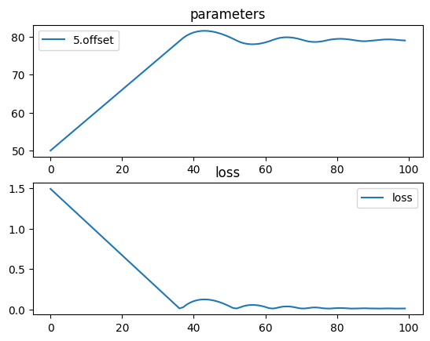

# Moving a lens to focus


```python
import torch
import torch.nn as nn
import torchlensmaker as tlm
import torch.optim as optim

surface = tlm.surfaces.Parabola(diameter=15, a=0.006)

x = tlm.parameter(50)

optics = nn.Sequential(
    tlm.PointSourceAtInfinity(beam_diameter=18.5),
    tlm.Gap(10),
    tlm.RefractiveSurface(surface, material="BK7-nd", anchors=("origin", "extent")),
    tlm.Gap(2),
    tlm.RefractiveSurface(
        surface, material="air", scale=-1, anchors=("extent", "origin")
    ),
    tlm.Gap(x),
    tlm.FocalPoint(),
)


tlm.show(optics, dim=2)
tlm.show(optics, dim=3)
```


<div data-jp-suppress-context-menu id='tlmviewer-24a542b3' class='tlmviewer' style='width: 100%; aspect-ratio: 16 / 9;'></div><script type='module'>async function importtlm() {
    try {
        return await import("/tlmviewer.js");
    } catch (error) {
        console.log("error", error);
        return await import("/files/test_notebooks/tlmviewer.js");
    }
}

const module = await importtlm();
const tlmviewer = module.tlmviewer;

const data = '{"mode": "2D", "camera": "XY", "data": [{"type": "surfaces", "data": [{"matrix": [[1.0, 0.0, 10.0], [0.0, 1.0, 0.0], [0.0, 0.0, 1.0]], "samples": [[0.33750001, -7.5], [0.33071625, -7.4242425], [0.3240014, -7.34848499], [0.31735539, -7.27272749], [0.31077823, -7.19696951], [0.30426997, -7.12121201], [0.29783058, -7.0454545], [0.29146007, -6.969697], [0.28515843, -6.8939395], [0.27892563, -6.81818199], [0.2727617, -6.74242401], [0.26666665, -6.66666651], [0.2606405, -6.590909], [0.2546832, -6.5151515], [0.24879476, -6.439394], [0.24297522, -6.36363649], [0.23722453, -6.28787899], [0.23154268, -6.21212101], [0.22592974, -6.13636351], [0.22038567, -6.060606], [0.21491048, -5.9848485], [0.20950413, -5.909091], [0.20416668, -5.83333349], [0.19889806, -5.75757551], [0.19369833, -5.68181801], [0.18856749, -5.6060605], [0.18350551, -5.530303], [0.17851239, -5.4545455], [0.17358816, -5.37878799], [0.16873276, -5.30303001], [0.16394627, -5.22727251], [0.15922864, -5.15151501], [0.15457988, -5.0757575], [0.15000001, -5.0], [0.14548898, -4.9242425], [0.14104684, -4.84848499], [0.13667354, -4.77272701], [0.13236915, -4.69696951], [0.12813361, -4.62121201], [0.12396693, -4.5454545], [0.11986915, -4.469697], [0.11584022, -4.3939395], [0.11188015, -4.31818151], [0.10798897, -4.24242401], [0.10416666, -4.16666651], [0.10041322, -4.090909], [0.09672865, -4.0151515], [0.09311295, -3.93939376], [0.08956611, -3.86363626], [0.08608815, -3.78787875], [0.08267906, -3.71212125], [0.07933885, -3.63636374], [0.0760675, -3.56060624], [0.07286502, -3.4848485], [0.06973141, -3.409091], [0.06666668, -3.33333349], [0.0636708, -3.25757575], [0.06074381, -3.18181825], [0.05788568, -3.10606074], [0.05509642, -3.030303], [0.05237603, -2.9545455], [0.04972452, -2.87878799], [0.04714188, -2.80303049], [0.0446281, -2.72727275], [0.0421832, -2.65151525], [0.03980717, -2.57575774], [0.0375, -2.5], [0.03526171, -2.4242425], [0.03309229, -2.34848499], [0.03099173, -2.27272725], [0.02896005, -2.19696975], [0.02699725, -2.12121224], [0.0251033, -2.0454545], [0.02327824, -1.969697], [0.02152204, -1.8939395], [0.01983471, -1.81818187], [0.01821625, -1.74242425], [0.01666667, -1.66666675], [0.01518595, -1.59090912], [0.0137741, -1.5151515], [0.01243113, -1.439394], [0.01115702, -1.36363637], [0.00995179, -1.28787887], [0.00881543, -1.21212125], [0.00774793, -1.13636363], [0.00674931, -1.06060612], [0.00581956, -0.9848485], [0.00495868, -0.90909094], [0.00416667, -0.83333337], [0.00344353, -0.75757575], [0.00278926, -0.68181819], [0.00220386, -0.60606062], [0.00168733, -0.53030306], [0.00123967, -0.45454547], [0.00086088, -0.37878788], [0.00055096, -0.30303031], [0.00030992, -0.22727273], [0.00013774, -0.15151516], [3.444e-05, -0.07575758], [0.0, 0.0], [3.444e-05, 0.07575758], [0.00013774, 0.15151516], [0.00030992, 0.22727273], [0.00055096, 0.30303031], [0.00086088, 0.37878788], [0.00123967, 0.45454547], [0.00168733, 0.53030306], [0.00220386, 0.60606062], [0.00278926, 0.68181819], [0.00344353, 0.75757575], [0.00416667, 0.83333337], [0.00495868, 0.90909094], [0.00581956, 0.9848485], [0.00674931, 1.06060612], [0.00774793, 1.13636363], [0.00881543, 1.21212125], [0.00995179, 1.28787887], [0.01115702, 1.36363637], [0.01243113, 1.439394], [0.0137741, 1.5151515], [0.01518595, 1.59090912], [0.01666667, 1.66666675], [0.01821625, 1.74242425], [0.01983471, 1.81818187], [0.02152204, 1.8939395], [0.02327824, 1.969697], [0.0251033, 2.0454545], [0.02699725, 2.12121224], [0.02896005, 2.19696975], [0.03099173, 2.27272725], [0.03309229, 2.34848499], [0.03526171, 2.4242425], [0.0375, 2.5], [0.03980717, 2.57575774], [0.0421832, 2.65151525], [0.0446281, 2.72727275], [0.04714188, 2.80303049], [0.04972452, 2.87878799], [0.05237603, 2.9545455], [0.05509642, 3.030303], [0.05788568, 3.10606074], [0.06074381, 3.18181825], [0.0636708, 3.25757575], [0.06666668, 3.33333349], [0.06973141, 3.409091], [0.07286502, 3.4848485], [0.0760675, 3.56060624], [0.07933885, 3.63636374], [0.08267906, 3.71212125], [0.08608815, 3.78787875], [0.08956611, 3.86363626], [0.09311295, 3.93939376], [0.09672865, 4.0151515], [0.10041322, 4.090909], [0.10416666, 4.16666651], [0.10798897, 4.24242401], [0.11188015, 4.31818151], [0.11584022, 4.3939395], [0.11986915, 4.469697], [0.12396693, 4.5454545], [0.12813361, 4.62121201], [0.13236915, 4.69696951], [0.13667354, 4.77272701], [0.14104684, 4.84848499], [0.14548898, 4.9242425], [0.15000001, 5.0], [0.15457988, 5.0757575], [0.15922864, 5.15151501], [0.16394627, 5.22727251], [0.16873276, 5.30303001], [0.17358816, 5.37878799], [0.17851239, 5.4545455], [0.18350551, 5.530303], [0.18856749, 5.6060605], [0.19369833, 5.68181801], [0.19889806, 5.75757551], [0.20416668, 5.83333349], [0.20950413, 5.909091], [0.21491048, 5.9848485], [0.22038567, 6.060606], [0.22592974, 6.13636351], [0.23154268, 6.21212101], [0.23722453, 6.28787899], [0.24297522, 6.36363649], [0.24879476, 6.439394], [0.2546832, 6.5151515], [0.2606405, 6.590909], [0.26666665, 6.66666651], [0.2727617, 6.74242401], [0.27892563, 6.81818199], [0.28515843, 6.8939395], [0.29146007, 6.969697], [0.29783058, 7.0454545], [0.30426997, 7.12121201], [0.31077823, 7.19696951], [0.31735539, 7.27272749], [0.3240014, 7.34848499], [0.33071625, 7.4242425], [0.33750001, 7.5]]}]}, {"type": "surfaces", "data": [{"matrix": [[-1.0, 0.0, 12.675], [0.0, -1.0, 0.0], [0.0, 0.0, 1.0]], "samples": [[0.33750001, -7.5], [0.33071625, -7.4242425], [0.3240014, -7.34848499], [0.31735539, -7.27272749], [0.31077823, -7.19696951], [0.30426997, -7.12121201], [0.29783058, -7.0454545], [0.29146007, -6.969697], [0.28515843, -6.8939395], [0.27892563, -6.81818199], [0.2727617, -6.74242401], [0.26666665, -6.66666651], [0.2606405, -6.590909], [0.2546832, -6.5151515], [0.24879476, -6.439394], [0.24297522, -6.36363649], [0.23722453, -6.28787899], [0.23154268, -6.21212101], [0.22592974, -6.13636351], [0.22038567, -6.060606], [0.21491048, -5.9848485], [0.20950413, -5.909091], [0.20416668, -5.83333349], [0.19889806, -5.75757551], [0.19369833, -5.68181801], [0.18856749, -5.6060605], [0.18350551, -5.530303], [0.17851239, -5.4545455], [0.17358816, -5.37878799], [0.16873276, -5.30303001], [0.16394627, -5.22727251], [0.15922864, -5.15151501], [0.15457988, -5.0757575], [0.15000001, -5.0], [0.14548898, -4.9242425], [0.14104684, -4.84848499], [0.13667354, -4.77272701], [0.13236915, -4.69696951], [0.12813361, -4.62121201], [0.12396693, -4.5454545], [0.11986915, -4.469697], [0.11584022, -4.3939395], [0.11188015, -4.31818151], [0.10798897, -4.24242401], [0.10416666, -4.16666651], [0.10041322, -4.090909], [0.09672865, -4.0151515], [0.09311295, -3.93939376], [0.08956611, -3.86363626], [0.08608815, -3.78787875], [0.08267906, -3.71212125], [0.07933885, -3.63636374], [0.0760675, -3.56060624], [0.07286502, -3.4848485], [0.06973141, -3.409091], [0.06666668, -3.33333349], [0.0636708, -3.25757575], [0.06074381, -3.18181825], [0.05788568, -3.10606074], [0.05509642, -3.030303], [0.05237603, -2.9545455], [0.04972452, -2.87878799], [0.04714188, -2.80303049], [0.0446281, -2.72727275], [0.0421832, -2.65151525], [0.03980717, -2.57575774], [0.0375, -2.5], [0.03526171, -2.4242425], [0.03309229, -2.34848499], [0.03099173, -2.27272725], [0.02896005, -2.19696975], [0.02699725, -2.12121224], [0.0251033, -2.0454545], [0.02327824, -1.969697], [0.02152204, -1.8939395], [0.01983471, -1.81818187], [0.01821625, -1.74242425], [0.01666667, -1.66666675], [0.01518595, -1.59090912], [0.0137741, -1.5151515], [0.01243113, -1.439394], [0.01115702, -1.36363637], [0.00995179, -1.28787887], [0.00881543, -1.21212125], [0.00774793, -1.13636363], [0.00674931, -1.06060612], [0.00581956, -0.9848485], [0.00495868, -0.90909094], [0.00416667, -0.83333337], [0.00344353, -0.75757575], [0.00278926, -0.68181819], [0.00220386, -0.60606062], [0.00168733, -0.53030306], [0.00123967, -0.45454547], [0.00086088, -0.37878788], [0.00055096, -0.30303031], [0.00030992, -0.22727273], [0.00013774, -0.15151516], [3.444e-05, -0.07575758], [0.0, 0.0], [3.444e-05, 0.07575758], [0.00013774, 0.15151516], [0.00030992, 0.22727273], [0.00055096, 0.30303031], [0.00086088, 0.37878788], [0.00123967, 0.45454547], [0.00168733, 0.53030306], [0.00220386, 0.60606062], [0.00278926, 0.68181819], [0.00344353, 0.75757575], [0.00416667, 0.83333337], [0.00495868, 0.90909094], [0.00581956, 0.9848485], [0.00674931, 1.06060612], [0.00774793, 1.13636363], [0.00881543, 1.21212125], [0.00995179, 1.28787887], [0.01115702, 1.36363637], [0.01243113, 1.439394], [0.0137741, 1.5151515], [0.01518595, 1.59090912], [0.01666667, 1.66666675], [0.01821625, 1.74242425], [0.01983471, 1.81818187], [0.02152204, 1.8939395], [0.02327824, 1.969697], [0.0251033, 2.0454545], [0.02699725, 2.12121224], [0.02896005, 2.19696975], [0.03099173, 2.27272725], [0.03309229, 2.34848499], [0.03526171, 2.4242425], [0.0375, 2.5], [0.03980717, 2.57575774], [0.0421832, 2.65151525], [0.0446281, 2.72727275], [0.04714188, 2.80303049], [0.04972452, 2.87878799], [0.05237603, 2.9545455], [0.05509642, 3.030303], [0.05788568, 3.10606074], [0.06074381, 3.18181825], [0.0636708, 3.25757575], [0.06666668, 3.33333349], [0.06973141, 3.409091], [0.07286502, 3.4848485], [0.0760675, 3.56060624], [0.07933885, 3.63636374], [0.08267906, 3.71212125], [0.08608815, 3.78787875], [0.08956611, 3.86363626], [0.09311295, 3.93939376], [0.09672865, 4.0151515], [0.10041322, 4.090909], [0.10416666, 4.16666651], [0.10798897, 4.24242401], [0.11188015, 4.31818151], [0.11584022, 4.3939395], [0.11986915, 4.469697], [0.12396693, 4.5454545], [0.12813361, 4.62121201], [0.13236915, 4.69696951], [0.13667354, 4.77272701], [0.14104684, 4.84848499], [0.14548898, 4.9242425], [0.15000001, 5.0], [0.15457988, 5.0757575], [0.15922864, 5.15151501], [0.16394627, 5.22727251], [0.16873276, 5.30303001], [0.17358816, 5.37878799], [0.17851239, 5.4545455], [0.18350551, 5.530303], [0.18856749, 5.6060605], [0.19369833, 5.68181801], [0.19889806, 5.75757551], [0.20416668, 5.83333349], [0.20950413, 5.909091], [0.21491048, 5.9848485], [0.22038567, 6.060606], [0.22592974, 6.13636351], [0.23154268, 6.21212101], [0.23722453, 6.28787899], [0.24297522, 6.36363649], [0.24879476, 6.439394], [0.2546832, 6.5151515], [0.2606405, 6.590909], [0.26666665, 6.66666651], [0.2727617, 6.74242401], [0.27892563, 6.81818199], [0.28515843, 6.8939395], [0.29146007, 6.969697], [0.29783058, 7.0454545], [0.30426997, 7.12121201], [0.31077823, 7.19696951], [0.31735539, 7.27272749], [0.3240014, 7.34848499], [0.33071625, 7.4242425], [0.33750001, 7.5]]}]}, {"type": "points", "data": [[62.675, 0.0]], "color": "red"}, {"type": "rays", "points": [[0.0, -7.19444444, 10.31056019, -7.19444444], [0.0, -5.13888889, 10.15844907, -5.13888889], [0.0, -3.08333333, 10.05704167, -3.08333333], [0.0, -1.02777778, 10.00633796, -1.02777778], [0.0, 1.02777778, 10.00633796, 1.02777778], [0.0, 3.08333333, 10.05704167, 3.08333333], [0.0, 5.13888889, 10.15844907, 5.13888889], [0.0, 7.19444444, 10.31056019, 7.19444444]], "color": "#ffa724", "variables": {"base": [-7.19444444, -5.13888889, -3.08333333, -1.02777778, 1.02777778, 3.08333333, 5.13888889, 7.19444444]}, "domain": {"base": [-9.25, 9.25]}, "layers": [1]}, {"type": "rays", "points": [[0.0, -9.25, 10.0, -9.25], [0.0, 9.25, 10.0, 9.25]], "color": "red", "variables": {"base": [-9.25, 9.25]}, "domain": {"base": [-9.25, 9.25]}, "layers": [2]}, {"type": "rays", "points": [[10.31056019, -7.19444444, 12.36967022, -7.13360338], [10.15844907, -5.13888889, 12.51961029, -5.08903569], [10.05704167, -3.08333333, 12.61915327, -3.05086683], [10.00633796, -1.02777778, 12.6688, -1.0165302], [10.00633796, 1.02777778, 12.6688, 1.0165302], [10.05704167, 3.08333333, 12.61915327, 3.05086683], [10.15844907, 5.13888889, 12.51961029, 5.08903569], [10.31056019, 7.19444444, 12.36967022, 7.13360338]], "color": "#ffa724", "variables": {"base": [-7.19444444, -5.13888889, -3.08333333, -1.02777778, 1.02777778, 3.08333333, 5.13888889, 7.19444444]}, "domain": {"base": [-9.25, 9.25]}, "layers": [1]}, {"type": "rays", "points": [[12.36967022, -7.13360338, 62.97295967, -2.57053444], [12.51961029, -5.08903569, 62.8290792, -1.86122854], [12.61915327, -3.05086683, 62.73096179, -1.12674965], [12.6688, -1.0165302, 62.68124536, -0.37724804], [12.6688, 1.0165302, 62.68124536, 0.37724804], [12.61915327, 3.05086683, 62.73096179, 1.12674965], [12.51961029, 5.08903569, 62.8290792, 1.86122854], [12.36967022, 7.13360338, 62.97295967, 2.57053444]], "color": "#ffa724", "variables": {"base": [-7.19444444, -5.13888889, -3.08333333, -1.02777778, 1.02777778, 3.08333333, 5.13888889, 7.19444444]}, "domain": {"base": [-9.25, 9.25]}}, {"type": "points", "data": [[0.0, 0.0], [10.0, 0.0], [10.3375, 0.0], [12.3375, 0.0], [12.675, 0.0], [62.675, 0.0]], "layers": [4]}]}';

tlmviewer.embed(document.getElementById("tlmviewer-24a542b3"), data);    
</script>


<div data-jp-suppress-context-menu id='tlmviewer-13bd3f73' class='tlmviewer' style='width: 100%; aspect-ratio: 16 / 9;'></div><script type='module'>async function importtlm() {
    try {
        return await import("/tlmviewer.js");
    } catch (error) {
        console.log("error", error);
        return await import("/files/test_notebooks/tlmviewer.js");
    }
}

const module = await importtlm();
const tlmviewer = module.tlmviewer;

const data = '{"mode": "3D", "camera": "orthographic", "data": [{"type": "surfaces", "data": [{"matrix": [[1.0, 0.0, 0.0, 10.0], [0.0, 1.0, 0.0, 0.0], [0.0, 0.0, 1.0, 0.0], [0.0, 0.0, 0.0, 1.0]], "samples": [[0.0, 0.0], [3.444e-05, 0.07575758], [0.00013774, 0.15151516], [0.00030992, 0.22727273], [0.00055096, 0.30303031], [0.00086088, 0.37878788], [0.00123967, 0.45454547], [0.00168733, 0.53030306], [0.00220386, 0.60606062], [0.00278926, 0.68181819], [0.00344353, 0.75757575], [0.00416667, 0.83333337], [0.00495868, 0.90909094], [0.00581956, 0.9848485], [0.00674931, 1.06060612], [0.00774793, 1.13636363], [0.00881543, 1.21212125], [0.00995179, 1.28787887], [0.01115702, 1.36363637], [0.01243113, 1.439394], [0.0137741, 1.5151515], [0.01518595, 1.59090912], [0.01666667, 1.66666675], [0.01821625, 1.74242425], [0.01983471, 1.81818187], [0.02152204, 1.8939395], [0.02327824, 1.969697], [0.0251033, 2.0454545], [0.02699725, 2.12121224], [0.02896005, 2.19696975], [0.03099173, 2.27272725], [0.03309229, 2.34848499], [0.03526171, 2.4242425], [0.0375, 2.5], [0.03980717, 2.57575774], [0.0421832, 2.65151525], [0.0446281, 2.72727275], [0.04714188, 2.80303049], [0.04972452, 2.87878799], [0.05237603, 2.9545455], [0.05509642, 3.030303], [0.05788568, 3.10606074], [0.06074381, 3.18181825], [0.0636708, 3.25757575], [0.06666668, 3.33333349], [0.06973141, 3.409091], [0.07286502, 3.4848485], [0.0760675, 3.56060624], [0.07933885, 3.63636374], [0.08267906, 3.71212125], [0.08608815, 3.78787875], [0.08956611, 3.86363626], [0.09311295, 3.93939376], [0.09672865, 4.0151515], [0.10041322, 4.090909], [0.10416666, 4.16666651], [0.10798897, 4.24242401], [0.11188015, 4.31818151], [0.11584022, 4.3939395], [0.11986915, 4.469697], [0.12396693, 4.5454545], [0.12813361, 4.62121201], [0.13236915, 4.69696951], [0.13667354, 4.77272701], [0.14104684, 4.84848499], [0.14548898, 4.9242425], [0.15000001, 5.0], [0.15457988, 5.0757575], [0.15922864, 5.15151501], [0.16394627, 5.22727251], [0.16873276, 5.30303001], [0.17358816, 5.37878799], [0.17851239, 5.4545455], [0.18350551, 5.530303], [0.18856749, 5.6060605], [0.19369833, 5.68181801], [0.19889806, 5.75757551], [0.20416668, 5.83333349], [0.20950413, 5.909091], [0.21491048, 5.9848485], [0.22038567, 6.060606], [0.22592974, 6.13636351], [0.23154268, 6.21212101], [0.23722453, 6.28787899], [0.24297522, 6.36363649], [0.24879476, 6.439394], [0.2546832, 6.5151515], [0.2606405, 6.590909], [0.26666665, 6.66666651], [0.2727617, 6.74242401], [0.27892563, 6.81818199], [0.28515843, 6.8939395], [0.29146007, 6.969697], [0.29783058, 7.0454545], [0.30426997, 7.12121201], [0.31077823, 7.19696951], [0.31735539, 7.27272749], [0.3240014, 7.34848499], [0.33071625, 7.4242425], [0.33750001, 7.5]]}]}, {"type": "surfaces", "data": [{"matrix": [[-1.0, 0.0, 0.0, 12.675], [0.0, -1.0, 0.0, 0.0], [0.0, 0.0, -1.0, 0.0], [0.0, 0.0, 0.0, 1.0]], "samples": [[0.0, 0.0], [3.444e-05, 0.07575758], [0.00013774, 0.15151516], [0.00030992, 0.22727273], [0.00055096, 0.30303031], [0.00086088, 0.37878788], [0.00123967, 0.45454547], [0.00168733, 0.53030306], [0.00220386, 0.60606062], [0.00278926, 0.68181819], [0.00344353, 0.75757575], [0.00416667, 0.83333337], [0.00495868, 0.90909094], [0.00581956, 0.9848485], [0.00674931, 1.06060612], [0.00774793, 1.13636363], [0.00881543, 1.21212125], [0.00995179, 1.28787887], [0.01115702, 1.36363637], [0.01243113, 1.439394], [0.0137741, 1.5151515], [0.01518595, 1.59090912], [0.01666667, 1.66666675], [0.01821625, 1.74242425], [0.01983471, 1.81818187], [0.02152204, 1.8939395], [0.02327824, 1.969697], [0.0251033, 2.0454545], [0.02699725, 2.12121224], [0.02896005, 2.19696975], [0.03099173, 2.27272725], [0.03309229, 2.34848499], [0.03526171, 2.4242425], [0.0375, 2.5], [0.03980717, 2.57575774], [0.0421832, 2.65151525], [0.0446281, 2.72727275], [0.04714188, 2.80303049], [0.04972452, 2.87878799], [0.05237603, 2.9545455], [0.05509642, 3.030303], [0.05788568, 3.10606074], [0.06074381, 3.18181825], [0.0636708, 3.25757575], [0.06666668, 3.33333349], [0.06973141, 3.409091], [0.07286502, 3.4848485], [0.0760675, 3.56060624], [0.07933885, 3.63636374], [0.08267906, 3.71212125], [0.08608815, 3.78787875], [0.08956611, 3.86363626], [0.09311295, 3.93939376], [0.09672865, 4.0151515], [0.10041322, 4.090909], [0.10416666, 4.16666651], [0.10798897, 4.24242401], [0.11188015, 4.31818151], [0.11584022, 4.3939395], [0.11986915, 4.469697], [0.12396693, 4.5454545], [0.12813361, 4.62121201], [0.13236915, 4.69696951], [0.13667354, 4.77272701], [0.14104684, 4.84848499], [0.14548898, 4.9242425], [0.15000001, 5.0], [0.15457988, 5.0757575], [0.15922864, 5.15151501], [0.16394627, 5.22727251], [0.16873276, 5.30303001], [0.17358816, 5.37878799], [0.17851239, 5.4545455], [0.18350551, 5.530303], [0.18856749, 5.6060605], [0.19369833, 5.68181801], [0.19889806, 5.75757551], [0.20416668, 5.83333349], [0.20950413, 5.909091], [0.21491048, 5.9848485], [0.22038567, 6.060606], [0.22592974, 6.13636351], [0.23154268, 6.21212101], [0.23722453, 6.28787899], [0.24297522, 6.36363649], [0.24879476, 6.439394], [0.2546832, 6.5151515], [0.2606405, 6.590909], [0.26666665, 6.66666651], [0.2727617, 6.74242401], [0.27892563, 6.81818199], [0.28515843, 6.8939395], [0.29146007, 6.969697], [0.29783058, 7.0454545], [0.30426997, 7.12121201], [0.31077823, 7.19696951], [0.31735539, 7.27272749], [0.3240014, 7.34848499], [0.33071625, 7.4242425], [0.33750001, 7.5]]}]}, {"type": "points", "data": [[62.675, 0.0, 0.0]], "color": "red"}, {"type": "rays", "points": [[0.0, 0.0, 0.0, 10.0, 0.0, 0.0], [0.0, -0.0, 0.0, 10.0, 0.0, 0.0], [0.0, 0.0, -0.0, 10.0, 0.0, 0.0], [0.0, 4.625, 0.0, 10.12834375, 4.625, 0.0], [0.0, -4.625, 0.0, 10.12834375, -4.625, 0.0], [0.0, 4.625, -0.0, 10.12834375, 4.625, -0.0]], "color": "#ffa724", "variables": {}, "domain": {"base": [-9.25, 9.25]}, "layers": [1]}, {"type": "rays", "points": [[0.0, 9.25, 0.0, 10.0, 9.25, 0.0], [0.0, -9.25, 0.0, 10.0, -9.25, 0.0], [0.0, 9.25, -0.0, 10.0, 9.25, -0.0]], "color": "red", "variables": {}, "domain": {"base": [-9.25, 9.25]}, "layers": [2]}, {"type": "rays", "points": [[10.0, 0.0, 0.0, 12.675, 0.0, 0.0], [10.0, 0.0, 0.0, 12.675, 0.0, 0.0], [10.0, 0.0, 0.0, 12.675, 0.0, 0.0], [10.12834375, 4.625, 0.0, 12.54919688, 4.57899409, 0.0], [10.12834375, -4.625, 0.0, 12.54919688, -4.57899409, 0.0], [10.12834375, 4.625, -0.0, 12.54919688, 4.57899409, -0.0]], "color": "#ffa724", "variables": {}, "domain": {"base": [-9.25, 9.25]}, "layers": [1]}, {"type": "rays", "points": [[12.675, 0.0, 0.0, 62.675, 0.0, 0.0], [12.675, 0.0, 0.0, 62.675, 0.0, 0.0], [12.675, 0.0, 0.0, 62.675, 0.0, 0.0], [12.54919688, 4.57899409, 0.0, 62.8001338, 1.67956937, 0.0], [12.54919688, -4.57899409, 0.0, 62.8001338, -1.67956937, 0.0], [12.54919688, 4.57899409, -0.0, 62.8001338, 1.67956937, -0.0]], "color": "#ffa724", "variables": {}, "domain": {"base": [-9.25, 9.25]}}, {"type": "points", "data": [[0.0, 0.0, 0.0], [10.0, 0.0, 0.0], [10.3375, 0.0, 0.0], [12.3375, 0.0, 0.0], [12.675, 0.0, 0.0], [62.675, 0.0, 0.0]], "layers": [4]}]}';

tlmviewer.embed(document.getElementById("tlmviewer-13bd3f73"), data);    
</script>


```python
tlm.optimize(
    optics,
    optimizer = optim.Adam(optics.parameters(), lr=.8),
    sampling = {"base": 10},
    dim = 2,
    num_iter = 100
).plot()
```

    [  1/100] L=  1.490 | grad norm= 0.051246499211843585
    [  6/100] L=  1.285 | grad norm= 0.051246499211843585
    [ 11/100] L=  1.080 | grad norm= 0.051246499211843585
    [ 16/100] L=  0.875 | grad norm= 0.051246499211843585
    [ 21/100] L=  0.670 | grad norm= 0.051246499211843585
    [ 26/100] L=  0.465 | grad norm= 0.051246499211843585
    [ 31/100] L=  0.260 | grad norm= 0.051246499211843585
    [ 36/100] L=  0.055 | grad norm= 0.051246499211843585
    [ 41/100] L=  0.103 | grad norm= 0.051246499211843585
    [ 46/100] L=  0.117 | grad norm= 0.051246499211843585
    [ 51/100] L=  0.040 | grad norm= 0.051246499211843585
    [ 56/100] L=  0.052 | grad norm= 0.051246499211843585
    [ 61/100] L=  0.032 | grad norm= 0.051246499211843585
    [ 66/100] L=  0.036 | grad norm= 0.051246499211843585
    [ 71/100] L=  0.013 | grad norm= 0.025671685539087226
    [ 76/100] L=  0.023 | grad norm= 0.051246499211843585
    [ 81/100] L=  0.017 | grad norm= 0.025671685539087226
    [ 86/100] L=  0.012 | grad norm= 0.006342011105652322
    [ 91/100] L=  0.013 | grad norm= 0.006342011105652322
    [ 96/100] L=  0.013 | grad norm= 0.025671685539087226
    [100/100] L=  0.013 | grad norm= 0.006342011105652322


    

    


```python
tlm.show(optics, dim=2)
```


<div data-jp-suppress-context-menu id='tlmviewer-6954e316' class='tlmviewer' style='width: 100%; aspect-ratio: 16 / 9;'></div><script type='module'>async function importtlm() {
    try {
        return await import("/tlmviewer.js");
    } catch (error) {
        console.log("error", error);
        return await import("/files/test_notebooks/tlmviewer.js");
    }
}

const module = await importtlm();
const tlmviewer = module.tlmviewer;

const data = '{"mode": "2D", "camera": "XY", "data": [{"type": "surfaces", "data": [{"matrix": [[1.0, 0.0, 10.0], [0.0, 1.0, 0.0], [0.0, 0.0, 1.0]], "samples": [[0.33750001, -7.5], [0.33071625, -7.4242425], [0.3240014, -7.34848499], [0.31735539, -7.27272749], [0.31077823, -7.19696951], [0.30426997, -7.12121201], [0.29783058, -7.0454545], [0.29146007, -6.969697], [0.28515843, -6.8939395], [0.27892563, -6.81818199], [0.2727617, -6.74242401], [0.26666665, -6.66666651], [0.2606405, -6.590909], [0.2546832, -6.5151515], [0.24879476, -6.439394], [0.24297522, -6.36363649], [0.23722453, -6.28787899], [0.23154268, -6.21212101], [0.22592974, -6.13636351], [0.22038567, -6.060606], [0.21491048, -5.9848485], [0.20950413, -5.909091], [0.20416668, -5.83333349], [0.19889806, -5.75757551], [0.19369833, -5.68181801], [0.18856749, -5.6060605], [0.18350551, -5.530303], [0.17851239, -5.4545455], [0.17358816, -5.37878799], [0.16873276, -5.30303001], [0.16394627, -5.22727251], [0.15922864, -5.15151501], [0.15457988, -5.0757575], [0.15000001, -5.0], [0.14548898, -4.9242425], [0.14104684, -4.84848499], [0.13667354, -4.77272701], [0.13236915, -4.69696951], [0.12813361, -4.62121201], [0.12396693, -4.5454545], [0.11986915, -4.469697], [0.11584022, -4.3939395], [0.11188015, -4.31818151], [0.10798897, -4.24242401], [0.10416666, -4.16666651], [0.10041322, -4.090909], [0.09672865, -4.0151515], [0.09311295, -3.93939376], [0.08956611, -3.86363626], [0.08608815, -3.78787875], [0.08267906, -3.71212125], [0.07933885, -3.63636374], [0.0760675, -3.56060624], [0.07286502, -3.4848485], [0.06973141, -3.409091], [0.06666668, -3.33333349], [0.0636708, -3.25757575], [0.06074381, -3.18181825], [0.05788568, -3.10606074], [0.05509642, -3.030303], [0.05237603, -2.9545455], [0.04972452, -2.87878799], [0.04714188, -2.80303049], [0.0446281, -2.72727275], [0.0421832, -2.65151525], [0.03980717, -2.57575774], [0.0375, -2.5], [0.03526171, -2.4242425], [0.03309229, -2.34848499], [0.03099173, -2.27272725], [0.02896005, -2.19696975], [0.02699725, -2.12121224], [0.0251033, -2.0454545], [0.02327824, -1.969697], [0.02152204, -1.8939395], [0.01983471, -1.81818187], [0.01821625, -1.74242425], [0.01666667, -1.66666675], [0.01518595, -1.59090912], [0.0137741, -1.5151515], [0.01243113, -1.439394], [0.01115702, -1.36363637], [0.00995179, -1.28787887], [0.00881543, -1.21212125], [0.00774793, -1.13636363], [0.00674931, -1.06060612], [0.00581956, -0.9848485], [0.00495868, -0.90909094], [0.00416667, -0.83333337], [0.00344353, -0.75757575], [0.00278926, -0.68181819], [0.00220386, -0.60606062], [0.00168733, -0.53030306], [0.00123967, -0.45454547], [0.00086088, -0.37878788], [0.00055096, -0.30303031], [0.00030992, -0.22727273], [0.00013774, -0.15151516], [3.444e-05, -0.07575758], [0.0, 0.0], [3.444e-05, 0.07575758], [0.00013774, 0.15151516], [0.00030992, 0.22727273], [0.00055096, 0.30303031], [0.00086088, 0.37878788], [0.00123967, 0.45454547], [0.00168733, 0.53030306], [0.00220386, 0.60606062], [0.00278926, 0.68181819], [0.00344353, 0.75757575], [0.00416667, 0.83333337], [0.00495868, 0.90909094], [0.00581956, 0.9848485], [0.00674931, 1.06060612], [0.00774793, 1.13636363], [0.00881543, 1.21212125], [0.00995179, 1.28787887], [0.01115702, 1.36363637], [0.01243113, 1.439394], [0.0137741, 1.5151515], [0.01518595, 1.59090912], [0.01666667, 1.66666675], [0.01821625, 1.74242425], [0.01983471, 1.81818187], [0.02152204, 1.8939395], [0.02327824, 1.969697], [0.0251033, 2.0454545], [0.02699725, 2.12121224], [0.02896005, 2.19696975], [0.03099173, 2.27272725], [0.03309229, 2.34848499], [0.03526171, 2.4242425], [0.0375, 2.5], [0.03980717, 2.57575774], [0.0421832, 2.65151525], [0.0446281, 2.72727275], [0.04714188, 2.80303049], [0.04972452, 2.87878799], [0.05237603, 2.9545455], [0.05509642, 3.030303], [0.05788568, 3.10606074], [0.06074381, 3.18181825], [0.0636708, 3.25757575], [0.06666668, 3.33333349], [0.06973141, 3.409091], [0.07286502, 3.4848485], [0.0760675, 3.56060624], [0.07933885, 3.63636374], [0.08267906, 3.71212125], [0.08608815, 3.78787875], [0.08956611, 3.86363626], [0.09311295, 3.93939376], [0.09672865, 4.0151515], [0.10041322, 4.090909], [0.10416666, 4.16666651], [0.10798897, 4.24242401], [0.11188015, 4.31818151], [0.11584022, 4.3939395], [0.11986915, 4.469697], [0.12396693, 4.5454545], [0.12813361, 4.62121201], [0.13236915, 4.69696951], [0.13667354, 4.77272701], [0.14104684, 4.84848499], [0.14548898, 4.9242425], [0.15000001, 5.0], [0.15457988, 5.0757575], [0.15922864, 5.15151501], [0.16394627, 5.22727251], [0.16873276, 5.30303001], [0.17358816, 5.37878799], [0.17851239, 5.4545455], [0.18350551, 5.530303], [0.18856749, 5.6060605], [0.19369833, 5.68181801], [0.19889806, 5.75757551], [0.20416668, 5.83333349], [0.20950413, 5.909091], [0.21491048, 5.9848485], [0.22038567, 6.060606], [0.22592974, 6.13636351], [0.23154268, 6.21212101], [0.23722453, 6.28787899], [0.24297522, 6.36363649], [0.24879476, 6.439394], [0.2546832, 6.5151515], [0.2606405, 6.590909], [0.26666665, 6.66666651], [0.2727617, 6.74242401], [0.27892563, 6.81818199], [0.28515843, 6.8939395], [0.29146007, 6.969697], [0.29783058, 7.0454545], [0.30426997, 7.12121201], [0.31077823, 7.19696951], [0.31735539, 7.27272749], [0.3240014, 7.34848499], [0.33071625, 7.4242425], [0.33750001, 7.5]]}]}, {"type": "surfaces", "data": [{"matrix": [[-1.0, 0.0, 12.675], [0.0, -1.0, 0.0], [0.0, 0.0, 1.0]], "samples": [[0.33750001, -7.5], [0.33071625, -7.4242425], [0.3240014, -7.34848499], [0.31735539, -7.27272749], [0.31077823, -7.19696951], [0.30426997, -7.12121201], [0.29783058, -7.0454545], [0.29146007, -6.969697], [0.28515843, -6.8939395], [0.27892563, -6.81818199], [0.2727617, -6.74242401], [0.26666665, -6.66666651], [0.2606405, -6.590909], [0.2546832, -6.5151515], [0.24879476, -6.439394], [0.24297522, -6.36363649], [0.23722453, -6.28787899], [0.23154268, -6.21212101], [0.22592974, -6.13636351], [0.22038567, -6.060606], [0.21491048, -5.9848485], [0.20950413, -5.909091], [0.20416668, -5.83333349], [0.19889806, -5.75757551], [0.19369833, -5.68181801], [0.18856749, -5.6060605], [0.18350551, -5.530303], [0.17851239, -5.4545455], [0.17358816, -5.37878799], [0.16873276, -5.30303001], [0.16394627, -5.22727251], [0.15922864, -5.15151501], [0.15457988, -5.0757575], [0.15000001, -5.0], [0.14548898, -4.9242425], [0.14104684, -4.84848499], [0.13667354, -4.77272701], [0.13236915, -4.69696951], [0.12813361, -4.62121201], [0.12396693, -4.5454545], [0.11986915, -4.469697], [0.11584022, -4.3939395], [0.11188015, -4.31818151], [0.10798897, -4.24242401], [0.10416666, -4.16666651], [0.10041322, -4.090909], [0.09672865, -4.0151515], [0.09311295, -3.93939376], [0.08956611, -3.86363626], [0.08608815, -3.78787875], [0.08267906, -3.71212125], [0.07933885, -3.63636374], [0.0760675, -3.56060624], [0.07286502, -3.4848485], [0.06973141, -3.409091], [0.06666668, -3.33333349], [0.0636708, -3.25757575], [0.06074381, -3.18181825], [0.05788568, -3.10606074], [0.05509642, -3.030303], [0.05237603, -2.9545455], [0.04972452, -2.87878799], [0.04714188, -2.80303049], [0.0446281, -2.72727275], [0.0421832, -2.65151525], [0.03980717, -2.57575774], [0.0375, -2.5], [0.03526171, -2.4242425], [0.03309229, -2.34848499], [0.03099173, -2.27272725], [0.02896005, -2.19696975], [0.02699725, -2.12121224], [0.0251033, -2.0454545], [0.02327824, -1.969697], [0.02152204, -1.8939395], [0.01983471, -1.81818187], [0.01821625, -1.74242425], [0.01666667, -1.66666675], [0.01518595, -1.59090912], [0.0137741, -1.5151515], [0.01243113, -1.439394], [0.01115702, -1.36363637], [0.00995179, -1.28787887], [0.00881543, -1.21212125], [0.00774793, -1.13636363], [0.00674931, -1.06060612], [0.00581956, -0.9848485], [0.00495868, -0.90909094], [0.00416667, -0.83333337], [0.00344353, -0.75757575], [0.00278926, -0.68181819], [0.00220386, -0.60606062], [0.00168733, -0.53030306], [0.00123967, -0.45454547], [0.00086088, -0.37878788], [0.00055096, -0.30303031], [0.00030992, -0.22727273], [0.00013774, -0.15151516], [3.444e-05, -0.07575758], [0.0, 0.0], [3.444e-05, 0.07575758], [0.00013774, 0.15151516], [0.00030992, 0.22727273], [0.00055096, 0.30303031], [0.00086088, 0.37878788], [0.00123967, 0.45454547], [0.00168733, 0.53030306], [0.00220386, 0.60606062], [0.00278926, 0.68181819], [0.00344353, 0.75757575], [0.00416667, 0.83333337], [0.00495868, 0.90909094], [0.00581956, 0.9848485], [0.00674931, 1.06060612], [0.00774793, 1.13636363], [0.00881543, 1.21212125], [0.00995179, 1.28787887], [0.01115702, 1.36363637], [0.01243113, 1.439394], [0.0137741, 1.5151515], [0.01518595, 1.59090912], [0.01666667, 1.66666675], [0.01821625, 1.74242425], [0.01983471, 1.81818187], [0.02152204, 1.8939395], [0.02327824, 1.969697], [0.0251033, 2.0454545], [0.02699725, 2.12121224], [0.02896005, 2.19696975], [0.03099173, 2.27272725], [0.03309229, 2.34848499], [0.03526171, 2.4242425], [0.0375, 2.5], [0.03980717, 2.57575774], [0.0421832, 2.65151525], [0.0446281, 2.72727275], [0.04714188, 2.80303049], [0.04972452, 2.87878799], [0.05237603, 2.9545455], [0.05509642, 3.030303], [0.05788568, 3.10606074], [0.06074381, 3.18181825], [0.0636708, 3.25757575], [0.06666668, 3.33333349], [0.06973141, 3.409091], [0.07286502, 3.4848485], [0.0760675, 3.56060624], [0.07933885, 3.63636374], [0.08267906, 3.71212125], [0.08608815, 3.78787875], [0.08956611, 3.86363626], [0.09311295, 3.93939376], [0.09672865, 4.0151515], [0.10041322, 4.090909], [0.10416666, 4.16666651], [0.10798897, 4.24242401], [0.11188015, 4.31818151], [0.11584022, 4.3939395], [0.11986915, 4.469697], [0.12396693, 4.5454545], [0.12813361, 4.62121201], [0.13236915, 4.69696951], [0.13667354, 4.77272701], [0.14104684, 4.84848499], [0.14548898, 4.9242425], [0.15000001, 5.0], [0.15457988, 5.0757575], [0.15922864, 5.15151501], [0.16394627, 5.22727251], [0.16873276, 5.30303001], [0.17358816, 5.37878799], [0.17851239, 5.4545455], [0.18350551, 5.530303], [0.18856749, 5.6060605], [0.19369833, 5.68181801], [0.19889806, 5.75757551], [0.20416668, 5.83333349], [0.20950413, 5.909091], [0.21491048, 5.9848485], [0.22038567, 6.060606], [0.22592974, 6.13636351], [0.23154268, 6.21212101], [0.23722453, 6.28787899], [0.24297522, 6.36363649], [0.24879476, 6.439394], [0.2546832, 6.5151515], [0.2606405, 6.590909], [0.26666665, 6.66666651], [0.2727617, 6.74242401], [0.27892563, 6.81818199], [0.28515843, 6.8939395], [0.29146007, 6.969697], [0.29783058, 7.0454545], [0.30426997, 7.12121201], [0.31077823, 7.19696951], [0.31735539, 7.27272749], [0.3240014, 7.34848499], [0.33071625, 7.4242425], [0.33750001, 7.5]]}]}, {"type": "points", "data": [[91.60040897, 0.0]], "color": "red"}, {"type": "rays", "points": [[0.0, -7.19444444, 10.31056019, -7.19444444], [0.0, -5.13888889, 10.15844907, -5.13888889], [0.0, -3.08333333, 10.05704167, -3.08333333], [0.0, -1.02777778, 10.00633796, -1.02777778], [0.0, 1.02777778, 10.00633796, 1.02777778], [0.0, 3.08333333, 10.05704167, 3.08333333], [0.0, 5.13888889, 10.15844907, 5.13888889], [0.0, 7.19444444, 10.31056019, 7.19444444]], "color": "#ffa724", "variables": {"base": [-7.19444444, -5.13888889, -3.08333333, -1.02777778, 1.02777778, 3.08333333, 5.13888889, 7.19444444]}, "domain": {"base": [-9.25, 9.25]}, "layers": [1]}, {"type": "rays", "points": [[0.0, -9.25, 10.0, -9.25], [0.0, 9.25, 10.0, 9.25]], "color": "red", "variables": {"base": [-9.25, 9.25]}, "domain": {"base": [-9.25, 9.25]}, "layers": [2]}, {"type": "rays", "points": [[10.31056019, -7.19444444, 12.36967022, -7.13360338], [10.15844907, -5.13888889, 12.51961029, -5.08903569], [10.05704167, -3.08333333, 12.61915327, -3.05086683], [10.00633796, -1.02777778, 12.6688, -1.0165302], [10.00633796, 1.02777778, 12.6688, 1.0165302], [10.05704167, 3.08333333, 12.61915327, 3.05086683], [10.15844907, 5.13888889, 12.51961029, 5.08903569], [10.31056019, 7.19444444, 12.36967022, 7.13360338]], "color": "#ffa724", "variables": {"base": [-7.19444444, -5.13888889, -3.08333333, -1.02777778, 1.02777778, 3.08333333, 5.13888889, 7.19444444]}, "domain": {"base": [-9.25, 9.25]}, "layers": [1]}, {"type": "rays", "points": [[12.36967022, -7.13360338, 91.59943483, 0.01081118], [12.51961029, -5.08903569, 91.60138726, -0.01522492], [12.61915327, -3.05086683, 91.60111133, -0.01823746], [12.6688, -1.0165302, 91.60050634, -0.0075887], [12.6688, 1.0165302, 91.60050634, 0.0075887], [12.61915327, 3.05086683, 91.60111133, 0.01823746], [12.51961029, 5.08903569, 91.60138726, 0.01522492], [12.36967022, 7.13360338, 91.59943483, -0.01081118]], "color": "#ffa724", "variables": {"base": [-7.19444444, -5.13888889, -3.08333333, -1.02777778, 1.02777778, 3.08333333, 5.13888889, 7.19444444]}, "domain": {"base": [-9.25, 9.25]}}, {"type": "points", "data": [[0.0, 0.0], [10.0, 0.0], [10.3375, 0.0], [12.3375, 0.0], [12.675, 0.0], [91.60040897, 0.0]], "layers": [4]}]}';

tlmviewer.embed(document.getElementById("tlmviewer-6954e316"), data);    
</script>

